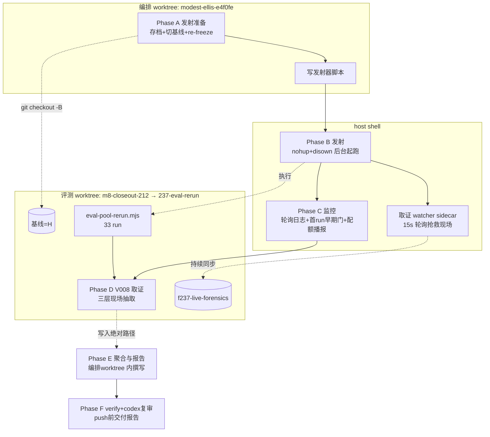

# 实施计划 — F237 V008 修复复测（F216 证据门后全池重跑）

**编排 worktree**：`.claude/worktrees/modest-ellis-e4f0fe` | **分支**：`claude/f237-v008-retest-f216-87eefb`
**评测 worktree**：`.claude/worktrees/m8-closeout-212`（复用 F212 资产，跑批前切至 `237-eval-rerun` 分支）
**先例**：`specs/212-eval-rerun-m8-closeout/RUNBOOK.md` + `PUBLISH-REPORT-M8.md` §7 Falsification 附录（本轮大量沿用其运维手段，不重新发明）

本 feature 属**纯评测复测**，不改动 `plugins/**` 或任何生产代码（Non-Goals 明确）。因此本 plan 不采用常规"代码改动"结构（无 Codebase Reality Check / Impact Assessment 意义上的源码影响面），改以"评测执行计划"结构呈现——见 §0 改动面声明。

---

## 0. 改动面声明（替代 Codebase Reality Check / Impact Assessment）

| 维度 | 结论 |
|---|---|
| 是否修改 `plugins/**` | **否**（硬约束，FR-008） |
| 是否修改 `scripts/eval-*.mjs` / oracle 语义模块 | **否**（FR-008，"已实证的事实"已核验 12+5+6 个文件相对 F212 冻结点零 diff） |
| 会新增的入库文件 | `specs/237-v008-retest-gstack/{plan.md, tasks.md, PUBLISH-REPORT-M9-interim.md, evidence/**}`（Phase D 归档直接写入本仓库绝对路径，见 §5.4） + `specs/176-.../verification/preregistration.md` 的 `gitCommit` 字段一行更新（在**评测 worktree** 分支上，随后该分支单独 push 或该 commit cherry-pick 回编排分支——见 §2.5 决策说明） |
| 会产生但不入库的产物 | `.calibration-output/f237-headline.json`、`.calibration-output/f237-launch.log`、`.calibration-output/f237-batch-status.json`、`.calibration-output/f237-archive/**`、`.calibration-output/f237-live-forensics/**`、`.calibration-output/f237-forensics-watcher.log`、`run_artifacts/**`、`~/.spec-driver-bench-worktrees/**`（均在评测 worktree 内，路径已 gitignore 或不在编排 worktree 内） |
| 风险等级（沿用规划子代理标准判定） | **不适用标准 HIGH/MEDIUM/LOW 矩阵**（无源码 blast radius）；改用**运维风险**判定——见 §7 风险与回退 |

---

## 1. 执行架构总览

两个 worktree 分工明确，避免评测活读 worktree 与文档/commit worktree互相干扰：

- **编排 worktree**（`modest-ellis-e4f0fe`）：产出 spec/plan/tasks/PUBLISH-REPORT-M9-interim.md 等文档制品；每 phase 完成后跑 Codex 对抗审查；决定"是否跑批""何时暂停等用户"。**不在此 worktree 内执行任何跑批命令**。
- **评测 worktree**（`m8-closeout-212` → checkout 为 `237-eval-rerun`）：唯一执行 `eval-pool-rerun.mjs` 的位置；持有 swebench venv / pool-11 fixtures / `.env.local` / F212 `.calibration-output/`（只读，禁覆盖）。
- **host shell**：跑批发射器本身运行在 host shell（非 sandboxed），因为需要访问真实 Docker daemon、Surge 代理、Claude CLI OAuth keychain。
- **取证 watcher sidecar**（host shell，§3.4）：与发射器同时独立起跑，周期性抢救 PASS run 的三层现场文本核心，弥补 `--cleanup on-success` 在取证前删除 bench worktree 的窗口（C5）。



**时序**（粗略预算，参照 F212 实测）：Phase A ~30min（存档 + re-freeze，无凭据消耗）→ Phase B 发射 ~5min（含 watcher 同时起跑）→ Phase C 跑批本体 5-8h（33 run，参照 F212 headline 实测 7.21h）→ Phase D 取证 ~30-60min → Phase E 报告撰写 ~1h → Phase F verify+push report。

---

## 2. Phase A — 发射准备（评测 worktree 内执行，零凭据消耗）

### 2.1 F212 现场存档（先于任何写操作，防跨链撞名覆盖未来复现取证）

评测 worktree 内建立 `.calibration-output/f212-archive/`（不入库，仅本地保险丝；若已跑批下一轮又撞 runId，可从此处找回 F212 原始现场比对）：

```bash
cd .claude/worktrees/m8-closeout-212
mkdir -p .calibration-output/f212-archive
STAMP=$(date +%Y%m%d%H%M%S)

# (1a) tests/baseline/tasks/ 全树（pool 链判分 fixture 所在树，F206/F176/F212 headline 现场；
#      实证：eval worktree 现存 tests/baseline/tasks/SWE-V008-*/spec-driver-spectra-mcp-c3-r{1,2,3}/，
#      源码 parallel-run-pool.mjs:277-282 _fixturePath + --fixture-suffix c3-r<N>）
tar -czf .calibration-output/f212-archive/pool-tasks-${STAMP}.tar.gz tests/baseline/tasks/ 2>&1 \
  || echo "[archive][warn] tests/baseline/tasks/ 打包失败（检查是否已跑过 pool 链）"

# (1b) tests/baseline/swe-bench-verified/tasks/ 全树（这是 cohort-batch A/B 链的判分 fixture 树，
#      F212 A/B 现场所在，与 (1a) 的 pool 链是两棵不同的树——一并存档防误伤）
tar -C tests/baseline/swe-bench-verified -czf .calibration-output/f212-archive/ab-tasks-${STAMP}.tar.gz tasks/ 2>&1 \
  || echo "[archive][warn] tests/baseline/swe-bench-verified/tasks/ 打包失败"

# (2) run_artifacts/ 全树（patch/stdout/stderr/oracle logs/predictions.jsonl）
tar -czf .calibration-output/f212-archive/run_artifacts-${STAMP}.tar.gz run_artifacts/ 2>&1 \
  || echo "[archive][warn] run_artifacts/ 打包失败"

# (3) bench-worktrees 只抽文本核心（不 tar 整个 sympy/pytest/astropy checkout，单个几百 MB；
#     macOS BSD cp 无 --parents 选项（实测报 illegal option），改用 rsync -aR 相对路径模式）
mkdir -p .calibration-output/f212-archive/bench-worktrees-core-${STAMP}
ARCHIVE_DST="$(pwd)/.calibration-output/f212-archive/bench-worktrees-core-${STAMP}"
TASK_LIST=$(node -e "console.log(JSON.parse(require('fs').readFileSync('specs/212-eval-rerun-m8-closeout/pool-11.json')).taskIds.join('\n'))")
(
  cd ~/.spec-driver-bench-worktrees
  for TASK in $TASK_LIST; do
    for R in r1 r2 r3 r4 r5 r6; do
      SRC="${TASK}/spec-driver-spectra-mcp/${R}"
      [ -d "$SRC" ] || continue
      # fix-report + .specify 审计 + task-runner 日志（文本，体积可控）；不静默吞失败，失败留痕
      rsync -aR --prune-empty-dirs \
        --include='*/' --include='*.md' --include='*.jsonl' --include='*.log' --include='*.json' --exclude='*' \
        "${SRC}/./"{specs,.specify} "${ARCHIVE_DST}/" \
        || echo "[archive][warn] ${TASK}/${R} 文本核心抽取失败"
    done
  done
)
echo "存档完成：$(du -sh .calibration-output/f212-archive/*${STAMP}* | awk '{print $1}' | paste -sd+ )"
```

（此步骤是纯保险丝，不阻断后续；若磁盘紧张可跳过 (2)/(3) 只留 (1a)/(1b)，风险自担并在 trace.md 中注明。）

### 2.2 切换评测 worktree 基线

**决策**：H = 编排分支 `claude/f237-v008-retest-f216-87eefb` 在**进入 Phase B 发射准备时**的 HEAD commit（即 spec.md/plan.md/tasks.md 及其各自 Codex 审查修复均已提交，且此后到跑批完成期间 MUST NOT 再改动 `plugins/**`/`scripts/eval-*.mjs`/oracle 语义模块——freeze window 由 FR-008 定义）。该 commit 在实现阶段（tasks.md T-发射前）动态取值，此处只定义**取值规则**，不预先写死具体 hash（避免 plan 冻结后 hash 因后续 phase 提交而失效）。

```bash
cd .claude/worktrees/m8-closeout-212
git checkout -B 237-eval-rerun <H>          # H 与编排 worktree 同一 .git 对象库，直接可达，无需 fetch
git status                                   # 确认干净
```

### 2.3 重建本地 spectra dist（dist 门禁）

```bash
node scripts/build-spectra-stamped.mjs
```

### 2.4 Re-freeze prereg（三 hash 零变化，仅更新 gitCommit 锚 —— 与 F212 `4852bf1` 先例完全同构）

编辑 `specs/176-swe-bench-verified-cross-cohort/verification/preregistration.md` frontmatter：

```diff
- gitCommit: 9fb3f89a539ec35e6c141d216e41bc121d102c27
+ gitCommit: <H>
```

```bash
git add specs/176-swe-bench-verified-cross-cohort/verification/preregistration.md
git commit --no-verify -m "chore(237): re-freeze prereg gitCommit 锚 → <H>（F237 V008 复测；oracleSpecHash/promptSha256/fixtureContentHash 三 hash 零变化，仅 gitCommit 锚定跟进 F216 后 HEAD，同构 F212 4852bf1 先例）"
```

**`--no-verify` 使用说明**：该 commit 只存在于评测 worktree 本地分支（`237-eval-rerun`），永不合流 master（见下方决策说明）；pre-commit 的完整 `repo:check` 对它无守护价值，且会对评测 worktree 相对编排 worktree 的历史落后跨度触发一次无实际收益的全仓状态噪声扫描。此豁免仅限于本 anchor commit；编排分支的一切 commit 仍走完整 hook。

此时 `HEAD = H+1`，且该 commit 仅改动 `preregRel` 一个文件。

**决策说明（H+1 commit 是否需要合流回编排分支）**：不需要。评测 worktree 的 `237-eval-rerun` 分支是执行态产物，其 `gitCommit` 更新 commit 本身不承载语义内容（纯运维锚点），**不 push**、**不 merge 回主线**；编排 worktree 分支的最终交付 commit 中不包含这一行改动（`specs/176-.../preregistration.md` 保持其冻结时的原值 `9fb3f89`，因为该值对 F176/F212 历史仍然正确——**re-freeze 只对本次评测 worktree 的运行时校验有效，不是对预注册文件的永久性修改**）。若未来需要让主线的 `preregistration.md` 反映最新锚点，应作为独立 Followup 决策，不在本 feature 内处理。

### 2.5 独立三 hash 预核验（不复用 launcher 内部门禁，单独留证 —— FR-003 要求的核验记录）

```bash
cd .claude/worktrees/m8-closeout-212
set -o pipefail
node -e "
import('./scripts/lib/preregistration-check.mjs').then(async (pc) => {
  const cb = await import('./scripts/swe-bench-verified-cohort-batch.mjs');
  const tr = await import('./scripts/eval-task-runner.mjs');
  const fs = await import('node:fs');
  const preregRel = 'specs/176-swe-bench-verified-cross-cohort/verification/preregistration.md';
  const pre = pc.parsePreregistration(fs.readFileSync(preregRel, 'utf-8'));
  const manifest = cb.loadExperimentManifest('specs/212-eval-rerun-m8-closeout/ab-manifest.json');
  const gitState = cb.computePreregGitState({ projectRoot: process.cwd(), preregRel, frozenGitCommit: pre.gitCommit });
  const check = pc.checkPreregistration(pre.taskIds, preregRel, {
    oracleKind: 'swebench-execution',
    oracleSpecInput: cb.buildLiveOracleSpecInput(manifest),
    manifest,
    promptSha256: tr.computeDriverPromptSha256(),
    fixtureContentHash: pc.computeFixtureContentHash(pre.taskIds, 'tests/baseline/swe-bench-verified/fixtures'),
    gitState,
  });
  console.log(JSON.stringify({ ok: check.ok, reason: check.reason ?? null, gitCommit: pre.gitCommit }, null, 2));
  if (!check.ok) process.exit(2);
}).catch((e) => { console.error(e); process.exit(1); });
" | tee .calibration-output/f237-prereg-precheck.log
PRECHECK_EXIT=$?
[ "$PRECHECK_EXIT" = "0" ] || { echo "[precheck] FATAL: exit=${PRECHECK_EXIT}，禁止进入 Phase B"; exit "$PRECHECK_EXIT"; }
```

`set -o pipefail` 保证管道左侧 `node` 的非零退出码能穿透 `tee` 被 `$?` 捕获（去掉裸 `| tee` 会让 shell 误读 `tee` 自身的 0 退出码，让本应中止的失败静默放行）。预期输出 `ok: true`；留档 `.calibration-output/f237-prereg-precheck.log`（非入库，属评测 worktree 本地取证）。**若 `ok: false`：立即停止，不进入 Phase B**，按 §7 回退处理（禁止为迁就结果修改 hash 值或跳过校验）。

### 2.6 P-8/P-9 二次核验（跑批前，不依赖历史结论）

```bash
# P-9：FIX_COMPLIANCE_CLI 未设置
unset FIX_COMPLIANCE_CLI
env | grep -c FIX_COMPLIANCE_CLI | tee .calibration-output/f237-env-verify.log   # 期望输出 0

# P-8：全局 plugin 状态查询（发射器会自动 disable，此处仅预检）
claude plugin list --scope user 2>/dev/null | grep -i spec-driver || true
```

### 2.7 Dry-run 冒烟（不消耗预算，验证任务清单）

```bash
node scripts/eval-pool-rerun.mjs \
  --pool specs/212-eval-rerun-m8-closeout/pool-11.json \
  --cohort c3 --repeats 3 --dry-run
```

期望：打印 11×3=33 条 `[pool-rerun][dry-run]` 行 + `PASSRATE=DRY_RUN`。

**Phase A 完成 gate**：2.5 三 hash 门 `ok:true`（退出码 0） + 2.6 两项核验记录存在 + 2.7 dry-run 输出 33 行，四项齐全才进入 Phase B。

---

## 3. Phase B — 发射器（host shell，nohup + disown 后台起跑）

### 3.1 发射器脚本位置（吸取 F212 教训：禁放 session scratchpad，会随 app 重启丢失）

```
.claude/worktrees/m8-closeout-212/.calibration-output/bin/f237-launch.sh
.claude/worktrees/m8-closeout-212/.calibration-output/bin/f237-forensics-watcher.sh
```

`.calibration-output/bin/` 需 `mkdir -p`；该目录本身不入库（`.calibration-output/` 已在 gitignore 范围内，沿用 F212 约定）。

### 3.2 脚本骨架（伪代码，完整脚本留给 implement 阶段落地）

```bash
#!/usr/bin/env bash
set -uo pipefail   # 不用 -e：管道后需要显式判断 EXIT_CODE 才能落 aborted 状态；沿 F212 f212-launch-ab.sh 同款模式
cd "$(dirname "$0")/../.."   # → .claude/worktrees/m8-closeout-212

STATUS_FILE=.calibration-output/f237-batch-status.json
LOG_FILE=.calibration-output/f237-headline.log
echo "{\"status\":\"preflight\",\"startedAt\":\"$(date -u +%FT%TZ)\",\"pid\":$$}" > "$STATUS_FILE"

# ── 0. 环境净化（防御纵深，FR-003/FR-013）──────────────────────────────
unset FIX_COMPLIANCE_CLI
FCC_COUNT=$(env | grep -c FIX_COMPLIANCE_CLI || true)
echo "[launch] FIX_COMPLIANCE_CLI count after unset: ${FCC_COUNT}" | tee -a "$LOG_FILE"
[ "$FCC_COUNT" = "0" ] || { echo "[launch] FATAL: FIX_COMPLIANCE_CLI 仍存在"; exit 1; }

# ── 1. Preflight：OAuth / docker / proxy（整串精确匹配，F212 §7-1 教训）───
PROBE=$(echo "say only ok" | claude --print --model claude-haiku-4-5 --max-turns 1 --output-format text)
[ "$PROBE" = "ok" ] || { echo "[launch] FATAL: OAuth probe != 'ok' (got: ${PROBE})"; exit 1; }
docker info >/dev/null 2>&1 || { echo "[launch] FATAL: docker 未就绪"; exit 1; }
lsof -i :6152 -sTCP:LISTEN >/dev/null 2>&1 || { echo "[launch] FATAL: Surge 代理未监听"; exit 1; }

# ── 2. dist 门禁 ─────────────────────────────────────────────────────
node scripts/build-spectra-stamped.mjs

# ── 3. 全局 plugin disable + trap 恢复（F212 §7-2 教训：app 重启会重新 enable；
#        先记录原始 enabled 状态，恢复时按原状态还原而非无脑 enable）──────
ORIG_SD_STATE=$(claude plugin list --scope user 2>/dev/null | grep -q 'spec-driver@cc-plugin-market.*enabled' && echo enabled || echo disabled)
ORIG_SPECTRA_STATE=$(claude plugin list --scope user 2>/dev/null | grep -q 'spectra@cc-plugin-market.*enabled' && echo enabled || echo disabled)
echo "[launch] plugin 原始状态: spec-driver=${ORIG_SD_STATE} spectra=${ORIG_SPECTRA_STATE}" | tee -a "$LOG_FILE"

RESTORED=0
restore_plugins() {
  [ "$RESTORED" = "1" ] && return 0
  RESTORED=1
  # 先 kill 守卫并 wait 其退出，再恢复 plugin（防守卫在恢复后又抢跑一次 disable）
  if [ -n "${GUARD_PID:-}" ]; then
    kill "$GUARD_PID" 2>/dev/null || true
    wait "$GUARD_PID" 2>/dev/null || true
  fi
  [ "$ORIG_SD_STATE" = "enabled" ] && claude plugin enable spec-driver@cc-plugin-market --scope user 2>/dev/null || true
  [ "$ORIG_SPECTRA_STATE" = "enabled" ] && claude plugin enable spectra@cc-plugin-market --scope user 2>/dev/null || true
}
on_interrupt() {
  echo "[launch] INT/TERM 收到，终止子进程..." | tee -a "$LOG_FILE"
  [ -n "${CHILD_PID:-}" ] && kill -TERM "$CHILD_PID" 2>/dev/null || true
  restore_plugins
  exit 130
}
trap restore_plugins EXIT
trap on_interrupt INT TERM
claude plugin disable spec-driver@cc-plugin-market --scope user
claude plugin disable spectra@cc-plugin-market --scope user

# 守卫 sidecar：45s 重申 disable（防 Claude app 周期性重启回写 enabledPlugins）
( while true; do
    sleep 45
    claude plugin disable spec-driver@cc-plugin-market --scope user 2>/dev/null || true
    claude plugin disable spectra@cc-plugin-market --scope user 2>/dev/null || true
  done ) &
GUARD_PID=$!

# ── 4. 起跑（--resume 幂等；若 output 已存在则自动带 --resume；
#        子进程 PID 单独记录：用 process substitution 保留 tee 落盘，同时 $! 拿到 node 真实 PID，
#        INT/TERM trap 才能精确 kill 该 PID 而非误杀 tee）────────────────
echo "{\"status\":\"running\",\"startedAt\":\"$(date -u +%FT%TZ)\",\"pid\":$$}" > "$STATUS_FILE"
RESUME_FLAG=""
[ -f .calibration-output/f237-headline.json ] && RESUME_FLAG="--resume"
node scripts/eval-pool-rerun.mjs \
  --pool specs/212-eval-rerun-m8-closeout/pool-11.json \
  --cohort c3 --repeats 3 \
  --output .calibration-output/f237-headline.json \
  ${RESUME_FLAG} > >(tee -a "$LOG_FILE") 2>&1 &
CHILD_PID=$!
wait "$CHILD_PID"
EXIT_CODE=$?

if [ "$EXIT_CODE" = "0" ]; then
  echo "{\"status\":\"completed\",\"finishedAt\":\"$(date -u +%FT%TZ)\",\"exitCode\":0}" > "$STATUS_FILE"
else
  echo "{\"status\":\"aborted\",\"finishedAt\":\"$(date -u +%FT%TZ)\",\"exitCode\":${EXIT_CODE}}" > "$STATUS_FILE"
fi
exit "$EXIT_CODE"
```

### 3.3 起跑命令（host shell）

```bash
cd .claude/worktrees/m8-closeout-212
chmod +x .calibration-output/bin/f237-launch.sh
nohup .calibration-output/bin/f237-launch.sh \
  </dev/null >> .calibration-output/f237-launch.log 2>&1 &
disown
echo "发射 PID: $!"
```

**macOS 无 `setsid`**（实测 `command -v setsid` 空输出，`setsid` 是 Linux `util-linux` 专有命令）。改用 `nohup`（忽略 SIGHUP）+ `disown`（从 shell job table 移除）组合：发射方（编排器 Bash 调用）退出后进程重挂 launchd（reparent to launchd），效果等同脱离会话。守卫 sidecar（§3.2 步骤 3）同样以此方式独立发射，双重防护对应 F212 §7-2/§7-7 的两次教训（app 重启杀批 ×2）。

### 3.4 取证 watcher sidecar（`--cleanup on-success` 会在取证前删除 PASS run worktree）

**背景**：pool 链（`parallel-run-pool.mjs`）与 runner 对判分 PASS 的 run 默认 `--cleanup on-success`，会在 oracle 判分完成后 `rmSync` 整个 bench worktree（F212 V008 r3 现场缺失的真因）。cleanup 发生在 oracle docker 判分（数分钟）之后；driver 会话结束（fix-report 已写、Stop hook 审计已 append）到 rmSync 之间存在可利用窗口。

**方案**：与发射器同时以 nohup 方式独立起跑取证 watcher，不改任何 eval 链代码（零口径漂移）：

```bash
#!/usr/bin/env bash
set -uo pipefail
cd "$(dirname "$0")/../.."
STATUS_FILE=.calibration-output/f237-batch-status.json
DEST_ROOT=.calibration-output/f237-live-forensics
DEADLINE=$(( $(date +%s) + 9*3600 ))   # 9h 墙钟兜底

TASKS=$(node -e "console.log(JSON.parse(require('fs').readFileSync('specs/212-eval-rerun-m8-closeout/pool-11.json')).taskIds.join('\n'))")

while true; do
  STATUS=$(node -e "console.log(JSON.parse(require('fs').readFileSync('${STATUS_FILE}','utf-8')).status)" 2>/dev/null || echo unknown)
  for TASK in $TASKS; do
    for R in r1 r2 r3; do
      SRC=~/.spec-driver-bench-worktrees/${TASK}/spec-driver-spectra-mcp/${R}
      [ -d "$SRC" ] || continue
      DST=${DEST_ROOT}/${TASK}/${R}
      mkdir -p "$DST"
      rsync -a --exclude='.git/' --exclude='node_modules/' --exclude='__pycache__/' --exclude='*.pyc' \
        "$SRC"/ "$DST"/ 2>/dev/null || true
    done
  done
  { [ "$STATUS" = "completed" ] || [ "$STATUS" = "aborted" ]; } && break
  [ "$(date +%s)" -ge "$DEADLINE" ] && { echo "[watcher] 墙钟 9h 兜底触发，退出"; break; }
  sleep 15
done
```

起跑（host shell，与 Phase B 3.3 同时）：

```bash
cd .claude/worktrees/m8-closeout-212
chmod +x .calibration-output/bin/f237-forensics-watcher.sh
nohup .calibration-output/bin/f237-forensics-watcher.sh \
  </dev/null >> .calibration-output/f237-forensics-watcher.log 2>&1 &
disown
echo "watcher PID: $!"
```

**原理**：rsync 幂等，运行中反复同步无害；终止条件读 `f237-batch-status.json` 终态（沿 F212 guard 状态机模式），另加 9h 墙钟兜底防状态文件异常导致 watcher 永不退出。

**取证消费**（呼应 §5.2）：oracle PASS 的 run，其 fix-report/审计 JSONL 从 `f237-live-forensics/` 读；FAIL 的 run（不触发 cleanup）可从存活 bench worktree 直读。两源都在 §5.2 定位表中列出。

**已知残余风险**：若 watcher 进程本身被杀（如宿主 shell 被清），PASS run 的 L3 现场取证会退化为从 `run_artifacts/` 的 `stdout.log` 转录重建（诚实标注"现场文件缺失，从会话转录重建"），不阻塞批次继续（见 §8 风险表新增行）。

---

## 4. Phase C — 监控协议

### 4.1 轮询节奏

编排器每隔 15-30 分钟（跑批前段）/ 每次用户交互间隙（跑批后段）执行：

```bash
cat .claude/worktrees/m8-closeout-212/.calibration-output/f237-batch-status.json
tail -n 40 .claude/worktrees/m8-closeout-212/.calibration-output/f237-headline.log
tail -n 20 .claude/worktrees/m8-closeout-212/.calibration-output/f237-forensics-watcher.log
```

### 4.2 首 run 早期门（P-6：claudeArgs 核验，止损设计）

`--plugin-dir` 等 claudeArgs 在 dry-run 阶段（§2.7）不产出 fixture，物理不可得（dry-run 不跑 runner，fixture 只在真 run 后落盘）。因此 P-6 核验重构为**首 run 早期门**，而非依赖 dry-run 抽查：

1. 首个 fixture 落盘（`tests/baseline/tasks/<第一个 task>/spec-driver-spectra-mcp-c3-r1/full.json`，预计起跑后 ~15-25min）后，编排器监控轮询立即读取该文件的 `meta.args`（`claudeArgs`）字段。
2. 断言 `--plugin-dir` 参数值含评测 worktree 绝对路径下的 `plugins/spec-driver`；断言通过则放行后续 run 正常进行。
3. 断言失败 → **立即 kill 发射器进程**（`kill -TERM <发射 PID>`，触发 §3.2 的 `on_interrupt` trap：终止子进程 + 按原始记录状态恢复全局 plugin）+ 状态文件标记 `aborted` + 上报用户具体 `claudeArgs` 取值与预期值的 diff。33 run 只烧掉 1 run 即止损，不会烧穿全部预算才发现 plugin-dir 配置错误。

### 4.3 进度口径（FR-009 硬约束：禁用 runner success 代替 oracle 判分播报）

- 日志中出现的每行 `[pool-rerun] <task> r<N>: <status>` 只反映 **runner 层**状态（success/gen_timeout/infra/error），`success` **不等于** oracle pass（F212 §7-6 实测教训：曾直播误报"V008 3/3"，终值实为 1/3）。
- 任何面向用户的中途播报，若要给出 pass/fail 数字，MUST 额外读一次 `.calibration-output/f237-headline.json` 的 `stats`/`perTask` 字段（该文件在每个 task chunk 完成后由 `flush(true)` 落盘，可安全实时读取），不得用 stdout 里的 `success` 字样直接计数。
- 每 6 run 会自动打印 `💰 已新跑 N runs — 人工检查 Claude Max 配额面板` 提醒行（脚本内建，`QUOTA_REMINDER_EVERY=6`）。**诚实说明**：编排器无编程接口读取 Claude Max dashboard 配额占比（无 API），该检查属 **advisory 人工模式**（同 F212 §7 先例），并非可自动判定的硬门——编排器看到该提醒行后，将其转发为对用户的进度播报（用户可随时选择中断，`--resume` 无损续跑）；若用户主动反馈配额紧张，则暂停跑批协商是否继续或分日跑。此机制不等同于"系统自动检测占比阈值并硬性暂停"（无法实现，无 dashboard API），报告成本小节（§6.2 新增「§9 成本与配额」）须显式记录该 advisory 性质（FR-011 落点）。

### 4.4 fail-closed 触发处置

若日志出现 `[pool-rerun] ❌ 连续 N 个 task 全剔除 — 疑似系统性故障 … 中止`（脚本 exit 2）：

1. 停止，**不要立即 --resume**；先判断故障类型：OAuth 401（`stderr.log` 含 `expired`/`401`）/ 代理挂（`curl` 探测 6152）/ docker 僵死（`docker info` 挂起）/ dist 门禁（`build-spectra-stamped` 报错）。
2. 修复对应故障源。
3. 重跑同一发射流程（Phase B 3.3 命令，脚本内部已自动检测 `.calibration-output/f237-headline.json` 存在并带 `--resume`）。

### 4.5 OAuth 中途过期处置

- 沿用 F212 §7 falsification 附录经验：单 run 因 401 会被 runner 分类为 `infra`（非 gen_timeout），观察到连续多个 `infra` 时优先怀疑 OAuth。
- 长批（预估 5-8h）中若怀疑 OAuth 将过期（如上次 `/login` 已超过历史观测的存活窗口），主动 `kill -INT <launch_pid>`（触发 §3.2 的 `on_interrupt` trap：先 `kill -TERM` 子进程、再按原始记录状态恢复全局 plugin、`exit 130`），交互式 `claude /login` 后重新执行 Phase B 3.3（自动 `--resume`）。取证 watcher（§3.4）不受此中断影响，持续独立运行直至读到终态或 9h 墙钟兜底。

---

## 5. Phase D — V008 取证（跑批完成后立即执行，先于任何后续可能复用 runId 的操作）

### 5.1 定位

`task = SWE-V008-sympy-contains-as-set-returns`，`tool = spec-driver-spectra-mcp`（cohort c3），`repeat ∈ {r1, r2, r3}`。

### 5.2 三层现场逐 run 抽取

| 层 | 路径模式 | 抽取内容 |
|---|---|---|
| L1 判分 fixture（pool 链，实证路径） | `tests/baseline/tasks/SWE-V008-sympy-contains-as-set-returns/spec-driver-spectra-mcp-c3-r{N}/full.json`（`--fixture-suffix c3-r<N>`；实证：eval worktree 现存该目录树，源码 `parallel-run-pool.mjs:277-282 _fixturePath`。注意：这**不是** `tests/baseline/swe-bench-verified/tasks/...`——后者是 cohort-batch A/B 链的树） | `classification` / `failureSource` / `reason` / 口径字段（driver 型号、`claudeArgs.--plugin-dir`、oracle timeout） |
| L2 run 现场 | `run_artifacts/` 下的实名目录（评测 worktree 根下；**取证时先 `ls run_artifacts/ \| grep V008` 现场确认实际命名**，不硬编码猜测——pool 链的命名规则可能与 A/B 链不同） | `patch.diff`（判断是否零源码改动）、`stdout.log`/`stderr.log`（异常排查）、`predictions.jsonl` |
| L3 完整 task worktree（存活时）或取证 watcher 抢救副本（已 cleanup 时，见 §3.4） | 优先 `~/.spec-driver-bench-worktrees/SWE-V008-sympy-contains-as-set-returns/spec-driver-spectra-mcp/r{N}/`；若已被 `--cleanup on-success` 删除则退化读 `.calibration-output/f237-live-forensics/SWE-V008-sympy-contains-as-set-returns/r{N}/` | `specs/001-fix-*/fix-report.md`（全文）、`.specify/runs/*.jsonl`（F216 审计事件：`blockState`/`missing[]`，格式参照 F216 verification-report §SC-003b 补跑取证记录的 `阻断#N count=… missing=[…]` / `终态 result=… degraded=…`） |

**审计事件源确认口径**：F216 verification-report.md 已实证审计事件落盘于 task worktree 内 `.specify/runs/2026-07.jsonl`（按月分文件），字段含 `blockState.blockCount` / `blockState.degradedRecorded` / 逐次阻断的 `missing[]` 数组。本 feature 沿用同一落盘位置读取；若届时该月份文件名或路径有出入（如落在 2026-08.jsonl），Phase D 执行时须先 `ls .../r{N}/.specify/runs/` 确认实际文件名，不假设固定月份。

### 5.3 逐 run 取证表（对应 Key Entities「V008 取证记录」）

汇总为 markdown 表格，字段：`run id | closureForm | 证据门触发状态 | missing keys | 最终判定 | oracle pass/fail | fix-report 摘录（≤200 字）| patch diff 摘要`。**无论三行结果如何都必须完整呈现**（FR-002 硬约束，禁因结果不理想省略）。

### 5.4 归档（取证完成后立即执行，防跨链撞名覆盖）

**入库部分**（体积小、纯文本，直接写入**编排 worktree**绝对路径——评测 worktree 与编排 worktree 同机同盘，无需额外跨 worktree 传输步骤，写完编排 worktree 内的 `git add` 天然可见）：

```
/Users/connorlu/Desktop/.workspace2.nosync/cc-plugin-market/.claude/worktrees/modest-ellis-e4f0fe/specs/237-v008-retest-gstack/evidence/
├── v008-r1/{fix-report.md, patch.diff, audit-events.jsonl, meta.json}
├── v008-r2/{fix-report.md, patch.diff, audit-events.jsonl, meta.json}
└── v008-r3/{fix-report.md, patch.diff, audit-events.jsonl, meta.json}
```

`meta.json` 含 L1 full.json 抽取的 `classification`/`failureSource`/`reason`/口径字段。

**逐路径存在性守卫**（infra/gen_timeout 的 run 部分现场文件可能不存在，缺失时记 `absent` 而非让整条归档失败）：

```bash
ORCH_EVIDENCE=/Users/connorlu/Desktop/.workspace2.nosync/cc-plugin-market/.claude/worktrees/modest-ellis-e4f0fe/specs/237-v008-retest-gstack/evidence
for N in 1 2 3; do
  DST="${ORCH_EVIDENCE}/v008-r${N}"
  mkdir -p "$DST"
  SRC_L3=~/.spec-driver-bench-worktrees/SWE-V008-sympy-contains-as-set-returns/spec-driver-spectra-mcp/r${N}
  SRC_LIVE=.calibration-output/f237-live-forensics/SWE-V008-sympy-contains-as-set-returns/r${N}
  # L3 优先取存活 worktree，否则退化用 watcher 抢救的 live-forensics 副本
  FIX_REPORT_SRC=$(ls "$SRC_L3"/specs/001-fix-*/fix-report.md 2>/dev/null | head -1)
  [ -z "$FIX_REPORT_SRC" ] && FIX_REPORT_SRC=$(ls "$SRC_LIVE"/specs/001-fix-*/fix-report.md 2>/dev/null | head -1)
  if [ -n "$FIX_REPORT_SRC" ] && [ -f "$FIX_REPORT_SRC" ]; then
    cp "$FIX_REPORT_SRC" "$DST/fix-report.md"
  else
    echo "absent" > "$DST/fix-report.md.absent"
  fi
  # patch.diff / audit-events.jsonl / meta.json 同理逐路径存在性守卫（实现阶段展开完整脚本）
done
```

**本地全量备份**（不入库，评测 worktree 本地，防后续操作覆盖三层原始现场；含 watcher 抢救的 `f237-live-forensics/` 作为第三来源，逐路径加存在性守卫）：

```bash
STAMP=$(date +%Y%m%d%H%M%S)
mkdir -p .calibration-output/f237-archive
TAR_TARGETS=""
for P in \
  "tests/baseline/tasks/SWE-V008-sympy-contains-as-set-returns" \
  "run_artifacts" \
  ".calibration-output/f237-live-forensics/SWE-V008-sympy-contains-as-set-returns" \
  "$HOME/.spec-driver-bench-worktrees/SWE-V008-sympy-contains-as-set-returns"; do
  [ -e "$P" ] && TAR_TARGETS="$TAR_TARGETS $P" || echo "[archive][warn] $P 不存在，跳过"
done
[ -n "$TAR_TARGETS" ] && tar -czf .calibration-output/f237-archive/v008-full-${STAMP}.tar.gz $TAR_TARGETS \
  || echo "[archive][warn] 无可归档路径"
```

---

## 6. Phase E — 聚合与报告

### 6.1 数据源

- 四方终表新数字：`.calibration-output/f237-headline.json` 的 `stats`（`computeValidationStats` 输出，含 bootstrap 95% CI）+ `perTask` 逐任务行。
- 历史对照数字：直接引用 `PUBLISH-REPORT-M8.md` §5 已有四方终表（GStack 90.9% / F212 c3 81.8% / F206 战役后 c3 81.8% / c1 77.4% / c4 66.7%），**不重新计算**（这些是 F212 定稿数字）。

### 6.2 `PUBLISH-REPORT-M9-interim.md` 结构草案

```markdown
# PUBLISH-REPORT-M9-interim — F237 V008 修复复测（F216 证据门后）

> 状态：interim（本报告是 M9 阶段性收口，非 M9 全量收官）
> 交叉链接：../212-eval-rerun-m8-closeout/PUBLISH-REPORT-M8.md · ../216-fix-noop-evidence-gate/{spec.md,verification/verification-report.md}

## 1. Headline — F216 后全池复测
（33/33 判分 + 零/非零剔除说明 + c3 新数 + bootstrap CI）

## 2. 四方终表（三列对照）
| Cohort | F206 战役后 | F212（F208 后）| F237（F216 后）|
|---|---|---|---|
| GStack | 90.9% | （对照，未重测）| （对照，未重测）|
| c3 spec-driver+Spectra | 81.8% | 81.8% | <本轮新数> |
| c1 裸 Claude | 77.4% | （未重测）| （未重测，Non-Goals 排除）|
| c4 SuperPowers | 66.7% | （未重测）| （未重测，Non-Goals 排除）|

## 3. V008 逐 run 取证表
（Phase D 产出的三行表，逐字段完整）

## 4. C1 红线声明
本轮结果仅与 F206/F212 全池 sonnet 链（headline / pool-rerun 链）横比；不与 133（M7-era）链、
A/B（opus 链）做绝对率横比（沿用 F212 §6 既定红线）。

## 5. 诚实结论（对称模板，两个子结构必须都存在）

### 5a. 若 V008 未完全转化（X<3）时的归因路径
- (a) 证据门是否被实际触发（no-op 路径是否被进入）：<结论>
- (b) 若触发，是否命中已知能力边界（EC-003/007/008/009/010 逐条排查）：<结论>
- (c) 若未触发，模型这次走了什么新失败形态（需具体描述）：<结论>

### 5b. 若 V008 完全转化（X=3）时的交叉核验
- 是否为任务本身波动 / driver 版本差异等混淆因素导致的巧合：<核验过程与结论>
- 是否有 audit event 直接证据链（阻断→模型接收 missing 反馈→补证据/转向真实修复）支持"证据门介入"因果：<证据>

（Codex 对抗审查 verify phase 需专项检查此节是否有 over-claim / confirmation bias）

## 6. Dogfooding 四维度反馈（政策必附）

## 7. Falsification 附录（运维实录，逐条如实，沿用 F212 §7 格式）

## 8. Followup 候补

## 9. 成本与配额
- SiliconFlow 实付：预期 $0（headline 链无 jury 调用，未使用 `SILICONFLOW_API_KEY`）
- Claude Max 配额消耗：advisory 人工模式（无 dashboard API，同 F212 §7 先例）；记录每 6 run 播报时间线（提醒行出现次数 + 对应时间戳）
- 若发生用户中断/继续决策：记录中断时机、`--resume` 续跑次数、总耗时相对纯跑批时长的额外开销
```

---

## 7. Phase F — verify + 交付

### 7.1 verify 子代理核对项

逐条核对 SC-001..SC-009（见 spec.md Success Criteria）；重点核查 SC-006（对称结论模板是否真的对称呈现，而非仅在转化时才有内容）与 SC-007（`git status --porcelain` 仅显示预期显式路径改动）。

### 7.2 每 phase 完成后的 Codex 对抗审查

按用户 CLAUDE.local.md 硬性约定，spec/plan/tasks/implement（=跑批）/verify 五个 phase 各跑一次 `codex:codex-rescue`，critical/warning 修复后重新验证再进入下一 phase；记录于 `trace.md`（对应 SC-004）。

### 7.3 Push 前交付报告（等待用户确认，不适用场景除外）

按用户全局约定，push 到 `origin master` 前必须在对话中列出：commit hash + 一句话 summary、改动统计、Codex 审查结论（critical/warning 各 N 项处置）、验证结果（vitest/build/repo:check）、rebase 状态、下一步建议 —— 等待用户明确"确认 push"。

**提交范围（显式路径，禁 `git add -A`，FR-010）**：

```bash
git add specs/237-v008-retest-gstack/plan.md \
        specs/237-v008-retest-gstack/tasks.md \
        specs/237-v008-retest-gstack/PUBLISH-REPORT-M9-interim.md \
        specs/237-v008-retest-gstack/evidence/ \
        specs/237-v008-retest-gstack/trace.md
# 显式排除：tests/baseline/tasks/**、tests/baseline/repeats/**、.calibration-output/**、
#           任何跑批过程中被自动再生的 specs/src.spec.md（若出现需单独 checkout 还原）
```

---

## 8. 风险与回退（对应 spec.md 风险表，补充执行层细节）

| 风险 | 执行层回退动作 |
|---|---|
| 三 hash 预核验（§2.5）`ok:false` | **立即停止**，不进入 Phase B；`diff` 定位是哪个输入源变化（`git diff <历史冻结点> HEAD -- scripts/eval-*.mjs scripts/lib/*.mjs`），向用户报告具体漂移文件，**绝不**为了让检查通过而修改 hash 值或注释掉校验 |
| OAuth 长批中途过期 | §4.5 处置流程（kill -INT → 交互登录 → `--resume`；取证 watcher §3.4 不受影响持续运行） |
| fail-closed 中止（exit 2） | §4.4 处置流程（先诊断故障类型再 `--resume`，不盲目重试） |
| 全局 plugin 因 app 重启被重新 enable | 守卫 sidecar 45s 周期重申 disable（§3.2）；若守卫进程本身死亡（如宿主 shell 被清），编排器轮询发现 `claude plugin list` 显示 enable 时手动重新执行 disable + 重启守卫 |
| 首 run claudeArgs 核验失败（§4.2） | 立即 kill 发射器（触发 trap 恢复 plugin），上报 `claudeArgs` diff，止损于 1 run 而非烧穿全部预算 |
| 取证 watcher 进程死亡（PASS run 现场抢救中断） | L3 现场退化为从 `run_artifacts/` 的 `stdout.log` 转录重建，诚实标注"现场文件缺失，从会话转录重建"，不阻塞批次；编排器发现 `f237-forensics-watcher.log` 停更超过 2 个轮询周期时可手动重启 watcher（§3.4） |
| runId 撞名覆盖取证 | Phase D 完成后立即执行 §5.4 归档，早于任何后续可能复用 runId 的操作 |
| V008 结果 X<3 但报告方倾向性归因 | §6.2 结论模板强制对称子结构（5a/5b 必须都写）；Phase F Codex 复审专项检查 over-claim |
| 配额消耗超预算（advisory，非自动硬门） | §4.3 每 6 run 提醒行转发为对用户的进度播报；用户可随时选择中断（`--resume` 无损续跑），若用户反馈配额紧张则协商暂停或分日跑（无 dashboard API，不能编程自动检测阈值） |

---

## 9. Constitution / 约束对照

| 约束来源 | 本 plan 的遵循方式 |
|---|---|
| 慢验窗口纪律（用户 CLAUDE.local.md）| Phase A 2.2 完成基线切换后到 Phase C 跑批完成，全程冻结 `plugins/**` 与 `scripts/eval-*.mjs`（Phase A 本身也不改这些文件，只改 prereg 一行） |
| 产物不入库清单 | `.calibration-output/**`、`run_artifacts/**`、`~/.spec-driver-bench-worktrees/**`、`tests/baseline/{tasks,repeats}/**` 全部保持 gitignore 覆盖或路径外（评测 worktree 本地） |
| 提交用显式路径（`agent-repo-maintenance` + 用户约定）| §7.3 已给出显式 `git add` 清单，无 `-A` |
| 每 phase 完成跑 Codex 对抗审查（用户 CLAUDE.local.md）| §7.2 |
| Push origin master 前列交付报告等确认（用户 CLAUDE.local.md）| §7.3（本 feature 若最终确实需要 push 才适用；若本轮决定不 push 到 master，此步骤跳过并在 trace.md 注明） |
| 分支同步与 rebase 交付（`agent-branch-sync-policy`）| 编排分支在进入 Phase A 前应已 rebase 最新 master；push 交付走 rebase + fast-forward，不用 merge commit |
| 模型选择策略（评测场景用 Sonnet）| driver 已固定 `claude-sonnet-4-6`（既有事实，spec FR-001 锁定）；本 plan 撰写与 verify 阶段子代理按常规 Sonnet 档位即可，无需临时升 Opus |
| 评测凭据策略（订阅优先）| 全程使用 Claude Max 订阅 OAuth（driver）；headline 链零 jury 调用，SiliconFlow key 未被使用，实付成本预期 ≈ $0（远低于 FR-011 的 <$10 预算）；配额检查为 advisory 人工模式（§4.3），报告中显式列出成本小节（§6.2「§9 成本与配额」，SC-008） |
| Dogfooding 反馈政策 | §6.2 报告模板第 6 节已预留，Phase F 收尾时如实填写（含"无"的显式声明选项） |

**关于 jury 的决策说明**：本 feature 不调用 `eval-judge-jury.mjs`（headline 链本身无 jury 依赖，`eval-pool-rerun.mjs` 未 import 该模块）；V008 判分完全依赖 oracle 的 `classification` 字段（客观 pass/fail/error 三态），不需要主观评分校验。若 verify 阶段发现 oracle 判分本身存疑（如 classification=error 占比异常），按 FR-011/风险表处理，不临时追加 jury 调用扩大预算范围。

---

## 10. 与 spec 的可追溯性

本 plan 的 Phase A-F 对应 spec.md 的 User Story：Phase A-C → US1（FR-001/003/008/009/011/013）；Phase D → US2（FR-002）；Phase E-F → US3（FR-004/005/006/007/010/012）。前置条件 P-1..P-9 全部在 Phase A/B/C 中有对应核验步骤（P-3→3.2步骤1，P-6→§4.2 首 run 早期门（dry-run 阶段 claudeArgs 物理不可得，重构为首 run 早期核验+止损 kill），P-8→3.2步骤3，P-9→2.6/3.2步骤0）。

修订后关键 FR/SC 落点更新（Codex 对抗审查 C1-C7/W1-W7 修复后同步）：

- **FR-002**（V008 取证完整性）：§5.2 三层定位表已更正为 pool 链实际路径（`tests/baseline/tasks/.../spec-driver-spectra-mcp-c3-r<N>/full.json`）；L3 层新增取证 watcher 抢救副本 `f237-live-forensics/` 作为 cleanup 后的取证来源（§3.4）。
- **FR-003**（三 hash + 环境核验记录）：§2.5 预核验补充 `set -o pipefail` + 显式退出码硬门，防止裸 `| tee` 吞掉失败退出码。
- **FR-008**（冻结窗口/不改生产代码）：§2.4 re-freeze commit 改 `--no-verify`（理由见该节），不影响冻结语义（仍是纯 gitCommit 锚更新，零源码改动）。
- **FR-011**（配额/预算控制）：§4.3 诚实化为 advisory 人工播报模式，不再声称"编程自动检测配额阈值并硬性暂停"（无 dashboard API）；成本小节落点为 §6.2 报告结构新增「§9 成本与配额」。
- **SC-002**（三层取证完整）依赖 §5.2/§5.4 的实际路径与逐路径存在性守卫。
- **SC-007**（`git status --porcelain` 仅预期路径）依赖 §5.4 归档直写编排 worktree 绝对路径（同机同盘，无需额外传输步骤引入意外文件改动）。
- **SC-008**（成本小节存在）落点更新为报告结构 §9 成本与配额。
