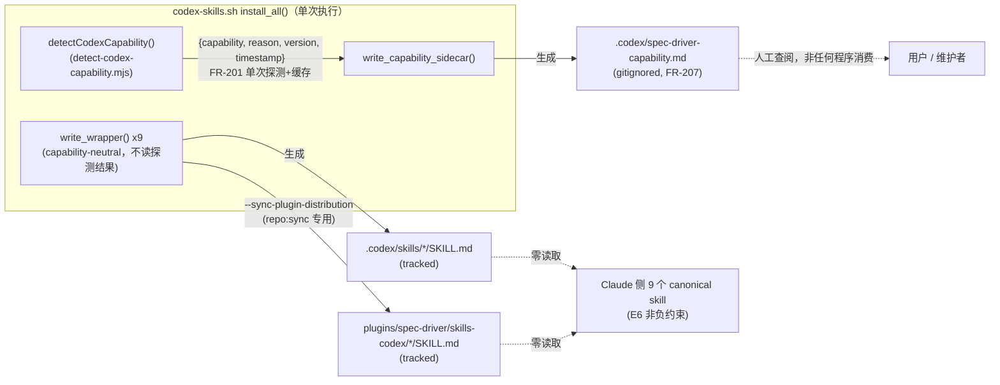
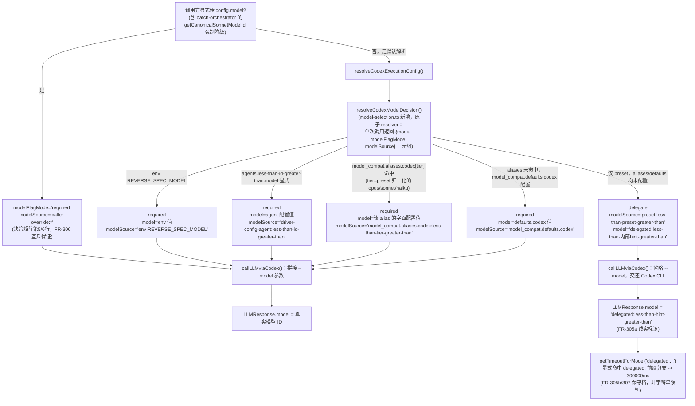

# Plan: Spec Driver Codex Wrapper 完整性

## 0. Q3 技术选型裁决（Open Question，非阻塞）

**问题**：`codex features list` 的 stdout 解析放 shell 内建（awk/grep）还是新增 Node helper？

**裁决：新增 Node helper `plugins/spec-driver/scripts/lib/detect-codex-capability.mjs`**，复用 `extract-wrapper-body.mjs` 已验证过的"shell 生成端 + JS 校验端共用单一实现"模式（虽然本次没有第二个 JS 消费方，但沿用同一"可 import 纯函数 + CLI 直跑入口"双态结构）。

**理由**（基于对 `codex-skills.sh` 现有结构与测试基础设施的实测核对）：

1. **可测试性是决定性因素**。FR-203 定义了 7 类 reason 分支（`binary-missing` / `command-failed` / `unsupported-command` / `timeout` / `no-feature-row` / `malformed-effective` / `effective-false`），SC-003(b) 要求至少覆盖 3 类。用 awk/grep 实现时，要对 7 类分支做确定性单测，只能靠"构造 7 种不同的 fake `codex` shell 脚本 + 真实 spawn 子进程"逐一验证——尤其 `timeout` 分支意味着测试要真实等待 ≥5 秒，拖慢套件。Node helper 把"解析 `codex features list` 输出"这一纯函数（`parseFeaturesListOutput(stdout): {capability, reason}`）与"如何拿到这段 stdout"（`execFileSync`，可能抛 ENOENT/超时）分离后，可以对解析函数直接喂 7 组 fixture 字符串做同步单测（零子进程、零等待），超时/binary-missing 两类仅需在 `detectCodexCapability()` 一层做少量 mock（`vi.mock('node:child_process')`，与 `tests/unit/codex-proxy.test.ts` 已用的手法一致）。
2. **架构一致性**：`codex-skills.sh` 已经把"生成 wrapper body"这一有 9 条替换规则、需要 shell 与 JS 两端保持逐字节一致的逻辑，抽成了 `extract-wrapper-body.mjs` 单一实现（F186 T2 教训：双实现必然漂移）。capability 探测虽然只有 shell 一端消费，但独立成可 `import` 的模块是为未来"JS 侧诊断 CLI 也读取探测结果"预留扩展点，且与仓库既有惯例（`extract-wrapper-body.mjs`、`spec-drift-core.mjs`、`graph-quality-core.mjs` 均为"核心逻辑 `.mjs` 模块 + CLI 直跑入口"双态）保持一致。
3. **awk 方案的隐性成本**：`codex features list` 真实输出用不定宽空白分列（见 research 附 2 补测），FR-209 要求"容错列宽变化"且不得误判 `multi_agent_mode`/`multi_agent_v2` 为 `multi_agent`。用 awk 写这套容错逻辑比等价 JS 更难读、更难注释、且无法被 vitest 直接单测（只能 shell 集成测，成本高很多）。
4. **不引入新依赖**：Node 内置 `node:child_process.execFileSync` 已满足超时（`timeout` 选项）、非零退出（抛异常含 `.code`/`.signal`）、进程不存在（`ENOENT`）三类信号的捕获需求。

**结论**：Node helper 方案在实现复杂度上与 shell 方案相当，但在可测试性（SC-003 硬性要求）与架构一致性上显著更优，故采用。`codex-skills.sh` 侧只保留一行"调用 helper 拿结果"的胶水代码，与 `write_skill_body()` 调 `extract-wrapper-body.mjs` 的既有写法同构。

---

## 1. Technical Approach

本 Feature 按 spec 的三个 User Story 拆成三条独立可验证的 workstream，彼此无代码依赖（仅在 `codex-skills.sh` 一个文件上有非重叠的编辑面）：

### Workstream 1 — Wrapper 完整性（US-1 / FR-101~106）

纯配置 + 生成链路收口，无新逻辑：`codex-skills.sh` 的 `SKILLS` 数组新增一项，`install_all()` 新增一行显式 `write_wrapper` 调用；`wrapper-source-of-truth.yaml` 新增第 9 条 entry；`codex-plugin-consistency.yaml` 删除对应 waiver。**风险不在生成逻辑本身，而在测试基础设施对"已知 8/9 缺口 + waiver 覆盖"这一现状的多处硬编码依赖**——详见 §3.1 与 §5 风险清单，这是本 workstream 实际工作量的大头。

### Workstream 2 — Capability 探测与 Sidecar（US-2 / FR-201~209）

新增一个纯函数式 Node helper 做探测与解析（Q3 裁决），`codex-skills.sh` 在 `install_all()` 结尾调用一次、缓存结果，写入本地 gitignored sidecar；同时把 wrapper 三份产物的"子代理执行"描述与 `extract-wrapper-body.mjs` 的对应替换规则改写为 capability-neutral 静态指针文案（FR-204/205），与探测结果彻底解耦。

### Workstream 3 — Runtime-neutral Quality Tier（US-3 / FR-301~310）

拆成两条互不阻塞的子线：
- **文案层**（FR-301/302/303）：`write_codex_adapter()` 的模型兼容文案 + README/docs/模板/6 处 skill body 的具体版本字面量清理，全部是纯文本改写。
- **代码层**（FR-304~308）：在 `model-selection.ts` 新增一个原子 resolver `resolveCodexModelDecision()`（**Codex 审查 C1 修订**：一次调用返回 `{model, modelFlagMode, modelSource}` 三元组，取代原设计"先判来源、再各自取值"的两遍独立解析——两遍解析曾导致 preset tier 分支的真实解析顺序与文档声称的判定矩阵脱节，见 §3.5"C1 修订说明"）。判定顺序（决策矩阵前 4 行）：env `REVERSE_SPEC_MODEL` → `agents.<id>.model` 显式配置 → `model_compat.aliases.codex[tier]` 命中（`tier` 由 preset 归一化的逻辑名 opus/sonnet/haiku 决定，`model` 取该 alias 的字面配置值）→ `model_compat.defaults.codex` 命中（`model` 取该值）；以上任一命中 = `required`；全部未命中（仅 preset、无任何运行时覆盖）= `delegate` + `model = 'delegated:<内部 hint>'`。"调用方直接传入 `config.model`"与"`getCanonicalSonnetModelId()` 强制降级"这两类（决策矩阵第 5/6 行）**不经过这个函数**，而是在 `llm-client.ts`/`codex-proxy.ts` 的调用层用"调用方是否显式传了 `model`"这一更上游的信号直接短路为 `required`——这不是偷懒，而是让 FR-306"两条语义必须在代码路径上互斥"这一约束从设计上自然成立。
- **门禁**（FR-310）：新增 `scripts/lib/model-literal-gate-core.mjs`，按 spec 固定扫描清单做零依赖的目录遍历 + 正则扫描，接入 `repo:check` 第 14 检查族。

---

## 2. Architecture & Data Flow

### 2.1 Capability Sidecar：谁写、谁读、谁不读



关键不变量（对应 spec 架构决策与 E6/E8）：sidecar 是**唯一**含"本机探测结果"的产物；wrapper 三份产物**永远**不读取、不依赖它；Claude 侧执行路径**零接触** `.codex/spec-driver-capability.md`。

### 2.2 modelFlagMode 决策数据流



> Mermaid 节点文本避免使用 `<`/`>` 尖括号字面量（会被部分渲染器误解析为 HTML 标签），改用 `less-than-x-greater-than` 占位描述；实现阶段代码中仍使用真实的 `<id>`/`<tier>`/`<hint>` 记号，不受此文档限制影响。

---

## 3. File-by-file Change Plan

### 3.1 Workstream 1 — Wrapper 完整性

| 文件 | 改什么 | 为什么 | 风险 |
|------|--------|--------|------|
| `plugins/spec-driver/scripts/codex-skills.sh` | `SKILLS` 数组末尾加 `"spec-driver-refactor"`；`install_all()` 追加一行 `write_wrapper "spec-driver-refactor" "spec-driver-refactor"`（**W1 修正**：核实现状后确认 `install_all()` 是逐行显式调用 `write_wrapper`，非遍历 `SKILLS` 数组，故必须显式加这一行；`remove_all()` 相反——它本就遍历 `SKILLS` 数组做 `rm -rf`，数组追加后自动覆盖新 skill 的移除，**不得**额外加 `write_wrapper` 调用，那样反而会在 remove 路径上意外生成 wrapper） | FR-101，与其余 8 个 wrapper 生成路径完全一致，不引入特例分支 | 低——纯数组追加 + 一行 install 调用 |
| `plugins/spec-driver/contracts/wrapper-source-of-truth.yaml` | `codexWrappers.entries` 追加第 9 条：`id: spec-driver-refactor`，`source`/`target` 路径按现有命名规约 | FR-102 | 低 |
| `contracts/codex-plugin-consistency.yaml` | 删除 `waivers` 数组中 `spec-driver-refactor-codex-wrapper-gap` 整条 | FR-103 | 低——但会级联影响多处依赖"当前有已知缺口"现状的测试断言（见下） |
| `tests/integration/spec-driver-codex-skills.test.ts` | `SPEC_DRIVER_SKILLS` 数组追加 `'spec-driver-refactor'`；`.toHaveLength(8)` → `.toHaveLength(9)` | FR-105 | 低 |
| `tests/integration/repo-maintenance-sync-check.test.ts` | 本地 `SPEC_DRIVER_SKILLS` 数组（第 137-146 行，独立于上面那份）同步追加 `'spec-driver-refactor'` | 该数组目前只被用来遍历校验"每个 skill 的 dist 文件存在且与 `.codex/skills` 字节相同"，不新增不会导致本测试变红，但会让 9/9 完整性在这条测试里出现验证盲区；补齐是本 Feature 范围内低成本的完整性收口 | 低 |
| `tests/unit/codex-plugin-consistency-core.test.ts` | **中等重构**：见下方专门说明 | 该文件的 `buildHappyFixture()` 直接 `copyRepoFile` 真实 `wrapper-source-of-truth.yaml`（FR-102 后变 9 条）与真实 `codex-plugin-consistency.yaml`（FR-103 后无 waiver），而 `SPEC_DRIVER_CODEX_IDS`（8 项）/`SPEC_DRIVER_CANONICAL_IDS`（9 项，靠"+1 已知缺口"注释构造）这两个本地常量是围绕**当前**8/9 缺口现状硬编码的——FR-102/103 落地后两个数组必须变为等长的 9 项（无缺口），且专门测试 waiver 审计逻辑的用例不能再依赖"真实的 `spec-driver-refactor` 缺口"，需要改为在 fixture 内部**人工构造**一个合成缺口来独立验证审计逻辑，不再绑定真实世界的 skill id | **高**——这是本 workstream 实际工作量与回归风险的核心，必须在 implement 阶段第一步处理，否则后续所有改动都在红测试上开发 |
| `tests/integration/release-contract-sync.test.ts` | 第 310-340 行"矩阵 warning-only（陈旧 waiver）"测试用例：`original.replace('      - "spec-driver-refactor"', ...)` 依赖真实 waiver 文本存在，FR-103 后该字符串不存在，`replace` 变 no-op，`expect(patched).not.toBe(original)` 直接失败 | 同上——需要改为在该测试内部先合成一个"缺口 + waiver"再验证"追加陈旧覆盖 → warning"的行为，不依赖真实 `spec-driver-refactor` 状态 | 高（与上一行同源问题，两处必须同步改） |

**`tests/unit/codex-plugin-consistency-core.test.ts` / `release-contract-sync.test.ts` 的具体重构策略**（**C4 修订**：核实现状后确认原设计遗漏了两处耦合——`buildHappyFixture()` 用真实契约文件构造 fixture 时"目录树"与"wrapper-source-of-truth entries"必须联动一致，以及第 356-363 行 `waivers[0].missingSkillIds` YAML shape 断言硬编码 `'spec-driver-refactor'` 字面量——加上原已识别的 waiver 审计四态用例，共**五类**用例需要同步处理，而非四类）：两个测试文件都遵循"拷贝真实 `contracts/` 树到 tempDir，再对拷贝件做手术式修改"的既有模式（`copyRepoFile`/`copyTree` + `writeFileSync` patch），因此重构不改变测试哲学，只改变"制造缺口"的手法：

1. `buildHappyFixture()`（or 等价 `beforeEach`）里 `SPEC_DRIVER_CODEX_IDS` 追加 `'spec-driver-refactor'`（9 项）；删除 `SPEC_DRIVER_CANONICAL_IDS` 的"+1"构造，直接等于 `SPEC_DRIVER_CODEX_IDS`（两者同为 9 项，happy path 天然零缺口、零 waiver）。
2. 新增共享 helper `synthesizeGap(fixtureRoot, skillId, waiverEntries)`（`codex-plugin-consistency-core.test.ts` 文件内私有函数即可；`release-contract-sync.test.ts` 视需要另建一份结构等价的版本，因二者拷贝的目录树不同，不强行跨文件共享模块）：同时 (a) 从 fixture 拷贝的 `wrapper-source-of-truth.yaml` 用字符串手术删除某一条 entry（如 `spec-driver-doc`，与真实 refactor 缺口逻辑上等价，只是换一个 id 承担"临时被摘除"的角色），使 `codexEntryIds` 变 8 项、`canonicalIds` 仍 9 项，从而产生合成 gap；(b) `rmSync` fixture 内对应 `skills-codex/<id>` 目录（防 `skill-count:spec-driver-codex-dir` / `skills-reference:spec-driver` 两个 check 被"目录仍在但 wrapper-source-of-truth 缺条目"这一不一致状态污染——**unit 测试 fixture 同样需要这一步**，不只是原设计只提到的 `release-contract-sync.test.ts` 那份 `skills-codex/` 全量 copy 场景）；(c) 按参数把一条合成 waiver 写进拷贝的 `codex-plugin-consistency.yaml`。
3. 用 `synthesizeGap` 显式重构**五类**用例：
   - 删除 waiver → `canonical-vs-codex-gap` fail 且 error 指名合成 gap id
   - waiver 覆盖 → pass，`evidence.waived` 含 `{skillId, waiverId}` 对
   - 陈旧 waiver（覆盖了非 gap 的另一个 id）→ warning
   - 重复 waiver id → warning
   - `waivers[0].missingSkillIds` YAML shape 断言：改为对 `synthesizeGap` 写入的合成 waiver YAML 做数组 shape 校验，**不再**断言字面量 `['spec-driver-refactor']`
4. `release-contract-sync.test.ts` 同理调用等价 `synthesizeGap`，其拷贝的是**整棵** `plugins/spec-driver/skills-codex/` 真实目录（第 83 行 `copyTree`），已经内建在 helper 步骤 (b) 的 `rmSync` 处理中。
5. 生产合同 `contracts/codex-plugin-consistency.yaml` 的新增断言：`waivers` 字段为空数组或不存在（FR-103 落地后的终态）。

### 3.2 Workstream 2 — Capability 探测与 Sidecar

| 文件 | 改什么 | 为什么 | 风险 |
|------|--------|--------|------|
| `plugins/spec-driver/scripts/lib/detect-codex-capability.mjs`（新增） | 导出 `parseFeaturesListOutput(stdout): {capability, reason}`、`detectCodexCapability(opts?): {capability, reason, ...}`、`detectCodexVersion(opts?): string\|null`、`renderCapabilityMarkdown(result): string`（**W2+W3 新增**：拼出完整 sidecar Markdown 正文，含 ISO 8601 时间戳字段 + `codex --version` 结果 + capability/reason 三要素）；CLI 直跑入口支持两种输出模式：默认单行 JSON、`--markdown` 输出 `renderCapabilityMarkdown()` 结果（shell 侧直接重定向消费，零 JSON 解析、零 `jq` 依赖） | FR-201/202/203/207/208/209 + Q3 裁决 | 中——超时/子进程边界需要仔细 mock，见 §4 |
| `plugins/spec-driver/scripts/codex-skills.sh` | **W2+W3 修订**：接线固定写法（在 9 个 `write_wrapper` 调用之后、`install_all()` 结尾执行一次）：<br>`sidecar_path` 统一为 `$(dirname "$TARGET_DIR")/spec-driver-capability.md`（project 模式即 `$PROJECT_ROOT/.codex/spec-driver-capability.md`；global 模式即 `$HOME/.codex/spec-driver-capability.md`，两模式用同一表达式）<br>`if ! node "$PLUGIN_DIR/scripts/lib/detect-codex-capability.mjs" --markdown > "$sidecar_path" 2>/dev/null; then`<br>`  echo "[警告] capability 探测/sidecar 写入失败，跳过（不阻断 install）" >&2`<br>`fi`<br>`write_codex_adapter()` 的"子代理执行"/"模型兼容"两行按 FR-204/301 改写（见 §3.3 精确文案） | FR-201/202/206/207/208 | 中——探测**只调一次**（FR-201），不得在 9 次 `write_wrapper` 循环内重复调用；`--markdown` 模式把 JSON 解析责任完全收进 Node helper，shell 侧只需处理"成功写文件 / 失败跳过"二元结果 |
| `plugins/spec-driver/scripts/lib/extract-wrapper-body.mjs` | `rewriteCodexRuntimeText()` 替换列表第 8 条目标文案改写（FR-205，见 §3.3 精确文案）；**W1 新增**：per-skill slash 替换表（当前 7 条，`/spec-driver:spec-driver-{feature,implement,story,fix,resume,sync,doc}`）补第 8 条 `/spec-driver:spec-driver-refactor` → `$spec-driver-refactor` | FR-101/205 | 低——单点改动，两端（shell 生成/JS 校验）天然同源，无漂移面 |
| `.gitignore` | 新增一行 `.codex/spec-driver-capability.md` | FR-207 | 低 |
| `tests/integration/spec-driver-codex-skills.test.ts` | 新增 `describe('Feature 238 — capability 探测与 sidecar')` 块，含：native 场景、`binary-missing` 场景、`command-failed` 场景三类 shell 级 E2E；reinstall 后 sidecar 内容随新探测结果刷新（FR-208）的用例；见 §4 T2.4~T2.7b 的 W4 修订版 mock 手法 | SC-003 | 中——需要构造可执行的 fake `codex` 脚本并操纵受控 `PATH` env |
| `tests/unit/spec-driver/detect-codex-capability.test.ts`（新增） | 对 `parseFeaturesListOutput` 喂 7 类 fixture 字符串（含 FR-209 的列宽变体、`multi_agent_mode`/`multi_agent_v2` 干扰行、W5 新增的多词 stage 变体）；对 `detectCodexCapability` mock `node:child_process` 验证 ENOENT→`binary-missing`、`timeout` 选项触发→`timeout`、`unsupported-command` 的 stderr 关键词匹配 | Q3 裁决的可测试性论证兑现处；SC-003 | 低——纯函数 + mock，无真实子进程 |
| `tests/unit/spec-driver/wrapper-sha256.test.ts` | 第 68 行 `expect(body).toContain('Task tool（Codex 下按内联子代理执行）')` 改为断言新文案（见 §3.3） | 与 FR-205 改动同步，否则该断言直接红 | 低——但**必须**与 extract-wrapper-body.mjs 改动在同一 commit 完成，否则该测试挂红会阻断其余提交 |

**W1 修正说明**（核实 `extract-wrapper-body.mjs` L70-84 现状）：`rewriteCodexRuntimeText()` 的替换表当前只列了 `spec-driver-{feature,implement,story,fix,resume,sync,doc}` 共 7 个 slash 命令映射，缺 `spec-driver-refactor`；若不补这一条，新 wrapper 正文内 `/spec-driver:spec-driver-refactor` 字面量不会被替换成 `$spec-driver-refactor`，与其余 8 个 wrapper 的命令别名改写行为不一致（FR-101 要求"与其余路径完全一致"）。

**W2 shell 语义细节更正**（`set -euo pipefail` 下的 `$(...)`/重定向失败处理）：`x="$(cmd)" || fallback` 这种"赋值语句外层加 `||`"写法在 `set -e` 下**其实同样安全**——bash 对赋值语句（`var=$(cmd)`）取的退出码就是命令替换本身的退出码，外层 `||` 能正确捕获，并不会被 `pipefail` 吃掉（`pipefail` 只影响管道 `|` 链条，与命令替换 `$(...)` 无关）。改用 `if ! node ... > file 2>/dev/null; then ...; fi` 写法是为了让"失败即警告跳过、成功即静默"的控制流在代码里更直观可读，**不是修正一个真实存在的正确性 bug**。Slice 3 仍会在 shell 接线层验证一次错误路径（fake `codex` exit 1 / binary-missing）确实不中止 `install_all()` 其余步骤，但不再把这类语法选择当作风险项处理（见 §8 修订）。

### 3.3 FR-204/205/301 精确文案（改写前后对照）

**`write_codex_adapter()`（`codex-skills.sh`）**：

改写前（现状 3 行）：
```
- 子代理执行：正文中的 `Task(...)` / `Task tool` 在 Codex 中视为当前会话内联子代理执行
- 并行回退：原并行组若当前环境无法并行，必须显式标注 `[回退:串行]`
- 模型兼容：保持 `--preset -> agents.{agent_id}.model(仅显式配置时生效) -> preset 默认` 优先级；runtime=codex 时先做 `model_compat` 归一化，不可用时标注 `[模型回退]`
```

改写后：
```
- 子代理执行能力：以 install-time 探测记录为准（`.codex/spec-driver-capability.md`）；记录缺失或 degraded 时，正文中的 `Task(...)` / `Task tool` 一律按当前会话内联/串行降级执行
- 并行回退：原并行组若当前环境无法并行，必须显式标注 `[回退:串行]`
- 模型兼容：遵循 `model_compat.aliases.codex` tier 映射优先级（`--preset -> agents.{agent_id}.model(仅显式配置时生效) -> preset 默认`）；未显式 pin 时由 Codex CLI 自身按其配置分层（`-c` override > profile > `~/.codex/config.toml` 的 `model` 字段 > CLI 内建默认）决定当前默认模型，不冒充为已验证的具体版本
```

**`extract-wrapper-body.mjs` 第 8 条替换**（对齐 FR-204/205，句式因嵌入正文中的位置不同而略作精简）：

改写前：
```js
['Claude Code 的 Task tool', 'Task tool（Codex 下按内联子代理执行）'],
```

改写后：
```js
['Claude Code 的 Task tool', 'Task tool（Codex 下子代理执行能力以 .codex/spec-driver-capability.md 探测记录为准，缺失/degraded 时按内联/串行降级执行）'],
```

**`plugins/spec-driver/skills/spec-driver-implement/SKILL.md`（第 670 行，FR-303 代表性示例；story/resume 同构改写）**：

改写前：
```
- Codex 下默认将 `opus/sonnet/haiku` 映射到 `gpt-5.4`，并通过 `codex_thinking.level_map` 选择 `medium|high|xhigh` 思考等级
```

改写后：
```
- Codex 下默认将 `opus/sonnet/haiku` 归一化到 `model_compat.defaults.codex`（或更细粒度的 `model_compat.aliases.codex`）配置的模型；未显式配置时由 Codex CLI 自身决定当前默认模型，并通过 `codex_thinking.level_map` 选择 `medium|high|xhigh` 思考等级
```

改动只落在 canonical `plugins/spec-driver/skills/{implement,story,resume}/SKILL.md`，`.codex/skills/` 与 `plugins/spec-driver/skills-codex/` 两处镜像由 `npm run repo:sync` 重生同步（Non-negotiable Constraints 明确禁止手工分改三份）。

### 3.4 Workstream 3 — 文案层（FR-302）

**W9 修正——文档定位方式**：以下表格不再使用具体行号（spec/plan 撰写与 implement 之间可能有其他改动导致行号漂移），改用文本锚点定位；**以 FR-310 门禁扫描器（`scripts/check-model-literals.mjs`，Slice 5 产出）实际扫描命中的文件+行号列表为准**，implement 阶段第一步应先跑一次该扫描器获取精确清单，再逐条清理。

| 文件 | 现状（文本锚点） | 改写策略 |
|------|------|---------|
| `README.md`（根） | `Codex (gpt-5.4 + thinking levels)` 一行简介文案 | `Codex (tier-mapped via model_compat.aliases.codex + thinking levels)` |
| `plugins/spec-driver/README.md` | 多处 `gpt-5.4` 具体字面量：安装提示文案、`opus: gpt-5.4` 等 YAML 示例段、模型兼容说明段落 | YAML 示例里的 `opus: gpt-5.4` 等改为占位符 `<YOUR_CODEX_MODEL_ID>` 并加注释指向 `model_compat.aliases.codex`/`~/.codex/config.toml`；说明段落改为"归一化到 `model_compat.aliases.codex` 配置的模型；未配置时由 Codex CLI 自身决定" |
| `docs/configuration.md` | 同上模式（`opus: gpt-5.4` YAML 示例段 + 两处中英文说明段落） | 同上处理策略 |
| `plugins/spec-driver/templates/spec-driver.config-template.yaml`（`model_compat.aliases.codex`/`defaults.codex` 段） | 用户 scaffold 时会**直接沿用**的默认示例值 `gpt-5.4` | **见 W7 修正专门说明**：整段注释掉，占位符只出现在注释行内 |

占位符统一采用 `<YOUR_CODEX_MODEL_ID>` 这一不含 `gpt-5` 系字面量的记号，天然不触发 FR-310 门禁，同时比空字符串更明确地提示用户"这里需要一个真实模型 ID"。

**W7 修正说明**（核实 `spec-driver.config-template.yaml` L90-106 现状）：`model_compat.aliases.codex`（`opus`/`sonnet`/`haiku` 三键）与 `defaults.codex` 当前是**活动** YAML（非注释），且值均为 `gpt-5.4`。改造后两段默认**整段注释掉**（`#` 前缀逐行），占位符 `<YOUR_CODEX_MODEL_ID>` 只出现在注释行内，作为"如需固定模型，取消注释并替换此占位符"的引导文案。**不能**把占位符留在活动 YAML 里——`spec-driver.config.yaml` 的简单 YAML parser（`parseSimpleYaml`）会把 `<YOUR_CODEX_MODEL_ID>` 当作合法字符串值读入，导致 `readRuntimeAliases`/`readRuntimeDefault` 命中一个不存在的模型 ID，判定为 `required` 而非预期的 `delegate`，与 FR-304 delegate 语义直接矛盾。模板默认态（未取消注释）解析结果应为 delegate、不含 `--model`，见 §4 T3.16。

### 3.5 Workstream 3 — 代码层（FR-304~308）

| 文件 | 改什么 | 为什么 |
|------|--------|--------|
| `src/core/model-selection.ts` | 1) 新增 `export type CodexModelFlagMode = 'required' \| 'delegate'`；2) 新增私有函数 `resolveCodexModelDecision(options): {model, modelFlagMode, modelSource}`（**Codex 审查 C1 修订为原子 resolver**：单次调用同时决定"来源"与"模型值"，不再是"先判来源、再各自取值"的两遍解析。判定顺序：env `REVERSE_SPEC_MODEL` → `agents.<id>.model` 显式 → `model_compat.aliases.codex[tier]` 命中（`tier` 由 `readPreset()` 归一化的 opus/sonnet/haiku 决定，`model` 取该 alias 的字面配置值）→ `model_compat.defaults.codex` 命中（`model` 取该值）→ delegate 兜底（`model = 'delegated:<内部hint>'`，`<内部hint>` 为 preset 归一化的逻辑名）。复用既有私有 helper `readAgentModel`/`readPreset`/`readRuntimeAliases`/`readRuntimeDefault` 读取原始配置值，但组合出的判定顺序是**新增逻辑**，不是对既有 `toCodexModelId()` 的复用包装）；3) `ResolvedCodexExecutionConfig` 接口新增 `modelFlagMode: CodexModelFlagMode` 与 `modelSource: string` 两个必填字段；4) `resolveCodexExecutionConfig()` 内部改为直接调用 `resolveCodexModelDecision()` 取得三元组，`model` 字段直接取自该原子结果（delegate 分支下已带 `delegated:` 前缀），不再依赖 `resolveReverseSpecModel({provider:'codex'})` 的旧解析路径二次判定来源（该旧函数仍保留供其既有消费者使用，本 Feature 不改其行为） | FR-304/306/307；不破坏 `resolveCodexExecutionConfig(): ResolvedCodexExecutionConfig`（`model: string` 必填）现有契约——新增字段是纯加法；**FR-308（SHOULD）延后**，见本节末"FR-308 延后决策记录"与 §8 |
| `src/core/llm-client.ts` | 1) `LLMConfig` 接口**不**新增 caller 可传入的 `modelFlagMode`/`modelSource` 字段（**C2+I4 修订**：避免 caller 显式传入与 `config.model` 矛盾的非法状态组合，如 `{model: 'gpt-5.6-sol', modelFlagMode: 'delegate'}`）；2) `callLLM()` 内：`providerRuntime==='codex'` 时，若 `config?.model !== undefined`（**无条件**，忽略任何其他信号）则视为 `modelFlagMode='required'`、`modelSource='caller-override:callLLM'`；否则取 `codexExecution`（由 `resolveCodexExecutionConfig()` 产出，内部已由 `resolveCodexModelDecision()` 原子决定，`model` 字符串在 delegate 分支已带 `delegated:` 前缀）的 `modelFlagMode`/`modelSource`；这两个值只在内部合并进 `mergeConfig({...})` 传给下游用于**日志与遥测**，不回写进公共 `LLMConfig` 类型定义；3)（**Tasks 审查轮 C2 回流修订**）`callLLMviaCodexProxy()` **只**转发 `{model, timeout, reasoningEffort, serviceTier}` 给 `codexProxyCall`（**不再转发 `modelFlagMode`/`modelSource`**——proxy 层判定改为单一化只认 `model` 字符串前缀，见下方 `codex-proxy.ts` 行；此前"转发 `modelFlagMode` 供 proxy 判定"的设计正是 C2 矛盾根因：proxy 收到含 `delegated:` 前缀的 `model` 后，`impliedRequired = config.model !== undefined` 恒真，会把已经是 delegate 的调用重新判为 required，导致生产链上 delegate 路径不可达）；4)（**Tasks 审查轮 C2 回流新增，FR-305 日志落点**）`callLLM()` codex 分支判定 `modelFlagMode==='delegate'`（且 caller 未传 `model`）时写一行 stderr 诊断日志：`console.error('[llm-client] codex 模型选择委托给 CLI 自身 (source=' + modelSource + ', timeout-hint=' + timeout + 'ms)')`（**FR-305 日志落点由 `codex-proxy.ts` 改到此处**：`modelSource`/`timeout` 信息在 `llm-client.ts` 这一层最完整，`codex-proxy.ts` 不再重复打印，避免同一决策产生两行日志）；5) `getTimeoutForModel()` 顶部新增 `if (lowerModel.startsWith('delegated:')) return 300_000;`（先于其余关键字判断，注释引用 FR-305(b)/307，说明这是显式档位而非字符串误判） | FR-304 第5/6行的"caller override"判定点；FR-305(a)(b)/307；**C2+I4，Tasks 审查轮 C2 回流**：`delegate ⇔ model 以 delegated: 开头` 这一不变量只在 `resolveCodexModelDecision()` 单点保证，`llm-client.ts` 不重复编码该状态、也不给 caller 开后门绕过；`modelFlagMode`/`modelSource` 不再跨模块传递用于二次判定，只在产出模块内部消费（日志/遥测） |
| `src/auth/codex-proxy.ts` | 1) `CodexCLIProxyConfig`（`callLLMviaCodex` 的公共入参类型）**不**新增 `modelFlagMode`/`modelSource` 可传入字段（**C2+I4 修订**，理由同上）；2) `getDefaultCodexCLIProxyConfig(options?: {cwd?: string; env?: NodeJS.ProcessEnv})` 增加可选透传参数（非破坏性——新参数可选，现有零参调用不受影响），内部把 `options` 传给 `resolveCodexExecutionConfig(options)`，并把 `resolved.modelFlagMode`/`resolved.modelSource` 装入返回对象**仅供日志/测试断言消费**——这是"默认解析结果"的元信息，不是"caller 输入"，也**不参与** `callLLMviaCodex()` 内部的 delegate 判定（见下）；3)（**Tasks 审查轮 C2 回流修订：删除 `impliedRequired` 判定逻辑**）`callLLMviaCodex()` 的 delegate 判定**只认一个信号**：`cfg.model` 字符串是否以 `'delegated:'` 开头。原设计 `impliedRequired = config.model !== undefined` 会把 `callLLM()` 传来的、已带 `delegated:` 前缀的 `model` 字符串误判为"caller 显式传了 model"从而恒 required，这正是 Codex 对抗审查发现的致命矛盾——生产链上 delegate 路径因此不可达。删除该判定逻辑与相应的 `cfg.modelFlagMode`/`cfg.modelSource` 短路赋值；4) 拼接 `args` 时把 `'--model', cfg.model` 这一步改为 `if (!cfg.model.startsWith('delegated:')) { args.push('--model', cfg.model); }`（**单一事实源即 `model` 字符串本身**，不再有 `modelFlagMode` 参与判定，非法状态空间为零：不存在两个独立字段矛盾的可能）；5) `resolve({..., model: cfg.model, ...})` 保持不变——`cfg.model` 在 delegate 分支已经是 `` `delegated:${hint}` `` 字符串，此处不需要额外后处理；6)（**Tasks 审查轮 C2 回流修订：FR-305 日志落点迁出**）`callLLMviaCodex()` **不再**打印 delegate 诊断日志——该职责连同 `modelSource`/`timeout` 上下文一并移至 `src/core/llm-client.ts` 的 `callLLM()`（该层信息更完整，避免同一决策产生两行日志）；原 C3 裁决的 `[codex-proxy]` 前缀日志行改为 `[llm-client]` 前缀，测试断言随之迁移 | FR-304/306；`getDefaultCodexCLIProxyConfig` 新增可选 `options` 参数是为 §4 单测提供确定性注入点（tempDir cwd + 隔离 env）；`delegate ⇔ model` 前缀不变量由 `resolveCodexModelDecision()` 单点产出，`codex-proxy.ts` 只消费 `model` 字符串本身做判定，不消费 `modelFlagMode` 字段、不重算 |

**为什么"delegate 分支下 `model` 字段直接带 `delegated:` 前缀"是更优设计**：如果改为在 `callLLMviaCodex()` 内部对 `LLMResponse.model` 做事后字符串替换（"if delegate then prefix"），会出现两处独立维护"delegate 标识规则"的代码（一处算 `modelFlagMode`，一处算 `model` 展示值），且容易漏改 `getTimeoutForModel()` 这类下游只认字符串前缀的逻辑（如果 `resolved.model` 不带前缀，`getTimeoutForModel()` 就必须额外接收 `modelFlagMode` 参数才能选保守档，污染其"纯按模型名判断"的单一职责）。让 `resolveCodexModelDecision()` 在计算阶段就把 `delegated:` 前缀烘焙进 `model` 字符串本身，`model` 字段自身就是自描述的，`LLMResponse.model`、`getTimeoutForModel()`、`costMetadata.llmModel`（`single-spec-orchestrator.ts:516`，下游成本记录）全部自动获得正确语义，零额外分支。

**C1 修订说明（Codex 对抗审查 Critical-1）**：核实 `src/core/model-selection.ts` 现状（`toCodexModelId()` L249-273 + `resolveCodexExecutionConfig()` L197-217）发现，preset 路径的 `runtimeFallback` 只经 `readRuntimeDefault()` 读取 `model_compat.defaults.codex`，**从不读取** `model_compat.aliases.codex` 的按-tier 映射——`toCodexModelId()` 命中 `LOGICAL_CODEX_MODEL_MAP[normalized]`（`opus/sonnet/haiku` 三键全部指向同一个 `DEFAULT_CODEX_MODEL`）后，即使 `codexFallback` 存在且是原生 Codex 模型 ID，也只是替换掉这个"全员同值"的兜底，不做按 tier 差异化映射；原设计文档声称的"`model_compat.aliases.codex` 命中"判定分支在 preset-only 路径上实际不可达。`resolveCodexModelDecision()` 必须在计算阶段**显式**优先查 `model_compat.aliases.codex[tier]`，命中才继续查 `defaults.codex`，都未命中才 delegate——这是新增判定逻辑，不是对现有 `toCodexModelId()` 的复用包装。

**FR-308 延后决策记录（W6 裁决）**：原设计计划新增 `getDefaultCodexModelFallback()` 惰性读取 `~/.codex/config.toml` 顶层 `model = "..."` 行作为 `DEFAULT_CODEX_MODEL` 兜底来源。**Codex 审查 W6 裁决：本 Feature 明确延后，不实现**。理由：(1) 惰性读取仍需在某个调用路径上触发首次文件系统 I/O，与 `model-selection.ts` 现有模块顶层 `const` 同步初始化模式存在张力，用函数包一层虽能避免 import-time I/O，但调用时机本身就是一个需要设计的新状态机，收益（一个 SHOULD 级兜底）配不上这个复杂度；(2) `~/.codex/config.toml` 路径中的 `~` 在 Node `fs` API 不自动展开，需要额外 `os.homedir()` 拼接逻辑，出错面非本 Feature 核心范围；(3) 用简单正则而非完整 TOML parser 匹配"顶层 `model = "..."`"存在 section 边界误取风险（如 `[profiles.foo]` 段内同名 `model` 键会被正则误当顶层匹配）。该延后**不影响** FR-310 的用户表面清理目标（README/docs/模板文案清理与门禁扫描是独立子线，二者无依赖关系）。`tasks.md` 须含一条显式 follow-up 任务（退出条件严格按 spec FR-308 原文，不由 implement 阶段自行降低标准），不允许静默跳过且不留痕。

---

## 4. Test Strategy（TDD 先行清单）

原则：**每个新行为先写失败测试，再实现**。以下按 workstream 排列，"红"列出用于驱动实现的失败断言，"绿"是通过条件。

### Workstream 1

| # | 红（先写） | 实现 | 绿 |
|---|---|---|---|
| T1.1 | `spec-driver-codex-skills.test.ts`：`SPEC_DRIVER_SKILLS` 含 9 项，`toHaveLength(9)`；生成的 refactor wrapper 正文含 `$spec-driver-refactor` 且**不含** `/spec-driver:spec-driver-refactor`（**W1 新增断言**） | 加 `spec-driver-refactor` 到 `SKILLS`、`install_all()` 加一行、`extract-wrapper-body.mjs` 替换表补第 8 条 | `.codex/skills/spec-driver-refactor/SKILL.md` 生成，8→9 断言通过，命令别名正确替换 |
| T1.2 | `codex-plugin-consistency-core.test.ts`：改写后的 happy fixture（9/9 无缺口）期望 `canonical-vs-codex-gap:spec-driver` pass 且 `warnings=[]` | 删 waiver + wrapper-source-of-truth 加第 9 条 | 无需 waiver 也 9/9 完整 |
| T1.3 | 同文件：`synthesizeGap` 合成缺口场景（临时摘除 `spec-driver-doc` 的 entry + 目录）+ 合成 waiver，"删除 waiver→fail 指名 spec-driver-doc"/"覆盖→pass"/"陈旧覆盖→warning"/"重复 waiver id→warning"/"`missingSkillIds` YAML shape 校验"五态（**C4 修订**，见 §3.1） | 无新代码——纯验证既有审计逻辑对"任意 id"通用，不只对 refactor 特化 | 五态断言均通过 |
| T1.4 | `release-contract-sync.test.ts`：`synthesizeGap` 版本的"陈旧 waiver → warning-only exit 0" | 同上，且同步 `rmSync` 摘除对应 `skills-codex/` 目录保持一致 | exit 0，`status='pass'`，`warnings` 含"陈旧 waiver" |

### Workstream 2

| # | 红 | 实现 | 绿 |
|---|---|---|---|
| T2.1 | `detect-codex-capability.test.ts`：`parseFeaturesListOutput('multi_agent   stable   true\n...')` → `{capability:'native', reason:null}` | 实现 `parseFeaturesListOutput` | 通过 |
| T2.2 | 同：7 组 fixture 逐一覆盖 `no-feature-row`（无首 token 精确等于 `multi_agent` 的行）/`malformed-effective`（行末最后一个非空 token 非 `true`/`false`）/`effective-false`（行末最后一个非空 token 为 `false`）/`multi_agent_mode`/`multi_agent_v2` 干扰行不被误判（首 token 精确匹配，非前缀/子串匹配）/**（W5 新增）**`multi_agent under development true` 变体（stage 列为多词 `under development`，验证"取行末最后一个非空 token"而非"取固定第三列"这一解析规则） | 实现 `parseFeaturesListOutput` 的"首 token 精确匹配 + 取行末非空 token"解析规则（非按固定列位裁切） | 全部 reason 精确匹配 |
| T2.3 | 同：mock `execFileSync` 抛 `{code:'ENOENT'}` → `detectCodexCapability()` 返回 `binary-missing`；抛 `{killed:true, signal:'SIGTERM'}` → `timeout`；stderr 含 `unrecognized subcommand` → `unsupported-command`；其余非零退出 → `command-failed` | 实现 `detectCodexCapability` 的 try/catch 分支 | 4 类边界 mock 全绿 |
| T2.4 | `spec-driver-codex-skills.test.ts` 新增块：**受控 PATH**（tempDir/bin，仅含 fake `codex` + 脚本实际调用面所需系统命令的 symlink：`node`/`bash`/`dirname`/`mkdir`/`cat` 等，implement 阶段按 `codex-skills.sh` 与 `detect-codex-capability.mjs` 实际调用面逐一核实列全——**W4 修订**：不用"追加式 PATH"（`PATH="<tempDir>/bin:$PATH"`），防止装机上真实 `codex` 抢先命中导致 T2.5 假失败）注入 fake `codex` 返回 `multi_agent  stable  true` → `install` 后 `.codex/spec-driver-capability.md` 含 `Subagent Capability: native` 且 `.codex/skills/*/SKILL.md` 不含该行（capability-neutral） | shell 端 sidecar 接线 + `install_all` 单次探测接线 | 断言通过 |
| T2.4b（W4 新增） | fake `codex` 脚本每次被调用都把参数 append 到一个计数文件；单次 `install` 后计数文件恰好 1 行（FR-201 机械验证，而非只靠人工审查代码确认"只调一次"） | 同上 | 计数 === 1 |
| T2.5 | 同：受控 PATH **不含**任何 `codex` 可执行文件（区别于"追加式 PATH 里没有"，两者在装机上行为不同）→ sidecar 含 `degraded(reason=binary-missing)`，`install` 整体 exit 0（不 hard fail，FR-202/E1） | 同上 | 断言通过 |
| T2.6 | 同：受控 PATH 内 fake `codex` 脚本 `exit 1` → sidecar 含 `degraded(reason=command-failed)` | 同上 | 断言通过 |
| T2.7 | 同：两次连续 install（第一次 fake codex 返回 true，第二次替换为返回 false）→ sidecar 内容随第二次刷新（FR-208） | 同上（sidecar 每次覆盖写） | 断言通过 |
| T2.7b（W4 新增） | sidecar 内容 schema 完整性断言：含 capability 行 + ISO 8601 时间戳行 + `codex --version` 结果行三要素；且 `.codex/skills/*/SKILL.md`、`plugins/spec-driver/skills-codex/*/SKILL.md`、`npm pack` 产物列表均**不含** sidecar 文件（FR-207 隔离边界机械验证） | 同上 | 三要素齐全 + 隔离断言通过 |
| T2.8 | `wrapper-sha256.test.ts`：更新第 68 行断言为新文案 | `extract-wrapper-body.mjs` FR-205 改写 | 通过 |

### Workstream 3（文案层）

| # | 红 | 实现 | 绿 |
|---|---|---|---|
| T3.1 | `model-literal-gate-core.test.ts`（新）：对一个含 `gpt-5.4`/`gpt-5.6-sol`/`gpt-5-mini` 的临时 fixture 文件跑 `validateModelLiteralGate` → `status='fail'`，`offenders` 精确定位到文件+行号；对 `gpt-50`/`gpt-5x`（非目标字面量）不误报 | 实现门禁核心模块 + 右边界正则 | 命中/不误报断言均通过 |
| T3.2 | 同：对本仓库 FR-302/303 清理**完成前**的真实文件跑门禁 → `status='fail'`（作为"清理前必红"的证据） | （不需要新代码，只是先跑一遍验证门禁能抓出真实现状） | 红——驱动后续文案清理 |
| T3.3 | 完成 README/docs/模板/6 处 skill body 清理后重跑 T3.2 → `status='pass'` | 3.4 节列出的文案改写 | 绿 |
| T3.4 | `repo-maintenance-core.mjs` 新增第 14 族接线后，`spec-drift-repo-check-regression.test.ts` 的断言 (d) 新增项须变为 `['spec-drift:anchors-status', 'model-literal-gate:model-literal-scan']`（顺序按 `aggregateValidation` 调用序）；**C5 修正：`repo-check-baseline.json` 保持不变，不追加 `model-literal-gate` 条目**——该基线固化的是"13 族接入 spec-drift 之前"的历史快照，`spec-drift:anchors-status` 与本 Feature 新增的 `model-literal-gate:model-literal-scan` 相对基线都属于"新增项"，这正是断言 (d) 存在的意义；若把 model-literal-gate 也写进 baseline，"新增"就会变成"零新增"，断言 (d) 反而测不出第 14 族有没有真正接线成功 | 接入 `repo:check`；gate core 返回合同须与其余各族同构：`{status, checks: [{id: 'model-literal-scan', title, status, evidence}], warnings, errors}` 四字段，否则 `aggregateValidation` 聚合后取不出预期 id | 断言通过 |

### Workstream 3（代码层）

| # | 红 | 实现 | 绿 |
|---|---|---|---|
| T3.5 | `model-selection.test.ts`：tempDir 无 `spec-driver.config.yaml`、无 env → `resolveCodexExecutionConfig({cwd, env:{}})` → `modelFlagMode='delegate'`，`modelSource` 以 `'preset:'` 开头，`model` 以 `'delegated:'` 开头 | `resolveCodexModelDecision` delegate 分支 + `resolveCodexExecutionConfig` 透传 | 通过 |
| T3.6 | 同：`preset: balanced`（无 agents/model_compat）→ 同上 delegate 结果 | 同上 | 通过 |
| T3.7 | 同：`agents.<agentId>.model: sonnet` 显式配置 → `modelFlagMode='required'`，`modelSource` 以 `'driver-config-agent:'` 开头 | `resolveCodexModelDecision` 第 2 行判定 | 通过 |
| T3.8 | 同：`model_compat.aliases.codex.sonnet: gpt-5.6-sol`（preset 命中 sonnet tier，无 `agents.<id>.model` 显式覆盖）→ `modelFlagMode==='required'`，`modelSource` 以 `'model_compat.aliases.codex:'` 开头，**且 `resolved.model === 'gpt-5.6-sol'`**（**C1 新增断言**：必须是该 alias 的字面配置值，不能是 `DEFAULT_CODEX_MODEL` 常量——杜绝"标 required 却传内建默认"这种假绿；核实现状表明该场景若走旧 `toCodexModelId()` 逻辑会静默丢弃 alias 值，此断言是回归哨兵）；配套 `codex-proxy.test.ts` 增补一条端到端断言：同一 fixture 下 `callLLMviaCodex()` 最终 spawn 的 `--model` 参数值精确等于 `'gpt-5.6-sol'`（对应 FR-309 真实仓库配置场景，从"决策矩阵判定正确"延伸到"真实传参正确"） | 第 3 行判定 | 通过 |
| T3.9 | 同：`model_compat.defaults.codex: gpt-5.6-sol`（无 aliases 命中）→ `required`，`modelSource='model_compat.defaults.codex'` | 第 4 行判定 | 通过 |
| T3.10 | 同：`env.REVERSE_SPEC_MODEL` 设置 → `required`，`modelSource='env:REVERSE_SPEC_MODEL'`（在已有 env 优先级测试基础上追加 modelFlagMode 断言） | 第 1 行判定 | 通过 |
| T3.11（**C2+I4 修订**：测试层级从 `codex-proxy.test.ts` 移至 `llm-client.test.ts`，锁定真实调用链而非直接拼 proxy 入参） | `llm-client.test.ts`：`getCanonicalSonnetModelId('codex')` → `callLLM({model: <该值>, providerRuntime: 'codex'})` → mock spawn 捕获 args 含 `'--model'`，`result.model` **不**以 `'delegated:'` 开头（FR-306 互斥回归锁定，Fix 134 教训不重演；锁在 `llm-client.ts` 的 `callLLM()` 入口层而非 `codex-proxy.ts` 内部，因为真实生产路径是从 `callLLM()` 进来，直接测 `callLLMviaCodex` 内部入参绕过了"caller 是否显式传 model"这一真实判定点） | 无需新代码——验证"caller override"通用短路机制天然覆盖强制降级路径 | 通过，作为长期回归哨兵 |
| T3.12（**C2+I4 修订**：不再手工拼 `modelFlagMode: 'delegate'` 这种 caller 侧非法状态组合——该字段已不再是 `CodexCLIProxyConfig` 公共入参） | `codex-proxy.test.ts`：`getDefaultCodexCLIProxyConfig({cwd: tempDirNoConfig, env: {}})` 取得 delegate 态默认配置（`model` 以 `'delegated:'` 开头）→ `callLLMviaCodex(prompt, {})`（**不传 `model`**，走默认解析路径）→ spawn args **不**含 `--model`，`result.model` 以 `'delegated:'` 开头 | `callLLMviaCodex` 的 `cfg.modelFlagMode !== 'delegate'` 条件判断，`cfg` 完全来自 `getDefaultCodexCLIProxyConfig()` 默认解析结果 | 通过 |
| T3.13 | `llm-client.test.ts`：`getTimeoutForModel('delegated:gpt-5.4')` → `300_000`；`getTimeoutForModel('delegated:whatever-unknown-string')` → 仍 `300_000`（证明走的是显式前缀分支，非关键字巧合匹配） | `getTimeoutForModel` 新增前缀分支 | 通过 |
| T3.14 | `codex-proxy.test.ts`：`getDefaultCodexCLIProxyConfig({cwd: tempDirNoConfig, env:{}})` → `timeout === 300_000`（delegate 场景端到端保守超时，FR-307） | `getDefaultCodexCLIProxyConfig` 可选 `options` 透传 + 上游改动 | 通过 |
| T3.14b（**C3 新增，FR-305 日志落点；Tasks 审查轮 C2 回流已将该日志迁至 `llm-client.ts`，见下方"Tasks 审查轮 C2 回流"说明**） | `codex-proxy.test.ts`：`vi.spyOn(console, 'error')` + `callLLMviaCodex(prompt, {})`（走 delegate 默认路径）→ stderr 含一行 `[codex-proxy] 模型选择委托给 Codex CLI 自身 (source=..., timeout-hint=...ms)`；required 分支下**不**产生该行（**已废止**：日志断言随 FR-305 落点迁移改到 `llm-client.test.ts`，前缀改为 `[llm-client]`，详见 tasks.md T4.13） | `callLLMviaCodex` delegate 分支的诊断日志（**已迁出**，见上） | （已废止） |
| T3.16（**W7 新增**） | `model-selection.test.ts`：拷贝 `spec-driver.config-template.yaml` 默认态（未取消注释）到 tempDir 作为 `spec-driver.config.yaml` → `resolveCodexExecutionConfig({cwd: tempDir, env: {}})` → `modelFlagMode==='delegate'`，`model` 以 `'delegated:'` 开头 | 模板注释化改写 + T3.5 delegate 分支逻辑天然覆盖 | 通过——证明模板默认态不会意外触发 required |

（**W6 修订**：原 `T3.15`（FR-308 惰性读取 `~/.codex/config.toml` 兜底）已删除。FR-308 已在 plan 阶段明确裁决延后，不再留待 implement 阶段临时判断，follow-up 记录见 §3.5"FR-308 延后决策记录"与 tasks.md。）

### 关键 Mock 手法说明

- **Shell 层 fake `codex` 二进制（W4 修订：受控 PATH，非追加式）**：在 tempDir 内建 `bin/` 目录，除 fake `codex`（`#!/usr/bin/env bash` + `echo` 固定输出 / `exit 1` / `sleep 6`，且把每次调用参数 append 到计数文件供 T2.4b 断言）外，额外 symlink 脚本实际调用面所需的系统命令（`node`/`bash`/`dirname`/`mkdir`/`cat` 等，implement 阶段按 `codex-skills.sh` 与 `detect-codex-capability.mjs` 实际 spawn/exec 的命令逐一核实列全），测试时用 `env: {...process.env, PATH: '<tempDir>/bin'}` 完全替换（而非 `PATH: '<tempDir>/bin:' + process.env.PATH` 这种追加式写法）注入 `execFileSync('bash', [...], {env})`；与现有 `runScript`/`runFixtureScript` helper（`spec-driver-codex-skills.test.ts` 已有）扩展 `env.PATH` 字段即可，不需要新增 helper 函数——只是把追加改成整体替换 + 补全依赖命令 symlink。
- **Node 层子进程 mock**：`detect-codex-capability.test.ts` 用 `vi.mock('node:child_process', () => ({ execFileSync: vi.fn() }))`，与 `codex-proxy.test.ts` 已用手法一致；超时场景直接 mock `execFileSync` 抛出 `Object.assign(new Error('timeout'), {killed: true, signal: 'SIGTERM'})`，不需要真实等待。
- **`codex-proxy.test.ts` 现有 `vi.mock('node:child_process')` 与 `vi.mock('node:fs')` 保持不变**，新增用例复用现有 `createMockChild()` helper。

---

## 5. Verification Plan（SC-001~008 逐条验证）

| SC | 验证方式 | 命令 |
|----|---------|------|
| SC-001 | `codex-plugin-consistency.yaml` 无 waiver + 矩阵判定 9/9 | `npx vitest run tests/unit/codex-plugin-consistency-core.test.ts` 且人工 `grep -c "spec-driver-refactor-codex-wrapper-gap" contracts/codex-plugin-consistency.yaml` 应为 `0` |
| SC-002 | 真实本机 `codex` CLI，验证 wrapper 可被"发现并加载"（discovery/load 口径，非完整执行——spec SC-002 已经 W8 裁决收窄措辞，本节命令与该口径一致），一次性只读触发 | 见下方"SC-002 固定命令"专节 |
| SC-003 | capability 探测 native + ≥3 类 degraded reason 实测 | `npx vitest run tests/unit/spec-driver/detect-codex-capability.test.ts tests/integration/spec-driver-codex-skills.test.ts -t "capability"`（**W4 修订**：unit 层验证 7 类 reason 分支的纯函数正确性，integration 层验证 shell 接线端到端行为，单跑 integration 不足以覆盖 SC-003(b) 声称的"至少 3 类"这一口径的机械证据链） |
| SC-004 | 模型字面量门禁零命中（豁免路径不误报） | `node scripts/check-model-literals.mjs`（独立 CLI，exit 0）且 `npx vitest run tests/unit/model-literal-gate-core.test.ts` |
| SC-005 | 集成测试 9-skill 口径 | `npx vitest run tests/integration/spec-driver-codex-skills.test.ts tests/integration/repo-maintenance-sync-check.test.ts` |
| SC-006 | 全量零失败 | `npx vitest run && npm run build && npm run repo:check && npm run release:check` |
| SC-007 | FR-304/305/306 不变量单测 | `npx vitest run tests/unit/model-selection.test.ts tests/unit/codex-proxy.test.ts tests/unit/llm-client.test.ts` |
| SC-008 | Claude 侧回归护栏 + diff 白名单人工复核 | `npx vitest run --project unit --project integration` 零新增失败；`git diff plugins/spec-driver/skills/*/SKILL.md` 人工确认仅命中 FR-303 的 tier 语义改写（见 §3.3 对照示例），无其余内容变化 |

### SC-002 固定命令与证据留存

（W8 口径对齐：本命令验证的是"发现并加载"discovery/load，要求 Codex 能列出该 skill 并正确解析其 frontmatter description，不要求真实执行 refactor 工作流；执行级 E2E 明确划出为 M10 增强，与 spec SC-002 措辞一致。）

```bash
# 1) 在已安装本 Feature wrapper 的项目内确认 CLI 版本（记录到证据文件）
codex --version

# 2) 最小只读触发：确认 Codex 能发现并加载 spec-driver-refactor skill
#    --sandbox read-only + --ephemeral 保证零写副作用；--skip-git-repo-check 避免仓库状态干扰
codex exec --sandbox read-only --ephemeral --skip-git-repo-check --color never \
  -C <project-with-installed-wrapper> \
  "请确认你能发现名为 spec-driver-refactor 的 skill（通过 \$spec-driver-refactor 或等价方式），\
只需回答是否发现及其 frontmatter description 摘要，不要执行该 skill 的任何指令。"
```

证据留存路径：`specs/238-codex-wrapper-completeness/verification/sc-002-codex-refactor-wrapper-e2e.md`，记录：`codex --version` 输出、完整执行命令、stdout 中确认发现 skill 的关键片段、执行时间戳。**该验证消耗一次 ChatGPT 订阅推理配额**（遵循仓库评测凭据策略：订阅优先，禁止改用 `OPENAI_API_KEY` 直连 API 付费 fallback 代替）。

---

## 6. Rollout & Rollback

### Rollout

1. 按 §7 里程碑顺序逐片提交，每片独立通过其"绿"验证命令后再进入下一片。
2. 全部 5 片合并后，运行一次完整的 SC-001~008 验证矩阵（§5）。
3. **建议但非本 Feature 强制**：spec-driver 插件版本按 SemVer 语义（新增 skill 覆盖 + 新 sidecar 能力 = 功能性增强）从当前 `4.4.0` bump 到 `4.5.0`，通过修改 `contracts/release-contract.yaml` + `npm run release:sync` 完成（不手工改 `plugin.json`/`marketplace.json`，遵循仓库发布合同约定）。若 implement 阶段判断该 bump 应归入独立的发布收口 Feature，则在本 Feature 收尾时明确记录为 follow-up，不在本 Feature 内顺手做。
4. `git add` 时对 `specs/src.spec.md` 显式排除（已知自动再生噪声源，Non-negotiable Constraints 明确要求）。

### Rollback

- 每个里程碑片都是独立 commit，理论上可单独 `git revert`；**C6 修正**：Slice 1-3 存在生成产物链耦合（`extract-wrapper-body.mjs` 改动 → `codex-skills.sh` 重生 wrapper 正文 → `npm run repo:sync` 重写 tracked `skills-codex/`），彼此编辑面虽不重叠，但产物链是耦合的——revert 任一片后必须重跑 `npm run repo:sync` 恢复 tracked 产物与最新源码一致，不能假设"revert 一片、其余片保持绿"。Slice 4/5（代码层/文案层）与 Slice 1-3 无生成产物耦合，revert 隔离性成立。
- 若上线后发现 capability 探测在某些用户环境导致 `install` 变慢或异常（如极端网络/权限环境下 `execFileSync` 行为异常），影响面严格限定在 sidecar 写入这一步——sidecar 写入失败不应导致 wrapper 生成失败（两者在 `install_all()` 内顺序执行但逻辑独立），紧急情况下可临时注释掉 `install_all()` 内探测调用这一行作为热修复，wrapper 生成与既有行为完全不受影响。
- 若 FR-304 delegate 语义在生产触发未预期问题（如某些 Codex CLI 版本对省略 `--model` 处理不一致），回滚面限定在 `codex-proxy.ts` 的条件判断——把 `if (!cfg.model.startsWith('delegated:'))` 改回恒真（即总是传 `--model`）即可完全恢复至改动前行为，不影响 Workstream 1/2 已交付内容。

---

## 7. 里程碑（5 个可独立提交的最小绿色增量）

### Slice 1 — Workstream 1：Wrapper 完整性 + 测试基础设施解耦（US-1）

文件：`codex-skills.sh`（SKILLS 数组）、`wrapper-source-of-truth.yaml`、`codex-plugin-consistency.yaml`、`spec-driver-codex-skills.test.ts`、`repo-maintenance-sync-check.test.ts`、`codex-plugin-consistency-core.test.ts`、`release-contract-sync.test.ts`。

验证：
```bash
npm run codex:spec-driver:install
npm run repo:sync
npx vitest run tests/integration/spec-driver-codex-skills.test.ts tests/integration/repo-maintenance-sync-check.test.ts tests/unit/codex-plugin-consistency-core.test.ts tests/integration/release-contract-sync.test.ts
npm run repo:check
```

### Slice 2 — Workstream 2a：Capability 探测 helper（纯函数，TDD 单测先行）

文件：`plugins/spec-driver/scripts/lib/detect-codex-capability.mjs`（新）、`tests/unit/spec-driver/detect-codex-capability.test.ts`（新）。不接线到 `codex-skills.sh`，独立可验证。

验证：
```bash
npx vitest run tests/unit/spec-driver/detect-codex-capability.test.ts
```

### Slice 3 — Workstream 2b：Sidecar 接线 + capability-neutral 文案（US-2）

文件：`codex-skills.sh`（探测接线 + sidecar 写入 + `write_codex_adapter` 文案）、`extract-wrapper-body.mjs`（FR-205 + W1 补第 8 条替换）、`.gitignore`、`spec-driver-codex-skills.test.ts`（新增 sidecar 测试块）、`wrapper-sha256.test.ts`（断言文案更新）。

验证：
```bash
npm run repo:sync   # C6 修订：extract-wrapper-body.mjs 改动后 tracked skills-codex/ 的旧 sha 会与新 helper 重算结果不一致，
                     # 裸 install 不会重写 tracked skills-codex/（opt-in 双写，见 codex-skills.sh Feature 213 A1 设计），
                     # 必须走 repo:sync 才能同步，否则 codex-plugin-distribution-markers 检查必红
npx vitest run tests/integration/spec-driver-codex-skills.test.ts tests/unit/spec-driver/wrapper-sha256.test.ts
npm run repo:check
```

### Slice 4 — Workstream 3 代码层：modelFlagMode 决策矩阵 + delegated 语义（US-3 部分）

文件：`src/core/model-selection.ts`、`src/core/llm-client.ts`、`src/auth/codex-proxy.ts`、`tests/unit/model-selection.test.ts`、`tests/unit/codex-proxy.test.ts`、`tests/unit/llm-client.test.ts`。依赖 Slice 1-3 已完成（不强制，但建议顺序执行以保持 review 粒度一致）。

验证：
```bash
npx vitest run tests/unit/model-selection.test.ts tests/unit/codex-proxy.test.ts tests/unit/llm-client.test.ts
npm run build
```

### Slice 5 — Workstream 3 文案层 + 门禁（US-3 收尾）

文件：`README.md`、`plugins/spec-driver/README.md`、`docs/configuration.md`、`plugins/spec-driver/templates/spec-driver.config-template.yaml`、`plugins/spec-driver/skills/{implement,story,resume}/SKILL.md`、`scripts/lib/model-literal-gate-core.mjs`（新）、`scripts/check-model-literals.mjs`（新）、`scripts/lib/repo-maintenance-core.mjs`（第 14 族接线）、`tests/unit/model-literal-gate-core.test.ts`（新）、`tests/integration/spec-drift-repo-check-regression.test.ts`（断言 (d) 更新，`repo-check-baseline.json` **不改动**，见 C5）。

验证：
```bash
npm run repo:sync   # 重生 .codex/skills 与 skills-codex 镜像，同步 FR-303 改动
node scripts/check-model-literals.mjs
npx vitest run tests/unit/model-literal-gate-core.test.ts tests/integration/spec-drift-repo-check-regression.test.ts
npm run repo:check
```

### 全量收尾（合并 5 片之后）

```bash
npx vitest run
npm run build
npm run repo:check
npm run release:check
# SC-002：按 §5 固定命令跑一次真实 Codex CLI E2E，产出证据文件
```

---

## 8. 风险清单

### Workstream 1

1. **测试基础设施对"已知缺口 + waiver"现状的隐性耦合**（已在 §3.1 详细分析）。缓解：Slice 1 第一步就是把这些测试改为"合成缺口"驱动，而非依赖真实 `spec-driver-refactor` 状态，改完后即使未来再出现新的 canonical/codex 缺口，这些测试也不需要再次返工。
2. **`--sync-plugin-distribution` 双写链遗漏**：如果只跑 `npm run codex:spec-driver:install` 而不跑 `npm run repo:sync`，`skills-codex/` 不会同步第 9 个 wrapper，导致 `codex-plugin-consistency.yaml` 的 `skill-count:spec-driver-codex-dir` 检查失败。缓解：Slice 1 验证命令显式包含 `npm run repo:sync` 这一步，且 `repo:check` 会捕获遗漏。

### Workstream 2

1. **探测超时测试拖慢套件或引入 flaky**：真实等待 5 秒的集成测试会拖慢 CI，且 `sleep` 精度在不同 CI runner 负载下可能不稳定。缓解：超时分支的确定性验证放在 Node 单测层用 mock（T2.3），shell 集成测试只覆盖 native/binary-missing/command-failed 三类无需真实等待的场景（T2.4-2.6）。
2. **sidecar 写入失败不应阻断 install**：`--markdown` 直接重定向输出到文件，比原设计"先取 JSON 到变量再解析拼 Markdown"链路更短，失败面更小。语义细节更正见 §3.2"W2 shell 语义细节更正"——`x="$(cmd)" || fallback` 写法在 `set -e` 下本就安全，改用 `if !` 写法是为清晰而非修正正确性 bug。Slice 3 在 shell 接线层验证一次错误路径（fake `codex` exit 1 / binary-missing）确实不中止 `install_all()` 其余步骤。

### Workstream 3

1. **`callLLM`/`callLLMviaCodex` 是仓库核心 LLM 调用链路，改动影响面覆盖所有走 codex runtime 的 spec 生成**（`resolveCodexExecutionConfig` 仅 2 个调用点，但间接影响每一次 codex 模式的 batch/spec 生成）。缓解：新增字段全部是内部合并字段而非公共可选入参（C2+I4 修订后进一步收窄），且默认值链路（`impliedRequired` 兜底）保证"不传 `model`"时行为与改动前逐字节一致；T3.11 的 FR-306 回归哨兵专门锁定 Fix 134 教训不重演。**（Tasks 审查轮 C2 回流更正）**：proxy 层已删除 `impliedRequired` 判定逻辑，改为纯 `model` 字符串前缀判定，"不传 `model` 时行为不变"这一缓解论述现由"delegate 分支 `model` 字符串恒带 `delegated:` 前缀、required 分支恒不带"的更强不变量保证。
2. **delegate 场景下 `costMetadata.llmModel` 变为 `'delegated:...'` 字符串，若下游存在按精确模型名做定价查表的逻辑，可能从"有值"退化为"查不到"**。经确认当前 `estimatedCostUsd` 仅对 sonnet model 计算（CLAUDE.local.md 记录的已知偏差），codex 侧调用本就不参与该计算，故本次改动不引入新的功能退化，但 implement 阶段仍需 grep 一次 `costMetadata.llmModel`/`estimatedCostUsd` 消费点确认无遗漏假设。
3.（**W6 已在 plan 阶段裁决，风险不再适用**）原风险描述"`DEFAULT_CODEX_MODEL` 惰性读取引入文件系统依赖"——plan 阶段（非 implement 阶段）已直接裁决 FR-308 延后，不进入本 Feature 实现范围，见 §3.5"FR-308 延后决策记录"。此条保留仅作历史记录，Slice 4 不再包含该风险项。

---

## 9. Complexity Tracking（偏离最简方案的决策记录）

| 决策 | 简单方案 | 实际选择 | 理由 |
|------|---------|---------|------|
| capability 探测实现语言 | shell awk/grep | 新增 Node helper | §0 Q3 裁决——可测试性是 SC-003 的硬性要求，awk 方案在 7 类 reason 分支下不可行 |
| delegate 语义的 `model` 字段前缀化时机 | 在 `LLMResponse` 构造处后处理 | 在 `resolveCodexModelDecision()` 计算阶段就烘焙 `delegated:` 前缀 | §3.5 末尾已论证：避免两处独立维护"delegate 标识规则"，且让 `getTimeoutForModel()` 保持"纯按模型名判断"的单一职责，不需要额外接收 `modelFlagMode` 参数 |
| FR-304 决策矩阵第 5/6 行（caller override / 强制降级）的实现位置 | 全部塞进 `resolveCodexModelDecision()`，函数内部特判"是否强制降级调用" | 拆到 `llm-client.ts`/`codex-proxy.ts` 调用层，用"caller 是否显式传 model"这一更上游信号短路 | FR-306 要求两条语义"代码路径互斥"；把强制降级路径物理上排除在 `resolveCodexModelDecision()` 之外，比"进入该函数后再特判排除"更强的互斥保证（后者仍需一条可能被误删的 if 分支） |
| `model-selection.ts` 判定逻辑（preset tier → 具体模型）的实现方式 | 复用/包装既有 `toCodexModelId()` | 新增独立判定链 `resolveCodexModelDecision()`，读取原始配置事实、显式实现 aliases 优先于 defaults 的顺序 | **C1 裁决**：核实现状发现 `toCodexModelId()` 在 preset-only 路径上根本不消费 `model_compat.aliases.codex` 的按-tier 映射（三键统一 fallback 到同一常量），继续包装该函数会让"aliases 命中"分支在代码里永远走不到；新增独立判定链是唯一能兑现决策矩阵文档承诺的做法 |
| `modelFlagMode`/`modelSource` 是否作为 `LLMConfig`/`CodexCLIProxyConfig` 的 caller 可传入字段 | 作为可选字段暴露，caller 可显式传入覆盖 | 不暴露为公共入参，只在内部"默认解析结果"对象上产出；caller 传 `model` 即无条件覆盖为 required | **C2+I4 裁决**：caller 若能同时传 `model` + `modelFlagMode:'delegate'`，是一种可构造的非法状态（值与语义矛盾）。收窄后 `delegate ⇔ model 以 delegated: 开头` 这一不变量只有 `resolveCodexModelDecision()` 一处产出，其余代码只消费不重新编码判定逻辑，杜绝二次维护与状态漂移 |
| proxy 层 delegate/required 判定信号（**Tasks 审查轮 C2 回流新增行**） | 保留 `impliedRequired = config.model !== undefined` 与内部信道字段 `modelFlagMode`/`modelSource` 跨模块传递供 proxy 判定 | proxy 只认 `cfg.model` 字符串是否以 `delegated:` 开头这一单一信号，不再跨模块传递判定字段 | **Tasks 审查轮 C2 回流裁决**：`callLLM()` 把已带 `delegated:` 前缀的 `model` 传给 proxy 后，`impliedRequired` 恒真会把 delegate 错误升级为 required，生产链上 delegate 不可达——这是比原 C2（caller 可传入非法状态组合）更深一层的矛盾。收窄为单一信号后，非法状态空间为零：不存在两个独立字段互相矛盾的可能，`resolveCodexModelDecision()` 仍是唯一事实源，但事实源就是 `model` 字符串本身 |

---

## Review Log（Plan 审查轮）

Codex 对抗审查（6 Critical / 9 Warning / 4 Info）逐条处置记录如下，均已核实真实代码后落实到本 plan（`src/core/model-selection.ts`、`plugins/spec-driver/scripts/lib/extract-wrapper-body.mjs`、`tests/unit/codex-plugin-consistency-core.test.ts`、`tests/integration/spec-drift-repo-check-regression.test.ts` + baseline fixture、`plugins/spec-driver/templates/spec-driver.config-template.yaml`）：

- **C1（preset 路径不读 aliases.codex，只读 defaults.codex）** → 核实属实（`toCodexModelId()` L249-273 + `resolveCodexExecutionConfig()` L197-217）。裁决：`determineCodexModelFlagMode()` 升级为原子 resolver `resolveCodexModelDecision()`，一次返回 `{model, modelFlagMode, modelSource}` 三元组；preset tier 判定顺序改为 aliases.codex[tier] → defaults.codex → delegate，显式新增判定逻辑而非包装 `toCodexModelId()`。T3.8 增加 `resolved.model` 精确值断言 + spawn `--model` 端到端断言。
- **C2（modelFlagMode 可被 caller 传入形成非法状态组合）+ I4** → 裁决：`modelFlagMode`/`modelSource` 不作为 `LLMConfig`/`CodexCLIProxyConfig` 公共入参暴露；caller 传 `model` 无条件覆盖为 required；delegate ⇔ model 前缀不变量单点由 `resolveCodexModelDecision()` 保证。T3.11 改测 `llm-client.ts` 真实调用链，T3.12 改为经默认解析路径构造 delegate，不再手工拼非法入参组合。
- **C3（FR-305 日志落点未定）** → 核实 `codex-proxy.ts` 现状零 `console.*` 调用。裁决：`callLLMviaCodex()` delegate 分支新增一行 `[codex-proxy]` 前缀 stderr 诊断日志（与仓库既有 `[module] 中文消息` 约定同构），T3.14b 用 `vi.spyOn(console, 'error')` 断言。**（Tasks 审查轮 C2 回流后更正：该日志落点已从 `codex-proxy.ts` 迁至 `llm-client.ts`，前缀改 `[llm-client]`，T3.14b 随之废止，见下方"Tasks 审查轮 C2 回流"条目与 §3.5/§4。）**
- **C4（合成 waiver fixture 遗漏两处耦合）** → 核实属实：`buildHappyFixture()` 的目录树-entries 联动 + `waivers[0].missingSkillIds` 字面量断言（L360-363）。裁决：新增共享 helper `synthesizeGap()`，五类用例（含"重复 waiver id"与"YAML shape 断言"）全部改用合成缺口，不再依赖真实 `spec-driver-refactor` 状态。
- **C5（baseline "added" 断言口径）** → 核实 `repo-check-baseline.json` 是"13 族接入 spec-drift 之前"的历史快照，且现无 `spec-drift:` 前缀条目。裁决：baseline **保持不变**，断言 (d) 改为精确匹配 `['spec-drift:anchors-status', 'model-literal-gate:model-literal-scan']`；明确 gate core 返回合同四字段结构。
- **C6（Slice 3 未含 repo:sync 导致后续验证假绿/假红）** → 裁决：Slice 3 验证命令第一条改为 `npm run repo:sync`；§6 Rollback 撤销"编辑面不重叠可任意 revert"表述，改为"Slice 1-3 存在生成产物链耦合"。
- **W1（remove_all 错误加 write_wrapper + refactor slash 替换缺失）** → 核实 `codex-skills.sh` 现状：`install_all()` 逐行显式调用、`remove_all()` 遍历数组。裁决：`remove_all()` 不加调用（数组追加自动覆盖）；`extract-wrapper-body.mjs` 替换表补第 8 条 slash 映射；T1.1 增加正文断言。
- **W2（sidecar 生成 JSON 解析方式）+ W3** → 裁决：`detect-codex-capability.mjs` 直接提供 `--markdown` 模式，shell 零 JSON 解析；同时更正 §8 对 `x="$(cmd)" || fallback` 语义的错误担忧——该写法在 `set -e` 下本就安全，`if !` 写法只是可读性选择。
- **W4（mock PATH 追加式导致装机假失败 + 缺机械验证）** → 裁决：受控 PATH 完全替换（非追加），补齐依赖命令 symlink + 调用计数断言（T2.4b）+ sidecar schema 完整性断言（T2.7b）+ SC-003 命令改为 unit+integration 双跑。
- **W5（effective 列解析规则不精确）** → 裁决：改为"首 token 精确匹配 multi_agent + 取行末最后一个非空 token"，新增多词 stage fixture 变体。
- **W6（FR-308 实现方式与模块初始化模式矛盾）** → 裁决：本 Feature 明确延后 FR-308，不实现；删除 T3.15；新增"FR-308 延后决策记录"，tasks.md 留显式 follow-up。
- **W7（模板默认态活动 YAML 导致 delegate 语义失效）** → 核实 `spec-driver.config-template.yaml` L90-106 现状为活动 YAML。裁决：`aliases.codex`/`defaults.codex` 整段注释掉，占位符只出现在注释行；新增 T3.16 验证模板默认态解析为 delegate。
- **W8（SC-002 discovery/load 口径）** → 已由编排器在 spec 阶段裁决（spec.md Review Log 末条），本 plan §5 SC-002 行与固定命令同步该口径。
- **W9（文档定位用具体行号，易随改动漂移）** → 裁决：§3.4 改用文本锚点定位，注明以 FR-310 扫描器实际输出为事实源。
- **I1** → 自查确认：spec 全文 25 条 FR，本 plan §3/§4/§7 逐条均有对应文件改动或测试落点，无遗漏 FR。
- **I2** → 采纳结论：`delegated:` 前缀由 `resolveCodexModelDecision()` 单点产出，无二次 alias 映射消费该字符串的风险，plan 未引入任何针对此风险的额外防御设计。
- **Info 采纳**：以上 I1/I2 均为确认性结论，不产生额外改动面。
- **Tasks 审查轮 C2 回流（proxy 判定单一化为 model 字符串前缀）** → Tasks 审查阶段发现：`callLLMviaCodex()` 内部仍用 `impliedRequired = config.model !== undefined` 判定 required/delegate，而 `callLLM()` 会把已带 `delegated:` 前缀的 `model` 字符串传给 proxy，导致该判定恒真——生产链上 delegate 路径不可达，是比原 C2（caller 可传入非法状态组合）更深一层的矛盾。裁决：`callLLMviaCodex()` 的 delegate 判定收窄为单一信号——`cfg.model` 是否以 `delegated:` 开头；删除 `impliedRequired` 与相关内部信道字段判定逻辑；`modelFlagMode`/`modelSource` 仍是 `ResolvedCodexExecutionConfig` 的输出字段（供日志/测试断言），但 proxy 不消费它们做判定，`CodexCLIProxyConfig` 公共入参零新增字段（维持原 C2 裁决）。FR-305 日志落点从 `codex-proxy.ts` 移至 `llm-client.ts`（该层 `modelSource`/`timeout` 信息更完整，避免同一决策产生两行日志，原 `[codex-proxy]` 前缀改为 `[llm-client]`）。已同步更新 §3.5 两处文件行、§6 Rollback 回滚描述、§8 风险清单 Workstream 3 第 1 条、§9 Complexity Tracking 新增一行，以及 tasks.md T4.13/T4.14 重写、原 T4.11 废止合并入 T4.13、新增生产链 E2E 红测试（T4.12b）锁定 SC-007 真实闭环（修正原设计"决策矩阵判定正确"与"真实调用链传参正确"之间从未被端到端锁定的缺口）。
