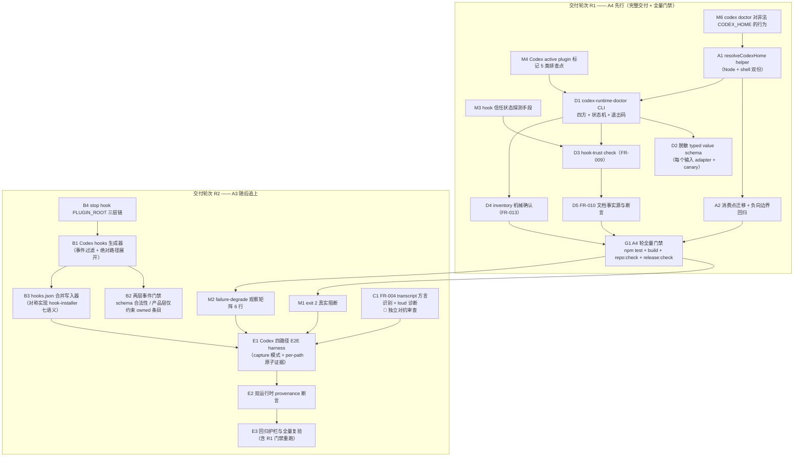
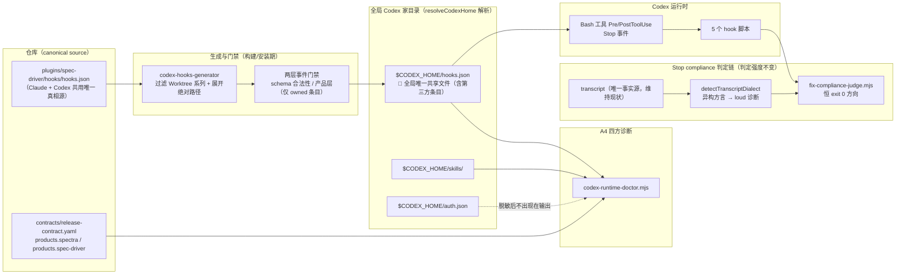

# Feature 240 技术实施计划

> **本 plan 的事实纪律**：所有引用的行号、函数名、字段名均来自实读源码（本轮实读清单见 §2.1）。凡 `_grounding.md` 标注「未确证 / 待实测」的，本 plan 一律安排为 **Phase 0 前置实测任务**，不写死实现，不写死断言。
>
> **rev2 说明**：本版落实用户新拍板的**决策三（FR-004 改道）**与**决策四（先交 A4、A3 随后追上）**，并处置 Codex 对 rev1 的对抗审查结论 C4 / C5 / W1 / W2 / W3 / W4。逐条处置见 **§17 修订记录（rev2）**。rev1 中已被证伪的设计（`.specify/runs` 主信号、`pre-tool-use-guard.sh` 早退）已从本 plan 中**移除**，不再作为实施依据。

---

## 1. 架构概览与改动全景

### 1.1 两条交付线 + 两个交付轮次

本 feature 交付 **A3（Codex hooks 合同）** 与 **A4（CODEX_HOME 与四方一致性诊断）** 两条线。按 spec §1.1 硬约束，二者**共用一个 feature、但拥有各自独立的验收状态与任务批次**。

**决策四（用户拍板）**：二者不仅验收状态分离，**交付时点也分离** —— **R1 轮先完整交付 A4 并通过全量门禁；R2 轮在同一分支随后交付 A3**。详见 §10。



### 1.2 数据流全景



### 1.3 影响面清单

| 类别 | 数量 | 明细 |
|---|---|---|
| 新增生产文件 | 6 | `src/core/codex-home.ts`、`plugins/spec-driver/scripts/lib/codex-home.sh`、`.../lib/codex-hooks-schema.mjs`、`.../lib/codex-hooks-generator.mjs`、`.../lib/codex-hooks-installer.mjs`、`.../lib/codex-runtime-doctor-core.mjs` |
| 新增 CLI 入口 | 4 | `validate-codex-hooks.mjs`、`install-codex-hooks.mjs`、`codex-runtime-doctor.mjs`、`check-codex-inventory.mjs` |
| 修改现有生产文件 | 9 | `fix-compliance-judge.mjs`、`lib/fix-compliance-core.mjs`、`lib/fix-compliance-io.mjs`、`hooks/stop-fix-compliance-check.sh`、`codex-skills.sh`、`src/installer/skill-installer.ts`、`src/auth/auth-detector.ts`、`src/scripts/postinstall.ts`、`src/scripts/preuninstall.ts` |
| 文案 / 文档修改 | 2 | `lib/extract-wrapper-body.mjs:82`（受 wrapper sha 门禁保护）、`README.md` 的 Codex 安装块（FR-010 事实源，见 §8.9） |
| 新增测试文件 | 10 | 见 §13 |
| 修改现有测试 | 7 | `skill-installer.test.ts`、`auth-detector.test.ts`、`spec-driver-codex-skills.test.ts`、`feature-213-codex-plugin-install.e2e.test.ts`、`plugins/spec-driver/tests/fix-compliance-core.test.mjs`、`.../fix-compliance-io.test.mjs`、`.../fix-compliance-judge-cli.test.mjs` |
| 明令不改（rev2 扩充） | 10 | `validate-orchestrator-models.mjs:84`、`sync-delegation-contract.mjs:60`、`codex-skills.sh:66`（project 分支）、`skill-installer.ts:171`（project 分支）、`scripts/eval-*`、`scripts/pilot-*`、`scripts/baseline-*`、**`hooks/pre-tool-use-guard.sh` + `hooks/post-tool-use-format.sh`（W1 移除）**、**`record-workflow-run.mjs`（决策三移除）**、**`lib/judge-snapshot-core.mjs` 的 `JUDGE_FILE_SET`（§3.3 实读确认无需变更）** |

---

## 2. Codebase Reality Check

### 2.1 目标文件实测数据（本轮实读）

| 文件 | LOC | 公开接口数 | 已知 debt / 风险 |
|---|---|---|---|
| `plugins/spec-driver/scripts/fix-compliance-judge.mjs` | 499 | 4 export（`parseArgs`/`buildFeedbackText`/`main` + 内部 7 函数） | `evaluate()` 单函数 131 行（L103-233），含 3 段共 40 行历史教训注释（F224/F227/F230）；4 处 fail-open 分支。**rev2 后本文件新增 ≤ 10 行**，不再跨 500 行 |
| `plugins/spec-driver/scripts/lib/fix-compliance-core.mjs` | 900+ | 多 export | `normalizeTranscriptEntry` L398-402 把 `raw.type` 存入 `entry.role`；消费点只认 `role === 'user'`（L453）与 `role === 'assistant'`（L510 / L837）。**rev2 的方言识别落在本文件**（已在 `JUDGE_FILE_SET` 内） |
| `plugins/spec-driver/scripts/lib/fix-compliance-io.mjs` | 335 | 11 export | `readHookPayload` L43-45 强制要求 `transcript_path` 非空，在 Codex（schema 为 nullable）下是隐性耦合点；`readTranscriptEntries` L79-93 逐行容错，**Codex rollout 每行都是合法 JSON → 不触发任何 diagnostics** |
| `plugins/spec-driver/scripts/lib/judge-snapshot-core.mjs` | 265+ | 多 export | `JUDGE_FILE_SET` L16-23 **实读为 6 项**，且**已含 `scripts/lib/fix-compliance-core.mjs`** → rev2 无需变更（§3.3） |
| `plugins/spec-driver/scripts/record-workflow-run.mjs` | 407 | 1 export（`recordWorkflowRun`） | 事件中零 `sessionId` / 零 `turnId`（grep 零命中）。**rev2 不改本文件**（决策三） |
| `src/hooks/hook-installer.ts` | 195 | 3 export | 无 debt；结构为**扁平** `HookConfig[]`，与 Codex 的两级嵌套结构不同构（见 §6.1） |
| `src/installer/skill-installer.ts` | 277 | 5 export | 🔴 `resolveTargetDir` L163-172：同函数两分支语义相反（global=家目录 / project=cwd） |
| `src/auth/auth-detector.ts` | 369 | 2 export | `getHomeDir()` L81-83 只处理 `HOME`/`USERPROFILE`；`isCodexAuthenticated()` L123-127 硬编码 `.codex` |
| `src/scripts/postinstall.ts` | 84 | 0（脚本） | L28 硬编码 `join(homedir(), '.codex')` |
| `src/scripts/preuninstall.ts` | 74 | 0（脚本） | 无直接硬编码，经 `resolveTargetDir('global', 'codex')` 间接依赖 |
| `plugins/spec-driver/scripts/codex-skills.sh` | 273 | — | L57 global 分支硬编码 `$HOME/.codex/skills`；L66 project 分支**不得改**；L233 sidecar 路径由 `dirname "$TARGET_DIR"` 推导（改 helper 后自动跟随）；L248 是安装成功收尾输出（FR-010 提示落点） |
| `plugins/spec-driver/hooks/hooks.json` | 79 | — | 6 事件，全部用 `${CLAUDE_PLUGIN_ROOT}` 插值；Codex 下会展开为空串 |
| `plugins/spec-driver/hooks/stop-fix-compliance-check.sh` | 36 | — | L11-15 已有 `CLAUDE_PLUGIN_ROOT` → `BASH_SOURCE` 两级 fallback，可直接扩为三级；**全仓零测试覆盖**（本轮改动须同批补） |
| `plugins/spec-driver/hooks/pre-tool-use-guard.sh` | 42 | — | 全仓零测试覆盖（Grep 确认仅 `hooks.json` 引用）。**rev2 明令不改**（W1，见 §17） |
| `plugins/spec-driver/hooks/post-tool-use-format.sh` | 28 | — | 同上 |
| `plugins/spec-driver/scripts/lib/extract-wrapper-body.mjs` | 141 | 2 export | L82 文案含 `~/.codex/spec-driver-capability.md`；受 wrapper body-sha256 门禁保护 |
| `plugins/spec-driver/scripts/judge-snapshot-doctor.mjs`（复用范本） | 265 | 1 export | 无 debt；`--format json` 尚未实现（当前只有文本报告），本 feature 不改它 |
| `plugins/spec-driver/scripts/lib/detect-codex-capability.mjs`（复用范本） | 207 | 5 export | 无 debt；错误分类模式可直接照搬 |
| `README.md`（FR-010 事实源） | — | — | L282-320 为 `📦 Install for Codex (CLI + skills)` 折叠块，L316-318 是 `Notes:` 列表（实读确认）。非生成文件，改动不触发 `repo:sync` |

### 2.2 前置清理判定

按「LOC > 500 且新增 > 50 行」「>3 个相关 TODO/FIXME」「>30 行重复逻辑出现 2+ 次」三条规则逐项核对：

- **无文件当前 LOC > 500**（最大 499）。
- **全仓目标文件零 TODO/FIXME/HACK 标记**（实读确认）。
- **无 >30 行重复逻辑**。

→ **不新增 `[CLEANUP]` 前置任务**。

**rev2 结构性约束（非清理，属设计约束）**：`fix-compliance-judge.mjs` 已 499 行、`evaluate()` 已 131 行。rev2 的 FR-004 实现 **MUST** 把判定逻辑放在 `lib/fix-compliance-core.mjs` 的独立纯函数中，`evaluate()` 内只允许 ≤ 8 行的调用与分支接线，`fix-compliance-judge.mjs` 全文净增 ≤ 10 行。

---

## 3. Impact Assessment

### 3.1 rev1 的两条一手代码发现（已由决策三整体消解，仅存档）

- **§3.1.1**：`workflow-run-summary` 并非只有编排器写 —— `fix-compliance-judge.mjs:334-347` 的 `releaseDegraded()` 自己也写一条，且 `runId === sessionId`（`_grounding.md` §9.1.1 已确认）。
- **§3.1.2**：`record-workflow-run.mjs` 全文 grep `sessionId|session_id|turnId|turn_id` 零命中，spec 要求的关联键一个都不存在。

**处置（决策三，用户拍板，不得重开）**：编排器实测 + Codex 审查双重证实，正常 `workflow-run-summary` **不含任何合规判定字段**（可用字段仅 `workflowId/runId/result/startedAt/finishedAt/durationMs/rerun/rerunPhase/completedPhases/phaseDurations/gatePauses/verificationFailures/artifacts/warnings`），排除带 `complianceVerdict` 的记录后**无合规信息可读**；且 `.specify/runs/` 是判定进程自身可读写删的普通文件，**不构成可信安全边界**（Codex 已构造可主动触发的绕过）。

→ **「换主信号源」方案整体作废**。FR-004 改道为「判不了就大声报」（§5）。上述两条发现不再驱动任何设计，仅作为「为何不走这条路」的论据保留。

### 3.2 影响范围与风险等级（rev2 重算）

| 维度 | rev1 评估 | rev2 评估 |
|---|---|---|
| 直接修改文件 | 15 | **18**（生产 9 + 文案/文档 2 + 测试修改 7） |
| 新增文件 | 19 | **20**（生产 6 + CLI 4 + 测试 10，含 harness） |
| 间接受影响 | `JUDGE_FILE_SET`、`repo:check` wrappers 族、5 处 SKILL.md + wrapper 三份产物 | **`repo:check` 的 `spec-driver-wrappers` 族（仅因 §7.5 文案）**；`JUDGE_FILE_SET` 与 SKILL.md **均不再受影响** |
| 跨包影响 | 3 | **3**（`src/` / `plugins/spec-driver/` / `scripts/`+`tests/`），不变 |
| 数据迁移 | 2 处 | **1 处**：`$CODEX_HOME/hooks.json` 对用户既有数据的原地改写。`.specify/runs/*.jsonl` schema 扩展**已取消** |
| API / 契约变更 | 3 处 | **1 处**：Codex 侧 hooks.json 安装契约（新增）。`recordWorkflowRun()` 入参与事件 schema、`JUDGE_FILE_SET` 常量**均不变** |
| **风险等级** | 🔴 HIGH | **🔴 HIGH（不降级）**：跨包 3 > 2 且涉及对用户全局共享文件的原地改写，两条判定规则仍命中 |

**分项风险变化**：FR-004 侧由 🔴 CRITICAL（判定链主流程重构 + 新绕过面）降为 🟡 **LOW-MEDIUM**（新增一条纯函数识别分支 + 复用既有诊断落盘路径，恒 exit 0 方向、零新 I/O）。FR-011 侧仍为 🔴 CRITICAL（用户数据丢失面）。

**HIGH 风险强制分阶段**：本 plan 按 §15 划分阶段，并按决策四拆为 **R1（A4）/ R2（A3）两个交付轮次**，每轮各有独立、可机械验证的验收点。

### 3.3 门禁连锁：`JUDGE_FILE_SET` 的实读结论（rev2 更正）

`plugins/spec-driver/scripts/lib/judge-snapshot-core.mjs:16-23` 的 `JUDGE_FILE_SET` 是判定器 import 闭包的**冻结清单**，由 `plugins/spec-driver/tests/judge-file-set-guard.test.mjs` 断言「对真实入口做 BFS 解析出的静态 import 闭包 == `JUDGE_FILE_SET`」，遇 dynamic import 直接 FAIL。

**实读确认（rev2 新增）**，当前 6 项为：

```
scripts/fix-compliance-judge.mjs
scripts/lib/fix-compliance-core.mjs          ← rev2 的新逻辑落点，已在清单内
scripts/lib/fix-compliance-execution-record.mjs
scripts/lib/fix-compliance-io.mjs
scripts/lib/simple-yaml.mjs
scripts/record-workflow-run.mjs
```

→ rev2 的 FR-004 实现（`detectTranscriptDialect` 落在 `fix-compliance-core.mjs`、io 的 payload 放宽落在 `fix-compliance-io.mjs`）**全部落在既有 6 个文件内，且不新增任何 import** ⇒ **`JUDGE_FILE_SET` 无需变更，`judge:doctor` 也不会产生预期 drift**（rev1 的「7 文件 vs 快照 6 文件」说明作废）。

**约束保留（仍必须遵守）**：
1. 实现 **MUST NOT** 新建模块或新增相对 import；若实施阶段发现确有必要，**MUST** 同批把新文件加进 `JUDGE_FILE_SET` 并同步更新 `judge-snapshot-core.test.mjs` 的长度断言，且在交付报告中说明 `judge:doctor` 会对旧安装快照报 drift（预期行为）。
2. **禁止 dynamic import**（守卫直接 FAIL 且不可绕过）。
3. 无论是否变更，`judge-file-set-guard.test.mjs` 与 `judge-snapshot-core.test.mjs` **MUST** 作为回归项跑一次（§11 护栏 6）。

---

## 4. clarification 三项阻塞歧义的消解结论

> 三项均为 `clarification.md` 判定「阻塞 plan」的条目，本节给出**最终结论**，implement 阶段不得再重新裁决。

### 消解 #3 —— FR-008「确认不存在等价机制」操作化为可枚举排查点清单

**结论：采纳解读 B（强标准），并把它固化为代码内的 `PLUGIN_BUILD_PROBES` 常量数组。**

`plugin-build` 维度落 `indeterminate` 的**唯一合法路径**是：下列 5 类排查点**全部执行且全部无结果**。任一探查抛错也算「已执行」（记 `error`），但不得因抛错跳过其余探查。

| # | probe id | 具体探查内容 | 判定为「命中」的条件 |
|---|---|---|---|
| 1 | `codex-plugin-manifest` | 读 `<pluginRoot>/.codex-plugin/plugin.json` 的**完整字段集**（不是只看某个字段），寻找任何 active/installed/enabled 语义字段 | 存在可判定 active 版本的字段 |
| 2 | `codex-cli-help` | `codex --help` 与 `codex plugin --help` 的 stdout（按 `detect-codex-capability.mjs` 的子进程错误分类模式调用） | 输出中存在可列出已安装 plugin 及其 active 版本的子命令 |
| 3 | `codex-doctor-checks` | `codex doctor --json` 的 `checks` 键集合 | 存在覆盖 plugin 版本/active 标记的 check id |
| 4 | `codex-home-paths` | `$CODEX_HOME/` 下已知路径探测：`plugins/`、`plugins/cache/<market>/<plugin>/<version>/`、`.codex-global-state.json` | 任一路径含 active 标记元数据 |
| 5 | `app-server-rpc` | app-server RPC 能力列表（经 `codex debug app-server send-message-v2`），寻找 plugin 清单类方法 | 存在返回 active plugin 的 RPC |

**报告契约**：`details.probedSources` MUST 为长度恒为 5 的数组，每项 `{ id, outcome }`，`outcome ∈ found | absent | error | not-executable`。全部非 `found` 才允许 `status: indeterminate` + `reason: codex-active-marker-unknown`。**rev2 追加（C5）**：`id` 与 `outcome` 均为**固定枚举**，**禁止**在该结构中携带任何自由文本（错误细节改用 `errorClass` 枚举，见 §8.7）。

**明令禁止**：少于 5 项探查即落 `indeterminate`；用「取最高版本号」兜底（F236 已证伪）。

**测试化**：`codex-runtime-doctor.test.ts` MUST 有一条用例断言「`probedSources.length === 5` 且 id 集合恰等于上表」，使「随手 try 一个路径」在测试层就不可能通过。

### 消解 #5 —— `overallStatus` 真值表补全（`indeterminate` → `warning`）

**结论：采纳 `indeterminate`（无 `fail` 时）→ `warning`。** 完整真值表（实现为一个纯函数 `aggregateOverallStatus(checks)`，逐行单测）：

| 条件（按顺序求值，先命中先返回） | `overallStatus` |
|---|---|
| 存在任一 `status === 'fail'` | `fail` |
| 否则存在任一 `status === 'indeterminate'` | `warning` |
| 否则存在任一 `status === 'warning'` | `warning` |
| 否则（全部为 `ok` 或 `not-applicable`） | `ok` |
| checks 为空集（不应发生，防御分支） | `warning` + 追加 `reason: no-checks-executed` |

**理由**：`fail` 语义保留给确定性的不一致结论；`indeterminate` 是「我们不知道」。若把二者都映射到 `fail`，`--strict` 下退出码 1 就会在「本机没装 Codex」这种完全正常的场景触发，使 `--strict` 永远不可用于 CI —— 而 `--strict` 存在的唯一目的就是未来的 CI 接入。

**不变量**：任一 check 非 `ok`/`not-applicable` 时，`overallStatus` **MUST NOT** 为 `ok`（复用 F236「不允许整体短路」教训）。该不变量单独一条 property-style 测试（对全部状态组合穷举）。

### 消解 #6 —— FR-003 failure-degrade「对比记录」= 文档产出，不设自动化断言

**结论：采纳解读 B（结构化文档对比），产出落点钉死为两处，二者内容必须一致：**

1. **本 plan §9.4 的对比表**（Codex 侧实测行为 vs Claude 侧 fail-open 语义，逐形态对照）—— Phase 0 的 M2 实测完成后回填本表；
2. `tests/e2e/codex-hooks/run-e2e.sh` **脚本头部注释**中的同一张表（供未来维护者在改脚本时就地看到）。

**明令禁止**：
- 不新建跨运行时行为一致性对比测试基础设施；
- 不把「两运行时行为是否一致」设为任何测试的断言目标；
- tasks 阶段**只允许拆出一个「写对比文档」task**，不得拆出「写对比测试」task。

**唯一的自动化断言**仍是 FR-003 的否定式判据：每种触发形态下 `codex exec` 在有界超时内退出、无产品级崩溃（SC-005）。

---

## 5. P1：FR-004 改道 —— transcript 方言识别与 loud 诊断（rev2 全节重写）

> **决策三（用户拍板）**：FR-004 从「换主信号源夺回判定能力」改为「**判不了就大声报**」。
>
> 🔴 **本节的范围声明（禁止 over-claim，交付报告必须原样复述）**：
> - 这是**可观测性**改进，**不是**安全强度改进；
> - **不提供**独立于判定器的第二事实源；
> - **不提高**合规判定强度，**不改变**任何放行 / 阻断语义（恒 exit 0 方向）；
> - 唯一改变的是：判定能力在 Codex 运行时失效时，**是否留下可事后审计的诊断**。

### 5.1 现状判定链（实读结论，rev2 未变）

```
stop-fix-compliance-check.sh:28  → node fix-compliance-judge.mjs --mode hook
  main(argv, stdin) :456
    ├─ readHookPayload(stdin)        io.mjs:34   ← 强制要求 session_id 与 transcript_path 均非空
    │    └─ 不满足 → tryAppendFailOpenEvent(['payload-invalid']) + exit 0   :470-477
    └─ runHook(projectRoot, payload) :398
        ├─ findAndParseConfig → enforcement==='off' 即 return 0        :400-401
        ├─ evaluate(projectRoot, payload.transcript_path, cfg)         :403
        │   ├─ readTranscriptEntries(transcriptPath)   :109
        │   ├─ if transcriptDiagnostics.length>0 → return verdict:null :110-116  ← fail-open 出口 1
        │   ├─ detectFixSkillExpansion(entries) → 非 fix 即 return     :118-125  ← 🔴 静默出口
        │   ├─ …（F227 磁盘兜底 / F224 按维度收窄 / judgeCompliance）    :127-232
        ├─ transcriptDiagnostics → tryAppendFailOpenEvent + return 0   :406-409  ← fail-open 出口 2（loud）
        ├─ !isFix || !verdict → return 0                                :411     ← 🔴 静默零落盘
        ├─ compliant → resetBlockState + return 0                       :415-418
        ├─ enforcement==='warn' → 审计 + stderr + return 0              :422-428
        └─ routeBlock(...)                                              :431
```

### 5.2 Codex 下的真实行为（实读可确定，无需实测）

Codex Stop payload 的 `transcript_path` 实测有值（`_grounding.md` §8.5），内容是 `{timestamp,type,payload}` 的 Codex rollout wire format，`type ∈ {session_meta, event_msg, response_item}`。逐步推演：

1. `readTranscriptEntries`（io.mjs:60-94）**成功**：每行都是合法 JSON → `parseError` 全 false → 不触发 `transcript-unavailable`，`transcriptDiagnostics` 为**空**。
2. `normalizeTranscriptEntry`（core.mjs:398-402）把 `raw.type` 存进 `entry.role`；Codex 行无 `raw.message` → `textBlocks`/`toolUseBlocks`/`toolResultBlocks` 全空。
3. `detectFixSkillExpansion` 只认 `entry.role === 'user'`（core.mjs:453）→ 找不到锚点 → `isFix === false`。
4. `runHook` L411 `!result.isFix → return 0` —— **静默放行，零诊断落盘**。

→ **结论**：Codex 下当前判定链不是「fail-open 但可审计」，而是「**静默判为非 fix 会话**」。这比 spec 原描述的「transcript 解析失效」更隐蔽 —— 事后审计里连一条 degraded 事件都没有。**修正这一点就是 rev2 版 FR-004 的全部范围。**

### 5.3 改造设计（三处改动，合计新增 ≈ 60 行）

#### (1) `lib/fix-compliance-core.mjs` 新增纯函数 `detectTranscriptDialect(entries)`

```js
export const CLAUDE_TRANSCRIPT_ROLES = Object.freeze(['user', 'assistant', 'system', 'summary']);
export const CODEX_ROLLOUT_ROLES   = Object.freeze(['session_meta', 'event_msg', 'response_item']);

/**
 * 纯函数：对已由 normalizeTranscriptEntry 归一化的 entries 做方言识别。
 * @returns {'claude'|'codex-rollout'|'unknown'|'empty'}
 */
export function detectTranscriptDialect(entries) { /* ≈ 25 行 */ }
```

**判定规则（必须是正向识别，顺序求值）**：

| # | 条件 | 结果 |
|---|---|---|
| 1 | 非 `parseError` 条目数 === 0 | `'empty'`（不产生诊断，维持现状） |
| 2 | 存在任一条目 `role ∈ CLAUDE_TRANSCRIPT_ROLES` | `'claude'`（🔴 **默认归属**，保证 Claude 现状逐字节不变） |
| 3 | 否则，`role ∈ CODEX_ROLLOUT_ROLES` 的条目数 ≥ 1 | `'codex-rollout'` |
| 4 | 否则 | `'unknown'` |

🔴 **最关键的禁令**：**MUST NOT** 用「不是 fix 会话」反推方言。若把「无 fix 锚点」当作异构信号，则**每一个正常的 Claude 非 fix 会话都会落盘一条诊断**，直接摧毁 `runHook:410` 注释写明的「US5：健康路径不产生任何落盘」不变量，并把审计事件流淹没。规则 2 的「存在任一 Claude role 即判 claude」就是这条禁令的机械实现。

#### (2) `fix-compliance-judge.mjs` 的 `evaluate()` 非 fix 分支接线（≤ 8 行）

现状 L118-125 的 `!isFix` 分支返回 `transcriptDiagnostics: []`。改为：

```js
  const anchor = detectFixSkillExpansion(entries);
  const isFix = anchor.found && anchor.mode === 'fix';
  if (!isFix) {
    // FR-004(rev2)：仅在**正向识别**到异构 wire format 时补 loud 诊断；
    // Claude 会话（含正常非 fix 会话）恒走 [] 分支，零落盘语义逐字不变。
    const dialect = detectTranscriptDialect(entries);
    const foreign = dialect === 'codex-rollout' || dialect === 'unknown';
    return {
      enforcement, configDegraded, isFix: false, mode: anchor.mode,
      transcriptDiagnostics: foreign ? ['transcript-format-unrecognized', `dialect:${dialect}`] : [],
      verdict: null,
    };
  }
```

#### (3) `runHook` 的既有 loud 出口**逐字不变**

L406-409 现有分支 `if (result.transcriptDiagnostics.length > 0) { tryAppendFailOpenEvent(...); return 0; }` **自动承接**新诊断，落一条 `eventType: 'fix-compliance-verdict'`、`degraded: true`、`compliant: null` 的审计事件（`tryAppendFailOpenEvent` 实读于 L368-392）。

🔴 **本改动零签名变更、零新控制流分支、零新增 I/O**：`runHook` / `evaluate` / `readHookPayload` 的函数签名全部不变；rev1 计划中的 `evaluate(projectRoot, payloadOrPath, cfg)` 签名改造、L406-409 条件收窄、`releaseDegraded` 双保险全部**作废**。

#### (4) 收窄保留项：`lib/fix-compliance-io.mjs:43-45` 的 `transcript_path` 放宽

| 项 | 内容 |
|---|---|
| 改法 | `transcript_path` 由「必需为非空字符串」放宽为「可为 `null` / 缺失」；`session_id` **仍必需非空**；类型非法（非字符串且非 null）仍判 `payload-invalid` |
| 下游 | `evaluate` 收到空 `transcriptPath` 时 `readTranscriptEntries` 走 `transcript-unavailable`（statSync 抛错）→ 已有 loud 路径。**为可诊断性再加一条**：`runHook` 前置判空，产出 `['transcript-path-absent']` 而非 `transcript-unavailable`，两者语义不同 |
| 理由 | Codex payload schema 明确 `transcript_path` 为 nullable（`_grounding.md` §3.1）。不放宽 ⇒ 该类会话一律落 `payload-invalid`，诊断**误导**（看起来像 payload 坏了，其实 payload 合法）。这与本节「可观测性」目标直接冲突 |
| 风险 | 放宽后一个真正畸形的 Claude payload 可能从 `payload-invalid` 变为 `transcript-path-absent`。**两者退出码均为 0、均 loud 落盘**，无行为差异，只是诊断码更精确。测试须同时断言两种码各自的触发条件 |

#### (5) 不变量（MUST 写进代码注释 + 逐条机械验证）

| # | 不变量 | 验证方式 |
|---|---|---|
| **I1** | **退出码恒等**：本改造在任何 transcript 下都只可能产出 exit 0 路径，**不新增任何 exit 2 可能** | 静态：新代码路径只落在 `!isFix` 分支与 io 校验；机械：对 Codex/未知/空/Claude 四类 fixture 断言 CLI 退出码恒为 0 |
| **I2** | **Claude 零回归**：`dialect === 'claude'` 时 `evaluate` 与 `runHook` 的返回值与落盘行为与改动前**逐字节等价** | `fix-compliance-judge-cli.test.mjs` 扩展：对既有 Claude fixture 全集断言 verdict/退出码/落盘事件数与钉死基线相等 |
| **I3** | **健康路径零落盘保持**：Claude 非 fix 会话仍**零落盘** | 专门用例：喂一段无 fix 锚点的正常 Claude transcript → 断言审计事件文件**未被创建/未增长** |
| **I4** | **无新 I/O、无 DoS 面**：检测只消费已解析的 `entries`，单遍 O(n)，零额外文件读取 | 静态守卫用例：`detectTranscriptDialect` 函数体内 `fs.`/`require`/`import(` 零命中；大体量 entries 的耗时上界用例 |
| **I5** | **单调性**：不存在任何路径把「改动前阻断」变为「改动后放行」，也不存在把「改动前放行」变为「改动后阻断」 | 由 I1+I2 蕴含；另加一条组合用例覆盖 fix 会话不受影响 |

**为何不再需要 rev1 的 `fix-compliance-runs-source-monotonicity.test.ts`**：rev1 的单调性风险来自「新增主信号可能把放行转为阻断」。rev2 不引入任何判定输入，I1 已把该风险面归零；单调性退化为 I2 的等价性断言。

### 5.4 FR-004 的独立对抗审查计划（spec §11 硬性要求，题面按 rev2 重写）

| 项 | 内容 |
|---|---|
| **审查对象** | `lib/fix-compliance-core.mjs` 的 `detectTranscriptDialect` 全文 + `fix-compliance-judge.mjs` 的 diff + `lib/fix-compliance-io.mjs` 的 diff |
| **触发时机** | R2 轮 Phase C 代码完成、单测全绿之后，**Phase E 收口之前**；不与 FR-011 的审查合并（F238 教训：打包审查稀释对抗深度） |
| **审查者** | `codex:codex-rescue` 子代理，独立委派 |
| **必须提问的对抗题面**（写进 prompt） | ① 能否构造一份 **Claude** transcript 被误判为 `codex-rollout` / `unknown`，从而让正常会话开始落盘诊断（破坏 I3、污染审计流）？② 反过来，能否构造一份 **Codex** rollout 让方言识别落回 `'claude'`，使诊断继续静默（本改造被架空）？③ 是否存在任一路径使退出码不再恒为 0（破坏 I1）？④ 攻击者能否用可控 transcript 让每次 Stop 都写诊断事件，构成审计文件膨胀 / 磁盘 DoS？⑤ `transcript_path` 放宽后，是否有原本被 `payload-invalid` 挡住的输入进入了新的代码路径并造成异常？⑥ 本改造是否在任何文档 / 代码注释 / 输出文案中**暗示**了「合规判定强度提高」或「获得独立事实源」（over-claim 检查）？ |
| **处置纪律** | 真实 bug / 边界遗漏 → 立即修 + 重跑 SC-007 全矩阵 + I1~I5 全部不变量测试；风格建议 → 记录进 commit message |
| **收敛判据** | 上述 6 题全部给出「已证伪 / 已修复 / 已论证不可达」的明确结论，且无遗留 CRITICAL |

### 5.5 rev1 中已删除的设计（禁止复活）

以下条目在 rev2 中**整体删除**，实施阶段**禁止**以任何形式重新引入：

- 主信号候选池 C1~C5 与 `selectPrimarySignal` / `readRunEvents` / `crossCheckTranscript` 三个导出；
- `complianceVerdict` 结构性 provenance 排除与「写入方数量恒为 1」守卫测试；
- `record-workflow-run.mjs` 的 `--session-id` / `--turn-id` flag 与 `normalizeCorrelation`；
- 5 处 SKILL.md 的调用文本改动与随之而来的 wrapper 再生；
- `specs/208-.../contracts/record-workflow-run-fields.md` 的两条合同修订；
- Phase 0 的 **M5**（会话/轮次标识可得性实测）与其 α / β 双分支；
- 新模块 `lib/fix-compliance-runs-source.mjs` 与 `JUDGE_FILE_SET` 6→7；
- `evaluate()` 的签名改造与 `runHook` L406-409 的条件收窄。

---

## 6. P2：FR-011 Codex `hooks.json` 合并写入

### 6.1 复用方式决策：**对称实现**，不抽共享 helper

spec FR-011 允许「抽取共享 helper」或「对称实现同一套语义」二选一。**本 plan 选对称实现**，三条决定性理由：

1. **包边界不可跨**：`src/hooks/hook-installer.ts` 属 **npm `spectra` 包**（TS，需 `npm run build` 产出 dist）；Codex hooks 的写入方是 **spec-driver 插件**（`plugins/spec-driver/scripts/`，纯 `.mjs`，从 plugin cache 直接 `node` 执行，**没有 build 步骤、不能依赖 dist**）。让插件脚本 import `src/` 编译产物会给插件引入构建期依赖，直接违反插件当前的零构建分发模型。
2. **数据形状不同构**：Claude 侧是**扁平** `settings.hooks.PreToolUse: {matcher, command}[]`；Codex 侧是**两级嵌套** `hooks.<Event>: [{matcher, hooks: [{type, command}]}]`（`_grounding.md` §8.1 实测 schema）。抽公共 helper 就得引入路径寻址式的通用合并器 —— 对两个消费者做通用抽象，正是「不在错误的抽象上叠加 workaround」要避免的。
3. **护栏优先级**：SC-016 要求 Claude 侧零回归。为了 DRY 去泛化 `hook-installer.ts`（含其 18 个单测），会把本 feature 里价值最高的那条护栏置于风险中。

**对称实现的漂移风险用测试层 DRY 补偿**：新增 `tests/unit/hook-installer-semantics-parity.test.ts`，把 FR-011 的 7 条语义写成**一张参数化的语义合同表**，通过一层薄适配器（暴露 `install/remove/readTarget` 三个函数引用）**对两个 installer 各跑一遍同一组断言**。共享的是「保证」而不是「实现」。

### 6.2 新增模块

`plugins/spec-driver/scripts/lib/codex-hooks-installer.mjs`（约 180 行），导出：

```js
export function installCodexHooks({ codexHome, pluginRoot, entries }) : { ok, changed, backupPath, diagnostics }
export function removeCodexHooks({ codexHome }) : { ok, removedCount, diagnostics }
export function isOwnedEntry(command) : boolean     // 归属判定，独立导出供测试与门禁复用
```

零第三方依赖；原子写入用模块内 ~15 行的 `writeJsonAtomic`（tmp 文件 + `fs.renameSync`）。该函数与 `src/utils/atomic-write.ts` 功能重复 —— **这是包边界强制产生的重复，在模块头注释中显式说明**，并由 §6.1 的 parity 测试覆盖其行为一致性。

### 6.3 归属锚点设计（FR-011.4：必须用 `command` 字符串，禁用自定义 JSON 字段）

我方 5 个脚本的 basename 集合（4 个事件、5 个 handler，Stop 有两个）：

```
postinstall.sh / pre-tool-use-guard.sh / post-tool-use-format.sh
stop-task-check.sh / stop-fix-compliance-check.sh
```

**归属谓词 `isOwnedEntry(command)` = 下列两条同时成立**：

1. `basename(command 中的脚本路径) ∈ 上述 5 项集合`；
2. 该脚本路径中存在一个名为 `spec-driver` 的**目录分量**（`/spec-driver/`）。

**为何需要第 2 条**：`postinstall.sh` 是一个通用度很高的名字，单靠 basename 存在误伤第三方条目的真实风险（会导致「精确卸载」变成「误删他人 hook」，属静默数据丢失）。加上 `spec-driver` 目录分量后，我方安装路径（无论仓库内 `plugins/spec-driver/...` 还是 Codex plugin cache 下 `.../spec-driver/<version>/...`）恒满足，而第三方 `/opt/other/postinstall.sh` 恒不满足。

**为何不用「trailing shell 注释做标记」**：`command` 经 `$SHELL -lc` 执行，追加 `# spec-driver-hook` 路径无关且可行，但会在用户查看 `hooks.json` 时产生视觉噪声，且依赖「所有可能的 `$SHELL` 都把 `#` 当注释」这一未实测假设（fish/csh 未验证）。当前谓词已足够，不引入未确证依赖。

**唯一性的机械验证**：`codex-hooks-installer.test.ts` MUST 含三条负向用例：`bash /opt/other/postinstall.sh`、`bash /home/u/spec-driver-notes/postinstall.sh`（`spec-driver-notes` 不是分量精确匹配）、`bash /x/spec-driver/other.sh`（basename 不在集合内）—— 三者 `isOwnedEntry` 均须为 `false`。

### 6.4 两层事件门禁的作用域（rev2 按 C4 修订）🔴

**rev1 缺陷（Codex 审查 C4）**：SC-001「安装后 `$CODEX_HOME/hooks.json` 的事件集合恰等于 4 项」与 FR-011「非破坏性合并」**自相矛盾** —— 用户若已有合法的第三方 `PermissionRequest` 等 hook，合并后事件必然多于 4 项，只能二选一：删第三方数据（违反 FR-011）或校验必然失败。

**rev2 修订：两层门禁按「作用域」而非「文件全集」定义。**

| 层 | 作用域 | 判据 | 失败级别 |
|---|---|---|---|
| **schema 层** | 最终文件的**全部**事件名 | 事件名合法性（对照 Codex 10 事件全集，`_grounding.md` §8.1） | **我方 owned 条目所在事件名不合法 → `fail`（code: `owned-event-illegal`）**；**第三方条目所在事件名不在全集内 → `warning`（code: `unknown-event-name`），不判 fail** |
| **产品层** | **仅我方 owned 条目**（`isOwnedEntry(command) === true`）所覆盖的事件集合 | 该集合**恰等于** `{SessionStart, PreToolUse, PostToolUse, Stop}` 4 项 | 越界 / 缺项 → `fail`（code: `product-event-out-of-scope` / `product-event-missing`），失败 code 可区分 |

**为何第三方未知事件名只 warning 不 fail**：Codex 版本演进会扩充事件全集，且我们对第三方条目**无否决权**。把它设为 fail 会让我方门禁因用户数据而红，等价于用门禁逼用户删数据 —— 与 FR-011 非破坏性原则冲突。

**三处校验对象的重定义**：

| # | 校验对象 | 产品层判据 | 附加断言 |
|---|---|---|---|
| 1 | canonical `hooks.json` 的派生输入 | owned 事件集合 == 4 项（此处全部条目都是我方的） | — |
| 2 | 生成器输出（未合并） | owned 事件集合 == 4 项 | 无 `${` 残留、command 为绝对路径 |
| 3 | 安装后 `$CODEX_HOME/hooks.json`（**已合并第三方数据**） | **仅对 owned 子集**断言 == 4 项 | 🔴 **必须同批断言第三方条目逐字节保留**（安装前后对第三方条目做深相等比较） |

**新增必测负向用例（C4 的回归钉子）**：预置一份含合法第三方 `PermissionRequest` 条目与一份含未知事件名条目的 `$CODEX_HOME/hooks.json` → 执行安装 → 断言：(a) `validate-codex-hooks.mjs` 退出码 0；(b) 第三方两类条目均逐字节保留；(c) 产品层 owned 集合仍恰 4 项；(d) 未知事件名产出 `warning` 诊断而非 `fail`。

### 6.5 七条语义的落点

| # | 语义 | 实现落点 | 对照 `hook-installer.ts` |
|---|---|---|---|
| 1 | 合并而非覆写 | 读取 → 逐事件深合并 → 只增删满足 `isOwnedEntry` 的 handler，其余对象/未知字段（含顶层 `description`）原样透传 | `:130-137` |
| 2 | 幂等 | 🔴 **取「原地更新」而非「跳过」**：同事件下已存在我方条目时，用新 `command`（绝对路径）**替换该条目**，条目数恒不变 | `:119-121`（Claude 侧为「跳过」，此处**有意分歧**，见下） |
| 3 | 可精确卸载 | `removeCodexHooks` 过滤掉全部 `isOwnedEntry` 条目；过滤后该事件的 handler 数组为空则连同事件键一并删除（避免留下空数组噪声） | `:182` |
| 4 | 归属标记 | §6.3 谓词，零自定义 JSON 字段 | `:26` |
| 5 | 写入前备份 | `copyFileSync(target, target + '.bak')`，仅在目标存在时 | `:125` |
| 6 | 非法 JSON 报错不覆写 | `JSON.parse` 抛错 → 抛出带修复指引的 Error，**在抛错前不做任何写操作**（含备份）；SC-008(f) 断言前后 sha256 相等 | `:112`、`:171` |
| 7 | 类型防御 | `hooks` 非对象 → 视为 `{}`；`hooks[Event]` 非数组 → 视为 `[]`；组内 `hooks` 非数组 → 视为 `[]`；三层各自 `Array.isArray`/`typeof` 守卫，不抛未捕获异常 | `:118`、`:175` |

**第 2 条与 Claude 侧有意分歧的理由**：Codex 侧 `command` 内嵌**绝对路径**（FR-005 要求），插件版本升级会改变该路径。若沿用「已存在即跳过」，升级后 `hooks.json` 会永远指向旧版本目录（旧目录可能已被清理 → hook 静默失效）。「原地更新」是 spec FR-011.2 明确允许的两种幂等形态之一，且必须选它。此分歧在 parity 测试中作为**已声明差异**登记，不作为漂移告警。

### 6.6 安装/卸载的挂载点

- 安装：`plugins/spec-driver/scripts/install-codex-hooks.mjs`（新 CLI），由 `codex-skills.sh install --global` 在 skills 安装成功后调用；**project 模式不安装 hooks**（Codex hooks 只有全局位置，无项目级语义）。
- 卸载：`codex-skills.sh remove --global` 调用 `removeCodexHooks`。
- **失败不阻断安装**（照搬 `codex-skills.sh:235-240` 的 sidecar 处理模式）：hooks 写入失败仅告警，不让 skills 安装回滚。**唯一例外**：非法 JSON（语义 6）必须**显式报错并以非零退出码结束该子命令**，因为静默降级会让用户以为 hooks 已装好。
- 安装成功后 MUST 打印 FR-010 的 hook 信任提示（见 §8.9）。

### 6.7 FR-011 的独立对抗审查计划（spec §11 硬性要求）

| 项 | 内容 |
|---|---|
| **审查对象** | `codex-hooks-installer.mjs` 全文 + `install-codex-hooks.mjs` + `codex-skills.sh` diff |
| **触发时机** | R2 轮 Phase B 完成、单测全绿后；**与 FR-004 那次审查分开委派** |
| **必须提问的对抗题面** | ① 能否构造一份 `hooks.json` 使安装后第三方条目丢失？② 能否让 `isOwnedEntry` 误伤第三方条目（→ 卸载时静默删他人数据）？③ 反过来，能否让我方条目逃过 `isOwnedEntry`（→ 卸载残留 + 重装重复）？④ 非法 JSON 路径下是否存在任何写操作（含备份、含 tmp 文件残留）？⑤ 目标文件为符号链接 / 只读 / 目录时行为？⑥ 并发两个安装进程时 `rename` 是否可能丢数据？⑦ 备份文件是否会覆盖用户已有的 `.bak`（数据丢失第二现场）？**⑧（rev2/C4 新增）产品层门禁在存在第三方条目时是否仍可能判 fail，从而事实上逼迫用户删数据？** |
| **收敛判据** | 8 题全部结论明确，无遗留 CRITICAL；②③ 两题必须给出具体的构造尝试结果（不接受「没想到」） |

---

## 7. P3：FR-006/007 `resolveCodexHome` 与迁移（A4，rev2 未受审查影响）

### 7.1 接口最终形态（消解 spec §5.3 的 `opts?` 自相矛盾）

**结论：取「强制显式注入」一侧，`deps` 必填，与 spec §6.3 一致。**

```ts
// src/core/codex-home.ts
export interface CodexHomeDeps {
  env: NodeJS.ProcessEnv;    // 必填
  homedir: () => string;     // 必填
}
/** 纯函数：CODEX_HOME 非空则原样返回，否则 join(homedir(), '.codex') */
export function resolveCodexHome(deps: CodexHomeDeps): string;
/** 全仓库唯一显式传入 process.env / os.homedir 的位置 */
export function resolveCodexHomeFromProcess(): string;
```

**为何是「必填」而非「可选 + 内部默认」**：可选参数意味着函数体内必须有默认值来源（`process.env` / `os.homedir()`），这与「禁止隐式读全局」逻辑冲突 —— 二者不可兼得。F238 已实测证明「可选参数 + 内部默认值」会让 caller 的遗漏**静默降级为默认行为**，从而掩盖下游缺陷（终态 = caller 传参恒 required fail-loud）。

**fail-loud 的实现方式**：TypeScript 类型只在编译期约束，`.mjs` 调用方绕过类型检查仍可不传参 → 函数体首行做运行期守卫：`deps` 非对象、或 `deps.env` 非对象、或 `deps.homedir` 非函数 → `throw new TypeError(...)`。SC-009 的「不传参调用抛错」断言即测此守卫。

**「函数体内不出现 `process.env` / `os.homedir()`」的机械验证**：落地为 `tests/unit/codex-home.test.ts` 内一条读源码文本的用例：断言 `resolveCodexHome` 函数体区间内 `process.env` 与 `os.homedir` 零命中，且全文件中 `resolveCodexHomeFromProcess` 是唯一含它们的位置。

### 7.2 Shell 侧对称实现

`plugins/spec-driver/scripts/lib/codex-home.sh`（可 `source`）：

```bash
# 纯函数形态：两个参数均必传，函数体不读任何全局环境变量
# $1 = CODEX_HOME 的值（可为空串）  $2 = HOME 的值
resolve_codex_home() { ... }
# 唯一读取环境的薄封装（对称于 resolveCodexHomeFromProcess）
resolve_codex_home_from_env() { resolve_codex_home "${CODEX_HOME:-}" "${HOME:-}"; }
```

**shell 侧特有约束**（spec §6.3）：
- 所有路径变量引用**必须**加双引号（应对含空格路径）；
- 拼接用 `"${base%/}/skills"`（先剥尾斜杠再拼）而非直接 `"$base/skills"`，避免 `//`；
- `bash -n` 语法检查 + 含空格路径的实跑用例进 `tests/unit/codex-home-shell.test.ts`（用 `bash -c 'source ...; resolve_codex_home "/tmp/a b" "/home/u"'` 形式驱动）。

**语义等价性守卫**：新增一条**双实现对拍测试** —— 对 SC-009 的 9 项边界输入，Node 侧与 shell 侧的输出**必须逐字节相等**（照搬 F239「对拍测试护双实现」）。这是防止两侧漂移的唯一机械手段。

### 7.3 MUST 改 / MUST NOT 改 两份清单（逐文件逐行，来源 `_grounding.md` §9.2）

#### ✅ MUST 改（以 `homedir()` / `$HOME` 为基）

| 文件:行 | 现状 | 改法 |
|---|---|---|
| `src/auth/auth-detector.ts:126` | `existsSync(join(home, '.codex', 'auth.json'))` | `join(resolveCodexHomeFromProcess(), 'auth.json')`。注意 `home` 来自 L81-83 的 `getHomeDir()`（读 `HOME`/`USERPROFILE`），**该函数本身不动**（它服务于 L110-113 的 Claude 凭据路径） |
| `src/installer/skill-installer.ts:167-169` | `rootDir = platform==='codex' ? '.codex' : '.claude'`；`global` 分支 `join(homedir(), rootDir, 'skills')` | 🔴 **只改 `mode === 'global'` 且 `platform === 'codex'` 这一格**：`join(resolveCodexHomeFromProcess(), 'skills')`。Claude global 分支保持 `join(homedir(), '.claude', 'skills')` |
| `src/installer/skill-installer.ts:260-264` `formatDisplayPath` | 返回 `~/${rootDir}/skills/...` | codex + global 时改为「实际路径 + `（CODEX_HOME）`」或按 FR-007(2) 的「默认路径，实际以 `CODEX_HOME` 为准」措辞。**不得**继续无条件展示 `~/.codex` |
| `src/installer/skill-installer.ts:272-276` `formatDisplayDir` | 同上 | 同上 |
| `src/scripts/postinstall.ts:28` | `existsSync(join(homedir(), '.codex'))` | `existsSync(resolveCodexHomeFromProcess())` |
| `src/scripts/postinstall.ts:70` | 日志 `~/${rootDir}/skills/...` | 同 `formatDisplayPath` 处理 |
| `src/scripts/preuninstall.ts:54` | `resolveTargetDir('global', platform)` | **无需改本文件**——经 `resolveTargetDir` 间接收口。仅 L61 的展示文案按上述规则同步 |
| `plugins/spec-driver/scripts/codex-skills.sh:57` | `TARGET_DIR="$HOME/.codex/skills"` | `source lib/codex-home.sh`；`TARGET_DIR="$(resolve_codex_home_from_env)/skills"` |
| `plugins/spec-driver/scripts/codex-skills.sh:23`（帮助文本） | `~/.codex/skills` | 加注「默认路径，实际以 `CODEX_HOME` 为准」 |
| `plugins/spec-driver/scripts/lib/extract-wrapper-body.mjs:82`（文案） | `~/.codex/spec-driver-capability.md` | 见 §7.5 |

**连带收益（无需额外改动）**：`codex-skills.sh:233` 的 sidecar 路径由 `dirname "$TARGET_DIR"` 推导，`TARGET_DIR` 改走 helper 后**自动**跟随 `CODEX_HOME`。此点须在测试中显式断言（否则容易被误认为遗漏点）。

#### ❌ MUST NOT 改（以仓库根 / `process.cwd()` 为基）

| 文件:行 | 现状 | 为何不能改 |
|---|---|---|
| `src/installer/skill-installer.ts:171` | `join(process.cwd(), rootDir, 'skills')` | 🔴 **`resolveTargetDir` 双分支语义相反**：同函数、同 `rootDir` 变量，L169 是家目录、L171 是 cwd。把 `.codex` 全量替换会让 project 模式指向 `CODEX_HOME`，破坏项目级安装 |
| `plugins/spec-driver/scripts/validate-orchestrator-models.mjs:84` | `path.join(root, '.codex/skills', ...)` | `root` 是仓库根 |
| `plugins/spec-driver/scripts/sync-delegation-contract.mjs:60` | 同形 | 同上 |
| `plugins/spec-driver/scripts/codex-skills.sh:66` | `TARGET_DIR="$PROJECT_ROOT/.codex/skills"` | project 模式 |

**为何这是本 feature 最高风险的负向项**：本仓库 `.codex/skills/` 是**真实存在的 F238 wrapper 产物目录**（含 9 个 `spec-driver-*/SKILL.md`），受 wrapper body-sha256 门禁保护。误改会**同时**打断 `npm run repo:check` 的 `spec-driver-wrappers` 检查与 F238 门禁链路。

**落地为回归断言**：`tests/unit/codex-home-scope-boundary.test.ts`（SC-011）—— 在**设置了自定义 `CODEX_HOME` 的环境下**，逐条断言上述 4 个路径的解析结果仍以仓库根/cwd 为基、与未设置 `CODEX_HOME` 时**逐字节相同**。

### 7.4 现有测试的迁移策略（FR-007(3)，禁止机械改写）

对 4 个现有测试文件，一律按「**加**不「**改**」」原则处理：

| 文件:行 | 现有断言 | 处置 |
|---|---|---|
| `tests/unit/skill-installer.test.ts:239` | `join(homedir(), '.codex', 'skills')` | **保留原断言**（在 `CODEX_HOME` 未设置的环境下运行）；**新增**一个 `CODEX_HOME=/tmp/custom` 的用例 |
| `tests/integration/spec-driver-codex-skills.test.ts:358,395` | 隔离 HOME 断言 | 同上 |
| `tests/e2e/feature-213-codex-plugin-install.e2e.test.ts:73` | `join(homedir(), '.codex', 'plugins', 'cache', market)` | 同上。注意此处是 **Codex CLI 自管的缓存目录**，属外部合同，只读不写 |
| `tests/unit/auth-detector.test.ts:175` | mock `~/.codex/auth.json` | 同上 |

**机械复核**：SC-010 要求「用 git diff 复核原有默认行为断言未被删除或改写」。落地方式：R1 轮 Phase A 收尾时执行 `git diff master...HEAD -- tests/unit/skill-installer.test.ts tests/unit/auth-detector.test.ts tests/integration/spec-driver-codex-skills.test.ts tests/e2e/feature-213-codex-plugin-install.e2e.test.ts | grep '^-'`，人工逐条确认**删除行中不含任何默认行为断言**，结果记入 `verification-report.md`。

**为何不能机械改写**：把 `homedir() + '.codex'` 改成 `resolveCodexHome(...)` 看似「同步更新」，实则**删掉了「helper 是否破坏了默认路径」的检测能力** —— 断言两侧都走 helper 时，helper 写错了测试也是绿的。

### 7.5 `extract-wrapper-body.mjs:82` 文案改动与 `repo:sync` 时机

L82 是 `rewriteCodexRuntimeText` 的替换目标串之一，改它会改变 wrapper body 的内容 → **9 个 wrapper 的 body-sha256 全部变化**。

**执行顺序（顺序错了 `repo:check` 必红，且看起来像回归）**：

1. 改 `extract-wrapper-body.mjs:82` 的替换文案；
2. `npm run repo:sync`（重新生成 `.codex/skills/` 9 个 wrapper + `plugins/spec-driver/skills-codex/` 9 份分发副本 + 重新盖印 sha256）；
3. `npm run repo:check` 确认 `spec-driver-wrappers` 与 `model-literal-gate` 均为 `ok`；
4. **同一 commit 内**提交源改动与全部再生产物（禁止分两个 commit，中间态必红）。

**新文案要求**（同时满足 FR-007(2) 与 FR-010）：提及 `~/.codex/spec-driver-capability.md` 时必须带「默认路径，实际以 `CODEX_HOME` 为准」限定。**注意**：wrapper 正文里同时存在 `.codex/spec-driver-capability.md`（项目级，仓库内路径）与 `~/.codex/...`（全局），**只改后者**。

### 7.6 FR-007(4)：worktree cache 否定项证明

`tech-research.md` §3.5 已确认 F239 worktree cache 机制不拼接全局 `~/.codex`。本 feature 不写代码，只**执行一次扫描并如实记录**（SC-021）：

```
rg -n "\.codex" scripts/sync-worktree-local-state.sh \
  plugins/spec-driver/hooks/worktree-lifecycle.sh \
  scripts/lib/worktree-local-state-core.mjs
```

命中数须为 0；扫描命令与结果原样写入 `verification-report.md`。**若命中数非 0**，不得就地修改（超出本 feature 范围），须如实记录并作为 follow-up 挂账。

---

## 8. P4：FR-008/009/010/012/013 诊断 CLI（A4）

### 8.1 命令名与入口

| 项 | 取值 |
|---|---|
| CLI 文件 | `plugins/spec-driver/scripts/codex-runtime-doctor.mjs` |
| 纯函数核心 | `plugins/spec-driver/scripts/lib/codex-runtime-doctor-core.mjs` |
| npm script | `codex:doctor`（与既有 `judge:doctor` 命名对齐） |
| 参数 | `--project-root <path>`、`--format json\|text`（默认 `text`）、`--strict` |
| 定位 | **诊断不阻断**，不接入 `hooks.json`、不接入 `repo:check`（与 `judge-snapshot-doctor.mjs` 完全一致的定位） |

**分层照搬 `judge-snapshot-doctor.mjs` 的三层结构**（CLI 编排 / 纯函数 core / I-O），因为该结构已被 F236 验证可测（判别式联合结果 + 显式依赖注入）。本 CLI 的注入合同为 `{ projectRoot, env, codexHome, exec }`，其中 `exec` 是子进程执行函数（便于测试注入假 CLI 输出，避免测试依赖本机是否装 Codex）。

### 8.2 退出码真值表

| 条件 | 退出码 |
|---|---|
| `overallStatus === 'ok'` | `0` |
| `overallStatus === 'warning'`（含全部 `indeterminate` 情形） | `0` |
| `overallStatus === 'fail'` 且**未**传 `--strict` | `0` |
| `overallStatus === 'fail'` 且传了 `--strict` | `1` |
| CLI 自身异常（参数非法 / 未捕获错误） | `2` |

`--strict` 默认关闭，**MUST NOT** 在本 feature 内接入 `repo:check`（spec FR-008(4)）。

### 8.3 四方 × 两产品的比较矩阵

`contracts/release-contract.yaml` 实测含三个 version 字段：`marketplace.metadata.version`（`1.0.0`）、`products.spectra.version`（`4.4.0`）、`products.spec-driver.version`（`4.4.0`）。

| check id | product | category | 仓库版本来源 | 对方来源 | 读不到时 |
|---|---|---|---|---|---|
| `repo-version.spectra` | spectra | `repo-version` | `products.spectra.version` | — | `indeterminate`（`reason: release-contract-unreadable`） |
| `repo-version.spec-driver` | spec-driver | `repo-version` | `products.spec-driver.version` | — | 同上 |
| `global-cli.spectra` | spectra | `global-cli` | 上 | `spectra --version` | `indeterminate`，按 ENOENT / timeout / non-zero-exit 三类分别记 `errorClass` |
| `global-cli.spec-driver` | spec-driver | `global-cli` | 上 | 无独立全局 CLI | **`not-applicable`**（不是 `indeterminate`） |
| `plugin-build.spectra` | spectra | `plugin-build` | 上 | Codex/Claude 侧 active plugin 的 `plugin.json.version` | 走 §4 消解 #3 的 5 类排查点 |
| `plugin-build.spec-driver` | spec-driver | `plugin-build` | 上 | 同上 | 同上 |
| `mcp-server.spectra` | spectra | `mcp-server` | 上 | live MCP server（尽力而为） | `indeterminate` + 明注「MCP server 当前不暴露版本自省能力，已知产品缺口」 |
| `mcp-server.spec-driver` | spec-driver | `mcp-server` | 上 | 无 MCP server | **`not-applicable`** |
| `hook-trust` | `null` | `hook-trust` | — | §8.5 | §8.5 |

🔴 **`marketplace.metadata.version` MUST 被显式排除**：以命名常量 `EXCLUDED_VERSION_PATHS = ['marketplace.metadata.version']` 承载，并由一条单测断言该字段**从未**出现在任何 check 的比较输入中（SC-012 明确要求）。

**`not-applicable` 与 `indeterminate` 的区别（不可混用）**：`not-applicable` = 「该组合在设计上不存在对应物」（确定性事实）；`indeterminate` = 「应该存在但我们读不到」。前者不影响 `overallStatus`，后者会把它拉到 `warning`（F236 教训：`indeterminate ≠ not-applicable`）。

### 8.4 版本字符串归一化

```
normalizeVersion(raw) → { semver: 'MAJOR.MINOR.PATCH' | null, rawShape: <枚举> }
```

- 提取规则：`/(\d+)\.(\d+)\.(\d+)/` 的**首个**匹配；
- 相等性比较**只用 `semver`**；`v` 前缀与 commit 后缀不参与；
- `semver === null`（无法提取）→ 该维度 `indeterminate` + `reason: version-parse-failed`，**MUST NOT** 用原始字符串直接相等比较后判 `fail`；
- 🔴 **rev2（C5）**：**不再把原始输出整串放进 `details.rawVersion`**。见 §8.7 的 `constrainedVersionLine` 类型。

**已知陷阱**：全局 `spectra` 可能是 volta 包装脚本并直接报错。此时是 non-zero-exit → `indeterminate`（`errorClass: non-zero-exit`），**不是** `fail`。测试须覆盖此形态。

### 8.5 hook 信任状态探测（FR-009）

**候选手段按优先级**（M3 前置实测确定哪些真正可用，未实测的**不得**写进实现）：

| 优先级 | 手段 | 依据 | 前置实测 |
|---|---|---|---|
| 1 | app-server RPC `hooks/list` → `HookMetadata.trustStatus` | `_grounding.md` §4.3 确认该 RPC 入口存在 | M3-a：能否经 `codex debug app-server send-message-v2` 非交互发送并拿到响应 |
| 2 | `$CODEX_HOME/config.toml` 的 `hooks.state` / `trusted_hash` 段 | §4.3 出现该键名，但 §8.3 实测隔离 `CODEX_HOME` 下**未见** `hooks.state` 段 → 位置未确证 | M3-b：完成一次真实信任授予后 diff `CODEX_HOME` 全目录，定位信任记录落点 |
| 3 | `$CODEX_HOME/.codex-global-state.json` | §5.1 确认该文件存在，内容未查 | M3-c：读其字段集 |
| 兜底 | 全部不可行 | — | `status: indeterminate` + `details.attemptedProbes` 记录已尝试手段与各自 `errorClass` |

**三情形固定状态值**（spec FR-009 表，不得合并、不得笼统）：

| 情形 | `status` | 必带信息 |
|---|---|---|
| `untrusted` | `warning` | `remediation.code = 'grant-hook-trust'` + **经 SC-013 人工实测验证有效**的步骤 |
| `modified` | `warning` | `remediation` 明确说明「hook 脚本内容已变更，需重新授予信任」 |
| 探测失败 / 不可判定 | `indeterminate` | `details.attemptedProbes` |
| `$CODEX_HOME/hooks.json` 不存在 | `not-applicable` | 与 A3 解耦（§10.3） |

🔴 **MUST NOT 在探测失败时静默假设「已信任」**。

🔴 **`remediation` 的实测约束**：任何步骤**必须**在 SC-013 的人工验证中实际执行过并达成目标状态，才允许写入代码。**实现顺序因此被反转**：先做 SC-013 人工验证 → 记录实测有效的步骤 → 再把步骤写进 `remediation`。在人工验证完成前，`remediation.text` 只能是「请参考 Codex 官方文档在 TUI 中完成 hook 信任授予」这类**不声称具体步骤**的措辞，且 `command` 恒为 `null`。

**安装流程禁止自动绕过**（FR-010 / Non-Goals）：诊断只提示，不执行授予；`--dangerously-bypass-hook-trust` **只允许**出现在 `tests/e2e/codex-hooks/` 内部，由一条门禁测试断言该字符串在 `src/`、`plugins/`、`scripts/`、`README.md`、`docs/` **五处零命中**（rev2 由三目录扩为五处，见 §8.9）。

### 8.6 `remediation` 结构化枚举

```jsonc
{ "code": "<固定枚举>", "command": "string | null", "text": "string" }
```

枚举取值：`upgrade-global-cli` / `reinstall-plugin` / `reload-mcp-client` / `grant-hook-trust` / `manual-investigate`。禁止自由文本 code；`command` 为可直接复制执行的命令模板或 `null`。单测断言全部 `remediation.code` ∈ 枚举。**rev2（C5）**：`text` 与 `command` MUST 由固定模板表经 `buildRemediation(code, typedParams)` 产出（§8.7）。

### 8.7 脱敏：**值级 typed schema**（FR-012，rev2 按 C5 全面重写）🔴

**rev1 缺陷（Codex 审查 C5）**：rev1 只对 `details` 做**键名 allowlist**，未约束**值**，也未覆盖其他输出通道 —— `rawVersion` / `activeInstallPath` / `probedSources` / `attemptedProbes` 的值原样输出；`summary` / `remediation` / 顶层 `err.message` 不经同一漏斗；子进程 stdout/stderr、RPC error、文件读取失败原因都可能携带凭据。

**rev2 机制：键名 allowlist（保留）+ 值级 typed schema（新增）+ 全通道模板化构造（新增）。**

#### (1) 值类型词汇表（所有 `details` 值必须是且只能是其中之一）

| 类型 | 约束 | 用途 |
|---|---|---|
| `enum(...)` | 值必须 ∈ 编译期固定字面量集合 | probe id、`outcome`、`errorClass`、`trustStatus`、`probeMethod`、`versionField`、`rawShape`、`remediation.code` |
| `semver` | `/^\d+\.\d+\.\d+$/` 或 `null` | 版本比较值 |
| `constrainedVersionLine` | 子进程输出**首行**经字符白名单 `/^[A-Za-z0-9 ._+()-]{0,48}$/` 校验；**不匹配即置 `null`** + `rawShape: 'unprintable'` | 取代 rev1 的 `rawVersion` 原样输出 |
| `boundedInt` | 整数且 `0 ≤ n ≤ 255` 或 `null` | `exitCode` |
| `scopedRelPath` | 相对 `projectRoot` / `codexHome` / `claudeHome` 之一的路径，且匹配 `/^[A-Za-z0-9._\/-]{1,200}$/`、不含 `..`；无法相对化 → 枚举值 `'outside-known-roots'` | 取代 rev1 的 `activeInstallPath` / `contractPath` / `hooksJsonPath` 原样输出 |
| `boolean` | — | 存在性类标志 |
| `probeList` | `[{ id: enum(PROBE_IDS), outcome: enum(found\|absent\|error\|not-executable), errorClass: enum(...)\|null }]`，**无任何自由文本字段** | `probedSources` / `attemptedProbes` |

`errorClass` 枚举固定为：`ENOENT` / `ETIMEDOUT` / `EACCES` / `non-zero-exit` / `parse-failed` / `rpc-error` / `unknown`。

#### (2) 每个 category 的键 → 类型映射（allowlist 与 schema 合一）

```js
export const DETAILS_SCHEMA = Object.freeze({
  'repo-version': { contractPath: 'scopedRelPath', versionField: 'enum', semver: 'semver', rawShape: 'enum' },
  'global-cli':   { binaryName: 'enum', semver: 'semver', versionLine: 'constrainedVersionLine',
                    exitCode: 'boundedInt', errorClass: 'enum', rawShape: 'enum' },
  'plugin-build': { probedSources: 'probeList', activeInstallPath: 'scopedRelPath',
                    semver: 'semver', rawShape: 'enum' },
  'mcp-server':   { probeMethod: 'enum', knownGap: 'boolean' },
  'hook-trust':   { attemptedProbes: 'probeList', trustStatus: 'enum', hooksJsonPath: 'scopedRelPath' },
});
```

`sanitizeDetails(category, raw)`：键不在映射内 → **丢弃**；值不满足对应类型 → **丢弃并记 `errorClass: 'parse-failed'`**（不降级为原样输出）。

#### (3) 全通道模板化构造（rev1 遗漏的通道全部纳入）

| 输出位 | rev2 规则 |
|---|---|
| `details` | 唯一出口 `sanitizeDetails`，由 `createCheck()` 强制调用；无绕过路径 |
| `summary` | MUST 由 `buildSummary(code, typedParams)` 从**固定模板表**产出；`typedParams` 只接受已通过 (1) 类型校验的值。**禁止**任何形式的字符串拼接自由输入 |
| `remediation.text` / `.command` | MUST 由 `buildRemediation(code)` 从固定模板表产出；`command` 为常量模板或 `null` |
| **顶层错误 / catch 分支** | 🔴 **禁止输出 `err.message` / `err.stack` 的任何片段**。只输出 `errorClass` 枚举 + 固定模板文案（rev1 的「`err.message` 首行经 allowlist」被证明不安全 —— allowlist 是键名维度，对自由文本值无效） |
| `indeterminate` 分支 | 同上，经 `createCheck()` 构造 |
| **文本格式输出** | 由同一批已脱敏对象渲染，**禁止**任何直接打印原始输入的路径 |

#### (4) 禁止保存原始输出（结构性防线）

🔴 子进程 stdout / stderr、RPC 错误对象、文件读取错误对象**MUST NOT** 被整体保存进任何进入报告的变量。适配层只允许**立即**把它们归约为 typed 值（`constrainedVersionLine` / `errorClass` / `exitCode`）后丢弃原对象。

**机械守卫用例**：读 `codex-runtime-doctor-core.mjs` 与 `codex-runtime-doctor.mjs` 源码文本，断言不存在 `err.message` / `err.stack` / `.stdout` / `.stderr` 直接出现在 `createCheck(` 调用实参、`summary` 赋值、`JSON.stringify` 参数中的模式（正则近似 + 人工复核标注）。

#### (5) canary 注入点：覆盖**每个输入 adapter**（rev1 三类 → rev2 九类）

| # | adapter | 注入方式 |
|---|---|---|
| 1 | `$CODEX_HOME/config.toml` | `[mcp_servers.canary] api_key = "F240CANARY-<uuid>"` |
| 2 | `$CODEX_HOME/auth.json` | 含同一 canary 的假凭据 |
| 3 | 环境变量 | `SOME_TOKEN=F240CANARY-<uuid>` |
| 4 | **子进程 stdout** | 注入的假 `exec` 返回含 canary 的 version 行 |
| 5 | **子进程 stderr** | 假 `exec` 以非零码退出且 stderr 含 canary |
| 6 | **RPC 错误** | app-server 探针返回 `error.message` 含 canary |
| 7 | **文件读取失败** | 构造 EACCES，且错误对象 `path` 含 canary |
| 8 | `contracts/release-contract.yaml` | 畸形字段值含 canary |
| 9 | `$CODEX_HOME/hooks.json` | 第三方条目 `command` 字符串含 canary（hook-trust 探测输入） |

**断言**：对 **4 个输出通道**（JSON 输出 / 文本输出 / 错误分支输出 / `indeterminate` 分支输出）分别断言 canary 的 **4 种编码**（明文、base64、URL-encoded、`\u` JSON 转义）均不出现 → 共 9 × 4 × 4 组合，参数化跑。

**另加静态断言**：`DETAILS_SCHEMA` 常量存在且被 `createCheck` 强制应用；实现中**不存在**基于内容特征的黑名单过滤（grep 反向验证无正则密钥模式）。

**明确拒绝的复用**：`src/core/secret-redactor.ts` 是**正则模式 + Shannon 熵**的内容启发式黑名单（L22-59 实读确认），正是 FR-012.1 禁止的方案，且属另一个包。**不复用**，理由写进 core 模块头注释（F228 教训：内容猜测必被改写绕过）。

### 8.8 FR-013 inventory 机械确认

- 命令：`codex mcp list`（Codex 侧 MCP 清单）+ Codex plugin inventory（**形态以 M4 实测确认为准**，若 M4 证明不存在则该半项记 `indeterminate` 并在报告中如实说明，不伪造命令）。
- 检查脚本：`plugins/spec-driver/scripts/check-codex-inventory.mjs`，**两种失败可区分**：条目缺失 → 退出码 `3` + `reason: entry-missing`；条目存在但未启用 → 退出码 `4` + `reason: entry-disabled`。
- **复用优先**：若 F213/F239 已有等价脚本则直接调用之；但 SC-022 要求**本轮必须实际执行一次并记录输出**，不得以「历史上做过」跳过。

### 8.9 FR-010 的文档落点与断言（rev2 按 W2 新增）🔴

**rev1 缺陷（Codex 审查 W2）**：FR-010「首次需授予 hook 信任」只有需求，**没有任何实施落点**（既没指定文档文件，也没指定断言方式）。rev2 钉死如下：

| 项 | 内容 |
|---|---|
| **主事实源（authored，入库）** | `README.md` 的 `📦 Install for Codex (CLI + skills)` 折叠块中的 `Notes:` 列表（**实读确认位于 L282-320，`Notes:` 在 L316-318**）。新增两条 bullet（英文，与 README 语言一致）：<br/>① hooks are installed under the Codex home directory resolved from `CODEX_HOME` (defaults to `~/.codex`); <br/>② Codex requires you to **grant hook trust** on first use — until then the installed hooks will not run; `npm run codex:doctor` reports the `hook-trust` check as `untrusted`. |
| **第二事实源（运行期可见）** | `codex-skills.sh install --global` 成功收尾输出（**实读确认 L248** `echo "Spec Driver Codex skills 安装完成: $TARGET_DIR"`）之后追加一行 hook 信任提示；`install-codex-hooks.mjs` 安装成功时同样打印一行。二者文案与 README 语义一致 |
| **生成链** | `README.md` 为**人工维护**文件，不由 `repo:sync` 生成，改动**不触发** wrapper 再生；`codex-skills.sh` 是 canonical source，wrapper 只从 `skills/*/SKILL.md` 派生，故改它也**不触发** wrapper sha 变化。⚠️ **须实测确认**：改完这两处后 `npm run repo:check` 仍全绿（若意外变红即说明存在未知生成链，须先查清再继续） |
| **断言方式（新增测试 `tests/unit/codex-hook-trust-docs.test.ts`）** | ① 从 `README.md` 中按 `📦 Install for Codex` → `</details>` 区间截取文本，断言同时含 `CODEX_HOME` 与 `hook trust` 两个关键字符串；<br/>② 集成测试断言 `codex-skills.sh install --global`（隔离 `CODEX_HOME`）的 stdout 含 hook 信任提示；<br/>③ 断言 `--dangerously-bypass-hook-trust` 在 `src/`、`plugins/`、`scripts/`、`README.md`、`docs/` **五处零命中**（产品目录 + 文档目录，只允许出现在 `tests/e2e/codex-hooks/`） |

---

## 9. P5：E2E 设计（防「两边跑同一路径」自欺）

### 9.1 harness 结构

```
tests/e2e/codex-hooks/
├── run-e2e.sh                 # 唯一入口：--path allow|block|failure-degrade|stop  [--live] [--capture-only]
├── lib/setup-codex-home.sh    # 构建隔离 CODEX_HOME fixture
├── lib/probe-hook.sh          # 落盘 stdin payload + env dump 的探针脚本
├── lib/blocker-hook.sh        # exit 2 + stderr（block 路径专用）
├── lib/degrade-hooks/         # 6 种 failure-degrade 形态各一个脚本
├── evidence/                  # 🔴 rev2：per-path 原子证据（见 §9.6）
└── recorded/                  # 回放 fixture（来自 _grounding.md §8.4/§8.5 的真实 payload）
    ├── pre-tool-use.json  post-tool-use.json  session-start.json  stop.json
```

**隔离 `CODEX_HOME` 的搭建**（严禁写真实 `~/.codex`）：
1. `export CODEX_HOME=$(mktemp -d)`；
2. 写入最小 `hooks.json`（经 `install-codex-hooks.mjs` 真实安装，而非手写 —— 这样 E2E 同时验证 FR-011 写入器）；
3. `--live` 模式下临时复制凭据，**运行结束（含失败与中断路径，用 `trap` 保证）立即删除**；
4. 全程 `trap 'rm -rf "$CODEX_HOME"' EXIT`。

### 9.2 三种运行模式与配额账（rev2 按 W4 重算）

| 模式 | 触发 | 是否消耗配额 | 覆盖能力 | CI 可跑 |
|---|---|---|---|---|
| **replay**（默认） | 无 flag | 否 | 把 `recorded/*.json` 灌进 hook 脚本 stdin，验证**我方脚本与判定器**对真实 payload 形状的处理 | ✅ 是 |
| **capture-only**（rev2 新增） | `--capture-only`（隐含 live 前置条件） | **是** | **无断言**地跑一次真实 turn，只采集 payload / 观察项并写 `evidence/`；供 Phase 0 的 M1/M2 实测使用 | ❌ 否 |
| **live** | `--live` 且 `CODEX_E2E_LIVE=1` | **是**（若可复用 `evidence/` 则否，见下） | 验证 **Codex 是否真的触发了 hook**、阻断是否真的生效 | ❌ 否（skip） |

**replay 的边界（必须写进脚本头注释，防误读）**：replay **不能**证明 Codex 会触发 hook —— 它只证明「若 Codex 按 §8.4/§8.5 的形状投递 payload，我方脚本行为正确」。SC-003~SC-006 的验收**必须**有 live 证据。

**capture-only ↔ live 的证据复用规则（决定配额规模的关键）**：

- Phase 0 的 M1/M2 **MUST** 通过 `run-e2e.sh --capture-only` 执行，其产出的 per-path 证据（§9.6）**可被 Phase E 的 live 验收直接复用**；
- 复用**仅当**证据中的 `sourceHash`（被测源码 hash，见 §9.6）与当前工作树一致时成立；
- 一旦 hook 脚本 / 生成器 / 安装器 / 判定链任一被测源码发生变更 → `sourceHash` 失配 → **MUST 重跑**该 path，不得沿用旧证据。

**配额账（真实 turn 数，rev2 重估）**：

| 用例 | turn 数 | 备注 |
|---|---|---|
| allow 路径（Pre/PostToolUse + SessionStart） | 1 | Stop 在同一 turn 结束时必触发，顺带捕获 |
| block 路径（M1） | 1 | `exit 2` + stderr，探针文件是否未被创建 |
| failure-degrade（M2，6 行中第 2 行与 block 合并） | 5 | 每种形态一次 |
| M3-a hook 信任 RPC 探测 | 1 | 可能需要一次真实交互 |
| **最优路径合计（证据完全复用）** | **8** | Phase 0 capture 一批，Phase E 直接断言复用 |
| **最坏路径合计（源码变更导致全部重跑）** | **15** | Phase 0 的 7 + Phase E 重跑 7 + M3-a 1 |
| **计划口径（含重试余量，按最坏路径 ×2 预留）** | **≈ 30** | 🔴 rev1 的「≈7 次」**低估约一倍以上**，按此预算跑批必然中途撞配额 |

> **rev1 的错误**：把「Phase 0 实测」与「Phase E 验收」当成同一批 turn，且未预留任何重试余量。rev2 显式区分二者，并把「是否复用」绑定到可机械判定的 `sourceHash`。

**凭据与成本口径**（遵循仓库既定凭据策略）：走 ChatGPT 订阅 OAuth（`~/.codex/auth.json`），**边际实付 $0，但计入周配额**。跑批前须确认 `~/.codex/auth.json` 存在且新鲜；每 6 次真实 turn 检查一次配额 dashboard，≥ 60% weekly 即暂停并询问。**禁止**为此改用 API key 直连。

### 9.3 四条路径的触发方式与断言

| 路径 | 事件 | 触发方式 | 断言 |
|---|---|---|---|
| **allow** | `PreToolUse` + `PostToolUse`（`tool_name === "Bash"`） | live：`codex exec "创建文件 probe.txt"`，模型走 shell 工具 | `hook_event_name` 分别为 `PreToolUse`/`PostToolUse`；`tool_name === "Bash"`；`tool_input.command` 非空字符串；`cwd`/`session_id`/`turn_id`/`model`/`transcript_path` 均存在；`PostToolUse` 额外含 `tool_response` |
| **block** | `PreToolUse` | live：hook 为 `blocker-hook.sh`（`exit 2` + stderr） | 🔴 **断言内容以 M1 实测结论为准**。至少含「被拦截的命令未被执行」这一可观察事实（探针文件未创建）。**若实测证明 Codex 阻断语义与预期不符，MUST 如实记录并调整断言，禁止把不符事实包装成通过** |
| **failure-degrade** | `PreToolUse` | live：6 种形态各一个 hook 脚本（见 §9.4） | 唯一可预先钉死的是**否定式**：每种形态下 `codex exec` 进程在有界超时（建议 180s）内退出、无产品级崩溃。其余断言由 M2 实测填表后回填 |
| **stop** | `Stop`（**独立路径**） | 与 allow 同 turn 捕获 | `hook_event_name === "Stop"`；含 `last_assistant_message`/`stop_hook_active`/`session_id`/`turn_id`/`cwd`/`transcript_path`。🔴 **测试代码中不得出现对 Stop payload 的 `tool_name` / `tool_input` 断言**（`grep -n 'tool_name' tests/e2e/codex-hooks/*stop*` 反向验证零命中） |

### 9.4 failure-degrade 观察矩阵（M2 实测前置，填表后回填）

| # | 触发形态 | Codex 侧观察项 | 实测结论 | Claude 侧对照（消解 #6 的文档产出） |
|---|---|---|---|---|
| 1 | hook `exit 1` | turn 是否继续 / 是否报错 / stderr 是否回传 | **待 M2 实测** | Claude：非 0/2 退出码由 `stop-fix-compliance-check.sh:33-36` 薄壳兜底为 0（放行） |
| 2 | hook `exit 2`（含 stderr） | turn 是否被阻断 / 反馈是否回传模型 | **待 M1/M2 实测** | Claude：阻断 + 反馈回传 |
| 3 | hook `exit 2`（**不写** stderr） | 是否命中 `_grounding.md` §3.3 的 "exited with code 2 but did not write feedback to stderr" | **待 M2 实测** | Claude：阻断但无反馈文本 |
| 4 | hook 超时（超 `timeoutSec`） | turn 是否挂起 / 是否判失败 / 是否有超时日志 | **待 M2 实测** | Claude：超时按放行处理 |
| 5 | hook stdout 非法 JSON | 是否命中 "hook returned invalid ... JSON output" / 是否阻断 | **待 M2 实测** | Claude：我方脚本不写 stdout JSON，此形态在 Claude 侧不可达 |
| 6 | hook 被信号杀死（无退出码） | 是否命中 "hook exited without a status code" | **待 M2 实测** | Claude：薄壳 `set +e` 捕获后兜底 0 |

> 本表在 M2 完成后**必须**回填至无「待实测」残留（SC-005 硬性要求），并同步复制进 `run-e2e.sh` 头注释。

### 9.5 双运行时 provenance 断言（SC-016，防自欺）

| 维度 | Claude 侧断言 | Codex 侧断言 |
|---|---|---|
| 入口 | `installClaudeHook()` / `.claude/settings.json` | `installCodexHooks()` / `$CODEX_HOME/hooks.json` |
| payload `tool_name` | ∈ `{Edit, Write}` | `=== "Bash"` |
| payload 独有字段 | **含** `file_path` | **含** `tool_input.command`，**不含** `file_path` |
| 配置结构 | 扁平 `{matcher, command}[]` | 两级嵌套 `[{matcher, hooks:[{type, command}]}]` |
| transcript 方言 | `role ∈ {user, assistant}` | `role ∈ {session_meta, event_msg, response_item}` |
| fixture | `tests/unit/hook-installer.test.ts` 既有 fixture | `tests/e2e/codex-hooks/recorded/*.json` |

**复核判据**（spec §8 护栏 1 原文）：两侧断言集合**互不为子集**。落地为一条 meta 测试：从两侧测试文件中抽取断言的字段名集合，断言 `!isSubset(A,B) && !isSubset(B,A)`。**禁止**两侧共用同一 fixture 只切换 runtime 标签跑两遍。

### 9.6 证据粒度与 skip 响度（rev2 按 W4 重写）🔴

**rev1 缺陷（Codex 审查 W4）**：单一 `.last-run.json` **可被后续运行覆盖，也可能复用旧提交的 live 记录**，且不含每条 path 的成功状态 —— 无法证明「本次提交的这条 path 真的跑过并通过」。

**rev2：每条 path 原子生成独立证据文件。**

```
tests/e2e/codex-hooks/evidence/<path>-<runId>.json     # 原子写：tmp + rename，从不覆盖既有文件
```

**证据 schema（字段缺一即视为无效证据）**：

| 字段 | 含义 |
|---|---|
| `path` | `allow` / `block` / `failure-degrade` / `stop` |
| `mode` | `live` / `capture-only` / `replay` / `skipped` |
| `success` | 该 path 的断言是否全部通过（`capture-only` 模式恒为 `null`，因为无断言） |
| `payloadHash` | 本次采集到的 payload（规范化 JSON）的 sha256 |
| `sourceHash` | 🔴 **被测源码 hash**：对 `plugins/spec-driver/hooks/*.sh` + `hooks.json` + `lib/codex-hooks-*.mjs` + `install-codex-hooks.mjs` + `fix-compliance-{judge,core,io}` 的内容做有序 sha256。用于判定证据是否可复用（§9.2） |
| `runId` | 本次 harness 运行的唯一 id（时间戳 + 随机后缀），保证文件名不冲突、不覆盖 |
| `codexVersion` | `codex --version` 归一化结果 |
| `timestamp` | ISO 时间戳 |
| `skipReason` | `mode === 'skipped'` 时必填 |

**live 模式的三个前置条件（任一不满足即 skip）**：`CODEX_E2E_LIVE=1`；`command -v codex` 成功；`"$CODEX_HOME/auth.json"` 或宿主 `~/.codex/auth.json` 存在。

**skip 的响度设计（防止 skip 静默通过）**：
1. harness 以退出码 `0` 退出但 stdout 打印 `E2E-STATUS: skipped reason=<...>`；
2. 同时写出一份 `mode: 'skipped'` 的证据文件（同样原子、同样带 `sourceHash`）；
3. **SC-003~SC-006 的达标判据 MUST 为**：存在一份该 path 的证据文件，且同时满足 `mode === 'live'` **且** `success === true` **且** `sourceHash` 等于当前工作树的计算值。`verification-report.md` 中必须粘贴该证据 JSON 原文；
4. 任一条件不满足 → 该 SC **一律记为未达标**，A3 侧判定为未完成。

**验收命令写死为完整形式**（`verification-report.md` 中原样粘贴，不得简写）：

```bash
CODEX_E2E_LIVE=1 CODEX_HOME="$(mktemp -d)" \
  bash tests/e2e/codex-hooks/run-e2e.sh --path allow --live
# 其余三条同形，--path 依次为 block / failure-degrade / stop
```

这条设计直接对应记忆里的反复教训：「假成功 / 假红」类缺陷的根源就是把「没跑」当成「跑过了」。

---

## 10. P6：交付轮次、批次与验收独立性（rev2 按决策四重排）

### 10.1 两个交付轮次（决策四，用户拍板）

| 轮次 | 内容 | 交付判据 | 交付报告口径 |
|---|---|---|---|
| **R1 —— A4 先行** | Phase 0-A4（M3 / M4 / M6）→ Phase A → Phase D → A4 轮全量门禁 | SC-009~SC-015 全通过（SC-013 为 `[MANUAL]` 挂账）+ SC-010/011/018/020/021 相关项 + **`npm test` / `npm run build` / `npm run repo:check` / `npm run release:check` 四条零失败** | MUST 明确标注「A4 已交付；**A3 尚未交付**」。🔴 **禁止**声称 feature 完成、**禁止**声称 M9 轨道 A 收口 |
| **R2 —— A3 随后** | Phase 0-A3（M1 / M2）→ Phase B → Phase C → Phase E | SC-001~SC-008 全通过 + SC-016~SC-023 全通过 + **R1 的全部门禁重跑零失败** | 分侧标注 A3 / A4 达标结论；两项人工验证（SC-013 / SC-024）如实挂账 |

**关键约束**：
1. 二者**同一 feature、同一分支**，不拆分为两个 feature，不拆分 spec；
2. R1 交付后 R2 继续在同一分支推进；R2 完成时 **MUST 重跑 R1 的全部门禁**（防止 A3 改动打回 A4，尤其是 `codex-skills.sh` 这个交叉写入点）；
3. 若 R1 与 R2 之间需要 rebase 最新 `master`，rebase 后 **MUST** 重跑 R1 门禁再继续 R2。

### 10.2 批次划分（验收状态分离，与轮次正交）

| 批次 | 覆盖 FR | 覆盖 SC | 产出 |
|---|---|---|---|
| **Phase 0-A4** | — | — | M3 / M4 / M6 三项实测记录 |
| **A4 批次（R1）** | FR-006、FR-007、FR-008、FR-009、FR-010、FR-012、FR-013 | SC-009 ~ SC-015 | `resolveCodexHome` 双实现 / 消费点迁移 / doctor CLI / typed 脱敏 / trust check / inventory / FR-010 文档落点 |
| **Phase 0-A3** | — | — | M1 / M2 两项实测记录（经 `--capture-only`） |
| **A3 批次（R2）** | FR-001、FR-002、FR-003、FR-004、FR-005、FR-011 | SC-001 ~ SC-008 | Codex hooks 生成器 / 两层门禁 / 合并写入器 / stop hook 三层链 / FR-004 方言识别 |
| **共通收口（R2 尾）** | — | SC-016 ~ SC-024 | E2E provenance / 回归护栏 / 全量复验 / 两项人工验证挂账 |

**独立验收状态**：
- **A4 达标** ⟺ SC-009 ~ SC-015 全通过；
- **A3 达标** ⟺ SC-001 ~ SC-008 全通过；
- **整体达标** ⟺ A3 达标 **且** A4 达标 **且** SC-016 ~ SC-024 全通过；
- 任一侧未达标 → 交付报告分侧如实标注，**禁止**以「本 feature 整体完成」掩盖单侧缺口。

**FR-010 归属**：rev2 把 FR-010（hook 信任文档化）归入 **A4 批次**，因为其第二事实源与断言都挂在 doctor / `codex-skills.sh` 侧；其在 R1 轮交付。

### 10.3 交叉点 FR-009 的归属与解耦

FR-009（hook 信任诊断）在 spec 中标为「A3/A4 交叉」。**本 plan 判定其归属 A4 批次（R1 轮）**：它的产出物是 doctor 报告里的一个 check（`category: hook-trust`），实现完全落在 A4 的 doctor CLI 内，无一行代码落在 A3 的模块里。

| 潜在耦合 | 解耦方式 |
|---|---|
| FR-009 探测需要 `$CODEX_HOME/hooks.json` 存在 | 探测**只读**该文件，且文件不存在时返回 `not-applicable`（不是 `indeterminate`）。测试用 **fixture hooks.json**，不依赖 A3 的写入器 —— 这正是 R1 可以先于 R2 交付的前提 |
| FR-009 的 `remediation` 需要 SC-013 人工验证 | 见 §8.5：人工验证前 `remediation` 用不声称具体步骤的措辞，代码可先交付；人工验证完成后仅回填文案（一行改动） |
| FR-010 的第二事实源要在 `install-codex-hooks.mjs` 里打印 | R1 轮先在 `codex-skills.sh` 侧落地并断言；`install-codex-hooks.mjs` 的那一行在 R2 轮随该 CLI 一起落地，届时补断言 |
| A3 的 SC-001 需要 `$CODEX_HOME` 路径 | A3 的生成器与门禁接受 `--target <path>` 显式传参，测试路径直传；生产路径在 R2 接线时消费 R1 已交付的 helper |

---

## 11. P7：回归护栏落地（rev2 按 W3 更正命令与基线）

🔴 **W3 更正**：仓库真正的完整测试入口是 **`npm test`**（实读 `package.json:23`：`"test": "vitest run && npm run test:plugins"`，其中 `test:plugins` = `node scripts/run-plugin-tests.mjs`，递归枚举 `plugins/spec-driver/tests/**/*.test.mjs` 交给 `node --test`）。**只跑 `npx vitest run` 会完整漏掉 `.mjs` 插件测试** —— 而本 feature 要改的 `fix-compliance-*` 全部由 `.mjs` 测试覆盖。本 plan 与 tasks 中所有「全量门禁」一律写作 `npm test`。

| # | 护栏 | 具体验证命令 / 文件 | 判据 |
|---|---|---|---|
| 1 | **Claude 侧 hooks / 安装器零变化（vitest 侧）** | `npx vitest run tests/unit/hook-installer.test.ts tests/unit/git-hook-installer.test.ts tests/unit/worktree-lifecycle-hook.test.ts tests/unit/auth-detector.test.ts tests/unit/skill-installer.test.ts` | 退出码 0；**基线对照：编排器已实跑 5 files / 69 tests passed** —— 改动后测试数**只增不减**，且原 69 条全绿 |
| 1b | **判定链零回归（plugins/.mjs 侧，rev2 新增）** | `npm run test:plugins`（或对以下文件单独 `node --test`）：`plugins/spec-driver/tests/fix-compliance-judge-cli.test.mjs`、`fix-compliance-io.test.mjs`、`fix-compliance-core.test.mjs`、`record-workflow-run.test.mjs`、`judge-file-set-guard.test.mjs`、`judge-snapshot-core.test.mjs`（六个文件均**实读确认存在**） | 🔴 **基线数字必须在 Phase 0 先跑一次 `npm run test:plugins` 现场记录**，禁止沿用任何未实测数字；改动后用例数只增不减、原有全绿 |
| 1c | **shell hook 覆盖缺口（rev2 新增说明）** | — | `pre-tool-use-guard.sh` / `post-tool-use-format.sh` **全仓零测试覆盖**（Grep 确认仅 `hooks.json` 引用）。W1 后本轮**不改**它们，故无需补基线；`stop-fix-compliance-check.sh` 本轮要改（三级 fallback）且同样零覆盖 → **MUST 同批新增 shell 用例**，否则该改动无任何回归防线 |
| 2 | Claude 侧 hooks.json 字节不变 | `git diff master...HEAD -- plugins/spec-driver/hooks/hooks.json` | 🔴 **必须为空**：Codex 侧声明由生成器从该文件**派生**，canonical source 本身不改（§12.2） |
| 3 | **判定链 exit 码不变量（rev2 替换 rev1 的单调性测试）** | `node --test plugins/spec-driver/tests/fix-compliance-judge-cli.test.mjs` | I1/I2/I3 三条不变量用例全绿（§5.3(5)）：Codex/未知/空/Claude 四类 fixture 退出码恒 0；Claude fixture 落盘行为与钉死基线逐字节相等；Claude 非 fix 会话零落盘 |
| 4 | **F239 第 14/15 族** | `npx vitest run tests/unit/spec-drift-check.test.ts tests/unit/spec-drift-cli.test.ts tests/unit/spec-drift-state-matrix.test.ts tests/integration/spec-drift-repo-check-regression.test.ts tests/integration/spec-drift-repo-check-modes.test.ts tests/unit/sync-worktree-local-state.test.ts` + `npm run repo:check` | 退出码 0；`repo:check` 输出中 `spec-drift`（第 14 族）与 `worktree-local-state`（第 15 族）status 均为 `ok` |
| 5 | **F238 wrapper sha + literal gate** | `npx vitest run tests/unit/spec-driver/wrapper-sha256.test.ts tests/integration/spec-driver-wrapper-source-truth.test.ts` + `npm run repo:check` | 退出码 0；`spec-driver-wrappers` 与 `model-literal-gate` 均 `ok`。**因 §7.5 必然触发，MUST 先 `npm run repo:sync` 再复跑** |
| 6 | **F236 判定器闭包守卫** | `node --test plugins/spec-driver/tests/judge-file-set-guard.test.mjs plugins/spec-driver/tests/judge-snapshot-core.test.mjs` | 退出码 0；**rev2 预期 `JUDGE_FILE_SET` 保持 6 项不变**（§3.3）。若变为 7 项即说明实现违反了「不新增模块」约束，须回查 |
| 7 | 评测链未被触碰 | `git diff --name-only master...HEAD -- 'scripts/eval-*' 'scripts/pilot-*' 'scripts/baseline-*'` | 输出为**空** |
| 8 | `~/.codex` 硬编码点收口完整性 | `rg -n "\.codex" --glob '!node_modules' --glob '!specs/**' --glob '!tests/**' src plugins scripts` | 每条命中归入 (a) 已走 helper / (b) 明确保留（仓库根基）/ (c) 文案已处理或豁免（评测链）三类之一，**不允许未归类命中**；归类结果写入 `verification-report.md` |
| 9 | 模型字面量中立 | `npm run repo:check` 的 `model-literal-gate` | doctor 输出中涉及模型的字段只允许 tier 名或配置项引用，**不得**硬编码具体模型版本号 |
| 10 | **全量验证（R1 与 R2 各跑一次）** | `npm test && npm run build && npm run repo:check && npm run release:check` | 四条退出码均为 0。🔴 **不得**用 `npx vitest run` 替代 `npm test` |

**版本 bump 的处置**：spec Non-Goals 明确「不推进插件版本 SemVer bump 的正式发布」。本 feature **不改** `contracts/release-contract.yaml` 的任何 version 字段 —— 否则 doctor 会立刻对全局 CLI 报 drift，且与 `release:check` 冲突。

---

## 12. 新增 / 修改文件清单

### 12.1 新增

| 文件 | 轮次/批次 | 职责 |
|---|---|---|
| `src/core/codex-home.ts` | R1 / A4 | `resolveCodexHome(deps)` 纯函数 + `resolveCodexHomeFromProcess()` 唯一环境读取点 |
| `plugins/spec-driver/scripts/lib/codex-home.sh` | R1 / A4 | shell 侧对称实现：`resolve_codex_home` / `resolve_codex_home_from_env` |
| `plugins/spec-driver/scripts/lib/codex-runtime-doctor-core.mjs` | R1 / A4 | 四方比较矩阵 / 状态机 / 版本归一化 / **值级 typed schema 脱敏**（纯函数） |
| `plugins/spec-driver/scripts/codex-runtime-doctor.mjs` | R1 / A4 | doctor CLI 编排层（I/O + 子进程 + 退出码） |
| `plugins/spec-driver/scripts/check-codex-inventory.mjs` | R1 / A4 | FR-013 inventory 机械确认，两种失败可区分退出码 |
| `plugins/spec-driver/scripts/lib/codex-hooks-schema.mjs` | R2 / A3 | 两层事件门禁：schema 合法性（全文件）+ 产品层（**仅 owned 条目**），失败 code 可区分 |
| `plugins/spec-driver/scripts/lib/codex-hooks-generator.mjs` | R2 / A3 | 从 canonical `hooks.json` 派生 Codex 侧声明：过滤 Worktree 系列、`${CLAUDE_PLUGIN_ROOT}` → 绝对路径展开、matcher 改写 |
| `plugins/spec-driver/scripts/lib/codex-hooks-installer.mjs` | R2 / A3 | FR-011 七语义合并写入器 + `isOwnedEntry` 归属谓词 + 本地 `writeJsonAtomic` |
| `plugins/spec-driver/scripts/validate-codex-hooks.mjs` | R2 / A3 | 门禁 CLI（SC-001/SC-002），`--target` + `--format json` |
| `plugins/spec-driver/scripts/install-codex-hooks.mjs` | R2 / A3 | 安装/卸载 CLI，由 `codex-skills.sh --global` 调用 |
| `tests/e2e/codex-hooks/**` | R2 / 共通 | E2E harness（§9.1 结构，含 `evidence/`） |

🔴 **rev1 的 `lib/fix-compliance-runs-source.mjs` 已删除**（决策三）。

### 12.2 修改

| 文件 | 改动摘要 | 轮次 |
|---|---|---|
| `plugins/spec-driver/hooks/hooks.json` | 🔴 **不改**（canonical source 保持 6 事件；Codex 侧 4 事件由生成器派生）。**这是对 `tech-research.md` §6.1「新增 hooks.codex.json」建议的否决** —— 双份声明必然漂移 | — |
| `plugins/spec-driver/hooks/pre-tool-use-guard.sh` | 🔴 **rev2 移除全部改动**（W1）。见 §17 处置说明 | — |
| `plugins/spec-driver/hooks/post-tool-use-format.sh` | 🔴 **rev2 移除全部改动**（W1） | — |
| `src/auth/auth-detector.ts` | L126 走 helper；L81-83 `getHomeDir()` 不动 | R1 |
| `src/installer/skill-installer.ts` | L167-169 global+codex 分支、L260-276 展示路径；**L171 project 分支逐字不变** | R1 |
| `src/scripts/postinstall.ts` | L28 走 helper；L70 展示文案 | R1 |
| `src/scripts/preuninstall.ts` | 仅 L61 展示文案 | R1 |
| `plugins/spec-driver/scripts/codex-skills.sh` | L23 帮助文案、L56-57 global 分支走 helper（R1）；L248 后追加 FR-010 hook 信任提示（R1）；install/remove 末尾调用 hooks CLI（R2）；**L66 project 分支逐字不变** | R1 + R2 |
| `plugins/spec-driver/scripts/lib/extract-wrapper-body.mjs` | L82 文案（触发 `repo:sync`，见 §7.5） | R1 |
| `README.md` | Codex 安装块 `Notes:`（L316-318）追加 FR-010 两条 bullet（§8.9） | R1 |
| `plugins/spec-driver/hooks/stop-fix-compliance-check.sh` | L11-15 扩为三级链：`PLUGIN_ROOT` → `CLAUDE_PLUGIN_ROOT` → `BASH_SOURCE` 推导 + **新增 shell 用例** | R2 |
| `plugins/spec-driver/scripts/lib/fix-compliance-core.mjs` | 新增 `detectTranscriptDialect` + 两个 role 常量（§5.3(1)） | R2 |
| `plugins/spec-driver/scripts/fix-compliance-judge.mjs` | `evaluate()` 的 `!isFix` 分支接线 ≤ 8 行（§5.3(2)）；净增 ≤ 10 行 | R2 |
| `plugins/spec-driver/scripts/lib/fix-compliance-io.mjs` | L43-45 放宽 `transcript_path` 必需性（§5.3(4)） | R2 |
| ~~`record-workflow-run.mjs`~~ | 🔴 **rev2 不改**（决策三） | — |
| ~~`lib/judge-snapshot-core.mjs`~~ | 🔴 **rev2 不改**（§3.3 实读确认 `JUDGE_FILE_SET` 无需变更） | — |
| ~~5 处 SKILL.md~~ | 🔴 **rev2 不改**（决策三） | — |
| ~~`specs/208-.../contracts/record-workflow-run-fields.md`~~ | 🔴 **rev2 不改**（决策三） | — |

---

## 13. 测试策略

### 13.1 分层

| 层 | 文件 | 覆盖 | 轮次 | CI |
|---|---|---|---|---|
| **单元** | `tests/unit/codex-home.test.ts` | SC-009 九项边界矩阵 + `deps` 必填 fail-loud + 静态 grep 断言 | R1 | ✅ |
| 单元 | `tests/unit/codex-home-shell.test.ts` | shell 侧同九项 + `bash -n` + 含空格实跑 + **Node/shell 对拍逐字节相等** | R1 | ✅ |
| 单元 | `tests/unit/codex-home-scope-boundary.test.ts` | SC-011 四个「MUST NOT 改」路径在自定义 `CODEX_HOME` 下不变 | R1 | ✅ |
| 单元 | `tests/unit/codex-runtime-doctor.test.ts` | SC-012 真值表 4 行 + 退出码 4 行 + 产品分组 + `marketplace.metadata.version` 排除 + 版本归一化 + `probedSources.length === 5` | R1 | ✅ |
| 单元 | `tests/unit/codex-runtime-doctor-redaction.test.ts` | SC-014：**9 注入点 × 4 通道 × 4 编码** + typed schema 静态断言 + 「禁止保存原始输出」守卫（§8.7） | R1 | ✅ |
| 单元 | `tests/unit/codex-hook-trust-docs.test.ts` | FR-010 三条断言（README 区间关键词 / 安装输出提示 / 五处零命中）（§8.9） | R1 | ✅ |
| 单元 | `tests/unit/codex-hooks-event-gate.test.ts` | SC-002 两层门禁 + **owned scope 语义（C4）** + 第三方条目保留负向用例 + 三处校验对象各自用例 | R2 | ✅ |
| 单元 | `tests/unit/codex-hooks-installer.test.ts` | SC-008 七条语义 (a)~(g) + `isOwnedEntry` 三条负向用例 | R2 | ✅ |
| 单元 | `tests/unit/hook-installer-semantics-parity.test.ts` | 两 installer 跑同一语义合同表（§6.1） | R2 | ✅ |
| 单元（.mjs） | `plugins/spec-driver/tests/fix-compliance-core.test.mjs`（扩） | `detectTranscriptDialect` 四结果矩阵 + 「禁止用非 fix 反推方言」的负向用例 | R2 | ✅（`npm run test:plugins`） |
| 单元（.mjs） | `plugins/spec-driver/tests/fix-compliance-judge-cli.test.mjs`（扩） | SC-007 矩阵 + I1/I2/I3 不变量（§5.3(5)） | R2 | ✅ |
| 单元（.mjs） | `plugins/spec-driver/tests/fix-compliance-io.test.mjs`（扩） | `readHookPayload` 放宽后的两种 payload 形态 + `transcript-path-absent` 诊断码 | R2 | ✅ |
| **集成** | `tests/integration/spec-driver-codex-skills.test.ts`（扩） | `codex-skills.sh` global 模式在自定义 `CODEX_HOME` 下的落点 + sidecar 跟随 + FR-010 提示 stdout | R1 | ✅ |
| 集成 | `tests/integration/codex-hooks-install-flow.test.ts` | 安装 → 门禁校验最终 `$CODEX_HOME/hooks.json` → 卸载全链路（隔离临时目录）；**含第三方条目保留断言** | R2 | ✅ |
| **E2E** | `tests/e2e/codex-hooks/run-e2e.sh` | SC-003~SC-006 四路径（capture-only / replay / live 三模式 + per-path 证据） | R2 | ⚠️ replay 可跑；live 需 `CODEX_E2E_LIVE=1` |
| E2E | `tests/e2e/feature-213-codex-plugin-install.e2e.test.ts`（扩） | 自定义 `CODEX_HOME` 用例（保留原默认断言） | R1 | ✅ |
| **shell** | `stop-fix-compliance-check.sh` 三级 fallback 用例（新增） | 三种环境变量组合 | R2 | ✅ |
| **人工** | SC-013、SC-024 | hook 信任迁移三段、F239 T039 | R1（挂账）/ 共通 | ❌ |

### 13.2 CI skip 策略汇总

| 条件 | 行为 | 防误读设计 |
|---|---|---|
| 无 `codex` 二进制 | live / capture-only E2E skip | 写 `mode: skipped` 证据文件；SC 判据取 `mode==='live' && success===true && sourceHash 匹配`（§9.6） |
| 无 Codex 凭据 | 同上 | 同上 |
| `CODEX_E2E_LIVE` 未设置 | 同上（默认） | 同上 |
| doctor 单测 | **从不 skip** | 子进程通过 `exec` 注入假实现，不依赖本机是否装 Codex |
| shell 单测 | **从不 skip** | 只依赖 `bash`，仓库既有测试已依赖之 |

🔴 **skip 一律不得计入 SC 达标**。`verification-report.md` 中每条 `[MANUAL]` 与 live E2E 相关 SC，都必须粘贴其机器可读证据（证据 JSON 原文 / 人工操作记录），无证据即记未达标。

---

## 14. 风险与缓解（rev2 重排）

| 等级 | 风险 | 缓解 | 需独立对抗审查 |
|---|---|---|---|
| 🔴 **CRITICAL** | `$CODEX_HOME/hooks.json` 写入摧毁用户既有 hooks（静默数据丢失） | 复用 `hook-installer.ts` 七语义 + parity 测试；非法 JSON 报错前零写操作；写前备份；**产品层门禁只约束 owned 条目（C4）** | ✅ **是**（§6.7） |
| 🔴 **HIGH** | 诊断输出泄漏凭据（`config.toml` / 子进程输出 / RPC 错误均可能带 key） | **值级 typed schema + 全通道模板化构造 + 禁止保存原始输出 + 9 注入点 canary**（§8.7，C5 处置） | 否（canary 测试即机械验收，但审查题面须含一问） |
| 🔴 **HIGH** | 误把仓库内 `.codex/` 当全局家目录改 → 同时打断 `repo:check` 与 F238 门禁 | MUST NOT 清单逐行落表（§7.3）；SC-011 负向回归测试在自定义 `CODEX_HOME` 下断言不变 | 否（有机械断言） |
| 🔴 **HIGH** | 对未实测的 Codex 行为写死断言（block / failure-degrade） | Phase 0 的 M1/M2 强制前置于 E2E 编写；实测不符时**如实调整断言**，禁止包装成通过 | 否 |
| 🟠 **MEDIUM** | 配额低估导致跑批中断、证据不全 | §9.2 重估为最优 8 / 最坏 15 / 计划口径 ≈30；capture-only 证据复用 + `sourceHash` 判定；每 6 turn 查配额 | 否 |
| 🟠 **MEDIUM** | live E2E skip 或旧证据复用被误读为通过 | per-path 原子证据 + `mode`/`success`/`sourceHash` 三重判据（§9.6） | 否 |
| 🟠 **MEDIUM** | 只跑 `npx vitest run` 漏掉 `.mjs` 判定链测试 → 回归漏网 | 全量门禁一律写 `npm test`；护栏 1b 单列 `.mjs` 侧基线（§11，W3 处置） | 否 |
| 🟠 **MEDIUM** | R1 交付后 R2 的改动打回 A4 | §10.1 约束 3：R2 完成时 MUST 重跑 R1 全部门禁；`codex-skills.sh` 交叉写入点串行约定（§15.2） | 否 |
| 🟡 **LOW-MEDIUM** | FR-004 方言识别误判 Claude 会话 → 破坏「健康路径零落盘」、污染审计流 | 正向识别规则（§5.3(1) 规则 2 默认归 claude）+ I3 专门用例 + 对抗审查题面 ①② | ✅ **是**（§5.4） |
| 🟡 **LOW** | Node/shell 双实现 `resolveCodexHome` 漂移 | 九项边界的逐字节对拍测试 | 否 |
| 🟡 **LOW** | FR-004 被 over-claim 为「安全强度提升」 | §5 顶部范围声明 + 对抗审查题面 ⑥ + 交付报告必须原样复述该声明 | 否 |

---

## 15. 实施顺序与依赖图（rev2 按决策四重排）

### 15.1 阶段与验证点

| 轮次 | Phase | 内容 | 依赖 | 阶段验证点（必须全绿才进下一阶段） |
|---|---|---|---|---|
| R1 | **Phase 0-A4** | M3 / M4 / M6 三项一手实测；回填 §8.5 探测手段、§4 排查点；**并现场记录 `npm run test:plugins` 基线**（护栏 1b） | 无 | 三项均有明确结论（含「证伪」也算结论）；无「待实测」残留进入实现 |
| R1 | **Phase A**（A4-1） | `resolveCodexHome` 双实现 + 消费点迁移 + 测试迁移（加不改）+ §7.5 文案与 `repo:sync` | M6 | SC-009 / SC-010 / SC-011 全绿；`repo:check` 的 `spec-driver-wrappers` 为 `ok` |
| R1 | **Phase D**（A4-2） | doctor core → CLI → **typed 脱敏** → hook-trust check → inventory → **FR-010 文档落点** | Phase A、M3、M4 | SC-012 / SC-014 / SC-015 全绿；FR-010 三条断言全绿 |
| R1 | **R1 门禁** | A4 轮全量验证 | Phase A、Phase D | `npm test && npm run build && npm run repo:check && npm run release:check` 四条零失败 |
| R2 | **Phase 0-A3** | M1 / M2 两项一手实测（经 `run-e2e.sh --capture-only`，产出可复用证据） | R1 门禁通过；harness 骨架（T052）可先行 | 观察矩阵（§9.4）无「待实测」残留；证据文件齐备 |
| R2 | **Phase B**（A3-1） | stop hook 三层链 → 生成器 → 两层门禁（owned scope）→ 合并写入器 | 可与 Phase 0-A3 并行 | SC-001 / SC-002 / SC-008 全绿；**FR-011 独立对抗审查通过** |
| R2 | **Phase C**（A3-2） | FR-004 方言识别 + judge 接线 + io 放宽 | 无（不再依赖 M5） | SC-007 全矩阵 + I1~I5 不变量 + F236 守卫全绿；**FR-004 独立对抗审查通过** |
| R2 | **Phase E**（收口） | E2E harness（replay + live）→ provenance 断言 → 回归护栏 → **R1 门禁重跑 + 全量复验** | Phase B、C + M1、M2 | SC-003~006（证据三重判据）、SC-016~SC-023 全绿；SC-013 / SC-024 人工项如实挂账 |

### 15.2 并行度与交叉写入点

```
R1: Phase 0-A4 ──→ Phase A ──→ Phase D ──→ R1 门禁
                                              │
R2:                          Phase 0-A3 ──┐   │
                             Phase B ─────┼───┴──→ Phase E ──→ T062/T063（人工，挂账）
                             Phase C ─────┘
```

- R1 内部：Phase A → Phase D 串行（D 依赖 A 的 helper 生产路径；D 的核心逻辑可用显式传参先行开发）。
- R2 内部：**Phase 0-A3 / Phase B / Phase C 三者可并行**（分别落在 E2E harness、`plugins/.../hooks`+生成器、`plugins/.../scripts` 判定链三个不重叠写入面）。
- **唯一的交叉写入点**：`codex-skills.sh` —— R1 改 L23/L56-57 与 L248 后的提示行，R2 在 `install_all`/`remove_all` 末尾追加调用。两处不重叠，但**必须 R1 先落**（决策四天然保证了这一顺序）。

### 15.3 两项人工验证的挂账处置（用户已确认）

按用户决策，**SC-013（hook 信任状态迁移）与 SC-024（F239 T039）按挂账处理，不阻塞本轮交付**。但交付报告 MUST 列出**可执行的人工步骤清单**（详见 `tasks.md` §3 的 T062 / T063）。

**里程碑口径**：这两项完成前，任何文档 / commit message **只能**声称「M9 轨道 A 实现已收口，剩余两项人工验证挂账中」，**不得**声称「轨道 A 已关闭」。R1 交付时口径更严：**只能**声称「A4 已交付，A3 未交付」。

---

## 16. 与既有架构的融合说明（复用什么 / 为何不新造）

| 需求 | 复用的既有资产 | 为何不新造 |
|---|---|---|
| doctor CLI 的整体形态 | `judge-snapshot-doctor.mjs`（三层分层 + 显式依赖注入 + 判别式联合结果 + 诊断不阻断） | F236 已验证该结构可测、可扩；另造会分裂「我方 doctor 类工具」的形态 |
| active plugin 解析 | `judge-snapshot-core.mjs` 的 `resolveActiveSnapshot` **判定精神**（元数据 `installPath` 为准，**禁止**取最高版本号；`source-error` 立即短路） | F236 已实测证伪「取最高版本号」；Codex 侧无等价元数据时宁可 `indeterminate` |
| 报告 schema | `codex doctor --json` 的同构 schema（`schemaVersion`/`generatedAt`/`overallStatus`/`checks{id,category,status,summary,details,remediation}`） | 官方参照实现已实测；另造 schema 增加认知成本且无收益 |
| 子进程错误分类 | `detect-codex-capability.mjs` 的 `classifySubprocessError`（ENOENT / ETIMEDOUT 优先 / stderr 特征 / 兜底 command-failed；`killSignal: 'SIGKILL'`） | 该模块已吸收两轮修复，重写必然重犯 |
| hooks.json 合并写入语义 | `src/hooks/hook-installer.ts` 的七语义（归属识别 `:26` / 幂等 `:119-121` / 备份 `:125` / 深度合并 `:130-137` / 原子写 `:139` / 精确移除 `:182` / 非法 JSON 抛错不覆写 `:112`,`:171` / 类型防御 `:118`,`:175`） | **对称实现而非抽共享 helper**，三条理由见 §6.1；用 parity 测试补偿 DRY |
| transcript 归一化与逐行容错 | `fix-compliance-io.mjs:60-94` + `fix-compliance-core.mjs:398-402` 的既有解析链 | rev2 的方言识别**直接消费**已归一化的 `entries.role`，零新增解析器、零新增 I/O |
| fail-open 的 loud 落盘 | `fix-compliance-judge.mjs:368-392` 的 `tryAppendFailOpenEvent` + L406-409 出口 | 新诊断**复用**既有出口，不新建控制流分支（这是 rev2 风险大幅下降的根因） |
| 判定器闭包完整性 | `JUDGE_FILE_SET` + `judge-file-set-guard.test.mjs` | 不新造闭包追踪机制；rev2 实现落在既有 6 文件内，清单**不变** |
| 原子 JSON 写入（Node/TS 侧） | `src/utils/atomic-write.ts` 的 `writeAtomicJson` | 插件侧因包边界无法 import，被迫本地重写 ~15 行，已在模块注释中说明并由 parity 测试覆盖 |
| **明确拒绝复用** | `src/core/secret-redactor.ts` | 它是正则 + 熵的**内容启发式黑名单**（L22-59），正是 FR-012.1 禁止的方案，且跨包；改用结构性 typed schema |
| **明确否决的既有建议** | `tech-research.md` §6.1「新增 `hooks.codex.json` 独立文件」 | 双份声明必然漂移（F238 教训）。改为**从 canonical `hooks.json` 派生** + 两层门禁校验三处对象 |

### 16.1 新增组件与既有边界的关系

- **不碰** `contracts/codex-plugin-consistency.yaml` 与 `codex-plugin-consistency-core.mjs`：那是**静态制品一致性**合同（YAML 驱动、纯文件校验）；四方版本诊断是**运行时环境一致性**，混入子进程探测会破坏其纯函数可测边界。
- **不碰** F239 的 `specs/_meta/graph-bootstrap-status.json` / `bootstrapSource` / F217 `evaluateFreshness`：A4 四方诊断与 F239 graph freshness 是两条独立信号线。
- **不重造** `codex doctor` 的 18 个 check：职责边界为「`codex doctor` 管 Codex 自身健康，本 feature 管我方制品之间的版本漂移」，零重叠（`_grounding.md` §5.2 实测确认）。
- **不为** `worktree-lifecycle.sh` 的 `WorktreeCreate`/`WorktreeRemove` 设计 Codex 等价实现：Codex 事件全集中不存在这两个事件，保持为 Claude adapter 独有的死代码。
- **不碰** `.specify/runs/*.jsonl` 的读写链路（rev2 新增）：决策三已判定其不构成可信安全边界，本 feature 既不读它作判据，也不扩展其 schema。

---

## 17. 修订记录（rev2）

### 17.1 用户新决策

| 决策 | 处置 | 落点 |
|---|---|---|
| **决策三：FR-004 改道** —— 从「换主信号源」改为「判不了就大声报」 | §5 **全节重写**。删除主信号候选池 C1~C5、`complianceVerdict` 结构性排除、`record-workflow-run.mjs` 字段扩展、5 处 SKILL.md 改动、合同修订、唯一写入方守卫、M5 前置实测、α/β 双分支、新模块 `fix-compliance-runs-source.mjs`、`JUDGE_FILE_SET` 6→7、`evaluate` 签名改造、`runHook` 条件收窄、`crossCheckTranscript` 及其静态守卫。新方案 = `detectTranscriptDialect` 纯函数 + `!isFix` 分支接线 + 复用既有 loud 出口 | §1.1、§1.3、§3.1、§3.2、§3.3、§5 全节、§11 护栏 3/6、§12、§13、§14、§16 |
| **`JUDGE_FILE_SET` 是否需变更**（用户要求实读确认） | **实读 `lib/judge-snapshot-core.mjs:16-23`**：当前 6 项，且**已含 `scripts/lib/fix-compliance-core.mjs`**。rev2 的实现全部落在既有 6 文件内且不新增相对 import ⇒ **无需变更**，`judge:doctor` 也不会产生预期 drift（rev1 的 drift 说明作废）。约束保留：禁止新建模块 / dynamic import；若确需新增则 MUST 同批更新清单 | §3.3、§11 护栏 6、§12.2 |
| **决策四：先交 A4，A3 随后追上** | 新增 **§10.1 交付轮次**（R1 = A4 完整交付 + 全量门禁；R2 = A3 随后、同一分支、独立验收）。重排 §1.1 依赖图、§10.2 批次表、§15 实施顺序、§12 文件清单的轮次列。约束：R2 完成时 MUST 重跑 R1 全部门禁；R1 交付报告禁止声称 feature 完成 | §1.1、§10、§12、§13、§15 |

### 17.2 Codex 对 rev1 的对抗审查结论处置

| 编号 | 结论 | rev2 处置 | 落点 |
|---|---|---|---|
| **CRITICAL 1/2/3** | 均指向 FR-004 主信号方案 | **由决策三整体消解**（该方案已删除） | §5 |
| **C4** | SC-001「恰四事件」与 FR-011「非破坏性合并」自相矛盾 | 两层门禁按**作用域**重定义：schema 层校验最终文件全部事件名合法性，但**未知第三方事件名只 warning 不 fail**；产品层**只约束我方 owned 条目**所覆盖的事件集合恰等于 4 项。三处校验对象的判据分别重写；新增「第三方条目逐字节保留」必测负向用例 | §6.4、§13.1、§6.7 题面⑧ |
| **C5** | 脱敏只 allowlist 键、未控制值与其他通道 | 改为**值级 typed schema**：7 种受约束类型词汇表 + 每 category 的键→类型映射；`summary`/`remediation`/顶层错误一律经固定模板构造器；🔴 **禁止输出 `err.message`/`err.stack` 任何片段**、**禁止保存原始 stdout/stderr/error 对象**（含静态守卫用例）；canary 注入点由 3 类扩为**覆盖每个输入 adapter 的 9 类**（含 subprocess stdout/stderr、RPC 错误、文件读取失败） | §8.4、§8.6、§8.7、§13.1、§14 |
| **W1** | `pre-tool-use-guard.sh` 早退改动的前提已被证伪（`tool_input.command` 是 JSON 字符串，命令内引号被序列化为 `\"`，grep `"file_path"` 无法命中；编排器已实跑验证退出码 0） | **从本 feature 移除该改动**：删除 rev1 §12.3 全节、删除对两脚本的全部修改、把二者移入「明令不改」清单、删除对应风险行与护栏行。继续遵守 `_grounding.md` §9.4：**禁止**在本轮修 `.file_path` → `.tool_input.file_path` | §1.3、§2.1、§12.2、§14、§11 护栏 1c |
| **W2** | FR-010 无实施落点 | 新增 **§8.9**：主事实源 = `README.md` 的 Codex 安装块 `Notes:`（实读 L282-320 / L316-318）；第二事实源 = `codex-skills.sh:248` 后的提示行 + `install-codex-hooks.mjs` 成功输出；生成链说明（README 非生成文件、改 `codex-skills.sh` 不触发 wrapper 再生，**须实测 `repo:check` 复核**）；三条断言（README 区间关键词 `CODEX_HOME` + `hook trust`；安装 stdout 提示；`--dangerously-bypass-hook-trust` **五处零命中**） | §8.5、§8.9、§12.2、§13.1 |
| **W3** | 全量测试入口写法有误 | 实读 `package.json:23-24` 确认 `npm test` = `vitest run && npm run test:plugins`。plan 与 tasks 中所有全量门禁命令改为 **`npm test`**；新增护栏 1b（`.mjs` 侧六个判定链测试文件，均实读确认存在；**基线数字须现场跑一次记录**）；新增护栏 1c（两个 shell hook 全仓零覆盖 → W1 后本轮不碰；`stop-fix-compliance-check.sh` 改动 MUST 同批补 shell 用例） | §11、§13.1、§15.1 |
| **W4** | live/replay 证据粒度不足 + 配额低估约一倍 | 证据：改为**每条 path 原子生成独立证据文件**（`evidence/<path>-<runId>.json`），含 `path`/`mode`/`success`/`payloadHash`/**`sourceHash`（被测源码 hash）**/`runId`/`codexVersion`；SC 判据改为三重（`mode==='live'` 且 `success===true` 且 `sourceHash` 匹配当前工作树）；验收命令写死完整形式（含 `--live` 与所需环境变量）。配额：新增 **`--capture-only` 无断言采集模式**，Phase 0 用它采证并由 Phase E 按 `sourceHash` 复用；重估为**最优 8 / 最坏 15 / 计划口径 ≈30（含重试 2× 余量）**，并写明重跑触发条件 | §9.1、§9.2、§9.6、§14 |

### 17.3 rev2 仍保留的 rev1 结论（未受影响，勿误删）

- §4 三项 clarification 消解结论（#3 五探针 / #5 真值表 / #6 文档产出不设断言）；
- §6.1 对称实现的三条理由、§6.3 归属谓词、§6.5 七语义落点与「原地更新」有意分歧；
- §7 全节（`resolveCodexHome` 接口形态、shell 对拍、`_grounding.md` §9.2 的 MUST 改 / MUST NOT 改两份清单、测试「加不改」策略、§7.5 四步顺序、§7.6 否定项证明）；
- §8.1~§8.6、§8.8（doctor 形态、退出码真值表、四方矩阵、版本归一化、hook-trust 三情形、remediation 枚举、inventory）；
- §9.3~§9.5（四路径触发与断言、failure-degrade 观察矩阵、provenance 互不为子集）；
- §10.3 FR-009 归属与解耦；§15.3 两项人工验证挂账；§16 全节融合说明。
