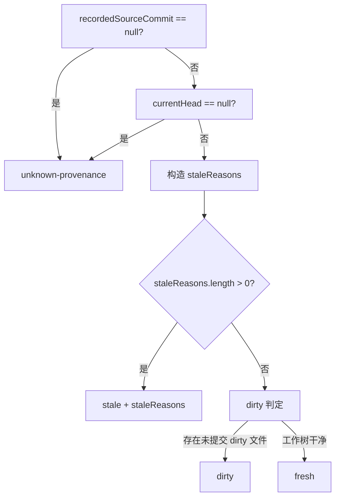

# Phase 1 数据模型：Graph Collector Fingerprint

## CollectorFingerprint（新增）

图产物 `graph.graph` 顶层新增可选字段，与 `sourceCommit` 同级、同一诚实降级哲学（可选、缺失时诚实降级而非误判 fresh）。

```ts
/** 单条采集管线的 {扩展集, 匹配语义} 二元组 */
export interface CollectorExtensionSurfaceEntry {
  /** 排序后的扩展名数组（如 ['.js', '.jsx', '.ts', '.tsx']），确定性序列化前提 */
  extensions: string[];
  matchSemantics: 'case-sensitive' | 'case-insensitive';
}

export interface CollectorExtensionSurface {
  tsjsSkeletonWalk: CollectorExtensionSurfaceEntry;
  pyWalk: CollectorExtensionSurfaceEntry;
  pythonSymbolScan: CollectorExtensionSurfaceEntry;
  genericAdapters: CollectorExtensionSurfaceEntry;
  moduleDerivationScan: CollectorExtensionSurfaceEntry;
}

export interface CollectorFingerprint {
  /** 固定值 1（当前唯一受支持格式），未来格式演进的判别锚点，本迭代不做多版本兼容解析 */
  formatVersion: 1;
  extensionSurface: CollectorExtensionSurface;
  /** 维护者显式声明的行为版本，结构以外的抽取逻辑变化需手动 bump */
  behaviorVersion: number;
}
```

**字段来源**：
- `extensionSurface` 的五个子分量均从 `src/collector-surface.ts` 的静态声明自动推导（`computeCollectorFingerprint()` 读取 `TSJS_SKELETON_WALK_SURFACE`/`PY_WALK_SURFACE`/`PYTHON_SYMBOL_SCAN_SURFACE`/`mergeSurfaces(JAVA_ADAPTER_SURFACE, GO_ADAPTER_SURFACE)`/`MODULE_DERIVATION_SCAN_SURFACE`）。**新增 `pythonSymbolScan` 分量**对应 `python-adapter.ts` 的 `scanPyFiles` 符号扫描管线（硬编码 `['.py']`），与 `pyWalk`（#2，`.py`/`.pyi`）是两条并存的采集面——adapter 声明面与 `walkPyFiles` 实际扫描面存在失配，本轮补齐为第五 key，钉死现状（2026-08-03 实现期审查 W-002 发现后落账）。
- `behaviorVersion` 从 `src/panoramic/graph/collector-fingerprint.ts` 的 `BEHAVIOR_VERSION` 常量读取（维护者手动 bump）。

**约束**：
- 序列化确定性：字段顺序固定（`formatVersion` → `extensionSurface.{tsjsSkeletonWalk,pyWalk,pythonSymbolScan,genericAdapters,moduleDerivationScan}` → `behaviorVersion`），各 `extensions` 数组预排序——这保证 `computeCollectorFingerprint()` 自身产出的 `JSON.stringify` 结果跨进程/跨平台 byte-identical（SC-014 的验收对象）。
- **比较两份指纹是否语义相等**（`fingerprintsEqual(a, b)`）MUST 先各自重建 canonical 结构（固定键序 + 数组排序）再逐字段深比较，**不使用 `JSON.stringify` 字符串相等**——`recordedFingerprint` 来自 `JSON.parse` 后的外部图产物字段，其字面 JSON 键序不受本模块控制，不能假设与当前实现书写顺序一致（Plan 阶段审查 W-01 处置）。`JSON.stringify` 仅用于 SC-014 的序列化输出确定性验收这一独立场景。
- 写入位置：`batch-orchestrator.ts`（主链）与 `graph-assembly.ts`（graph-only）均写入合法值；`cli/commands/graph.ts`（`spectra graph`）写 `null`。

## GraphFreshnessVerdict（扩展）

```ts
export type FreshnessStaleReason =
  | 'source-commit'
  | 'collector-fingerprint'
  | 'collector-fingerprint-unrecorded'
  | 'collector-fingerprint-invalid';

export interface GraphFreshnessVerdict {
  state: 'fresh' | 'dirty' | 'stale' | 'unknown-provenance'; // 不变，枚举本身不新增值
  recordedSourceCommit: string | null | undefined;
  currentHead: string | null;
  dirtyFiles?: string[];
  porcelainReadFailed?: boolean;
  /** 新增：state === 'stale' 时的判别原因数组，顺序确定性，多原因并存时全部保留 */
  staleReasons?: FreshnessStaleReason[];
}
```

**状态转移图（五级优先级，见 plan.md「判定逻辑重排」一节）**：



## 采集面单一事实源（CollectorPipelineSurface）

```ts
export type ExtensionMatchSemantics = 'case-sensitive' | 'case-insensitive';

export interface CollectorPipelineSurface {
  readonly extensions: ReadonlySet<string>;
  readonly matchSemantics: ExtensionMatchSemantics;
}
```

五个生产者管线常量（`src/collector-surface.ts` 导出）：

| 常量名 | 扩展集 | matchSemantics | 对应盘点表编号 |
|--------|--------|-----------------|---------------|
| `TSJS_SKELETON_WALK_SURFACE` | `.ts .tsx .js .jsx` | case-sensitive | #1 |
| `PY_WALK_SURFACE` | `.py .pyi` | case-sensitive | #2 |
| `JAVA_ADAPTER_SURFACE` | `.java` | case-insensitive | #3（java 分量） |
| `GO_ADAPTER_SURFACE` | `.go` | case-insensitive | #3（go 分量） |
| `MODULE_DERIVATION_SCAN_SURFACE` | `.ts .tsx .js .jsx .mjs .cjs .mts .cts` | case-insensitive | #7/#8 |

`ALL_PRODUCER_SURFACES` = 上述五者数组（供 FR-003 dirty 判定逐管线遍历）。`DIRTY_SOURCE_SURFACES` = `ALL_PRODUCER_SURFACES` 的直接 re-export（公开 seam，供 `source-commit.ts` 内部谓词消费，也是 SC-005a1 运行时引用同一性 `===` 断言的对象之一，见 plan.md 决策 4）。

**`JavaLanguageAdapter`/`GoLanguageAdapter` 的 SC-005a1 断言对象（Plan 阶段审查第三轮回写补齐）**：两者的 `readonly extensions` 字段（决策 2）直接赋值为 `JAVA_ADAPTER_SURFACE.extensions`/`GO_ADAPTER_SURFACE.extensions`，构成 SC-005a1 运行时引用同一性 `===` 断言的另一组对象——`new JavaLanguageAdapter().extensions === JAVA_ADAPTER_SURFACE.extensions`（`GoLanguageAdapter` 同理）。此前 a1 清单仅显式列举 #4/#7，本轮补齐 #3（adapter 实例字段直接持有 SSoT 导出引用）。

`mergeSurfaces(...)` 纯函数供指纹计算模块合并 `genericAdapters` 分量，**MUST 显式断言两个输入的 `matchSemantics` 相同**——不同则 `throw`，而非静默选其一或强行合并（Plan 阶段审查 I-02 处置，见 plan.md 决策 3）。

## 双轨护栏 pinned 资产（测试专用，非生产 schema）

```ts
interface PinnedGraphOnlyAsset {
  /** fixture src/ 全文件的 sha256 摘要，供再生脚本前置一致性校验与诊断文案分流（Plan 阶段审查 P7/P11 处置；Q1 第二轮回写修正算法与角色定位） */
  fixtureInputHash: string;
  /** GraphJSON 结构本身，fingerprint 内嵌于 graph.graph.fingerprint —— graph-only 路径本就是生产 schema 的合法产物 */
  graph: GraphJSON;
}

interface PinnedModuleGraphAsset {
  fixtureInputHash: string;
  fingerprint: CollectorFingerprint;
  moduleGraph: NormalizedModuleGraphSnapshot; // ModuleGraph 去除 projectRoot/analyzedAt 后的规范化投影，保留 modules[].language 等其余字段
}
```

两份资产统一采用 `{ fixtureInputHash, ... }` 外层包装（即使这让 `PinnedGraphOnlyAsset` 不再是可直接当作合法生产 `GraphJSON` 使用的裸文件）——`fixtureInputHash` 必须与两份资产各自记录的 `fingerprint` 一并被再生脚本的前置一致性校验读取比较，统一包装层比引入第三份 sidecar 文件更简单。`NormalizedModuleGraphSnapshot` 不是生产 schema 的一部分，只存在于 `tests/fixtures/collector-fingerprint-guardrail/expected-module-graph.json` 与 `tests/helpers/module-graph-snapshot-normalize.ts` 之间。

`PinnedModuleGraphAsset.moduleGraph` 的 `modules[]`/`edges[]` 分别对应生产 `ModuleNode`（字段：`source`/`isOrphan`/`inDegree`/`outDegree`/`level`/`language`）与 `ModuleEdge`（字段：`from`/`to`/`isCircular`/`importType`）——两者均无 `label` 字段，quickstart 的扰动演示 MUST NOT 假设存在该字段（见 quickstart.md 修订）。

**`fixtureInputHash` 算法（Q1 第二轮回写修正）**：对 fixture `src/` 下全部文件，先按相对 POSIX 路径逐个计算 `sha256(文件原始字节内容)`（每个摘要固定 64 hex 字符），再构造 `[{ path, contentSha256 }]` 数组按 `path` 升序排序，做 canonical JSON 序列化后整体 `sha256` 取十六进制摘要——第一轮版本采用"排序路径与原始字节整体拼接后 hash"，实测暴露长度歧义碰撞面（例如两个文件内容分别为 `"ab"`/`"c"` 与 `"a"`/`"bc"` 时朴素拼接结果可能相同），本版本改为"先逐文件定长摘要、再对结构化 JSON 整体摘要"消除该歧义。

**`fixtureInputHash` 的角色（Q1 第二轮回写修正）**：该字段是**纯诊断字段**——再生脚本的放行/拒绝判据只看 `contentMismatch ∧ fingerprintUnchanged`（二元判据，见 plan.md「再生脚本」一节），`fixtureInputHash` 不参与该判据的求值，仅在判据判定为"拒绝"后，用于选择错误文案（区分"fixture 未变、producer 行为漂移"与"fixture 已变、基线变更未随之 bump"两类拒绝场景）。这意味着 fixture 输入变化（护栏样本扩充/修改）本身**不再是自动放行的合法路径**——只要内容不一致且指纹未变，无论 `fixtureInputHash` 是否变化，均判定拒绝，维护者须显式 bump `behaviorVersion` 声明基线变化后再重跑。

**pinned 资产消费约束（Q9，见 plan.md 决策 9）**：任何读取上述两份 pinned 资产的代码 **MUST** 经 `tests/helpers/pinned-asset-loader.ts` 提供的 `loadPinnedGraphOnlyAsset`/`loadPinnedModuleGraphAsset` typed loader 解包，**MUST NOT** 把 `{ fixtureInputHash, ... }` 包装文件直接传给要求裸 `GraphJSON`/`ModuleGraph`/`NormalizedModuleGraphSnapshot` 的入口（如比较器函数、`normalizeModuleGraphSnapshot` 的输入端）。
