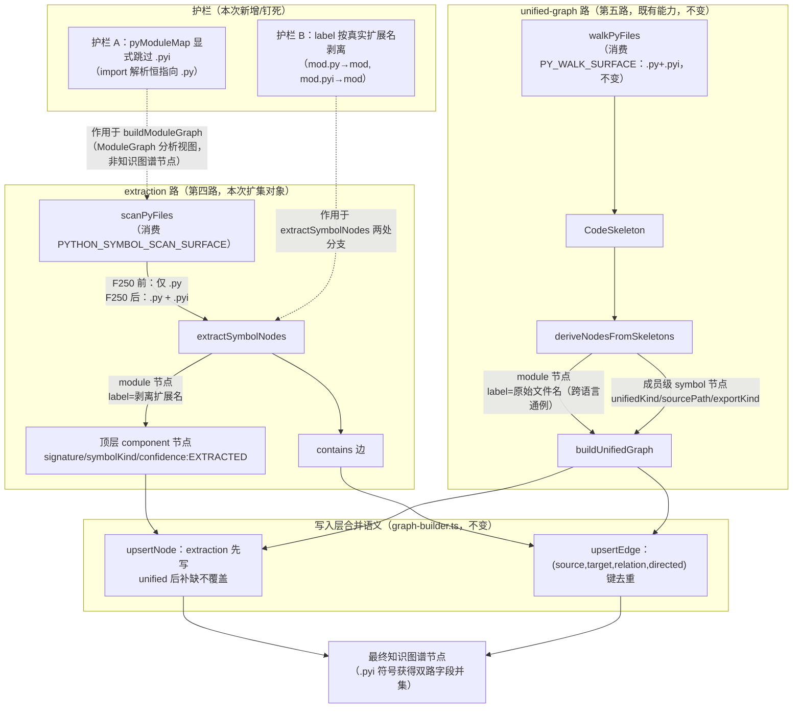

# Implementation Plan: `.pyi` 类型 stub 纳入 Python 符号采集面

**Branch**: `250-pyi-symbol-surface` | **Date**: 2026-08-03 | **Spec**: [spec.md](./spec.md)
**Input**: Feature specification from `specs/250-pyi-symbol-surface/spec.md`

> **修订记录**：本版本已按 plan 阶段对抗审查结论（1C/5W/5I，编排器主线程复核采纳）修正，修正点见文末各节标注的 C1/W1-W4/I1-I3 编号。

## Summary

`PYTHON_SYMBOL_SCAN_SURFACE`（`src/collector-surface.ts`）的 `extensions` 从 `['.py']` 扩为 `['.py', '.pyi']`，使 extraction 路（`extractSymbolNodes`）与既有 `PY_WALK_SURFACE`（unified 路 skeleton 采集面）的采集面收敛一致。这不是补一个"不可查询"的功能缺口——`.pyi` 符号早已由 unified-graph 路产出且可查询——而是**管线奇偶性（parity）修复**：让 `.pyi` 符号获得与 `.py` 同级的 extraction 元数据（`signature`/`symbolKind`/`confidence: 'EXTRACTED'`），并消除因"只看见一路"而反复产生的认知混淆（本 spec 自身的初版理由链就是受害者之一）。

技术路径极简：`scanPyFiles` 已经消费 SSoT 常量（`surfaceMatchesFile(PYTHON_SYMBOL_SCAN_SURFACE, ...)`），因此扩展常量的 `extensions` 集合即可让 extraction 路自动纳入 `.pyi` 文件，**不需要改动 `scanPyFiles` 本身**。真正需要动代码的只有两处精度护栏：护栏 A（import 解析目标排除，防止 `.pyi` 污染 `pyModuleMap` 绝对 import 解析）与护栏 B（module 节点 `label` 按真实扩展名剥离，而非硬编码剥离 `.py`）。

## Technical Context

**Language/Version**: TypeScript 5.x（`src/`），Node.js ≥ 20.x
**Primary Dependencies**: `ts-morph`（未直接涉及，本次改动不碰 TS/JS 侧）；Python 侧靠既有 `TreeSitterAnalyzer`（tree-sitter-python），本次改动不修改其解析逻辑，只消费其 `CodeSkeleton.exports` 输出
**Storage**: N/A（图产物为 JSON 文件，`tests/fixtures/collector-fingerprint-guardrail/expected-*.json` 为 pinned 测试资产，非生产存储）
**Testing**: Vitest（`npx vitest run`），配合 ts-morph AST oracle（`tests/unit/collector-surface.test.ts` 既有基础设施）
**Target Platform**: Node.js CLI / MCP server（Spectra 批处理管线）
**Project Type**: Single project（`src/` + `tests/` + `scripts/`，无前后端拆分）
**Performance Goals**: 无新增性能目标；本仓真实图重建（graph-only）维持既有 ~3.5s 量级不变（本次改动只多扫描本仓已被剪枝目录外的 `.pyi` 文件，实测本仓仅 1 个 `.pyi` 且落在剪枝集内，行为增量为零）
**Constraints**: 不得引入新抽象/新依赖（Constitution III）；不得修改 unified-graph 路的 label 生成逻辑（跨语言既定通例，Out of Scope 明确排除）
**Scale/Scope**: 3 个既有源文件字面量/注释级改动 + 2 个测试文件新增/翻转探针 + 2 份 pinned fixture 再生；0 新增模块、0 新增接口

## Codebase Reality Check

| 目标文件 | LOC | 涉及函数/方法数 | 已知 debt |
|---------|-----|----------------|-----------|
| `src/collector-surface.ts` | 217（**I3 订正**：原文误记 218） | 2 个导出函数（`surfaceHasExtension`/`surfaceMatchesFile`）+ 1 个合并函数（`mergeSurfaces`）+ 6 个常量声明 | 无 TODO/FIXME/HACK；本次仅改 1 处常量字面量 + 1 处 JSDoc 注释块，改动量远低于阈值 |
| `src/adapters/python-adapter.ts` | 441 | `PythonLanguageAdapter` 类，8 个方法 | 无 TODO/FIXME/HACK；本次改动集中在 `extractSymbolNodes`（label 剥离两处分支）与 `buildModuleGraph`（`pyModuleMap` 填充逻辑一行 + 注释），预计净增 < 20 行 |
| `src/panoramic/graph/collector-fingerprint.ts` | 393 | `computeCollectorFingerprint`/`parseCollectorFingerprint`/`fingerprintsEqual` 等 9 个导出函数 | 无 TODO/FIXME/HACK；本次仅改 1 处 JSDoc 注释块（约 3 行），无逻辑改动 |
| `tests/unit/collector-surface.test.ts` | 785 | 探针分组以 `describe` 划分，13 个 describe 块 | 无 debt；本次翻转 3-4 个既有断言 + 同步 2-3 处注释（含 FR-006 反自证要求措辞同步），预计净增 < 20 行 |
| `tests/adapters/python-adapter.test.ts` | 609 | 6 个 describe 块，38 个 `it` | 无 debt；**W4/W5 订正后**本次新增 **6 个必须 `it` + 1 个可选 `it`**（清单见下方「测试策略」），预计净增约 150-180 行（原估"2-3 个 it / < 60 行"上调） |

**前置清理判定**：均不触发前置 cleanup 规则——5 个目标文件中最大者（`collector-surface.test.ts` 785 行）本次新增行数远低于 50 行阈值；无 > 3 个相关 TODO/FIXME；无 > 30 行重复逻辑。**本次不新增 `[CLEANUP]` 任务**。

## Impact Assessment

- **影响文件数**（**I1 订正**：移除 `cache-key-builder.ts`——实测其只 `import { TSJS_SKELETON_WALK_SURFACE }`，与 python 管线零关联，此前误列为间接消费方）：直接修改 5 个（见上表）+ 2 份 pinned fixture（`expected-graph-only-graph.json`/`expected-module-graph.json`，再生产物非手工改动）= 7 个制品；间接受影响（消费 `PYTHON_SYMBOL_SCAN_SURFACE`/`ALL_PRODUCER_SURFACES` 的下游）仅 `source-commit.ts`（dirty 判定，遍历 `ALL_PRODUCER_SURFACES` 自动感知）**不需要改动**，仅其运行时行为随常量值自动生效，不计入"直接修改"文件数。总计 < 10，且无需修改任何下游消费方源码。
- **跨包影响**：全部改动落在 `src/` 单一顶层目录（`collector-surface.ts`/`adapters/`/`panoramic/graph/`）+ `tests/`；不跨越 `plugins/`、`scripts/`（除跑一次既有再生脚本，不改脚本本身）等顶层边界。**跨包影响 = 0**。
- **数据迁移**：无 schema 变更、无配置格式变更；`extensionSurface` 指纹值随常量变化自动改变，触发存量图 stale 重建（F243 既定机制，非本次新增迁移逻辑）。
- **API/契约变更**：0 个函数签名变更、0 个导出接口变更、0 个 MCP 工具 I/O 变更。`PYTHON_SYMBOL_SCAN_SURFACE` 的**取值**变化不构成契约变更（其类型 `CollectorPipelineSurface` 不变）。
- **风险等级**：**LOW**（影响文件 < 10 且无跨包影响，未触发 HIGH/MEDIUM 任一判据）。**不要求分阶段实现**——单一 Phase 即可安全交付，验证口径见下方 Phase 1 与验证命令清单。

## Constitution Check

*GATE: Must pass before Phase 0 research. Re-check after Phase 1 design.*

| 原则 | 适用性 | 评估 | 说明 |
|------|--------|------|------|
| I. 双语文档规范 | 适用 | PASS | 本 plan 及所有制品正文中文、代码标识符英文，遵循既有仓库惯例 |
| II. Spec-Driven Development | 适用 | PASS | 本 story 通过 spec-driver 编排流程执行，制品链 spec.md → plan.md → tasks.md 完整 |
| III. YAGNI / 奥卡姆剃刀 | 适用 | PASS | 0 新增抽象/组件/配置项；护栏 A 采用显式跳过（而非新增判定层）正是"去掉多余抽象"的体现；`@overload` 探针标注可选（FR-011），非强制新增 |
| IV. 诚实标注不确定性 | 适用 | PASS（附标注） | `.pyi` symbol 节点重建后的确切 `signature` 字符串未经实跑验证，plan/research 中标注 `[待验证]`，要求以 `regen` 脚本实际产出为准；纯点文件 label 的行为 delta（`""` → `.py`/`.pyi`）已实测验证（C1，见下方 Architecture 决策 4），不再是待验证项 |
| V. AST 精确性优先 | 适用 | PASS | `.pyi` 的 `signature`/`symbolKind` 字段完全来自既有 `TreeSitterAnalyzer` 的 AST 解析产物（`CodeSkeleton.exports`），本次改动不修改解析逻辑，只扩大喂给该解析器的文件集合 |
| VI. 混合分析流水线 | 适用性低 | N/A | 本次改动纯 AST 路径（graph-only 建图），不涉及 LLM 生成阶段 |
| VII. 只读安全性 | 适用性低 | N/A | 本次改动的"分析对象"是 Spectra 自身源码而非外部目标代码库；Spectra 工具本身对外部目标的只读约束不变 |
| VIII. 纯 Node.js 生态 | 适用 | PASS | 0 新增依赖；沿用 `path`/既有 tree-sitter 绑定 |
| IX–XIV（spec-driver 插件约束） | 不适用 | N/A | 本 story 改动范围是 `src/`（spectra 插件），不涉及 `plugins/spec-driver/` |

**结论**：无 VIOLATION，Constitution Check 通过，无需 Complexity Tracking 豁免条目。

## Project Structure

### Documentation (this feature)

```text
specs/250-pyi-symbol-surface/
├── plan.md              # 本文件
├── research.md          # Phase 0 输出：护栏 A/B 实现决策记录
├── data-model.md         # Phase 1 输出：涉及的图节点/常量实体定义
├── quickstart.md         # Phase 1 输出：验证本 feature 生效的最短路径
├── contracts/
│   └── collector-surface-extension.md   # PYTHON_SYMBOL_SCAN_SURFACE 取值契约变化 + fixture delta 契约
└── tasks.md             # Phase 2 输出（由 /spec-driver.tasks 生成，本文件不产出）
```

### Source Code（repository root，单项目布局，本次改动子集加粗标注）

```text
src/
├── collector-surface.ts                        # **改**：extensions 扩集 + 注释重写（FR-001/FR-008）
├── adapters/
│   └── python-adapter.ts                        # **改**：label 剥离 helper（FR-005）+ pyModuleMap 护栏 A（FR-004）+ 注释重写（FR-008）
├── panoramic/graph/
│   └── collector-fingerprint.ts                 # **改**：pythonSymbolScan 注释重写（FR-008）
├── batch/ ...                                   # 不改（消费方自动生效）
├── knowledge-graph/ ...                         # 不改
└── panoramic/graph/quality/ignore-oracle.ts     # 不改（本就只按扩展名分派给 GO/JAVA/PY_WALK/TSJS 四个 surface，不消费 python 符号扫描面，见契约 1 的 I2 订正说明）

tests/
├── unit/
│   └── collector-surface.test.ts                # **改**：探针翻转（FR-006，含反自证硬编码期望值要求）
├── adapters/
│   └── python-adapter.test.ts                   # **改**：新增 6 个必须 + 1 个可选防回归探针（清单见下方「测试策略」，覆盖护栏 A/B、FR-002/FR-003b、C1 纯点文件、SC-005 对照组、FR-011 可选）
└── fixtures/collector-fingerprint-guardrail/
    ├── expected-graph-only-graph.json           # **再生**（FR-007，脚本产出，非手工改）
    ├── expected-module-graph.json               # **再生**（FR-007，仅指纹分量变化）
    └── src/py/mod.pyi                           # 不改（既有样本，内容不变；同时是 SC-005 对照组探针的天然素材）

scripts/
└── regen-collector-fingerprint-fixtures.ts      # 不改（复用既有再生脚本）
```

**Structure Decision**：单项目结构（Option 1），沿用仓库既有 `src/` + `tests/` + `scripts/` 三段式布局。本 feature 不引入新目录、不引入新顶层模块，所有改动落在已列出的既有文件路径内。

## Architecture

### 双路 Python 符号生产模型（本次改动的核心心智模型）



### 关键设计决策

1. **不改 `scanPyFiles` 本体**：该函数已在基座代码（继承自 F243）中通过 `surfaceMatchesFile(PYTHON_SYMBOL_SCAN_SURFACE, entry.name)` 消费 SSoT 常量（`python-adapter.ts:153`），因此扩展 `PYTHON_SYMBOL_SCAN_SURFACE.extensions` 即可让 `.pyi` 文件自动进入扫描结果，FR-002 在本次改动前已经满足，无需额外代码改动，仅需补一条防回归探针确认这一事实（见「测试策略」T-FR002，避免未来有人"顺手"把这处改回硬编码字面量判断）。
2. **护栏 A 采用显式跳过（选项 b），而非依赖现状的"双重意外安全"**：`buildModuleGraph` 内构建 `pyModuleMap` 时，对 `.pyi` 文件显式 `continue`（不写入 map），而不是保留现状"`path.basename(absF, '.py')` 对 `.pyi` 不剥离后缀、产生键 `mod.pyi`、恰好与 `topModule`（不含点）不相等"这一偶然安全属性。理由：护栏 B 引入了一个"按真实扩展名剥离"的 helper；若未来有人图省事把该 helper 也用在 `pyModuleMap` 键生成上（两处剥离逻辑表面相似，容易被"顺手统一"），会让 `.pyi` 键从 `mod.pyi` 变为 `mod`，与同目录 `mod.py` 键碰撞，制造真实的 import 解析歧义 bug。显式跳过消灭了这条隐藏的"两处相似代码耦合"路径，且改动量仅一行 + 一条注释，不构成过度设计。
3. **`relPySet`/`relPyFiles` 不受护栏 A 影响，仍收录 `.pyi`**：`buildModuleGraph` 产出的 `ModuleGraph.modules` 视图（FR-003）应包含 `.pyi` 对应条目（无 `label` 字段，`ModuleGraph` schema 本就不含该字段）；护栏 A 只影响"绝对 import 目标解析用的 basename map"，不影响"该文件是否作为一个 module 参与拓扑分析"，也不影响 `.pyi` 文件自身作为 import **来源**产生的 `depends-on` 边（见「测试策略」T-guard-a-b，验证 `.pyi` 自身 import 的目标解析同样正确指向 `.py`）。`tryResolveAtDir` 的候选路径字面量恒为 `${seg}.py`/`${seg}/__init__.py`，不含 `.pyi` 变体，因此相对 import 场景天然不需要改动（FR-004 第二条已满足，仅需探针钉死）。
4. **label 剥离 helper 提取为局部函数，两处复用；等价性论证按采集面收窄，并显式承认纯点文件的行为 delta（C1）**：`extractSymbolNodes` 内正常分支（原 `path.basename(relPath, '.py')`，约 `python-adapter.ts:220`）与 parseError 降级分支（约 `:202`）当前各自硬编码同一段逻辑；本次提取为函数级私有 helper（如 `stripFileExtension(relPath) => path.basename(relPath, path.extname(relPath))`），避免双写漂移（spec 明确点名"两处都要修"的风险）。

   **C1 订正**：原文声称"对 `.py` 输入行为与原实现逐字等价"范围过宽，实为**对除纯点文件 `.py` 外的全部采集面内输入逐字等价**——纯点文件 `.py`（即文件名恰好是 `.py` 四个字符，落在 `case-sensitive`/`endsWith` 语义采集面内，`collector-surface.ts:29-30` 明文记录该语义、`collector-surface.test.ts:515-534` 已有实跑该路径的探针）存在一处已声明的可接受行为 delta。实测矩阵（`path.basename` 的 Node.js 实现细节：`ext === path` 时返回 `''`；`path.extname` 对纯点文件返回 `''`）：

   | 输入 | 旧实现 `path.basename(relPath, '.py')` | 新实现 `path.basename(relPath, path.extname(relPath))` |
   |------|---|---|
   | `.py`（纯点文件） | `''`（空串——`ext === path` 时 Node 返回空串） | `.py`（`extname('.py') === ''`，故不剥离，返回原名） |
   | `.pyi`（纯点文件） | `.pyi`（不剥离，因为末尾字符与 `.py` 不匹配） | `.pyi`（`extname('.pyi') === ''`，同样不剥离） |
   | `mod.py` | `mod` | `mod` |
   | `mod.pyi` | `mod.pyi`（不剥离） | `mod`（本次修复目标） |

   纯点文件 `.py` 的 label 从空串变为 `.py` 是**声明为可接受的行为 delta**——空 label 本身更接近一个潜在 bug（下游任何按 label 展示的场景都不应该显示空字符串），新行为反而更合理，不构成需要额外护栏的回归。该 delta 由「测试策略」T-C1-dotfile 显式钉住。

## 测试策略

*（本节为对抗审查 W4/W5 订正新增：补全此前遗漏的探针项，并复述 spec FR-006 的反自证断言硬性要求。）*

### `tests/unit/collector-surface.test.ts`（FR-006 探针翻转，既有文件内改）

- 翻转 `PY_SCAN_SAMPLES` 断言：`mod.pyi` 从"MUST NOT 命中"改为"MUST 命中"；同步改写该样本的行内注释（原"声明面覆盖、扫描面不覆盖 → MUST NOT 命中（如实锁定既存失配）"→"声明面与扫描面都覆盖 → MUST 命中（parity 修复后两面一致）"）。
- **FR-006 硬性要求（复述，不可省略）**：翻转后的断言 MUST 保留硬编码期望值列表（如 `['mod.py', 'mod.pyi']`），MUST NOT 改写为仅由被测常量自身反向推导的自证断言（self-referential assertion）——即不能只写 `PY_SCAN_SAMPLES.filter((n) => surfaceMatchesFile(PYTHON_SYMBOL_SCAN_SURFACE, n))` 而不额外断言一个独立字面量数组；后者会使探针对"常量被误改"这类回归失去检测能力。
- 改写"两面失配"对拍测试（原 `walkPyFiles` 与符号扫描面对拍那条 `it`）为"两面一致"语义：断言 `walkPyFiles` 与 `extractSymbolNodes` 在同一目录下的采集结果集合相等（均含 `mod.pyi`），而非展示二者不同。
- 改写 SC-005 (a1) 分组内"声明面（含 `.pyi`）确实不同"那条 `it` 的措辞：`PYTHON_SYMBOL_SCAN_SURFACE` 与 `PY_WALK_SURFACE` 现在**扩展名集合一致**但仍是两个独立 `Set` 引用（`.not.toBe` 断言保留）。

### `tests/adapters/python-adapter.test.ts`（新增，6 个必须 + 1 个可选）

1. **T-guard-a-b（护栏 A + FR-003b 合并探针）**：构造 4 文件目录——`mod.py`（实现）、`mod.pyi`（内含 `import helper` 自身也发起一次 import）、`helper.py`、`user.py`（`import mod`）。调用 `adapter.buildModuleGraph(tmpDir)`，断言：
   - `moduleGraph.modules.map(m => m.source)` 同时包含 `mod.py`/`mod.pyi`/`helper.py`/`user.py` 四者（FR-003b：`.pyi` 完整参与 `ModuleGraph` 分析视图）；
   - `user.py → mod` 的绝对 import 边 `to` 字段为 `mod.py`，且不存在任何 `to === 'mod.pyi'` 的边（护栏 A 核心断言）；
   - `mod.pyi → helper` 产生的 `depends-on` 边 `from === 'mod.pyi'`、`to === 'helper.py'` 正常存在（证明 `.pyi` 作为 import **来源**时不受护栏 A 影响，只有作为 import **目标**时被排除）。
2. **T-label-normal（护栏 B 正常分支）**：目录含 `mod.py` + `mod.pyi`（均可正常解析），调用 `extractSymbolNodes`，断言两者 module 节点 `label` 均为 `mod`，`id` 分别保留 `mod.py`/`mod.pyi` 完整后缀。
3. **T-label-parse-error（护栏 B parseError 降级分支）**：用 `vi.spyOn(adapter, 'analyzeFile')` 对含 `.pyi` 后缀的路径 mock 为 `mockRejectedValueOnce`，其余正常返回，断言该文件产出的 module 节点走 `parseError` 分支且 `label` 同样按真实扩展名剥离（`mod`），验证 FR-005"两处分支都要修"的要求在 parseError 分支同样生效。
4. **T-C1-dotfile（C1 纯点文件 label 探针，新增）**：目录内放置字面量文件名 `.py` 与 `.pyi`（`fs.writeFileSync(path.join(tmpDir, '.py'), ...)`），调用 `extractSymbolNodes`，断言 `id === '.py'` 的节点 `label === '.py'`（非空串，即声明的可接受行为 delta）、`id === '.pyi'` 的节点 `label === '.pyi'`。
5. **T-FR002（FR-002 防回归探针）**：目录内**只放 `.pyi` 文件、不放任何 `.py` 文件**（如 `stub.pyi`），调用 `extractSymbolNodes`，断言产出包含 `id === 'stub.pyi'` 的 module 节点。若未来 `scanPyFiles` 被改回硬编码 `entry.name.endsWith('.py')` 字面量判断（不再消费 SSoT），本探针会因扫不到任何文件而失败，从而锁定 FR-002"消费 SSoT 而非硬编码"这一事实。
6. **T-SC005-control（SC-005 对照组，复用真实仓库既有 fixture，非新建 synthetic 样本）**：以 `process.cwd()`（REPO_ROOT）为 project root 调用 `adapter.extractSymbolNodes(REPO_ROOT)`，断言其 module 节点 id 集合**不包含** `tests/fixtures/collector-fingerprint-guardrail/src/py/mod.pyi`（因该路径的祖先目录 `tests` 命中 `scanPyFiles` 的硬编码剪枝集）；另调用既有导出函数 `walkPyFiles(REPO_ROOT, out, () => false, REPO_ROOT)`（unified 路 skeleton 采集面，`PY_SKELETON_IGNORE_DIRS` 不剪 `test`/`tests`），断言其结果**包含**该路径的 basename `mod.pyi`。两相对照，实证 spec US3 范围说明与 SC-002(c)"本仓真实图行为增量为零"的结论。
7. **T-overload（可选，FR-011）**：`.pyi` 内两个 `@overload` 装饰的同名函数，断言 `extractSymbolNodes` 写入层收敛后不产生重复节点/边（`upsertNode`/`upsertEdge` 既有收敛行为的钉死探针，非本次核心裁决前提）。

## Complexity Tracking

*Constitution Check 无 VIOLATION，本节留空（无需豁免条目）。*
