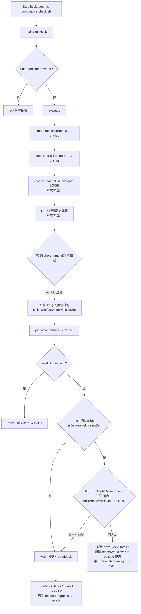

# 技术实现计划 — F257 fix 依从性门禁两处 fail-open 收口

## 🔴 勘误（implement 落地后追加，2026-08-06）——正文以下若干标识符与论证已作废

> 本节**只追加、不改写正文**：正文保留原样以便追溯"当时是怎么想的"，但凡与本节冲突处，
> **一律以本节 + 代码实现为准**。作废原因是 Phase 2/3 对抗审查推翻了两处设计假设，实现随之改名改义，
> 而正文成稿在其前。

### E1 · 计量函数与字段改名（语义随之改变，不只是改名）

| 正文写法（**已作废**） | 代码实际实现 | 出现处 |
|---|---|---|
| `countPostAnchorAssistantEntries(entries, anchorLineIndex)` | `countAssistantEntriesSinceEarliestFixExpansion(entries)`（**单参**，不接受 `anchorLineIndex`） | §4.1 代码草稿、§4.6、§5.x、§9.2 C-2a、§8 变更清单第 1 项 |
| `evaluate` 返回字段 / report 输出字段 `postAnchorAssistantEntries` | `assistantEntriesSinceEarliestFix` | §4.2 代码草稿、§4.3、§6.4、§8 变更清单第 6/9 项、§9.1 T-2g |

**这不是纯改名**：正文的计量基线是 `detectFixSkillExpansion` 的**主锚点**（= **最晚**一次 fix 展开），
Phase 2 对抗审查（CRITICAL-2）实跑证伪了它——agent 自己再调一次 `Skill(spec-driver-fix)` 即可把主锚点
推到末尾、同时保持 `isFix = true`，令锚点后计数归零（攻击组 30/30 全 exit 0、计数恒 4）。
实现改为**自带专用基线扫描：最早一次 fix 展开**（主锚点语义逐字不动，二者并存互不影响）。
故正文凡出现"锚点后 entry 数"字样的地方，实际语义都是"**最早一次 fix 展开之后**的 entry 数"。
常量名 `POST_ANCHOR_ENTRY_DEFER_LIMIT` 未随之改（历史沿革），其 JSDoc 与 contract 已写明真实语义。

### E1′ · 对 E1 自身的更正（Phase 4 审查后追加，2026-08-06）

🔴 **上表 E1 的"代码实际实现"一列本身已失真**，而勘误块存在的目的就是"正文失真时以此为准"，
它自己失真危害更大，故在此更正（同样只追加、不改写 E1 原文）：

| E1 写法（**已失真**） | 代码真实实现（以此为准） |
|---|---|
| `countAssistantEntriesSinceEarliestFixExpansion(entries)`（**单参**、"自带专用基线扫描"） | `countAssistantEntriesSinceEarliestFixExpansion(entries, earliestFixLineIndex)`（**双参**，基线由**显式入参**给入，函数本身**不跑任何正则**） |
| 常量名 `POST_ANCHOR_ENTRY_DEFER_LIMIT`（"未随之改，历史沿革"） | 已改名为 **`EARLIEST_FIX_ENTRY_DEFER_LIMIT`**（取值仍为 **420**，未变） |

更正一（**双参，不是单参**）：E1 定稿时的第 2 轮实现确实"自带基线扫描"，但第 3 轮 WARNING
把它推翻了——闸门三另跑一遍 `SKILL_EXPANSION_REGEX` 会让全链扫两趟，该正则含惰性量词
`([^\n]+?)\/skills\/`，诱饵前缀语料下单趟即 O(K×N)，红队 A/B 实测 **10188ms → 19785ms**（翻倍）。
终态实现是：基线由 `detectFixSkillExpansion` 在**同一趟**里顺带产出（新增返回字段
`earliestFixLineIndex`），再作为**显式入参**传入计数函数。
测试 `C-2j` 以结构钉子锁死：断言计数函数体内不出现 `SKILL_EXPANSION_REGEX`、且
`assert.equal(fn.length, 2, '基线必须是显式入参')`。
🔴 **照 E1 原文（单参、自带扫描）去"对齐"实现会直接回滚该性能修复并打红 C-2j。**

更正二（**常量已改名**）：`POST_ANCHOR_` 精确地指向"判定主锚点 = **最晚**一次展开"——而那正是
E1 自己刚刚记录为被实测证伪的错误语义（以最晚锚点为基线时攻击组 30/30 全 exit 0）。名字与它约束的
量（基线是**最早** fix 展开）方向相反，顺着名字理解就会把修复改回攻击者想要的实现，故改名为
`EARLIEST_FIX_ENTRY_DEFER_LIMIT`，与 `earliestFixLineIndex` / `assistantEntriesSinceEarliestFix` 同族。
⚠️ 本文件与 `tasks.md` 正文中其余出现的旧常量名属**历史记录，刻意保留不动**；活代码与
`specs/208-*/contracts/fix-compliance-judge-cli.md` 已全部改为新名。

### E2 · §4.4 代码草稿的 `blockCount: null` 在终态记录里**是键缺席，不是值为 null**

`recordWorkflowRun` 的 `normalizeComplianceVerdict`（`record-workflow-run.mjs`）只在
`typeof raw.blockCount === 'number' && Number.isFinite(...)` 时才写入该键，`null` 会被**整键丢弃**。
故实际落盘的 `complianceVerdict` 中 `blockCount` **不存在**。语义与"推迟不消耗阻断预算、无计数可报"
一致，实现照原样传 `null` 即可；但断言必须写成"键缺席"（见 `fix-compliance-judge-cli.test.mjs` T-2d），
写成 `assert.equal(v.blockCount, null)` 会红。

### E3 · §4.4「单会话最多写 3 条 paused 终态」论证作废

该论证前提是"推迟受闸门二约束"，而缺陷 2 的攻击手法恰好是每轮删状态令闸门二恒放行 → 每轮都会写一条。
真实上界是"闸门三阈值内还能塞下多少次 stop"。方向仍是**多写审计**（安全），
但"最多 3 条"这一数量不成立（fix-report「W1」已登记，正文 §4.4 未同步）。

### E4 · §4.3 标定步骤 1/4/5 的取数与公式已作废

以同节 C3 修正框（阈值定稿 **420**）为准：标定已由对抗审查方在真实语料上跑完
（`N=149 / P50=61 / P90=244 / P99=409 / max=647`），implement 阶段无需重跑取数任务；
占位值 200（低于 P90，误伤 11.4% 真实会话）与公式值 620（约 200 轮，工程意义上接近无界）均作废。

---

## Summary

把 fix-report.md 已定稿（经两轮对抗审查收口）的两条修法落成可执行变更：

- **缺陷 1 / 方案 A′（写入见证门槛）**：`fix-compliance-judge.mjs` L223-233 的 short-name 磁盘重锚定，采信条件从 `usable()`（目录含 `fix-report.md`）收紧为 `usable()` **∧** 本会话 fix 锚点之后存在一条针对该目录下被核验制品本身（`fix-report.md` / `verification/verification-report.md`）的 `Write` / `Edit` 工具调用、且其 `tool_result` 非 error。
- **缺陷 2 / 方案 A″（单调轮次上界）**：`fix-compliance-judge.mjs` L530-553 的推迟通道，追加一条按 **fix 锚点之后 assistant entry 总数**计量的上界，与既有 `IN_FLIGHT_DEFER_LIMIT=3` **并联取严**；并把推迟事件的审计可见性提到与降级放行同档（写 `record-workflow-run` 终态）。
- **contract 同真**：`specs/208-*/contracts/fix-compliance-judge-cli.md` L80-81 / L89-90 两处已被实测证伪的无条件断言，改写为与实现同真的表述 + 登记限界。
- **附带项**：`tests/integration/repo-maintenance-sync-check.test.ts` 的 `copyTree` 增加子路径排除，`.claude` 拷贝时排除 `worktrees`。

**本计划不做方案选型**——选型已在主线程定稿；被证伪的旧方案（缺陷 1 的"路径字面被提及"、缺陷 2 的"在途委派陈旧度"）见 fix-report.md「Phase 1 对抗审查落账」节，实现不得回退到那两条。

**明确排除**：fix-report.md「超出本 Feature 范围的新发现」节的 **N1**（空 / 被截断 transcript → exit 0 且零审计）与 **N2**（收尾一次 `Skill(spec-driver-sync)` 翻转锚点 → exit 0 且零审计）**不纳入本次**——二者触及 `runHook` 早退语义与 US5 零落盘契约，与本次两条改动不同轴，另案处理（建议各开独立 fix）。

---

## Technical Context

| 项 | 取值 |
|---|---|
| 语言 / 运行时 | Node.js 20+ ESM（`.mjs`，插件脚本不经 TypeScript 编译） |
| 被改主体 | `plugins/spec-driver/scripts/fix-compliance-judge.mjs`、`.../lib/fix-compliance-core.mjs` |
| 测试框架 | `node --test`（插件侧，`npm run test:plugins`）+ vitest（仓库侧集成测试） |
| 运行位置 | Claude Code **同步** Stop hook（`hooks/stop-fix-compliance-check.sh`）→ 性能是硬约束 |
| 存储 | 无新增存储；缺陷 2 刻意**不**新增任何 projectRoot 下的持久态 |
| 生效时机 | 本机 Stop hook 跑的是**已安装插件快照**（F236 实证），本次改动须下次 plugin 发版后才对本机门禁生效；改完须 `npm run judge:doctor` 确认漂移状态 |

无 `NEEDS CLARIFICATION` 遗留。唯一待实测确定的量是缺陷 2 的阈值 `POST_ANCHOR_ENTRY_DEFER_LIMIT`，其**标定方法**已在 §4.3 固化为可执行步骤，属 implement 阶段的取数任务而非设计不确定性。

---

## Codebase Reality Check

| 目标文件 | LOC（实测 / 近似） | 本次新增（估） | 已知 debt |
|---|---|---|---|
| `plugins/spec-driver/scripts/fix-compliance-judge.mjs` | ~640 | ~50 | 单文件承担参数解析 / 编排 / 路由 / 审计四职责；注释密度极高（每段带对抗审查落账），属**刻意**保留的判据溯源，非噪声 |
| `plugins/spec-driver/scripts/lib/fix-compliance-core.mjs` | ~1558 | ~70 | 单文件聚合 8 个判定族（锚点 / 方言 / 委派 / 在途 / 提名 / 改名 / 收口形态 / 合规裁决）；`resolveFeatureDirCandidate` 相关注释 >150 行 |
| `plugins/spec-driver/scripts/lib/fix-compliance-io.mjs` | ~420 | 0 | `loadBlockState` 静默回落初始态——**本次刻意不改**，理由见 §4.5 |
| `plugins/spec-driver/tests/fix-compliance-judge-cli.test.mjs` | ~900+ | ~200 | 无 |
| `plugins/spec-driver/tests/fix-compliance-core.test.mjs` | ~1000+ | ~130 | 无 |
| `tests/integration/repo-maintenance-sync-check.test.ts` | ~200 | ~15 | `copyTree` 无排除能力（本次修） |
| `specs/208-*/contracts/fix-compliance-judge-cli.md` | ~150 | ~30 | L80-81 / L89-90 断言与实现不同真（本次修） |
| `specs/208-*/contracts/fix-compliance-verdict-event.schema.json` | 55 | ~3 | 无 |

### 前置清理规则的触发与豁免（如实登记）

`fix-compliance-core.mjs`（~1558 LOC > 500）本次新增约 70 行，机械满足"前置 cleanup task"的触发条件。**本计划显式豁免**，理由：

1. 拆分 core 必然新增文件 → 必须同步 `lib/judge-snapshot-core.mjs` 的 `JUDGE_FILE_SET`（当前 7 项）→ 判定器快照漂移面、FR-002b 守卫测试、插件发版快照三者验证面同时扩大；
2. 本次是**安全门禁的 fail-open 收口**，把结构重构与判据变更混进一个交付会让"哪次改动导致行为变化"不可归因（F225 / F242 的 A/B 归因教训）；
3. 仓库规则「不要自行添加未要求的优化、功能、清理或重构」对本仓门禁链尤其承重。

处置：**登记为技术债跟进候选**（core 按判定族拆分 + `JUDGE_FILE_SET` 同步），不在本次执行；也不因豁免而声称该文件规模健康。

---

## Impact Assessment

| 维度 | 结论 |
|---|---|
| 直接修改文件 | 8（judge / core / 2 个插件测试 / 1 个仓库集成测试 / 1 个 schema / 1 个 contract / 本 Feature 制品） |
| 间接受影响 | `hooks/stop-fix-compliance-check.sh`（行为面，文件不改）；已安装插件快照（发版后生效）；`.specify/runs/*.jsonl` 审计事件与 `record-workflow-run` 事件的消费方 |
| 跨包影响 | 2（`plugins/spec-driver/` + 仓库根 `tests/`、`specs/`）|
| 数据迁移 | 无迁移；`fix-compliance-verdict-event.schema.json` 的 `diagnostics` enum **增项**（向后兼容：旧事件仍合法；新事件需新版 schema 才通过校验） |
| API / 契约变更 | `fix-compliance-judge-cli.md` 推迟通道合同**语义变更**（新增第三道闸门 + 新终态记录）；core 新增 2 个导出纯函数（新增，不改既有签名）；`--mode report` 输出新增 1 字段 |
| **风险等级** | **HIGH** —— 改的是安全门禁本身，且修改公共契约，且存在明确的新增误阻断类（§5 类 X） |

### HIGH 风险 → 强制分阶段（每阶段独立可验证）

| Phase | 范围 | 验证点（未通过不得进入下一 Phase） |
|---|---|---|
| **P1** | 缺陷 1：core 新增 `collectArtifactWriteWitnessDirs` + judge 接线 + O1 诊断码 + 单测 / E2E（含红先行与 F256 互补） | `npm run test:plugins` 零失败；缺陷 1 红先行用例由红转绿；F256 正向用例仍 exit 0；变异 M1 / M2 / M3 各能把对应用例打红 |
| **P2** | 缺陷 2：轮次计量 + 阈值标定 + 并联取严 + 终态记录 + schema / contract 同真 | 标定数据落盘（N + P50/P95/P99/max + 取值）；"删状态 N≫3 轮"用例不再全 exit 0 且有终态记录；变异 M4 / M5 / M6 生效 |
| **P3** | 附带项 `copyTree` 排除 + 全量门禁 | `npx vitest run` + `npm run build` + `npm run repo:check` 零失败；在**主仓库**（非 worktree）观测 `repo-maintenance-sync-check` 墙钟前后对比 |

分阶段的实义：P1 / P2 改的是判定器两条独立通路（特性目录解析 / 推迟路由），混做会让回归归因失效；P3 与判定器无关，压到最后避免污染 P1/P2 的 A/B 判断。

---

## Constitution Check

| 原则 | 适用性 | 评估 | 说明 |
|---|---|---|---|
| 用 spec-driver 流程，不直接改源码 | 适用 | PASS | 走 fix mode 全流程 |
| 中文文档 / 英文标识符 | 适用 | PASS | 新增标识符 `collectArtifactWriteWitnessDirs` / `countPostAnchorAssistantEntries`，注释中文 |
| 不引入未要求的优化 / 重构 | 适用 | PASS（带豁免登记） | core 拆分显式豁免并登记技术债 |
| 提交前 `npx vitest run` + `npm run build` + `repo:check` | 适用 | PASS | P3 验证点 |
| 新功能 / 修复与单测同提交 | 适用 | PASS | 每 Phase 实现与测试同 commit |
| 对抗审查（Codex 暂停期 → 独立子代理异构对抗 ×2 切入角） | 适用 | PASS（须执行） | 门禁 / 判定器类改动，commit message 与 fix-report 必须显式标注「Codex 审查暂停，异构档位缺席」 |
| 零 LLM / 零子代理委派（判定器不变量） | 适用 | PASS | 两个新函数均为纯函数，无网络、无模型调用 |
| 同步 Stop hook 性能约束 | 适用 | PASS（带回归用例） | 两个新函数各线性扫描、无嵌套量词，见 §3.4 / §4.6 |
| 开源产物不写客户 / 行业绑定 | 适用 | PASS | 无 |

无 VIOLATION。

---

## §1 架构与改动落点



图中三处"新增"即本次全部行为改动点。`resolveFeatureDirCandidate` / `scanRenameCommandEvents` / F227 兜底 / F224 降级通道 / `routeBlock` / `releaseDegraded` **逐字不改**。

---

## §2 关键设计取舍（一句话版）

| 取舍 | 决定 | 理由 |
|---|---|---|
| 判据放 core 还是 judge 内联 | **core 新增纯函数，judge 只调用** | 与既有全部判据同层；可单测、可变异测试、可被 `--mode report` 复用；judge 保持编排层职责 |
| 见证判定返回 Set 还是谓词 | **返回 Set，一次收集** | 谓词式对 K 个同名目录是 O(K·N)；Set 化后整体 O(N)（同步 Stop hook 硬约束） |
| 目录比较方式 | **锚定全串相等 → 反取目录**，禁止 `includes` / 裸 `startsWith` | 红队已实证 `includes()` 让 `specs/254-fix-alpha-retry` 命中 `specs/254-fix-alpha` |
| 见证的写入工具集 | **仅 `Write` / `Edit`** | 二者成功与否由 harness 的 `tool_result` 背书，被判方无法伪造成功回执；Bash 写形态可被 `cat X > /dev/null` 之类满足（F227 已知限界一），下界弱得多 |
| 是否改 `loadBlockState` 回落语义 | **不改** | 该回落对 `blockCount` / `degradedRecorded` 是 fail-closed 的正确设计；缺陷 2 的正确修法是补一条**不依赖任何本地状态**的上界，而非给可被删除的载体加壳 |
| 是否新增判定器文件 | **不新增** | 新增文件必须同步 `JUDGE_FILE_SET` 并扩大快照漂移验证面；新函数落在既有 `fix-compliance-core.mjs` 内 |

---

## §3 缺陷 1 变更设计（写入见证门槛 / 方案 A′）

### 3.1 分层落点

core 层新增 1 个导出纯函数 + 2 个模块级常量；judge 层在 L223-233 的 short-name 分支追加一个 `.filter()`。**不内联**：判据是安全承重逻辑，必须可独立单测与变异测试。

### 3.2 函数签名与精确语义

```js
/** 可作为"会话写入见证"的写工具名（唯一放宽点，Object.freeze） */
export const ARTIFACT_WRITER_TOOL_NAMES = Object.freeze(new Set(['Write', 'Edit']));

/** 锚定制品路径正则：全串匹配，捕获组 1 = 规范特性目录 */
const ANCHORED_ARTIFACT_PATH_REGEX =
  /^(specs\/\d+-fix-[a-z0-9-]+)\/(?:fix-report\.md|verification\/verification-report\.md)$/;

/**
 * 收集"本会话 fix 锚点之后被成功写入过被核验制品"的特性目录集合。
 * @param {ReturnType<typeof normalizeTranscriptEntry>[]} entries
 * @param {number|null} anchorLineIndex
 * @param {string} projectRoot 仅用于绝对路径的字符串前缀剥离，**不做任何 fs 调用**（core 零 I/O 契约不变）
 * @returns {Set<string>} 形如 'specs/254-fix-alpha' 的规范目录路径
 */
export function collectArtifactWriteWitnessDirs(entries, anchorLineIndex, projectRoot) { /* … */ }
```

**合同（充要）**：`dir ∈ 返回集合` ⟺ 存在 entry `E` 与其 tool_use 块 `B`，同时满足

1. `E.role === 'assistant'` 且 `E.lineIndex > anchorLineIndex`；
2. `ARTIFACT_WRITER_TOOL_NAMES.has(B.name)` 且 `typeof B.id === 'string' && B.id.length > 0`；
3. `B.input.file_path` 归一化后（§3.3）**全串等于** `${dir}/fix-report.md` 或 `${dir}/verification/verification-report.md`；
4. 存在某条 `toolResultBlock` 满足 `toolUseId === B.id` 且 `isError !== true`。

> 🔴 **主线程收口修正 C1（2026-08-06，承重，实施以本条为准）——见证比较放宽到 short-name 家族级**
>
> **问题**：上述合同要求见证目录与**重锚定目标目录**同编号，这会把 F256 的核心正向场景整个打回。实证：`plugins/spec-driver/tests/fix-compliance-judge-cli.test.mjs` L1633-1680（F256 T006）的构造是 `Write → specs/251-fix-foo/fix-report.md` → 复合命令 `cd … && git mv specs/251-fix-foo specs/254-fix-foo && …` → 停；**本会话从未写过 `specs/254-fix-foo/`**。按原合同 witnessed 不含 254 → 拒绝重锚定 → exit 2，而该用例断言 exit 0（`compliant:true / missing:[]` + 零审计事件）。原 §5.2 把这归为"类 X 可接受的边缘误阻断"是**误判**——它不是边缘情形，就是 F256 要修的场景本身，与本 Feature 验收要求的两向互补合同 (b) 向直接冲突。
>
> **修正**：judge 侧比较改为 **short-name 家族级**——见证集合里只要存在**某个** `specs/NNN-fix-<S>` 目录（`S` 与本次重锚定的 `shortName` 相等，编号可不同）被本会话成功写入过制品，即认定见证成立。实现上 `collectArtifactWriteWitnessDirs` 保持返回**完整目录路径**的 Set（信息不丢失），judge 侧接线改为：
>
> ```js
> const witnessedShortNames = new Set(
>   [...collectArtifactWriteWitnessDirs(entries, anchor.anchorLineIndex, projectRoot)]
>     .map(extractFixShortName)
>     .filter((s) => s !== null),
> );
> const diskMatches = usableMatches.filter(() => witnessedShortNames.has(shortName));
> ```
>
> （`shortName` 在该作用域已是常量，故过滤谓词对本批候选恒真或恒假——等价于一次前置判断，实现时写成前置 `if` 更清晰。）
>
> **两向复核**：
> - F256 场景 → 写过 `specs/251-fix-foo/fix-report.md`，short-name `foo` 入见证 → 重锚定 `specs/254-fix-foo` 采信 → **exit 0** ✓
> - 缺陷 1 场景 → 本会话零产出，从未写过**任何** `*-fix-foo` 制品 → 见证空 → 拒绝重锚定 → **exit 2** + `feature-dir-witness-absent` ✓
>
> **安全下界不变**：伪造见证仍需真的 `Write` 一份同 short-name 目录的被核验制品并拿到 harness 的成功回执——即真的产出了一份报告（内容质量属既有残余 R5，不由本判据管辖）。放宽的只是"哪个编号"，没有放宽"是否真写过"。
>
> 🔴 **实施代价（必须显式处理，否则会被误读成回归）**：既有测试 helper `TOOL_USE = (name, input) => ({ … content:[{ type:'tool_use', name, input }] })`（同文件 L38）**不产生 `id` 字段，也不产生配对的 `tool_result`**。故合同条 2/4（`B.id` 非空 + 配对非 error 回执）会让**所有既有 fixture 的 Write 都不构成见证**。真实 transcript 里 Write 必有 `id` 与 `tool_result`，fixture 只是简化——因此**保留**条 2/4（它们是安全下界的来源），改为在 implement 阶段为重锚定相关用例补 `id` + 配对 `tool_result` 块（可加一个 `TOOL_USE_OK(name, input, id)` helper，不改动无关用例）。若 implement 阶段选择放弃条 2/4 以省去 fixture 改造，**必须**在 fix-report 显式记录该降级及其安全后果（`tool_use` 可被凭空伪造而不执行）。

任一条不满足即不入集合（**fail-closed**：见证缺席 → 拒绝重锚定 → 落回不合规裁决 → exit 2 + 审计落盘）。

**为何该门槛有安全下界**：`tool_result` 由 harness 产生，被判方无法伪造成功回执；要真拿到该回执就必须**真的写了那份制品**——伪造证据与满足合同同价。相较之下"路径被提及"（已证伪的旧方案）伪造成本为零。

**与 F231 已证伪三路线的边界复核（实施前须复读 `specs/231-fix-compliance-control-flow-rename/fix-report.md`）**：F231 证伪的是「用 `tool_result` 判断某条 **mv 改名命令**是否执行成功」「结构黑名单」「结构白名单」。本判据**不解析任何命令文本、不判断任何改名事件、不建模 shell 语法**，只做「本会话是否成功写过该目录的制品」这一**正向存在性**判定，判据输入是结构化的 `tool_use.input.file_path` + `tool_result.is_error`，不是自由文本命令串。故不属于被证伪的三条路线。

### 3.3 路径归一化规则（安全承重，逐条）

| 序 | 规则 | 不满足时 |
|---|---|---|
| 1 | 取 `B.input.file_path`，须为非空字符串。字段名依据：既有 fixture 已钉死 `TOOL_USE('Write', { file_path: … })`（`fix-compliance-judge-cli.test.mjs` L66/L69），`Edit` 同字段；实现时以实测 fixture 为准 | 跳过该块 |
| 2 | 绝对路径（首字符 `/`）：必须 `raw.startsWith(rootPrefix)`，其中 `rootPrefix = projectRoot.replace(/\/+$/, '') + '/'`——**分段级**前缀；剥离后得 rel。禁止裸 `startsWith(projectRoot)`（`/repo-backup/...` 会命中 `/repo`） | 跳过（跨仓绝对路径不作见证，fail-closed） |
| 3 | 去掉单个前导 `./` | — |
| 4 | rel 按 `/` 切段后若含 `'..'` 段 | 跳过（core 不允许 I/O，`..` 在软链下不可靠 resolve；方向 fail-closed） |
| 5 | rel 交 `ANCHORED_ARTIFACT_PATH_REGEX` **全串**匹配，命中取捕获组 1 入集合 | 跳过 |

🔴 **不变量（改动时必须保住）**：目录级比较只允许"全串相等"或"右边界为 `/` 或串尾"的分段级比较；**禁止** `String.prototype.includes`、**禁止**裸 `startsWith(dir)`。本实现结构性回避该风险——不做任何目录级前缀比较，而是把**整条写入路径**与两条制品全路径锚定匹配后**反取**目录，故 `specs/254-fix-alpha-retry/fix-report.md` 只能产出 `specs/254-fix-alpha-retry`，永不产出 `specs/254-fix-alpha`。尾随 `/`、`//`、大小写差异一律不匹配（锚定正则天然拒绝，方向 fail-closed）。

### 3.4 tool_result 配对与性能

- 单趟预建 `resultByToolUseId: Map<string, { isError: boolean }>`：遍历**全部** entries 的 `toolResultBlocks`（不限 role——tool_result 落在 user 侧 envelope），写法与 `extractInFlightDelegationsAfter`（core L795-799）同源。
- 第二趟扫 assistant entries 判写入，`Map.get` 为 O(1)。
- **无回执 = 不通过**：transcript 在写入后被截断、写入未被受理、`is_error:true` 三种情形同向 fail-closed。
- 总复杂度 `O(entries + toolUseBlocks + toolResultBlocks)`，与 `extractDelegationsAfter` 同阶。正则为锚定单趟匹配，`\d+` 与 `[a-z0-9-]+` 各自后接固定字面分隔符，**无嵌套量词、无相邻可互相吞吐的量词**，不存在灾难性回溯面（F231 前车之鉴）。
- 回归钉子：core 测试补一条 20k entries 规模的耗时断言，形式对齐既有 F227 性能用例。

### 3.5 judge 接线（唯一行为改动点，L223-233）

```js
if (!usable(resolvedPath) && candidate.path !== null) {
  const shortName = extractFixShortName(candidate.path);
  if (shortName !== null) {
    // A′：磁盘同 short-name 命中还不够，必须有本会话对该目录制品的成功写入见证
    const witnessed = collectArtifactWriteWitnessDirs(entries, anchor.anchorLineIndex, projectRoot);
    const usableMatches = listFeatureDirCandidatesByShortName(projectRoot, shortName).filter(usable);
    const diskMatches = usableMatches.filter((dir) => witnessed.has(dir));
    if (diskMatches.length > 0) resolvedPath = diskMatches[diskMatches.length - 1];
    else if (usableMatches.length > 0) witnessAbsent = true;   // 见 §3.6
  }
}
```

求值顺序：`usable`（每目录 1 次 `statSync`）在前、`witnessed.has`（O(1)）在后；`collectArtifactWriteWitnessDirs` 在 `shortName !== null` 之后**惰性计算一次**。健康会话（主候选可用）根本不进入外层 `if`，新判据零额外开销——US5「健康路径零成本 / 零落盘」不受影响。

`diskMatches` 仍取末项（编号最大）：`listFeatureDirCandidatesByShortName` 的升序排序语义与 F256 一致，本次只**收窄**候选集合，不改选取规则。

### 3.6 可观测性增强 O1（默认纳入）

当"存在 usable 的同 short-name 磁盘目录、但全部无写入见证"时，向 verdict 追加诊断码 **`feature-dir-witness-absent`**，使这一新增阻断在事后可归因（否则只看到 `missing:[feature-dir]`，与"根本没建目录"不可区分）。

落法：evaluate 把该标记并入传给 `judgeCompliance` 的 `diagnostics` 数组 → 经 `buildAuditEvent` 进审计事件。**已核实安全**：`judgeCompliance`（core L1479-1556）对 `diagnostics` 是纯透传（`diagnostics: Array.isArray(diagnostics) ? [...diagnostics] : []`），不据此改判。

🔴 **绝不可**放进 `transcriptDiagnostics`：该数组非空即触发 `runHook` L497-500 的 fail-open 放行，会把本次修复反转成一条新的静默放行通道。

需同步：`fix-compliance-verdict-event.schema.json` 的 `diagnostics` enum 增项。

---

## §4 缺陷 2 变更设计（单调轮次上界 / 方案 A″）

### 4.1 计量：数什么

> 🔴 **本小节的函数名、签名与"锚点"基线均已作废，见文首勘误 E1**。实际实现是
> `countAssistantEntriesSinceEarliestFixExpansion(entries)`：单参、自带"**最早**一次 fix 展开"专用基线，
> 不接受也不使用主锚点。下方代码块**保留原样仅供追溯，不得照抄落地**。

```js
/**
 * fix 锚点之后的主线程 assistant envelope 计数（单调不可回退量）。
 * @returns {number}
 */
export function countPostAnchorAssistantEntries(entries, anchorLineIndex) {
  const list = Array.isArray(entries) ? entries : [];
  const anchor = typeof anchorLineIndex === 'number' ? anchorLineIndex : -1;
  let n = 0;
  for (const e of list) if (e && e.role === 'assistant' && e.lineIndex > anchor) n += 1;
  return n;
}
```

- **为何数 assistant entry 而非"轮次"**：wire format 里一次助手轮常拆成多条 assistant envelope（文本一条、每个 tool_use 一条），"轮"无稳定边界。assistant entry 是既有归一化结构直接可读、且只增不减的量。常量名与诊断码一律按 **entry** 表述、不写 "turn"，避免后人按错误单位重标阈值。
- **为何单调**：要继续推迟，会话必须继续产生 assistant envelope（每次 stop 前至少一条），该量只能增；缺陷 2 的攻击手法（`rm -rf .specify/runs/.fix-compliance-state`）对它零作用——它派生自 transcript，不在 projectRoot 下、被判方不经手写入。
- **为何不重蹈方案 A（在途陈旧度）覆辙**：A 的基准量是"最早在途项的 lineIndex"，可被「向同一 agent 再发一条 `SendMessage`」（`findPendingSendMessageResumptions` 以 `to` 为键只留最后一次派发行号）或「末条挂一个未消费同步 `Agent`」（`findTrailingUnresolvedSyncDelegation` 恒等于末行）刷新回 0，红队 8 轮实测全 0。本量不含任何"最早 / 最后一次"语义，无可刷新基准。
- **已知非单调面（如实登记）**：会话 compaction 会重写 transcript，可能使锚点后 entry 数回退。但 compaction 通常连 fix 锚点一并吞掉 → `isFix=false` → 走的是 N2 那条早退面，属另案范围；本次**不声称**对 compaction 后的会话有效。

### 4.2 并联取严接线（judge L530-553）

> 🔴 下方代码块中的 `result.postAnchorAssistantEntries` **已作废**，实际字段名为
> `result.assistantEntriesSinceEarliestFix`（见文首勘误 E1）。另：实现对该字段做了缺席兜底
> ——非 `number` 时按 `Number.POSITIVE_INFINITY` 处理，即"计量缺席 = 预算已耗尽"（fail-closed），
> 该兜底草稿里没有。接线结构（AND、两码分列、持久化失败不推迟）与草稿一致。

```js
const hasInFlight = Array.isArray(result.inFlightDelegations) && result.inFlightDelegations.length > 0;
const deferExtraDiagnostics = [];
if (hasInFlight && isDeferrableMissingSet(result.verdict.missing)) {
  const loaded = loadBlockState(projectRoot, sessionId);
  const countBudgetLeft = loaded.inFlightDeferCount < IN_FLIGHT_DEFER_LIMIT;                  // 闸门二（可被抹除）
  const entryBudgetLeft = result.postAnchorAssistantEntries < POST_ANCHOR_ENTRY_DEFER_LIMIT;  // 闸门三（单调，不可抹除）
  if (countBudgetLeft && entryBudgetLeft) {          // ← 并联取严：AND，任一耗尽即不推迟
    const saved = saveBlockState(projectRoot, sessionId, {
      blockCount: loaded.blockCount,
      degradedRecorded: loaded.degradedRecorded,
      inFlightDeferCount: loaded.inFlightDeferCount + 1,
    });
    if (saved.ok) {
      recordDeferTerminal(projectRoot, sessionId, result.verdict, result.postAnchorAssistantEntries); // §4.4
      appendAuditEvent(projectRoot, buildAuditEvent({
        sessionId, enforcement: result.enforcement, verdict: result.verdict,
        blockCount: null, degraded: false, extraDiagnostics: ['delegation-in-flight'],
      }));
      process.stderr.write(`${PREFIX_WARN} ${buildFeedbackText(result.verdict.missing, { diagnostics: ['delegation-in-flight'] })}\n`);
      return 0;
    }
    deferExtraDiagnostics.push('state-storage-unavailable');
  } else {
    if (!countBudgetLeft) deferExtraDiagnostics.push('delegation-in-flight-budget-exhausted');
    if (!entryBudgetLeft) deferExtraDiagnostics.push('delegation-in-flight-entry-budget-exhausted');
  }
}
```

要点：

- `evaluate` 返回对象新增字段 `postAnchorAssistantEntries`（与 `inFlightDelegations` 并列返回，复用已有 entries / anchor，**零额外读取**）；`runReport` 一并透传，供端到端复现与标定取数。
- 两道预算**分别**给诊断码，事后可区分"次数用尽"与"会话过长"，两者可同时出现。
- 三条不推迟的出口（缺口不可推迟 / 任一预算耗尽 / 持久化失败）**方向一致落回正常裁决**，与现状语义一致。
- **绝不能改成 `||`**：那等于取宽，两道闸门互相赦免，缺陷 2 原样存活（变异测试 M4 专钉这一点）。

### 4.3 阈值取值与标定方法

> 🔴 **主线程收口修正 C3（2026-08-06，用户拍板，实施以本条为准）——阈值定稿 420，下方占位 200 与公式 620 均作废**
>
> 标定已由对抗审查方在真实语料上跑完（两位审查方**独立取数、结果一致**），无需 implement 阶段重跑取数任务：
>
> `N=149 份真实 fix 会话 / P50=61 / P75=76 / P90=244 / P95=286 / P99=409 / max=647 / min=1`；`≥200` 者 17 份（11.4%）。
>
> **`POST_ANCHOR_ENTRY_DEFER_LIMIT = 420`**（覆盖 P99=409，取整到十位的下一档）。取舍依据：
>
> > 🔴 **第 4 轮审查更正**：上行两处数字与"覆盖 P99"的结论取自**旧口径**（最晚锚点后计数），
> > 而实际生效的是以**最早** fix 展开为基线的计数。新口径实测
> > `P75=77 / P99=647 / max=801`，**420 实际落在约 P98.7**。取值仍维持 420，理由与两份越阈会话的
> > 实际影响见 `fix-report.md` §「证伪 2」下的更正框与 `fix-compliance-judge.mjs` 的常量 JSDoc。
>
> - 占位值 200 低于 P90，会误伤 11.4% 真实会话——作废；
> - 原公式值 620 虽零误伤（⚠️ 该"零误伤"同样取自旧口径；新口径下 `≥620` 者为 2 份，与 420 相同），
>   但相当于允许约 200 轮持续绕过，"有界"字面成立而工程意义上接近无界——作废；
> - 420 让约 1% 的最长会话失去推迟通道，而**越界代价有界且小**：越界只是"不推迟、照常裁决"，若判不合规最多阻断 2 次即 `BLOCK_LIMIT` 降级放行，会话不会卡死。攻击者侧约束为约 140 轮内必须收敛。
>
> **必须如实登记的量级（写进 contract 与 R10）**：420 ≈ 7 倍中位会话长度；本次是把"永久免于裁决"降级为"约 140 轮内免于裁决"，**不是消除**。
>
> **标定语料是单机 149 份样本**，阈值却是随 plugin 发版进所有用户环境的硬编码常量——该外推有效性未经验证，一并登记为残余。

**常量**：judge 层 `const POST_ANCHOR_ENTRY_DEFER_LIMIT = <标定值>;`，与 `IN_FLIGHT_DEFER_LIMIT` 并列；JSDoc 必须写明单位是 assistant **entry** 而非"轮"。

**语义**（必须写进注释，否则后人会按"在途等待时长"去调它）：这不是"等待多久算超时"的阈值，而是"**锚点后会话长度已异常**，不再给推迟通道"的阈值。

**标定步骤（implement 阶段执行，结论写进 verification-report.md）**：

1. **取数**：写一次性只读脚本（落 scratchpad，**不入库**），遍历 `~/.claude/projects/**/*.jsonl`：`readTranscriptEntries` → `detectFixSkillExpansion`，若最终锚点 `mode === 'fix'` 则算 `countPostAnchorAssistantEntries`。零写入、零网络。
2. **分布**：输出样本量 N 与 P50 / P90 / P95 / P99 / max。
3. **下界约束（不误伤真实等待场景）**：阈值须 ≥ 真实 fix 会话锚点后 entry 数的 **P99**，且 ≥ F256 取证的 F254 交付会话（3 次 stop 命中在途）在各 stop 点的**最大**取值——该会话按 F256 既有测试的**截断回放**方式逐点读出（现成手法，无需新基础设施）。
4. **上界约束（有限步收敛）**：阈值即攻击者继续推迟所需付出的 entry 数上限，不得大到实际等于无界。取 `LIMIT = ceil(max(P99_real, 60) × 1.5 / 10) × 10`。
5. **占位值**：标定完成前实现里先写 **`200`** 并标 `TODO(calibration)`；标定跑完必须用公式结果覆盖，并把（N / P50 / P95 / P99 / max / 最终取值）写入 verification-report.md。公式结果与占位值差距超过 2× 时须在 fix-report 解释取值。
6. **容错论证（必须保留在注释里）**：阈值即使偏小，后果也有界——越界只是**不推迟**、落回正常裁决；若确有在途工作，被判方在下次 stop 前补齐制品即可，且 `BLOCK_LIMIT=2` 保证最多两次阻断后降级放行，会话不会被永久卡死。

### 4.4 审计可见性改造（推迟 → 与降级放行同档）

现状：推迟只 `appendAuditEvent`（`degraded:false`）+ `[WARN]` stderr，**不写** `record-workflow-run` 终态；事后审计看起来就是"还有子代理在跑"。

改法：推迟成功时额外写一条终态记录（judge 内新增小函数 `recordDeferTerminal`，避免路由内联大块）：

> 🔴 下方代码块的 `blockCount: null` **在落盘终态里表现为键缺席**（`normalizeComplianceVerdict` 整键丢弃），
> 断言须写"键缺席"——见文首勘误 E2。`warnings` 文案中的"锚点后"实际为"最早 fix 展开后"（勘误 E1）。

```js
recordWorkflowRun({
  projectRoot,
  workflowId: 'spec-driver-fix',
  runId: sessionId,
  result: 'paused',   // VALID_RESULTS = success|partial|paused|failed（record-workflow-run.mjs L9）
  warnings: [`${PREFIX_WARN} fix 会话因在途委派推迟裁决（锚点后 assistant entry=${n}），缺失: ${verdict.missing.join(', ')}`],
  complianceVerdict: {
    closureForm: verdict.closureForm, compliant: verdict.compliant,
    missing: verdict.missing, degraded: false, blockCount: null,
  },
});
```

- 用 `paused` 而非 `failed`：与"降级放行 = failed"区分，事后可分辨两类放行；审计事件的 `degraded` 仍为 `false`，contract 既有区分语义不变。
- **不设幂等标记**：~~推迟受两道预算约束，单会话最多写 3 条（并联后只会更少）~~（🔴 **该数量论证已作废，见文首勘误 E3**：删状态时闸门二恒放行，每轮都会写一条，真实上界受闸门三约束）。刻意不复用 `degradedRecorded` 式的幂等字段——幂等标记存在可被删除的状态文件里，正是缺陷 2 的根因；不设标记时"状态被删"的后果是**多写**终态记录（审计更多，方向安全）。
- 整段包 `try/catch`（与 `releaseDegraded` L438-440 同规格）：终态写入失败不得让推迟路由崩溃（FR-013 精神）。

### 4.5 为何不动 `loadBlockState` / `io.mjs`

`loadBlockState` 的静默回落对 `blockCount`（归零 = 被判方多挨阻断，fail-closed）与 `degradedRecorded`（归零 = 多写终态，审计更多）都是正确设计，改它会波及这两条正确路径。缺陷 2 的正确修法是**不再让 fail-open 方向的预算独占一个可被抹除的载体**，即在 judge 层并联一条无状态上界（§4.2）。`tmpStatePath` 第二存储位点同样不足以充当上界（会被系统 tmp 清理），本次不赋予它新职责。故 **`lib/fix-compliance-io.mjs` 本次零改动**。

### 4.6 性能

`countPostAnchorAssistantEntries` 是一次线性计数，无正则、无分配（返回数字），与既有扫描同阶。刻意**不**与其它扫描合并成一趟——合并会让函数承担多个判定职责且实测量级下无收益。

---

## §5 回归风险评估与单调性论证

### 5.1 单调性（必须说清基线）

| 基线 | 缺陷 1 改动的方向 | 缺陷 2 改动的方向 |
|---|---|---|
| 相对 **F256 之前**（无 short-name 磁盘兜底） | 改动后的采信集合 ⊆ F256 采信集合；净效果仍是"只把改动前的阻断转为放行"，**不新增误阻断** | 无关（F256 才引入推迟通道） |
| 相对 **F256 之后**（当前 master） | **收窄放行集合**：只可能把"改动前放行"转为"改动后阻断"，不可能反向。存在一个明确的新增误阻断类（类 X，见 5.2） | **收窄放行集合**：只可能把"改动前推迟放行"转为"改动后正常裁决"（可能 exit 2），不可能反向 |

两条改动都**不引入任何新的放行路径**——这是本次的核心安全性质，实现评审时逐分支复核：新代码只出现在 `.filter()` 与 `&&` 两处收窄位置，没有任何新的 `return 0` / 新的 fail-open 出口。

### 5.2 新增误阻断类 X（如实登记，唯一一类）

> 🔴 **主线程收口修正 C2（随 C1 连带，实施以本条为准）**：下方原「类 X」定义（"改名后再无对**新目录**的写入"）在 C1 修正后**不再成立**——那正是 F256 T006 场景，修正后仍 exit 0。类 X 的正确定义收窄为：**本会话对该 short-name 家族的任一目录都没有成功写入过被核验制品**（`fix-report.md` / `verification/verification-report.md`），却期望判定器采信磁盘上同 short-name 的目录。典型形态：制品全部由**子代理在 sidechain 内**写入（主 transcript 不可见），或全部经 `Bash` heredoc/重定向写入且未被候选提名判据捕获。
>
> 频率评估：spec-driver fix 流程中 `fix-report.md` 由**编排器主线程**用 `Write` 产出（skill 明确规定 Phase 1 由编排器亲自执行），故主 transcript 通常可见该写入 → 家族见证成立；`verification-report.md` 由 verify 子代理写（sidechain 不可见），但家族见证**只需任一制品**，故不构成误阻断。类 X 的实际触发面因此比 C1 修正前小得多。
>
> 下方原文保留作变更溯源，**T-1c 用例须按修正后的定义构造**。

**构成（⚠️ 已被修正 C2 取代，保留溯源）**：本会话把制品全部写进旧编号目录 → 用复合命令（`cd … && git mv specs/A specs/B && …`）改名到新编号目录 → 改名后**再无任何**对新目录 `fix-report.md` / `verification/verification-report.md` 的 `Write` / `Edit` → stop。

**行为差异**：改动前（F256）磁盘 short-name 兜底采信新目录 → exit 0；改动后无写入见证 → 拒绝重锚定 → exit 2（`missing` 含 `feature-dir` 等）+ `feature-dir-witness-absent` 诊断。

**为何可接受**：

1. 方向是 fail-closed 的误阻断而非误放行，与本 Feature 的收口方向一致；
2. 补救成本极低且反馈可指路——对新目录制品做任意一次 `Write` / `Edit`（哪怕补一行）即恢复 exit 0；
3. `BLOCK_LIMIT=2` 保证最坏两次阻断后降级放行，会话不会卡死；
4. 交换所得是消除一整类**无意**的静默采信（本会话老实提名自己的新编号目录、磁盘恰有同 short-name 历史目录时被静默采信他人产物）。

**同族但不构成新增误阻断的情形**：若改名后的写入是**经 Bash heredoc / 重定向**落到新目录制品，则该写入本身会被 `resolveFeatureDirCandidate` 的提名判据（写指示符 + artifact 路径同段共现）直接提名为主候选 → 主候选 usable → 根本不进入 short-name 分支。故"仅用 Bash 写制品"在绝大多数形态下自解；只有"Bash 写入发生在改名之前、改名后零写入"才落回类 X。

**必须钉死**：类 X 在测试里作为**预期阻断**用例存在（§9 T-1c），防止后人把它当回归修回去。

### 5.3 逐条不回退论证

| 既有性质 | 是否受影响 | 论证 |
|---|---|---|
| **F208 三档语义 block / warn / off** | 否 | `off` 在 `runHook` 入口短路（L492），两处改动都在其后；`warn` 档推迟与非推迟均 exit 0，新上界只改审计文案与诊断码，不改退出码 |
| **有界降级（第 3 次放行）** | 否 | `routeBlock` / `BLOCK_LIMIT` / `releaseDegraded` 逐字不改；缺陷 1 新增的阻断走同一条 `blockCount` 路径，最坏 2 次阻断后降级放行 |
| **F211 补救清零** | 否 | `compliant` 早退 + `resetBlockState`（L506-509）逐字不改；补齐制品后仍立即清零 |
| **F216 no-op 证据门** | 否 | `classifyClosureForm` / `extractExecutionRecordsAfter` 逻辑不改。`resolvedPath` 被拒时 `fixReport.exists=false` → `closureForm='undetermined'`，与"目录不可用"的既有语义一致（等于 F256 之前的行为），非新行为 |
| **F224 fail-open 降级通道（`featureDirUndetermined && hasVerifyClassDelegation`）** | 否 | 该分支只在 `candidate.ambiguous === true` 时可达，而 short-name 分支要求 `ambiguous === false`，两者互斥；本次不触碰 F224 的降级判据 |
| **F225 同段共现 / F227 候选历史兜底 / F229-F231 光杆改名白名单** | 否 | `resolveFeatureDirCandidate`、`scanRenameCommandEvents`、`splitCommandTextSegment*`、F227 的 `history` 循环**逐字不改**；新判据只作用于其后的 short-name 分支 |
| **F227 候选历史兜底为何不加同一门槛** | 设计取舍 | 历史候选全部来自本会话 transcript 的**提名**，天然带会话归属证据；给它加门槛属改变已收敛判据、扩大验证面，不在本次范围（fix-report 影响扫描已判"安全"） |
| **US5 健康的非 fix 会话零落盘** | 否 | 两处改动都在 `isFix` 判定之后；`recordDeferTerminal` 只在 `isFix && !compliant && hasInFlight && 可推迟 && 两预算未耗尽` 时触发。健康会话（主候选可用 / 合规）连见证收集都不执行 |
| **同步 Stop hook 性能** | 有界增加 | 缺陷 1 为两趟线性扫描（仅在 short-name 分支触发，健康路径零开销）；缺陷 2 为一趟线性计数。无嵌套量词、无 O(N²)。配 20k entries 性能回归用例 |
| **判定器零 LLM / 零委派不变量** | 否 | 新增均为纯函数 |
| **`--mode report` 恒 exit 0 / 零落盘** | 否 | 新增字段只是输出增项；`recordDeferTerminal` 在 `runHook` 路径内，`runReport` 不触达 |
| **`JUDGE_FILE_SET`（7 项）与 FR-002b 守卫** | 否 | 本次**不增删判定器文件**，新函数落在既有 `fix-compliance-core.mjs`。⚠️ 若 implement 阶段改变这一决定（例如另起 `fix-compliance-witness.mjs`），**必须**同步 `lib/judge-snapshot-core.mjs` 的 `JUDGE_FILE_SET` 7 → 8，否则 FR-002b 守卫测试红 |
| **schema 向后兼容** | 增项 | `diagnostics` enum 增 2 项（`feature-dir-witness-absent`、`delegation-in-flight-entry-budget-exhausted`）；旧事件仍合法 |

### 5.4 本次**不**消除的既有面（如实登记，禁止声称"彻底杜绝"）

1. **F227 已知限界一（主动冒用）**：红队实证——不经过重锚定通道，直接提名磁盘上完好的旧目录并用 `cat X > /dev/null` 满足 `BASH_WRITE_INDICATOR_REGEX` 即可 exit 0。本次**不消除**；缺陷 1 的价值在于消除**无意**误判，而非阻止主动冒用。
2. **F224 已知限界二**：伪造光杆 `mv` → `feature-dir-unresolvable` 降级放行（fix-report N3，已另开跟进项）。
3. **N1 / N2**（空 transcript 零审计、收尾 skill 展开翻转锚点）：本次明确不纳入，另案处理。
4. **写入内容质量**不在见证判据管辖内（写一份空壳 fix-report 也构成见证）——属既有判据强度问题，由 `classifyClosureForm` / `judgeCompliance` 承担。
5. **transcript 被外部改写 / compaction**：闸门三的单调性以 transcript 不被外部回退为前提。
6. **规则 2 只认显式 `run_in_background === true`**（contract 既有登记项，本次不放宽）。

---

## §6 contract 同真方案

文件：`specs/208-fix-mode-process-compliance/contracts/fix-compliance-judge-cli.md`

### 6.1 闸门表（L67-70）新增第三行

> 🔴 下方草稿写"fix 锚点之后"**已作废**（勘误 E1）：contract 实际落笔为"自**最早**一次
> `spec-driver-fix` 展开之后"，并额外写明常量名保留 `POST_ANCHOR_` 前缀属历史沿革、
> 以及"计量缺席按预算耗尽处理"这条 fail-closed 兜底。

```markdown
| 三 · 会话长度预算 | fix 锚点之后的 assistant entry 总数 < `POST_ANCHOR_ENTRY_DEFER_LIMIT`（`fix-compliance-judge.mjs`）。该量派生自 transcript，**不在 projectRoot 下、被判方不经手写入，且只增不减** | 不推迟，落回正常裁决；审计事件追加 `delegation-in-flight-entry-budget-exhausted` |
```

并在表下补一句：**三道闸门取合取（AND），任一不满足即不推迟。**

### 6.2 L80-81 改后措辞草稿

> 因此本分支的准确表述是：**在证据可能到齐、且缺口确实可由在途工作关闭的前提下，把判定推迟有限次**。
>
> 三道闸门取合取，任一不满足即恢复完整裁决。其中**闸门二单独不构成上界**：其计数存放在 `.specify/runs/.fix-compliance-state/<sessionId>.json`，该路径位于 projectRoot 下且被 gitignore，删除后 `loadBlockState` 静默回落初始态使计数归零——F257 实测：每轮 stop 前先删该状态文件，即可让闸门二恒不触发、N≫3 轮全部 exit 0（本条曾被写成"两道闸门任一不满足即恢复完整裁决，故不存在『永久免于裁决』的会话"，该无条件断言**已被实测证伪**，现予更正）。上界改由**闸门三**承担：其计量源是 transcript 中 fix 锚点之后的 assistant entry 总数，被判方只能增不能减。
>
> 更正后的断言（**有前提、可检验**）：**在 transcript 未被外部改写或 compaction 回退的前提下**，任一会话在推迟通道内停留的次数有限——继续推迟必须继续产生 assistant entry，越过闸门三阈值后不再推迟。审计事件的 `degraded` 仍保持 `false`，以便与"达到阻断上限后的降级放行"在事后审计中可区分；但**每次推迟都会写一条 `record-workflow-run` 终态记录（`result: 'paused'`）**，使推迟通道不再是零终态痕迹的静默通道，事后可见性与降级放行同档。

### 6.3 L89-90 改后措辞草稿

> - 持续向一个真实存在但恒不产出响应的 agent 重复派发，仍可制造"恒在途"。状态文件完好时受闸门二约束，最多推迟 3 次；**状态文件被删除或不可写时闸门二失效**，此时由闸门三兜底——攻击者要继续推迟必须持续产生主线程 assistant entry，锚点后 entry 总数越过阈值后不再推迟。
> - **残余限界**：若 transcript 本身被外部截断或经 compaction 重写，导致锚点后 entry 计数回退，闸门三的单调性不成立。该路径与"锚点随 compaction 一并消失 → `isFix=false` → 零审计早退"属同一面，已另案登记（F257 fix-report N1 / N2），本合同不声称对其有效。

### 6.4 report 输出字段表（L98-102）补一行

> 🔴 下方草稿的字段名与"锚点"措辞**已作废**（勘误 E1）；contract 实际落笔为
> `assistantEntriesSinceEarliestFix`（类型 `number | null`，`null` = 该轮判定未产出计量）。

```markdown
| `postAnchorAssistantEntries` | `number` | fix 锚点之后的 assistant entry 总数（闸门三的计量源）。与 `inFlightDelegations` 同为**事实字段**，report 模式不施加闸门、不落盘 |
```

### 6.5 缺陷 1 侧的 contract 增补

在特性目录解析章节补记 short-name 重锚定的新采信条件与新诊断码 `feature-dir-witness-absent`，并如实写明类 X（§5.2）为**已知的新增误阻断形态**及其补救路径。

---

## §7 附带项：`copyTree` 排除 `worktrees`

文件：`tests/integration/repo-maintenance-sync-check.test.ts`

```ts
function copyTree(projectRoot: string, relativePath: string, options: { exclude?: string[] } = {}) {
  const source = join(REPO_ROOT, relativePath);
  const targetPath = join(projectRoot, relativePath);
  mkdirSync(join(targetPath, '..'), { recursive: true });
  // 排除体积无上界、与被测主题无关的运行态子树（.claude/worktrees 随并行 feature 数线性增长）
  const excluded = (options.exclude ?? []).map((rel) => join(source, rel));
  cpSync(source, targetPath, {
    recursive: true,
    filter: (src) => !excluded.some((ex) => src === ex || src.startsWith(`${ex}/`)),
  });
}
```

调用点 L62 改为 `copyTree(projectRoot, '.claude', { exclude: ['worktrees'] });`，其余调用点签名兼容（第三参可选），零改动。

要点与实测约束：

- `cpSync` 的 `filter` 返回 `false` 时会跳过该项**及其整个子树**，正是所需语义。
- 边界用 `src === ex || src.startsWith(ex + '/')` 的**分段级**比较，不用裸 `startsWith`（否则 `.claude/worktrees-archive` 会被误排除）——与 §3.3 同一条不变量。
- **复现位置约束（fix-report 实测）**：`REPO_ROOT = resolve('.')` 取 cwd。worktree 内 `.claude` 仅 36K，**不可复现**；只有在**主仓库**跑时 `.claude/` = 2.6GB（其中 `.claude/worktrees` 2.6GB）才触发。故墙钟验证必须在主仓库做，worktree 内只能验证功能正确性（见 §9 T-3b 白盒用例）。

---

## §8 逐文件变更清单

| # | 文件 : 位置 | 改什么 |
|---|---|---|
| 1 | `plugins/spec-driver/scripts/lib/fix-compliance-core.mjs` : 「在途委派判定」段之后新增小节 | 新增 `ARTIFACT_WRITER_TOOL_NAMES`（frozen Set）、`ANCHORED_ARTIFACT_PATH_REGEX`（模块私有）、导出 `collectArtifactWriteWitnessDirs(entries, anchorLineIndex, projectRoot)`、导出 `countPostAnchorAssistantEntries(entries, anchorLineIndex)`。JSDoc 必须写清：安全下界来自 harness `tool_result`、禁止 `includes` / 裸 `startsWith` 的不变量、fail-closed 方向、性能约束 |
| 2 | `.../fix-compliance-judge.mjs` : L23-38 import 块 | 追加 import 两个新函数 |
| 3 | `.../fix-compliance-judge.mjs` : L75 附近 | 新增常量 `POST_ANCHOR_ENTRY_DEFER_LIMIT`（含 §4.3 的语义 / 标定 / 容错三段 JSDoc） |
| 4 | `.../fix-compliance-judge.mjs` : L220-233 | short-name 分支追加写入见证 `.filter()`；新增 `witnessAbsent` 标记；更新该段「已知限界」注释——F256 写的"属被接受限界的边际扩大"结论已被本 Feature 推翻，改为记录 A′ 门槛与类 X |
| 5 | `.../fix-compliance-judge.mjs` : L260-270 | `judgeCompliance` 的 `diagnostics` 入参并入 `feature-dir-witness-absent`（当 `witnessAbsent`） |
| 6 | `.../fix-compliance-judge.mjs` : L302-310 | `evaluate` 返回对象新增 `postAnchorAssistantEntries` |
| 7 | `.../fix-compliance-judge.mjs` : L530-553 | 推迟段并联闸门三 + 新诊断码 + 调用 `recordDeferTerminal` |
| 8 | `.../fix-compliance-judge.mjs` : `releaseDegraded` 之后 | 新增 `recordDeferTerminal(projectRoot, sessionId, verdict, entryCount)`（`try/catch` 包裹，`result:'paused'`） |
| 9 | `.../fix-compliance-judge.mjs` : `runReport` L574-583 | 输出新增 `postAnchorAssistantEntries` |
| 10 | `specs/208-*/contracts/fix-compliance-verdict-event.schema.json` : L36-50 | `diagnostics` enum 增 `feature-dir-witness-absent`、`delegation-in-flight-entry-budget-exhausted` |
| 11 | `specs/208-*/contracts/fix-compliance-judge-cli.md` : L58-91 / L98-102 / 特性目录解析章节 | 按 §6 改写 |
| 12 | `plugins/spec-driver/tests/fix-compliance-core.test.mjs` | 新增两个纯函数的单测族（§9 C-*） |
| 13 | `plugins/spec-driver/tests/fix-compliance-judge-cli.test.mjs` | 新增 E2E 用例族（§9 T-*）+ 扩展既有"诊断码 ↔ schema enum 同步"合同用例覆盖新码 |
| 14 | `tests/integration/repo-maintenance-sync-check.test.ts` : L39-43 / L62 | `copyTree` 加 `exclude` + `.claude` 调用点传 `['worktrees']`；新增白盒用例 |
| 15 | `plugins/spec-driver/scripts/lib/judge-snapshot-core.mjs` | **本次不改**（不增删判定器文件）。⚠️ 若改变"新函数放既有文件"的决定，必须同步 `JUDGE_FILE_SET` 7 → 8 |
| 16 | `specs/256-fix-compliance-false-blocks/fix-report.md` | 追加一句回指：其登记的"被接受限界的边际扩大"结论已由 F257 收口（如实追记，不改写历史结论） |
| 17 | `specs/257-*/verification/verification-report.md` | 标定数据 + 变异测试结果 + 主仓库墙钟对比 |

> 🔴 **本表遗漏一项（Phase 4 审查补记，2026-08-06）**：第 3 轮 WARNING 收口引入的
> **`detectFixSkillExpansion` 新增返回字段 `earliestFixLineIndex`**，成稿时本表完全没有这一行。
> 补记如下（其余各行的行号与标识符请对照文首勘误 E1 / E1′ 读，正文不改）：
>
> | # | 文件 : 位置 | 改什么 |
> |---|---|---|
> | 1b | `plugins/spec-driver/scripts/lib/fix-compliance-core.mjs` : `detectFixSkillExpansion` | 单趟扫描内**增量**产出 `earliestFixLineIndex`（最早一次 `spec-driver-fix` 展开的 `lineIndex`），返回类型由三字段变四字段。🔴 主锚点三字段 `found` / `mode` / `anchorLineIndex` 语义**逐字不变**（F216 / F224 / F227 全链依赖）；两个基线取值规则不同（主锚点每块取最后一次匹配的 mode，最早基线看块内任一匹配是否为 `fix`），必须在同一趟里**各自累计**，不能互相推导 |
> | 1c | 同上 : `SKILL_EXPANSION_REGEX` 定义处 | 追加性能特征登记（惰性量词 → 诱饵行形态下 O(K×N)，非线性）与"全链只允许扫一趟"的承重不变量 |
> | 1d | 同上 : `countAssistantEntriesSinceEarliestFixExpansion` | 签名改为**双参** `(entries, earliestFixLineIndex)`，函数体内不再出现任何正则（见勘误 E1′） |
> | 3b | `.../fix-compliance-judge.mjs` : `evaluate` 锚定之后 | 调用 `countAssistantEntriesSinceEarliestFixExpansion(entries, anchor.earliestFixLineIndex)`，**复用同一趟**扫描结果 |
> | 12b | `plugins/spec-driver/tests/fix-compliance-core.test.mjs` | 新增 `C-2j` 结构钉子（计数函数体内无 `SKILL_EXPANSION_REGEX` + 形参个数 = 2）与诱饵前缀性能锚点（计数趟耗时 < 展开趟 5%） |

---

## §9 TDD 验证方案（红先行）

测试落点：`plugins/spec-driver/tests/fix-compliance-core.test.mjs`（纯函数）与 `.../fix-compliance-judge-cli.test.mjs`（CLI E2E，复用既有 `runCli` / `writeTranscript` / `TOOL_USE` / `stageFixture` / `preinstallBlockState` / `readState` / `readVerdictEvents` helper）。运行：`npm run test:plugins`（`node --test`）。

**顺序强制**：每个用例先写、先跑出**红**（把实际输出片段附进 verification-report），再实现；未见过红的用例不计入守护力。

### 9.1 缺陷 1（judge-cli E2E）

| ID | 场景（fixture 构造） | 断言 |
|---|---|---|
| **T-1a**（红先行 · 主用例） | 磁盘：`specs/100-fix-alpha/` 制品齐全（`fix-report.md` + `verification/verification-report.md`）、`specs/301-fix-alpha/` **不存在**；transcript：fix 锚点 + `Write` 到 `specs/301-fix-alpha/fix-report.md`（**无 tool_result**，模拟"本会话零落地产出"）+ implement / verify 委派 | `exit 2`；`missing` 含 `feature-dir`；审计事件存在且 `diagnostics` 含 `feature-dir-witness-absent`。改动前该用例为 `exit 0`（红） |
| **T-1b**（F256 互补 · 必须仍绿） | 磁盘：`specs/254-fix-alpha/` 制品齐全；transcript：fix 锚点 + `Write` 到 `specs/251-fix-alpha/fix-report.md`（带成功 tool_result）+ `Bash: cd x && git mv specs/251-fix-alpha specs/254-fix-alpha && echo ok`（复合命令，F231 不跟随）+ implement / verify 委派 + **`Write` 到 `specs/254-fix-alpha/verification/verification-report.md`（带成功 tool_result）** | `exit 0`，`compliant:true` |
| **T-1c**（类 X · 预期阻断，防回归修回） | 同 T-1b 但**删去**改名后的那次 `Write` | `exit 2` + `feature-dir-witness-absent`。用例注释必须写明：这是 §5.2 类 X 的**预期**行为，补一次对新目录制品的 Write/Edit 即恢复 exit 0 |
| **T-1d**（子串越界反例） | 磁盘：`specs/254-fix-alpha/` 制品齐全；transcript 只对 `specs/254-fix-alpha-retry/fix-report.md` 有成功 `Write`，主候选为不存在的 `specs/999-fix-alpha` | `exit 2`（见证不得跨到 `specs/254-fix-alpha`） |
| **T-1e**（错误回执） | 同 T-1b，但改名后那次 `Write` 的 `tool_result` 为 `is_error: true` | `exit 2` |
| **T-1f**（绝对路径） | 同 T-1b，但改名后的 `Write` 用 `${projectRoot}/specs/254-fix-alpha/fix-report.md` 绝对路径 + 成功回执 | `exit 0`（绝对路径须被正确归一化） |
| **T-1g**（跨仓绝对路径不作见证） | 同 T-1f 但路径前缀换成 `/other/repo/...` | `exit 2` |
| **T-1h**（Edit 与 Write 等价） | T-1b 的最后一次写改为 `Edit`（同 `file_path`，成功回执） | `exit 0` |
| **T-1i**（健康路径零影响） | 既有 `compliantTranscript()` 用例 | 仍 `exit 0`、仍 `resetBlockState` 生效（既有断言不得改动） |

### 9.2 缺陷 1（core 纯函数）

- **C-1a**：`collectArtifactWriteWitnessDirs` 命中 `fix-report.md` / `verification/verification-report.md` 两种路径 → Set 含对应目录。
- **C-1b**：`lineIndex <= anchor` 的写入不入集合。
- **C-1c**：`role !== 'assistant'` 的 tool_use 不入集合。
- **C-1d**：无 `tool_result` / `is_error:true` / `toolUseId` 不匹配 → 不入集合。
- **C-1e**：`specs/254-fix-alpha-retry/fix-report.md` → Set 恰为 `{'specs/254-fix-alpha-retry'}`，**不含** `specs/254-fix-alpha`。
- **C-1f**：尾随 `/`、`//`、大写目录名、含 `..` 段、非制品文件（如 `plan.md`）一律不入集合。
- **C-1g**：projectRoot 内绝对路径 → 归一化命中；`projectRoot=/repo` 时 `/repo-backup/...` → 不命中。
- **C-1h**（性能）：20k entries 构造，耗时低于既有 F227 性能用例同量级阈值。

### 9.3 缺陷 2（judge-cli E2E）

| ID | 场景 | 断言 |
|---|---|---|
| **T-2a**（红先行 · 主用例） | 不合规 + 可推迟缺口 + 恒在途（每轮向同一 agent 再发一条带成功回执的 `SendMessage`）；transcript 按轮递增（每轮追加若干 assistant entry 直至越过阈值）；**每轮跑 CLI 前先删 `.specify/runs/.fix-compliance-state/`** | 退出码序列**不得全为 0**；越阈后的轮次 `exit 2`（block 档），且审计事件 `diagnostics` 含 `delegation-in-flight-entry-budget-exhausted`。改动前全 0（红） |
| **T-2b**（同构变体 · 末条挂未消费同步 `Agent`） | 同 T-2a 但在途信号换成尾部未消费同步委派 | 同上（证明修法不依赖在途信号的具体种类） |
| **T-2c**（终态可见性） | 单轮推迟成功（两预算均未耗尽） | `record-workflow-run` 事件存在，`result === 'paused'`、`complianceVerdict.degraded === false`、`blockCount === null`；且审计事件仍含 `delegation-in-flight` |
| **T-2d**（闸门二仍生效 · 不回归） | 状态文件**不删**、锚点后 entry 数远低于阈值、连续 4 轮 | 第 1-3 轮 exit 0（推迟），第 4 轮进正常裁决 + `delegation-in-flight-budget-exhausted`（既有 F256 行为逐字保持） |
| **T-2e**（真实等待不误伤） | 锚点后 entry 数取标定所得 P99 附近的真实量级、状态文件正常、在途真实存在 | 仍 exit 0 推迟（阈值不误伤） |
| **T-2f**（warn 档） | 同 T-2a 但 `enforcement: warn` | 恒 exit 0（退出码语义不变），但越阈后的审计事件诊断码从 `delegation-in-flight` 变为 `delegation-in-flight-entry-budget-exhausted` |
| **T-2g**（report 透传） | `--mode report` | 输出含 `postAnchorAssistantEntries` 数值；恒 exit 0；零落盘 |

### 9.4 缺陷 2（core 纯函数）

- **C-2a**：`countPostAnchorAssistantEntries` 只数 `role === 'assistant' && lineIndex > anchor`。
- **C-2b**：`anchorLineIndex` 为 `null` 时按 `-1` 处理（全计）。
- **C-2c**：对同一份 transcript 的递增前缀逐点断言计数**只增不减**（单调性回归钉子）。

### 9.5 附带项

- **T-3a**：既有 `repo maintenance sync/check` 全部断言保持绿。
- **T-3b**（白盒）：在临时 fixture 上直接调 `copyTree`，源目录含 `worktrees/`（内放哨兵文件）与 `worktrees-archive/`（哨兵文件）→ 断言目标**不含** `worktrees/`、**仍含** `worktrees-archive/`（分段级边界）。
- **T-3c**（墙钟，人工）：在**主仓库**跑该测试文件，记录改动前后墙钟（fix-report 实测 `.claude` 2.6GB 几乎全在 `worktrees/`），结果写 verification-report；worktree 内不可复现须显式说明。

### 9.6 变异测试（证明测试有守护力而非只是全绿）

每条变异**手工改坏实现 → 跑测试 → 确认指定用例转红 → 还原**，结果表写进 verification-report.md（含每条的实际失败输出片段）。

| ID | 变异（改坏哪一处） | 期望转红的用例 |
|---|---|---|
| **M1** | 删掉 judge 里的 `.filter((dir) => witnessed.has(dir))`（还原 F256 行为） | T-1a、T-1d（T-1b 须仍绿 → 证明互补合同两向都被钉住） |
| **M2** | 把见证的路径匹配从锚定全串改为 `written.includes(dir)` | T-1d（若不红说明子串越界未被覆盖） |
| **M3** | 去掉 `tool_result` 非 error 要求（删 `if (!r \|\| r.isError === true) continue;`） | T-1a、T-1e |
| **M4** | 把 §4.2 的 `countBudgetLeft && entryBudgetLeft` 改成 `\|\|` | T-2a、T-2b |
| **M5** | 把闸门三的计量源换成 `loaded.inFlightDeferCount`（即回到可被抹除的量） | T-2a、T-2b |
| **M6** | 删掉 `recordDeferTerminal` 调用 | T-2c |
| **M7** | 去掉 `copyTree` 的 `filter` | T-3b |
| **M8** | 把 §7 的分段级边界改为裸 `src.startsWith(ex)` | T-3b（`worktrees-archive` 被误排除） |

**判据**：任一变异未能把对应用例打红 → 该用例无守护力，必须重写用例（而非放宽变异）。

### 9.7 全量门禁（P3）

`npm run test:plugins` → `npx vitest run` → `npm run build` → `npm run repo:check` → `npm run judge:doctor`（确认本机安装快照漂移状态，并在交付说明写明"修复须下次 plugin 发版后才对本机门禁生效"）。

---

## §10 残余限界与后续跟进（禁止"完全消除 / 彻底杜绝"式表述）

本次交付的准确表述是：**把两条 fail-open 通道各自收窄到有明确下界的判据上，并把推迟通道的事后可见性提到与降级放行同档**；不是"消除所有绕过"。

| 编号 | 残余项 | 处置 |
|---|---|---|
| R1 | F227 已知限界一：主动冒用磁盘上完好的历史目录（直接提名 + `cat X > /dev/null` 满足写指示符） | 本次不消除，如实登记 |
| R2 | F224 已知限界二：伪造光杆 `mv` → `feature-dir-unresolvable` 降级放行 | 已有独立跟进项 |
| R3 | N1：空 / 被截断 transcript → exit 0 且零审计 | 另开 fix |
| R4 | N2：收尾一次 `Skill(spec-driver-sync)` 翻转锚点 → exit 0 且零审计 | 另开 fix |
| R5 | 见证不管写入**内容质量**（空壳制品亦构成见证） | 属既有判据强度问题，由 `classifyClosureForm` 承担 |
| R6 | compaction 使闸门三单调性不成立 | 与 R4 同面，另案 |
| R7 | 类 X 新增误阻断（§5.2） | 已钉成 T-1c 预期用例，contract 登记 |
| R8 | `fix-compliance-core.mjs` ~1558 LOC 未拆分 | 技术债候选，本次显式豁免 |
| **R10** | **缺陷 2 修复后的准确边界（主线程收口补记，最核心残余）**：并联闸门三**不消除**"删状态文件即绕过闸门二"这一手法本身，只给它加了一条不可抹除的天花板。修复后被判方每轮删状态仍可持续推迟，直到锚点后 assistant entry 数触顶。即本次把「**永久**免于裁决」降级为「**最早 fix 展开后 ≤ POST_ANCHOR_ENTRY_DEFER_LIMIT(=420) 个 assistant entry 内**免于裁决」（≈ 140 轮；"锚点后"系原文措辞，实际基线见勘误 E1）——是有界化，不是消除 | 如实登记；**contract §6 的改后措辞必须与本条同真**，不得写成"删状态不再有效"；阈值标定（§4.3）直接决定这条残余的实际宽度，标定结果须写入 verification-report.md |
| R9 | 对抗审查档位：Codex 配额耗尽期，采用独立子代理异构对抗 ×2 切入角 | commit message 与 fix-report **必须**标注「Codex 审查暂停，异构档位缺席」，配额恢复后可回补 |

> 🔴 **本表成稿于 Phase 2，止于 R10；R11 起为 Phase 3/4 实测后补记**（canonical 登记见
> `fix-report.md`「Phase 3 实施实测」与「Phase 4 三份独立审查」两节，本表只做索引，不重复论证）：

| 编号 | 残余项 | 处置 |
|---|---|---|
| **R11** | **绝对路径见证 + 判定根错位 → 见证落空**：以绝对路径写下的制品见证，在 hook 被以异于会话 cwd 的 `--project-root` 调用（或项目中途被移动 / 改名）时静默落空 → 误阻断 | 方向 fail-closed，补一次相对路径写入即恢复；生产上 hook 的 projectRoot 恒等于会话 cwd，主要出现在回放 / 夹具场景。已写进 contract |
| **R11-b** | **见证路径归一化的 symlink / realpath 分歧**（Phase 4 补记）：`normalizeArtifactWritePath` 按 core **零 I/O** 契约做纯字符串前缀剥离、不做 `realpath`，提名侧则是**子串**匹配、完全不看根 ⟹ `projectRoot` 与 `file_path` 软链层面不同源时（`/tmp` ↔ `/private/tmp` 等）**提名成立而见证恒空** → 误阻断 | **刻意不修**：`realpath` 是 fs I/O，会破坏 core 零 I/O 契约（判定器跑在**同步** Stop hook 上，该契约承重）。与 R11 同源，触发面从"判定根错位"扩到"软链不同源"。已写进 contract |
| **R7-b（类 X-b）** | **制品经 `Bash` 写入 → 误阻断**：提名侧接受 Bash 写入且收 `verification-report.md`，见证侧只接受 `Write`/`Edit` 且只收 `fix-report.md`，两个维度不对称 ⟹ 完全无恶意的流程被阻断（第 4 轮实跑复现） | 🔴 **取舍不是 bug，不得为它放宽见证判据**（收 Bash ⟹ `cat X > /dev/null` 零成本发证；收 `verification-report.md` ⟹ 复活第 3 轮红队绕过链）。已写进 contract |
| **R7-c（类 X 形态 3）** | **会话中途重新展开 fix skill → 见证恒空**：见证窗口下界用**最晚**锚点，与闸门三取**最早**展开作基线方向相反 ⟹ 重展开使此前合法写入落到窗口外 | 🔴 **不对称是刻意的、两侧各自 fail-closed**：见证用最晚锚点只**收窄**放行、闸门三用最早展开只**收窄**推迟。把见证窗口改成最早展开放宽的是**放行**方向。已写进 contract |
| **R12** | **`recordDeferTerminal` 的 `runId` 污染 adoption 指标**：判定器写 `runId = sessionId`，fix skill 用 `--run-id "{branch_name}"`，`dedupeRunEvents` 按 `(workflowId, runId)` 去重 ⟹ 不同 key ⟹ `totalRuns` 上浮、`successRate` 被下压 | **不修**（非安全面）：`releaseDegraded`（F208）早有同样写法、非本次新引入；改它要同时动 adoption 脚本与 skill 的 `--run-id` 契约。闭合方向二选一：① `runId` 与 skill 对齐；② adoption 侧排除判定器写入的合成终态 |
| **R13** | **N2 类逃逸（= 第 3 轮 CRITICAL-2）**：会话末尾展开另一个 spec-driver 技能 → `isFix=false` → 门禁**整体卸载**，连三道闸门都不进 | **既有面、非本次引入**，与 R4 同族，另开 fix。🔴 它直接决定 R10 的「约 140 轮」该怎么读——若端到端成立，则"删状态文件是最安静通道"的说法需修订。已写进 contract 已知限界 |
