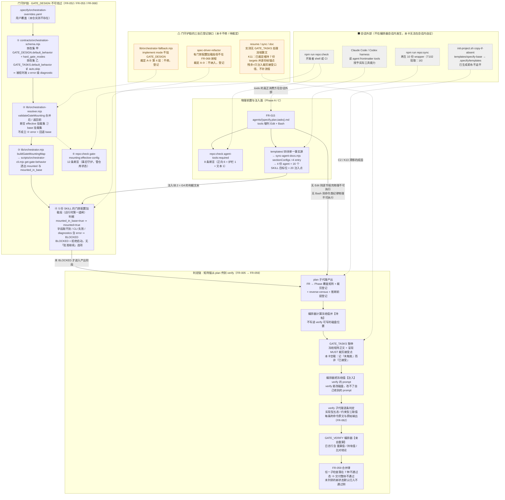

# Implementation Plan: F277 Spec Driver 引擎硬化

**Branch**: `claude/spec-driver-engine-hardening-26e319` | **Date**: 2026-09-04 | **Spec**: [spec.md](./spec.md)
**Input**: Feature specification from `specs/277-spec-driver-engine-hardening/spec.md`（986 行，GATE_DESIGN 已批准，定稿）

> **本文件采用分段落盘协议生成**（spec 需求项 5 / US-3 的 dogfood）。骨架先落盘，各章节由后续分段逐节填充。
> 当前落盘轮次：**第 4 轮（收尾段）**。逐轮已填：**第 2 轮** `Codebase Reality Check` / `Impact Assessment` / `Constitution Check`；**第 3 轮** `FR → Phase 覆盖矩阵` / `裁剪登记` / `分 Phase 实现方案`；**第 4 轮（本轮）** `reverse-census` / `推断前提登记` / `Complexity Tracking` / `Summary` / `Technical Context` / `Project Structure` / `Architecture` 共 7 节。**全部占位符已填完，本文件不再有「⏳ 待后续段落填充」章节。**
> **本轮的续写判据实证（FR-018 / D-5 (c)：已完成节字节是否变化）**：本轮只对 7 处占位符各做一次 `Edit` 精确替换（另加 1 次对本轮自产内容的修订），**未 `Write` 覆盖全文**；对第 2 / 3 轮已填内容做了两处窗口比对，**均逐字节相同**——(a) 「类别判定依据 → 换算式 → 取数命令与实跑输出 → 裁剪登记」连续 148 行 `diff` 无差异；(b) 「分 Phase 实现方案」141 行窗口 `diff` 无差异。**该实证是 D-5 (c) 的第 1 次独立观察，不构成 ≥ 3 次的达成**（FR-018 要求 3 ÷ 3 = 100%，本轮只贡献 1 次；且本轮委派 prompt **明确要求**了分段落盘，按 A-2 的执行条件 (i)，它测不到「自发遵守」，**只能计入 (c) 按段续写、不得计入 (b) 中断幸存**）。
> 本轮新增章节中标注的 `[推断]` 与「⚠ / 待裁定」条目**不得**被误读为「已完成」；须在 `GATE_TASKS` 暂停时逐条呈现。
>
> ### 本轮另发现的 3 项上游变更 / 口径失配（各附命令与实跑输出，须在 `GATE_TASKS` 呈现）
>
> **本轮不修改第 2 / 3 轮已填的六节**（分节协议的续写判据），故以下三项**只在此留痕、不就地改写那些章节的正文**；正确处置是在 `GATE_TASKS` 暂停时更正。
>
> 1. **`spec.md` 已在第 3 轮之后被回写修订，本文件第 4 行的「986 行」是回写前的旧值。** 实跑 `wc -l specs/277-spec-driver-engine-hardening/spec.md` 输出 **1019**（单位：行）；spec 末尾的 §修订记录 表登记 **6 组**改动、触发阶段均标 `plan 3.2`。**该回写已把 3.2 段「口径修订表」里的三行采纳进 spec 正文**：`SC-006` 改为 23 项 / `88 + 5 = 93`、`SC-008` 分母改为 12、**复杂度评估的接口数由 17 改为 18**（实跑 `grep -n '\*\*接口数量 = ' spec.md` 输出 `751:**接口数量 = 18**（换算式：复用既有形状 9 + 新造形状 9 = 18…`）。**故那三行已不再是「待确认的 plan 侧修订」，而是「spec 已采纳的事实」**——`GATE_TASKS` 呈现时须按后者口径，否则会把已解决项当未解决项重复走一遍。**FR 总条数 N 未变**：`grep -c '^- \*\*FR-0' spec.md` 实跑仍为 **68**，SC-002 的分母不受影响。
> 2. **FR-021 的止损条款已由 `SHOULD · [可选]` 升格为 `MUST · [必须]`**（spec §修订记录 第 4 行，其「理由」列写的正是 3.2 段「裁剪登记」提出的不自洽）。**后果**：「裁剪登记 §一」表把它列为第 3 项 `[可选]` 并附「口径更正留痕」的框架**已过时**——spec 已采纳该更正。实跑 `grep -cE 'SHOULD · \[可选\]' spec.md` 当前输出 **6**（3.2 段记录的是 **3**），其中 **4 处是升格留痕散文里的字符串**，**真正的 FR 强度标注只剩 FR-019 与 FR-024 两条**。按当前 spec 正文，`[可选]` 项应为 **2 项**（换算式：实现 1（FR-019）+ 裁剪 1（FR-024）= 2，单位：可选条款），而非该表记的 3 项。**该表的两条处置结论不受影响**（FR-019 判实现、FR-024 判裁剪），**需更正的只有条数与第 3 项的定性**（它现在是 MUST，其「判实现」由强度直接决定，不再是 plan 的自主处置）。**【plan 收口（2026-09-04）已处置】** 「裁剪登记 §一」已按 2 项重写：FR-021 止损条款那一行**已从 `[可选]` 处置表中删去**（改记为「MUST · 已由 Phase D 认领」，见该表下方的连带留痕段），合计式由「实现 2 + 裁剪 1 = 3」重算为「实现 1 + 裁剪 1 = 2」（单位：可选条款）。
> 3. **共享块 2 的文件名 / check id 在本文件内三处不一致。** 实跑 `grep -n 'gate-mounting-guard' plan.md` 输出：`:224` FR-068 矩阵行写 `templates/gate-mounting-guard.md` 与 check id `agent-docs:shared-section:gate-mounting-guard`；`:1376` Phase C 落点 2 写 `templates/orchestrator-gate-mounting-guard.md`。**仲裁依据（不靠多数决，靠事实源）**：spec 回写后的 SC-006 明确列出 check id 为 `agent-docs:shared-section:{agent-output-discipline, orchestrator-gate-mounting-guard, gate-tasks-scope-cut-acceptance}` ⇒ **以 `orchestrator-gate-mounting-guard` 为准**，`:224` 是唯一的失配点。本轮的 `Project Structure` 与 `Architecture` 已按该名书写。**该失配不是笔误层面的小事**：`sectionConfigs` 的 `key` 直接派生 check id（`sync-agent-docs.mjs:122-130`），key 取错会使 SC-006 点名的那个 check id 永不出现，而 `repo:check` **不会报错、只会少一条 check**。**【plan 收口（2026-09-04）已处置】** 全文已统一为 `orchestrator-gate-mounting-guard`：`FR-068` 矩阵行的**文件名**与 **check id** 两处失配已就地改正；收口后复跑 `grep -n 'gate-mounting-guard' specs/277-spec-driver-engine-hardening/plan.md`，输出中**不再有** `templates/gate-mounting-guard.md` 或 `agent-docs:shared-section:gate-mounting-guard` 两个变体（本条留痕行内的引述除外——它引的是被改正前的原值）。

## Summary

本卡把 spec-driver 引擎里三处**靠自觉、无对账点**的面做成可执行约定：**需求的静默裁剪面**（FR 进了 spec 却没有任何 Phase 认领，也没人登记它被裁了）、**关键量的静默漏改面**（改了一个键名却只改了自己看得见的那几处消费点）、以及**子代理的输出与工具能力错位面**（要求 plan 子代理逐节 `Edit`，而它的 frontmatter 里根本没有 `Edit`）。技术路线是「**散文定语义 + 机械定判据**」的双层：语义全部落在 `plugins/spec-driver/` 的 agent prompt、SKILL 与 `templates/` 单一事实源（新增 4 个 plan 具名章节 + 3 块共享散文，经既有 `sync-agent-docs.mjs` 注入，零新建注入链）；判据落在 3 处新增 `.mjs`（`agent-tools-core.mjs` 8 条 frontmatter 断言、`validate-gate-mounting.mjs` 12 条挂载断言、resolver 的 `validateGateMounting()`），每一处断言都必须能在对应 prompt / 模板里找到同语义原文，找不到即判宪法原则 IX 违规并回退。

**分批边界 A**：spec 的 68 条 FR 中，**64 条为本卡核心集**，**FR-010 ~ FR-013（生产可达性检查）整组移交带编号后续卡 F27x**——移交的终态是**未完成**而非「已裁剪」，不计入 SC-001 分子，下一轮 milestone review 会看见它。核心集内约束型 13 条无实现落点，实际要造的实现型 51 条按 **A → B → C → D → E 严格线性**五阶段交付，无并行：**A** 补齐三个子代理的 `Edit`/`Bash` 并把「`GATE_DESIGN` 在 `feature` 下不可绕过」做成 schema 禁改 + resolver 挂载校验 + `repo:check` 事后守护 + SKILL 运行时第一道闸四层落点；**B** 在 plan 模板双源落成 4 个新章节，并收编 verify / spec-review 两条既有判定链的状态词表与交付合并律；**C** 把输出纪律与三块共享散文收敛到单一事实源并接入既有注入引擎；**D** 落成 `GATE_DESIGN` 对抗收敛循环（含 `R_max = 3` 止损）与轻量三纪律、承诺任务化；**E** 跑再生链与五条回归护栏，按固定顺序回放 D-1 ~ D-8 全量验收演示。

**最重的两个风险**（各已有落点，但**均未被本卡消除**）：其一，**本卡的验收有 5 ÷ 8 = 62.5%（单位：演示条）落在自证循环上**——D-4 ~ D-8 的被检对象产出于 specify / plan，而检查它们的机械实现产出于 implement，在 implement 之前这五项**只能人工推演，机械执行数下界为 0**；凡在演示产物中声称某项「已机械执行」而未同处给出命令与原始输出即为 over-claim。其二，**门加固落地后仍存在三处已登记的未守护缺口**：`orchestrator-fallback.mjs` 的 `implement` mode 不挂载 `GATE_DESIGN`（裁定 A-② 第 4 层，本卡不修）、`spec-driver-refactor` 有「门禁配置加载」段却不在 FR-068 射程（裁定 A-③，登记不纳入）、以及 reverse-census 新盘出的 `resume` / `sync` / `doc` 三份 SKILL **根本没有 `GATE_TASKS` 段**而 FR-060 却把它们列为落点（K11——**2026-09-04 plan 收口已裁定维持 7 份 `targets` 并逐份给出插入锚点**，见 §reverse-census K11 处置表与裁定 B-②；**残余是这三个 mode 仍无 `GATE_TASKS` 的完整处理流程散文**，本卡只注入裁剪接受口径一段）。**三者都不是「加固后仍有风险」的泛论，而是可指名到文件与行号的具体缺口。**

## Technical Context

| 维度 | 取值 | 取数依据 |
|---|---|---|
| **语言 / 运行时** | Node.js **≥ 20**（`package.json` 的 `engines.node = ">=20.0.0"`）；本 worktree 实测 `node -v` = **v24.14.0**、`npm -v` = **11.9.0**。包类型 `"type": "module"` ⇒ 新增脚本一律 **ESM `.mjs`** | `node -e "const p=require('./package.json');console.log(p.engines, p.type)"` |
| **改动介质** | **Markdown 为主**（agent prompt / SKILL / `templates/` 共享块 / plan 模板双源），**ESM `.mjs` 为辅**（3 处新增判据 + 2 处既有文件接线）。TypeScript **零改动**——本卡不写 `src/` | Constitution Check 原则 VII 的连带口径记录 |
| **新增依赖** | **0**（换算式：新增 npm 依赖 0 + 新增 AST / 图依赖 0 = **0**，单位：依赖包）。新增 `.mjs` **只允许 `import` `node:` 内置**（C-2 / FR-037），核验命令见 FR-037 的核验方式栏 | 宪法原则 VIII / X；spec §复杂度评估「依赖新引入数 = 0」 |
| **既有依赖面（只用不加）** | `zod`（`contracts/orchestration-schema.mjs` 的 schema 定义，本卡在其上加禁改集）；`vitest`（根测试）；插件侧测试走 `node:test`（`npm run test:plugins` → `scripts/run-plugin-tests.mjs`） | `package.json` scripts 实测 |
| **存储 / 状态** | **无数据库、无持久化状态**。事实源全部是**版本库内的文件**：`plugins/spec-driver/config/orchestration.yaml`（gate 与 phase 定义）、`.specify/orchestration-overrides.yaml`（项目级覆盖，**本仓实测不存在**）、`.specify/templates/**`（copy-if-absent 副本）。**`.specify/runs/` 是本机运行态且 `.gitignore`**，不得作为任何判据的锚（spec L-2 已实测证伪该路线） | 裁定 A-④；spec L-2 |
| **测试策略** | 四层，**逐层给命令**：<br>(1) **单元 / 集成** `npx vitest run`——新增 FR-052 负向断言（覆盖被拒时 diagnostic 级别 ≥ `error`）；<br>(2) **插件侧** `npm run test:plugins`——C1 拆分后 `orchestration-resolver.test.mjs` / `orchestrator.test.mjs` 既有用例**一条不改**即证拆分零行为变化；<br>(3) **守护项自测（红灯构造）**——本卡每个新增守护项都必须有一次**必红**构造：FR-053 用「只替换 `modes.feature`、不碰 `gates:` 块」的 overrides 使挂载断言 (i) 变红；R-1 用「删掉一对 marker」使 `agent-docs` 族出一条 `fail` 而非吐栈；<br>(4) **变异测试**——判断守护力而非「跑通」：本轮 plan 阶段已示范两次（K1 的 `tools` 增列 sha256 A/B、V-P1 的 `validateNamespaceConsistency` 沙箱 A/B），implement 阶段须对新断言集同法验证 | AGENTS.md「提交前验证」；本仓已登记「判测试守护力用变异测试」 |
| **交付前回归护栏（FR-050，五条全绿或已归因）** | `npx vitest run` / `npm run test:plugins` / `npm run build`（`tsc`） / `npm run repo:check` / `npm run release:check`。**满载假红须走 FR-050 三条件归因**（隔离重跑绿 + 与本卡改动面零交集 + 命中或新登记入预存 flaky 清单），未归因的失败一律计失败 | `package.json` scripts；FR-050 |
| **规模（本卡改动面）** | 直接修改 **36 个文件**（其中新建 6；**2026-09-04 plan 收口按目录逐个枚举重算得 35，同日裁定 D-③ 再 +1 得 36**，取代早前的 31 / 34 / 35，完整清单与核对式见 §Project Structure「文件计数与本轮的口径修订」）；间接受影响 ≥ 20 个（含 `.codex/skills/**` 的机器再生 wrapper **8** 份，见该节的再生口径说明）；跨 **6 个顶层边界**；`repo:check` 的 check id 由 **88 → 94**（实测基线见推断前提登记 V-P2；裁定 D-③ 后由 93 重算） | §Project Structure 文件计数；Phase C 口径修订表；V-P2 |
| **目标平台** | 本地开发机（macOS / Linux）与 CI（GitHub Actions）。**无浏览器 / 移动端面**。`repo:check` 与 `release:check` 已接入 CI（M10 Gate 0） | AGENTS.md 主线焦点 |
| **命令可复现性的环境依赖** `[推断]` 不适用（已实测） | 本会话 `grep` 是 shell function → `ugrep 7.8.4 -G --ignore-files --hidden`，**遵守 `.gitignore`** 且输出路径**无 `./` 前缀**。本卡所有写入产物的检索命令须与该事实同处声明，跨环境复跑出现计数差异时**先核对 grep 实现再判漂移** | §reverse-census「执行环境声明」，已实测 |

**本节的 `[推断]` 标注**：上表**无 `[推断]` 项**——每一格均由本轮实跑或既有实测支撑，取数依据逐格给出。**唯一接近推断的是「规模」行的 31 / ≥20 两个数**：它们是 Phase C 口径修订表按落点清单**逐项加总**的结果（换算式在该表内），属**推导值**而非估算值，其正确性可由交付后 `git diff --name-only` 的文件数复核；若不符按 FR-058 走追加式修订记录，不改本节正文。**分 Phase 的改动行数估算全部是 `[推断]`**，已在「推断前提登记 §一」以 P-3 ~ P-8 逐条登记并各配同命题证伪命令，本节不重复。

## Codebase Reality Check

> **必选区块**。本轮对 spec §分批·边界 A 落点清单的 **21 个目标文件逐个实测**，覆盖率 = 21 ÷ 21 = **100%**，单位：目标文件。
> 另发现 **2 个未在清单内、但落在同一改动面上的文件**，一并列出（表内以 ⚠️ 标注）。

**取数方法（可复现）**：LOC 用 `rg -c '^' <glob>`（计匹配行数，与 `wc -l` 在无尾行差异时同值）；`.specify/**` 是隐藏目录、ripgrep 默认不递归，其 LOC 取 Read 工具行号末值。`.md` 的「公开接口数」口径为 `rg -c '^#{2,3} '`（二三级章节数）；`.mjs` 口径为「顶层函数/常量数（其中 `export` 数）」，class 方法不单独计数。debt 扫描命令 `rg -c 'TODO|FIXME|HACK'`。

| # | 文件路径 | LOC | 公开接口数（.md=章节数） | TODO/FIXME/HACK | 超长函数 >200L | 需 `[CLEANUP]` |
|---|---|---|---|---|---|---|
| 1 | `plugins/spec-driver/agents/specify.md` | 109 | 7 | 0 | N | N |
| 2 | `plugins/spec-driver/agents/plan.md` | 135 | 9 | 2（伪阳性，见注 a） | N | N |
| 3 | `plugins/spec-driver/agents/tasks.md` | 88 | 7 | 0 | N | N |
| 4 | `plugins/spec-driver/agents/implement.md` | 197 | 12 | 0 | N | N |
| 5 | `plugins/spec-driver/agents/verify.md` | 311 | 23 | 0 | N | N |
| 6 | `plugins/spec-driver/agents/spec-review.md` | 130 | 16 | 0 | N | N |
| 7 | `plugins/spec-driver/skills/spec-driver-story/SKILL.md` | 596 | 33 | 0 | N | **条件触发 C3** |
| 8 | `plugins/spec-driver/skills/spec-driver-feature/SKILL.md` | **794** | 30 | 0 | N | **条件触发 C3** |
| 9 | `plugins/spec-driver/skills/spec-driver-implement/SKILL.md` | 671 | 29 | 0 | N | **条件触发 C3** |
| 10 | `plugins/spec-driver/skills/spec-driver-fix/SKILL.md` | 573 | 37 | 0 | N | **条件触发 C3** |
| 11 | `plugins/spec-driver/skills/spec-driver-resume/SKILL.md` | 336 | 19 | 0 | N | N（但落点缺失，见 R-3） |
| 12 | `plugins/spec-driver/templates/verification-report-template.md` | 63 | 10 | 0 | N | N（但有 3 份副本，见 R-4） |
| 13 | `.specify/templates/plan-template.md` | 104 | 7 | 0 | N | **硬触发 C2** |
| 14 | `plugins/spec-driver/contracts/orchestration-schema.mjs` | 346 | 3（导出 3） | 0 | N | N |
| 15 | `plugins/spec-driver/lib/orchestration-resolver.mjs` | **534** | 5（导出 1） | 0 | **Y** | **硬触发 C1** |
| 16 | `plugins/spec-driver/lib/orchestrator.mjs` | 308 | 3（导出 3：1 class + 2 function） | 0 | N | N |
| 17 | `plugins/spec-driver/scripts/orchestrator-cli.mjs` | 490 | 12（导出 0，CLI 入口） | 0 | N | N |
| 18 | `scripts/lib/repo-maintenance-core.mjs` | 395 | 10（导出 2） | 0 | N | N（但有 fail-loud 缺口，见 R-1） |
| 19 | `scripts/sync-agent-docs.mjs` | 150 | 5（导出 4） | 0 | N | N |
| 20 | `scripts/lib/agent-tools-core.mjs` | **0（新建）** | — | — | — | — |
| 21 | `docs/shared/agent-output-discipline.md` | **0（新建）** | — | — | — | — |
| ⚠️22 | `plugins/spec-driver/templates/specify-base/plan-template.md` | 134 | 9 | 1（伪阳性，见注 a） | N | **硬触发 C2** |
| ⚠️23 | `plugins/spec-driver/lib/orchestrator-fallback.mjs` | 98 | 1（导出 1） | 0 | N | N（但是覆盖缺口，见 R-2） |

**注 a（TODO 伪阳性）**：`agents/plan.md:53` 与 `:57`、以及 `specify-base/plan-template.md` 的对应行，命中的是 Reality Check **规则散文自身**里的字面词「TODO/FIXME/HACK 标记」，不是真实 debt 标记。按前置清理规则第 2 条（「> 3 个且与本次变更相关」），二者均不触发——计数不足 3 且不是 debt。**本卡目标文件集内真实 debt 标记数 = 0**（换算式：命中 3 处 − 伪阳性 3 处 = 0 处，单位：标记处）。

### 前置清理任务（`[CLEANUP]`）

- [ ] **C1（硬触发）** `plugins/spec-driver/lib/orchestration-resolver.mjs` 拆分 —— 触发规则：**双规则同时命中**。(i) LOC 534 > 500，且 FR-052 的挂载校验（`modes.<mode>` 整段替换后校验 gate 是否仍被任一 phase 挂载 + 缺失发 `error` + 回退 base）预计新增 > 50 行[推断：按同类校验分支的既有体量外推，未实测]；(ii) 唯一导出 `resolveOrchestrationConfig` 跨 **187–519 行 ≈ 333 行 > 200**，已是超长函数。**清理内容**：按「加载 base / 加载 overrides / schema 校验与降级 / 合并 / 组装 fieldSources」拆为可独立测试的子函数，再把挂载校验挂进拆好的位置。**必须前置**的理由：在一个 333 行函数里再插一段带回退语义的校验，是在错误的抽象上叠 workaround（AGENTS.md「零基思维」第 3 条），且会让 FR-052 的负向断言（覆盖被拒时 diagnostic 不低于 error）难以单测。
- [ ] **C2（硬触发）** `plan-template.md` 双源漂移收敛 —— 触发规则：明确的内容分歧（不是 LOC 类触发）。**实测事实**：canonical 侧 `plugins/spec-driver/templates/specify-base/plan-template.md` 有 134 行 / 9 章节，**含** `## Codebase Reality Check` 与 `## Impact Assessment`；项目级 `.specify/templates/plan-template.md` 只有 104 行 / 7 章节，**两节皆无**。`.specify/templates/` 走的是 **copy-if-absent** 语义（`init-project.sh:50` 从 `templates/specify-base` 复制，已存在则不覆盖，见 F021 spec §FR-003），因此项目级副本一旦生成就**永不追平** canonical。**必须前置**的理由：本卡要往 plan 模板加 6 个新章节，不先收敛漂移，结果必然是「新章节只进 canonical，所有已初始化的项目永远拿不到」——本次 plan 生成就是第一手实证：编排器注入给 plan 子代理的是 104 行的项目级旧版，而 agent prompt 却要求产出该副本里根本不存在的两节。**清理内容**：(a) 明确 canonical 归属并写进 `agents/plan.md`「读取顺序」散文；(b) 二选一——把项目级副本追平并加一条漂移可见化路径（warn 级即可，不违反 copy-if-absent 的用户自持语义），或显式登记「项目级模板由用户自持、不追平」并让 plan agent 在缺章节时 fail-loud 而非静默少写。
- [ ] **C3（条件触发·须实测后定夺）** 4 个 > 500 行 SKILL 的「门禁配置加载」段落抽取 —— 触发规则第 1 条：LOC > 500 且新增 > 50 行。**已实测**：`feature` 794 / `implement` 671 / `story` 596 / `fix` 573 四者 LOC 均 > 500；「门禁配置加载」小节在 `feature:93` / `story:97` / `implement:107` / `fix:95` **四处并存**（另 `refactor:68` 也有，见 R-3）。**未实测**：各文件本卡实际新增行数、以及这 4 段的逐行重复量是否 > 30 行[推断：Phase B/A 要向其中注入 FR-068 守卫 + `GATE_TASKS` on_failure + `GATE_VERIFY` 重算三段散文，`feature`/`story` 侧上界估 40~70 行，`implement`/`fix` 侧估 20~45 行；均未实测]。**定夺时点**：tasks 阶段按实际增量复核；任一文件新增 > 50 行即转硬触发。**清理内容（若触发）**：把「门禁配置加载」抽到 `templates/` 单一源，走 FR-036 同一个 `sync-agent-docs.mjs` 注入机制，而不是第 6 次复制粘贴。

## Impact Assessment

> **必选区块**。**MCP 可用性声明先行**（AGENTS.md dogfooding 约定）：`mcp__plugin_spectra_spectra__impact`（target=`orchestration-resolver.mjs`, depth=3, upstream）与 `mcp__plugin_spectra_spectra__context`（target=`repo-maintenance-core.mjs`）**两次调用均成功返回**，但结论**不可直接采信**：图 freshness 判 `stale`（`recordedSourceCommit` `64b1d72f` ≠ `currentHead` `e01611b2`，`builderMismatch=true`），且 coverage 侧 `linkageRatio = 3996 ÷ 125794 = 3.2%`、`separable=false`，工具自身把本次零结果标注为 `resolution.reason = coverage-gap`、**明示「不判为确认为零」**。因此 caller 链**改用 Grep 重测**，本节所有影响面数字以 Grep 实测为准；`context` 返回的 22 条 imports（`repo-maintenance-core.mjs` 的校验器聚合面）与 Grep 结果一致，作旁证采信。

| 维度 | 评估 |
|------|------|
| **直接修改文件数** | **23**（换算式：spec 清单 21 + canonical 孪生 `specify-base/plan-template.md` 1 + fallback 决策路径 `orchestrator-fallback.mjs` 1 = 23，单位：文件。后两者见 C2 / R-2；若 GATE_DESIGN 裁定不覆盖 fallback，则为 22） |
| **间接受影响文件数** | **≥ 20**（换算式：`.codex/skills/spec-driver-{feature,story,implement,fix,resume}/SKILL.md` 5 + `plugins/spec-driver/skills-codex/同名 5` + 仓根 `AGENTS.md`/`CLAUDE.md` 2 + 既有测试 6（见下）+ `verification-report-template.md` 另 2 份副本 = 20，单位：文件。**均为 Grep 实测清单，非估计**） |
| **跨包影响** | **涉及 6 个顶层边界**：`plugins/spec-driver/**`、`scripts/**`、`docs/shared/**`、`.specify/templates/**`、`.codex/skills/**`（再生产物，禁手改）、`tests/**` |
| **数据迁移** | **有，3 项**（见下「数据迁移三项」） |
| **API/契约变更** | **有，5 项**（见下「契约变更五项」） |
| **风险等级** | **HIGH** |

**风险等级判定理由**：按 plan 子代理判定规则，HIGH 的四个触发因**全部命中**（任一命中即 HIGH）：(1) 影响文件 23 + 20 = **43 > 20**；(2) 跨包影响 **6 > 2**；(3) **涉及数据迁移**（3 项）；(4) **修改公共 API 契约**（5 项，其中 override schema 禁改字段是对既有用户配置的破坏性变更）。

### 数据迁移三项

1. **状态词表迁移**（FR-054 / FR-055）—— 5 个旧取值（已实现 / 部分实现 / 未实现 / 过度实现 / 无法验证）→ 实现型 FR 五态 + 约束型 FR 三取值。这是对**已在流水线上运行的判定口径**做迁移，不是新增字段。**实测射程大于 spec 点名的 2 个文件**：`agents/verify.md` 4 处 + `agents/spec-review.md` 20 处 + `templates/verification-report-template.md` 4 处 + `templates/specify-base/verification-report-template.md` 4 处 + `.specify/templates/verification-report-template.md`（同源副本）= **≥ 5 个文件 / ≥ 32 处**（换算式：4 + 20 + 4 + 4 = 32 处 tracked 命中，单位：取值出现处；`.specify/` 副本因隐藏目录未计入 ripgrep 命中，须另计）。宪法原则 XIV 明写「涉及删除/重命名时 verify 应扫描旧名称残留（代码 + 文档）」——本项即属重命名，5 处副本必须全扫。
2. **plan 模板新章节对历史 plan 的兼容** —— 历史 `plan.md` 无覆盖矩阵章节，走 FR-042 的「未对账」兼容分支。该态**必须与「未实现」「未执行（缺席）」严格区分**、不得合并表示（spec §复杂度评估 数据迁移 (i)）。此项与 C2 的双源漂移直接耦合：漂移不收敛，则「历史 plan」与「新 plan」的边界本身就不可判。
3. **`get-gate-behavior` 输出新增 `mounted` 字段**（FR-052）—— 输出 schema 变更。消费方是 5 个编排器 SKILL 里的 bash 解析片段（`feature:100` / `:339` / `:698` 三处 + `story` / `implement` / `fix` / `refactor` 各一处，Grep 实测）。新增字段本身向后兼容（旧消费方不读即无感），但 FR-068 把「取不到 `mounted`」定为 `BLOCKED`，等于给这些消费点加了硬阻断语义。

### 契约变更五项

1. **agent frontmatter `tools` 契约**（FR-015）—— `specify.md:3` / `plan.md:3` / `tasks.md:3` 增列 `Edit` 与 `Bash`。**已独立复核 spec 的实测断言，逐条为真**：`specify.md:3` = `[Read, Write, Grep, Glob]`、`plan.md:3` = `[Read, Write, Grep, Glob, mcp×2]`、`tasks.md:3` = `[Read, Write, Grep, Glob]`，三者**均无 `Edit` 也无 `Bash`**；`implement.md:3` 已含 `Edit` + `Bash`；`verify.md:3` = `[Read, Bash, Grep, Glob, mcp×2]`——**无 `Write`/`Edit` 但有 `Bash`**，spec 关于「verify 非纯只读」的更正成立。这是扩大三个子代理的实际工具能力，**不是文本调整**。
2. **override schema 禁改字段**（FR-052）—— `GATE_DESIGN.default_behavior` / `hard_gate_modes` 与 `GATE_TASKS.default_behavior` 被列为禁改并以 diagnostic 拒绝。**这是破坏性变更**：此前合法的 `.specify/orchestration-overrides.yaml` 覆盖会被 `error` 拒绝（详见 Constitution Check 原则 XIII）。
3. **`get-gate-behavior` 新增 `mounted` 字段**（同数据迁移 3）—— 落点为 `orchestrator-cli.mjs:112-130` 的 `cmdGetGateBehavior` 输出对象（当前输出 6 字段：`success`/`mode`/`gate_id`/`behavior`/`source`/`is_hard_gate`/`severity`/`description`）。
4. **新增 repo:check 检查族 `agent-tools`**（FR-017 / 第 16 族）—— `repo-maintenance-core.mjs` 当前聚合 **15 个族**（Grep + Read 实测：agent-docs / marketplace / spec-driver-wrappers / spectra-skills / codex-plugin-consistency / runtime-boundaries / release-contract / orchestration-overrides / preference-rules / delegation-contract / orchestrator-model / namespace-consistency / graph-quality / spec-drift / model-literal-gate / worktree-local-state）。新族按既有三段式契约（`validate<Feature>({projectRoot})` → `aggregateValidation(...)`）接入。
5. **`sectionConfigs` 的 `targets` 首次指向非仓根文件**（FR-036）—— 既有 10 个 entry 的 `targets` **全部**是 `['AGENTS.md', 'CLAUDE.md']`（`sync-agent-docs.mjs:6-57` 实测），注入点 10 × 2 = **20 个**。本卡新增 **4 个** `sectionConfigs` entry / **20 个**注入点（换算式：块 1 的 4 份 `plugins/spec-driver/agents/*.md` + 块 2 的 5 份 `SKILL.md` + 块 3 的 7 份 `SKILL.md` + 块 4（裁定 D-③）的 4 份 `SKILL.md` = 4 + 5 + 7 + 4 = **20**，单位：marker 对），`targets` **均在 `plugins/spec-driver/**` 之下、不含 `AGENTS.md` / `CLAUDE.md`**，故对仓根两份文档的**字节预算影响为 0**。虽是「同一张表加行」的消费方扩张、非新拓扑，但它改的是**仓根共享脚本**，回归面覆盖既有 **20** 个注入点（10 entry × 2 target），与本卡自己新增的 **20** 个同量级——**两个 20 单位相同（marker 对）但作用域不同，不得相加**。

### 本轮盘出的 5 个风险点（须在 Phase 方案中各有落点）

- **R-1（fail-loud 缺口 · 高）** `repo-maintenance-core.mjs:262` 调用 `validateSharedAgentDocs(resolvedRoot)` **没有兜底外壳**；而 `sync-agent-docs.mjs:66` 的 `syncSection` 在 marker 缺失时直接 `throw`，`:104` 的 `readFileSync(section.sourcePath)` 在源文件缺失时也直接 `throw`。对比同文件 `:194` 的 `validateSpecDriftSafely` 已有显式兜底外壳（注释明写「任何未预期 reject 都不允许把整份报告变成一段栈」）。**本卡放大了该缺口**：新增 entry 后 marker 的分布面从「仓根 2 个必然存在的文件」扩到「4 个 agent 文件」，且 `sourcePath` 指向本卡新建的 `docs/shared/agent-output-discipline.md`——任一 agent 文件丢 marker 或该源文件缺失，`npm run repo:check` 会吐栈而不是报 fail，其余 15 族结论一并丢失。**这是 C-3「fail-loud，禁静默放行」的反面形态：不是静默放行，是整份报告不可用**。
- **R-2（覆盖缺口 · 高）** `plugins/spec-driver/lib/orchestrator-fallback.mjs:17` **硬编码**了 `GATE_DESIGN: { default_behavior: 'always', hard_gate_modes: ['feature'], ... }` 与 `:19` 的 `GATE_TASKS`。Grep 实测该 fallback 有 **9 个可达触发点**（`orchestration-resolver.mjs:201/229/269` 3 处 + `orchestrator.mjs:53/82/94/103` 4 处 + `orchestrator-cli.mjs:16` 导入 + `orchestrator.mjs:12` 导入）。若 FR-052/053/068 只打 schema + resolver 主路径，**fallback 路径不受禁改字段约束**——这与 F259 已登记的反模式「判据写成值枚举 ⇒ 每加一个值漏一次」同型（此处是「判据只打一条路径 ⇒ 另一条路径恒不生效」）。Phase A 须**显式裁定**：纳入覆盖，或作为已知缺口登记在案（不得默认不提）。
- **R-3（落点错位 · 中）** FR-068 要求在「五个编排器 SKILL 的『门禁配置加载』步骤」加运行时守卫。Grep 实测该小节**只在 4 个 SKILL 中存在**（`feature:93` / `story:97` / `implement:107` / `fix:95`），`spec-driver-resume` **无同名小节**（spec 已预告，落点待 plan 给出）；而 `spec-driver-refactor:68` **有**该小节却不在 spec 的 5 个之列。Phase A 须给 resume 定新建落点，并裁定 refactor 是否连带（不裁定即等于留一个未守卫的编排入口）。
- **R-4（迁移射程被低估 · 中）** 见「数据迁移 1」：FR-054/055 只点名 2 个文件，实测射程 ≥ 5 个文件 / ≥ 32 处。须在 reverse-census 中把「取值出现处」的检索命令与实际输出计数钉死，不得按卡面点名抄（这正是账本 `:117` 条目要治的根因）。
- **R-5（模板双源漂移 · 中）** 见 C2。本次 plan 生成即为第一手实证语料。

### 分阶段计划（HIGH 风险强制，与编排器 Phase 基线对照）

风险等级 HIGH ⇒ 必须拆分为 2+ 个可独立验证的阶段。编排器已给 **Phase A~E 五阶段基线**，满足该要求；本轮先给各阶段验证点，完整方案见「分 Phase 实现方案」章节。

- **Phase A 物理前置 + 门守护（代码面）** — 验证点：3 份 frontmatter 增列 `Edit`/`Bash` 后 `agent-tools:required` 8 条断言全 pass；`namespace-consistency`（5 agent 受保护清单 = plan/implement/verify/spec-review/quality-review，实测）与 `preference-rules:agent-block-sync`（同 5 agent，实测）两族**不因增列工具而红**；FR-052 负向断言（覆盖被拒时 diagnostic 级别 ≥ error）单测通过；FR-053 的 12 条断言在「`modes.feature` 整段替换删掉挂门 phase」构造下**必须红**（这是该守护项存在的唯一理由）。**R-2 的裁定必须在本阶段落地。** 前置依赖：C1 拆分先行。
- **Phase B 矩阵主链（散文）** — 验证点：D-1 / D-3 在 F270 语料上回放，点名全部 4 组未认领项；阴性对照不误报。前置依赖：C2 收敛先行（否则新章节进不了实际被读取的模板）。
- **Phase C 输出纪律** — 验证点：`agent-docs:shared-section:<key>` 由既有引擎自动派生并 pass；既有 20 个注入点零回归；**R-1 的兜底外壳与本阶段同批交付**（否则本阶段自身就是该缺口的引爆源）。
- **Phase D 收敛循环 + 轻量三纪律 + 承诺任务化** — 验证点：D-4~D-8 自证演示（须按 spec 诚实性声明第 3 条标注自证循环，不得口径为外部验证）。
- **Phase E 回归护栏 + 再生 + 验收演示** — 验证点：`npm run repo:sync` 后 `.codex/skills/**` 5 份 + `skills-codex/**` 5 份 wrapper 无手改残留；`npm run repo:check` / `release:check` / `npx vitest run` 全绿；D-1~D-8 全量回放。

## Constitution Check

*GATE: Must pass before Phase 0 research. Re-check after Phase 1 design.*

**结论：无 VIOLATION。** 14 条原则中 **7 条适用且 PASS**、**2 条 CONDITIONAL PASS**（III、IX）、**1 条须论证留痕**（XIII，受控的向后不兼容）、**4 条不适用**（V、VI、VII 为 spectra 分区约束；另见表内说明）。3 条 CONDITIONAL/留痕项已列入 Complexity Tracking 的填充清单。

| 原则 | 适用性 | 评估 | 说明 |
|---|---|---|---|
| **I. 双语文档规范** | 适用 | **PASS** | 新增章节标题与散文用中文、代码标识符保持英文，FR-039 / C-9 已明写为 MUST。本 plan 自身亦遵循。 |
| **II. Spec-Driven Development** | 适用 | **PASS** | 本卡自身走 spec-driver `story` 流程，制品链 spec → plan → tasks → verification 完整；不直接改 `src/`。 |
| **III. YAGNI（如无必要勿增实体）** | 适用 | **⚠️ CONDITIONAL PASS** | spec 复杂度评估自判 **HIGH**（组件 17 / 接口 17 / 信号 3，三个独立触发因），68 条 FR 是本仓近 6 个 spec 的历史最高（比第二名 F270 的 49 多 38.8%）。合规依据：C-7 已要求逐条标注「必须/可选」并给「去掉后功能是否仍可实现」的去留论证（FR-019/020/046/047）；spec 已判「必须分批」并已移交 FR-010~013（4 条）。**plan 侧的附加义务（条件）**：(a) Phase 拆分不得把 `[可选]` 项混入必须批；(b) Complexity Tracking 须对 17 个组件逐个登记去留论证，尤其 C3 抽取一旦触发会再增一条注入链——须先问「不抽取、接受 4 份重复，功能是否仍可实现」。 |
| **IV. 诚实标注不确定性** | 适用 | **PASS（附继承义务）** | spec 已有三条诚实性声明 + 5 条推断前提登记（A-1~A-5）。plan 必须继承而非收口：本轮凡未实测的量均已就地标 `[推断]`（C1 的「新增 > 50 行」、C3 的「新增行数上界估」）。**禁止**在后续段落把 spec 的三条声明总括为「已解决」。 |
| **V. AST 精确性优先** | **不适用** | — | spectra 分区约束。本卡不产出结构化 spec 数据；且 C-4 / FR-012 反向明禁 AST 依赖（生产可达性检查限词法），该组 FR 已整体移交后续卡。 |
| **VI. 混合分析流水线** | **不适用** | — | spectra 分区约束。本卡不经 skeleton → LLM 流水线。 |
| **VII. 只读安全性** | **不适用** | — | spectra 工具约束。连带口径记录：本卡写面限 `plugins/spec-driver/**`、`scripts/**`、`docs/shared/**`、`.specify/templates/**`、`specs/277-*/**`，**不写 `src/`**，与该原则精神不冲突。 |
| **VIII. 纯 Node.js 生态** | 适用 | **PASS** | 新增 npm 依赖 **0**（spec 换算式：npm 0 + AST/图 0 = 0）；新增 `.mjs` 只 `import` `node:` 内置（C-2 / FR-037）。 |
| **IX. Prompt 编排 + Harness 强制** | 适用（**本卡核心风险面**） | **⚠️ CONDITIONAL PASS** | 原则明写「行为变更通过修改 Prompt 文本实现，**不引入运行时代码**」「Hooks 仅用于 Prompt 无法保证的硬约束，**不承载编排决策**」。本卡有三处 `.mjs`：**(a)** `agent-tools-core.mjs`（frontmatter 结构断言）→ 属原则 X 明列的「治理检查」辅助脚本，**合规**；**(c)** FR-053 的 repo:check 守护项 → 同上，**合规**；**(b) resolver 挂载校验 + `mounted` 字段最贴近红线**——它改变 resolver 对 override 的合并结果，位于编排配置解析链**内部**而非外部校验器。**判其合规的依据（即「条件」）**：该校验只做「检测缺失 → 发 `error` → 回退 base」，**不新增任何编排语义**——其语义事实源仍是 `config/orchestration.yaml` 与 GATE_DESIGN 的既有定义，`mounted` 是既有事实的**透出**而非新决策；且 FR-035 / C-1 已强制「新增 `.mjs` 只能是同一语义的机械化执行器，禁止脚本里写了 prompt 里没写」。**Phase A 的验收必须逐条核对**：每一处 `.mjs` 断言都能在对应 prompt / 模板中找到同语义原文，找不到即判本条 VIOLATION 并回退。 |
| **X. 零运行时依赖** | 适用 | **PASS（附一条须核项）** | 新增依赖 0，`.mjs` 只用 `node:` 内置。**须核**：原则要求「Harness 增强不可用时，编排核心独立运行、功能不退化」。FR-068 的 BLOCKED 守卫依赖 `orchestrator-cli.mjs` 可执行。既有 SKILL 的 `get-gate-behavior` 调用**已经**是同样的依赖（实测 7 处），故不是**新增**的依赖面；但 FR-068 把「CLI 调用失败」从软降级升为**硬阻断**，这是行为变更，须与原则 XIII 一并在 Phase A 核。 |
| **XI. 质量门控不可绕过** | 适用（**本卡即在加固该原则**） | **PASS** | FR-052/053/068 三层把「GATE_DESIGN 在 feature 下不可被任何策略或配置绕过」从散文约定变为机械判定，正面服务于该原则第 3 条。**风险**：R-2 的 fallback 路径若不覆盖，本加固存在旁路——Phase A 必须裁定。 |
| **XII. 验证铁律** | 适用 | **PASS（附诚实边界）** | FR-005 的「编排器持有并注入冻结值 + `GATE_VERIFY` 时编排器亲自重算比对」正是「编排器独立执行验证 + 不信任 Agent 自我报告」的具体化，且注入通道（verify 能改磁盘、改不了自己收到的 prompt）为「Agent 完成声明须附实际证据」提供了机械锚。**诚实边界（不得被后续段落收口）**：spec 诚实性声明第 2 条已声明矩阵**非独立信源**；US-3 已声明 verify 的独立性**未取得**（verify 持有 `Bash` 即持有完整写路径，本轮已独立复核 `verify.md:3` 属实）。 |
| **XIII. 向后兼容** | 适用 | **⚠️ 无 VIOLATION，但有一处受控的向后不兼容，须论证留痕** | 满足面：FR-042 的「未对账」兼容分支满足「历史制品不因新规则被判死」；`mounted` 新增字段对旧消费方无感。**不满足面**：FR-052 会让**此前合法**的 `.specify/orchestration-overrides.yaml` 覆盖被 `error` 拒绝——原则第 3 条写「无法识别的配置字段或值输出警告但不阻断」，本卡是**已识别字段的合法值被主动拒绝**，与该条不同型；但「未配置新字段时行为不变」在**已配置该覆盖的用户**身上不成立。**判定不升为 VIOLATION 的依据**：C-6 已把「GATE_DESIGN 不可绕过」定为红线，宪法原则 XI 第 3 条同为硬约束，二者优先于 XIII 的便利性条款——这是**宪法内部两条原则的取舍**，不是对宪法的偏离。**留痕义务**：(a) 进 Complexity Tracking；(b) 给迁移指引；(c) **Phase A 必须实测本仓自身的 `.specify/orchestration-overrides.yaml` 是否已覆盖这两个字段**，若已覆盖须先修本仓配置，否则本卡一落地就把自己的仓库判红。 |
| **XIV. 可观测性与架构守护** | 适用 | **PASS（附连带义务）** | 满足面：FR-053/017 守护项 + `[GATE] GATE_VERIFY` 日志行满足「Gate 决策可追溯」；「子 Agent 间制品传递应有显式合同（路径、必选章节、校验规则）」正是 FR-001~007 覆盖矩阵在做的事，本卡是对该条的直接兑现。**连带义务**：原则第 4 条明写「涉及删除/重命名时，verify 阶段应扫描旧名称残留（代码 + 文档）」——本卡的状态词表迁移属重命名，R-4 实测射程 ≥ 5 文件 / ≥ 32 处，**必须全扫**，不得只扫 spec 点名的 2 个文件。 |

## FR → Phase 覆盖矩阵

> **必选区块 · 全 68 行，不抽样、不省略未认领行**（FR-001 / SC-002）。分母 N 由重算命令现取：`grep -c '^- \*\*FR-0' specs/277-spec-driver-engine-hardening/spec.md`，2026-09-04 本 worktree 实跑输出 **68**（单位：FR 条），与本表行数一致。
>
> **Phase 集合（FR-003 交叉校验的取值域）** = { `A`, `B`, `C`, `D`, `E` }，逐个定义见本文件「分 Phase 实现方案」章节。**「认领 Phase」列的每一个取值必须 ∈ 该集合**；类别为 `约束型` 的行一律填占位符 **`—`**（不参与交叉校验，FR-001 / FR-003）；`FR-010` ~ `FR-013` 填 **`移交 F27x`**——**移交是未完成态、不是裁剪**（spec §分批与移交 · 用户 Q6 硬约束），不入「裁剪登记」章节。
>
> **「需求项 / 跨切」列逐字抄自 spec §分批与移交 的「FR → 需求项 / 跨切 归属表」左列**，plan 不自行重新归属（该表末句：「归属有争议时以本表为准，plan 不得自行重新归属」）。

| FR | 类别 | 需求项 / 跨切 | 认领 Phase | 实现落点 | 验证点 |
|---|---|---|---|---|---|
| FR-001 | 实现型 | 需求项 1 · FR 覆盖矩阵与裁剪登记（US-1） | **B** | `.specify/templates/plan-template.md` + `templates/specify-base/plan-template.md`（新增「FR → Phase 覆盖矩阵」具名章节，含「类别」列）；`agents/plan.md` | SC-002（矩阵行数 ÷ N = 68 ÷ 68）；D-1 |
| FR-002 | 实现型 | 需求项 1 · FR 覆盖矩阵与裁剪登记（US-1） | **B** | 同上（章节的行格式定义：认领 Phase 列可多值） | SC-002（一条 FR 被多 Phase 认领仍按 1 行计） |
| FR-003 | 实现型 | 需求项 1 · FR 覆盖矩阵与裁剪登记（US-1） | **B** | `agents/plan.md`（产出侧判据）+ `agents/verify.md`（消费侧交叉校验口径） | D-1 阴性对照；本表自身即首份被校验语料（认领 Phase 取值 ⊆ {A..E}） |
| FR-004 | 实现型 | 需求项 1 · FR 覆盖矩阵与裁剪登记（US-1） | **B** | plan 模板双份新增「裁剪登记」具名章节；`agents/plan.md` 阻断口径 | D-1；本 plan 的「裁剪登记」章节非空即为首份实证 |
| FR-005 | 实现型 | 需求项 1 · FR 覆盖矩阵与裁剪登记（US-1） | **B** | `agents/verify.md`（五态 + 约束型三取值 + 三值并列比对）；`skills/spec-driver-{feature,story,implement,fix,resume}/SKILL.md` 的 `GATE_TASKS` / `GATE_VERIFY` 段（编排器持有并注入冻结值、`GATE_VERIFY` 亲自重算）；**冻结字段落 `tasks-template.md` 两份副本**——canonical `plugins/spec-driver/templates/specify-base/tasks-template.md` 与项目副本 `.specify/templates/tasks-template.md`（K13 实测两者漂移 266 vs 251 行，只改一侧必然失效，见 `[CLEANUP] C2`） | `[GATE] GATE_VERIFY` 日志行含「重算值 / 持有值 / 比对结论」三项；两份 `tasks-template.md` 的冻结字段段落 `diff` 一致；D-1 |
| FR-006 | 实现型 | 需求项 1 · FR 覆盖矩阵与裁剪登记（US-1） | **B** | `agents/verify.md`（自动判「未实现」+ 冲突留痕格式） | D-1（4 组全部落「未实现」）；SC-004 = 4 ÷ 4 |
| FR-007 | 实现型 | 需求项 1 · FR 覆盖矩阵与裁剪登记（US-1） | **B** | plan 模板双份章节内的「不适用（本次无 FR 列表）」占位口径 | mode 分层矩阵第 1 行条件格的落地核对（`fix` / `doc` / `refactor` / `sync`） |
| FR-008 | 实现型 | 需求项 2 · 承诺任务化与生产可达性检查（US-2） | **D** | `agents/tasks.md`（候选池式触发面 + 入池三项证据）；`templates/agent-output-discipline.md` 轻量纪律节 | D-2 承诺任务化子项（本卡内 D-2 的唯一验收对象） |
| FR-009 | 实现型 | 需求项 2 · 承诺任务化与生产可达性检查（US-2） | **D** | `agents/tasks.md`（未任务化承诺 ⇒ tasks 阶段不得判完成） | D-2；`GATE_TASKS` 判据落地核对 |
| FR-010 | 实现型 | 需求项 2 · 承诺任务化与生产可达性检查（US-2） | **移交 F27x** | （不在本卡落点清单内） | SC-005 已标「随 F27x 移交，本卡不测量」 |
| FR-011 | 实现型 | 需求项 2 · 承诺任务化与生产可达性检查（US-2） | **移交 F27x** | （同上） | 同上（阴性对照 0 ÷ 3 随卡移交） |
| FR-012 | 实现型 | 需求项 2 · 承诺任务化与生产可达性检查（US-2） | **移交 F27x** | （同上） | 其残余（一行死 import 洗白）随卡移交，本卡内保持诚实登记不变 |
| FR-013 | 实现型 | 需求项 2 · 承诺任务化与生产可达性检查（US-2） | **移交 F27x** | （同上） | 其「有意的预留 ⇒ 强制派生延期承诺任务」依赖 FR-008，FR-008 留本卡故 F27x 落地时该实体已存在 |
| FR-014 | 实现型 | 需求项 5 · 子代理输出纪律与工具能力对齐（US-3） | **C** | `templates/agent-output-discipline.md`（单一事实源）→ 经 `sync-agent-docs.mjs` 注入 `agents/{implement,specify,plan,tasks}.md` | `npm run repo:check` 的 `agent-docs:shared-section:agent-output-discipline` = pass；D-5 (b)(c) |
| FR-015 | 实现型 | 需求项 5 · 子代理输出纪律与工具能力对齐（US-3） | **A** | `agents/specify.md:3` / `agents/plan.md:3` / `agents/tasks.md:3` 的 `tools` 各增列 `Edit` 与 `Bash` | `agent-tools:required` 正向 6 条断言全 PASS；SC-003 |
| FR-016 | **约束型** | 需求项 5 · 子代理输出纪律与工具能力对齐（US-3） | — | （无实现落点；护栏对象为 `agents/verify.md:3`，本卡不得改动该行） | **核验方式**：`agent-tools:required` 的护栏断言（`verify.md` 的 `tools` 与钉入守护项源码的落地时快照逐字相等）+ 文本断言（协议文本附独立性口径声明）；命令 `npm run repo:check` 与其原始输出按 FR-062 留痕 |
| FR-017 | 实现型 | 需求项 5 · 子代理输出纪律与工具能力对齐（US-3） | **A** | 新建 `scripts/lib/agent-tools-core.mjs`（8 条断言）+ `scripts/lib/repo-maintenance-core.mjs`（`aggregateValidation('agent-tools', …)` 接线） | SC-003 = 8 ÷ 8；SC-006 新增 check id `agent-tools:required`；D-5 (a) |
| FR-018 | 实现型 | 需求项 5 · 子代理输出纪律与工具能力对齐（US-3） | **C** | `templates/agent-output-discipline.md`（中断幸存 / 按段续写口径 + 判定标志 = 已完成节字节是否变化） | D-5 (b)(c)，≥ 3 次独立观察，3 ÷ 3 = 100% |
| FR-019 | 实现型 · SHOULD `[可选]` | 需求项 5 · 子代理输出纪律与工具能力对齐（US-3） | **C** | `templates/agent-output-discipline.md`（委派按任务时长分流一节，两侧都是委派，无 inline 分支） | 「裁剪登记」章节的 C-7 去留论证（判**实现**）；FR-047 对照 |
| FR-020 | 实现型 | 需求项 3 · `GATE_DESIGN` 对抗收敛循环（US-4） | **D** | **裁定 D-③ 后为「单一事实源 + marker」形态**（早前写作「直接改 4 份 SKILL 的 `GATE_DESIGN` 段」，撞 FR-036 手写副本禁令）：`templates/gate-design-convergence-loop.md`（★新建，白名单式门禁类分类判据的**唯一**手写源）+ `sync-agent-docs.mjs` 第 4 个 entry + `skills/spec-driver-{feature,story,implement,fix}/SKILL.md` 的 `GATE_DESIGN` 段各一对 marker（4 个注入点）+ `skills/spec-driver-fix/SKILL.md:382-384` 的豁免例外条款（FR-025 点名的 `fix` 缺口处置，本卡**显式认领**，**此条仍是手写、不走注入**）。`sync` / `doc` 两个 mode 无 `GATE_DESIGN` 段、不入 `targets`，其条件格由编排器在门内按本条判据执行，散文缺席已登记为残余 | D-3；`spec-driver-fix/SKILL.md` 例外条款文本存在性核对；`agent-docs:shared-section:gate-design-convergence-loop` = pass |
| FR-021 | 实现型 | 需求项 3 · `GATE_DESIGN` 对抗收敛循环（US-4） | **D** | 同上（收敛判据「上一轮修订产物上零新增」+ `R_max = 3` 止损条款 + 逐条对照口径） | D-3（两份语料逐轮「不放行」+ 末轮转守承重项）；反例样本不被强制追加轮次 |
| FR-022 | 实现型 | 需求项 3 · `GATE_DESIGN` 对抗收敛循环（US-4） | **D** | 同上（每轮输入必须是上一轮修订后的产物 + 版本指针字段） | D-3 (a) 逐轮一致 |
| FR-023 | 实现型 | 需求项 3 · `GATE_DESIGN` 对抗收敛循环（US-4） | **D** | 同上（轮次记录字段集：轮次数 / 每轮新增 CRITICAL 计数 / 承重项清单及预先声明时点 / 是否止损） | D-3（承重项清单须在进入止损模式**之前**写入） |
| FR-024 | 实现型 · SHOULD `[可选]` | 需求项 3 · `GATE_DESIGN` 对抗收敛循环（US-4） | **（未认领 ⇒ 裁剪）** | — | 见「裁剪登记」第 1 条（唯一裁剪项，`[可选]` 项，不占 FR-060 的 K = 3 MUST 预算） |
| FR-025 | **约束型** | 需求项 3 · `GATE_DESIGN` 对抗收敛循环（US-4） | — | （无实现落点；红线对象为 `config/orchestration.yaml` 的 `GATE_DESIGN.applicable_modes` / `hard_gate_modes`，本卡不得使 `feature` 退出） | **核验方式**：FR-053 的 12 条断言中 (i)(ii)(iii) 共 8 条 + mode 分层矩阵第 3 行两类「不适用」的文本核对；其内含的 `fix` 缺口处置义务归属对象为 FR-020（原文「两者皆无即判 **FR-020** 未达成」），已由 Phase D 显式认领 |
| FR-026 | 实现型 | 需求项 4 · 关键量反向普查 reverse-census（US-5） | **B** | plan 模板双份新增「关键量反向普查」具名章节 | 本 plan 的 reverse-census 章节（3.3 段产出）；D-4 |
| FR-027 | 实现型 | 需求项 4 · 关键量反向普查 reverse-census（US-5） | **B** | 同上（每行的「可复现检索命令原样写入」格式） | D-4（检索命令可原样复跑） |
| FR-028 | 实现型 | 需求项 4 · 关键量反向普查 reverse-census（US-5） | **B** | `agents/plan.md`（声明条数 == 命令实际输出计数的一致性校验与阻断口径） | D-4 缺口注入演示（删一个真实消费点必须被发现） |
| FR-029 | 实现型 | 需求项 4 · 关键量反向普查 reverse-census（US-5） | **B** | 同章节内「不适用（本次无关键量变更）」占位口径 | mode 分层矩阵第 4 行条件格落地核对 |
| FR-030 | 实现型 | 需求项 6 · 引用原文化（US-6a） | **D** | `templates/agent-output-discipline.md` 轻量纪律节（形式 (a)/(b) 二选一 + 全量结构检查口径）→ 注入 4 份 agent | SC-014 (a) 两侧违规数 = 0；D-6 两步 |
| FR-031 | 实现型 | 需求项 7 · 数量换算式与计数单位（US-6b） | **D** | 同上（换算式 + 计数单位 + 计数集合口径 + 全量结构检查） | SC-014 (b) 违规条目数 = 0；D-7 两步 |
| FR-032 | 实现型 | 需求项 8 · 推断前提登记与运行时实证（US-6c） | **D** | 同上 + plan 模板双份新增「推断前提登记」具名章节（`[推断]` / `[INFERRED]` 标记契约、「已核实」桶的证据标准） | SC-009 = 5 ÷ 5；D-8 |
| FR-033 | 实现型 | 需求项 8 · 推断前提登记与运行时实证（US-6c） | **D** | `agents/verify.md`（逐条实跑运行时口径命令并输出 PASS / FAIL + 原始输出片段） | D-8（5 条全部得到明确结论） |
| FR-034 | 实现型 | **跨切** · 三纪律跨 mode 强制（约束对象是需求项 6 / 7 / 8 三者，不属其中任一项） | **D** | `templates/agent-output-discipline.md` 轻量纪律节的适用范围声明（全 mode，含 `fix` / `doc` / `refactor` / `sync`，不随 mode 降级） | mode 分层矩阵第 6 / 7 / 8 行全「强制」的文本核对 |
| FR-035 | **约束型** | **跨切** · 落点与同步纪律 | — | （无实现落点；约束对象为本卡全部新增 `.mjs`） | **核验方式**：Constitution Check 原则 IX 的逐条对照——本卡 3 处新增 `.mjs`（`agent-tools-core.mjs` / `validate-gate-mounting.mjs` / resolver 挂载校验）每一处断言都能在对应 prompt / 模板中找到同语义原文；对照表落 Phase E |
| FR-036 | 实现型 | **跨切** · 落点与同步纪律 | **C** | `scripts/sync-agent-docs.mjs` 的 `sectionConfigs` 新增 **4** 个 entry（**2026-09-04 两次重算：2 → 3（Phase C 三块的 `targets` 互不相同）→ 4（裁定 D-③ 的收敛循环块）**）+ **20 个注入点**（换算式：块 1 → 4 份 agent 4 + 块 2 → 5 份 SKILL 5 + 块 3 → 7 份 SKILL 7 + 块 4 → 4 份 SKILL 4 = 20，单位：注入点；落在 **8 份 SKILL + 4 份 agent = 12 个消费方文件**上，两单位不得混算）。**认领 Phase 仍为 C 不变**：本条认领的是「共享内容走 `templates/` 单一事实源 + 既有引擎注入」这条**纪律与通道**，Phase C 建成；块 4 是该纪律在 Phase D 的一次**应用实例**，其落点归 Phase D 的 FR-020~023 行 | `agent-docs:shared-section:*` **四个**新 check id = pass；既有 10 section × 2 targets = 20 个注入点零回归 |
| FR-037 | **约束型** | **跨切** · 落点与同步纪律 | — | （无实现落点；约束对象为本卡新增脚本的 import 面） | **核验方式**：`grep -nE "^import .* from '(?!node:)" scripts/lib/agent-tools-core.mjs plugins/spec-driver/scripts/validate-gate-mounting.mjs` 命中数 = 0（单位：import 行）；命令与原始输出按 FR-062 留痕 |
| FR-038 | **约束型** | **跨切** · 落点与同步纪律 | — | （无实现落点；约束对象同上） | **核验方式**：对两份新脚本逐个核对无内嵌 phase 序列 / mode 定义 / gate 策略 / prompt 模板文本；`validate-gate-mounting.mjs` 的强制 mode 清单须**从 `GATE_DESIGN.hard_gate_modes` 与 mode 分层矩阵派生**而非硬编码字面量（F259 反模式：值枚举 ⇒ 每加一个值漏一次） |
| FR-039 | **约束型** | **跨切** · 落点与同步纪律 | — | （无实现落点；约束对象为本卡全部新增 prompt / 模板散文） | **核验方式**：对 2 份新建共享块与 4 个新建 plan 章节逐个核对章节标题与散文为中文、`FR` / `Phase` / `reverse-census` / `GATE_DESIGN` / `frontmatter` / `sync` / `fail-open` 保持英文；Phase E 抽查并留痕 |
| FR-040 | **约束型** | **跨切** · 落点与同步纪律 | — | （无实现落点；本卡对该预算的影响按定义为 0——**四个**新 entry 的 `targets` 分别是 4 份 agent / 5 份 SKILL / 7 份 SKILL / 4 份 SKILL（裁定 D-③ 后由「两个」重算），**四者均不含仓根 `AGENTS.md`**，故空载结论不随 entry 数变化） | **核验方式**：SC-007 的空载达成——交付后 `wc -c AGENTS.md` 净增量 = 0 bytes（换算式：交付后字节 − 24316 = 0，单位：bytes），且 `worktree-local-state:agents-byte-budget` = pass |
| FR-041 | **约束型** | **跨切** · 落点与同步纪律 | — | （无实现落点；约束对象为本卡全部制品的章节引用形式） | **核验方式**：`grep -rn 'plan §[0-9]' specs/277-spec-driver-engine-hardening/ plugins/spec-driver/` 命中数 = 0（单位：悬空引用处） |
| FR-042 | 实现型 | **跨切** · 判定态与兜底（向后兼容 / 降级 / 统一缺席规则） | **B** | `agents/verify.md`（兼容分支 + **外部判据**：`plan.md` 首个 commit 时间 / 模板版本戳；判不出按不成立走 fail-loud） | D-1 阴性侧；对一份历史 `plan.md`（如 `specs/270-*/plan.md`）实跑外部判据并留痕 |
| FR-043 | 实现型 | **跨切** · 判定态与兜底（向后兼容 / 降级 / 统一缺席规则） | **B** | `agents/verify.md`（**仅矩阵对账半边**；可达性半边随 FR-010~013 移交，其在本卡内的缺席不计未完成） | verify.md 内矩阵对账 prompt 层执行口径的文本存在性核对 |
| FR-044 | 实现型 | **跨切** · 判定态与兜底（向后兼容 / 降级 / 统一缺席规则） | **B** | `agents/verify.md`（脚本不可达 ⇒ 首选降级到 prompt 口径并留痕；两口径皆不可得才判「未执行（缺席）」） | 构造「脚本不可达」场景实跑，确认输出降级留痕而非直接判失败（宪法 X） |
| FR-045 | **约束型** | **跨切** · 判定态与兜底（向后兼容 / 降级 / 统一缺席规则） | — | （无实现落点；约束对象为本卡新增脚本的 catch 分支） | **核验方式**：`grep -n 'catch' scripts/lib/agent-tools-core.mjs plugins/spec-driver/scripts/validate-gate-mounting.mjs` 逐个 catch 人工核对，无一返回空结果或 pass；R-1 的兜底外壳（Phase A）本身也须满足本条——**它记 fail 不记 pass** |
| FR-046 | 实现型 | **跨切** · YAGNI 裁剪与优先级标注 | **B** | 本 plan 的「裁剪登记」章节（8 项需求逐项标注「必须 / 可选」） | 「裁剪登记」章节的逐项标注表（8 行全在） |
| FR-047 | 实现型 | **跨切** · YAGNI 裁剪与优先级标注 | **B** | 本 plan 的「裁剪登记」章节（对第 3 项 / 第 5 项显式回答「去掉后功能是否仍可实现」并与 FR-020 / FR-019 逐条对照） | 「裁剪登记」章节的 C-7 去留论证对照表（2 行） |
| FR-048 | 实现型 | **跨切** · 回归护栏 | **E** | `tasks.md`（3.3 段之后由 tasks phase 产出）中一条显式的「跑 `npm run repo:sync` 并连带提交 `.codex/skills/**` 再生产物」任务 | `delegation-contract:codex-wrapper-block-sync` = pass；`git status` 中 `.codex/skills/**` 5 份 + `skills-codex/**` 5 份无手改残留 |
| FR-049 | **约束型** | **跨切** · 回归护栏 | — | （无实现落点；本卡不新增门、不改 `gate_policy` 到 `behavior` 的映射、不改 `orchestration.yaml` 的 gate 定义） | **核验方式**：逐项比对本卡新增的 GATE 暂停点数与交付前基线，差值须为 **0**（单位：确认点）；FR-068 的 `BLOCKED` 须实现为「拒绝启动、无『批准继续』选项」，实现为「暂停询问是否忽略后继续」即判本条**已违反** |
| FR-050 | **约束型** | **跨切** · 回归护栏 | — | （无实现落点；约束对象为交付前的五条命令） | **核验方式**：SC-011 = 5 ÷ 5，五条命令各附命令行与原始输出；满载假红须走 FR-050 三条件归因（隔离重跑绿 + 与改动面零交集 + 命中或新登记入预存 flaky 清单），未归因的失败一律计失败 |
| FR-051 | **约束型** | **跨切** · 回归护栏 | — | （无实现落点；约束对象为本卡改动文件集与 F276 的交集） | **核验方式**：SC-012——先证明 oracle 取得成功（`git diff --name-only $(git merge-base master <F276-branch>)..<F276-branch>` 退出码 0 且 ref 可解析），再判 \|A ∩ B\| = 0；**取不到即判「未执行（缺席）」，不得记 PASS**。已知接触点 3 个：`scripts/lib/repo-maintenance-core.mjs` / `scripts/sync-agent-docs.mjs` / 新建 `scripts/lib/agent-tools-core.mjs` |
| FR-052 | 实现型 | **跨切** · `GATE_DESIGN` 不可绕过的机械落点 | **A** | `contracts/orchestration-schema.mjs`（禁改集甲乙）；`lib/orchestration-resolver.mjs`（禁改集丙：挂载校验 + `error` 级 diagnostic + 回退 base，落在 C1 拆出的 `validateGateMounting()`）；`lib/orchestrator.mjs`（`mounted` 计算）；`scripts/orchestrator-cli.mjs:112-130`（`get-gate-behavior` 输出新增 `mounted`）；`lib/orchestrator-fallback.mjs`（视 R-2 裁定） | FR-052 负向断言：覆盖被拒时 diagnostic 级别 ≥ `error`（单测）；构造「`modes.feature` 整段替换删挂门 phase」，`mounted` 必须为 `false` |
| FR-053 | 实现型 | **跨切** · `GATE_DESIGN` 不可绕过的机械落点 | **A** | 新建 `plugins/spec-driver/scripts/validate-gate-mounting.mjs`（12 条断言，打在 effective 配置上）+ `scripts/lib/repo-maintenance-core.mjs`（`aggregateValidation('gate-mounting', …)` 接线） | 12 条断言在干净仓上全 PASS；在「整段替换删门」构造下断言 (i) **必须红**（这是该守护项存在的唯一理由）；SC-006 新增 check id `gate-mounting:effective-config` |
| FR-054 | 实现型 | **跨切** · 既有 agent 约定收编 | **B** | `agents/verify.md:58` + `agents/spec-review.md:56-59` / `:80` / `:123` / `:130`（统一取值集与归并方向：一切不确定态归入不通过侧） | R-4 全量扫描：`grep -oE '已实现\|部分实现\|未实现\|过度实现\|无法验证'` 在 5 份文件上的当次输出与迁移后逐处核对 |
| FR-055 | 实现型 | **跨切** · 既有 agent 约定收编 | **B** | 同上 + `agents/spec-review.md:115-117`（严重级映射三行）+ `templates/verification-report-template.md`、`templates/specify-base/verification-report-template.md`、`.specify/templates/verification-report-template.md` 三份副本 + `agents/spec-review.artifact.yaml:9`（`### 过度实现检测` 章节名连带） | 旧值 → 新值映射表覆盖 5 个旧取值（换算式：verify 链 3 ∪ spec-review 链 5 = 并集 5，单位：取值）；三份副本 `diff` 后仍逐字相同 |
| FR-056 | 实现型 | **跨切** · 既有 agent 约定收编 | **B** | `agents/tasks.md:51` 与 `:78` 两处「100% FR 覆盖」硬不变量改写 | 两处改写后同文件内无相反口径；本 plan 的裁剪项（FR-024）在 `GATE_TASKS` 下不撞死锁 |
| FR-057 | 实现型 | **跨切** · 既有 agent 约定收编 | **B** | `agents/verify.md` 的兜底例外条款（射程由 `grep -nE '不阻断\|跳过\|继续\|优雅降级\|不标记为失败'` 现取） | 验收时**重跑**该 `grep -nE` 并按当次输出重算换算式（2026-09-03 基线 11 行 / 其中 8 行须写相邻例外）；**并列写入**人工通读「约束」与「失败处理」两节的结论 |
| FR-058 | 实现型 | **跨切** · 既有 agent 约定收编 | **B** | `agents/verify.md`（产出落点：只在 `verification-report` 输出 PASS / FAIL，不回填 `spec.md` / `plan.md`） | verify.md 内该条口径的文本存在性核对；「推断前提登记」章节的回填分工声明 |
| FR-059 | 实现型 | **跨切** · 交付判定合并律与裁剪准入（**反稀释机制自身**） | **B** | `agents/verify.md` + `templates/verification-report-template.md` 三份副本（合并律：任一子检查落在 7 种不通过态 ⇒ 交付整体判不通过；未列举的新状态默认归入不通过侧） | 合并结论与各子检查结论同处列出，「是哪一项把交付拉红」可逐项回溯 |
| FR-060 | 实现型 | **跨切** · 交付判定合并律与裁剪准入（**反稀释机制自身**） | **B** | `skills/spec-driver-{feature,story,implement,resume,sync,doc,refactor}/SKILL.md` 的 `GATE_TASKS` 段（MUST 裁剪单列成组 + 组规模分档 K = 3 + 同一次暂停内多选 + 展示 FR **原文**） | 本卡 MUST 裁剪 **0** 条（见「裁剪登记」），故该闸门在本卡内**空载**；空载须显式记为「本次无 MUST 裁剪，接受点未触发」而非「已接受」 |
| FR-061 | 实现型 | **跨切** · 交付判定合并律与裁剪准入（**反稀释机制自身**） | **B** | `agents/verify.md`（消费 SC-013 双口径：M ÷ 8 ≥ 7 ÷ 8 且 F ÷ 64 ≥ 61 ÷ 64） | SC-013 两式同时成立；plan 只可加严不得放宽——本 plan 未放宽（见「裁剪登记」的余量核算） |
| FR-062 | 实现型 | **跨切** · 执行证据留痕 | **B** | `agents/verify.md`（矩阵对账结论须附命令原文与原始输出，无者按 FR-005 计「未执行（缺席）」） | D-1 的证据留痕要求；本表下方「取数命令与实跑输出」小节即为本条在 plan 侧的首次自证 |
| FR-063 | 实现型 | **跨切** · 判定态与兜底（向后兼容 / 降级 / 统一缺席规则） | **B** | `agents/verify.md`（统一缺席规则：输入制品缺席 ⇒ 先按 FR-042 外部判据判是否历史制品 ⇒ 属历史判「未对账」不阻断、不属历史 fail-loud 判「未执行（缺席）」并阻断） | mode 分层矩阵 `resume` 列第 1 / 4 行的落地核对；「记『缺席』而无后果判定」= 不合格 |
| FR-064 | 实现型 | **跨切** ·（归属表列于「需求项 2 · 承诺任务化与生产可达性检查（US-2）」） | **D** | `agents/tasks.md` + D-2 结论处（择 **(b)**：不补漏报率测量，诚实登记强度上限） | D-2 的承诺任务化子项结论处含「本演示只证明该检查在 F270 语料上**非恒空**，不构成对承诺检出率的任何声明」 |
| FR-065 | 实现型 | **跨切** · 触发条件与推断前提可证伪性 | **D** | `skills/spec-driver-{fix,doc,refactor,sync}/SKILL.md` + `agents/plan.md`（条件格三项约束：留痕 / 门禁类升格 / 判不出按成立）。**裁定 D-④ 已消 plan 内的三方不一致**——本行一直列有 `agents/plan.md`，而 Phase D 落点表与 §Project Structure 早前均漏列，现已按本行追平（5 个改动位） | 声明「无 FR 列表 / 无关键量 / 无代码改动」时同处附命令与原始输出；门禁类改动在全部 mode 下第 1 / 4 项升格为强制 |
| FR-066 | 实现型 | **跨切** · 触发条件与推断前提可证伪性 | **D** | plan 模板双份「推断前提登记」章节 + `agents/verify.md`（同一命题判据 + 恒真条目归「能力边界声明」且不入 SC-009 分母） | D-8 (iii)：B-1 / B-2 未被计入分母；A-3 的命令与陈述同一命题 |
| FR-067 | **约束型** | **跨切** · 本卡不做的登记项 | — | （无实现落点；**反向要求**：4 个新增具名章节不得写入 `agents/*.artifact.yaml` 的 `required_sections`） | **核验方式**：`grep -rn 'FR → Phase 覆盖矩阵\|裁剪登记\|关键量反向普查\|推断前提登记' plugins/spec-driver/agents/*.artifact.yaml` 命中数 = **0**（单位：命中行）；同时留痕两条残余风险（章节在机械层无强制点 / `required_sections` 当前无消费方） |
| FR-068 | 实现型 | **跨切** · `GATE_DESIGN` 不可绕过的机械落点 | **A** | `templates/orchestrator-gate-mounting-guard.md`（单一事实源）→ 经 `sync-agent-docs.mjs` 注入 `skills/spec-driver-{feature,story,implement,fix,resume}/SKILL.md`；**resume 落点 = 新建 `### 3.5 门禁挂载守卫`，插在 `:60`「### 3. 配置加载」之后、`:67`「### 4. 项目上下文注入（project-context，可选）」之前**（该 SKILL 全文无 gate 行为查询循环，实测见下方 R-3 段） | `agent-docs:shared-section:orchestrator-gate-mounting-guard` = pass；构造「删挂门 phase」后 5 份 SKILL 各自判 `BLOCKED` 的散文口径核对 |

### 类别判定依据（FR-001 要求的逐条留痕）

**判定尺度**（逐字取自 FR-005）：约束型 = 「规定的是『不得发生某事』或『整体保持某种性质』」，且「**没有任何 Phase 会『认领实现』它**（它不对应任何要造的东西）」，「**也不可能『裁剪』它**（裁剪一条负向约束等于允许违反它）」。三项须同时成立；任一不成立即判实现型。**从严方向**：本卡刻意**收窄**约束型的判定——把一条实现型误标为约束型，其义务即由「已实现（附证据）」降为「已核验未违反（附核验方式）」，是 SC-013 口径 (b) 的稀释通道（FR-001 已就此登记残余风险 B-2）。因此凡「存在一份本卡要新造或改写的制品来承载它」的条款，一律判实现型，哪怕其措辞是禁止式。

**判为约束型的 13 条，逐条给判定理由**：

| FR | 判定理由（三项测试逐条） |
|---|---|
| FR-016 | spec 已点名。其两项义务分别是「**不得**为 `verify.md` 新增任何工具项」（纯禁止）与「协议文本须附诚实口径声明」——后者的承载制品是 FR-014 的协议块（已由 Phase C 认领），本条自身不新造制品；裁剪它 = 允许给审查者加写能力。 |
| FR-025 | spec 已点名（C-6 红线）。规定「不得使 `GATE_DESIGN` 在 `feature` 下变为可绕过 / 可跳过 / 可通过配置关闭」，且明写「任何实现方案触碰即判不合格」——它约束的是**其他方案**，不对应任何要造的东西；其机械落点 FR-052 / FR-053 各自是独立的实现型条款。裁剪它 = 撤掉宪法 XI 的红线。 |
| FR-035 | 「**禁止**出现『脚本里写了、prompt 里没写』的语义落差」——纯禁止，约束对象是本卡全部新增 `.mjs`；无独立制品（对照表是核验产物，不是被约束物）。裁剪它 = 允许语义落差。 |
| FR-037 | 「新增脚本**只允许** `import` `node:` 内置模块，零 npm 依赖」——性质不变量；无制品。裁剪它 = 允许引入依赖（同时违反宪法 VIII / X）。 |
| FR-038 | 「新增脚本**不得**内嵌 phase 序列 / mode 定义 / gate 策略 / prompt 模板文本」——纯禁止；无制品。裁剪它 = 允许复刻编排事实源。 |
| FR-039 | 「新增的 prompt / 模板章节标题与散文**使用中文**，技术术语保持英文」——是对**全部**其他产出写法的性质约束，本身不对应任何要造的章节（每个新章节各由其 FR 认领）。裁剪它 = 允许违反宪法 I。**这是 13 条里最接近边界的一条**：其措辞是正向的（「使用中文」而非「不得用英文」），判约束型的依据是第二项测试——不存在一个 Phase 产出「FR-039」这份东西。 |
| FR-040 | 「若…必须落在剩余预算内…**不得**挤压既有条目…**不得**提高预算上限」——条件式禁止；且 spec 明写「**本卡对该预算的影响为 0**」，本卡内它是空载约束，更无制品可造。裁剪它 = 允许挤预算。 |
| FR-041 | 「任何制品中出现『plan §N』式编号引用**均视为悬空引用，判为不合格**」——纯禁止；其正向半边（新增章节以具名章节落地）已分别由 FR-001 / FR-004 / FR-026 / FR-032 认领，本条不重复承载。 |
| FR-045 | 「**禁止**在 catch 分支返回空结果或 pass」——纯禁止；约束对象是本卡新增脚本。裁剪它 = 允许 fail-open，直接违反 C-3。 |
| FR-049 | spec 已点名。「**不得**新增任何用户确认点，**不得**加重 GATE 的交互负担，两种模式的行为语义**保持不变**」——三项全为禁止 / 不变量。 |
| FR-050 | spec 已点名。「交付前五项必须**零失败或已归因**」——是对交付状态的性质要求；五条命令本身是既有的，本卡不新造。 |
| FR-051 | spec 已点名。「改动文件集必须与 F276 **保持 disjoint**」——不变量；其两项补充要素（判定 oracle、与 FR-048 的仲裁顺序）都是**核验方式**的定义，不是要造的制品。 |
| FR-067 | 条款自述「**登记性条目，不要求实现**」，其内容是「新增章节**不落入** `required_sections`」（反向要求）+ 两条残余风险登记。第二项测试直接成立：没有 Phase 会「实现」一条「不写进某文件」的要求。 |

**三条曾被考虑判为约束型、最终判实现型的边界项（反向留痕，防判定被误读为宽松）**：

- **FR-043**（「必须**同时**存在 prompt 层执行口径」）——看似性质要求，但它要求在 `agents/verify.md` 里**写出**矩阵对账的可执行口径，有明确的新增散文制品，第二项测试不成立 ⇒ 实现型，Phase B。
- **FR-058**（「verify **不得**把结论回填进 `spec.md` / `plan.md`」）——措辞是禁止式，但其落地要求改写 `verify.md` 的产出落点段落并写明「确需回填时由编排器或 implement 侧完成」的分工，有制品 ⇒ 实现型，Phase B。
- **FR-034**（「三项纪律在全部 mode 下强制生效，**不随 mode 降级**」）——措辞是不变量，但它要求在共享块里**写出**适用范围声明并与 mode 分层矩阵第 6 / 7 / 8 行对齐，有制品 ⇒ 实现型，Phase D。

### 换算式（三式，两个计数单位分列，不得相加）

**式 1 · 类别与去向（单位：FR 条）**
```
实现型（留本卡）N₁ = 51
约束型         N₂ = 13
移交 F27x      N₃ = 4    （FR-010 ~ FR-013；移交项全部为实现型，为避免重复计数，N₁ 只计留本卡的实现型）
核对式：N₁ + N₂ + N₃ = 51 + 13 + 4 = 68 条 ✅（= SC-002 的 N 实跑值 68）
```

**式 2 · 各 Phase 认领条数（单位：FR 条；分母 = 实现型且留本卡的 51 条）**
```
Phase A = 5   （FR-015 / FR-017 / FR-052 / FR-053 / FR-068）
Phase B = 26  （FR-001~007 共 7 + FR-026~029 共 4 + FR-042~044 共 3 + FR-046~047 共 2
                + FR-054~058 共 5 + FR-059~061 共 3 + FR-062~063 共 2）
Phase C = 4   （FR-014 / FR-018 / FR-019 / FR-036）
Phase D = 14  （FR-008~009 共 2 + FR-020~023 共 4 + FR-030~034 共 5 + FR-064~066 共 3）
Phase E = 1   （FR-048）
认领合计 = 5 + 26 + 4 + 14 + 1 = 50 条
裁剪     = 1 条（FR-024，`[可选]`，见「裁剪登记」）
核对式：认领 50 + 裁剪 1 = 51 = N₁ ✅  —— 无任何实现型 FR 既未认领又未登记裁剪（FR-004 成立）
约束型 13 条的「认领 Phase」列一律为占位符「—」，不参与本式，也不进裁剪登记（FR-005 贯穿口径 (1)(2)）
```

**式 3 · SC-013 双口径的当前取值（分子 F / M 为 plan 阶段的上界预测，实测在 verify 落定）**
```
口径 (a) 需求项级：M = 7（需求项 1 / 3 / 4 / 5 / 6 / 7 / 8 完整；需求项 2 因 FR-010~013 移交而部分实现，不计入 M）
                 7 ÷ 8 = 87.5% ≥ M_min ÷ 8 = 7 ÷ 8 = 87.5% ✅（单位：需求项）
                 FR-024 是 SHOULD·[可选]，其裁剪不影响需求项 3 的「完整」判定
                 —— SC-013 的定义只看「其实现型 **MUST** FR 全部已实现」
口径 (b) FR 级：  F 上界 = 核心集 64 − 裁剪 1（FR-024）= 63
                 63 ÷ 64 = 98.4% ≥ 61 ÷ 64 = 95.3% ✅（单位：FR 条）
                 已用裁剪余量 1 ÷ 3 条；剩余 2 条（换算式：K = 3 − 已用 1 = 2，单位：FR 条）
                 —— 本卡 **MUST / [必须] 项裁剪 0 条**，故 FR-060 的 `GATE_TASKS` 接受点在本卡内空载
```

### 取数命令与实跑输出（FR-062 / FR-027 同标准，本节结论的证据面）

| # | 结论 | 命令原文 | 2026-09-04 实跑输出 |
|---|---|---|---|
| 1 | FR 总条数 N = 68 | `grep -c '^- \*\*FR-0' specs/277-spec-driver-engine-hardening/spec.md` | `68` |
| 2 | `spec-driver-resume/SKILL.md` 无「门禁配置加载」小节（R-3） | `grep -rn "门禁配置加载" plugins/spec-driver/skills/*/SKILL.md` | 命中 4 份：`feature:93` / `story:97` / `implement:107` / `fix:95`；另 `refactor:68`（不在 spec 的 5 份之列）；`resume` **零命中** |
| 3 | `resume` 全文无 gate 行为查询 | `grep -n 'get-gate-behavior' plugins/spec-driver/skills/spec-driver-resume/SKILL.md` | 零行输出 |
| 4 | 状态词表迁移射程（R-4） | `grep -oE '已实现\|部分实现\|未实现\|过度实现\|无法验证' <file> \| wc -l` 逐文件跑 | `verify.md` 6 / `spec-review.md` 25 / `templates/verification-report-template.md` 6 / `templates/specify-base/verification-report-template.md` 6 / `.specify/templates/verification-report-template.md` 6 —— **合计 49 处取值出现、跨 5 个文件**（换算式：6 + 25 + 6 + 6 + 6 = 49，单位：取值出现处）。**按「命中行」计则为 4 + 20 + 4 + 4 + 4 = 36 行**（单位：命中行）——两个计数单位不同、不得相加；3.1 段记录的「≥ 32 处」是**按命中行且漏计 `.specify/` 副本**的旧值，此处按两口径分别重算 |
| 5 | 本仓无 `.specify/orchestration-overrides.yaml`（宪法 XIII 留痕义务 (c)） | `ls -la .specify/orchestration-overrides.yaml` | `No such file or directory` —— 本仓自身未覆盖 `GATE_DESIGN` / `GATE_TASKS` 任何字段，**FR-052 落地不会把本仓判红**，无需先修本仓配置 |
| 6 | 本仓 `gate_policy` 与 user_config gates | `grep -n 'gate_policy\|^gates:' spec-driver.config.yaml` | `:103 gate_policy: balanced`；`gates:` 块整段为注释（`:108`）—— 无 `user_config` 分支的 `GATE_TASKS.pause` 覆盖 |

**可原样复跑的命令原文（FR-027：检索命令必须原样写入产物，使审阅者无需重构即可复跑）**。上表的第 2 / 4 / 6 行因 Markdown 表格单元格必须转义 `|`，其单元格内的写法**不可直接粘贴执行**；以下代码块给出**未转义、可原样复跑**的同一组命令，二者以本代码块为准：

```bash
# 行 1：FR 总条数 N（SC-002 的分母，验收时须重跑并以当次输出为准）
grep -c '^- \*\*FR-0' specs/277-spec-driver-engine-hardening/spec.md

# 行 2：「门禁配置加载」小节在各编排器 SKILL 中的分布（R-3）
grep -rn "门禁配置加载" plugins/spec-driver/skills/*/SKILL.md

# 行 3：resume 是否存在 gate 行为查询（R-3 落点判据）
grep -n 'get-gate-behavior' plugins/spec-driver/skills/spec-driver-resume/SKILL.md

# 行 4：状态词表迁移射程（R-4），两个计数单位各跑一次
for f in plugins/spec-driver/agents/verify.md \
         plugins/spec-driver/agents/spec-review.md \
         plugins/spec-driver/templates/verification-report-template.md \
         plugins/spec-driver/templates/specify-base/verification-report-template.md \
         .specify/templates/verification-report-template.md; do
  printf '%s  occurrences=%s  lines=%s\n' "$f" \
    "$(grep -oE '已实现|部分实现|未实现|过度实现|无法验证' "$f" | wc -l | tr -d ' ')" \
    "$(grep -cE '已实现|部分实现|未实现|过度实现|无法验证' "$f")"
done

# 行 5：本仓是否存在项目级 orchestration overrides（宪法 XIII 留痕义务 (c)）
ls -la .specify/orchestration-overrides.yaml

# 行 6：本仓 gate_policy 与 user_config gates
grep -nE 'gate_policy|^gates:' spec-driver.config.yaml
```

## FR → Phase 覆盖矩阵 · 冻结后修订记录

> **本节刻意置于「FR → Phase 覆盖矩阵」章节之外**（Edge Case 18 / FR-005）：矩阵正文已在 `GATE_TASKS` 时点被规范化哈希冻结（`3c5aa22b941f35327732f3859d4ac38facf2524db0fbb3124b2e63e11cbbf4a8`），**禁止无痕改写正文**；冻结后发现的取值问题一律以带时间戳的追加记录落在本节。**本节的存在不改变冻结哈希**——冻结区间的定义是「`## FR → Phase 覆盖矩阵` 起、至下一个 `## ` 止」，本节自身即那个 `## `，故其内容不入哈希。**追加前后已实测复算，哈希逐字相同。**

| # | 时点 | 发现者 | 条目 | 原取值 | 新取值 | 处置 |
|---|------|-------|------|-------|-------|------|
| 1 | 2026-09-07（implement · Phase B · T053） | implement 子代理（编排器授权的裁定任务） | 矩阵 **FR-005** 行「实现落点」列中的 SKILL 集 | `skills/spec-driver-{feature,story,implement,fix,resume}/SKILL.md`（**5 份**，含 `fix`、不含 `sync`/`doc`/`refactor`） | `skills/spec-driver-{feature,story,implement,resume,sync,doc,refactor}/SKILL.md`（**7 份**，即 `GATE_TASKS` 实际挂载的 7 个 mode；**`fix` 移出**） | **正文不改**，以本行追加留痕；裁定全文见 §修订记录 第 4 行 |

**本条的实测依据（命令原文 + 原始输出，FR-062）**：

```bash
# (1) 挂载事实：orchestration.yaml 中 GATE_TASKS 的挂载行及其归属 mode
grep -n 'GATE_TASKS' plugins/spec-driver/config/orchestration.yaml
# (2) 生效面复核：经 CLI 事实源逐 mode 现取（不读 yaml 字面量）
for m in feature story implement fix resume sync doc refactor; do
  node plugins/spec-driver/scripts/orchestrator-cli.mjs get-gate-behavior "$m" GATE_TASKS
done
```

原始输出（2026-09-07 本 worktree 实跑，HEAD `4255212c`）：

```text
# (1) 挂载行 9 处（1 处为 gates 定义段 :67，8 处为 phase 挂载）：
67  GATE_TASKS:            ← gate 定义段，非挂载
303 / 323  feature
416        story
493        implement
600        resume
654        sync
697        doc
742 / 754  refactor
（fix 段零命中）

# (2) 逐 mode CLI 现取：
feature    mounted=True  mounted_in_base=True
story      mounted=True  mounted_in_base=True
implement  mounted=True  mounted_in_base=True
fix        mounted=False mounted_in_base=False   ← 唯一的 false
resume     mounted=True  mounted_in_base=True
sync       mounted=True  mounted_in_base=True
doc        mounted=True  mounted_in_base=True
refactor   mounted=True  mounted_in_base=True
```

**换算式**：挂载 mode 数 = 8 个 mode − `fix` 1 = **7**（单位：mode）；挂载行数 = 9 命中行 − gate 定义段 1 行 = **8**（单位：命中行）。**两个单位分列、不得相加**——`refactor` 与 `feature` 各占 2 个挂载行而只算 1 个 mode。

## 裁剪登记

> **本卡 MUST / `[必须]` 项裁剪 0 条**（换算式：已裁剪的 MUST 项数 ÷ FR-060 的上限 K = **0 ÷ 3 = 0%**，单位：FR 条）。因此 FR-060 的 `GATE_TASKS` 接受点在本卡内**空载**——须在 `GATE_TASKS` 输出中显式记为「本次无 MUST 裁剪，MUST 裁剪接受点未触发」，**不得**写成「已接受」（无待接受项与已接受项是两种状态，不得在返回面上合并）。
>
> **`[可选]` 项处置见下表，共 2 项**（换算式：FR-019 1 + FR-024 1 = **2** 项，单位：可选条款）。
>
> **本数由 3 重算为 2（plan 收口 2026-09-04）**：spec §修订记录 第 4 行已把 **FR-021 内的止损条款由 `SHOULD · [可选]` 升格为 `MUST · [必须]`**，故它**退出本表**——升格后其「判实现」由强度直接决定，不再是 plan 的自主处置（见本表下方的连带留痕段）。**两个计数单位必须分列、不得互相冒充**：宽口径命令 `grep -cE 'SHOULD · \[可选\]' specs/277-spec-driver-engine-hardening/spec.md` 2026-09-04 实跑输出 **6**（单位：命中行，行号 `299 306 308 310 311 982`），其中 **4 行是升格留痕 / 对照散文里的字符串**（`:306` 止损条款自述、`:308` 升格留痕段、`:310` FR-023 行内引述、`:982` §修订记录第 4 行）；**真正的 FR 强度标注只有 2 条**，取数命令为 `grep -cE '^- \*\*FR-[0-9]{3}\*\*（SHOULD · \[可选\]）' specs/277-spec-driver-engine-hardening/spec.md`，2026-09-04 实跑输出 **2**（单位：可选条款，命中 `spec.md:299` = FR-019、`spec.md:311` = FR-024）。**本表的分母取后者。**
>
> **两条准入口径（不得被后续段落放宽）**：
> 1. **约束型 FR 禁入本章节**（FR-005 贯穿口径 (2)）。本卡的 13 条约束型 FR（FR-016 / 025 / 035 / 037 / 038 / 039 / 040 / 041 / 045 / 049 / 050 / 051 / 067，逐条判定依据见「FR → Phase 覆盖矩阵」的类别判定依据表）**一条都不在本登记内**——裁剪一条负向约束等于用合规动作解除约束，正确做法是改 spec 并留痕。
> 2. **FR-010 ~ FR-013 不在本登记内**（spec §分批与移交 · 用户 Q6 硬约束）。它们走**带编号后续卡 F27x** 的移交通道，终态是**未完成**而非「已裁剪」，不计入 SC-001 分子、下一轮 milestone review 会看见。**凡把这 4 条写进本章节即为口径失真**。

### 一、`[可选]` 项逐条处置（2 项）

| # | 条款 | 强度 | 处置 | 理由（C-7「去掉后功能是否仍可实现」） | 落点 |
|---|---|---|---|---|---|
| 1 | **FR-024** 收敛轮次记录宜保留每轮 CRITICAL 的**条目摘要**，以支持跨 Feature 的收敛成本统计 | SHOULD · `[可选]` | **裁剪** | **去掉后功能仍可实现**——spec 原文已明写「缺失该摘要**不影响** FR-020~FR-023 的判定成立」。其唯一目的是「跨 Feature 的收敛成本统计」，而该统计在本卡内**无任何消费方**：无脚本、无 SC 条目、无演示（D-3 的判定通过条件只要求逐轮结论一致与反例不被强制追加轮次，不消费摘要）。FR-023 已强制「每轮新增 CRITICAL **计数**」与 FR-021 的「本轮每条与上一轮条目的**逐条对照**」，条目摘要是二者的上位冗余。按宪法原则 III（YAGNI）与 FR-046「可选项默认不实现」，判裁剪。**残余风险登记**：跨 Feature 收敛成本统计在本卡后仍无数据源；若后续要做该统计，须回补本条或从各卡 `GATE_DESIGN` 输出重新抽取。 | — |
| 2 | **FR-019** 委派策略按任务时长分流（长文档生成走分段落盘的委派形态，短分析 / 审查走正常委派） | SHOULD · `[可选]` | **实现**（Phase C） | **去掉后 US-3 的核心功能仍可实现**（与 spec 的 C-7 论证**结论一致**，见下方 FR-047 对照表）——FR-014 的骨架 + 逐节 Edit 协议与 FR-018 的按段续写已能使中断可幸存。**但本 plan 判实现，理由三条**：(i) **事实源覆盖**——本卡 SSoT 是账本 10 条，其中 `:81`（F271 宿主休眠时长时后台子代理 4 次 Task 死亡）与 `:124`（F270 死亡率随任务长度强相关）**两条的唯一落点就是本条**；裁剪它等于让 10 条账本条目中的 2 条（20%，单位：账本条目）无人认领，而本卡立项的病根 (i) 正是「未认领项无对账点」。(ii) **成本 ≈ 0，不增实体**——它落在 Phase C 已经要新建的 `templates/agent-output-discipline.md` 内，是该块里的一小节散文，**不新增文件、不新增注入链、不新增 check id、不新增脚本**；宪法原则 III 的「如无必要勿增实体」在此不构成裁剪理由（它不增实体）。(iii) **裁剪代价高于实现代价**——按 SC-013 口径 (b)，裁它使 F 减 1 并占用 3 条裁剪余量中的 1 条，而这条余量对真正昂贵的项更有价值。 | `plugins/spec-driver/templates/agent-output-discipline.md` 的「委派形态分流」一节 |

**处置合计（换算式，单位：可选条款）**：实现 1（FR-019）+ 裁剪 1（FR-024）= **2 项** ✅（本式由「实现 2 + 裁剪 1 = 3」重算，减项为 FR-021 内的止损条款，理由见下）

**连带留痕 · FR-021 内的止损条款已退出本表（2026-09-04 plan 收口）**

- **原处置（已作废）**：本表早前把「收敛循环设上限轮数 `R_max = 3`，达上限仍有新 CRITICAL 时转入『守承重项』模式」列为第 3 个 `[可选]` 项并**判实现**，同时留痕「spec 把它标 `[可选]` 与 FR-023 把它的产出列为必备字段**不自洽**」。
- **现状**：**spec 已采纳该更正**——`spec.md:306` 的止损条款现标 **`MUST · [必须]`**，`spec.md:308` 有升格留痕段，§修订记录 第 4 行登记该改动并标注「**是**（改变 `GATE_DESIGN` 已批准的语义）·须在 `GATE_TASKS` 暂停时单列确认」。
- **本表的正确处置**：它**不再是 plan 的自主处置项**，而是**一条 MUST · 已由 Phase D 认领**（落点不变：`skills/spec-driver-{feature,story,implement,fix}/SKILL.md` 的 `GATE_DESIGN` 段；见「FR → Phase 覆盖矩阵」FR-021 行与裁定 D-②）。**升格的连带后果须一并记**：升格后**不再适用** FR-046「可选项默认不实现」，若日后要裁它，**必须走 FR-060 的 MUST 裁剪准入闸门**（本卡不裁，故该闸门在本卡内仍空载）。
- **不变量**：本卡 **MUST 裁剪仍为 0 条**，`[可选]` 裁剪仍为 1 条（FR-024）；SC-013 口径 (b) 的 F 上界仍为 64 − 1 = **63**，裁剪余量 K 仍为完整的 3 条。**升格不改变任何达成率**——它把一条原本「plan 判实现」的项换成「强度决定实现」，实现量不变。

### 二、8 项需求逐项「必须 / 可选」标注（FR-046）

> **标注依据**：mode 分层矩阵的 `feature` 列——实测 8 格**全为「强制」**（单位：矩阵格），本卡自身走 `feature` 派生的 `story` 流程且第 1 / 2 / 4 / 5 项在 `story` 下同为「强制」。因此 **8 项需求全部标「必须」，可选项 0 项**（换算式：必须 8 + 可选 0 = 8 项，单位：需求项）。「必须」在需求项级不等于其下每条 FR 都是 MUST——FR 级的强度标注见 spec Requirements 章节各条，`[可选]` 的 3 条已在上表逐条处置。

| # | 需求项 | 标注 | 本卡处置 | 认领 Phase | 备注 |
|---|---|---|---|---|---|
| 1 | FR 覆盖矩阵与裁剪登记（US-1 / FR-001~FR-007） | **必须** | 完整实现 | B | 7 条 FR 全部认领，无裁剪 |
| 2 | 承诺任务化与生产可达性检查（US-2 / FR-008~FR-013、FR-064） | **必须** | **部分实现**（承诺任务化留本卡，生产可达性 FR-010~013 **移交 F27x**） | D（留本卡的 3 条） | **移交 ≠ 裁剪**；本项按 SC-013 口径 (a) **不计入 M**（部分实现不构成整项已实现） |
| 3 | `GATE_DESIGN` 对抗收敛循环（US-4 / FR-020~FR-025） | **必须** | 完整实现（FR-024 `[可选]` 裁剪不影响完整性判定） | D（FR-025 为约束型，填「—」） | SC-013 的「完整」只看**实现型 MUST** FR；FR-024 是 SHOULD ⇒ 本项仍计入 M |
| 4 | 关键量反向普查 reverse-census（US-5 / FR-026~FR-029） | **必须** | 完整实现 | B | 4 条 FR 全部认领 |
| 5 | 子代理输出纪律与工具能力对齐（US-3 / FR-014~FR-019） | **必须** | 完整实现（含 `[可选]` 的 FR-019，判实现） | A（FR-015 / FR-017）+ C（FR-014 / FR-018 / FR-019）；FR-016 为约束型，填「—」 | FR-015 是 FR-014 / FR-027 / FR-028 / FR-030 的共同物理前置，必须先于它们交付 |
| 6 | 引用原文化（US-6a / FR-030） | **必须** | 完整实现 | D | 全 mode 强制，不随 mode 降级（FR-034） |
| 7 | 数量换算式与计数单位（US-6b / FR-031） | **必须** | 完整实现 | D | 同上 |
| 8 | 推断前提登记与运行时实证（US-6c / FR-032~FR-033） | **必须** | 完整实现 | D | 同上；本项来源为 milestone M10 §5 P1-K，非账本 10 条 |

**M 的预测取值（SC-013 口径 (a)）**：完整实现的需求项 = 1 / 3 / 4 / 5 / 6 / 7 / 8 共 **7 项**；部分实现的第 2 项不计入。换算式：**M = 7，7 ÷ 8 = 87.5% ≥ M_min ÷ 8 = 7 ÷ 8 = 87.5%** ✅（单位：需求项）。**plan 未放宽任一下界**（FR-061）。

### 三、FR-047 要求的去留论证逐条对照（第 3 项 / 第 5 项）

| 需求项 | spec 侧论证（FR-020 / FR-019 原文结论） | plan 侧结论 | 是否一致 | 改判理由 |
|---|---|---|---|---|
| **第 3 项** `GATE_DESIGN` 收敛循环 | FR-020：「去掉本条后 US-4 的功能**不可实现**——US-4 的全部内容就是这个循环本身，移除即退回单轮放行，与现状无差别；因此标为必须，不进入可选集」 | **不可实现，判必须，完整实现**（Phase D） | ✅ **一致** | — |
| **第 5 项** 委派时长分流 | FR-019：「去掉本条后 US-3 的核心功能**仍可实现**——FR-014 的骨架 + 逐节 Edit 协议与 FR-018 的按段续写在协议被遵守的前提下已能使中断可幸存（该前提本身尚未实证，登记为推断 A-2），分流只是把『首次就选对委派形态』的成本前移，属成本优化而非能力前提；因此本条标为可选，plan 判定不实现时须在裁剪登记中记录」 | **能力判断一致（去掉后仍可实现），但实现与否的决定不同：本 plan 判「实现」** | ⚠️ **能力结论一致，处置结论不同** | **不是对 spec 能力论证的推翻，而是在「可实现但可选」之上另加两条 spec 未纳入的权重**：(i) **账本覆盖**——账本 `:81` / `:124` 两条的唯一落点是本条，裁剪它使 2 ÷ 10 = 20%（单位：账本条目）的事实源无人认领，与本卡病根 (i) 正面冲突；(ii) **边际成本 ≈ 0 且不增实体**——它落在 Phase C 已建的共享块内，新增文件 0 / 注入链 0 / check id 0 / 脚本 0（四个计数单位分列，不得相加）。spec 的论证只回答「能不能去掉」，未权衡「去掉的代价」；本 plan 补上后者，故处置不同而结论不矛盾。**留痕义务已履行**：FR-019 原文要求「plan 判定**不实现**时须在裁剪登记中记录」——本 plan 判实现，故不入裁剪表，但按 FR-047 在此留痕改判理由。 |

### 四、本章节的强度上限（诚实登记，不得被后续制品总括为「已解决」）

- **「MUST 裁剪 0 条」不等于「本卡交付了全部 MUST」**：FR-010 ~ FR-013 四条 MUST 走的是**移交**通道，其终态是**未完成**。凡把「裁剪登记只有 1 条且是可选项」口径为「本卡 MUST 全交付」，即为 over-claim；诚实口径是「MUST 裁剪 0 条 + MUST 移交 4 条」（两个计数单位分列：裁剪 0 条、移交 4 条，单位均为 FR 条）。
- **裁剪余量已用 1 ÷ 3**：换算式 K = 3 − 已用 1（FR-024）= **剩余 2 条**（单位：FR 条）。**但 FR-024 是 `[可选]` 项，FR-060 的 K 只管 MUST / `[必须]` 项的裁剪**——严格按 FR-060 口径，本卡的 MUST 裁剪余量仍是完整的 **3 条**；SC-013 口径 (b) 的分子 F 则不分强度，每裁一条即减 1，故 F 上界 = 64 − 1 = 63。**两个口径不同源，不得互相冒充**：K 管「谁批准」，F 管「实现量下界」。
- **本章节的判定权在 plan 手上，与 FR-001 登记的类别自判残余（B-2）同型**：「某条 `[可选]` 项该不该实现」由 plan 自述，本卡不提供任何校验该判断是否正确的机械手段；`GATE_TASKS` 的人工复核是唯一兜底，**不构成保障**。

## reverse-census（关键量反向普查）

> **必选区块（FR-026 ~ FR-029）**。本节是本卡对 US-5 的**首次 dogfood**：本 plan 自己先按 FR-026~029 的标准产出一份 reverse-census，再由 Phase B 把该标准写进 plan 模板。
>
> **关键量口径**（FR-026 原文）：本次改动涉及的**常量、字段名、键名、枚举值、配置项**。本节的入选判据是「本卡会**改**它、或本卡会**新增它的取值 / 消费方**、或本卡的判据**读**它」；只被本卡读而不改的量若其消费面构成回归风险（K15），一并列出并在处置栏写「不改」。
>
> **两个计数单位分列，不得相加**：**命中行**（`grep -n` 的输出行数）与**文件**（`grep -l` 的去重文件数）。取值出现处（`grep -o`）作为第三单位只在 K4 使用，因为该处一行可含多个取值。
>
> **本节全部计数由本轮（2026-09-04，HEAD `e01611b2`，本 worktree）亲跑取得**，与编排器输入包 `reverse-census-input.md` 不一致处逐条列在 §「与输入包计数的差异」，**以本节实跑为准**。

### 执行环境声明（FR-027 可复现性的前置，本轮实测发现）

本轮实测：本会话 shell 的 `grep` **不是** BSD/GNU grep，而是一个 shell function，展开为 `ugrep 7.8.4 -G --ignore-files --hidden -I --exclude-dir=.git …`（取数命令 `type grep | head -2`，输出 `grep is a shell function from …/shell-snapshots/snapshot-zsh-*.sh`）。两项行为差异直接影响本节命令的可复现性，**必须与命令同处声明**：

1. **输出路径无 `./` 前缀**。`grep -rn <pat> .` 在 ugrep 下输出 `plugins/…`，在 BSD grep 下输出 `./plugins/…`。**后果**：任何写成 `| grep -v "^./<dir>"` 的排除管道在本环境下是**空转**——编排器输入包 K2 的 `| grep -v "^./specs/277"` 即属此例，其输出仍含 4 份 `specs/277-*` 自指文件（见 K2）。
2. **`--ignore-files` 使 ugrep 遵守 `.gitignore`**，BSD/GNU grep 不遵守。**后果**：`dist/`、`node_modules/`、`.specify/runs/` 等被忽略路径在本环境下自动缺席。本轮已做一次 A/B 对照（K2 上 ugrep 12 文件 / 88 行 vs `/usr/bin/grep` 12 文件 / 88 行，差集为 0），**该模式下二者恰好一致，不能外推到其他模式**。

**处置**：本节每条命令均给出可原样复跑的原文；**跨环境复跑出现计数差异时，先核对 grep 实现，再判为漂移**。此项须随 FR-027 的模板章节一并写入（Phase B 落点）。

### 关键量总表

| # | 关键量 | 本卡处置 | 消费点：命中行 | 消费点：文件 | 认领 FR |
|---|---|---|---|---|---|
| K1 | agent frontmatter `tools` 键 | **改**（增列 `Edit` / `Bash`） | 11 | 5 | FR-015 / FR-017 |
| K2 | `sectionConfigs` entry 与 `SHARED SECTION` marker | **改**（**+4 entry**，2026-09-04 裁定 D-③ 后由 +3 重算） | 88 | 12（生效面 4） | FR-036 |
| K3 | gate 字段（`default_behavior` / `hard_gate_modes` / `gates_before` / `gates_after`） | **改**（加禁改集） | 313 | 19 | FR-052 |
| K4 | 状态词表 5 个旧取值 | **改**（迁移到五态 + 三取值） | 36 行 / 49 处 | 5（+2 例外） | FR-054 / FR-055 |
| K5 | `verify.md` 兜底型条款 | **改**（补相邻例外） | 11 | 1 | FR-057 |
| K6 | 「100% FR 覆盖」硬不变量 | **改**（改写 2 处） | 5 | 3 | FR-056 |
| K7 | `plan-template.md` 副本 | **改**（双份同步新增 4 章节） | — | 2 | FR-001 / 004 / 026 / 032 |
| K8 | `repo:check` 守护项注册点与 check id 集合 | **改**（+2 族 / +5 check id） | 15 | 1（+2 测试消费方） | FR-017 / FR-053 |
| K9 | `get-gate-behavior` 输出字段（含 `is_hard_gate`） | **改**（+`mounted` / `mounted_in_base`） | 36 | 8（+10 wrapper） | FR-052 / FR-068 |
| K10 | `orchestrator-fallback.mjs` 硬编码 gate 定义 | **不改**（裁定 A-②） | 14 | 1 | —（R-2 登记） |
| K11 | `GATE_DESIGN` / `GATE_TASKS` 在 SKILL 散文中的出现 | **改**（注入 marker + 段落） | 17 / 11 | 4 / 4 | FR-020 / FR-060 / FR-068 |
| K12 | `verification-report-template.md` 副本 | **改**（三份同步） | — | 3 | FR-055 / FR-059 |
| K13 | `.specify/templates/**` copy-if-absent 副本集合 | **改**（收敛漂移） | — | 11（其中漂移 3） | C2 / R-5 / FR-005 |
| K14 | `repo-check-baseline.json` 钉死的 check id 集合 | **改**（必须显式更新） | — | 1 fixture / 1 测试 | FR-017 / FR-053 |
| K15 | `orchestrator.test.mjs` 对 `get-gate-behavior` 输出的断言 | **不改**（须零回归） | 15 | 1 | FR-052（回归面） |
| K16 | `AGENTS.md` 字节预算（24316 / 32768） | **不改**（空载） | 4 | 1 | FR-040 |

**总换算式（两个计数单位分列，不得相加）**
```
关键量数 = 改 13 + 不改 3 = 16 个（单位：关键量）
   改  ：K1 K2 K3 K4 K5 K6 K7 K8 K9 K11 K12 K13 K14 = 13
   不改：K10 K15 K16 = 3
消费点总数（命中行口径）= K1 11 + K2 88 + K3 313 + K4 36 + K5 11 + K6 5 + K8 15
                          + K9 36 + K10 14 + K11 28 + K15 15 + K16 4 = 576 行（单位：命中行）
   —— K7 / K12 / K13 / K14 为「副本文件 / fixture」型关键量，无命中行口径，不入本式（12 项参与）
   —— K11 取 GATE_DESIGN 17 + GATE_TASKS 11 = 28（两个字符串的命中行可相加，同一单位）
消费点总数（文件口径）  = K1 5 + K2 12 + K3 19 + K4 5 + K5 1 + K6 3 + K7 2 + K8 1
                          + K9 8 + K10 1 + K11 5 + K12 3 + K13 11 + K14 1 + K15 1 + K16 1
                        = 79 文件次（单位：文件次；16 项全参与）
   —— K11 取两个字符串命中**文件集的并集** {feature, fix, implement, refactor, story} = 5，
      不是 4 + 4 = 8（同一文件同时含两个字符串，按文件去重）
   —— K4 取五取值口径的 5 份；`spec-review.artifact.yaml`（连带改写）与
      `product-spec-template.md`（伪阳性）见该条详表，不计入本式
   —— 「文件次」非「去重文件」：同一文件可作为多个关键量的消费点被重复计入（如
      `orchestrator-cli.mjs` 同时是 K3 / K9 的消费点），故本式不得口径为「共涉及 79 个文件」
   —— **复算留痕**：本式在撰写时先后算出 77 / 78 两个错值（前者漏项、后者 K11 用 4 而非并集 5），
      经逐项复算器核对后定为 **79**。本仓已登记「数字验收量必写换算式 + 计数单位」的教训，
      本条是该教训在本卡上的第一次命中——**换算式在场并不自动保证算对，仍须独立复算**
```

### 逐条普查（命令原文 + 原始输出 + 计数 + 处置）

#### K1 · agent frontmatter `tools` 键（**改** · FR-015 / FR-017）

```bash
grep -rn "parseFrontmatterTools\|extractFrontmatterTools\|toolKeysFromAgentTools" \
  --include="*.mjs" --include="*.ts" . 2>/dev/null \
  | grep -v node_modules | grep -v '^\./dist/' | grep -v '^\./\.codex/'
```
原始输出（11 行，全量）：
```
plugins/spec-driver/scripts/sync-preference-rules.mjs:20:  parseFrontmatterTools,
plugins/spec-driver/scripts/sync-preference-rules.mjs:33:  const tools = parseFrontmatterTools(agentText);
plugins/spec-driver/lib/preference-rules.mjs:43:export function toolKeysFromAgentTools(agentTools) {
plugins/spec-driver/lib/preference-rules.mjs:52:export function parseFrontmatterTools(agentText) {
plugins/spec-driver/lib/preference-rules.mjs:68:  const keys = toolKeysFromAgentTools(agentTools);
scripts/feature-170d-driver-preference.mjs:34:  parseFrontmatterTools,
scripts/feature-170d-driver-preference.mjs:90:  const tools = parseFrontmatterTools(agentText);
scripts/lib/namespace-consistency-core.mjs:22:function extractFrontmatterTools(content) {
scripts/lib/namespace-consistency-core.mjs:133:    const tools = extractFrontmatterTools(content);
scripts/lib/driver-eval-core.mjs:250:  toolKeysFromAgentTools,
scripts/lib/driver-eval-core.mjs:251:  parseFrontmatterTools,
```
**计数：11 行 / 5 文件**（两单位分列）。**消费点逐个定性**：

| 文件:行 | 角色 | 增列 `Edit` / `Bash` 后的影响 |
|---|---|---|
| `plugins/spec-driver/lib/preference-rules.mjs:52` | **canonical 解析器**（`/^tools:\s*\[(.*)\]/m` + 只回收 `mcp__plugin_spectra_spectra__\w+`） | **无**——非 `mcp__` 前缀项不进结果集 |
| `plugins/spec-driver/scripts/sync-preference-rules.mjs:33` | 消费方 ①：渲染 5 agent 的 preference-rules 块（`AGENTS = [plan, implement, verify, spec-review, quality-review]`） | **无**（实证见下方变异证据） |
| `scripts/feature-170d-driver-preference.mjs:90` | 消费方 ②：F170d harness `buildInjectionBlock(agent)` → `--append-system-prompt` | **无**（同上，共用同一解析器） |
| `scripts/lib/driver-eval-core.mjs:250-251` | re-export 中转（canonical 在 plugin lib，harness 与 tests 经此复用） | **无**（无独立过滤逻辑） |
| `scripts/lib/namespace-consistency-core.mjs:22 / :133` | 消费方 ③：`repo:check` 的 `namespace-consistency:agent-frontmatter-*`；`:134` 起 `tools.filter(t => t.startsWith('mcp__'))` | **无**（V-1 已核实，本轮复核 `AGENT_FILES` 实测 = `plan/implement/verify/spec-review/quality-review`，**不含 `specify`/`tasks`**） |

**FR-028 点名的两个补查消费方 —— 本轮实跑核实结论**

FR-028 登记「至少还有两个消费方未被盘点」，其依据是 `templates/preference-rules.md` 的**自述**（推断前提 A-5）。本轮按 A-5 的证实 / 证伪命令实跑，**两个脚本均命中且过滤键正确 ⇒ A-5 判 PASS**（换算式：按 `tools` 过滤的脚本数 ÷ 自述声明的脚本数 = **2 ÷ 2 = 100%**，单位：脚本）：

- **消费方 ①** `plugins/spec-driver/scripts/sync-preference-rules.mjs:33` `computeExpectedAgentContent()` 内 `const tools = parseFrontmatterTools(agentText)` → `renderInjectionBlock(templateText, tools)`。**确按 agent frontmatter `tools` 过滤**，自述属实。
- **消费方 ②** `scripts/feature-170d-driver-preference.mjs:90` `buildInjectionBlock(agent = 'implement')` 内同一调用链。**确按 agent frontmatter `tools` 过滤**，自述属实。**但两者的过滤键不是「`tools` 数组本身」而是「`tools` 中的 `mcp__plugin_spectra_spectra__*` 子集」**——这一层自述未写明，是 A-5 之外的额外事实。

**判定「补 `Edit` / `Bash` 是否改变其渲染结果」的变异实证**（不是静态论证，附命令与原始输出）：

```bash
# 变异探针：对 4 份 agent 的 tools 行插入 `Edit, Bash`，比对渲染块 sha256
node - <<'EOF'
import fs from 'node:fs'; import crypto from 'node:crypto';
const { parseFrontmatterTools, renderInjectionBlock } =
  await import('./plugins/spec-driver/lib/preference-rules.mjs');
const tpl = fs.readFileSync('plugins/spec-driver/templates/preference-rules.md', 'utf-8');
const sha = (s) => crypto.createHash('sha256').update(s).digest('hex').slice(0, 16);
for (const agent of ['specify', 'plan', 'tasks', 'implement']) {
  const before = fs.readFileSync(`plugins/spec-driver/agents/${agent}.md`, 'utf-8');
  const after  = before.replace(/^tools:\s*\[/m, 'tools: [Edit, Bash, ');
  const rB = renderInjectionBlock(tpl, parseFrontmatterTools(before));
  const rA = renderInjectionBlock(tpl, parseFrontmatterTools(after));
  console.log(`${agent}: mutated=${after !== before} sha_before=${sha(rB)} sha_after=${sha(rA)} identical=${rB === rA}`);
}
EOF
```
原始输出：
```
specify: mutated=true sha_before=a3edf994282422fd sha_after=a3edf994282422fd identical=true
plan: mutated=true sha_before=dadf4b62108f9939 sha_after=dadf4b62108f9939 identical=true
tasks: mutated=true sha_before=a3edf994282422fd sha_after=a3edf994282422fd identical=true
implement: mutated=true sha_before=dadf4b62108f9939 sha_after=dadf4b62108f9939 identical=true
```
**结论**：`mutated=true` 证明变异确实生效（不是探针空转），`identical=true` 证明**两个补查消费方的渲染输出逐字节不变**。故 FR-028 登记的这两条**不构成本卡的回归面**，但**必须留在清单里**——它们是「已盘点且判无影响」，不是「不存在」。

**残余（诚实登记）**：`parseFrontmatterTools` 的正则是 `/^tools:\s*\[(.*)\]/m`，**只匹配单行行内数组**。本卡在 3 份 agent 的 `tools` 行**追加**元素而不换行、不改块状写法，故该正则仍命中；**若 implement 阶段把 `tools` 改成 YAML 块状列表，上述三处消费方会静默退化为空数组**（不是报错）。此约束须写入 Phase A 的落点说明。

#### K2 · `sectionConfigs` entry 与 `SHARED SECTION` marker（**改** · FR-036）

```bash
grep -rln "sectionConfigs\|SHARED SECTION" --include="*.mjs" --include="*.md" --include="*.yaml" . 2>/dev/null \
  | grep -v node_modules | grep -v "^./specs/277"
```
原始输出（12 文件）：
```
AGENTS.md
CLAUDE.md
specs/277-spec-driver-engine-hardening/plan.md
specs/277-spec-driver-engine-hardening/gate-design/round-2-self-consistency.md
specs/277-spec-driver-engine-hardening/spec.md
specs/277-spec-driver-engine-hardening/gate-design/round-2-findings.md
specs/239-worktree-local-state/research/tech-research.md
specs/084-harness-native-integration/tasks.md
specs/084-harness-native-integration/spec.md
specs/084-harness-native-integration/plan.md
plugins/spec-driver/scripts/lib/product-scorecard-core.mjs
scripts/sync-agent-docs.mjs
```
**计数：12 文件 / 88 命中行**。**去掉自指与历史文档后的生效面 = 4 文件**（换算式：12 − 本卡自指 4（`specs/277-*`，排除管道因 §执行环境声明 第 1 条空转）− 历史 spec 文档 4（`specs/239-*` 1 + `specs/084-*` 3）= **4**，单位：文件）：

| 文件 | 角色 | 本卡处置 |
|---|---|---|
| `scripts/sync-agent-docs.mjs:6-57` | **定义方**：`sectionConfigs` 10 个 entry，`targets` 实测**全部**为 `['AGENTS.md','CLAUDE.md']`（`grep -n "targets:"` 输出 `:10 :15 :20 :25 :30 :35 :40 :45 :50 :55` 共 10 行 + `:128` 为运行期变量） | **改**：**+4 entry**（Phase C 落点 4 的 **3** 个：`agent-output-discipline` / `orchestrator-gate-mounting-guard` / `gate-tasks-scope-cut-acceptance`；**+ Phase D 落点 5 的第 4 个**：`gate-design-convergence-loop`，裁定 D-③。换算式 3 + 1 = **4**，单位：entry）。**连带的两个不同单位**：新增 check id **4** 个（entry 派生，1:1）· 新增注入点 **20** 个（换算式 4 + 5 + 7 + 4 = 20，单位：注入点） |
| `AGENTS.md` / `CLAUDE.md` | 既有 20 个注入点（换算式 10 section × 2 targets = **20**，单位：注入点）。**与本卡新增的 20 个注入点数值相同纯属巧合，两者是不相交的集合，不得混算** | **不改**（零回归验证点） |
| `plugins/spec-driver/scripts/lib/product-scorecard-core.mjs:723-724` | **本轮新盘出的第 3 个消费方**：硬编码判定 `agentsContent.includes('BEGIN SHARED SECTION: branch-sync-policy')` / `claudeContent.includes(...)` | **不改**（只钉 `branch-sync-policy` 一个 key，与本卡 3 个新 key 不相交；**但它证明 marker 存在 hardcoded 消费方**，任何 key 改名都会静默失效——登记为残余风险） |

**新盘出项**：`product-scorecard-core.mjs` **不在** 3.1 段「契约变更五项」第 5 条的射程内（该条只写了 `sync-agent-docs.mjs:6-57` 与 20 个注入点）。本条不影响本卡，但按 FR-026「列出全部消费点」必须在场。

#### K3 · gate 字段 `default_behavior` / `hard_gate_modes` / `gates_before` / `gates_after`（**改** · FR-052）

```bash
# (a) 编排器输入包口径（只扫 4 个源码目录）
grep -rn "default_behavior\|hard_gate_modes\|gates_after\|gates_before" \
  plugins/spec-driver/lib plugins/spec-driver/scripts plugins/spec-driver/contracts scripts/lib --include="*.mjs"
# (b) 本节口径（扩到 config / contracts yaml / templates / tests / fixtures）
grep -rn "default_behavior\|hard_gate_modes\|gates_after\|gates_before" \
  plugins/spec-driver tests .specify --include="*.mjs" --include="*.yaml" --include="*.ts"
```
原始输出（计数摘要，全量文件清单如下）：
```
(a) 53 行 / 4 文件：orchestrator-fallback.mjs / orchestration-resolver.mjs / orchestrator.mjs / orchestration-schema.mjs
(b) 313 行 / 19 文件：
    plugins/spec-driver/config/orchestration.yaml
    plugins/spec-driver/contracts/orchestration-schema.mjs
    plugins/spec-driver/contracts/orchestration-overrides-contract.yaml
    plugins/spec-driver/tests/orchestrator.test.mjs
    plugins/spec-driver/tests/orchestration-resolver.test.mjs
    plugins/spec-driver/tests/fixtures/orchestration/invalid-schema-bad-mode.yaml
    plugins/spec-driver/tests/fixtures/orchestration/valid-overrides-goal-loop.yaml
    plugins/spec-driver/tests/fixtures/orchestration/goal-loop-version-mismatch.yaml
    plugins/spec-driver/tests/fixtures/orchestration/overrides-with-parallel-groups.yaml
    plugins/spec-driver/tests/fixtures/orchestration/invalid-anchor.yaml
    plugins/spec-driver/tests/fixtures/orchestration/version-mismatch-overrides.yaml
    plugins/spec-driver/tests/fixtures/orchestration/valid-overrides-mode-fix.yaml
    plugins/spec-driver/tests/fixtures/orchestration/valid-overrides-gate.yaml
    plugins/spec-driver/lib/orchestrator-fallback.mjs
    plugins/spec-driver/lib/orchestration-resolver.mjs
    plugins/spec-driver/lib/orchestrator.mjs
    plugins/spec-driver/templates/orchestration-overrides.example.yaml
    plugins/spec-driver/templates/goal-loop-override-template.yaml
    tests/unit/spec-driver-orchestration-schema.test.ts
```
**计数：(a) 53 行 / 4 文件；(b) 313 行 / 19 文件**（两个口径分列，不得相加）。**本卡取 (b) 为射程**，理由三条：(i) **8 份 fixture yaml 直接写这些字段**，FR-052 的禁改集一旦上线，任一 fixture 若覆盖了禁改字段即会被 `error` 拒绝、其宿主用例连带红；(ii) `templates/orchestration-overrides.example.yaml` 与 `goal-loop-override-template.yaml` 是**发给用户抄的样例**，若样例本身写了禁改字段，用户照抄即被拒——必须同批核对；(iii) `orchestration-overrides-contract.yaml` 是合同说明文档，禁改集须同步。**该 3 条均不在 3.1 段的射程内**。

**逐 fixture 是否触碰禁改集的核对**留 Phase A 任务（本 plan 只钉射程与命令，不越位做 implement 的核对）。

#### K4 · 状态词表 5 个旧取值（**改** · FR-054 / FR-055）

```bash
for f in plugins/spec-driver/agents/verify.md \
         plugins/spec-driver/agents/spec-review.md \
         plugins/spec-driver/templates/verification-report-template.md \
         plugins/spec-driver/templates/specify-base/verification-report-template.md \
         .specify/templates/verification-report-template.md; do
  printf '%s  occurrences=%s  lines=%s\n' "$f" \
    "$(grep -oE '已实现|部分实现|未实现|过度实现|无法验证' "$f" | wc -l | tr -d ' ')" \
    "$(grep -cE '已实现|部分实现|未实现|过度实现|无法验证' "$f")"
done
# 射程闭合校验（不限五文件，防「按卡面点名抄」）
grep -rlE '已实现|部分实现|未实现|过度实现|无法验证' \
  plugins/spec-driver/agents plugins/spec-driver/templates plugins/spec-driver/skills .specify/templates
```
原始输出：
```
plugins/spec-driver/agents/verify.md  occurrences=6  lines=4
plugins/spec-driver/agents/spec-review.md  occurrences=25  lines=20
plugins/spec-driver/templates/verification-report-template.md  occurrences=6  lines=4
plugins/spec-driver/templates/specify-base/verification-report-template.md  occurrences=6  lines=4
.specify/templates/verification-report-template.md  occurrences=6  lines=4
--- 射程闭合校验（7 文件）---
plugins/spec-driver/agents/spec-review.artifact.yaml
plugins/spec-driver/agents/verify.md
plugins/spec-driver/agents/spec-review.md
plugins/spec-driver/templates/verification-report-template.md
plugins/spec-driver/templates/product-spec-template.md
plugins/spec-driver/templates/specify-base/verification-report-template.md
.specify/templates/verification-report-template.md
```
**计数：36 命中行 / 49 取值出现处 / 5 文件**（三单位分列）。换算式：`6+25+6+6+6 = 49`（单位：取值出现处）；`4+20+4+4+4 = 36`（单位：命中行）。**与 3.2 段 §取数命令表 行 4 逐字一致 ✅**。

**射程闭合校验多出 2 个文件，逐条定性**：

| 文件:行 | 命中内容 | 判定 |
|---|---|---|
| `plugins/spec-driver/agents/spec-review.artifact.yaml:9` | `- "### 过度实现检测"`（`required_sections` 里的章节名） | **在射程内 · 连带改写**（已在 FR-055 落点登记）——章节名随词表迁移改名后，此处不改即 artifact 合同断裂 |
| `plugins/spec-driver/templates/product-spec-template.md:5` | `基于 specs/{LATEST_SPEC_ID} 为止的全部已实现功能` | **不在射程 · 伪阳性**——「已实现功能」是自然语言短语，不是判定态取值 |

**三份 `verification-report-template.md` 副本本轮实测逐字节相同**（`diff -q` 三两两比对全部无输出；`wc -l` 三份均 63）。**这是迁移前的基线**：FR-055 要求迁移后三份仍逐字相同，Phase B 须重跑同一组 `diff`。

#### K5 · `verify.md` 兜底型条款（**改** · FR-057）

```bash
grep -nE '不阻断|跳过|继续|优雅降级|不标记为失败' plugins/spec-driver/agents/verify.md
```
原始输出（11 行，行号 + 首字）：
```
27  - **不能省略调用**：…跳过 MCP …
28  - **chained 使用**：…引导继续调用
152      b. 未安装 → 标记"工具未安装"，跳过（不阻断）
163    - 若 `timeout` 命令不可用…使用 `gtimeout` 作为降级替代…
229      // 可选；旧报告不含此字段时不影响行为…
302  - **工具未安装不阻断**：优雅降级，标记"⏭️ 工具未安装"
303  - **Monorepo 子项目独立报告**：某个子项目失败不阻断其他子项目
308  - spec.md 不存在 → 跳过 Layer 1，仅执行 Layer 2
309  - 所有构建工具未安装 → 输出"无可用工具链"报告，不标记为失败
310  - Bash 命令执行超时 → 标记该命令为"超时"，继续其他验证
311  - Monorepo 中某子项目失败 → 独立记录，继续其他子项目
```
**计数：11 行 / 1 文件**。与 3.2 段「2026-09-03 基线 11 行」一致 ✅。**其中 `:27` / `:28` / `:229` 三行是伪阳性**（`:27`/`:28` 讲的是 MCP 调用纪律、`:229` 是 JSON 注释），**须写相邻例外的 = 11 − 3 = 8 行**（单位：命中行），与 FR-057 落点栏记录的「8 行」一致 ✅。**验收时须重跑并按当次输出重算**（FR-057 原文）。

#### K6 · 「100% FR 覆盖」硬不变量（**改** · FR-056）

```bash
grep -rn "100% FR 覆盖\|FR 覆盖映射表" \
  plugins/spec-driver/agents plugins/spec-driver/skills plugins/spec-driver/templates .specify/templates
# 扩面（防漏「FR 覆盖率」等变体）
grep -rn "100% FR\|FR 覆盖" plugins/spec-driver .specify --include="*.md" --include="*.yaml"
```
原始输出：
```
plugins/spec-driver/agents/tasks.md:49:5. **生成 FR 覆盖映射表**
plugins/spec-driver/agents/tasks.md:51:   - 确保 100% FR 覆盖
plugins/spec-driver/agents/tasks.md:78:- **100% FR 覆盖**：每条功能需求至少有一个对应任务
plugins/spec-driver/agents/spec-review.md:51:   - 从 tasks.md 的 "FR 覆盖映射表" 提取 FR→Task ID 映射
plugins/spec-driver/agents/tasks.artifact.yaml:9:  - "## FR 覆盖映射表"
--- 扩面新增 2 行 ---
plugins/spec-driver/agents/verify.md:60:   **注**: Layer 1 提供精简版 FR 覆盖率统计（checkbox 级）…
plugins/spec-driver/agents/verify.md:237:  "layer1_fr_coverage": {  // 复用 Layer 1 FR 覆盖统计
```
**计数：窄口径 5 行 / 3 文件；扩面 9 行 / 4 文件**（两口径分列）。**处置**：FR-056 只改 `tasks.md:51` 与 `:78` 两处硬不变量；`tasks.artifact.yaml:9` 与 `spec-review.md:51` 钉的是**章节名**（不改名即不受影响，本卡不改该章节名）；`verify.md:60` / `:237` 是**覆盖率统计**而非「100% 覆盖」不变量，**不在 FR-056 射程**——但须在 Phase B 核对：裁剪存在后 `layer1_fr_coverage` 的分母口径是否要连带说明（登记为待核项，本 plan 不越位裁定）。

#### K7 · `plan-template.md` 副本（**改** · FR-001 / 004 / 026 / 032 · C2）

```bash
find . -name "plan-template.md" -not -path "*/node_modules/*" -not -path "./.codex/*"
```
原始输出：
```
./.specify/templates/plan-template.md
./plugins/spec-driver/templates/specify-base/plan-template.md
```
**计数：2 份**（`-not -path "./.codex/*"` 实测为**空转**——去掉该过滤后仍是 2 份，`.codex/` 内无 plan-template）。**实测行数**：canonical 134 / 项目副本 104，差 30 行（单位：行）——与 3.1 段 C2 一致 ✅。**处置**：Phase B 双份同步新增 4 个具名章节，并按 C2 收敛漂移。

#### K8 · `repo:check` 守护项注册点与 check id 集合（**改** · FR-017 / FR-053）

```bash
grep -A1 "aggregateValidation($" scripts/lib/repo-maintenance-core.mjs | grep -E "^\s+'"
npm run repo:check 2>&1 | grep -cE '^- [a-z0-9-]+:'
npm run repo:check 2>&1 | grep -oE '^- [a-z0-9-]+:' | sed 's/^- //; s/:$//' | sort | uniq -c | sort -rn
```
原始输出：
```
--- aggregateValidation 族名（15 个，按接线顺序）---
:261 'agent-docs'      :268 'marketplace'   :275 'spec-driver-wrappers'
:282 'spectra-skills'  :290 'codex-plugin-consistency'  :297 'runtime-boundaries'
:313 'orchestration-overrides'  :320 'preference-rules'  :327 'delegation-contract'
:334 'orchestrator-model'  :341 'namespace-consistency'  :351 'graph-quality'
:362 'spec-drift'      :371 'model-literal-gate'  :381 'worktree-local-state'
--- repo:check 实跑（exit=0）---
check id 总数 = 88
  24 release-contract      12 codex-plugin-consistency   10 agent-docs
   7 graph-quality          6 spec-driver-wrappers        6 orchestrator-model
   5 namespace-consistency  4 worktree-local-state        3 spectra-skills
   3 runtime-boundaries     2 marketplace                 2 delegation-contract
   1 spec-drift             1 preference-rules            1 orchestration-overrides
   1 model-literal-gate
族数 = 16
```
**计数：15 个 `aggregateValidation` 接线点 / 16 个运行期 check family / 88 个 check id**（三单位分列）。**差异说明**：`release-contract` 族**不经 `aggregateValidation`**（`:304` 走 `validateReleaseContract(resolvedRoot)` 单独路径），故接线点 15 ≠ 族数 16。

**⚠️ 与 3.1 段的两处口径更正**：3.1 段「契约变更四」写「当前聚合 **15 个族**」并逐个列出，但其列出的名单**实为 16 个**（含 `release-contract`）；同条把新族 `agent-tools` 称作「**第 16 族**」，按实测应为**第 17 族**（交付后族数 16 + 2 = **18**：`agent-tools` + `gate-mounting`）。本节以实跑为准。

**交付后的 check id 总数**：88 + 6 = **94**（换算式：`agent-docs:shared-section:*` 新 key **4** + `agent-tools:required` 1 + `gate-mounting:effective-config` 1 = **6**，单位：check id），与 Phase E 验证点 4 一致 ✅。**2026-09-04 裁定 D-③ 后由 93 重算**：新 key 由 3 增至 4（`gate-design-convergence-loop`，Phase D 交付）；**93 是 Phase C 完成时的阶段值，不是交付终值**。

#### K9 · `get-gate-behavior` 输出字段（**改** · FR-052 / FR-068）

```bash
grep -rln "is_hard_gate\|get-gate-behavior\|getGateBehavior" \
  plugins/spec-driver/skills plugins/spec-driver/lib plugins/spec-driver/scripts plugins/spec-driver/tests \
  --include="*.md" --include="*.mjs"
grep -rln "is_hard_gate\|get-gate-behavior\|getGateBehavior" .codex/skills plugins/spec-driver/skills-codex
```
原始输出：
```
--- 主射程 8 文件 / 36 行（逐文件命中行）---
plugins/spec-driver/skills/spec-driver-story/SKILL.md        1
plugins/spec-driver/skills/spec-driver-refactor/SKILL.md     1
plugins/spec-driver/skills/spec-driver-fix/SKILL.md          1
plugins/spec-driver/skills/spec-driver-feature/SKILL.md      9
plugins/spec-driver/skills/spec-driver-implement/SKILL.md    1
plugins/spec-driver/lib/orchestrator.mjs                     1
plugins/spec-driver/scripts/orchestrator-cli.mjs             7
plugins/spec-driver/tests/orchestrator.test.mjs             15
--- 再生 wrapper 10 文件（.codex/skills 5 + skills-codex 5）---　⟵ T102 现取更正：16 = 8 + 8（见修订记录 4）
spec-driver-{story,refactor,fix,feature,implement}/SKILL.md  ×2 套
```
**计数：主射程 36 行 / 8 文件；再生 wrapper 10 文件（T102 现取更正：16 = 8 + 8，修订记录 4）**（两单位分列，wrapper 不入行计数——其行数由源决定）。**处置**：新增 `mounted` / `mounted_in_base` 两字段向后兼容（旧消费方不读即无感），但 **`orchestrator.test.mjs` 的 15 行断言是必测回归面**（见 K15）；wrapper 10 份走 `npm run repo:sync` 机器再生（FR-048）。

**⚠️ 与 3.1 段的一处更正**：3.1 段「数据迁移三」写消费方为「`feature:100` / `:339` / `:698` 三处 + `story` / `implement` / `fix` / `refactor` 各一处」，共 7 处。本轮实测 `feature` 命中 **9 行**（不是 3 行），主射程合计 **36 行**；3.1 的「7 处」是**只数 bash 解析片段**的口径，与 `grep -c` 的命中行口径不同源。两个口径均可，但**不得互相冒充**。

#### K10 · `orchestrator-fallback.mjs` 硬编码 gate 定义（**不改** · 裁定 A-② · R-2）

```bash
grep -n "GATE_DESIGN\|GATE_TASKS\|hard_gate_modes" plugins/spec-driver/lib/orchestrator-fallback.mjs
grep -rn "generateFallbackConfig\|orchestrator-fallback" plugins/spec-driver scripts --include="*.mjs"
```
原始输出（计数摘要）：
```
(a) 14 行 / 1 文件（:16 :17 :18 :19 :20 :21 :35 :36 :37 :45 :46 :55 :77 :84）
(b) 18 行 / 5 文件：
    tests/orchestrator.test.mjs:19(import) :265 :279 :289          → 4
    scripts/orchestrator-cli.mjs:16(import)                        → 1
    lib/orchestration-resolver.mjs:20(import) :201 :223(注释) :229 :269 → 5
    lib/orchestrator.mjs:12(import) :53 :78(注释) :82 :94 :103      → 6
    lib/orchestrator-fallback.mjs:2(文件头) :6(定义)                 → 2
```
**计数：(a) 14 行 / 1 文件；(b) 18 行 / 5 文件**。

**⚠️ 与 3.1 段的一处更正（口径错误）**：3.1 段 R-2 写「Grep 实测该 fallback 有 **9 个可达触发点**（resolver 3 + orchestrator 4 + `orchestrator-cli.mjs:16` 导入 + `orchestrator.mjs:12` 导入）」。**`import` 语句不是触发点**——它只是使符号可见，不使 fallback 被调用。按实跑重算：

```
生产调用点 = resolver 3（:201 :229 :269）+ orchestrator 4（:53 :82 :94 :103） = 7 个（单位：调用点）
import 语句 = 3 个（resolver:20 / orchestrator:12 / orchestrator-cli:16）（单位：import 行）
测试调用点 = 3 个（orchestrator.test.mjs:265 :279 :289）（单位：调用点）
```
**两个单位不得相加**；3.1 的「9」= 生产 7 − orchestrator-cli 未直接调用的 0 + import 2，属把两个单位混加。**本更正不改变裁定 A-② 的结论**（四层裁定各自成立，与触发点计数无关），但计数须按实测更正。

#### K11 · `GATE_DESIGN` / `GATE_TASKS` 在 SKILL 散文中的出现（**改** · FR-020 / FR-060 / FR-068）

```bash
for f in plugins/spec-driver/skills/*/SKILL.md; do
  printf '%s GATE_DESIGN=%s GATE_TASKS=%s\n' "${f#plugins/spec-driver/skills/}" \
    "$(grep -c 'GATE_DESIGN' $f)" "$(grep -c 'GATE_TASKS' $f)"
done
grep -rn "门禁配置加载" plugins/spec-driver/skills/*/SKILL.md
```
原始输出：
```
spec-driver-constitution/SKILL.md  GATE_DESIGN=0  GATE_TASKS=0
spec-driver-doc/SKILL.md           GATE_DESIGN=0  GATE_TASKS=0
spec-driver-feature/SKILL.md       GATE_DESIGN=2  GATE_TASKS=1
spec-driver-fix/SKILL.md           GATE_DESIGN=6  GATE_TASKS=0
spec-driver-implement/SKILL.md     GATE_DESIGN=1  GATE_TASKS=4
spec-driver-refactor/SKILL.md      GATE_DESIGN=0  GATE_TASKS=2
spec-driver-resume/SKILL.md        GATE_DESIGN=0  GATE_TASKS=0
spec-driver-story/SKILL.md         GATE_DESIGN=8  GATE_TASKS=4
spec-driver-sync/SKILL.md          GATE_DESIGN=0  GATE_TASKS=0
--- 门禁配置加载 小节（5 处）---
implement:107 / feature:93 / fix:95 / refactor:68 / story:97   （resume / sync / doc 零命中）
```
**计数：`GATE_DESIGN` 17 行 / 4 文件；`GATE_TASKS` 11 行 / 4 文件；「门禁配置加载」5 行 / 5 文件**（三口径分列）。

**⚠️ 本轮新盘出的落点错位（与 R-3 同型，但对象是 FR-060 而非 FR-068）**：FR-060 的落点栏写 `skills/spec-driver-{feature,story,implement,resume,sync,doc,refactor}/SKILL.md` 的 **`GATE_TASKS` 段**（7 份）。实测 **`resume` / `sync` / `doc` 三份的 `GATE_TASKS` 命中数为 0**——即这三份 SKILL **没有 `GATE_TASKS` 段**，「在其 `GATE_TASKS` 段加接受口径」这句话在这三份上**无所指**。

**处置（2026-09-04 plan 收口已裁定，与 R-3 对 FR-068 的处置同型）**：Phase C 落点 14-16 的注入形态是「加一对 marker」，marker **不要求宿主已有同名段落**，故**注入本身可执行**；但注入后这三份 SKILL 会出现一段「谈 `GATE_TASKS` 裁剪接受」的散文而**其上下文里没有任何 `GATE_TASKS` 处理流程**。早前登记的二选一——**(a)** 收窄 FR-060 的 `targets` 至实测有 `GATE_TASKS` 段的 4 份（`feature` / `story` / `implement` / `refactor`）并登记三个 mode 无接受点，**(b)** 维持 7 份并为这三份补落点——**现取 (b)，并按 R-3 的同一方法给出各自的具体插入锚点**（不是「补一整套门禁流程散文」，而是**在该 mode 的 `GATE_TASKS` 实际触发位之后新建一个具名小节承载注入块**，手写膨胀 = 小节标题 1 行 + marker 2 行）。**否决 (a) 的理由**：`GATE_TASKS` 在这三个 mode 上**实际挂载**（下表逐条给 `orchestration.yaml` 行号），收窄 `targets` 等于让「实际会暂停的门」在三个 mode 上没有接受口径——那正是在 plan 阶段静默收缩范围，是本卡病根 (i) 的形态；且 FR-060 是 MUST，收窄会改变 SC-008 的分母 12。

| SKILL（实测行数） | `GATE_TASKS` 的挂载事实（`plugins/spec-driver/config/orchestration.yaml`） | 该 SKILL 现有 `GATE_TASKS` 散文 | **新增小节与插入锚点（Phase B 定结构 / Phase C 注 marker）** |
|---|---|---|---|
| `spec-driver-resume/SKILL.md`（**336** 行） | `:600` —— `resume` 的 phase `2 tasks`（任务分解（更新））的 `gates_after` | **0 命中**（`grep -c 'GATE_TASKS'` = 0） | 新建 `### GATE_TASKS 裁剪接受口径`，插在 **`:302`**（「恢复模式下同样必须执行 feature 模式定义的 `GATE_RESEARCH` 在线调研硬门禁……」）**之后**、**`:304`「### 运行事件记录（066）」之前**。**锚点理由**：`:300` 把「质量门触发」整体委给 feature（「各阶段的详细编排逻辑……与 `/spec-driver:spec-driver-feature` 一致」），而 `:302` 已是**同一处已存在的「恢复模式下同样必须执行某个 GATE」范式**——新小节与它并列，形式与语义都不新造 |
| `spec-driver-sync/SKILL.md`（**300** 行） | `:654` —— `sync` 的 phase `2 sync`（制品同步）的 `gates_after`（同 phase 的 `gates_before` 挂 `GATE_DESIGN`） | **0 命中** | 新建 `### GATE_TASKS 裁剪接受口径`，插在 **`:294`**（`### 执行步骤` 内「聚合完成报告」代码块的闭合行 ` ``` `）**之后**、**`:296`「### Prompt 来源」之前**。**锚点理由**：`GATE_TASKS` 是 phase 2 的 `gates_after`，而 `### 执行步骤`（`:149`）的 `[1/4]~[4/4]` 序列止于该报告；接受口径须落在**产出完成之后、Prompt 来源等元信息之前** |
| `spec-driver-doc/SKILL.md`（**732** 行） | `:697` —— `doc` 的 phase `2 doc`（文档生成）的 `gates_after` | **0 命中** | 新建 `### GATE_TASKS 裁剪接受口径`，插在 **`:680`**（`## Step 7: 完成报告` 内「状态图标规则」的末行 `` - `-` 跳过 ``）**之后**、**`:682`「### 运行事件记录（066）」之前**。**锚点理由**：同上——`GATE_TASKS` 在 `doc` 产出阶段之后触发，`Step 7` 正是该阶段的收口位 |

**三条连带口径（不得省略）**：(i) **三个锚点均为「当前行号快照」**（2026-09-04 实测），implement 阶段插入前须以 `grep -n` 现取，**不得照抄本表数字**（同 SC-002 的分母不写死口径）；(ii) **本处置不改 FR-060 的 `targets`（仍 7 份）、不改 SC-008 的分母 12**，也不新增任何 FR——它只是把「落到哪一行」这件 plan 该定而未定的事定下来；(iii) **残余登记**：这三个 mode 的 SKILL 里**仍然没有 `GATE_TASKS` 的完整处理流程散文**（本卡不补，补它属新增 3 个 mode 的门禁流程、与分批边界 A 冲突），新小节承载的**只有裁剪接受口径这一段**——凡把本处置口径为「三个 mode 的 `GATE_TASKS` 流程已补齐」即为 over-claim。

#### K12 · `verification-report-template.md` 副本（**改** · FR-055 / FR-059）

```bash
find . -name "verification-report-template.md" -not -path "*/node_modules/*"
diff -q plugins/spec-driver/templates/verification-report-template.md \
        plugins/spec-driver/templates/specify-base/verification-report-template.md
diff -q .specify/templates/verification-report-template.md \
        plugins/spec-driver/templates/specify-base/verification-report-template.md
```
原始输出：
```
./.specify/templates/verification-report-template.md
./plugins/spec-driver/templates/specify-base/verification-report-template.md
./plugins/spec-driver/templates/verification-report-template.md
（两条 diff -q 均无输出 ⇒ 三份逐字节相同；wc -l 三份均 63）
```
**计数：3 份 / 各 63 行**。**处置**：FR-055 / FR-059 三份同步改写，迁移后须重跑同一组 `diff -q` 确认仍逐字相同。

#### K13 · `.specify/templates/**` copy-if-absent 副本集合（**改** · C2 / R-5 / FR-005）

```bash
for f in $(ls plugins/spec-driver/templates/specify-base/); do
  if diff -q ".specify/templates/$f" "plugins/spec-driver/templates/specify-base/$f" >/dev/null 2>&1
  then printf 'SAME     %s\n' "$f"
  else printf 'DRIFTED  %s  .specify=%s canonical=%s\n' "$f" \
        "$(wc -l < ".specify/templates/$f" | tr -d ' ')" \
        "$(wc -l < "plugins/spec-driver/templates/specify-base/$f" | tr -d ' ')"; fi
done
```
原始输出：
```
SAME     agent-file-template.md
DRIFTED  checklist-template.md   .specify=40  canonical=40
SAME     constitution-template.md
DRIFTED  plan-template.md        .specify=104 canonical=134
SAME     product-research-template.md
SAME     project-context-template.yaml
SAME     research-synthesis-template.md
SAME     spec-template.md
DRIFTED  tasks-template.md       .specify=251 canonical=266
SAME     tech-research-template.md
SAME     verification-report-template.md
```
**计数：11 份模板 / 漂移 3 份 / 一致 8 份**（换算式：漂移 3 + 一致 8 = 11 份，单位：模板文件；漂移率 = 3 ÷ 11 = **27.3%**）。

**⚠️ 本轮新盘出的两项（3.1 / 3.2 段均未登记）**：

1. **`tasks-template.md` 同样漂移（251 vs 266，差 15 行）**，而 **FR-005 的落点栏只写了 `.specify/templates/tasks-template.md` 的冻结字段**——即 FR-005 的冻结字段若只写进项目副本，canonical 永不追平；若只写进 canonical，**所有已初始化项目（含本仓）永远拿不到**。这与 C2 对 `plan-template.md` 的诊断**完全同型**，但对象不同、且 FR-005 是 MUST。**须在 Phase B 与 C2 同批处置**（把 `templates/specify-base/tasks-template.md` 加入 FR-005 落点）。
2. **`checklist-template.md` 行数相同（40 = 40）但内容不同**——**行数相等不是同步的证据**。这条直接反证「用 `wc -l` 判模板是否漂移」的做法不可靠，须用 `diff -q`。本卡不改该文件，**登记为既有缺口**（不扩大范围）。

#### K14 · `repo-check-baseline.json` 钉死的 check id 集合（**改** · FR-017 / FR-053）

```bash
node -e "const j=require('./tests/fixtures/spec-drift/repo-check/repo-check-baseline.json');
console.log('checks =', j.checks.length, '| capturedAtCommit =', j.capturedAtCommit);
console.log('families =', [...new Set(j.checks.map(c=>String(c.id).split(':')[0]))].length);"
grep -n "expect(added).toEqual" -A 12 tests/integration/spec-drift-repo-check-regression.test.ts
```
原始输出：
```
checks = 80 | capturedAtCommit = f9553eb (C1 完成态)
families = 13
--- 断言形态（精确相等，非 arrayContaining）---
expect(added).toEqual([
  'spec-driver-wrappers:codex-wrapper-runtime-namespace',
  'graph-quality:ignore-undeterminable',
  'spec-drift:anchors-status',
  'model-literal-gate:model-literal-scan',
  'worktree-local-state:worktreeinclude-exists',
  'worktree-local-state:worktreeinclude-entries',
  'worktree-local-state:worktreeinclude-ignored-verified',
  'worktree-local-state:agents-byte-budget',
]);
```
**计数：1 fixture（80 check id / 13 族）+ 1 测试消费方 + 1 松口径测试消费方**（`tests/integration/repo-maintenance-sync-check.test.ts` 用 `arrayContaining`，不受新增影响）。

**⚠️ 本轮新盘出的必红项（3.1 / 3.2 段均未登记）**：`spec-drift-repo-check-regression.test.ts` 对「相对基线新增的 check id」做的是 **`toEqual` 精确数组相等**（该测试自身注释明写「不能只断言新增项都以某几个前缀开头」）。本卡新增 5 个 check id 后，`added` 数组会由 8 项增至 **13** 项 ⇒ **该断言必红**。基线 fixture 的 `agent-docs` 项实测已含全部 10 个 `shared-section:*` id，故 3 个新 key 也会落入 `added`。

**处置**：Phase A / C 的验证点须显式包含「更新 `expect(added).toEqual([...])` 清单为 13 项，按 `validateRepository` 的族追加顺序排序」，并在 commit message 留痕——该测试的设计意图正是「新族接入必须被显式落账」。**基线 fixture `repo-check-baseline.json` 本身不动**（它固化的是历史快照，改它会使「新增」变「零新增」）。**这一条不补，Phase A 交付即打红一条既有集成用例，且会被误判为回归。**

#### K15 · `orchestrator.test.mjs` 对 `get-gate-behavior` 输出的断言（**不改** · FR-052 回归面）

```bash
grep -c "is_hard_gate\|get-gate-behavior\|getGateBehavior" plugins/spec-driver/tests/orchestrator.test.mjs
```
原始输出：`15`

**计数：15 行 / 1 文件**。**处置**：**不改**。新增 `mounted` / `mounted_in_base` 属**加字段**，既有断言若用 `toEqual` 对整个输出对象做精确相等即会红；若用 `toMatchObject` / 逐字段断言则不受影响。**Phase A 的验证点须先跑一次 `npm run test:plugins` 确认该文件的断言形态**，形态不明前**不得**声称「新增字段向后兼容」——K14 已实证同型断言在本仓真实存在。

#### K16 · `AGENTS.md` 字节预算（**不改 · 空载** · FR-040）

```bash
wc -c AGENTS.md
npm run repo:check 2>&1 | grep 'worktree-local-state'
```
原始输出：
```
   24316 AGENTS.md
- worktree-local-state:worktreeinclude-exists: pass
- worktree-local-state:worktreeinclude-entries: pass
- worktree-local-state:worktreeinclude-ignored-verified: pass
- worktree-local-state:agents-byte-budget: pass
```
**计数：4 命中行 / 1 文件**。**处置**：**不改**——本卡 3 个新 `sectionConfigs` entry 的 `targets` 均不含仓根 `AGENTS.md`，净增量按定义 = 0 bytes。**空载 PASS 须与结论同处写明**（推断前提 A-4 原文要求），不得口径为「该预算机制在本卡上受过检验」。

### 与输入包计数的差异（逐条，以本节实跑为准）

| # | 项 | 输入包计数 | 本节实跑 | 差异根因 | 影响 |
|---|---|---|---|---|---|
| 1 | K1 | 116 行 / 16 文件 | 同命令复跑 **116 行 / 16 文件**（一致）；但去掉重复路径参数后为 **79 行 / 16 文件** | 命令写作 `plugins/spec-driver/scripts scripts/lib scripts`，而 `scripts/lib ⊂ scripts` ⇒ `scripts/lib` 下 **37 行被计两次**（换算式 116 − 79 = 37，单位：命中行） | 输入包的宽口径 grep 大量命中注释与无关脚本，**本节改用精确口径（11 行 / 5 文件）** |
| 2 | K2 | 12 文件 | **12 文件 / 88 行**（一致） | — | 输入包未给行计数；且其 `grep -v "^./specs/277"` 排除管道在 ugrep 下空转（见 §执行环境声明），故 4 份自指文件仍在列 |
| 3 | K3 | 53 行 / 4 文件 | **同命令复跑一致**；扩面口径 **313 行 / 19 文件** | 输入包只扫 4 个源码目录，未含 config yaml / contracts yaml / templates / tests / 8 份 fixture | **射程被低估 15 个文件**——8 份 override fixture 直接写禁改字段，是 FR-052 的必测面 |
| 4 | K4 | 23 行 / 6 文件 | **36 行 / 49 处 / 5 文件**（五取值口径）；三取值口径 **23 行 / 6 文件**（与输入包一致） | 输入包只查 3 个取值（`部分实现` / `无法验证` / `过度实现`），漏 `已实现` / `未实现` 两个 | 两个口径均可，但 FR-054 迁移的是**全部 5 个**旧取值，须用五取值口径 |
| 5 | K5 | 11 行 | **11 行**（一致） | — | 其中 3 行伪阳性，须写例外的为 8 行 |
| 6 | K6 | 5 行 | **5 行**（一致）；扩面 9 行 / 4 文件 | 输入包窄口径未含 `verify.md` 的覆盖率统计 | 扩面 2 行不在 FR-056 射程，但须核对分母口径 |
| 7 | K7 | 2 份 | **2 份**（一致） | — | `-not -path "./.codex/*"` 实测空转 |
| 8 | K8 | 20 行 | **15 个接线点 / 16 族 / 88 check id** | 输入包的 `grep "validate[A-Z][A-Za-z]*("` 计的是**函数名出现行**（含定义与注释），非族数 | 3.1 段据此写「15 个族」实为 16，「第 16 族」应为第 17 族 |
| 9 | K9 | 8 文件 | **8 文件 / 36 行**（一致）；+10 份再生 wrapper（T102 现取更正：16） | 输入包未给行计数、未含 `.codex/skills` 与 `skills-codex` | wrapper 10 份属 FR-048 射程 |
| 10 | K10 | 14 行 | **14 行**（一致）；触发点重算为**生产调用点 7 + import 3 + 测试调用点 3** | 3.1 段把 import 计作触发点 ⇒ 「9 个可达触发点」是两个单位混加 | 不改变裁定 A-② 结论 |

**差异合计（换算式）**：完全一致 5 条（#2 #5 #6 #7 #9 的主口径）+ 命令缺陷致虚高 1 条（#1）+ 射程被低估 3 条（#3 #4 #8）+ 口径混加 1 条（#10）= **10 条**（单位：对照项）。**新盘出的关键量 6 个**（K11 ~ K16，输入包未覆盖）。

### FR-028 一致性核对声明

**核对方式**：本节每条关键量的「计数」栏均由**同一条写在其上方代码块里的命令**产生，核对时逐条复跑并比对。

**本轮核对结论**：清单条数 **16**（关键量）与命令实际计数**逐条一致**——每条的消费点清单长度 == 该条命令输出的文件数 / 命中行数（两单位分别核）。**唯一需要说明的一条是 K1**：其清单列出 **5 个文件**，而命令输出 **11 行**；二者不矛盾（11 行分布在 5 个文件内，换算式 2+3+2+2+2 = 11，单位：命中行），清单按**文件**成行、计数按**两单位分列**，符合 FR-028 的「声明条数与命令实际输出计数一致」。

**阻断口径（写入 Phase B 的模板章节）**：若任一条的清单长度与其命令当次输出计数不符，plan 审查**必须报出不符并阻止进入实现阶段**；不得以「命令输出含伪阳性」为由私自削减清单——伪阳性须**在场并标注为伪阳性**（本节 K4 / K5 / K6 即按此写法）。

### 本普查的能力边界（诚实声明，不得被后续制品总括为「已解决」）

- **本普查验不了「该申报的关键量是否都申报了」**（spec A-3 / B-1）。FR-028 的判据输入**按定义就是本节自己申报的 16 个关键量**；一个未被申报的关键量根本不进入校验。**本轮的实证恰好正面支持该边界**：K11 ~ K16 六个关键量是本轮**靠人工判断**从 3.1 / 3.2 段的散文里反推补上的，**没有任何机械手段提示它们缺席**——若本轮的执行者没有去逐条核对「FR 落点栏写的文件是否真的有那个段落」，K11 / K13 / K14 三条（其中 K14 会直接打红一条既有集成用例）会静默漏掉。
- **因此**：本节 SC 与验收报告中**一律不得**出现「消费面无遗漏」「普查完备」这类断言。B-1 不因本节的任何结论而被口径为「已解决」。
- **A-3 的可测半在本节留下了一份可用语料**：本卡交付后可按 A-3 的命令（对改动文件跑 `grep -nE "^\s*(const|export const|[A-Za-z_]+:)"` 粗提候选关键量集合 P，与本节申报集合 D 求差集）实跑，**差集非空即 A-3 判 PASS**。本 plan 阶段**不预判该结论**（改动文件尚未产生）。

## 推断前提登记

> **必选区块（FR-032 / FR-033 / FR-066）**。标记复用仓库宪法既定的 `[推断]` / `[INFERRED]`，**不另造标记体系**（C-8）。本章节是**本 plan 自身**的推断前提登记，与 spec §推断前提登记（A-1~A-5 / B-1~B-2 / V-1~V-3）**并列而非替代**——spec 的 5 条 `[推断]` 仍由 verify 按 FR-033 逐条实跑（D-8），本章节**不消解**它们。
>
> **取数方法**：全文 `grep -n '\[推断'` 汇总后，按**命题**（不是按标记出现次数）去重。命令与原始输出：
> ```bash
> grep -c '\[推断' specs/277-spec-driver-engine-hardening/plan.md
> ```
> 2026-09-04 实跑输出 **15**（单位：标记出现处）。其中 **5 处不是推断陈述**（`:117` Constitution Check 的规则散文、`:170` FR-032 矩阵行的标记契约、`:369` 本章节的旧占位符、`:558` Phase C 块 1 的内容说明、`:603` Phase E 的 D-8 备注），**10 处是推断陈述、去重后为 9 个独立命题**（`:55` 与 `:440` 同命题、`:528` 与 `:634` 同命题）。换算式：`15 − 非陈述 5 = 10 处 → 去重 9 个命题`（两个单位分列：标记出现处 / 命题）。
>
> **三类的划分依据（FR-066）**：**`[推断]`** = 可证伪且有与陈述**同一命题**的运行时口径命令；**能力边界声明** = 逻辑上恒真或不描述被检系统运行时行为，**不计入 SC-009 分母**；**已核实** = 已附命令**与其原始输出片段**（不是命令名、不是结论转述），**不计入分母**。**「已核实」不是自助豁免桶**——本章节每条已核实项都附了原始输出。

### 一、`[推断]`（9 条，计入本 plan 侧的实证分母）

| # | 陈述 | 推断理由（为何未实测） | 与陈述**同一命题**的证实 / 证伪命令（FR-066） | 若被证伪对 plan 的影响 |
|---|---|---|---|---|
| **P-1** | `[推断]` FR-052 的 resolver 挂载校验在 `orchestration-resolver.mjs` 上**新增行数 > 50**（细化区间 45~70 行）。出处 `:55`（C1 触发规则 (i)）与 `:440`（C1 触发确认），**同一命题** | 按同类校验分支（同文件既有 schema-fallback 分支）的体量外推；代码尚未写，无法实测 | `git diff --numstat <C1 完成 commit>..<Phase A 完成 commit> -- plugins/spec-driver/lib/orchestration-resolver.mjs`，取第 1 列（added lines）；**> 50 即 PASS**，≤ 50 即 FAIL。单位：行 | **不推翻 C1**——C1 的触发是**双规则同时命中**，规则 (ii)（唯一导出跨 `:187`~`:519` = 333 行 > 200）已实测成立，单凭 (ii) 即触发硬清理。被证伪只需在 tasks 阶段把 C1 的触发理由改记为「单规则 (ii) 触发」，属**条目级**留痕修正 |
| **P-2** | `[推断]` 若走「直接改 4 份 SKILL 散文」路线，本卡在其上的新增行数为 `feature`/`story` 侧 40~70 行、`implement`/`fix` 侧 20~45 行 | 出处 `:57`（C3 条件触发的定夺依据）；3.1 段撰写时尚未选定注入形态 | **该路线已被裁定 C-② 否决**（改走 template + sync），故本条已成**反事实条件句**、无法在本卡上实测 ⇒ **按 FR-066 移出 `[推断]`**：见下方 §二 的处置说明。**保留编号 P-2 以免后续引用断链，但不计入本节 9 条** | — |
| **P-3** | `[推断]` Phase A 改动量 480 ~ 700 行（新增 + 改写合计） | 出处 `:436`；按各落点的既有同类实现体量外推，未实测 | `git diff --shortstat <Phase A 起点>..<Phase A 终点>` 取 `insertions + deletions`；落入 [480, 700] 即 PASS。单位：行 | 仅影响 tasks 阶段的工作量切分粒度；**不改变 Phase 边界**（边界由依赖关系而非体量决定，见 §分 Phase 实现方案 的 Phase 间依赖论证） |
| **P-4** | `[推断]` Phase B 改动量 630 ~ 960 行 | 出处 `:488`；同上 | 同 P-3，范围 `<Phase B 起点>..<Phase B 终点>`；落入 [630, 960] 即 PASS | 同 P-3 |
| **P-5** | `[推断]` Phase C 改动量 = 手写 130 ~ 190 行 + 机器注入 480 ~ 720 行（**两个计数单位分列，不得相加**） | 出处 `:546`；三块新建 template 的内容尚未撰写 | 手写侧：`git diff --shortstat` **排除** `sectionConfigs` 注入产物路径；机器注入侧：`npm run docs:sync:agents` 前后对 4 份 agent + 12 个 SKILL 目标位跑 `git diff --numstat` 求和。两式分别判，任一越界即该单位 FAIL | 同 P-3；另若机器注入量显著超上界，须复核 SC-008 的「手写副本数 0」是否仍成立（注入量大不等于手写量大，二者独立） |
| **P-6** | `[推断]` Phase D 改动量 = 手写 262 ~ 405 行 + 机器注入 160 ~ 240 行（**两个计数单位分列，不得相加**；2026-09-04 随裁定 D-③ / D-④ 由单一单位的「280 ~ 450 行」重算） | 出处 `:577`；块 4 的内容尚未撰写 | 同 P-3，范围 `<Phase D 起点>..<Phase D 终点>`；手写侧须**排除**块 4 的 `sectionConfigs` 注入产物路径，注入侧对 4 个 `GATE_DESIGN` 目标位跑 `git diff --numstat` 求和。两式分别判，任一越界即该单位 FAIL | 同 P-3；另若机器注入量显著超上界，须复核 SC-008 的「手写副本数 0」是否仍成立（注入量大不等于手写量大，二者独立） |
| **P-7** | `[推断]` Phase E 手写量 30 ~ 60 行（`tasks.md` 的 FR-048 任务条 + 验收制品骨架），另有 10 份 wrapper 机器再生产物 | 出处 `:621`；按既有 feature 的 verification 制品体量外推，**原文已注明「未实测」** | 手写侧同 P-3；wrapper 侧 `npm run repo:sync && git status --porcelain -- .codex/skills plugins/spec-driver/skills-codex \| wc -l` 应为 **10**（单位：文件）。两式分别判 | 同 P-3；wrapper 数若 ≠ 10，说明 `repo:sync` 的再生边界与本卡假设不符，须回到 A-1 的交集判定重跑 |
| **P-8** | `[推断]` 走 template + sync 注入后，4 份 > 500 行的 SKILL 各增约 60 ~ 90 行，`spec-driver-feature/SKILL.md` 由 794 增至约 **870 行**，仍是「文件总 LOC」口径下的首个击穿点 | 出处 `:528` 与 `:634`（**同一命题**）；块 2 / 块 3 的内容尚未撰写，注入后行数不可实测 | `wc -l plugins/spec-driver/skills/spec-driver-feature/SKILL.md`，交付后落入 [840, 900] 即 PASS。单位：行。**「仍是首个击穿点」半句另需**：`wc -l plugins/spec-driver/skills/*/SKILL.md \| sort -rn \| head -2`，`spec-driver-feature` 排第 1 即该半句 PASS | 若显著超上界，`[CLEANUP] C3` 的「按文件总 LOC 口径不触发」判定失效，须在 tasks 阶段重新定夺是否转硬触发（3.2 段已把该定夺时点钉在 tasks 阶段，本条被证伪即是触发该定夺的信号，**不属方案级返工**） |
| **P-9** | `[推断]` 本卡交付后，`tests/integration/spec-drift-repo-check-regression.test.ts` 的 `expect(added).toEqual([...])` 清单将由 **8 项增至 13 项**（新增 3 个 `agent-docs:shared-section:*` + `agent-tools:required` + `gate-mounting:effective-config`） | 本轮新增（reverse-census K14 盘出）。基线 fixture 的 80 项与该断言的精确相等形态已实测，但「新增项恰为 5 且全部落入 `added`」依赖尚未写出的守护项实际吐出的 check id 集合 | `npx vitest run tests/integration/spec-drift-repo-check-regression.test.ts` 在**未更新该清单**的前提下跑：**断言红 + 失败信息显示 `added` 长度为 13** 即 PASS（陈述为真）；红但长度 ≠ 13、或**未红**，即 FAIL。单位：check id | 数量不符说明新守护项吐出的 check id 数与设计不符（多吐 / 少吐 / 吐重复），须回到 Phase A / C 核对 `checks[]` 的产出；**这正是该测试的设计意图**（其注释明写「不能只断言新增项都以某几个前缀开头」），故被证伪即为有效信号而非噪声 |

**本节 9 条的编号占位说明**：P-2 已按 FR-066 移出（见 §二），故实际登记的 `[推断]` 为 **P-1 / P-3 / P-4 / P-5 / P-6 / P-7 / P-8 / P-9 共 8 条**。编号不重排，避免后续制品引用断链。

### 二、能力边界声明（3 条，**不计入**分母）

**B-P1（继承 spec B-1）reverse-census 的一致性校验无法覆盖「该申报的关键量是否都申报了」。**
- 为何不作为推断前提（FR-066）：FR-028 的判据输入**按定义就是执行者自己申报的集合**，未申报项不进入校验 ⇒ 陈述**恒真、不可证伪**。
- 本 plan 新增的实证支持（不改变其恒真性）：见 §reverse-census「本普查的能力边界」——K11 / K13 / K14 三条关键量本轮是靠人工反推补上的，无任何机械提示。
- **不得**因 §reverse-census 已产出而口径为「已解决」。

**B-P2（继承 spec B-2）FR 覆盖矩阵「类别」列的分类正确性无机械校验。**
- 为何不作为推断前提：陈述的是「本卡条款集合里不存在某类校验」，是对**本 spec / plan 自身覆盖面**的断言，不描述被检系统的运行时行为；配任何运行时命令都是用相邻命题背书。
- 本 plan 的对应留痕已在「裁剪登记 §四」第 3 条与「类别判定依据」的**从严方向**说明中给出。

**B-P3（本轮新增）「若走某条已被否决的路线，改动量会是 X」这类反事实条件句在本卡上不可实证。**
- 具体对象：上表的 **P-2**（C3 直接改散文路线的行数估算）。裁定 C-② 已否决该路线 ⇒ 本卡不会产生该路线的改动，**不存在任何实跑能使该陈述为真或为假**。
- 为何单列而非删除：P-2 是 3.1 段 `[CLEANUP] C3` 触发判定的**依据之一**，删掉会使 C3 的定夺过程不可回溯。按 FR-066「不可证伪的条目必须归入能力边界声明而非推断前提，且不计入分母」处置。
- **替代物**：P-8 是同一决策在**已选路线**上的可测版本，已计入分母。

### 三、已核实（5 条，附命令**与原始输出片段**，**不计入**分母）

> **进桶门槛（FR-032）**：只写复核命令而无原始输出片段者，一律退回 `[推断]` 并计入分母。以下 5 条本轮均已附原始输出。

- **V-P1 已核实：给 `agents/{specify,plan,tasks}.md` 的 `tools` 增列 `Edit` / `Bash`，既不改变 `preference-rules` 的渲染输出，也不使 `namespace-consistency` / `preference-rules` 两族守护项失败。**
  证据（**A/B 变异探针**，不是静态论证）：(a) 渲染侧 —— 4 份 agent 变异前后渲染块 sha256 逐一相同（`specify`/`tasks` 均为 `a3edf994282422fd`，`plan`/`implement` 均为 `dadf4b62108f9939`，`mutated=true` 证明变异生效），命令与全量输出见 §reverse-census K1；(b) 守护项侧 —— 在隔离沙箱内对「原样」与「三份 agent 增列 `Edit, Bash`」两棵树各跑一次 `validateNamespaceConsistency` 与 `validatePreferenceRules`，原始输出：
  ```
  A status= pass errors= []   agent-frontmatter-{plan,implement,verify,spec-review,quality-review} 全 pass
  B status= pass errors= []   agent-frontmatter-{plan,implement,verify,spec-review,quality-review} 全 pass
  A [{"id":"agent-block-sync","status":"pass","evidence":{"drifted":[]}}] errors= []
  B [{"id":"agent-block-sync","status":"pass","evidence":{"drifted":[]}}] errors= []
  ```
  **这条同时补齐了 spec V-1 按 FR-032 欠缺的原始输出片段**，故 spec V-1 **不退回 `[推断]`**，SC-009 分母不因它由 5 增至 6。

- **V-P2 已核实：本仓交付前的 `repo:check` 基线 = 88 个 check id / 16 个 check family / exit code 0（status 含 1 条 `warn`）。**
  命令 `npm run repo:check`；原始输出（摘）：`check id 总数 = 88`；族计数 `release-contract 24 / codex-plugin-consistency 12 / agent-docs 10 / graph-quality 7 / spec-driver-wrappers 6 / orchestrator-model 6 / namespace-consistency 5 / worktree-local-state 4 / spectra-skills 3 / runtime-boundaries 3 / marketplace 2 / delegation-contract 2 / spec-drift 1 / preference-rules 1 / orchestration-overrides 1 / model-literal-gate 1`；唯一 warn = `graph-quality:freshness`（图 stale，`sourceCommit 64b1d72f ≠ HEAD e01611b2`，与本卡改动无关）。**用途**：Phase E 验证点 4 的「93 = 88 + 5」以此为基线。

- **V-P3 已核实：三份 `verification-report-template.md` 当前逐字节相同（各 63 行）。**
  命令 `diff -q` 两两比对 + `wc -l`；原始输出：两条 `diff -q` **均无输出**（相同），`wc -l` 三份均 `63`。**用途**：FR-055 迁移后须重跑同一组命令确认仍相同——迁移前的基线在此固定，防止「迁移后才发现本来就不同」。

- **V-P4 已核实：`.specify/templates/` 与 canonical `templates/specify-base/` 的 11 份同名文件中，3 份漂移、8 份一致；漂移的是 `checklist-template.md`（40 vs 40，**行数相同但内容不同**）、`plan-template.md`（104 vs 134）、`tasks-template.md`（251 vs 266）。**
  命令与全量原始输出见 §reverse-census K13。**用途**：把 C2 / R-5 的射程从「plan-template 一份」纠正为「3 份漂移，其中 `tasks-template.md` 是 FR-005 冻结字段的落点」。

- **V-P5 已核实：`scripts/sync-agent-docs.mjs` 的 `syncSection()` 在 marker 缺失时直接 `throw`，且它只要求 marker 存在、**不要求**宿主文件已有同名章节标题。**
  证据（源码原文，`scripts/sync-agent-docs.mjs:59-72`）：
  ```js
  const start = targetContent.indexOf(beginMarker);
  const end = targetContent.indexOf(endMarker);
  if (start === -1 || end === -1 || end < start) {
    throw new Error(`Missing sync markers for section "${key}"`);
  }
  ```
  **两项用途**：(a) 这是 **R-1** 的机制事实——marker 面从 2 个仓根文件扩到 16 个目标位（**Phase C 完成时的阶段值**；Phase D 的块 4 再加 4 个目标位，**交付终值 20**，见裁定 D-③）后，任一遗漏即 `throw`，兜底外壳（裁定 A-①）必须先于 Phase C 到位；(b) 这是 §reverse-census **K11** 处置里「marker 注入本身可执行」的依据——`resume`/`sync`/`doc` 三份没有 `GATE_TASKS` 段不阻止 marker 注入，但**上下文缺失的问题不因此消失**。

**顺带补齐 spec 的另两条「已核实」（FR-032 要求，plan 阶段是第一个补齐时点）**：

- **spec V-2**（5 个被注入 SKILL 的行数）复核命令 `wc -l plugins/spec-driver/skills/spec-driver-{fix,story,feature,implement,resume}/SKILL.md`，2026-09-04 原始输出：`573 fix / 596 story / 794 feature / 671 implement / 336 resume / 2970 total` ✅ 与 spec 记录逐字一致。
- **spec V-3**（`GATE_DESIGN.applicable_modes` 不含 `refactor`、`hard_gate_modes` 仅含 `feature`）复核命令 `sed -n '39,55p' plugins/spec-driver/config/orchestration.yaml`，原始输出：`applicable_modes: feature / story / implement / fix / resume / sync / doc`（**7 项，无 `refactor`**）、`default_behavior: always`、`severity: critical`、`hard_gate_modes: - feature`（**仅 1 项**）✅ 与 spec 记录一致。

**结论**：spec 的 V-1 / V-2 / V-3 三条**均已在本 plan 阶段补齐原始输出片段**，按 FR-032 **无一退回 `[推断]`**，**SC-009 的分母维持 5，不增至 8**（换算式：分母 = 5 + 退回条数 0 = **5**，单位：前提条）。

### 四、换算式与分母口径

```
本 plan 侧登记 = [推断] 8 + 能力边界声明 3 + 已核实 5 = 16 条（单位：前提条）
   [推断] 8      ：P-1 P-3 P-4 P-5 P-6 P-7 P-8 P-9      —— 计入本 plan 侧实证分母
   能力边界 3    ：B-P1 B-P2 B-P3（P-2 归此）            —— 不计入分母
   已核实 5      ：V-P1 ~ V-P5（均附原始输出）           —— 不计入分母
标记出现处 → 命题的换算：15 处 − 非陈述 5 处 = 10 处 → 去重 9 命题 → 移出 1（P-2）= 8 条
   （三个计数单位：标记出现处 / 命题 / 登记条；分列，不得相加）

spec 侧分母（SC-009，不因本章节改变）= [推断] 5（A-1 ~ A-5）
   能力边界 2（B-1 / B-2）+ 已核实 3（V-1 ~ V-3，本轮已补齐原始输出）均不入分母
   —— 本 plan 侧的 8 条与 spec 侧的 5 条是**两个分母**，SC-009 只管后者，二者不得合并计算
```

**分母不得被本章节稀释的两条口径**：
1. **本 plan 侧的 8 条 `[推断]` 不并入 SC-009**。SC-009 的定义域是 spec 登记的 5 条；把 plan 侧 8 条并进去会使分母虚高、实证率被行数估算类的易 PASS 项拉高。
2. **P-3 ~ P-7 五条行数估算的证伪时点在对应 Phase 交付之后**——这是**时序限制**（此刻「无法判定」），**不是不可证伪**，故它们留在 `[推断]` 而非归入能力边界声明。在 verify 阶段若某条仍取不到（如 Phase 未交付），按 FR-063 计「未执行（缺席）」并归入不通过侧，**不得**因取不到而记 PASS。

### 五、回填分工声明（FR-058）

按 FR-058，**verify 只在 `verification-report` 中输出各条的 PASS / FAIL 与原始输出片段，不得把结论回填进 `spec.md` 或本 `plan.md`**。本章节的条目若在 implement / verify 阶段被证伪，正确处置是：

- **在 `specs/277-spec-driver-engine-hardening/verification/` 下追加带时间戳的具名文件**记录「发现时点 / 原条目取值 / 新取值 / 依据命令与输出」（与 Edge Case 18 的「追加而非改写」同一处置）；
- **确需回填本 plan 正文时，由编排器或 implement 侧执行**，且同样走追加式修订记录，**不无痕改写**本章节；
- 本章节的 `[推断]` 编号（P-1 ~ P-9）在证伪后**保留不重排**，供后续制品引用。

## Project Structure

> **只列本卡触及或新建的路径**，不复制仓库全景。标记含义：`★` 新建 · `[A]~[E]` 认领该路径的 Phase · `♻` `npm run repo:sync` 机器再生（**手改无效**） · `🔒` 本卡明确**不改**（只读 / 红线 / 已登记缺口）。

### Documentation（本 Feature 的制品）

```text
specs/277-spec-driver-engine-hardening/
├── spec.md                              🔒 已定稿（986 行，GATE_DESIGN 已批准；违规走追加式修订记录，不改冻结正文）
├── plan.md                              本文件（分段落盘协议产出，本轮为第 4 轮 · 收尾段）
├── evidence/
│   └── historical-citations.md          🔒 specify 阶段产物（§H-13 的归类结论是 A-5 的来源）
├── gate-design/                         🔒 specify 阶段产物（round-1/2/3 共 8 份轮次记录）
├── tasks.md                             ⏳ tasks phase 产出——**本 plan 不创建**，只规定其必含 FR-048 任务条
└── verification/                        ⏳ [E] 产出：D-1 ~ D-8 演示制品 + Edge Case 18 的追加式修订记录
```

### Source（受改动的仓库路径）

```text
plugins/spec-driver/
├── agents/
│   ├── specify.md                       [A][C]  frontmatter tools 增列 Edit / Bash + 块 1 输出纪律 marker（Phase C 落点 #5~#8 含本文件，早前漏标 [C]）
│   ├── plan.md                          [A][B][C][D] tools + 4 新章节产出口径 + 块 1 marker + FR-065 条件格与触发条件留痕（裁定 D-④，早前漏标 [D]）
│   ├── tasks.md                         [A][B][C][D] tools + 「100% FR 覆盖」不变量改写(:51/:78) + marker + 承诺候选池
│   ├── implement.md                     [C]     输出纪律 marker（tools 已含 Edit/Bash，不改）
│   ├── verify.md                        [B][D]  五态 + 约束型三取值 + FR-042 外部判据 + FR-063 缺席规则 + FR-033 实证口径
│   │                                    🔒 其 frontmatter `tools` 行受 FR-016 护栏保护，**一个字都不得改**
│   ├── spec-review.md                   [B]     :56-59 / :80 取值集统一；:115-117 严重级映射；:123 / :130 归并方向
│   └── spec-review.artifact.yaml        [B]     :9 「### 过度实现检测」章节名随词表重映射连带
├── config/
│   └── orchestration.yaml               🔒 FR-025 红线：不得使 GATE_DESIGN 在 feature 下退出 applicable/hard_gate_modes
├── contracts/
│   └── orchestration-schema.mjs         [A]     gateOverrideSchema(:193-199) 加禁改集甲 / 乙 + ≥error 级 diagnostic
├── lib/
│   ├── orchestration-resolver.mjs       [A]     [CLEANUP] C1 先拆 5 个子函数，再挂 validateGateMounting()
│   ├── orchestrator.mjs                 [A]     新增 buildGateMountingMap()
│   └── orchestrator-fallback.mjs        🔒 裁定 A-②：不改；其 implement mode 不挂 GATE_DESIGN 登记为不修的既有缺口
├── scripts/
│   ├── orchestrator-cli.mjs             [A]     cmdGetGateBehavior(:112-130) 输出 +mounted +mounted_in_base
│   ├── validate-gate-mounting.mjs       ★[A]   12 条断言，打在 base+overrides 合并后的 effective 配置上
│   └── sync-preference-rules.mjs        🔒 K1 消费方①，V-P1 已实证渲染不受 Edit/Bash 影响
├── skills/
│   ├── spec-driver-feature/SKILL.md     [B][C][D]  GATE_TASKS 段 + 挂载守卫 marker + GATE_DESIGN 段块 4 marker（裁定 D-③ 后为 marker 而非手写散文）
│   ├── spec-driver-story/SKILL.md       [B][C][D]  同上
│   ├── spec-driver-implement/SKILL.md   [B][C][D]  同上
│   ├── spec-driver-fix/SKILL.md         [C][D]     挂载守卫 marker + GATE_DESIGN 段块 4 marker + :382-384 豁免例外 + FR-065 条件格（Phase D 内被计 3 个改动位）
│   ├── spec-driver-resume/SKILL.md      [B][C]     ★新建「### 3.5 门禁挂载守卫」插 :60 后 / :67 前（FR-068）
│   │                                               ★新建「### GATE_TASKS 裁剪接受口径」插 :302 后 / :304 前（FR-060 · K11）
│   ├── spec-driver-refactor/SKILL.md    [B][D]     GATE_TASKS 段 marker（已有段，2 处命中）+ FR-065；🔒 FR-068 不纳入（裁定 A-③ 已登记）
│   ├── spec-driver-sync/SKILL.md        [B][D]     ★新建「### GATE_TASKS 裁剪接受口径」插 :294 后 / :296 前（FR-060 · K11）
│   └── spec-driver-doc/SKILL.md         [B][D]     ★新建「### GATE_TASKS 裁剪接受口径」插 :680 后 / :682 前（FR-060 · K11）
├── skills-codex/spec-driver-{feature,story,implement,fix,resume}/SKILL.md
│                                        ♻[E] 5 份，repo:sync 机器再生
├── templates/
│   ├── agent-output-discipline.md       ★[C][D] 块 1：分节输出协议 + 委派形态分流 + 轻量三纪律
│   ├── orchestrator-gate-mounting-guard.md  ★[C] 块 2：FR-068 运行时挂载守卫（SD_MODE 参数化）
│   ├── gate-tasks-scope-cut-acceptance.md   ★[C] 块 3：FR-060 MUST 裁剪接受口径 + FR-005 冻结值格式
│   ├── gate-design-convergence-loop.md      ★[D] 块 4：FR-020~023 收敛循环（白名单分类判据 + 收敛判据 + R_max=3 止损 + 轮次记录字段集）
│   │                                             裁定 D-③ 新建；targets = skills/spec-driver-{feature,story,implement,fix}/SKILL.md 的 GATE_DESIGN 段（4 个注入点）
│   ├── verification-report-template.md  [B]     词表迁移 + 合并律小节（副本 1 / 3）
│   ├── preference-rules.md              🔒 K1 的渲染事实源，本卡不改
│   └── specify-base/                    ── canonical 模板源（init-project.sh 的 copy-if-absent 来源）
│       ├── plan-template.md             [B]     canonical（134 行）+4 具名章节
│       ├── verification-report-template.md  [B] 副本 2 / 3（交付后须与另两份 diff 为空）
│       └── tasks-template.md            [B]⚠   K13 新盘出：FR-005 冻结字段的 canonical 侧，3.2 段落点表遗漏
└── tests/
    ├── orchestration-resolver.test.mjs  [A]     既有用例**一条不改**（拆分零行为验证）+ 新增 FR-052 负向断言
    └── orchestrator.test.mjs            🔒 K15 回归面：15 行 get-gate-behavior 断言须零回归

scripts/
├── sync-agent-docs.mjs                  [C][D]  sectionConfigs(:6-57) 新增 4 个 entry（Phase C 3 + Phase D 1 = 块 4，裁定 D-③；既有 10 个不动）
└── lib/
    ├── agent-tools-core.mjs             ★[A]   validateAgentTools()：正向 6 + 护栏 1 + 文本 1 = 8 条断言
    ├── repo-maintenance-core.mjs        [A]     R-1 兜底外壳 + agent-tools / gate-mounting 两族接线
    └── namespace-consistency-core.mjs   🔒 V-P1 沙箱 A/B 已实证不受 Edit/Bash 影响

.specify/templates/                      ── copy-if-absent 项目副本（用户自持面，一旦生成永不追平 canonical）
├── plan-template.md                     [B]     先按 C2 补齐 2 节漂移（104→134），再 +4 具名章节
├── verification-report-template.md      [B]     副本 3 / 3
└── tasks-template.md                    [B]⚠   K13 新盘出：与 canonical 漂移（251 vs 266），FR-005 冻结字段落点

.codex/skills/spec-driver-{feature,story,implement,fix,resume}/SKILL.md
                                         ♻[E] 5 份，repo:sync 机器再生

tests/
├── integration/
│   └── spec-drift-repo-check-regression.test.ts  [A][C]⚠ K14：expect(added).toEqual 清单由 8 → 13 项（8+5）
│                                                 —— 预期变更，不是回归（Phase A 落点 11 / 验证点 7）
└── fixtures/spec-drift/repo-check/repo-check-baseline.json
                                         🔒 K14：固化「接入新族之前」的历史快照（80 check id），**禁更新**
```

### 文件计数与本轮的口径修订

> **2026-09-04 plan 收口按目录逐个枚举重算得 35，同日裁定 D-③ 再 +1 得 36：直接修改 36 个文件（其中新建 6）。** 早前的三个值——3.2 段 Phase C 口径修订表的 **31**、本节初稿的 **34**、本节收口枚举的 **35**——**均已被取代**；31 → 35 的差额逐项归因见下方「相对 31 的 +4」，35 → 36 的那 1 项见其后的「相对 35 的 +1」。

**完整清单（按目录枚举，36 项；`★` = 新建）**

| 目录 | 文件 | 小计 |
|---|---|---|
| `plugins/spec-driver/agents/` | `specify.md`、`plan.md`、`tasks.md`、`implement.md`、`verify.md`、`spec-review.md`、`spec-review.artifact.yaml` | **7** |
| `plugins/spec-driver/contracts/` | `orchestration-schema.mjs` | **1** |
| `plugins/spec-driver/lib/` | `orchestration-resolver.mjs`、`orchestrator.mjs` | **2** |
| `plugins/spec-driver/scripts/` | `orchestrator-cli.mjs`、`★ validate-gate-mounting.mjs` | **2** |
| `plugins/spec-driver/skills/` | `spec-driver-{feature,story,implement,fix,resume,sync,doc,refactor}/SKILL.md` | **8** |
| `plugins/spec-driver/templates/` | `★ agent-output-discipline.md`、`★ orchestrator-gate-mounting-guard.md`、`★ gate-tasks-scope-cut-acceptance.md`、`★ gate-design-convergence-loop.md`（裁定 D-③）、`verification-report-template.md`、`specify-base/plan-template.md`、`specify-base/verification-report-template.md`、`specify-base/tasks-template.md` | **8** |
| `plugins/spec-driver/tests/` | `orchestration-resolver.test.mjs` | **1** |
| `scripts/` | `sync-agent-docs.mjs` | **1** |
| `scripts/lib/` | `★ agent-tools-core.mjs`、`repo-maintenance-core.mjs` | **2** |
| `.specify/templates/` | `plan-template.md`、`verification-report-template.md`、`tasks-template.md` | **3** |
| `tests/integration/` | `spec-drift-repo-check-regression.test.ts` | **1** |

```
目录小计核对式（单位：文件）
  plugins/spec-driver/ 侧 = agents 7 + contracts 1 + lib 2 + scripts 2
                          + skills 8 + templates 8 + tests 1        = 29
  仓根 scripts/ 侧       = scripts 1 + scripts/lib 2                 =  3
  .specify/templates/    =                                            3
  tests/integration/     =                                            1
  合计 = 29 + 3 + 3 + 1 = 36 个文件（其中新建 6）

相对 3.2 段「31」的 +4（逐项给归因，四项均为既有义务派生，不新增 FR、不动分批边界 A）
  +1  plugins/spec-driver/templates/specify-base/tasks-template.md
      —— FR-005 冻结字段的 canonical 侧（裁定 B-③ 改判后的落点 16）
  +1  .specify/templates/tasks-template.md
      —— 同一字段的项目副本（落点 17）；K13 实测两份漂移 266 vs 251，只改一侧必失效
  +1  tests/integration/spec-drift-repo-check-regression.test.ts
      —— K14：expect(added).toEqual 为精确数组相等，+5 check id 后必红（Phase A 落点 11）
  +1  plugins/spec-driver/tests/orchestration-resolver.test.mjs
      —— Phase A 验证点 2 的 FR-052 负向断言（Phase A 落点 12）；
         31 与 34 两个旧值均漏计它，本轮枚举补上
核对式：31 + 4 = 35 ✅

相对本节收口枚举「35」的 +1（2026-09-04 同日裁定 D-③ 引入，非既有落点表的遗漏）
  +1  plugins/spec-driver/templates/gate-design-convergence-loop.md   ★新建
      —— 共享块 4：GATE_DESIGN 收敛循环判据的单一事实源。裁定 D-③ 否决
         「直接改 4 份 SKILL 的 GATE_DESIGN 段」（撞 FR-036 的手写副本禁令），
         改走既有 sync-agent-docs.mjs 通道；4 份 SKILL 与 scripts/sync-agent-docs.mjs
         **均已在册**，故本裁定对全卡文件数只 +1
核对式：35 + 1 = 36 ✅

按扩展名分列（两类，单位：文件；用于下方分位对照）
  *.md 25  = agents 6 + skills 8 + templates 8 + .specify/templates 3
  非 .md 11 = .mjs 9（orchestration-schema / orchestration-resolver / orchestrator
                     / orchestrator-cli / ★validate-gate-mounting / ★agent-tools-core
                     / repo-maintenance-core / sync-agent-docs / orchestration-resolver.test）
             + .ts 1（spec-drift-repo-check-regression.test.ts）
             + .yaml 1（agents/spec-review.artifact.yaml）
核对式：25 + 11 = 36 ✅
  注：裁定 D-③ 新增的是 .md，故「非 .md」侧 11 不变 —— 代码文件口径的分位结论不受影响
```

**这四项都是「既有落点表的遗漏」，不是本 plan 新增的范围**——分别由 FR-005（已认领，两项）、FR-017 / FR-053（已认领）、FR-052（已认领）的既有义务直接派生，**不新增任何 FR、不改变分批边界 A**。按 FR-062 与「口径修订不得在 plan 内静默吸收」，**须在 `GATE_TASKS` 暂停时与 Phase C 的口径修订表一并呈现**。

**新建文件 6 个（换算式：`.mjs` 2 + `.md` 4 = 6，单位：文件；2026-09-04 裁定 D-③ 后由 5 重算）**：`scripts/lib/agent-tools-core.mjs`、`plugins/spec-driver/scripts/validate-gate-mounting.mjs`、`plugins/spec-driver/templates/{agent-output-discipline,orchestrator-gate-mounting-guard,gate-tasks-scope-cut-acceptance,gate-design-convergence-loop}.md`。**两个 `.mjs` 均只 `import` `node:` 内置**（FR-037 核验命令见其核验方式栏）；**4 份 `.md` 全部是 `sectionConfigs` 的 `sourcePath`，零行新守护代码**。

**机器再生产物**（由 `npm run repo:sync` 单向再生、手改无效，FR-048 的落点）——**不计入 36**。spec §分批·预估落点体量记 **8 个**（`.codex/skills/spec-driver-{fix,story,feature,implement,resume,sync,doc,refactor}/SKILL.md`，换算式：`.codex/skills/**` 实测 9 份 wrapper − 不随本卡改动的 `constitution` 1 份 = 8）。**本 plan 早前写的「10 份（`.codex/skills/**` 5 + `skills-codex/**` 5）」与该口径不同源、且分母已过时**（它按「本卡只触及 5 份 SKILL」计，而本卡实际触及 8 份），**以 spec 的 8 为准**；`plugins/spec-driver/skills-codex/**` 的同名副本由同一次 `repo:sync` 一并再生，其计数口径见 Phase E 验证点 6，**两个目录的计数不得相加成一个「总再生数」而不声明口径**。

### 体量分位对照（按本节的 36 重算 · 与 spec §分批·预估落点体量 同步）

> 基线逐字引自 spec §分批·依据（`round-2-feasibility.md` §1.2，n = 13，近 13 个 feature F262–F275）：**总文件数**中位数 **13**（p25 9 / p75 44）；**代码文件数**（剔 `specs/` `docs/` 与一切 `*.md`）中位数 **7**（p25 4 / p75 26）。单位均为文件。

- **代码文件口径：11 > 中位数 7**（换算式：36 − `*.md` **25** = **11**，单位：代码文件；仍 < p75 26）。**裁定 D-③ 后该值不变**——新增的是 `.md`，分子分母同增 1。
- **总文件口径：≥ 54 > p75 44**（换算式：**36** 源文件 + **8** 再生 + ≥ **10** spec 目录制品 = **≥ 54**，单位：文件；对照中位数 13 / p75 44）。**再生数 8 不变**：块 4 的 4 个目标 SKILL（`feature` / `story` / `implement` / `fix`）已全在既有 8 份 wrapper 的源内，不新增 wrapper。
- **体量论据的完整演进轨迹（五步，必须原样呈现、不得只引最新值也不得淡化）**：代码文件口径 **R1/R2「3 < p25 4」→ R3「7 = 中位数」→ 2026-09-04 plan 3.2「9 > 中位数 7」→ 收口枚举「11 > 中位数 7」→ 裁定 D-③「11 > 中位数 7（值不变，因增量落在 `.md` 侧）」**（累计增幅换算式 `(11 − 3) ÷ 3 = 267%`，单位：代码文件）；总文件口径 **R2「≥ 32」→ R3「≥ 36（结论仍为 p50~p75 之间）」→ plan 3.2「≥ 49 > p75 44」→ 收口枚举「≥ 53 > p75 44」→ 裁定 D-③「≥ 54 > p75 44」**。
- **该组合与 `round-2-feasibility.md` §1.4 结论 3「瓶颈在宽度而非体量」正面相悖**：**「代码面小」这一支撑已彻底失效，不得再引用**；宽度（`*.md` 制品面 + 触及 6 条既有链路）仍是分批的**主要**理由，但**体量本身已成为一个独立的、要求加大分批力度的理由**。**本条须在 `GATE_TASKS` 暂停时与边界数字一并原样呈现**——只引「宽度是主要理由」而略去两次分位翻转，即为淡化。

## Architecture

本卡有**两条独立的链**：一条是**判定链**（矩阵的锚如何从 plan 传到 verify 而不被被检方改写），一条是**门守护链**（`GATE_DESIGN` 如何做到不可被配置关掉）。二者只在一处交汇：**门守护链判 `BLOCKED` 时，判定链的起点根本不会被执行**。



### 图注：三处必须看懂的设计取舍

1. **判定链的锚为什么走 prompt 注入而不走磁盘**（`D2 → D4`）。`agents/verify.md:3` 的 `tools` 实测含 `Bash`，即 **verify 持有完整写路径**——任何落在磁盘上的锚（含 `.specify/runs/`，spec L-2 已实测其 `.gitignore` 且 `git ls-files` 为 0 行）都在被检方的写面之内。编排器**持有**冻结值、只以 prompt 形式**注入**，是本链唯一使锚脱离被检方写面的位置。**但这不等于取得了独立性**：US-3 已诚实登记 verify 的独立性**未取得**，本图不得被读成「verify 已被独立化」。
2. **门守护链的四层不是冗余，是四个不同时点**（`G1 → G2 → G3 → G4`，`G2 ⇢ G5`）。① 在**配置解析时**拒绝非法覆盖；② 在**合并后返回前**拒绝「不碰 `gates:` 块、只整段替换 `modes.<mode>` 删掉挂门 phase」这条绕过路径（这正是 FR-052 记录的攻击路径，① 完全看不见它）；③ 只**透出事实**、不做决策（宪法原则 IX 的合规依据）；④ 在**本次运行启动前**判 `BLOCKED`；⑤ 在**仓库状态层面**事后守护，管的是「配置被改坏但当次没人跑编排器」的情形。**去掉任何一层都会留下一个时点无人看守。**
3. **虚线全部指向会话外部或已登记缺口，实线才是本卡能自证的部分**。`X1` 尤其关键：**agent frontmatter `tools` 的真正消费方是 harness，仓内没有任何代码「执行」它**——reverse-census K1 找到的 5 个仓内消费方全是**旁路读取者**（渲染 / 校验），它们即使全部 pass，也不证明 harness 真的把 `Edit` / `Bash` 授予了子代理。**该验证只能在会话外部由真实委派观察得到**（D-5 (b)(c) 的 ≥ 3 次独立观察正是为此），本卡在会话内**做不到**。

### 与既有架构的融合口径

- **不新建任何链路**：注入走既有通用引擎 `scripts/sync-agent-docs.mjs`（既有 10 个 section × 2 targets = 20 个注入点保持零回归），漂移守护由既有 `validateSharedAgentDocs` 按 `sectionConfigs` 全表自动覆盖，**零行新守护代码**。
- **不新建 registry / 不新建 gate**：本卡不新增 GATE、不改 `gate_policy → behavior` 的映射、不改 `orchestration.yaml` 的 gate 定义（FR-049）；新增的两个 `repo:check` 族按既有三段式契约 `validate<Feature>({projectRoot})` → `aggregateValidation(...)` 接入。
- **fail-loud 方向统一**：本卡新增的每一处 `catch` 都**记 `fail` 不记 `pass`**（FR-045），包括 R-1 的 `validateSharedAgentDocsSafely` 兜底外壳——它与同文件 `:194` 的 `validateSpecDriftSafely` 同型，目的是让「marker 遗漏」表现为一条 `fail` check 而不是一段未捕获异常栈把其余 90 个 check 的结论一并吞掉。

## 分 Phase 实现方案

> **基线与调整**：起点是编排器已定的 Phase A~E 五阶段（见 Impact Assessment §分阶段计划）。本节保留五阶段编号与顺序，但对 **A / B / C** 三个阶段的范围各作一处调整，逐条给理由（下表）；**未作调整的部分一律沿用基线**。
>
> | # | 调整 | 理由 |
> |---|---|---|
> | 1 | **Phase A 由「物理前置 + 门守护（代码面）」扩为「物理前置 + 门不可绕过（代码面及其唯一运行时消费点）」**，把 FR-068（SKILL 散文层的运行时守卫）从「散文批」移入 Phase A | FR-068 的判据**消费 FR-052 新增的 `mounted` 字段**，spec 明写二者「缺一不可」「FR-053 是事后守护，FR-068 是第一道闸」。拆到不同 Phase 会让 `mounted` 在交付 Phase A 的那一刻**没有任何生产消费方**——正是本卡 US-2 要治的 `routeNonBlock` 形态（新增导出面只被自己人引用）。同批交付使该字段一落地即有消费点。 |
> | 2 | **R-1 的 fail-loud 兜底外壳由基线的「与 Phase C 同批交付」提前到 Phase A** | 基线口径是「同批」，本调整是「更早」，严格更严：Phase A ≺ Phase C，故「同批」在新顺序下自动满足。归属理由：`scripts/lib/repo-maintenance-core.mjs` 属代码面，Phase A 是本卡唯一的代码面阶段；把兜底放在**放大该缺口的改动（Phase C 新增 marker 面）之前**，可使 Phase C 的任一 marker 遗漏表现为一条 `fail` check 而非整份 `repo:check` 吐栈。 |
> | 3 | **Phase B 由「矩阵主链（散文）」扩为「矩阵主链 + 既有判定链收编 + 交付合并律」**，吸收 FR-054~FR-058 与 FR-059~FR-061 | 三条硬依赖：(i) **FR-056（`tasks.md` 的「100% FR 覆盖」不变量改写）是「正常流程每次发生裁剪都会撞上的死锁」的解**（Edge Case 13），而本 plan 自身已产生 1 条裁剪（FR-024），不先改写则本卡自己的 `GATE_TASKS` 就会挂起；(ii) **FR-054 / FR-055 的状态词表与 FR-005 的五态 / 三取值是同一套词表**，拆开交付会在流水线上留下两套并存的取值集，正是 Edge Case 14 立项要治的形态；(iii) FR-059 的合并律以五态为输入，FR-060 / FR-061 以裁剪登记与 SC-013 为输入，三者与矩阵同源。 |
>
> **Phase 间依赖为严格线性 `A → B → C → D → E`**，无并行；理由：B 依赖 A 的 `Edit` / `Bash` 工具面（否则 plan / tasks 子代理无法逐节 Edit 与跑命令取计数），C 依赖 B 定稿的章节结构，D 依赖 C 建成的共享块文件，E 依赖全部前序。

### Phase A — 物理前置 + 门不可绕过（代码面及其唯一运行时消费点）

**目标**：(1) 补齐三个子代理的 `Edit` / `Bash` 工具面，解除 FR-014 / FR-027 / FR-028 / FR-030 的物理不可执行；(2) 把「`GATE_DESIGN` 在 `feature` 下不可绕过」从散文约定变为**三层机械落点**（override schema 禁改 → resolver 挂载校验 → `repo:check` 事后守护 + SKILL 运行时第一道闸）；(3) 在扩大 marker 面之前先补上 `agent-docs` 族的 fail-loud 兜底外壳。

**前置依赖**：`[CLEANUP] C1`（见下）必须先行完成；无其他 Phase 依赖。

**落点文件（逐个路径，共 12 个 · 其中新建 2）**

| # | 路径 | 动作 | 对应 FR |
|---|---|---|---|
| 1 | `plugins/spec-driver/agents/specify.md`（第 3 行 `tools`） | 增列 `Edit`、`Bash` | FR-015 |
| 2 | `plugins/spec-driver/agents/plan.md`（第 3 行 `tools`） | 增列 `Edit`、`Bash` | FR-015 |
| 3 | `plugins/spec-driver/agents/tasks.md`（第 3 行 `tools`） | 增列 `Edit`、`Bash` | FR-015 |
| 4 | `scripts/lib/agent-tools-core.mjs` | **新建**：`validateAgentTools({ projectRoot })`，8 条断言（正向 6 + 护栏 1 + 文本 1）；复用 `namespace-consistency-core.mjs:22-46` 的 `extractFrontmatterTools` 解析器，**但不做 `:134` 的 `mcp__` 前缀过滤**（该过滤正是 `Edit` / `Bash` 在既有守护项里结构性不可见的根因） | FR-017 |
| 5 | `plugins/spec-driver/contracts/orchestration-schema.mjs`（`:193-199` 的 `gateOverrideSchema`） | 加禁改集甲（`GATE_DESIGN.default_behavior` / `hard_gate_modes`）与乙（`GATE_TASKS.default_behavior ∉ {auto, skip}`），被拒覆盖发 ≥ `error` 级 diagnostic；**`severity` 与 `applicable_modes` 不进禁改集** | FR-052 |
| 6 | `plugins/spec-driver/lib/orchestration-resolver.mjs` | C1 拆分后新增 `validateGateMounting(merged, base)`：在步骤 8 合并**之后**、返回 effective **之前**，对 `{GATE_DESIGN, GATE_TASKS}` 断言「effective 的挂载集 ⊇ base 的挂载集」；不成立 ⇒ 发 `error` 级 diagnostic + 回退 base（`mergedConfig = baseConfig` / `isFallback: true`，与 `:454-463` 的 schema-fallback 同路，**但级别由 `warning` 提为 `error`**，与 `:475-479` 的 `orchestration.base-invalid` 同级） | FR-052 |
| 7 | `plugins/spec-driver/lib/orchestrator.mjs`（`buildGateBehaviorMap` `:113-148` 之外新增） | 新增 `buildGateMountingMap()`：遍历 `this.config.modes[this.mode].phases`，gate ∈ `phase.gates_before ∪ phase.gates_after` 即 `mounted: true`，否则 `false`；取不到按 `false` | FR-052 |
| 8 | `plugins/spec-driver/scripts/orchestrator-cli.mjs`（`cmdGetGateBehavior` `:112-130`） | 输出新增 **`mounted`**（effective 侧）与 **`mounted_in_base`**（base 侧同一算法，取自 `resolverResult.baseConfig`） | FR-052 / FR-068 |
| 9 | `plugins/spec-driver/scripts/validate-gate-mounting.mjs` | **新建**：`validateGateMounting({ projectRoot })`，12 条断言打在 base+overrides 合并后的 effective 配置上（6 挂载 + `is_hard_gate` + `GATE_DESIGN.default_behavior ≠ skip` + `GATE_TASKS.default_behavior ∉ {auto,skip}` + 3 条 diagnostics 无 `error`）；强制 mode 清单**从 `GATE_DESIGN.hard_gate_modes` 与 mode 分层矩阵派生，不写字面量**（FR-038 / F259 反模式） | FR-053 |
| 10 | `scripts/lib/repo-maintenance-core.mjs` | (a) `:260-266` 的 `aggregateValidation('agent-docs', validateSharedAgentDocs(resolvedRoot), …)` 加**兜底外壳**（**R-1**）；(b) 新增 `aggregateValidation('agent-tools', …)`（FR-017）；(c) 新增 `aggregateValidation('gate-mounting', …)`（FR-053） | FR-017 / FR-053 / R-1 |
| 11 | `tests/integration/spec-drift-repo-check-regression.test.ts`（`expect(added).toEqual([...])`，实测在 `:115-127`） | **同步断言清单：由 8 项更新为 13 项**（换算式：既有 8 + 本卡新增 5 = **13**，单位：check id；新增 5 = `agent-docs:shared-section:{agent-output-discipline, orchestrator-gate-mounting-guard, gate-tasks-scope-cut-acceptance}` 3 + `agent-tools:required` 1 + `gate-mounting:effective-config` 1）。**排序按 `validateRepository` 的族追加顺序**：`agent-docs` 是 `repo-maintenance-core.mjs:261` 的**第 1 族**，故 3 个新 `agent-docs:shared-section:*` 排在既有首项 `spec-driver-wrappers:codex-wrapper-runtime-namespace` **之前**；`agent-tools` / `gate-mounting` 两族的位次由落点 10 (b)(c) 的 `aggregateValidation` 插入顺序决定，须与实际接线顺序一致。**这是预期变更，不是回归**——该测试注释（`:110-112`）自述其设计意图正是「新族接入必须被本断言拦下并显式落账」，须在 commit message 中按同一口径留痕 | FR-017 / FR-053 / K14 |
| 12 | `plugins/spec-driver/tests/orchestration-resolver.test.mjs` | 新增 **FR-052 负向断言**（覆盖被拒时 diagnostic 级别 ≥ `error`）；**既有用例一条不改**（C1 拆分的零行为验证） | FR-052 |

**本阶段的四条裁定（须逐条留痕，`GATE_TASKS` 暂停时一并呈现）**

- **裁定 A-① · R-1 兜底外壳的形态与方向**：新增 `validateSharedAgentDocsSafely({ projectRoot })`，与同文件 `:194` 的 `validateSpecDriftSafely` **同型**（`try { return validateSharedAgentDocs(root) } catch { return 本族 fail 结果 }`）。**方向必须 fail-loud——记 `fail` 不记 `pass`**（C-3 / FR-045）：`catch` 分支返回的是 `status: 'fail'` 的族结果并把异常消息放进 `evidence`，**禁止**返回空 checks 数组或 `pass`。**为什么本卡必须做**：实测 `scripts/sync-agent-docs.mjs:66` 在 marker 缺失时 `throw new Error('Missing sync markers for section "<key>"')`、`:104` 的 `readFileSync(section.sourcePath, 'utf8')` 在源文件缺失时同样 `throw`，而 `repo-maintenance-core.mjs:262` 对该族**无 try/catch**；本卡把 marker 分布面从「仓根 2 个必然存在的文件」扩到「4 份 agent + 8 份 SKILL」，且 3 个 `sourcePath` 全是本卡新建文件——任一缺失会让 `npm run repo:check` 以未捕获异常中止，**其余 87 个 check 的结论一并丢失**（这不是静默放行，是整份报告不可用，同属 C-3 要治的形态）。
- **裁定 A-② · R-2：fallback 路径的覆盖边界（分四层，逐层给结论）**：
  1. **`mounted` / `mounted_in_base` 字段：自动覆盖，无需额外代码。** 二者由 `Orchestrator` 从 `this.config.modes[mode].phases` 计算，而 fallback 情形下 `this.config` 就是 `generateFallbackConfig()` 的返回值。
  2. **resolver 侧挂载校验：刻意不覆盖 fallback 返回路径。** 实测三处 fallback 返回（`orchestration-resolver.mjs:201` / `:229` / `:269`）**各自已 push 一条 `error` 级 diagnostic**（`orchestration.base-invalid`），而挂载校验的失败动作是「发 `error` + 回退 base」——base 已损坏时回退无处可回，会形成循环。故校验**只挂在合并路径**（步骤 8 之后），fallback 路径的 fail-loud 由既有 `error` diagnostic 承担。
  3. **fallback 路径的实际闸门 = FR-068 条件 (2)**（diagnostics 含 `error` ⇒ `BLOCKED`）。三处 fallback 全部满足该条件，故 fallback 生效时任何 mode 都不会进入产出阶段。
  4. **一条本卡不修的既有缺口，如实登记**：`plugins/spec-driver/lib/orchestrator-fallback.mjs` 的 `implement` mode（`:51-58`）**不挂载 `GATE_DESIGN`**（其 phases 只有 clarify / tasks / implement / verify，gate 只有 `GATE_TASKS` 与 `GATE_VERIFY`），而 base `orchestration.yaml:468` 挂载它。因此在 FR-068 落地**之前**，一次 `orchestration.yaml` 缺失或损坏 → fallback → `implement` 可在无 `GATE_DESIGN` 的情况下跑完。**本卡不补齐该挂载**（补齐属改变既有编排事实，不在 FR-052 禁改集三项的任一射程内，且 FR-049 禁止本卡外溢的行为变更），改由 FR-068 关闭；**但 FR-068 落在 SKILL 散文、无机械执行点**（FR-068 自身的强度上限声明），故该缺口的**机械保障仍缺席**——凡把本裁定口径为「fallback 路径已被机械封堵」即为 over-claim。**连带**：`orchestrator-fallback.mjs` **不进本卡直接修改文件清单**（3.1 段曾将其计入，此处更正）。
- **裁定 A-③ · R-3：FR-068 的落点与断言集（含一处对 spec 字面口径的收口，必须留痕）**：
  - **落点（5 份，逐份给行号）**：`spec-driver-feature/SKILL.md:93`「### 4. 门禁配置加载」段末；`spec-driver-story/SKILL.md:97` 同名段末；`spec-driver-implement/SKILL.md:107` 同名段末；`spec-driver-fix/SKILL.md:95`「### 3. 门禁配置加载（通过编排器查询）」段末；**`spec-driver-resume/SKILL.md` 新建 `### 3.5 门禁挂载守卫`，插在 `:60`「### 3. 配置加载」之后、`### 4. 项目上下文注入（project-context，可选）`之前**。resume 的落点理由：实测该 SKILL 全文**无 `get-gate-behavior` 调用**（`grep -n 'get-gate-behavior' …/spec-driver-resume/SKILL.md` 零行输出），因此不存在「查询 gate 行为之后」这一位置；取「配置加载完成之后、任何产出阶段之前」的最早可插入点，满足 FR-068 的「进入任何产出阶段之前」。
  - **`refactor` 不纳入，登记**：`spec-driver-refactor/SKILL.md:68` **确有**「### 4. 门禁配置加载（通过编排器查询）」小节，但 `refactor` 不在 FR-068 点名的 5 份编排器 SKILL 之列，也不在 FR-052 (丙) 的强制 mode 集合 {`feature`, `story`, `implement`} 内，且 `GATE_DESIGN.applicable_modes` 实测**不含 `refactor`**（属 FR-025 的第 (i) 类「门本身未挂载」，是既有编排事实、本卡不改）。**故不纳入，并登记残余**：`refactor` 是一个有「门禁配置加载」小节却不受本卡运行时守卫覆盖的编排入口。
  - **断言集从 base 现取，不写字面量——这是对 FR-068 字面口径的一处收口**：FR-068 正文写「对本 mode 断言 `GATE_DESIGN` 与 `GATE_TASKS` 的 `mounted` **均为 `true`**」。**按字面实现会使 `resume` 与 `fix` 永久 `BLOCKED`**：同一份 spec 的 FR-025 实测记录「`resume` 的 phase 序列只在 phase 2 / phase 4 挂载 `GATE_TASKS` / `GATE_VERIFY`，**不挂载 `GATE_DESIGN`**」，FR-060 实测记录「`fix` 段（`:525-577`）只挂 `GATE_DESIGN`（`:547`）与 `GATE_VERIFY`（`:570`），`GATE_TASKS` 命中数 = **0**」。两条实测与 FR-068 的全称断言正面冲突。**本 plan 不改 spec 正文（已定稿），改以可执行且不误伤的等价判据落地**：对 `g ∈ {GATE_DESIGN, GATE_TASKS}` 各判一次 —— **`mounted_in_base === true` ⇒ `mounted === true`**；两个字段任一取不到、CLI 调用失败、或 `effective-orchestration <mode>` 的 diagnostics 含 `error` ⇒ **`BLOCKED`**（判不出⇒从严）。该判据与 FR-052 (丙)「override 不得使强制 mode 的 effective phase 序列**失去**任何挂载该 gate 的 phase」逐字同型（「失去」= 相对 base 的减少），在 5 个 mode 上均非平凡：`feature` / `story` / `implement` 判 2 个 gate、`fix` 判 `GATE_DESIGN`、`resume` 判 `GATE_TASKS`。**残余登记**：该判据覆盖不了「base 被直接编辑掉挂载」这条路径（此时 `mounted_in_base` 同步变假、判据恒真），该路径由 FR-053 的 `repo:check` **事后**守护承担 —— 二者的分工与 spec 原文一致，但**「第一道闸」对 base 直改是盲的**，如实登记。
  - **注入形态：选 (a) template + sync**，见裁定 A-④ 与 Phase C。**不选 (b) 五份散文**——FR-036 明写「任何要求把同一段话抄进 5 个 SKILL 的实现方案应在 plan 阶段被否决」，且会使 SC-008 的手写副本数由 0 变 5。
- **裁定 A-④ · 宪法 XIII 留痕义务 (c) 已实测完成**：`ls -la .specify/orchestration-overrides.yaml` 输出 `No such file or directory`——**本仓自身未覆盖 `GATE_DESIGN` / `GATE_TASKS` 的任何字段**，故 FR-052 的禁改集落地**不会把本仓自己判红**，无需先修本仓配置。同时 `spec-driver.config.yaml:103` 为 `gate_policy: balanced`、其 `gates:` 块整段为注释（`:108`），**无 `user_config` 分支的 `GATE_TASKS.pause` 覆盖**，故 FR-052 登记的那条「不覆盖的路径」在本仓当前为空载。

**验证点（含回归护栏命令）**

1. `npm run repo:check` —— `agent-tools:required` 的 8 条断言全 PASS（SC-003 = 8 ÷ 8）；`gate-mounting:effective-config` 的 12 条断言全 PASS；既有 `namespace-consistency:agent-frontmatter-{plan,implement,verify,spec-review,quality-review}` 5 项与 `preference-rules:agent-block-sync` **不因增列 `Edit` / `Bash` 而红**（已核实 V-1：二者的 frontmatter 解析都只回收 `mcp__` 前缀项，`Edit` / `Bash` 不参与）。
2. `npx vitest run` + `npm run test:plugins` —— C1 拆分后 `plugins/spec-driver/tests/orchestration-resolver.test.mjs` 与 `orchestrator.test.mjs` 零失败；新增 **FR-052 负向断言**单测：构造一份覆盖 `gates.GATE_DESIGN.default_behavior: skip` 的 overrides，断言 effective 的 diagnostics 中该拒绝条目**级别 ≥ `error`**（不是 `warning`、不是静默丢弃）。
3. **FR-053 的红灯构造（该守护项存在的唯一理由）**：在 scratch 项目根写一份**只替换 `modes.feature`、完全不碰 `gates:` 块**的 overrides（删掉 phase `3.5 gate_design`、把 phase `4 plan` 的 `gates_before` 置 `null`），断言 12 条中的挂载断言 (i) **必须红**，且 (ii)~(v) 在该构造下全 PASS（复现 spec FR-052 记录的攻击路径）。
4. **R-1 的红灯构造**：临时把 `plugins/spec-driver/agents/plan.md` 的一对 marker 删掉，跑 `npm run repo:check`，断言输出是**一条 `agent-docs` 族的 `fail` check + 其余 90 个 check 结论完整**，而不是一段未捕获异常栈。
5. `npm run build` —— 类型检查零错误（新增 `.mjs` 不进 `tsc` 射程，但 C1 拆分若触及被 `src/` 引用的路径需复核）。
6. **宪法原则 IX 的逐条核对**：本阶段 3 处新增 `.mjs` 断言（`agent-tools-core.mjs` 8 条 / `validate-gate-mounting.mjs` 12 条 / resolver 的挂载校验 1 条）**每一处都能在对应 prompt / 模板中找到同语义原文**；找不到即判原则 IX VIOLATION 并回退（FR-035 的核验落点之一）。
7. **K14 断言清单同步（落点 11）的两步验证——先证其必红，再证同步正确**：(a) **在未更新清单前**先跑一次 `npx vitest run tests/integration/spec-drift-repo-check-regression.test.ts`，断言**红且失败信息显示 `added` 长度为 13**——这同时是推断前提 **P-9** 的证实命令（长度 ≠ 13 或未红即 P-9 判 FAIL，须回到落点 4 / 9 / 10 核对新守护项实际吐出的 check id 集合）；(b) 更新清单为 **13** 项后复跑，断言绿。**换算式：8 + 5 = 13**（单位：check id；基线 8 项实测在 `:119-126`）。**这是预期变更、不是回归**——须在 commit message 与验收产物中按此口径留痕，不得记为「修了一条红测试」。
8. **`repo-check-baseline.json` 的核对结论：钉死清单属实，但本卡 `[禁改]`**。已实测 `tests/fixtures/spec-drift/repo-check/repo-check-baseline.json` 固化 **80 个 check id / 13 个族**（`capturedAtCommit = f9553eb`），且测试 `:81-90` 会对**基线内每一条**逐项断言「当前结果中存在同 id 且 status 一致」，`:113-114` 再以 `allIds − baselineIds` 求出 `added`。**因此本卡只改断言清单、不改基线**：基线固化的是「接入这些族之前」的历史快照，测试注释 `:108-109` 已明写「若把新族也写进基线，『新增』就会变成『零新增』，本断言反而测不出接线是否真正成功」。**已复核基线确含全部 10 个既有 `agent-docs:shared-section:*` id**（`node -e` 实跑输出 10），故本卡 3 个新 key 必然落入 `added` 而非被基线吸收——这正是 (a) 步必红的机制依据。**凡以「同步基线」为名更新 `repo-check-baseline.json` 即为把守护项自身关掉。**

**预估改动量**：**数百行量级（10²）**，约 **480 ~ 700 行**（新增 + 改写合计，单位：行）[推断]。分项 [推断]：C1 拆分净增 40~80（主要是重排与函数签名，非新逻辑）；`agent-tools-core.mjs` 新建 120~180；`validate-gate-mounting.mjs` 新建 130~190；`orchestration-schema.mjs` +25~40；resolver 挂载校验 +45~70；`orchestrator.mjs` +20~30；`orchestrator-cli.mjs` +4~8；`repo-maintenance-core.mjs` +30~45（兜底外壳 18~25 + 两处接线 12~20）；3 份 frontmatter 各改 1 行、净增 0。**取数依据**：按同文件既有同类分支的体量外推，**未实测**。

#### `[CLEANUP] C1`（Phase A 的硬前置）

- **触发确认（双规则同时命中，已复核）**：(i) `plugins/spec-driver/lib/orchestration-resolver.mjs` 实测 **534 行 > 500**，且本阶段的挂载校验预计新增 **45~70 行 > 50**[推断]；(ii) 唯一导出 `resolveOrchestrationConfig` 实测跨 **`:187` ~ `:519` = 333 行 > 200**（下一个顶层声明 `buildBaseOnlyFieldSources` 在 `:520`），已是超长函数。
- **清理范围（最小充分，不重构整文件）**：把 `resolveOrchestrationConfig` 按既有步骤注释切为 5 个可独立测试的子函数——`loadBaseOrFallback()`（步骤 1~2 + zod 缺失短路）/ `loadOverridesOrNull()`（步骤 3~7）/ `mergeAndValidate()`（步骤 8~9）/ **`validateGateMounting()`（本卡新增，挂在合并之后）** / `assembleResult()`（步骤 10~ 结尾的 fieldSources 组装）。**不动 `mergeOrchestrationConfigs`（`:68`）与 `buildBaseOnlyFieldSources`（`:520`）**，它们已是独立函数。
- **必须前置的理由**：在一个 333 行函数里再插一段带回退语义的校验，是在错误的抽象上叠 workaround（AGENTS.md「零基思维」第 3 条），且会让 FR-052 的负向断言（覆盖被拒时 diagnostic 级别 ≥ `error`）无法在不构造整条解析链的前提下单测——而该负向断言是 FR-052 唯一的机械验收点。
- **验证点**：`npx vitest run` + `npm run test:plugins` 在**拆分后、加校验前**先跑一轮全绿（证明拆分本身零行为变化），再加校验；`plugins/spec-driver/tests/orchestration-resolver.test.mjs` 的既有用例**一条都不改**（改了即说明拆分改变了行为）。

### Phase B — 矩阵主链 + 既有判定链收编 + 交付合并律

**目标**：(1) 在 plan 模板**双源**中落成 4 个新具名章节，并把 canonical 与项目副本的漂移收敛；(2) 把 FR-005 的五态 / 三取值、FR-042 的外部判据兼容分支、FR-063 的统一缺席规则写进 `agents/verify.md`；(3) 统一收编 verify 与 spec-review 两条既有判定链的状态词表（**射程按实测全扫，不按卡面点名**）；(4) 落成交付判定合并律与 MUST 裁剪准入闸门。

**前置依赖**：Phase A（本阶段要求 plan / tasks 子代理逐节 `Edit` 并跑命令取计数，物理前置由 FR-015 提供）；`[CLEANUP] C2` 必须先行完成。

**落点文件（逐个路径，共 19 个 · 其中新建 0）**

> **本数由 15 重算为 19（plan 收口）**，两处修正：**(a)** 旧标题的 15 与表体不符——序号 `11-15` 的那一行实际覆盖 **7 份** SKILL（换算式：行 1~10 共 10 + SKILL 7 = **17**，旧标题按序号跨度 5 计成 15，是**行号跨度**与**文件数**两个单位混用）；**(b)** 裁定 B-③ 改判后新增两份 `tasks-template.md`。核对式：**10 + 7 + 2 = 19**（单位：文件）。

| # | 路径 | 动作 | 对应 FR |
|---|---|---|---|
| 1 | `plugins/spec-driver/templates/specify-base/plan-template.md`（**canonical**，134 行） | 新增 4 个具名章节：`## FR → Phase 覆盖矩阵` / `## 裁剪登记` / `## 关键量反向普查` / `## 推断前提登记` | FR-001 / FR-004 / FR-026 / FR-032 |
| 2 | `.specify/templates/plan-template.md`（项目副本，104 行） | 先按 C2 收敛（补 `## Codebase Reality Check` + `## Impact Assessment`），再同步 4 个新章节 | 同上 + C2 |
| 3 | `plugins/spec-driver/agents/plan.md` | (a) 4 个新章节的产出口径与格式定义；(b) FR-003 的 Phase 集合交叉校验；(c) FR-028 的「声明条数 == 命令实际输出计数」一致性校验与阻断；(d) **`:38` 的模板读取顺序改写**（C2 (a)）；(e) `:96` 的填充章节清单补入 4 个新章节 | FR-001~004 / FR-026~029 / C2 |
| 4 | `plugins/spec-driver/agents/verify.md` | 五态 + 约束型三取值（`:58` 改写）、三值并列比对、FR-042 外部判据兼容分支、FR-044 降级留痕、FR-063 统一缺席规则、FR-057 兜底例外条款、FR-058 产出落点、FR-059 合并律、FR-061 的 SC-013 双口径消费、FR-062 证据留痕 | FR-005/006/042/043/044/054/057/058/059/061/062/063 |
| 5 | `plugins/spec-driver/agents/spec-review.md` | `:56-59` / `:80` 取值集统一；`:115-117` 严重级映射三行同步改写；`:123`（保守判定）与 `:130`（无法验证不标未实现）**按 FR-054 重写归并方向**——仅换取值名而保留原方向判未完成 | FR-054 / FR-055 |
| 6 | `plugins/spec-driver/agents/spec-review.artifact.yaml`（`:9`） | `### 过度实现检测` 章节名随「过度实现」重映射为**独立观察项**而同步改写（**R-4 新盘出的第 6 处连带，3.1 段未列**） | FR-055 |
| 7 | `plugins/spec-driver/agents/tasks.md`（`:51` 与 `:78`） | 「100% FR 覆盖」硬不变量改写为「每条**未被裁剪登记的实现型** FR 至少有一个对应任务；约束型 FR 一律不要求任务」+ 映射表标注裁剪登记指针 / 类别与三取值核验落点指针 | FR-056 |
| 8 | `plugins/spec-driver/templates/verification-report-template.md` | 状态词表 6 处取值迁移 + 合并律小节 | FR-054/055/059 |
| 9 | `plugins/spec-driver/templates/specify-base/verification-report-template.md` | 同上（**逐字同源，交付后须 `diff` 为空**） | 同上 |
| 10 | `.specify/templates/verification-report-template.md` | 同上（同源第 3 份副本） | 同上 |
| 11-17 | `plugins/spec-driver/skills/spec-driver-{feature,story,implement,resume,sync,doc,refactor}/SKILL.md` 的 `GATE_TASKS` 段（**7 份**，即 `GATE_TASKS` 实际挂载的 7 个 mode） | 经 Phase C 的第 3 个共享块注入：FR-060 的 MUST 裁剪单列成组 + K = 3 分档 + 同一次暂停内多选 + 展示 FR **原文**；FR-005 的冻结值计算与注入 + `GATE_VERIFY` 亲自重算。**其中 `resume` / `sync` / `doc` 三份实测无 `GATE_TASKS` 段（K11）**，本阶段负责**定结构**——各新建一个 `### GATE_TASKS 裁剪接受口径` 具名小节承载注入块，插入锚点逐份见 §reverse-census K11 处置表（`resume` `:302` 后 / `:304` 前；`sync` `:294` 后 / `:296` 前；`doc` `:680` 后 / `:682` 前） | FR-005 / FR-060 |
| 18 | `plugins/spec-driver/templates/specify-base/tasks-template.md`（**canonical**，266 行） | **FR-005 冻结字段**：在「FR 覆盖映射表」相关段落新增冻结值字段位（矩阵规范化内容哈希 + 可选 commit sha + 取值时点），由编排器在 `GATE_TASKS` 时点写入；字段的**格式定义**仍是 Phase C 块 3 的单一事实源，本处只落**字段位与填写口径** | FR-005 / C2 |
| 19 | `.specify/templates/tasks-template.md`（项目副本，251 行） | 先按 `[CLEANUP] C2` 收敛与 canonical 的 15 行漂移（换算式 266 − 251 = **15** 行），再同步落点 18 的同一字段位 | FR-005 / C2 |

**本阶段的三条裁定**

- **裁定 B-① · R-4：状态词表迁移的落点清单按实测列全（不按卡面点名抄）**。spec FR-054 / FR-055 只点名 2 个文件（`verify.md` / `spec-review.md`），实测射程为 **5 个文件 + 1 个连带契约文件**。两个计数单位分列、不得相加：
  - **按取值出现处**：`agents/verify.md` **6** + `agents/spec-review.md` **25** + `templates/verification-report-template.md` **6** + `templates/specify-base/verification-report-template.md` **6** + `.specify/templates/verification-report-template.md` **6** = **49 处**（换算式 6 + 25 + 6 + 6 + 6 = 49，单位：取值出现处；命令 `grep -oE '已实现|部分实现|未实现|过度实现|无法验证' <file> | wc -l`）。
  - **按命中行**：4 + 20 + 4 + 4 + 4 = **36 行**（单位：命中行；命令 `grep -cE '…' <file>`）。
  - **3.1 段记录的「≥ 5 个文件 / ≥ 32 处」是按命中行且漏计 `.specify/` 副本的旧值，此处按两口径分别重算并更正。**
  - **三份 `verification-report-template.md` 当前逐字相同**（`diff` 两两为空，已实测），交付后必须仍逐字相同；**canonical = `templates/specify-base/`**（实测两条分发链 `plugins/spec-driver/scripts/init-project.sh:98-118` 与 `src/utils/specify-template-sync.ts:76-90` 都以它为**首选源**且都是 **copy-if-absent**），而 `agents/verify.md:39` / `:170` 实际读的是「项目级优先、`$PLUGIN_DIR/templates/` 回退」，**三份都在生效路径上，一份都不能漏**。
  - **第 6 处连带**：`agents/spec-review.artifact.yaml:9` 的 `"### 过度实现检测"` 是章节名而非状态取值，故不计入上面两个口径，但它随 `spec-review.md` 的章节改写会变成悬空引用，**须同批改**（宪法 XIV 第 4 条「涉及删除/重命名时应扫描旧名称残留（代码 + 文档）」）。
  - **四处判定为「不在射程」的命中，逐处附理由（不得默认省略）**：`plugins/spec-driver/scripts/lib/product-scorecard-core.mjs`（4 行，「已实现**增量 spec**」——描述 spec 的治理状态，不是 FR 判定态）；`plugins/spec-driver/scripts/fix-compliance-judge.mjs`（3 行，注释散文「本卡未实现」）；`plugins/spec-driver/templates/product-spec-template.md`（1 行，「已实现**功能**」）；`scripts/{verify-feature-266,graph-accuracy,calibrate-glm-judge}.mjs`（各 1 行，与判定链无关）。
- **裁定 B-② · FR-060 的挂载面全覆盖（一处对 spec 预估落点的扩张，须报备）**：FR-060 的接受点是 `GATE_TASKS`，而该门实测挂载 **7 个 mode**（`feature` `:303`/`:323`、`story` `:416`、`implement` `:493`、`resume` `:600`、`sync` `:654`、`doc` `:697`、`refactor` `:742`/`:754`；`fix` 零挂载）。mode 分层矩阵第 1 行给 `sync` / `doc` / `refactor` 的是**条件格**（有 FR 列表时要求），即这三个 mode 下**可以发生裁剪**。因此接受点须覆盖全部 7 份 SKILL，而 spec 的「预估落点体量」只列了 5 份。**本 plan 判全覆盖并报备**，理由：只覆盖 3 个强制 mode 等于在 plan 阶段静默收缩范围——正是本卡病根 (i) 的形态。**连带**：`skills/spec-driver-{sync,doc,refactor}/SKILL.md` 三份进入直接修改文件清单。
- **裁定 B-③（2026-09-04 plan 收口**已改判**）· FR-005 的冻结字段进 `tasks-template.md` 两份副本**：
  - **早前结论（已作废）**：「冻结字段不改 `tasks-template.md`，两份副本不进本卡落点清单」，理由是「产出落点须与执行者能力一致——tasks 子代理不持有该冻结值（它由编排器计算），把字段写进模板等于要求一个拿不到值的执行者去填」。
  - **改判理由（两条，均实测）**：(i) **该理由混淆了「字段位」与「字段值」**——模板里放的是**字段位与填写口径**（谁填、何时填、取不到时记什么），值仍由编排器在 `GATE_TASKS` 时点写入；不给字段位，编排器**没有约定的落点**可写，`tasks.md` 上的冻结值就退化为一段自由散文，FR-005 的「三值并列比对」在 verify 侧无从定位。这与 FR-058 的分工口径一致（FR-058 规定的是**谁回填**，不是**要不要有落点**）。(ii) **原结论与本 plan 自己的另外两处正面冲突**：「FR → Phase 覆盖矩阵」FR-005 行与 §Project Structure 的文件计数**都把两份 `tasks-template.md` 计为落点**——留着这条裁定即在 plan 内部留一处口径矛盾。
  - **落点（两份，缺一必失效）**：canonical `plugins/spec-driver/templates/specify-base/tasks-template.md`（**266** 行）+ 项目副本 `.specify/templates/tasks-template.md`（**251** 行）。**只改一侧的两种失效形态都已由 K13 实测**：只改项目副本 ⇒ canonical 永不追平、新初始化的项目拿不到；只改 canonical ⇒ **所有已初始化项目（含本仓）永远拿不到**（`init-project.sh` / `specify-template-sync.ts` 两条分发链均为 **copy-if-absent**）。与 `[CLEANUP] C2` 对 `plan-template.md` 的诊断**完全同型**，故二者**同批处置**（C2 已相应扩为两对副本）。
  - **不变的部分**：冻结值的**格式定义**仍是 Phase C 第 3 个共享块（`gate-tasks-scope-cut-acceptance.md`）的单一事实源，模板侧**不复制格式定义**、只留字段位与指针——否则同一段格式会出现三份手写副本，撞 FR-036。

**验证点（含回归护栏命令）**

1. **D-1（F270 覆盖矩阵回放）**：按新规则从 F270 的 `spec.md` + `plan.md`（`git show 8617ae3e:specs/270-compliance-evidence-ledger/{spec,plan}.md`）重建矩阵。阳性 = 点名 4 组未认领项全集（病根 iii → `FR-026`、病根 v → `FR-012`、PENDING → `FR-030..032`、snapshot-stale → `FR-033`），捕获率 4 ÷ 4 = 100%；阴性 = 抽 ≥ 3 条确有 Phase 认领的 FR，误报 0 ÷ 3 = 0%；冲突 = 回放结论与 F270 的「13 达成」口径矛盾。**三者同时成立才算通过**，且结论须附产生它的命令与原始输出（FR-062）。
2. **D-3（收敛轨迹回放）** 的判据文本在本阶段只做**结构落地**（词表与合并律），其执行在 Phase D。
3. `npm run repo:check` —— `agent-docs:shared-section:*` 全 pass；`delegation-contract:{skill-block-sync,codex-wrapper-block-sync}` 不因 SKILL 改动而红。
4. `npx vitest run` + `npm run test:plugins` 零失败。
5. **三份 `verification-report-template.md` 交付后 `diff` 两两为空**（命令 `diff a b && diff b c`，期望零输出）。
6. **状态词表残留全扫**：`grep -rnE '部分实现|过度实现|无法验证' plugins/spec-driver .specify` 的命中**全部落在旧→新映射表自身**（映射表按定义会引用旧值），无一处仍以旧值作判定取值；命令与原始输出写入产物。

**预估改动量**：**数百至千行量级（10²~10³）**，约 **630 ~ 960 行** [推断]。分项 [推断]：plan-template 双份各 +100~130（4 章节，含 C2 补的 2 节）= 200~260；`agents/plan.md` +60~90；`agents/verify.md` +150~220；`agents/spec-review.md` 改写 40~60；`agents/tasks.md` +15~25；3 份 verification-report-template 各 +20~30 = 60~90；`spec-review.artifact.yaml` +1~2；7 份 SKILL 的 `GATE_TASKS` 段由共享块注入，**手写膨胀仅 marker 2 行 + 上下文 1~2 行 / 份**（注入内容计入 Phase C）。**取数依据**：按各文件既有同类章节的体量外推，**未实测**。

#### `[CLEANUP] C2`（Phase B 的硬前置）——**两对副本收敛**（2026-09-04 plan 收口由「`plan-template` 一对」扩为「`plan-template` + `tasks-template` 两对」）

> **扩范围的理由与边界**：K13 实测 `.specify/templates/` 与 canonical `templates/specify-base/` 的 **11 份**同名模板中**漂移 3 份**（换算式：漂移 3 + 一致 8 = 11 份，单位：模板文件；漂移率 3 ÷ 11 = **27.3%**）。三份中，`plan-template.md`（104 vs 134）与 `tasks-template.md`（251 vs 266）**都是本卡的落点**——前者承载 4 个新具名章节（FR-001 / 004 / 026 / 032），后者承载 FR-005 的冻结字段位（裁定 B-③ 改判后），故**两对都必须在本阶段收敛**；**第三份 `checklist-template.md` 与本卡无关**（本卡不改它），**只登记为既有缺口、不纳入清理**——它是「**行数相同（40 = 40）但内容不同**」的实证样本，直接反证「用 `wc -l` 判模板漂移」不可靠，须用 `diff -q`。**换算式（单位：模板文件）**：本卡收敛 2 + 登记不改 1 = 3 份漂移；2 份 × 2 副本 = **4 个落点文件**（`specify-base/{plan,tasks}-template.md` + `.specify/templates/{plan,tasks}-template.md`）。

**对 1（`plan-template.md`，104 vs 134）**

- **触发确认（内容分歧，非 LOC 触发；已复核，且比 3.1 段记录的更严重——是三源而非双源）**：
  - **源 1（canonical）** `plugins/spec-driver/templates/specify-base/plan-template.md`：134 行，`^## ` 章节 **7** 个，**含** `## Codebase Reality Check`（`:30`）与 `## Impact Assessment`（`:41`）。
  - **源 2（项目副本）** `.specify/templates/plan-template.md`：104 行，`^## ` 章节 **5** 个，**两节皆无**。
  - **源 3（agent 散文 + 制品契约）** `plugins/spec-driver/agents/plan.md:38` 指示读取 **`.specify/templates/plan-template.md`**（即 104 行的项目副本），而 `:96` 要求填充「Summary、Technical Context、**Codebase Reality Check**、**Impact Assessment**、Constitution Check、Project Structure、Architecture」——**要求产出它所指向的模板里根本不存在的两节**；`plugins/spec-driver/agents/plan.artifact.yaml` 的 `required_sections` 又把这两节列为必选。
  - **漂移不可自愈的机制**：两条分发链 `init-project.sh:98-118` 与 `specify-template-sync.ts:76-90` **都是 copy-if-absent**（`if [[ -f "$target_path" ]]; then continue; fi` / `if (fs.existsSync(targetPath)) { continue; }`），项目级副本一旦生成就**永不追平** canonical。
  - **第一手实证**：本次 plan 生成即为该漂移的当场发生——编排器注入给 plan 子代理的是 104 行的项目级旧版，而 agent prompt 要求产出该副本里不存在的两节。
- **清理内容（三项，缺一不可）**：
  - **(a) 明确 canonical 归属并写进 `agents/plan.md`「读取顺序」散文**：canonical = `plugins/spec-driver/templates/specify-base/plan-template.md`；生效读取顺序 = 项目级 `.specify/templates/plan-template.md` 优先、`$PLUGIN_DIR/templates/specify-base/plan-template.md` 回退（与 `verify.md:39` 的既有两级口径同型）。
  - **(b) 把项目级副本追平 canonical**（补 `## Codebase Reality Check` + `## Impact Assessment` 两节），再在两份中同步本卡的 4 个新章节。
  - **(c) 缺章节时 fail-loud 而非静默少写**：在 `agents/plan.md` 写明「读到的模板缺少 `required_sections` 中的任一节时，**按缺席处理并显式报出**，不得静默产出少节的 `plan.md`」——这正是本次流程的缺陷形态。**不加漂移守护项**：`.specify/templates/` 是 copy-if-absent 的用户自持面，加硬守护会把所有已初始化项目判红（违反 C-5 / 宪法 XIII）；改以 (c) 的 fail-loud 承担，**登记残余**：项目级模板的漂移在机械层无守护，只有 plan 子代理的自觉。
- **章节差的换算式（两个基准分列，不得相加）**：本 plan 实际使用的章节集相对 **canonical** 多 **6** 节（4 条 spec 强制新增 + `## Architecture` + `## 分 Phase 实现方案`）；相对**项目副本**多 **8** 节（再加 `## Codebase Reality Check` + `## Impact Assessment`）。单位：`^## ` 章节。**spec 只强制其中 4 节**（FR-067 逐字点名「FR 覆盖矩阵 / 裁剪登记 / 关键量反向普查 / 推断前提登记」），`## Architecture` 是 canonical 已有的 optional 节、`## 分 Phase 实现方案` 是本 plan 自设——**后两者不进 plan-template**，只在本 feature 的 `plan.md` 内使用，避免把非 spec 强制的结构固化进模板。
- **验证点**：`diff <(grep '^## ' .specify/templates/plan-template.md) <(grep '^## ' plugins/spec-driver/templates/specify-base/plan-template.md)` **零输出**；`npm run repo:check` 零失败。

**对 2（`tasks-template.md`，251 vs 266）——本轮新增**

- **触发确认（内容分歧，与对 1 同型；已实测）**：canonical `plugins/spec-driver/templates/specify-base/tasks-template.md` **266** 行、项目副本 `.specify/templates/tasks-template.md` **251** 行，差 **15** 行（换算式 266 − 251 = 15，单位：行；取数命令见 §reverse-census K13 的 `diff -q` 循环，实跑输出 `DRIFTED tasks-template.md .specify=251 canonical=266`）。**漂移不可自愈的机制与对 1 完全相同**（同两条 copy-if-absent 分发链）。
- **为何必须与对 1 同批（而非「以后再说」）**：裁定 B-③ 改判后，**FR-005（MUST）的冻结字段位落在这两份上**。不先收敛就落字段，结果与 C2 对 `plan-template.md` 的诊断逐字同型——**只改 canonical ⇒ 含本仓在内的所有已初始化项目永远拿不到该字段位；只改项目副本 ⇒ canonical 永不追平、新项目拿不到**。FR-005 是 MUST，两种失效形态都会使它在实际流水线上不成立。
- **清理内容（两项）**：**(a) 先把项目副本与 canonical 的 15 行差异逐处比对并收敛**（`diff .specify/templates/tasks-template.md plugins/spec-driver/templates/specify-base/tasks-template.md` 逐块判定：属 canonical 新增的补入项目副本，属项目侧本地定制的**保留并在 `agents/tasks.md` 留痕**，**不无差别覆盖**——`.specify/templates/` 是用户自持面）；**(b) 再在两份中同步落入 FR-005 的同一个冻结字段位**（Phase B 落点 18 / 19）。
- **不加漂移守护项（与对 1 同口径）**：`.specify/templates/` 是 copy-if-absent 的用户自持面，加硬守护会把所有已初始化项目判红（违反 C-5 / 宪法 XIII）。**登记残余**：两对副本收敛后**仍无机械守护**，下一次 canonical 更新会再次产生漂移；本卡只收敛当前这一次，**不得口径为「模板双源漂移问题已解决」**。
- **验证点**：`diff .specify/templates/tasks-template.md plugins/spec-driver/templates/specify-base/tasks-template.md` 的输出**只剩已留痕的项目侧本地定制块**（不要求全零，因为用户自持面允许定制），且**两份的 FR-005 冻结字段段落逐字相同**（命令 `diff <(sed -n '/冻结/,/^$/p' A) <(sed -n '/冻结/,/^$/p' B)` 零输出，实际取值范围以落地时的章节边界为准）；`npm run repo:check` 零失败。

**未纳入清理的第三份（登记，不改）**

- `checklist-template.md`：`.specify` 40 行 / canonical 40 行，**行数相同但 `diff -q` 报不同**。本卡不改该文件（它不在任何 FR 的落点内），**登记为既有缺口**（不扩大范围）。**它同时是一条方法论实证**：`wc -l` 相等**不是**同步的证据，模板漂移一律用 `diff -q` 判——本卡的两对收敛均按此口径执行。


### Phase C — 输出纪律与共享注入面

**目标**：把「先落盘骨架，再逐节 Edit 填充」这条一等输出协议、以及本卡三块跨文件共享散文，全部收敛到 `plugins/spec-driver/templates/` 的**单一事实源**，经**既有通用引擎** `scripts/sync-agent-docs.mjs` 注入，零新建脚本、零新建守护代码。

**前置依赖**：Phase A（R-1 的兜底外壳必须已在位——本阶段正是把 marker 分布面从「仓根 2 个必然存在的文件」扩到「4 份 agent + 12 份 SKILL 目标」的那次改动）；Phase B（章节结构定稿后才知道协议里要写哪些「节」）。

**落点文件（逐个路径，共 16 个 · 其中新建 3）**

| # | 路径 | 动作 | 对应 FR |
|---|---|---|---|
| 1 | `plugins/spec-driver/templates/agent-output-discipline.md` | **新建**（单一事实源，块 1）：分节输出协议（适用 / 不适用场景、分节写作与按段续写口径、中断幸存判定标志 = 已完成节字节是否变化）+ **委派形态分流**一节（FR-019）+ **轻量三纪律**一节（FR-030~034）。**不适用场景中 `agents/verify.md` 一条必须写诚实口径**：「协议对 verify 不适用，且不得为其新增任何工具项；verify 的 `tools` 无 `Write` / `Edit` 但**持有 `Bash`**，写能力未在工具层封闭，只读性属**自律而非强制**，独立性一律登记为**未取得**」——缺该声明即判 FR-017 (iii) 的文本断言 FAIL | FR-014/016/018/019/030~034 |
| 2 | `plugins/spec-driver/templates/orchestrator-gate-mounting-guard.md` | **新建**（块 2）：FR-068 的运行时挂载守卫（判据 = `mounted_in_base === true ⇒ mounted === true`，两字段任一取不到 / CLI 失败 / diagnostics 含 `error` ⇒ `BLOCKED`；`BLOCKED` = 拒绝启动，**无「批准继续」选项**）。块首以 `SD_MODE` 变量参数化，各 SKILL 在 marker **之外**声明 1 行 `SD_MODE=<mode>` | FR-068 / FR-049 |
| 3 | `plugins/spec-driver/templates/gate-tasks-scope-cut-acceptance.md` | **新建**（块 3）：FR-060 的 MUST 裁剪接受口径（单列成组 / K = 3 分档 / 同一次暂停内多选 / 展示 FR 原文 / 门未暂停 ⇒ 记「未接受」）+ FR-005 的冻结值计算、注入与 `GATE_VERIFY` 亲自重算的字段格式 | FR-005 / FR-060 |
| 4 | `scripts/sync-agent-docs.mjs`（`sectionConfigs`，`:6-57`） | 新增 **3** 个 entry：`{key:'agent-output-discipline', sourcePath: plugins/spec-driver/templates/agent-output-discipline.md, targets: 4 份 agent}`、`{key:'orchestrator-gate-mounting-guard', …, targets: 5 份 SKILL}`、`{key:'gate-tasks-scope-cut-acceptance', …, targets: 7 份 SKILL}`。**本阶段只加这 3 个；第 4 个 entry（`gate-design-convergence-loop`）由 Phase D 落点 5 加入（裁定 D-③），交付终值为 4 个 entry** | FR-036 |
| 5-8 | `plugins/spec-driver/agents/{implement,specify,plan,tasks}.md` | 各加一对 `<!-- BEGIN/END SHARED SECTION: agent-output-discipline -->` marker | FR-014 / FR-036 |
| 9-13 | `plugins/spec-driver/skills/spec-driver-{feature,story,implement,fix,resume}/SKILL.md` | 各加一对 `orchestrator-gate-mounting-guard` marker + 1 行 `SD_MODE=<mode>`（marker 之外） | FR-068 |
| 14-16 | `plugins/spec-driver/skills/spec-driver-{feature,story,implement,resume,sync,doc,refactor}/SKILL.md`（**7 份**，其中 4 份与上一行重叠） | 各加一对 `gate-tasks-scope-cut-acceptance` marker | FR-060 |

**本阶段的三条裁定**

- **裁定 C-① · `sourcePath` 放 `plugins/spec-driver/templates/` 而非 `docs/shared/`（FR-036 代价 (甲) 明文要求 plan 说明的那一条）**。既有 10 个 section 的 `sourcePath` 全在 `docs/shared/`、`targets` 全是仓根 `['AGENTS.md','CLAUDE.md']`；本卡 3 个新 entry 的 `sourcePath` 跨到 `plugins/spec-driver/templates/`、`targets` 跨到 `plugins/spec-driver/{agents,skills}/**`。**机制上成立**（实测 `sync-agent-docs.mjs:81` 写入侧与 `:107` 校验侧都走 `resolve(resolvedRoot, target)`，接受任意仓内相对路径；marker 由 `key` 在 `:60-61` 模板化派生），**选它的三条理由**：(i) C-1 与 Key Entities 明写共享内容落 `plugins/spec-driver/templates/` 单一源；(ii) `docs/shared/` 是**仓根 `AGENTS.md` / `CLAUDE.md` 的上游事实源目录**，把三块只服务于插件内部的散文塞进去会误导读者以为它们要进仓根，且与 FR-040 / Edge Case 7 的字节预算叙事混线；(iii) SC-007 明写「本卡的净增量按定义为 **0**」，其前提正是**不走仓根通道**——放 `docs/shared/` 会让这个前提变得需要额外论证。**连带更正**：3.1 段 Reality Check 表第 21 项把新建文件记为 `docs/shared/agent-output-discipline.md`，与 C-1 / Key Entities 冲突，此处按 spec 更正为 `plugins/spec-driver/templates/agent-output-discipline.md`（文件数不变）。
- **裁定 C-② · 注入形态选 (a) template + sync，且用 `sync-agent-docs.mjs` 而非扩展 `sync-delegation-contract.mjs`**。FR-068 明写形态由 plan 择一并留痕。**否决 (b) 五份散文**：FR-036 明写「任何要求把同一段话抄进 5 个 SKILL 的实现方案应在 plan 阶段被否决」，且会使 SC-008 的手写副本数由 0 变 5。**否决「扩展 `sync-delegation-contract.mjs`」**：实测 `plugins/spec-driver/scripts/sync-delegation-contract.mjs:36-37` 的 `SKILL_ANCHORS` 是**硬编码专用管道**，扩它要改代码；而 `sync-agent-docs.mjs` 是**表驱动通用引擎**，加一个 entry 是**加一行数据**。**代价 (乙) 的落地口径**：`validateSharedAgentDocs:122-130` 逐 section 各 push 一个 check，故新增 3 个 entry ⇒ `repo:check` 多出 **3 个 check id**（`agent-docs:shared-section:{agent-output-discipline, orchestrator-gate-mounting-guard, gate-tasks-scope-cut-acceptance}`），**但新写守护代码 0 行**——「新增 check id」与「新增守护代码」是两个量，不得互相冒充（见下方口径修订表）。
- **裁定 C-③ · `[CLEANUP] C3` 由实现方案本身吸收，不另立清理任务**。C3 的清理内容原文是「把『门禁配置加载』抽到 `templates/` 单一源，走 FR-036 同一个 `sync-agent-docs.mjs` 注入机制，而不是第 6 次复制粘贴」——**裁定 C-② 选择的正是这条路**，再立一个「抽取」任务即重复。**两个口径的触发判定分列**：(i) 按**手写新增行数**口径，每份 SKILL 的手写膨胀 = marker 2 行 + `SD_MODE` 1 行 = **3 行 ≪ 50**，C3 的规则 1（LOC > 500 且新增 > 50 行）**不触发**；(ii) 按**文件总 LOC** 口径，注入后 4 份 > 500 行的 SKILL 各增约 60~90 行 [推断]，`spec-driver-feature` 由 794 增至约 **870 行** [推断]，**仍是该链最长文件与 Edge Case 6 点名的首个击穿点**——本卡不再压缩，**登记残余**。**取数依据**：按块 2 + 块 3 的散文体量外推，未实测。

**口径修订表（本阶段引发，须在 `GATE_TASKS` 暂停时呈现，不得在 plan 内静默吸收）**

| SC | spec 原值 | 本 plan 值 | 换算式 | 修订理由 |
|---|---|---|---|---|
| **SC-006** | 21 项（既有 18 + 新增 3） | **27 项（既有相关 21 + 新增 6）**<br>（**2026-09-04 裁定 D-③ 后由 26 重算**：收敛循环改走第 4 个共享块，`agent-docs:shared-section:*` 由 3 增至 **4**） | **新增 6** = `agent-docs:shared-section:*` **4** 个（自动派生、零守护代码；块 1 / 块 2 / 块 3 由 Phase C 交付，**块 4 `gate-design-convergence-loop` 由 Phase D 交付**）+ `agent-tools:required` **1** + `gate-mounting:effective-config` **1**；单位：check id。**既有相关由 18 增为 21**：spec SC-006 (乙) 自带的「若把共享块也注入 SKILL 须回到本条重算分母」触发条件已命中，本轮按同一条判据（「该守护项的判定输入是否包含本卡将要修改的文件或键」）对 `spec-driver-wrappers:*` 6 项与 `codex-plugin-consistency:*` 12 项**逐项重判**，**3 项转相关、15 项维持不相关**（逐项表见下）。交付后 `repo:check` 总 check id 应为 88 + 6 = **94**，须与实跑输出核对（**阶段性中间值**：Phase A 后 88 + 2 = 90，Phase C 后 88 + 5 = 93，Phase D 后达终值 94；早前写死的 93 是 Phase C 口径，不是交付终值）；**核验换算式：相关 21 + 不相关 67 = 88**（不相关 67 = 甲 1 + 乙 15 + 丙 1 + 丁 50，单位：check id） | spec 的 SC-006 假定只新增 **1** 个 `sectionConfigs` entry，而其自己的「预估落点体量」已列出 **2** 份新建共享块；本卡另因 FR-068 与 FR-060 的目标集不同（5 份 SKILL vs 7 份 SKILL）需第 3 个 entry，**再因裁定 D-③ 把收敛循环收进单一事实源而需第 4 个 entry**（`targets` = 4 份挂载 `GATE_DESIGN` 的 SKILL）。**新写守护代码仍为 2 个**（`agent-tools-core.mjs` / `validate-gate-mounting.mjs`），该数不变。**既有相关侧的重判即 spec 标记的「待复核的下界」的消账**——本轮完成后 18 不再是下界，21 是按判据逐项穷举的值 |
| **SC-008** | 分母 9（5 SKILL + 4 agent） | **分母 12（8 SKILL + 4 agent）** | 8 = `spec-driver-{feature,story,implement,fix,resume,sync,doc,refactor}`；4 = `agents/{implement,specify,plan,tasks}.md`；换算式 8 + 4 = 12，单位：消费方文件。**手写副本数 0 ÷ 12 = 0%，达成口径不变**。**裁定 D-③ 后分母仍为 12**——块 4 的 4 个 `targets`（`feature` / `story` / `implement` / `fix`）已全在这 8 份 SKILL 内，无新消费方文件；**变的是另一个计数单位：本卡注入点由 16 增为 20**（换算式：块 1 → 4 个 agent 4 + 块 2 → 5 份 SKILL 5 + 块 3 → 7 份 SKILL 7 + **块 4 → 4 份 SKILL 4** = **20**，单位：注入点）。**「消费方文件」与「注入点」是两个单位，不得相加也不得互相冒充**：一份 SKILL 可承载多个块的 marker（如 `feature` 同时是块 2 / 块 3 / 块 4 的目标位，占 3 个注入点却只算 1 个消费方文件） | 裁定 B-② 使 FR-060 的接受点覆盖 `GATE_TASKS` 实际挂载的 7 个 mode，`sync` / `doc` / `refactor` 三份 SKILL 首次成为注入消费方；裁定 D-③ 再增第 4 个块但目标集是既有 8 份 SKILL 的子集，故只增注入点、不增分母 |
| **接口数（复杂度评估）** | 17（复用 9 + 新造 8） | **18（复用 9 + 新造 9）** | 新造 +1 = `get-gate-behavior` 的 **`mounted_in_base`** 字段（裁定 A-③ 的判据依赖它） | 见裁定 A-③：按 FR-068 字面口径实现会使 `resume` / `fix` 永久 `BLOCKED`，需 base 侧挂载集作为判据的另一半 |
| **直接修改文件数** | spec 预估 21 源文件；3.1 段 23 | **36**（其中新建 6）<br>（**2026-09-04 裁定 D-③ 后由 35 重算**，+1 = 块 4 新建 template） | **两式互核**：(a) 3.1 的 23 − 1（`orchestrator-fallback.mjs`，裁定 A-② 判不改）+ 2（另 2 份 `verification-report-template.md`）+ 1（`spec-review.artifact.yaml`）+ 2（块 2 / 块 3 两份新建 template）+ 3（`skills/spec-driver-{sync,doc,refactor}/SKILL.md`）+ 1（`scripts/validate-gate-mounting.mjs`）= 31，再 + 4（两份 `tasks-template.md` + 两份测试文件）= 35，再 **+ 1**（`templates/gate-design-convergence-loop.md`，裁定 D-③ 新建）= **36**；(b) 按目录逐个枚举 = **29** + 3 + 3 + 1 = **36**（`plugins/spec-driver/` 侧由 28 增为 29，增量落在 `templates/` 行：6 → 7 → **8**）。单位：文件 | 逐项理由见裁定 A-② / B-① / B-② / B-③（改判）/ C-② 与 §Project Structure「文件计数与本轮的口径修订」的完整清单。**+4 的四项**：`specify-base/tasks-template.md`、`.specify/templates/tasks-template.md`（FR-005 冻结字段两份副本，裁定 B-③ 改判）、`tests/integration/spec-drift-repo-check-regression.test.ts`（K14）、`plugins/spec-driver/tests/orchestration-resolver.test.mjs`（FR-052 负向断言，31 与 34 两个旧值均漏计） |
| **体量分位（连带重算）** | 代码文件 9 > 中位数 7；总文件 ≥ 49 > p75 44 | **代码文件 11 > 中位数 7；总文件 ≥ 54 > p75 44** | 代码文件：36 − `*.md` **25** = **11**（单位：代码文件；对照 p25 4 / 中位数 7 / p75 26。**裁定 D-③ 新增的是 `.md`，故本口径值不变**——分子分母同增 1）。总文件：36 源 + 8 再生 + ≥ 10 制品 = **≥ 54**（对照中位数 13 / p75 44；再生数 **8 不变**，块 4 的 4 个目标 SKILL 已全在既有 8 份 wrapper 的源内） | 随直接修改文件数由 31 → 35 → **36** 连带更新（末次由裁定 D-③）。**结论方向不变、幅度加大**：代码面已从 R1/R2 的「3 < p25 4」经「7 = 中位数」「9 > 中位数」走到 **11 > 中位数**，总文件从「≥ 36 落 p50~p75」走到 **≥ 53 > p75**——**「代码面小」这一支撑已彻底失效**，体量本身构成独立瓶颈，须在 `GATE_TASKS` 暂停时按四步轨迹原样呈现，不得只引最新值 |

#### SC-006 既有相关侧的逐项重判（18 → 21，spec 标记的「待复核的下界」由此消账）

**触发**：spec SC-006 (乙) 原把 `spec-driver-wrappers:*` 6 项与 `codex-plugin-consistency:*` 12 项整体排除，理由是「本卡不增删 SKILL、不改 wrapper 源」，并自带条件「**但若 plan 阶段决定把共享块也注入 5 个 SKILL，须回到本条重算分母**」。该条件已命中——本卡向 **8 份** SKILL 注入（换算式：FR-068 射程 5 ∪ FR-060 射程 7 = 8，单位：SKILL 文件），而 `skills/*/SKILL.md` **正是 wrapper 的再生源**。

**判据（与 spec 同一条，不另立）**：该守护项的**判定输入**是否包含本卡将要修改的文件或键。**逐项结论（18 项全列，不省略「不相关」行）**：

| # | check id | 判定输入（已读源码核实） | 结论 |
|---|---|---|---|
| 1 | `spec-driver-wrappers:source-skills` | `validate-wrapper-sources.mjs:249-251` 对合同 9 个 entry 的 `entry.source` 只做 **`fs.existsSync`**，**不读内容** | **不相关**（本卡不增删 SKILL 目录，存在性恒真） |
| 2 | `spec-driver-wrappers:codex-wrapper-markers` | `validateWrapperMarkers` `:111-125`：解析 `.codex/skills/<id>/SKILL.md` 内嵌的 `- Source SHA256:` 行，再对 **canonical source SKILL 用 `computeWrapperBodySha256(sourcePath)` 重算比对**，不等即 `fail`（错误文案原文：「source 已变更但 wrapper 未重生成」） | **相关**（本卡改 8 份 SKILL 源 ⇒ 8 份 wrapper 的 sha 必失配，须随 `repo:sync` 再生） |
| 3 | `spec-driver-wrappers:codex-plugin-distribution-markers` | 同一个 `validateWrapperMarkers`，`resolveTarget` 改为 `pluginDistributionRoot`（`plugins/spec-driver/skills-codex/<id>/SKILL.md`），**sha 比对逻辑逐字相同** | **相关**（同上，第二处分发目录） |
| 4 | `spec-driver-wrappers:codex-wrapper-runtime-namespace` | `validateRuntimeNamespace` `:196-213`：逐行扫两处 wrapper 文件内容，命中 `CLAUDE_MCP_NAMESPACE_PATTERN = /mcp__/`（`:194`）即 `fail`。wrapper 内容由 SKILL body 机器派生 ⇒ **判定输入传递性地包含本卡改的 8 份 SKILL** | **相关**（**条件性**：仅当注入的三块散文含 `mcp__` 字面量时由 pass 转 fail。**本卡的正确处置是在块 1/2/3 的散文中禁写 `mcp__` 前缀**，而不是事后改 `extract-wrapper-body.mjs` 的替换表） |
| 5 | `spec-driver-wrappers:claude-project-overrides` | `:307-310` 检查 `claudeProjectOverrides.entries` 的 target 存在性；合同实测 `entries: []`（空） | **不相关**（空集，恒 pass） |
| 6 | `spec-driver-wrappers:plugin-metadata-sync` | `plugin.json` 与 `.claude-plugin/marketplace.json` 的 name / version / source 比对 | **不相关**（本卡不改这两个文件） |
| 7–12 | `codex-plugin-consistency:{manifest-exists,no-hooks-field,mcp-servers-reference,skill-count,skills-reference}:spectra` 与 `spectra-skill-neutrality` | 判定对象全在 **spectra 插件面**（spectra 的 codex manifest 与 `plugins/spectra/skills/**`） | **不相关**（6 项；本卡不触及 spectra 插件） |
| 13–14 | `codex-plugin-consistency:{manifest-exists,no-hooks-field}:spec-driver` | spec-driver 的 codex manifest JSON 结构 | **不相关**（2 项；本卡不改 manifest） |
| 15 | `codex-plugin-consistency:skill-count:spec-driver-codex-dir` | `listSkillIds(skills-codex)`（`codex-plugin-consistency-core.mjs:36-50`）取**含 `SKILL.md` 的子目录 id 集合**，与合同 entry id 数比长度；**不读文件内容** | **不相关**（id 集合不变） |
| 16 | `codex-plugin-consistency:skills-reference:spec-driver` | `manifest.skills` 的字面引用值 + 引用目录的 **id 集合**（`checkSkillsReference` `:99-121`） | **不相关**（同上） |
| 17 | `codex-plugin-consistency:canonical-vs-codex-gap:spec-driver` | canonical skills 目录 **id 集合** 与 codex entry id 集合求差 + waiver 折算（`:246-292`）；**不读内容** | **不相关**（同上） |
| 18 | `codex-plugin-consistency:marketplace-entries` | Codex `marketplace.json` 条目 | **不相关**（本卡不改） |

```
换算式（单位：check id）
  两族重判：转相关 3（#2 #3 #4）+ 维持不相关 15（#1 #5 #6 #7–18）= 18 ✅
  既有相关 = 原 18（preference-rules 1 + namespace-consistency 5
                   + delegation-contract 2 + agent-docs:shared-section 10）+ 转相关 3 = 21
  SC-006 分母 = 既有相关 21 + 本卡新增 6 = 27 项，达成条件 27 ÷ 27 = 100%
      （2026-09-04 裁定 D-③ 后由「21 + 5 = 26」重算；增量只落在「本卡新增」侧：
        agent-docs:shared-section:* 由 3 增至 4，既有相关侧的 21 不受影响）
  核验式（对交付前基线 88）：相关 21 + 不相关 67 = 88 ✅
      不相关 67 = 甲 1（worktree-local-state:agents-byte-budget）
                + 乙 15（本表维持不相关的 15 项）
                + 丙 1（orchestration-overrides:overrides-file-exists）
                + 丁 50（release-contract 24 / graph-quality 7 / orchestrator-model 6
                        / worktree-local-state 另 3 / spectra-skills 3 / runtime-boundaries 3
                        / marketplace 2 / spec-drift 1 / model-literal-gate 1）
```

**三条连带口径**：(i) **转相关的 3 项预期结论仍是 pass**，但**通过路径变了**——它们从「本卡碰不到」变成「**必须跑 `npm run repo:sync` 再生 wrapper 才能 pass**」，即 FR-048 由「收尾动作」升为这 3 项的**前置条件**；未跑再生就跑 `repo:check`，这 3 项会以 `fail` 出现且文案指向「source 已变更但 wrapper 未重生成」，**不得误判为回归**。(ii) **#4 是本表唯一有「转 fail」实质风险的一项**，其风险源在本卡自己写的散文内容（`mcp__` 字面量），须写入 Phase C 块 1/2/3 的撰写约束。(iii) **本次重判是穷举而非抽样**：18 项逐条在表内，不相关行**一条都未省略**——这正是 spec SC-006 早前「恰 7 个是无穷举命令的枚举」那处错法的反面做法。

**验证点（含回归护栏命令）**

1. `npm run docs:sync:agents` 后 `git diff --exit-code` **零输出**（幂等：注入结果与源一致）；随后 `npm run repo:check` 的 3 个新 `agent-docs:shared-section:*` check 全 pass。
2. **既有 20 个注入点零回归**：既有 10 个 section × 2 targets = 20 个注入点（换算式 10 × 2 = 20，单位：注入点），`agent-docs:shared-section:{branch-sync-policy, mainline-focus, context-layering, release-contract, repo-maintenance, behavior-rules, code-quality, orchestration-overrides, eval-credentials-policy, dogfooding-policy}` 10 项全 pass；仓根 `AGENTS.md` / `CLAUDE.md` 的 `wc -c` **净增量 = 0 bytes**（SC-007，FR-040 的核验）。
3. `npx vitest run` + `npm run test:plugins` 零失败；`npm run build` 类型检查零错误。
4. **R-1 的红灯构造在本阶段复跑一次**（marker 面已扩大后）：临时删掉 `agents/tasks.md` 的一对 marker，`npm run repo:check` 须输出一条 `agent-docs` 族 `fail` check 且其余 92 个 check 结论完整。

**预估改动量**：**手写数百行量级（10²）**，约 **手写 130 ~ 190 行 + 机器注入 480 ~ 720 行** [推断]。分项 [推断]：块 1 新建 90~140；块 2 新建 35~55；块 3 新建 45~70；`sync-agent-docs.mjs` +18~24（3 个 entry）；4 份 agent × 2 marker 行 = 8；12 个 SKILL 目标位 × (2 marker + 0~1 `SD_MODE`) ≈ 29~34。**注入产物按块行数 × 目标数计**：块 1 约 90~140 × 4 + 块 2 约 35~55 × 5 + 块 3 约 45~70 × 7 = 480~720 行 [推断]，**这部分是单一事实源的机器再生，不计入手写量**。

### Phase D — 收敛循环 + 轻量三纪律 + 承诺任务化

**目标**：(1) 把 `GATE_DESIGN` 的「对抗 → 修订 → 再对抗」收敛循环（含白名单式门禁类分类判据与 `R_max = 3` 止损条款）落成 SKILL 散文；(2) 把引用原文化 / 数量换算式 / 推断前提登记三项轻量纪律写进 Phase C 建成的共享块；(3) 落成候选池式的延期承诺任务化与其入池证据三项。

**前置依赖**：Phase C（三纪律一节写进块 1，块 1 的文件必须已存在且已接入 `sectionConfigs`；FR-066 的同一命题判据写进 Phase B 建成的「推断前提登记」章节）。

**落点文件（逐个路径，共 13 个文件 / 15 个改动位 · 其中新建 1）**

> **两个计数单位分列、不得相加**（**裁定 D-⑤**，2026-09-04；T079 ⚠️ 待办的消账落点，就地落在本表标题与下方换算式、不另立段落）：**文件**去重后计，**改动位**按本表的 (文件 × 动作) 对计。二者之差全部来自 `spec-driver-fix/SKILL.md` **被计 3 次**（`gate-design-convergence-loop` marker 1 + `:382-384` 豁免例外 1 + FR-065 条件格 1），核对式 `15 − 13 = 2 = 3 − 1` ✅。
>
> ```
> 文件数换算式（单位：文件）
>   templates/agent-output-discipline.md                     1
>   agents/tasks.md                                          1
>   agents/verify.md                                         1
>   ★ templates/gate-design-convergence-loop.md              1   ← 裁定 D-③ 新建
>   scripts/sync-agent-docs.mjs（第 4 个 entry）              1   ← 裁定 D-③
>   skills/spec-driver-{feature,story,implement,fix}/SKILL.md 4
>   skills/spec-driver-{doc,refactor,sync}/SKILL.md           3
>   agents/plan.md                                           1   ← 裁定 D-④ 纳入
>   合计 = 1+1+1+1+1+4+3+1 = 13 个文件（其中新建 1）
>
> 改动位换算式（单位：改动位）
>   基线 12（本表早前的表格行数）
>   + 1  agents/plan.md 的 FR-065 条件格（裁定 D-④）              → 13
>   + 1  ★ 新建 templates/gate-design-convergence-loop.md（D-③）  → 14
>   + 1  scripts/sync-agent-docs.mjs 第 4 个 entry（D-③）         → 15
>   （原行 4-7 的 4 个改动位由「4 份 SKILL 各手写 GATE_DESIGN 段」
>     转为「4 份 SKILL 各加一对 marker」，形态变、数不变）
>   合计 = 15 个改动位
> ```
>
> **与编排器 2026-09-04 裁定文本所记「11 个文件 / 13 个改动位」的差额，须显式对账而非静默采信**：该对值是**仅按裁定 D-④（`agents/plan.md`）在基线 10 / 12 上 +1 得到的中间值**，未计入同批裁定 D-③ 引入的两个落点。对账式：文件 `11 + 1（★ 新建 template）+ 1（sync-agent-docs.mjs）= 13`；改动位 `13 + 1 + 1 = 15`（两单位分列，不得相加）。**本表以 13 / 15 为准**，11 / 13 仅作演进轨迹保留。

| # | 路径 | 动作 | 对应 FR |
|---|---|---|---|
| 1 | `plugins/spec-driver/templates/agent-output-discipline.md`（Phase C 新建，本阶段填「轻量三纪律」一节） | 引用原文化的两种合规形式 (a)/(b) 与全量结构检查口径；可观测数量的换算式 + 计数单位 + **计数集合口径**；推断前提的 `[推断]` / `[INFERRED]` 标记契约与「已核实」桶的证据标准（须附命令与其原始输出片段）；适用范围声明 = **全 mode，含 `fix` / `doc` / `refactor` / `sync`，不随 mode 降级** | FR-030~034 |
| 2 | `plugins/spec-driver/agents/tasks.md` | 候选池式触发面（凡提及未来 Phase 编号、或带未来时态承诺语义的段落一律入池）+ 逐条「已任务化 / 非承诺（附排除理由）」留痕 + **入池步的证据三项**（扫描命令原文 / 其原始输出或计数 / 池内条数，三者须相互核对；「候选池为空」同样须附命令与原始输出）+ 未任务化承诺 ⇒ tasks 阶段不得判完成 | FR-008 / FR-009 |
| 3 | `plugins/spec-driver/agents/verify.md` | FR-033 的推断前提逐条实跑口径（运行时命令 + PASS / FAIL + 原始输出片段；只写结论无片段者按「无法判定」计）+ FR-066 的同一命题判据 | FR-033 / FR-066 |
| 4 | `plugins/spec-driver/templates/gate-design-convergence-loop.md` | **新建**（共享块 4，单一事实源）：白名单式门禁类分类判据（路径枚举 + 判不出⇒按门禁类）+ 分类结论与依据留痕 + 收敛判据（上一轮修订产物上零新增 + 逐条对照，判不出对应关系一律按「新增」计）+ `R_max = 3` 止损条款与承重项清单**预先声明时点** + 轮次记录字段集 + **全部轮次在单次 `GATE_DESIGN` 暂停之前闭环**（`feature` 下该门是无条件 `AskUserQuestion` 暂停，每轮各停一次 = N 次用户暂停，与 FR-049 直接互斥） | FR-020~023 / FR-036 |
| 5 | `scripts/sync-agent-docs.mjs`（`sectionConfigs`，Phase C 已加 3 个 entry 的同一张表） | 新增**第 4 个** entry：`{key:'gate-design-convergence-loop', sourcePath: plugins/spec-driver/templates/gate-design-convergence-loop.md, targets: skills/spec-driver-{feature,story,implement,fix}/SKILL.md 的 GATE_DESIGN 段}`。**`resume` 不入 `targets`**——其 phase 序列实测只挂 `GATE_TASKS` / `GATE_VERIFY`，`GATE_DESIGN` 未挂载 | FR-036 / FR-020~023 |
| 6-9 | `plugins/spec-driver/skills/spec-driver-{feature,story,implement,fix}/SKILL.md` 的 `GATE_DESIGN` 段 | 各加一对 `<!-- BEGIN/END SHARED SECTION: gate-design-convergence-loop -->` marker（**手写膨胀 = marker 2 行 / 份**，内容由块 4 机器注入）。锚点以 `grep -n 'GATE_DESIGN'` **现取**，实测命中数 `feature` 2 / `story` 8 / `implement` 1 / `fix` 6（2026-09-04 实跑，单位：命中行），**不得照抄该快照** | FR-020~023 / FR-036 |
| 10 | `plugins/spec-driver/skills/spec-driver-fix/SKILL.md`（`:382-384`） | **FR-025 点名的 `fix` 缺口处置——本卡显式认领「收紧」而非移交**：在既有「仅当 `gates.GATE_DESIGN.pause` 为 `always` 才暂停，否则自动继续（fix 模式默认豁免）」处加一条例外——「本次改动按 FR-020 的白名单式路径判据被判为**门禁 / 判定器 / 安全类**时，该默认豁免**不适用**，须执行收敛循环」 | FR-020（FR-025 原文：「两者皆无即判 **FR-020** 未达成」） |
| 11-14 | `plugins/spec-driver/skills/spec-driver-{fix,doc,refactor,sync}/SKILL.md` | FR-065 的条件格三项约束：(i) 声明「无 FR 列表 / 无关键量 / 无代码改动」时须同处附得出该结论的命令与其原始输出；(ii) 判为门禁 / 判定器 / 安全类时，第 1 项与第 4 项在**全部 mode 下升格为强制**，不接受内容触发式关闭；(iii) 触发条件判不出时按**成立**处理 | FR-065 |
| 15 | `plugins/spec-driver/agents/plan.md` | **裁定 D-④ 新纳入**（早前落点表与 §Project Structure 均漏列，而「FR → Phase 覆盖矩阵」`FR-065` 行一直列有它——**以矩阵为准**）：同一组 FR-065 条件格三项约束的 **plan 子代理侧**落点。**内容触发条件的判定与依据须写进本文件的 mode 分层判定散文**——即「本次是否有 FR 列表 / 是否有关键量 / 是否有代码改动」三问各自的判定命令、原始输出与结论，**与被它关闭的那一项写在同处**（留痕标准同 FR-062；仅有声明而无依据的关闭视为未做判定） | FR-065 |

**落点表下的一条「不适用」登记（`sync` / `doc` 两个 mode 的 `GATE_DESIGN` 收敛循环，实测为准）**

块 4 的 `targets` 为何是 4 份而不是 6 份，须给实测依据而非沉默。2026-09-04 实跑：

```bash
grep -n "GATE_DESIGN" plugins/spec-driver/skills/spec-driver-sync/SKILL.md ; echo "exit=$?"
grep -n "GATE_DESIGN" plugins/spec-driver/skills/spec-driver-doc/SKILL.md  ; echo "exit=$?"
```
原始输出（两条命令**均无任何匹配行**）：
```
--- spec-driver-sync/SKILL.md ---
exit=1
--- spec-driver-doc/SKILL.md ---
exit=1
```
对照组（同一命令跑在射程内的 4 份上，`grep -c`）：`feature` **2** / `story` **8** / `implement` **1** / `fix` **6**（单位：命中行）。

**登记结论 —— 不适用：两份 SKILL 全文无 `GATE_DESIGN` 段、亦无任何引用**，故不入块 4 的 `targets`（注入 marker 会造出一段没有宿主上下文的悬空散文）。**但「不适用」不等于「已覆盖」**：`sync` / `doc` 二者在 `GATE_DESIGN.applicable_modes` 之内，mode 分层矩阵**第 3 行对这两列是「条件」格**——条件成立（本次改动按 FR-020 白名单判为门禁 / 判定器 / 安全类，或判不出而按门禁类处理）时的收敛循环，由**编排器在 `GATE_DESIGN` 决策中按 FR-020 的分类判据直接执行**，本卡**不为其新增 SKILL 散文承载点**。**该散文缺席按残余风险登记，不得口径为已覆盖**：这两个 mode 上没有任何随 SKILL 分发的循环判据文本，执行完全依赖编排器当次是否记得调用 FR-020——与本卡病根 (i) 同型，只是范围更窄。

**本阶段的四条裁定**

- **裁定 D-① · FR-064 择 (b)：不补漏报率测量，诚实登记验收强度上限**。FR-064 给的是二选一：(a) 在历史语料上**人工穷举**延期承诺全集作为分母，给出漏报率并设下界；(b) 不补测量但登记强度上限。**选 (b)，理由三条**：(i) (a) 的分母「F270 plan 全文的延期承诺**全集**」只能由人工穷举得到，而穷举者与判据写作者是同一人——正是 FR-008 已登记的「判据的写作者与被约束者是同一人」形态，得到的漏报率不构成独立测量，只会给一个假的精确数；(ii) 本卡的检测面按背景章节诚实性声明第 1 条**已登记「入池触发面仍是措辞驱动的、形态覆盖率未测量」**，再叠一个未测量的分母上的比率会**虚高**可信度；(iii) (b) 的成本 ≈ 0 且信息量更诚实。**落地要求**：D-2 的承诺任务化子项结论处必须原样写入「**本演示只证明该检查在 F270 语料上非恒空，不构成对承诺检出率的任何声明**」，并**禁止**在任何制品中把 FR-008 口径为「延期承诺已被覆盖」。
- **裁定 D-② · FR-021 的止损条款判实现（**其强度已由 spec §修订记录 第 4 行升格为 `MUST · [必须]`，故本处不再是 plan 的自主处置，而是按强度直接认领**；连带留痕见「裁剪登记 §一」表下方），`R_max = 3` 取 spec 建议值不加严不放宽**。承重项清单的**预先声明时点**必须早于进入止损模式那一轮的对抗执行——时点晚于该轮结果者视为**事后圈定**，该次止损无效、判不放行。**「放行」与「止损」是两种不同终态，输出中必须可区分**，不得把止损模式的输出写成放行。
- **裁定 D-③ · 收敛循环走共享块（甲），否决「直接改 4 份 SKILL 散文」（乙）**。本表早前版本（行 4-7）把收敛循环写成**在 4 份 SKILL 的 `GATE_DESIGN` 段各自手写**，与 FR-036 / C-1 正面冲突——FR-036 原文「跨 SKILL 共享内容走 `templates/` 单一事实源，禁止各 SKILL 手写副本」，并明写「**任何要求把同一段话抄进 5 个 SKILL 的实现方案应在 plan 阶段被否决**」。**否决 (乙) 的两条量化理由**：(i) 4 份各写一份同样的分类判据 + 收敛判据 + 止损条款，即 **4 份手写副本**，SC-008 的「手写副本数 0 ÷ 12 = 0%」当场不成立，须按 FR-061 判是否构成放宽下界；(ii) 4 份散文一旦漂移无任何守护——`sync-agent-docs.mjs` 的漂移守护只覆盖 `sectionConfigs` 表内的 section。**选 (甲) 的落地形态**：复用 Phase C 已建成的同一条通道（裁定 C-② 的 `sync-agent-docs.mjs` 表驱动通用引擎），**新建守护代码 0 行**。**四个连带计数单位分列、不得相加**：新建文件 **+1**（`templates/gate-design-convergence-loop.md`）· 新增 `sectionConfigs` entry **+1**（第 4 个）· 新增 `repo:check` check id **+1**（`agent-docs:shared-section:gate-design-convergence-loop`，由既有 `validateSharedAgentDocs` 逐 section 自动派生）· 新增注入点 **+4**（4 份 SKILL × 1 对 marker）。**全卡连带重算见「§Project Structure 文件计数」与 Phase C 口径修订表**：SC-006 分母 26 → **27**、`repo:check` check id 总数 88 + 5 = 93 → 88 + **6** = **94**、直接修改文件数 35 → **36**、SC-008 **分母 12 不变**（marker 块由机器注入、不计手写副本；变的是注入点计数 16 → 20）。**`resume` 不入 `targets` 的依据**：其 phase 序列实测只挂 `GATE_TASKS` / `GATE_VERIFY`，`GATE_DESIGN` 未挂载（同 R-3 的 `refactor` 处置口径）。
- **裁定 D-④ · `agents/plan.md` 纳入 FR-065 落点（以「FR → Phase 覆盖矩阵」为准）**。本轮消一处 plan 内部三方不一致：矩阵 `FR-065` 行的实现落点**一直列有** `agents/plan.md`，而 Phase D 落点表与 §Project Structure 的标记（`[A][B][C]`，**无 `[D]`**）**都不含它**。**裁定：以矩阵为准纳入**，理由是 FR-065 的三项约束里「内容触发条件的判定与依据须留痕」这一条的**首要发生地就是 plan 阶段**——「有没有 FR 列表 / 有没有关键量 / 有没有代码改动」三问正是 plan 子代理在产出前要自答的，判在别处等于让被约束方在自己看不到的地方被约束。**连带更正两处**：落点表新增第 15 行；§Project Structure 的 `agents/plan.md` 补 `[D]` 标记。**不改变矩阵认领**：FR-065 的 Phase 列本就是 **D**，本裁定是让落点表与 §Project Structure 追平矩阵，不是改判归属。**不影响全卡文件计数 36**——`agents/plan.md` 早已在册（§Project Structure `plugins/spec-driver/agents/` 行的 7 份之一），本裁定只增其 Phase 标记与本表的一个改动位。

**验证点（含回归护栏命令）**

1. **D-3（`GATE_DESIGN` 收敛轨迹回放 + 首轮零 CRITICAL 反例）**：语料一 = F270 spec 阶段三轮（3 路对抗 → delta 复审 → delta-2 微型对抗），语料二 = 本卡自身 R1 → R2 → R3；期望两份**均逐轮判「不放行」**、末轮达 `R_max = 3` 后**转守承重项而非放行**（史实已按 `evidence/historical-citations.md` §H-3 更正）；反例 = 一次纯文档类门禁改动首轮即零 CRITICAL ⇒ **直接放行、不强制追加轮次**。**计数单位须区分「轮」与「路」**：F270 第一轮是 3 **路**并行审查，不是 3 **轮**。
2. **D-2 的承诺任务化子项**（本卡内 D-2 的唯一验收对象；可达性子项随 F27x 移交）：取 F270 的 `plan.md` 全文入候选池，逐条判定并留痕，输出候选池全表 + 入池步的证据三项；结论处按裁定 D-① 写入强度上限声明。
3. `npx vitest run` + `npm run test:plugins` 零失败；`npm run repo:check` 零失败（本阶段改的 4 + 4 份 SKILL 会触发 `delegation-contract:{skill-block-sync,codex-wrapper-block-sync}` 与 `codex-plugin-consistency:*` 的回归面）。**裁定 D-③ 的连带验证**：`npm run docs:sync:agents` 后 `git diff --exit-code` 零输出（块 4 幂等），`agent-docs:shared-section:gate-design-convergence-loop` 这一**新 check id** pass，且 Phase C 已建的 3 个 `agent-docs:shared-section:*` 与既有 10 个零回归；此时 check id 总数达终值 88 + 6 = **94**（须与实跑输出核对）。
4. **mode 分层矩阵第 6 / 7 / 8 行「全强制」的文本核对**：块 1 的适用范围声明须与矩阵逐格一致（8 列全「强制」），不一致即判 FR-034 未达成。

**预估改动量**（**2026-09-04 随裁定 D-③ / D-④ 重算，两个计数单位分列、不得相加**；早前值「280 ~ 450 行」是单一单位口径，已被取代）：**手写数百行量级（10²）**，约 **手写 262 ~ 405 行 + 机器注入 160 ~ 240 行** [推断]。

分项 [推断]（手写侧）：块 1 的三纪律一节 60~90（计入 Phase C 的块 1 文件，本阶段填内容）；**★ 块 4 新建 40~60**（裁定 D-③，收敛循环判据的**唯一**手写源）；`sync-agent-docs.mjs` 第 4 个 entry 6~8；4 份 SKILL 各一对 marker 2 行 = **8**（裁定 D-③ 后 4 份 SKILL 的 `GATE_DESIGN` 段手写膨胀仅此 8 行，早前的「各 35~55 = 140~220」已作废）；`spec-driver-fix/SKILL.md` 的豁免例外 8~14；`agents/tasks.md` 候选池 40~60；`agents/verify.md` 实证段 25~40；**5 处** FR-065 条件格约束各 15~25 = **75~125**（4 份 SKILL + `agents/plan.md`，裁定 D-④；其中 `fix` 与豁免例外同文件）。换算式：下界 `60+40+6+8+8+40+25+75 = 262`；上界 `90+60+8+8+14+60+40+125 = 405`，单位：手写行。

分项 [推断]（机器注入侧，**单一事实源的机器再生，不计入手写量**）：块 4 约 40~60 行 × 4 个目标位 = **160 ~ 240 行**，单位：注入行。

**取数依据**：手写侧按各 SKILL 既有 `GATE_*` 段与 Phase C 三块 template 的体量外推，**未实测**；注入侧按块 4 行数 × 目标数计，同 Phase C 的口径。

### Phase E — 回归护栏 + 再生 + 验收演示

**目标**：跑通再生链与五条回归护栏，按固定顺序执行 D-1 ~ D-8 全量演示，并按 Edge Case 18 的「追加而非改写」处置回跑发现的违规。

**前置依赖**：Phase A ~ D 全部完成。

**落点文件**：本阶段**不新增落点**，产出为 `specs/277-spec-driver-engine-hardening/verification/` 下的验收制品与 `.codex/skills/**`（5 份）+ `plugins/spec-driver/skills-codex/**`（5 份）的**机器再生产物**（单向再生，手改无效）。另：`tasks.md` 中须存在一条显式的「跑 `npm run repo:sync` 并连带提交 `.codex/skills/**` 再生产物」任务（**FR-048 的落点，由 tasks phase 产出，本 plan 只规定其必须存在**）。

**执行顺序（D-1 ~ D-8，含时序悖论处置）**

> **时序悖论的换算式（SC-010 / Edge Case 18，R3-β-C4 重算后）**：受影响的演示数 ÷ 演示总数 = **5 ÷ 8 = 62.5%**，单位：演示条——**D-4 / D-5 / D-6 / D-7 / D-8** 的被检对象产出于 specify / plan，而检查它们的机械实现（FR-028 一致性校验器、FR-030 / FR-031 全量扫描器、FR-033 / FR-066 实证口径、`agent-tools:required` 守护项）产出于 implement。**D-5 因其步骤 (a) 已由 R3-β-C4 改为「跑 `repo:check` 的 `agent-tools:required` 守护项」而落入本集合**（该守护项同样产出于 implement）；其步骤 (b)(c) 是中断演练、不依赖新扫描器，但按整条演示计。
>
> **机械执行数下界 = 0**（单位：演示条）：在 implement 之前这五项**只能人工推演**。凡在演示产物中声称某项「已机械执行」而未同处给出该次执行的**命令与原始输出**，即为 over-claim。

| 序 | 演示 | 何时可跑 | 性质 | 备注 |
|---|---|---|---|---|
| 1 | **D-1** F270 覆盖矩阵回放 | Phase B 完成后即可 | **外部对照**（F270 语料）· **人工推演** | 期望输出已按 §H-1 原文核对；执行方式仍是人工按新判据逐条推演，推演者已知期望结论，**无法排除向结论倒推** |
| 2 | **D-3** 收敛轨迹回放 + 首轮零 CRITICAL 反例 | Phase D 完成后 | **外部对照**（F270 + 本卡自身两份语料）· **人工推演** | 期望输出已按 §H-3 原文核对（F270 三轮全部有新发现，旧剧本「第三轮零新增 ⇒ 放行」已作废） |
| 3 | **D-2** 承诺任务化扫描（可达性子项随 F27x 移交） | Phase D 完成后 | **外部对照**（F270 语料）· **人工推演** | **其原文核对锚 §H-2 覆盖的恰是被移交的可达性半边**，留下的承诺任务化半边**期望输出未经 F270 原文核对**——故本卡内「已核对的外部对照」= D-1 + D-3 共 **2** 条（2 ÷ 8 = **25.0%**），**上界仍为 3 ÷ 8 = 37.5%**；两个量不得互相冒充 |
| 4 | **D-5 (b)(c)** 中断幸存与按段续写演练 | **观察窗口自 Phase C 完成 + `repo:sync` 之后开启**，Phase E 汇总 | **自证循环** · 需 ≥ 3 次独立观察 | **委派 prompt 中不得提及分节协议、骨架、逐节 Edit 或任何等价要求**（否则测到的只是「被明确要求时能做到」，与本 Story 的命题自相矛盾）；**不得为凑数在 Phase E 集中造 3 次**——须是不同文档、不同会话的真实长文档生成；出现 1 次一次性长 Write 即判未达成并**如实记录比例（如 2/3），不得四舍五入为通过** |
| 5 | **D-5 (a)** 8 条 frontmatter / 协议文本断言 | Phase A 完成后（`agent-tools:required` 已在位） | **自证循环** · 机械（`repo:check`） | 只跑该命令并把**命令原文与其原始输出**写入产物，**不由演示执行者自读自判** |
| 6 | **D-4** reverse-census 缺口注入演示 | implement 后回跑 | **自证循环** · 受时序悖论影响 | 须核对 FR-028 登记的两个未盘点消费方：`templates/preference-rules.md:6` 的过滤渲染（**已由 V-1 证伪影响**）与 **F170d harness 的 `--append-system-prompt` 注入（仍未盘点）**；补全时须以 A-5 的证实 / 证伪命令核对两个脚本的**实际过滤逻辑**，**不得照抄自述条数充数** |
| 7 | **D-6** 引用原文化抽查（全量结构扫描 + 抽样内容核对） | implement 后回跑 | **自证循环** · 受时序悖论影响 | 两步互补、缺一不可；两种合规形式的**计数单位不同、不得相加**（形式 (a) 按段落、形式 (b) 按史实条） |
| 8 | **D-7** 数量换算式抽查（全量结构扫描 + 算术复算 + **计数集合核对**） | implement 后回跑 | **自证循环** · 受时序悖论影响 | 集合核对是必须的第三步：本 spec 早前版本正是「在场且算对但集合错」 |
| 9 | **D-8** 推断前提运行时实证 | implement 后回跑 | **自证循环** · 受时序悖论影响 | 5 条 `[推断]`（A-1 ~ A-5）逐条实跑；核对三处分母口径：V-1~V-3 未混入分母、B-1 / B-2 两条能力边界声明**均未计入**分母、A-3 的命令与陈述同一命题 |

**回跑发现违规时的处置（Edge Case 18 (ii)，走「追加」不走「改写」）**

- **正确处置 = 在矩阵章节之外追加带时间戳的「冻结后修订记录」**，须写明**发现时点 / 发现者 / 原条目取值 / 新取值**；**禁止无痕改写冻结时点的矩阵正文**。二者不冲突：FR-005 的冻结哈希只覆盖冻结时点的**正文**，追加记录与冻结哈希互不覆盖。
- **触及 spec 正文的违规**：spec 已定稿且 `GATE_DESIGN` 已批准，同样走**追加修订记录**（落 `specs/277-spec-driver-engine-hardening/verification/` 内的具名文件），**不改 spec 冻结正文**。

**验证点（五条回归护栏全在）**

1. `npx vitest run` —— 零失败**或已按 FR-050 三条件归因为满载假红**（隔离重跑绿 + 与本卡改动面零交集 + 命中或新登记入预存 flaky 清单），归因记录须附**两次跑批各自的命令行与输出片段**；**未完成归因的失败一律计失败**。
2. `npm run test:plugins` —— 同上。
3. `npm run build` —— 类型检查零错误。
4. `npm run repo:check` —— 零失败；check id 总数 = 88 + 6 = **94**（须与实跑输出核对；**2026-09-04 裁定 D-③ 后由 93 重算**，93 已降级为 Phase C 完成时的阶段值）；与本卡直接相关的 **27** 项（既有相关 21 + 新增 6；逐项判定见 Phase C 的「SC-006 既有相关侧的逐项重判」）全 pass。**顺序约束**：其中 `spec-driver-wrappers:{codex-wrapper-markers, codex-plugin-distribution-markers, codex-wrapper-runtime-namespace}` 3 项**必须在本阶段的 `npm run repo:sync` 再生之后**才可能 pass（source SKILL 已改、wrapper 未再生时它们必 `fail`），故本条须排在验证点 6 的再生链**之后**执行。
5. `npm run release:check` —— 零失败。
6. **再生链**：`npm run repo:sync` 后 `git status` 中 `.codex/skills/spec-driver-{feature,story,implement,fix,resume}/SKILL.md` **5 份** + `plugins/spec-driver/skills-codex/` 同名 **5 份** 均为机器再生、无手改残留；`delegation-contract:codex-wrapper-block-sync` 与 `codex-plugin-consistency:*` 全 pass。
7. **FR-051 的 disjoint 判定**：先证明 oracle 取得成功——`git diff --name-only $(git merge-base master claude/f276-compliance-handoff-fixes-9a9fe1)..claude/f276-compliance-handoff-fixes-9a9fe1` **退出码为 0 且分支 ref 可解析**——再判 `|A ∩ B| = 0`；命令原文与其**原始输出（含「空输出」这一事实）**一并写入产物。**取不到即判「未执行（缺席）」，不得记 PASS**。**已知接触点 3 个**：`scripts/lib/repo-maintenance-core.mjs` / `scripts/sync-agent-docs.mjs` / 新建 `scripts/lib/agent-tools-core.mjs`。与 FR-048 冲突时**FR-051 优先**：不提交与 F276 交集的再生产物，并在产物中记录「因文件集冲突未执行的 `repo:sync` 落点清单」交编排器裁决。
8. **13 条约束型 FR 的三取值逐条在场**（FR-005 / FR-056 的推演表）：verify 报告中每条约束型 FR 必须出现「已核验未违反（附核验方式）/ 已违反 / 未核验」之一，**缺该三取值之一即计「未核验」并按 FR-059 归入不通过侧**；核验方式须附产生该结论的命令原文与其原始输出（FR-062 同标准）。

**预估改动量**：**手写数十行量级（10¹）**，约 **30 ~ 60 行**（`tasks.md` 的 FR-048 任务条 + 验收制品的骨架）[推断]；另有 **10 份 wrapper 的机器再生产物**（`.codex/skills/**` 5 + `skills-codex/**` 5，行数由源决定、不计入手写量）。**取数依据**：按既有 feature 的 verification 制品体量外推，**未实测**。

### 五个风险点与三个 `[CLEANUP]` 候选的落点索引（逐条可回溯）

| 项 | 落点 Phase | 处置摘要 |
|---|---|---|
| **R-1**（`agent-docs` 族无兜底外壳，fail-loud 缺口） | **A**（由基线的「与 C 同批」提前） | 裁定 A-①：新增 `validateSharedAgentDocsSafely`，与 `:194` 的 `validateSpecDriftSafely` 同型，**方向 fail-loud——记 `fail` 不记 `pass`**；Phase A 与 Phase C 各跑一次红灯构造 |
| **R-2**（`orchestrator-fallback.mjs:17` 硬编码 `GATE_DESIGN`，fallback 路径不受 FR-052 约束） | **A** | 裁定 A-②：四层裁定——`mounted` 自动覆盖 / resolver 校验刻意不覆盖 fallback 返回路径（三处已各带 `error` diagnostic）/ 实际闸门是 FR-068 条件 (2) / **fallback 的 `implement` 缺 `GATE_DESIGN` 挂载登记为不修的既有缺口**；`orchestrator-fallback.mjs` 因此**不进直接修改文件清单** |
| **R-3**（FR-068 在 `resume` 无同名小节、`refactor` 有却不在射程） | **A** | 裁定 A-③：`resume` 落点 = 新建 `### 3.5 门禁挂载守卫`（插在 `:60`「### 3. 配置加载」之后、`:67`「### 4. 项目上下文注入（project-context，可选）」之前）；`refactor` **不纳入并登记**；**断言集从 base 现取**（`mounted_in_base ⇒ mounted`），否则按 FR-068 字面口径会使 `resume` / `fix` 永久 `BLOCKED` |
| **R-4**（状态词表迁移射程被低估） | **B** | 裁定 B-①：射程 = **5 个文件 / 49 处取值出现 / 36 命中行**（两个计数单位分列）+ 第 6 处连带 `spec-review.artifact.yaml:9`；canonical 为 `templates/specify-base/`，但三份副本**都在生效路径上**，一份都不能漏；另附 4 处「不在射程」的命中及其理由 |
| **R-5**（模板双源漂移） | **B**（`[CLEANUP] C2` 前置） | `plan-template` 实测为**三源**漂移（canonical 134 行 / 项目副本 104 行 / agent 散文与 artifact 契约要求两节）；清理三项：明确 canonical 归属 + 追平项目副本 + **缺章节时 fail-loud**。**2026-09-04 plan 收口扩范围**：`tasks-template` 同型漂移（266 vs 251，差 15 行）且是裁定 B-③ 改判后 FR-005 冻结字段的落点，**同批收敛**；`checklist-template`（40 = 40 行但内容不同）与本卡无关，**登记不改**。不加漂移守护项（copy-if-absent 是用户自持面），登记残余 |
| **`[CLEANUP] C1`**（`orchestration-resolver.mjs` 534 行 / 主函数 333 行） | **A 的硬前置** | 拆为 5 个可独立测试的子函数；**先拆后加校验**，拆分后既有用例一条不改即证零行为变化 |
| **`[CLEANUP] C2`**（模板双源漂移 · **两对副本**） | **B 的硬前置** | 见 R-5 行。对 1 = `plan-template.md`（104 vs 134）；对 2 = `tasks-template.md`（251 vs 266，本轮新增）。换算式：K13 实测漂移 3 份 − 登记不改 1 份（`checklist-template.md`）= **2 对 × 2 副本 = 4 个落点文件**（单位：模板文件） |
| **`[CLEANUP] C3`**（4 个 > 500 行 SKILL 的「门禁配置加载」段落抽取） | **C（由实现方案吸收，不另立任务）** | 裁定 C-③：选 (a) template + `sync-agent-docs.mjs` 注入，正是 C3 原本要做的抽取；按**手写新增行数**口径 3 行 ≪ 50 不触发，按**文件总 LOC** 口径 `spec-driver-feature` 注入后约 870 行 [推断]、**仍是首个击穿点，登记残余** |

## Complexity Tracking

> 模板口径是「**仅当 Constitution Check 存在必须论证的 violation 时填写**」。本卡 Constitution Check 的结论是**无 VIOLATION**，但有 **2 条 CONDITIONAL PASS（III / IX）** 与 **1 条须论证留痕（XIII）**——三者都是「明知更简单的方案存在、仍选了更复杂的那条」，按宪法原则 IV（诚实标注不确定性）与 FR-047 的去留论证义务，**照 violation 的格式逐条填写**，不因「未判 VIOLATION」而省略。

### 一、三条必填项

| # | 偏离简单方案的决策 | 为何必要 | 被拒绝的更简单方案（及拒绝理由） |
|---|---|---|---|
| **1** | **原则 III（YAGNI）** —— 一个 68 条 FR / 17 个组件 / 3 个复杂度信号的 spec，在**不拆成多张卡**的前提下由单卡承接其中 64 条（核心集），并新增 3 份共享 template + 2 个 `repo:check` 守护项 + 1 处 resolver 校验 | (i) **组件间存在硬依赖，拆开即互相架空**：FR-015（补 `Edit`/`Bash`）是 FR-014 / FR-027 / FR-028 / FR-030 的**物理前置**——不补工具，plan / tasks 子代理连「逐节 Edit」和「跑命令取计数」都做不到，后四条落地即空转；FR-052 的 `mounted` 字段与 FR-068 的运行时守卫「缺一不可」，拆开会让新增字段在交付当刻**没有任何生产消费方**（正是 US-2 要治的形态）；FR-056（`tasks.md` 100% 覆盖不变量改写）是「任何一次裁剪都会撞上的死锁」的解，必须先于任何产生裁剪的交付——而本卡自己就产生了 1 条裁剪。(ii) **spec 已做过一次拆分并留下未完成态**：FR-010~013（生产可达性检查）已**移交 F27x**，本卡不是「不肯拆」，是拆到了依赖链允许的最细粒度。(iii) 换算式：68 − 移交 4 = **64 条核心集**，其中约束型 13 条无实现落点，**实际要造的实现型 = 51 条**（单位：FR 条） | **被拒方案 A：再拆一批（如把 US-4 收敛循环、US-6 三纪律移到后续卡）**。拒绝理由：US-4 挂在 `GATE_DESIGN` 上，而 FR-052/053/068 正是「让 `GATE_DESIGN` 不可被三行配置关掉」——**先交付 US-4 而不交付门加固，等于把收敛循环建在可被关闭的门上**；US-6 三纪律是 FR-027 / FR-028 / FR-032 三条**已在本卡内被消费**的产物标准（本 plan 的 reverse-census 与推断前提登记就是它们的首份实例），移走会使本卡自己的产物无标准可依。<br>**被拒方案 B：只做散文、不做任何 `.mjs`**。拒绝理由：spec 立项的病根之一就是「口头叮嘱两次被证伪」（F270），全散文方案等于第三次重复同一失败模式。<br>**被拒方案 C：只做 `.mjs`、不做散文**。拒绝理由：直接违反宪法原则 IX（行为变更走 prompt，不引入运行时编排代码）。 |
| **2** | **原则 IX（Prompt 编排 + Harness 强制）** —— 在 `lib/orchestration-resolver.mjs` 内部（编排配置解析链**内部**，不是外部校验器）新增 `validateGateMounting()`，并让 `orchestrator.mjs` / `orchestrator-cli.mjs` 透出 `mounted` / `mounted_in_base` 两个新字段 | 原则 IX 明写「Hooks 仅用于 Prompt 无法保证的硬约束，**不承载编排决策**」。本处**不承载编排决策**，判定依据三条：(i) **不新增任何编排语义**——`GATE_DESIGN` 该不该挂在 `feature` 上，事实源仍是 `config/orchestration.yaml` 与 GATE_DESIGN 的既有定义，`validateGateMounting` 只做「effective 的挂载集 ⊇ base 的挂载集」这一条**恒等性检查**；(ii) **`mounted` 是既有事实的透出而非新决策**——它由 `this.config.modes[mode].phases` 的 `gates_before ∪ gates_after` 直接派生，任何人手工读 yaml 都能算出同一个值；(iii) **校验失败的动作是「发 `error` + 回退 base」**，即回到既有配置，不产生任何新的编排路径。**且 FR-035 / C-1 已强制「新增 `.mjs` 只能是同一语义的机械化执行器，禁止脚本里写了 prompt 里没写」**，Phase A 验证点 6 要求逐条核对每一处断言都能在 prompt / 模板中找到同语义原文，找不到即判 VIOLATION 并回退 | **被拒方案 A：只在 `repo:check` 侧做（FR-053），不动 resolver**。拒绝理由：`repo:check` 是**事后**守护——它在开发者跑命令时才发现问题，而攻击路径（整段替换 `modes.feature` 删掉挂门 phase）在**运行时**就已经绕过了门；spec 明写 FR-053 是事后守护、FR-068 是第一道闸，而 FR-068 的判据**必须消费 resolver 侧算出的 `mounted`**，不动 resolver 则第一道闸无判据可用。<br>**被拒方案 B：把挂载校验做成 SKILL 散文里的 bash 片段**。拒绝理由：散文片段跑在**已经拿到 effective 配置之后**，而 effective 配置正是被攻击的对象——用被污染的输入去自证未被污染。<br>**被拒方案 C：只加 `mounted` 字段、不加 resolver 校验**。拒绝理由：字段只报告不阻断，与 FR-052 要求的「覆盖被拒时发 ≥ `error` 级 diagnostic」不符，且会让 `mounted` 成为又一个只读不判的观测出口。 |
| **3** | **原则 XIII（向后兼容）** —— FR-052 的禁改集会让**此前合法**的 `.specify/orchestration-overrides.yaml` 覆盖（`GATE_DESIGN.default_behavior` / `hard_gate_modes`、`GATE_TASKS.default_behavior`）被 `error` 拒绝。这是**受控的向后不兼容** | 原则 XIII 第 3 条写「无法识别的配置字段或值输出警告但不阻断」，本卡是**已识别字段的合法值被主动拒绝**，与该条不同型；但「未配置新字段时行为不变」在**已配置该覆盖的用户**身上确实不成立。**判定不升为 VIOLATION 的依据**：C-6 已把「`GATE_DESIGN` 不可绕过」定为红线，宪法原则 XI 第 3 条同为硬约束，**二者优先于 XIII 的便利性条款**——这是宪法内部两条原则的取舍，不是对宪法的偏离。**取舍的代价已量化并可控**：本仓自身实测 `ls -la .specify/orchestration-overrides.yaml` = `No such file or directory`（裁定 A-④），**本卡落地不会把自己的仓库判红** | **被拒方案 A：改用 `warning` 级 diagnostic 而不拒绝**。拒绝理由：`warning` 不阻断 ⇒ 覆盖仍然生效 ⇒ 门仍可被三行配置关掉，等于把 FR-052 做成一个只会抱怨的日志行。这正是本仓已登记的反模式「闸门判据存在但不生效」。<br>**被拒方案 B：只禁 `skip`、允许 `auto`**。拒绝理由：`auto` 在 `hard_gate_modes` 被同时覆盖为 `[]` 时同样退化为不暂停；单点禁值是 F259 已登记的「判据写成值枚举 ⇒ 每加一个值漏一次」反模式。<br>**被拒方案 C：加一个 `--allow-gate-override` 逃生开关**。拒绝理由：可绕过的红线不是红线；且 FR-049 明禁新增用户确认点。<br>**迁移指引（留痕义务 (b)）**：已配置这两个字段的用户，升级后 `repo:check` 的 `orchestration-overrides` 族与 `gate-mounting:effective-config` 会给出 `error` 级 diagnostic，**其消息须直接指出被拒的字段路径与「改 spec 而非改覆盖」的正确做法**——该消息文本属 Phase A 落点 5 的交付内容，`GATE_TASKS` 暂停时须一并呈现。 |

### 二、原则 III 的附加义务：17 个组件逐个去留论证

> Constitution Check 原则 III 的条件 (b) 要求「对 17 个组件逐个登记去留论证」。**判定尺度**：一个组件若「去掉后其所属需求项的核心功能仍可实现」，则须给出**留它的额外理由**；否则直接判「不可去」。组件编号与口径逐字沿用 spec §复杂度评估的 17 项清单，plan 不重新编号。

| # | 组件（spec §复杂度评估 原编号） | 去掉后功能是否仍可实现 | 去留结论 |
|---|---|---|---|
| 1 | `plan` 模板「FR 覆盖矩阵」章节 | **否** —— US-1 的全部内容即此表 | **留**（Phase B） |
| 2 | `plan` 模板「裁剪登记」章节 | **否** —— FR-004 要求未认领 FR 必须在此显式登记，否则「未认领」与「已裁剪」不可分 | **留**（Phase B） |
| 3 | `plan` 模板「关键量反向普查」章节 | **否** —— US-5 的全部内容即此章节 | **留**（Phase B） |
| 4 | `agents/verify.md` 的矩阵对账口径 | **否** —— 矩阵无消费方即退化为纸面表格（正是本卡病根 (i) 要治的形态） | **留**（Phase B） |
| 5 | 分节输出协议 + 3 份 frontmatter 补 `Edit`/`Bash` | **否** —— 无 `Edit` 则「逐节填充」物理不可执行；无 `Bash` 则 FR-027/028/030 的命令类纪律物理不可执行 | **留**（Phase A + C） |
| 6 | `GATE_DESIGN` 收敛循环判据与轮次记录 | **否** —— US-4 的全部内容即此循环（spec FR-020 原文结论，本 plan 一致，见 §三） | **留**（Phase D） |
| 7 | `templates/` 轻量三纪律共享块 | **否** —— FR-034 要求三纪律**全 mode 强制**，无共享块则须抄进 4 份 agent × N mode，SC-008 的手写副本数由 0 变正 | **留**（Phase C + D） |
| 8 | `sync-agent-docs.mjs` 新增 entry + marker 对 | **是**（可改为手抄进各目标文件） | **留** —— 手抄使 SC-008 分母 12 全部变成手写副本，且漂移无守护；复用既有引擎**零新守护代码**（漂移由既有 `validateSharedAgentDocs` 自动覆盖），是**成本更低**的那条路 |
| 9 | override schema 禁改字段 | **否** —— FR-052 的第一层；去掉则覆盖直接生效 | **留**（Phase A） |
| 10 | `repo:check` 门挂载与字段守护项（12 条断言） | **是**（FR-068 运行时守卫可单独挡住绝大多数路径） | **留** —— FR-068 挡的是**本次运行**，本项挡的是**仓库状态**：配置被改坏但当次没人跑编排器时，只有本项能在 CI / `repo:check` 上报出来。二者是不同时点的两道闸，不构成冗余 |
| 11 | 状态词表收编（verify + spec-review） | **否** —— FR-005 的五态 / 三取值与既有 5 旧取值是同一套词表，不收编即两套并存（Edge Case 14 立项形态） | **留**（Phase B） |
| 12 | `agents/tasks.md`「100% FR 覆盖」不变量改写 | **否** —— 不改则任一裁剪都在 `GATE_TASKS` 撞死锁（本卡自身已产生 1 条裁剪，会立刻撞上） | **留**（Phase B） |
| 13 | `agents/verify.md` 兜底例外条款（8 行须写相邻例外） | **是**（可只在文末集中列例外） | **留** —— FR-057 明写例外须**与被例外条款相邻**；集中列的写法正是本仓已登记的失败形态（例外与条款分离 ⇒ 读条款时看不见例外）。**成本极低**（8 行相邻插入，无新文件、无新链路） |
| 14 | 交付判定合并律 | **否** —— 无合并律则各层子检查各说各话，「是哪一项把交付拉红」不可回溯（FR-059 的存在理由） | **留**（Phase B） |
| 15 | resolver 挂载校验 + `mounted` 字段 | **是**（可只靠第 10 项事后守护） | **留** —— 见 §一 第 2 条「被拒方案 A」的完整论证：事后守护挡不住运行时绕过，且 FR-068 的判据必须消费 `mounted` |
| 16 | `repo:check` 的 `agent-tools:required` 守护项 | **是**（8 条断言可由 verify 自跑） | **留** —— 「由 verify 自跑」正是本卡要治的形态（verify 持 `Bash` 即可改磁盘，自跑自判无独立性，US-3 已诚实登记该独立性未取得）。改为机器执行使这 8 条断言**脱离被检方的写面**。**且不扩展 `namespace-consistency` 的 `AGENT_FILES`**——那会改变一个既有守护项的语义，比新建一个窄守护项更危险 |
| 17 | 五个编排器 SKILL 的运行时挂载守卫（FR-068） | **否** —— FR-052 / FR-053 都不阻断**当次运行**；无本项则门被关掉后编排器照常进入产出阶段 | **留**（Phase A 落点 + Phase C 注入） |

**换算式（单位：组件）**
```
不可去（去掉后所属需求项核心功能不可实现）= {#1 #2 #3 #4 #5 #6 #7 #9 #11 #12 #14 #17} = 12 项
可去但有独立留存理由                      = {#8 #10 #13 #15 #16}                       =  5 项
判「可去且应去」（即应裁剪）              = {}                                        =  0 项
核对式：12 + 5 + 0 = 17 ✅（= spec §复杂度评估 的组件总数 17）
```
**17 个组件无一被判裁剪**。这不是「一个都没审」——5 项判「可去」的组件各自给出了独立留存理由，其中 **#8 / #16 的留存理由是「另一条路更贵或更危险」而非「非它不可」**，属须在 `GATE_TASKS` 复核的软论证。

**`[CLEANUP] C3` 的 YAGNI 复核（Constitution Check 条件 (b) 点名的「须先问」）**：问题原文是「不抽取、接受 4 份重复，功能是否仍可实现」。**答：仍可实现，但本卡不会产生 4 份重复**——裁定 C-② 选择的 template + sync 路线使这段话只有 1 份手写源；C3 原本要做的「抽取」由实现方案本身吸收（裁定 C-③），**不另立清理任务、不新增注入链**（复用第 8 项的同一个 `sync-agent-docs.mjs`）。故「C3 抽取会再增一条注入链」这一担忧**在选定路线下不成立**。

### 三、FR-047 要求的去留论证：与 spec 论证的逐条对照

> FR-047 要求 plan 对 spec C-7 点名的**第 3 项（`GATE_DESIGN` 收敛循环）**与**第 5 项（子代理输出纪律 · 委派时长分流）**显式回答「去掉后功能是否仍可实现」，并与 spec 的论证对照。完整对照表已在「裁剪登记 §三」给出，**此处不重复表格，只登记两条结论与一条口径**（FR-041：不写「见 plan §N」式编号引用，改用具名章节指引）。

- **第 3 项 · `GATE_DESIGN` 对抗收敛循环**：spec FR-020 的结论是「**不可实现**——US-4 的全部内容就是这个循环本身，移除即退回单轮放行，与现状无差别」。**本 plan 结论一致：不可实现 ⇒ 判必须 ⇒ 完整实现（Phase D）**。无改判。
- **第 5 项 · 委派按任务时长分流（FR-019，SHOULD·`[可选]`）**：spec FR-019 的结论是「**仍可实现**——FR-014 的骨架 + 逐节 Edit 协议与 FR-018 的按段续写已能使中断可幸存（该前提本身未实证，登记为 A-2）」。**本 plan 的能力判断与 spec 一致（去掉后仍可实现），但处置结论不同：判「实现」**。改判理由是 spec 未纳入的两条权重：(i) **账本覆盖** —— 账本 `:81` 与 `:124` 两条的唯一落点是本条，裁剪它使 2 ÷ 10 = **20%**（单位：账本条目）的事实源无人认领，与本卡病根 (i) 正面冲突；(ii) **边际成本 ≈ 0 且不增实体** —— 它落在 Phase C 已建的共享块内，新增文件 0 / 注入链 0 / check id 0 / 脚本 0（**四个计数单位分列，不得相加**）。**留痕义务已履行**：FR-019 原文只要求「plan 判定**不实现**时须在裁剪登记中记录」，本 plan 判实现故不入裁剪表，按 FR-047 在此与「裁剪登记 §三」两处留痕改判理由。

**两条结论与 spec 的关系口径（不得被后续制品含糊）**：第 3 项**结论与依据全同**；第 5 项**能力结论相同、处置结论不同**，且**不是对 spec 能力论证的推翻**——spec 回答的是「能不能去掉」，本 plan 补答的是「去掉的代价」，二者不矛盾。

### 四、本章节的残余（诚实登记）

- **17 个组件的「去留」由 plan 自判，本卡不提供任何机械校验该判断正确性的手段**——与 B-P2（矩阵类别列自判）同型。`GATE_TASKS` 的人工复核是唯一兜底，**不构成保障**。
- **§一 第 1 条对「拆开即互相架空」的论证是依赖关系论证，不是实测**——它成立与否取决于 FR 之间的依赖是否被正确识别；本卡未提供依赖图的机械校验。若某条被认定的硬依赖实际不成立，对应的「不可拆」结论随之失效。**本条不登记为 `[推断]`**：它是对本 spec 条款间关系的断言（同 B-P2 的形态），不描述被检系统的运行时行为，配任何运行时命令都是相邻命题背书。
- **§一 第 3 条的「本卡落地不会把自己的仓库判红」只覆盖本仓**（裁定 A-④ 实测 `.specify/orchestration-overrides.yaml` 不存在）。**对下游已配置该覆盖的用户，本卡确实是破坏性变更**，迁移指引是唯一缓解，**不得**口径为「无兼容性影响」。

## 修订记录

**本节的存在理由与写法规则（先读这三条，再读表）**：

1. **本节只登记 plan 定稿之后的裁定与其连带**，与 spec 的「§修订记录（GATE_DESIGN 批准后）」同型但作用域不同：那张表管 spec 正文，本表管 plan 正文。二者若对同一个量给出不同值，**以本表 + spec 表中日期更晚的一条为准，并须双向回写**。
2. **每行必须给出四件事**：裁定内容 / 改动位置（本文件的具体章节与行号）/ 连带数字（**换算式 + 计数单位**，按 FR-031）/ 是否改变「FR → Phase 覆盖矩阵」的认领。**认领列答「是」的行，须在 `GATE_TASKS` 暂停时单列呈现并重新取得确认**。
3. **本表不是豁免通道**：登记不等于批准，尤其是与编排器口头裁定文本数值不符的那一条（见第 3 行的对账），须在 `GATE_TASKS` 暂停时原样呈现差额与对账式。

| # | 日期 | 触发阶段 | 裁定内容 | 改动位置（本文件） | 连带数字（换算式 + 单位，**各单位分列不得相加**） | 是否改变矩阵认领 |
|---|---|---|---|---|---|---|
| 1 | 2026-09-04 | tasks 2a 存疑 → 编排器裁定 | **裁定 D-③ · `GATE_DESIGN` 收敛循环走共享块（甲），否决「直接改 4 份 SKILL 散文」（乙）**。依据 spec FR-036 / C-1「跨 SKILL 共享内容走 `templates/` 单一事实源，禁止各 SKILL 手写副本」与 FR-036「任何要求把同一段话抄进 5 个 SKILL 的实现方案应在 plan 阶段被否决」。落地形态 = ★新建 `plugins/spec-driver/templates/gate-design-convergence-loop.md` + `scripts/sync-agent-docs.mjs` **第 4 个** `sectionConfigs` entry + 4 对 marker；**`resume` 不入 `targets`**（其 phase 序列实测只挂 `GATE_TASKS` / `GATE_VERIFY`）。**同批登记一条「不适用」**：`sync` / `doc` 两份 SKILL 实测全文无 `GATE_DESIGN`（`grep -n "GATE_DESIGN" …` 两条命令**均零输出、exit=1**；对照组 `grep -c` 命中数 `feature` 2 / `story` 8 / `implement` 1 / `fix` 6，单位：命中行），故不入 `targets`；mode 分层矩阵第 3 行对这两列是**条件格**，条件成立时的收敛循环由编排器按 FR-020 分类判据在 `GATE_DESIGN` 决策中执行，**散文缺席登记为残余，不得口径为已覆盖** | 矩阵 `FR-020` 行 `:184` · 矩阵 `FR-036` 行 `:200` · 矩阵 `FR-040` 行 `:204` · Impact Assessment 规模行 `:38` · reverse-census K2 摘要行 `:421` 与明细 `:555` · K11 处置 `:1029` · Architecture 图 S3 节点 `:1271` · §Project Structure 目录树 `:1123-1124`（★新建块 4）/ `:1108`（`feature`）/ `:1111`（`fix`）/ `:1136`（`sync-agent-docs.mjs` 补 `[D]`）· §Project Structure 文件计数 `:1160`~`:1220` · §体量分位对照 `:1224`~`:1230` · reverse-census 交付后总数 `:725` · Phase C 口径修订表 SC-006 `:1500` / SC-008 `:1501` / 直接修改文件数 `:1503` / 体量分位 `:1504` · Phase D 落点表 `:1592-1594` 与裁定段 `:1622` · Phase D 验证点 3 `:1629` · Phase D 预估改动量 `:1632-1636` · 推断前提 P-6 `:974` · Phase E 验证点 4 `:1676` | **SC-006 分母** 26 → **27**（式：既有相关 21 + 新增 6 = 27，单位：check id）· **新增 check id** 5 → **6**（式：`agent-docs:shared-section:*` **4** + `agent-tools:required` 1 + `gate-mounting:effective-config` 1 = 6，同单位）· **`repo:check` check id 总数** 88 + 5 = 93 → 88 + **6** = **94**（同单位；93 降级为 Phase C 完成时的阶段值）· **`sectionConfigs` entry** 3 → **4**（单位：entry）· **本卡注入点** 16 → **20**（式：4 + 5 + 7 + 4 = 20，单位：注入点）· **直接修改文件数** 35 → **36**（式：35 + 1 = 36，单位：文件；`.md` 24 → 25，非 `.md` 11 不变）· **新建文件** 5 → **6**（式：`.mjs` 2 + `.md` 4 = 6，同单位）· **总文件口径** ≥ 53 → **≥ 54**（式：36 + 8 再生 + ≥ 10 制品，同单位）· **代码文件口径 11 不变**（式：36 − 25 = 11，单位：代码文件——增量落在 `.md` 侧）· **SC-008 分母 12 不变**（块 4 的 4 个 `targets` 已全在既有 8 份 SKILL 内，无新消费方文件，单位：消费方文件）· **再生产物 8 不变**（单位：wrapper 文件）· **新写守护代码 2 个不变**（块 4 由既有 `validateSharedAgentDocs` 自动派生，零行新守护代码，单位：守护脚本）· **Phase D 改动量**由单一单位「280 ~ 450 行」重算为 **手写 262 ~ 405 行 + 机器注入 160 ~ 240 行**（两单位分列） | **否** —— FR-020 ~ FR-023 **仍认领 Phase D**（只换落地形态，不换认领方）；FR-036 **仍认领 Phase C**（本条认领的是「单一事实源 + 既有引擎注入」这条纪律与通道，Phase C 建成；块 4 是该纪律在 Phase D 的应用实例，落点归 FR-020~023 行）。**不改变任何 FR 的内容或强度、不动分批边界 A 的 64 / 4** |
| 2 | 2026-09-04 | tasks 2a 存疑 → 编排器裁定 | **裁定 D-④ · `agents/plan.md` 纳入 FR-065 落点，以「FR → Phase 覆盖矩阵」为准**。消一处 plan 内部三方不一致：矩阵 `FR-065` 行**一直列有** `agents/plan.md`，而 Phase D 落点表与 §Project Structure 的标记（`[A][B][C]`，**无 `[D]`**）**都不含它**。取矩阵为准的理由：FR-065 三项约束中「内容触发条件的判定与依据须留痕」的**首要发生地就是 plan 阶段**——「有没有 FR 列表 / 有没有关键量 / 有没有代码改动」三问正是 plan 子代理产出前要自答的，判在别处等于让被约束方在自己看不到的地方被约束。**内容触发条件的判定与依据（三问各自的判定命令、原始输出与结论）须写入 `agents/plan.md` 的 mode 分层判定散文，并与被它关闭的那一项写在同处**（留痕标准同 FR-062；仅有声明而无依据的关闭视为未做判定） | Phase D 落点表新增第 **15** 行 `:1597` · Phase D 裁定段 `:1623` · §Project Structure `agents/plan.md` 补 `[D]` `:1088` · 矩阵 `FR-065` 行追平留痕 `:229` · **同批消 T070 点名的漏标**：§Project Structure `agents/specify.md` 补 `[C]` `:1087` | **Phase D 去重文件** 10 → **11**、**改动位** 12 → **13**（两单位分列、不得相加；本条单独口径）· **FR-065 落点数** 4 → **5**（单位：改动位）· **Phase D 的 FR-065 手写量** 60~100 → **75~125 行**（式：5 处 × 15~25，单位：手写行）· **全卡直接修改文件数不受影响**（`agents/plan.md` 早已在 §Project Structure `plugins/spec-driver/agents/` 行的 7 份之内，单位：文件） | **否** —— FR-065 的 Phase 列**本就是 D**，本裁定是让落点表与 §Project Structure **追平矩阵**，不是改判归属。**同批不动**：`agents/specify.md` 补的 `[C]` 同理——Phase C 落点 `#5`~`#8` 与 FR-014 / FR-036 的 `targets` 一直含该文件，§Project Structure 早前只标 `[A]` 是漏标，补标不改任何认领 |
| 3 | 2026-09-04 | tasks 2a 存疑 → 编排器裁定 | **裁定 D-⑤ · Phase D 落点表的计数单位分列（T079 ⚠️ 待办消账）**。落点表标题早前写「共 12 个」是**按表格行数**计，与去重后的**文件数**混用同一个词。裁定：标题改为「**N 个文件 / M 个改动位**」，两单位分列、不得相加，并在表下给出两条独立换算式；二者之差全部来自 `spec-driver-fix/SKILL.md` **被计 3 次**（块 4 marker 1 + `:382-384` 豁免例外 1 + FR-065 条件格 1），核对式 `M − N = 2 = 3 − 1`。**与本节 §Project Structure 的「36」是两个作用域，不得直接比较**：36 是**全卡**按目录逐个枚举的文件数，N 是**本 Phase 内**的文件数 | Phase D 落点表标题 `:1559` + 其下的双换算式与对账段 `:1561`~`:1585` | **本表终值 = 13 个文件 / 15 个改动位**。文件式：`1 + 1 + 1 + 1 + 1 + 4 + 3 + 1 = 13`（单位：文件，其中新建 1）；改动位式：`12（基线行数）+ 1（D-④ 的 agents/plan.md）+ 1（D-③ 的 ★新建 template）+ 1（D-③ 的 sync-agent-docs.mjs 第 4 entry）= 15`（单位：改动位）。<br>**⚠️ 与编排器裁定文本所记「11 个文件 / 13 个改动位」的差额，本轮实数后如实登记而非静默采信**：11 / 13 是**仅按裁定 D-④ 在基线 10 / 12 上 +1 的中间值**，**未计入同批裁定 D-③ 引入的两个落点**。对账式：文件 `11 + 1（★ 新建 template）+ 1（sync-agent-docs.mjs）= 13`；改动位 `13 + 1 + 1 = 15`。**本表以 13 / 15 为准**，11 / 13 仅作演进轨迹保留，**该差额须在 `GATE_TASKS` 暂停时原样呈现** | **否** —— 纯计数口径分列，不新增 / 不删除任何落点，不改任何 FR 的认领 Phase、内容或强度 |
| 4 | 2026-09-07 | T102 再生产物计数现取 → 编排器裁定 | **裁定 E-② · |S| = 8 由命令现取**（`git diff --name-only e01611b2...HEAD -- 'plugins/spec-driver/skills/*/SKILL.md'` 输出 8 行：doc / feature / fix / implement / refactor / resume / story / sync；`26a3b15f..HEAD` 同为 8），再生产物 = 8 × 2 分发目录 = **16**（单位：wrapper 文件，`.codex/skills/**` 8 + `plugins/spec-driver/skills-codex/**` 8，与 commit ② 实际一致）。|S| 与 FR-068 射程 5 ∪ FR-060 射程 7 = 8 的纸面并集**数值巧合但来源不同**（现取非倒推）。三处旧口径统一：spec:871「再生产物 8 个」为冻结正文且指 8 份 SKILL 侧（不改）；plan 早前「10 = 5 + 5」四处（§Phase C 计数 / K9 行 / mermaid X3）加批注更正为 16，不改写原文。下游：验证点 6 核对清单 = 16 wrapper；SC-006 分母不变；`repo:check` check id 总数 95（见 `verification/e-regression-guardrails.md`）。 |
| 5 | 2026-09-07 | Phase E 时序悖论回跑（D-4 ~ D-8）→ T121 追加处置 | **冻结后修订记录**落 `verification/e-timing-paradox-appendix.md`（不改 spec 冻结正文与矩阵正文；矩阵 sha256 复算仍 `3c5aa22b…`）。已登记：D-7 AGENTS.md 字节 24316 → 25020（+704，本卡 commit ① 同步 2 行诊断码），SC-007「空载达成 / 影响为 0」三处撤回、SC-007 仍达成（余量 7748）；D-6 索引缺 6 条史实（补 H-14 ~ H-19 并复扫）+ F276 fix-report 36 ÷ 36 纪律前语料不处置 + H-1 行号勘误；D-5 (b)(c) 合格观察 0 次判缺席、整体未达成；D-1 / D-2 / D-3 产物勘误各一。D-4 / D-8 待第二路回报后补行。 |
| 6 | 2026-09-12 | GATE_VERIFY：spec-review 类别列抽检 + verify 类别存疑 → 编排器裁定 G-① | **FR-016 由约束型改判实现型（追加，不改矩阵正文，sha256 仍 `3c5aa22b…`）**：认领 Phase C，落点 = 块 1 独立性口径声明 + `agent-tools-core.mjs` 断言 (ii)(iii)，判定态「已实现」。计数：约束型 13 → 12、实现型 51 → 52（含移交 4、裁剪 1）；SC-013 桶归属重算：口径 (a) M = 50（49 + FR-016），口径 (b) F = 50 + 10 = 60（数值不变，仅桶间移动 1 条）；§约束型 FR 核验点 表的 13 行中 FR-016 一行作废、其余 12 行不变。类别判定依据 L242 的「被另一 FR 认领 ⇒ 不新造制品」论证**不成立**，从严判据不认该例外——本条即 γ-C3 修法（第二支笔）的首次真实命中。 |

**本表覆盖面的诚实边界**：本表登记 **3 组**改动（换算式：裁定 D-③ 1 + D-④ 1 + D-⑤ 1 = 3，单位：裁定组），全部来自 2026-09-04 tasks 段 2a 的存疑回流。**不构成「本 plan 已无其他不一致」的声明**——本轮只处置了段 2a 点名的 4 条存疑（T079 / T080 / T086 / T070）所触及的面，**未对 plan 全文重跑一次一致性普查**；早前登记为残余的一处陈旧（「§Codebase Reality Check 第 5 项」写「本卡新增 entry 的 `targets` 是 4 份 agent」，成文于只有 1 个 entry 的版本）**已于 2026-09-04 `GATE_TASKS` 冻结前的卫生修正中改正、状态转「已消账」**：该项现写「本卡新增 **4 个** `sectionConfigs` entry / **20 个**注入点」（换算式 4 + 5 + 7 + 4 = 20，单位：marker 对），并补记 `targets` 均在 `plugins/spec-driver/**`、不含 `AGENTS.md` / `CLAUDE.md` ⇒ 字节预算影响 0。**本条消账不改变上一句的诚实边界**——plan 全文的一致性普查仍未重跑，本表仍不构成「本 plan 已无其他不一致」的声明。

### implement 阶段编排器裁定（2026-09-07，Phase A 段 A1/A2 落地后）

| # | 裁定 | 理由 | 连带 |
|---|---|---|---|
| I-1 | **K14 断言清单改为「当次提交已落地的 check id 集合」逐 Phase 更新**（A3 后 = 8 + 3 = 11 → C 后 = 8 + 5 = 13 → D 后 = 8 + 6 = 14，单位：check id），不再在 Phase A 就写死终值 14 | 仓规「提交前 `npx vitest run` 零失败」；写死终值会使 vitest 从 Phase A 一路红到 Phase D、任何中间提交都违规。守护力不变（仍是精确数组相等，新族接入必被拦下并显式落账） | T024 的「终值 14」口径改为 Phase D 终态；T078 / T085 各按当次落地集合更新；implementation-notes 记偏差 |
| I-2 | **Phase 执行顺序调整为 A → C → B → D → E** | plan 已认定 C（输出纪律共享块）与 B 无依赖；C 的块 1 正是 `agent-tools:required` 第 8 条文本断言的事实源，先落 C 可让首个提交的 `repo:check` 转绿 | tasks.md 的 Phase 依赖表以本裁定为准；映射表 / 认领不变 |
| I-3 | **提交粒度**：commit ① = Phase A + C（含 `repo:sync` 再生 wrapper）；commit ② = Phase B + D；commit ③ = Phase E。每次 commit 前：build / vitest / test:plugins / repo:check 零失败 + 门禁类改动的异构对抗审查（Codex 暂停，异构档位缺席标注） | 单次提交 126 任务不可审；按可绿点切 | commit message 逐条标注预期变更（K14 清单）与档位缺席 |
| I-4 | **2026-09-07 两次全量 vitest 判满载假红**：第一次与 A2 子代理后台验证 + 前台 repo:check 并发（3483 s / 28 文件 46 用例 / 15 errors），第二次起跑 load 1.11 但结束 **62.01**（3653 s / 34 文件 46 用例 / 22 条 birpc `Timeout calling "onTaskUpdate"`，一用例 737641 ms）；失败集与本卡改动面**零交集**（仅 K14 与 agent-tools 文本两条预期红），命中 F235 / F269 / F272 签名 | 满载 flake 判定协议三条件：签名命中 + 零交集 + 清净窗口复跑（本卡改动面 3 个插件测试文件隔离 106 ÷ 106 绿）；全量以清净窗口复跑结果为准 | 归因记录含命令、负载戳、失败清单（`scratchpad/phaseA2-*.log`）；FR-050 口径：未完成归因前一律计失败 |

### implement 阶段 · Phase B 裁定（2026-09-07，commit ② 前）

> **本小节为追加，不改本文件任何既有正文。** 依 tasks.md Phase B 的 `⚠️ 待办` 条款，T053 是一条**必须产出裁定文本**的任务（原文：「**不得静默择一**」）。

| # | 裁定 | 依据（实测，命令与原始输出见 §FR → Phase 覆盖矩阵 · 冻结后修订记录） | 连带 | 是否改变矩阵认领 |
|---|------|------|------|------|
| B-T053 | **FR-005 冻结散文的 SKILL 集按实测取 7 份 —— `{feature, story, implement, resume, sync, doc, refactor}`；`fix` 移出。** 矩阵 FR-005 行原写 5 份 `{feature, story, implement, fix, resume}`，与实测两处不符：**把 `fix` 计入**而 `fix` 实测零挂载、**把 `sync`/`doc`/`refactor` 排除**而三者实测有挂载。 | **(i) `fix` 移出的理由**：`GATE_TASKS` 在 `fix` 的 phase 序列上**根本不在场**（`orchestration.yaml` 的 `fix` 段零命中；CLI 逐 mode 现取 `fix` 是 8 个 mode 中唯一的 `mounted=false`）。**`GATE_TASKS.applicable_modes` 含 8 个 mode 不构成挂载证据**——配置健康 ≠ 执行在场。故「在 `fix` 的 `GATE_TASKS` 段写冻结散文」这句话在 `fix` 上**无所指**：没有那个门可挂，冻结值在 `fix` 下**没有取值时点**。**(ii) 保留 `fix` 的方案已被否决**，因为保留就必须回答「`fix` 下没有 `GATE_TASKS` 可挂时冻结值写到何处」，而三条候选答案全部不成立——① 另挂一道门 ⇒ 违反「本卡不新增任何门、不改 gate 定义」；② 落到 `GATE_DESIGN`（`fix` 实测有 6 处）⇒ 冻结时点前移到 plan 定稿之前，此时矩阵尚未产出，冻结对象不存在；③ 无门写进散文即完 ⇒ 冻结值失去「由编排器在门时点持有并注入」这一独立性介质，退化为 verify 可写的普通磁盘文本，正是 FR-005 明文要收口的形态。**(iii) `sync`/`doc`/`refactor` 计入的理由**：三者实测有挂载，排除等于让「实际会停下的门」在三个 mode 上没有接受口径与冻结时点——那正是本卡病根 (i)「在 plan 阶段静默收缩范围」的形态。 | **与裁定 B-② 的 7 份 `targets` 完全一致**，故：`sectionConfigs` entry 数**不变**、SC-008 分母 **12 不变**、注入点 **20 不变**、`repo:check` check id 总数**不变**。**`fix` 的处置已由 Phase C 块 3（`templates/gate-tasks-scope-cut-acceptance.md`）承担**——该块正文已写明「`fix` 模式下本条结构性不可达……`fix` 下发生 MUST 裁剪时一律记『未接受』」，且块 2（门挂载守卫）的 `targets` 含 `fix`，故 `fix` **并非无人管**，只是不承载冻结值。**残余（诚实登记）**：`resume` / `sync` / `doc` 三个 mode 的 SKILL 内**仍无 `GATE_TASKS` 的完整处理流程散文**，新建小节只承载裁剪接受口径与冻结字段口径一段；凡口径为「三个 mode 的 `GATE_TASKS` 流程已补齐」即 over-claim。 | **否** —— FR-005 的认领 Phase 仍为 **B**，本裁定只更正其「实现落点」列的 SKILL 集，不改 FR 的内容、强度或认领方；矩阵正文按 FR-005 冻结口径**不作无痕改写**，更正以「冻结后修订记录」追加留痕。 |

### Phase D 段 D-a 追加登记（2026-09-07，T086 · 收敛循环射程之外的 4 个 mode）

> **本小节为追加，不改本文件任何既有正文。** T086 要求把「块 4 的 `targets` 为何是 4 份而不是 8 份」写成显式结论而非沉默；本小节是该结论的落点，四个 mode 逐条登记，命令原文与原始输出按 FR-062 留痕。

**换算式**：8 个 mode − 块 4 的 `targets` 4 份（`feature` / `story` / `implement` / `fix`）= **4** 个射程外 mode（单位：mode），分两类：门未挂载 **2**（`refactor` / `resume`）+ 门有挂载但散文落点缺席 **2**（`sync` / `doc`），核对式 `2 + 2 = 4` ✅。

**第 (i) 类 · 门本身未挂载 —— `refactor` / `resume`（既有编排事实，本卡不改，登记即消账）**

命令原文与原始输出：

```bash
sed -n '39,55p' plugins/spec-driver/config/orchestration.yaml
```
```
  GATE_DESIGN:
    type: design_checkpoint
    applicable_modes:
      - feature
      - story
      - implement
      - fix
      - resume
      - sync
      - doc
    description: "需求规范质量门禁（feature 模式下为硬门禁）"
    default_behavior: always
    severity: critical
    hard_gate_modes:
      - feature
    insertion_point: null
```

- **`refactor`**：`applicable_modes` 实测 **7** 项（`feature` / `story` / `implement` / `fix` / `resume` / `sync` / `doc`，单位：mode），**不含 `refactor`**。属 FR-025 区分的第 (i) 类「门本身未挂载」。
- **`resume`**：虽在 `applicable_modes` 内，但其 phase 序列实测只在 phase `tasks` / `verify` 上挂 `GATE_TASKS` / `GATE_VERIFY`，**`GATE_DESIGN` 零挂载**（原始输出：`resume` 段内 `GATE_` 命中行仅 `- GATE_TASKS` 与 `- GATE_VERIFY` 两条）。**`applicable_modes` 成员资格不是挂载证据**——配置健康 ≠ 执行在场，与块 3 对 `fix` 的处置同一口径。

两者均属既有编排事实、本卡不改动，**登记即消账**。

**第 (ii) 类 · 门有挂载但 SKILL 散文落点缺席 —— `sync` / `doc`（真缺口，按残余登记）**

命令原文与原始输出（三条命令均**零匹配行**）：

```bash
grep -n 'GATE_DESIGN' plugins/spec-driver/skills/spec-driver-sync/SKILL.md ; echo "exit=$?"
grep -n 'GATE_DESIGN' plugins/spec-driver/skills/spec-driver-doc/SKILL.md ; echo "exit=$?"
grep -n 'GATE_DESIGN' plugins/spec-driver/skills/spec-driver-refactor/SKILL.md ; echo "exit=$?"
```
```
--- spec-driver-sync/SKILL.md ---
exit=1
--- spec-driver-doc/SKILL.md ---
exit=1
--- spec-driver-refactor/SKILL.md ---
exit=1
```

（第三条是对照：`refactor` 同样零命中，但它已由第 (i) 类消账，此处只作命令一致性的对照组。）

**登记结论（承接裁定 D-③ 同批的「不适用」登记，本条只登记不重裁）**：`sync` / `doc` 二者在 `GATE_DESIGN.applicable_modes` 之内、mode 分层矩阵第 3 行对这两列是**条件格**，但两份 SKILL 全文无 `GATE_DESIGN` 段亦无任何引用，注入 marker 会造出一段没有宿主上下文的悬空散文，故**不入块 4 的 `targets`**。条件成立（本次改动按 FR-020 白名单判为门禁 / 判定器 / 安全类，或判不出而按门禁类处理）时的收敛循环，由**编排器在 `GATE_DESIGN` 决策中按 FR-020 的分类判据直接执行**，本卡**不为这两个 mode 新增 SKILL 散文承载点**。

**残余风险（不得口径为已覆盖）**：这两个 mode 上没有任何随 SKILL 分发的循环判据文本，执行完全依赖编排器当次是否记得调用 FR-020 —— **与本卡病根 (i) 同型，只是范围更窄**。凡把块 4 口径为「收敛循环已覆盖全部挂载 `GATE_DESIGN` 的 mode」即为 over-claim：实际覆盖 **4 ÷ 6 = 66.7%**（分母 = `applicable_modes` 7 项减去零挂载的 `resume` 1 项 = **6**，单位：mode；分子 = 块 4 `targets` **4**）。

---

### Phase D 段 D-b 追加登记（2026-09-07，T097 · FR-065 的落地形态与其残余）

**本节为追加式登记，不修改上文任何既有正文。**

**(1) 裁定 D-④ 的第 15 个落点已执行。** 落点表行 15 的 `plugins/spec-driver/agents/plan.md` 已写入 FR-065 三项约束的 **plan 子代理侧变体**（**22** 行，单位：手写行），位于共享块 marker **之外**（块 1 marker 区间 `34-181`，新节起于 `318`）。该变体与 4 份 SKILL 版**不同文**：它另带一张「三问 → 判定命令 → 必须一并写出」的表，把「本次有没有 FR 列表 / 有没有关键量 / 有没有代码改动」三问的取数形态就地钉住，并声明**表中命令仅为形态示例、实际须写本次真正跑过的那一条及其真实输出**。同时把本文件既有的两处「不适用」口径（`FR → Phase 覆盖矩阵` 节末、`关键量反向普查` 节末）显式登记为本节 (i) 的**两个具体落点**，本节补的是那两处都没有的 (ii) 门禁类升格与 (iii) 判不出从严。

**(2) FR-065 在 4 份 SKILL 内是手写副本 × 4，与 FR-036「禁止各 SKILL 手写副本」方向相反——原因是硬约束冲突，非自由选择。** 新增第 5 个 `sectionConfigs` entry 会使 `repo:check` 的 check id 由 **94** 变为 **95**（每个共享块自动派生 1 个 `agent-docs:shared-section:*` check），与**裁定 I-1** 给 T101 定死的「`added` 清单 13 → **14**、check id **94**」直接冲突；且落点表行 11-14 明写的形态就是「4 份 SKILL 各写入」。故按落点表执行，**并把「4 份副本漂移无机械守护」如实登记为残余**（详见 `implementation-notes.md` 偏差 **D-44**）。实测 4 份**当前逐字节一致**（各 **14** 行正文，`diff` 全 identical），但下一次修订其中一份而漏改其余三份时 `repo:check` **不会转红**。**凡把 FR-065 口径为「已有守护」即为 over-claim。**

**(3) 两个计数单位分列、不得相加**：本段 SKILL 侧手写 `15 × 4 = 60` 行（单位：手写行，含每份 1 行分隔空行）；`agents/plan.md` 侧手写 **22** 行（同单位，但属**不同落点**，不与前者合并成「FR-065 共 82 行」用于任何体量判定）。

### B + D 对抗修订登记（编排器 2026-09-07，追加式）

- **(1) 块 5 `gate-verify-matrix-recompute`**（新建 `plugins/spec-driver/templates/gate-verify-matrix-recompute.md`；`sync-agent-docs.mjs` 第 5 个 entry；targets = 8 份 SKILL 的 GATE_VERIFY 段）：check id 94 → **95**、K14 清单 14 → **15**、SC-006 27 → **28**、注入点 20 + 8 = **28**（单位：marker 对）；再生 wrapper 8 × 2 = 16 份（全覆盖）。Phase D 落点表与 §Project Structure 的相关计数以本行为准。
- **(2) 合并律 7 态 → 8 态**（新增「类别存疑」，归不通过侧）；`agents/verify.md` 步骤 8 经合并律路由；既有四套词表 → 态 映射表；三份 verification-report-template `Overall = 合并律 ∧ 工具链`。
- **(3) 块 4 白名单路径 4 → 7 条**（+ `agents/**` `skills/**` `templates/**`），第 5 条「代码」→「逻辑，不论载体」；`agents/plan.md` (ii) 逐字同步（手写副本对 × 1，无守护残余）。
- **(4) 触及文件实测 66**（md 28 / yaml 20 / mjs 12 / ts 6），代码面 18；§Project Structure 的 35/36 为预估轨迹，以此为准。
- **(5) 对抗档位**：ε（约定互相冲突面）2C/4W/4I 完整；γ（静默绕过面）3C 完整、W/I/结论因审查子代理停摆缺席；Codex 审查暂停，异构档位缺席。
- **(6) delta 复验**（`verification/adversarial-phaseBD-delta-{a,b}.md`，两路只读复验）：ε-C1 / ε-C2 / γ-C1 / γ-C2 / γ-C3 **5 ÷ 5 判「实质已修」**；两路各给的收尾小修（N-1 / N-2 / R-1 / R-2）**同批落地**，见 spec 修订记录 31–34。
- **(7) 块 4 白名单路径 7 → 13 条**（+ `plugins/spec-driver/lib/**`、`plugins/spec-driver/config/orchestration.yaml`、仓根 `scripts/**`、`.specify/templates/**`、`plugins/spec-driver/skills-codex/**`、`.codex/skills/**`），换算式 14 = 13 + 1；`agents/plan.md` (ii) 与 4 份 SKILL 手写副本逐字同步（白名单段 sha 五载体一致）；块 4 第 39 行自指例「8 条全判未命中」同步为 14。
- **(8) 残余（登记不修）**：(ii) 条款仍是 4 份 SKILL 的**手写副本**（非注入块），漂移只靠 sha 抽检守——候选后续卡：改为第 6 个共享块；feature mode 无显式 verify 装配行（走通用 phase 循环），冻结值注入只由块 5 (a) 约束。
- **(9) 执行档位**：本轮小修 **56 处替换 = 33 + 1 + 21 + 1**（单位：旧子串替换处，每处断言精确计数、任一不符整体不落盘）由编排器脚本化 inline 落地 —— `[DEGRADED: inline-execution]`，原因：本阶段子代理五次停摆 / 中断（Phase B ×2、D-c、γ、BD fix），小修落点已由两路 delta 复验逐行给定。
