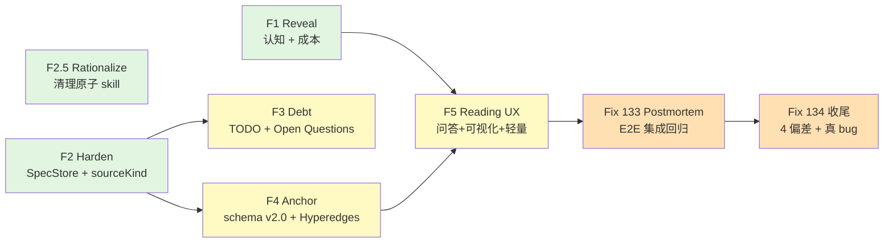

# Milestone M-101: Phase 2 — Reading Platform

> **从"分层文档生成器"演进为"可查询、可视化、可按场景伸缩的代码阅读平台"**

**版本**: 1.0
**创建日期**: 2026-04-26（事后补录，作为 Phase 2 单一事实源）
**状态**: ✅ Delivered
**前置 Milestone**: M-100 Spectra Evolution（reverse-spec → spectra rebrand + panoramic Phase 1）

---

## 触发与背景

Phase 2 的起点不是计划好的 milestone，而是一次**真实对比测试**：
对同一份测试项目（`_reference/graphify/worked/example/raw/`，5 Python 文件 + 2 Markdown），分别跑 Spectra、Graphify、LLM Agent，做 7 维度评分对比。Spectra 在结构化深度和覆盖面绝对领先，但在 4 个用户感知维度上**短板明显**：

| 用户感知差距 | 表现 | 触发的 Feature |
|-------------|------|---------------|
| **能力被输出形态隐藏** | Spectra 已实现 5 个 MCP 图查询工具 + GRAPH_REPORT.md，但用户/外部评审者都不知道，把"图查询""社区检测""核心节点识别"全归为 Graphify 独有 | F1 Reveal |
| **LLM 成本完全黑盒** | 5 文件项目跑 776 秒不知道花了多少 token，"零 token 对手"和"30k+ token Spectra"在用户感知里没差别 | F1 Reveal |
| **没有设计意图-代码的函数级锚定** | Graphify 能把 architecture.md 的 "Parsing Stage" 直接连到 `parse_file()`；Spectra 颗粒度只到文档级 | F4 Anchor |
| **没有自然语言问答 + 交互可视化 + 轻量模式** | Graphify 有 `query / explain / path` + `graph.html` 交互图；Spectra 只有静态 Mermaid + 重文档 | F5 Reading UX |

同时在过程中发现：
- Spectra 多次出现"内部状态模型不清晰"导致的 bug（Fix 126/127/128 修复链）→ 触发 F2 Harden 架构加固
- spec-driver 有遗留的 9 个原子 skill 和编排器双份维护 → 触发 F2.5 Rationalize
- 缺少"技术债 / Open Questions"系统视图 → 触发 F3 Debt Intelligence

---

## 愿景一句话

让 Spectra 的能力**对人和 AI 都可发现、可查询、可信、可负担**。

---

## Feature 总览（按 Wave 依赖图）

| Wave | # | Feature | 性质 | 状态 | 关键交付 |
|------|---|---------|------|------|---------|
| **Wave 1** | F1 | [127 reveal-cost-transparency](../127-reveal-cost-transparency/) | 表层能力暴露 | ✅ | README 首屏图摘要 + tokenUsage frontmatter + `--budget` / `--dry-run` |
| Wave 1 | F2 | [128 harden-spec-store](../128-harden-spec-store/) | 架构加固 | ✅ | SpecStore 抽象 + sourceKind 元数据 + dev 热重载 + direction-audit |
| Wave 1 | F2.5 | [129 fix-remove-atomic-skills](../129-fix-remove-atomic-skills/) | 清理遗留 | ✅ | 删除 9 个原子 skill + migration guide + 编排器单一入口 |
| **Wave 2** | F3 | [130 debt-intelligence](../130-debt-intelligence/) | 新能力 | ✅ | technical-debt.md + TODO 扫描 + design-doc Open Questions 提取 |
| Wave 2 | F4 | [131 anchor-hyperedges-schema](../131-anchor-hyperedges-schema/) | 新能力 | ✅ | graph.json schema v2.0 + chunked embedding 锚定 + Hyperedges 提取 |
| **Wave 3** | F5 | [132 reading-ux](../132-reading-ux/) | UX 集大成 | ✅ | `--mode=reading` / 自然语言问答（RAG） / `graph.html` D3 交互可视化 |
| **Postmortem** | Fix 133 | [133 fix-postmortem-phase2](../133-fix-postmortem-phase2/) | E2E 集成回归修复 | ✅ | tokenUsage 提取 + reading 模式跳过 + 默认 model 升级 + hyperedge 接通 + sourceKind 显式写入 |
| **Postmortem** | Fix 134 | [134 phase2-postmortem-cleanup](../134-phase2-postmortem-cleanup/)（按编号示意，实际 specs 目录见 commits）| 收尾清理 + 真 bug 修复 | ✅ | spec-driver.config.yaml 对齐 + cache token 累加 + reading 模式 sonnet override + CLI `--hyperedges` flag + sonnetModelId fallback bug |

> **附带产出**（与 Phase 2 同期，但属 spec-driver 自身平台化）：
> [Feature 133 orchestration-overrides](../133-orchestration-overrides/) — 分层 orchestration（plugin base + 项目级 overrides），见 [migration guide](../../docs/migrations/orchestration-overrides.md)。

---

## Wave 依赖图



🟢 **Wave 1**（F1 / F2 / F2.5 完全独立可三路并行）— 短期 6 周
🟡 **Wave 2**（F3 / F4，依赖 F2）— 中期 4 周
🟠 **Wave 3**（F5，依赖 F1 + F4）— 中期 3-4 周
🔴 **Postmortem**（集成测试触发，先 Fix 133，后 Fix 134 收尾）— 短期 2 周

---

## 关键架构产出（src/ 新增模块）

| 模块 | 行数 | 文件数 | 用途 |
|------|------|--------|------|
| `src/spec-store/` | 317 | 3 | F2 — Spec 查询统一入口（取代各消费方手动合并）|
| `src/debt-scanner/` | 1,584 | 14 | F3 — 注释 TODO 扫描 + design-doc Open Questions 提取 |
| `src/panoramic/anchoring/` | 1,382 | 8 | F4 — Markdown chunking + embedding + 函数级锚定边 |
| `src/panoramic/hyperedges/` | 456 | 5 | F4 — LLM hyperedge 提取（3+ 节点共同参与模式）|
| `src/panoramic/qa/` | 1,434 | 8 | F5 — RAG 自然语言问答 |
| `src/panoramic/exporters/` | 1,722 | 5 | F5 — graph.html D3 交互可视化 + 其他导出器 |
| **合计** | **6,895** | **43** | — |

**测试增长**：2154 → 2196（+42 在 Fix 133+134；早期 Phase 2 主体已 +500+），合计 Phase 2 引入约 **570 个新测试**。

---

## 数据契约新增（Frontmatter / Schema）

| 字段 / Schema | 引入 Feature | 说明 |
|--------------|------------|------|
| `tokenUsage: { input, output }` | F1 | 每次 LLM 生成的 token 消耗 |
| `durationMs` | F1 | 该次生成的毫秒级耗时 |
| `llmModel` | F1 | 使用的 LLM model id |
| `fallbackReason` | F1 | AST-only 降级时的原因 |
| `sourceKind: canonical / derived / bundle_copy` | F2 | Spec 身份（canonical 默认，derived/bundle_copy 不参与图构建）|
| `derivedFrom` | F2 | 派生源 spec 的路径 |
| `graph.json schemaVersion: 2.0` | F4 | 边类型新增 `references` / `conceptually_related_to` / `rationale_for`，新增 `hyperedges` 顶层数组 |

---

## 关键 CLI / MCP 增强

```bash
# F1: 成本控制
spectra batch --dry-run [path]                # 预估 token，不调 LLM
spectra batch --budget 5000 [path]            # 超预算交互/非交互 gate
spectra batch --budget 5000 --on-over-budget cancel|continue|skip-enrichment|cheaper-model

# F5: 模式切换
spectra batch --mode reading [path]           # 跳过产品文档层 + 强制 sonnet
spectra batch --mode code-only [path]         # AST-only，零 LLM
spectra batch --html [path]                   # 输出 graph.html 交互可视化

# Fix 134: 显式 opt-in hyperedge
spectra batch --hyperedges --mode full [path] # 启用 hyperedge LLM 提取（默认 false）
```

```text
MCP 工具（F4 + F5 新增 / 升级）：
graph_query / graph_node / graph_path / graph_community / graph_god_nodes  (F1+F2 已有)
graph_hyperedges                                                            (F4 新增，按 label / node 过滤)
panoramic-query operation: 'natural-language'                                (F5 新增 RAG 问答)
```

---

## 默认 Model 策略变更（**Breaking**）

| 时段 | balanced 预设 | sonnet 逻辑名 | opus 逻辑名 |
|------|--------------|--------------|-------------|
| Phase 2 之前 | → opus | `claude-sonnet-4-5-20250929` | `claude-opus-4-1-20250805` |
| **Phase 2 后（Fix 133+134）** | **→ sonnet** | **`claude-sonnet-4-6`** | **`claude-opus-4-7`**（含 1M context beta header）|

**影响**：默认 batch 跑 Sonnet 4.6 而非 Opus，**单次成本下降 ~5x**，质量对代码阅读场景已经够。需要顶级质量的用户可显式 `--preset quality-first`（仍走 opus）。

---

## 已知遗留事项（不阻塞 Phase 2 ship）

1. **graphify 21 模块完整 reading 全量 perf 基线**：Fix 134 verification 推荐"在 master 合入后择机用 graphify 跑全量做长期 perf 基线"。属独立工作。
2. **`tests/unit/cli-proxy.test.ts:26` 的 `as any`**：pre-existing 代码（commit 6dbde13），建议作为后续单独 chore 整改。
3. **F6 Integrate (Spectra × Graphify 深度集成)**：原 Milestone 列为 Vision 级，Phase 2 未实施，留待 Phase 3 评估或归档。

详细复盘见：[postmortem.md](postmortem.md)

---

## 关键技术决策（ADR 摘要）

| ADR | 决策 | 备选方案 | 选定理由 |
|-----|------|---------|---------|
| AD-101-1 | F4 embedding 用本地 `@xenova/transformers`（all-MiniLM-L6-v2）| OpenAI / Voyage AI / Anthropic | 零 token + 零外部依赖 + 质量够代码场景；fallback 到 API 路径预留 |
| AD-101-2 | F5 自然语言问答用 RAG（embedding 检索 + LLM 组装）| 纯 LLM 全 context / Graph-first | RAG 平衡了质量和成本；token 可控；引用溯源天然支持 |
| AD-101-3 | F5 graph.html 用 D3-force（已内联）| vis-network / cytoscape.js / 手写 SVG | 项目已有 d3-force 依赖，零新增；self-contained 易分发 |
| AD-101-4 | Fix 134 引入 `getCanonicalSonnetModelId()` helper | 修 yaml + cwd lookup 边界 | helper 直接从代码常量取值，**不依赖 yaml**，根治跨项目 cwd fallback 问题 |
| AD-101-5 | F2 SpecStore 一次性重构 5 个消费方 | 渐进迁移 | 渐进迁移会出现"中间状态"bug；一次性重构 + 单测覆盖更稳 |

---

## 演进里程碑外的下一步

Phase 2 已闭环。Phase 3 候选方向见：[../_meta/phase3-proposal.md](../_meta/phase3-proposal.md)
