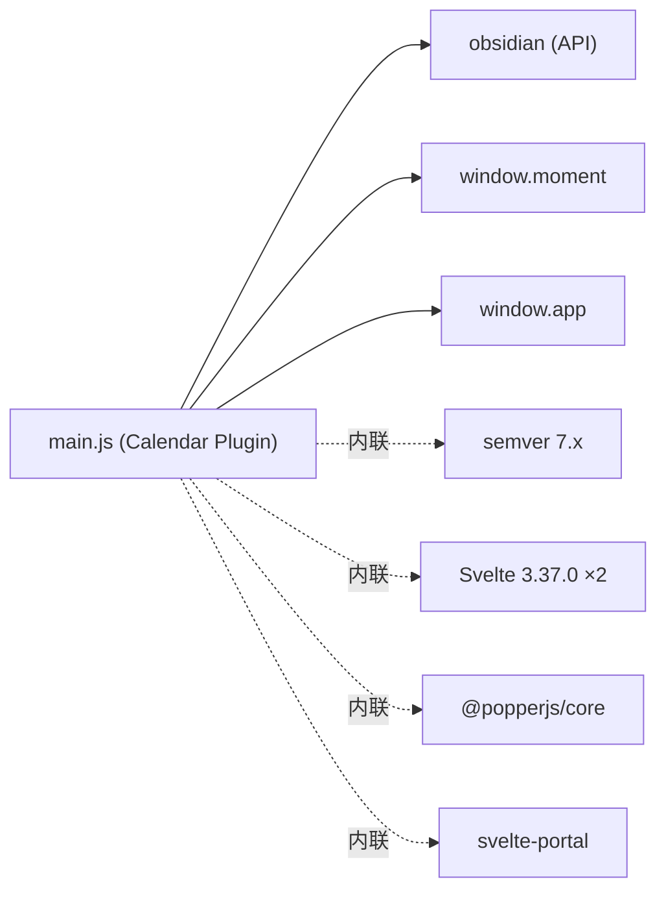

<a id="module-spec"></a>

# ../../../_reference/claude-obsidian/.obsidian/plugins


## 1. 意图

1. **为 Obsidian 提供日历视图插件**：在 Obsidian 右侧面板注册一个交互式日历视图（`VIEW_TYPE_CALENDAR = "calendar"`），允许用户按日/周/月粒度浏览和创建 Periodic Notes
2. **统一管理多种元数据来源**：通过可扩展的 Source 系统（word count、tasks、links、backlinks、zettels、emoji tags），在日历上和悬浮菜单中展示笔记指标
3. **与 Daily Notes / Periodic Notes 插件深度集成**：读取 `daily-notes`、`periodic-notes`、`calendar` 插件的设置，保持笔记创建行为一致
4. **提供国际化与本地化支持**：支持 Moment.js locale 覆盖、自定义周起始日、系统语言自动检测
5. **提供完整的设置面板**：通过 Svelte 组件构建的 SettingsTab 管理确认弹窗、周数显示、数据源配置、国际化偏好

该模块是一个完整的 Obsidian 社区插件包（bundled output），使用 Rollup 将 TypeScript + Svelte 源码编译为单个 CommonJS 文件，包含内联的 Svelte 运行时、Popper.js 定位库和 semver 版本比较库。

## 2. 接口定义

| 名称 | 类型 | 签名 | 说明 |
|------|------|------|------|
| `CalendarPlugin` | class (默认导出) | `class CalendarPlugin extends obsidian.Plugin` | 插件入口，`module.exports` 导出 |
| `CalendarPlugin.onload` | method | `async onload(): Promise<void>` | 注册视图、命令、设置 tab、加载配置 |
| `CalendarPlugin.onunload` | method | `onunload(): void` | 分离所有日历类型 leaf |
| `CalendarPlugin.initLeaf` | method | `initLeaf(): void` | 首次打开时在右侧创建日历视图 |
| `CalendarPlugin.loadSettings` | method | `async loadSettings(): Promise<void>` | 从磁盘加载设置并应用迁移 |
| `CalendarPlugin.writeSettingsToDisk` | method | `async writeSettingsToDisk(settingsUpdater: (old) => Partial<Settings>): Promise<void>` | 更新设置并触发元数据更新事件 |
| `CalendarPlugin.toggleWeekNumbers` | method | `toggleWeekNumbers(): void` | 切换周数列显示 |
| `CalendarView` | class | `class CalendarView extends obsidian.ItemView` | 日历视图，管理 Svelte Calendar 组件生命周期 |
| `CalendarView.revealActiveNote` | method | `revealActiveNote(): void` | 跳转日历到当前活跃笔记对应的月份 |
| `CalendarSettingsTab` | class | `class CalendarSettingsTab extends obsidian.PluginSettingTab` | 设置面板，挂载 Svelte SettingsTab 组件 |
| `settings` | store | `Writable<Settings> & { getSourceSettings }` | 全局 Svelte writable store |
| `activeFile` | store | `Writable<string|null> & { setFile }` | 当前选中文件的 dateUID |
| `sources` | store | `Writable<Source[]> & { registerSource }` | 已注册数据源列表 |
| `configureGlobalMomentLocale` | function | `(localeOverride?: string, weekStart?: string) => string` | 配置全局 Moment.js locale |
| `overrideGlobalMomentWeekStart` | function | `(weekStart: string) => void` | 覆盖 Moment.js 周起始日 |
| `applyMigrations` | function | `(settings: Settings) => Settings` | 对旧版设置应用迁移 |
| `createDailyNote` | function | `async (date: Moment) => Promise<TFile>` | 创建日记 |
| `createWeeklyNote` | function | `async (date: Moment) => Promise<TFile>` | 创建周记 |
| `createMonthlyNote` | function | `async (date: Moment) => Promise<TFile>` | 创建月记 |
| `createPeriodicNote` | function | `(granularity: string, date: Moment) => Promise<TFile>` | 按粒度分派创建笔记 |
| `getDateFromFile` / `getDateFromFilename` | function | `(file: TFile, granularity: string) => Moment|null` | 从文件名解析日期 |
| `getDateUID` | function | `(date: Moment, granularity?: string) => string` | 生成日期唯一标识 |
| `tryToCreatePeriodicNote` | function | `async (granularity, date, inNewSplit, settings, cb) => void` | 创建周期性笔记（含确认弹窗） |
| `showFileMenu` | function | `(app, file, position) => void` | 显示右键菜单 |
| `getWordCount` | function | `(text: string) => number` | Unicode 感知的单词计数 |


## 3. 业务逻辑

> 此章节待补充。可通过 `reverse-spec generate --deep` 提供更多上下文以改善生成质量。

## 4. 数据结构

```typescript
// 插件设置
interface Settings {
  shouldConfirmBeforeCreate: boolean;  // 创建笔记前是否确认
  localeOverride: string;              // "system-default" 或 locale code
  weekStart: string;                   // "locale" 或星期名称
  showWeeklyNote: boolean;             // 是否显示周数列
  sourceSettings: Record<string, SourceSettings>;  // 各数据源配置
  version?: string;                    // 设置版本号，用于迁移
}

// 数据源
interface Source {
  id: string;
  name: string;
  description?: string;
  getMetadata: (granularity: string, date: Moment, file: TFile | null) => Promise<Metadata>;
  defaultSettings: SourceSettings;
  registerSettings?: (containerEl: HTMLElement, settings: any, saveSettings: Function) => void;
}

// 元数据返回值
interface Metadata {
  dots: Dot[];
  value?: number;
  goal?: number;
  attrs?: Record<string, string>;  // [推断: 仅 emoji-tags source 使用]
}

// 圆点指示器
interface Dot {
  isFilled: boolean;
  color?: string;  // [推断: 通过 sourceSettings.color 注入]
}

// Periodic Note 设置
interface PeriodicNoteSettings {
  format: string;   // Moment.js 日期格式
  folder: string;   // 目标文件夹
  template: string;  // 模板路径
}
```

## 5. 约束条件

| 约束 | 值 | 说明 |
|------|-----|------|
| 插件版本 | `"1.5.3"` | 硬编码在 `applyMigrations` 中 |
| 心跳间隔 | `60,000 ms` (1 分钟) | Calendar 组件每分钟刷新 `today` |
| semver 最大长度 | `256` 字符 | semver 解析的版本字符串上限 |
| semver 最大安全整数 | `9007199254740991` | 版本号各段上限 |
| semver 最大安全分段长度 | `16` 位 | coerce 正则的数字段最大长度 |
| 默认日记格式 | `"YYYY-MM-DD"` | `DEFAULT_DAILY_NOTE_FORMAT` |
| 默认周记格式 | `"gggg-[W]ww"` | `DEFAULT_WEEKLY_NOTE_FORMAT` |
| 默认月记格式 | `"YYYY-MM"` | `DEFAULT_MONTHLY_NOTE_FORMAT` |
| 任务最大未完成点数 | `1` (可配, 上限 5) | `tasksSource.defaultSettings.maxIncompleteTaskDots` |
| 每点代表字数 | `250` (可配) | `wordCountSource.defaultSettings.wordsPerDot` |
| Backlinks 默认颜色 | `"#5e81ac"` | Nord palette 蓝色 |
| Tasks 默认颜色 | `"#d08770"` | Nord palette 橙色 |
| Links 默认颜色 | `"#a3be8c"` | Nord palette 绿色 |
| Words 默认颜色 | `"#ebcb8b"` | Nord palette 黄色 |
| Zettels 默认颜色 | `"#b48ead"` | Nord palette 紫色 |

## 6. 边界条件

- **文件不存在时点击日期**: 根据 `shouldConfirmBeforeCreate` 决定是否弹窗确认，否则直接创建；创建失败（如目录问题）会 `console.error` 并显示 `Notice`
- **模板文件不存在**: `getTemplateInfo` 捕获异常，返回空内容 `["", null]`，并弹出 `Notice` 提示用户
- **日期格式歧义**: `isFormatAmbiguous` 检测周数+月份同时出现的格式，对 `week` 粒度自动剥离月/日格式以正确解析
- **无效日期文件名**: `getDateFromFilename` 使用 `moment(filename, format, true)`（strict mode），无效时返回 `null`
- **笔记为 null**: 所有数据源的 `getMetadata` 均先检查 `file` 是否存在，不存在则返回 0 值或空数组
- **Periodic Notes 插件未安装**: `shouldUsePeriodicNotesSettings` 通过 `window.app.plugins.getPlugin("periodic-notes")` 检查，未安装时 fallback 到内置 daily-notes 设置
- **右键点击无文件的日期**: `onContextMenu` 直接 return，不显示菜单
- **Hover 非 Meta 键**: `onHover` 在非 Meta 键按下时直接 return，不触发链接悬浮预览
- **月份自动跳转**: 心跳检测若当前月份与 today 一致，midnight 后自动更新 `displayedMonth`
- **已存在日历 Leaf**: `initLeaf` 先检查是否已有 `VIEW_TYPE_CALENDAR` 的 leaf，防止重复创建
- **locale fallback**: 若系统语言比 Obsidian 语言更精确（如 `en-gb` vs `en`），优先使用系统语言

## 7. 技术债务

| 项目 | 严重程度 | 描述 |
|------|----------|------|
| 双份 Svelte 运行时 | 中 | bundle 中包含两套 Svelte 3.37.0 运行时（带 `$1` 后缀的副本），增加约 5000 行冗余代码 |
| 双份 periodic-notes 桥接 | 中 | `getDailyNoteSettings` / `getDateFromFile` 等函数各存在两份（带/不带 `$1` 后缀），可能是不同包独立 inline 的结果 |
| semver 完整内联 | 低 | 完整内联了 semver 库（~500 行），但 `migrations` 数组为空，实际上当前版本无需版本迁移 |
| Popper.js 完整内联 | 中 | 内联了完整的 `@popperjs/core`（~2500 行），仅用于日期悬浮弹窗定位 |
| 已废弃 API 使用 | 中 | `workspace.splitActiveLeaf()` 和 `workspace.getUnpinnedLeaf()` 在较新 Obsidian API 中已废弃 |
| TODO 注释 | 低 | 代码中存在多处 TODO：如 `move this into a writable`（L9022）、`figure out if we still want to support shorthand events`、`null out other refs` 等 |
| 任务正则匹配 | 低 | `getNumberOfTasks` 使用简单正则 `/(-|\*) \[ \] /` 匹配任务，不支持编号列表和嵌套任务 |
| 无 TypeScript 源码映射 | 低 | 作为编译产物缺少 source map，调试困难 |
| `process.env.NODE_ENV` 引用 | 低 | Popper.js 中多处检查 `process.env.NODE_ENV !== "production"` 用于开发警告，在 Obsidian 环境中 `process.env` 可能未定义 |

## 8. 测试覆盖

| 测试类别 | 用例 | 优先级 |
|----------|------|--------|
| 单元测试 | `getDateFromFilename` 各粒度的正确解析 | 高 |
| 单元测试 | `getDateFromFilename` 无效文件名返回 null | 高 |
| 单元测试 | `isFormatAmbiguous` 周+月格式检测 | 高 |
| 单元测试 | `getWordCount` Unicode 文本（CJK、emoji）计数 | 中 |
| 单元测试 | `getNumberOfTasks` 正则匹配（含边界情况：空文件、无任务、混合缩进） | 中 |
| 单元测试 | `applyMigrations` 版本区间判断逻辑 | 中 |
| 单元测试 | `configureGlobalMomentLocale` locale 优先级逻辑 | 中 |
| 单元测试 | `overrideGlobalMomentWeekStart` "locale" 回退 vs 具体日名 | 中 |
| 单元测试 | `getEmojiTag` 从 tags 中提取 emoji | 低 |
| 集成测试 | `createDailyNote` 模板变量替换（`{{date}}`, `{{time}}`, `{{title}}`, `{{yesterday}}`, `{{tomorrow}}`, `{{date+1d:HH:mm}}`） | 高 |
| 集成测试 | `tryToCreatePeriodicNote` 确认弹窗流程 | 中 |
| 集成测试 | `CalendarView` 生命周期（onOpen/onClose/revealActiveNote） | 中 |
| E2E 测试 | 点击日历日期创建并打开日记 | 高 |
| E2E 测试 | 设置变更后 locale/weekStart 即时生效 | 中 |

## 9. 依赖关系

| 依赖 | 类型 | 用途 |
|------|------|------|
| `obsidian` | CommonJS require | Obsidian API（Plugin, ItemView, PluginSettingTab, Modal, Menu, Setting, FileView, Notice, parseFrontMatterTags, normalizePath） |
| `@popperjs/core` | 内联 | 弹窗定位（detectOverflow, createPopper 等） |
| `semver` | 内联 | 版本比较，用于设置迁移 |
| Svelte 3.37.0 | 内联 (两份) | 响应式 UI 组件运行时 |
| `svelte-portal` | 内联 | DOM Portal 组件，将弹窗渲染到 body |
| `window.moment` | 全局 | 日期解析、格式化、locale 管理（由 Obsidian 提供） |
| `window.app` | 全局 | Obsidian 应用实例（vault, workspace, metadataCache, plugins） |



---

## 附录：文件清单

| 文件 | 行数 | 主要用途 |
|------|------|----------|
| `../../../_reference/claude-obsidian/.obsidian/plugins/calendar/main.js` | 15647 | 内部模块 |
| `../../../_reference/claude-obsidian/.obsidian/plugins/obsidian-banners/main.js` | 30 | 内部模块 |
| `../../../_reference/claude-obsidian/.obsidian/plugins/thino/main.js` | 372 | 内部模块 |


<!-- baseline-skeleton: {"filePath":"../../../_reference/claude-obsidian/.obsidian/plugins/calendar/main.js","language":"javascript","loc":16049,"exports":[],"imports":[],"hash":"2f3f4546c8a71d80918d7d73b6898cccd215b2d550328f56581ba2894afee2a1","analyzedAt":"2026-04-11T06:44:26.947Z","parserUsed":"ts-morph"} -->
