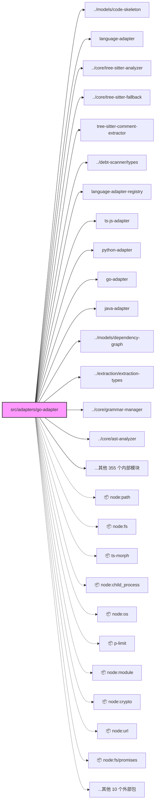

<a id="module-spec"></a>

# src


## 1. 意图


## 2. 业务逻辑


## 3. 接口定义

### module-spec.ts

| 名称 | 类型 | 签名 | 成员数 |
|------|------|------|--------|
| `LanguageDistributionSchema` | const | `const LanguageDistributionSchema` | - |
| `LanguageDistribution` | type | `export type LanguageDistribution` | - |
| `TokenUsageSchema` | const | `const TokenUsageSchema` | - |
| `TokenUsage` | type | `export type TokenUsage` | - |
| `CostBreakdownSchema` | const | `const CostBreakdownSchema` | - |
| `CostBreakdown` | type | `export type CostBreakdown` | - |
| `CostMetadataSchema` | const | `const CostMetadataSchema` | - |
| `CostMetadata` | type | `export type CostMetadata` | - |
| `SpecFrontmatterSchema` | const | `const SpecFrontmatterSchema` | - |
| `SpecFrontmatter` | type | `export type SpecFrontmatter` | - |
| `SpecSectionsSchema` | const | `const SpecSectionsSchema` | - |
| `SpecSections` | type | `export type SpecSections` | - |

*另 33 个导出省略（完整骨架见 `spectra prepare`）*

### component-view-model.ts

| 名称 | 类型 | 签名 | 成员数 |
|------|------|------|--------|
| `summarizeComponentView` | function | `function summarizeComponentView(model: Pick<ComponentViewModel, 'components' \| 'relationships'>): ComponentViewStats` | - |
| `summarizeDynamicScenarios` | function | `function summarizeDynamicScenarios(model: Pick<DynamicScenarioModel, 'scenarios'>): DynamicScenarioStats` | - |
| `compareConfidence` | function | `function compareConfidence(left: ComponentConfidence, right: ComponentConfidence): number` | - |
| `maxConfidence` | function | `function maxConfidence(...values: ComponentConfidence[]): ComponentConfidence` | - |
| `minConfidence` | function | `function minConfidence(...values: ComponentConfidence[]): ComponentConfidence` | - |
| `dedupeComponentEvidence` | function | `function dedupeComponentEvidence(evidenceList: ComponentEvidenceRef[]): ComponentEvidenceRef[]` | - |
| `ComponentConfidence` | type | `export type ComponentConfidence` | - |
| `ComponentEvidenceSourceType` | type | `export type ComponentEvidenceSourceType` | - |
| `ComponentCategory` | type | `export type ComponentCategory` | - |
| `ComponentMethodKind` | type | `export type ComponentMethodKind` | - |
| `ComponentRelationshipKind` | type | `export type ComponentRelationshipKind` | - |
| `DynamicScenarioCategory` | type | `export type DynamicScenarioCategory` | - |

*另 13 个导出省略（完整骨架见 `spectra prepare`）*

### utils.ts

| 名称 | 类型 | 签名 | 成员数 |
|------|------|------|--------|
| `toPosixPath` | function | `function toPosixPath(filePath: string): string` | - |
| `uniqueStrings` | function | `function uniqueStrings(items: Iterable<string>): string[]` | - |
| `getRelativePath` | function | `function getRelativePath(projectRoot: string, filePath: string): string` | - |
| `collectProjectFiles` | function | `function collectProjectFiles(projectRoot: string, options: FileCollectionOptions): string[]` | - |
| `detectProjectName` | function | `function detectProjectName(projectRoot: string): string` | - |
| `joinUrlPaths` | function | `function joinUrlPaths(...segments: string[]): string` | - |
| `splitTopLevel` | function | `function splitTopLevel(text: string, separator = ','): string[]` | - |
| `extractBalancedContent` | function | `function extractBalancedContent(text: string, openParenIndex: number): { content: string; endIndex: number } \| null` | - |
| `stripWrappingQuotes` | function | `function stripWrappingQuotes(text: string): string \| null` | - |
| `getNamedArgumentValue` | function | `function getNamedArgumentValue(argsText: string, key: string): string \| undefined` | - |
| `getPositionalArguments` | function | `function getPositionalArguments(argsText: string): string[]` | - |
| `extractStringArray` | function | `function extractStringArray(text: string \| undefined): string[]` | - |

*另 12 个导出省略（完整骨架见 `spectra prepare`）*

### cluster-orchestrator.ts

| 名称 | 类型 | 签名 | 成员数 |
|------|------|------|--------|
| `clusterDispatch` | function | `async function clusterDispatch<TInput, TMapOutput, TReduceOutput>(options: ClusterDispatchOptions<TInput, TMapOutput, TReduceOutput>): Promise<ClusterDispatchResult<TReduceOutput>>` | - |
| `DEFAULT_MAX_CONCURRENCY` | const | `const DEFAULT_MAX_CONCURRENCY` | - |
| `DEFAULT_PER_CALL_TIMEOUT_MS` | const | `const DEFAULT_PER_CALL_TIMEOUT_MS` | - |
| `DEFAULT_REDUCE_TIMEOUT_MS` | const | `const DEFAULT_REDUCE_TIMEOUT_MS` | - |
| `DEFAULT_COMMUNITY_MIN_SIZE` | const | `const DEFAULT_COMMUNITY_MIN_SIZE` | - |
| `DEFAULT_COMMUNITY_MAX_SIZE` | const | `const DEFAULT_COMMUNITY_MAX_SIZE` | - |
| `DEFAULT_TOKEN_BUDGET` | const | `const DEFAULT_TOKEN_BUDGET` | - |
| `DEFAULT_SHARED_HEADER_BUDGET` | const | `const DEFAULT_SHARED_HEADER_BUDGET` | - |
| `callTelemetrySchema` | const | `const callTelemetrySchema` | - |
| `CallTelemetry` | type | `export type CallTelemetry` | - |
| `ClusterStrategyCommunity` | interface | `interface ClusterStrategyCommunity<TInput>` | 6 |
| `ClusterStrategyDirectory` | interface | `interface ClusterStrategyDirectory<TInput>` | 2 |

*另 10 个导出省略（完整骨架见 `spectra prepare`）*

**ClusterStrategyCommunity 成员**

| 成员 | 类型 | 签名 | 可见性 |
|------|------|------|--------|
| `kind` | property | `kind: 'community'` | public |
| `minSize` | property | `minSize: number` | public |
| `maxSize` | property | `maxSize: number` | public |
| `graph` | property | `graph: GraphJSON` | public |
| `getInputId` | property | `getInputId: (input: TInput) => string` | public |
| `directoryFallback` | property | `directoryFallback: {
    getInputPath: (input: TInput) => string;
  }` | public |

**ClusterStrategyDirectory 成员**

| 成员 | 类型 | 签名 | 可见性 |
|------|------|------|--------|
| `kind` | property | `kind: 'directory'` | public |
| `getInputPath` | property | `getInputPath: (input: TInput) => string` | public |

### code-skeleton.ts

| 名称 | 类型 | 签名 | 成员数 |
|------|------|------|--------|
| `ExportKindSchema` | const | `const ExportKindSchema` | - |
| `ExportKind` | type | `export type ExportKind` | - |
| `MemberKindSchema` | const | `const MemberKindSchema` | - |
| `MemberKind` | type | `export type MemberKind` | - |
| `VisibilitySchema` | const | `const VisibilitySchema` | - |
| `Visibility` | type | `export type Visibility` | - |
| `ParserUsedSchema` | const | `const ParserUsedSchema` | - |
| `ParserUsed` | type | `export type ParserUsed` | - |
| `LanguageSchema` | const | `const LanguageSchema` | - |
| `Language` | type | `export type Language` | - |
| `MemberInfoSchema` | const | `const MemberInfoSchema` | - |
| `MemberInfo` | type | `export type MemberInfo` | - |

*另 10 个导出省略（完整骨架见 `spectra prepare`）*

### doc-graph-builder.ts

| 名称 | 类型 | 签名 | 成员数 |
|------|------|------|--------|
| `scanExistingSpecDocuments` | function | `function scanExistingSpecDocuments(specsDir: string, projectRoot: string): ExistingSpecDocument[]` | - |
| `scanStoredModuleSpecs` | function | `function scanStoredModuleSpecs(specsDir: string, projectRoot: string): StoredModuleSpecSummary[]` | - |
| `buildDocGraph` | function | `function buildDocGraph(options: BuildDocGraphOptions): DocGraph` | - |
| `resolveSpecForSource` | function | `function resolveSpecForSource(sourcePath: string, specs: DocGraphSpecNode[]): DocGraphSpecNode \| undefined` | - |
| `runAnchorIntegration` | function | `async function runAnchorIntegration(projectRoot: string, anchorOptions: AnchorIntegrationOptions): Promise<AnchorIntegrationResult>` | - |
| `runHyperedgeIntegration` | function | `async function runHyperedgeIntegration(options: HyperedgeIntegrationOptions): Promise<HyperedgeIntegrationResult>` | - |
| `MODULE_SPEC_ANCHOR_ID` | const | `const MODULE_SPEC_ANCHOR_ID` | - |
| `CROSS_REFERENCE_MARKER_PREFIX` | const | `const CROSS_REFERENCE_MARKER_PREFIX` | - |
| `ExistingSpecDocument` | interface | `interface ExistingSpecDocument` | 5 |
| `StoredModuleSpecSummary` | interface | `interface StoredModuleSpecSummary extends ExistingSpecDocument` | 9 |
| `DocGraphSpecNode` | interface | `interface DocGraphSpecNode` | 6 |
| `DocGraphSourceToSpec` | interface | `interface DocGraphSourceToSpec` | 4 |

*另 10 个导出省略（完整骨架见 `spectra prepare`）*

**ExistingSpecDocument 成员**

| 成员 | 类型 | 签名 | 可见性 |
|------|------|------|--------|
| `specPath` | property | `specPath: string` | public |
| `sourceTarget` | property | `sourceTarget: string` | public |
| `relatedFiles` | property | `relatedFiles: string[]` | public |
| `linked` | property | `linked: boolean` | public |
| `confidence` | property | `confidence: 'high' \| 'medium' \| 'low'` | public |

**StoredModuleSpecSummary 成员**

| 成员 | 类型 | 签名 | 可见性 |
|------|------|------|--------|
| `version` | property | `version: string` | public |
| `skeletonHash` | property | `skeletonHash: string` | public |
| `language` | property | `language: string` | public |
| `crossLanguageRefs` | property | `crossLanguageRefs: string[]` | public |
| `intentSummary` | property | `intentSummary: string` | public |
| `outputPath` | property | `outputPath: string` | public |
| `sourceKind` | property | `sourceKind: 'canonical' \| 'derived' \| 'bundle_copy'` | public |
| `derivedFrom` | property | `derivedFrom: string \| null` | public |
| `generatedByMode` | property | `generatedByMode: 'full' \| 'reading' \| 'code-only'` | public |

**DocGraphSpecNode 成员**

| 成员 | 类型 | 签名 | 可见性 |
|------|------|------|--------|
| `specPath` | property | `specPath: string` | public |
| `sourceTarget` | property | `sourceTarget: string` | public |
| `relatedFiles` | property | `relatedFiles: string[]` | public |
| `linked` | property | `linked: boolean` | public |
| `confidence` | property | `confidence: 'high' \| 'medium' \| 'low'` | public |
| `currentRun` | property | `currentRun: boolean` | public |

**DocGraphSourceToSpec 成员**

| 成员 | 类型 | 签名 | 可见性 |
|------|------|------|--------|
| `sourcePath` | property | `sourcePath: string` | public |
| `specPath` | property | `specPath: string` | public |
| `sourceTarget` | property | `sourceTarget: string` | public |
| `matchType` | property | `matchType: 'source-target' \| 'related-file'` | public |

### 其他 228 个文件（共 1007 导出）

*完整骨架见 `spectra prepare`。*

| 文件 | 导出数 | 主要符号 |
|------|--------|----------|
| docs-quality-model.ts | 22 | `normalizeConfidence`, `summarizeProvenanceRecord`, `summarizeDocsQualityStats` (+19) |
| types.ts | 22 | `ApiSource`, `ApiParameterLocation`, `ApiParameter` (+19) |
| runtime-topology-model.ts | 21 | `buildSyntheticImageName`, `normalizeCommandValue`, `mergeEnvironmentVariables` (+18) |
| types.ts | 21 | `inferType`, `stripQuotes`, `SkillMdSectionSchema` (+18) |
| data-model-generator.ts | 20 | `parsePydanticFieldCall`, `extractPythonFieldsFromLines`, `extractTypeScriptModelsFromSkeleton` (+17) |
| pattern-hints-model.ts | 17 | `createPatternEvidenceRef`, `determinePatternMatchLevel`, `summarizePatternHints` (+14) |
| architecture-ir-model.ts | 16 | `summarizeArchitectureIR`, `getArchitectureIRView`, `ArchitectureIRSourceTag` (+13) |
| architecture-overview-model.ts | 16 | `createArchitectureEvidence`, `inferModuleResponsibility`, `summarizeArchitectureOverview` (+13) |
| docs-bundle-types.ts | 16 | `DOCS_BUNDLE_VERSION`, `DOCS_BUNDLE_MANIFEST_FILE`, `DOCS_BUNDLE_ROOT_DIR` (+13) |
| interfaces.ts | 16 | `OutputFormatSchema`, `OutputFormat`, `GenerateOptionsSchema` (+13) |
| unified-graph.ts | 16 | `defaultDirectionalForRelation`, `ConfidenceTierSchema`, `ConfidenceTier` (+13) |
| llm-client.ts | 15 | `getTimeoutForModel`, `getTimeoutForSpecGeneration`, `callLLM` (+12) |
| budget-gate.ts | 14 | `estimateModuleCost`, `buildDryRunReport`, `renderDryRunReport` (+11) |
| product-ux-docs.ts | 14 | `generateProductUxDocs`, `ProductFactSourceType`, `ProductEvidenceRef` (+11) |
| query-helpers.ts | 14 | `resolveEdgeConfidence`, `canonicalizeSymbolId`, `findFuzzyMatches` (+11) |
| coverage-auditor.ts | 13 | `CoverageIssue`, `ModuleCoverageStatus`, `CoverageTargetUnit` (+10) |
| endpoint-utils.ts | 13 | `unwrapPromiseType`, `normalizeTypeText`, `methodSortKey` (+10) |
| drift-item.ts | 12 | `SeveritySchema`, `Severity`, `DriftCategorySchema` (+9) |
| workspace-index-generator.ts | 12 | `extractWorkspaceData`, `WorkspacePackageInfo`, `WorkspaceInput` (+9) |
| architecture-narrative-mapreduce.ts | 11 | `validateDomainWords`, `enrichNarrativeWithLLM`, `MapOutputSchema` (+8) |
| architecture-narrative.ts | 11 | `buildArchitectureNarrative`, `renderArchitectureNarrative`, `loadStoredNarrativeModules` (+8) |
| dependency-graph.ts | 10 | `ImportTypeSchema`, `ImportType`, `GraphNodeSchema` (+7) |
| model-selection.ts | 10 | `getCanonicalSonnetModelId`, `resolveReverseSpecRuntime`, `resolveReverseSpecModel` (+7) |
| skill-installer.ts | 10 | `installSkills`, `removeSkills`, `resolveTargetDir` (+7) |
| adr-mapreduce.ts | 9 | `runAdrMapReduce`, `ADRCandidateSchema`, `ADRCandidate` (+6) |
| extraction-types.ts | 9 | `ArtifactKind`, `ExtractedNodeKind`, `ExtractedNodeSchema` (+6) |
| runtime-topology-generator.ts | 9 | `RuntimeTopologyInput`, `RuntimeTopologyOutput`, `RuntimeTopologyGenerator` (+6) |
| stored-module-specs.ts | 9 | `loadStoredModuleSpecs`, `parseStoredModuleSpec`, `extractStoredSpecFrontmatter` (+6) |
| types.ts | 9 | `CommentRegion`, `DebtKind`, `DebtSeverity` (+6) |
| adr-decision-pipeline.ts | 8 | `generateBatchAdrDocs`, `AdrSourceType`, `AdrEvidenceRef` (+5) |

*另 198 个文件未在汇总表中列出（完整骨架见 `spectra prepare`）*

### 模块类图

```mermaid
classDiagram
  class GoLanguageAdapter {
    +id
    +languages: readonly Language
    +extensions: ReadonlySetstring
    +defaultIgnoreDirs: ReadonlySetstring
    +analyzeFilefilePath: string, options?: AnalyzeFileOptions: PromiseCodeSkeleton
    +analyzeFallbackfilePath: string: PromiseCodeSkeleton
    +getTerminology: LanguageTerminology
    +getTestPatterns: TestPatterns
    +extractCommentsfilePath: string: PromiseCommentRegion
  }
  class JavaLanguageAdapter {
    +id
    +languages: readonly Language
    +extensions: ReadonlySetstring
    +defaultIgnoreDirs: ReadonlySetstring
    +analyzeFilefilePath: string, options?: AnalyzeFileOptions: PromiseCodeSkeleton
    +analyzeFallbackfilePath: string: PromiseCodeSkeleton
    +getTerminology: LanguageTerminology
    +getTestPatterns: TestPatterns
    +extractCommentsfilePath: string: PromiseCommentRegion
  }
  class LanguageAdapterRegistry {
    +getInstance: LanguageAdapterRegistry$
    +resetInstance: void$
    +registeradapter: LanguageAdapter: void
    +getAdapterfilePath: string: LanguageAdapter  null
    +getSupportedExtensions: Setstring
    +getDefaultIgnoreDirs: Setstring
    +isEmpty: boolean
    +getAllAdapters: readonly LanguageAdapter
  }
  class AnalyzeFileOptions {
    <<interface>>
    +includePrivate: boolean
    +maxDepth: number
    +extractCallSites: boolean
  }
  class DependencyGraphOptions {
    <<interface>>
    +includeOnly: string
    +excludePatterns: string
    +configPath: string
  }
  class LanguageTerminology {
    <<interface>>
    +codeBlockLanguage: string
    +exportConcept: string
    +importConcept: string
    +typeSystemDescription: string
    +interfaceConcept: string
    +moduleSystem: string
  }
  class TestPatterns {
    <<interface>>
    +filePattern: RegExp
    +testDirs: readonly string
  }
  class LanguageAdapter {
    <<interface>>
    +id: string
    +languages: readonly Language
    +extensions: ReadonlySetstring
    +defaultIgnoreDirs: ReadonlySetstring
    +analyzeFilefilePath: string, options?: AnalyzeFileOptions: PromiseCodeSkeleton
    +analyzeFallbackfilePath: string: PromiseCodeSkeleton
    +buildDependencyGraphprojectRoot: string, options?: DependencyGraphOptions: PromiseDependencyGraph
    +getTerminology: LanguageTerminology
    +getTestPatterns: TestPatterns
    +extractCommentsfilePath: string: PromiseCommentRegion
  }
  class PythonLanguageAdapter {
    +id
    +languages: readonly Language
    +extensions: ReadonlySetstring
    +defaultIgnoreDirs: ReadonlySetstring
    +analyzeFilefilePath: string, options?: AnalyzeFileOptions: PromiseCodeSkeleton
    +analyzeFallbackfilePath: string: PromiseCodeSkeleton
    +getTerminology: LanguageTerminology
    +getTestPatterns: TestPatterns
    +extractCommentsfilePath: string: PromiseCommentRegion
    +extractSymbolNodesprojectRoot: string: PromiseExtractionResult
    +buildDependencyGraphprojectRoot: string, _options?: DependencyGraphOptions: PromiseDependencyGraph
  }
  class CommentGrammarSpec {
    <<interface>>
    +grammarName: string
    +commentNodeTypes: ReadonlySetstring
  }
  class TsJsLanguageAdapter {
    +id
    +languages: readonly Language
    +extensions: ReadonlySetstring
    +defaultIgnoreDirs: ReadonlySetstring
    +analyzeFilefilePath: string, options?: AnalyzeFileOptions: PromiseCodeSkeleton
    +analyzeFallbackfilePath: string: PromiseCodeSkeleton
    +buildDependencyGraphprojectRoot: string, options?: DependencyGraphOptions: PromiseDependencyGraph
    +getTerminology: LanguageTerminology
    +getTestPatterns: TestPatterns
    +extractCommentsfilePath: string: PromiseCommentRegion
  }
  class AuthMethod {
    <<interface>>
    +type: 'api-key'  'cli-proxy'
    +provider: 'anthropic'  'claude'  'codex'
    +available: boolean
    +details: string
  }
  class AuthDetectionResult {
    <<interface>>
    +methods: AuthMethod
    +preferred: AuthMethod  null
    +diagnostics: string
  }
  class CLIProxyConfig {
    <<interface>>
    +model: string
    +timeout: number
    +maxConcurrency: number
    +cliPath: string
  }
  class CodexCLIProxyConfig {
    <<interface>>
    +model: string
    +timeout: number
    +reasoningEffort: 'low'  'medium'  'high'  'xhigh'
    +serviceTier: string
    +cliPath: string
    +cwd: string
  }
  class BatchOptions {
    <<interface>>
    +force: boolean
    +incremental: boolean
    +outputDir: string
    +onProgress: completed: number, total: number = void
    +maxRetries: number
    +concurrency: number
    +checkpointPath: string
    +grouping: GroupingOptions
    +languages: string
    +progressMode: ProgressMode
    +includeDocs: boolean
    +includeImages: boolean
    +dryRun: boolean
    +budget: number
    +onOverBudget: BudgetPolicy
    +enableDebtIntelligence: boolean
    +debtLlmClient: DebtSimpleLLMClient
    +mode: BatchMode
    +generateHtml: boolean
    +hyperedgesEnabled: boolean
    +enableAdr: boolean
  }
  class BatchResult {
    <<interface>>
    +totalModules: number
    +successful: string
    +failed: FailedModule
    +skipped: string
    +degraded: string
    +duration: number
    +indexGenerated: boolean
    +summaryLogPath: string
    +detectedLanguages: string
    +languageStats: Mapstring, LanguageFileStat
    +docGraphPath: string
    +coverageReportPath: string
    +deltaReportPath: string
    +projectDocs: string
    +docsBundleManifestPath: string
    +docsBundleProfiles: DocsBundleProfileSummary
    +costSummary: CostSummary
    +dryRunReportPath: string
    +budgetDecision: 
    policy: BudgetPolicy;
    message: string;
    interactive: boolean;
    /** Codex review 修复：每轮 gate 的审计记录 */
    attempts?: BudgetGateAttempt;
    /** 是否采纳了 skip-enrichment 降级 */
    skipEnrichmentApplied?: boolean;
    /** 是否采纳了 cheaper-model 降级 */
    cheaperModelApplied?: boolean;
  
    +debt: DebtPipelineResult
    +graphHtmlPath: string
  }
  class ReadmeGeneratorInput {
    <<interface>>
    +projectName: string
    +version: string
    +moduleSpecs: string
    +projectDocs: string
    +bundles: Array id: string; title: string; rootDir: string; documentCount: number 
    +outputDir: string
  }
  class ModuleEstimate {
    <<interface>>
    +moduleName: string
    +files: string
    +loc: number
    +estimatedInput: number
    +estimatedOutput: number
  }
  class DryRunReport {
    <<interface>>
    +generatedAt: string
    +totalModules: number
    +totalEstimatedInput: number
    +totalEstimatedOutput: number
    +assumption: string
    +modules: ModuleEstimate
  }
  class BudgetDecisionInput {
    <<interface>>
    +totalEstimate: number
    +budget: number
    +preset: BudgetPolicy
    +isTTY: boolean
    +promptPolicy:  = PromiseBudgetPolicy
    +attempt: number
  }
  class BudgetDecision {
    <<interface>>
    +policy: BudgetPolicy
    +interactive: boolean
    +message: string
  }
  class BudgetGateAttempt {
    <<interface>>
    +attempt: number
    +estimate: number
    +policy: BudgetPolicy
    +message: string
  }
  class BudgetGateResult {
    <<interface>>
    +finalPolicy: 'continue'  'cancel'
    +finalEstimate: number
    +skipEnrichmentApplied: boolean
    +cheaperModelApplied: boolean
    +attempts: BudgetGateAttempt
  }
  class ModuleCostRecord {
    <<interface>>
    +moduleName: string
    +loc: number
    +cost: CostMetadata
  }
  class EstimatedCost {
    <<interface>>
    +totalInput: number
    +totalOutput: number
    +assumption: string
  }
  class CostSummary {
    <<interface>>
    +totalInputTokens: number
    +totalOutputTokens: number
    +totalDurationMs: number
    +byModule: Array
    moduleName: string;
    input: number;
    output: number;
    durationMs: number;
    llmModel: string;
    fallbackReason: string  null;
    loc: number;
  
    +byGenerator: Array
    generator: string;
    input: number;
    output: number;
    /** 该生成器 token 总量占总量的百分比（0-100，保留一位小数） */
    share: number;
    moduleCount: number;
  
    +totalLoc: number
    +estimated: EstimatedCost
    +actualVsEstimatedDelta: number
  }
  class DeltaTargetState {
    <<interface>>
    +sourceTarget: string
    +sourceFiles: string
    +currentHash: string
    +previousHash: string
    +reason: DeltaChangeReason
    +impactedBy: string
  }
  class DeltaReport {
    <<interface>>
    +title: string
    +generatedAt: string
    +projectRoot: string
    +mode: 'incremental'  'full'
    +totalTargets: number
    +regenerateTargets: string
    +directChanges: DeltaTargetState
    +propagatedChanges: DeltaTargetState
    +unchangedTargets: string
    +fallbackReason: string
  }
  class DeltaRegeneratorOptions {
    <<interface>>
    +projectRoot: string
    +dependencyGraph: DependencyGraph
    +moduleGroups: ModuleGroup
    +storedSpecs: StoredModuleSpecSummary
    +effectiveMode: 'full'  'reading'  'code-only'
  }
  class DeltaRegenerator {
    +planoptions: DeltaRegeneratorOptions: PromiseDeltaReport
    +renderreport: DeltaReport: string
  }
  class DirectoryClassification {
    <<interface>>
    +dirPath: string
    +category: DirectoryCategory
    +confidence: number
    +signals: DirectorySignal
    +isUserOverride: boolean
  }
  class DirectorySignal {
    <<interface>>
    +type: 'name_pattern'  'content_feature'  'import_reference'
    +suggestedCategory: DirectoryCategory
    +weight: number
    +description: string
  }
  class DirectoryClassifierOptions {
    <<interface>>
    +excludeDirs: string
    +includeDirs: string
    +minConfidence: number
  }
  class LanguageGroup {
    <<interface>>
    +adapterId: string
    +languageName: string
    +files: string
  }
  class LanguageGroupResult {
    <<interface>>
    +groups: LanguageGroup
    +warnings: string
  }
  class ModelOverrideDecisionInput {
    <<interface>>
    +isSmallModule: boolean
    +budgetCheaperModelAll: boolean
    +effectiveMode: BatchMode
    +sonnetModelId: string
  }
  class ModuleGroup {
    <<interface>>
    +name: string
    +dirPath: string
    +files: string
    +language: string
  }
  class ModuleGroupResult {
    <<interface>>
    +groups: ModuleGroup
    +moduleOrder: string
    +moduleEdges: Array from: string; to: string 
  }
  class GroupingOptions {
    <<interface>>
    +basePrefix: string
    +depth: number
    +rootModuleName: string
    +languageAware: boolean
    +classifyDirectories: boolean
    +directoryClassifierOptions: DirectoryClassifierOptions
    +projectRoot: string
  }
  class BatchSummary {
    <<interface>>
    +totalModules: number
    +successful: number
    +failed: number
    +skipped: number
    +degraded: number
    +duration: number
    +modules: Array
    path: string;
    status: 'success'  'failed'  'skipped'  'degraded';
    duration?: number;
  
  }
  class ProgressReporter {
    <<interface>>
    +startmodulePath: string: void
    +stagemodulePath: string, progress: StageProgress: void
    +completemodulePath: string, status: 'success'  'failed'  'skipped'  'degraded': void
    +finish: BatchSummary
  }
  class GodNodeHighlight {
    <<interface>>
    +id: string
    +label: string
    +degree: number
    +kind: string
  }
  class SurprisingConnection {
    <<interface>>
    +source: string
    +target: string
    +relation: string
    +crossCommunity: boolean
    +confidence: string
  }
  class GraphHighlights {
    <<interface>>
    +godNodes: GodNodeHighlight
    +surprisingConnections: SurprisingConnection
    +hasGraph: boolean
    +hasGraphReport: boolean
  }
  class CLICommand {
    <<interface>>
    +subcommand: 'generate'  'batch'  'diff'  'init'  'prepare'  'auth-status'  'mcp-server'  'panoramic'  'cache'  'watch'  'graph'  'community'  'query'  'install'  'export'  'direction-audit'
    +target: string
    +specFile: string
    +deep: boolean
    +force: boolean
    +incremental: boolean
    +languages: string
    +outputDir: string
    +version: boolean
    +help: boolean
    +global: boolean
    +remove: boolean
    +skillTarget: 'claude'  'codex'  'both'
    +verify: boolean
    +_explicitFlags: Setstring
    +panoramicOperation: 'cross-package'  'architecture-ir'  'overview'
    +jsonOutput: boolean
    +projectRoot: string
    +cacheOperation: 'stats'  'clear'
    +cacheGeneratorId: string
    +watchDebounce: number
    +watchVerbose: boolean
    +graphOperation: 'build'
    +directed: boolean
    +communityMinSize: number
    +queryQuestion: string
    +budget: number
    +format: 'text'  'json'
    +installGit: boolean
    +installRemove: boolean
    +mcpDev: boolean
    +directionAuditGraph: string
    +directionAuditOutput: string
    +directionAuditFormat: 'json'  'text'
    +directionAuditSnapshot: string
    +directionAuditCompareSnapshot: string
    +includeDocs: boolean
    +includeImages: boolean
    +exportFormat: 'obsidian'  'html'
    +concurrency: number
    +dryRun: boolean
    +batchBudget: number
    +onOverBudget: 'continue'  'cheaper-model'  'skip-enrichment'  'cancel'
    +batchMode: 'full'  'reading'  'code-only'
    +generateHtml: boolean
    +hyperedgesEnabled: boolean
    +enableAdr: boolean
  }
  class ParseError {
    <<interface>>
    +type: 'invalid_subcommand'  'missing_target'  'missing_args'  'invalid_option'
    +message: string
  }
  class ProjectConfig {
    <<interface>>
    +outputDir: string
    +force: boolean
    +incremental: boolean
    +languages: string
    +deep: boolean
    +includeDocs: boolean
    +includeImages: boolean
    +excludeDirs: string
    +includeDirs: string
  }
  class BatchAnalyzeOptions {
    <<interface>>
    +concurrency: number
    +onProgress: completed: number, total: number = void
  }
  class FileNotFoundError {
    +constructorfilePath: string
  }
  class UnsupportedFileError {
    +constructorfilePath: string
  }
  class CodeSliceExtractorOptions {
    <<interface>>
    +maxTokens: number
    +multiImportThreshold: number
    +complexFlowThreshold: number
  }
  class AssemblyOptions {
    <<interface>>
    +dependencySpecs: string
    +codeSnippets: string
    +maxTokens: number
    +templateInstructions: string
    +codeSlices: CodeSlice
    +readmeContext: string
    +callerContext: string
    +knowledgeFiles: string
  }
  class AssembledContext {
    <<interface>>
    +prompt: string
    +tokenCount: number
    +breakdown: 
    skeleton: number;
    dependencies: number;
    snippets: number;
    instructions: number;
    /** 代码切片的 token 数 */
    codeSlices?: number;
    /** README 上下文的 token 数 */
    readmeContext?: number;
    /** 调用方上下文的 token 数 */
    callerContext?: number;
    /** 知识文件的 token 数 */
    knowledgeFiles?: number;
  
    +tokenBreakdown: 
    /** 跨模块上下文（dependencies / snippets / slices / readme / caller / knowledge）总 token */
    contextAssembly: number;
    /** prompt 模板 instructions 的 token */
    promptTemplate: number;
    /** 目标文件 skeleton 的 token */
    sourceFile: number;
  
    +truncated: boolean
    +truncatedParts: string
  }
  class GrammarManifestEntry {
    <<interface>>
    +wasmFile: string
    +sha256: string
  }
  class GrammarManifest {
    <<interface>>
    +abiVersion: number
    +webTreeSitterVersion: string
    +grammars: Recordstring, GrammarManifestEntry
  }
  class GrammarManager {
    +getInstance: GrammarManager$
    +resetInstance: void$
    +getGrammarlanguage: string: PromiseParser.Language
    +hasGrammarlanguage: string: boolean
    +getSupportedLanguages: string
    +dispose: Promisevoid
  }
  class LLMConfig {
    <<interface>>
    +model: string
    +apiKey: string
    +maxTokensResponse: number
    +temperature: number
    +timeout: number
    +reasoningEffort: 'low'  'medium'  'high'  'xhigh'
    +serviceTier: string
    +languageTerminology: LanguageTerminology
  }
  class LLMResponse {
    <<interface>>
    +content: string
    +model: string
    +inputTokens: number
    +outputTokens: number
    +duration: number
  }
  class UncertaintyMarker {
    <<interface>>
    +type: '推断'  '不明确'  'SYNTAX ERROR'
    +section: string
    +rationale: string
  }
  class ParsedSpecSections {
    <<interface>>
    +sections: SpecSections
    +uncertaintyMarkers: UncertaintyMarker
    +parseWarnings: string
  }
  class LLMUnavailableError {
    +constructormessage: string
  }
  class LLMRateLimitError {
    +constructormessage: string
  }
  class LLMResponseError {
    +constructormessage: string, public statusCode?: number
  }
  class LLMTimeoutError {
    +constructormessage: string
  }
  class RetryEvent {
    <<interface>>
    +attempt: number
    +maxAttempts: number
    +errorType: 'timeout'  'rate-limit'  'server-error'
    +delay: number
  }
  class ResolvedReverseSpecRuntime {
    <<interface>>
    +runtime: ReverseSpecRuntime
    +source: ReverseSpecRuntimeSource
    +configPath: string
  }
  class ResolvedReverseSpecModel {
    <<interface>>
    +model: string
    +source: ReverseSpecModelSource
    +configPath: string
    +rawModel: string
    +runtime: ReverseSpecRuntime
    +runtimeSource: ReverseSpecRuntimeSource
  }
  class ResolvedCodexExecutionConfig {
    <<interface>>
    +model: string
    +reasoningEffort: 'low'  'medium'  'high'  'xhigh'
    +serviceTier: string
    +configPath: string
  }
  class MapperOptions {
    <<interface>>
    +includePrivate: boolean
    +extractCallSites: boolean
  }
  class QueryMapper {
    <<interface>>
    +language: Language
    +extractExportstree: Parser.Tree, source: string, options?: MapperOptions: ExportSymbol
    +extractImportstree: Parser.Tree, source: string: ImportReference
    +extractParseErrorstree: Parser.Tree: ParseError
    +extractModuleDoctree: Parser.Tree: string  null
    +extractCallSitestree: Parser.Tree, source: string: CallSite
  }
  class GoMapper {
    +language: Language
    +extractExportstree: Parser.Tree, _source: string, options: MapperOptions = : ExportSymbol
    +extractImportstree: Parser.Tree, _source: string: ImportReference
    +extractParseErrorstree: Parser.Tree: ParseError
  }
  class JavaMapper {
    +language: Language
    +extractExportstree: Parser.Tree, _source: string, options: MapperOptions = : ExportSymbol
    +extractImportstree: Parser.Tree, _source: string: ImportReference
    +extractParseErrorstree: Parser.Tree: ParseError
  }
  class PythonMapper {
    +language: Language
    +extractExportstree: Parser.Tree, _source: string, options: MapperOptions = : ExportSymbol
    +extractImportstree: Parser.Tree, _source: string: ImportReference
    +extractParseErrorstree: Parser.Tree: ParseError
    +extractCallSitestree: Parser.Tree, source: string: CallSite
    +extractModuleDoctree: Parser.Tree: string  null
  }
  class TypeScriptMapper {
    +language: Language
    +extractExportstree: Parser.Tree, _source: string, _options: MapperOptions = : ExportSymbol
    +extractImportstree: Parser.Tree, _source: string: ImportReference
    +extractParseErrorstree: Parser.Tree: ParseError
  }
  class GenerateSpecOptions {
    <<interface>>
    +deep: boolean
    +outputDir: string
    +existingVersion: string
    +projectRoot: string
    +onStageProgress: StageProgressCallback
    +skipEnrichment: boolean
    +modelOverride: string
    +generatedByMode: 'full'  'reading'  'code-only'
  }
  class GenerateSpecResult {
    <<interface>>
    +specPath: string
    +skeleton: CodeSkeleton
    +tokenUsage: number
    +confidence: 'high'  'medium'  'low'
    +warnings: string
    +moduleSpec: ModuleSpec
    +costMetadata: CostMetadata
  }
  class PrepareResult {
    <<interface>>
    +skeletons: CodeSkeleton
    +mergedSkeleton: CodeSkeleton
    +context: AssembledContext
    +codeSnippets: string
    +filePaths: string
    +codeSlices: CodeSlice
  }
  class TreeSitterAnalyzeOptions {
    <<interface>>
    +includePrivate: boolean
    +extractCallSites: boolean
  }
  class TreeSitterAnalyzer {
    +getInstance: TreeSitterAnalyzer$
    +resetInstance: void$
    +analyzefilePath: string, language: Language, options?: TreeSitterAnalyzeOptions: PromiseCodeSkeleton
    +isLanguageSupportedlanguage: Language: boolean
    +getSupportedLanguages: Language
    +getLanguageFromPathfilePath: string: Language  null$
    +dispose: Promisevoid
  }
  class PatchQualityReportOptions {
    <<interface>>
    +qualityReportPath: string
    +metrics: DebtMetrics
    +technicalDebtRelPath: string
  }
  class BuildReportOptions {
    <<interface>>
    +codeEntries: CodeDebtEntry
    +openQuestions: OpenQuestionEntry
    +diagnostics: DebtDiagnostics
    +metrics: DebtMetrics
    +tokenUsage: TokenUsage
    +durationMs: number
    +llmModel: string
    +fallbackReason: string
    +languages: string
  }
  class ClassifiedDebt {
    <<interface>>
    +kind: DebtKind
    +severity: DebtSeverity
    +text: string
    +owner: string  null
    +lineOffset: number
  }
  class ScanCodeCommentsOptions {
    <<interface>>
    +projectRoot: string
    +files: string
    +registry: LanguageAdapterRegistry
    +blame: filePath: string, line: number = Promise author: string; ageDays: number 
    +logger:  debug?: msg: string = void; warn?: msg: string = void 
  }
  class ScanCodeCommentsResult {
    <<interface>>
    +entries: CodeDebtEntry
    +filesScanned: number
    +filesSkipped: number
    +totalLoc: number
    +messages: string
  }
  class OpenQuestionCandidate {
    <<interface>>
    +absPath: string
    +docPath: string
    +headingPath: string
    +snippet: string
  }
  class DetectOpenQuestionsResult {
    <<interface>>
    +confirmed: OpenQuestionEntry
    +llmCandidates: OpenQuestionCandidate
    +docsScanned: number
  }
  class SimpleLLMClient {
    <<interface>>
    +completeinput: SimpleLLMInput: PromiseSimpleLLMOutput
    +estimateTokenstext: string: number
    +model: string
  }
  class SimpleLLMInput {
    <<interface>>
    +systemPrompt: string
    +userPrompt: string
    +maxOutputTokens: number
  }
  class SimpleLLMOutput {
    <<interface>>
    +text: string
    +inputTokens: number
    +outputTokens: number
    +model: string
  }
  class InferTopicsOptions {
    <<interface>>
    +confirmed: OpenQuestionEntry
    +llmCandidates: OpenQuestionCandidate
    +llmClient: SimpleLLMClient
    +budgetLimit: number
    +dryRun: boolean
  }
  class InferTopicsResult {
    <<interface>>
    +entries: OpenQuestionEntry
    +tokenUsage: TokenUsage
    +llmCalls: number
    +fallbackReason: 'budget-exhausted'  'dry-run'  'no-llm-client'
    +llmModel: string
  }
  class Section {
    <<interface>>
    +headingPath: string
    +paragraphs: string
    +startLine: number
  }
  class ScanProjectDebtOptions {
    <<interface>>
    +projectRoot: string
    +registry: LanguageAdapterRegistry
    +languages: string
    +llmClient: SimpleLLMClient
    +budgetLimit: number
    +dryRun: boolean
    +files: string
    +blame: filePath: string, line: number = Promise author: string; ageDays: number 
  }
  class AnthropicClientOptions {
    <<interface>>
    +apiKey: string
    +model: string
    +timeoutMs: number
  }
  class AnthropicLLMClient {
    +model: string
    +constructoropts: AnthropicClientOptions = 
    +completeinput: SimpleLLMInput: PromiseSimpleLLMOutput
    +estimateTokenstext: string: number
  }
  class StubLLMClient {
    +model
    +calls: SimpleLLMInput
    +constructorprivate readonly responder: input: SimpleLLMInput = SimpleLLMOutput  PromiseSimpleLLMOutput
    +completeinput: SimpleLLMInput: PromiseSimpleLLMOutput
    +estimateTokenstext: string: number
  }
  class CommentRegion {
    <<interface>>
    +kind: 'line'  'block'
    +text: string
    +startLine: number
    +endLine: number
  }
  class CodeDebtEntry {
    <<interface>>
    +kind: DebtKind
    +severity: DebtSeverity
    +text: string
    +filePath: string
    +line: number
    +symbol: string  null
    +author: string
    +ageDays: number
  }
  class OpenQuestionEntry {
    <<interface>>
    +snippet: string
    +docPath: string
    +headingPath: string
    +source: 'rule'  'llm'
    +topics: string
  }
  class DebtDiagnostics {
    <<interface>>
    +filesScanned: number
    +filesSkipped: number
    +totalLoc: number
    +llmCalls: number
    +docsScanned: number
    +ruleCandidates: number
    +llmCandidates: number
    +messages: string
  }
  class DebtMetrics {
    <<interface>>
    +totalEntries: number
    +byKind: RecordDebtKind, number
    +densityPerKloc: number
    +oldestAgeDays: number
    +openQuestionsCount: number
  }
  class TokenUsage {
    <<interface>>
    +input: number
    +output: number
  }
  class DebtReport {
    <<interface>>
    +codeEntries: CodeDebtEntry
    +openQuestions: OpenQuestionEntry
    +diagnostics: DebtDiagnostics
    +metrics: DebtMetrics
    +tokenUsage: TokenUsage
    +durationMs: number
    +llmModel: string
    +fallbackReason: 'budget-exhausted'  'dry-run'  'no-llm-client'
  }
  class DriftOptions {
    <<interface>>
    +skipSemantic: boolean
    +outputDir: string
  }
  class FilterResult {
    <<interface>>
    +substantive: DriftItem
    +filtered: number
    +filterReasons: Mapstring, string
  }
  class ExtractionPipelineOptions {
    <<interface>>
    +projectRoot: string
    +outputDir: string
    +includeDocs: boolean
    +includeImages: boolean
  }
  class ExtractionPipelineOutput {
    <<interface>>
    +results: ExtractionResult
    +readmeContent: string
  }
  class ImageExtractorOptions {
    <<interface>>
    +projectRoot: string
    +anthropicClientFactory: apiKey: string = PickAnthropic, 'messages'
  }
  class FrontmatterInput {
    <<interface>>
    +sourceTarget: string
    +displayName: string
    +relatedFiles: string
    +confidence: 'high'  'medium'  'low'
    +skeletonHash: string
    +existingVersion: string
    +language: string
    +crossLanguageRefs: string
    +tokenUsage: TokenUsage
    +durationMs: number
    +llmModel: string
    +fallbackReason: string  null
    +sourceKind: 'canonical'  'derived'  'bundle_copy'
    +derivedFrom: string  null
    +generatedByMode: 'full'  'reading'  'code-only'
    +costBreakdown: CostBreakdown
    +contextTruncated: boolean
  }
  class IndexableModuleSpec {
    <<interface>>
    +frontmatter: SpecFrontmatter
    +outputPath: string
    +sections: PickSpecSections, 'intent'
    +intentSummary: string
  }
  class GraphOptions {
    <<interface>>
    +includeOnly: string
    +excludePatterns: string
    +tsConfigPath: string
  }
  class ProjectNotFoundError {
    +constructorprojectRoot: string
  }
  class NoDependencyCruiserError {
    +constructor
  }
  class RenderOptions {
    <<interface>>
    +collapseDirectories: boolean
    +highlightCycles: boolean
    +maxNodes: number
  }
  class TopologicalResult {
    <<interface>>
    +order: string
    +levels: Mapstring, number
    +hasCycles: boolean
    +cycleGroups: string
  }
  class HookConfig {
    <<interface>>
    +matcher: string
    +command: string
  }
  class ClaudeSettings {
    <<interface>>
    +hooks: 
    PreToolUse?: HookConfig;
    PostToolUse?: HookConfig;
  
  }
  class SkillDefinition {
    <<interface>>
    +name: string
    +content: string
  }
  class InstallOptions {
    <<interface>>
    +targetDir: string
    +mode: 'project'  'global'
    +platform: SkillTargetPlatform
  }
  class RemoveOptions {
    <<interface>>
    +targetDir: string
    +mode: 'project'  'global'
    +platform: SkillTargetPlatform
  }
  class InstallResult {
    <<interface>>
    +skillName: string
    +status: 'installed'  'updated'  'removed'  'skipped'  'failed'
    +targetPath: string
    +error: string
  }
  class InstallSummary {
    <<interface>>
    +mode: 'project'  'global'
    +action: 'install'  'remove'
    +platform: SkillTargetPlatform
    +results: InstallResult
    +targetBasePath: string
  }
  class CallSiteWithFile {
    <<interface>>
    +callerFile: string
  }
  class BuildUnifiedGraphInput {
    <<interface>>
    +projectRoot: string
    +codeSkeletons: ReadonlyMapstring, CodeSkeleton
    +preBuiltNodes: ReadonlyArrayUnifiedNode
  }
  class BfsTraverseOptions {
    <<interface>>
    +depth: number
    +minConfidence: number
    +direction: BfsDirection
    +budget: number
    +sharedVisited: Setstring
    +graphPath: string
    +graphMtimeMs: number
    +graphSizeBytes: number
    +relations: ReadonlyArraystring
  }
  class BfsAffected {
    <<interface>>
    +id: string
    +depth: number
    +confidence: number
    +reason: string
    +path: string
  }
  class BfsTraverseResult {
    <<interface>>
    +affected: BfsAffected
    +warnings: string
  }
  class CodeSlice {
    <<interface>>
    +filePath: string
    +symbolName: string
    +signature: string
    +controlFlowLines: string
    +priority: CodeSlicePriority
    +estimatedTokens: number
    +startLine: number
    +endLine: number
  }
  class StageProgress {
    <<interface>>
    +stage: StageId
    +message: string
    +duration: number
  }
  class AbstractRegistry {
    #items: Mapstring, TItem
    #enabledState: Mapstring, boolean
    #itemOrder: TItem
    #getMetadataSchema: z.ZodSchema*
    #extractMetadataitem: TItem:  id: string; name: string; key: string: unknown *
    #buildEntryitem: TItem, enabled: boolean: TEntry*
    +registeritem: TItem: void
    +getid: string: TItem  undefined
    +list: TEntry
    +setEnabledid: string, enabled: boolean: void
    +isEmpty: boolean
  }
  class DocChunk {
    <<interface>>
    +filePath: string
    +startLine: number
    +endLine: number
    +headingPath: string
    +text: string
    +tokenCount: number
  }
  class DocChunkerOptions {
    <<interface>>
    +maxTokens: number
  }
  class CodeNodeInfo {
    <<interface>>
    +id: string
    +name: string
  }
  class BuildEdgesOptions {
    <<interface>>
    +chunks: DocChunk
    +pairs: SimilarPair
    +codeNodes: CodeNodeInfo
    +projectRoot: string
    +maxEvidenceLength: number
  }
  class EmbeddingTokenUsage {
    <<interface>>
    +llmModel: string
    +inputTokens: number
    +outputTokens: number
    +durationMs: number
  }
  class EmbedResult {
    <<interface>>
    +vectors: Float32Array
    +tokenUsage: EmbeddingTokenUsage
  }
  class EmbeddingProvider {
    <<interface>>
    +providerName: 'local'  'openai'
    +llmModelLabel: string
    +dimensions: number
    +embedtexts: string: PromiseEmbedResult
  }
  class AnchorOptions {
    <<interface>>
    +projectRoot: string
    +markdownFiles: string
    +graphNodes: GraphNode
    +provider: EmbeddingProvider
    +threshold: number
    +maxEvidenceLength: number
    +chunkerOptions: DocChunkerOptions
  }
  class AnchorResult {
    <<interface>>
    +edges: GraphEdge
    +tokenUsage: EmbeddingTokenUsage
    +stats: 
    /** 处理的 chunk 数量 */
    chunksProcessed: number;
    /** 生成的语义边数量 */
    edgesGenerated: number;
    /** 总耗时（毫秒） */
    durationMs: number;
  
  }
  class EmbeddingProviderFactoryOptions {
    <<interface>>
    +providerName: EmbeddingProviderName  string
    +openaiApiKey: string
  }
  class LocalEmbeddingProvider {
    +providerName
    +llmModelLabel
    +dimensions
    +embedtexts: string: PromiseEmbedResult
  }
  class OpenAIEmbeddingProvider {
    +providerName
    +llmModelLabel
    +dimensions
    +constructorprivate readonly apiKey: string
    +embedtexts: string: PromiseEmbedResult
  }
  class SimilarPair {
    <<interface>>
    +chunkIndex: number
    +nodeId: string
    +similarity: number
  }
  class ApiSurfaceGenerator {
    +id
    +name
    +description
    +isApplicablecontext: ProjectContext: Promiseboolean
    +extractcontext: ProjectContext: PromiseApiSurfaceInput
    +generateinput: ApiSurfaceInput, _options?: GenerateOptions: PromiseApiSurfaceOutput
    +renderoutput: ApiSurfaceOutput: string
  }
  class ApiParameter {
    <<interface>>
    +name: string
    +in: ApiParameterLocation
    +type: string
    +required: boolean
    +description: string
  }
  class ApiResponse {
    <<interface>>
    +statusCode: string
    +type: string
    +description: string
  }
  class ApiEndpoint {
    <<interface>>
    +method: string
    +path: string
    +parameters: ApiParameter
    +responses: ApiResponse
    +responseType: string
    +auth: string
    +tags: string
    +source: ApiSource
    +sourceFile: string
    +summary: string
    +operationId: string
  }
  class ApiSurfaceInput {
    <<interface>>
    +projectName: string
    +source: ApiSource
    +endpoints: ApiEndpoint
    +sourceFiles: string
  }
  class ApiSurfaceOutput {
    <<interface>>
    +title: string
    +generatedAt: string
    +projectName: string
    +source: ApiSource
    +endpoints: ApiEndpoint
    +totalEndpoints: number
    +totalParameters: number
    +sourceFiles: string
    +byMethod: Recordstring, number
    +tags: string
  }
  class ExtractionResult {
    <<interface>>
    +source: ApiSource
    +endpoints: ApiEndpoint
    +sourceFiles: string
  }
  class FileCollectionOptions {
    <<interface>>
    +extensions: string
    +fileNamePattern: RegExp
  }
  class RouterImportBinding {
    <<interface>>
    +targetFile: string
    +exportName: string
  }
  class ExpressRouteDecl {
    <<interface>>
    +method: string
    +path: string
    +middlewares: string
    +sourceFile: string
  }
  class ExpressMountDecl {
    <<interface>>
    +prefix: string
    +middlewares: string
    +targetLocalName: string
  }
  class ExpressRouterDef {
    <<interface>>
    +id: string
    +filePath: string
    +localName: string
    +kind: 'app'  'router'
    +routes: ExpressRouteDecl
    +mounts: ExpressMountDecl
  }
  class ExpressFileAnalysis {
    <<interface>>
    +filePath: string
    +routers: Mapstring, ExpressRouterDef
    +defaultExport: string
    +namedExports: Mapstring, string
    +imports: Mapstring, RouterImportBinding
  }
  class ResolvedExpressMount {
    <<interface>>
    +prefix: string
    +middlewares: string
    +targetId: string
  }
  class FastApiRouteDecl {
    <<interface>>
    +method: string
    +path: string
    +parameters: ApiParameter
    +responseType: string
    +auth: string
    +tags: string
    +summary: string
    +operationId: string
    +sourceFile: string
  }
  class FastApiMountDecl {
    <<interface>>
    +prefix: string
    +tags: string
    +auth: string
    +targetLocalName: string
  }
  class FastApiRouterDef {
    <<interface>>
    +id: string
    +filePath: string
    +localName: string
    +kind: 'app'  'router'
    +prefix: string
    +tags: string
    +auth: string
    +routes: FastApiRouteDecl
    +mounts: FastApiMountDecl
  }
  class FastApiFileAnalysis {
    <<interface>>
    +filePath: string
    +routers: Mapstring, FastApiRouterDef
    +imports: Mapstring, RouterImportBinding
  }
  class ResolvedFastApiMount {
    <<interface>>
    +prefix: string
    +tags: string
    +auth: string
    +targetId: string
  }
  class BatchProjectDocsResult {
    <<interface>>
    +projectContext: ProjectContext
    +generatedDocs: BatchGeneratedDocSummary
    +architectureNarrative: ArchitectureNarrativeOutput
    +qualityInputs: BatchDocsQualityInputs
    +architectureIR: ArchitectureIROutput'ir'
  }
  class BatchDocsQualityInputs {
    <<interface>>
    +projectRoot: string
    +outputDir: string
    +projectContext: ProjectContext
    +generatedDocs: BatchGeneratedDocSummary
    +architectureNarrative: ArchitectureNarrativeOutput
    +architectureOverview: ArchitectureOverviewOutput
    +patternHints: PatternHintsOutput
    +componentView: ReturnTypetypeof buildComponentView
    +dynamicScenarios: ReturnTypetypeof buildDynamicScenarios
    +runtimeTopology: RuntimeTopologyOutput
    +adrIndex: AdrIndexOutput
    +productOverview: GenerateProductUxDocsResult'overview'
    +userJourneys: GenerateProductUxDocsResult'journeys'
    +featureBriefIndex: GenerateProductUxDocsResult'featureBriefIndex'
    +manifestSearchDir: string
    +costSummary: CostSummary
  }
  class GenerateBatchProjectDocsOptions {
    <<interface>>
    +projectRoot: string
    +outputDir: string
    +specsRootDir: string
    +mode: BatchMode
    +enableAdr: boolean
    +readmeContent: string
    +anthropicClient: import'@anthropic-ai/sdk'.default
  }
  class BuildArchitectureIROptions {
    <<interface>>
    +architectureOverview: ArchitectureOverviewOutput
    +runtime: RuntimeTopologyOutput
    +workspace: WorkspaceOutput
    +crossPackage: CrossPackageOutput
  }
  class BuildComponentViewOptions {
    <<interface>>
    +architectureIR: ArchitectureIR
    +storedModules: StoredModuleSpecRecord
    +architectureNarrative: ArchitectureNarrativeOutput
    +runtime: RuntimeTopologyOutput
    +eventSurface: EventSurfaceOutput
    +maxComponents: number
    +unifiedGraph: any
  }
  class ComponentViewBuilderGenerator {
    +id
    +name
    +description
    +constructorunifiedGraphProvider?:  = unknown
    +isApplicablecontext: ProjectContext: boolean  Promiseboolean
    +extractcontext: ProjectContext: PromiseArchitectureIR
    +generateinput: ArchitectureIR, _options?: GenerateOptions: PromiseComponentViewOutput
    +renderoutput: ComponentViewOutput: string
  }
  class ExistingSpecDocument {
    <<interface>>
    +specPath: string
    +sourceTarget: string
    +relatedFiles: string
    +linked: boolean
    +confidence: 'high'  'medium'  'low'
  }
  class StoredModuleSpecSummary {
    <<interface>>
    +version: string
    +skeletonHash: string
    +language: string
    +crossLanguageRefs: string
    +intentSummary: string
    +outputPath: string
    +sourceKind: 'canonical'  'derived'  'bundle_copy'
    +derivedFrom: string  null
    +generatedByMode: 'full'  'reading'  'code-only'
  }
  class DocGraphSpecNode {
    <<interface>>
    +specPath: string
    +sourceTarget: string
    +relatedFiles: string
    +linked: boolean
    +confidence: 'high'  'medium'  'low'
    +currentRun: boolean
  }
  class DocGraphSourceToSpec {
    <<interface>>
    +sourcePath: string
    +specPath: string
    +sourceTarget: string
    +matchType: 'source-target'  'related-file'
  }
  class DocGraphReferenceSample {
    <<interface>>
    +fromSource: string
    +toSource: string
  }
  class DocGraphReference {
    <<interface>>
    +kind: 'same-module'  'cross-module'
    +fromSpecPath: string
    +toSpecPath: string
    +fromSourceTarget: string
    +toSourceTarget: string
    +evidenceCount: number
    +evidenceSamples: DocGraphReferenceSample
  }
  class DocGraphMissingSpec {
    <<interface>>
    +sourcePath: string
    +reason: 'no-spec-owner'
  }
  class DocGraphUnlinkedSpec {
    <<interface>>
    +specPath: string
    +sourceTarget: string
  }
  class DocGraph {
    <<interface>>
    +projectRoot: string
    +generatedAt: string
    +specs: DocGraphSpecNode
    +sourceToSpec: DocGraphSourceToSpec
    +references: DocGraphReference
    +missingSpecs: DocGraphMissingSpec
    +unlinkedSpecs: DocGraphUnlinkedSpec
  }
  class BuildDocGraphOptions {
    <<interface>>
    +projectRoot: string
    +dependencyGraph: DependencyGraph
    +moduleSpecs: ModuleSpec
    +existingSpecs: ExistingSpecDocument
  }
  class AnchorIntegrationOptions {
    <<interface>>
    +markdownFiles: string
    +graphNodes: GraphNode
    +provider: EmbeddingProvider
    +threshold: number
    +maxEvidenceLength: number
  }
  class AnchorIntegrationResult {
    <<interface>>
    +semanticEdges: GraphEdge
    +tokenUsage: EmbeddingTokenUsage
  }
  class HyperedgeIntegrationOptions {
    <<interface>>
    +hyperedgesEnabled: boolean
    +graphNodes: GraphNode
    +docChunks: DocChunk
    +projectSummary: string
    +model: string
  }
  class HyperedgeIntegrationResult {
    <<interface>>
    +hyperedges: Hyperedge
    +tokenUsage: EmbeddingTokenUsage
  }
  class BuildDynamicScenariosOptions {
    <<interface>>
    +componentView: ComponentViewModel
    +storedModules: StoredModuleSpecRecord
    +runtime: RuntimeTopologyOutput
    +eventSurface: EventSurfaceOutput
  }
  class DynamicScenariosBuilderGenerator {
    +id
    +name
    +description
    +isApplicablecontext: ProjectContext: boolean
    +extractcontext: ProjectContext: PromiseComponentViewModel
    +generateinput: ComponentViewModel, _options?: GenerateOptions: PromiseDynamicScenariosOutput
    +renderoutput: DynamicScenariosOutput: string
  }
  class CacheManager {
    +constructorhasher: ContentHasher, manifestManager: ManifestManager
    +initializeoutputDir: string: Promisevoid
    +checkgenerator: DocumentGeneratorunknown, unknown, context: ProjectContext: PromiseManifestEntry  false
    +recordgenerator: DocumentGeneratorunknown, unknown, context: ProjectContext, outputFiles: string: Promisevoid
    +flush: Promisevoid
    +cleargeneratorId?: string: Promisevoid
    +stats: ManifestStats
  }
  class ContentHasher {
    <<interface>>
    +hashFilefilePath: string: Promisestring
    +hashFilesfilePaths: string: Promisestring
    +hashContentcontent: string: string
  }
  class ContentHasherImpl {
    +hashFilefilePath: string: Promisestring
    +hashFilesfilePaths: string: Promisestring
    +hashContentcontent: string: string
  }
  class ManifestStats {
    <<interface>>
    +entryCount: number
    +totalSizeBytes: number
    +lastUpdatedAt: number  undefined
    +byGenerator: Recordstring, number
  }
  class ManifestManager {
    <<interface>>
    +loadmanifestPath: string: Promisevoid
    +getcacheKey: string: ManifestEntry  undefined
    +setentry: ManifestEntry: void
    +deletegeneratorId?: string: void
    +flushmanifestPath: string: Promisevoid
    +stats: ManifestStats
  }
  class ManifestManagerImpl {
    +loadmanifestPath: string: Promisevoid
    +getcacheKey: string: ManifestEntry  undefined
    +setentry: ManifestEntry: void
    +deletegeneratorId?: string: void
    +flushmanifestPath: string: Promisevoid
    +stats: ManifestStats
  }
  class ClusterStrategyCommunity {
    <<interface>>
    +kind: 'community'
    +minSize: number
    +maxSize: number
    +graph: GraphJSON
    +getInputId: input: TInput = string
    +directoryFallback: 
    getInputPath: input: TInput = string;
  
  }
  class ClusterStrategyDirectory {
    <<interface>>
    +kind: 'directory'
    +getInputPath: input: TInput = string
  }
  class ClusterStrategySingle {
    <<interface>>
    +kind: 'single'
  }
  class MapOptions {
    <<interface>>
    +fn: 
    cluster: TInput,
    sharedHeader: string,
    signal?: AbortSignal,
   = Promise output: TMapOutput; telemetry: CallTelemetry 
    +model: 'sonnet'  'opus'
    +maxConcurrency: number
    +perCallTimeout: number
  }
  class ReduceOptions {
    <<interface>>
    +fn: 
    mapOutputs: TMapOutput,
    sharedHeader: string,
    signal?: AbortSignal,
   = Promise output: TReduceOutput; telemetry: CallTelemetry 
    +model: 'sonnet'  'opus'
    +timeout: number
  }
  class TokenBudgetOptions {
    <<interface>>
    +totalBudget: number
    +sharedHeaderBudget: number
    +estimateInputTokens: input: unknown = number
  }
  class TelemetryHooks {
    <<interface>>
    +onClusterPlanned: clusters: TInput = void
    +onMapStart: clusterIdx: number, size: number = void
    +onMapComplete: clusterIdx: number, output: TMapOutput, telemetry: CallTelemetry = void
    +onMapFailed: clusterIdx: number, error: Error = void
    +onReduceStart: mapOutputCount: number = void
    +onReduceComplete: output: TReduceOutput, telemetry: CallTelemetry = void
  }
  class ClusterDispatchOptions {
    <<interface>>
    +inputs: TInput
    +clusterStrategy: ClusterStrategyTInput
    +sharedHeader:  = Promisestring
    +map: MapOptionsTInput, TMapOutput
    +reduce: ReduceOptionsTMapOutput, TReduceOutput
    +tokenBudget: TokenBudgetOptions
  }
  class ClusterDispatchDiagnostics {
    <<interface>>
    +clusterCount: number
    +appliedStrategy: ClusterStrategyunknown'kind'
    +mapSucceeded: number
    +mapFailed: number
    +mapTotalTokens:  input: number; output: number 
    +reduceTokens:  input: number; output: number 
    +reduceRetries: number
    +totalDurationMs: number
    +mergeConfidence: 'high'  'medium'  'low'
    +failClosed: boolean
    +failClosedReason:  'map-below-threshold'
     'reduce-failed'
     'clustering-failed'
     'shared-header-failed'
    +clusterSplits: number
    +oversizedInputs: number
  }
  class ClusterDispatchResult {
    <<interface>>
    +finalOutput: TReduceOutput  null
    +diagnostics: ClusterDispatchDiagnostics
  }
  class CommunityInfo {
    <<interface>>
    +id: number
    +nodes: string
    +coreNodes: string
    +cohesion: number
  }
  class CommunityResult {
    <<interface>>
    +communities: CommunityInfo
    +nodeCommunityMap: Mapstring, number
  }
  class DetectOptions {
    <<interface>>
    +minSize: number
  }
  class GodNode {
    <<interface>>
    +id: string
    +label: string
    +degree: number
    +primaryRelation: string
    +communityId: number
  }
  class GraphStats {
    <<interface>>
    +nodeCount: number
    +edgeCount: number
    +communityCount: number
    +isolatedNodes: string
  }
  class ReportInput {
    <<interface>>
    +stats: GraphStats
    +communities: CommunityInfo
    +godNodes: GodNode
    +surprisingEdges: SurprisingEdge
  }
  class CommunityAnalysisOptions {
    <<interface>>
    +minSize: number
    +sampleSize: number
  }
  class SurprisingEdge {
    <<interface>>
    +source: string
    +target: string
    +relation: string
    +confidence: string
    +crossCommunity: boolean
    +score: number
  }
  class SurprisingEdgesOptions {
    <<interface>>
    +sampleSize: number
    +topN: number
  }
  class ExportConfig {
    <<interface>>
    +format: ExportFormat
    +outputDir: string
  }
  class ExportResult {
    <<interface>>
    +files: string
    +fileCount: number
    +durationMs: number
  }
  class ObsidianPage {
    <<interface>>
    +relativePath: string
    +content: string
    +nodeId: string
  }
  class GeneratorEntry {
    <<interface>>
    +generator: DocumentGeneratorany, any
    +enabled: boolean
  }
  class GeneratorRegistry {
    +getInstance: GeneratorRegistry$
    +resetInstance: void$
    #getMetadataSchema: z.ZodSchema
    #extractMetadataitem: DocumentGeneratorany, any:  id: string; name: string; description: string 
    #buildEntryitem: DocumentGeneratorany, any, enabled: boolean: GeneratorEntry
    +setEnabledid: string, enabled: boolean: void
    +filterByContextcontext: ProjectContext: PromiseDocumentGeneratorany, any
  }
  class ArchitectureIRInput {
    <<interface>>
    +projectName: string
    +architectureOverview: ArchitectureOverviewOutput
    +runtime: RuntimeTopologyOutput
    +workspace: WorkspaceOutput
    +crossPackage: CrossPackageOutput
    +warnings: string
  }
  class ArchitectureIROutput {
    <<interface>>
    +title: string
    +generatedAt: string
    +ir: ArchitectureIR
    +exports: ArchitectureIRExportBundle
    +warnings: string
  }
  class ArchitectureIRGenerator {
    +id
    +name
    +description
    +isApplicablecontext: ProjectContext: boolean
    +extractcontext: ProjectContext: PromiseArchitectureIRInput
    +generateinput: ArchitectureIRInput, _options?: GenerateOptions: PromiseArchitectureIROutput
    +renderoutput: ArchitectureIROutput: string
  }
  class ArchitectureOverviewInput {
    <<interface>>
    +projectName: string
    +runtime: RuntimeTopologyOutput
    +workspace: WorkspaceOutput
    +crossPackage: CrossPackageOutput
    +warnings: string
  }
  class ArchitectureOverviewOutput {
    <<interface>>
    +title: string
    +generatedAt: string
    +model: ArchitectureOverviewModel
    +warnings: string
    +systemContext: ArchitectureViewSection
    +deploymentView: ArchitectureViewSection
    +layeredView: ArchitectureViewSection
  }
  class ArchitectureOverviewGenerator {
    +id
    +name
    +description
    +isApplicablecontext: ProjectContext: boolean
    +extractcontext: ProjectContext: PromiseArchitectureOverviewInput
    +generateinput: ArchitectureOverviewInput, _options?: GenerateOptions: PromiseArchitectureOverviewOutput
    +renderoutput: ArchitectureOverviewOutput: string
  }
  class ConfigFileResult {
    <<interface>>
    +filePath: string
    +format: ConfigFormat
    +entries: ConfigEntry
    +description: string
  }
  class ConfigReferenceInput {
    <<interface>>
    +files: ConfigFileResult
    +projectName: string
  }
  class ConfigReferenceOutput {
    <<interface>>
    +title: string
    +projectName: string
    +generatedAt: string
    +files: ConfigFileResult
    +totalEntries: number
  }
  class ConfigReferenceGenerator {
    +id
    +name
    +description
    +isApplicablecontext: ProjectContext: boolean
    +extractcontext: ProjectContext: PromiseConfigReferenceInput
    +generateinput: ConfigReferenceInput, options?: GenerateOptions: PromiseConfigReferenceOutput
    +renderoutput: ConfigReferenceOutput: string
  }
  class CrossPackageInput {
    <<interface>>
    +projectName: string
    +workspaceType: 'npm'  'pnpm'  'uv'
    +packages: WorkspacePackageInfo
    +graph: DependencyGraph
  }
  class CrossPackageOutput {
    <<interface>>
    +title: string
    +generatedAt: string
    +projectName: string
    +workspaceType: 'npm'  'pnpm'  'uv'
    +mermaidDiagram: string
    +levels: TopologyLevel
    +topologicalOrder: string
    +hasCycles: boolean
    +cycleGroups: CycleGroup
    +stats: DependencyStats
  }
  class TopologyLevel {
    <<interface>>
    +level: number
    +packages: string
  }
  class CycleGroup {
    <<interface>>
    +packages: string
    +cyclePath: string
  }
  class DependencyStats {
    <<interface>>
    +totalPackages: number
    +totalEdges: number
    +rootPackages: string
    +leafPackages: string
  }
  class CrossPackageAnalyzer {
    +id
    +name
    +description
    +isApplicablecontext: ProjectContext: boolean
    +extractcontext: ProjectContext: PromiseCrossPackageInput
    +generateinput: CrossPackageInput, _options?: GenerateOptions: PromiseCrossPackageOutput
    +renderoutput: CrossPackageOutput: string
  }
  class DataModelGenerator {
    +id
    +name
    +description
    +isApplicablecontext: ProjectContext: boolean
    +extractcontext: ProjectContext: PromiseDataModelInput
    +generateinput: DataModelInput, options?: GenerateOptions: PromiseDataModelOutput
    +renderoutput: DataModelOutput: string
  }
  class EventEvidence {
    <<interface>>
    +role: EventRole
    +sourceFile: string
    +symbolName: string
    +methodName: string
    +payloadSummary: string
    +payloadFields: string
  }
  class EventOccurrence {
    <<interface>>
    +channelName: string
    +kind: EventChannelKind
  }
  class EventChannel {
    <<interface>>
    +channelName: string
    +kind: EventChannelKind
    +publishers: EventEvidence
    +subscribers: EventEvidence
    +messageFields: string
    +payloadSamples: string
  }
  class EventSurfaceInput {
    <<interface>>
    +projectName: string
    +sourceFiles: string
    +occurrences: EventOccurrence
    +warnings: string
  }
  class EventSurfaceOutput {
    <<interface>>
    +title: string
    +generatedAt: string
    +projectName: string
    +channels: EventChannel
    +totalChannels: number
    +totalPublishers: number
    +totalSubscribers: number
    +warnings: string
    +eventFlowMermaid: string
    +stateAppendixMermaid: string
    +stateAppendixConfidence: 'low'
  }
  class EventSurfaceGenerator {
    +id
    +name
    +description
    +isApplicablecontext: ProjectContext: boolean
    +extractcontext: ProjectContext: PromiseEventSurfaceInput
    +generateinput: EventSurfaceInput, _options?: GenerateOptions: PromiseEventSurfaceOutput
    +renderoutput: EventSurfaceOutput: string
  }
  class InterfaceSurfaceSymbol {
    <<interface>>
    +moduleName: string
    +ownerName: string
    +name: string
    +kind: string
    +signature: string
    +note: string
    +inferred: boolean
  }
  class InterfaceSurfaceModule {
    <<interface>>
    +sourceTarget: string
    +displayName: string
    +role: InterfaceSurfaceRole
    +confidence: 'high'  'medium'  'low'
    +summary: string
    +relatedFiles: string
    +exportedSymbols: InterfaceSurfaceSymbol
    +publicMethods: InterfaceSurfaceSymbol
  }
  class InterfaceSurfaceInput {
    <<interface>>
    +projectName: string
    +modules: InterfaceSurfaceModule
    +warnings: string
  }
  class InterfaceSurfaceOutput {
    <<interface>>
    +title: string
    +generatedAt: string
    +projectName: string
    +summary: string
    +modules: InterfaceSurfaceModule
    +entryModules: InterfaceSurfaceModule
    +keySymbols: InterfaceSurfaceSymbol
    +keyMethods: InterfaceSurfaceSymbol
    +totalModules: number
    +totalSymbols: number
    +totalMethods: number
    +warnings: string
  }
  class InterfaceSurfaceGenerator {
    +id
    +name
    +description
    +isApplicablecontext: ProjectContext: Promiseboolean
    +extractcontext: ProjectContext: PromiseInterfaceSurfaceInput
    +generateinput: InterfaceSurfaceInput, _options?: GenerateOptions: PromiseInterfaceSurfaceOutput
    +renderoutput: InterfaceSurfaceOutput: string
  }
  class ReadmeInput {
    <<interface>>
    +projectName: string
    +description: string
    +hasPackageJson: boolean
  }
  class ReadmeSection {
    <<interface>>
    +heading: string
    +content: string
  }
  class ReadmeOutput {
    <<interface>>
    +title: string
    +description: string
    +sections: ReadmeSection
  }
  class MockReadmeGenerator {
    +id
    +name
    +description
    +isApplicablecontext: ProjectContext: boolean
    +extractcontext: ProjectContext: PromiseReadmeInput
    +generateinput: ReadmeInput, _options?: GenerateOptions: PromiseReadmeOutput
    +renderoutput: ReadmeOutput: string
  }
  class PatternHintsGeneratorDependencies {
    <<interface>>
    +architectureOverviewGenerator: ArchitectureOverviewGenerator
    +knowledgeBase: readonly PatternKnowledgeBaseEntry
    +llmEnhancer: PatternHintsLLMEnhancer
  }
  class PatternHintsGenerator {
    +id
    +name
    +description
    +constructordependencies: PatternHintsGeneratorDependencies = 
    +isApplicablecontext: ProjectContext: boolean  Promiseboolean
    +extractcontext: ProjectContext: PromisePatternHintsInput
    +generateinput: PatternHintsInput, options?: GenerateOptions: PromisePatternHintsOutput
    +renderoutput: PatternHintsOutput: string
  }
  class RuntimeTopologyInput {
    <<interface>>
    +projectName: string
    +composeFiles: ComposeFileDefinition
    +dockerfiles: DockerfileArtifact
    +envFiles: RuntimeEnvFile
    +configHints: RuntimeConfigHint
    +warnings: string
  }
  class RuntimeTopologyOutput {
    <<interface>>
    +title: string
    +generatedAt: string
    +topology: RuntimeTopology
    +stats: RuntimeTopologyStats
    +warnings: string
  }
  class RuntimeTopologyGenerator {
    +id
    +name
    +description
    +isApplicablecontext: ProjectContext: boolean
    +extractcontext: ProjectContext: PromiseRuntimeTopologyInput
    +generateinput: RuntimeTopologyInput, _options?: GenerateOptions: PromiseRuntimeTopologyOutput
    +renderoutput: RuntimeTopologyOutput: string
  }
  class TroubleshootingLocation {
    <<interface>>
    +sourceFile: string
    +line: number
    +symbolName: string
    +excerpt: string
  }
  class TroubleshootingEntry {
    <<interface>>
    +id: string
    +kind: TroubleshootingEntryKind
    +title: string
    +symptom: string
    +possibleCauses: string
    +recoverySteps: string
    +relatedLocations: TroubleshootingLocation
    +configKeys: string
    +evidence: string
    +confidence: TroubleshootingConfidence
  }
  class TroubleshootingExplanation {
    <<interface>>
    +title: string
    +summary: string
    +evidence: string
  }
  class TroubleshootingInput {
    <<interface>>
    +projectName: string
    +entries: TroubleshootingEntry
    +explanations: TroubleshootingExplanation
    +warnings: string
  }
  class TroubleshootingOutput {
    <<interface>>
    +title: string
    +generatedAt: string
    +projectName: string
    +entries: TroubleshootingEntry
    +explanations: TroubleshootingExplanation
    +totalEntries: number
    +warnings: string
  }
  class TroubleshootingGenerator {
    +id
    +name
    +description
    +isApplicablecontext: ProjectContext: boolean
    +extractcontext: ProjectContext: PromiseTroubleshootingInput
    +generateinput: TroubleshootingInput, _options?: GenerateOptions: PromiseTroubleshootingOutput
    +renderoutput: TroubleshootingOutput: string
  }
  class WorkspacePackageInfo {
    <<interface>>
    +name: string
    +path: string
    +description: string
    +language: string
    +dependencies: string
  }
  class WorkspaceInput {
    <<interface>>
    +projectName: string
    +workspaceType: 'npm'  'pnpm'  'uv'
    +packages: WorkspacePackageInfo
  }
  class WorkspaceGroup {
    <<interface>>
    +name: string
    +packages: WorkspacePackageInfo
  }
  class WorkspaceOutput {
    <<interface>>
    +title: string
    +projectName: string
    +generatedAt: string
    +packages: WorkspacePackageInfo
    +dependencyDiagram: string
    +totalPackages: number
    +groups: WorkspaceGroup
  }
  class WorkspaceIndexGenerator {
    +id
    +name
    +description
    +isApplicablecontext: ProjectContext: boolean
    +extractcontext: ProjectContext: PromiseWorkspaceInput
    +generateinput: WorkspaceInput, _options?: GenerateOptions: PromiseWorkspaceOutput
    +renderoutput: WorkspaceOutput: string
  }
  class QueryResult {
    <<interface>>
    +nodes: GraphNode
    +edges: GraphEdge
    +summary: string
    +truncated: boolean
    +totalMatches: number
  }
  class NodeResult {
    <<interface>>
    +node: GraphNode  null
    +neighbors: Array node: GraphNode; edge: GraphEdge 
    +community: string  null
    +message: string
  }
  class PathResult {
    <<interface>>
    +path: GraphNode  null
    +edges: GraphEdge
    +message: string
  }
  class CommunityResult {
    <<interface>>
    +communityId: string
    +nodes: GraphNode
    +cohesion: number  null
    +message: string
  }
  class GodNodesResult {
    <<interface>>
    +nodes: ArrayGraphNode &  degree: number 
  }
  class SemanticEdgeInfo {
    <<interface>>
    +type: SemanticEdgeRelation
    +direction: 'incoming'  'outgoing'
    +peer: string
    +evidenceText: string
    +evidenceSource: string
    +confidence: 'EXTRACTED'  'INFERRED'  'AMBIGUOUS'
  }
  class GraphQueryEngine {
    +constructorgraph: GraphJSON
    +loadFromFilegraphPath: string: GraphQueryEngine$
    +get rawGraph: ReadonlyGraphJSON
    +fromJSONparsed: unknown: GraphQueryEngine$
    +queryquestion: string, options?:  budget?: number; mode?: 'bfs'  'dfs'; depth?: number : QueryResult
    +getNodeparams:  id?: string; keyword?: string; budget?: number : NodeResult
    +findPathsource: string, target: string: PathResult
    +getCommunitycommunityId: string, budget?: number: CommunityResult
    +getHyperedgesoptions?:  label?: string; nodeId?: string; limit?: number : Hyperedge
    +getSemanticEdgesnodeId: string  null  undefined: SemanticEdgeInfo
    +getGodNodeslimit: number = 10: GodNodesResult
  }
  class GraphNode {
    <<interface>>
    +id: string
    +kind: 'module'  'package'  'component'  'service'  'spec'  'document'
       'api'  'api-schema'  'event'  'diagram'
    +label: string
    +metadata: Recordstring, unknown
  }
  class GraphEdge {
    <<interface>>
    +source: string
    +target: string
    +relation: string
    +confidence: ConfidenceLevel
    +confidenceScore: number
    +directional: boolean
    +evidenceText: string
    +evidenceSource: string
  }
  class Hyperedge {
    <<interface>>
    +id: string
    +label: string
    +nodes: string
    +rationale: string
    +confidence: ConfidenceLevel
  }
  class GraphJSON {
    <<interface>>
    +directed: boolean
    +multigraph: false
    +graph: 
    /** 图谱名称，固定为 'spectra-knowledge-graph' */
    name: 'spectra-knowledge-graph';
    /** ISO 8601 生成时间戳 */
    generatedAt: string;
    /** 节点总数 */
    nodeCount: number;
    /** 边总数 */
    edgeCount: number;
    /**
     * 图构建使用的数据源列表
     * - architecture-ir / doc-graph / cross-reference: 原始 4 路（架构 / 文档 / 引用）
     * - extraction: Feature 107 扩展（多模态提取 + Python 符号节点）
     * - unified-graph: Feature 151 扩展（calls + depends-on 边来自 UnifiedGraph）
     */
    sources: 'architecture-ir'  'doc-graph'  'cross-reference'  'extraction'  'unified-graph';
    /** 被跳过的数据源及原因（容错标注） */
    skippedSources?: Array
      source: string;
      reason: string;
    ;
    /** Feature 100 cache：输入内容 hash（SHA-256 前 16 位） */
    inputHash?: string;
    /**
     * graph.json 格式版本号，用于下游 Feature 兼容性判断
     * schema v2.0 扩展为联合类型，'1.0' 文件仍可赋值给此接口
     */
    schemaVersion: '1.0'  '2.0';
  
    +nodes: GraphNode
    +links: GraphEdge
    +hyperedges: Hyperedge
  }
  class BuildGraphOptions {
    <<interface>>
    +architectureIR: any
    +docGraph: any
    +crossReferenceLinks: any
    +directed: boolean
    +extractionResults: ExtractionResult
    +unifiedGraph: any
  }
  class ExtractHyperedgesOptions {
    <<interface>>
    +enabled: boolean
    +codeNodes: GraphNode
    +docChunks: DocChunk
    +projectSummary: string
    +anthropicClient: Anthropic
    +model: string
  }
  class ExtractResult {
    <<interface>>
    +hyperedges: Hyperedge
    +usage: EmbeddingTokenUsage
    +failedSamples: Array raw: unknown; errors: z.ZodError  Error 
  }
  class DocumentGenerator {
    <<interface>>
    +id: string
    +name: string
    +description: string
    +isApplicablecontext: ProjectContext: boolean  Promiseboolean
    +extractcontext: ProjectContext: PromiseTInput
    +generateinput: TInput, options?: GenerateOptions: PromiseTOutput
    +renderoutput: TOutput: string  Promisestring
    +getDependenciescontext: ProjectContext: string  Promisestring
  }
  class ArtifactParser {
    <<interface>>
    +id: string
    +name: string
    +filePatterns: readonly string
    +parsefilePath: string: PromiseT
    +parseAllfilePaths: string: PromiseT
  }
  class ArchitectureIREvidence {
    <<interface>>
    +source: ArchitectureIRSourceTag
    +ref: string
    +note: string
  }
  class ArchitectureIRElement {
    <<interface>>
    +id: string
    +name: string
    +kind: ArchitectureIRElementKind
    +description: string
    +technology: string
    +tags: string
    +sourceTags: ArchitectureIRSourceTag
    +evidence: ArchitectureIREvidence
    +metadata: Recordstring, unknown
  }
  class ArchitectureIRRelationship {
    <<interface>>
    +id: string
    +sourceId: string
    +destinationId: string
    +kind: ArchitectureIRRelationshipKind
    +description: string
    +technology: string
    +tags: string
    +sourceTags: ArchitectureIRSourceTag
    +evidence: ArchitectureIREvidence
    +confidence: ConfidenceLevel
    +confidenceScore: number
    +metadata: Recordstring, unknown
  }
  class ArchitectureIRView {
    <<interface>>
    +id: ArchitectureIRViewKind
    +kind: ArchitectureIRViewKind
    +title: string
    +available: boolean
    +description: string
    +mermaidSection: ArchitectureIRMermaidSectionKind
    +elementIds: string
    +relationshipIds: string
    +warnings: string
    +metadata: Recordstring, unknown
  }
  class ArchitectureIRStats {
    <<interface>>
    +totalElements: number
    +totalRelationships: number
    +totalViews: number
    +availableViews: number
    +totalWarnings: number
    +sourceCount: number
  }
  class ArchitectureIR {
    <<interface>>
    +projectName: string
    +generatedAt: string
    +sourceTags: ArchitectureIRSourceTag
    +warnings: string
    +elements: ArchitectureIRElement
    +relationships: ArchitectureIRRelationship
    +views: ArchitectureIRView
    +stats: ArchitectureIRStats
    +metadata: Recordstring, unknown
  }
  class ArchitectureIRMermaidSection {
    <<interface>>
    +kind: ArchitectureIRMermaidSectionKind
    +title: string
    +diagram: string
  }
  class ArchitectureIRMermaidExport {
    <<interface>>
    +sections: ArchitectureIRMermaidSection
    +combinedDiagram: string
  }
  class ArchitectureIRExportBundle {
    <<interface>>
    +json: ArchitectureIR
    +structurizrDsl: string
    +mermaid: ArchitectureIRMermaidExport
  }
  class ArchitectureEvidence {
    <<interface>>
    +source: ArchitectureSourceKind
    +ref: string
    +note: string
  }
  class ArchitectureViewNode {
    <<interface>>
    +id: string
    +label: string
    +kind: ArchitectureNodeKind
    +description: string
    +evidence: ArchitectureEvidence
  }
  class ArchitectureViewEdge {
    <<interface>>
    +from: string
    +to: string
    +relation: ArchitectureRelationKind
    +evidence: ArchitectureEvidence
  }
  class ArchitectureViewSection {
    <<interface>>
    +kind: ArchitectureSectionKind
    +title: string
    +available: boolean
    +description: string
    +nodes: ArchitectureViewNode
    +edges: ArchitectureViewEdge
    +mermaidDiagram: string
    +missingReason: string
  }
  class ArchitectureModuleSummary {
    <<interface>>
    +groupName: string
    +packageName: string
    +path: string
    +language: string
    +responsibility: string
    +dependencies: string
  }
  class DeploymentUnitSummary {
    <<interface>>
    +serviceName: string
    +containerName: string
    +imageName: string
    +targetStage: string
    +dependsOn: string
    +ports: string
    +volumes: string
  }
  class ArchitectureOverviewStats {
    <<interface>>
    +totalSections: number
    +availableSections: number
    +totalNodes: number
    +totalEdges: number
    +totalModules: number
    +totalDeploymentUnits: number
    +totalWarnings: number
  }
  class ArchitectureOverviewModel {
    <<interface>>
    +projectName: string
    +sections: ArchitectureViewSection
    +moduleSummaries: ArchitectureModuleSummary
    +deploymentUnits: DeploymentUnitSummary
    +warnings: string
    +stats: ArchitectureOverviewStats
  }
  class ComponentEvidenceRef {
    <<interface>>
    +sourceType: ComponentEvidenceSourceType
    +ref: string
    +note: string
    +inferred: boolean
  }
  class ComponentMethodRef {
    <<interface>>
    +ownerName: string
    +name: string
    +kind: ComponentMethodKind
    +signature: string
    +evidence: ComponentEvidenceRef
  }
  class ComponentDescriptor {
    <<interface>>
    +id: string
    +name: string
    +category: ComponentCategory
    +subsystem: string
    +summary: string
    +responsibilities: string
    +relatedFiles: string
    +keyMethods: ComponentMethodRef
    +upstreamIds: string
    +downstreamIds: string
    +confidence: ComponentConfidence
    +inferred: boolean
    +evidence: ComponentEvidenceRef
  }
  class ComponentRelationship {
    <<interface>>
    +fromId: string
    +toId: string
    +kind: ComponentRelationshipKind
    +label: string
    +confidence: ComponentConfidence
    +evidence: ComponentEvidenceRef
  }
  class ComponentGroup {
    <<interface>>
    +id: string
    +name: string
    +componentIds: string
    +summary: string
  }
  class ComponentViewStats {
    <<interface>>
    +totalComponents: number
    +totalRelationships: number
    +highConfidenceComponents: number
    +sourceCount: number
  }
  class ComponentViewModel {
    <<interface>>
    +projectName: string
    +generatedAt: string
    +summary: string
    +groups: ComponentGroup
    +components: ComponentDescriptor
    +relationships: ComponentRelationship
    +mermaidDiagram: string
    +warnings: string
    +stats: ComponentViewStats
  }
  class ComponentViewOutput {
    <<interface>>
    +title: string
    +generatedAt: string
    +model: ComponentViewModel
    +warnings: string
    +mermaidDiagram: string
  }
  class DynamicScenarioStep {
    <<interface>>
    +index: number
    +actorId: string
    +actor: string
    +action: string
    +targetId: string
    +target: string
    +detail: string
    +confidence: ComponentConfidence
    +inferred: boolean
    +evidence: ComponentEvidenceRef
  }
  class DynamicScenario {
    <<interface>>
    +id: string
    +title: string
    +category: DynamicScenarioCategory
    +trigger: string
    +participants: string
    +summary: string
    +steps: DynamicScenarioStep
    +outcome: string
    +confidence: ComponentConfidence
    +inferred: boolean
    +evidence: ComponentEvidenceRef
  }
  class DynamicScenarioStats {
    <<interface>>
    +totalScenarios: number
    +highConfidenceScenarios: number
    +totalSteps: number
  }
  class DynamicScenarioModel {
    <<interface>>
    +projectName: string
    +generatedAt: string
    +scenarios: DynamicScenario
    +warnings: string
    +stats: DynamicScenarioStats
  }
  class DynamicScenariosOutput {
    <<interface>>
    +title: string
    +generatedAt: string
    +model: DynamicScenarioModel
    +warnings: string
  }
  class SourceDocument {
    <<interface>>
    +id: string
    +title: string
    +kind: SourceDocumentKind
    +generatorId: string
    +sourcePath: string
    +relativePath: string
    +description: string
  }
  class ModuleSpecDocument {
    <<interface>>
    +moduleName: string
    +title: string
    +sourcePath: string
    +relativePath: string
    +bundlePath: string
  }
  class DocsBundleInput {
    <<interface>>
    +projectRoot: string
    +outputDir: string
    +projectDocs: SourceDocument
    +moduleSpecs: ModuleSpecDocument
    +indexSpec: SourceDocument
  }
  class BundleProfileDefinition {
    <<interface>>
    +id: BundleProfileId
    +title: string
    +description: string
    +coreDocumentIds: string
    +includeModuleSpecs: boolean
    +moduleSpecsSectionTitle: string
  }
  class BundleDocument {
    <<interface>>
    +sourceId: string
    +title: string
    +sourcePath: string
    +outputPath: string
    +navPath: string
    +order: number
    +kind: BundleDocumentKind
    +optional: boolean
    +description: string
  }
  class BundleNavItem {
    <<interface>>
    +title: string
    +path: string
    +children: BundleNavItem
  }
  class BundleProfileManifest {
    <<interface>>
    +id: BundleProfileId
    +title: string
    +description: string
    +rootDir: string
    +docsRoot: string
    +mkdocsConfigPath: string
    +landingPagePath: string
    +documents: BundleDocument
    +navigation: BundleNavItem
    +warnings: string
  }
  class DocsBundleManifest {
    <<interface>>
    +version: typeof DOCS_BUNDLE_VERSION
    +generatedAt: string
    +outputDir: string
    +profiles: BundleProfileManifest
    +sourceInventory: SourceDocument
    +moduleSpecCount: number
  }
  class DocsBundleProfileSummary {
    <<interface>>
    +id: BundleProfileId
    +title: string
    +rootDir: string
    +documentCount: number
    +warningCount: number
  }
  class DocsBundleResult {
    <<interface>>
    +manifestPath: string
    +manifest: DocsBundleManifest
    +profileRoots: string
    +profiles: DocsBundleProfileSummary
    +warnings: string
  }
  class ProvenanceEntry {
    <<interface>>
    +sourceType: ProvenanceSourceType
    +ref: string
    +originType: string
    +path: string
    +note: string
    +excerpt: string
    +confidence: QualityConfidence
    +inferred: boolean
  }
  class DocumentProvenanceSection {
    <<interface>>
    +id: string
    +title: string
    +summary: string
    +coverage: QualityCoverage
    +entries: ProvenanceEntry
  }
  class DocumentProvenanceRecord {
    <<interface>>
    +documentId: string
    +title: string
    +sourcePath: string
    +available: boolean
    +coverage: QualityCoverage
    +confidence: QualityConfidence
    +sectionCount: number
    +entryCount: number
    +sourceTypes: ProvenanceSourceType
    +warnings: string
    +missingReason: string
    +sections: DocumentProvenanceSection
  }
  class ConflictSourceRef {
    <<interface>>
    +sourceType: ProvenanceSourceType
    +label: string
    +canonicalValue: string
    +path: string
    +excerpt: string
  }
  class ConflictRecord {
    <<interface>>
    +topic:  'product-positioning'
     'runtime-hosting'
     'protocol-boundary'
     'extensibility-boundary'
     'degradation-strategy'
    +severity: ConflictSeverity
    +summary: string
    +sources: ConflictSourceRef
  }
  class RequiredDocRule {
    <<interface>>
    +docId: string
    +title: string
    +requiredBy: string
    +reason: string
  }
  class RequiredDocStatus {
    <<interface>>
    +docId: string
    +title: string
    +required: boolean
    +present: boolean
    +presentPath: string
    +coverage: RequiredDocCoverage
    +requiredBy: string
    +includedInBundles: string
    +missingFromBundles: string
    +notes: string
  }
  class DocsQualityStats {
    <<interface>>
    +totalProvenanceDocs: number
    +availableProvenanceDocs: number
    +highCoverageDocs: number
    +lowCoverageDocs: number
    +totalConflicts: number
    +highSeverityConflicts: number
    +totalRequiredDocs: number
    +coveredRequiredDocs: number
    +partialRequiredDocs: number
    +missingRequiredDocs: number
    +dependencyWarningCount: number
    +warningCount: number
    +score: number
  }
  class DocsQualityReport {
    <<interface>>
    +title: string
    +generatedAt: string
    +projectName: string
    +status: DocsQualityStatus
    +bundleCoverage: BundleCoverageStatus
    +summary: string
    +provenance: DocumentProvenanceRecord
    +conflicts: ConflictRecord
    +requiredDocs: RequiredDocStatus
    +dependencyWarnings: string
    +warnings: string
    +stats: DocsQualityStats
  }
  class PatternEvidenceRef {
    <<interface>>
    +source: PatternEvidenceSource
    +ref: string
    +sectionKind: ArchitectureSectionKind
    +nodeId: string
    +edgeRef: string
    +note: string
    +inferred: boolean
  }
  class PatternAlternative {
    <<interface>>
    +patternId: string
    +patternName: string
    +reason: string
    +confidenceGap: number
  }
  class PatternHint {
    <<interface>>
    +patternId: string
    +patternName: string
    +summary: string
    +confidence: number
    +matchLevel: ExcludePatternMatchLevel, 'none'
    +explanation: string
    +evidence: PatternEvidenceRef
    +matchedSignals: string
    +missingSignals: string
    +competingAlternatives: PatternAlternative
    +inferred: boolean
  }
  class PatternHintStats {
    <<interface>>
    +totalPatternsEvaluated: number
    +matchedPatterns: number
    +highConfidencePatterns: number
    +warningCount: number
  }
  class PatternHintsModel {
    <<interface>>
    +projectName: string
    +matchedPatterns: PatternHint
    +noHighConfidenceMatch: boolean
    +alternatives: PatternAlternative
    +warnings: string
    +stats: PatternHintStats
  }
  class PatternHintsInput {
    <<interface>>
    +architectureOverview: ArchitectureOverviewOutput
    +warnings: string
    +weakSignals: 
    runtimeAvailable: boolean;
    docGraphAvailable: boolean;
  
  }
  class PatternHintsOutput {
    <<interface>>
    +title: string
    +generatedAt: string
    +architectureOverview: ArchitectureOverviewOutput
    +model: PatternHintsModel
    +warnings: string
  }
  class PatternSignalRule {
    <<interface>>
    +id: string
    +description: string
    +sectionKind: ArchitectureSectionKind
    +weight: number
  }
  class PatternKnowledgeBaseEntry {
    <<interface>>
    +id: string
    +name: string
    +summary: string
    +positiveSignals: PatternSignalRule
    +negativeSignals: PatternSignalRule
    +competingPatternIds: string
    +explanationSeed: string
  }
  class PatternEvaluationResult {
    <<interface>>
    +matchedPatterns: PatternHint
    +alternatives: PatternAlternative
    +warnings: string
    +totalPatternsEvaluated: number
  }
  class RuntimeEnvironmentVariable {
    <<interface>>
    +name: string
    +value: string
    +sourceKind: RuntimeSourceKind
    +sourceFile: string
    +scope: 'global'  'service'  'stage'
  }
  class RuntimePortBinding {
    <<interface>>
    +target: string
    +published: string
    +hostIp: string
    +protocol: string
    +mode: string
    +raw: string
    +sourceFile: string
  }
  class RuntimeVolumeMount {
    <<interface>>
    +target: string
    +source: string
    +type: 'bind'  'volume'  'tmpfs'  'unknown'
    +readOnly: boolean
    +raw: string
    +sourceFile: string
  }
  class RuntimeDependency {
    <<interface>>
    +service: string
    +condition: string
    +required: boolean
    +sourceFile: string
  }
  class RuntimeBuildStage {
    <<interface>>
    +name: string
    +alias: string
    +index: number
    +role: RuntimeStageRole
    +baseImage: string
    +sourceFile: string
    +commands: string
    +environment: RuntimeEnvironmentVariable
    +exposedPorts: string
    +volumes: string
    +copiesFrom: string
    +workdir: string
    +command: string
    +entrypoint: string
  }
  class RuntimeImage {
    <<interface>>
    +name: string
    +explicitImage: string
    +sourceFile: string
    +buildContext: string
    +dockerfilePath: string
    +targetStage: string
    +stageNames: string
  }
  class RuntimeContainer {
    <<interface>>
    +name: string
    +service: string
    +sourceFile: string
    +image: string
    +command: string
    +entrypoint: string
    +environment: RuntimeEnvironmentVariable
    +ports: RuntimePortBinding
    +volumes: RuntimeVolumeMount
    +dependsOn: string
  }
  class RuntimeService {
    <<interface>>
    +name: string
    +sourceFile: string
    +containerName: string
    +image: string
    +buildContext: string
    +dockerfilePath: string
    +targetStage: string
    +stageNames: string
    +command: string
    +entrypoint: string
    +environment: RuntimeEnvironmentVariable
    +envFiles: string
    +ports: RuntimePortBinding
    +volumes: RuntimeVolumeMount
    +dependsOn: RuntimeDependency
  }
  class RuntimeConfigHint {
    <<interface>>
    +keyPath: string
    +value: string
    +sourceFile: string
    +format: RuntimeConfigFormat
    +category: RuntimeConfigCategory
    +description: string
  }
  class RuntimeTopology {
    <<interface>>
    +projectName: string
    +services: RuntimeService
    +images: RuntimeImage
    +containers: RuntimeContainer
    +stages: RuntimeBuildStage
    +configHints: RuntimeConfigHint
    +sourceFiles: string
  }
  class RuntimeTopologyStats {
    <<interface>>
    +totalServices: number
    +totalImages: number
    +totalContainers: number
    +totalStages: number
    +totalDependencies: number
    +totalConfigHints: number
  }
  class ParserEntry {
    <<interface>>
    +parser: ArtifactParserany
    +enabled: boolean
  }
  class ArtifactParserRegistry {
    +getInstance: ArtifactParserRegistry$
    +resetInstance: void$
    #getMetadataSchema: z.ZodSchema
    #extractMetadataitem: ArtifactParserany:  id: string; name: string; filePatterns: string 
    #buildEntryitem: ArtifactParserany, enabled: boolean: ParserEntry
    +setEnabledid: string, enabled: boolean: void
    +getByFilePatternfilePath: string: ArtifactParserany
  }
  class AbstractArtifactParser {
    +id: string
    +name: string
    +filePatterns: readonly string
    #doParsecontent: string, filePath: string: T*
    #createFallback: T*
    +parsefilePath: string: PromiseT
    +parseAllfilePaths: string: PromiseT
  }
  class AbstractConfigParser {
    #parseContentcontent: string: ConfigEntry*
    #doParsecontent: string, _filePath: string: ConfigEntries
    #createFallback: ConfigEntries
  }
  class BehaviorYamlParser {
    +id
    +name
    +filePatterns
    #doParsecontent: string, filePath: string: BehaviorInfo
    #createFallback: BehaviorInfo
  }
  class CommentTracker {
    +reset: void
    +appendcommentLine: string: void
    +consume: string
  }
  class DockerfileParser {
    +id
    +name
    +filePatterns
    #doParsecontent: string, _filePath: string: DockerfileInfo
    #createFallback: DockerfileInfo
  }
  class EnvConfigParser {
    +id
    +name
    +filePatterns
    #parseContentcontent: string: ConfigEntry
  }
  class SkillMdParser {
    +id
    +name
    +filePatterns
    #doParsecontent: string, _filePath: string: SkillMdInfo
    #createFallback: SkillMdInfo
  }
  class TomlConfigParser {
    +id
    +name
    +filePatterns
    #parseContentcontent: string: ConfigEntry
  }
  class YamlConfigParser {
    +id
    +name
    +filePatterns
    #parseContentcontent: string: ConfigEntry
  }
  class YamlObject {
    <<interface>>
  }
  class AdrEvidenceRef {
    <<interface>>
    +sourceType: AdrSourceType
    +label: string
    +path: string
    +excerpt: string
  }
  class AdrDraft {
    <<interface>>
    +decisionId: string
    +slug: string
    +title: string
    +status: 'proposed'
    +category:  'runtime'
     'protocol'
     'extensibility'
     'quality'
     'product-facts'
     'deployment'
     'modularity'
     'storage'
    +confidence: 'high'  'medium'
    +inferred: boolean
    +sourceTypes: AdrSourceType
    +summary: string
    +decision: string
    +context: string
    +consequences: string
    +alternatives: string
    +evidence: AdrEvidenceRef
  }
  class AdrIndexOutput {
    <<interface>>
    +title: string
    +generatedAt: string
    +projectName: string
    +summary: string
    +draftCount: number
    +warnings: string
    +drafts: AdrDraft
  }
  class GenerateBatchAdrDocsOptions {
    <<interface>>
    +projectRoot: string
    +outputDir: string
    +projectContext: ProjectContext
    +generatedDocs: BatchGeneratedDocSummary
    +architectureNarrative: ArchitectureNarrativeOutput
    +architectureOverview: ArchitectureOverviewOutput
    +patternHints: PatternHintsOutput
  }
  class GenerateBatchAdrDocsResult {
    <<interface>>
    +index: AdrIndexOutput
    +drafts: AdrDraft
    +warnings: string
    +writtenFiles: string
  }
  class AdrDecisionPipelineGenerator {
    +id
    +name
    +description
    +constructoroutputDir: string
    +isApplicablecontext: ProjectContext: boolean
    +extractcontext: ProjectContext: PromiseGenerateBatchAdrDocsOptions
    +generateinput: GenerateBatchAdrDocsOptions, _options?: GenerateOptions: PromiseGenerateBatchAdrDocsResult
    +renderoutput: GenerateBatchAdrDocsResult: string
  }
  class EvidenceRefInput {
    <<interface>>
    +source: string
    +location: string
    +snippet: string
  }
  class VerifiedEvidenceRef {
    <<interface>>
    +verified: boolean
    +verificationReason:  'file-not-found'
     'invalid-location-format'
     'line-out-of-range'
     'snippet-mismatch'
     'read-failed'
  }
  class RunAdrMapReduceOptions {
    <<interface>>
    +anthropicClient: Anthropic
    +modules: StoredModuleSpecRecord
    +projectRoot: string
    +readmeContent: string
    +projectContextSummary: string
    +mapModel: string
    +reducePrimaryModel: string
    +reduceFallbackModel: string
  }
  class RunAdrMapReduceResult {
    <<interface>>
    +finalCandidates: ArrayADRCandidate & 
    mergedFromClusters: string;
    /** 每条 evidenceRef 的校验结果（caller 可在 frontmatter 写入诊断）*/
    verifiedEvidenceRefs: VerifiedEvidenceRef;
  
    +generatedByModel:  map: string; reduce: string 
    +reduceFallbackTriggered: boolean
    +totalTokens:  input: number; output: number 
    +failClosed: boolean
    +failClosedReason:  'map-below-threshold'
     'reduce-failed'
     'clustering-failed'
     'shared-header-failed'
     'no-verified-evidence'
  }
  class MigrateOldAdrsResult {
    <<interface>>
    +totalFiles: number
    +superseded: number
    +alreadySuperseded: number
    +skippedCurrentBatch: number
    +skippedNewFormat: number
    +skippedParseError: number
    +supersededFiles: string
  }
  class EnrichNarrativeOptions {
    <<interface>>
    +anthropicClient: Anthropic
    +modules: StoredModuleSpecRecord
    +readmeContent: string
    +projectContextSummary: string
    +model: string
  }
  class CritiqueResultRecord {
    <<interface>>
    +passed: boolean
    +issues: string
    +refineAttempted: boolean
  }
  class EnrichNarrativeResult {
    <<interface>>
    +paragraphs: string  null
    +domainWordsFound: string
    +critiqueResult: CritiqueResultRecord
    +failClosed: boolean
    +failClosedReason:  'map-below-threshold'
     'reduce-failed'
     'clustering-failed'
     'shared-header-failed'
     'domain-words-insufficient'
    +totalTokens:  input: number; output: number 
  }
  class BatchGeneratedDocSummary {
    <<interface>>
    +generatorId: string
    +writtenFiles: string
    +warnings: string
  }
  class NarrativeSymbolInsight {
    <<interface>>
    +moduleName: string
    +ownerName: string
    +name: string
    +kind: string
    +signature: string
    +note: string
    +inferred: boolean
  }
  class NarrativeModuleInsight {
    <<interface>>
    +sourceTarget: string
    +displayName: string
    +role: NarrativeModuleRole
    +relatedFiles: string
    +confidence: 'high'  'medium'  'low'
    +intentSummary: string
    +businessSummary: string
    +dependencySummary: string
    +keySymbols: NarrativeSymbolInsight
    +keyMethods: NarrativeSymbolInsight
    +inferred: boolean
  }
  class RepositoryMapEntry {
    <<interface>>
    +path: string
    +category: string
    +moduleCount: number
    +fileCount: number
    +summary: string
  }
  class SupportingDocLink {
    <<interface>>
    +generatorId: string
    +title: string
    +path: string
  }
  class ArchitectureNarrativeOutput {
    <<interface>>
    +title: string
    +generatedAt: string
    +projectName: string
    +executiveSummary: string
    +repositoryMap: RepositoryMapEntry
    +keyModules: NarrativeModuleInsight
    +keySymbols: NarrativeSymbolInsight
    +keyMethods: NarrativeSymbolInsight
    +observations: string
    +supportingDocs: SupportingDocLink
    +readmeExcerpt: string
    +llmCritiqueResult: 
    passed: boolean;
    issues: string;
    refineAttempted: boolean;
  
    +llmDomainWordsFound: string
    +llmTotalTokens:  input: number; output: number 
    +llmFailClosedReason:  'map-below-threshold'
     'reduce-failed'
     'clustering-failed'
     'shared-header-failed'
     'domain-words-insufficient'
  }
  class BuildArchitectureNarrativeOptions {
    <<interface>>
    +projectRoot: string
    +outputDir: string
    +specsRootDir: string
    +projectContext: ProjectContext
    +architectureOverview: ArchitectureOverviewOutput
    +generatedDocs: BatchGeneratedDocSummary
    +readmeContent: string
  }
  class ArchitectureNarrativeGenerator {
    +id
    +name
    +description
    +isApplicablecontext: ProjectContext: boolean
    +extractcontext: ProjectContext: PromiseBuildArchitectureNarrativeOptions
    +generateinput: BuildArchitectureNarrativeOptions, _options?: GenerateOptions: PromiseArchitectureNarrativeOutput
    +renderoutput: ArchitectureNarrativeOutput: string
  }
  class CoverageTargetUnit {
    <<interface>>
    +unitName: string
    +displayName: string
    +dirPath: string
    +level: number
    +sourceFiles: string
  }
  class ModuleCoverageEntry {
    <<interface>>
    +moduleName: string
    +dirPath: string
    +level: number
    +sourceFiles: string
    +status: ModuleCoverageStatus
    +issues: CoverageIssue
    +specPath: string
    +sourceTarget: string
  }
  class GeneratorCoverageEntry {
    <<interface>>
    +generatorId: string
    +generatorName: string
    +scope: 'project'  'module'
    +expectedCount: number
    +generatedCount: number
    +missingCount: number
    +coveragePct: number
    +expectedOutputs: string
    +existingOutputs: string
    +missingOutputs: string
  }
  class DanglingLinkEntry {
    <<interface>>
    +specPath: string
    +href: string
    +targetPath: string
    +anchor: string
    +reason: 'missing-file'  'missing-anchor'
  }
  class MissingLinkEntry {
    <<interface>>
    +specPath: string
    +sourceTarget: string
  }
  class LowConfidenceSpecEntry {
    <<interface>>
    +specPath: string
    +sourceTarget: string
    +confidence: 'low'
  }
  class LevelCoverageEntry {
    <<interface>>
    +level: number
    +total: number
    +documented: number
    +missingDoc: number
    +attention: number
  }
  class CoverageSummary {
    <<interface>>
    +totalModules: number
    +documentedModules: number
    +moduleCoveragePct: number
    +missingDocCount: number
    +missingLinkCount: number
    +danglingLinkCount: number
    +lowConfidenceCount: number
    +applicableGenerators: number
    +generatedGeneratorDocs: number
  }
  class CoverageAudit {
    <<interface>>
    +title: string
    +generatedAt: string
    +projectRoot: string
    +summary: CoverageSummary
    +moduleCoverage: ModuleCoverageEntry
    +missingDocModules: ModuleCoverageEntry
    +attentionModules: ModuleCoverageEntry
    +generatorCoverage: GeneratorCoverageEntry
    +levelCoverage: LevelCoverageEntry
    +danglingLinks: DanglingLinkEntry
    +missingLinks: MissingLinkEntry
    +lowConfidenceSpecs: LowConfidenceSpecEntry
  }
  class CoverageAuditorOptions {
    <<interface>>
    +projectRoot: string
    +outputDir: string
    +projectContext: ProjectContext
    +docGraph: DocGraph
    +moduleGroups: ModuleGroup
  }
  class CoverageAuditor {
    +auditoptions: CoverageAuditorOptions: PromiseCoverageAudit
    +renderaudit: CoverageAudit: string
  }
  class DebtPipelineOptions {
    <<interface>>
    +projectRoot: string
    +specsDir: string
    +registry: LanguageAdapterRegistry
    +languages: string
    +llmClient: SimpleLLMClient
    +budgetLimit: number
    +dryRun: boolean
  }
  class DebtPipelineResult {
    <<interface>>
    +generated: boolean
    +entriesCount: number
    +openQuestionsCount: number
    +tokenUsage: TokenUsage
    +durationMs: number
    +outputPath: string  null
    +qualityReportPatched: boolean
    +readmeIndexed: boolean
    +fallbackReason: string
    +diagnostics: string
  }
  class BundleNavigationReference {
    <<interface>>
    +title: string
    +path: string
    +children: BundleNavigationReference
  }
  class BundleProfileReference {
    <<interface>>
    +id: string
    +title: string
    +rootDir: string
    +docsRoot: string
    +landingPagePath: string
    +documentIds: string
    +navigation: BundleNavigationReference
  }
  class DocsBundleManifestReference {
    <<interface>>
    +sourcePath: string
    +version: number
    +generatedAt: string
    +profiles: BundleProfileReference
  }
  class ReadDocsBundleManifestResult {
    <<interface>>
    +manifest: DocsBundleManifestReference
    +warnings: string
  }
  class OrchestrateDocsBundleOptions {
    <<interface>>
    +projectRoot: string
    +outputDir: string
    +metaDir: string
  }
  class EvaluateDocsQualityOptions {
    <<interface>>
    +projectRoot: string
    +outputDir: string
    +projectContext: ProjectContext
    +generatedDocs: BatchGeneratedDocSummary
    +architectureNarrative: ArchitectureNarrativeOutput
    +architectureOverview: ArchitectureOverviewOutput
    +patternHints: PatternHintsOutput
    +componentView: ComponentViewOutput
    +dynamicScenarios: DynamicScenariosOutput
    +runtimeTopology: RuntimeTopologyOutput
    +adrIndex: AdrIndexOutput
    +productOverview: ProductOverviewOutput
    +userJourneys: UserJourneysOutput
    +featureBriefIndex: FeatureBriefIndexOutput
    +docsBundleManifest: DocsBundleManifestReference
    +dependencyWarnings: string
  }
  class DocsQualityEvaluatorGenerator {
    +id
    +name
    +description
    +constructoroutputDir: string
    +isApplicablecontext: ProjectContext: boolean
    +extractcontext: ProjectContext: PromiseEvaluateDocsQualityOptions
    +generateinput: EvaluateDocsQualityOptions, _options?: GenerateOptions: PromiseDocsQualityReport
    +renderoutput: DocsQualityReport: string
  }
  class AdaptNarrativeProvenanceOptions {
    <<interface>>
    +outputDir: string
    +projectRoot: string
  }
  class ProductEvidenceRef {
    <<interface>>
    +sourceType: ProductFactSourceType
    +label: string
    +path: string
    +ref: string
    +excerpt: string
    +confidence: 'high'  'medium'  'low'
    +inferred: boolean
    +nonChinese: boolean
  }
  class ProductUserSegment {
    <<interface>>
    +name: string
    +description: string
    +primaryScenarios: string
    +evidence: ProductEvidenceRef
    +confidence: 'high'  'medium'  'low'
  }
  class ProductScenario {
    <<interface>>
    +id: string
    +title: string
    +summary: string
    +actors: string
    +evidence: ProductEvidenceRef
    +confidence: 'high'  'medium'  'low'
    +inferred: boolean
  }
  class ProductOverviewOutput {
    <<interface>>
    +title: string
    +generatedAt: string
    +projectName: string
    +summary: string
    +targetUsers: ProductUserSegment
    +coreScenarios: ProductScenario
    +keyTaskFlows: string
    +warnings: string
    +confidence: 'high'  'medium'  'low'
    +inferred: boolean
    +evidence: ProductEvidenceRef
  }
  class UserJourneyStep {
    <<interface>>
    +title: string
    +detail: string
    +inferred: boolean
  }
  class UserJourney {
    <<interface>>
    +id: string
    +title: string
    +actor: string
    +goal: string
    +outcome: string
    +steps: UserJourneyStep
    +evidence: ProductEvidenceRef
    +confidence: 'high'  'medium'  'low'
    +inferred: boolean
  }
  class UserJourneysOutput {
    <<interface>>
    +title: string
    +generatedAt: string
    +projectName: string
    +summary: string
    +journeys: UserJourney
    +warnings: string
    +confidence: 'high'  'medium'  'low'
  }
  class FeatureBrief {
    <<interface>>
    +id: string
    +slug: string
    +fileName: string
    +title: string
    +summary: string
    +problem: string
    +proposedSolution: string
    +audience: string
    +status: 'candidate'  'shipped'
    +evidence: ProductEvidenceRef
    +confidence: 'high'  'medium'  'low'
    +inferred: boolean
  }
  class FeatureBriefIndexOutput {
    <<interface>>
    +title: string
    +generatedAt: string
    +projectName: string
    +summary: string
    +briefs: FeatureBrief
    +warnings: string
    +confidence: 'high'  'medium'  'low'
  }
  class GenerateProductUxDocsOptions {
    <<interface>>
    +projectRoot: string
    +outputDir: string
    +projectContext: ProjectContext
  }
  class GenerateProductUxDocsResult {
    <<interface>>
    +overview: ProductOverviewOutput
    +journeys: UserJourneysOutput
    +featureBriefIndex: FeatureBriefIndexOutput
    +warnings: string
    +writtenFiles: string
  }
  class ProductUxDocsGenerator {
    +id
    +name
    +description
    +constructoroutputDir: string
    +isApplicablecontext: ProjectContext: boolean
    +extractcontext: ProjectContext: PromiseGenerateProductUxDocsOptions
    +generateinput: GenerateProductUxDocsOptions, _options?: GenerateOptions: PromiseGenerateProductUxDocsResult
    +renderoutput: GenerateProductUxDocsResult: string
  }
  class BfsNodeInfo {
    <<interface>>
    +id: string
    +label: string
    +kind: string
    +specPath: string
  }
  class DebtContextOptions {
    <<interface>>
    +topN: number
    +scanOptions: PartialOmitScanProjectDebtOptions, 'projectRoot'  'registry'
  }
  class DebtContextResult {
    <<interface>>
    +triggered: boolean
    +citations: Citation
  }
  class GraphRetrieverOptions {
    <<interface>>
    +budget: number
    +depth: number
  }
  class QnALlmOptions {
    <<interface>>
    +maxTokens: number
    +temperature: number
    +timeoutMs: number
  }
  class QnALlmResult {
    <<interface>>
    +answer: string
    +parsedCitations: Citation
    +tokenUsage: 
    input: number;
    output: number;
    /** true = 超过 hardcode 上限（record-only，不阻断） */
    overBudget: boolean;
  
  }
  class PromptBuildOptions {
    <<interface>>
    +includeDebtContext: boolean
  }
  class QnAPrompt {
    <<interface>>
    +systemPrompt: string
    +userPrompt: string
  }
  class RankedChunk {
    <<interface>>
    +chunk: DocChunk
    +similarity: number
    +nodeId: string
  }
  class RerankOptions {
    <<interface>>
    +similarityThreshold: number
    +topK: number
  }
  class RerankResult {
    <<interface>>
    +rankedChunks: RankedChunk
    +fallbackMode: 'bfs-only'
  }
  class QnAQuery {
    <<interface>>
    +text: string
    +focusNodeId: string
  }
  class Citation {
    <<interface>>
    +specPath: string
    +lineRange:  startLine: number; endLine: number 
    +excerpt: string
    +nodeId: string
    +similarity: number
  }
  class GraphContext {
    <<interface>>
    +bfsNodes: Array id: string; label: string; kind: string; specPath?: string 
    +topChunks: Array chunk: import'../anchoring/chunker.js'.DocChunk; similarity: number 
    +hyperedges: Arrayimport'../graph/graph-types.js'.Hyperedge
    +fallbackMode: 'rag-only'  'bfs-only'  'graph-insufficient'
  }
  class QnABudgetConfig {
    <<interface>>
    +hardcodeLimitUsd: 0.05
    +onOverLimit: 'record-only'
  }
  class QnAOptions {
    <<interface>>
    +projectRoot: string
    +graphJsonPath: string
    +bfsBudget: number
    +bfsDepth: number
    +similarityThreshold: number
    +budgetConfig: PartialQnABudgetConfig
  }
  class QnAAnswer {
    <<interface>>
    +text: string
    +citations: Citation
    +tokenUsage: 
    input: number;
    output: number;
    /** 超额时标记为 true，不阻断调用 */
    overBudget: boolean;
  
    +durationMs: number
    +fallbackMode: GraphContext'fallbackMode'
  }
  class GraphHtmlOptions {
    <<interface>>
    +forceLayoutThreshold: 2000
    +showHyperedges: boolean
    +enableSearch: boolean
    +enableJumpToSpec: boolean
    +fileSizeWarnThreshold: number
    +nodeCount: number
  }
  class PanoramicQueryOptions {
    <<interface>>
    +projectRoot: string
    +operation: PanoramicOperation
    +question: string
  }
  class StoredModuleSpecRecord {
    <<interface>>
    +sourceTarget: string
    +relatedFiles: string
    +confidence: 'high'  'medium'  'low'
    +intentSummary: string
    +businessSummary: string
    +dependencySummary: string
    +baselineSkeleton: CodeSkeleton
  }
  class LLMCallOptions {
    <<interface>>
    +systemPrompt: string
    +maxTokens: number
    +timeout: number
    +temperature: number
  }
  class Logger {
    <<interface>>
    +debugmessage: string, context?: string: void
    +infomessage: string, context?: string: void
    +warnmessage: string, context?: string: void
    +errormessage: string, context?: string: void
  }
  class WriteMultiFormatOptions {
    <<interface>>
    +outputDir: string
    +baseName: string
    +outputFormat: OutputFormat
    +markdown: string
    +structuredData: unknown
    +mermaidSource: string
    +extraFiles: AdditionalOutputFile
  }
  class AdditionalOutputFile {
    <<interface>>
    +fileName: string
    +extension: string
    +content: string
  }
  class SpecStoreOptions {
    <<interface>>
    +currentSpecs: ModuleSpec
    +storedSpecs: StoredModuleSpecSummary
    +projectRoot: string
    +toProjectPath: absPath: string = string
    +existsFn: filePath: string = boolean
  }
  class SpecStore {
    +constructoroptions: SpecStoreOptions
    +allKnownSpecsoptions?: 
    includeOrphans?: boolean;
    includeNonCanonical?: boolean;
  : IndexableModuleSpec
    +currentRunSpecs: ModuleSpec
    +storedOnlySpecsoptions?: 
    sourceKind?: SpecSourceKind;
  : StoredModuleSpecSummary
    +orphanSpecs: StoredModuleSpecSummary
    +asDocGraphInput: 
    moduleSpecs: ModuleSpec;
    existingSpecs: ExistingSpecDocument;
  
    +totalKnownCount: number
  }
  class Chunk {
    <<interface>>
    +index: number
    +totalChunks: number
    +content: string
    +startLine: number
    +endLine: number
    +lineCount: number
    +symbols: string
  }
  class ScanOptions {
    <<interface>>
    +projectRoot: string
    +extraIgnorePatterns: string
    +extensions: Setstring
  }
  class LanguageFileStat {
    <<interface>>
    +adapterId: string
    +fileCount: number
    +extensions: string
  }
  class ScanResult {
    <<interface>>
    +files: string
    +totalScanned: number
    +ignored: number
    +unsupportedExtensions: Mapstring, number
    +languageStats: Mapstring, LanguageFileStat
  }
  class BlameInfo {
    <<interface>>
    +author: string
    +commitDate: Date  null
    +ageDays: number
  }
  class EnsureSpecifyTemplatesResult {
    <<interface>>
    +copied: string
    +missing: string
  }
  class EnsureSpecifyTemplatesOptions {
    <<interface>>
    +sourceDirs: string
  }
  class FileChangeEvent {
    <<interface>>
    +path: string
    +category: ChangeCategory
  }
  class WatchOptions {
    <<interface>>
    +projectRoot: string
    +debounceMs: number
    +verbose: boolean
  }
  class FileWatcher {
    +constructoroptions: WatchOptions, onChange: OnChangeCallback
    +start: Promisevoid
    +stop: Promisevoid
  }

  LanguageAdapter <|.. GoLanguageAdapter
  LanguageAdapter <|.. JavaLanguageAdapter
  LanguageAdapterRegistry *-- LanguageAdapter
  TestPatterns *-- RegExp
  LanguageAdapter <|.. PythonLanguageAdapter
  LanguageAdapter <|.. TsJsLanguageAdapter
  AuthDetectionResult *-- AuthMethod
  BatchOptions *-- GroupingOptions
  BatchOptions *-- ProgressMode
  BatchOptions *-- BudgetPolicy
  BatchOptions *-- DebtSimpleLLMClient
  BatchOptions *-- BatchMode
  BatchResult *-- FailedModule
  BatchResult *-- DocsBundleProfileSummary
  BatchResult *-- CostSummary
  BatchResult *-- DebtPipelineResult
  DryRunReport *-- ModuleEstimate
  BudgetDecisionInput *-- BudgetPolicy
  BudgetDecision *-- BudgetPolicy
  BudgetGateAttempt *-- BudgetPolicy
  BudgetGateResult *-- BudgetGateAttempt
  ModuleCostRecord *-- CostMetadata
  CostSummary *-- EstimatedCost
  DeltaTargetState *-- DeltaChangeReason
  DeltaReport *-- DeltaTargetState
  DeltaRegeneratorOptions *-- DependencyGraph
  DeltaRegeneratorOptions *-- ModuleGroup
  DeltaRegeneratorOptions *-- StoredModuleSpecSummary
  DirectoryClassification *-- DirectoryCategory
  DirectoryClassification *-- DirectorySignal
  DirectorySignal *-- DirectoryCategory
  LanguageGroupResult *-- LanguageGroup
  ModelOverrideDecisionInput *-- BatchMode
  ModuleGroupResult *-- ModuleGroup
  GroupingOptions *-- DirectoryClassifierOptions
  GraphHighlights *-- GodNodeHighlight
  GraphHighlights *-- SurprisingConnection
  AnalyzeOptions <|-- BatchAnalyzeOptions
  Error <|-- FileNotFoundError
  Error <|-- UnsupportedFileError
  AssemblyOptions *-- CodeSlice
  LLMConfig *-- LanguageTerminology
  ParsedSpecSections *-- SpecSections
  ParsedSpecSections *-- UncertaintyMarker
  Error <|-- LLMUnavailableError
  Error <|-- LLMRateLimitError
  Error <|-- LLMResponseError
  Error <|-- LLMTimeoutError
  ResolvedReverseSpecRuntime *-- ReverseSpecRuntime
  ResolvedReverseSpecRuntime *-- ReverseSpecRuntimeSource
  ResolvedReverseSpecModel *-- ReverseSpecModelSource
  ResolvedReverseSpecModel *-- ReverseSpecRuntime
  ResolvedReverseSpecModel *-- ReverseSpecRuntimeSource
  QueryMapper *-- Language
  QueryMapper <|.. GoMapper
  GoMapper *-- Language
  QueryMapper <|.. JavaMapper
  JavaMapper *-- Language
  QueryMapper <|.. PythonMapper
  PythonMapper *-- Language
  QueryMapper <|.. TypeScriptMapper
  TypeScriptMapper *-- Language
  GenerateSpecOptions *-- StageProgressCallback
  GenerateSpecResult *-- CodeSkeleton
  GenerateSpecResult *-- ModuleSpec
  GenerateSpecResult *-- CostMetadata
  PrepareResult *-- CodeSkeleton
  PrepareResult *-- AssembledContext
  PrepareResult *-- CodeSlice
  PatchQualityReportOptions *-- DebtMetrics
  BuildReportOptions *-- CodeDebtEntry
  BuildReportOptions *-- OpenQuestionEntry
  BuildReportOptions *-- DebtDiagnostics
  BuildReportOptions *-- DebtMetrics
  BuildReportOptions *-- TokenUsage
  ClassifiedDebt *-- DebtKind
  ClassifiedDebt *-- DebtSeverity
  ScanCodeCommentsOptions *-- LanguageAdapterRegistry
  ScanCodeCommentsResult *-- CodeDebtEntry
  DetectOpenQuestionsResult *-- OpenQuestionEntry
  DetectOpenQuestionsResult *-- OpenQuestionCandidate
  InferTopicsOptions *-- OpenQuestionEntry
  InferTopicsOptions *-- OpenQuestionCandidate
  InferTopicsOptions *-- SimpleLLMClient
  InferTopicsResult *-- OpenQuestionEntry
  InferTopicsResult *-- TokenUsage
  ScanProjectDebtOptions *-- LanguageAdapterRegistry
  ScanProjectDebtOptions *-- SimpleLLMClient
  SimpleLLMClient <|.. AnthropicLLMClient
  AnthropicLLMClient *-- Anthropic
  SimpleLLMClient <|.. StubLLMClient
  StubLLMClient *-- SimpleLLMInput
  CodeDebtEntry *-- DebtKind
  CodeDebtEntry *-- DebtSeverity
  DebtReport *-- CodeDebtEntry
  DebtReport *-- OpenQuestionEntry
  DebtReport *-- DebtDiagnostics
  DebtReport *-- DebtMetrics
  DebtReport *-- TokenUsage
  FilterResult *-- DriftItem
  ExtractionPipelineOutput *-- ExtractionResult
  FrontmatterInput *-- TokenUsage
  FrontmatterInput *-- CostBreakdown
  IndexableModuleSpec *-- SpecFrontmatter
  Error <|-- ProjectNotFoundError
  Error <|-- NoDependencyCruiserError
  InstallOptions *-- SkillTargetPlatform
  RemoveOptions *-- SkillTargetPlatform
  InstallSummary *-- SkillTargetPlatform
  InstallSummary *-- InstallResult
  CallSite <|-- CallSiteWithFile
  BfsTraverseOptions *-- BfsDirection
  BfsTraverseResult *-- BfsAffected
  CodeSlice *-- CodeSlicePriority
  StageProgress *-- StageId
  AbstractRegistry *-- TItem
  BuildEdgesOptions *-- DocChunk
  BuildEdgesOptions *-- SimilarPair
  BuildEdgesOptions *-- CodeNodeInfo
  EmbedResult *-- Float32Array
  EmbedResult *-- EmbeddingTokenUsage
  AnchorOptions *-- GraphNode
  AnchorOptions *-- EmbeddingProvider
  AnchorOptions *-- DocChunkerOptions
  AnchorResult *-- GraphEdge
  AnchorResult *-- EmbeddingTokenUsage
  EmbeddingProvider <|.. LocalEmbeddingProvider
  EmbeddingProvider <|.. OpenAIEmbeddingProvider
  DocumentGenerator <|.. ApiSurfaceGenerator
  ApiSurfaceOutput> <|.. ApiSurfaceGenerator
  ApiParameter *-- ApiParameterLocation
  ApiEndpoint *-- ApiParameter
  ApiEndpoint *-- ApiResponse
  ApiEndpoint *-- ApiSource
  ApiSurfaceInput *-- ApiSource
  ApiSurfaceInput *-- ApiEndpoint
  ApiSurfaceOutput *-- ApiSource
  ApiSurfaceOutput *-- ApiEndpoint
  ExtractionResult *-- ApiSource
  ExtractionResult *-- ApiEndpoint
  FileCollectionOptions *-- RegExp
  ExpressRouterDef *-- ExpressRouteDecl
  ExpressRouterDef *-- ExpressMountDecl
  FastApiRouteDecl *-- ApiParameter
  FastApiRouterDef *-- FastApiRouteDecl
  FastApiRouterDef *-- FastApiMountDecl
  BatchProjectDocsResult *-- ProjectContext
  BatchProjectDocsResult *-- BatchGeneratedDocSummary
  BatchProjectDocsResult *-- ArchitectureNarrativeOutput
  BatchProjectDocsResult *-- BatchDocsQualityInputs
  BatchDocsQualityInputs *-- ProjectContext
  BatchDocsQualityInputs *-- BatchGeneratedDocSummary
  BatchDocsQualityInputs *-- ArchitectureNarrativeOutput
  BatchDocsQualityInputs *-- ArchitectureOverviewOutput
  BatchDocsQualityInputs *-- PatternHintsOutput
  BatchDocsQualityInputs *-- RuntimeTopologyOutput
  BatchDocsQualityInputs *-- AdrIndexOutput
  BatchDocsQualityInputs *-- CostSummary
  GenerateBatchProjectDocsOptions *-- BatchMode
  BuildArchitectureIROptions *-- ArchitectureOverviewOutput
  BuildArchitectureIROptions *-- RuntimeTopologyOutput
  BuildArchitectureIROptions *-- WorkspaceOutput
  BuildArchitectureIROptions *-- CrossPackageOutput
  BuildComponentViewOptions *-- ArchitectureIR
  BuildComponentViewOptions *-- StoredModuleSpecRecord
  BuildComponentViewOptions *-- ArchitectureNarrativeOutput
  BuildComponentViewOptions *-- RuntimeTopologyOutput
  BuildComponentViewOptions *-- EventSurfaceOutput
  DocumentGenerator <|.. ComponentViewBuilderGenerator
  ComponentViewOutput> <|.. ComponentViewBuilderGenerator
  ComponentViewBuilderGenerator *-- ArchitectureIRGenerator
  ExistingSpecDocument <|-- StoredModuleSpecSummary
  DocGraphReference *-- DocGraphReferenceSample
  DocGraph *-- DocGraphSpecNode
  DocGraph *-- DocGraphSourceToSpec
  DocGraph *-- DocGraphReference
  DocGraph *-- DocGraphMissingSpec
  DocGraph *-- DocGraphUnlinkedSpec
  BuildDocGraphOptions *-- DependencyGraph
  BuildDocGraphOptions *-- ModuleSpec
  BuildDocGraphOptions *-- ExistingSpecDocument
  AnchorIntegrationOptions *-- GraphNode
  AnchorIntegrationOptions *-- EmbeddingProvider
  AnchorIntegrationResult *-- GraphEdge
  AnchorIntegrationResult *-- EmbeddingTokenUsage
  HyperedgeIntegrationOptions *-- GraphNode
  HyperedgeIntegrationOptions *-- DocChunk
  HyperedgeIntegrationResult *-- Hyperedge
  HyperedgeIntegrationResult *-- EmbeddingTokenUsage
  BuildDynamicScenariosOptions *-- ComponentViewModel
  BuildDynamicScenariosOptions *-- StoredModuleSpecRecord
  BuildDynamicScenariosOptions *-- RuntimeTopologyOutput
  BuildDynamicScenariosOptions *-- EventSurfaceOutput
  DocumentGenerator <|.. DynamicScenariosBuilderGenerator
  DynamicScenariosOutput> <|.. DynamicScenariosBuilderGenerator
  CacheManager *-- ContentHasher
  CacheManager *-- ManifestManager
  ContentHasher <|.. ContentHasherImpl
  ManifestManager <|.. ManifestManagerImpl
  ManifestManagerImpl *-- CacheManifest
  ClusterStrategyCommunity *-- GraphJSON
  TelemetryHooks <|-- ClusterDispatchOptions
  ClusterDispatchOptions *-- TInput
  ClusterDispatchOptions *-- TokenBudgetOptions
  ClusterDispatchResult *-- ClusterDispatchDiagnostics
  CommunityResult *-- CommunityInfo
  ReportInput *-- GraphStats
  ReportInput *-- CommunityInfo
  ReportInput *-- GodNode
  ReportInput *-- SurprisingEdge
  ExportConfig *-- ExportFormat
  AbstractRegistry <|-- GeneratorRegistry
  ArchitectureIRInput *-- ArchitectureOverviewOutput
  ArchitectureIRInput *-- RuntimeTopologyOutput
  ArchitectureIRInput *-- WorkspaceOutput
  ArchitectureIRInput *-- CrossPackageOutput
  ArchitectureIROutput *-- ArchitectureIR
  ArchitectureIROutput *-- ArchitectureIRExportBundle
  DocumentGenerator <|.. ArchitectureIRGenerator
  ArchitectureIROutput> <|.. ArchitectureIRGenerator
  ArchitectureOverviewInput *-- RuntimeTopologyOutput
  ArchitectureOverviewInput *-- WorkspaceOutput
  ArchitectureOverviewInput *-- CrossPackageOutput
  ArchitectureOverviewOutput *-- ArchitectureOverviewModel
  ArchitectureOverviewOutput *-- ArchitectureViewSection
  DocumentGenerator <|.. ArchitectureOverviewGenerator
  ArchitectureOverviewOutput> <|.. ArchitectureOverviewGenerator
  ConfigFileResult *-- ConfigFormat
  ConfigFileResult *-- ConfigEntry
  ConfigReferenceInput *-- ConfigFileResult
  ConfigReferenceOutput *-- ConfigFileResult
  DocumentGenerator <|.. ConfigReferenceGenerator
  ConfigReferenceOutput> <|.. ConfigReferenceGenerator
  CrossPackageInput *-- WorkspacePackageInfo
  CrossPackageInput *-- DependencyGraph
  CrossPackageOutput *-- TopologyLevel
  CrossPackageOutput *-- CycleGroup
  CrossPackageOutput *-- DependencyStats
  DocumentGenerator <|.. CrossPackageAnalyzer
  CrossPackageOutput> <|.. CrossPackageAnalyzer
  DocumentGenerator <|.. DataModelGenerator
  DataModelOutput> <|.. DataModelGenerator
  EventEvidence *-- EventRole
  EventEvidence <|-- EventOccurrence
  EventOccurrence *-- EventChannelKind
  EventChannel *-- EventChannelKind
  EventChannel *-- EventEvidence
  EventSurfaceInput *-- EventOccurrence
  EventSurfaceOutput *-- EventChannel
  DocumentGenerator <|.. EventSurfaceGenerator
  EventSurfaceOutput> <|.. EventSurfaceGenerator
  InterfaceSurfaceModule *-- InterfaceSurfaceRole
  InterfaceSurfaceModule *-- InterfaceSurfaceSymbol
  InterfaceSurfaceInput *-- InterfaceSurfaceModule
  InterfaceSurfaceOutput *-- InterfaceSurfaceModule
  InterfaceSurfaceOutput *-- InterfaceSurfaceSymbol
  DocumentGenerator <|.. InterfaceSurfaceGenerator
  InterfaceSurfaceOutput> <|.. InterfaceSurfaceGenerator
  ReadmeOutput *-- ReadmeSection
  DocumentGenerator <|.. MockReadmeGenerator
  ReadmeOutput> <|.. MockReadmeGenerator
  PatternHintsGeneratorDependencies *-- ArchitectureOverviewGenerator
  PatternHintsGeneratorDependencies *-- PatternHintsLLMEnhancer
  DocumentGenerator <|.. PatternHintsGenerator
  PatternHintsOutput> <|.. PatternHintsGenerator
  PatternHintsGenerator *-- ArchitectureOverviewGenerator
  PatternHintsGenerator *-- PatternHintsLLMEnhancer
  RuntimeTopologyInput *-- ComposeFileDefinition
  RuntimeTopologyInput *-- DockerfileArtifact
  RuntimeTopologyInput *-- RuntimeEnvFile
  RuntimeTopologyInput *-- RuntimeConfigHint
  RuntimeTopologyOutput *-- RuntimeTopology
  RuntimeTopologyOutput *-- RuntimeTopologyStats
  DocumentGenerator <|.. RuntimeTopologyGenerator
  RuntimeTopologyOutput> <|.. RuntimeTopologyGenerator
  TroubleshootingEntry *-- TroubleshootingEntryKind
  TroubleshootingEntry *-- TroubleshootingLocation
  TroubleshootingEntry *-- TroubleshootingConfidence
  TroubleshootingInput *-- TroubleshootingEntry
  TroubleshootingInput *-- TroubleshootingExplanation
  TroubleshootingOutput *-- TroubleshootingEntry
  TroubleshootingOutput *-- TroubleshootingExplanation
  DocumentGenerator <|.. TroubleshootingGenerator
  TroubleshootingOutput> <|.. TroubleshootingGenerator
  WorkspaceInput *-- WorkspacePackageInfo
  WorkspaceGroup *-- WorkspacePackageInfo
  WorkspaceOutput *-- WorkspacePackageInfo
  WorkspaceOutput *-- WorkspaceGroup
  DocumentGenerator <|.. WorkspaceIndexGenerator
  WorkspaceOutput> <|.. WorkspaceIndexGenerator
  QueryResult *-- GraphNode
  QueryResult *-- GraphEdge
  PathResult *-- GraphEdge
  CommunityResult *-- GraphNode
  SemanticEdgeInfo *-- SemanticEdgeRelation
  GraphQueryEngine *-- GraphJSON
  GraphEdge *-- ConfidenceLevel
  Hyperedge *-- ConfidenceLevel
  GraphJSON *-- GraphNode
  GraphJSON *-- GraphEdge
  GraphJSON *-- Hyperedge
  BuildGraphOptions *-- ExtractionResult
  ExtractHyperedgesOptions *-- GraphNode
  ExtractHyperedgesOptions *-- DocChunk
  ExtractHyperedgesOptions *-- Anthropic
  ExtractResult *-- Hyperedge
  ExtractResult *-- EmbeddingTokenUsage
  ArchitectureIREvidence *-- ArchitectureIRSourceTag
  ArchitectureIRElement *-- ArchitectureIRElementKind
  ArchitectureIRElement *-- ArchitectureIRSourceTag
  ArchitectureIRElement *-- ArchitectureIREvidence
  ArchitectureIRRelationship *-- ArchitectureIRRelationshipKind
  ArchitectureIRRelationship *-- ArchitectureIRSourceTag
  ArchitectureIRRelationship *-- ArchitectureIREvidence
  ArchitectureIRRelationship *-- ConfidenceLevel
  ArchitectureIRView *-- ArchitectureIRViewKind
  ArchitectureIRView *-- ArchitectureIRMermaidSectionKind
  ArchitectureIR *-- ArchitectureIRSourceTag
  ArchitectureIR *-- ArchitectureIRElement
  ArchitectureIR *-- ArchitectureIRRelationship
  ArchitectureIR *-- ArchitectureIRView
  ArchitectureIR *-- ArchitectureIRStats
  ArchitectureIRMermaidSection *-- ArchitectureIRMermaidSectionKind
  ArchitectureIRMermaidExport *-- ArchitectureIRMermaidSection
  ArchitectureIRExportBundle *-- ArchitectureIR
  ArchitectureIRExportBundle *-- ArchitectureIRMermaidExport
  ArchitectureEvidence *-- ArchitectureSourceKind
  ArchitectureViewNode *-- ArchitectureNodeKind
  ArchitectureViewNode *-- ArchitectureEvidence
  ArchitectureViewEdge *-- ArchitectureRelationKind
  ArchitectureViewEdge *-- ArchitectureEvidence
  ArchitectureViewSection *-- ArchitectureSectionKind
  ArchitectureViewSection *-- ArchitectureViewNode
  ArchitectureViewSection *-- ArchitectureViewEdge
  ArchitectureOverviewModel *-- ArchitectureViewSection
  ArchitectureOverviewModel *-- ArchitectureModuleSummary
  ArchitectureOverviewModel *-- DeploymentUnitSummary
  ArchitectureOverviewModel *-- ArchitectureOverviewStats
  ComponentEvidenceRef *-- ComponentEvidenceSourceType
  ComponentMethodRef *-- ComponentMethodKind
  ComponentMethodRef *-- ComponentEvidenceRef
  ComponentDescriptor *-- ComponentCategory
  ComponentDescriptor *-- ComponentMethodRef
  ComponentDescriptor *-- ComponentConfidence
  ComponentDescriptor *-- ComponentEvidenceRef
  ComponentRelationship *-- ComponentRelationshipKind
  ComponentRelationship *-- ComponentConfidence
  ComponentRelationship *-- ComponentEvidenceRef
  ComponentViewModel *-- ComponentGroup
  ComponentViewModel *-- ComponentDescriptor
  ComponentViewModel *-- ComponentRelationship
  ComponentViewModel *-- ComponentViewStats
  ComponentViewOutput *-- ComponentViewModel
  DynamicScenarioStep *-- ComponentConfidence
  DynamicScenarioStep *-- ComponentEvidenceRef
  DynamicScenario *-- DynamicScenarioCategory
  DynamicScenario *-- DynamicScenarioStep
  DynamicScenario *-- ComponentConfidence
  DynamicScenario *-- ComponentEvidenceRef
  DynamicScenarioModel *-- DynamicScenario
  DynamicScenarioModel *-- DynamicScenarioStats
  DynamicScenariosOutput *-- DynamicScenarioModel
  SourceDocument *-- SourceDocumentKind
  DocsBundleInput *-- SourceDocument
  DocsBundleInput *-- ModuleSpecDocument
  BundleProfileDefinition *-- BundleProfileId
  BundleDocument *-- BundleDocumentKind
  BundleNavItem *-- BundleNavItem
  BundleProfileManifest *-- BundleProfileId
  BundleProfileManifest *-- BundleDocument
  BundleProfileManifest *-- BundleNavItem
  DocsBundleManifest *-- BundleProfileManifest
  DocsBundleManifest *-- SourceDocument
  DocsBundleProfileSummary *-- BundleProfileId
  DocsBundleResult *-- DocsBundleManifest
  DocsBundleResult *-- DocsBundleProfileSummary
  ProvenanceEntry *-- ProvenanceSourceType
  ProvenanceEntry *-- QualityConfidence
  DocumentProvenanceSection *-- QualityCoverage
  DocumentProvenanceSection *-- ProvenanceEntry
  DocumentProvenanceRecord *-- QualityCoverage
  DocumentProvenanceRecord *-- QualityConfidence
  DocumentProvenanceRecord *-- ProvenanceSourceType
  DocumentProvenanceRecord *-- DocumentProvenanceSection
  ConflictSourceRef *-- ProvenanceSourceType
  ConflictRecord *-- ConflictSeverity
  ConflictRecord *-- ConflictSourceRef
  RequiredDocStatus *-- RequiredDocCoverage
  DocsQualityReport *-- DocsQualityStatus
  DocsQualityReport *-- BundleCoverageStatus
  DocsQualityReport *-- DocumentProvenanceRecord
  DocsQualityReport *-- ConflictRecord
  DocsQualityReport *-- RequiredDocStatus
  DocsQualityReport *-- DocsQualityStats
  PatternEvidenceRef *-- PatternEvidenceSource
  PatternEvidenceRef *-- ArchitectureSectionKind
  PatternHint *-- PatternEvidenceRef
  PatternHint *-- PatternAlternative
  PatternHintsModel *-- PatternHint
  PatternHintsModel *-- PatternAlternative
  PatternHintsModel *-- PatternHintStats
  PatternHintsInput *-- ArchitectureOverviewOutput
  PatternHintsOutput *-- ArchitectureOverviewOutput
  PatternHintsOutput *-- PatternHintsModel
  PatternSignalRule *-- ArchitectureSectionKind
  PatternKnowledgeBaseEntry *-- PatternSignalRule
  PatternEvaluationResult *-- PatternHint
  PatternEvaluationResult *-- PatternAlternative
  RuntimeEnvironmentVariable *-- RuntimeSourceKind
  RuntimeBuildStage *-- RuntimeStageRole
  RuntimeBuildStage *-- RuntimeEnvironmentVariable
  RuntimeContainer *-- RuntimeEnvironmentVariable
  RuntimeContainer *-- RuntimePortBinding
  RuntimeContainer *-- RuntimeVolumeMount
  RuntimeService *-- RuntimeEnvironmentVariable
  RuntimeService *-- RuntimePortBinding
  RuntimeService *-- RuntimeVolumeMount
  RuntimeService *-- RuntimeDependency
  RuntimeConfigHint *-- RuntimeConfigFormat
  RuntimeConfigHint *-- RuntimeConfigCategory
  RuntimeTopology *-- RuntimeService
  RuntimeTopology *-- RuntimeImage
  RuntimeTopology *-- RuntimeContainer
  RuntimeTopology *-- RuntimeBuildStage
  RuntimeTopology *-- RuntimeConfigHint
  AbstractRegistry <|-- ArtifactParserRegistry
  ArtifactParser <|.. AbstractArtifactParser
  AbstractArtifactParser <|-- AbstractConfigParser
  AbstractArtifactParser <|-- BehaviorYamlParser
  AbstractArtifactParser <|-- DockerfileParser
  AbstractConfigParser <|-- EnvConfigParser
  AbstractArtifactParser <|-- SkillMdParser
  AbstractConfigParser <|-- TomlConfigParser
  AbstractConfigParser <|-- YamlConfigParser
  AdrEvidenceRef *-- AdrSourceType
  AdrDraft *-- AdrSourceType
  AdrDraft *-- AdrEvidenceRef
  AdrIndexOutput *-- AdrDraft
  GenerateBatchAdrDocsOptions *-- ProjectContext
  GenerateBatchAdrDocsOptions *-- BatchGeneratedDocSummary
  GenerateBatchAdrDocsOptions *-- ArchitectureNarrativeOutput
  GenerateBatchAdrDocsOptions *-- ArchitectureOverviewOutput
  GenerateBatchAdrDocsOptions *-- PatternHintsOutput
  GenerateBatchAdrDocsResult *-- AdrIndexOutput
  GenerateBatchAdrDocsResult *-- AdrDraft
  DocumentGenerator <|.. AdrDecisionPipelineGenerator
  GenerateBatchAdrDocsResult> <|.. AdrDecisionPipelineGenerator
  EvidenceRefInput <|-- VerifiedEvidenceRef
  RunAdrMapReduceOptions *-- Anthropic
  RunAdrMapReduceOptions *-- StoredModuleSpecRecord
  EnrichNarrativeOptions *-- Anthropic
  EnrichNarrativeOptions *-- StoredModuleSpecRecord
  EnrichNarrativeResult *-- CritiqueResultRecord
  NarrativeModuleInsight *-- NarrativeModuleRole
  NarrativeModuleInsight *-- NarrativeSymbolInsight
  ArchitectureNarrativeOutput *-- RepositoryMapEntry
  ArchitectureNarrativeOutput *-- NarrativeModuleInsight
  ArchitectureNarrativeOutput *-- NarrativeSymbolInsight
  ArchitectureNarrativeOutput *-- SupportingDocLink
  BuildArchitectureNarrativeOptions *-- ProjectContext
  BuildArchitectureNarrativeOptions *-- ArchitectureOverviewOutput
  BuildArchitectureNarrativeOptions *-- BatchGeneratedDocSummary
  DocumentGenerator <|.. ArchitectureNarrativeGenerator
  ArchitectureNarrativeOutput> <|.. ArchitectureNarrativeGenerator
  ModuleCoverageEntry *-- ModuleCoverageStatus
  ModuleCoverageEntry *-- CoverageIssue
  CoverageAudit *-- CoverageSummary
  CoverageAudit *-- ModuleCoverageEntry
  CoverageAudit *-- GeneratorCoverageEntry
  CoverageAudit *-- LevelCoverageEntry
  CoverageAudit *-- DanglingLinkEntry
  CoverageAudit *-- MissingLinkEntry
  CoverageAudit *-- LowConfidenceSpecEntry
  CoverageAuditorOptions *-- ProjectContext
  CoverageAuditorOptions *-- DocGraph
  CoverageAuditorOptions *-- ModuleGroup
  DebtPipelineOptions *-- LanguageAdapterRegistry
  DebtPipelineOptions *-- SimpleLLMClient
  DebtPipelineResult *-- TokenUsage
  BundleNavigationReference *-- BundleNavigationReference
  BundleProfileReference *-- BundleNavigationReference
  DocsBundleManifestReference *-- BundleProfileReference
  ReadDocsBundleManifestResult *-- DocsBundleManifestReference
  EvaluateDocsQualityOptions *-- ProjectContext
  EvaluateDocsQualityOptions *-- BatchGeneratedDocSummary
  EvaluateDocsQualityOptions *-- ArchitectureNarrativeOutput
  EvaluateDocsQualityOptions *-- ArchitectureOverviewOutput
  EvaluateDocsQualityOptions *-- PatternHintsOutput
  EvaluateDocsQualityOptions *-- ComponentViewOutput
  EvaluateDocsQualityOptions *-- DynamicScenariosOutput
  EvaluateDocsQualityOptions *-- RuntimeTopologyOutput
  EvaluateDocsQualityOptions *-- AdrIndexOutput
  EvaluateDocsQualityOptions *-- ProductOverviewOutput
  EvaluateDocsQualityOptions *-- UserJourneysOutput
  EvaluateDocsQualityOptions *-- FeatureBriefIndexOutput
  EvaluateDocsQualityOptions *-- DocsBundleManifestReference
  DocumentGenerator <|.. DocsQualityEvaluatorGenerator
  DocsQualityReport> <|.. DocsQualityEvaluatorGenerator
  ProductEvidenceRef *-- ProductFactSourceType
  ProductUserSegment *-- ProductEvidenceRef
  ProductScenario *-- ProductEvidenceRef
  ProductOverviewOutput *-- ProductUserSegment
  ProductOverviewOutput *-- ProductScenario
  ProductOverviewOutput *-- ProductEvidenceRef
  UserJourney *-- UserJourneyStep
  UserJourney *-- ProductEvidenceRef
  UserJourneysOutput *-- UserJourney
  FeatureBrief *-- ProductEvidenceRef
  FeatureBriefIndexOutput *-- FeatureBrief
  GenerateProductUxDocsOptions *-- ProjectContext
  GenerateProductUxDocsResult *-- ProductOverviewOutput
  GenerateProductUxDocsResult *-- UserJourneysOutput
  GenerateProductUxDocsResult *-- FeatureBriefIndexOutput
  DocumentGenerator <|.. ProductUxDocsGenerator
  GenerateProductUxDocsResult> <|.. ProductUxDocsGenerator
  DebtContextResult *-- Citation
  QnALlmResult *-- Citation
  RankedChunk *-- DocChunk
  RerankResult *-- RankedChunk
  QnAAnswer *-- Citation
  PanoramicQueryOptions *-- PanoramicOperation
  StoredModuleSpecRecord *-- CodeSkeleton
  WriteMultiFormatOptions *-- OutputFormat
  WriteMultiFormatOptions *-- AdditionalOutputFile
  SpecStoreOptions *-- ModuleSpec
  SpecStoreOptions *-- StoredModuleSpecSummary
  SpecStore *-- StoredModuleSpecSummary
  SpecStore *-- ModuleSpec
  FileChangeEvent *-- ChangeCategory
  FileWatcher *-- OnChangeCallback
```

### 依赖关系图




## 4. 数据结构

#### `CLICommand` (interface) — parse-args.ts

**字段**

| 字段名 | 类型/签名 | 可见性 |
|--------|-----------|--------|
| `subcommand` | `subcommand: 'generate' \| 'batch' \| 'diff' \| 'init' \| 'prepare' \| 'auth-status' \| 'mcp-server' \| 'panoramic' \| 'cache' \| 'watch' \| 'graph' \| 'community' \| 'query' \| 'install' \| 'export' \| 'direction-audit'` | public |
| `target` | `target: string` | public |
| `specFile` | `specFile: string` | public |
| `deep` | `deep: boolean` | public |
| `force` | `force: boolean` | public |
| `incremental` | `incremental: boolean` | public |
| `languages` | `languages: string[]` | public |
| `outputDir` | `outputDir: string` | public |
| `version` | `version: boolean` | public |
| `help` | `help: boolean` | public |

*另 37 个字段省略（完整骨架见 `spectra prepare`）*

#### `PythonMapper` (class) — python-mapper.ts

**字段**

| 字段名 | 类型/签名 | 可见性 |
|--------|-----------|--------|
| `language` | `language: Language` | public |

**方法**

| 方法名 | 签名 | 可见性 |
|--------|------|--------|
| `extractExports` | `extractExports(tree: Parser.Tree, _source: string, options: MapperOptions = {}): ExportSymbol[]` | public |
| `extractImports` | `extractImports(tree: Parser.Tree, _source: string): ImportReference[]` | public |
| `extractParseErrors` | `extractParseErrors(tree: Parser.Tree): ParseError[]` | public |
| `extractCallSites` | `extractCallSites(tree: Parser.Tree, source: string): CallSite[]` | public |
| `_extractFunction` | `_extractFunction(node: Parser.SyntaxNode, wrapperNode: Parser.SyntaxNode, _decorators: string[], includePrivate: boolean, allList: Set<string> \| null): ExportSymbol \| null` | private |
| `_extractClass` | `_extractClass(node: Parser.SyntaxNode, wrapperNode: Parser.SyntaxNode, _decorators: string[], includePrivate: boolean, allList: Set<string> \| null): ExportSymbol \| null` | private |
| `_extractClassMembers` | `_extractClassMembers(classNode: Parser.SyntaxNode, includePrivate: boolean): MemberInfo[]` | private |
| `_extractClassLevelField` | `_extractClassLevelField(node: Parser.SyntaxNode, includePrivate: boolean): MemberInfo \| null` | private |
| `_extractClassLevelAssignment` | `_extractClassLevelAssignment(node: Parser.SyntaxNode, includePrivate: boolean): MemberInfo \| null` | private |
| `_extractInitProperties` | `_extractInitProperties(bodyNode: Parser.SyntaxNode, includePrivate: boolean): MemberInfo[]` | private |

*另 13 个方法省略（完整骨架见 `spectra prepare`）*

#### `BatchOptions` (interface) — batch-orchestrator.ts

**字段**

| 字段名 | 类型/签名 | 可见性 |
|--------|-----------|--------|
| `force` | `force: boolean` | public |
| `incremental` | `incremental: boolean` | public |
| `outputDir` | `outputDir: string` | public |
| `onProgress` | `onProgress: (completed: number, total: number) => void` | public |
| `maxRetries` | `maxRetries: number` | public |
| `concurrency` | `concurrency: number` | public |
| `checkpointPath` | `checkpointPath: string` | public |
| `grouping` | `grouping: GroupingOptions` | public |
| `languages` | `languages: string[]` | public |
| `progressMode` | `progressMode: ProgressMode` | public |

*另 11 个字段省略（完整骨架见 `spectra prepare`）*

#### `BatchResult` (interface) — batch-orchestrator.ts

**字段**

| 字段名 | 类型/签名 | 可见性 |
|--------|-----------|--------|
| `totalModules` | `totalModules: number` | public |
| `successful` | `successful: string[]` | public |
| `failed` | `failed: FailedModule[]` | public |
| `skipped` | `skipped: string[]` | public |
| `degraded` | `degraded: string[]` | public |
| `duration` | `duration: number` | public |
| `indexGenerated` | `indexGenerated: boolean` | public |
| `summaryLogPath` | `summaryLogPath: string` | public |
| `detectedLanguages` | `detectedLanguages: string[]` | public |
| `languageStats` | `languageStats: Map<string, LanguageFileStat>` | public |

*另 11 个字段省略（完整骨架见 `spectra prepare`）*

#### `TypeScriptMapper` (class) — typescript-mapper.ts

**字段**

| 字段名 | 类型/签名 | 可见性 |
|--------|-----------|--------|
| `language` | `language: Language` | public |

**方法**

| 方法名 | 签名 | 可见性 |
|--------|------|--------|
| `extractExports` | `extractExports(tree: Parser.Tree, _source: string, _options: MapperOptions = {}): ExportSymbol[]` | public |
| `extractImports` | `extractImports(tree: Parser.Tree, _source: string): ImportReference[]` | public |
| `extractParseErrors` | `extractParseErrors(tree: Parser.Tree): ParseError[]` | public |
| `_extractExportStatement` | `_extractExportStatement(node: Parser.SyntaxNode): ExportSymbol[]` | private |
| `_extractFunctionDeclaration` | `_extractFunctionDeclaration(node: Parser.SyntaxNode, isDefault: boolean, wrapperNode: Parser.SyntaxNode): ExportSymbol \| null` | private |
| `_extractClassDeclaration` | `_extractClassDeclaration(node: Parser.SyntaxNode, isDefault: boolean, wrapperNode: Parser.SyntaxNode): ExportSymbol \| null` | private |
| `_extractInterfaceDeclaration` | `_extractInterfaceDeclaration(node: Parser.SyntaxNode, isDefault: boolean, wrapperNode: Parser.SyntaxNode): ExportSymbol \| null` | private |
| `_extractTypeAliasDeclaration` | `_extractTypeAliasDeclaration(node: Parser.SyntaxNode, isDefault: boolean, wrapperNode: Parser.SyntaxNode): ExportSymbol \| null` | private |
| `_extractEnumDeclaration` | `_extractEnumDeclaration(node: Parser.SyntaxNode, isDefault: boolean, wrapperNode: Parser.SyntaxNode): ExportSymbol \| null` | private |
| `_extractLexicalDeclaration` | `_extractLexicalDeclaration(node: Parser.SyntaxNode, isDefault: boolean, wrapperNode: Parser.SyntaxNode): ExportSymbol[]` | private |

*另 8 个方法省略（完整骨架见 `spectra prepare`）*

#### `GrammarManager` (class) — grammar-manager.ts

**字段**

| 字段名 | 类型/签名 | 可见性 |
|--------|-----------|--------|
| `instance` | `instance: GrammarManager \| null` | private |
| `initPromise` | `initPromise: Promise<void> \| null` | private |
| `grammarCache` | `grammarCache` | private |
| `manifest` | `manifest: GrammarManifest \| null` | private |
| `projectRoot` | `projectRoot: string` | private |
| `grammarsDir` | `grammarsDir: string` | private |
| `webTreeSitterDir` | `webTreeSitterDir: string` | private |

**方法**

| 方法名 | 签名 | 可见性 |
|--------|------|--------|
| `getInstance` | `getInstance(): GrammarManager` | public |
| `resetInstance` | `resetInstance(): void` | public |
| `constructor` | `constructor()` | private |
| `getGrammar` | `getGrammar(language: string): Promise<Parser.Language>` | public |
| `hasGrammar` | `hasGrammar(language: string): boolean` | public |
| `getSupportedLanguages` | `getSupportedLanguages(): string[]` | public |
| `dispose` | `dispose(): Promise<void>` | public |
| `ensureInit` | `ensureInit(): Promise<void>` | private |
| `loadManifest` | `loadManifest(): Promise<GrammarManifest>` | private |
| `loadManifestSync` | `loadManifestSync(): GrammarManifest` | private |

*另 1 个方法省略（完整骨架见 `spectra prepare`）*

#### `FrontmatterInput` (interface) — frontmatter.ts

**字段**

| 字段名 | 类型/签名 | 可见性 |
|--------|-----------|--------|
| `sourceTarget` | `sourceTarget: string` | public |
| `displayName` | `displayName: string` | public |
| `relatedFiles` | `relatedFiles: string[]` | public |
| `confidence` | `confidence: 'high' \| 'medium' \| 'low'` | public |
| `skeletonHash` | `skeletonHash: string` | public |
| `existingVersion` | `existingVersion: string` | public |
| `language` | `language: string` | public |
| `crossLanguageRefs` | `crossLanguageRefs: string[]` | public |
| `tokenUsage` | `tokenUsage: TokenUsage` | public |
| `durationMs` | `durationMs: number` | public |

*另 7 个字段省略（完整骨架见 `spectra prepare`）*

#### `GraphQueryEngine` (class) — graph-query.ts

**字段**

| 字段名 | 类型/签名 | 可见性 |
|--------|-----------|--------|
| `graph` | `graph: GraphJSON` | private |
| `nodeMap` | `nodeMap: Map<string, GraphNode>` | private |
| `adjacency` | `adjacency: Map<string, Array<{ node: string; edge: GraphEdge }>>` | private |
| `rawGraph` | `get rawGraph(): Readonly<GraphJSON>` | public |

**方法**

| 方法名 | 签名 | 可见性 |
|--------|------|--------|
| `constructor` | `constructor(graph: GraphJSON)` | public |
| `loadFromFile` | `loadFromFile(graphPath: string): GraphQueryEngine` | public |
| `fromJSON` | `fromJSON(parsed: unknown): GraphQueryEngine` | public |
| `scoreNodes` | `scoreNodes(terms: string[]): Array<{ id: string; score: number }>` | private |
| `bfs` | `bfs(startIds: string[], depth: number): { nodes: Set<string>; edges: Array<[string, string]> }` | private |
| `truncateByBudget` | `truncateByBudget(nodes: GraphNode[], budget: number, pinnedIds?: Set<string>): TruncateResult` | private |
| `query` | `query(question: string, options?: { budget?: number; mode?: 'bfs' \| 'dfs'; depth?: number }): QueryResult` | public |
| `getNode` | `getNode(params: { id?: string; keyword?: string; budget?: number }): NodeResult` | public |
| `findPath` | `findPath(source: string, target: string): PathResult` | public |
| `getCommunity` | `getCommunity(communityId: string, budget?: number): CommunityResult` | public |

*另 3 个方法省略（完整骨架见 `spectra prepare`）*

#### `BatchDocsQualityInputs` (interface) — batch-project-docs.ts

**字段**

| 字段名 | 类型/签名 | 可见性 |
|--------|-----------|--------|
| `projectRoot` | `projectRoot: string` | public |
| `outputDir` | `outputDir: string` | public |
| `projectContext` | `projectContext: ProjectContext` | public |
| `generatedDocs` | `generatedDocs: BatchGeneratedDocSummary[]` | public |
| `architectureNarrative` | `architectureNarrative: ArchitectureNarrativeOutput` | public |
| `architectureOverview` | `architectureOverview: ArchitectureOverviewOutput` | public |
| `patternHints` | `patternHints: PatternHintsOutput` | public |
| `componentView` | `componentView: ReturnType<typeof buildComponentView>` | public |
| `dynamicScenarios` | `dynamicScenarios: ReturnType<typeof buildDynamicScenarios>` | public |
| `runtimeTopology` | `runtimeTopology: RuntimeTopologyOutput` | public |

*另 6 个字段省略（完整骨架见 `spectra prepare`）*

#### `EvaluateDocsQualityOptions` (interface) — docs-quality-evaluator.ts

**字段**

| 字段名 | 类型/签名 | 可见性 |
|--------|-----------|--------|
| `projectRoot` | `projectRoot: string` | public |
| `outputDir` | `outputDir: string` | public |
| `projectContext` | `projectContext: ProjectContext` | public |
| `generatedDocs` | `generatedDocs: BatchGeneratedDocSummary[]` | public |
| `architectureNarrative` | `architectureNarrative: ArchitectureNarrativeOutput` | public |
| `architectureOverview` | `architectureOverview: ArchitectureOverviewOutput` | public |
| `patternHints` | `patternHints: PatternHintsOutput` | public |
| `componentView` | `componentView: ComponentViewOutput` | public |
| `dynamicScenarios` | `dynamicScenarios: DynamicScenariosOutput` | public |
| `runtimeTopology` | `runtimeTopology: RuntimeTopologyOutput` | public |

*另 6 个字段省略（完整骨架见 `spectra prepare`）*

#### 其他数据结构（共 612 个）

*完整骨架见 `spectra prepare`。*

| 名称 | 类型 | 文件 | 成员数 |
|------|------|------|--------|
| `ArchitectureNarrativeOutput` | interface | architecture-narrative.ts | 15 |
| `GoMapper` | class | go-mapper.ts | 15 |
| `RuntimeService` | interface | runtime-topology-model.ts | 15 |
| `AdrDraft` | interface | adr-decision-pipeline.ts | 14 |
| `FileWatcher` | class | file-watcher.ts | 14 |
| `RuntimeBuildStage` | interface | runtime-topology-model.ts | 14 |
| `TreeSitterAnalyzer` | class | tree-sitter-analyzer.ts | 14 |
| `CacheManager` | class | cache-manager.ts | 13 |
| `ClusterDispatchDiagnostics` | interface | cluster-orchestrator.ts | 13 |
| `ComponentDescriptor` | interface | component-view-model.ts | 13 |
| `DocsQualityStats` | interface | docs-quality-model.ts | 13 |
| `ArchitectureIRRelationship` | interface | architecture-ir-model.ts | 12 |
| `CoverageAudit` | interface | coverage-auditor.ts | 12 |
| `DocsQualityReport` | interface | docs-quality-model.ts | 12 |
| `DocumentProvenanceRecord` | interface | docs-quality-model.ts | 12 |
| `InterfaceSurfaceOutput` | interface | interface-surface-generator.ts | 12 |
| `JavaMapper` | class | java-mapper.ts | 12 |
| `LanguageAdapterRegistry` | class | language-adapter-registry.ts | 12 |
| `FeatureBrief` | interface | product-ux-docs.ts | 12 |
| `PythonLanguageAdapter` | class | python-adapter.ts | 12 |
| `SpecStore` | class | spec-store.ts | 12 |
| `AbstractRegistry` | class | abstract-registry.ts | 11 |
| `NarrativeModuleInsight` | interface | architecture-narrative.ts | 11 |
| `DynamicScenario` | interface | component-view-model.ts | 11 |
| `EventSurfaceOutput` | interface | event-surface-generator.ts | 11 |
| `PatternHintsGenerator` | class | pattern-hints-generator.ts | 11 |
| `PatternHint` | interface | pattern-hints-model.ts | 11 |
| `ProductOverviewOutput` | interface | product-ux-docs.ts | 11 |
| `RuntimeTopologyGenerator` | class | runtime-topology-generator.ts | 11 |
| `ApiEndpoint` | interface | types.ts | 11 |

*另 582 个数据结构未在汇总表中列出（完整骨架见 `spectra prepare`）*

## 5. 约束条件


## 6. 边界条件


## 7. 技术债务


## 8. 测试覆盖


## 9. 依赖关系


---

## 附录：文件清单

| 文件 | 行数 | 主要用途 |
|------|------|----------|
| `go-adapter.ts` | 86 | 导出 GoLanguageAdapter |
| `index.ts` | 50 | 导出 bootstrapAdapters |
| `java-adapter.ts` | 93 | 导出 JavaLanguageAdapter |
| `language-adapter-registry.ts` | 126 | 导出 LanguageAdapterRegistry |
| `language-adapter.ts` | 162 | 导出 AnalyzeFileOptions, DependencyGraphOptions, LanguageTerminology, TestPatterns, LanguageAdapter |
| `python-adapter.ts` | 303 | 导出 PythonLanguageAdapter |
| `tree-sitter-comment-extractor.ts` | 125 | 导出 extractCommentsWithTreeSitter, _resetParserCache, CommentGrammarSpec |
| `ts-js-adapter.ts` | 195 | 导出 TsJsLanguageAdapter |
| `auth-detector.ts` | 370 | 导出 detectAuth, verifyAuth, AuthMethod, AuthDetectionResult |
| `cli-proxy.ts` | 316 | 导出 getDefaultCLIProxyConfig, callLLMviaCli, CLIProxyConfig |
| `codex-proxy.ts` | 283 | 导出 getDefaultCodexCLIProxyConfig, callLLMviaCodex, CodexCLIProxyConfig |
| `batch-orchestrator.ts` | 2067 | 导出 mergeGraphsForTopologicalSort, detectCrossLanguageRefs, normalizeConcurrency, generateCrossLanguageHint, runBatch, buildDesignDocAbsPaths, BatchOptions, BatchResult |
| `batch-readme-generator.ts` | 186 | 导出 generateBatchReadme, ReadmeGeneratorInput |
| `budget-gate.ts` | 386 | 导出 estimateModuleCost, buildDryRunReport, renderDryRunReport, buildBudgetDecision, applyPolicyToEstimate, runBudgetGate, ModuleEstimate, DryRunReport, BudgetPolicy, BudgetDecisionInput, BudgetDecision, BudgetGateAttempt, BudgetGateResult, ESTIMATION_ASSUMPTION |
| `checkpoint.ts` | 81 | 导出 loadCheckpoint, saveCheckpoint, clearCheckpoint, DEFAULT_CHECKPOINT_PATH |
| `cost-summary.ts` | 293 | 导出 aggregateCostSummary, renderSummaryCostSection, renderQualityCostSection, ModuleCostRecord, EstimatedCost, CostSummary |
| `delta-regenerator.ts` | 389 | 导出 DeltaChangeReason, DeltaTargetState, DeltaReport, DeltaRegeneratorOptions, DeltaRegenerator |
| `directory-classifier.ts` | 386 | 导出 classifyDirectory, classifyDirectories, DirectoryCategory, DirectoryClassification, DirectorySignal, DirectoryClassifierOptions |
| `language-grouper.ts` | 103 | 导出 groupFilesByLanguage, LanguageGroup, LanguageGroupResult |
| `model-override-decision.ts` | 36 | 导出 decideModelOverride, ModelOverrideDecisionInput |
| `module-grouper.ts` | 391 | 导出 groupFilesToModules, ModuleGroup, ModuleGroupResult, GroupingOptions |
| `progress-reporter.ts` | 367 | 导出 renderProgressBar, createReporter, writeSummaryLog, ProgressMode, BatchSummary, ProgressReporter |
| `readme-graph-section.ts` | 228 | 导出 extractGraphHighlights, parseSurprisingConnections, renderGodNodesBlock, renderSurprisingBlock, renderGraphQueryHint, GodNodeHighlight, SurprisingConnection, GraphHighlights |
| `auth-status.ts` | 60 | 导出 runAuthStatus |
| `batch.ts` | 151 | 导出 runBatchCommand |
| `cache.ts` | 75 | 导出 runCacheCommand |
| `community.ts` | 108 | 导出 runCommunityCommand |
| `diff.ts` | 64 | 导出 runDiff |
| `direction-audit.ts` | 593 | 导出 runDirectionAuditCommand |
| `export.ts` | 134 | 导出 runExportCommand |
| `generate.ts` | 62 | 导出 runGenerate |
| `graph.ts` | 207 | 导出 runGraphCommand |
| `init.ts` | 49 | 导出 runInit |
| `install.ts` | 53 | 导出 runInstall |
| `mcp-server.ts` | 107 | 导出 resolveDevMode, runMcpServer |
| `panoramic.ts` | 50 | 导出 runPanoramicCommand |
| `prepare.ts` | 183 | 导出 runPrepare |
| `query.ts` | 135 | 导出 runQueryCommand |
| `watch.ts` | 225 | 导出 isExternalBatchRunning, runWatchCommand |
| `index.ts` | 198 | 内部模块 |
| `error-handler.ts` | 103 | 导出 validateTargetPath, checkApiKey, checkAuth, handleError, printError, printWarning, EXIT_CODES |
| `parse-args.ts` | 888 | 导出 parseArgs, CLICommand, ParseError, ParseResult |
| `project-config.ts` | 169 | 导出 findConfigFile, loadProjectConfig, mergeConfig, ProjectConfig |
| `spec-driver-config.ts` | 99 | 导出 findSpecDriverConfigPath, readBatchConcurrency |
| `ast-analyzer.ts` | 499 | 导出 resetProject, analyzeFileInternal, analyzeFile, analyzeFiles, AnalyzeOptions, BatchAnalyzeOptions, FileNotFoundError, UnsupportedFileError |
| `code-slice-extractor.ts` | 301 | 导出 _extractSliceFromLines, _calcPriority, extractCodeSlices, CodeSliceExtractorOptions |
| `context-assembler.ts` | 377 | 导出 assembleContext, AssemblyOptions, AssembledContext |
| `grammar-manager.ts` | 249 | 导出 GrammarManifestEntry, GrammarManifest, GrammarManager |
| `llm-client.ts` | 777 | 导出 getTimeoutForModel, getTimeoutForSpecGeneration, callLLM, parseLLMResponse, buildSystemPrompt, LLMConfig, LLMResponse, UncertaintyMarker, ParsedSpecSections, LLMUnavailableError, LLMRateLimitError, LLMResponseError, LLMTimeoutError, RetryEvent, RetryCallback |
| `model-selection.ts` | 534 | 导出 getCanonicalSonnetModelId, resolveReverseSpecRuntime, resolveReverseSpecModel, resolveCodexExecutionConfig, ReverseSpecRuntime, ReverseSpecModelSource, ReverseSpecRuntimeSource, ResolvedReverseSpecRuntime, ResolvedReverseSpecModel, ResolvedCodexExecutionConfig |
| `base-mapper.ts` | 42 | 导出 MapperOptions, QueryMapper |
| `go-mapper.ts` | 568 | 导出 GoMapper |
| `index.ts` | 6 | 内部模块 |
| `java-mapper.ts` | 482 | 导出 JavaMapper |
| `python-mapper.ts` | 1094 | 导出 PythonMapper |
| `typescript-mapper.ts` | 803 | 导出 TypeScriptMapper |
| `secret-redactor.ts` | 241 | 导出 redact |
| `single-spec-orchestrator.ts` | 1242 | 导出 prepareContext, generateSpec, generateAstInterfaceDefinition, generateAstDataStructures, GenerateSpecOptions, GenerateSpecResult, PrepareResult |
| `token-counter.ts` | 162 | 导出 estimateFast, estimateTokens, countAccurate, fitsInBudget, clearCache |
| `tree-sitter-analyzer.ts` | 284 | 导出 TreeSitterAnalyzeOptions, TreeSitterAnalyzer |
| `tree-sitter-fallback.ts` | 485 | 导出 analyzeFallback |
| `quality-report-patcher.ts` | 117 | 导出 patchQualityReportWithDebt, renderDebtSection, findQualityReportPath, PatchQualityReportOptions |
| `readme-indexer.ts` | 57 | 导出 indexDebtInReadme |
| `report-builder.ts` | 208 | 导出 buildDebtReportMarkdown, buildDebtReportFromReport, BuildReportOptions |
| `debt-classifier.ts` | 73 | 导出 classifyCommentRegion, SEVERITY_MAP, SEVERITY_ORDER, ClassifiedDebt |
| `index.ts` | 136 | 导出 scanCodeComments, ScanCodeCommentsOptions, ScanCodeCommentsResult |
| `symbol-resolver.ts` | 34 | 导出 resolveEnclosingSymbol |
| `doc-discoverer.ts` | 65 | 导出 discoverDesignDocs |
| `index.ts` | 86 | 导出 detectOpenQuestions, OpenQuestionCandidate, DetectOpenQuestionsResult |
| `llm-topic-inferrer.ts` | 239 | 导出 inferOpenQuestionTopics, SimpleLLMClient, SimpleLLMInput, SimpleLLMOutput, InferTopicsOptions, InferTopicsResult |
| `markdown-sections.ts` | 106 | 导出 parseMarkdownSections, Section |
| `rule-detector.ts` | 46 | 导出 hasExplicitMarker, endsWithQuestionMark, makeSnippet |
| `index.ts` | 236 | 导出 scanProjectDebt, describeScannedLanguages, ScanProjectDebtOptions |
| `llm-clients.ts` | 89 | 导出 tryCreateDefaultLLMClient, AnthropicClientOptions, AnthropicLLMClient, StubLLMClient |
| `types.ts` | 106 | 导出 CommentRegion, DebtKind, DebtSeverity, CodeDebtEntry, OpenQuestionEntry, DebtDiagnostics, DebtMetrics, TokenUsage, DebtReport |
| `drift-orchestrator.ts` | 308 | 导出 loadBaselineSkeleton, detectDrift, DriftOptions |
| `noise-filter.ts` | 173 | 导出 filterNoise, FilterResult |
| `semantic-diff.ts` | 105 | 导出 evaluateBehaviorChange |
| `structural-diff.ts` | 209 | 导出 compareSkeletons |
| `artifact-classifier.ts` | 126 | 导出 isSensitiveFile, classifyFile, EXCLUDED_DIR_SEGMENTS |
| `extraction-cache.ts` | 148 | 导出 fileExtractHash, loadExtractCache, saveExtractCache |
| `extraction-pipeline.ts` | 353 | 导出 findReadmePath, runExtractionPipeline, ExtractionPipelineOptions, ExtractionPipelineOutput |
| `extraction-types.ts` | 97 | 导出 ArtifactKind, ExtractedNodeKind, ExtractedNodeSchema, ExtractedNode, ExtractedEdgeSchema, ExtractedEdge, ExtractionResultSchema, ExtractionResult, EMPTY_EXTRACTION_RESULT |
| `image-extractor.ts` | 261 | 导出 extractImage, ImageExtractorOptions |
| `index.ts` | 16 | 内部模块 |
| `markdown-extractor.ts` | 263 | 导出 extractMarkdown |
| `openapi-extractor.ts` | 492 | 导出 extractOpenApi |
| `frontmatter.ts` | 153 | 导出 getSpectraVersionString, generateFrontmatter, FrontmatterInput |
| `index-generator.ts` | 197 | 导出 generateIndex, IndexableModuleSpec |
| `mermaid-class-diagram.ts` | 147 | 导出 generateClassDiagram |
| `mermaid-dependency-graph.ts` | 104 | 导出 generateDependencyDiagram |
| `spec-renderer.ts` | 131 | 导出 initRenderer, renderSpec, renderIndex, renderDriftReport, resetRenderer |
| `dependency-graph.ts` | 254 | 导出 buildGraph, GraphOptions, ProjectNotFoundError, NoDependencyCruiserError |
| `directory-graph.ts` | 326 | 导出 buildDirectoryGraph |
| `mermaid-renderer.ts` | 174 | 导出 renderDependencyGraph, RenderOptions |
| `topological-sort.ts` | 211 | 导出 detectSCCs, topologicalSort, TopologicalResult |
| `git-hook-installer.ts` | 157 | 导出 generatePostCommitSegment, resolveHookPath, installGitHook, removeGitHook |
| `hook-installer.ts` | 196 | 导出 generateContextScript, installClaudeHook, removeClaudeHook, HookConfig, ClaudeSettings |
| `skill-installer.ts` | 278 | 导出 installSkills, removeSkills, resolveTargetDir, formatSummary, SkillDefinition, SkillTargetPlatform, InstallOptions, RemoveOptions, InstallResult, InstallSummary |
| `skill-templates.ts` | 65 | 导出 getSkillDefinitionsForPlatform, SKILL_DEFINITIONS |
| `call-resolver.ts` | 422 | 导出 resolveCalls, buildModuleSymbolIndex, buildClassMemberIndex, buildImportIndex, buildClassMroIndex, extractClassName, CallSiteWithFile |
| `index.ts` | 231 | 导出 buildUnifiedGraph, deriveImportEdges, setCurrentUnifiedGraph, getCurrentUnifiedGraph, BuildUnifiedGraphInput |
| `query-helpers.ts` | 504 | 导出 resolveEdgeConfidence, canonicalizeSymbolId, findFuzzyMatches, computeRiskTier, getReverseAdjacency, clearReverseAdjacencyCache, bfsTraverse, moduleFileFromId, findNode, BfsDirection, BfsTraverseOptions, BfsAffected, BfsTraverseResult, ReverseAdj |
| `unified-graph.ts` | 204 | 导出 defaultDirectionalForRelation, ConfidenceTierSchema, ConfidenceTier, UnifiedNodeKindSchema, UnifiedNodeKind, UnifiedNodeSchema, UnifiedNode, UnifiedEdgeRelationSchema, UnifiedEdgeRelation, UnifiedEdgeSchema, UnifiedEdge, UnifiedGraphMetadataSchema, UnifiedGraphMetadata, UnifiedGraphSchema, UnifiedGraph, UNIFIED_GRAPH_SCHEMA_VERSION |
| `graph-tools.ts` | 398 | 导出 reloadGraph, getCachedGraphData, registerGraphTools |
| `index.ts` | 23 | 导出 startMcpServer |
| `server.ts` | 267 | 导出 createMcpServer |
| `call-site.ts` | 64 | 导出 CalleeKindSchema, CalleeKind, CallSiteSchema, CallSite |
| `code-skeleton.ts` | 173 | 导出 ExportKindSchema, ExportKind, MemberKindSchema, MemberKind, VisibilitySchema, Visibility, ParserUsedSchema, ParserUsed, LanguageSchema, Language, MemberInfoSchema, MemberInfo, ExportSymbolSchema, ExportSymbol, ImportReferenceSchema, ImportReference, ParseErrorSchema, ParseError, CodeSkeletonSchema, CodeSkeleton, CodeSlicePriority, CodeSlice |
| `dependency-graph.ts` | 87 | 导出 ImportTypeSchema, ImportType, GraphNodeSchema, GraphNode, DependencyEdgeSchema, DependencyEdge, SCCSchema, SCC, DependencyGraphSchema, DependencyGraph |
| `drift-item.ts` | 54 | 导出 SeveritySchema, Severity, DriftCategorySchema, DriftCategory, ChangeTypeSchema, ChangeType, DetectedBySchema, DetectedBy, DriftItemSchema, DriftItem, DriftSummarySchema, DriftSummary |
| `module-spec.ts` | 342 | 导出 LanguageDistributionSchema, LanguageDistribution, TokenUsageSchema, TokenUsage, CostBreakdownSchema, CostBreakdown, CostMetadataSchema, CostMetadata, SpecFrontmatterSchema, SpecFrontmatter, SpecSectionsSchema, SpecSections, MermaidDiagramSchema, MermaidDiagram, FileEntrySchema, FileEntry, CrossReferenceLinkSchema, CrossReferenceLink, ModuleCrossReferenceIndexSchema, ModuleCrossReferenceIndex, ModuleSpecSchema, ModuleSpec, IndexFrontmatterSchema, IndexFrontmatter, ModuleMapEntrySchema, ModuleMapEntry, TechStackEntrySchema, TechStackEntry, ArchitectureIndexSchema, ArchitectureIndex, DriftReportSchema, DriftReport, CompletedModuleSchema, CompletedModule, FailedModuleSchema, FailedModule, BatchStateSchema, BatchState, SecretDetectionSchema, SecretDetection, RedactionResultSchema, RedactionResult, StageId, StageProgress, StageProgressCallback |
| `abstract-registry.ts` | 135 | 导出 AbstractRegistry |
| `chunker.ts` | 402 | 导出 chunkMarkdownFiles, DocChunk, DocChunkerOptions |
| `edge-builder.ts` | 263 | 导出 buildSemanticEdges, buildEvidenceText, CodeNodeInfo, BuildEdgesOptions |
| `embedding-provider.ts` | 66 | 导出 EmbeddingTokenUsage, EmbedResult, EmbeddingProvider |
| `index.ts` | 174 | 导出 anchorDocToCode, AnchorOptions, AnchorResult |
| `factory.ts` | 69 | 导出 createEmbeddingProvider, EmbeddingProviderName, EmbeddingProviderFactoryOptions |
| `local-provider.ts` | 192 | 导出 _setTransformersImporter, _resetPipelineForTest, LOAD_ERROR_MSG, LocalEmbeddingProvider |
| `openai-provider.ts` | 118 | 导出 createOpenAIProvider, OpenAIEmbeddingProvider |
| `similarity.ts` | 106 | 导出 cosineSimilarity, filterByThreshold, SimilarPair |
| `endpoint-utils.ts` | 175 | 导出 unwrapPromiseType, normalizeTypeText, methodSortKey, dedupeParameters, dedupeResponses, renderResponseType, extractPathParameters, isMeaningfulTagSegment, deriveTags, isAuthHint, collectAuthHints, finalizeEndpoint, dedupeEndpoints |
| `express-extractor.ts` | 362 | 导出 analyzeExpressFile |
| `fastapi-extractor.ts` | 375 | 导出 extractFromFastApi |
| `framework-introspection.ts` | 226 | 导出 extractFromFrameworkIntrospection |
| `index.ts` | 322 | 导出 ApiSurfaceGenerator |
| `openapi-extractor.ts` | 314 | 导出 extractFromSchema |
| `types.ts` | 185 | 导出 ApiSource, ApiParameterLocation, ApiParameter, ApiResponse, ApiEndpoint, ApiSurfaceInput, ApiSurfaceOutput, ExtractionResult, FileCollectionOptions, RouterImportBinding, ExpressRouteDecl, ExpressMountDecl, ExpressRouterDef, ExpressFileAnalysis, ResolvedExpressMount, ResolvedExpressRouterDef, FastApiRouteDecl, FastApiMountDecl, FastApiRouterDef, FastApiFileAnalysis, ResolvedFastApiMount, ResolvedFastApiRouterDef |
| `utils.ts` | 391 | 导出 toPosixPath, uniqueStrings, getRelativePath, collectProjectFiles, detectProjectName, joinUrlPaths, splitTopLevel, extractBalancedContent, stripWrappingQuotes, getNamedArgumentValue, getPositionalArguments, extractStringArray, extractDependencyNames, tryReadFile, resolvePythonModulePath, HTTP_METHODS, HTTP_METHOD_SET, TSOA_HTTP_DECORATORS, DEFAULT_IGNORE_DIRS, OPENAPI_FILE_PATTERN, AUTH_HINT_PATTERN, GENERIC_TAG_SEGMENTS, TS_SOURCE_EXTENSIONS, PYTHON_EXTENSIONS |
| `batch-project-docs.ts` | 806 | 导出 generateBatchProjectDocs, generateDocsQualityReport, BatchProjectDocsResult, BatchDocsQualityInputs, READING_SKIP_IDS, CODE_ONLY_SKIP_IDS, GenerateBatchProjectDocsOptions |
| `architecture-ir-builder.ts` | 721 | 导出 buildArchitectureIR, BuildArchitectureIROptions |
| `architecture-ir-mermaid-adapter.ts` | 123 | 导出 buildArchitectureIRMermaidExport |
| `component-view-builder.ts` | 978 | 导出 buildComponentView, renderComponentView, BuildComponentViewOptions, ComponentViewBuilderGenerator |
| `doc-graph-builder.ts` | 837 | 导出 scanExistingSpecDocuments, scanStoredModuleSpecs, buildDocGraph, resolveSpecForSource, runAnchorIntegration, runHyperedgeIntegration, MODULE_SPEC_ANCHOR_ID, CROSS_REFERENCE_MARKER_PREFIX, ExistingSpecDocument, StoredModuleSpecSummary, DocGraphSpecNode, DocGraphSourceToSpec, DocGraphReferenceSample, DocGraphReference, DocGraphMissingSpec, DocGraphUnlinkedSpec, DocGraph, BuildDocGraphOptions, AnchorIntegrationOptions, AnchorIntegrationResult, HyperedgeIntegrationOptions, HyperedgeIntegrationResult |
| `dynamic-scenarios-builder.ts` | 460 | 导出 buildDynamicScenarios, renderDynamicScenarios, BuildDynamicScenariosOptions, DynamicScenariosBuilderGenerator |
| `cache-key-builder.ts` | 145 | 导出 scanSourceFiles, resolveInputFiles, buildGeneratorCacheKey |
| `cache-manager.ts` | 198 | 导出 CacheManager |
| `content-hasher.ts` | 136 | 导出 ContentHasher, ContentHasherImpl |
| `index.ts` | 31 | 内部模块 |
| `manifest-manager.ts` | 200 | 导出 ManifestStats, ManifestManager, ManifestManagerImpl |
| `schemas.ts` | 68 | 导出 FileHashRecordSchema, FileHashRecord, ManifestEntrySchema, ManifestEntry, CacheManifestSchema, CacheManifest |
| `cluster-orchestrator.ts` | 813 | 导出 clusterDispatch, DEFAULT_MAX_CONCURRENCY, DEFAULT_PER_CALL_TIMEOUT_MS, DEFAULT_REDUCE_TIMEOUT_MS, DEFAULT_COMMUNITY_MIN_SIZE, DEFAULT_COMMUNITY_MAX_SIZE, DEFAULT_TOKEN_BUDGET, DEFAULT_SHARED_HEADER_BUDGET, callTelemetrySchema, CallTelemetry, ClusterStrategyCommunity, ClusterStrategyDirectory, ClusterStrategySingle, ClusterStrategy, MapOptions, ReduceOptions, TokenBudgetOptions, TelemetryHooks, ClusterDispatchOptions, ClusterDispatchDiagnostics, ClusterDispatchResult, __internal |
| `community-detector.ts` | 245 | 导出 loadGraph, detectCommunities, CommunityInfo, CommunityResult, DetectOptions |
| `god-node-analyzer.ts` | 125 | 导出 findGodNodes, GodNode |
| `graph-report-generator.ts` | 131 | 导出 generateReport, GraphStats, ReportInput |
| `index.ts` | 99 | 导出 runCommunityAnalysis, CommunityAnalysisOptions |
| `surprising-edges.ts` | 214 | 导出 findSurprisingEdges, SurprisingEdge, SurprisingEdgesOptions |
| `cross-reference-index.ts` | 294 | 导出 buildCrossReferenceIndex |
| `architecture-ir-exporters.ts` | 246 | 导出 exportArchitectureIRJson, exportArchitectureIRStructurizrDsl |
| `export-types.ts` | 37 | 导出 ExportFormat, ExportConfig, ExportResult, ObsidianPage |
| `html-exporter.ts` | 310 | 导出 communityColor, nodeRadius, edgeOpacity, computeGridLayout, buildGraphData, generateHtml, generateHtmlExport |
| `html-template.ts` | 767 | 导出 buildHtmlTemplate, buildFullHtml, D3_FORCE_BUNDLE |
| `obsidian-exporter.ts` | 399 | 导出 sanitizeFilename, buildIndexPage, buildCommunityPage, buildGodNodePage, generateObsidianVault |
| `generator-registry.ts` | 242 | 导出 bootstrapGenerators, GeneratorEntry, GeneratorRegistry |
| `architecture-ir-generator.ts` | 90 | 导出 ArchitectureIRInput, ArchitectureIROutput, ArchitectureIRGenerator |
| `architecture-overview-generator.ts` | 563 | 导出 ArchitectureOverviewInput, ArchitectureOverviewOutput, ArchitectureOverviewGenerator |
| `config-reference-generator.ts` | 292 | 导出 ConfigFormat, ConfigFileResult, ConfigReferenceInput, ConfigReferenceOutput, ConfigReferenceGenerator |
| `cross-package-analyzer.ts` | 421 | 导出 CrossPackageInput, CrossPackageOutput, TopologyLevel, CycleGroup, DependencyStats, CrossPackageAnalyzer |
| `data-model-generator.ts` | 787 | 导出 parsePydanticFieldCall, extractPythonFieldsFromLines, extractTypeScriptModelsFromSkeleton, buildModelRelations, generateMermaidErDiagram, DataModelFieldSchema, DataModelField, DataModelKindSchema, DataModelKind, DataModelSchema, DataModel, RelationTypeSchema, ModelRelationSchema, ModelRelation, DataModelInputSchema, DataModelInput, SummarySchema, DataModelOutputSchema, DataModelOutput, DataModelGenerator |
| `event-surface-generator.ts` | 779 | 导出 EventChannelKind, EventRole, EventEvidence, EventOccurrence, EventChannel, EventSurfaceInput, EventSurfaceOutput, EventSurfaceGenerator |
| `interface-surface-generator.ts` | 523 | 导出 InterfaceSurfaceRole, InterfaceSurfaceSymbol, InterfaceSurfaceModule, InterfaceSurfaceInput, InterfaceSurfaceOutput, InterfaceSurfaceGenerator |
| `mock-readme-generator.ts` | 175 | 导出 ReadmeInput, ReadmeSection, ReadmeOutput, MockReadmeGenerator |
| `pattern-hints-generator.ts` | 237 | 导出 PatternHintsLLMEnhancer, PatternHintsGeneratorDependencies, PatternHintsGenerator |
| `runtime-topology-generator.ts` | 938 | 导出 RuntimeTopologyInput, RuntimeTopologyOutput, RuntimeTopologyGenerator, _discoverComposeFiles, _parseComposeFile, _parseComposeShortPort, _parseComposeShortVolume, _dedupeConfigHints, _isYamlArray |
| `troubleshooting-generator.ts` | 606 | 导出 TroubleshootingEntryKind, TroubleshootingConfidence, TroubleshootingLocation, TroubleshootingEntry, TroubleshootingExplanation, TroubleshootingInput, TroubleshootingOutput, TroubleshootingGenerator |
| `workspace-index-generator.ts` | 652 | 导出 extractWorkspaceData, WorkspacePackageInfo, WorkspaceInput, WorkspaceGroup, WorkspaceOutput, WorkspaceIndexGenerator, _expandGlobPatterns, _parsePnpmWorkspaceYaml, _parseUvWorkspaceToml, _detectLanguage, _buildMermaidDiagram, _extractPyprojectInfo |
| `confidence-mapper.ts` | 92 | 导出 mapDocConfidence, mapEvidenceConfidence, mapTierToConfidence, CONFIDENCE_SCORES |
| `graph-builder.ts` | 494 | 导出 buildKnowledgeGraph, enrichNodeDegrees, writeKnowledgeGraph |
| `graph-paths.ts` | 18 | 导出 resolveGraphJsonPath |
| `graph-query.ts` | 788 | 导出 tokenize, QueryResult, NodeResult, PathResult, CommunityResult, GodNodesResult, SemanticEdgeInfo, GraphQueryEngine |
| `graph-types.ts` | 225 | 导出 ConfidenceLevel, SemanticEdgeRelation, SEMANTIC_EDGE_RELATIONS, GraphNode, GraphEdge, Hyperedge, GraphJSON, BuildGraphOptions |
| `index.ts` | 15 | 内部模块 |
| `constants.ts` | 20 | 导出 DOC_NODE_KINDS |
| `extractor.ts` | 234 | 导出 extractHyperedges, ExtractHyperedgesOptions, ExtractResult |
| `index.ts` | 27 | 内部模块 |
| `prompt.ts` | 114 | 导出 buildHyperedgePrompt |
| `schema.ts` | 66 | 导出 HyperedgeSchema, HyperedgesOutputSchema, HyperedgeInput, HyperedgeOutput |
| `index.ts` | 40 | 内部模块 |
| `interfaces.ts` | 277 | 导出 OutputFormatSchema, OutputFormat, GenerateOptionsSchema, GenerateOptions, PackageManagerSchema, PackageManager, WorkspaceTypeSchema, WorkspaceType, ProjectContextSchema, ProjectContext, GeneratorMetadataSchema, GeneratorMetadata, ArtifactParserMetadataSchema, ArtifactParserMetadata, DocumentGenerator, ArtifactParser |
| `internal.ts` | 454 | 内部模块 |
| `architecture-ir-model.ts` | 139 | 导出 summarizeArchitectureIR, getArchitectureIRView, ArchitectureIRSourceTag, ArchitectureIRElementKind, ArchitectureIRRelationshipKind, ArchitectureIRViewKind, ArchitectureIRMermaidSectionKind, ArchitectureIREvidence, ArchitectureIRElement, ArchitectureIRRelationship, ArchitectureIRView, ArchitectureIRStats, ArchitectureIR, ArchitectureIRMermaidSection, ArchitectureIRMermaidExport, ArchitectureIRExportBundle |
| `architecture-overview-model.ts` | 136 | 导出 createArchitectureEvidence, inferModuleResponsibility, summarizeArchitectureOverview, getArchitectureSection, ArchitectureSourceKind, ArchitectureSectionKind, ArchitectureNodeKind, ArchitectureRelationKind, ArchitectureEvidence, ArchitectureViewNode, ArchitectureViewEdge, ArchitectureViewSection, ArchitectureModuleSummary, DeploymentUnitSummary, ArchitectureOverviewStats, ArchitectureOverviewModel |
| `component-view-model.ts` | 257 | 导出 summarizeComponentView, summarizeDynamicScenarios, compareConfidence, maxConfidence, minConfidence, dedupeComponentEvidence, ComponentConfidence, ComponentEvidenceSourceType, ComponentCategory, ComponentMethodKind, ComponentRelationshipKind, DynamicScenarioCategory, ComponentEvidenceRef, ComponentMethodRef, ComponentDescriptor, ComponentRelationship, ComponentGroup, ComponentViewStats, ComponentViewModel, ComponentViewOutput, DynamicScenarioStep, DynamicScenario, DynamicScenarioStats, DynamicScenarioModel, DynamicScenariosOutput |
| `docs-bundle-profiles.ts` | 86 | 导出 listDocsBundleProfiles, getDocsBundleProfile |
| `docs-bundle-types.ts` | 111 | 导出 DOCS_BUNDLE_VERSION, DOCS_BUNDLE_MANIFEST_FILE, DOCS_BUNDLE_ROOT_DIR, SourceDocumentKind, BundleDocumentKind, BundleProfileId, SourceDocument, ModuleSpecDocument, DocsBundleInput, BundleProfileDefinition, BundleDocument, BundleNavItem, BundleProfileManifest, DocsBundleManifest, DocsBundleProfileSummary, DocsBundleResult |
| `docs-quality-model.ts` | 341 | 导出 normalizeConfidence, summarizeProvenanceRecord, summarizeDocsQualityStats, determineDocsQualityStatus, dedupeProvenanceEntries, summarizeProvenanceSection, ProvenanceSourceType, QualityConfidence, QualityCoverage, ConflictSeverity, RequiredDocCoverage, DocsQualityStatus, BundleCoverageStatus, ProvenanceEntry, DocumentProvenanceSection, DocumentProvenanceRecord, ConflictSourceRef, ConflictRecord, RequiredDocRule, RequiredDocStatus, DocsQualityStats, DocsQualityReport |
| `pattern-hints-model.ts` | 174 | 导出 createPatternEvidenceRef, determinePatternMatchLevel, summarizePatternHints, getHighConfidencePatternHints, dedupePatternEvidence, clampConfidence, PatternEvidenceSource, PatternMatchLevel, PatternEvidenceRef, PatternAlternative, PatternHint, PatternHintStats, PatternHintsModel, PatternHintsInput, PatternHintsOutput, PatternSignalRule, PatternKnowledgeBaseEntry |
| `pattern-knowledge-base.ts` | 532 | 导出 evaluatePatternHints, buildPatternExplanation, MINIMUM_PATTERN_CONFIDENCE, PatternEvaluationResult, DEFAULT_PATTERN_KNOWLEDGE_BASE |
| `runtime-topology-model.ts` | 518 | 导出 buildSyntheticImageName, normalizeCommandValue, mergeEnvironmentVariables, extractRuntimeBuildStages, collectRuntimeConfigHints, summarizeRuntimeTopology, RuntimeSourceKind, RuntimeStageRole, RuntimeConfigFormat, RuntimeConfigCategory, RuntimeEnvironmentVariable, RuntimePortBinding, RuntimeVolumeMount, RuntimeDependency, RuntimeBuildStage, RuntimeImage, RuntimeContainer, RuntimeService, RuntimeConfigHint, RuntimeTopology, RuntimeTopologyStats |
| `output-filenames.ts` | 57 | 导出 isBatchProjectGeneratorId, getBatchProjectOutputBaseName, getBatchProjectOutputFileName, listBatchProjectGeneratorIds, BatchProjectGeneratorId, BATCH_OUTPUT_SUBDIRS |
| `parser-registry.ts` | 213 | 导出 bootstrapParsers, ParserEntry, ArtifactParserRegistry |
| `abstract-artifact-parser.ts` | 81 | 导出 AbstractArtifactParser |
| `abstract-config-parser.ts` | 45 | 导出 AbstractConfigParser |
| `behavior-yaml-parser.ts` | 226 | 导出 BehaviorYamlParser |
| `comment-tracker.ts` | 53 | 导出 CommentTracker |
| `dockerfile-parser.ts` | 145 | 导出 DockerfileParser |
| `env-config-parser.ts` | 84 | 导出 parseEnvContent, EnvConfigParser |
| `index.ts` | 57 | 内部模块 |
| `skill-md-parser.ts` | 129 | 导出 SkillMdParser |
| `toml-config-parser.ts` | 113 | 导出 parseTomlContent, TomlConfigParser |
| `types.ts` | 184 | 导出 inferType, stripQuotes, SkillMdSectionSchema, SkillMdSection, SkillMdInfoSchema, SkillMdInfo, BehaviorStateSchema, BehaviorState, BehaviorInfoSchema, BehaviorInfo, DockerfileInstructionSchema, DockerfileInstruction, DockerfileStageSchema, DockerfileStage, DockerfileInfoSchema, DockerfileInfo, ConfigEntrySchema, ConfigEntry, ConfigEntriesSchema, ConfigEntries, ConfigValueType |
| `yaml-config-parser.ts` | 453 | 导出 parseYamlDocument, parseYamlContent, YamlConfigParser, YamlScalar, YamlValue, YamlObject, YamlArray |
| `adr-decision-pipeline.ts` | 615 | 导出 generateBatchAdrDocs, AdrSourceType, AdrEvidenceRef, AdrDraft, AdrIndexOutput, GenerateBatchAdrDocsOptions, GenerateBatchAdrDocsResult, AdrDecisionPipelineGenerator |
| `adr-evidence-verifier.ts` | 197 | 导出 verifyEvidenceRefs, EvidenceRefInput, VerifiedEvidenceRef |
| `adr-mapreduce.ts` | 486 | 导出 runAdrMapReduce, ADRCandidateSchema, ADRCandidate, MapOutputSchema, MapOutput, ReduceOutputSchema, ReduceOutput, RunAdrMapReduceOptions, RunAdrMapReduceResult |
| `adr-migration.ts` | 255 | 导出 migrateOldAdrs, MigrateOldAdrsResult |
| `architecture-narrative-mapreduce.ts` | 571 | 导出 validateDomainWords, enrichNarrativeWithLLM, MapOutputSchema, MapOutput, ReduceOutputSchema, ReduceOutput, CritiqueOutputSchema, CritiqueOutput, EnrichNarrativeOptions, CritiqueResultRecord, EnrichNarrativeResult |
| `architecture-narrative.ts` | 648 | 导出 buildArchitectureNarrative, renderArchitectureNarrative, loadStoredNarrativeModules, BatchGeneratedDocSummary, NarrativeSymbolInsight, NarrativeModuleInsight, RepositoryMapEntry, SupportingDocLink, ArchitectureNarrativeOutput, BuildArchitectureNarrativeOptions, ArchitectureNarrativeGenerator |
| `coverage-auditor.ts` | 459 | 导出 CoverageIssue, ModuleCoverageStatus, CoverageTargetUnit, ModuleCoverageEntry, GeneratorCoverageEntry, DanglingLinkEntry, MissingLinkEntry, LowConfidenceSpecEntry, LevelCoverageEntry, CoverageSummary, CoverageAudit, CoverageAuditorOptions, CoverageAuditor |
| `debt-intelligence-pipeline.ts` | 152 | 导出 generateDebtIntelligence, DebtPipelineOptions, DebtPipelineResult |
| `docs-bundle-manifest-reader.ts` | 163 | 导出 readDocsBundleManifest, BundleNavigationReference, BundleProfileReference, DocsBundleManifestReference, ReadDocsBundleManifestResult |
| `docs-bundle-orchestrator.ts` | 730 | 导出 orchestrateDocsBundle, buildDocsBundleInput, OrchestrateDocsBundleOptions |
| `docs-quality-evaluator.ts` | 1315 | 导出 evaluateDocsQuality, renderDocsQualityReport, EvaluateDocsQualityOptions, DocsQualityEvaluatorGenerator |
| `narrative-provenance-adapter.ts` | 128 | 导出 adaptArchitectureNarrativeProvenance, AdaptNarrativeProvenanceOptions |
| `product-ux-docs.ts` | 1301 | 导出 generateProductUxDocs, ProductFactSourceType, ProductEvidenceRef, ProductUserSegment, ProductScenario, ProductOverviewOutput, UserJourneyStep, UserJourney, UserJourneysOutput, FeatureBrief, FeatureBriefIndexOutput, GenerateProductUxDocsOptions, GenerateProductUxDocsResult, ProductUxDocsGenerator |
| `project-context.ts` | 325 | 导出 buildProjectContext |
| `citation.test.ts` | 237 | 内部模块 |
| `debt-context.test.ts` | 190 | 内部模块 |
| `graph-retriever.test.ts` | 181 | 内部模块 |
| `index.test.ts` | 322 | 内部模块 |
| `llm-caller.test.ts` | 212 | 内部模块 |
| `prompt-builder.test.ts` | 183 | 内部模块 |
| `qa-integration.test.ts` | 390 | 内部模块 |
| `rag-reranker.test.ts` | 186 | 内部模块 |
| `citation.ts` | 242 | 导出 buildCitations, BfsNodeInfo |
| `debt-context.ts` | 119 | 导出 isDebtQuestion, injectDebtContext, DebtContextOptions, DebtContextResult |
| `graph-retriever.ts` | 106 | 导出 retrieveGraphContext, GraphRetrieverOptions |
| `index.ts` | 261 | 导出 clearEngineCache, answerQuestion |
| `llm-caller.ts` | 197 | 导出 callQnALlm, QnALlmOptions, QnALlmResult |
| `prompt-builder.ts` | 198 | 导出 buildQnAPrompt, PromptBuildOptions, QnAPrompt |
| `rag-reranker.ts` | 189 | 导出 setEmbeddingProviderForTesting, rerankWithEmbedding, RankedChunk, RerankOptions, RerankResult |
| `types.ts` | 135 | 导出 BatchMode, QnAQuery, Citation, GraphContext, QnABudgetConfig, QnAOptions, QnAAnswer, GraphHtmlOptions |
| `query.ts` | 107 | 导出 queryPanoramic, PanoramicOperation, PanoramicQueryOptions, PanoramicQueryResult |
| `stored-module-specs.ts` | 210 | 导出 loadStoredModuleSpecs, parseStoredModuleSpec, extractStoredSpecFrontmatter, extractStoredSpecSectionSummary, summarizeStoredMarkdown, extractStoredBaselineSkeleton, normalizeStoredProjectPath, stripYamlScalar, StoredModuleSpecRecord |
| `html-sanitizer.ts` | 185 | 导出 stripBlockHtml, decodeHtmlEntities, sanitizeMarkdownContent |
| `llm-enricher.ts` | 387 | 导出 enrichFieldDescriptions, enrichModelDescriptions, enrichConfigDescriptions, EnrichFieldResultSchema, EnrichBatchResultSchema |
| `llm-facade.ts` | 183 | 导出 callLLM, extractJsonArray, isLLMAvailable, LLMCallOptions |
| `logger.ts` | 94 | 导出 createLogger, LogLevel, Logger |
| `mermaid-helpers.ts` | 22 | 导出 sanitizeMermaidId |
| `multi-format-writer.ts` | 119 | 导出 writeMultiFormat, WriteMultiFormatOptions, AdditionalOutputFile |
| `template-loader.ts` | 69 | 导出 loadTemplate, resetTemplateCache |
| `text-segmenter.ts` | 197 | 导出 segmentText, truncateAtNaturalBoundary, isLinkHeavyParagraph, isDescriptiveText, cjkRatio, isMostlyChinese |
| `runtime-bootstrap.ts` | 34 | 导出 bootstrapRuntime |
| `postinstall.ts` | 85 | 内部模块 |
| `preuninstall.ts` | 75 | 内部模块 |
| `index.ts` | 9 | 内部模块 |
| `spec-identity.ts` | 35 | 导出 getDefaultSourceKind, SpecSourceKind |
| `spec-store.ts` | 277 | 导出 SpecStoreOptions, SpecStore |
| `atomic-write.ts` | 31 | 导出 writeAtomicJson |
| `chunk-splitter.ts` | 155 | 导出 splitIntoChunks, CHUNK_THRESHOLD, Chunk |
| `file-scanner.ts` | 393 | 导出 scanFiles, ScanOptions, LanguageFileStat, ScanResult |
| `git-blame.ts` | 175 | 导出 resetBlameCache, getLineBlame, parsePorcelain, BlameInfo |
| `specify-template-sync.ts` | 95 | 导出 ensureSpecifyTemplates, EnsureSpecifyTemplatesResult, EnsureSpecifyTemplatesOptions |
| `file-watcher.ts` | 296 | 导出 classifyChange, loadIgnorePatterns, ChangeCategory, FileChangeEvent, WatchOptions, CATEGORY_LABEL, FileWatcher |
| `index.ts` | 6 | 内部模块 |


<!-- baseline-skeleton: {"filePath":"src/adapters/go-adapter.ts","language":"typescript","loc":67685,"exports":[{"name":"GoLanguageAdapter","kind":"class","signature":"class GoLanguageAdapter implements LanguageAdapter","jsDoc":null,"isDefault":false,"startLine":21,"endLine":85,"members":[{"name":"id","kind":"property","signature":"id","jsDoc":null,"visibility":"public","isStatic":false},{"name":"languages","kind":"property","signature":"languages: readonly Language[]","jsDoc":null,"visibility":"public","isStatic":false},{"name":"extensions","kind":"property","signature":"extensions: ReadonlySet<string>","jsDoc":null,"visibility":"public","isStatic":false},{"name":"defaultIgnoreDirs","kind":"property","signature":"defaultIgnoreDirs: ReadonlySet<string>","jsDoc":null,"visibility":"public","isStatic":false},{"name":"analyzeFile","kind":"method","signature":"analyzeFile(filePath: string, options?: AnalyzeFileOptions): Promise<CodeSkeleton>","jsDoc":"/**\n   * AST 分析（委托 TreeSitterAnalyzer）\n   */","visibility":"public","isStatic":false},{"name":"analyzeFallback","kind":"method","signature":"analyzeFallback(filePath: string): Promise<CodeSkeleton>","jsDoc":"/**\n   * 正则降级分析（委托 tree-sitter-fallback.ts 的 analyzeFallback）\n   */","visibility":"public","isStatic":false},{"name":"getTerminology","kind":"method","signature":"getTerminology(): LanguageTerminology","jsDoc":"/**\n   * Go 语言术语映射\n   */","visibility":"public","isStatic":false},{"name":"getTestPatterns","kind":"method","signature":"getTestPatterns(): TestPatterns","jsDoc":"/**\n   * Go 测试文件匹配模式\n   */","visibility":"public","isStatic":false},{"name":"extractComments","kind":"method","signature":"extractComments(filePath: string): Promise<CommentRegion[]>","jsDoc":"/**\n   * 基于 tree-sitter-go 的注释提取。Go grammar 的注释节点类型为 `comment`。\n   */","visibility":"public","isStatic":false}]},{"name":"bootstrapAdapters","kind":"function","signature":"function bootstrapAdapters(): void","jsDoc":"/**\n * 启动适配器注册\n * 在 CLI/MCP 入口最早时机调用，完成所有内置适配器的注册。\n * 幂等：如果已有适配器注册则跳过。\n */","isDefault":false,"startLine":37,"endLine":49},{"name":"JavaLanguageAdapter","kind":"class","signature":"class JavaLanguageAdapter implements LanguageAdapter","jsDoc":null,"isDefault":false,"startLine":21,"endLine":92,"members":[{"name":"id","kind":"property","signature":"id","jsDoc":null,"visibility":"public","isStatic":false},{"name":"languages","kind":"property","signature":"languages: readonly Language[]","jsDoc":null,"visibility":"public","isStatic":false},{"name":"extensions","kind":"property","signature":"extensions: ReadonlySet<string>","jsDoc":null,"visibility":"public","isStatic":false},{"name":"defaultIgnoreDirs","kind":"property","signature":"defaultIgnoreDirs: ReadonlySet<string>","jsDoc":null,"visibility":"public","isStatic":false},{"name":"analyzeFile","kind":"method","signature":"analyzeFile(filePath: string, options?: AnalyzeFileOptions): Promise<CodeSkeleton>","jsDoc":"/**\n   * AST 分析（委托 TreeSitterAnalyzer）\n   */","visibility":"public","isStatic":false},{"name":"analyzeFallback","kind":"method","signature":"analyzeFallback(filePath: string): Promise<CodeSkeleton>","jsDoc":"/**\n   * 正则降级分析（委托 tree-sitter-fallback.ts 的 analyzeFallback）\n   */","visibility":"public","isStatic":false},{"name":"getTerminology","kind":"method","signature":"getTerminology(): LanguageTerminology","jsDoc":"/**\n   * Java 语言术语映射\n   */","visibility":"public","isStatic":false},{"name":"getTestPatterns","kind":"method","signature":"getTestPatterns(): TestPatterns","jsDoc":"/**\n   * Java 测试文件匹配模式\n   */","visibility":"public","isStatic":false},{"name":"extractComments","kind":"method","signature":"extractComments(filePath: string): Promise<CommentRegion[]>","jsDoc":"/**\n   * 基于 tree-sitter-java 的注释提取。\n   * Java grammar 将行注释标为 `line_comment`，块注释标为 `block_comment`。\n   */","visibility":"public","isStatic":false}]},{"name":"LanguageAdapterRegistry","kind":"class","signature":"class LanguageAdapterRegistry","jsDoc":null,"isDefault":false,"startLine":15,"endLine":125,"members":[{"name":"instance","kind":"property","signature":"instance: LanguageAdapterRegistry | null","jsDoc":"/** 单例实例 */","visibility":"private","isStatic":true},{"name":"extensionMap","kind":"property","signature":"extensionMap: Map<string, LanguageAdapter>","jsDoc":"/** 扩展名 → 适配器映射（key 为小写扩展名，如 '.ts'） */","visibility":"private","isStatic":false},{"name":"adapterList","kind":"property","signature":"adapterList: LanguageAdapter[]","jsDoc":"/** 已注册适配器有序列表 */","visibility":"private","isStatic":false},{"name":"constructor","kind":"constructor","signature":"constructor()","jsDoc":null,"visibility":"private","isStatic":false},{"name":"getInstance","kind":"method","signature":"getInstance(): LanguageAdapterRegistry","jsDoc":"/**\n   * 获取或创建 Registry 单例\n   */","visibility":"public","isStatic":true},{"name":"resetInstance","kind":"method","signature":"resetInstance(): void","jsDoc":"/**\n   * 重置单例（仅限测试使用）\n   * 重置后下次 getInstance() 返回新的空白实例。\n   */","visibility":"public","isStatic":true},{"name":"register","kind":"method","signature":"register(adapter: LanguageAdapter): void","jsDoc":"/**\n   * 注册语言适配器\n   *\n   * 将适配器声明的所有扩展名映射到该实例。\n   * 如果某个扩展名已被另一个适配器注册，抛出 Error。\n   *\n   * @param adapter - LanguageAdapter 实例\n   * @throws Error 扩展名冲突时\n   */","visibility":"public","isStatic":false},{"name":"getAdapter","kind":"method","signature":"getAdapter(filePath: string): LanguageAdapter | null","jsDoc":"/**\n   * 根据文件路径查找对应的语言适配器\n   *\n   * 提取文件扩展名（path.extname），转为小写后在 Map 中查找。\n   *\n   * @param filePath - 文件路径（绝对或相对均可）\n   * @returns 匹配的适配器实例，无匹配时返回 null\n   */","visibility":"public","isStatic":false},{"name":"getSupportedExtensions","kind":"method","signature":"getSupportedExtensions(): Set<string>","jsDoc":"/**\n   * 获取当前所有已注册的文件扩展名\n   */","visibility":"public","isStatic":false},{"name":"getDefaultIgnoreDirs","kind":"method","signature":"getDefaultIgnoreDirs(): Set<string>","jsDoc":"/**\n   * 聚合所有已注册适配器的默认忽略目录\n   */","visibility":"public","isStatic":false},{"name":"isEmpty","kind":"method","signature":"isEmpty(): boolean","jsDoc":"/**\n   * 检查 Registry 是否为空（无任何已注册适配器）\n   * 用于区分\"Registry 未初始化\"和\"文件类型不支持\"两种错误场景。\n   */","visibility":"public","isStatic":false},{"name":"getAllAdapters","kind":"method","signature":"getAllAdapters(): readonly LanguageAdapter[]","jsDoc":"/**\n   * 获取所有已注册适配器列表（按注册顺序）\n   */","visibility":"public","isStatic":false}]},{"name":"AnalyzeFileOptions","kind":"interface","signature":"interface AnalyzeFileOptions","jsDoc":"/**\n * 文件分析选项\n */","isDefault":false,"startLine":19,"endLine":33,"members":[{"name":"includePrivate","kind":"property","signature":"includePrivate: boolean","jsDoc":"/** 包含非导出符号（默认 false） */","isStatic":false},{"name":"maxDepth","kind":"property","signature":"maxDepth: number","jsDoc":"/** 类继承层级最大解析深度（默认 5） */","isStatic":false},{"name":"extractCallSites","kind":"property","signature":"extractCallSites: boolean","jsDoc":"/**\n   * 抽取函数调用点（Feature 151 + CL-05），默认 false。\n   *\n   * 设计动机：抽 callSites 会增加 AST 遍历开销（NFR-1 性能），\n   * spec drift check / 单文件分析等无 graph 需求的场景不需要 callSites，保持默认 false。\n   * panoramic 流水线（batch-orchestrator / batch-project-docs / coverage-auditor）\n   * 必须显式传 true 才能让 graph.json 含 calls 边。\n   */","isStatic":false}]},{"name":"DependencyGraphOptions","kind":"interface","signature":"interface DependencyGraphOptions","jsDoc":"/**\n * 依赖图构建选项\n */","isDefault":false,"startLine":38,"endLine":45,"members":[{"name":"includeOnly","kind":"property","signature":"includeOnly: string","jsDoc":"/** 用于过滤分析文件的 Glob 模式 */","isStatic":false},{"name":"excludePatterns","kind":"property","signature":"excludePatterns: string[]","jsDoc":"/** 排除模式 */","isStatic":false},{"name":"configPath","kind":"property","signature":"configPath: string","jsDoc":"/** 语言特定配置文件路径（如 tsconfig.json） */","isStatic":false}]},{"name":"LanguageTerminology","kind":"interface","signature":"interface LanguageTerminology","jsDoc":"/**\n * 语言特定术语映射\n * 每种语言对\"导出\"、\"导入\"等概念有不同的表达方式。\n * 此类型允许 LLM prompt 使用与目标语言一致的术语。\n */","isDefault":false,"startLine":52,"endLine":65,"members":[{"name":"codeBlockLanguage","kind":"property","signature":"codeBlockLanguage: string","jsDoc":"/** 代码块语言标记（如 'typescript', 'python', 'go'） */","isStatic":false},{"name":"exportConcept","kind":"property","signature":"exportConcept: string","jsDoc":"/** \"导出\"概念的描述 */","isStatic":false},{"name":"importConcept","kind":"property","signature":"importConcept: string","jsDoc":"/** \"导入\"概念的描述 */","isStatic":false},{"name":"typeSystemDescription","kind":"property","signature":"typeSystemDescription: string","jsDoc":"/** 类型系统描述 */","isStatic":false},{"name":"interfaceConcept","kind":"property","signature":"interfaceConcept: string","jsDoc":"/** 接口/协议概念 */","isStatic":false},{"name":"moduleSystem","kind":"property","signature":"moduleSystem: string","jsDoc":"/** 模块系统描述 */","isStatic":false}]},{"name":"TestPatterns","kind":"interface","signature":"interface TestPatterns","jsDoc":"/**\n * 测试文件匹配模式\n * 用于 secret-redactor 和 noise-filter 识别测试文件。\n */","isDefault":false,"startLine":71,"endLine":76,"members":[{"name":"filePattern","kind":"property","signature":"filePattern: RegExp","jsDoc":"/** 测试文件名正则 */","isStatic":false},{"name":"testDirs","kind":"property","signature":"testDirs: readonly string[]","jsDoc":"/** 测试目录名集合 */","isStatic":false}]},{"name":"LanguageAdapter","kind":"interface","signature":"interface LanguageAdapter","jsDoc":"/**\n * 语言适配器接口\n * 定义一种编程语言支持所需的全部能力：文件分析、降级分析、\n * 依赖图构建（可选）、术语映射、测试文件模式。\n */","isDefault":false,"startLine":87,"endLine":161,"members":[{"name":"id","kind":"property","signature":"id: string","jsDoc":"/** 适配器唯一标识（如 'ts-js', 'python', 'go'） */","isStatic":false},{"name":"languages","kind":"property","signature":"languages: readonly Language[]","jsDoc":"/** 支持的语言列表（对应 CodeSkeleton.language 值） */","isStatic":false},{"name":"extensions","kind":"property","signature":"extensions: ReadonlySet<string>","jsDoc":"/**\n   * 支持的文件扩展名集合（含前导点，小写）\n   * 例：Set(['.ts', '.tsx', '.js', '.jsx'])\n   */","isStatic":false},{"name":"defaultIgnoreDirs","kind":"property","signature":"defaultIgnoreDirs: ReadonlySet<string>","jsDoc":"/**\n   * 默认忽略目录集合（语言生态特有，如 node_modules、__pycache__）\n   * 不包含通用忽略目录（如 .git），通用目录由 file-scanner 独立维护。\n   */","isStatic":false},{"name":"analyzeFile","kind":"method","signature":"analyzeFile(filePath: string, options?: AnalyzeFileOptions): Promise<CodeSkeleton>","jsDoc":"/**\n   * AST 分析单个文件，返回结构化的 CodeSkeleton\n   *\n   * @param filePath - 源文件绝对路径\n   * @param options - 分析选项（可选）\n   * @returns CodeSkeleton\n   * @throws FileNotFoundError 文件不存在时\n   */","isStatic":false},{"name":"analyzeFallback","kind":"method","signature":"analyzeFallback(filePath: string): Promise<CodeSkeleton>","jsDoc":"/**\n   * 正则降级分析\n   * 当主分析器（如 ts-morph）不可用或解析失败时，提供基于正则的兜底分析。\n   *\n   * @param filePath - 源文件绝对路径\n   * @returns 部分填充的 CodeSkeleton，parserUsed 标记为降级解析器\n   */","isStatic":false},{"name":"buildDependencyGraph","kind":"method","signature":"buildDependencyGraph(projectRoot: string, options?: DependencyGraphOptions): Promise<DependencyGraph>","jsDoc":"/**\n   * 构建项目级依赖图（可选能力）\n   * 并非所有语言在初始阶段都需要依赖图支持。\n   *\n   * @param projectRoot - 项目根目录\n   * @param options - 构建选项（可选）\n   * @returns DependencyGraph\n   */","isStatic":false},{"name":"getTerminology","kind":"method","signature":"getTerminology(): LanguageTerminology","jsDoc":"/**\n   * 返回该语言的术语映射\n   * 用于 LLM prompt 的语言参数化。\n   */","isStatic":false},{"name":"getTestPatterns","kind":"method","signature":"getTestPatterns(): TestPatterns","jsDoc":"/**\n   * 返回该语言的测试文件匹配模式\n   * 用于 secret-redactor 和 noise-filter 识别测试文件。\n   */","isStatic":false},{"name":"extractComments","kind":"method","signature":"extractComments(filePath: string): Promise<CommentRegion[]>","jsDoc":"/**\n   * 基于 AST 提取源文件中的所有注释 region（可选能力）。\n   * 用于 Feature 130 debt-scanner：识别 TODO/FIXME 等注释，\n   * 并且排除字符串字面量内的 \"TODO\" 字样，避免规则误判。\n   *\n   * 适配器如未实现该能力，debt-scanner 会跳过这些文件并在 diagnostics 中计数。\n   *\n   * @param filePath 源文件绝对路径\n   * @returns 该文件的所有注释 region（已去掉注释起始/结束标记）\n   */","isStatic":false}]},{"name":"PythonLanguageAdapter","kind":"class","signature":"class PythonLanguageAdapter implements LanguageAdapter","jsDoc":null,"isDefault":false,"startLine":26,"endLine":302,"members":[{"name":"id","kind":"property","signature":"id","jsDoc":null,"visibility":"public","isStatic":false},{"name":"languages","kind":"property","signature":"languages: readonly Language[]","jsDoc":null,"visibility":"public","isStatic":false},{"name":"extensions","kind":"property","signature":"extensions: ReadonlySet<string>","jsDoc":null,"visibility":"public","isStatic":false},{"name":"defaultIgnoreDirs","kind":"property","signature":"defaultIgnoreDirs: ReadonlySet<string>","jsDoc":null,"visibility":"public","isStatic":false},{"name":"analyzeFile","kind":"method","signature":"analyzeFile(filePath: string, options?: AnalyzeFileOptions): Promise<CodeSkeleton>","jsDoc":"/**\n   * AST 分析（委托 TreeSitterAnalyzer）\n   */","visibility":"public","isStatic":false},{"name":"analyzeFallback","kind":"method","signature":"analyzeFallback(filePath: string): Promise<CodeSkeleton>","jsDoc":"/**\n   * 正则降级分析（委托 tree-sitter-fallback.ts 的 analyzeFallback）\n   */","visibility":"public","isStatic":false},{"name":"getTerminology","kind":"method","signature":"getTerminology(): LanguageTerminology","jsDoc":"/**\n   * Python 语言术语映射\n   */","visibility":"public","isStatic":false},{"name":"getTestPatterns","kind":"method","signature":"getTestPatterns(): TestPatterns","jsDoc":"/**\n   * Python 测试文件匹配模式\n   */","visibility":"public","isStatic":false},{"name":"extractComments","kind":"method","signature":"extractComments(filePath: string): Promise<CommentRegion[]>","jsDoc":"/**\n   * 基于 tree-sitter-python 的注释提取。\n   *\n   * Python AST 将 docstring 归类为 `string` 节点（位于 expression_statement 下），\n   * 而非 `comment` 节点；因此 docstring 天然被排除，只有真正的 `#` 行注释被收集。\n   */","visibility":"public","isStatic":false},{"name":"scanPyFiles","kind":"method","signature":"scanPyFiles(resolvedRoot: string): string[]","jsDoc":"/**\n   * 递归扫描项目根目录下所有 `.py` 文件，排除语言生态常见忽略目录。\n   *\n   * 复用 `defaultIgnoreDirs` 并叠加 Python 项目惯例（test/tests/dist 等）。\n   * 由 `extractSymbolNodes` 与 `buildDependencyGraph` 共用，避免 DRY 违反。\n   *\n   * @throws 当根目录不可读时抛出（调用方按需 try-catch 决定是否吞掉）\n   */","visibility":"private","isStatic":false},{"name":"extractSymbolNodes","kind":"method","signature":"extractSymbolNodes(projectRoot: string): Promise<ExtractionResult[]>","jsDoc":"/**\n   * 提取 Python 项目所有 .py 文件的符号节点（函数/类），转换为 ExtractionResult 格式\n   *\n   * Feature 145 P0：桥接 Python AST（CodeSkeleton.exports）到知识图谱 ExtractionResult 第四路数据源。\n   * 每个 .py 文件产出一个 ExtractionResult，包含：\n   * - 文件级 module 节点（id = relPath, kind = 'module'）\n   * - 每个 export 符号的 component 节点（id = {relPath}#{name}, kind = 'component'）\n   * - module → component 的 containment 边（relation = 'contains'）\n   *\n   * NF-004：处理完每个文件后 skeleton 立即丢弃，不集中持有全量数据，避免内存压力。\n   */","visibility":"public","isStatic":false},{"name":"buildDependencyGraph","kind":"method","signature":"buildDependencyGraph(projectRoot: string, _options?: DependencyGraphOptions): Promise<DependencyGraph>","jsDoc":"/**\n   * 构建 Python 项目的模块依赖图\n   * 扫描所有 .py 文件，解析 import 语句，仅对本地模块构建有向边\n   */","visibility":"public","isStatic":false}]},{"name":"extractCommentsWithTreeSitter","kind":"function","signature":"async function extractCommentsWithTreeSitter(filePath: string, spec: CommentGrammarSpec): Promise<CommentRegion[]>","jsDoc":"/**\n * 使用 tree-sitter 解析源文件并返回所有注释 region。\n */","isDefault":false,"startLine":49,"endLine":67},{"name":"_resetParserCache","kind":"function","signature":"function _resetParserCache(): void","jsDoc":"/** 仅测试用：清理 Parser 缓存 */","isDefault":false,"startLine":121,"endLine":124},{"name":"CommentGrammarSpec","kind":"interface","signature":"interface CommentGrammarSpec","jsDoc":"/** 每种语言专属的注释解析策略 */","isDefault":false,"startLine":15,"endLine":20,"members":[{"name":"grammarName","kind":"property","signature":"grammarName: string","jsDoc":"/** GrammarManager 注册的 grammar 名 */","isStatic":false},{"name":"commentNodeTypes","kind":"property","signature":"commentNodeTypes: ReadonlySet<string>","jsDoc":"/** comment 节点类型白名单 */","isStatic":false}]},{"name":"TsJsLanguageAdapter","kind":"class","signature":"class TsJsLanguageAdapter implements LanguageAdapter","jsDoc":null,"isDefault":false,"startLine":25,"endLine":161,"members":[{"name":"id","kind":"property","signature":"id","jsDoc":null,"visibility":"public","isStatic":false},{"name":"languages","kind":"property","signature":"languages: readonly Language[]","jsDoc":null,"visibility":"public","isStatic":false},{"name":"extensions","kind":"property","signature":"extensions: ReadonlySet<string>","jsDoc":null,"visibility":"public","isStatic":false},{"name":"defaultIgnoreDirs","kind":"property","signature":"defaultIgnoreDirs: ReadonlySet<string>","jsDoc":null,"visibility":"public","isStatic":false},{"name":"analyzeFile","kind":"method","signature":"analyzeFile(filePath: string, options?: AnalyzeFileOptions): Promise<CodeSkeleton>","jsDoc":"/**\n   * AST 分析（委托 ast-analyzer.ts 的 analyzeFile）\n   */","visibility":"public","isStatic":false},{"name":"analyzeFallback","kind":"method","signature":"analyzeFallback(filePath: string): Promise<CodeSkeleton>","jsDoc":"/**\n   * 正则降级分析（委托 tree-sitter-fallback.ts 的 analyzeFallback）\n   */","visibility":"public","isStatic":false},{"name":"buildDependencyGraph","kind":"method","signature":"buildDependencyGraph(projectRoot: string, options?: DependencyGraphOptions): Promise<DependencyGraph>","jsDoc":"/**\n   * 依赖图构建（委托 dependency-graph.ts 的 buildGraph）\n   * 进行 options 字段名映射：configPath → tsConfigPath\n   */","visibility":"public","isStatic":false},{"name":"getTerminology","kind":"method","signature":"getTerminology(): LanguageTerminology","jsDoc":"/**\n   * TS/JS 语言术语映射\n   */","visibility":"public","isStatic":false},{"name":"getTestPatterns","kind":"method","signature":"getTestPatterns(): TestPatterns","jsDoc":"/**\n   * TS/JS 测试文件匹配模式\n   */","visibility":"public","isStatic":false},{"name":"extractComments","kind":"method","signature":"extractComments(filePath: string): Promise<CommentRegion[]>","jsDoc":"/**\n   * 使用 ts-morph 基于 AST 提取所有注释 region。\n   * 字符串字面量里的 \"TODO\" 天然不会被 TypeScript 扫描器归为 comment trivia，\n   * 因此该实现无需额外过滤即可满足 AC-1.2。\n   */","visibility":"public","isStatic":false}]},{"name":"detectAuth","kind":"function","signature":"function detectAuth(): AuthDetectionResult","jsDoc":"/**\n * 检测当前环境可用的认证方式\n *\n * 优先级：API Key > CLI Proxy\n *\n * @returns 认证检测结果\n */","isDefault":false,"startLine":161,"endLine":268},{"name":"verifyAuth","kind":"function","signature":"async function verifyAuth(): Promise<AuthDetectionResult>","jsDoc":"/**\n * 在线验证认证方式（--verify 模式）\n *\n * 实际测试连接，确认认证凭证有效\n *\n * @returns 验证后的认证结果\n */","isDefault":false,"startLine":277,"endLine":369},{"name":"AuthMethod","kind":"interface","signature":"interface AuthMethod","jsDoc":"/** 认证方式 */","isDefault":false,"startLine":16,"endLine":25,"members":[{"name":"type","kind":"property","signature":"type: 'api-key' | 'cli-proxy'","jsDoc":"/** 认证类型 */","isStatic":false},{"name":"provider","kind":"property","signature":"provider: 'anthropic' | 'claude' | 'codex'","jsDoc":"/** 底层提供方 */","isStatic":false},{"name":"available","kind":"property","signature":"available: boolean","jsDoc":"/** 是否可用 */","isStatic":false},{"name":"details","kind":"property","signature":"details: string","jsDoc":"/** 描述信息（如 API Key 前缀、CLI 版本） */","isStatic":false}]},{"name":"AuthDetectionResult","kind":"interface","signature":"interface AuthDetectionResult","jsDoc":"/** 认证检测结果 */","isDefault":false,"startLine":28,"endLine":35,"members":[{"name":"methods","kind":"property","signature":"methods: AuthMethod[]","jsDoc":"/** 检测到的所有认证方式（按优先级排序） */","isStatic":false},{"name":"preferred","kind":"property","signature":"preferred: AuthMethod | null","jsDoc":"/** 最高优先级的可用方式，无可用时为 null */","isStatic":false},{"name":"diagnostics","kind":"property","signature":"diagnostics: string[]","jsDoc":"/** 诊断信息（用于 auth-status 和错误提示） */","isStatic":false}]},{"name":"getDefaultCLIProxyConfig","kind":"function","signature":"function getDefaultCLIProxyConfig(): CLIProxyConfig","jsDoc":"/** 获取默认 CLI 代理配置 */","isDefault":false,"startLine":73,"endLine":80},{"name":"callLLMviaCli","kind":"function","signature":"function callLLMviaCli(prompt: string, config: Partial<CLIProxyConfig> = {}): Promise<LLMResponse>","jsDoc":"/**\n * 通过 Claude CLI 子进程调用 LLM\n *\n * 流程：\n * 1. spawn claude --print --output-format stream-json --model <model>\n * 2. 通过 stdin 写入 prompt\n * 3. 解析 stdout 的 JSON stream 输出\n * 4. 构造 LLMResponse\n *\n * @param prompt - 完整的 prompt 文本（含系统提示 + 用户内容）\n * @param config - CLI 代理配置\n * @returns 与 SDK 调用相同格式的 LLMResponse\n * @throws LLMTimeoutError, LLMResponseError, LLMUnavailableError\n */","isDefault":false,"startLine":100,"endLine":216},{"name":"CLIProxyConfig","kind":"interface","signature":"interface CLIProxyConfig","jsDoc":"/** CLI 代理配置 */","isDefault":false,"startLine":22,"endLine":31,"members":[{"name":"model","kind":"property","signature":"model: string","jsDoc":"/** Claude 模型 ID */","isStatic":false},{"name":"timeout","kind":"property","signature":"timeout: number","jsDoc":"/** 超时时间（毫秒，默认 120000） */","isStatic":false},{"name":"maxConcurrency","kind":"property","signature":"maxConcurrency: number","jsDoc":"/** batch 模式最大并发进程数（默认 3） */","isStatic":false},{"name":"cliPath","kind":"property","signature":"cliPath: string","jsDoc":"/** Claude CLI 可执行文件路径（undefined 则自动检测） */","isStatic":false}]},{"name":"getDefaultCodexCLIProxyConfig","kind":"function","signature":"function getDefaultCodexCLIProxyConfig(): CodexCLIProxyConfig","jsDoc":null,"isDefault":false,"startLine":57,"endLine":66},{"name":"callLLMviaCodex","kind":"function","signature":"function callLLMviaCodex(prompt: string, config: Partial<CodexCLIProxyConfig> = {}): Promise<LLMResponse>","jsDoc":null,"isDefault":false,"startLine":68,"endLine":206},{"name":"CodexCLIProxyConfig","kind":"interface","signature":"interface CodexCLIProxyConfig","jsDoc":null,"isDefault":false,"startLine":20,"endLine":33,"members":[{"name":"model","kind":"property","signature":"model: string","jsDoc":"/** Codex 模型 ID */","isStatic":false},{"name":"timeout","kind":"property","signature":"timeout: number","jsDoc":"/** 超时时间（毫秒） */","isStatic":false},{"name":"reasoningEffort","kind":"property","signature":"reasoningEffort: 'low' | 'medium' | 'high' | 'xhigh'","jsDoc":"/** 推理强度 */","isStatic":false},{"name":"serviceTier","kind":"property","signature":"serviceTier: string","jsDoc":"/** 服务层级 */","isStatic":false},{"name":"cliPath","kind":"property","signature":"cliPath: string","jsDoc":"/** Codex CLI 可执行文件路径（undefined 则自动检测） */","isStatic":false},{"name":"cwd","kind":"property","signature":"cwd: string","jsDoc":"/** Codex exec 的工作目录 */","isStatic":false}]},{"name":"mergeGraphsForTopologicalSort","kind":"function","signature":"function mergeGraphsForTopologicalSort(graphs: DependencyGraph[], projectRoot: string): DependencyGraph","jsDoc":"/**\n * 合并多个语言的 DependencyGraph 用于全局拓扑排序\n * 仅合并 modules 和 edges，SCC/Mermaid 按语言独立保留（TD-002 选项 C）\n */","isDefault":false,"startLine":247,"endLine":276},{"name":"detectCrossLanguageRefs","kind":"function","signature":"function detectCrossLanguageRefs(moduleFiles: string[], languageGroups: LanguageGroup[], graph: DependencyGraph): string[]","jsDoc":"/**\n * 检测跨语言引用\n * 扫描模块 imports 是否引用了其他语言组的路径\n */","isDefault":false,"startLine":282,"endLine":315},{"name":"normalizeConcurrency","kind":"function","signature":"function normalizeConcurrency(raw: number, onWarn?: (message: string) => void): number","jsDoc":"/**\n * Feature 146 FR-002 — 并发数边界规范化\n *\n * 规则：\n * - 非整数（含小数、非数字、Infinity、NaN）→ Math.floor 向下取整\n * - 取整后 <= 0 → 修正为 1（顺序处理）并通过 onWarn 上报\n *\n * 提取为独立纯函数便于单元测试（不需要启动完整 pipeline）。\n *\n * @param raw  原始 concurrency 值（已合并 CLI / config / 默认值之后传入）\n * @param onWarn 修正发生时的告警回调（用于注入 logger.warn 或测试中的 spy）\n */","isDefault":false,"startLine":329,"endLine":339},{"name":"generateCrossLanguageHint","kind":"function","signature":"function generateCrossLanguageHint(languageNames: string[]): string","jsDoc":"/**\n * 生成跨语言调用提示文本（CQ-001）\n */","isDefault":false,"startLine":344,"endLine":349},{"name":"runBatch","kind":"function","signature":"async function runBatch(projectRoot: string, options: BatchOptions = {}): Promise<BatchResult>","jsDoc":"/**\n * 按模块级拓扑顺序编排全项目 Spec 生成\n *\n * @param projectRoot - 项目根目录\n * @param options - 批量选项\n * @returns 批量结果\n */","isDefault":false,"startLine":362,"endLine":1725},{"name":"buildDesignDocAbsPaths","kind":"function","signature":"function buildDesignDocAbsPaths(projectDocs: string[], resolvedRoot: string, resolvedOutputDir: string, extraOptions?: {\n    /** 是否包含根 README.md（默认 true）*/\n    includeReadme?: boolean;\n    /** 是否包含 docs/ 下递归 .md（默认 false；仅 --include-docs=true 时设为 true）*/\n    includeDocs?: boolean;\n    /** module specs 目录（包含 *.spec.md）；不传则跳过该来源 */\n    modulesDir?: string;\n    /** 是否包含 .specify/project-context.{yaml,md}（默认 true）*/\n    includeProjectContext?: boolean;\n  }): {\n  paths: string[];\n  fromDocsCount: number;\n  fromDiskCount: number;\n  fromReadmeCount: number;\n  fromDocsDirCount: number;\n  fromModuleSpecsCount: number;\n  fromProjectContextCount: number;\n  nestedDirsDetected: string[];\n}","jsDoc":"/**\n * 构建 hyperedge/anchor 集成所需的设计文档绝对路径列表\n *\n * **Feature 145 合并策略**（基线，向后兼容）：\n * 1. fromDocs：本轮 generateBatchProjectDocs 写出的文件（来自 writtenFiles）\n * 2. fromDisk：主动扫描 outputDir/project/ 目录下已存在的 .md 文件（磁盘优先）\n *\n * **Feature 140 T27 扩展**（spec FR-007 — 扩展 design doc 来源）：\n * 通过 `extraOptions` 启用以下额外来源（默认全部启用，给 caller 显式 opt-out 的能力）：\n * 3. fromReadme: 根目录 README.md（最高语义价值，作为顶层叙述）\n * 4. fromDocsDir: `docs/` 目录下递归扫描的 .md（仅 `--include-docs=true` 时启用）\n * 5. fromModuleSpecs: `<modulesDir>/*.spec.md`（当前 batch 产物，每次 batch 后存在）\n * 6. fromProjectContext: `.specify/project-context.{yaml,md}`\n *\n * 解决 spec FR-007 的\"hyperedge 在新项目首次 batch 后产出 0 条 hyperedge\"问题：\n * 之前 designDocAbsPaths 仅依赖 outputDir/project/，对从未 batch 过的新项目结果为空。\n * 扩展后即使新项目，仅有 README.md 也能产出 ≥ 1 条 hyperedge。\n *\n * @param projectDocs 本轮 generator 输出的相对路径列表\n * @param resolvedRoot 项目根目录绝对路径\n * @param resolvedOutputDir 输出目录绝对路径（含 `project/` 子目录）\n * @param extraOptions Feature 140 T27 扩展配置；不传时只走基线行为（向后兼容）\n * @returns paths 列表 + 各来源 count + 检测到的嵌套子目录\n */","isDefault":false,"startLine":1803,"endLine":1929},{"name":"BatchOptions","kind":"interface","signature":"interface BatchOptions","jsDoc":null,"isDefault":false,"startLine":112,"endLine":188,"members":[{"name":"force","kind":"property","signature":"force: boolean","jsDoc":"/** 即使 spec 已存在也重新生成 */","isStatic":false},{"name":"incremental","kind":"property","signature":"incremental: boolean","jsDoc":"/** 仅重生成受影响的 spec */","isStatic":false},{"name":"outputDir","kind":"property","signature":"outputDir: string","jsDoc":"/** 输出目录（默认 'specs'，相对路径基于 projectRoot） */","isStatic":false},{"name":"onProgress","kind":"property","signature":"onProgress: (completed: number, total: number) => void","jsDoc":"/** 进度回调 */","isStatic":false},{"name":"maxRetries","kind":"property","signature":"maxRetries: number","jsDoc":"/** 每个模块的 LLM 最大重试次数（默认 3） */","isStatic":false},{"name":"concurrency","kind":"property","signature":"concurrency: number","jsDoc":"/**\n   * 并发处理的模块数上限（默认 3，顺序处理请传 1）。\n   *\n   * Feature 146：默认值从 1 提升到 3。理由：Sonnet 单次调用 15-30s，\n   * concurrency=3 时吞吐量显著提升且 429 风险可控（Anthropic RPM ~50-60）。\n   *\n   * 双层重试语义（FR-016）：\n   * - SDK 层：maxRetries=2（含退避），处理单次请求级 429/529\n   * - 应用层：maxRetries=3（模块级），处理更高层次的模块失败\n   * - 理论最差情况：每模块 3×3=9 次 HTTP 请求（9N 放大）\n   * - concurrency 作为速率总闸，限制总体并发流量\n   *\n   * 边界规范化（FR-002，在 runBatch 内执行）：\n   * - <=0 → 静默修正为 1 并输出 warn\n   * - 非整数 → Math.floor 向下取整\n   *\n   * 优先级链（CLI 层和 runBatch 层共同保证）：\n   * CLI flag --concurrency=N > spec-driver.config.yaml batch.concurrency > 默认值 3\n   */","isStatic":false},{"name":"checkpointPath","kind":"property","signature":"checkpointPath: string","jsDoc":"/** 检查点文件路径 */","isStatic":false},{"name":"grouping","kind":"property","signature":"grouping: GroupingOptions","jsDoc":"/** 模块分组选项 */","isStatic":false},{"name":"languages","kind":"property","signature":"languages: string[]","jsDoc":"/** 语言过滤（如 ['typescript', 'python']），仅处理指定语言的模块 */","isStatic":false},{"name":"progressMode","kind":"property","signature":"progressMode: ProgressMode","jsDoc":"/** 进度报告输出模式（默认根据 process.stdout.isTTY 自动检测） */","isStatic":false},{"name":"includeDocs","kind":"property","signature":"includeDocs: boolean","jsDoc":"/** 启用 Markdown 文档 + OpenAPI/AsyncAPI 规范提取（--include-docs），默认 false — Feature 107 */","isStatic":false},{"name":"includeImages","kind":"property","signature":"includeImages: boolean","jsDoc":"/** 启用图像/图表 Vision 提取（--include-images），默认 false — Feature 107 */","isStatic":false},{"name":"dryRun","kind":"property","signature":"dryRun: boolean","jsDoc":"/** Feature 127：仅预估模式，跳过所有 LLM 调用，产出 dry-run 报告 */","isStatic":false},{"name":"budget","kind":"property","signature":"budget: number","jsDoc":"/** Feature 127：预算上限（input+output tokens 总数），超出触发 gate */","isStatic":false},{"name":"onOverBudget","kind":"property","signature":"onOverBudget: BudgetPolicy","jsDoc":"/** Feature 127：超预算时的非交互策略（CI 场景） */","isStatic":false},{"name":"enableDebtIntelligence","kind":"property","signature":"enableDebtIntelligence: boolean","jsDoc":"/** Feature 130：是否生成 technical-debt.md（默认 true） */","isStatic":false},{"name":"debtLlmClient","kind":"property","signature":"debtLlmClient: DebtSimpleLLMClient","jsDoc":"/** Feature 130：debt-intelligence 的 LLM 客户端注入（未注入则降级为 no-llm-client） */","isStatic":false},{"name":"mode","kind":"property","signature":"mode: BatchMode","jsDoc":"/** F5：批处理运行模式（full | reading | code-only，默认 full） */","isStatic":false},{"name":"generateHtml","kind":"property","signature":"generateHtml: boolean","jsDoc":"/**\n   * 是否在知识图谱写盘后生成 graph.html 可视化文件。\n   *\n   * **Feature 140 FR-011 行为变更**：默认从 `false` 改为 `true`，graph.html 始终生成\n   * （之前需要 `--html` flag opt-in；现在 batch 末尾无条件生成）。\n   * 调用方仍可显式传 `generateHtml: false` 跳过（如 CI 资源紧张场景）。\n   * 极小图（节点数 < 3）会在生成的 HTML 中注入说明 banner（T19）。\n   */","isStatic":false},{"name":"hyperedgesEnabled","kind":"property","signature":"hyperedgesEnabled: boolean","jsDoc":"/**\n   * Feature 133 P1-1（adversarial-review post-fix）：是否启用 hyperedge LLM 提取\n   * 默认 false，需要显式 opt-in（CLI `--hyperedges` 或 env `SPECTRA_HYPEREDGES_ENABLED=true`）。\n   * 同样要求 mode === 'full' 且未触发 budget gate skip-enrichment 降级。\n   */","isStatic":false},{"name":"enableAdr","kind":"property","signature":"enableAdr: boolean","jsDoc":"/**\n   * Feature 135 Bug 1：是否显式启用 ADR pipeline。\n   * v4.0.1 临时禁用（默认 false），evidence-binding 重构完成后（v4.1）恢复默认。\n   * 需用 CLI `--enable-adr` 显式开启。\n   */","isStatic":false}]},{"name":"BatchResult","kind":"interface","signature":"interface BatchResult","jsDoc":null,"isDefault":false,"startLine":190,"endLine":235,"members":[{"name":"totalModules","kind":"property","signature":"totalModules: number","jsDoc":null,"isStatic":false},{"name":"successful","kind":"property","signature":"successful: string[]","jsDoc":null,"isStatic":false},{"name":"failed","kind":"property","signature":"failed: FailedModule[]","jsDoc":null,"isStatic":false},{"name":"skipped","kind":"property","signature":"skipped: string[]","jsDoc":null,"isStatic":false},{"name":"degraded","kind":"property","signature":"degraded: string[]","jsDoc":null,"isStatic":false},{"name":"duration","kind":"property","signature":"duration: number","jsDoc":null,"isStatic":false},{"name":"indexGenerated","kind":"property","signature":"indexGenerated: boolean","jsDoc":null,"isStatic":false},{"name":"summaryLogPath","kind":"property","signature":"summaryLogPath: string","jsDoc":null,"isStatic":false},{"name":"detectedLanguages","kind":"property","signature":"detectedLanguages: string[]","jsDoc":"/** 检测到的语言列表 */","isStatic":false},{"name":"languageStats","kind":"property","signature":"languageStats: Map<string, LanguageFileStat>","jsDoc":"/** 语言统计信息 */","isStatic":false},{"name":"docGraphPath","kind":"property","signature":"docGraphPath: string","jsDoc":"/** 044 输出的文档图谱调试文件 */","isStatic":false},{"name":"coverageReportPath","kind":"property","signature":"coverageReportPath: string","jsDoc":"/** 046 输出的覆盖率审计 Markdown */","isStatic":false},{"name":"deltaReportPath","kind":"property","signature":"deltaReportPath: string","jsDoc":"/** 049 输出的差量分析 Markdown */","isStatic":false},{"name":"projectDocs","kind":"property","signature":"projectDocs: string[]","jsDoc":"/** 053 输出的项目级文档 Markdown 列表 */","isStatic":false},{"name":"docsBundleManifestPath","kind":"property","signature":"docsBundleManifestPath: string","jsDoc":"/** 055 输出的 bundle manifest 路径 */","isStatic":false},{"name":"docsBundleProfiles","kind":"property","signature":"docsBundleProfiles: DocsBundleProfileSummary[]","jsDoc":"/** 055 输出的 profile 摘要 */","isStatic":false},{"name":"costSummary","kind":"property","signature":"costSummary: CostSummary","jsDoc":"/** 127 输出的 LLM 成本汇总 */","isStatic":false},{"name":"dryRunReportPath","kind":"property","signature":"dryRunReportPath: string","jsDoc":"/** 127 dry-run 模式输出的预估报告路径 */","isStatic":false},{"name":"budgetDecision","kind":"property","signature":"budgetDecision: {\n    policy: BudgetPolicy;\n    message: string;\n    interactive: boolean;\n    /** Codex review 修复：每轮 gate 的审计记录 */\n    attempts?: BudgetGateAttempt[];\n    /** 是否采纳了 skip-enrichment 降级 */\n    skipEnrichmentApplied?: boolean;\n    /** 是否采纳了 cheaper-model 降级 */\n    cheaperModelApplied?: boolean;\n  }","jsDoc":"/** 127 预算决策结果（超预算场景） */","isStatic":false},{"name":"debt","kind":"property","signature":"debt: DebtPipelineResult","jsDoc":"/** 130 debt-intelligence pipeline 结果 */","isStatic":false},{"name":"graphHtmlPath","kind":"property","signature":"graphHtmlPath: string","jsDoc":"/** F5 Story 3：生成的 graph.html 路径（--html flag 触发时写入） */","isStatic":false}]},{"name":"generateBatchReadme","kind":"function","signature":"function generateBatchReadme(input: ReadmeGeneratorInput): string","jsDoc":"/**\n * 生成 specs/README.md 索引\n *\n * 目录结构：\n *   specs/\n *   ├── README.md           ← 本文件\n *   ├── modules/            ← 模块 Spec\n *   ├── project/            ← 项目级文档\n *   ├── bundles/            ← 文档 Bundle\n *   └── _meta/              ← 系统元数据\n */","isDefault":false,"startLine":41,"endLine":185},{"name":"ReadmeGeneratorInput","kind":"interface","signature":"interface ReadmeGeneratorInput","jsDoc":null,"isDefault":false,"startLine":15,"endLine":28,"members":[{"name":"projectName","kind":"property","signature":"projectName: string","jsDoc":"/** 项目名称 */","isStatic":false},{"name":"version","kind":"property","signature":"version: string","jsDoc":"/** spectra 版本号 */","isStatic":false},{"name":"moduleSpecs","kind":"property","signature":"moduleSpecs: string[]","jsDoc":"/** 成功生成的模块列表 */","isStatic":false},{"name":"projectDocs","kind":"property","signature":"projectDocs: string[]","jsDoc":"/** 项目级文档路径列表 */","isStatic":false},{"name":"bundles","kind":"property","signature":"bundles: Array<{ id: string; title: string; rootDir: string; documentCount: number }>","jsDoc":"/** Bundle profiles */","isStatic":false},{"name":"outputDir","kind":"property","signature":"outputDir: string","jsDoc":"/** 输出目录绝对路径（specs/ 根目录） */","isStatic":false}]},{"name":"estimateModuleCost","kind":"function","signature":"function estimateModuleCost(moduleName: string, files: string[], projectRoot: string): ModuleEstimate","jsDoc":"/**\n * 估算单个模块的 token 成本\n *\n * @param moduleName - 模块标识\n * @param files - 模块包含的相对路径\n * @param projectRoot - 项目根目录\n */","isDefault":false,"startLine":113,"endLine":140},{"name":"buildDryRunReport","kind":"function","signature":"function buildDryRunReport(estimates: ModuleEstimate[]): DryRunReport","jsDoc":"/** 聚合所有模块估算 */","isDefault":false,"startLine":143,"endLine":154},{"name":"renderDryRunReport","kind":"function","signature":"function renderDryRunReport(report: DryRunReport): string","jsDoc":"/**\n * 渲染 dry-run 报告为 Markdown，写入 `_meta/dry-run-estimate.md`\n */","isDefault":false,"startLine":159,"endLine":191},{"name":"buildBudgetDecision","kind":"function","signature":"async function buildBudgetDecision(input: BudgetDecisionInput): Promise<BudgetDecision>","jsDoc":"/**\n * 判断是否超预算，并选择后续动作（FR-013 / FR-014 / Edge Case 8）\n */","isDefault":false,"startLine":200,"endLine":250},{"name":"applyPolicyToEstimate","kind":"function","signature":"function applyPolicyToEstimate(baseEstimate: number, policy: BudgetPolicy): number","jsDoc":"/**\n * 根据降级 policy 调整估算值（Feature 127 Codex review 修复）\n *\n * - skip-enrichment：enrichment 是 Section 2 的二次 LLM 调用，平均约占\n *   整体 token 消耗的 30%；跳过后估算减为 70%\n * - cheaper-model：tokens 数不变（budget 以 token 为单位），返回原值\n * - continue / cancel：返回原值\n */","isDefault":false,"startLine":260,"endLine":273},{"name":"runBudgetGate","kind":"function","signature":"async function runBudgetGate(args: {\n  baseEstimate: number;\n  budget: number;\n  preset?: BudgetPolicy;\n  isTTY: boolean;\n  promptPolicy?: () => Promise<BudgetPolicy>;\n}): Promise<BudgetGateResult>","jsDoc":"/**\n * 驱动完整的预算 gate 循环（Feature 127 Codex review 修复 — Finding 1）\n *\n * 与 buildBudgetDecision 的差别：\n * - buildBudgetDecision 只做一次性决策（policy 选择）\n * - runBudgetGate 负责把\"降级 policy → 重估 → 二次 gate\"的闭环跑完\n *\n * 语义：\n * 1. attempt 0：用 baseEstimate 做首次 gate\n * 2. policy 是 continue / cancel：立即返回\n * 3. policy 是 cheaper-model / skip-enrichment：应用 policy → 重估 → attempt++ 再进\n * 4. attempt ≥ 1（Edge Case 8）：即便还是超预算，也强制 cancel 避免循环\n *\n * 任一成功降级后得到 ≤ 预算的估算 → 返回 continue + 记录所采纳的降级\n */","isDefault":false,"startLine":290,"endLine":352},{"name":"ModuleEstimate","kind":"interface","signature":"interface ModuleEstimate","jsDoc":null,"isDefault":false,"startLine":22,"endLine":28,"members":[{"name":"moduleName","kind":"property","signature":"moduleName: string","jsDoc":null,"isStatic":false},{"name":"files","kind":"property","signature":"files: string[]","jsDoc":null,"isStatic":false},{"name":"loc","kind":"property","signature":"loc: number","jsDoc":null,"isStatic":false},{"name":"estimatedInput","kind":"property","signature":"estimatedInput: number","jsDoc":null,"isStatic":false},{"name":"estimatedOutput","kind":"property","signature":"estimatedOutput: number","jsDoc":null,"isStatic":false}]},{"name":"DryRunReport","kind":"interface","signature":"interface DryRunReport","jsDoc":null,"isDefault":false,"startLine":30,"endLine":37,"members":[{"name":"generatedAt","kind":"property","signature":"generatedAt: string","jsDoc":null,"isStatic":false},{"name":"totalModules","kind":"property","signature":"totalModules: number","jsDoc":null,"isStatic":false},{"name":"totalEstimatedInput","kind":"property","signature":"totalEstimatedInput: number","jsDoc":null,"isStatic":false},{"name":"totalEstimatedOutput","kind":"property","signature":"totalEstimatedOutput: number","jsDoc":null,"isStatic":false},{"name":"assumption","kind":"property","signature":"assumption: string","jsDoc":null,"isStatic":false},{"name":"modules","kind":"property","signature":"modules: ModuleEstimate[]","jsDoc":null,"isStatic":false}]},{"name":"BudgetPolicy","kind":"type","signature":"export type BudgetPolicy","jsDoc":null,"isDefault":false,"startLine":39,"endLine":39},{"name":"BudgetDecisionInput","kind":"interface","signature":"interface BudgetDecisionInput","jsDoc":null,"isDefault":false,"startLine":41,"endLine":51,"members":[{"name":"totalEstimate","kind":"property","signature":"totalEstimate: number","jsDoc":null,"isStatic":false},{"name":"budget","kind":"property","signature":"budget: number","jsDoc":null,"isStatic":false},{"name":"preset","kind":"property","signature":"preset: BudgetPolicy","jsDoc":null,"isStatic":false},{"name":"isTTY","kind":"property","signature":"isTTY: boolean","jsDoc":"/** 是否 TTY；决定是否交互提示 */","isStatic":false},{"name":"promptPolicy","kind":"property","signature":"promptPolicy: () => Promise<BudgetPolicy>","jsDoc":"/** 可选交互 prompt（测试可注入 mock） */","isStatic":false},{"name":"attempt","kind":"property","signature":"attempt: number","jsDoc":"/** 超限后已重估过几次（防止无限循环，上限 1） */","isStatic":false}]},{"name":"BudgetDecision","kind":"interface","signature":"interface BudgetDecision","jsDoc":null,"isDefault":false,"startLine":53,"endLine":60,"members":[{"name":"policy","kind":"property","signature":"policy: BudgetPolicy","jsDoc":"/** 最终选择的 policy */","isStatic":false},{"name":"interactive","kind":"property","signature":"interactive: boolean","jsDoc":"/** 是否是交互式选择 */","isStatic":false},{"name":"message","kind":"property","signature":"message: string","jsDoc":"/** 提示文本（用于日志 / summary） */","isStatic":false}]},{"name":"BudgetGateAttempt","kind":"interface","signature":"interface BudgetGateAttempt","jsDoc":"/** runBudgetGate 每次迭代的审计记录 */","isDefault":false,"startLine":63,"endLine":68,"members":[{"name":"attempt","kind":"property","signature":"attempt: number","jsDoc":null,"isStatic":false},{"name":"estimate","kind":"property","signature":"estimate: number","jsDoc":null,"isStatic":false},{"name":"policy","kind":"property","signature":"policy: BudgetPolicy","jsDoc":null,"isStatic":false},{"name":"message","kind":"property","signature":"message: string","jsDoc":null,"isStatic":false}]},{"name":"BudgetGateResult","kind":"interface","signature":"interface BudgetGateResult","jsDoc":"/** runBudgetGate 的最终结果 */","isDefault":false,"startLine":71,"endLine":82,"members":[{"name":"finalPolicy","kind":"property","signature":"finalPolicy: 'continue' | 'cancel'","jsDoc":"/** 最终 policy（continue / cancel；cheaper-model / skip-enrichment 只作为中间状态存在于 attempts 日志） */","isStatic":false},{"name":"finalEstimate","kind":"property","signature":"finalEstimate: number","jsDoc":"/** 最终生效的估算（若采纳了降级，会在 baseEstimate 上应用 reduction） */","isStatic":false},{"name":"skipEnrichmentApplied","kind":"property","signature":"skipEnrichmentApplied: boolean","jsDoc":"/** 是否采纳了 skip-enrichment */","isStatic":false},{"name":"cheaperModelApplied","kind":"property","signature":"cheaperModelApplied: boolean","jsDoc":"/** 是否采纳了 cheaper-model */","isStatic":false},{"name":"attempts","kind":"property","signature":"attempts: BudgetGateAttempt[]","jsDoc":"/** 每次迭代的审计记录（供 summary / log 展示） */","isStatic":false}]},{"name":"ESTIMATION_ASSUMPTION","kind":"const","signature":"const ESTIMATION_ASSUMPTION","jsDoc":null,"isDefault":false,"startLine":103,"endLine":104},{"name":"loadCheckpoint","kind":"function","signature":"function loadCheckpoint(checkpointPath: string): BatchState | null","jsDoc":"/**\n * 加载已有检查点以恢复执行\n *\n * @param checkpointPath - 检查点文件路径\n * @returns BatchState 或 null（未找到）\n */","isDefault":false,"startLine":19,"endLine":36},{"name":"saveCheckpoint","kind":"function","signature":"function saveCheckpoint(state: BatchState, checkpointPath: string): void","jsDoc":"/**\n * 原子写入检查点状态\n * 先写临时文件再重命名，防止写入中断导致数据损坏\n *\n * @param state - 当前批处理状态\n * @param checkpointPath - 检查点文件路径\n */","isDefault":false,"startLine":45,"endLine":61},{"name":"clearCheckpoint","kind":"function","signature":"function clearCheckpoint(checkpointPath: string): void","jsDoc":"/**\n * 批处理成功完成后删除检查点\n *\n * @param checkpointPath - 检查点文件路径\n */","isDefault":false,"startLine":68,"endLine":80},{"name":"DEFAULT_CHECKPOINT_PATH","kind":"const","signature":"const DEFAULT_CHECKPOINT_PATH","jsDoc":null,"isDefault":false,"startLine":11,"endLine":11},{"name":"aggregateCostSummary","kind":"function","signature":"function aggregateCostSummary(records: ModuleCostRecord[], estimated?: EstimatedCost): CostSummary","jsDoc":"/**\n * 聚合每模块 CostMetadata 为 CostSummary\n *\n * @param records - 模块级成本记录；允许为空（返回全零 summary）\n * @param estimated - 预估值（可选，来自 dry-run / budget 预检）\n */","isDefault":false,"startLine":79,"endLine":156},{"name":"renderSummaryCostSection","kind":"function","signature":"function renderSummaryCostSection(summary: CostSummary): string","jsDoc":"/**\n * 渲染给 batch-summary.md 的 \"LLM 成本汇总\" 节\n * FR-008\n */","isDefault":false,"startLine":166,"endLine":241},{"name":"renderQualityCostSection","kind":"function","signature":"function renderQualityCostSection(summary: CostSummary): string","jsDoc":"/**\n * 渲染给 quality-report.md 的 \"LLM 成本与预算\" 节\n * FR-009\n */","isDefault":false,"startLine":247,"endLine":292},{"name":"ModuleCostRecord","kind":"interface","signature":"interface ModuleCostRecord","jsDoc":"/** 单个模块的成本记录 */","isDefault":false,"startLine":20,"endLine":25,"members":[{"name":"moduleName","kind":"property","signature":"moduleName: string","jsDoc":null,"isStatic":false},{"name":"loc","kind":"property","signature":"loc: number","jsDoc":"/** 总代码行数（用于 tokens/kLOC 指标；未知时传 0） */","isStatic":false},{"name":"cost","kind":"property","signature":"cost: CostMetadata","jsDoc":null,"isStatic":false}]},{"name":"EstimatedCost","kind":"interface","signature":"interface EstimatedCost","jsDoc":"/** 预估成本（dry-run / budget 场景） */","isDefault":false,"startLine":28,"endLine":35,"members":[{"name":"totalInput","kind":"property","signature":"totalInput: number","jsDoc":"/** 所有模块预估 input token 总和 */","isStatic":false},{"name":"totalOutput","kind":"property","signature":"totalOutput: number","jsDoc":"/** 所有模块预估 output token 总和 */","isStatic":false},{"name":"assumption","kind":"property","signature":"assumption: string","jsDoc":"/** 用户可读的假设说明（例如 \"output ≈ 0.3 × input\"） */","isStatic":false}]},{"name":"CostSummary","kind":"interface","signature":"interface CostSummary","jsDoc":"/** 批处理成本汇总 */","isDefault":false,"startLine":38,"endLine":67,"members":[{"name":"totalInputTokens","kind":"property","signature":"totalInputTokens: number","jsDoc":null,"isStatic":false},{"name":"totalOutputTokens","kind":"property","signature":"totalOutputTokens: number","jsDoc":null,"isStatic":false},{"name":"totalDurationMs","kind":"property","signature":"totalDurationMs: number","jsDoc":null,"isStatic":false},{"name":"byModule","kind":"property","signature":"byModule: Array<{\n    moduleName: string;\n    input: number;\n    output: number;\n    durationMs: number;\n    llmModel: string;\n    fallbackReason: string | null;\n    loc: number;\n  }>","jsDoc":"/** 按模块的明细，降序排列 */","isStatic":false},{"name":"byGenerator","kind":"property","signature":"byGenerator: Array<{\n    generator: string;\n    input: number;\n    output: number;\n    /** 该生成器 token 总量占总量的百分比（0-100，保留一位小数） */\n    share: number;\n    moduleCount: number;\n  }>","jsDoc":"/** 按生成器（实际 llmModel）的聚合 */","isStatic":false},{"name":"totalLoc","kind":"property","signature":"totalLoc: number","jsDoc":"/** 总代码行数（用于 tokens/kLOC） */","isStatic":false},{"name":"estimated","kind":"property","signature":"estimated: EstimatedCost","jsDoc":"/** 预估（若传入） */","isStatic":false},{"name":"actualVsEstimatedDelta","kind":"property","signature":"actualVsEstimatedDelta: number","jsDoc":"/** 实际 vs 预估偏差百分比（仅 estimated 存在时计算；> 20 时告警） */","isStatic":false}]},{"name":"DeltaChangeReason","kind":"type","signature":"export type DeltaChangeReason","jsDoc":null,"isDefault":false,"startLine":19,"endLine":24},{"name":"DeltaTargetState","kind":"interface","signature":"interface DeltaTargetState","jsDoc":null,"isDefault":false,"startLine":26,"endLine":33,"members":[{"name":"sourceTarget","kind":"property","signature":"sourceTarget: string","jsDoc":null,"isStatic":false},{"name":"sourceFiles","kind":"property","signature":"sourceFiles: string[]","jsDoc":null,"isStatic":false},{"name":"currentHash","kind":"property","signature":"currentHash: string","jsDoc":null,"isStatic":false},{"name":"previousHash","kind":"property","signature":"previousHash: string","jsDoc":null,"isStatic":false},{"name":"reason","kind":"property","signature":"reason: DeltaChangeReason","jsDoc":null,"isStatic":false},{"name":"impactedBy","kind":"property","signature":"impactedBy: string[]","jsDoc":null,"isStatic":false}]},{"name":"DeltaReport","kind":"interface","signature":"interface DeltaReport","jsDoc":null,"isDefault":false,"startLine":35,"endLine":46,"members":[{"name":"title","kind":"property","signature":"title: string","jsDoc":null,"isStatic":false},{"name":"generatedAt","kind":"property","signature":"generatedAt: string","jsDoc":null,"isStatic":false},{"name":"projectRoot","kind":"property","signature":"projectRoot: string","jsDoc":null,"isStatic":false},{"name":"mode","kind":"property","signature":"mode: 'incremental' | 'full'","jsDoc":null,"isStatic":false},{"name":"totalTargets","kind":"property","signature":"totalTargets: number","jsDoc":null,"isStatic":false},{"name":"regenerateTargets","kind":"property","signature":"regenerateTargets: string[]","jsDoc":null,"isStatic":false},{"name":"directChanges","kind":"property","signature":"directChanges: DeltaTargetState[]","jsDoc":null,"isStatic":false},{"name":"propagatedChanges","kind":"property","signature":"propagatedChanges: DeltaTargetState[]","jsDoc":null,"isStatic":false},{"name":"unchangedTargets","kind":"property","signature":"unchangedTargets: string[]","jsDoc":null,"isStatic":false},{"name":"fallbackReason","kind":"property","signature":"fallbackReason: string","jsDoc":null,"isStatic":false}]},{"name":"DeltaRegeneratorOptions","kind":"interface","signature":"interface DeltaRegeneratorOptions","jsDoc":null,"isDefault":false,"startLine":48,"endLine":59,"members":[{"name":"projectRoot","kind":"property","signature":"projectRoot: string","jsDoc":null,"isStatic":false},{"name":"dependencyGraph","kind":"property","signature":"dependencyGraph: DependencyGraph","jsDoc":null,"isStatic":false},{"name":"moduleGroups","kind":"property","signature":"moduleGroups: ModuleGroup[]","jsDoc":null,"isStatic":false},{"name":"storedSpecs","kind":"property","signature":"storedSpecs: StoredModuleSpecSummary[]","jsDoc":null,"isStatic":false},{"name":"effectiveMode","kind":"property","signature":"effectiveMode: 'full' | 'reading' | 'code-only'","jsDoc":"/**\n   * 当前批处理的有效模式（Bug 142）。\n   * 传入时启用 mode-aware cache：旧 spec（无 generatedByMode）或 mode 不匹配时强制 cache miss。\n   * 不传入时 mode 检查跳过（向后兼容旧调用方，如不区分模式的纯增量场景）。\n   */","isStatic":false}]},{"name":"DeltaRegenerator","kind":"class","signature":"class DeltaRegenerator","jsDoc":null,"isDefault":false,"startLine":68,"endLine":215,"members":[{"name":"plan","kind":"method","signature":"plan(options: DeltaRegeneratorOptions): Promise<DeltaReport>","jsDoc":null,"visibility":"public","isStatic":false},{"name":"render","kind":"method","signature":"render(report: DeltaReport): string","jsDoc":null,"visibility":"public","isStatic":false}]},{"name":"classifyDirectory","kind":"function","signature":"function classifyDirectory(dirPath: string, importingFiles: Set<string> = new Set(), options: DirectoryClassifierOptions = {}): DirectoryClassification","jsDoc":"/**\n * 对单个目录进行分类\n *\n * @param dirPath - 目录路径\n * @param importingFiles - 外部文件对该目录的 import 引用集合（用于 import 信号）\n * @param options - 分类选项（用户覆盖等）\n * @returns 目录分类结果\n */","isDefault":false,"startLine":284,"endLine":348},{"name":"classifyDirectories","kind":"function","signature":"function classifyDirectories(dirPaths: string[], importGraphEdges: Array<{ from: string; to: string }> = [], options: DirectoryClassifierOptions = {}): DirectoryClassification[]","jsDoc":"/**\n * 批量对目录列表进行分类\n *\n * @param dirPaths - 目录路径数组\n * @param importGraphEdges - 模块间 import 边（{from: 导入方文件路径, to: 被导入目录路径}）\n * @param options - 分类选项\n * @returns 每个目录的分类结果\n */","isDefault":false,"startLine":358,"endLine":385},{"name":"DirectoryCategory","kind":"type","signature":"export type DirectoryCategory","jsDoc":"/**\n * 目录分类枚举\n * source：核心源码目录（生成 spec 的目标）\n * test：测试目录\n * example：示例/演示代码\n * vendor：第三方依赖或打包产物\n * config：配置文件目录\n * docs：文档目录\n */","isDefault":false,"startLine":23,"endLine":23},{"name":"DirectoryClassification","kind":"interface","signature":"interface DirectoryClassification","jsDoc":"/**\n * 目录分类结果\n */","isDefault":false,"startLine":28,"endLine":39,"members":[{"name":"dirPath","kind":"property","signature":"dirPath: string","jsDoc":"/** 目录路径（相对于项目根或绝对路径） */","isStatic":false},{"name":"category","kind":"property","signature":"category: DirectoryCategory","jsDoc":"/** 分类结果 */","isStatic":false},{"name":"confidence","kind":"property","signature":"confidence: number","jsDoc":"/** 分类置信度（0-1） */","isStatic":false},{"name":"signals","kind":"property","signature":"signals: DirectorySignal[]","jsDoc":"/** 分类依据（用于调试和审计） */","isStatic":false},{"name":"isUserOverride","kind":"property","signature":"isUserOverride: boolean","jsDoc":"/** 是否为用户覆盖（user override） */","isStatic":false}]},{"name":"DirectorySignal","kind":"interface","signature":"interface DirectorySignal","jsDoc":"/**\n * 分类信号（单个证据）\n */","isDefault":false,"startLine":44,"endLine":53,"members":[{"name":"type","kind":"property","signature":"type: 'name_pattern' | 'content_feature' | 'import_reference'","jsDoc":"/** 信号类型 */","isStatic":false},{"name":"suggestedCategory","kind":"property","signature":"suggestedCategory: DirectoryCategory","jsDoc":"/** 信号指向的分类 */","isStatic":false},{"name":"weight","kind":"property","signature":"weight: number","jsDoc":"/** 信号权重（0-1） */","isStatic":false},{"name":"description","kind":"property","signature":"description: string","jsDoc":"/** 信号描述 */","isStatic":false}]},{"name":"DirectoryClassifierOptions","kind":"interface","signature":"interface DirectoryClassifierOptions","jsDoc":"/**\n * 目录分类选项\n */","isDefault":false,"startLine":58,"endLine":73,"members":[{"name":"excludeDirs","kind":"property","signature":"excludeDirs: string[]","jsDoc":"/**\n   * 用户显式排除的目录（优先级最高，强制分类为非 source）\n   * 支持精确目录名或 glob 前缀\n   */","isStatic":false},{"name":"includeDirs","kind":"property","signature":"includeDirs: string[]","jsDoc":"/**\n   * 用户显式包含的目录（即使被自动排除，也强制分类为 source）\n   */","isStatic":false},{"name":"minConfidence","kind":"property","signature":"minConfidence: number","jsDoc":"/**\n   * 最低置信度阈值（低于此值时保守地归为 source）\n   * 默认 0.6\n   */","isStatic":false}]},{"name":"groupFilesByLanguage","kind":"function","signature":"function groupFilesByLanguage(files: string[], filterLanguages?: string[]): LanguageGroupResult","jsDoc":"/**\n * 按语言对文件列表进行分组\n *\n * 遍历文件列表，通过 LanguageAdapterRegistry.getAdapter() 按语言分组。\n * 未注册扩展名的文件被忽略不纳入任何分组。\n *\n * @param files - scanFiles() 返回的文件路径列表\n * @param filterLanguages - 可选的语言过滤列表（adapter.id 或语言名称）\n * @returns 分组结果和警告信息\n */","isDefault":false,"startLine":43,"endLine":102},{"name":"LanguageGroup","kind":"interface","signature":"interface LanguageGroup","jsDoc":"/** 按语言分组后的文件集合 */","isDefault":false,"startLine":12,"endLine":19,"members":[{"name":"adapterId","kind":"property","signature":"adapterId: string","jsDoc":"/** 语言标识（即 adapter.id） */","isStatic":false},{"name":"languageName","kind":"property","signature":"languageName: string","jsDoc":"/** 语言显示名称 */","isStatic":false},{"name":"files","kind":"property","signature":"files: string[]","jsDoc":"/** 该语言的文件路径列表（相对于项目根目录） */","isStatic":false}]},{"name":"LanguageGroupResult","kind":"interface","signature":"interface LanguageGroupResult","jsDoc":"/** 语言分组结果 */","isDefault":false,"startLine":22,"endLine":27,"members":[{"name":"groups","kind":"property","signature":"groups: LanguageGroup[]","jsDoc":"/** 语言分组列表 */","isStatic":false},{"name":"warnings","kind":"property","signature":"warnings: string[]","jsDoc":"/** 警告信息（如指定的过滤语言不存在） */","isStatic":false}]},{"name":"decideModelOverride","kind":"function","signature":"function decideModelOverride(input: ModelOverrideDecisionInput): string | undefined","jsDoc":"/**\n * 决策模块 spec 主调用是否需要 model override。\n *\n * @returns sonnetModelId 表示需要 override；undefined 表示沿用默认 model\n */","isDefault":false,"startLine":28,"endLine":35},{"name":"ModelOverrideDecisionInput","kind":"interface","signature":"interface ModelOverrideDecisionInput","jsDoc":null,"isDefault":false,"startLine":12,"endLine":21,"members":[{"name":"isSmallModule","kind":"property","signature":"isSmallModule: boolean","jsDoc":"/** 是否为小模块（文件数 ≤ 2 且总行数 < 200） */","isStatic":false},{"name":"budgetCheaperModelAll","kind":"property","signature":"budgetCheaperModelAll: boolean","jsDoc":"/** 预算 gate 是否决定全部模块走更便宜的模型 */","isStatic":false},{"name":"effectiveMode","kind":"property","signature":"effectiveMode: BatchMode","jsDoc":"/** 当前 batch 运行模式（full / reading / code-only） */","isStatic":false},{"name":"sonnetModelId","kind":"property","signature":"sonnetModelId: string","jsDoc":"/** 用作 override 的 sonnet 模型 ID（由 resolveReverseSpecModel 解析） */","isStatic":false}]},{"name":"groupFilesToModules","kind":"function","signature":"function groupFilesToModules(graph: DependencyGraph, options: GroupingOptions = {}): ModuleGroupResult","jsDoc":"/**\n * 将文件级依赖图聚合为模块级分组\n *\n * 分组规则：\n * 1. 以 basePrefix（默认 'src/'）开头的文件，按其后第 depth 级目录分组\n * 2. basePrefix 根目录下的散文件归入 rootModuleName 模块\n * 3. 无 src/ 目录时按项目根目录下第一级目录分组\n */","isDefault":false,"startLine":76,"endLine":279},{"name":"ModuleGroup","kind":"interface","signature":"interface ModuleGroup","jsDoc":"/** 模块分组 */","isDefault":false,"startLine":18,"endLine":27,"members":[{"name":"name","kind":"property","signature":"name: string","jsDoc":"/** 模块名称（如 'agents'、'config'、'root'） */","isStatic":false},{"name":"dirPath","kind":"property","signature":"dirPath: string","jsDoc":"/** 模块对应的目录路径（相对于项目根，如 'src/agents'） */","isStatic":false},{"name":"files","kind":"property","signature":"files: string[]","jsDoc":"/** 模块内包含的文件路径 */","isStatic":false},{"name":"language","kind":"property","signature":"language: string","jsDoc":"/** 该模块的主要语言（仅语言感知分组模式下设置） */","isStatic":false}]},{"name":"ModuleGroupResult","kind":"interface","signature":"interface ModuleGroupResult","jsDoc":"/** 分组结果 */","isDefault":false,"startLine":30,"endLine":37,"members":[{"name":"groups","kind":"property","signature":"groups: ModuleGroup[]","jsDoc":"/** 按模块分组的结果 */","isStatic":false},{"name":"moduleOrder","kind":"property","signature":"moduleOrder: string[]","jsDoc":"/** 模块级拓扑排序（叶子模块优先） */","isStatic":false},{"name":"moduleEdges","kind":"property","signature":"moduleEdges: Array<{ from: string; to: string }>","jsDoc":"/** 模块间的聚合依赖边 */","isStatic":false}]},{"name":"GroupingOptions","kind":"interface","signature":"interface GroupingOptions","jsDoc":"/** 分组选项 */","isDefault":false,"startLine":40,"endLine":62,"members":[{"name":"basePrefix","kind":"property","signature":"basePrefix: string","jsDoc":"/** 分组策略的基准目录前缀（默认自动检测） */","isStatic":false},{"name":"depth","kind":"property","signature":"depth: number","jsDoc":"/** 分组深度（basePrefix 之后取几级目录，默认 1） */","isStatic":false},{"name":"rootModuleName","kind":"property","signature":"rootModuleName: string","jsDoc":"/** 根目录散文件的模块名（默认 'root'） */","isStatic":false},{"name":"languageAware","kind":"property","signature":"languageAware: boolean","jsDoc":"/** 启用语言感知分组（同目录不同语言拆分为子模块） */","isStatic":false},{"name":"classifyDirectories","kind":"property","signature":"classifyDirectories: boolean","jsDoc":"/**\n   * 启用目录语义分类，自动过滤非 source 类别目录（FR-005）\n   * 开启后，example/vendor/test 等目录的模块不会进入 moduleOrder\n   */","isStatic":false},{"name":"directoryClassifierOptions","kind":"property","signature":"directoryClassifierOptions: DirectoryClassifierOptions","jsDoc":"/**\n   * 目录分类器选项（仅在 classifyDirectories: true 时生效）\n   */","isStatic":false},{"name":"projectRoot","kind":"property","signature":"projectRoot: string","jsDoc":"/**\n   * 项目根目录绝对路径（用于目录分类器解析目录路径）\n   */","isStatic":false}]},{"name":"renderProgressBar","kind":"function","signature":"function renderProgressBar(completed: number, total: number, active: number = 0): string","jsDoc":"/**\n * 渲染进度条字符串（TTY 模式复用）。\n *\n * Feature 146 FR-010：扩展支持「进行中」三维状态。\n * - active > 0 时：`[bar] X/N | 进行中: Y | 排队: Z`\n * - active = 0 时：降级为原始二维格式 `[bar] X/N`（向后兼容）\n *\n * @param completed - 已完成模块数\n * @param total     - 总模块数\n * @param active    - 当前进行中的模块数（默认 0，等同未传入）\n */","isDefault":false,"startLine":83,"endLine":93},{"name":"createReporter","kind":"function","signature":"function createReporter(total: number, mode?: ProgressMode, options?: { getActiveCount?: () => number }): ProgressReporter","jsDoc":"/**\n * 创建终端进度报告器\n *\n * @param total - 模块总数\n * @param mode  - 输出模式（默认根据 process.stdout.isTTY 自动检测）\n * @param options - Feature 146：可选配置，含 getActiveCount getter（FR-011：不改 ProgressReporter 接口签名）\n * @returns ProgressReporter\n */","isDefault":false,"startLine":107,"endLine":296},{"name":"writeSummaryLog","kind":"function","signature":"function writeSummaryLog(summary: BatchSummary, outputPath: string, costSummary?: CostSummary, failedModules?: FailedModule[]): void","jsDoc":"/**\n * 写入批处理摘要日志（FR-015）\n *\n * @param summary - 批处理摘要\n * @param outputPath - 输出路径（specs/ 目录下）\n * @param costSummary - 可选的 LLM 成本汇总（Feature 127 FR-008），存在时追加 \"LLM 成本汇总\" 节\n * @param failedModules - 可选的失败模块详情（Bug 142），含 reason / retryCount / error；\n *                         传入时追加 \"## 失败详情\" 节，让用户能直接看到失败原因\n *                         （如 retry-budget-exceeded），不必再翻 checkpoint 文件\n */","isDefault":false,"startLine":308,"endLine":366},{"name":"ProgressMode","kind":"type","signature":"export type ProgressMode","jsDoc":"/**\n * 进度报告输出模式\n *\n * - `tty`：交互终端模式（ANSI 控制码 + 实时刷新）\n * - `pipe`：管道/CI 模式（纯文本行日志）\n * - `silent`：静默模式（Feature 146 / TD-002）— 所有方法 no-op，用于测试或后台运行场景\n */","isDefault":false,"startLine":38,"endLine":38},{"name":"BatchSummary","kind":"interface","signature":"interface BatchSummary","jsDoc":null,"isDefault":false,"startLine":40,"endLine":52,"members":[{"name":"totalModules","kind":"property","signature":"totalModules: number","jsDoc":null,"isStatic":false},{"name":"successful","kind":"property","signature":"successful: number","jsDoc":null,"isStatic":false},{"name":"failed","kind":"property","signature":"failed: number","jsDoc":null,"isStatic":false},{"name":"skipped","kind":"property","signature":"skipped: number","jsDoc":null,"isStatic":false},{"name":"degraded","kind":"property","signature":"degraded: number","jsDoc":null,"isStatic":false},{"name":"duration","kind":"property","signature":"duration: number","jsDoc":null,"isStatic":false},{"name":"modules","kind":"property","signature":"modules: Array<{\n    path: string;\n    status: 'success' | 'failed' | 'skipped' | 'degraded';\n    duration?: number;\n  }>","jsDoc":null,"isStatic":false}]},{"name":"ProgressReporter","kind":"interface","signature":"interface ProgressReporter","jsDoc":null,"isDefault":false,"startLine":54,"endLine":66,"members":[{"name":"start","kind":"method","signature":"start(modulePath: string): void","jsDoc":"/** 开始处理某模块 */","isStatic":false},{"name":"stage","kind":"method","signature":"stage(modulePath: string, progress: StageProgress): void","jsDoc":"/** 报告模块内阶段进度 */","isStatic":false},{"name":"complete","kind":"method","signature":"complete(modulePath: string, status: 'success' | 'failed' | 'skipped' | 'degraded'): void","jsDoc":"/** 完成某模块处理 */","isStatic":false},{"name":"finish","kind":"method","signature":"finish(): BatchSummary","jsDoc":"/** 生成最终摘要 */","isStatic":false}]},{"name":"extractGraphHighlights","kind":"function","signature":"function extractGraphHighlights(outputDir: string, opts: { topGodNodes?: number; topSurprising?: number } = {}): GraphHighlights","jsDoc":"/**\n * 从 batch 输出目录中提取图摘要信息\n *\n * @param outputDir - batch 输出根目录（含 `_meta/` 子目录）\n * @param opts - top N / M 上限（默认 5 / 3，符合 spec FR-001/FR-002）\n */","isDefault":false,"startLine":47,"endLine":100},{"name":"parseSurprisingConnections","kind":"function","signature":"function parseSurprisingConnections(reportText: string, limit: number): SurprisingConnection[]","jsDoc":"/**\n * 从 GRAPH_REPORT.md 文本中解析 \"Surprising Connections\" 节的表格\n * 表格列：Source | Target | 关系类型 | 跨社区 | 置信度 | 评分\n */","isDefault":false,"startLine":106,"endLine":140},{"name":"renderGodNodesBlock","kind":"function","signature":"function renderGodNodesBlock(highlights: GraphHighlights): string[]","jsDoc":"/**\n * 渲染 README 的\"代码核心抽象\"块\n * FR-001 / FR-003\n */","isDefault":false,"startLine":146,"endLine":172},{"name":"renderSurprisingBlock","kind":"function","signature":"function renderSurprisingBlock(highlights: GraphHighlights): string[]","jsDoc":"/**\n * 渲染 README 的\"意外连接\"块\n * FR-002 / FR-003\n */","isDefault":false,"startLine":178,"endLine":205},{"name":"renderGraphQueryHint","kind":"function","signature":"function renderGraphQueryHint(): string[]","jsDoc":"/**\n * 渲染 README 的\"图查询能力\"入口指引（FR-004）\n */","isDefault":false,"startLine":210,"endLine":225},{"name":"GodNodeHighlight","kind":"interface","signature":"interface GodNodeHighlight","jsDoc":null,"isDefault":false,"startLine":15,"endLine":20,"members":[{"name":"id","kind":"property","signature":"id: string","jsDoc":null,"isStatic":false},{"name":"label","kind":"property","signature":"label: string","jsDoc":null,"isStatic":false},{"name":"degree","kind":"property","signature":"degree: number","jsDoc":null,"isStatic":false},{"name":"kind","kind":"property","signature":"kind: string","jsDoc":null,"isStatic":false}]},{"name":"SurprisingConnection","kind":"interface","signature":"interface SurprisingConnection","jsDoc":null,"isDefault":false,"startLine":22,"endLine":28,"members":[{"name":"source","kind":"property","signature":"source: string","jsDoc":null,"isStatic":false},{"name":"target","kind":"property","signature":"target: string","jsDoc":null,"isStatic":false},{"name":"relation","kind":"property","signature":"relation: string","jsDoc":null,"isStatic":false},{"name":"crossCommunity","kind":"property","signature":"crossCommunity: boolean","jsDoc":null,"isStatic":false},{"name":"confidence","kind":"property","signature":"confidence: string","jsDoc":null,"isStatic":false}]},{"name":"GraphHighlights","kind":"interface","signature":"interface GraphHighlights","jsDoc":null,"isDefault":false,"startLine":30,"endLine":39,"members":[{"name":"godNodes","kind":"property","signature":"godNodes: GodNodeHighlight[]","jsDoc":"/** top N 核心抽象（按 degree 降序）；空数组表示图为空 */","isStatic":false},{"name":"surprisingConnections","kind":"property","signature":"surprisingConnections: SurprisingConnection[]","jsDoc":"/** 前 M 条意外连接；空数组表示未检测到 */","isStatic":false},{"name":"hasGraph","kind":"property","signature":"hasGraph: boolean","jsDoc":"/** graph.json 是否存在 */","isStatic":false},{"name":"hasGraphReport","kind":"property","signature":"hasGraphReport: boolean","jsDoc":"/** GRAPH_REPORT.md 是否存在 */","isStatic":false}]},{"name":"runAuthStatus","kind":"function","signature":"async function runAuthStatus(command: CLICommand): Promise<void>","jsDoc":"/**\n * 执行 auth-status 子命令\n */","isDefault":false,"startLine":13,"endLine":36},{"name":"runBatchCommand","kind":"function","signature":"async function runBatchCommand(command: CLICommand, version: string): Promise<void>","jsDoc":"/**\n * 执行 batch 子命令\n */","isDefault":false,"startLine":35,"endLine":150},{"name":"runCacheCommand","kind":"function","signature":"async function runCacheCommand(command: CLICommand): Promise<void>","jsDoc":"/**\n * 执行 cache 子命令\n */","isDefault":false,"startLine":33,"endLine":74},{"name":"runCommunityCommand","kind":"function","signature":"async function runCommunityCommand(command: CLICommand): Promise<void>","jsDoc":"/**\n * 执行 community 子命令\n */","isDefault":false,"startLine":40,"endLine":107},{"name":"runDiff","kind":"function","signature":"async function runDiff(command: CLICommand, version: string): Promise<void>","jsDoc":"/**\n * 执行 diff 子命令\n */","isDefault":false,"startLine":19,"endLine":63},{"name":"runDirectionAuditCommand","kind":"function","signature":"async function runDirectionAuditCommand(command: CLICommand): Promise<void>","jsDoc":"/**\n * 执行 direction-audit 子命令\n * 完整流程：读取 graph.json → 审计边方向 → 输出报告 → 可选快照操作\n */","isDefault":false,"startLine":496,"endLine":592},{"name":"runExportCommand","kind":"function","signature":"async function runExportCommand(command: CLICommand): Promise<void>","jsDoc":"/**\n * 执行 export 子命令\n *\n * 执行流程：\n * 1. 校验 exportFormat（obsidian 或 html）\n * 2. 读取 _meta/graph.json（缺失则 graceful exit）\n * 3. 校验图非空（空图则 graceful exit）\n * 4. 重建 communityResult（detectCommunities + loadGraph）\n * 5. 重建 godNodes（findGodNodes）\n * 6. 路由到 generateObsidianVault 或 generateHtmlExport\n * 7. 输出成功信息（文件数、耗时）\n *\n * @param command - 解析后的 CLI 命令对象\n */","isDefault":false,"startLine":55,"endLine":133},{"name":"runGenerate","kind":"function","signature":"async function runGenerate(command: CLICommand, version: string): Promise<void>","jsDoc":"/**\n * 执行 generate 子命令\n */","isDefault":false,"startLine":20,"endLine":61},{"name":"runGraphCommand","kind":"function","signature":"async function runGraphCommand(command: CLICommand): Promise<void>","jsDoc":"/**\n * 执行 graph 子命令\n * 支持独立调用图构建，不依赖完整 batch 流程\n *\n * 数据加载策略（独立运行，不走完整 batch）：\n * 1. ArchitectureIR：读取 {outputDir}/_meta/architecture-ir.json（若存在）\n * 2. DocGraph：基于已存储 spec 文件构建轻量 DocGraph（动态导入 scanStoredModuleSpecs）\n * 3. CrossReferenceLinks：从已生成的 spec 文件中提取 crossReferenceIndex 段\n * 任一数据源加载失败 → graceful skip，不中断图构建\n *\n * @param command - 解析后的 CLI 命令对象\n */","isDefault":false,"startLine":129,"endLine":206},{"name":"runInit","kind":"function","signature":"function runInit(command: CLICommand): void","jsDoc":"/**\n * 执行 init 命令\n */","isDefault":false,"startLine":18,"endLine":39},{"name":"runInstall","kind":"function","signature":"function runInstall(command: CLICommand): void","jsDoc":"/**\n * 执行 install 子命令\n * 根据 --remove 和 --git 参数分别调用安装/卸载函数\n */","isDefault":false,"startLine":32,"endLine":52},{"name":"resolveDevMode","kind":"function","signature":"function resolveDevMode(command: Pick<CLICommand, 'mcpDev'>): boolean","jsDoc":"/**\n * 解析是否应启用 dev 热重载模式\n *\n * 规则（按优先级）：\n *   1. SPECTRA_DEV_DISABLE=1 → 强制禁用，并打印提示\n *   2. CI=true 或 CI=1      → 强制禁用，并打印提示\n *   3. --dev flag 或 SPECTRA_DEV=1 → 启用\n */","isDefault":false,"startLine":26,"endLine":39},{"name":"runMcpServer","kind":"function","signature":"async function runMcpServer(command?: Pick<CLICommand, 'mcpDev'>): Promise<void>","jsDoc":"/**\n * 执行 mcp-server 子命令\n */","isDefault":false,"startLine":95,"endLine":106},{"name":"runPanoramicCommand","kind":"function","signature":"async function runPanoramicCommand(command: CLICommand): Promise<void>","jsDoc":null,"isDefault":false,"startLine":23,"endLine":49},{"name":"runPrepare","kind":"function","signature":"async function runPrepare(command: CLICommand, version: string): Promise<void>","jsDoc":"/**\n * 执行 prepare 子命令\n * 进度信息输出到 stderr，结构化数据输出到 stdout\n */","isDefault":false,"startLine":24,"endLine":68},{"name":"runQueryCommand","kind":"function","signature":"async function runQueryCommand(command: CLICommand): Promise<void>","jsDoc":"/**\n * 执行 query 子命令\n * 加载图谱 → 执行查询 → 按格式输出结果\n *\n * @param command - 解析后的 CLI 命令对象\n */","isDefault":false,"startLine":41,"endLine":90},{"name":"isExternalBatchRunning","kind":"function","signature":"function isExternalBatchRunning(): boolean","jsDoc":"/**\n * 检测是否有外部 batch 进程正在运行（FR-010）\n * 宁可漏检也不崩溃——异常时返回 false\n */","isDefault":false,"startLine":34,"endLine":46},{"name":"runWatchCommand","kind":"function","signature":"async function runWatchCommand(command: CLICommand): Promise<void>","jsDoc":"/**\n * 执行 watch 子命令\n * 启动文件监听，变更触发后自动调用 runBatch({ incremental: true })\n */","isDefault":false,"startLine":90,"endLine":175},{"name":"validateTargetPath","kind":"function","signature":"function validateTargetPath(target: string): boolean","jsDoc":"/**\n * 验证目标路径是否存在\n * @returns 如果路径不存在则输出错误信息并返回 false\n */","isDefault":false,"startLine":23,"endLine":30},{"name":"checkApiKey","kind":"function","signature":"function checkApiKey(): boolean","jsDoc":"/**\n * 检查 ANTHROPIC_API_KEY 环境变量\n * @deprecated 使用 checkAuth() 替代，支持 API Key 和 CLI 代理两种认证方式\n * @returns 如果缺失则输出错误信息并返回 false\n */","isDefault":false,"startLine":37,"endLine":46},{"name":"checkAuth","kind":"function","signature":"function checkAuth(): boolean","jsDoc":"/**\n * 检查是否有可用的认证方式（API Key 或 Claude CLI）\n * @returns 如果无可用方式则输出错误信息并返回 false\n */","isDefault":false,"startLine":52,"endLine":64},{"name":"handleError","kind":"function","signature":"function handleError(err: unknown): number","jsDoc":"/**\n * 处理运行时错误，输出友好信息\n */","isDefault":false,"startLine":69,"endLine":88},{"name":"printError","kind":"function","signature":"function printError(message: string): void","jsDoc":"/**\n * 输出错误信息到 stderr\n */","isDefault":false,"startLine":93,"endLine":95},{"name":"printWarning","kind":"function","signature":"function printWarning(message: string): void","jsDoc":"/**\n * 输出警告信息\n */","isDefault":false,"startLine":100,"endLine":102},{"name":"EXIT_CODES","kind":"const","signature":"const EXIT_CODES","jsDoc":null,"isDefault":false,"startLine":11,"endLine":17},{"name":"parseArgs","kind":"function","signature":"function parseArgs(argv: string[]): ParseResult","jsDoc":"/**\n * 解析 CLI 参数\n * @param argv process.argv.slice(2) 后的参数数组\n */","isDefault":false,"startLine":114,"endLine":829},{"name":"CLICommand","kind":"interface","signature":"interface CLICommand","jsDoc":"/**\n * CLI 参数解析器\n * 解析 process.argv，输出 CLICommand 对象\n */\n/** CLI 命令结构 */","isDefault":false,"startLine":7,"endLine":93,"members":[{"name":"subcommand","kind":"property","signature":"subcommand: 'generate' | 'batch' | 'diff' | 'init' | 'prepare' | 'auth-status' | 'mcp-server' | 'panoramic' | 'cache' | 'watch' | 'graph' | 'community' | 'query' | 'install' | 'export' | 'direction-audit'","jsDoc":null,"isStatic":false},{"name":"target","kind":"property","signature":"target: string","jsDoc":null,"isStatic":false},{"name":"specFile","kind":"property","signature":"specFile: string","jsDoc":null,"isStatic":false},{"name":"deep","kind":"property","signature":"deep: boolean","jsDoc":null,"isStatic":false},{"name":"force","kind":"property","signature":"force: boolean","jsDoc":null,"isStatic":false},{"name":"incremental","kind":"property","signature":"incremental: boolean","jsDoc":null,"isStatic":false},{"name":"languages","kind":"property","signature":"languages: string[]","jsDoc":"/** 语言过滤（如 ['typescript', 'python']），仅处理指定语言（仅 batch） */","isStatic":false},{"name":"outputDir","kind":"property","signature":"outputDir: string","jsDoc":null,"isStatic":false},{"name":"version","kind":"property","signature":"version: boolean","jsDoc":null,"isStatic":false},{"name":"help","kind":"property","signature":"help: boolean","jsDoc":null,"isStatic":false},{"name":"global","kind":"property","signature":"global: boolean","jsDoc":"/** --global 选项（仅 init 子命令） */","isStatic":false},{"name":"remove","kind":"property","signature":"remove: boolean","jsDoc":"/** --remove 选项（仅 init 子命令） */","isStatic":false},{"name":"skillTarget","kind":"property","signature":"skillTarget: 'claude' | 'codex' | 'both'","jsDoc":"/** init 目标平台（仅 init 子命令） */","isStatic":false},{"name":"verify","kind":"property","signature":"verify: boolean","jsDoc":"/** --verify 选项（仅 auth-status 子命令） */","isStatic":false},{"name":"_explicitFlags","kind":"property","signature":"_explicitFlags: Set<string>","jsDoc":"/** 用户在 CLI 中显式提供的参数名集合（用于与配置文件合并） */","isStatic":false},{"name":"panoramicOperation","kind":"property","signature":"panoramicOperation: 'cross-package' | 'architecture-ir' | 'overview'","jsDoc":"/** panoramic 子操作（仅 panoramic 子命令） */","isStatic":false},{"name":"jsonOutput","kind":"property","signature":"jsonOutput: boolean","jsDoc":"/** --json 输出标志（仅 panoramic 子命令） */","isStatic":false},{"name":"projectRoot","kind":"property","signature":"projectRoot: string","jsDoc":"/** --project-root 参数（panoramic / batch / export 子命令支持，未传时使用 process.cwd()） */","isStatic":false},{"name":"cacheOperation","kind":"property","signature":"cacheOperation: 'stats' | 'clear'","jsDoc":"/** cache 子操作（仅 cache 子命令） */","isStatic":false},{"name":"cacheGeneratorId","kind":"property","signature":"cacheGeneratorId: string","jsDoc":"/** --generator 参数（仅 cache clear 子命令） */","isStatic":false},{"name":"watchDebounce","kind":"property","signature":"watchDebounce: number","jsDoc":"/** watch debounce 时长（秒，仅 watch 子命令，默认 3） */","isStatic":false},{"name":"watchVerbose","kind":"property","signature":"watchVerbose: boolean","jsDoc":"/** watch 详细日志模式（仅 watch 子命令） */","isStatic":false},{"name":"graphOperation","kind":"property","signature":"graphOperation: 'build'","jsDoc":"/** graph 命令操作类型 */","isStatic":false},{"name":"directed","kind":"property","signature":"directed: boolean","jsDoc":"/** 是否生成有向图（仅 graph 命令） */","isStatic":false},{"name":"communityMinSize","kind":"property","signature":"communityMinSize: number","jsDoc":"/** 最小社区节点数过滤（仅 community 命令） */","isStatic":false},{"name":"queryQuestion","kind":"property","signature":"queryQuestion: string","jsDoc":"/** query 命令查询词（仅 query 子命令，来自第一个位置参数） */","isStatic":false},{"name":"budget","kind":"property","signature":"budget: number","jsDoc":"/** query 命令 budget 上限（仅 query 子命令，--budget <N>） */","isStatic":false},{"name":"format","kind":"property","signature":"format: 'text' | 'json'","jsDoc":"/** query 命令输出格式（仅 query 子命令，--format text|json，默认 text） */","isStatic":false},{"name":"installGit","kind":"property","signature":"installGit: boolean","jsDoc":"/** install 子命令：是否同时操作 git hook */","isStatic":false},{"name":"installRemove","kind":"property","signature":"installRemove: boolean","jsDoc":"/** install 子命令：是否切换为卸载模式 */","isStatic":false},{"name":"mcpDev","kind":"property","signature":"mcpDev: boolean","jsDoc":"/** mcp-server 子命令：是否启用 dev 热重载模式（--dev 或 SPECTRA_DEV=1） */","isStatic":false},{"name":"directionAuditGraph","kind":"property","signature":"directionAuditGraph: string","jsDoc":"/** direction-audit 子命令：graph.json 路径（默认: specs/_meta/graph.json） */","isStatic":false},{"name":"directionAuditOutput","kind":"property","signature":"directionAuditOutput: string","jsDoc":"/** direction-audit 子命令：报告写入路径（可选） */","isStatic":false},{"name":"directionAuditFormat","kind":"property","signature":"directionAuditFormat: 'json' | 'text'","jsDoc":"/** direction-audit 子命令：输出格式 json|text（默认: text） */","isStatic":false},{"name":"directionAuditSnapshot","kind":"property","signature":"directionAuditSnapshot: string","jsDoc":"/** direction-audit 子命令：生成 CI baseline 快照的路径 */","isStatic":false},{"name":"directionAuditCompareSnapshot","kind":"property","signature":"directionAuditCompareSnapshot: string","jsDoc":"/** direction-audit 子命令：对比快照路径；incorrect 增加时 exit 1 */","isStatic":false},{"name":"includeDocs","kind":"property","signature":"includeDocs: boolean","jsDoc":"/** 启用 Markdown 文档 + API 规范提取（仅 batch 子命令）— Feature 107 */","isStatic":false},{"name":"includeImages","kind":"property","signature":"includeImages: boolean","jsDoc":"/** 启用图像/图表 Vision 提取（仅 batch 子命令）— Feature 107 */","isStatic":false},{"name":"exportFormat","kind":"property","signature":"exportFormat: 'obsidian' | 'html'","jsDoc":"/** export 命令目标格式（使用 exportFormat 避免与 query 的 format 冲突） */","isStatic":false},{"name":"concurrency","kind":"property","signature":"concurrency: number","jsDoc":"/** batch 并发数（仅 batch 子命令，默认 3 = Feature 146 新默认；显式传 1 退化为顺序处理） */","isStatic":false},{"name":"dryRun","kind":"property","signature":"dryRun: boolean","jsDoc":"/** Feature 127: 仅预估模式（仅 batch 子命令） */","isStatic":false},{"name":"batchBudget","kind":"property","signature":"batchBudget: number","jsDoc":"/** Feature 127: batch 预算上限，超出触发 gate（仅 batch 子命令，与 query 的 budget 独立） */","isStatic":false},{"name":"onOverBudget","kind":"property","signature":"onOverBudget: 'continue' | 'cheaper-model' | 'skip-enrichment' | 'cancel'","jsDoc":"/** Feature 127: 超预算时的非交互策略（仅 batch 子命令） */","isStatic":false},{"name":"batchMode","kind":"property","signature":"batchMode: 'full' | 'reading' | 'code-only'","jsDoc":"/** F5：批处理运行模式（full | reading | code-only，默认 full） */","isStatic":false},{"name":"generateHtml","kind":"property","signature":"generateHtml: boolean","jsDoc":"/** F5 Story 3：是否在知识图谱写盘后生成 graph.html 可视化文件 */","isStatic":false},{"name":"hyperedgesEnabled","kind":"property","signature":"hyperedgesEnabled: boolean","jsDoc":"/** Feature 133（adversarial-review post-fix）：是否启用 hyperedge LLM 提取（--hyperedges） */","isStatic":false},{"name":"enableAdr","kind":"property","signature":"enableAdr: boolean","jsDoc":"/** Feature 135 Bug 1：是否显式启用 ADR pipeline（v4.0.1 临时禁用，用 --enable-adr 显式开启） */","isStatic":false}]},{"name":"ParseError","kind":"interface","signature":"interface ParseError","jsDoc":"/** 解析错误 */","isDefault":false,"startLine":96,"endLine":99,"members":[{"name":"type","kind":"property","signature":"type: 'invalid_subcommand' | 'missing_target' | 'missing_args' | 'invalid_option'","jsDoc":null,"isStatic":false},{"name":"message","kind":"property","signature":"message: string","jsDoc":null,"isStatic":false}]},{"name":"ParseResult","kind":"type","signature":"export type ParseResult","jsDoc":"/** 解析结果 */","isDefault":false,"startLine":102,"endLine":104},{"name":"findConfigFile","kind":"function","signature":"function findConfigFile(projectRoot: string): string | undefined","jsDoc":"/**\n * 在指定目录查找配置文件\n * 按 CONFIG_FILENAMES 顺序查找，返回第一个存在的文件路径\n */","isDefault":false,"startLine":53,"endLine":61},{"name":"loadProjectConfig","kind":"function","signature":"function loadProjectConfig(projectRoot: string): ProjectConfig","jsDoc":"/**\n * 加载并解析项目级配置文件\n * 配置文件不存在时返回空对象（不报错）\n * 配置文件存在但解析失败时输出警告并返回空对象\n */","isDefault":false,"startLine":68,"endLine":88},{"name":"mergeConfig","kind":"function","signature":"function mergeConfig(cliOptions: Partial<ProjectConfig>, fileConfig: ProjectConfig, explicitFlags: Set<string>): ProjectConfig","jsDoc":"/**\n * 合并配置：CLI 显式参数 > 配置文件 > 默认值\n *\n * @param cliOptions - CLI 解析出的选项\n * @param fileConfig - 配置文件加载的选项\n * @param explicitFlags - CLI 中显式提供的标志名集合\n */","isDefault":false,"startLine":153,"endLine":168},{"name":"ProjectConfig","kind":"interface","signature":"interface ProjectConfig","jsDoc":"/** 项目级配置 schema */","isDefault":false,"startLine":13,"endLine":40,"members":[{"name":"outputDir","kind":"property","signature":"outputDir: string","jsDoc":"/** 输出目录（默认 'specs'） */","isStatic":false},{"name":"force","kind":"property","signature":"force: boolean","jsDoc":"/** 强制重新生成 */","isStatic":false},{"name":"incremental","kind":"property","signature":"incremental: boolean","jsDoc":"/** 增量模式 */","isStatic":false},{"name":"languages","kind":"property","signature":"languages: string[]","jsDoc":"/** 语言过滤 */","isStatic":false},{"name":"deep","kind":"property","signature":"deep: boolean","jsDoc":"/** 深度分析 */","isStatic":false},{"name":"includeDocs","kind":"property","signature":"includeDocs: boolean","jsDoc":"/** 包含文档提取（markdown/OpenAPI/AsyncAPI 等） */","isStatic":false},{"name":"includeImages","kind":"property","signature":"includeImages: boolean","jsDoc":"/** 包含图像提取（Vision API 分析图表文件） */","isStatic":false},{"name":"excludeDirs","kind":"property","signature":"excludeDirs: string[]","jsDoc":"/**\n   * 显式排除的目录列表（FR-013）\n   * 优先级高于自动目录分类，这些目录不生成 spec\n   * 示例：['examples', 'worked', 'vendor']\n   */","isStatic":false},{"name":"includeDirs","kind":"property","signature":"includeDirs: string[]","jsDoc":"/**\n   * 显式包含的目录列表（FR-013）\n   * 即使目录名称匹配排除模式，也强制纳入分析\n   * 示例：['examples/core-example']\n   */","isStatic":false}]},{"name":"findSpecDriverConfigPath","kind":"function","signature":"function findSpecDriverConfigPath(startDir: string): string | undefined","jsDoc":"/**\n * 自指定目录向上递归查找 spec-driver.config.yaml 路径，返回首个匹配的绝对路径。\n */","isDefault":false,"startLine":26,"endLine":41},{"name":"readBatchConcurrency","kind":"function","signature":"function readBatchConcurrency(startDir: string): number | undefined","jsDoc":"/**\n * 读取 `spec-driver.config.yaml` 中的 `batch.concurrency` 字段。\n *\n * 返回值约定：\n * - 文件不存在 / 解析失败 / 字段缺失 → undefined（调用方降级到默认值）\n * - 字段为 number 或可解析为有限数字的字符串（如 \"3\"）→ 数值原样返回\n *   （非整数和越界值由调用链末端的 normalizeConcurrency 统一规范化，\n *    避免双重规范化导致语义不一致）\n * - 字段为无法解析的字符串 / 布尔 / 数组 / NaN / Infinity → undefined\n *   （Codex 对抗审查 CRITICAL #2：YAML quoted \"3\" 不能静默 fallback，\n *    否则 CLI > config > 默认值的优先级链对配置层失效）\n *\n * @param startDir 项目根目录或 cwd，用于查找配置文件\n */","isDefault":false,"startLine":57,"endLine":98},{"name":"resetProject","kind":"function","signature":"function resetProject(): void","jsDoc":"/** 重置共享 Project（测试用） */","isDefault":false,"startLine":82,"endLine":84},{"name":"analyzeFileInternal","kind":"function","signature":"async function analyzeFileInternal(filePath: string, options: AnalyzeOptions = {}): Promise<CodeSkeleton>","jsDoc":"/**\n * TS/JS 专用的 AST 分析内部实现\n * 被 TsJsLanguageAdapter 委托调用，不做文件类型检查。\n *\n * @param filePath - 源文件路径\n * @param options - 分析选项\n * @returns CodeSkeleton\n * @throws FileNotFoundError\n * @internal 仅供 TsJsLanguageAdapter 和 analyzeFile 使用\n */","isDefault":false,"startLine":400,"endLine":451},{"name":"analyzeFile","kind":"function","signature":"async function analyzeFile(filePath: string, options: AnalyzeOptions = {}): Promise<CodeSkeleton>","jsDoc":"/**\n * 解析单个源文件并返回 CodeSkeleton\n * 通过 Registry 路由到对应的语言适配器。\n *\n * @param filePath - 源文件路径\n * @param options - 分析选项\n * @returns CodeSkeleton\n * @throws FileNotFoundError, UnsupportedFileError\n */","isDefault":false,"startLine":462,"endLine":474},{"name":"analyzeFiles","kind":"function","signature":"async function analyzeFiles(filePaths: string[], options: BatchAnalyzeOptions = {}): Promise<CodeSkeleton[]>","jsDoc":"/**\n * 使用单个 Project 实例对多个文件进行批量分析\n * 每个文件处理后调用 file.forget() 进行内存管理\n *\n * @param filePaths - 文件路径数组\n * @param options - 批量分析选项\n * @returns CodeSkeleton[] 与输入顺序一致\n */","isDefault":false,"startLine":484,"endLine":498},{"name":"AnalyzeOptions","kind":"type","signature":"export type AnalyzeOptions","jsDoc":"/** @deprecated 使用 AnalyzeFileOptions 代替 */","isDefault":false,"startLine":26,"endLine":26},{"name":"BatchAnalyzeOptions","kind":"interface","signature":"interface BatchAnalyzeOptions extends AnalyzeOptions","jsDoc":null,"isDefault":false,"startLine":28,"endLine":33,"members":[{"name":"concurrency","kind":"property","signature":"concurrency: number","jsDoc":"/** 最大并发数（默认 50） */","isStatic":false},{"name":"onProgress","kind":"property","signature":"onProgress: (completed: number, total: number) => void","jsDoc":"/** 进度回调 */","isStatic":false}]},{"name":"FileNotFoundError","kind":"class","signature":"class FileNotFoundError extends Error","jsDoc":null,"isDefault":false,"startLine":39,"endLine":44,"members":[{"name":"constructor","kind":"constructor","signature":"constructor(filePath: string)","jsDoc":null,"visibility":"public","isStatic":false}]},{"name":"UnsupportedFileError","kind":"class","signature":"class UnsupportedFileError extends Error","jsDoc":null,"isDefault":false,"startLine":46,"endLine":51,"members":[{"name":"constructor","kind":"constructor","signature":"constructor(filePath: string)","jsDoc":null,"visibility":"public","isStatic":false}]},{"name":"_extractSliceFromLines","kind":"function","signature":"function _extractSliceFromLines(lines: string[], startLine: number, endLine: number): string[] | null","jsDoc":"/**\n * 从文件行中提取指定行范围的控制流骨架\n *\n * @param lines - 文件全部行（0-indexed）\n * @param startLine - 函数起始行（1-based）\n * @param endLine - 函数结束行（1-based）\n * @returns 控制流骨架行数组（空函数体返回 null）\n */","isDefault":false,"startLine":122,"endLine":154},{"name":"_calcPriority","kind":"function","signature":"function _calcPriority(symbol: ExportSymbol, allImportSpecifiers: Map<string, number>, controlFlowLineCount: number, multiImportThreshold: number, complexFlowThreshold: number): CodeSlicePriority","jsDoc":"/**\n * 计算导出符号的切片优先级\n *\n * @param symbol - 导出符号\n * @param allImportSpecifiers - 所有 skeleton 中的 import 目标名称集合（用于检测多处引用）\n * @param controlFlowLineCount - 控制流行数\n * @param multiImportThreshold - 多处 import 阈值\n * @param complexFlowThreshold - 复杂控制流阈值\n */","isDefault":false,"startLine":165,"endLine":185},{"name":"extractCodeSlices","kind":"function","signature":"function extractCodeSlices(skeletons: CodeSkeleton[], sourceFiles?: Map<string, string>, options: CodeSliceExtractorOptions = {}): CodeSlice[]","jsDoc":"/**\n * 从多个 CodeSkeleton 和对应源文件中提取代码切片\n *\n * @param skeletons - CodeSkeleton 数组\n * @param sourceFiles - 文件路径到源码内容的映射（可选，为空时从磁盘读取）\n * @param options - 提取选项\n * @returns 按优先级排序、满足 token 预算的代码切片数组\n */","isDefault":false,"startLine":199,"endLine":300},{"name":"CodeSliceExtractorOptions","kind":"interface","signature":"interface CodeSliceExtractorOptions","jsDoc":null,"isDefault":false,"startLine":17,"endLine":31,"members":[{"name":"maxTokens","kind":"property","signature":"maxTokens: number","jsDoc":"/**\n   * 代码切片总 token 预算（默认 40_000）\n   * 超出预算时按 priority 升序贪心裁剪（P1 最高优先级保留）\n   */","isStatic":false},{"name":"multiImportThreshold","kind":"property","signature":"multiImportThreshold: number","jsDoc":"/**\n   * 多处 import 阈值：被至少 N 个文件 import 时归为 P2（默认 2）\n   */","isStatic":false},{"name":"complexFlowThreshold","kind":"property","signature":"complexFlowThreshold: number","jsDoc":"/**\n   * 复杂控制流行数阈值：控制流行数 >= N 时归为 P3（默认 3）\n   */","isStatic":false}]},{"name":"assembleContext","kind":"function","signature":"async function assembleContext(skeleton: CodeSkeleton, options: AssemblyOptions = {}): Promise<AssembledContext>","jsDoc":"/**\n * 在 token 预算内组装 LLM 上下文\n *\n * @param skeleton - 目标模块的 CodeSkeleton\n * @param options - 组装选项\n * @returns 组装后的上下文\n */","isDefault":false,"startLine":256,"endLine":376},{"name":"AssemblyOptions","kind":"interface","signature":"interface AssemblyOptions","jsDoc":null,"isDefault":false,"startLine":15,"endLine":32,"members":[{"name":"dependencySpecs","kind":"property","signature":"dependencySpecs: string[]","jsDoc":"/** 已生成的依赖规格摘要数组 */","isStatic":false},{"name":"codeSnippets","kind":"property","signature":"codeSnippets: string[]","jsDoc":"/** 用于深度分析的复杂函数体代码片段（deep 模式原始文件内容） */","isStatic":false},{"name":"maxTokens","kind":"property","signature":"maxTokens: number","jsDoc":"/** token 预算（默认 100_000） */","isStatic":false},{"name":"templateInstructions","kind":"property","signature":"templateInstructions: string","jsDoc":"/** LLM 系统提示词模板 */","isStatic":false},{"name":"codeSlices","kind":"property","signature":"codeSlices: CodeSlice[]","jsDoc":"/** 代码切片（控制流骨架，FR-001, FR-007） */","isStatic":false},{"name":"readmeContext","kind":"property","signature":"readmeContext: string","jsDoc":"/** README 上下文（用于 product-overview 等，FR-007, FR-009） */","isStatic":false},{"name":"callerContext","kind":"property","signature":"callerContext: string","jsDoc":"/** 调用方上下文：该模块被哪些上游模块引用及其摘要（FR-008） */","isStatic":false},{"name":"knowledgeFiles","kind":"property","signature":"knowledgeFiles: string","jsDoc":"/** Markdown 知识文件内容（SKILL.md, AGENTS.md 等，FR-009） */","isStatic":false}]},{"name":"AssembledContext","kind":"interface","signature":"interface AssembledContext","jsDoc":null,"isDefault":false,"startLine":34,"endLine":78,"members":[{"name":"prompt","kind":"property","signature":"prompt: string","jsDoc":"/** 组装后的完整 prompt */","isStatic":false},{"name":"tokenCount","kind":"property","signature":"tokenCount: number","jsDoc":"/** token 计数 */","isStatic":false},{"name":"breakdown","kind":"property","signature":"breakdown: {\n    skeleton: number;\n    dependencies: number;\n    snippets: number;\n    instructions: number;\n    /** 代码切片的 token 数 */\n    codeSlices?: number;\n    /** README 上下文的 token 数 */\n    readmeContext?: number;\n    /** 调用方上下文的 token 数 */\n    callerContext?: number;\n    /** 知识文件的 token 数 */\n    knowledgeFiles?: number;\n  }","jsDoc":"/** 各部分 token 分布（细粒度，按内部分类）*/","isStatic":false},{"name":"tokenBreakdown","kind":"property","signature":"tokenBreakdown: {\n    /** 跨模块上下文（dependencies / snippets / slices / readme / caller / knowledge）总 token */\n    contextAssembly: number;\n    /** prompt 模板 instructions 的 token */\n    promptTemplate: number;\n    /** 目标文件 skeleton 的 token */\n    sourceFile: number;\n  }","jsDoc":"/**\n   * Feature 140 T15 — 三层聚合 token 分布（粗粒度，供 module spec frontmatter 写入）\n   *\n   * 与 `breakdown` 的关系：\n   * - `tokenBreakdown.sourceFile` = `breakdown.skeleton`\n   * - `tokenBreakdown.promptTemplate` = `breakdown.instructions`\n   * - `tokenBreakdown.contextAssembly` = breakdown 中所有跨模块上下文的总和\n   *   （dependencies + snippets + codeSlices + readmeContext + callerContext + knowledgeFiles）\n   *\n   * 用途：观测每个模块在 LLM 调用中实际消耗的 input token（FR-012），\n   * batch-orchestrator 据此计算 Top 5 token 消费模块（FR-013）。\n   */","isStatic":false},{"name":"truncated","kind":"property","signature":"truncated: boolean","jsDoc":"/** 是否有部分被裁剪 */","isStatic":false},{"name":"truncatedParts","kind":"property","signature":"truncatedParts: string[]","jsDoc":"/** 被裁剪的部分 */","isStatic":false}]},{"name":"GrammarManifestEntry","kind":"interface","signature":"interface GrammarManifestEntry","jsDoc":"/** 单条 grammar 条目 */","isDefault":false,"startLine":21,"endLine":24,"members":[{"name":"wasmFile","kind":"property","signature":"wasmFile: string","jsDoc":null,"isStatic":false},{"name":"sha256","kind":"property","signature":"sha256: string","jsDoc":null,"isStatic":false}]},{"name":"GrammarManifest","kind":"interface","signature":"interface GrammarManifest","jsDoc":"/** grammars/manifest.json 的完整结构 */","isDefault":false,"startLine":27,"endLine":31,"members":[{"name":"abiVersion","kind":"property","signature":"abiVersion: number","jsDoc":null,"isStatic":false},{"name":"webTreeSitterVersion","kind":"property","signature":"webTreeSitterVersion: string","jsDoc":null,"isStatic":false},{"name":"grammars","kind":"property","signature":"grammars: Record<string, GrammarManifestEntry>","jsDoc":null,"isStatic":false}]},{"name":"GrammarManager","kind":"class","signature":"class GrammarManager","jsDoc":null,"isDefault":false,"startLine":57,"endLine":248,"members":[{"name":"instance","kind":"property","signature":"instance: GrammarManager | null","jsDoc":null,"visibility":"private","isStatic":true},{"name":"getInstance","kind":"method","signature":"getInstance(): GrammarManager","jsDoc":"/** 获取全局唯一实例 */","visibility":"public","isStatic":true},{"name":"resetInstance","kind":"method","signature":"resetInstance(): void","jsDoc":"/** 重置单例（仅供测试使用） */","visibility":"public","isStatic":true},{"name":"initPromise","kind":"property","signature":"initPromise: Promise<void> | null","jsDoc":"/** Parser.init() 全局去重 Promise */","visibility":"private","isStatic":false},{"name":"grammarCache","kind":"property","signature":"grammarCache","jsDoc":"/** grammar 按语言缓存（含并发去重） */","visibility":"private","isStatic":false},{"name":"manifest","kind":"property","signature":"manifest: GrammarManifest | null","jsDoc":"/** manifest 缓存 */","visibility":"private","isStatic":false},{"name":"projectRoot","kind":"property","signature":"projectRoot: string","jsDoc":"/** 项目根目录 */","visibility":"private","isStatic":false},{"name":"grammarsDir","kind":"property","signature":"grammarsDir: string","jsDoc":"/** grammars/ 目录绝对路径 */","visibility":"private","isStatic":false},{"name":"webTreeSitterDir","kind":"property","signature":"webTreeSitterDir: string","jsDoc":"/** web-tree-sitter 运行时 WASM 所在目录 */","visibility":"private","isStatic":false},{"name":"constructor","kind":"constructor","signature":"constructor()","jsDoc":null,"visibility":"private","isStatic":false},{"name":"getGrammar","kind":"method","signature":"getGrammar(language: string): Promise<Parser.Language>","jsDoc":"/**\n   * 按语言名称获取 grammar（按需加载 + 并发去重 + SHA256 校验）\n   *\n   * @param language - 语言标识，如 'typescript', 'python'\n   * @returns Parser.Language 实例\n   * @throws 语言不在 manifest / WASM 文件缺失 / SHA256 校验失败\n   */","visibility":"public","isStatic":false},{"name":"hasGrammar","kind":"method","signature":"hasGrammar(language: string): boolean","jsDoc":"/**\n   * 检查 manifest 中是否包含指定语言\n   */","visibility":"public","isStatic":false},{"name":"getSupportedLanguages","kind":"method","signature":"getSupportedLanguages(): string[]","jsDoc":"/**\n   * 返回所有受支持的语言列表\n   */","visibility":"public","isStatic":false},{"name":"dispose","kind":"method","signature":"dispose(): Promise<void>","jsDoc":"/**\n   * 释放所有缓存的 grammar Promise\n   */","visibility":"public","isStatic":false},{"name":"ensureInit","kind":"method","signature":"ensureInit(): Promise<void>","jsDoc":"/**\n   * 确保 Parser.init() 只执行一次（全局去重）\n   */","visibility":"private","isStatic":false},{"name":"loadManifest","kind":"method","signature":"loadManifest(): Promise<GrammarManifest>","jsDoc":"/**\n   * 异步加载 manifest（带缓存）\n   */","visibility":"private","isStatic":false},{"name":"loadManifestSync","kind":"method","signature":"loadManifestSync(): GrammarManifest","jsDoc":"/**\n   * 同步加载 manifest（用于 hasGrammar / getSupportedLanguages 等同步方法）\n   * manifest.json 很小，同步读取不会有性能问题\n   */","visibility":"private","isStatic":false},{"name":"loadAndVerifyGrammar","kind":"method","signature":"loadAndVerifyGrammar(language: string, entry: GrammarManifestEntry): Promise<Parser.Language>","jsDoc":"/**\n   * 加载 WASM 文件并进行 SHA256 校验，然后调用 Parser.Language.load()\n   */","visibility":"private","isStatic":false}]},{"name":"getTimeoutForModel","kind":"function","signature":"function getTimeoutForModel(model: string): number","jsDoc":"/**\n * 根据模型名称返回合理的超时时间\n *\n * 基于实测数据：\n * - Opus: spec 生成通常 >120s，需要更长超时\n * - GPT-5 / Codex: 中大型模块 spec 生成实测可超过 180s\n * - Sonnet: 大模块 spec 生成可能超过 4 分钟，给 10 分钟裕量\n * - Haiku: 响应极快\n * - 未知模型: 保守默认值\n */","isDefault":false,"startLine":143,"endLine":151},{"name":"getTimeoutForSpecGeneration","kind":"function","signature":"function getTimeoutForSpecGeneration(model: string, contextTokenCount: number): number","jsDoc":"/**\n * 为 spec 生成按上下文体积扩展超时窗口。\n *\n * 质量优先策略：\n * - 小上下文保持原模型默认超时，避免日常请求变慢\n * - 超过 40k token 后，每额外 15k token 增加 2 分钟窗口\n * - 上限控制在 15 分钟，避免无限等待\n */","isDefault":false,"startLine":161,"endLine":172},{"name":"callLLM","kind":"function","signature":"async function callLLM(context: AssembledContext, config?: Partial<LLMConfig>, onRetry?: RetryCallback): Promise<LLMResponse>","jsDoc":"/**\n * 将组装好的上下文发送至 Claude API\n *\n * 策略模式：根据认证检测结果自动选择调用方式\n * - API Key 可用 → 通过 Anthropic SDK 直接调用\n * - Claude CLI 可用 → 通过 spawn Claude CLI 子进程间接调用\n * - Codex CLI 可用 → 通过 spawn Codex CLI 子进程间接调用\n *\n * @param context - assembleContext() 的输出\n * @param config - 可选的配置覆盖\n * @param onRetry - 可选的重试事件回调\n * @returns LLM 响应\n * @throws LLMUnavailableError, LLMRateLimitError, LLMResponseError, LLMTimeoutError\n */","isDefault":false,"startLine":245,"endLine":284},{"name":"parseLLMResponse","kind":"function","signature":"function parseLLMResponse(raw: string): ParsedSpecSections","jsDoc":"/**\n * 解析 LLM 原始响应为结构化的规格章节\n *\n * @param raw - LLM 原始响应文本\n * @returns 解析后的结构化章节\n */","isDefault":false,"startLine":519,"endLine":621},{"name":"buildSystemPrompt","kind":"function","signature":"function buildSystemPrompt(mode: 'spec-generation' | 'semantic-diff', terminology?: LanguageTerminology): string","jsDoc":"/**\n * 返回给定操作模式的系统提示词\n *\n * @param mode - 操作模式\n * @param terminology - 可选的语言术语映射，用于参数化 prompt\n * @returns 系统提示词文本\n */","isDefault":false,"startLine":634,"endLine":776},{"name":"LLMConfig","kind":"interface","signature":"interface LLMConfig","jsDoc":null,"isDefault":false,"startLine":30,"endLine":47,"members":[{"name":"model","kind":"property","signature":"model: string","jsDoc":"/** 模型 ID（优先级: REVERSE_SPEC_MODEL > spec-driver.config.yaml > 默认值） */","isStatic":false},{"name":"apiKey","kind":"property","signature":"apiKey: string","jsDoc":"/** API Key（默认从 ANTHROPIC_API_KEY 环境变量获取） */","isStatic":false},{"name":"maxTokensResponse","kind":"property","signature":"maxTokensResponse: number","jsDoc":"/** 响应最大 token 数（默认 8192） */","isStatic":false},{"name":"temperature","kind":"property","signature":"temperature: number","jsDoc":"/** 温度（默认 0.3，低温用于事实性提取） */","isStatic":false},{"name":"timeout","kind":"property","signature":"timeout: number","jsDoc":"/** 超时时间（毫秒，默认根据模型动态计算：Sonnet 120s, Opus 300s, Haiku 60s） */","isStatic":false},{"name":"reasoningEffort","kind":"property","signature":"reasoningEffort: 'low' | 'medium' | 'high' | 'xhigh'","jsDoc":"/** Codex 推理强度（仅 Codex CLI provider 使用） */","isStatic":false},{"name":"serviceTier","kind":"property","signature":"serviceTier: string","jsDoc":"/** Codex 服务层级（仅 Codex CLI provider 使用） */","isStatic":false},{"name":"languageTerminology","kind":"property","signature":"languageTerminology: LanguageTerminology","jsDoc":"/** 目标语言术语（可选，用于参数化 LLM prompt） */","isStatic":false}]},{"name":"LLMResponse","kind":"interface","signature":"interface LLMResponse","jsDoc":null,"isDefault":false,"startLine":49,"endLine":60,"members":[{"name":"content","kind":"property","signature":"content: string","jsDoc":"/** LLM 原始文本响应 */","isStatic":false},{"name":"model","kind":"property","signature":"model: string","jsDoc":"/** 实际使用的模型 */","isStatic":false},{"name":"inputTokens","kind":"property","signature":"inputTokens: number","jsDoc":"/** 发送的 token 数 */","isStatic":false},{"name":"outputTokens","kind":"property","signature":"outputTokens: number","jsDoc":"/** 接收的 token 数 */","isStatic":false},{"name":"duration","kind":"property","signature":"duration: number","jsDoc":"/** 请求耗时（毫秒） */","isStatic":false}]},{"name":"UncertaintyMarker","kind":"interface","signature":"interface UncertaintyMarker","jsDoc":null,"isDefault":false,"startLine":66,"endLine":70,"members":[{"name":"type","kind":"property","signature":"type: '推断' | '不明确' | 'SYNTAX ERROR'","jsDoc":null,"isStatic":false},{"name":"section","kind":"property","signature":"section: string","jsDoc":null,"isStatic":false},{"name":"rationale","kind":"property","signature":"rationale: string","jsDoc":null,"isStatic":false}]},{"name":"ParsedSpecSections","kind":"interface","signature":"interface ParsedSpecSections","jsDoc":null,"isDefault":false,"startLine":72,"endLine":76,"members":[{"name":"sections","kind":"property","signature":"sections: SpecSections","jsDoc":null,"isStatic":false},{"name":"uncertaintyMarkers","kind":"property","signature":"uncertaintyMarkers: UncertaintyMarker[]","jsDoc":null,"isStatic":false},{"name":"parseWarnings","kind":"property","signature":"parseWarnings: string[]","jsDoc":null,"isStatic":false}]},{"name":"LLMUnavailableError","kind":"class","signature":"class LLMUnavailableError extends Error","jsDoc":null,"isDefault":false,"startLine":82,"endLine":87,"members":[{"name":"constructor","kind":"constructor","signature":"constructor(message: string)","jsDoc":null,"visibility":"public","isStatic":false}]},{"name":"LLMRateLimitError","kind":"class","signature":"class LLMRateLimitError extends Error","jsDoc":null,"isDefault":false,"startLine":89,"endLine":94,"members":[{"name":"constructor","kind":"constructor","signature":"constructor(message: string)","jsDoc":null,"visibility":"public","isStatic":false}]},{"name":"LLMResponseError","kind":"class","signature":"class LLMResponseError extends Error","jsDoc":null,"isDefault":false,"startLine":96,"endLine":101,"members":[{"name":"constructor","kind":"constructor","signature":"constructor(message: string, public statusCode?: number)","jsDoc":null,"visibility":"public","isStatic":false}]},{"name":"LLMTimeoutError","kind":"class","signature":"class LLMTimeoutError extends Error","jsDoc":null,"isDefault":false,"startLine":103,"endLine":108,"members":[{"name":"constructor","kind":"constructor","signature":"constructor(message: string)","jsDoc":null,"visibility":"public","isStatic":false}]},{"name":"RetryEvent","kind":"interface","signature":"interface RetryEvent","jsDoc":"/** LLM 重试事件 */","isDefault":false,"startLine":115,"endLine":124,"members":[{"name":"attempt","kind":"property","signature":"attempt: number","jsDoc":"/** 当前尝试次数（从 1 开始） */","isStatic":false},{"name":"maxAttempts","kind":"property","signature":"maxAttempts: number","jsDoc":"/** 最大尝试次数 */","isStatic":false},{"name":"errorType","kind":"property","signature":"errorType: 'timeout' | 'rate-limit' | 'server-error'","jsDoc":"/** 触发重试的错误类型 */","isStatic":false},{"name":"delay","kind":"property","signature":"delay: number","jsDoc":"/** 下一次尝试前的等待时间（毫秒） */","isStatic":false}]},{"name":"RetryCallback","kind":"type","signature":"export type RetryCallback","jsDoc":"/** 重试事件回调 */","isDefault":false,"startLine":127,"endLine":127},{"name":"getCanonicalSonnetModelId","kind":"function","signature":"function getCanonicalSonnetModelId(runtime: ReverseSpecRuntime = 'claude'): string","jsDoc":"/**\n * 返回当前 runtime 下\"sonnet 等价\"的真实模型 ID（Fix 134 — 修 sonnetModelId 真 bug）。\n *\n * 之前 batch-orchestrator 用 `resolveReverseSpecModel({ agentId: 'specify-sonnet' })`\n * 来取 sonnet override 的模型 ID，但 'specify-sonnet' 在 yaml agents 表中不存在，会\n * fallback 到 preset；当用户配置 `preset: quality-first` 时，sonnetModelId 实际是\n * opus！这破坏了\"小模块/budget 降级/reading 模式 强制 sonnet\"的设计意图。\n *\n * 此 helper 直接从 LOGICAL_*_MODEL_MAP 取 'sonnet'，不依赖 yaml 配置，\n * 保证 sonnetModelId 一定是真 sonnet（claude → claude-sonnet-4-6；codex → gpt-5.4）。\n */","isDefault":false,"startLine":86,"endLine":89},{"name":"resolveReverseSpecRuntime","kind":"function","signature":"function resolveReverseSpecRuntime(options: {\n  cwd?: string;\n  env?: NodeJS.ProcessEnv;\n} = {}): ResolvedReverseSpecRuntime","jsDoc":null,"isDefault":false,"startLine":112,"endLine":126},{"name":"resolveReverseSpecModel","kind":"function","signature":"function resolveReverseSpecModel(options: {\n  cwd?: string;\n  env?: NodeJS.ProcessEnv;\n  agentId?: string;\n  provider?: ReverseSpecRuntime;\n} = {}): ResolvedReverseSpecModel","jsDoc":null,"isDefault":false,"startLine":128,"endLine":195},{"name":"resolveCodexExecutionConfig","kind":"function","signature":"function resolveCodexExecutionConfig(options: {\n  cwd?: string;\n  env?: NodeJS.ProcessEnv;\n  agentId?: string;\n} = {}): ResolvedCodexExecutionConfig","jsDoc":null,"isDefault":false,"startLine":197,"endLine":217},{"name":"ReverseSpecRuntime","kind":"type","signature":"export type ReverseSpecRuntime","jsDoc":null,"isDefault":false,"startLine":56,"endLine":56},{"name":"ReverseSpecModelSource","kind":"type","signature":"export type ReverseSpecModelSource","jsDoc":null,"isDefault":false,"startLine":58,"endLine":62},{"name":"ReverseSpecRuntimeSource","kind":"type","signature":"export type ReverseSpecRuntimeSource","jsDoc":null,"isDefault":false,"startLine":64,"endLine":67},{"name":"ResolvedReverseSpecRuntime","kind":"interface","signature":"interface ResolvedReverseSpecRuntime","jsDoc":null,"isDefault":false,"startLine":69,"endLine":73,"members":[{"name":"runtime","kind":"property","signature":"runtime: ReverseSpecRuntime","jsDoc":null,"isStatic":false},{"name":"source","kind":"property","signature":"source: ReverseSpecRuntimeSource","jsDoc":null,"isStatic":false},{"name":"configPath","kind":"property","signature":"configPath: string","jsDoc":null,"isStatic":false}]},{"name":"ResolvedReverseSpecModel","kind":"interface","signature":"interface ResolvedReverseSpecModel","jsDoc":null,"isDefault":false,"startLine":91,"endLine":98,"members":[{"name":"model","kind":"property","signature":"model: string","jsDoc":null,"isStatic":false},{"name":"source","kind":"property","signature":"source: ReverseSpecModelSource","jsDoc":null,"isStatic":false},{"name":"configPath","kind":"property","signature":"configPath: string","jsDoc":null,"isStatic":false},{"name":"rawModel","kind":"property","signature":"rawModel: string","jsDoc":null,"isStatic":false},{"name":"runtime","kind":"property","signature":"runtime: ReverseSpecRuntime","jsDoc":null,"isStatic":false},{"name":"runtimeSource","kind":"property","signature":"runtimeSource: ReverseSpecRuntimeSource","jsDoc":null,"isStatic":false}]},{"name":"ResolvedCodexExecutionConfig","kind":"interface","signature":"interface ResolvedCodexExecutionConfig","jsDoc":null,"isDefault":false,"startLine":100,"endLine":105,"members":[{"name":"model","kind":"property","signature":"model: string","jsDoc":null,"isStatic":false},{"name":"reasoningEffort","kind":"property","signature":"reasoningEffort: 'low' | 'medium' | 'high' | 'xhigh'","jsDoc":null,"isStatic":false},{"name":"serviceTier","kind":"property","signature":"serviceTier: string","jsDoc":null,"isStatic":false},{"name":"configPath","kind":"property","signature":"configPath: string","jsDoc":null,"isStatic":false}]},{"name":"MapperOptions","kind":"interface","signature":"interface MapperOptions","jsDoc":null,"isDefault":false,"startLine":8,"endLine":13,"members":[{"name":"includePrivate","kind":"property","signature":"includePrivate: boolean","jsDoc":"/** 包含私有/非导出符号 */","isStatic":false},{"name":"extractCallSites","kind":"property","signature":"extractCallSites: boolean","jsDoc":"/** 抽取函数调用点（Feature 151，默认 false；仅 panoramic 流水线显式传 true） */","isStatic":false}]},{"name":"QueryMapper","kind":"interface","signature":"interface QueryMapper","jsDoc":null,"isDefault":false,"startLine":15,"endLine":41,"members":[{"name":"language","kind":"property","signature":"language: Language","jsDoc":"/** 映射器对应的语言 */","isStatic":false},{"name":"extractExports","kind":"method","signature":"extractExports(tree: Parser.Tree, source: string, options?: MapperOptions): ExportSymbol[]","jsDoc":"/** 从 AST tree 提取导出符号 */","isStatic":false},{"name":"extractImports","kind":"method","signature":"extractImports(tree: Parser.Tree, source: string): ImportReference[]","jsDoc":"/** 从 AST tree 提取导入引用 */","isStatic":false},{"name":"extractParseErrors","kind":"method","signature":"extractParseErrors(tree: Parser.Tree): ParseError[]","jsDoc":"/** 从 AST tree 提取解析错误 */","isStatic":false},{"name":"extractModuleDoc","kind":"method","signature":"extractModuleDoc(tree: Parser.Tree): string | null","jsDoc":"/** 提取模块级文档注释（可选，仅支持此概念的语言实现，如 Python） */","isStatic":false},{"name":"extractCallSites","kind":"method","signature":"extractCallSites(tree: Parser.Tree, source: string): CallSite[]","jsDoc":"/**\n   * 抽取函数调用点（Feature 151，可选；仅 PythonMapper 在 P1 阶段实现）。\n   *\n   * 实现要求：\n   * - 遍历 call / attribute / binary_operator / unary_operator / decorated_definition 等 AST 节点\n   * - 与 truth-set extractor (scripts/lib/python-call-extractor.py) 行为对齐（CL-04）\n   * - dynamic call (getattr / eval / 字符串拼接 attribute) 直接 skip 不输出（EC-12）\n   * - bare decorator (@staticmethod / @property) 不记录（CL-04）\n   */","isStatic":false}]},{"name":"GoMapper","kind":"class","signature":"class GoMapper implements QueryMapper","jsDoc":null,"isDefault":false,"startLine":80,"endLine":567,"members":[{"name":"language","kind":"property","signature":"language: Language","jsDoc":null,"visibility":"public","isStatic":false},{"name":"extractExports","kind":"method","signature":"extractExports(tree: Parser.Tree, _source: string, options: MapperOptions = {}): ExportSymbol[]","jsDoc":"/**\n   * 从 AST tree 提取导出符号\n   * 首字母大写 = public，includePrivate: false 时只返回大写开头的\n   */","visibility":"public","isStatic":false},{"name":"extractImports","kind":"method","signature":"extractImports(tree: Parser.Tree, _source: string): ImportReference[]","jsDoc":"/**\n   * 从 AST tree 提取导入引用\n   */","visibility":"public","isStatic":false},{"name":"extractParseErrors","kind":"method","signature":"extractParseErrors(tree: Parser.Tree): ParseError[]","jsDoc":"/**\n   * 从 AST tree 提取解析错误\n   */","visibility":"public","isStatic":false},{"name":"_extractFunction","kind":"method","signature":"_extractFunction(node: Parser.SyntaxNode, includePrivate: boolean): ExportSymbol | null","jsDoc":"/** 提取顶层函数声明 */","visibility":"private","isStatic":false},{"name":"_extractMethod","kind":"method","signature":"_extractMethod(node: Parser.SyntaxNode, includePrivate: boolean): { member: MemberInfo; asSymbol: ExportSymbol } | null","jsDoc":"/** 提取 method_declaration */","visibility":"private","isStatic":false},{"name":"_extractTypeDeclaration","kind":"method","signature":"_extractTypeDeclaration(node: Parser.SyntaxNode, includePrivate: boolean): ExportSymbol[]","jsDoc":"/** 提取 type_declaration（可能包含多个 type_spec） */","visibility":"private","isStatic":false},{"name":"_extractTypeSpec","kind":"method","signature":"_extractTypeSpec(node: Parser.SyntaxNode, includePrivate: boolean): ExportSymbol | null","jsDoc":"/** 提取单个 type_spec */","visibility":"private","isStatic":false},{"name":"_extractStructFields","kind":"method","signature":"_extractStructFields(structNode: Parser.SyntaxNode, includePrivate: boolean): MemberInfo[]","jsDoc":"/** 提取 struct 的字段 */","visibility":"private","isStatic":false},{"name":"_extractInterfaceMethods","kind":"method","signature":"_extractInterfaceMethods(ifaceNode: Parser.SyntaxNode, includePrivate: boolean): MemberInfo[]","jsDoc":"/** 提取 interface 的方法签名 */","visibility":"private","isStatic":false},{"name":"_extractVarOrConst","kind":"method","signature":"_extractVarOrConst(node: Parser.SyntaxNode, kind: 'const' | 'variable', includePrivate: boolean): ExportSymbol[]","jsDoc":"/** 提取 const_declaration 或 var_declaration */","visibility":"private","isStatic":false},{"name":"_extractSpec","kind":"method","signature":"_extractSpec(node: Parser.SyntaxNode, kind: 'const' | 'variable', includePrivate: boolean): ExportSymbol[]","jsDoc":"/** 提取单个 const_spec / var_spec */","visibility":"private","isStatic":false},{"name":"_extractImportDeclaration","kind":"method","signature":"_extractImportDeclaration(node: Parser.SyntaxNode): ImportReference[]","jsDoc":"/** 提取 import_declaration */","visibility":"private","isStatic":false},{"name":"_extractImportSpec","kind":"method","signature":"_extractImportSpec(node: Parser.SyntaxNode): ImportReference | null","jsDoc":"/** 提取单个 import_spec */","visibility":"private","isStatic":false},{"name":"_collectErrors","kind":"method","signature":"_collectErrors(node: Parser.SyntaxNode, errors: ParseError[]): void","jsDoc":"/** 递归收集 AST 中的 ERROR 节点 */","visibility":"private","isStatic":false}]},{"name":"JavaMapper","kind":"class","signature":"class JavaMapper implements QueryMapper","jsDoc":null,"isDefault":false,"startLine":137,"endLine":481,"members":[{"name":"language","kind":"property","signature":"language: Language","jsDoc":null,"visibility":"public","isStatic":false},{"name":"extractExports","kind":"method","signature":"extractExports(tree: Parser.Tree, _source: string, options: MapperOptions = {}): ExportSymbol[]","jsDoc":"/**\n   * 从 AST tree 提取导出符号\n   * includePrivate: false 时只返回 public 顶层类型\n   */","visibility":"public","isStatic":false},{"name":"extractImports","kind":"method","signature":"extractImports(tree: Parser.Tree, _source: string): ImportReference[]","jsDoc":"/**\n   * 从 AST tree 提取导入引用\n   */","visibility":"public","isStatic":false},{"name":"extractParseErrors","kind":"method","signature":"extractParseErrors(tree: Parser.Tree): ParseError[]","jsDoc":"/**\n   * 从 AST tree 提取解析错误\n   */","visibility":"public","isStatic":false},{"name":"_extractTopLevelDeclaration","kind":"method","signature":"_extractTopLevelDeclaration(node: Parser.SyntaxNode, includePrivate: boolean): ExportSymbol | null","jsDoc":"/** 提取顶层声明 */","visibility":"private","isStatic":false},{"name":"_extractClassLike","kind":"method","signature":"_extractClassLike(node: Parser.SyntaxNode, kind: ExportKind, includePrivate: boolean): ExportSymbol | null","jsDoc":"/** 提取 class/interface/enum/record 声明 */","visibility":"private","isStatic":false},{"name":"_extractMembers","kind":"method","signature":"_extractMembers(node: Parser.SyntaxNode, includePrivate: boolean): MemberInfo[]","jsDoc":"/** 提取类/接口的成员 */","visibility":"private","isStatic":false},{"name":"_extractMethodMember","kind":"method","signature":"_extractMethodMember(node: Parser.SyntaxNode, includePrivate: boolean): MemberInfo | null","jsDoc":"/** 提取方法成员 */","visibility":"private","isStatic":false},{"name":"_extractFieldMember","kind":"method","signature":"_extractFieldMember(node: Parser.SyntaxNode, includePrivate: boolean): MemberInfo[]","jsDoc":"/** 提取字段成员 */","visibility":"private","isStatic":false},{"name":"_extractConstructorMember","kind":"method","signature":"_extractConstructorMember(node: Parser.SyntaxNode, includePrivate: boolean): MemberInfo | null","jsDoc":"/** 提取构造器成员 */","visibility":"private","isStatic":false},{"name":"_extractImportDeclaration","kind":"method","signature":"_extractImportDeclaration(node: Parser.SyntaxNode): ImportReference | null","jsDoc":"/** 提取 import_declaration */","visibility":"private","isStatic":false},{"name":"_collectErrors","kind":"method","signature":"_collectErrors(node: Parser.SyntaxNode, errors: ParseError[]): void","jsDoc":"/** 递归收集 AST 中的 ERROR 节点 */","visibility":"private","isStatic":false}]},{"name":"PythonMapper","kind":"class","signature":"class PythonMapper implements QueryMapper","jsDoc":null,"isDefault":false,"startLine":218,"endLine":1093,"members":[{"name":"language","kind":"property","signature":"language: Language","jsDoc":null,"visibility":"public","isStatic":false},{"name":"extractExports","kind":"method","signature":"extractExports(tree: Parser.Tree, _source: string, options: MapperOptions = {}): ExportSymbol[]","jsDoc":"/**\n   * 从 AST tree 提取导出符号\n   * 顶层 def/class 默认为导出；`_` 前缀在 includePrivate: false 时排除\n   * 若存在 __all__，只导出 __all__ 中列出的名字\n   */","visibility":"public","isStatic":false},{"name":"extractImports","kind":"method","signature":"extractImports(tree: Parser.Tree, _source: string): ImportReference[]","jsDoc":"/**\n   * 从 AST tree 提取导入引用\n   */","visibility":"public","isStatic":false},{"name":"extractParseErrors","kind":"method","signature":"extractParseErrors(tree: Parser.Tree): ParseError[]","jsDoc":"/**\n   * 从 AST tree 提取解析错误\n   */","visibility":"public","isStatic":false},{"name":"extractCallSites","kind":"method","signature":"extractCallSites(tree: Parser.Tree, source: string): CallSite[]","jsDoc":"/**\n   * Feature 151 — 抽取函数调用点（FR-5 + CL-04 + Codex W-3 修订）。\n   *\n   * 遍历 7 类 AST 节点：call / attribute / binary_operator / unary_operator\n   * / decorated_definition / async_function_definition / generator\n   *\n   * 大文件 / parse error 兜底（EC-14）：\n   * - source.length > CALLSITES_MAX_FILE_BYTES → 直接返回 []\n   * - tree-sitter 抛错 → 上层 try/catch 转 [] 不污染 pipeline\n   *\n   * 动态调用 skip（EC-12）：\n   * - getattr / setattr / eval / exec 等已知动态入口直接 skip\n   * - 字符串拼接 attribute 不输出\n   *\n   * Bare decorator 不记录（CL-04）：\n   * - @staticmethod / @property / @abstractmethod 等 ast.Name 形式不记录\n   * - 带参 @app.route(\"/x\") 记录 callee=route\n   */","visibility":"public","isStatic":false},{"name":"_extractFunction","kind":"method","signature":"_extractFunction(node: Parser.SyntaxNode, wrapperNode: Parser.SyntaxNode, _decorators: string[], includePrivate: boolean, allList: Set<string> | null): ExportSymbol | null","jsDoc":"/** 提取顶层函数定义 */","visibility":"private","isStatic":false},{"name":"_extractClass","kind":"method","signature":"_extractClass(node: Parser.SyntaxNode, wrapperNode: Parser.SyntaxNode, _decorators: string[], includePrivate: boolean, allList: Set<string> | null): ExportSymbol | null","jsDoc":"/** 提取类定义 */","visibility":"private","isStatic":false},{"name":"_extractClassMembers","kind":"method","signature":"_extractClassMembers(classNode: Parser.SyntaxNode, includePrivate: boolean): MemberInfo[]","jsDoc":"/** 提取类成员（类级字段 + 方法 + __init__ 中的 self.xxx 属性） */","visibility":"private","isStatic":false},{"name":"_extractClassLevelField","kind":"method","signature":"_extractClassLevelField(node: Parser.SyntaxNode, includePrivate: boolean): MemberInfo | null","jsDoc":"/**\n   * 从类级 typed_assignment / annotated_assignment 节点提取字段（FR-004, FR-010）\n   * 用于识别 @dataclass 字段：`field_name: FieldType = default_value`\n   * 格式：`{ name, type, default?, kind: 'property', visibility: 'public' }`\n   */","visibility":"private","isStatic":false},{"name":"_extractClassLevelAssignment","kind":"method","signature":"_extractClassLevelAssignment(node: Parser.SyntaxNode, includePrivate: boolean): MemberInfo | null","jsDoc":"/**\n   * 从类级普通 assignment 节点提取类变量字段（如 `count = 0`）\n   * 用于非注解赋值的类变量\n   */","visibility":"private","isStatic":false},{"name":"_extractInitProperties","kind":"method","signature":"_extractInitProperties(bodyNode: Parser.SyntaxNode, includePrivate: boolean): MemberInfo[]","jsDoc":"/**\n   * 从 __init__ 方法体中提取 self.xxx = ... 赋值，作为 property 类型的 MemberInfo\n   * 可见性规则：__xxx → private, _xxx → protected, 其余 public\n   */","visibility":"private","isStatic":false},{"name":"_walkInitBody","kind":"method","signature":"_walkInitBody(node: Parser.SyntaxNode, props: MemberInfo[], seen: Set<string>, includePrivate: boolean): void","jsDoc":"/** 递归遍历 __init__ 函数体，收集 self.xxx = ... 赋值 */","visibility":"private","isStatic":false},{"name":"_inferPropertyType","kind":"method","signature":"_inferPropertyType(valueNode: Parser.SyntaxNode | null | undefined): string | undefined","jsDoc":"/**\n   * 简单推断属性右值类型（粗略推断，仅用于签名显示）\n   * None → None, 数字字面量 → int/float, 字符串 → str, [] → list, {} → dict\n   */","visibility":"private","isStatic":false},{"name":"_extractImportStatement","kind":"method","signature":"_extractImportStatement(node: Parser.SyntaxNode): ImportReference[]","jsDoc":"/** 处理 import os / import os, sys */","visibility":"private","isStatic":false},{"name":"_extractImportFromStatement","kind":"method","signature":"_extractImportFromStatement(node: Parser.SyntaxNode): ImportReference | null","jsDoc":"/** 处理 from os.path import join */","visibility":"private","isStatic":false},{"name":"extractModuleDoc","kind":"method","signature":"extractModuleDoc(tree: Parser.Tree): string | null","jsDoc":"/**\n   * 提取 Python 文件根节点的模块级 docstring\n   * 查找 rootNode 下第一个 expression_statement 的字符串字面量，截取首行，限 200 字符\n   */","visibility":"public","isStatic":false},{"name":"_collectErrors","kind":"method","signature":"_collectErrors(node: Parser.SyntaxNode, errors: ParseError[]): void","jsDoc":"/** 递归收集 AST 中的 ERROR 节点 */","visibility":"private","isStatic":false},{"name":"_walkCallSites","kind":"method","signature":"_walkCallSites(node: Parser.SyntaxNode, callerContext: string | undefined, out: CallSite[]): void","jsDoc":"/**\n   * 递归遍历 AST 抽取 call sites。\n   * - callerContext 维护当前 function/class 嵌套栈（如 \"Value.__add__\"）\n   * - 支持 EC-15：async_function_definition / generator 不需特判，因为 tree-sitter 把\n   *   async def 当作 function_definition + async 修饰，本函数已自然覆盖\n   */","visibility":"private","isStatic":false},{"name":"_handleCall","kind":"method","signature":"_handleCall(node: Parser.SyntaxNode, callerContext: string | undefined, out: CallSite[]): void","jsDoc":"/**\n   * 处理 `call` 节点。\n   * func 字段决定 calleeKind：\n   * - identifier → free（如果在 DYNAMIC_CALL_FUNCS 列表则 skip）\n   * - attribute (object=self / 已知类) → member\n   * - attribute (object=identifier 模块名) → cross-module\n   * - call (内层是 super()) → super\n   */","visibility":"private","isStatic":false},{"name":"_handleBinOp","kind":"method","signature":"_handleBinOp(node: Parser.SyntaxNode, callerContext: string | undefined, out: CallSite[]): void","jsDoc":"/** 二元运算符 → dunder（EC-3） */","visibility":"private","isStatic":false},{"name":"_handleUnaryOp","kind":"method","signature":"_handleUnaryOp(node: Parser.SyntaxNode, callerContext: string | undefined, out: CallSite[]): void","jsDoc":"/** 一元运算符 → dunder */","visibility":"private","isStatic":false},{"name":"_handleDecorated","kind":"method","signature":"_handleDecorated(node: Parser.SyntaxNode, callerContext: string | undefined, out: CallSite[]): void","jsDoc":"/**\n   * 处理 decorated_definition（CL-04 与 truth-set extractor 严格对齐）：\n   * - 带参 decorator (`@app.route(\"/x\")`，AST: `decorator > call > attribute`) → 记录 callee=attr\n   * - 带参 decorator (`@functools.wraps(fn)`) → 记录 callee=wraps\n   * - bare decorator (`@staticmethod`，AST: `decorator > identifier`) → 不记录\n   * - bare attribute decorator (`@app.route`，AST: `decorator > attribute`) → 不记录\n   *\n   * 决定原则：仅当 decorator 是一个 *call*（含括号 + 参数）时才记录\n   * 这与 python-call-extractor.py L69 处理一致\n   */","visibility":"private","isStatic":false},{"name":"_isDynamicObject","kind":"method","signature":"_isDynamicObject(objectNode: Parser.SyntaxNode): boolean","jsDoc":"/** 判断 attribute 的 object 是否来自 dynamic call 派生（EC-12） */","visibility":"private","isStatic":false},{"name":"_mkCallSite","kind":"method","signature":"_mkCallSite(calleeName: string, calleeKind: CalleeKind, line: number, column: number, callerContext: string | undefined, calleeQualifier?: string): CallSite","jsDoc":"/** 构造单个 CallSite 记录 */","visibility":"private","isStatic":false}]},{"name":"TypeScriptMapper","kind":"class","signature":"class TypeScriptMapper implements QueryMapper","jsDoc":null,"isDefault":false,"startLine":187,"endLine":802,"members":[{"name":"language","kind":"property","signature":"language: Language","jsDoc":null,"visibility":"public","isStatic":false},{"name":"extractExports","kind":"method","signature":"extractExports(tree: Parser.Tree, _source: string, _options: MapperOptions = {}): ExportSymbol[]","jsDoc":"/**\n   * 从 AST tree 提取导出符号\n   * 处理 export_statement 包装的各种声明\n   */","visibility":"public","isStatic":false},{"name":"extractImports","kind":"method","signature":"extractImports(tree: Parser.Tree, _source: string): ImportReference[]","jsDoc":"/**\n   * 从 AST tree 提取导入引用\n   */","visibility":"public","isStatic":false},{"name":"extractParseErrors","kind":"method","signature":"extractParseErrors(tree: Parser.Tree): ParseError[]","jsDoc":"/**\n   * 从 AST tree 提取解析错误\n   */","visibility":"public","isStatic":false},{"name":"_extractExportStatement","kind":"method","signature":"_extractExportStatement(node: Parser.SyntaxNode): ExportSymbol[]","jsDoc":"/** 处理 export_statement */","visibility":"private","isStatic":false},{"name":"_extractFunctionDeclaration","kind":"method","signature":"_extractFunctionDeclaration(node: Parser.SyntaxNode, isDefault: boolean, wrapperNode: Parser.SyntaxNode): ExportSymbol | null","jsDoc":"/** 提取 function_declaration */","visibility":"private","isStatic":false},{"name":"_extractClassDeclaration","kind":"method","signature":"_extractClassDeclaration(node: Parser.SyntaxNode, isDefault: boolean, wrapperNode: Parser.SyntaxNode): ExportSymbol | null","jsDoc":"/** 提取 class_declaration */","visibility":"private","isStatic":false},{"name":"_extractInterfaceDeclaration","kind":"method","signature":"_extractInterfaceDeclaration(node: Parser.SyntaxNode, isDefault: boolean, wrapperNode: Parser.SyntaxNode): ExportSymbol | null","jsDoc":"/** 提取 interface_declaration */","visibility":"private","isStatic":false},{"name":"_extractTypeAliasDeclaration","kind":"method","signature":"_extractTypeAliasDeclaration(node: Parser.SyntaxNode, isDefault: boolean, wrapperNode: Parser.SyntaxNode): ExportSymbol | null","jsDoc":"/** 提取 type_alias_declaration */","visibility":"private","isStatic":false},{"name":"_extractEnumDeclaration","kind":"method","signature":"_extractEnumDeclaration(node: Parser.SyntaxNode, isDefault: boolean, wrapperNode: Parser.SyntaxNode): ExportSymbol | null","jsDoc":"/** 提取 enum_declaration */","visibility":"private","isStatic":false},{"name":"_extractLexicalDeclaration","kind":"method","signature":"_extractLexicalDeclaration(node: Parser.SyntaxNode, isDefault: boolean, wrapperNode: Parser.SyntaxNode): ExportSymbol[]","jsDoc":"/** 提取 lexical_declaration（const/let/var） */","visibility":"private","isStatic":false},{"name":"_extractExportClause","kind":"method","signature":"_extractExportClause(clauseNode: Parser.SyntaxNode, exportNode: Parser.SyntaxNode): ExportSymbol[]","jsDoc":"/** 提取 export_clause (re-export) */","visibility":"private","isStatic":false},{"name":"_extractClassMembers","kind":"method","signature":"_extractClassMembers(node: Parser.SyntaxNode): MemberInfo[]","jsDoc":"/** 提取 class 成员 */","visibility":"private","isStatic":false},{"name":"_extractClassMember","kind":"method","signature":"_extractClassMember(node: Parser.SyntaxNode): MemberInfo | null","jsDoc":"/** 提取单个 class 成员 */","visibility":"private","isStatic":false},{"name":"_extractMethodDefinition","kind":"method","signature":"_extractMethodDefinition(node: Parser.SyntaxNode, visibility: Visibility | undefined, isStatic: boolean, isAbstract: boolean | undefined): MemberInfo | null","jsDoc":"/** 提取方法定义 */","visibility":"private","isStatic":false},{"name":"_extractFieldDefinition","kind":"method","signature":"_extractFieldDefinition(node: Parser.SyntaxNode, visibility: Visibility | undefined, isStatic: boolean, isAbstract: boolean | undefined): MemberInfo | null","jsDoc":"/** 提取字段定义 */","visibility":"private","isStatic":false},{"name":"_extractInterfaceMembers","kind":"method","signature":"_extractInterfaceMembers(node: Parser.SyntaxNode): MemberInfo[]","jsDoc":"/** 提取 interface 成员 */","visibility":"private","isStatic":false},{"name":"_extractImportStatement","kind":"method","signature":"_extractImportStatement(node: Parser.SyntaxNode): ImportReference | null","jsDoc":"/** 提取 import_statement */","visibility":"private","isStatic":false},{"name":"_collectErrors","kind":"method","signature":"_collectErrors(node: Parser.SyntaxNode, errors: ParseError[]): void","jsDoc":"/** 递归收集 AST 中的 ERROR 节点 */","visibility":"private","isStatic":false}]},{"name":"redact","kind":"function","signature":"function redact(content: string, filePath?: string): RedactionResult","jsDoc":"/**\n * 扫描内容中的敏感信息并替换为语义占位符\n *\n * @param content - 待扫描的源代码字符串\n * @param filePath - 可选的文件路径，用于上下文感知过滤\n * @returns RedactionResult\n */","isDefault":false,"startLine":185,"endLine":240},{"name":"prepareContext","kind":"function","signature":"async function prepareContext(targetPath: string, options: GenerateSpecOptions = {}): Promise<PrepareResult>","jsDoc":"/**\n * 预处理 + 上下文组装（阶段 1-2）\n * 不调用 LLM，不需要 API key。\n * 供 prepare 子命令和 generateSpec 共用。\n *\n * @param targetPath - 待分析的目录或文件路径\n * @param options - 生成选项\n * @returns 预处理结果\n */","isDefault":false,"startLine":202,"endLine":410},{"name":"generateSpec","kind":"function","signature":"async function generateSpec(targetPath: string, options: GenerateSpecOptions = {}): Promise<GenerateSpecResult>","jsDoc":"/**\n * 单模块 Spec 生成端到端编排\n *\n * 流水线步骤：\n * 1-4. prepareContext()（预处理 + 上下文组装）\n * 5. 调用 Claude API\n * 6. 解析 + 验证 LLM 响应\n * 7. 注入不确定性标记\n * 8. Handlebars 渲染 → specs/*.spec.md\n * 9. 基线骨架序列化\n *\n * @param targetPath - 待分析的目录或文件路径\n * @param options - 生成选项\n * @returns 生成结果\n */","isDefault":false,"startLine":427,"endLine":758},{"name":"generateAstInterfaceDefinition","kind":"function","signature":"function generateAstInterfaceDefinition(skeletons: CodeSkeleton[]): string","jsDoc":"/**\n * 从多个 CodeSkeleton 的 exports 生成按源文件分组的接口定义表格（FR-001, FR-002）\n * 每组输出 `### <文件名>` 子标题 + Markdown 表格\n * 表格列：名称、类型(kind)、签名、成员数\n * 含 members 的类/接口展开为缩进子表格\n *\n * @param skeletons - 各文件的 CodeSkeleton 数组\n * @returns Markdown 格式的接口定义文本\n */","isDefault":false,"startLine":773,"endLine":873},{"name":"generateAstDataStructures","kind":"function","signature":"function generateAstDataStructures(skeletons: CodeSkeleton[]): string","jsDoc":"/**\n * 从 CodeSkeleton 中提取数据结构并生成字段/值表格（FR-003, FR-004）\n * 处理 kind === 'class' | 'interface' | 'type' | 'enum'\n * 对含 members 的类生成字段表格，对 enum 生成值列表\n *\n * @param skeletons - 各文件的 CodeSkeleton 数组\n * @returns Markdown 格式的数据结构文本\n */","isDefault":false,"startLine":883,"endLine":1033},{"name":"GenerateSpecOptions","kind":"interface","signature":"interface GenerateSpecOptions","jsDoc":null,"isDefault":false,"startLine":68,"endLine":89,"members":[{"name":"deep","kind":"property","signature":"deep: boolean","jsDoc":"/** 在上下文组装中包含函数体（默认 false） */","isStatic":false},{"name":"outputDir","kind":"property","signature":"outputDir: string","jsDoc":"/** 输出目录（默认 'specs/'） */","isStatic":false},{"name":"existingVersion","kind":"property","signature":"existingVersion: string","jsDoc":"/** 已有版本号（用于增量更新） */","isStatic":false},{"name":"projectRoot","kind":"property","signature":"projectRoot: string","jsDoc":"/** 项目根目录（用于文件扫描） */","isStatic":false},{"name":"onStageProgress","kind":"property","signature":"onStageProgress: StageProgressCallback","jsDoc":"/** 阶段进度回调（可选） */","isStatic":false},{"name":"skipEnrichment","kind":"property","signature":"skipEnrichment: boolean","jsDoc":"/** 跳过 Section 2 二次增强（小模块优化，减少 LLM 调用次数） */","isStatic":false},{"name":"modelOverride","kind":"property","signature":"modelOverride: string","jsDoc":"/** 覆盖 LLM 模型（batch 中小模块可降级为 Sonnet） */","isStatic":false},{"name":"generatedByMode","kind":"property","signature":"generatedByMode: 'full' | 'reading' | 'code-only'","jsDoc":"/**\n   * 生成本 spec 的批处理模式（Bug 142）。\n   * batch 流程传入 effectiveMode 后，会写入 frontmatter 的 generatedByMode 字段，\n   * 用于后续 mode-aware 增量缓存判定；单文件 generate 不传，frontmatter 中不写入该字段。\n   */","isStatic":false}]},{"name":"GenerateSpecResult","kind":"interface","signature":"interface GenerateSpecResult","jsDoc":null,"isDefault":false,"startLine":91,"endLine":106,"members":[{"name":"specPath","kind":"property","signature":"specPath: string","jsDoc":"/** 写入的 spec 文件路径 */","isStatic":false},{"name":"skeleton","kind":"property","signature":"skeleton: CodeSkeleton","jsDoc":"/** 提取的骨架 */","isStatic":false},{"name":"tokenUsage","kind":"property","signature":"tokenUsage: number","jsDoc":"/** LLM token 消耗（input + output 总和，向后兼容保留） */","isStatic":false},{"name":"confidence","kind":"property","signature":"confidence: 'high' | 'medium' | 'low'","jsDoc":"/** 置信度等级 */","isStatic":false},{"name":"warnings","kind":"property","signature":"warnings: string[]","jsDoc":"/** 非致命警告 */","isStatic":false},{"name":"moduleSpec","kind":"property","signature":"moduleSpec: ModuleSpec","jsDoc":"/** 完整的 ModuleSpec 对象（用于索引生成） */","isStatic":false},{"name":"costMetadata","kind":"property","signature":"costMetadata: CostMetadata","jsDoc":"/** 成本元数据（Feature 127，可选以兼容历史 mock） */","isStatic":false}]},{"name":"PrepareResult","kind":"interface","signature":"interface PrepareResult","jsDoc":"/** prepare 子命令的返回结果（阶段 1-2，不含 LLM 调用） */","isDefault":false,"startLine":109,"endLine":122,"members":[{"name":"skeletons","kind":"property","signature":"skeletons: CodeSkeleton[]","jsDoc":"/** 各文件的 CodeSkeleton */","isStatic":false},{"name":"mergedSkeleton","kind":"property","signature":"mergedSkeleton: CodeSkeleton","jsDoc":"/** 合并后的代表性骨架 */","isStatic":false},{"name":"context","kind":"property","signature":"context: AssembledContext","jsDoc":"/** 组装后的 LLM 上下文 */","isStatic":false},{"name":"codeSnippets","kind":"property","signature":"codeSnippets: string[]","jsDoc":"/** 脱敏后的代码片段（仅 deep 模式） */","isStatic":false},{"name":"filePaths","kind":"property","signature":"filePaths: string[]","jsDoc":"/** 扫描到的文件路径 */","isStatic":false},{"name":"codeSlices","kind":"property","signature":"codeSlices: CodeSlice[]","jsDoc":"/** 提取的代码切片（控制流骨架，FR-001） */","isStatic":false}]},{"name":"estimateFast","kind":"function","signature":"function estimateFast(text: string): number","jsDoc":"/**\n * 快速 token 估算（基于字符）\n * 约 0.01ms，±15% 精度，支持 CJK 字符\n *\n * @param text - 待估算文本\n * @returns 估算的 token 数\n */","isDefault":false,"startLine":52,"endLine":58},{"name":"estimateTokens","kind":"function","signature":"function estimateTokens(text: string): number","jsDoc":"/**\n * Spec FR-012 锁定的简化 token 估算公式：`Math.ceil(text.length / 3.5)`。\n *\n * 用途：Feature 140 cluster orchestrator FFD 装箱、context-assembler costBreakdown\n * 报告等场景的统一估算，确保跨模块一致性（同一文本在不同模块给出相同 token 数）。\n *\n * **与 estimateFast 的区别**：estimateFast 对 CJK 文本使用 2.5 系数（更精准），\n * estimateTokens 始终用 3.5（spec 锁定，便于跨模块一致性）。\n * 二者在 ASCII 代码场景结果相近（3.5 vs 3.8）；在中文文档场景 estimateTokens\n * 可能低估约 30%，但 spec 已接受这一精度损失换取一致性。\n *\n * @param text - 待估算文本（空字符串返回 0）\n * @returns 估算的 token 数\n */","isDefault":false,"startLine":74,"endLine":77},{"name":"countAccurate","kind":"function","signature":"async function countAccurate(text: string): Promise<number>","jsDoc":"/**\n * 精确 token 计数（带缓存）\n * 首次调用约 1-5ms，后续从缓存读取\n *\n * 注：当前使用基于词的估算作为\"精确\"方法\n * 后续可替换为 @anthropic-ai/tokenizer 或 tiktoken\n *\n * @param text - 待计数文本\n * @returns 精确的 token 数\n */","isDefault":false,"startLine":89,"endLine":110},{"name":"fitsInBudget","kind":"function","signature":"function fitsInBudget(text: string, budget: number): boolean","jsDoc":"/**\n * 快速预算检查\n * 使用快速估算 + 15% 安全余量\n *\n * @param text - 待检查文本\n * @param budget - token 预算\n * @returns 是否在预算内\n */","isDefault":false,"startLine":150,"endLine":154},{"name":"clearCache","kind":"function","signature":"function clearCache(): void","jsDoc":"/**\n * 清空缓存（测试用）\n */","isDefault":false,"startLine":159,"endLine":161},{"name":"TreeSitterAnalyzeOptions","kind":"interface","signature":"interface TreeSitterAnalyzeOptions","jsDoc":null,"isDefault":false,"startLine":28,"endLine":33,"members":[{"name":"includePrivate","kind":"property","signature":"includePrivate: boolean","jsDoc":"/** 包含非导出/私有符号（默认 false） */","isStatic":false},{"name":"extractCallSites","kind":"property","signature":"extractCallSites: boolean","jsDoc":"/** 抽取函数调用点（Feature 151，默认 false；CL-05 节省非 panoramic 场景的 AST 遍历开销）*/","isStatic":false}]},{"name":"TreeSitterAnalyzer","kind":"class","signature":"class TreeSitterAnalyzer","jsDoc":null,"isDefault":false,"startLine":72,"endLine":283,"members":[{"name":"instance","kind":"property","signature":"instance: TreeSitterAnalyzer | null","jsDoc":null,"visibility":"private","isStatic":true},{"name":"getInstance","kind":"method","signature":"getInstance(): TreeSitterAnalyzer","jsDoc":null,"visibility":"public","isStatic":true},{"name":"resetInstance","kind":"method","signature":"resetInstance(): void","jsDoc":null,"visibility":"public","isStatic":true},{"name":"mappers","kind":"property","signature":"mappers","jsDoc":"/** 语言 → QueryMapper 注册表 */","visibility":"private","isStatic":false},{"name":"parsers","kind":"property","signature":"parsers","jsDoc":"/** Parser 实例缓存（按 grammar 语言，每种语言一个 Parser） */","visibility":"private","isStatic":false},{"name":"disposed","kind":"property","signature":"disposed","jsDoc":null,"visibility":"private","isStatic":false},{"name":"constructor","kind":"constructor","signature":"constructor()","jsDoc":null,"visibility":"private","isStatic":false},{"name":"analyze","kind":"method","signature":"analyze(filePath: string, language: Language, options?: TreeSitterAnalyzeOptions): Promise<CodeSkeleton>","jsDoc":"/**\n   * 解析单个源文件，返回结构化的 CodeSkeleton\n   *\n   * @param filePath - 源文件绝对路径\n   * @param language - 目标语言标识\n   * @param options - 解析选项\n   * @throws 文件不存在（I/O 错误）、语言不支持\n   */","visibility":"public","isStatic":false},{"name":"isLanguageSupported","kind":"method","signature":"isLanguageSupported(language: Language): boolean","jsDoc":"/**\n   * 检查指定语言是否有可用的 grammar 和 mapper\n   */","visibility":"public","isStatic":false},{"name":"getSupportedLanguages","kind":"method","signature":"getSupportedLanguages(): Language[]","jsDoc":"/**\n   * 返回所有支持的语言列表\n   */","visibility":"public","isStatic":false},{"name":"getLanguageFromPath","kind":"method","signature":"getLanguageFromPath(filePath: string): Language | null","jsDoc":"/**\n   * 从文件路径推断语言\n   */","visibility":"public","isStatic":true},{"name":"dispose","kind":"method","signature":"dispose(): Promise<void>","jsDoc":"/**\n   * 释放所有 Parser 实例和缓存\n   */","visibility":"public","isStatic":false},{"name":"registerMapper","kind":"method","signature":"registerMapper(mapper: QueryMapper): void","jsDoc":"/**\n   * 注册语言 mapper\n   */","visibility":"private","isStatic":false},{"name":"emptyCodeSkeleton","kind":"method","signature":"emptyCodeSkeleton(filePath: string, language: Language): CodeSkeleton","jsDoc":"/**\n   * 生成空文件的 CodeSkeleton\n   */","visibility":"private","isStatic":false}]},{"name":"analyzeFallback","kind":"function","signature":"async function analyzeFallback(filePath: string): Promise<CodeSkeleton>","jsDoc":"/**\n * 容错解析文件（三级降级链）\n *\n * 1. 尝试 TreeSitterAnalyzer 真正的 AST 解析\n * 2. tree-sitter 失败时降级到正则提取\n *\n * 函数签名保持与重写前完全一致，不影响调用方。\n *\n * @param filePath - 文件路径\n * @returns CodeSkeleton，parserUsed 为 'tree-sitter'（AST）或 'tree-sitter'（正则降级亦标记为 tree-sitter，保持兼容）\n */","isDefault":false,"startLine":416,"endLine":431},{"name":"patchQualityReportWithDebt","kind":"function","signature":"function patchQualityReportWithDebt(opts: PatchQualityReportOptions): boolean","jsDoc":"/**\n * 对 quality-report.md 追加或替换 \"## 技术债\" 节。\n * 返回 true 表示做了改动，false 表示跳过。\n */","isDefault":false,"startLine":24,"endLine":55},{"name":"renderDebtSection","kind":"function","signature":"function renderDebtSection(metrics: DebtMetrics, technicalDebtRelPath: string): string","jsDoc":"/**\n * 生成 \"## 技术债\" 节 Markdown（不含首尾空行控制）。\n */","isDefault":false,"startLine":60,"endLine":75},{"name":"findQualityReportPath","kind":"function","signature":"function findQualityReportPath(specsDir: string): string","jsDoc":"/**\n * 辅助：根据 specsDir 推断 quality-report.md 的常见路径。\n * 文件不存在时也返回该路径，由 patcher 自行 skip。\n */","isDefault":false,"startLine":114,"endLine":116},{"name":"PatchQualityReportOptions","kind":"interface","signature":"interface PatchQualityReportOptions","jsDoc":null,"isDefault":false,"startLine":13,"endLine":18,"members":[{"name":"qualityReportPath","kind":"property","signature":"qualityReportPath: string","jsDoc":null,"isStatic":false},{"name":"metrics","kind":"property","signature":"metrics: DebtMetrics","jsDoc":null,"isStatic":false},{"name":"technicalDebtRelPath","kind":"property","signature":"technicalDebtRelPath: string","jsDoc":"/** technical-debt.md 的相对路径（通常同目录下的 \"technical-debt.md\"） */","isStatic":false}]},{"name":"indexDebtInReadme","kind":"function","signature":"function indexDebtInReadme(specsDir: string): boolean","jsDoc":"/**\n * 在 specs/README.md 的 \"质量审计\" 节中插入技术债链接。\n * 返回 true 表示做了改动，false 表示跳过（文件缺失 / 节缺失 / 已存在）。\n */","isDefault":false,"startLine":17,"endLine":56},{"name":"buildDebtReportMarkdown","kind":"function","signature":"function buildDebtReportMarkdown(opts: BuildReportOptions): string","jsDoc":"/**\n * 生成 technical-debt.md 内容。\n */","isDefault":false,"startLine":32,"endLine":96},{"name":"buildDebtReportFromReport","kind":"function","signature":"function buildDebtReportFromReport(report: DebtReport, languages: string[]): string","jsDoc":"/** 从 DebtReport 直接构建 markdown（便利 wrapper） */","isDefault":false,"startLine":192,"endLine":207},{"name":"BuildReportOptions","kind":"interface","signature":"interface BuildReportOptions","jsDoc":null,"isDefault":false,"startLine":16,"endLine":27,"members":[{"name":"codeEntries","kind":"property","signature":"codeEntries: CodeDebtEntry[]","jsDoc":null,"isStatic":false},{"name":"openQuestions","kind":"property","signature":"openQuestions: OpenQuestionEntry[]","jsDoc":null,"isStatic":false},{"name":"diagnostics","kind":"property","signature":"diagnostics: DebtDiagnostics","jsDoc":null,"isStatic":false},{"name":"metrics","kind":"property","signature":"metrics: DebtMetrics","jsDoc":null,"isStatic":false},{"name":"tokenUsage","kind":"property","signature":"tokenUsage: TokenUsage","jsDoc":null,"isStatic":false},{"name":"durationMs","kind":"property","signature":"durationMs: number","jsDoc":null,"isStatic":false},{"name":"llmModel","kind":"property","signature":"llmModel: string","jsDoc":null,"isStatic":false},{"name":"fallbackReason","kind":"property","signature":"fallbackReason: string","jsDoc":null,"isStatic":false},{"name":"languages","kind":"property","signature":"languages: string[]","jsDoc":"/** 扫描的语言集合，用于文档描述 */","isStatic":false}]},{"name":"classifyCommentRegion","kind":"function","signature":"function classifyCommentRegion(region: CommentRegion): ClassifiedDebt[]","jsDoc":"/**\n * 对单个 CommentRegion 逐行匹配。\n */","isDefault":false,"startLine":53,"endLine":72},{"name":"SEVERITY_MAP","kind":"const","signature":"const SEVERITY_MAP: Readonly<Record<DebtKind, DebtSeverity>>","jsDoc":null,"isDefault":false,"startLine":12,"endLine":18},{"name":"SEVERITY_ORDER","kind":"const","signature":"const SEVERITY_ORDER: Readonly<Record<DebtSeverity, number>>","jsDoc":null,"isDefault":false,"startLine":21,"endLine":25},{"name":"ClassifiedDebt","kind":"interface","signature":"interface ClassifiedDebt","jsDoc":null,"isDefault":false,"startLine":39,"endLine":48,"members":[{"name":"kind","kind":"property","signature":"kind: DebtKind","jsDoc":null,"isStatic":false},{"name":"severity","kind":"property","signature":"severity: DebtSeverity","jsDoc":null,"isStatic":false},{"name":"text","kind":"property","signature":"text: string","jsDoc":"/** 剩余描述（已剥离 kind 前缀和可选 owner） */","isStatic":false},{"name":"owner","kind":"property","signature":"owner: string | null","jsDoc":"/** 可选 owner（括号或 @ 语法里的人名） */","isStatic":false},{"name":"lineOffset","kind":"property","signature":"lineOffset: number","jsDoc":"/** 匹配发生在 region 内的第几行（0-indexed） */","isStatic":false}]},{"name":"scanCodeComments","kind":"function","signature":"async function scanCodeComments(opts: ScanCodeCommentsOptions): Promise<ScanCodeCommentsResult>","jsDoc":"/**\n * 扫描代码注释，产生 CodeDebtEntry 列表。\n */","isDefault":false,"startLine":40,"endLine":131},{"name":"ScanCodeCommentsOptions","kind":"interface","signature":"interface ScanCodeCommentsOptions","jsDoc":null,"isDefault":false,"startLine":16,"endLine":27,"members":[{"name":"projectRoot","kind":"property","signature":"projectRoot: string","jsDoc":"/** 项目根，用于把绝对路径转为相对路径 */","isStatic":false},{"name":"files","kind":"property","signature":"files: string[]","jsDoc":"/** 将要扫描的源文件绝对路径列表 */","isStatic":false},{"name":"registry","kind":"property","signature":"registry: LanguageAdapterRegistry","jsDoc":"/** 语言适配器注册中心 */","isStatic":false},{"name":"blame","kind":"property","signature":"blame: (filePath: string, line: number) => Promise<{ author: string; ageDays: number }>","jsDoc":"/** 可选：自定义 blame 实现，测试时可注入 */","isStatic":false},{"name":"logger","kind":"property","signature":"logger: { debug?: (msg: string) => void; warn?: (msg: string) => void }","jsDoc":"/** 可选：日志回调 */","isStatic":false}]},{"name":"ScanCodeCommentsResult","kind":"interface","signature":"interface ScanCodeCommentsResult","jsDoc":null,"isDefault":false,"startLine":29,"endLine":35,"members":[{"name":"entries","kind":"property","signature":"entries: CodeDebtEntry[]","jsDoc":null,"isStatic":false},{"name":"filesScanned","kind":"property","signature":"filesScanned: number","jsDoc":null,"isStatic":false},{"name":"filesSkipped","kind":"property","signature":"filesSkipped: number","jsDoc":null,"isStatic":false},{"name":"totalLoc","kind":"property","signature":"totalLoc: number","jsDoc":null,"isStatic":false},{"name":"messages","kind":"property","signature":"messages: string[]","jsDoc":null,"isStatic":false}]},{"name":"resolveEnclosingSymbol","kind":"function","signature":"function resolveEnclosingSymbol(skeleton: CodeSkeleton | null, line: number): string | null","jsDoc":"/**\n * 返回最近包围 line 的 export 符号名称。\n */","isDefault":false,"startLine":18,"endLine":33},{"name":"discoverDesignDocs","kind":"function","signature":"function discoverDesignDocs(projectRoot: string): string[]","jsDoc":"/**\n * 扫描 projectRoot 及一级子目录下的 design-doc。\n * 返回绝对路径列表（已稳定排序）。\n */","isDefault":false,"startLine":17,"endLine":31},{"name":"detectOpenQuestions","kind":"function","signature":"function detectOpenQuestions(projectRoot: string): DetectOpenQuestionsResult","jsDoc":"/**\n * 扫描 projectRoot 的 design-doc，提取 open question 候选。\n */","isDefault":false,"startLine":38,"endLine":78},{"name":"OpenQuestionCandidate","kind":"interface","signature":"interface OpenQuestionCandidate","jsDoc":null,"isDefault":false,"startLine":15,"endLine":24,"members":[{"name":"absPath","kind":"property","signature":"absPath: string","jsDoc":"/** 来源文档绝对路径 */","isStatic":false},{"name":"docPath","kind":"property","signature":"docPath: string","jsDoc":"/** 相对 projectRoot 的路径 */","isStatic":false},{"name":"headingPath","kind":"property","signature":"headingPath: string","jsDoc":"/** heading path */","isStatic":false},{"name":"snippet","kind":"property","signature":"snippet: string","jsDoc":"/** 原文片段 */","isStatic":false}]},{"name":"DetectOpenQuestionsResult","kind":"interface","signature":"interface DetectOpenQuestionsResult","jsDoc":null,"isDefault":false,"startLine":26,"endLine":33,"members":[{"name":"confirmed","kind":"property","signature":"confirmed: OpenQuestionEntry[]","jsDoc":"/** 规则命中的 confirmed 条目 */","isStatic":false},{"name":"llmCandidates","kind":"property","signature":"llmCandidates: OpenQuestionCandidate[]","jsDoc":"/** 疑问句命中的 LLM 待仲裁候选 */","isStatic":false},{"name":"docsScanned","kind":"property","signature":"docsScanned: number","jsDoc":"/** 扫描的文档数 */","isStatic":false}]},{"name":"inferOpenQuestionTopics","kind":"function","signature":"async function inferOpenQuestionTopics(opts: InferTopicsOptions): Promise<InferTopicsResult>","jsDoc":"/**\n * 批量对 llmCandidates 做 LLM 推断；confirmed 直接透传（可选：给它们也补 topic）。\n */","isDefault":false,"startLine":81,"endLine":160},{"name":"SimpleLLMClient","kind":"interface","signature":"interface SimpleLLMClient","jsDoc":"/**\n * 轻量 LLM 客户端抽象。\n * 生产实现可用 src/debt-scanner/llm-client-adapter 包装 Anthropic SDK；\n * 测试时注入 StubLLMClient。\n */","isDefault":false,"startLine":20,"endLine":29,"members":[{"name":"complete","kind":"method","signature":"complete(input: SimpleLLMInput): Promise<SimpleLLMOutput>","jsDoc":"/**\n   * 调用 LLM，返回原始文本 + token 使用量 + 实际模型名。\n   */","isStatic":false},{"name":"estimateTokens","kind":"method","signature":"estimateTokens(text: string): number","jsDoc":"/** 估算一段文本的 token 数（用于 budget 预检） */","isStatic":false},{"name":"model","kind":"property","signature":"model: string","jsDoc":"/** 提供给 UI / 报告的 model 标识 */","isStatic":false}]},{"name":"SimpleLLMInput","kind":"interface","signature":"interface SimpleLLMInput","jsDoc":null,"isDefault":false,"startLine":31,"endLine":35,"members":[{"name":"systemPrompt","kind":"property","signature":"systemPrompt: string","jsDoc":null,"isStatic":false},{"name":"userPrompt","kind":"property","signature":"userPrompt: string","jsDoc":null,"isStatic":false},{"name":"maxOutputTokens","kind":"property","signature":"maxOutputTokens: number","jsDoc":null,"isStatic":false}]},{"name":"SimpleLLMOutput","kind":"interface","signature":"interface SimpleLLMOutput","jsDoc":null,"isDefault":false,"startLine":37,"endLine":42,"members":[{"name":"text","kind":"property","signature":"text: string","jsDoc":null,"isStatic":false},{"name":"inputTokens","kind":"property","signature":"inputTokens: number","jsDoc":null,"isStatic":false},{"name":"outputTokens","kind":"property","signature":"outputTokens: number","jsDoc":null,"isStatic":false},{"name":"model","kind":"property","signature":"model: string","jsDoc":null,"isStatic":false}]},{"name":"InferTopicsOptions","kind":"interface","signature":"interface InferTopicsOptions","jsDoc":null,"isDefault":false,"startLine":44,"endLine":55,"members":[{"name":"confirmed","kind":"property","signature":"confirmed: OpenQuestionEntry[]","jsDoc":"/** 规则命中的 confirmed 条目 */","isStatic":false},{"name":"llmCandidates","kind":"property","signature":"llmCandidates: OpenQuestionCandidate[]","jsDoc":"/** 问号命中的候选 */","isStatic":false},{"name":"llmClient","kind":"property","signature":"llmClient: SimpleLLMClient","jsDoc":"/** LLM 客户端；为 undefined 则走 \"no-llm-client\" 降级 */","isStatic":false},{"name":"budgetLimit","kind":"property","signature":"budgetLimit: number","jsDoc":"/** 剩余 budget（input+output tokens 总量）；undefined 表示无限制 */","isStatic":false},{"name":"dryRun","kind":"property","signature":"dryRun: boolean","jsDoc":"/** dryRun = true 时跳过 LLM 调用 */","isStatic":false}]},{"name":"InferTopicsResult","kind":"interface","signature":"interface InferTopicsResult","jsDoc":null,"isDefault":false,"startLine":57,"endLine":68,"members":[{"name":"entries","kind":"property","signature":"entries: OpenQuestionEntry[]","jsDoc":"/** 最终的 open question 条目（规则 + LLM 判定为真的问号候选） */","isStatic":false},{"name":"tokenUsage","kind":"property","signature":"tokenUsage: TokenUsage","jsDoc":"/** 实际 token 用量 */","isStatic":false},{"name":"llmCalls","kind":"property","signature":"llmCalls: number","jsDoc":"/** LLM 调用次数 */","isStatic":false},{"name":"fallbackReason","kind":"property","signature":"fallbackReason: 'budget-exhausted' | 'dry-run' | 'no-llm-client'","jsDoc":"/** 降级原因；未降级为 undefined */","isStatic":false},{"name":"llmModel","kind":"property","signature":"llmModel: string","jsDoc":"/** LLM 使用的 model 名称 */","isStatic":false}]},{"name":"parseMarkdownSections","kind":"function","signature":"function parseMarkdownSections(text: string): Section[]","jsDoc":"/**\n * 解析 markdown 文本为 sections。\n * 如果文档没有任何 heading，则视为单个 \"\" section。\n */","isDefault":false,"startLine":25,"endLine":85},{"name":"Section","kind":"interface","signature":"interface Section","jsDoc":"/**\n * 轻量 Markdown 解析：heading tree + 段落\n *\n * 仅实现 debt-scanner 需要的最小功能，不依赖重型 Markdown AST 库。\n * 规则：\n * - `^#{1,6}\\s+` 识别 heading，记录 level 与 text\n * - 两个 heading 之间或到文件结尾为一个 section\n * - 空行分隔段落\n * - 忽略 fenced code block（``` ... ```）与 indented code block（行首 4+ 空格）\n */","isDefault":false,"startLine":12,"endLine":19,"members":[{"name":"headingPath","kind":"property","signature":"headingPath: string","jsDoc":"/** heading path，如 \"# Design > ## Open Questions\" */","isStatic":false},{"name":"paragraphs","kind":"property","signature":"paragraphs: string[]","jsDoc":"/** 段落列表（已剥离首尾空白、去除 code block） */","isStatic":false},{"name":"startLine","kind":"property","signature":"startLine: number","jsDoc":"/** 该 section 的起始行号（1-indexed） */","isStatic":false}]},{"name":"hasExplicitMarker","kind":"function","signature":"function hasExplicitMarker(text: string, headingPath?: string): boolean","jsDoc":"/** 是否显式命中（大小写不敏感） */","isDefault":false,"startLine":21,"endLine":31},{"name":"endsWithQuestionMark","kind":"function","signature":"function endsWithQuestionMark(text: string): boolean","jsDoc":"/** 是否以问号结尾（兼容英文 ? 和中文 ？） */","isDefault":false,"startLine":34,"endLine":37},{"name":"makeSnippet","kind":"function","signature":"function makeSnippet(text: string, max = 400): string","jsDoc":"/**\n * 限制 snippet 最大 400 字符。\n */","isDefault":false,"startLine":42,"endLine":45},{"name":"scanProjectDebt","kind":"function","signature":"async function scanProjectDebt(opts: ScanProjectDebtOptions): Promise<DebtReport>","jsDoc":"/**\n * 扫描 projectRoot，返回完整 DebtReport。\n */","isDefault":false,"startLine":58,"endLine":109},{"name":"describeScannedLanguages","kind":"function","signature":"function describeScannedLanguages(registry: LanguageAdapterRegistry, languageFilter: string[] | undefined): string[]","jsDoc":"/**\n * 根据 languageFilter 返回人类可读的语言标签（报告使用）。\n * 过滤器为空时覆盖全部已注册 adapter；否则仅列出过滤集合中的 adapter。\n */","isDefault":false,"startLine":199,"endLine":211},{"name":"ScanProjectDebtOptions","kind":"interface","signature":"interface ScanProjectDebtOptions","jsDoc":null,"isDefault":false,"startLine":26,"endLine":45,"members":[{"name":"projectRoot","kind":"property","signature":"projectRoot: string","jsDoc":null,"isStatic":false},{"name":"registry","kind":"property","signature":"registry: LanguageAdapterRegistry","jsDoc":null,"isStatic":false},{"name":"languages","kind":"property","signature":"languages: string[]","jsDoc":"/**\n   * 可选：语言过滤（adapter id 集合，例如 ['python']）。\n   * 传入时，只扫描这些 adapter 支持的扩展名。\n   * 用于让 debt 扫描与 batch 的 --languages 过滤保持一致，避免发布不在本次 batch 范围内的债务。\n   */","isStatic":false},{"name":"llmClient","kind":"property","signature":"llmClient: SimpleLLMClient","jsDoc":"/** 可选：LLM 客户端；未提供则 open-question 主题推断降级 */","isStatic":false},{"name":"budgetLimit","kind":"property","signature":"budgetLimit: number","jsDoc":"/** 剩余 LLM budget（input+output token 总量） */","isStatic":false},{"name":"dryRun","kind":"property","signature":"dryRun: boolean","jsDoc":"/** dryRun 跳过 LLM */","isStatic":false},{"name":"files","kind":"property","signature":"files: string[]","jsDoc":"/** 可选：覆盖文件枚举（测试用） */","isStatic":false},{"name":"blame","kind":"property","signature":"blame: (filePath: string, line: number) => Promise<{ author: string; ageDays: number }>","jsDoc":"/** 可选：注入 blame（测试用） */","isStatic":false}]},{"name":"tryCreateDefaultLLMClient","kind":"function","signature":"function tryCreateDefaultLLMClient(): SimpleLLMClient | undefined","jsDoc":"/**\n * 若环境中存在 ANTHROPIC_API_KEY 且未注入显式 client，则返回默认 AnthropicLLMClient；\n * 否则返回 undefined（调用方进入 no-llm-client 降级，仍产出规则命中的 open questions）。\n *\n * 目的：让 CLI/MCP 等主入口无需重复实例化；仅通过环境变量即可启用 LLM 主题推断。\n * 对 CLI-proxy / Codex-proxy 路径（不设置 API_KEY 的用户）会降级到规则 only，这是有意保守的行为。\n */","isDefault":false,"startLine":63,"endLine":70},{"name":"AnthropicClientOptions","kind":"interface","signature":"interface AnthropicClientOptions","jsDoc":null,"isDefault":false,"startLine":10,"endLine":14,"members":[{"name":"apiKey","kind":"property","signature":"apiKey: string","jsDoc":null,"isStatic":false},{"name":"model","kind":"property","signature":"model: string","jsDoc":null,"isStatic":false},{"name":"timeoutMs","kind":"property","signature":"timeoutMs: number","jsDoc":null,"isStatic":false}]},{"name":"AnthropicLLMClient","kind":"class","signature":"class AnthropicLLMClient implements SimpleLLMClient","jsDoc":"/** 生产实现：直接用 Anthropic SDK */","isDefault":false,"startLine":17,"endLine":54,"members":[{"name":"model","kind":"property","signature":"model: string","jsDoc":null,"visibility":"public","isStatic":false},{"name":"client","kind":"property","signature":"client: Anthropic","jsDoc":null,"visibility":"private","isStatic":false},{"name":"timeoutMs","kind":"property","signature":"timeoutMs: number","jsDoc":null,"visibility":"private","isStatic":false},{"name":"constructor","kind":"constructor","signature":"constructor(opts: AnthropicClientOptions = {})","jsDoc":null,"visibility":"public","isStatic":false},{"name":"complete","kind":"method","signature":"complete(input: SimpleLLMInput): Promise<SimpleLLMOutput>","jsDoc":null,"visibility":"public","isStatic":false},{"name":"estimateTokens","kind":"method","signature":"estimateTokens(text: string): number","jsDoc":null,"visibility":"public","isStatic":false}]},{"name":"StubLLMClient","kind":"class","signature":"class StubLLMClient implements SimpleLLMClient","jsDoc":"/** 测试实现：按预设脚本返回响应 */","isDefault":false,"startLine":73,"endLine":88,"members":[{"name":"model","kind":"property","signature":"model","jsDoc":null,"visibility":"public","isStatic":false},{"name":"calls","kind":"property","signature":"calls: SimpleLLMInput[]","jsDoc":null,"visibility":"public","isStatic":false},{"name":"constructor","kind":"constructor","signature":"constructor(private readonly responder: (input: SimpleLLMInput) => SimpleLLMOutput | Promise<SimpleLLMOutput>)","jsDoc":null,"visibility":"public","isStatic":false},{"name":"complete","kind":"method","signature":"complete(input: SimpleLLMInput): Promise<SimpleLLMOutput>","jsDoc":null,"visibility":"public","isStatic":false},{"name":"estimateTokens","kind":"method","signature":"estimateTokens(text: string): number","jsDoc":null,"visibility":"public","isStatic":false}]},{"name":"CommentRegion","kind":"interface","signature":"interface CommentRegion","jsDoc":"/**\n * F3 Debt Intelligence — 核心类型定义\n *\n * 暴露于 debt-scanner 模块和 panoramic pipelines 之间的共享合同类型。\n */\n/**\n * LanguageAdapter.extractComments 返回的注释 region。\n * 由各语言 adapter 使用 AST 提取（不会包含字符串字面量里的\"TODO\"）。\n */","isDefault":false,"startLine":11,"endLine":20,"members":[{"name":"kind","kind":"property","signature":"kind: 'line' | 'block'","jsDoc":"/** 行注释或块注释 */","isStatic":false},{"name":"text","kind":"property","signature":"text: string","jsDoc":"/** 已去掉注释起始/结束标记的文本；多行块注释保留内部换行 */","isStatic":false},{"name":"startLine","kind":"property","signature":"startLine: number","jsDoc":"/** 1-indexed 起始行 */","isStatic":false},{"name":"endLine","kind":"property","signature":"endLine: number","jsDoc":"/** 1-indexed 结束行（行注释等于 startLine） */","isStatic":false}]},{"name":"DebtKind","kind":"type","signature":"export type DebtKind","jsDoc":"/** 债务 kind 分类 */","isDefault":false,"startLine":23,"endLine":23},{"name":"DebtSeverity","kind":"type","signature":"export type DebtSeverity","jsDoc":"/** 严重性映射 */","isDefault":false,"startLine":26,"endLine":26},{"name":"CodeDebtEntry","kind":"interface","signature":"interface CodeDebtEntry","jsDoc":"/** 代码注释债务条目 */","isDefault":false,"startLine":29,"endLine":44,"members":[{"name":"kind","kind":"property","signature":"kind: DebtKind","jsDoc":null,"isStatic":false},{"name":"severity","kind":"property","signature":"severity: DebtSeverity","jsDoc":null,"isStatic":false},{"name":"text","kind":"property","signature":"text: string","jsDoc":"/** 原始注释文本（已剥离 kind 前缀） */","isStatic":false},{"name":"filePath","kind":"property","signature":"filePath: string","jsDoc":"/** 相对于 projectRoot 的路径 */","isStatic":false},{"name":"line","kind":"property","signature":"line: number","jsDoc":"/** 1-indexed 行号（匹配发生的那一行） */","isStatic":false},{"name":"symbol","kind":"property","signature":"symbol: string | null","jsDoc":"/** 最近的 enclosing 符号名称，无则 null */","isStatic":false},{"name":"author","kind":"property","signature":"author: string","jsDoc":"/** git blame 得到的作者；uncommitted 时为 \"uncommitted\" */","isStatic":false},{"name":"ageDays","kind":"property","signature":"ageDays: number","jsDoc":"/** commit 距今天数；uncommitted 时为 0 */","isStatic":false}]},{"name":"OpenQuestionEntry","kind":"interface","signature":"interface OpenQuestionEntry","jsDoc":"/** Design-doc 开放问题 */","isDefault":false,"startLine":47,"endLine":58,"members":[{"name":"snippet","kind":"property","signature":"snippet: string","jsDoc":"/** 原文片段，最长 400 字符 */","isStatic":false},{"name":"docPath","kind":"property","signature":"docPath: string","jsDoc":"/** 相对 projectRoot 的文档路径 */","isStatic":false},{"name":"headingPath","kind":"property","signature":"headingPath: string","jsDoc":"/** 标题路径，如 \"## Open Questions > Q1\" */","isStatic":false},{"name":"source","kind":"property","signature":"source: 'rule' | 'llm'","jsDoc":"/** 触发原因：规则命中或 LLM 判定 */","isStatic":false},{"name":"topics","kind":"property","signature":"topics: string[]","jsDoc":"/** LLM 推断的主题，1-3 个短词；未推断时为空数组 */","isStatic":false}]},{"name":"DebtDiagnostics","kind":"interface","signature":"interface DebtDiagnostics","jsDoc":"/** 扫描过程的 diagnostics */","isDefault":false,"startLine":61,"endLine":78,"members":[{"name":"filesScanned","kind":"property","signature":"filesScanned: number","jsDoc":"/** 实际 AST 扫描的源文件数 */","isStatic":false},{"name":"filesSkipped","kind":"property","signature":"filesSkipped: number","jsDoc":"/** 因未支持的语言跳过的文件数 */","isStatic":false},{"name":"totalLoc","kind":"property","signature":"totalLoc: number","jsDoc":"/** AST 扫描的总行数（用于债务密度） */","isStatic":false},{"name":"llmCalls","kind":"property","signature":"llmCalls: number","jsDoc":"/** LLM 调用次数 */","isStatic":false},{"name":"docsScanned","kind":"property","signature":"docsScanned: number","jsDoc":"/** 扫描到的 design-doc 数 */","isStatic":false},{"name":"ruleCandidates","kind":"property","signature":"ruleCandidates: number","jsDoc":"/** 规则命中的候选数 */","isStatic":false},{"name":"llmCandidates","kind":"property","signature":"llmCandidates: number","jsDoc":"/** 需要 LLM 仲裁的候选数 */","isStatic":false},{"name":"messages","kind":"property","signature":"messages: string[]","jsDoc":"/** 其它消息 */","isStatic":false}]},{"name":"DebtMetrics","kind":"interface","signature":"interface DebtMetrics","jsDoc":"/** 汇总指标，给 quality-report patcher 使用 */","isDefault":false,"startLine":81,"endLine":87,"members":[{"name":"totalEntries","kind":"property","signature":"totalEntries: number","jsDoc":null,"isStatic":false},{"name":"byKind","kind":"property","signature":"byKind: Record<DebtKind, number>","jsDoc":null,"isStatic":false},{"name":"densityPerKloc","kind":"property","signature":"densityPerKloc: number","jsDoc":null,"isStatic":false},{"name":"oldestAgeDays","kind":"property","signature":"oldestAgeDays: number","jsDoc":null,"isStatic":false},{"name":"openQuestionsCount","kind":"property","signature":"openQuestionsCount: number","jsDoc":null,"isStatic":false}]},{"name":"TokenUsage","kind":"interface","signature":"interface TokenUsage","jsDoc":null,"isDefault":false,"startLine":89,"endLine":92,"members":[{"name":"input","kind":"property","signature":"input: number","jsDoc":null,"isStatic":false},{"name":"output","kind":"property","signature":"output: number","jsDoc":null,"isStatic":false}]},{"name":"DebtReport","kind":"interface","signature":"interface DebtReport","jsDoc":"/** 完整 debt-scanner 报告 */","isDefault":false,"startLine":95,"endLine":105,"members":[{"name":"codeEntries","kind":"property","signature":"codeEntries: CodeDebtEntry[]","jsDoc":null,"isStatic":false},{"name":"openQuestions","kind":"property","signature":"openQuestions: OpenQuestionEntry[]","jsDoc":null,"isStatic":false},{"name":"diagnostics","kind":"property","signature":"diagnostics: DebtDiagnostics","jsDoc":null,"isStatic":false},{"name":"metrics","kind":"property","signature":"metrics: DebtMetrics","jsDoc":null,"isStatic":false},{"name":"tokenUsage","kind":"property","signature":"tokenUsage: TokenUsage","jsDoc":null,"isStatic":false},{"name":"durationMs","kind":"property","signature":"durationMs: number","jsDoc":null,"isStatic":false},{"name":"llmModel","kind":"property","signature":"llmModel: string","jsDoc":null,"isStatic":false},{"name":"fallbackReason","kind":"property","signature":"fallbackReason: 'budget-exhausted' | 'dry-run' | 'no-llm-client'","jsDoc":"/** 为何走降级；undefined 表示未降级 */","isStatic":false}]},{"name":"loadBaselineSkeleton","kind":"function","signature":"function loadBaselineSkeleton(specContent: string): CodeSkeleton","jsDoc":"/**\n * 从现有 spec 文件内容中提取序列化的基线 CodeSkeleton\n *\n * @param specContent - spec 文件的原始文本内容\n * @returns CodeSkeleton，parserUsed 指示来源\n */","isDefault":false,"startLine":39,"endLine":55},{"name":"detectDrift","kind":"function","signature":"async function detectDrift(specPath: string, sourcePath: string, options: DriftOptions = {}): Promise<DriftReport>","jsDoc":"/**\n * 端到端漂移检测编排器\n *\n * @param specPath - 现有 spec 文件路径\n * @param sourcePath - 当前源代码文件或目录路径\n * @param options - 漂移检测选项\n * @returns 完整的 DriftReport\n */","isDefault":false,"startLine":126,"endLine":221},{"name":"DriftOptions","kind":"interface","signature":"interface DriftOptions","jsDoc":null,"isDefault":false,"startLine":22,"endLine":27,"members":[{"name":"skipSemantic","kind":"property","signature":"skipSemantic: boolean","jsDoc":"/** 跳过 LLM 语义评估，仅进行结构差异检测 */","isStatic":false},{"name":"outputDir","kind":"property","signature":"outputDir: string","jsDoc":"/** 自定义输出目录（默认：drift-logs/） */","isStatic":false}]},{"name":"filterNoise","kind":"function","signature":"function filterNoise(items: DriftItem[], oldContent: string, newContent: string, language?: Language): FilterResult","jsDoc":"/**\n * 从漂移结果中移除非实质性变更\n *\n * @param items - 原始漂移项\n * @param oldContent - 旧版源代码\n * @param newContent - 新版源代码\n * @param language - 代码语言（可选，用于语言感知过滤）\n * @returns 过滤结果\n */","isDefault":false,"startLine":130,"endLine":172},{"name":"FilterResult","kind":"interface","signature":"interface FilterResult","jsDoc":null,"isDefault":false,"startLine":10,"endLine":17,"members":[{"name":"substantive","kind":"property","signature":"substantive: DriftItem[]","jsDoc":"/** 需要报告的有意义变更 */","isStatic":false},{"name":"filtered","kind":"property","signature":"filtered: number","jsDoc":"/** 被移除的噪声项计数 */","isStatic":false},{"name":"filterReasons","kind":"property","signature":"filterReasons: Map<string, string>","jsDoc":"/** itemId → 过滤原因 */","isStatic":false}]},{"name":"evaluateBehaviorChange","kind":"function","signature":"async function evaluateBehaviorChange(oldCode: string, newCode: string, specDescription: string, language = 'typescript'): Promise<DriftItem | null>","jsDoc":"/**\n * 委托 LLM 评估函数体变更是否导致行为漂移\n *\n * @param oldCode - 之前的函数体\n * @param newCode - 当前的函数体\n * @param specDescription - 规格中的相关描述\n * @param language - 代码语言（默认 'typescript'）\n * @returns DriftItem（如检测到漂移），否则 null\n */","isDefault":false,"startLine":20,"endLine":104},{"name":"compareSkeletons","kind":"function","signature":"function compareSkeletons(oldSkeleton: CodeSkeleton, newSkeleton: CodeSkeleton): DriftItem[]","jsDoc":"/**\n * 比较两个 CodeSkeleton，识别导出符号中的结构差异\n *\n * @param oldSkeleton - 基线骨架（spec 生成时）\n * @param newSkeleton - 当前源代码骨架\n * @returns DriftItem[]\n */","isDefault":false,"startLine":22,"endLine":133},{"name":"isSensitiveFile","kind":"function","signature":"function isSensitiveFile(filePath: string): boolean","jsDoc":"/**\n * 判断文件是否为敏感文件（应跳过处理）\n * 仅匹配文件名部分，路径无关\n *\n * @param filePath - 文件路径（绝对或相对）\n * @returns 是否为敏感文件\n */","isDefault":false,"startLine":68,"endLine":71},{"name":"classifyFile","kind":"function","signature":"function classifyFile(filePath: string): ArtifactKind | null","jsDoc":"/**\n * 对文件路径进行制品类型分类\n *\n * @param filePath - 文件路径（绝对或相对）\n * @returns ArtifactKind（文件类型），或 null（不支持/应跳过）\n */","isDefault":false,"startLine":96,"endLine":125},{"name":"EXCLUDED_DIR_SEGMENTS","kind":"const","signature":"const EXCLUDED_DIR_SEGMENTS","jsDoc":null,"isDefault":false,"startLine":14,"endLine":14},{"name":"fileExtractHash","kind":"function","signature":"function fileExtractHash(filePath: string, content: string, isMarkdown = false): string","jsDoc":"/**\n * 计算文件提取哈希\n * 策略：SHA256(body + absolutePath)\n * Markdown 文件剥离 frontmatter 后计算（frontmatter 变化不影响 hash）\n *\n * @param filePath - 文件绝对路径（纳入哈希，确保同内容不同路径的缓存独立）\n * @param content - 文件完整内容\n * @param isMarkdown - 是否剥离 frontmatter（默认 false）\n * @returns 64 位十六进制 SHA256 哈希字符串\n */","isDefault":false,"startLine":74,"endLine":79},{"name":"loadExtractCache","kind":"function","signature":"function loadExtractCache(hash: string, outputDir: string): ExtractionResult | null","jsDoc":"/**\n * 加载文件提取缓存\n * 命中返回已验证的 ExtractionResult，未命中或损坏返回 null\n *\n * @param hash - 文件提取哈希（由 fileExtractHash 生成）\n * @param outputDir - 输出目录（绝对路径）\n * @returns 缓存的 ExtractionResult，或 null（未命中）\n */","isDefault":false,"startLine":103,"endLine":123},{"name":"saveExtractCache","kind":"function","signature":"async function saveExtractCache(hash: string, outputDir: string, result: ExtractionResult, filePath = ''): Promise<void>","jsDoc":"/**\n * 保存文件提取缓存\n * 使用原子写入防止写入中断导致数据损坏\n *\n * @param hash - 文件提取哈希\n * @param outputDir - 输出目录（绝对路径）\n * @param result - 要缓存的提取结果\n * @param filePath - 来源文件路径（用于 debug 标注，不影响 cache lookup）\n */","isDefault":false,"startLine":134,"endLine":147},{"name":"findReadmePath","kind":"function","signature":"function findReadmePath(projectRoot: string): string | undefined","jsDoc":"/**\n * 在 projectRoot 下定位 README 文件（不区分大小写）。\n * 优先级：README.md > readme.md > Readme.md > 其他大小写组合（按目录条目自然顺序）。\n * 找不到时返回 undefined。\n *\n * **导出原因**：batch-orchestrator 在 generateBatchProjectDocs 之前需要早期 README 读取\n * （narrative 在 docs 阶段生成，早于 extraction-pipeline）；共享同一个 findReadmePath\n * 助手避免两处大小写匹配候选列表漂移（修复 Codex review CRITICAL 2）。\n *\n * @param projectRoot - 项目根目录绝对路径\n * @returns README 文件绝对路径；找不到返回 undefined\n */","isDefault":false,"startLine":248,"endLine":263},{"name":"runExtractionPipeline","kind":"function","signature":"async function runExtractionPipeline(options: ExtractionPipelineOptions): Promise<ExtractionPipelineOutput>","jsDoc":"/**\n * 运行多模态提取管道\n *\n * @param options - 管道选项\n * @returns ExtractionPipelineOutput — { results, readmeContent? }；不抛出异常\n */","isDefault":false,"startLine":271,"endLine":352},{"name":"ExtractionPipelineOptions","kind":"interface","signature":"interface ExtractionPipelineOptions","jsDoc":"/** 提取管道选项 */","isDefault":false,"startLine":40,"endLine":49,"members":[{"name":"projectRoot","kind":"property","signature":"projectRoot: string","jsDoc":"/** 目标项目根目录（绝对路径） */","isStatic":false},{"name":"outputDir","kind":"property","signature":"outputDir: string","jsDoc":"/** 输出目录（绝对路径，缓存写入 {outputDir}/_meta/extraction-cache/） */","isStatic":false},{"name":"includeDocs","kind":"property","signature":"includeDocs: boolean","jsDoc":"/** 是否启用 Markdown + API 规范提取 */","isStatic":false},{"name":"includeImages","kind":"property","signature":"includeImages: boolean","jsDoc":"/** 是否启用图像/图表 Vision 提取 */","isStatic":false}]},{"name":"ExtractionPipelineOutput","kind":"interface","signature":"interface ExtractionPipelineOutput","jsDoc":"/**\n * Feature 140 FR-010 — 提取管道输出。\n *\n * - `results`: 既有 ExtractionResult[]（每个文件一个 ExtractionResult，含 nodes/edges）\n * - `readmeContent`: 仅 includeDocs=true 时，projectRoot 下的 README 全量内容（不截断）；\n *   未启用或不存在时为 undefined。下游 narrative / hyperedge 用作 shared header 注入。\n */","isDefault":false,"startLine":58,"endLine":61,"members":[{"name":"results","kind":"property","signature":"results: ExtractionResult[]","jsDoc":null,"isStatic":false},{"name":"readmeContent","kind":"property","signature":"readmeContent: string","jsDoc":null,"isStatic":false}]},{"name":"ArtifactKind","kind":"type","signature":"export type ArtifactKind","jsDoc":"/**\n * 文件制品类型\n * - document：Markdown 文档\n * - api-spec：OpenAPI / AsyncAPI 规范\n * - image：图像（PNG/JPG/JPEG/SVG 等）\n */","isDefault":false,"startLine":17,"endLine":17},{"name":"ExtractedNodeKind","kind":"type","signature":"export type ExtractedNodeKind","jsDoc":"/**\n * 提取节点类型（对应 GraphNode.kind 新增的四个枚举值 + document）\n * Feature 145：新增 'component'（函数/类符号）和 'module'（文件级模块）以支持 Python AST 桥接\n */","isDefault":false,"startLine":27,"endLine":27},{"name":"ExtractedNodeSchema","kind":"const","signature":"const ExtractedNodeSchema","jsDoc":null,"isDefault":false,"startLine":37,"endLine":53},{"name":"ExtractedNode","kind":"type","signature":"export type ExtractedNode","jsDoc":null,"isDefault":false,"startLine":55,"endLine":55},{"name":"ExtractedEdgeSchema","kind":"const","signature":"const ExtractedEdgeSchema","jsDoc":null,"isDefault":false,"startLine":60,"endLine":71},{"name":"ExtractedEdge","kind":"type","signature":"export type ExtractedEdge","jsDoc":null,"isDefault":false,"startLine":73,"endLine":73},{"name":"ExtractionResultSchema","kind":"const","signature":"const ExtractionResultSchema","jsDoc":null,"isDefault":false,"startLine":78,"endLine":81},{"name":"ExtractionResult","kind":"type","signature":"export type ExtractionResult","jsDoc":null,"isDefault":false,"startLine":83,"endLine":83},{"name":"EMPTY_EXTRACTION_RESULT","kind":"const","signature":"const EMPTY_EXTRACTION_RESULT: ExtractionResult","jsDoc":null,"isDefault":false,"startLine":93,"endLine":96},{"name":"extractImage","kind":"function","signature":"async function extractImage(filePath: string, options: ImageExtractorOptions): Promise<ExtractionResult>","jsDoc":"/**\n * 从单个图像文件提取节点和边\n *\n * @param filePath - 图像文件绝对路径\n * @param options - 提取器选项\n * @returns ExtractionResult（不抛出异常，失败时返回 EMPTY_EXTRACTION_RESULT）\n */","isDefault":false,"startLine":160,"endLine":260},{"name":"ImageExtractorOptions","kind":"interface","signature":"interface ImageExtractorOptions","jsDoc":"/** 图像提取器选项 */","isDefault":false,"startLine":42,"endLine":50,"members":[{"name":"projectRoot","kind":"property","signature":"projectRoot: string","jsDoc":"/** 项目根目录（用于计算相对路径） */","isStatic":false},{"name":"anthropicClientFactory","kind":"property","signature":"anthropicClientFactory: (apiKey: string) => Pick<Anthropic, 'messages'>","jsDoc":"/**\n   * Anthropic 客户端工厂函数（可注入用于测试）\n   * 如果为 undefined，使用默认 new Anthropic({ apiKey })\n   */","isStatic":false}]},{"name":"extractMarkdown","kind":"function","signature":"async function extractMarkdown(filePath: string, content: string, projectRoot: string): Promise<ExtractionResult>","jsDoc":"/**\n * 提取单个 Markdown 文件的节点和边\n *\n * @param filePath - 文件绝对路径\n * @param content - 文件内容\n * @param projectRoot - 项目根目录（计算相对路径）\n * @returns ExtractionResult（不抛出异常，失败时降级为 EMPTY_EXTRACTION_RESULT）\n */","isDefault":false,"startLine":203,"endLine":262},{"name":"extractOpenApi","kind":"function","signature":"function extractOpenApi(filePath: string, projectRoot: string): ExtractionResult","jsDoc":"/**\n * 从单个 OpenAPI/AsyncAPI 文件提取节点和边\n *\n * @param filePath - 文件绝对路径\n * @param projectRoot - 项目根目录（用于计算相对路径）\n * @returns ExtractionResult（降级时返回 EMPTY_EXTRACTION_RESULT）\n */","isDefault":false,"startLine":426,"endLine":491},{"name":"getSpectraVersionString","kind":"function","signature":"function getSpectraVersionString(): string","jsDoc":"/**\n * 从 package.json 动态读取 Spectra 版本号，返回 \"spectra vX.Y.Z\" 格式字符串。\n * 读取失败时返回 \"spectra (unknown version)\" 并打印警告，避免硬编码版本字符串。\n * 结果在模块生命周期内缓存，多次调用不重复 I/O。\n */","isDefault":false,"startLine":16,"endLine":29},{"name":"generateFrontmatter","kind":"function","signature":"function generateFrontmatter(data: FrontmatterInput): SpecFrontmatter","jsDoc":"/**\n * 生成 YAML Frontmatter 数据\n *\n * @param data - Frontmatter 输入\n * @returns SpecFrontmatter\n */","isDefault":false,"startLine":93,"endLine":152},{"name":"FrontmatterInput","kind":"interface","signature":"interface FrontmatterInput","jsDoc":null,"isDefault":false,"startLine":31,"endLine":73,"members":[{"name":"sourceTarget","kind":"property","signature":"sourceTarget: string","jsDoc":"/** 源目标路径 */","isStatic":false},{"name":"displayName","kind":"property","signature":"displayName: string","jsDoc":"/** 人类可读的模块显示名（默认取目录名） */","isStatic":false},{"name":"relatedFiles","kind":"property","signature":"relatedFiles: string[]","jsDoc":"/** 相关文件路径列表 */","isStatic":false},{"name":"confidence","kind":"property","signature":"confidence: 'high' | 'medium' | 'low'","jsDoc":"/** 置信度等级 */","isStatic":false},{"name":"skeletonHash","kind":"property","signature":"skeletonHash: string","jsDoc":"/** baseline CodeSkeleton 的 SHA-256 哈希 */","isStatic":false},{"name":"existingVersion","kind":"property","signature":"existingVersion: string","jsDoc":"/** 已有版本号（如 'v3'），用于自动递增 */","isStatic":false},{"name":"language","kind":"property","signature":"language: string","jsDoc":"/** 模块主要编程语言（多语言项目时设置） */","isStatic":false},{"name":"crossLanguageRefs","kind":"property","signature":"crossLanguageRefs: string[]","jsDoc":"/** 跨语言引用（如 ['go:services/auth', 'python:scripts/deploy']） */","isStatic":false},{"name":"tokenUsage","kind":"property","signature":"tokenUsage: TokenUsage","jsDoc":"/** 本次生成消耗的 token 使用量（Feature 127） */","isStatic":false},{"name":"durationMs","kind":"property","signature":"durationMs: number","jsDoc":"/** LLM + enrichment 总耗时（毫秒）（Feature 127） */","isStatic":false},{"name":"llmModel","kind":"property","signature":"llmModel: string","jsDoc":"/** 实际使用的 LLM 模型 ID（Feature 127） */","isStatic":false},{"name":"fallbackReason","kind":"property","signature":"fallbackReason: string | null","jsDoc":"/** 降级原因（Feature 127）；未降级时为 null，未知时不传 */","isStatic":false},{"name":"sourceKind","kind":"property","signature":"sourceKind: 'canonical' | 'derived' | 'bundle_copy'","jsDoc":"/** spec 身份类型（Feature 128，canonical / derived / bundle_copy） */","isStatic":false},{"name":"derivedFrom","kind":"property","signature":"derivedFrom: string | null","jsDoc":"/** 派生来源 spec 的 outputPath（Feature 128）；canonical 时为 null 或 undefined */","isStatic":false},{"name":"generatedByMode","kind":"property","signature":"generatedByMode: 'full' | 'reading' | 'code-only'","jsDoc":"/** 生成本 spec 时的批处理模式（Bug 142）；单文件 generate 不传，batch 流程传入 effectiveMode */","isStatic":false},{"name":"costBreakdown","kind":"property","signature":"costBreakdown: CostBreakdown","jsDoc":"/**\n   * Feature 140 FR-012 — context 来源 input token 细分。\n   * 由 single-spec-orchestrator 从 `AssembledContext.tokenBreakdown` + LLM response usage\n   * 组装传入；AST-only / 失败模式不传。\n   */","isStatic":false},{"name":"contextTruncated","kind":"property","signature":"contextTruncated: boolean","jsDoc":"/**\n   * Feature 140 FR-012 — context 是否因 budget 被裁剪。\n   * 由 single-spec-orchestrator 从 `AssembledContext.truncated` 透传。\n   */","isStatic":false}]},{"name":"generateIndex","kind":"function","signature":"function generateIndex(specs: IndexableModuleSpec[], graph: DependencyGraph, languageStats?: Map<string, LanguageFileStat>, processedLanguages?: string[]): ArchitectureIndex","jsDoc":"/**\n * 生成项目级架构索引\n *\n * @param specs - 所有已生成的 ModuleSpec\n * @param graph - 项目 DependencyGraph（或合并后的图）\n * @param languageStats - 完整扫描的语言统计（可选）\n * @param processedLanguages - 本次实际处理的语言列表（可选）\n * @returns ArchitectureIndex\n */","isDefault":false,"startLine":131,"endLine":179},{"name":"IndexableModuleSpec","kind":"interface","signature":"interface IndexableModuleSpec","jsDoc":null,"isDefault":false,"startLine":19,"endLine":24,"members":[{"name":"frontmatter","kind":"property","signature":"frontmatter: SpecFrontmatter","jsDoc":null,"isStatic":false},{"name":"outputPath","kind":"property","signature":"outputPath: string","jsDoc":null,"isStatic":false},{"name":"sections","kind":"property","signature":"sections: Pick<SpecSections, 'intent'>","jsDoc":null,"isStatic":false},{"name":"intentSummary","kind":"property","signature":"intentSummary: string","jsDoc":null,"isStatic":false}]},{"name":"generateClassDiagram","kind":"function","signature":"function generateClassDiagram(skeleton: CodeSkeleton): string","jsDoc":"/**\n * 从 CodeSkeleton 生成 Mermaid classDiagram 源码\n *\n * @param skeleton - AST 提取的 CodeSkeleton\n * @returns Mermaid classDiagram 源码字符串\n */","isDefault":false,"startLine":121,"endLine":146},{"name":"generateDependencyDiagram","kind":"function","signature":"function generateDependencyDiagram(skeleton: CodeSkeleton, skeletons?: CodeSkeleton[]): string | null","jsDoc":"/**\n * 从 CodeSkeleton 生成 Mermaid 依赖关系图\n * 展示模块的内部/外部依赖关系\n *\n * @param skeleton - 合并后的 CodeSkeleton\n * @param skeletons - 原始各文件的 CodeSkeleton（可选，用于展示文件间关系）\n * @returns Mermaid graph 源码，或 null（无依赖时）\n */","isDefault":false,"startLine":15,"endLine":86},{"name":"initRenderer","kind":"function","signature":"function initRenderer(): void","jsDoc":"/**\n * 一次性初始化：编译模板、注册 Helpers\n * 必须在首次调用 renderSpec() 之前执行\n */","isDefault":false,"startLine":57,"endLine":82},{"name":"renderSpec","kind":"function","signature":"function renderSpec(moduleSpec: ModuleSpec): string","jsDoc":"/**\n * 使用 Handlebars 模板将 ModuleSpec 渲染为 Markdown\n *\n * @param moduleSpec - 完整的 ModuleSpec 数据\n * @returns 包含 YAML frontmatter + 9 章节 + Mermaid + 基线骨架的完整 Markdown\n */","isDefault":false,"startLine":90,"endLine":102},{"name":"renderIndex","kind":"function","signature":"function renderIndex(data: Record<string, unknown>): string","jsDoc":"/**\n * 渲染架构索引\n */","isDefault":false,"startLine":107,"endLine":112},{"name":"renderDriftReport","kind":"function","signature":"function renderDriftReport(data: Record<string, unknown>): string","jsDoc":"/**\n * 渲染漂移报告\n */","isDefault":false,"startLine":117,"endLine":122},{"name":"resetRenderer","kind":"function","signature":"function resetRenderer(): void","jsDoc":"/** 重置初始化状态（测试用） */","isDefault":false,"startLine":125,"endLine":130},{"name":"buildGraph","kind":"function","signature":"async function buildGraph(projectRoot: string, options: GraphOptions = {}): Promise<DependencyGraph>","jsDoc":"/**\n * 使用 dependency-cruiser 构建项目级依赖关系图\n *\n * @param projectRoot - 项目根目录\n * @param options - 构建选项\n * @returns DependencyGraph\n */","isDefault":false,"startLine":56,"endLine":253},{"name":"GraphOptions","kind":"interface","signature":"interface GraphOptions","jsDoc":null,"isDefault":false,"startLine":22,"endLine":29,"members":[{"name":"includeOnly","kind":"property","signature":"includeOnly: string","jsDoc":"/** 用于过滤分析文件的 Glob 模式（默认 '^src/'） */","isStatic":false},{"name":"excludePatterns","kind":"property","signature":"excludePatterns: string[]","jsDoc":"/** 排除模式 */","isStatic":false},{"name":"tsConfigPath","kind":"property","signature":"tsConfigPath: string","jsDoc":"/** tsconfig.json 路径 */","isStatic":false}]},{"name":"ProjectNotFoundError","kind":"class","signature":"class ProjectNotFoundError extends Error","jsDoc":null,"isDefault":false,"startLine":31,"endLine":36,"members":[{"name":"constructor","kind":"constructor","signature":"constructor(projectRoot: string)","jsDoc":null,"visibility":"public","isStatic":false}]},{"name":"NoDependencyCruiserError","kind":"class","signature":"class NoDependencyCruiserError extends Error","jsDoc":null,"isDefault":false,"startLine":38,"endLine":43,"members":[{"name":"constructor","kind":"constructor","signature":"constructor()","jsDoc":null,"visibility":"public","isStatic":false}]},{"name":"buildDirectoryGraph","kind":"function","signature":"async function buildDirectoryGraph(files: string[], projectRoot: string, skeletons: CodeSkeleton[]): Promise<DependencyGraph>","jsDoc":"/**\n * 基于 CodeSkeleton 的 imports 信息构建轻量级依赖图\n *\n * 对 `isRelative: true` 的 import 使用路径解析构建依赖边；\n * `isRelative: false` 的 import（第三方包）被忽略。\n * 无法解析的 import 路径不产生边（宽容策略），不抛出异常。\n *\n * @param files - 同一语言的文件路径列表（相对于项目根目录）\n * @param projectRoot - 项目根目录\n * @param skeletons - 与 files 对应的 CodeSkeleton 列表\n * @returns DependencyGraph\n */","isDefault":false,"startLine":29,"endLine":165},{"name":"renderDependencyGraph","kind":"function","signature":"function renderDependencyGraph(graph: DependencyGraph, options: RenderOptions = {}): string","jsDoc":"/**\n * 为依赖关系图生成 Mermaid graph TD 源码\n *\n * @param graph - 依赖关系图\n * @param options - 渲染选项\n * @returns Mermaid graph TD 源码\n */","isDefault":false,"startLine":61,"endLine":173},{"name":"RenderOptions","kind":"interface","signature":"interface RenderOptions","jsDoc":null,"isDefault":false,"startLine":7,"endLine":14,"members":[{"name":"collapseDirectories","kind":"property","signature":"collapseDirectories: boolean","jsDoc":"/** 按目录分组（默认：模块数 > 20 时） */","isStatic":false},{"name":"highlightCycles","kind":"property","signature":"highlightCycles: boolean","jsDoc":"/** 高亮循环依赖（默认 true） */","isStatic":false},{"name":"maxNodes","kind":"property","signature":"maxNodes: number","jsDoc":"/** 最大节点数（默认 50） */","isStatic":false}]},{"name":"detectSCCs","kind":"function","signature":"function detectSCCs(graph: DependencyGraph): SCC[]","jsDoc":"/**\n * 基于 Tarjan 算法的强连通分量检测\n *\n * @param graph - 依赖关系图\n * @returns 所有 SCC（单模块 SCC 的 modules.length === 1）\n */","isDefault":false,"startLine":32,"endLine":95},{"name":"topologicalSort","kind":"function","signature":"function topologicalSort(graph: DependencyGraph): TopologicalResult","jsDoc":"/**\n * 使用 Kahn 算法计算处理顺序\n * 循环依赖被折叠为 SCC 后作为整体处理\n *\n * @param graph - 依赖关系图\n * @returns 拓扑排序结果\n */","isDefault":false,"startLine":108,"endLine":210},{"name":"TopologicalResult","kind":"interface","signature":"interface TopologicalResult","jsDoc":null,"isDefault":false,"startLine":11,"endLine":20,"members":[{"name":"order","kind":"property","signature":"order: string[]","jsDoc":"/** 按依赖顺序排列的文件路径（叶子节点优先） */","isStatic":false},{"name":"levels","kind":"property","signature":"levels: Map<string, number>","jsDoc":"/** 模块 → 拓扑层级 */","isStatic":false},{"name":"hasCycles","kind":"property","signature":"hasCycles: boolean","jsDoc":"/** 是否存在循环依赖 */","isStatic":false},{"name":"cycleGroups","kind":"property","signature":"cycleGroups: string[][]","jsDoc":"/** 大小 > 1 的 SCC */","isStatic":false}]},{"name":"generatePostCommitSegment","kind":"function","signature":"function generatePostCommitSegment(): string","jsDoc":"/**\n * 生成 post-commit hook spectra 段落内容\n * - 使用 POSIX sh 语法（兼容性最好）\n * - nohup 后台运行，不阻塞 git 工作流\n * - 区分代码文件和文档文件分别处理\n */","isDefault":false,"startLine":20,"endLine":37},{"name":"resolveHookPath","kind":"function","signature":"function resolveHookPath(projectRoot: string): string","jsDoc":"/**\n * 解析 post-commit hook 文件的真实路径\n * - 普通仓库：.git 是目录 → .git/hooks/post-commit\n * - worktree：.git 是文件（含 \"gitdir: <path>\"） → 解析 gitdir 并定位 hooks/post-commit\n * @param projectRoot - 项目根目录绝对路径\n * @throws 当 .git 不存在或格式不可识别时\n */","isDefault":false,"startLine":46,"endLine":72},{"name":"installGitHook","kind":"function","signature":"function installGitHook(projectRoot: string): void","jsDoc":"/**\n * 安装 git post-commit hook 段落\n * - 幂等：段落已存在时打印提示并返回\n * - 若 post-commit 不存在则创建并写入 #!/bin/sh 头部\n * - 支持普通仓库和 git worktree\n * @param projectRoot - 项目根目录绝对路径\n * @throws 当 .git 不存在时（FR-013）\n */","isDefault":false,"startLine":82,"endLine":111},{"name":"removeGitHook","kind":"function","signature":"function removeGitHook(projectRoot: string): void","jsDoc":"/**\n * 卸载 git post-commit hook 段落\n * - 幂等：段落不存在时静默退出\n * - 正则删除 spectra 标记段落（含标记行），保留其他内容\n * - 保持文件可执行权限\n * @param projectRoot - 项目根目录绝对路径\n */","isDefault":false,"startLine":120,"endLine":151},{"name":"generateContextScript","kind":"function","signature":"function generateContextScript(): string","jsDoc":"/**\n * 生成 spectra-context.sh 脚本内容\n * - 使用 node -e 内联 JSON 解析，避免依赖 jq\n * - 任何异常均 exit 0，不阻塞 Claude Code 工具调用\n */","isDefault":false,"startLine":39,"endLine":89},{"name":"installClaudeHook","kind":"function","signature":"function installClaudeHook(projectRoot: string): void","jsDoc":"/**\n * 安装 Claude Code PreToolUse hook\n * - 幂等：已安装时打印提示并返回，不重复写入\n * - 备份：写入前先 copyFileSync 到 .bak\n * - 原子写入：使用 writeAtomicJson\n * @param projectRoot - 项目根目录绝对路径\n */","isDefault":false,"startLine":98,"endLine":150},{"name":"removeClaudeHook","kind":"function","signature":"function removeClaudeHook(projectRoot: string): void","jsDoc":"/**\n * 卸载 Claude Code PreToolUse hook\n * - 幂等：未找到时静默退出\n * - 过滤掉 command 含 spectra-context.sh 的条目，保留其他条目\n * @param projectRoot - 项目根目录绝对路径\n */","isDefault":false,"startLine":158,"endLine":195},{"name":"HookConfig","kind":"interface","signature":"interface HookConfig","jsDoc":"/** settings.json 中 hook 条目结构 */","isDefault":false,"startLine":11,"endLine":14,"members":[{"name":"matcher","kind":"property","signature":"matcher: string","jsDoc":null,"isStatic":false},{"name":"command","kind":"property","signature":"command: string","jsDoc":null,"isStatic":false}]},{"name":"ClaudeSettings","kind":"interface","signature":"interface ClaudeSettings","jsDoc":"/** settings.json 顶层结构（保留未知字段） */","isDefault":false,"startLine":17,"endLine":23,"members":[{"name":"hooks","kind":"property","signature":"hooks: {\n    PreToolUse?: HookConfig[];\n    PostToolUse?: HookConfig[];\n  }","jsDoc":null,"isStatic":false}]},{"name":"installSkills","kind":"function","signature":"function installSkills(options: InstallOptions): InstallSummary","jsDoc":"/**\n * 将 Skill Pack 安装到指定目标位置\n * 单个 skill 失败不中断其他 skill 的安装\n */","isDefault":false,"startLine":69,"endLine":111},{"name":"removeSkills","kind":"function","signature":"function removeSkills(options: RemoveOptions): InstallSummary","jsDoc":"/**\n * 从指定目标位置移除已安装的 skill\n * 单个 skill 删除失败不中断其他\n */","isDefault":false,"startLine":117,"endLine":158},{"name":"resolveTargetDir","kind":"function","signature":"function resolveTargetDir(mode: 'project' | 'global', platform: SkillTargetPlatform): string","jsDoc":"/**\n * 解析安装目标目录的绝对路径\n */","isDefault":false,"startLine":163,"endLine":172},{"name":"formatSummary","kind":"function","signature":"function formatSummary(summary: InstallSummary): string","jsDoc":"/**\n * 格式化安装/移除结果为用户友好的中文输出\n */","isDefault":false,"startLine":177,"endLine":253},{"name":"SkillDefinition","kind":"interface","signature":"interface SkillDefinition","jsDoc":"/** 可安装的 skill 单元 */","isDefault":false,"startLine":16,"endLine":19,"members":[{"name":"name","kind":"property","signature":"name: string","jsDoc":null,"isStatic":false},{"name":"content","kind":"property","signature":"content: string","jsDoc":null,"isStatic":false}]},{"name":"SkillTargetPlatform","kind":"type","signature":"export type SkillTargetPlatform","jsDoc":"/** Skill 目标平台 */","isDefault":false,"startLine":22,"endLine":22},{"name":"InstallOptions","kind":"interface","signature":"interface InstallOptions","jsDoc":"/** 安装选项 */","isDefault":false,"startLine":25,"endLine":32,"members":[{"name":"targetDir","kind":"property","signature":"targetDir: string","jsDoc":"/** 安装目标基础路径（如 /path/to/project/.claude/skills/） */","isStatic":false},{"name":"mode","kind":"property","signature":"mode: 'project' | 'global'","jsDoc":"/** 安装模式标记（影响日志输出） */","isStatic":false},{"name":"platform","kind":"property","signature":"platform: SkillTargetPlatform","jsDoc":"/** 目标平台（Claude Code / Codex） */","isStatic":false}]},{"name":"RemoveOptions","kind":"interface","signature":"interface RemoveOptions","jsDoc":"/** 移除选项 */","isDefault":false,"startLine":35,"endLine":42,"members":[{"name":"targetDir","kind":"property","signature":"targetDir: string","jsDoc":"/** 目标基础路径 */","isStatic":false},{"name":"mode","kind":"property","signature":"mode: 'project' | 'global'","jsDoc":"/** 移除模式标记 */","isStatic":false},{"name":"platform","kind":"property","signature":"platform: SkillTargetPlatform","jsDoc":"/** 目标平台（Claude Code / Codex） */","isStatic":false}]},{"name":"InstallResult","kind":"interface","signature":"interface InstallResult","jsDoc":"/** 单个 skill 的安装/移除结果 */","isDefault":false,"startLine":45,"endLine":50,"members":[{"name":"skillName","kind":"property","signature":"skillName: string","jsDoc":null,"isStatic":false},{"name":"status","kind":"property","signature":"status: 'installed' | 'updated' | 'removed' | 'skipped' | 'failed'","jsDoc":null,"isStatic":false},{"name":"targetPath","kind":"property","signature":"targetPath: string","jsDoc":null,"isStatic":false},{"name":"error","kind":"property","signature":"error: string","jsDoc":null,"isStatic":false}]},{"name":"InstallSummary","kind":"interface","signature":"interface InstallSummary","jsDoc":"/** 一次完整安装/移除操作的汇总 */","isDefault":false,"startLine":53,"endLine":59,"members":[{"name":"mode","kind":"property","signature":"mode: 'project' | 'global'","jsDoc":null,"isStatic":false},{"name":"action","kind":"property","signature":"action: 'install' | 'remove'","jsDoc":null,"isStatic":false},{"name":"platform","kind":"property","signature":"platform: SkillTargetPlatform","jsDoc":null,"isStatic":false},{"name":"results","kind":"property","signature":"results: InstallResult[]","jsDoc":null,"isStatic":false},{"name":"targetBasePath","kind":"property","signature":"targetBasePath: string","jsDoc":null,"isStatic":false}]},{"name":"getSkillDefinitionsForPlatform","kind":"function","signature":"function getSkillDefinitionsForPlatform(_platform: SkillTargetPlatform): readonly SkillDefinition[]","jsDoc":"/**\n * 获取指定平台的 Skill 定义集合\n * 当前保持 spectra 与 spec-driver 的安装边界隔离：\n * - spectra init 仅安装 spectra 三件套\n */","isDefault":false,"startLine":60,"endLine":64},{"name":"SKILL_DEFINITIONS","kind":"const","signature":"const SKILL_DEFINITIONS: readonly SkillDefinition[]","jsDoc":null,"isDefault":false,"startLine":50,"endLine":53},{"name":"resolveCalls","kind":"function","signature":"function resolveCalls(callSites: ReadonlyArray<CallSiteWithFile>, codeSkeletons: ReadonlyMap<string, CodeSkeleton>): UnifiedEdge[]","jsDoc":"/**\n * Stage 决策表（plan §3.2）：\n *\n * | Stage | 条件 | confidence |\n * |-------|------|-----------|\n * | 1 free | calleeKind=free 且 callee 在同模块 export | high |\n * | 2 member（双重验证）| className 在 moduleSymbol + callee 在 classMember | high |\n * | 2 member（MRO 父类命中）| 自身 members 不含但 ≤8 层 MRO 父类含 | medium |\n * | 2 member（占位）| 类可定位但 callee 既不在自身也不在 MRO | medium 占位 |\n * | 2 member（类无法定位）| className 缺失或未导出 | medium |\n * | 3 cross-module | import 表命中（非 star） | medium |\n * | 3 cross-module（import \\*）| 通配 import | low |\n * | 4 super MRO | super() 且 ≤8 层 MRO 命中 | low |\n * | 4 unresolved | dunder / decorator / 全部 fallthrough | low |\n * | dynamic call | mapper 抽取层 skip，resolver 兜底 null | null（skip）|\n */","isDefault":false,"startLine":49,"endLine":70},{"name":"buildModuleSymbolIndex","kind":"function","signature":"function buildModuleSymbolIndex(codeSkeletons: ReadonlyMap<string, CodeSkeleton>): Map<string, Set<string>>","jsDoc":null,"isDefault":false,"startLine":94,"endLine":106},{"name":"buildClassMemberIndex","kind":"function","signature":"function buildClassMemberIndex(codeSkeletons: ReadonlyMap<string, CodeSkeleton>): Map<string, Set<string>>","jsDoc":null,"isDefault":false,"startLine":108,"endLine":125},{"name":"buildImportIndex","kind":"function","signature":"function buildImportIndex(codeSkeletons: ReadonlyMap<string, CodeSkeleton>): Map<string, ImportInfo>","jsDoc":null,"isDefault":false,"startLine":127,"endLine":165},{"name":"buildClassMroIndex","kind":"function","signature":"function buildClassMroIndex(codeSkeletons: ReadonlyMap<string, CodeSkeleton>): Map<string, string[]>","jsDoc":null,"isDefault":false,"startLine":167,"endLine":190},{"name":"extractClassName","kind":"function","signature":"function extractClassName(callerContext: string | undefined): string | undefined","jsDoc":"/**\n * 从 callerContext 字符串提取 className。\n *\n * 约定格式：\n * - \"ClassName.method\" → \"ClassName\"\n * - \"method\" / 无点号 → undefined（顶层函数）\n * - \"Outer.Inner.method\" → \"Inner\"（取最后一个点之前的段）\n */","isDefault":false,"startLine":347,"endLine":356},{"name":"CallSiteWithFile","kind":"interface","signature":"interface CallSiteWithFile extends CallSite","jsDoc":"/**\n * 带 callerFile 上下文的 CallSite — call-resolver 的输入单元。\n *\n * 各 mapper 在 collectCallSites 阶段附加 callerFile（CodeSkeleton.filePath），\n * 让 resolver 能定位 caller 所在模块并进行 cross-module / member 解析。\n */","isDefault":false,"startLine":29,"endLine":31,"members":[{"name":"callerFile","kind":"property","signature":"callerFile: string","jsDoc":null,"isStatic":false}]},{"name":"buildUnifiedGraph","kind":"function","signature":"function buildUnifiedGraph(input: BuildUnifiedGraphInput): UnifiedGraph","jsDoc":"/**\n * 顶层 API — 把 CodeSkeleton Map 转换为 UnifiedGraph。\n *\n * 输出 edges 同时含 calls + depends-on：\n * - calls 边：来自 resolveCalls(callSites, skeletons)\n * - depends-on 边：来自 deriveImportEdges(skeletons)\n *\n * 其他 relation（contains / cross-module / documents 等）由 graph-builder.ts\n * 在 4 路合并阶段从 docGraph / architectureIR / crossReferenceLinks 注入。\n */","isDefault":false,"startLine":51,"endLine":65},{"name":"deriveImportEdges","kind":"function","signature":"function deriveImportEdges(codeSkeletons: ReadonlyMap<string, CodeSkeleton>): UnifiedEdge[]","jsDoc":"/**\n * 从 CodeSkeleton.imports 派生 depends-on 边（Codex C-3 修订）。\n *\n * 设计动机：\n * - DependencyGraph shim（T-014）需要 import 边数据源；如果 UnifiedGraph 只产 calls 边，\n *   shim 就无法派生 SCC / topologicalOrder / mermaidSource\n * - batch-orchestrator / doc-graph-builder / delta-regenerator 等 8+ consumer 消费 import 边\n *\n * 实现：每个 CodeSkeleton.imports[].resolvedPath 派生一条\n *   `${callerFile} -[depends-on]-> ${target}` 边，confidence='high'，directional=true\n *\n * 注：本函数不做 cross-module name resolution（那是 call-resolver 的工作）；\n *     仅产 module-to-module 的 import 边。\n */","isDefault":false,"startLine":81,"endLine":101},{"name":"setCurrentUnifiedGraph","kind":"function","signature":"function setCurrentUnifiedGraph(g: UnifiedGraph | null): void","jsDoc":"/**\n * 设置当前 batch / pipeline 构建好的 UnifiedGraph。\n * 由 batch-orchestrator 在生成 graph.json 之前调用，让下游 component-view-builder\n * 等通过 getCurrentUnifiedGraph() 拿到同一份图。\n */","isDefault":false,"startLine":180,"endLine":182},{"name":"getCurrentUnifiedGraph","kind":"function","signature":"function getCurrentUnifiedGraph(): UnifiedGraph | null","jsDoc":"/**\n * 获取当前 batch / pipeline 已构建的 UnifiedGraph。\n * 未设置时返回 null（生产 / 测试 / DI fallback）。\n */","isDefault":false,"startLine":188,"endLine":190},{"name":"BuildUnifiedGraphInput","kind":"interface","signature":"interface BuildUnifiedGraphInput","jsDoc":null,"isDefault":false,"startLine":33,"endLine":39,"members":[{"name":"projectRoot","kind":"property","signature":"projectRoot: string","jsDoc":null,"isStatic":false},{"name":"codeSkeletons","kind":"property","signature":"codeSkeletons: ReadonlyMap<string, CodeSkeleton>","jsDoc":"/** absoluteFilePath → CodeSkeleton */","isStatic":false},{"name":"preBuiltNodes","kind":"property","signature":"preBuiltNodes: ReadonlyArray<UnifiedNode>","jsDoc":"/** 可选：复用已构建的节点（panoramic GraphNode → UnifiedNode 转换路径），避免重复枚举 */","isStatic":false}]},{"name":"resolveEdgeConfidence","kind":"function","signature":"function resolveEdgeConfidence(edge: GraphEdge): number | null","jsDoc":"/**\n * 解析一条边的 confidence 数值。\n *\n * 优先级：edge.confidenceScore（已含数字）→ edge.confidence 走 CONFIDENCE_SCORES 映射 → null。\n *\n * 返回 null 表示\"无法判定 confidence\"，调用方应跳过该边并记 warning。\n */","isDefault":false,"startLine":110,"endLine":119},{"name":"canonicalizeSymbolId","kind":"function","signature":"function canonicalizeSymbolId(rawTarget: string, graphData: Readonly<GraphJSON>, options: { projectRoot?: string } = {}): { canonicalId: string | null; reason: 'ok' | 'not-found' | 'invalid' }","jsDoc":"/**\n * 把用户输入的 target / symbolId 归一到 graph 实际 id。\n *\n * 归一规则（按顺序尝试，命中即返回）：\n *   1. graph.nodes 中存在字面相等的 id → 直接返回\n *   2. 把 `./prefix` `a/` `b/` 等前缀剥掉 → 再查\n *   3. 三段输入 `A::B::C` 容错为 `A::B.C` → 再查（Codex round-1 C-1 修订）\n *   4. 把绝对路径 → 仓库相对路径（按 graphData.graph?.metadata 或 projectRoot 选项）→ 再查\n *\n * 失败返回 null，调用方按 symbol-not-found 处理（建议同时调 findFuzzyMatches 提候选）。\n *\n * 控制字符 / 非 UTF-8 / 空字符串段输入返回 null（调用方按 invalid-symbol-id 处理）。\n */","isDefault":false,"startLine":138,"endLine":193},{"name":"findFuzzyMatches","kind":"function","signature":"function findFuzzyMatches(graphData: Readonly<GraphJSON>, queryId: string, limit: number): string[]","jsDoc":"/**\n * 当 symbolId 找不到时，返回最多 limit 个相似候选。\n *\n * 算法（轻量、无外部依赖）：\n *   - 把 query 拆 token（按 `::` `/` `.` `-` `_` 拆分，过滤空 token）\n *   - 给每个 graph node id 打分：\n *       * 命中 token 数 +1 / token\n *       * id 含 query 子串 +0.5\n *   - 按分数降序，取前 limit 个 id\n *\n * 不实现 Levenshtein（避免引入新依赖）；substring + token 命中已足够给 LLM agent\n * 第二次正确输入的提示。\n */","isDefault":false,"startLine":219,"endLine":246},{"name":"computeRiskTier","kind":"function","signature":"function computeRiskTier(directCallers: number, transitive: number): 'low' | 'medium' | 'high'","jsDoc":"/**\n * 按 directCallers + transitive 节点数判定 risk tier。\n *\n * 阈值（spec FR-014）：\n *   - directCallers ≥ 10 或 transitive ≥ 50 → high\n *   - directCallers ≥ 3  或 transitive ≥ 15 → medium\n *   - 其余 → low\n */","isDefault":false,"startLine":260,"endLine":267},{"name":"getReverseAdjacency","kind":"function","signature":"function getReverseAdjacency(graphData: Readonly<GraphJSON>, graphPath: string, mtimeMs: number, sizeBytes: number, relations: ReadonlyArray<string>, direction: BfsDirection): ReverseAdj","jsDoc":"/**\n * 获取（或构建）反向邻接表。\n *\n * direction 决定邻接方向：\n *   - upstream：target → 进入此节点的 inbound 边（callers）\n *   - downstream：source → 离开此节点的 outbound 边（callees）\n *   - both：合并 inbound + outbound\n *\n * 仅保留 relation 在 relations 集合内的边；其他 relation 的边不进入邻接表。\n */","isDefault":false,"startLine":304,"endLine":344},{"name":"clearReverseAdjacencyCache","kind":"function","signature":"function clearReverseAdjacencyCache(): void","jsDoc":"/** 测试 / debug 用：清空 reverse adjacency cache */","isDefault":false,"startLine":347,"endLine":349},{"name":"bfsTraverse","kind":"function","signature":"function bfsTraverse(graphData: Readonly<GraphJSON>, startId: string, options: BfsTraverseOptions): BfsTraverseResult","jsDoc":"/**\n * 从 startId 出发做 BFS，返回受影响的节点列表。\n *\n * 关键合同（FR-012）：\n *   - budget 在**遍历前**应用：每次准备 enqueue 一个新节点之前，检查\n *     `affected.length + 1 > effectiveBudget`，超即停止入队并 push 'budget-truncated' warning\n *   - start node 不计入 budget；budget 仅约束 affected 数量\n *   - depth 是边数：depth=2 含 direct caller (depth=1) + 二级 caller (depth=2)\n *   - confidence 缺失：跳过 + 记 'missing-confidence-score' warning（不当作 0 静默通过）\n *   - sharedVisited 跨调用共享：detect_changes 多 changedSymbol 用同一 globalVisited\n *     去重，让 affected 不重复计入同一节点\n *\n * 返回的 warnings 是去重的：同一类 warning 多次触发只 push 一次。\n */","isDefault":false,"startLine":369,"endLine":464},{"name":"moduleFileFromId","kind":"function","signature":"function moduleFileFromId(nodeId: string): string","jsDoc":"/**\n * 取节点的 module file 部分（symbol id 中 `::` 之前的段）。\n * 模块节点本身（id 不含 `::`）→ 返回 id 自身。\n */","isDefault":false,"startLine":486,"endLine":489},{"name":"findNode","kind":"function","signature":"function findNode(graphData: Readonly<GraphJSON>, id: string): GraphNode | null","jsDoc":"/**\n * 在 graph 中找指定 node 的 GraphNode 对象。\n * O(n) — 仅小规模 graph 使用，调用频率不高（仅 context handler 的 definition 字段）。\n */","isDefault":false,"startLine":495,"endLine":503},{"name":"BfsDirection","kind":"type","signature":"export type BfsDirection","jsDoc":"/** BFS 方向语义 */","isDefault":false,"startLine":38,"endLine":38},{"name":"BfsTraverseOptions","kind":"interface","signature":"interface BfsTraverseOptions","jsDoc":"/** BFS 遍历输入选项 */","isDefault":false,"startLine":41,"endLine":60,"members":[{"name":"depth","kind":"property","signature":"depth: number","jsDoc":"/** 遍历深度上限，0 表示不展开（仅返回 start node 自身的可达邻居计数为 0） */","isStatic":false},{"name":"minConfidence","kind":"property","signature":"minConfidence: number","jsDoc":"/** 数值置信度阈值（0..1），按 link.confidenceScore >= minConfidence 过滤 */","isStatic":false},{"name":"direction","kind":"property","signature":"direction: BfsDirection","jsDoc":"/** BFS 方向 */","isStatic":false},{"name":"budget","kind":"property","signature":"budget: number","jsDoc":"/** 输出节点上限（不含 start node），遍历前严格截断 */","isStatic":false},{"name":"sharedVisited","kind":"property","signature":"sharedVisited: Set<string>","jsDoc":"/** 多 startId 共享 visited Set（detect_changes 跨 changedSymbol 共享），可选 */","isStatic":false},{"name":"graphPath","kind":"property","signature":"graphPath: string","jsDoc":"/** 用作 reverse adjacency cache key 的一部分 */","isStatic":false},{"name":"graphMtimeMs","kind":"property","signature":"graphMtimeMs: number","jsDoc":"/** 用作 reverse adjacency cache key 的一部分（graph.json mtime） */","isStatic":false},{"name":"graphSizeBytes","kind":"property","signature":"graphSizeBytes: number","jsDoc":"/** 用作 reverse adjacency cache key 的一部分（graph.json 字节数） */","isStatic":false},{"name":"relations","kind":"property","signature":"relations: ReadonlyArray<string>","jsDoc":"/** 仅遍历指定 relation 的边（default ['calls']） */","isStatic":false}]},{"name":"BfsAffected","kind":"interface","signature":"interface BfsAffected","jsDoc":"/** BFS 输出条目 */","isDefault":false,"startLine":63,"endLine":70,"members":[{"name":"id","kind":"property","signature":"id: string","jsDoc":null,"isStatic":false},{"name":"depth","kind":"property","signature":"depth: number","jsDoc":null,"isStatic":false},{"name":"confidence","kind":"property","signature":"confidence: number","jsDoc":null,"isStatic":false},{"name":"reason","kind":"property","signature":"reason: string","jsDoc":null,"isStatic":false},{"name":"path","kind":"property","signature":"path: string[]","jsDoc":"/** 从 start 到 self 的 ancestor 链（含 self），可选用于自动化测试 */","isStatic":false}]},{"name":"BfsTraverseResult","kind":"interface","signature":"interface BfsTraverseResult","jsDoc":"/** BFS 输出 */","isDefault":false,"startLine":73,"endLine":76,"members":[{"name":"affected","kind":"property","signature":"affected: BfsAffected[]","jsDoc":null,"isStatic":false},{"name":"warnings","kind":"property","signature":"warnings: string[]","jsDoc":null,"isStatic":false}]},{"name":"ReverseAdj","kind":"type","signature":"export type ReverseAdj","jsDoc":"/** 反向邻接表（target id → 进入此节点的 inbound 边列表） */","isDefault":false,"startLine":85,"endLine":85},{"name":"defaultDirectionalForRelation","kind":"function","signature":"function defaultDirectionalForRelation(relation: UnifiedEdgeRelation): boolean","jsDoc":"/**\n * 给定 relation 计算其默认 directional 值。\n *\n * 用于 producer 构造 UnifiedEdge 时不显式传 directional 的兜底；\n * 也用于 GraphQueryEngine 在 edge.directional === undefined 时回退判定。\n */","isDefault":false,"startLine":195,"endLine":197},{"name":"ConfidenceTierSchema","kind":"const","signature":"const ConfidenceTierSchema","jsDoc":null,"isDefault":false,"startLine":48,"endLine":48},{"name":"ConfidenceTier","kind":"type","signature":"export type ConfidenceTier","jsDoc":null,"isDefault":false,"startLine":49,"endLine":49},{"name":"UnifiedNodeKindSchema","kind":"const","signature":"const UnifiedNodeKindSchema","jsDoc":null,"isDefault":false,"startLine":62,"endLine":75},{"name":"UnifiedNodeKind","kind":"type","signature":"export type UnifiedNodeKind","jsDoc":null,"isDefault":false,"startLine":76,"endLine":76},{"name":"UnifiedNodeSchema","kind":"const","signature":"const UnifiedNodeSchema","jsDoc":null,"isDefault":false,"startLine":84,"endLine":91},{"name":"UnifiedNode","kind":"type","signature":"export type UnifiedNode","jsDoc":null,"isDefault":false,"startLine":92,"endLine":92},{"name":"UnifiedEdgeRelationSchema","kind":"const","signature":"const UnifiedEdgeRelationSchema","jsDoc":null,"isDefault":false,"startLine":99,"endLine":112},{"name":"UnifiedEdgeRelation","kind":"type","signature":"export type UnifiedEdgeRelation","jsDoc":null,"isDefault":false,"startLine":113,"endLine":113},{"name":"UnifiedEdgeSchema","kind":"const","signature":"const UnifiedEdgeSchema","jsDoc":null,"isDefault":false,"startLine":127,"endLine":150},{"name":"UnifiedEdge","kind":"type","signature":"export type UnifiedEdge","jsDoc":null,"isDefault":false,"startLine":151,"endLine":151},{"name":"UnifiedGraphMetadataSchema","kind":"const","signature":"const UnifiedGraphMetadataSchema","jsDoc":null,"isDefault":false,"startLine":158,"endLine":162},{"name":"UnifiedGraphMetadata","kind":"type","signature":"export type UnifiedGraphMetadata","jsDoc":null,"isDefault":false,"startLine":163,"endLine":163},{"name":"UnifiedGraphSchema","kind":"const","signature":"const UnifiedGraphSchema","jsDoc":null,"isDefault":false,"startLine":171,"endLine":175},{"name":"UnifiedGraph","kind":"type","signature":"export type UnifiedGraph","jsDoc":null,"isDefault":false,"startLine":176,"endLine":176},{"name":"UNIFIED_GRAPH_SCHEMA_VERSION","kind":"const","signature":"const UNIFIED_GRAPH_SCHEMA_VERSION","jsDoc":null,"isDefault":false,"startLine":203,"endLine":203},{"name":"reloadGraph","kind":"function","signature":"function reloadGraph(): void","jsDoc":"/**\n * 清除缓存，下次调用时重新从磁盘加载\n * 供外部调用（如图谱更新后刷新缓存）\n */","isDefault":false,"startLine":77,"endLine":79},{"name":"getCachedGraphData","kind":"function","signature":"function getCachedGraphData(projectRoot?: string): {\n  graphData: Readonly<GraphJSON>;\n  graphPath: string;\n  mtimeMs: number;\n  sizeBytes: number;\n} | null","jsDoc":"/**\n * 获取项目 graph.json 的反序列化对象 + 文件元数据。\n *\n * 行为约定：\n * - graph.json 不存在 → 返回 null（不抛错），调用方按 graph-not-built 处理\n * - 加载或解析失败 → 返回 null（不抛错），调用方按 graph-not-built 处理\n * - 命中缓存（mtime + size 一致）→ 返回缓存 engine 的 rawGraph\n * - cache stale → 自动重 load 后返回\n *\n * 返回的 graphData 是 Readonly<GraphJSON>，调用方禁止修改。\n *\n * @param projectRoot - 目标项目根目录；未传入时使用 process.cwd()\n */","isDefault":false,"startLine":101,"endLine":124},{"name":"registerGraphTools","kind":"function","signature":"function registerGraphTools(server: McpServer): void","jsDoc":"/**\n * 向 MCP Server 注册所有图谱查询工具\n * @param server - McpServer 实例\n */","isDefault":false,"startLine":159,"endLine":397},{"name":"startMcpServer","kind":"function","signature":"async function startMcpServer(): Promise<void>","jsDoc":"/**\n * 启动 MCP Server（stdio 传输模式）\n */","isDefault":false,"startLine":13,"endLine":22},{"name":"createMcpServer","kind":"function","signature":"function createMcpServer(): McpServer","jsDoc":"/**\n * 创建并配置 MCP Server 实例\n */","isDefault":false,"startLine":28,"endLine":266},{"name":"CalleeKindSchema","kind":"const","signature":"const CalleeKindSchema","jsDoc":null,"isDefault":false,"startLine":23,"endLine":31},{"name":"CalleeKind","kind":"type","signature":"export type CalleeKind","jsDoc":null,"isDefault":false,"startLine":32,"endLine":32},{"name":"CallSiteSchema","kind":"const","signature":"const CallSiteSchema","jsDoc":null,"isDefault":false,"startLine":40,"endLine":62},{"name":"CallSite","kind":"type","signature":"export type CallSite","jsDoc":null,"isDefault":false,"startLine":63,"endLine":63},{"name":"ExportKindSchema","kind":"const","signature":"const ExportKindSchema","jsDoc":null,"isDefault":false,"startLine":13,"endLine":27},{"name":"ExportKind","kind":"type","signature":"export type ExportKind","jsDoc":null,"isDefault":false,"startLine":28,"endLine":28},{"name":"MemberKindSchema","kind":"const","signature":"const MemberKindSchema","jsDoc":null,"isDefault":false,"startLine":30,"endLine":40},{"name":"MemberKind","kind":"type","signature":"export type MemberKind","jsDoc":null,"isDefault":false,"startLine":41,"endLine":41},{"name":"VisibilitySchema","kind":"const","signature":"const VisibilitySchema","jsDoc":null,"isDefault":false,"startLine":43,"endLine":43},{"name":"Visibility","kind":"type","signature":"export type Visibility","jsDoc":null,"isDefault":false,"startLine":44,"endLine":44},{"name":"ParserUsedSchema","kind":"const","signature":"const ParserUsedSchema","jsDoc":null,"isDefault":false,"startLine":46,"endLine":51},{"name":"ParserUsed","kind":"type","signature":"export type ParserUsed","jsDoc":null,"isDefault":false,"startLine":52,"endLine":52},{"name":"LanguageSchema","kind":"const","signature":"const LanguageSchema","jsDoc":null,"isDefault":false,"startLine":54,"endLine":66},{"name":"Language","kind":"type","signature":"export type Language","jsDoc":null,"isDefault":false,"startLine":67,"endLine":67},{"name":"MemberInfoSchema","kind":"const","signature":"const MemberInfoSchema","jsDoc":null,"isDefault":false,"startLine":72,"endLine":80},{"name":"MemberInfo","kind":"type","signature":"export type MemberInfo","jsDoc":null,"isDefault":false,"startLine":81,"endLine":81},{"name":"ExportSymbolSchema","kind":"const","signature":"const ExportSymbolSchema","jsDoc":null,"isDefault":false,"startLine":84,"endLine":94},{"name":"ExportSymbol","kind":"type","signature":"export type ExportSymbol","jsDoc":null,"isDefault":false,"startLine":95,"endLine":95},{"name":"ImportReferenceSchema","kind":"const","signature":"const ImportReferenceSchema","jsDoc":null,"isDefault":false,"startLine":98,"endLine":105},{"name":"ImportReference","kind":"type","signature":"export type ImportReference","jsDoc":null,"isDefault":false,"startLine":106,"endLine":106},{"name":"ParseErrorSchema","kind":"const","signature":"const ParseErrorSchema","jsDoc":null,"isDefault":false,"startLine":109,"endLine":114},{"name":"ParseError","kind":"type","signature":"export type ParseError","jsDoc":null,"isDefault":false,"startLine":115,"endLine":115},{"name":"CodeSkeletonSchema","kind":"const","signature":"const CodeSkeletonSchema","jsDoc":null,"isDefault":false,"startLine":120,"endLine":133},{"name":"CodeSkeleton","kind":"type","signature":"export type CodeSkeleton","jsDoc":null,"isDefault":false,"startLine":134,"endLine":134},{"name":"CodeSlicePriority","kind":"enum","signature":"enum CodeSlicePriority","jsDoc":"/**\n * 代码切片的优先级枚举\n * P1：公开导出函数（最高优先级）\n * P2：被多处 import 的内部函数\n * P3：含复杂控制流的函数\n */","isDefault":false,"startLine":144,"endLine":148},{"name":"CodeSlice","kind":"interface","signature":"interface CodeSlice","jsDoc":"/**\n * 函数体的控制流骨架切片\n * 包含条件分支结构、核心调用链和关键常量引用\n * 去除了注释、空行和具体实现细节\n */","isDefault":false,"startLine":155,"endLine":172,"members":[{"name":"filePath","kind":"property","signature":"filePath: string","jsDoc":"/** 来源文件路径 */","isStatic":false},{"name":"symbolName","kind":"property","signature":"symbolName: string","jsDoc":"/** 函数或方法名称 */","isStatic":false},{"name":"signature","kind":"property","signature":"signature: string","jsDoc":"/** 函数签名 */","isStatic":false},{"name":"controlFlowLines","kind":"property","signature":"controlFlowLines: string[]","jsDoc":"/** 控制流骨架行（保留 if/for/try/return/调用，移除注释和空行） */","isStatic":false},{"name":"priority","kind":"property","signature":"priority: CodeSlicePriority","jsDoc":"/** 优先级（数值越小优先级越高） */","isStatic":false},{"name":"estimatedTokens","kind":"property","signature":"estimatedTokens: number","jsDoc":"/** 估算的 token 数 */","isStatic":false},{"name":"startLine","kind":"property","signature":"startLine: number","jsDoc":"/** 原始起始行号（1-based） */","isStatic":false},{"name":"endLine","kind":"property","signature":"endLine: number","jsDoc":"/** 原始结束行号（1-based） */","isStatic":false}]},{"name":"ImportTypeSchema","kind":"const","signature":"const ImportTypeSchema","jsDoc":null,"isDefault":false,"startLine":39,"endLine":39},{"name":"ImportType","kind":"type","signature":"export type ImportType","jsDoc":null,"isDefault":false,"startLine":40,"endLine":40},{"name":"GraphNodeSchema","kind":"const","signature":"const GraphNodeSchema","jsDoc":null,"isDefault":false,"startLine":45,"endLine":53},{"name":"GraphNode","kind":"type","signature":"export type GraphNode","jsDoc":null,"isDefault":false,"startLine":54,"endLine":54},{"name":"DependencyEdgeSchema","kind":"const","signature":"const DependencyEdgeSchema","jsDoc":null,"isDefault":false,"startLine":57,"endLine":62},{"name":"DependencyEdge","kind":"type","signature":"export type DependencyEdge","jsDoc":null,"isDefault":false,"startLine":63,"endLine":63},{"name":"SCCSchema","kind":"const","signature":"const SCCSchema","jsDoc":null,"isDefault":false,"startLine":66,"endLine":69},{"name":"SCC","kind":"type","signature":"export type SCC","jsDoc":null,"isDefault":false,"startLine":70,"endLine":70},{"name":"DependencyGraphSchema","kind":"const","signature":"const DependencyGraphSchema","jsDoc":null,"isDefault":false,"startLine":75,"endLine":85},{"name":"DependencyGraph","kind":"type","signature":"export type DependencyGraph","jsDoc":null,"isDefault":false,"startLine":86,"endLine":86},{"name":"SeveritySchema","kind":"const","signature":"const SeveritySchema","jsDoc":null,"isDefault":false,"startLine":9,"endLine":9},{"name":"Severity","kind":"type","signature":"export type Severity","jsDoc":null,"isDefault":false,"startLine":10,"endLine":10},{"name":"DriftCategorySchema","kind":"const","signature":"const DriftCategorySchema","jsDoc":null,"isDefault":false,"startLine":12,"endLine":12},{"name":"DriftCategory","kind":"type","signature":"export type DriftCategory","jsDoc":null,"isDefault":false,"startLine":13,"endLine":13},{"name":"ChangeTypeSchema","kind":"const","signature":"const ChangeTypeSchema","jsDoc":null,"isDefault":false,"startLine":15,"endLine":15},{"name":"ChangeType","kind":"type","signature":"export type ChangeType","jsDoc":null,"isDefault":false,"startLine":16,"endLine":16},{"name":"DetectedBySchema","kind":"const","signature":"const DetectedBySchema","jsDoc":null,"isDefault":false,"startLine":18,"endLine":18},{"name":"DetectedBy","kind":"type","signature":"export type DetectedBy","jsDoc":null,"isDefault":false,"startLine":19,"endLine":19},{"name":"DriftItemSchema","kind":"const","signature":"const DriftItemSchema","jsDoc":null,"isDefault":false,"startLine":24,"endLine":40},{"name":"DriftItem","kind":"type","signature":"export type DriftItem","jsDoc":null,"isDefault":false,"startLine":41,"endLine":41},{"name":"DriftSummarySchema","kind":"const","signature":"const DriftSummarySchema","jsDoc":null,"isDefault":false,"startLine":44,"endLine":52},{"name":"DriftSummary","kind":"type","signature":"export type DriftSummary","jsDoc":null,"isDefault":false,"startLine":53,"endLine":53},{"name":"LanguageDistributionSchema","kind":"const","signature":"const LanguageDistributionSchema","jsDoc":null,"isDefault":false,"startLine":14,"endLine":27},{"name":"LanguageDistribution","kind":"type","signature":"export type LanguageDistribution","jsDoc":null,"isDefault":false,"startLine":28,"endLine":28},{"name":"TokenUsageSchema","kind":"const","signature":"const TokenUsageSchema","jsDoc":null,"isDefault":false,"startLine":35,"endLine":38},{"name":"TokenUsage","kind":"type","signature":"export type TokenUsage","jsDoc":null,"isDefault":false,"startLine":39,"endLine":39},{"name":"CostBreakdownSchema","kind":"const","signature":"const CostBreakdownSchema","jsDoc":null,"isDefault":false,"startLine":55,"endLine":64},{"name":"CostBreakdown","kind":"type","signature":"export type CostBreakdown","jsDoc":null,"isDefault":false,"startLine":65,"endLine":65},{"name":"CostMetadataSchema","kind":"const","signature":"const CostMetadataSchema","jsDoc":null,"isDefault":false,"startLine":68,"endLine":77},{"name":"CostMetadata","kind":"type","signature":"export type CostMetadata","jsDoc":null,"isDefault":false,"startLine":78,"endLine":78},{"name":"SpecFrontmatterSchema","kind":"const","signature":"const SpecFrontmatterSchema","jsDoc":null,"isDefault":false,"startLine":81,"endLine":120},{"name":"SpecFrontmatter","kind":"type","signature":"export type SpecFrontmatter","jsDoc":null,"isDefault":false,"startLine":121,"endLine":121},{"name":"SpecSectionsSchema","kind":"const","signature":"const SpecSectionsSchema","jsDoc":null,"isDefault":false,"startLine":124,"endLine":134},{"name":"SpecSections","kind":"type","signature":"export type SpecSections","jsDoc":null,"isDefault":false,"startLine":135,"endLine":135},{"name":"MermaidDiagramSchema","kind":"const","signature":"const MermaidDiagramSchema","jsDoc":null,"isDefault":false,"startLine":138,"endLine":142},{"name":"MermaidDiagram","kind":"type","signature":"export type MermaidDiagram","jsDoc":null,"isDefault":false,"startLine":143,"endLine":143},{"name":"FileEntrySchema","kind":"const","signature":"const FileEntrySchema","jsDoc":null,"isDefault":false,"startLine":146,"endLine":150},{"name":"FileEntry","kind":"type","signature":"export type FileEntry","jsDoc":null,"isDefault":false,"startLine":151,"endLine":151},{"name":"CrossReferenceLinkSchema","kind":"const","signature":"const CrossReferenceLinkSchema","jsDoc":null,"isDefault":false,"startLine":154,"endLine":163},{"name":"CrossReferenceLink","kind":"type","signature":"export type CrossReferenceLink","jsDoc":null,"isDefault":false,"startLine":164,"endLine":164},{"name":"ModuleCrossReferenceIndexSchema","kind":"const","signature":"const ModuleCrossReferenceIndexSchema","jsDoc":null,"isDefault":false,"startLine":167,"endLine":171},{"name":"ModuleCrossReferenceIndex","kind":"type","signature":"export type ModuleCrossReferenceIndex","jsDoc":null,"isDefault":false,"startLine":172,"endLine":172},{"name":"ModuleSpecSchema","kind":"const","signature":"const ModuleSpecSchema","jsDoc":null,"isDefault":false,"startLine":175,"endLine":183},{"name":"ModuleSpec","kind":"type","signature":"export type ModuleSpec","jsDoc":null,"isDefault":false,"startLine":184,"endLine":184},{"name":"IndexFrontmatterSchema","kind":"const","signature":"const IndexFrontmatterSchema","jsDoc":null,"isDefault":false,"startLine":191,"endLine":198},{"name":"IndexFrontmatter","kind":"type","signature":"export type IndexFrontmatter","jsDoc":null,"isDefault":false,"startLine":199,"endLine":199},{"name":"ModuleMapEntrySchema","kind":"const","signature":"const ModuleMapEntrySchema","jsDoc":null,"isDefault":false,"startLine":202,"endLine":208},{"name":"ModuleMapEntry","kind":"type","signature":"export type ModuleMapEntry","jsDoc":null,"isDefault":false,"startLine":209,"endLine":209},{"name":"TechStackEntrySchema","kind":"const","signature":"const TechStackEntrySchema","jsDoc":null,"isDefault":false,"startLine":212,"endLine":217},{"name":"TechStackEntry","kind":"type","signature":"export type TechStackEntry","jsDoc":null,"isDefault":false,"startLine":218,"endLine":218},{"name":"ArchitectureIndexSchema","kind":"const","signature":"const ArchitectureIndexSchema","jsDoc":null,"isDefault":false,"startLine":221,"endLine":232},{"name":"ArchitectureIndex","kind":"type","signature":"export type ArchitectureIndex","jsDoc":null,"isDefault":false,"startLine":233,"endLine":233},{"name":"DriftReportSchema","kind":"const","signature":"const DriftReportSchema","jsDoc":null,"isDefault":false,"startLine":240,"endLine":250},{"name":"DriftReport","kind":"type","signature":"export type DriftReport","jsDoc":null,"isDefault":false,"startLine":251,"endLine":251},{"name":"CompletedModuleSchema","kind":"const","signature":"const CompletedModuleSchema","jsDoc":null,"isDefault":false,"startLine":258,"endLine":266},{"name":"CompletedModule","kind":"type","signature":"export type CompletedModule","jsDoc":null,"isDefault":false,"startLine":267,"endLine":267},{"name":"FailedModuleSchema","kind":"const","signature":"const FailedModuleSchema","jsDoc":null,"isDefault":false,"startLine":270,"endLine":278},{"name":"FailedModule","kind":"type","signature":"export type FailedModule","jsDoc":null,"isDefault":false,"startLine":279,"endLine":279},{"name":"BatchStateSchema","kind":"const","signature":"const BatchStateSchema","jsDoc":null,"isDefault":false,"startLine":282,"endLine":296},{"name":"BatchState","kind":"type","signature":"export type BatchState","jsDoc":null,"isDefault":false,"startLine":297,"endLine":297},{"name":"SecretDetectionSchema","kind":"const","signature":"const SecretDetectionSchema","jsDoc":null,"isDefault":false,"startLine":304,"endLine":309},{"name":"SecretDetection","kind":"type","signature":"export type SecretDetection","jsDoc":null,"isDefault":false,"startLine":310,"endLine":310},{"name":"RedactionResultSchema","kind":"const","signature":"const RedactionResultSchema","jsDoc":null,"isDefault":false,"startLine":313,"endLine":318},{"name":"RedactionResult","kind":"type","signature":"export type RedactionResult","jsDoc":null,"isDefault":false,"startLine":319,"endLine":319},{"name":"StageId","kind":"type","signature":"export type StageId","jsDoc":"/** 处理阶段标识符 */","isDefault":false,"startLine":326,"endLine":328},{"name":"StageProgress","kind":"interface","signature":"interface StageProgress","jsDoc":"/** 阶段进度事件 */","isDefault":false,"startLine":331,"endLine":338,"members":[{"name":"stage","kind":"property","signature":"stage: StageId","jsDoc":"/** 阶段标识符 */","isStatic":false},{"name":"message","kind":"property","signature":"message: string","jsDoc":"/** 阶段中文描述 */","isStatic":false},{"name":"duration","kind":"property","signature":"duration: number","jsDoc":"/** 阶段耗时（毫秒，仅完成时有值） */","isStatic":false}]},{"name":"StageProgressCallback","kind":"type","signature":"export type StageProgressCallback","jsDoc":"/** 阶段进度回调 */","isDefault":false,"startLine":341,"endLine":341},{"name":"AbstractRegistry","kind":"class","signature":"class AbstractRegistry<TItem, TEntry>","jsDoc":"/**\n * Registry 泛型基类\n *\n * @typeParam TItem - 注册项的类型（如 DocumentGenerator、ArtifactParser）\n * @typeParam TEntry - list() 返回的只读数据视图类型（如 GeneratorEntry、ParserEntry）\n */","typeParameters":["TItem","TEntry"],"isDefault":false,"startLine":24,"endLine":134,"members":[{"name":"items","kind":"property","signature":"items: Map<string, TItem>","jsDoc":"/** id -> 注册项实例映射 */","visibility":"protected","isStatic":false},{"name":"enabledState","kind":"property","signature":"enabledState: Map<string, boolean>","jsDoc":"/** id -> 启用/禁用状态映射 */","visibility":"protected","isStatic":false},{"name":"itemOrder","kind":"property","signature":"itemOrder: TItem[]","jsDoc":"/** 按注册顺序维护的有序列表 */","visibility":"protected","isStatic":false},{"name":"getMetadataSchema","kind":"method","signature":"getMetadataSchema(): z.ZodSchema","jsDoc":"/**\n   * 子类实现：返回用于验证注册项元数据的 Zod Schema\n   */","visibility":"protected","isStatic":false,"isAbstract":true},{"name":"extractMetadata","kind":"method","signature":"extractMetadata(item: TItem): { id: string; name: string; [key: string]: unknown }","jsDoc":"/**\n   * 子类实现：从注册项中提取元数据供验证和冲突检测\n   * 返回的对象至少包含 id 和 name 字段\n   */","visibility":"protected","isStatic":false,"isAbstract":true},{"name":"buildEntry","kind":"method","signature":"buildEntry(item: TItem, enabled: boolean): TEntry","jsDoc":"/**\n   * 子类实现：根据注册项和启用状态构建 list() 返回的 Entry 对象\n   */","visibility":"protected","isStatic":false,"isAbstract":true},{"name":"register","kind":"method","signature":"register(item: TItem): void","jsDoc":"/**\n   * 注册项实例\n   *\n   * 两阶段验证：\n   * 1. Phase A — 使用 Zod Schema 验证元数据格式\n   * 2. Phase B — 检查 id 冲突，已存在时抛出错误\n   * 任一阶段失败均不修改内部状态。\n   *\n   * @param item - 注册项实例\n   * @throws Error id 格式不符合 kebab-case 或已存在冲突时\n   */","visibility":"public","isStatic":false},{"name":"get","kind":"method","signature":"get(id: string): TItem | undefined","jsDoc":"/**\n   * 按 id 查询单个已注册的实例\n   *\n   * @param id - 唯一标识符\n   * @returns 匹配的实例，未命中返回 undefined\n   */","visibility":"public","isStatic":false},{"name":"list","kind":"method","signature":"list(): TEntry[]","jsDoc":"/**\n   * 全量列出所有已注册项及其启用/禁用状态\n   * 返回新数组（防御性拷贝），按注册顺序排列\n   *\n   * @returns TEntry 数组\n   */","visibility":"public","isStatic":false},{"name":"setEnabled","kind":"method","signature":"setEnabled(id: string, enabled: boolean): void","jsDoc":"/**\n   * 切换注册项的启用/禁用状态\n   *\n   * @param id - 唯一标识符\n   * @param enabled - 目标状态（true: 启用, false: 禁用）\n   * @throws Error 指定 id 不存在时\n   */","visibility":"public","isStatic":false},{"name":"isEmpty","kind":"method","signature":"isEmpty(): boolean","jsDoc":"/**\n   * 检查 Registry 是否为空（无任何已注册项）\n   * 用于区分\"未初始化\"和\"无适用项\"两种状态。\n   */","visibility":"public","isStatic":false}]},{"name":"chunkMarkdownFiles","kind":"function","signature":"function chunkMarkdownFiles(filePaths: string[], projectRoot: string, options?: DocChunkerOptions): DocChunk[]","jsDoc":"/**\n * 批量切分 Markdown 文件为 DocChunk 数组\n *\n * @param filePaths   绝对路径列表（若为空则直接返回 []，FR-015 降级场景）\n * @param projectRoot 项目根目录（用于计算 repo-relative 路径）\n * @param options     Chunker 选项（默认 maxTokens=512）\n */","isDefault":false,"startLine":71,"endLine":90},{"name":"DocChunk","kind":"interface","signature":"interface DocChunk","jsDoc":"/**\n * 文档切片（Chunk）\n * 来自单个 Markdown 章节，包含位置信息和文本内容\n */","isDefault":false,"startLine":17,"endLine":30,"members":[{"name":"filePath","kind":"property","signature":"filePath: string","jsDoc":"/** repo-relative 路径（已规范化为正斜杠） */","isStatic":false},{"name":"startLine","kind":"property","signature":"startLine: number","jsDoc":"/** chunk 起始行（1-based，含） */","isStatic":false},{"name":"endLine","kind":"property","signature":"endLine: number","jsDoc":"/** chunk 结束行（1-based，含） */","isStatic":false},{"name":"headingPath","kind":"property","signature":"headingPath: string","jsDoc":"/** 层级路径，如 \"## Design > ### API\" */","isStatic":false},{"name":"text","kind":"property","signature":"text: string","jsDoc":"/** chunk 文本内容（去除 markdown 格式符） */","isStatic":false},{"name":"tokenCount","kind":"property","signature":"tokenCount: number","jsDoc":"/** 粗估 token 数（字符数 / 4，用于上限控制） */","isStatic":false}]},{"name":"DocChunkerOptions","kind":"interface","signature":"interface DocChunkerOptions","jsDoc":"/**\n * Chunker 选项\n */","isDefault":false,"startLine":35,"endLine":38,"members":[{"name":"maxTokens","kind":"property","signature":"maxTokens: number","jsDoc":"/** 单个 chunk 的最大 token 数（默认 512） */","isStatic":false}]},{"name":"buildSemanticEdges","kind":"function","signature":"function buildSemanticEdges(options: BuildEdgesOptions): GraphEdge[]","jsDoc":"/**\n * 从相似对构建语义边数组\n * - 精确匹配函数名 → references\n * - 向量相似度 → conceptually_related_to\n * - 所有 embedding 生成的边 confidence 为 INFERRED\n * - INFERRED 边若无 evidenceText 则丢弃（Risk 1 缓解）\n * - 同一三元组去重，保留 confidence 最高版本（FR-014）\n */","isDefault":false,"startLine":66,"endLine":143},{"name":"buildEvidenceText","kind":"function","signature":"function buildEvidenceText(text: string, nodeName: string, maxLength: number = 200): string","jsDoc":"/**\n * 从 chunk 文本中提取 evidenceText\n * 规则：\n * 1. 若 text 包含 nodeName → 从 match 位置向两侧对称扩展\n * 2. 若无精确 match → 取 chunk 前 maxLength 字符（heading 整行保留）\n * 3. 最终结果截断为 maxLength 字符\n */","isDefault":false,"startLine":156,"endLine":174},{"name":"CodeNodeInfo","kind":"interface","signature":"interface CodeNodeInfo","jsDoc":"/**\n * 代码节点精简信息（buildSemanticEdges 所需字段）\n */","isDefault":false,"startLine":20,"endLine":25,"members":[{"name":"id","kind":"property","signature":"id: string","jsDoc":"/** 节点 ID（通常为文件路径或元素 ID） */","isStatic":false},{"name":"name","kind":"property","signature":"name: string","jsDoc":"/** 节点名称（函数名/变量名等，用于 references 边升级检测） */","isStatic":false}]},{"name":"BuildEdgesOptions","kind":"interface","signature":"interface BuildEdgesOptions","jsDoc":"/**\n * buildSemanticEdges 的输入选项\n */","isDefault":false,"startLine":30,"endLine":41,"members":[{"name":"chunks","kind":"property","signature":"chunks: DocChunk[]","jsDoc":"/** Markdown 文档 chunks */","isStatic":false},{"name":"pairs","kind":"property","signature":"pairs: SimilarPair[]","jsDoc":"/** 相似对（从 filterByThreshold 产出） */","isStatic":false},{"name":"codeNodes","kind":"property","signature":"codeNodes: CodeNodeInfo[]","jsDoc":"/** 代码节点信息数组（需含 id 和 name） */","isStatic":false},{"name":"projectRoot","kind":"property","signature":"projectRoot: string","jsDoc":"/** 项目根目录（计算 repo-relative 路径） */","isStatic":false},{"name":"maxEvidenceLength","kind":"property","signature":"maxEvidenceLength: number","jsDoc":"/** evidenceText 最大字符数（默认 200） */","isStatic":false}]},{"name":"EmbeddingTokenUsage","kind":"interface","signature":"interface EmbeddingTokenUsage","jsDoc":"/**\n * EmbeddingProvider 接口及相关类型定义\n * 采用 Strategy Pattern 隔离 Local/OpenAI embedding 实现\n * tokenUsage 格式与 BudgetGate（F1）保持一致\n */\n/**\n * Embedding 调用的 token 使用记录\n * - Local 模式：inputTokens 为字符数/4 粗估；outputTokens 固定为 0\n * - OpenAI 模式：inputTokens 来自 API 响应的实际计数\n */","isDefault":false,"startLine":16,"endLine":25,"members":[{"name":"llmModel","kind":"property","signature":"llmModel: string","jsDoc":"/** 模型标识（'local-embedding' 或 'text-embedding-3-small'） */","isStatic":false},{"name":"inputTokens","kind":"property","signature":"inputTokens: number","jsDoc":"/** 输入 token 数（Local 模式为粗估，OpenAI 模式为实际值） */","isStatic":false},{"name":"outputTokens","kind":"property","signature":"outputTokens: number","jsDoc":"/** 输出 token 数（embedding 无输出，固定为 0） */","isStatic":false},{"name":"durationMs","kind":"property","signature":"durationMs: number","jsDoc":"/** 推理耗时（毫秒，performance.now() 精确计时） */","isStatic":false}]},{"name":"EmbedResult","kind":"interface","signature":"interface EmbedResult","jsDoc":"/**\n * EmbeddingProvider.embed() 的返回值\n * - vectors：各输入文本对应的 embedding 向量（Float32Array 节省内存）\n * - tokenUsage：本次调用的 token 使用记录\n */","isDefault":false,"startLine":36,"endLine":41,"members":[{"name":"vectors","kind":"property","signature":"vectors: Float32Array[]","jsDoc":"/** 各输入文本对应的 embedding 向量，顺序与输入 texts 对应 */","isStatic":false},{"name":"tokenUsage","kind":"property","signature":"tokenUsage: EmbeddingTokenUsage","jsDoc":"/** 本次 embed 调用的 token 使用记录 */","isStatic":false}]},{"name":"EmbeddingProvider","kind":"interface","signature":"interface EmbeddingProvider","jsDoc":"/**\n * Embedding 提供方接口\n * 具体实现：LocalEmbeddingProvider（@huggingface/transformers）、OpenAIEmbeddingProvider\n * 通过 providers/factory.ts 的 createEmbeddingProvider() 按环境变量选择\n */","isDefault":false,"startLine":52,"endLine":65,"members":[{"name":"providerName","kind":"property","signature":"providerName: 'local' | 'openai'","jsDoc":"/** 提供方名称（用于日志/诊断） */","isStatic":false},{"name":"llmModelLabel","kind":"property","signature":"llmModelLabel: string","jsDoc":"/** LLM 模型标签（写入 tokenUsage.llmModel） */","isStatic":false},{"name":"dimensions","kind":"property","signature":"dimensions: number","jsDoc":"/** 向量维度（Local: 384，OpenAI: 1536） */","isStatic":false},{"name":"embed","kind":"method","signature":"embed(texts: string[]): Promise<EmbedResult>","jsDoc":"/**\n   * 批量 embed 文本\n   * @param texts 待 embed 的文本列表（非空数组）\n   * @returns EmbedResult（vectors 与 texts 顺序对应）\n   */","isStatic":false}]},{"name":"anchorDocToCode","kind":"function","signature":"async function anchorDocToCode(options: AnchorOptions): Promise<AnchorResult>","jsDoc":"/**\n * 文档 → 代码节点语义锚定编排函数\n *\n * 步骤：\n * 1. chunkMarkdownFiles() → DocChunk[]\n * 2. 若 chunks 为空，提前返回零结果（FR-015）\n * 3. provider.embed(chunkTexts) → chunk 向量\n * 4. provider.embed(nodeSignatures) → node 向量\n * 5. filterByThreshold() → SimilarPair[]\n * 6. buildSemanticEdges() → GraphEdge[]\n * 7. 汇总 tokenUsage\n *\n * @param options AnchorOptions\n * @returns AnchorResult\n */","isDefault":false,"startLine":78,"endLine":161},{"name":"AnchorOptions","kind":"interface","signature":"interface AnchorOptions","jsDoc":"/**\n * anchorDocToCode 的输入选项\n */","isDefault":false,"startLine":20,"endLine":35,"members":[{"name":"projectRoot","kind":"property","signature":"projectRoot: string","jsDoc":"/** 项目根目录（绝对路径，用于计算 repo-relative 路径） */","isStatic":false},{"name":"markdownFiles","kind":"property","signature":"markdownFiles: string[]","jsDoc":"/** Markdown 文档文件绝对路径列表（空时零 chunk 降级） */","isStatic":false},{"name":"graphNodes","kind":"property","signature":"graphNodes: GraphNode[]","jsDoc":"/** 图谱中的代码节点列表（用于生成 embedding 和边） */","isStatic":false},{"name":"provider","kind":"property","signature":"provider: EmbeddingProvider","jsDoc":"/** EmbeddingProvider 实例（Local 或 OpenAI） */","isStatic":false},{"name":"threshold","kind":"property","signature":"threshold: number","jsDoc":"/** 相似度阈值（默认 0.75，含边界） */","isStatic":false},{"name":"maxEvidenceLength","kind":"property","signature":"maxEvidenceLength: number","jsDoc":"/** evidenceText 最大字符数（默认 200） */","isStatic":false},{"name":"chunkerOptions","kind":"property","signature":"chunkerOptions: DocChunkerOptions","jsDoc":"/** Chunker 选项（默认 maxTokens=512） */","isStatic":false}]},{"name":"AnchorResult","kind":"interface","signature":"interface AnchorResult","jsDoc":"/**\n * anchorDocToCode 的返回值\n */","isDefault":false,"startLine":40,"endLine":57,"members":[{"name":"edges","kind":"property","signature":"edges: GraphEdge[]","jsDoc":"/** 生成的语义边列表 */","isStatic":false},{"name":"tokenUsage","kind":"property","signature":"tokenUsage: EmbeddingTokenUsage[]","jsDoc":"/**\n   * 所有 embedding 调用的 token 使用记录列表\n   * 格式与 BudgetGate F1 的 BudgetGateAttempt 兼容（含 llmModel + durationMs）\n   */","isStatic":false},{"name":"stats","kind":"property","signature":"stats: {\n    /** 处理的 chunk 数量 */\n    chunksProcessed: number;\n    /** 生成的语义边数量 */\n    edgesGenerated: number;\n    /** 总耗时（毫秒） */\n    durationMs: number;\n  }","jsDoc":"/** 统计信息 */","isStatic":false}]},{"name":"createEmbeddingProvider","kind":"function","signature":"function createEmbeddingProvider(options: EmbeddingProviderFactoryOptions = {}): EmbeddingProvider","jsDoc":"/**\n * 创建 EmbeddingProvider 实例\n *\n * 选择优先级：\n * 1. options.providerName（显式参数）\n * 2. process.env.SPECTRA_EMBEDDING_PROVIDER（环境变量）\n * 3. 默认值 'local'\n *\n * @throws Error 当 provider 名称无效时（有效值：local | openai）\n * @throws Error 当选择 openai 但 API key 不可用时\n * @throws Error 当选择 local 但 @huggingface/transformers 不可用时（在 embed() 调用时抛出）\n */","isDefault":false,"startLine":47,"endLine":68},{"name":"EmbeddingProviderName","kind":"type","signature":"export type EmbeddingProviderName","jsDoc":null,"isDefault":false,"startLine":22,"endLine":22},{"name":"EmbeddingProviderFactoryOptions","kind":"interface","signature":"interface EmbeddingProviderFactoryOptions","jsDoc":null,"isDefault":false,"startLine":24,"endLine":29,"members":[{"name":"providerName","kind":"property","signature":"providerName: EmbeddingProviderName | string","jsDoc":"/** 显式指定 provider 名称（覆盖环境变量） */","isStatic":false},{"name":"openaiApiKey","kind":"property","signature":"openaiApiKey: string","jsDoc":"/** 显式传入 OpenAI API key（覆盖 OPENAI_API_KEY 环境变量） */","isStatic":false}]},{"name":"_setTransformersImporter","kind":"function","signature":"function _setTransformersImporter(importer: TransformersImporter): void","jsDoc":"/**\n * 设置自定义的 transformers 加载函数（仅供测试使用）\n */","isDefault":false,"startLine":49,"endLine":51},{"name":"_resetPipelineForTest","kind":"function","signature":"function _resetPipelineForTest(): void","jsDoc":"/**\n * 重置 singleton 状态（仅供测试使用）\n */","isDefault":false,"startLine":56,"endLine":68},{"name":"LOAD_ERROR_MSG","kind":"const","signature":"const LOAD_ERROR_MSG","jsDoc":null,"isDefault":false,"startLine":14,"endLine":15},{"name":"LocalEmbeddingProvider","kind":"class","signature":"class LocalEmbeddingProvider implements EmbeddingProvider","jsDoc":"/**\n * 基于 @huggingface/transformers 的本地 embedding 提供方\n * 使用 all-MiniLM-L6-v2 模型，向量维度 384\n *\n * 特性：\n * - lazy load pipeline：首次调用时加载，后续复用 singleton\n * - 依赖缺失时抛出含安装指引的清晰错误（FR-011）\n * - tokenUsage 记录与 BudgetGate F1 格式对齐（FR-016）\n */","isDefault":false,"startLine":83,"endLine":162,"members":[{"name":"providerName","kind":"property","signature":"providerName","jsDoc":null,"visibility":"public","isStatic":false},{"name":"llmModelLabel","kind":"property","signature":"llmModelLabel","jsDoc":null,"visibility":"public","isStatic":false},{"name":"dimensions","kind":"property","signature":"dimensions","jsDoc":null,"visibility":"public","isStatic":false},{"name":"embed","kind":"method","signature":"embed(texts: string[]): Promise<EmbedResult>","jsDoc":"/**\n   * 批量 embed 文本\n   * @throws Error 当 @huggingface/transformers 不可用时\n   */","visibility":"public","isStatic":false},{"name":"loadPipeline","kind":"method","signature":"loadPipeline(): Promise<any>","jsDoc":"/**\n   * 获取 singleton pipeline（lazy load）\n   * 通过 _transformersImporter 加载（测试可注入 mock）\n   */","visibility":"private","isStatic":false}]},{"name":"createOpenAIProvider","kind":"function","signature":"function createOpenAIProvider(options: { apiKey?: string } = {}): OpenAIEmbeddingProvider","jsDoc":"/**\n * 创建 OpenAIEmbeddingProvider 实例\n * 优先使用 options.apiKey，其次从 OPENAI_API_KEY 环境变量读取\n * @throws Error 当 API key 不可用时\n */","isDefault":false,"startLine":114,"endLine":117},{"name":"OpenAIEmbeddingProvider","kind":"class","signature":"class OpenAIEmbeddingProvider implements EmbeddingProvider","jsDoc":"/**\n * 基于 OpenAI text-embedding-3-small 的 embedding 提供方\n * 向量维度 1536，直接通过 fetch 调用 OpenAI Embeddings API\n *\n * 特性：\n * - API key 缺失时在构造阶段立即抛出清晰错误（FR-010）\n * - tokenUsage 使用 API 返回的真实 prompt_tokens（非粗估）\n * - 按 index 排序保证输出向量顺序与输入 texts 对应\n */","isDefault":false,"startLine":42,"endLine":103,"members":[{"name":"providerName","kind":"property","signature":"providerName","jsDoc":null,"visibility":"public","isStatic":false},{"name":"llmModelLabel","kind":"property","signature":"llmModelLabel","jsDoc":null,"visibility":"public","isStatic":false},{"name":"dimensions","kind":"property","signature":"dimensions","jsDoc":null,"visibility":"public","isStatic":false},{"name":"MODEL","kind":"property","signature":"MODEL","jsDoc":null,"visibility":"private","isStatic":true},{"name":"ENDPOINT","kind":"property","signature":"ENDPOINT","jsDoc":null,"visibility":"private","isStatic":true},{"name":"constructor","kind":"constructor","signature":"constructor(private readonly apiKey: string)","jsDoc":null,"visibility":"public","isStatic":false},{"name":"embed","kind":"method","signature":"embed(texts: string[]): Promise<EmbedResult>","jsDoc":"/**\n   * 批量 embed 文本，调用 OpenAI Embeddings API\n   * @param texts 待 embed 的文本列表（非空数组）\n   * @throws Error 当 API 请求失败（HTTP 非 200）或网络异常时\n   */","visibility":"public","isStatic":false}]},{"name":"cosineSimilarity","kind":"function","signature":"function cosineSimilarity(a: Float32Array, b: Float32Array): number","jsDoc":"/**\n * 计算两个 Float32Array 向量的余弦相似度\n * 假设向量已归一化（all-MiniLM-L6-v2 输出已 normalize=true）\n * 若未归一化则计算点积 / (||a|| × ||b||)\n *\n * @param a 向量 a\n * @param b 向量 b\n * @returns 余弦相似度，范围 [-1, 1]（已归一化向量为 [0, 1]）\n */","isDefault":false,"startLine":36,"endLine":60},{"name":"filterByThreshold","kind":"function","signature":"function filterByThreshold(chunkVectors: Float32Array[], nodeVectors: Map<string, Float32Array>, threshold: number): SimilarPair[]","jsDoc":"/**\n * 对所有 (chunkIndex, nodeId) 组合批量计算余弦相似度，\n * 过滤出 similarity >= threshold 的对（含边界值，FR-012）\n *\n * @param chunkVectors  各 chunk 的 embedding 向量列表（顺序与 chunks 对应）\n * @param nodeVectors   代码节点 ID → embedding 向量的 Map\n * @param threshold     相似度阈值（默认 0.75，含边界）\n * @returns 所有满足阈值的相似对，按 similarity 降序排列\n */","isDefault":false,"startLine":75,"endLine":105},{"name":"SimilarPair","kind":"interface","signature":"interface SimilarPair","jsDoc":"/**\n * Cosine 相似度计算 + 阈值过滤\n * 使用 Float32Array 优化计算性能\n * 阈值过滤：similarity >= threshold（含边界值，FR-012）\n */\n/**\n * 相似对（Chunk × CodeNode）\n */","isDefault":false,"startLine":14,"endLine":21,"members":[{"name":"chunkIndex","kind":"property","signature":"chunkIndex: number","jsDoc":"/** chunk 在输入数组中的索引 */","isStatic":false},{"name":"nodeId","kind":"property","signature":"nodeId: string","jsDoc":"/** 代码节点 ID */","isStatic":false},{"name":"similarity","kind":"property","signature":"similarity: number","jsDoc":"/** 余弦相似度得分（0.0 到 1.0） */","isStatic":false}]},{"name":"unwrapPromiseType","kind":"function","signature":"function unwrapPromiseType(typeText: string): string","jsDoc":null,"isDefault":false,"startLine":8,"endLine":14},{"name":"normalizeTypeText","kind":"function","signature":"function normalizeTypeText(typeText: string | undefined): string","jsDoc":null,"isDefault":false,"startLine":16,"endLine":21},{"name":"methodSortKey","kind":"function","signature":"function methodSortKey(method: string): number","jsDoc":null,"isDefault":false,"startLine":23,"endLine":28},{"name":"dedupeParameters","kind":"function","signature":"function dedupeParameters(parameters: ApiParameter[]): ApiParameter[]","jsDoc":null,"isDefault":false,"startLine":30,"endLine":38},{"name":"dedupeResponses","kind":"function","signature":"function dedupeResponses(responses: ApiResponse[]): ApiResponse[]","jsDoc":null,"isDefault":false,"startLine":40,"endLine":48},{"name":"renderResponseType","kind":"function","signature":"function renderResponseType(responses: ApiResponse[]): string","jsDoc":null,"isDefault":false,"startLine":50,"endLine":57},{"name":"extractPathParameters","kind":"function","signature":"function extractPathParameters(pathValue: string): ApiParameter[]","jsDoc":null,"isDefault":false,"startLine":59,"endLine":84},{"name":"isMeaningfulTagSegment","kind":"function","signature":"function isMeaningfulTagSegment(segment: string): boolean","jsDoc":null,"isDefault":false,"startLine":86,"endLine":94},{"name":"deriveTags","kind":"function","signature":"function deriveTags(pathValue: string, sourceFile?: string): string[]","jsDoc":null,"isDefault":false,"startLine":96,"endLine":111},{"name":"isAuthHint","kind":"function","signature":"function isAuthHint(text: string): boolean","jsDoc":null,"isDefault":false,"startLine":113,"endLine":115},{"name":"collectAuthHints","kind":"function","signature":"function collectAuthHints(names: string[]): string[]","jsDoc":null,"isDefault":false,"startLine":117,"endLine":119},{"name":"finalizeEndpoint","kind":"function","signature":"function finalizeEndpoint(endpoint: ApiEndpoint): ApiEndpoint","jsDoc":null,"isDefault":false,"startLine":121,"endLine":140},{"name":"dedupeEndpoints","kind":"function","signature":"function dedupeEndpoints(endpoints: ApiEndpoint[]): ApiEndpoint[]","jsDoc":null,"isDefault":false,"startLine":142,"endLine":174},{"name":"analyzeExpressFile","kind":"function","signature":"function analyzeExpressFile(projectRoot: string, sourceFile: import('ts-morph').SourceFile): ExpressFileAnalysis","jsDoc":null,"isDefault":false,"startLine":217,"endLine":361},{"name":"extractFromFastApi","kind":"function","signature":"function extractFromFastApi(projectRoot: string): ExtractionResult | null","jsDoc":null,"isDefault":false,"startLine":275,"endLine":374},{"name":"extractFromFrameworkIntrospection","kind":"function","signature":"function extractFromFrameworkIntrospection(projectRoot: string): ExtractionResult | null","jsDoc":null,"isDefault":false,"startLine":205,"endLine":225},{"name":"ApiSurfaceGenerator","kind":"class","signature":"class ApiSurfaceGenerator implements DocumentGenerator<ApiSurfaceInput, ApiSurfaceOutput>","jsDoc":null,"isDefault":false,"startLine":216,"endLine":321,"members":[{"name":"id","kind":"property","signature":"id","jsDoc":null,"visibility":"public","isStatic":false},{"name":"name","kind":"property","signature":"name","jsDoc":null,"visibility":"public","isStatic":false},{"name":"description","kind":"property","signature":"description","jsDoc":null,"visibility":"public","isStatic":false},{"name":"isApplicable","kind":"method","signature":"isApplicable(context: ProjectContext): Promise<boolean>","jsDoc":null,"visibility":"public","isStatic":false},{"name":"extract","kind":"method","signature":"extract(context: ProjectContext): Promise<ApiSurfaceInput>","jsDoc":null,"visibility":"public","isStatic":false},{"name":"generate","kind":"method","signature":"generate(input: ApiSurfaceInput, _options?: GenerateOptions): Promise<ApiSurfaceOutput>","jsDoc":null,"visibility":"public","isStatic":false},{"name":"render","kind":"method","signature":"render(output: ApiSurfaceOutput): string","jsDoc":null,"visibility":"public","isStatic":false}]},{"name":"extractFromSchema","kind":"function","signature":"function extractFromSchema(projectRoot: string): ExtractionResult | null","jsDoc":null,"isDefault":false,"startLine":220,"endLine":313},{"name":"ApiSource","kind":"type","signature":"export type ApiSource","jsDoc":"/**\n * API Surface 类型定义\n *\n * 公开类型 + 跨模块共享的内部类型。\n */","isDefault":false,"startLine":11,"endLine":11},{"name":"ApiParameterLocation","kind":"type","signature":"export type ApiParameterLocation","jsDoc":null,"isDefault":false,"startLine":13,"endLine":20},{"name":"ApiParameter","kind":"interface","signature":"interface ApiParameter","jsDoc":null,"isDefault":false,"startLine":22,"endLine":28,"members":[{"name":"name","kind":"property","signature":"name: string","jsDoc":null,"isStatic":false},{"name":"in","kind":"property","signature":"in: ApiParameterLocation","jsDoc":null,"isStatic":false},{"name":"type","kind":"property","signature":"type: string","jsDoc":null,"isStatic":false},{"name":"required","kind":"property","signature":"required: boolean","jsDoc":null,"isStatic":false},{"name":"description","kind":"property","signature":"description: string","jsDoc":null,"isStatic":false}]},{"name":"ApiResponse","kind":"interface","signature":"interface ApiResponse","jsDoc":null,"isDefault":false,"startLine":30,"endLine":34,"members":[{"name":"statusCode","kind":"property","signature":"statusCode: string","jsDoc":null,"isStatic":false},{"name":"type","kind":"property","signature":"type: string","jsDoc":null,"isStatic":false},{"name":"description","kind":"property","signature":"description: string","jsDoc":null,"isStatic":false}]},{"name":"ApiEndpoint","kind":"interface","signature":"interface ApiEndpoint","jsDoc":null,"isDefault":false,"startLine":36,"endLine":48,"members":[{"name":"method","kind":"property","signature":"method: string","jsDoc":null,"isStatic":false},{"name":"path","kind":"property","signature":"path: string","jsDoc":null,"isStatic":false},{"name":"parameters","kind":"property","signature":"parameters: ApiParameter[]","jsDoc":null,"isStatic":false},{"name":"responses","kind":"property","signature":"responses: ApiResponse[]","jsDoc":null,"isStatic":false},{"name":"responseType","kind":"property","signature":"responseType: string","jsDoc":null,"isStatic":false},{"name":"auth","kind":"property","signature":"auth: string[]","jsDoc":null,"isStatic":false},{"name":"tags","kind":"property","signature":"tags: string[]","jsDoc":null,"isStatic":false},{"name":"source","kind":"property","signature":"source: ApiSource","jsDoc":null,"isStatic":false},{"name":"sourceFile","kind":"property","signature":"sourceFile: string","jsDoc":null,"isStatic":false},{"name":"summary","kind":"property","signature":"summary: string","jsDoc":null,"isStatic":false},{"name":"operationId","kind":"property","signature":"operationId: string","jsDoc":null,"isStatic":false}]},{"name":"ApiSurfaceInput","kind":"interface","signature":"interface ApiSurfaceInput","jsDoc":null,"isDefault":false,"startLine":50,"endLine":55,"members":[{"name":"projectName","kind":"property","signature":"projectName: string","jsDoc":null,"isStatic":false},{"name":"source","kind":"property","signature":"source: ApiSource","jsDoc":null,"isStatic":false},{"name":"endpoints","kind":"property","signature":"endpoints: ApiEndpoint[]","jsDoc":null,"isStatic":false},{"name":"sourceFiles","kind":"property","signature":"sourceFiles: string[]","jsDoc":null,"isStatic":false}]},{"name":"ApiSurfaceOutput","kind":"interface","signature":"interface ApiSurfaceOutput","jsDoc":null,"isDefault":false,"startLine":57,"endLine":68,"members":[{"name":"title","kind":"property","signature":"title: string","jsDoc":null,"isStatic":false},{"name":"generatedAt","kind":"property","signature":"generatedAt: string","jsDoc":null,"isStatic":false},{"name":"projectName","kind":"property","signature":"projectName: string","jsDoc":null,"isStatic":false},{"name":"source","kind":"property","signature":"source: ApiSource","jsDoc":null,"isStatic":false},{"name":"endpoints","kind":"property","signature":"endpoints: ApiEndpoint[]","jsDoc":null,"isStatic":false},{"name":"totalEndpoints","kind":"property","signature":"totalEndpoints: number","jsDoc":null,"isStatic":false},{"name":"totalParameters","kind":"property","signature":"totalParameters: number","jsDoc":null,"isStatic":false},{"name":"sourceFiles","kind":"property","signature":"sourceFiles: string[]","jsDoc":null,"isStatic":false},{"name":"byMethod","kind":"property","signature":"byMethod: Record<string, number>","jsDoc":null,"isStatic":false},{"name":"tags","kind":"property","signature":"tags: string[]","jsDoc":null,"isStatic":false}]},{"name":"ExtractionResult","kind":"interface","signature":"interface ExtractionResult","jsDoc":null,"isDefault":false,"startLine":74,"endLine":78,"members":[{"name":"source","kind":"property","signature":"source: ApiSource","jsDoc":null,"isStatic":false},{"name":"endpoints","kind":"property","signature":"endpoints: ApiEndpoint[]","jsDoc":null,"isStatic":false},{"name":"sourceFiles","kind":"property","signature":"sourceFiles: string[]","jsDoc":null,"isStatic":false}]},{"name":"FileCollectionOptions","kind":"interface","signature":"interface FileCollectionOptions","jsDoc":null,"isDefault":false,"startLine":80,"endLine":83,"members":[{"name":"extensions","kind":"property","signature":"extensions: string[]","jsDoc":null,"isStatic":false},{"name":"fileNamePattern","kind":"property","signature":"fileNamePattern: RegExp","jsDoc":null,"isStatic":false}]},{"name":"RouterImportBinding","kind":"interface","signature":"interface RouterImportBinding","jsDoc":null,"isDefault":false,"startLine":85,"endLine":88,"members":[{"name":"targetFile","kind":"property","signature":"targetFile: string","jsDoc":null,"isStatic":false},{"name":"exportName","kind":"property","signature":"exportName: string","jsDoc":null,"isStatic":false}]},{"name":"ExpressRouteDecl","kind":"interface","signature":"interface ExpressRouteDecl","jsDoc":null,"isDefault":false,"startLine":94,"endLine":99,"members":[{"name":"method","kind":"property","signature":"method: string","jsDoc":null,"isStatic":false},{"name":"path","kind":"property","signature":"path: string","jsDoc":null,"isStatic":false},{"name":"middlewares","kind":"property","signature":"middlewares: string[]","jsDoc":null,"isStatic":false},{"name":"sourceFile","kind":"property","signature":"sourceFile: string","jsDoc":null,"isStatic":false}]},{"name":"ExpressMountDecl","kind":"interface","signature":"interface ExpressMountDecl","jsDoc":null,"isDefault":false,"startLine":101,"endLine":105,"members":[{"name":"prefix","kind":"property","signature":"prefix: string","jsDoc":null,"isStatic":false},{"name":"middlewares","kind":"property","signature":"middlewares: string[]","jsDoc":null,"isStatic":false},{"name":"targetLocalName","kind":"property","signature":"targetLocalName: string","jsDoc":null,"isStatic":false}]},{"name":"ExpressRouterDef","kind":"interface","signature":"interface ExpressRouterDef","jsDoc":null,"isDefault":false,"startLine":107,"endLine":114,"members":[{"name":"id","kind":"property","signature":"id: string","jsDoc":null,"isStatic":false},{"name":"filePath","kind":"property","signature":"filePath: string","jsDoc":null,"isStatic":false},{"name":"localName","kind":"property","signature":"localName: string","jsDoc":null,"isStatic":false},{"name":"kind","kind":"property","signature":"kind: 'app' | 'router'","jsDoc":null,"isStatic":false},{"name":"routes","kind":"property","signature":"routes: ExpressRouteDecl[]","jsDoc":null,"isStatic":false},{"name":"mounts","kind":"property","signature":"mounts: ExpressMountDecl[]","jsDoc":null,"isStatic":false}]},{"name":"ExpressFileAnalysis","kind":"interface","signature":"interface ExpressFileAnalysis","jsDoc":null,"isDefault":false,"startLine":116,"endLine":122,"members":[{"name":"filePath","kind":"property","signature":"filePath: string","jsDoc":null,"isStatic":false},{"name":"routers","kind":"property","signature":"routers: Map<string, ExpressRouterDef>","jsDoc":null,"isStatic":false},{"name":"defaultExport","kind":"property","signature":"defaultExport: string","jsDoc":null,"isStatic":false},{"name":"namedExports","kind":"property","signature":"namedExports: Map<string, string>","jsDoc":null,"isStatic":false},{"name":"imports","kind":"property","signature":"imports: Map<string, RouterImportBinding>","jsDoc":null,"isStatic":false}]},{"name":"ResolvedExpressMount","kind":"interface","signature":"interface ResolvedExpressMount","jsDoc":null,"isDefault":false,"startLine":124,"endLine":128,"members":[{"name":"prefix","kind":"property","signature":"prefix: string","jsDoc":null,"isStatic":false},{"name":"middlewares","kind":"property","signature":"middlewares: string[]","jsDoc":null,"isStatic":false},{"name":"targetId","kind":"property","signature":"targetId: string","jsDoc":null,"isStatic":false}]},{"name":"ResolvedExpressRouterDef","kind":"type","signature":"export type ResolvedExpressRouterDef","jsDoc":null,"isDefault":false,"startLine":130,"endLine":132},{"name":"FastApiRouteDecl","kind":"interface","signature":"interface FastApiRouteDecl","jsDoc":null,"isDefault":false,"startLine":138,"endLine":148,"members":[{"name":"method","kind":"property","signature":"method: string","jsDoc":null,"isStatic":false},{"name":"path","kind":"property","signature":"path: string","jsDoc":null,"isStatic":false},{"name":"parameters","kind":"property","signature":"parameters: ApiParameter[]","jsDoc":null,"isStatic":false},{"name":"responseType","kind":"property","signature":"responseType: string","jsDoc":null,"isStatic":false},{"name":"auth","kind":"property","signature":"auth: string[]","jsDoc":null,"isStatic":false},{"name":"tags","kind":"property","signature":"tags: string[]","jsDoc":null,"isStatic":false},{"name":"summary","kind":"property","signature":"summary: string","jsDoc":null,"isStatic":false},{"name":"operationId","kind":"property","signature":"operationId: string","jsDoc":null,"isStatic":false},{"name":"sourceFile","kind":"property","signature":"sourceFile: string","jsDoc":null,"isStatic":false}]},{"name":"FastApiMountDecl","kind":"interface","signature":"interface FastApiMountDecl","jsDoc":null,"isDefault":false,"startLine":150,"endLine":155,"members":[{"name":"prefix","kind":"property","signature":"prefix: string","jsDoc":null,"isStatic":false},{"name":"tags","kind":"property","signature":"tags: string[]","jsDoc":null,"isStatic":false},{"name":"auth","kind":"property","signature":"auth: string[]","jsDoc":null,"isStatic":false},{"name":"targetLocalName","kind":"property","signature":"targetLocalName: string","jsDoc":null,"isStatic":false}]},{"name":"FastApiRouterDef","kind":"interface","signature":"interface FastApiRouterDef","jsDoc":null,"isDefault":false,"startLine":157,"endLine":167,"members":[{"name":"id","kind":"property","signature":"id: string","jsDoc":null,"isStatic":false},{"name":"filePath","kind":"property","signature":"filePath: string","jsDoc":null,"isStatic":false},{"name":"localName","kind":"property","signature":"localName: string","jsDoc":null,"isStatic":false},{"name":"kind","kind":"property","signature":"kind: 'app' | 'router'","jsDoc":null,"isStatic":false},{"name":"prefix","kind":"property","signature":"prefix: string","jsDoc":null,"isStatic":false},{"name":"tags","kind":"property","signature":"tags: string[]","jsDoc":null,"isStatic":false},{"name":"auth","kind":"property","signature":"auth: string[]","jsDoc":null,"isStatic":false},{"name":"routes","kind":"property","signature":"routes: FastApiRouteDecl[]","jsDoc":null,"isStatic":false},{"name":"mounts","kind":"property","signature":"mounts: FastApiMountDecl[]","jsDoc":null,"isStatic":false}]},{"name":"FastApiFileAnalysis","kind":"interface","signature":"interface FastApiFileAnalysis","jsDoc":null,"isDefault":false,"startLine":169,"endLine":173,"members":[{"name":"filePath","kind":"property","signature":"filePath: string","jsDoc":null,"isStatic":false},{"name":"routers","kind":"property","signature":"routers: Map<string, FastApiRouterDef>","jsDoc":null,"isStatic":false},{"name":"imports","kind":"property","signature":"imports: Map<string, RouterImportBinding>","jsDoc":null,"isStatic":false}]},{"name":"ResolvedFastApiMount","kind":"interface","signature":"interface ResolvedFastApiMount","jsDoc":null,"isDefault":false,"startLine":175,"endLine":180,"members":[{"name":"prefix","kind":"property","signature":"prefix: string","jsDoc":null,"isStatic":false},{"name":"tags","kind":"property","signature":"tags: string[]","jsDoc":null,"isStatic":false},{"name":"auth","kind":"property","signature":"auth: string[]","jsDoc":null,"isStatic":false},{"name":"targetId","kind":"property","signature":"targetId: string","jsDoc":null,"isStatic":false}]},{"name":"ResolvedFastApiRouterDef","kind":"type","signature":"export type ResolvedFastApiRouterDef","jsDoc":null,"isDefault":false,"startLine":182,"endLine":184},{"name":"toPosixPath","kind":"function","signature":"function toPosixPath(filePath: string): string","jsDoc":null,"isDefault":false,"startLine":60,"endLine":62},{"name":"uniqueStrings","kind":"function","signature":"function uniqueStrings(items: Iterable<string>): string[]","jsDoc":null,"isDefault":false,"startLine":64,"endLine":70},{"name":"getRelativePath","kind":"function","signature":"function getRelativePath(projectRoot: string, filePath: string): string","jsDoc":null,"isDefault":false,"startLine":72,"endLine":74},{"name":"collectProjectFiles","kind":"function","signature":"function collectProjectFiles(projectRoot: string, options: FileCollectionOptions): string[]","jsDoc":null,"isDefault":false,"startLine":76,"endLine":123},{"name":"detectProjectName","kind":"function","signature":"function detectProjectName(projectRoot: string): string","jsDoc":null,"isDefault":false,"startLine":125,"endLine":152},{"name":"joinUrlPaths","kind":"function","signature":"function joinUrlPaths(...segments: string[]): string","jsDoc":null,"isDefault":false,"startLine":158,"endLine":177},{"name":"splitTopLevel","kind":"function","signature":"function splitTopLevel(text: string, separator = ','): string[]","jsDoc":null,"isDefault":false,"startLine":179,"endLine":239},{"name":"extractBalancedContent","kind":"function","signature":"function extractBalancedContent(text: string, openParenIndex: number): { content: string; endIndex: number } | null","jsDoc":null,"isDefault":false,"startLine":241,"endLine":289},{"name":"stripWrappingQuotes","kind":"function","signature":"function stripWrappingQuotes(text: string): string | null","jsDoc":null,"isDefault":false,"startLine":291,"endLine":295},{"name":"getNamedArgumentValue","kind":"function","signature":"function getNamedArgumentValue(argsText: string, key: string): string | undefined","jsDoc":null,"isDefault":false,"startLine":297,"endLine":309},{"name":"getPositionalArguments","kind":"function","signature":"function getPositionalArguments(argsText: string): string[]","jsDoc":null,"isDefault":false,"startLine":311,"endLine":313},{"name":"extractStringArray","kind":"function","signature":"function extractStringArray(text: string | undefined): string[]","jsDoc":null,"isDefault":false,"startLine":315,"endLine":329},{"name":"extractDependencyNames","kind":"function","signature":"function extractDependencyNames(text: string): string[]","jsDoc":null,"isDefault":false,"startLine":331,"endLine":339},{"name":"tryReadFile","kind":"function","signature":"function tryReadFile(filePath: string): string | null","jsDoc":null,"isDefault":false,"startLine":345,"endLine":352},{"name":"resolvePythonModulePath","kind":"function","signature":"function resolvePythonModulePath(fromFile: string, specifier: string, projectRoot: string): string | null","jsDoc":null,"isDefault":false,"startLine":354,"endLine":390},{"name":"HTTP_METHODS","kind":"const","signature":"const HTTP_METHODS","jsDoc":null,"isDefault":false,"startLine":15,"endLine":24},{"name":"HTTP_METHOD_SET","kind":"const","signature":"const HTTP_METHOD_SET","jsDoc":null,"isDefault":false,"startLine":26,"endLine":26},{"name":"TSOA_HTTP_DECORATORS","kind":"const","signature":"const TSOA_HTTP_DECORATORS","jsDoc":null,"isDefault":false,"startLine":27,"endLine":35},{"name":"DEFAULT_IGNORE_DIRS","kind":"const","signature":"const DEFAULT_IGNORE_DIRS","jsDoc":null,"isDefault":false,"startLine":37,"endLine":48},{"name":"OPENAPI_FILE_PATTERN","kind":"const","signature":"const OPENAPI_FILE_PATTERN","jsDoc":null,"isDefault":false,"startLine":50,"endLine":50},{"name":"AUTH_HINT_PATTERN","kind":"const","signature":"const AUTH_HINT_PATTERN","jsDoc":null,"isDefault":false,"startLine":51,"endLine":51},{"name":"GENERIC_TAG_SEGMENTS","kind":"const","signature":"const GENERIC_TAG_SEGMENTS","jsDoc":null,"isDefault":false,"startLine":52,"endLine":52},{"name":"TS_SOURCE_EXTENSIONS","kind":"const","signature":"const TS_SOURCE_EXTENSIONS","jsDoc":null,"isDefault":false,"startLine":53,"endLine":53},{"name":"PYTHON_EXTENSIONS","kind":"const","signature":"const PYTHON_EXTENSIONS","jsDoc":null,"isDefault":false,"startLine":54,"endLine":54},{"name":"generateBatchProjectDocs","kind":"function","signature":"async function generateBatchProjectDocs(options: GenerateBatchProjectDocsOptions): Promise<BatchProjectDocsResult>","jsDoc":null,"isDefault":false,"startLine":172,"endLine":619},{"name":"generateDocsQualityReport","kind":"function","signature":"function generateDocsQualityReport(options: BatchDocsQualityInputs): BatchGeneratedDocSummary","jsDoc":null,"isDefault":false,"startLine":621,"endLine":670},{"name":"BatchProjectDocsResult","kind":"interface","signature":"interface BatchProjectDocsResult","jsDoc":null,"isDefault":false,"startLine":61,"endLine":72,"members":[{"name":"projectContext","kind":"property","signature":"projectContext: ProjectContext","jsDoc":null,"isStatic":false},{"name":"generatedDocs","kind":"property","signature":"generatedDocs: BatchGeneratedDocSummary[]","jsDoc":null,"isStatic":false},{"name":"architectureNarrative","kind":"property","signature":"architectureNarrative: ArchitectureNarrativeOutput","jsDoc":"/**\n   * Feature 133（adversarial-review post-fix）：reading / code-only 模式\n   * 跳过整个产品文档 pipeline 后此字段为 undefined；full 模式必填。\n   */","isStatic":false},{"name":"qualityInputs","kind":"property","signature":"qualityInputs: BatchDocsQualityInputs","jsDoc":null,"isStatic":false},{"name":"architectureIR","kind":"property","signature":"architectureIR: ArchitectureIROutput['ir']","jsDoc":"/** Feature 101: 供 graph-persistence 消费的 Architecture IR（可选） */","isStatic":false}]},{"name":"BatchDocsQualityInputs","kind":"interface","signature":"interface BatchDocsQualityInputs","jsDoc":null,"isDefault":false,"startLine":78,"endLine":102,"members":[{"name":"projectRoot","kind":"property","signature":"projectRoot: string","jsDoc":null,"isStatic":false},{"name":"outputDir","kind":"property","signature":"outputDir: string","jsDoc":null,"isStatic":false},{"name":"projectContext","kind":"property","signature":"projectContext: ProjectContext","jsDoc":null,"isStatic":false},{"name":"generatedDocs","kind":"property","signature":"generatedDocs: BatchGeneratedDocSummary[]","jsDoc":null,"isStatic":false},{"name":"architectureNarrative","kind":"property","signature":"architectureNarrative: ArchitectureNarrativeOutput","jsDoc":"/**\n   * Feature 133（adversarial-review post-fix）：reading / code-only 模式\n   * 跳过整个 narrative 生成时此字段为 undefined；下游 generateDocsQualityReport\n   * 等消费方需处理 undefined 情况\n   */","isStatic":false},{"name":"architectureOverview","kind":"property","signature":"architectureOverview: ArchitectureOverviewOutput","jsDoc":null,"isStatic":false},{"name":"patternHints","kind":"property","signature":"patternHints: PatternHintsOutput","jsDoc":null,"isStatic":false},{"name":"componentView","kind":"property","signature":"componentView: ReturnType<typeof buildComponentView>","jsDoc":null,"isStatic":false},{"name":"dynamicScenarios","kind":"property","signature":"dynamicScenarios: ReturnType<typeof buildDynamicScenarios>","jsDoc":null,"isStatic":false},{"name":"runtimeTopology","kind":"property","signature":"runtimeTopology: RuntimeTopologyOutput","jsDoc":null,"isStatic":false},{"name":"adrIndex","kind":"property","signature":"adrIndex: AdrIndexOutput","jsDoc":null,"isStatic":false},{"name":"productOverview","kind":"property","signature":"productOverview: GenerateProductUxDocsResult['overview']","jsDoc":null,"isStatic":false},{"name":"userJourneys","kind":"property","signature":"userJourneys: GenerateProductUxDocsResult['journeys']","jsDoc":null,"isStatic":false},{"name":"featureBriefIndex","kind":"property","signature":"featureBriefIndex: GenerateProductUxDocsResult['featureBriefIndex']","jsDoc":null,"isStatic":false},{"name":"manifestSearchDir","kind":"property","signature":"manifestSearchDir: string","jsDoc":"/** docs-bundle manifest 所在目录（默认 outputDir） */","isStatic":false},{"name":"costSummary","kind":"property","signature":"costSummary: CostSummary","jsDoc":"/** Feature 127：LLM 成本汇总，存在时在 quality-report.md 追加\"LLM 成本与预算\"节 */","isStatic":false}]},{"name":"READING_SKIP_IDS","kind":"const","signature":"const READING_SKIP_IDS: ReadonlySet<string>","jsDoc":null,"isDefault":false,"startLine":114,"endLine":130},{"name":"CODE_ONLY_SKIP_IDS","kind":"const","signature":"const CODE_ONLY_SKIP_IDS: ReadonlySet<string>","jsDoc":null,"isDefault":false,"startLine":137,"endLine":137},{"name":"GenerateBatchProjectDocsOptions","kind":"interface","signature":"interface GenerateBatchProjectDocsOptions","jsDoc":null,"isDefault":false,"startLine":139,"endLine":170,"members":[{"name":"projectRoot","kind":"property","signature":"projectRoot: string","jsDoc":null,"isStatic":false},{"name":"outputDir","kind":"property","signature":"outputDir: string","jsDoc":null,"isStatic":false},{"name":"specsRootDir","kind":"property","signature":"specsRootDir: string","jsDoc":"/** specs 根目录（用于扫描模块 specs，默认 outputDir） */","isStatic":false},{"name":"mode","kind":"property","signature":"mode: BatchMode","jsDoc":"/** F5：批处理运行模式（full | reading | code-only，默认 full） */","isStatic":false},{"name":"enableAdr","kind":"property","signature":"enableAdr: boolean","jsDoc":"/**\n   * Feature 135 Bug 1：是否显式启用 ADR pipeline。\n   * v4.0.1 临时禁用（默认 false），evidence-binding 重构完成后（v4.1）恢复默认。\n   * 需用 CLI `--enable-adr` 显式开启。\n   */","isStatic":false},{"name":"readmeContent","kind":"property","signature":"readmeContent: string","jsDoc":"/**\n   * Feature 140 FR-010 — README 全量内容（来自 extraction-pipeline，仅 --include-docs=true 时存在）。\n   * 透传给 architecture-narrative pipeline 作为 shared header；\n   * Step 4 (Phase 3b) MapReduce 集成时本字段会注入 narrative cluster orchestrator 的\n   * Map prompt sharedHeader 中（仅 anthropicClient 同时提供时启用 LLM 增强）。\n   */","isStatic":false},{"name":"anthropicClient","kind":"property","signature":"anthropicClient: import('@anthropic-ai/sdk').default","jsDoc":"/**\n   * Feature 140 Step 4 (Phase 3b, T32-T34) — Anthropic SDK 客户端（可选）。\n   * 提供时 architecture-narrative pipeline 会在 template 渲染基础上调用 enrichNarrativeWithLLM\n   * 4 段 LLM（Map / Reduce / Critique / Refine）+ domain-words 校验，让 narrative\n   * 包含项目特有抽象名而非通用模板。\n   * **Fail-safe**：LLM 失败 / domain-words 不达标 → 静默 fallback 到既有 template 输出，\n   * 不阻断 batch 主流程（caller 可通过 ArchitectureNarrativeOutput.critiqueResult 字段\n   * 观察是否启用了 LLM 路径）。\n   * 不提供时（默认）保持纯 template 行为（向后兼容）。\n   */","isStatic":false}]},{"name":"buildArchitectureIR","kind":"function","signature":"function buildArchitectureIR(options: BuildArchitectureIROptions): ArchitectureIR","jsDoc":null,"isDefault":false,"startLine":46,"endLine":131},{"name":"BuildArchitectureIROptions","kind":"interface","signature":"interface BuildArchitectureIROptions","jsDoc":null,"isDefault":false,"startLine":39,"endLine":44,"members":[{"name":"architectureOverview","kind":"property","signature":"architectureOverview: ArchitectureOverviewOutput","jsDoc":null,"isStatic":false},{"name":"runtime","kind":"property","signature":"runtime: RuntimeTopologyOutput","jsDoc":null,"isStatic":false},{"name":"workspace","kind":"property","signature":"workspace: WorkspaceOutput","jsDoc":null,"isStatic":false},{"name":"crossPackage","kind":"property","signature":"crossPackage: CrossPackageOutput","jsDoc":null,"isStatic":false}]},{"name":"buildArchitectureIRMermaidExport","kind":"function","signature":"function buildArchitectureIRMermaidExport(ir: ArchitectureIR): ArchitectureIRMermaidExport","jsDoc":null,"isDefault":false,"startLine":16,"endLine":39},{"name":"buildComponentView","kind":"function","signature":"function buildComponentView(options: BuildComponentViewOptions): ComponentViewOutput","jsDoc":null,"isDefault":false,"startLine":66,"endLine":134},{"name":"renderComponentView","kind":"function","signature":"function renderComponentView(output: ComponentViewOutput): string","jsDoc":null,"isDefault":false,"startLine":136,"endLine":139},{"name":"BuildComponentViewOptions","kind":"interface","signature":"interface BuildComponentViewOptions","jsDoc":null,"isDefault":false,"startLine":39,"endLine":60,"members":[{"name":"architectureIR","kind":"property","signature":"architectureIR: ArchitectureIR","jsDoc":null,"isStatic":false},{"name":"storedModules","kind":"property","signature":"storedModules: StoredModuleSpecRecord[]","jsDoc":null,"isStatic":false},{"name":"architectureNarrative","kind":"property","signature":"architectureNarrative: ArchitectureNarrativeOutput","jsDoc":null,"isStatic":false},{"name":"runtime","kind":"property","signature":"runtime: RuntimeTopologyOutput","jsDoc":null,"isStatic":false},{"name":"eventSurface","kind":"property","signature":"eventSurface: EventSurfaceOutput","jsDoc":null,"isStatic":false},{"name":"maxComponents","kind":"property","signature":"maxComponents: number","jsDoc":null,"isStatic":false},{"name":"unifiedGraph","kind":"property","signature":"unifiedGraph: any","jsDoc":"/**\n   * Feature 151 T-015 + Codex P1 C-3 修订 — UnifiedGraph 数据源（可选）。\n   *\n   * 提供时，buildComponentRelationships 优先从 UnifiedGraph.edges 中读取\n   * relation === 'calls' / 'depends-on' 的关系派生组件级关系。\n   *\n   * 取代旧版仅从 storedModules.imports 推断的 fallback；fallback 路径仍保留向后兼容。\n   *\n   * 可由两条路径注入：\n   * 1. registry 路径（GeneratorRegistry register 时注入 unifiedGraphProvider）\n   * 2. batch 直接路径（buildComponentView({...}) 调用时直接传入）\n   */","isStatic":false}]},{"name":"ComponentViewBuilderGenerator","kind":"class","signature":"class ComponentViewBuilderGenerator implements DocumentGenerator<ArchitectureIR, ComponentViewOutput>","jsDoc":"/**\n * ComponentViewBuilderGenerator\n *\n * 将 buildComponentView() 适配为 DocumentGenerator 接口，\n * 供 GeneratorRegistry 统一管理。\n *\n * TInput: ArchitectureIR（从 ArchitectureIRGenerator 中提取）\n * TOutput: ComponentViewOutput\n */","isDefault":false,"startLine":925,"endLine":977,"members":[{"name":"id","kind":"property","signature":"id","jsDoc":null,"visibility":"public","isStatic":false},{"name":"name","kind":"property","signature":"name","jsDoc":null,"visibility":"public","isStatic":false},{"name":"description","kind":"property","signature":"description","jsDoc":null,"visibility":"public","isStatic":false},{"name":"irGenerator","kind":"property","signature":"irGenerator: ArchitectureIRGenerator","jsDoc":null,"visibility":"private","isStatic":false},{"name":"unifiedGraphProvider","kind":"property","signature":"unifiedGraphProvider: () => any | null","jsDoc":"/**\n   * Feature 151 T-015 — UnifiedGraph DI provider（CL-03 方案 B）。\n   *\n   * 注入路径：\n   * 1. registry 路径：`new ComponentViewBuilderGenerator(() => getCurrentUnifiedGraph())`\n   * 2. batch 直接路径：用 buildComponentView({ ..., unifiedGraph }) 直接传入（不经 generator）\n   *\n   * 缺省（无 provider）时返回 undefined，下游 buildComponentRelationships 走 fallback 路径，\n   * 保持向后兼容。\n   */","visibility":"private","isStatic":false},{"name":"constructor","kind":"constructor","signature":"constructor(unifiedGraphProvider?: () => unknown)","jsDoc":null,"visibility":"public","isStatic":false},{"name":"isApplicable","kind":"method","signature":"isApplicable(context: ProjectContext): boolean | Promise<boolean>","jsDoc":null,"visibility":"public","isStatic":false},{"name":"extract","kind":"method","signature":"extract(context: ProjectContext): Promise<ArchitectureIR>","jsDoc":null,"visibility":"public","isStatic":false},{"name":"generate","kind":"method","signature":"generate(input: ArchitectureIR, _options?: GenerateOptions): Promise<ComponentViewOutput>","jsDoc":null,"visibility":"public","isStatic":false},{"name":"render","kind":"method","signature":"render(output: ComponentViewOutput): string","jsDoc":null,"visibility":"public","isStatic":false}]},{"name":"scanExistingSpecDocuments","kind":"function","signature":"function scanExistingSpecDocuments(specsDir: string, projectRoot: string): ExistingSpecDocument[]","jsDoc":"/**\n * 扫描输出目录下的既有 *.spec.md，仅提取 044 所需最小元数据。\n */","isDefault":false,"startLine":108,"endLine":121},{"name":"scanStoredModuleSpecs","kind":"function","signature":"function scanStoredModuleSpecs(specsDir: string, projectRoot: string): StoredModuleSpecSummary[]","jsDoc":null,"isDefault":false,"startLine":123,"endLine":170},{"name":"buildDocGraph","kind":"function","signature":"function buildDocGraph(options: BuildDocGraphOptions): DocGraph","jsDoc":"/**\n * 构建统一 DocGraph。\n */","isDefault":false,"startLine":175,"endLine":248},{"name":"resolveSpecForSource","kind":"function","signature":"function resolveSpecForSource(sourcePath: string, specs: DocGraphSpecNode[]): DocGraphSpecNode | undefined","jsDoc":null,"isDefault":false,"startLine":321,"endLine":347},{"name":"runAnchorIntegration","kind":"function","signature":"async function runAnchorIntegration(projectRoot: string, anchorOptions: AnchorIntegrationOptions): Promise<AnchorIntegrationResult>","jsDoc":"/**\n * 在 doc-graph-builder 流程中调用 anchorDocToCode，\n * 将语义边追加到图谱 links 数组。\n *\n * - 零 markdownFiles 时直接返回空结果（FR-015 降级）\n * - tokenUsage 汇总记录供调用方审计（AC-011）\n *\n * @param projectRoot 项目根目录（绝对路径）\n * @param anchorOptions 锚定选项\n */","isDefault":false,"startLine":643,"endLine":660},{"name":"runHyperedgeIntegration","kind":"function","signature":"async function runHyperedgeIntegration(options: HyperedgeIntegrationOptions): Promise<HyperedgeIntegrationResult>","jsDoc":"/**\n * 在 doc-graph-builder 流程中调用 extractHyperedges，\n * 将超边附加到图谱 hyperedges 数组。\n *\n * - feature flag 关闭时直接返回空结果（FR-017 feature flag 保护）\n * - docChunks 为空时直接返回空结果（FR-015 降级）\n * - tokenUsage 汇总记录供调用方审计（NFR-003）\n *\n * **Feature 140 T29 — MapReduce 接入**：\n * 当 docChunks 总 token 数超过单次 LLM call 容量（默认 50k）时，自动通过\n * `clusterDispatch`（来自 `src/panoramic/cluster-orchestrator.ts`）拆分为多批，\n * 每批独立调用 extractHyperedges（Map），最后程序化去重合并（Reduce by node-set hash）。\n *\n * 触发条件：docChunks 总 token > tokenBudget（50k）。小项目（README + 几份 docs）\n * 不会触发拆分，行为与原单次调用完全一致（向后兼容）。\n *\n * @param options HyperedgeIntegrationOptions\n */","isDefault":false,"startLine":718,"endLine":836},{"name":"MODULE_SPEC_ANCHOR_ID","kind":"const","signature":"const MODULE_SPEC_ANCHOR_ID","jsDoc":null,"isDefault":false,"startLine":21,"endLine":21},{"name":"CROSS_REFERENCE_MARKER_PREFIX","kind":"const","signature":"const CROSS_REFERENCE_MARKER_PREFIX","jsDoc":null,"isDefault":false,"startLine":22,"endLine":22},{"name":"ExistingSpecDocument","kind":"interface","signature":"interface ExistingSpecDocument","jsDoc":null,"isDefault":false,"startLine":24,"endLine":30,"members":[{"name":"specPath","kind":"property","signature":"specPath: string","jsDoc":null,"isStatic":false},{"name":"sourceTarget","kind":"property","signature":"sourceTarget: string","jsDoc":null,"isStatic":false},{"name":"relatedFiles","kind":"property","signature":"relatedFiles: string[]","jsDoc":null,"isStatic":false},{"name":"linked","kind":"property","signature":"linked: boolean","jsDoc":null,"isStatic":false},{"name":"confidence","kind":"property","signature":"confidence: 'high' | 'medium' | 'low'","jsDoc":null,"isStatic":false}]},{"name":"StoredModuleSpecSummary","kind":"interface","signature":"interface StoredModuleSpecSummary extends ExistingSpecDocument","jsDoc":null,"isDefault":false,"startLine":32,"endLine":45,"members":[{"name":"version","kind":"property","signature":"version: string","jsDoc":null,"isStatic":false},{"name":"skeletonHash","kind":"property","signature":"skeletonHash: string","jsDoc":null,"isStatic":false},{"name":"language","kind":"property","signature":"language: string","jsDoc":null,"isStatic":false},{"name":"crossLanguageRefs","kind":"property","signature":"crossLanguageRefs: string[]","jsDoc":null,"isStatic":false},{"name":"intentSummary","kind":"property","signature":"intentSummary: string","jsDoc":null,"isStatic":false},{"name":"outputPath","kind":"property","signature":"outputPath: string","jsDoc":null,"isStatic":false},{"name":"sourceKind","kind":"property","signature":"sourceKind: 'canonical' | 'derived' | 'bundle_copy'","jsDoc":"/** spec 身份类型；缺失时视为 'canonical' */","isStatic":false},{"name":"derivedFrom","kind":"property","signature":"derivedFrom: string | null","jsDoc":"/** 派生来源 spec 的路径；canonical 时为 null 或 undefined */","isStatic":false},{"name":"generatedByMode","kind":"property","signature":"generatedByMode: 'full' | 'reading' | 'code-only'","jsDoc":"/** 生成本 spec 时的批处理模式（Bug 142）；旧 spec 缺失时为 undefined */","isStatic":false}]},{"name":"DocGraphSpecNode","kind":"interface","signature":"interface DocGraphSpecNode","jsDoc":null,"isDefault":false,"startLine":47,"endLine":54,"members":[{"name":"specPath","kind":"property","signature":"specPath: string","jsDoc":null,"isStatic":false},{"name":"sourceTarget","kind":"property","signature":"sourceTarget: string","jsDoc":null,"isStatic":false},{"name":"relatedFiles","kind":"property","signature":"relatedFiles: string[]","jsDoc":null,"isStatic":false},{"name":"linked","kind":"property","signature":"linked: boolean","jsDoc":null,"isStatic":false},{"name":"confidence","kind":"property","signature":"confidence: 'high' | 'medium' | 'low'","jsDoc":null,"isStatic":false},{"name":"currentRun","kind":"property","signature":"currentRun: boolean","jsDoc":null,"isStatic":false}]},{"name":"DocGraphSourceToSpec","kind":"interface","signature":"interface DocGraphSourceToSpec","jsDoc":null,"isDefault":false,"startLine":56,"endLine":61,"members":[{"name":"sourcePath","kind":"property","signature":"sourcePath: string","jsDoc":null,"isStatic":false},{"name":"specPath","kind":"property","signature":"specPath: string","jsDoc":null,"isStatic":false},{"name":"sourceTarget","kind":"property","signature":"sourceTarget: string","jsDoc":null,"isStatic":false},{"name":"matchType","kind":"property","signature":"matchType: 'source-target' | 'related-file'","jsDoc":null,"isStatic":false}]},{"name":"DocGraphReferenceSample","kind":"interface","signature":"interface DocGraphReferenceSample","jsDoc":null,"isDefault":false,"startLine":63,"endLine":66,"members":[{"name":"fromSource","kind":"property","signature":"fromSource: string","jsDoc":null,"isStatic":false},{"name":"toSource","kind":"property","signature":"toSource: string","jsDoc":null,"isStatic":false}]},{"name":"DocGraphReference","kind":"interface","signature":"interface DocGraphReference","jsDoc":null,"isDefault":false,"startLine":68,"endLine":76,"members":[{"name":"kind","kind":"property","signature":"kind: 'same-module' | 'cross-module'","jsDoc":null,"isStatic":false},{"name":"fromSpecPath","kind":"property","signature":"fromSpecPath: string","jsDoc":null,"isStatic":false},{"name":"toSpecPath","kind":"property","signature":"toSpecPath: string","jsDoc":null,"isStatic":false},{"name":"fromSourceTarget","kind":"property","signature":"fromSourceTarget: string","jsDoc":null,"isStatic":false},{"name":"toSourceTarget","kind":"property","signature":"toSourceTarget: string","jsDoc":null,"isStatic":false},{"name":"evidenceCount","kind":"property","signature":"evidenceCount: number","jsDoc":null,"isStatic":false},{"name":"evidenceSamples","kind":"property","signature":"evidenceSamples: DocGraphReferenceSample[]","jsDoc":null,"isStatic":false}]},{"name":"DocGraphMissingSpec","kind":"interface","signature":"interface DocGraphMissingSpec","jsDoc":null,"isDefault":false,"startLine":78,"endLine":81,"members":[{"name":"sourcePath","kind":"property","signature":"sourcePath: string","jsDoc":null,"isStatic":false},{"name":"reason","kind":"property","signature":"reason: 'no-spec-owner'","jsDoc":null,"isStatic":false}]},{"name":"DocGraphUnlinkedSpec","kind":"interface","signature":"interface DocGraphUnlinkedSpec","jsDoc":null,"isDefault":false,"startLine":83,"endLine":86,"members":[{"name":"specPath","kind":"property","signature":"specPath: string","jsDoc":null,"isStatic":false},{"name":"sourceTarget","kind":"property","signature":"sourceTarget: string","jsDoc":null,"isStatic":false}]},{"name":"DocGraph","kind":"interface","signature":"interface DocGraph","jsDoc":null,"isDefault":false,"startLine":88,"endLine":96,"members":[{"name":"projectRoot","kind":"property","signature":"projectRoot: string","jsDoc":null,"isStatic":false},{"name":"generatedAt","kind":"property","signature":"generatedAt: string","jsDoc":null,"isStatic":false},{"name":"specs","kind":"property","signature":"specs: DocGraphSpecNode[]","jsDoc":null,"isStatic":false},{"name":"sourceToSpec","kind":"property","signature":"sourceToSpec: DocGraphSourceToSpec[]","jsDoc":null,"isStatic":false},{"name":"references","kind":"property","signature":"references: DocGraphReference[]","jsDoc":null,"isStatic":false},{"name":"missingSpecs","kind":"property","signature":"missingSpecs: DocGraphMissingSpec[]","jsDoc":null,"isStatic":false},{"name":"unlinkedSpecs","kind":"property","signature":"unlinkedSpecs: DocGraphUnlinkedSpec[]","jsDoc":null,"isStatic":false}]},{"name":"BuildDocGraphOptions","kind":"interface","signature":"interface BuildDocGraphOptions","jsDoc":null,"isDefault":false,"startLine":98,"endLine":103,"members":[{"name":"projectRoot","kind":"property","signature":"projectRoot: string","jsDoc":null,"isStatic":false},{"name":"dependencyGraph","kind":"property","signature":"dependencyGraph: DependencyGraph","jsDoc":null,"isStatic":false},{"name":"moduleSpecs","kind":"property","signature":"moduleSpecs: ModuleSpec[]","jsDoc":null,"isStatic":false},{"name":"existingSpecs","kind":"property","signature":"existingSpecs: ExistingSpecDocument[]","jsDoc":null,"isStatic":false}]},{"name":"AnchorIntegrationOptions","kind":"interface","signature":"interface AnchorIntegrationOptions","jsDoc":"/**\n * anchorDocToCode 集成选项\n * 供 doc-graph-builder 的调用方传入，驱动语义锚定链路\n */","isDefault":false,"startLine":607,"endLine":618,"members":[{"name":"markdownFiles","kind":"property","signature":"markdownFiles: string[]","jsDoc":"/** Markdown 文档文件绝对路径列表 */","isStatic":false},{"name":"graphNodes","kind":"property","signature":"graphNodes: GraphNode[]","jsDoc":"/** 图谱中的代码节点列表 */","isStatic":false},{"name":"provider","kind":"property","signature":"provider: EmbeddingProvider","jsDoc":"/** EmbeddingProvider 实例（Local 或 OpenAI） */","isStatic":false},{"name":"threshold","kind":"property","signature":"threshold: number","jsDoc":"/** 相似度阈值（默认 0.75） */","isStatic":false},{"name":"maxEvidenceLength","kind":"property","signature":"maxEvidenceLength: number","jsDoc":"/** evidenceText 最大字符数（默认 200） */","isStatic":false}]},{"name":"AnchorIntegrationResult","kind":"interface","signature":"interface AnchorIntegrationResult","jsDoc":"/**\n * anchorDocToCode 集成结果\n */","isDefault":false,"startLine":623,"endLine":631,"members":[{"name":"semanticEdges","kind":"property","signature":"semanticEdges: GraphEdge[]","jsDoc":"/** 生成的语义边（追加到 GraphJSON.links） */","isStatic":false},{"name":"tokenUsage","kind":"property","signature":"tokenUsage: EmbeddingTokenUsage[]","jsDoc":"/**\n   * 所有 embedding 调用的 token 使用记录\n   * 格式与 BudgetGate F1 的 BudgetGateAttempt 兼容（含 llmModel + durationMs）\n   */","isStatic":false}]},{"name":"HyperedgeIntegrationOptions","kind":"interface","signature":"interface HyperedgeIntegrationOptions","jsDoc":"/**\n * hyperedge 集成选项\n *\n * feature flag 架构（analyze F06）：\n * - hyperedgesEnabled 由 caller 从 SPECTRA_HYPEREDGES_ENABLED env + --hyperedges CLI 合并后传入\n * - 此处不读取 process.env，遵循\"env 读取在 CLI 层\"的约定\n */","isDefault":false,"startLine":673,"endLine":688,"members":[{"name":"hyperedgesEnabled","kind":"property","signature":"hyperedgesEnabled: boolean","jsDoc":"/**\n   * 是否启用 hyperedge 提取\n   * 由 CLI 层面从 SPECTRA_HYPEREDGES_ENABLED env 和 --hyperedges CLI flag 合并后传入\n   * 如未提供则默认 false（功能默认关闭）\n   */","isStatic":false},{"name":"graphNodes","kind":"property","signature":"graphNodes: GraphNode[]","jsDoc":"/** 图谱代码节点列表（用于 prompt 构造 + 语义校验） */","isStatic":false},{"name":"docChunks","kind":"property","signature":"docChunks: DocChunk[]","jsDoc":"/** 文档切片列表（来自 chunkMarkdownFiles） */","isStatic":false},{"name":"projectSummary","kind":"property","signature":"projectSummary: string","jsDoc":"/** 可选项目摘要 */","isStatic":false},{"name":"model","kind":"property","signature":"model: string","jsDoc":"/** LLM 模型 ID，默认 claude-haiku-4-5-20251001 */","isStatic":false}]},{"name":"HyperedgeIntegrationResult","kind":"interface","signature":"interface HyperedgeIntegrationResult","jsDoc":"/**\n * hyperedge 集成结果\n */","isDefault":false,"startLine":693,"endLine":698,"members":[{"name":"hyperedges","kind":"property","signature":"hyperedges: Hyperedge[]","jsDoc":"/** 提取并通过校验的超边列表（追加到 GraphJSON.hyperedges） */","isStatic":false},{"name":"tokenUsage","kind":"property","signature":"tokenUsage: EmbeddingTokenUsage[]","jsDoc":"/** LLM 调用的 token 使用记录 */","isStatic":false}]},{"name":"buildDynamicScenarios","kind":"function","signature":"function buildDynamicScenarios(options: BuildDynamicScenariosOptions): DynamicScenariosOutput","jsDoc":null,"isDefault":false,"startLine":33,"endLine":78},{"name":"renderDynamicScenarios","kind":"function","signature":"function renderDynamicScenarios(output: DynamicScenariosOutput): string","jsDoc":null,"isDefault":false,"startLine":80,"endLine":83},{"name":"BuildDynamicScenariosOptions","kind":"interface","signature":"interface BuildDynamicScenariosOptions","jsDoc":null,"isDefault":false,"startLine":26,"endLine":31,"members":[{"name":"componentView","kind":"property","signature":"componentView: ComponentViewModel","jsDoc":null,"isStatic":false},{"name":"storedModules","kind":"property","signature":"storedModules: StoredModuleSpecRecord[]","jsDoc":null,"isStatic":false},{"name":"runtime","kind":"property","signature":"runtime: RuntimeTopologyOutput","jsDoc":null,"isStatic":false},{"name":"eventSurface","kind":"property","signature":"eventSurface: EventSurfaceOutput","jsDoc":null,"isStatic":false}]},{"name":"DynamicScenariosBuilderGenerator","kind":"class","signature":"class DynamicScenariosBuilderGenerator implements DocumentGenerator<ComponentViewModel, DynamicScenariosOutput>","jsDoc":"/**\n * DynamicScenariosBuilderGenerator\n *\n * 将 buildDynamicScenarios() 适配为 DocumentGenerator 接口。\n * 依赖 ComponentViewBuilderGenerator 先行运行并将 ComponentViewModel\n * 存入 context（通过 CONTEXT_COMPONENT_VIEW_MODEL_KEY）。\n *\n * TInput: ComponentViewModel（从 context 中读取）\n * TOutput: DynamicScenariosOutput\n */","isDefault":false,"startLine":427,"endLine":459,"members":[{"name":"id","kind":"property","signature":"id","jsDoc":null,"visibility":"public","isStatic":false},{"name":"name","kind":"property","signature":"name","jsDoc":null,"visibility":"public","isStatic":false},{"name":"description","kind":"property","signature":"description","jsDoc":null,"visibility":"public","isStatic":false},{"name":"isApplicable","kind":"method","signature":"isApplicable(context: ProjectContext): boolean","jsDoc":null,"visibility":"public","isStatic":false},{"name":"extract","kind":"method","signature":"extract(context: ProjectContext): Promise<ComponentViewModel>","jsDoc":null,"visibility":"public","isStatic":false},{"name":"generate","kind":"method","signature":"generate(input: ComponentViewModel, _options?: GenerateOptions): Promise<DynamicScenariosOutput>","jsDoc":null,"visibility":"public","isStatic":false},{"name":"render","kind":"method","signature":"render(output: DynamicScenariosOutput): string","jsDoc":null,"visibility":"public","isStatic":false}]},{"name":"scanSourceFiles","kind":"function","signature":"function scanSourceFiles(root: string, excludePaths: string[] = []): string[]","jsDoc":"/**\n * 递归扫描 projectRoot 下所有源文件\n * 排除噪声目录，仅收集指定扩展名，结果排序后返回\n */","isDefault":false,"startLine":51,"endLine":86},{"name":"resolveInputFiles","kind":"function","signature":"async function resolveInputFiles(generator: DocumentGenerator<unknown, unknown>, context: ProjectContext, outputDir?: string): Promise<string[]>","jsDoc":"/**\n * 解析 generator 的输入文件列表\n * 优先使用 getDependencies()，fallback 为全量扫描\n */","isDefault":false,"startLine":92,"endLine":105},{"name":"buildGeneratorCacheKey","kind":"function","signature":"async function buildGeneratorCacheKey(generator: DocumentGenerator<unknown, unknown>, context: ProjectContext, hasher: ContentHasher, outputDir?: string): Promise<string>","jsDoc":"/**\n * 构建 generator 的 cache key\n *\n * key 材料：generator.id | projectRoot | workspaceType | packageManager\n *          | detectedLanguages(sorted) | aggregatedFileHash\n *\n * @param generator - DocumentGenerator 实例\n * @param context - 项目上下文\n * @param hasher - ContentHasher 实例\n * @returns SHA256 hex 字符串\n */","isDefault":false,"startLine":118,"endLine":144},{"name":"CacheManager","kind":"class","signature":"class CacheManager","jsDoc":"/**\n * 缓存管理器\n * 组合 ContentHasher 和 ManifestManager，实现缓存检查 / 记录 / 清除\n */","isDefault":false,"startLine":20,"endLine":197,"members":[{"name":"hasher","kind":"property","signature":"hasher: ContentHasher","jsDoc":null,"visibility":"private","isStatic":false},{"name":"manifestManager","kind":"property","signature":"manifestManager: ManifestManager","jsDoc":null,"visibility":"private","isStatic":false},{"name":"manifestPath","kind":"property","signature":"manifestPath: string","jsDoc":null,"visibility":"private","isStatic":false},{"name":"outputDir","kind":"property","signature":"outputDir: string","jsDoc":null,"visibility":"private","isStatic":false},{"name":"lastCacheKey","kind":"property","signature":"lastCacheKey: string | null","jsDoc":"/** check() 阶段缓存的 cacheKey，供 record() 复用以避免重复计算 */","visibility":"private","isStatic":false},{"name":"lastInputFiles","kind":"property","signature":"lastInputFiles: string[] | null","jsDoc":null,"visibility":"private","isStatic":false},{"name":"constructor","kind":"constructor","signature":"constructor(hasher: ContentHasher, manifestManager: ManifestManager)","jsDoc":null,"visibility":"public","isStatic":false},{"name":"initialize","kind":"method","signature":"initialize(outputDir: string): Promise<void>","jsDoc":"/**\n   * 初始化：计算 manifestPath 并加载 manifest\n   * @param outputDir panoramic 输出目录\n   */","visibility":"public","isStatic":false},{"name":"check","kind":"method","signature":"check(generator: DocumentGenerator<unknown, unknown>, context: ProjectContext): Promise<ManifestEntry | false>","jsDoc":"/**\n   * 检查 generator 是否命中缓存\n   * 内部计算 cacheKey，并对 manifest entry 的所有 inputFiles 做 stale 校验\n   *\n   * 三路 stale 校验（任一满足即判定 stale）：\n   * 1. 文件不存在（已删除）\n   * 2. 文件 mtime 早于记录的 mtime（文件被回滚）\n   * 3. 文件内容 SHA256 与记录不一致\n   *\n   * @returns 命中时返回 ManifestEntry，未命中或 stale 时返回 false\n   */","visibility":"public","isStatic":false},{"name":"record","kind":"method","signature":"record(generator: DocumentGenerator<unknown, unknown>, context: ProjectContext, outputFiles: string[]): Promise<void>","jsDoc":"/**\n   * 记录 generator 的执行结果到 manifest（内存操作）\n   * 仅由成功路径调用\n   *\n   * @param generator generator 实例\n   * @param context ProjectContext\n   * @param outputFiles 本次生成的输出文件路径列表\n   */","visibility":"public","isStatic":false},{"name":"flush","kind":"method","signature":"flush(): Promise<void>","jsDoc":"/**\n   * 将内存 manifest 原子写盘\n   */","visibility":"public","isStatic":false},{"name":"clear","kind":"method","signature":"clear(generatorId?: string): Promise<void>","jsDoc":"/**\n   * 清除缓存\n   * @param generatorId 指定 generator 时仅清除该 generator 的条目，否则清除全部\n   */","visibility":"public","isStatic":false},{"name":"stats","kind":"method","signature":"stats(): ManifestStats","jsDoc":"/**\n   * 返回统计摘要（委托 ManifestManager）\n   */","visibility":"public","isStatic":false}]},{"name":"ContentHasher","kind":"interface","signature":"interface ContentHasher","jsDoc":"/**\n * 内容哈希计算接口\n */","isDefault":false,"startLine":17,"endLine":39,"members":[{"name":"hashFile","kind":"method","signature":"hashFile(filePath: string): Promise<string>","jsDoc":"/**\n   * 计算单个文件的 SHA256 哈希\n   * 对 .md 文件自动跳过 frontmatter 区域，只哈希正文\n   * @param filePath 文件绝对路径\n   * @returns SHA256 hex 字符串\n   */","isStatic":false},{"name":"hashFiles","kind":"method","signature":"hashFiles(filePaths: string[]): Promise<string>","jsDoc":"/**\n   * 计算文件集合的聚合哈希（各文件 hash 排序后合并再次 hash）\n   * @param filePaths 文件绝对路径列表\n   * @returns 聚合后的 SHA256 hex 字符串\n   */","isStatic":false},{"name":"hashContent","kind":"method","signature":"hashContent(content: string): string","jsDoc":"/**\n   * 计算字符串内容的 SHA256 哈希\n   * @param content 任意字符串\n   * @returns SHA256 hex 字符串\n   */","isStatic":false}]},{"name":"ContentHasherImpl","kind":"class","signature":"class ContentHasherImpl implements ContentHasher","jsDoc":"/**\n * ContentHasher 的默认实现\n * 使用 node:crypto 的 SHA256 哈希\n */","isDefault":false,"startLine":85,"endLine":135,"members":[{"name":"hashFile","kind":"method","signature":"hashFile(filePath: string): Promise<string>","jsDoc":"/**\n   * 计算单个文件的 SHA256 哈希\n   * 对 .md 扩展名的文件，先剥离 frontmatter 再哈希\n   * 哈希输入为 filePath + content（确保不同路径的相同内容产生不同 hash）\n   */","visibility":"public","isStatic":false},{"name":"hashFiles","kind":"method","signature":"hashFiles(filePaths: string[]): Promise<string>","jsDoc":"/**\n   * 计算文件集合的聚合哈希\n   * 并发计算各文件 hash，按 filePath 排序后拼接再次 SHA256\n   * 保证文件集合相同、顺序不同时结果一致\n   */","visibility":"public","isStatic":false},{"name":"hashContent","kind":"method","signature":"hashContent(content: string): string","jsDoc":"/**\n   * 计算字符串内容的 SHA256 哈希（同步）\n   */","visibility":"public","isStatic":false}]},{"name":"ManifestStats","kind":"interface","signature":"interface ManifestStats","jsDoc":"/** manifest 统计摘要 */","isDefault":false,"startLine":19,"endLine":28,"members":[{"name":"entryCount","kind":"property","signature":"entryCount: number","jsDoc":"/** 缓存条目总数 */","isStatic":false},{"name":"totalSizeBytes","kind":"property","signature":"totalSizeBytes: number","jsDoc":"/** 所有 ManifestEntry.inputFiles[*].size 的累加值（字节） */","isStatic":false},{"name":"lastUpdatedAt","kind":"property","signature":"lastUpdatedAt: number | undefined","jsDoc":"/** manifest 最后更新时间（Unix ms），无记录时为 undefined */","isStatic":false},{"name":"byGenerator","kind":"property","signature":"byGenerator: Record<string, number>","jsDoc":"/** generatorId → 条目数 */","isStatic":false}]},{"name":"ManifestManager","kind":"interface","signature":"interface ManifestManager","jsDoc":"/**\n * manifest 管理接口\n */","isDefault":false,"startLine":37,"endLine":72,"members":[{"name":"load","kind":"method","signature":"load(manifestPath: string): Promise<void>","jsDoc":"/**\n   * 加载 manifest 文件\n   * 版本不兼容时自动清空并打印警告，不抛错\n   * @param manifestPath _cache-manifest.json 的绝对路径\n   */","isStatic":false},{"name":"get","kind":"method","signature":"get(cacheKey: string): ManifestEntry | undefined","jsDoc":"/**\n   * 根据 cacheKey 查询 manifest entry\n   * @returns entry 对象，不存在时返回 undefined\n   */","isStatic":false},{"name":"set","kind":"method","signature":"set(entry: ManifestEntry): void","jsDoc":"/**\n   * 更新或插入一条 manifest entry（内存操作，不立即写盘）\n   */","isStatic":false},{"name":"delete","kind":"method","signature":"delete(generatorId?: string): void","jsDoc":"/**\n   * 删除指定 generatorId 的所有条目（内存操作）\n   * generatorId 为 undefined 时删除全部条目\n   */","isStatic":false},{"name":"flush","kind":"method","signature":"flush(manifestPath: string): Promise<void>","jsDoc":"/**\n   * 将当前内存中的 manifest 原子写入磁盘\n   * @param manifestPath 写入目标路径\n   */","isStatic":false},{"name":"stats","kind":"method","signature":"stats(): ManifestStats","jsDoc":"/**\n   * 返回当前 manifest 的统计摘要\n   */","isStatic":false}]},{"name":"ManifestManagerImpl","kind":"class","signature":"class ManifestManagerImpl implements ManifestManager","jsDoc":"/**\n * ManifestManager 的默认实现\n */","isDefault":false,"startLine":90,"endLine":199,"members":[{"name":"manifest","kind":"property","signature":"manifest: CacheManifest","jsDoc":"/** 内存态 manifest */","visibility":"private","isStatic":false},{"name":"manifestPath","kind":"property","signature":"manifestPath: string","jsDoc":"/** manifest 文件路径 */","visibility":"private","isStatic":false},{"name":"load","kind":"method","signature":"load(manifestPath: string): Promise<void>","jsDoc":"/**\n   * 加载 manifest 文件\n   * 文件不存在时静默保持空 manifest\n   * version 不兼容或 JSON 损坏时 warn 并清空，不抛错\n   */","visibility":"public","isStatic":false},{"name":"get","kind":"method","signature":"get(cacheKey: string): ManifestEntry | undefined","jsDoc":"/**\n   * 根据 cacheKey 查询 entry\n   */","visibility":"public","isStatic":false},{"name":"set","kind":"method","signature":"set(entry: ManifestEntry): void","jsDoc":"/**\n   * 更新或插入 entry（内存操作）\n   */","visibility":"public","isStatic":false},{"name":"delete","kind":"method","signature":"delete(generatorId?: string): void","jsDoc":"/**\n   * 删除条目（内存操作）\n   * generatorId 为 undefined 时清空全部\n   */","visibility":"public","isStatic":false},{"name":"flush","kind":"method","signature":"flush(manifestPath: string): Promise<void>","jsDoc":"/**\n   * 将内存 manifest 原子写盘\n   */","visibility":"public","isStatic":false},{"name":"stats","kind":"method","signature":"stats(): ManifestStats","jsDoc":"/**\n   * 返回统计摘要\n   */","visibility":"public","isStatic":false}]},{"name":"FileHashRecordSchema","kind":"const","signature":"const FileHashRecordSchema","jsDoc":null,"isDefault":false,"startLine":13,"endLine":22},{"name":"FileHashRecord","kind":"type","signature":"export type FileHashRecord","jsDoc":"/** 单个源文件的哈希记录类型 */","isDefault":false,"startLine":25,"endLine":25},{"name":"ManifestEntrySchema","kind":"const","signature":"const ManifestEntrySchema","jsDoc":null,"isDefault":false,"startLine":32,"endLine":47},{"name":"ManifestEntry","kind":"type","signature":"export type ManifestEntry","jsDoc":"/** 单个 generator 的 manifest 条目类型 */","isDefault":false,"startLine":50,"endLine":50},{"name":"CacheManifestSchema","kind":"const","signature":"const CacheManifestSchema","jsDoc":null,"isDefault":false,"startLine":57,"endLine":64},{"name":"CacheManifest","kind":"type","signature":"export type CacheManifest","jsDoc":"/** 缓存 manifest 类型 */","isDefault":false,"startLine":67,"endLine":67},{"name":"clusterDispatch","kind":"function","signature":"async function clusterDispatch<TInput, TMapOutput, TReduceOutput>(options: ClusterDispatchOptions<TInput, TMapOutput, TReduceOutput>): Promise<ClusterDispatchResult<TReduceOutput>>","jsDoc":"/**\n * MapReduce 统一调度入口。\n *\n * 阶段：\n *   1. 聚类（Phase A）— 三级 fallback chain\n *   2. FFD 装箱拆分（Phase A.5）— 超 maxSize/tokenBudget 拆分，零模块丢失\n *   3. 计算 sharedHeader（一次，传给所有 Map）\n *   4. Map 并发调度（Phase B）— maxConcurrency=4，per-call timeout=180s\n *   5. Map < 50% 成功 → fail-closed 不进 Reduce\n *   6. Reduce + 1 次重试（Phase C）— timeout=300s\n *   7. 计算 mergeConfidence（high/medium/low）\n *   8. 触发 6 个 telemetry hooks\n */","typeParameters":["TInput","TMapOutput","TReduceOutput"],"isDefault":false,"startLine":524,"endLine":798},{"name":"DEFAULT_MAX_CONCURRENCY","kind":"const","signature":"const DEFAULT_MAX_CONCURRENCY","jsDoc":null,"isDefault":false,"startLine":33,"endLine":33},{"name":"DEFAULT_PER_CALL_TIMEOUT_MS","kind":"const","signature":"const DEFAULT_PER_CALL_TIMEOUT_MS","jsDoc":null,"isDefault":false,"startLine":35,"endLine":35},{"name":"DEFAULT_REDUCE_TIMEOUT_MS","kind":"const","signature":"const DEFAULT_REDUCE_TIMEOUT_MS","jsDoc":null,"isDefault":false,"startLine":37,"endLine":37},{"name":"DEFAULT_COMMUNITY_MIN_SIZE","kind":"const","signature":"const DEFAULT_COMMUNITY_MIN_SIZE","jsDoc":null,"isDefault":false,"startLine":39,"endLine":39},{"name":"DEFAULT_COMMUNITY_MAX_SIZE","kind":"const","signature":"const DEFAULT_COMMUNITY_MAX_SIZE","jsDoc":null,"isDefault":false,"startLine":41,"endLine":41},{"name":"DEFAULT_TOKEN_BUDGET","kind":"const","signature":"const DEFAULT_TOKEN_BUDGET","jsDoc":null,"isDefault":false,"startLine":43,"endLine":43},{"name":"DEFAULT_SHARED_HEADER_BUDGET","kind":"const","signature":"const DEFAULT_SHARED_HEADER_BUDGET","jsDoc":null,"isDefault":false,"startLine":45,"endLine":45},{"name":"callTelemetrySchema","kind":"const","signature":"const callTelemetrySchema","jsDoc":null,"isDefault":false,"startLine":57,"endLine":62},{"name":"CallTelemetry","kind":"type","signature":"export type CallTelemetry","jsDoc":"/** 单次 LLM 调用的可观测性元数据 */","isDefault":false,"startLine":65,"endLine":65},{"name":"ClusterStrategyCommunity","kind":"interface","signature":"interface ClusterStrategyCommunity<TInput>","jsDoc":"/**\n * Community 策略：复用 src/panoramic/community/ 的 Louvain 检测\n * 调用方需提供 graph 与 input → nodeId 映射；\n * 可选提供 directoryFallback 在 community 失败时降级为 directory 策略（保留三级 fallback chain）\n */","typeParameters":["TInput"],"isDefault":false,"startLine":76,"endLine":93,"members":[{"name":"kind","kind":"property","signature":"kind: 'community'","jsDoc":null,"isStatic":false},{"name":"minSize","kind":"property","signature":"minSize: number","jsDoc":"/** 最小社区节点数；<= 0 视为不过滤（默认 3）*/","isStatic":false},{"name":"maxSize","kind":"property","signature":"maxSize: number","jsDoc":"/** 最大社区节点数；超过则触发 FFD 装箱拆分（默认 15）*/","isStatic":false},{"name":"graph","kind":"property","signature":"graph: GraphJSON","jsDoc":"/** Louvain 检测的图（NetworkX node-link 格式）*/","isStatic":false},{"name":"getInputId","kind":"property","signature":"getInputId: (input: TInput) => string","jsDoc":"/** TInput → graph nodeId 映射 */","isStatic":false},{"name":"directoryFallback","kind":"property","signature":"directoryFallback: {\n    getInputPath: (input: TInput) => string;\n  }","jsDoc":"/**\n   * 可选：community 失败时启用 directory 降级所需的路径访问器。\n   * 不提供时直接降级到 single（fallback 退化为两级）。\n   */","isStatic":false}]},{"name":"ClusterStrategyDirectory","kind":"interface","signature":"interface ClusterStrategyDirectory<TInput>","jsDoc":"/** Directory 策略：按 path.dirname 分组 */","typeParameters":["TInput"],"isDefault":false,"startLine":96,"endLine":100,"members":[{"name":"kind","kind":"property","signature":"kind: 'directory'","jsDoc":null,"isStatic":false},{"name":"getInputPath","kind":"property","signature":"getInputPath: (input: TInput) => string","jsDoc":"/** TInput → 文件路径映射 */","isStatic":false}]},{"name":"ClusterStrategySingle","kind":"interface","signature":"interface ClusterStrategySingle","jsDoc":"/** Single 策略：所有 input 进 1 个 cluster */","isDefault":false,"startLine":103,"endLine":105,"members":[{"name":"kind","kind":"property","signature":"kind: 'single'","jsDoc":null,"isStatic":false}]},{"name":"ClusterStrategy","kind":"type","signature":"export type ClusterStrategy<TInput>","jsDoc":null,"typeParameters":["TInput"],"isDefault":false,"startLine":107,"endLine":110},{"name":"MapOptions","kind":"interface","signature":"interface MapOptions<TInput, TMapOutput>","jsDoc":null,"typeParameters":["TInput","TMapOutput"],"isDefault":false,"startLine":116,"endLine":136,"members":[{"name":"fn","kind":"property","signature":"fn: (\n    cluster: TInput[],\n    sharedHeader: string,\n    signal?: AbortSignal,\n  ) => Promise<{ output: TMapOutput; telemetry: CallTelemetry }>","jsDoc":"/**\n   * 单 cluster Map 函数；返回 (TMapOutput, telemetry)。\n   * 可选 `signal` 在超时时被 abort：caller 应将其转发给底层 LLM SDK 调用\n   * （如 `client.messages.create({ ...args, signal })`），以便真正取消 in-flight 请求；\n   * 调用方忽略 signal 时本字段无副作用，但 orchestrator 的 timeout 语义会退化为\n   * \"Promise.race 赢得超时但底层调用继续 background 跑\"（不影响 dispatch 正确性，\n   * 但会浪费 token 配额）。\n   */","isStatic":false},{"name":"model","kind":"property","signature":"model: 'sonnet' | 'opus'","jsDoc":"/** 模型选择（仅记录到 telemetry，不影响 dispatch 行为）*/","isStatic":false},{"name":"maxConcurrency","kind":"property","signature":"maxConcurrency: number","jsDoc":"/** 最大并发度（默认 4）*/","isStatic":false},{"name":"perCallTimeout","kind":"property","signature":"perCallTimeout: number","jsDoc":"/** 单次 Map 调用超时 ms（默认 180_000）*/","isStatic":false}]},{"name":"ReduceOptions","kind":"interface","signature":"interface ReduceOptions<TMapOutput, TReduceOutput>","jsDoc":null,"typeParameters":["TMapOutput","TReduceOutput"],"isDefault":false,"startLine":138,"endLine":151,"members":[{"name":"fn","kind":"property","signature":"fn: (\n    mapOutputs: TMapOutput[],\n    sharedHeader: string,\n    signal?: AbortSignal,\n  ) => Promise<{ output: TReduceOutput; telemetry: CallTelemetry }>","jsDoc":"/**\n   * 单次 Reduce 函数。`signal` 含义同 MapOptions.fn — caller 转发给 SDK 才能真正取消。\n   */","isStatic":false},{"name":"model","kind":"property","signature":"model: 'sonnet' | 'opus'","jsDoc":"/** 模型选择（仅记录到 telemetry）*/","isStatic":false},{"name":"timeout","kind":"property","signature":"timeout: number","jsDoc":"/** 单次 Reduce 调用超时 ms（默认 300_000）*/","isStatic":false}]},{"name":"TokenBudgetOptions","kind":"interface","signature":"interface TokenBudgetOptions","jsDoc":null,"isDefault":false,"startLine":157,"endLine":167,"members":[{"name":"totalBudget","kind":"property","signature":"totalBudget: number","jsDoc":"/** 每 cluster 总 token 预算（含 sharedHeader）（默认 100_000）*/","isStatic":false},{"name":"sharedHeaderBudget","kind":"property","signature":"sharedHeaderBudget: number","jsDoc":"/** sharedHeader 预留固定额度（默认 15_000）*/","isStatic":false},{"name":"estimateInputTokens","kind":"property","signature":"estimateInputTokens: (input: unknown) => number","jsDoc":"/**\n   * 计算单 input 的 token 数。默认按 JSON.stringify(input).length / 3.5 粗算。\n   * 调用方可注入更精确的估算（如真实 tokenizer）。\n   */","isStatic":false}]},{"name":"TelemetryHooks","kind":"interface","signature":"interface TelemetryHooks<TInput, TMapOutput, TReduceOutput>","jsDoc":null,"typeParameters":["TInput","TMapOutput","TReduceOutput"],"isDefault":false,"startLine":169,"endLine":182,"members":[{"name":"onClusterPlanned","kind":"property","signature":"onClusterPlanned: (clusters: TInput[][]) => void","jsDoc":"/** 聚类完成后触发，参数为最终 cluster 列表（含 FFD 拆分后）*/","isStatic":false},{"name":"onMapStart","kind":"property","signature":"onMapStart: (clusterIdx: number, size: number) => void","jsDoc":"/** 每 cluster Map 开始前触发（idx 从 0 起）*/","isStatic":false},{"name":"onMapComplete","kind":"property","signature":"onMapComplete: (clusterIdx: number, output: TMapOutput, telemetry: CallTelemetry) => void","jsDoc":"/** 单 cluster Map 成功后触发 */","isStatic":false},{"name":"onMapFailed","kind":"property","signature":"onMapFailed: (clusterIdx: number, error: Error) => void","jsDoc":"/** 单 cluster Map 失败后触发 */","isStatic":false},{"name":"onReduceStart","kind":"property","signature":"onReduceStart: (mapOutputCount: number) => void","jsDoc":"/** Reduce 开始前触发 */","isStatic":false},{"name":"onReduceComplete","kind":"property","signature":"onReduceComplete: (output: TReduceOutput, telemetry: CallTelemetry) => void","jsDoc":"/** Reduce 成功后触发（重试成功时也只触发一次）*/","isStatic":false}]},{"name":"ClusterDispatchOptions","kind":"interface","signature":"interface ClusterDispatchOptions<TInput, TMapOutput, TReduceOutput> extends TelemetryHooks<TInput, TMapOutput, TReduceOutput>","jsDoc":null,"typeParameters":["TInput","TMapOutput","TReduceOutput"],"isDefault":false,"startLine":188,"endLine":202,"members":[{"name":"inputs","kind":"property","signature":"inputs: TInput[]","jsDoc":"/** Phase A 输入项（通常是 module spec 列表）*/","isStatic":false},{"name":"clusterStrategy","kind":"property","signature":"clusterStrategy: ClusterStrategy<TInput>","jsDoc":"/** Phase A 聚类策略 */","isStatic":false},{"name":"sharedHeader","kind":"property","signature":"sharedHeader: () => Promise<string>","jsDoc":"/** Phase B shared context — 每个 cluster 都看到的全局信息（避免跨 cluster 依赖丢失）*/","isStatic":false},{"name":"map","kind":"property","signature":"map: MapOptions<TInput, TMapOutput>","jsDoc":"/** Phase B Map 配置 */","isStatic":false},{"name":"reduce","kind":"property","signature":"reduce: ReduceOptions<TMapOutput, TReduceOutput>","jsDoc":"/** Phase C Reduce 配置 */","isStatic":false},{"name":"tokenBudget","kind":"property","signature":"tokenBudget: TokenBudgetOptions","jsDoc":"/** Token 预算配置（控制 FFD 装箱）*/","isStatic":false}]},{"name":"ClusterDispatchDiagnostics","kind":"interface","signature":"interface ClusterDispatchDiagnostics","jsDoc":null,"isDefault":false,"startLine":204,"endLine":239,"members":[{"name":"clusterCount","kind":"property","signature":"clusterCount: number","jsDoc":"/** 最终 cluster 数（含 FFD 拆分后）*/","isStatic":false},{"name":"appliedStrategy","kind":"property","signature":"appliedStrategy: ClusterStrategy<unknown>['kind']","jsDoc":"/** 初始聚类策略（含 fallback 后真正生效的）*/","isStatic":false},{"name":"mapSucceeded","kind":"property","signature":"mapSucceeded: number","jsDoc":"/** Map 成功 cluster 数 */","isStatic":false},{"name":"mapFailed","kind":"property","signature":"mapFailed: number","jsDoc":"/** Map 失败 cluster 数 */","isStatic":false},{"name":"mapTotalTokens","kind":"property","signature":"mapTotalTokens: { input: number; output: number }","jsDoc":"/** Map 阶段 token 累计 */","isStatic":false},{"name":"reduceTokens","kind":"property","signature":"reduceTokens: { input: number; output: number }","jsDoc":"/** Reduce 阶段 token 累计（含重试）*/","isStatic":false},{"name":"reduceRetries","kind":"property","signature":"reduceRetries: number","jsDoc":"/** Reduce 重试次数（0 = 一次成功；1 = 重试 1 次成功；>=1 时 finalOutput=null 表示重试仍失败）*/","isStatic":false},{"name":"totalDurationMs","kind":"property","signature":"totalDurationMs: number","jsDoc":"/** 总耗时 ms（从 dispatch 入口到 reduce 完成或 fail-closed 决策）*/","isStatic":false},{"name":"mergeConfidence","kind":"property","signature":"mergeConfidence: 'high' | 'medium' | 'low'","jsDoc":"/** 程序化合并置信度 */","isStatic":false},{"name":"failClosed","kind":"property","signature":"failClosed: boolean","jsDoc":"/** fail-closed 标志（true 时 finalOutput=null）*/","isStatic":false},{"name":"failClosedReason","kind":"property","signature":"failClosedReason: | 'map-below-threshold'\n    | 'reduce-failed'\n    | 'clustering-failed'\n    | 'shared-header-failed'","jsDoc":"/** fail-closed 原因（仅 failClosed=true 时填充）*/","isStatic":false},{"name":"clusterSplits","kind":"property","signature":"clusterSplits: number","jsDoc":"/** FFD 拆分次数（>0 表示有 cluster 因超 budget/maxSize 被拆分）*/","isStatic":false},{"name":"oversizedInputs","kind":"property","signature":"oversizedInputs: number","jsDoc":"/**\n   * 单 input 单独超过 token budget 的数量（FFD 无法装下\"巨型模块\"）。\n   * 这些 input 仍然出现在某个 bin 中（保留零模块丢失承诺），但 caller 应感知并决定\n   * 是否对其本身做截断或拒绝；orchestrator 不强行删除它们。\n   */","isStatic":false}]},{"name":"ClusterDispatchResult","kind":"interface","signature":"interface ClusterDispatchResult<TReduceOutput>","jsDoc":null,"typeParameters":["TReduceOutput"],"isDefault":false,"startLine":241,"endLine":245,"members":[{"name":"finalOutput","kind":"property","signature":"finalOutput: TReduceOutput | null","jsDoc":"/** 成功时为 Reduce 输出；fail-closed 时为 null */","isStatic":false},{"name":"diagnostics","kind":"property","signature":"diagnostics: ClusterDispatchDiagnostics","jsDoc":null,"isStatic":false}]},{"name":"__internal","kind":"const","signature":"const __internal","jsDoc":null,"isDefault":false,"startLine":805,"endLine":812},{"name":"loadGraph","kind":"function","signature":"function loadGraph(graphJson: GraphJSON): UndirectedGraph","jsDoc":"/**\n * 从 GraphJSON（NetworkX node-link 格式）加载 graphology 无向图\n */","isDefault":false,"startLine":63,"endLine":87},{"name":"detectCommunities","kind":"function","signature":"function detectCommunities(graph: UndirectedGraph, options?: DetectOptions): CommunityResult","jsDoc":"/**\n * 执行 Louvain 社区检测\n * 1. 运行 Louvain 算法分配 communityId\n * 2. 对 oversized 社区执行二次分裂\n * 3. 计算内聚度和核心节点\n */","isDefault":false,"startLine":95,"endLine":156},{"name":"CommunityInfo","kind":"interface","signature":"interface CommunityInfo","jsDoc":"/** 单个社区的元数据 */","isDefault":false,"startLine":22,"endLine":31,"members":[{"name":"id","kind":"property","signature":"id: number","jsDoc":"/** 社区 ID（从 0 开始，按节点数降序排列） */","isStatic":false},{"name":"nodes","kind":"property","signature":"nodes: string[]","jsDoc":"/** 社区内节点 ID 列表 */","isStatic":false},{"name":"coreNodes","kind":"property","signature":"coreNodes: string[]","jsDoc":"/** 核心节点 Top 3（度数最高） */","isStatic":false},{"name":"cohesion","kind":"property","signature":"cohesion: number","jsDoc":"/** 内聚度评分：社区内边数 / 最大可能边数 */","isStatic":false}]},{"name":"CommunityResult","kind":"interface","signature":"interface CommunityResult","jsDoc":"/** 社区检测结果 */","isDefault":false,"startLine":34,"endLine":39,"members":[{"name":"communities","kind":"property","signature":"communities: CommunityInfo[]","jsDoc":"/** 社区列表（按节点数降序） */","isStatic":false},{"name":"nodeCommunityMap","kind":"property","signature":"nodeCommunityMap: Map<string, number>","jsDoc":"/** 节点 → 社区 ID 映射 */","isStatic":false}]},{"name":"DetectOptions","kind":"interface","signature":"interface DetectOptions","jsDoc":"/** 检测选项 */","isDefault":false,"startLine":42,"endLine":45,"members":[{"name":"minSize","kind":"property","signature":"minSize: number","jsDoc":"/** 最小社区节点数过滤（默认不过滤） */","isStatic":false}]},{"name":"findGodNodes","kind":"function","signature":"function findGodNodes(graph: UndirectedGraph, nodeCommunityMap: Map<string, number>): GodNode[]","jsDoc":"/**\n * 识别 God Node：度数 > 均值 + 2σ，排除 package 节点和纯 contains 节点\n *\n * @param graph - graphology 图实例\n * @param nodeCommunityMap - 节点 → 社区 ID 映射\n * @returns God Node 列表（按度数降序）\n */","isDefault":false,"startLine":38,"endLine":84},{"name":"GodNode","kind":"interface","signature":"interface GodNode","jsDoc":"/** God Node 描述 */","isDefault":false,"startLine":14,"endLine":25,"members":[{"name":"id","kind":"property","signature":"id: string","jsDoc":"/** 节点 ID */","isStatic":false},{"name":"label","kind":"property","signature":"label: string","jsDoc":"/** 显示标签 */","isStatic":false},{"name":"degree","kind":"property","signature":"degree: number","jsDoc":"/** 度数 */","isStatic":false},{"name":"primaryRelation","kind":"property","signature":"primaryRelation: string","jsDoc":"/** 连接最多的关系类型 */","isStatic":false},{"name":"communityId","kind":"property","signature":"communityId: number","jsDoc":"/** 所属社区 ID */","isStatic":false}]},{"name":"generateReport","kind":"function","signature":"function generateReport(input: ReportInput): string","jsDoc":"/**\n * 生成 GRAPH_REPORT.md 内容\n */","isDefault":false,"startLine":42,"endLine":130},{"name":"GraphStats","kind":"interface","signature":"interface GraphStats","jsDoc":"/** 图统计信息 */","isDefault":false,"startLine":16,"endLine":25,"members":[{"name":"nodeCount","kind":"property","signature":"nodeCount: number","jsDoc":"/** 节点总数 */","isStatic":false},{"name":"edgeCount","kind":"property","signature":"edgeCount: number","jsDoc":"/** 边总数 */","isStatic":false},{"name":"communityCount","kind":"property","signature":"communityCount: number","jsDoc":"/** 社区数 */","isStatic":false},{"name":"isolatedNodes","kind":"property","signature":"isolatedNodes: string[]","jsDoc":"/** 孤立节点列表（度数 0-1） */","isStatic":false}]},{"name":"ReportInput","kind":"interface","signature":"interface ReportInput","jsDoc":"/** 报告生成输入 */","isDefault":false,"startLine":28,"endLine":33,"members":[{"name":"stats","kind":"property","signature":"stats: GraphStats","jsDoc":null,"isStatic":false},{"name":"communities","kind":"property","signature":"communities: CommunityInfo[]","jsDoc":null,"isStatic":false},{"name":"godNodes","kind":"property","signature":"godNodes: GodNode[]","jsDoc":null,"isStatic":false},{"name":"surprisingEdges","kind":"property","signature":"surprisingEdges: SurprisingEdge[]","jsDoc":null,"isStatic":false}]},{"name":"runCommunityAnalysis","kind":"function","signature":"function runCommunityAnalysis(graphJson: GraphJSON, outputDir: string, options?: CommunityAnalysisOptions): string","jsDoc":"/**\n * 执行完整社区分析管道并写入报告\n * 供 batch-orchestrator 和 CLI 命令调用\n *\n * @param graphJson - GraphJSON 数据\n * @param outputDir - 输出目录（报告写入 {outputDir}/_meta/GRAPH_REPORT.md）\n * @param options - 分析选项\n * @returns 报告文件路径\n */","isDefault":false,"startLine":49,"endLine":98},{"name":"CommunityAnalysisOptions","kind":"interface","signature":"interface CommunityAnalysisOptions","jsDoc":"/** 分析管道选项 */","isDefault":false,"startLine":33,"endLine":38,"members":[{"name":"minSize","kind":"property","signature":"minSize: number","jsDoc":"/** 最小社区节点数过滤 */","isStatic":false},{"name":"sampleSize","kind":"property","signature":"sampleSize: number","jsDoc":"/** betweenness 采样的源节点数（默认 1000） */","isStatic":false}]},{"name":"findSurprisingEdges","kind":"function","signature":"function findSurprisingEdges(graph: UndirectedGraph, nodeCommunityMap: Map<string, number>, options?: SurprisingEdgesOptions): SurprisingEdge[]","jsDoc":"/**\n * 发现跨社区异常边\n * 评分策略：\n * 1. 跨社区加成（+3）\n * 2. 置信度权重（AMBIGUOUS=3, INFERRED=2, EXTRACTED=1）\n * 3. betweenness centrality 采样归一化加成\n *\n * @param graph - graphology 图实例\n * @param nodeCommunityMap - 节点 → 社区 ID 映射\n * @param options - 采样和返回数量配置\n * @returns 异常边列表（按评分降序）\n */","isDefault":false,"startLine":65,"endLine":124},{"name":"SurprisingEdge","kind":"interface","signature":"interface SurprisingEdge","jsDoc":"/** 异常边描述 */","isDefault":false,"startLine":15,"endLine":28,"members":[{"name":"source","kind":"property","signature":"source: string","jsDoc":"/** 来源节点 ID */","isStatic":false},{"name":"target","kind":"property","signature":"target: string","jsDoc":"/** 目标节点 ID */","isStatic":false},{"name":"relation","kind":"property","signature":"relation: string","jsDoc":"/** 关系类型 */","isStatic":false},{"name":"confidence","kind":"property","signature":"confidence: string","jsDoc":"/** 置信度标签 */","isStatic":false},{"name":"crossCommunity","kind":"property","signature":"crossCommunity: boolean","jsDoc":"/** 是否跨社区 */","isStatic":false},{"name":"score","kind":"property","signature":"score: number","jsDoc":"/** 复合惊奇度评分（越高越\"意外\"） */","isStatic":false}]},{"name":"SurprisingEdgesOptions","kind":"interface","signature":"interface SurprisingEdgesOptions","jsDoc":"/** 发现选项 */","isDefault":false,"startLine":31,"endLine":36,"members":[{"name":"sampleSize","kind":"property","signature":"sampleSize: number","jsDoc":"/** betweenness 采样的源节点数（默认 1000） */","isStatic":false},{"name":"topN","kind":"property","signature":"topN: number","jsDoc":"/** 返回 Top N 条异常边（默认 10） */","isStatic":false}]},{"name":"buildCrossReferenceIndex","kind":"function","signature":"function buildCrossReferenceIndex(moduleSpec: ModuleSpec, docGraph: DocGraph): ModuleCrossReferenceIndex","jsDoc":null,"isDefault":false,"startLine":22,"endLine":142},{"name":"exportArchitectureIRJson","kind":"function","signature":"function exportArchitectureIRJson(ir: ArchitectureIR): ArchitectureIR","jsDoc":null,"isDefault":false,"startLine":14,"endLine":16},{"name":"exportArchitectureIRStructurizrDsl","kind":"function","signature":"function exportArchitectureIRStructurizrDsl(ir: ArchitectureIR): string","jsDoc":null,"isDefault":false,"startLine":18,"endLine":77},{"name":"ExportFormat","kind":"type","signature":"export type ExportFormat","jsDoc":"/**\n * 多格式导出相关类型定义\n * 供 obsidian-exporter.ts 和 html-exporter.ts 共同使用\n * 无运行时依赖，纯类型文件\n */\n/** 支持的导出格式 */","isDefault":false,"startLine":8,"endLine":8},{"name":"ExportConfig","kind":"interface","signature":"interface ExportConfig","jsDoc":"/** 导出配置 */","isDefault":false,"startLine":11,"endLine":16,"members":[{"name":"format","kind":"property","signature":"format: ExportFormat","jsDoc":"/** 导出格式 */","isStatic":false},{"name":"outputDir","kind":"property","signature":"outputDir: string","jsDoc":"/** 输出目录（绝对路径或相对于 cwd 的路径） */","isStatic":false}]},{"name":"ExportResult","kind":"interface","signature":"interface ExportResult","jsDoc":"/** 导出结果 */","isDefault":false,"startLine":19,"endLine":26,"members":[{"name":"files","kind":"property","signature":"files: string[]","jsDoc":"/** 生成的文件路径列表（绝对路径） */","isStatic":false},{"name":"fileCount","kind":"property","signature":"fileCount: number","jsDoc":"/** 生成文件总数 */","isStatic":false},{"name":"durationMs","kind":"property","signature":"durationMs: number","jsDoc":"/** 执行耗时（毫秒） */","isStatic":false}]},{"name":"ObsidianPage","kind":"interface","signature":"interface ObsidianPage","jsDoc":"/** Obsidian 页面内容表示（内存中间状态，尚未写盘） */","isDefault":false,"startLine":29,"endLine":36,"members":[{"name":"relativePath","kind":"property","signature":"relativePath: string","jsDoc":"/** 相对于 outputDir 的文件路径（如 \"communities/community-0.md\"） */","isStatic":false},{"name":"content","kind":"property","signature":"content: string","jsDoc":"/** 文件内容（Markdown 字符串） */","isStatic":false},{"name":"nodeId","kind":"property","signature":"nodeId: string","jsDoc":"/** 仅 god-nodes 页面填充，用于碰撞检测时生成 disambiguator */","isStatic":false}]},{"name":"communityColor","kind":"function","signature":"function communityColor(communityId: number, totalCommunities: number): string","jsDoc":"/**\n * 按社区 ID 均匀分布色相，返回 HSL 颜色字符串\n *\n * @param communityId - 社区 ID（从 0 开始）\n * @param totalCommunities - 社区总数\n * @returns HSL 格式颜色字符串，如 \"hsl(120, 65%, 55%)\"\n */","isDefault":false,"startLine":38,"endLine":44},{"name":"nodeRadius","kind":"function","signature":"function nodeRadius(degree: number): number","jsDoc":"/**\n * 按度数对数缩放计算节点半径\n * 范围：[4, 20] px；度数为 0 时取最小值 4\n *\n * @param degree - 节点度数（非负整数）\n * @returns 节点半径（px）\n */","isDefault":false,"startLine":53,"endLine":61},{"name":"edgeOpacity","kind":"function","signature":"function edgeOpacity(confidenceScore: number): number","jsDoc":"/**\n * 按置信度分数线性映射边透明度\n * 范围：[0.1, 0.8]\n *\n * @param confidenceScore - 置信度分数 [0.0, 1.0]\n * @returns 透明度值 [0.1, 0.8]\n */","isDefault":false,"startLine":70,"endLine":75},{"name":"computeGridLayout","kind":"function","signature":"function computeGridLayout(nodeIds: string[]): Map<string, { x: number; y: number }>","jsDoc":"/**\n * 计算预计算网格布局坐标（节点数 > 5000 时使用）\n *\n * 公式：列数 = Math.ceil(Math.sqrt(n))，节点间距 GRID_SPACING px\n *\n * @param nodeIds - 节点 ID 数组\n * @returns 节点 ID → {x, y} 坐标映射\n */","isDefault":false,"startLine":89,"endLine":104},{"name":"buildGraphData","kind":"function","signature":"function buildGraphData(graphJson: GraphJSON, communityResult: CommunityResult, godNodes: GodNode[]): string","jsDoc":"/**\n * 将图谱数据序列化为嵌入 HTML 的 JSON 字符串（纯函数）\n *\n * 处理逻辑：\n * - 节点附加 color、radius、communityId、isGodNode\n * - 悬空边（source 或 target 不在节点集）静默跳过（FR-017）\n * - 节点数 > 5000 时调用 computeGridLayout 注入 fx/fy（FR-012）\n *\n * @param graphJson - GraphJSON 图谱数据\n * @param communityResult - 社区检测结果\n * @param godNodes - God Node 列表\n * @returns JSON.stringify 后的字符串\n */","isDefault":false,"startLine":158,"endLine":245},{"name":"generateHtml","kind":"function","signature":"function generateHtml(graphJson: GraphJSON, communityResult: CommunityResult, godNodes: GodNode[]): string","jsDoc":"/**\n * 生成单文件 HTML（纯函数，不写盘）\n * 返回完整 HTML 字符串，内嵌 d3-force bundle + 图谱数据 + CSS + JS\n *\n * @param graphJson - GraphJSON 图谱数据\n * @param communityResult - 社区检测结果\n * @param godNodes - God Node 列表\n * @returns 完整 HTML 字符串\n */","isDefault":false,"startLine":260,"endLine":272},{"name":"generateHtmlExport","kind":"function","signature":"function generateHtmlExport(graphJson: GraphJSON, communityResult: CommunityResult, godNodes: GodNode[], outputDir: string): ExportResult","jsDoc":"/**\n * HTML 导出写盘入口\n * 纯函数管道：graphJson + communityResult + godNodes → 单文件 HTML\n *\n * @param graphJson - GraphJSON 图谱数据\n * @param communityResult - 社区检测结果\n * @param godNodes - God Node 列表\n * @param outputDir - 输出目录（绝对路径或相对路径）\n * @returns ExportResult（文件路径列表、数量、耗时）\n */","isDefault":false,"startLine":288,"endLine":309},{"name":"buildHtmlTemplate","kind":"function","signature":"function buildHtmlTemplate(graphDataJson: string, options?: GraphHtmlOptions): string","jsDoc":"/**\n * 构建完整 HTML 模板\n * 将 d3 bundle、图谱数据 JSON、CSS、交互 JS 组装为单文件字符串\n *\n * @param graphDataJson - buildGraphData() 返回的 JSON 字符串（含 hyperedges 字段）\n * @param options - graph.html 生成配置（可选，未传时行为与旧版等价）\n * @returns 完整 HTML 字符串（单文件，包含所有内联资源，零外部 CDN 引用）\n */","isDefault":false,"startLine":46,"endLine":68},{"name":"buildFullHtml","kind":"function","signature":"function buildFullHtml(graphDataJson: string, d3Bundle: string, opts?: {\n    forceLayoutThreshold?: number;\n    showHyperedges?: boolean;\n    enableSearch?: boolean;\n    enableJumpToSpec?: boolean;\n    fileSizeWarnThreshold?: number;\n    /** Feature 140 T19：节点数 < 3 时注入\"极小图\"banner */\n    nodeCount?: number;\n  }): string","jsDoc":"/**\n * 组装完整 HTML 字符串（内部函数，便于测试）\n * F5 扩展：支持 hyperedge 凸包、大图横幅、节点跳转 spec、力导向阈值\n */","isDefault":false,"startLine":74,"endLine":766},{"name":"D3_FORCE_BUNDLE","kind":"const","signature":"const D3_FORCE_BUNDLE","jsDoc":null,"isDefault":false,"startLine":11,"endLine":13},{"name":"sanitizeFilename","kind":"function","signature":"function sanitizeFilename(name: string): string","jsDoc":"/**\n * 对文件名执行 Obsidian 安全 sanitize\n *\n * 规则：\n * 1. 替换 / \\ : * ? \" < > | 和空格为 -\n * 2. 合并连续 - 为单个 -\n * 3. 去除首尾 -\n * 4. 长度 > 200 时截取前 195 字符 + FNV-1a 4 字符哈希\n *\n * @param name - 原始文件名（通常是节点 ID 或 label）\n * @returns 安全的文件名字符串（不含扩展名）\n */","isDefault":false,"startLine":55,"endLine":74},{"name":"buildIndexPage","kind":"function","signature":"function buildIndexPage(graphJson: GraphJSON, communityResult: CommunityResult, godNodes: GodNode[], godNodeFinalNames?: Map<string, string>): ObsidianPage","jsDoc":"/**\n * 生成 index.md 总览页内容（纯函数）\n * 包含图谱统计、社区列表、God Node 列表\n *\n * @param graphJson - 图谱数据\n * @param communityResult - 社区检测结果\n * @param godNodes - God Node 列表\n * @returns ObsidianPage（relativePath 固定为 index.md）\n */","isDefault":false,"startLine":89,"endLine":133},{"name":"buildCommunityPage","kind":"function","signature":"function buildCommunityPage(communityId: number, communityInfo: CommunityInfo, nodeIdToLabel: Map<string, string>, communityResult: CommunityResult, graphJson: GraphJSON): ObsidianPage","jsDoc":"/**\n * 生成单个社区页内容（纯函数）\n *\n * @param communityId - 社区 ID\n * @param communityInfo - 社区元数据\n * @param nodeIdToLabel - 节点 ID → label 映射（用于生成双向链接）\n * @param communityResult - 社区检测结果（用于跨社区链接）\n * @param graphJson - 图谱数据（用于查找跨社区边）\n * @returns ObsidianPage（relativePath 为 communities/community-{id}.md）\n */","isDefault":false,"startLine":149,"endLine":214},{"name":"buildGodNodePage","kind":"function","signature":"function buildGodNodePage(godNode: GodNode, communityResult: CommunityResult, graphJson: GraphJSON, nodeIdToLabel: Map<string, string>): ObsidianPage","jsDoc":"/**\n * 生成单个 God Node 页内容（纯函数）\n *\n * @param godNode - God Node 描述\n * @param communityResult - 社区检测结果（用于查社区归属）\n * @param graphJson - 图谱数据（用于查邻居）\n * @param nodeIdToLabel - 节点 ID → label 映射\n * @returns ObsidianPage（relativePath 为 god-nodes/{sanitized-name}.md）\n */","isDefault":false,"startLine":229,"endLine":299},{"name":"generateObsidianVault","kind":"function","signature":"function generateObsidianVault(graphJson: GraphJSON, communityResult: CommunityResult, godNodes: GodNode[], outputDir: string): ExportResult","jsDoc":"/**\n * 生成完整 Obsidian Vault（写盘入口）\n * 纯函数管道：graphJson + communityResult + godNodes → 文件产物\n *\n * @param graphJson - 图谱数据\n * @param communityResult - 社区检测结果（含 nodeCommunityMap）\n * @param godNodes - God Node 列表\n * @param outputDir - 输出目录（绝对路径或相对路径）\n * @returns ExportResult（文件列表、数量、耗时）\n */","isDefault":false,"startLine":315,"endLine":398},{"name":"bootstrapGenerators","kind":"function","signature":"function bootstrapGenerators(outputDir?: string): void","jsDoc":"/**\n * 启动 Generator 注册\n * 在 CLI/MCP 入口最早时机调用，完成所有内置 Generator 的注册。\n * 幂等：如果 Registry 已有 Generator 注册则跳过。\n *\n * @param outputDir - 文档输出目录（可选）。副作用型和聚合评估型 Adapter 需要此参数。\n *                   若不传则使用当前工作目录作为默认值。\n */","isDefault":false,"startLine":207,"endLine":241},{"name":"GeneratorEntry","kind":"interface","signature":"interface GeneratorEntry","jsDoc":"/**\n * list() 方法返回的只读数据视图\n * 包含 Generator 实例引用和当前启用/禁用状态\n */","isDefault":false,"startLine":54,"endLine":59,"members":[{"name":"generator","kind":"property","signature":"generator: DocumentGenerator<any, any>","jsDoc":"/** Generator 实例引用（只读视图） */","isStatic":false},{"name":"enabled","kind":"property","signature":"enabled: boolean","jsDoc":"/** 当前启用/禁用状态 */","isStatic":false}]},{"name":"GeneratorRegistry","kind":"class","signature":"class GeneratorRegistry extends AbstractRegistry<DocumentGenerator<any, any>, GeneratorEntry>","jsDoc":"/**\n * Generator 的中心化注册中心\n * 维护 id 到 DocumentGenerator 实例的映射以及每个 Generator 的启用/禁用状态。\n * 进程级单例，全局唯一。\n */","isDefault":false,"startLine":70,"endLine":193,"members":[{"name":"instance","kind":"property","signature":"instance: GeneratorRegistry | null","jsDoc":"/** 单例实例 */","visibility":"private","isStatic":true},{"name":"constructor","kind":"constructor","signature":"constructor()","jsDoc":null,"visibility":"private","isStatic":false},{"name":"getInstance","kind":"method","signature":"getInstance(): GeneratorRegistry","jsDoc":"/**\n   * 获取或创建 Registry 单例\n   */","visibility":"public","isStatic":true},{"name":"resetInstance","kind":"method","signature":"resetInstance(): void","jsDoc":"/**\n   * 重置单例（仅限测试使用）\n   * 重置后下次 getInstance() 返回新的空白实例。\n   */","visibility":"public","isStatic":true},{"name":"getMetadataSchema","kind":"method","signature":"getMetadataSchema(): z.ZodSchema","jsDoc":null,"visibility":"protected","isStatic":false},{"name":"extractMetadata","kind":"method","signature":"extractMetadata(item: DocumentGenerator<any, any>): { id: string; name: string; description: string }","jsDoc":null,"visibility":"protected","isStatic":false},{"name":"buildEntry","kind":"method","signature":"buildEntry(item: DocumentGenerator<any, any>, enabled: boolean): GeneratorEntry","jsDoc":null,"visibility":"protected","isStatic":false},{"name":"setEnabled","kind":"method","signature":"setEnabled(id: string, enabled: boolean): void","jsDoc":"/**\n   * 切换 Generator 的启用/禁用状态\n   * 重写基类方法以保持向后兼容的错误消息前缀\n   */","visibility":"public","isStatic":false},{"name":"filterByContext","kind":"method","signature":"filterByContext(context: ProjectContext): Promise<DocumentGenerator<any, any>[]>","jsDoc":"/**\n   * 按项目上下文过滤适用的 Generator\n   *\n   * 处理逻辑：\n   * 1. 跳过已禁用的 Generator\n   * 2. 使用 Promise.resolve() 统一包装同步/异步 isApplicable 返回值\n   * 3. 使用 Promise.allSettled() 并发执行所有 isApplicable 调用\n   * 4. rejected 的 Promise 记录 console.warn 并跳过\n   * 5. 收集 fulfilled 且值为 true 的 Generator，按注册顺序返回\n   *\n   * @param context - 项目上下文\n   * @returns 适用且启用的 Generator 列表\n   */","visibility":"public","isStatic":false}]},{"name":"ArchitectureIRInput","kind":"interface","signature":"interface ArchitectureIRInput","jsDoc":null,"isDefault":false,"startLine":17,"endLine":24,"members":[{"name":"projectName","kind":"property","signature":"projectName: string","jsDoc":null,"isStatic":false},{"name":"architectureOverview","kind":"property","signature":"architectureOverview: ArchitectureOverviewOutput","jsDoc":null,"isStatic":false},{"name":"runtime","kind":"property","signature":"runtime: RuntimeTopologyOutput","jsDoc":null,"isStatic":false},{"name":"workspace","kind":"property","signature":"workspace: WorkspaceOutput","jsDoc":null,"isStatic":false},{"name":"crossPackage","kind":"property","signature":"crossPackage: CrossPackageOutput","jsDoc":null,"isStatic":false},{"name":"warnings","kind":"property","signature":"warnings: string[]","jsDoc":null,"isStatic":false}]},{"name":"ArchitectureIROutput","kind":"interface","signature":"interface ArchitectureIROutput","jsDoc":null,"isDefault":false,"startLine":26,"endLine":32,"members":[{"name":"title","kind":"property","signature":"title: string","jsDoc":null,"isStatic":false},{"name":"generatedAt","kind":"property","signature":"generatedAt: string","jsDoc":null,"isStatic":false},{"name":"ir","kind":"property","signature":"ir: ArchitectureIR","jsDoc":null,"isStatic":false},{"name":"exports","kind":"property","signature":"exports: ArchitectureIRExportBundle","jsDoc":null,"isStatic":false},{"name":"warnings","kind":"property","signature":"warnings: string[]","jsDoc":null,"isStatic":false}]},{"name":"ArchitectureIRGenerator","kind":"class","signature":"class ArchitectureIRGenerator implements DocumentGenerator<ArchitectureIRInput, ArchitectureIROutput>","jsDoc":null,"isDefault":false,"startLine":34,"endLine":89,"members":[{"name":"id","kind":"property","signature":"id","jsDoc":null,"visibility":"public","isStatic":false},{"name":"name","kind":"property","signature":"name","jsDoc":null,"visibility":"public","isStatic":false},{"name":"description","kind":"property","signature":"description","jsDoc":null,"visibility":"public","isStatic":false},{"name":"isApplicable","kind":"method","signature":"isApplicable(context: ProjectContext): boolean","jsDoc":null,"visibility":"public","isStatic":false},{"name":"extract","kind":"method","signature":"extract(context: ProjectContext): Promise<ArchitectureIRInput>","jsDoc":null,"visibility":"public","isStatic":false},{"name":"generate","kind":"method","signature":"generate(input: ArchitectureIRInput, _options?: GenerateOptions): Promise<ArchitectureIROutput>","jsDoc":null,"visibility":"public","isStatic":false},{"name":"render","kind":"method","signature":"render(output: ArchitectureIROutput): string","jsDoc":null,"visibility":"public","isStatic":false}]},{"name":"ArchitectureOverviewInput","kind":"interface","signature":"interface ArchitectureOverviewInput","jsDoc":null,"isDefault":false,"startLine":29,"endLine":35,"members":[{"name":"projectName","kind":"property","signature":"projectName: string","jsDoc":null,"isStatic":false},{"name":"runtime","kind":"property","signature":"runtime: RuntimeTopologyOutput","jsDoc":null,"isStatic":false},{"name":"workspace","kind":"property","signature":"workspace: WorkspaceOutput","jsDoc":null,"isStatic":false},{"name":"crossPackage","kind":"property","signature":"crossPackage: CrossPackageOutput","jsDoc":null,"isStatic":false},{"name":"warnings","kind":"property","signature":"warnings: string[]","jsDoc":null,"isStatic":false}]},{"name":"ArchitectureOverviewOutput","kind":"interface","signature":"interface ArchitectureOverviewOutput","jsDoc":null,"isDefault":false,"startLine":37,"endLine":45,"members":[{"name":"title","kind":"property","signature":"title: string","jsDoc":null,"isStatic":false},{"name":"generatedAt","kind":"property","signature":"generatedAt: string","jsDoc":null,"isStatic":false},{"name":"model","kind":"property","signature":"model: ArchitectureOverviewModel","jsDoc":null,"isStatic":false},{"name":"warnings","kind":"property","signature":"warnings: string[]","jsDoc":null,"isStatic":false},{"name":"systemContext","kind":"property","signature":"systemContext: ArchitectureViewSection","jsDoc":null,"isStatic":false},{"name":"deploymentView","kind":"property","signature":"deploymentView: ArchitectureViewSection","jsDoc":null,"isStatic":false},{"name":"layeredView","kind":"property","signature":"layeredView: ArchitectureViewSection","jsDoc":null,"isStatic":false}]},{"name":"ArchitectureOverviewGenerator","kind":"class","signature":"class ArchitectureOverviewGenerator implements DocumentGenerator<ArchitectureOverviewInput, ArchitectureOverviewOutput>","jsDoc":null,"isDefault":false,"startLine":47,"endLine":162,"members":[{"name":"id","kind":"property","signature":"id","jsDoc":null,"visibility":"public","isStatic":false},{"name":"name","kind":"property","signature":"name","jsDoc":null,"visibility":"public","isStatic":false},{"name":"description","kind":"property","signature":"description","jsDoc":null,"visibility":"public","isStatic":false},{"name":"isApplicable","kind":"method","signature":"isApplicable(context: ProjectContext): boolean","jsDoc":null,"visibility":"public","isStatic":false},{"name":"extract","kind":"method","signature":"extract(context: ProjectContext): Promise<ArchitectureOverviewInput>","jsDoc":null,"visibility":"public","isStatic":false},{"name":"generate","kind":"method","signature":"generate(input: ArchitectureOverviewInput, _options?: GenerateOptions): Promise<ArchitectureOverviewOutput>","jsDoc":null,"visibility":"public","isStatic":false},{"name":"render","kind":"method","signature":"render(output: ArchitectureOverviewOutput): string","jsDoc":null,"visibility":"public","isStatic":false}]},{"name":"ConfigFormat","kind":"type","signature":"export type ConfigFormat","jsDoc":"/** 配置文件格式类型 */","isDefault":false,"startLine":28,"endLine":28},{"name":"ConfigFileResult","kind":"interface","signature":"interface ConfigFileResult","jsDoc":"/**\n * 单个配置文件的解析结果\n */","isDefault":false,"startLine":36,"endLine":45,"members":[{"name":"filePath","kind":"property","signature":"filePath: string","jsDoc":"/** 配置文件相对于项目根目录的路径 */","isStatic":false},{"name":"format","kind":"property","signature":"format: ConfigFormat","jsDoc":"/** 文件格式类型 */","isStatic":false},{"name":"entries","kind":"property","signature":"entries: ConfigEntry[]","jsDoc":"/** 该文件中的所有配置项 */","isStatic":false},{"name":"description","kind":"property","signature":"description: string","jsDoc":"/** 文件级描述（说明该配置文件在项目中的整体作用） */","isStatic":false}]},{"name":"ConfigReferenceInput","kind":"interface","signature":"interface ConfigReferenceInput","jsDoc":"/**\n * extract() 步骤的输出（TInput）\n */","isDefault":false,"startLine":50,"endLine":55,"members":[{"name":"files","kind":"property","signature":"files: ConfigFileResult[]","jsDoc":"/** 所有发现的配置文件解析结果 */","isStatic":false},{"name":"projectName","kind":"property","signature":"projectName: string","jsDoc":"/** 项目名称 */","isStatic":false}]},{"name":"ConfigReferenceOutput","kind":"interface","signature":"interface ConfigReferenceOutput","jsDoc":"/**\n * generate() 步骤的输出（TOutput）\n */","isDefault":false,"startLine":60,"endLine":71,"members":[{"name":"title","kind":"property","signature":"title: string","jsDoc":"/** 文档标题 */","isStatic":false},{"name":"projectName","kind":"property","signature":"projectName: string","jsDoc":"/** 项目名称 */","isStatic":false},{"name":"generatedAt","kind":"property","signature":"generatedAt: string","jsDoc":"/** 生成时间戳 */","isStatic":false},{"name":"files","kind":"property","signature":"files: ConfigFileResult[]","jsDoc":"/** 按文件名排序的配置文件结果 */","isStatic":false},{"name":"totalEntries","kind":"property","signature":"totalEntries: number","jsDoc":"/** 配置项总数 */","isStatic":false}]},{"name":"ConfigReferenceGenerator","kind":"class","signature":"class ConfigReferenceGenerator implements DocumentGenerator<ConfigReferenceInput, ConfigReferenceOutput>","jsDoc":"/**\n * 配置参考手册生成器\n * 实现 DocumentGenerator<ConfigReferenceInput, ConfigReferenceOutput> 接口。\n * 从项目中发现并解析 YAML/TOML/.env 配置文件，生成结构化的配置参考手册。\n */","isDefault":false,"startLine":116,"endLine":291,"members":[{"name":"id","kind":"property","signature":"id","jsDoc":null,"visibility":"public","isStatic":false},{"name":"name","kind":"property","signature":"name","jsDoc":null,"visibility":"public","isStatic":false},{"name":"description","kind":"property","signature":"description","jsDoc":null,"visibility":"public","isStatic":false},{"name":"isApplicable","kind":"method","signature":"isApplicable(context: ProjectContext): boolean","jsDoc":"/**\n   * 判断当前项目是否包含支持的配置文件\n   */","visibility":"public","isStatic":false},{"name":"extract","kind":"method","signature":"extract(context: ProjectContext): Promise<ConfigReferenceInput>","jsDoc":"/**\n   * 从项目中提取配置文件信息\n   */","visibility":"public","isStatic":false},{"name":"generate","kind":"method","signature":"generate(input: ConfigReferenceInput, options?: GenerateOptions): Promise<ConfigReferenceOutput>","jsDoc":"/**\n   * 将提取的数据转换为结构化的文档输出\n   */","visibility":"public","isStatic":false},{"name":"render","kind":"method","signature":"render(output: ConfigReferenceOutput): string","jsDoc":"/**\n   * 使用 Handlebars 模板渲染为 Markdown\n   */","visibility":"public","isStatic":false},{"name":"discoverAndParseConfigFiles","kind":"method","signature":"discoverAndParseConfigFiles(projectRoot: string): Promise<ConfigFileResult[]>","jsDoc":"/**\n   * 发现并解析项目中的所有配置文件\n   * 扫描项目根目录和一级子目录，通过 ArtifactParserRegistry 获取 Parser 进行解析\n   */","visibility":"private","isStatic":false},{"name":"scanDirectory","kind":"method","signature":"scanDirectory(dir: string, _projectRoot: string, discovered: Set<string>): void","jsDoc":"/**\n   * 扫描目录查找配置文件\n   */","visibility":"private","isStatic":false}]},{"name":"CrossPackageInput","kind":"interface","signature":"interface CrossPackageInput","jsDoc":"/**\n * CrossPackageAnalyzer extract() 产出\n * 包含项目元信息、子包列表和构建好的包级 DependencyGraph\n */","isDefault":false,"startLine":37,"endLine":49,"members":[{"name":"projectName","kind":"property","signature":"projectName: string","jsDoc":"/** 项目名称 */","isStatic":false},{"name":"workspaceType","kind":"property","signature":"workspaceType: 'npm' | 'pnpm' | 'uv'","jsDoc":"/** workspace 管理器类型 */","isStatic":false},{"name":"packages","kind":"property","signature":"packages: WorkspacePackageInfo[]","jsDoc":"/** 所有子包元信息列表（复用 WorkspacePackageInfo） */","isStatic":false},{"name":"graph","kind":"property","signature":"graph: DependencyGraph","jsDoc":"/** 包级依赖关系图（复用现有 DependencyGraph 类型） */","isStatic":false}]},{"name":"CrossPackageOutput","kind":"interface","signature":"interface CrossPackageOutput","jsDoc":"/**\n * CrossPackageAnalyzer generate() 产出\n * 包含渲染 Markdown 文档所需的全部结构化数据\n */","isDefault":false,"startLine":55,"endLine":85,"members":[{"name":"title","kind":"property","signature":"title: string","jsDoc":"/** 文档标题 */","isStatic":false},{"name":"generatedAt","kind":"property","signature":"generatedAt: string","jsDoc":"/** 生成日期（YYYY-MM-DD） */","isStatic":false},{"name":"projectName","kind":"property","signature":"projectName: string","jsDoc":"/** 项目名称 */","isStatic":false},{"name":"workspaceType","kind":"property","signature":"workspaceType: 'npm' | 'pnpm' | 'uv'","jsDoc":"/** workspace 管理器类型 */","isStatic":false},{"name":"mermaidDiagram","kind":"property","signature":"mermaidDiagram: string","jsDoc":"/** Mermaid graph TD 依赖拓扑图源代码（含循环标注） */","isStatic":false},{"name":"levels","kind":"property","signature":"levels: TopologyLevel[]","jsDoc":"/** 拓扑排序结果（按 level 分组） */","isStatic":false},{"name":"topologicalOrder","kind":"property","signature":"topologicalOrder: string[]","jsDoc":"/** 拓扑排序线性顺序（叶子优先） */","isStatic":false},{"name":"hasCycles","kind":"property","signature":"hasCycles: boolean","jsDoc":"/** 是否存在循环依赖 */","isStatic":false},{"name":"cycleGroups","kind":"property","signature":"cycleGroups: CycleGroup[]","jsDoc":"/** 循环依赖组列表（每组为参与循环的包名数组） */","isStatic":false},{"name":"stats","kind":"property","signature":"stats: DependencyStats","jsDoc":"/** 统计摘要 */","isStatic":false}]},{"name":"TopologyLevel","kind":"interface","signature":"interface TopologyLevel","jsDoc":"/**\n * 拓扑排序层级\n */","isDefault":false,"startLine":90,"endLine":96,"members":[{"name":"level","kind":"property","signature":"level: number","jsDoc":"/** 层级编号（0 为最底层，无出度） */","isStatic":false},{"name":"packages","kind":"property","signature":"packages: string[]","jsDoc":"/** 该层级的子包名列表 */","isStatic":false}]},{"name":"CycleGroup","kind":"interface","signature":"interface CycleGroup","jsDoc":"/**\n * 循环依赖组\n */","isDefault":false,"startLine":101,"endLine":107,"members":[{"name":"packages","kind":"property","signature":"packages: string[]","jsDoc":"/** 参与循环的子包名列表 */","isStatic":false},{"name":"cyclePath","kind":"property","signature":"cyclePath: string","jsDoc":"/** 循环路径的人类可读表示（如 \"A -> B -> C -> A\"） */","isStatic":false}]},{"name":"DependencyStats","kind":"interface","signature":"interface DependencyStats","jsDoc":"/**\n * 依赖统计摘要\n */","isDefault":false,"startLine":112,"endLine":124,"members":[{"name":"totalPackages","kind":"property","signature":"totalPackages: number","jsDoc":"/** 子包总数 */","isStatic":false},{"name":"totalEdges","kind":"property","signature":"totalEdges: number","jsDoc":"/** 总依赖边数（不含自依赖和无效依赖） */","isStatic":false},{"name":"rootPackages","kind":"property","signature":"rootPackages: string[]","jsDoc":"/** Root 包列表（入度为 0，不被任何包依赖） */","isStatic":false},{"name":"leafPackages","kind":"property","signature":"leafPackages: string[]","jsDoc":"/** Leaf 包列表（出度为 0，不依赖任何包） */","isStatic":false}]},{"name":"CrossPackageAnalyzer","kind":"class","signature":"class CrossPackageAnalyzer implements DocumentGenerator<CrossPackageInput, CrossPackageOutput>","jsDoc":"/**\n * 跨包依赖分析器\n * 实现 DocumentGenerator<CrossPackageInput, CrossPackageOutput> 接口。\n * 从 Monorepo 项目中分析子包间的依赖关系，检测循环依赖，\n * 生成带循环标注的 Mermaid 依赖拓扑图和统计信息。\n */","isDefault":false,"startLine":208,"endLine":420,"members":[{"name":"id","kind":"property","signature":"id","jsDoc":null,"visibility":"public","isStatic":false},{"name":"name","kind":"property","signature":"name","jsDoc":null,"visibility":"public","isStatic":false},{"name":"description","kind":"property","signature":"description","jsDoc":null,"visibility":"public","isStatic":false},{"name":"isApplicable","kind":"method","signature":"isApplicable(context: ProjectContext): boolean","jsDoc":"/**\n   * 判断当前项目是否适用此 Generator（T014）\n   * 仅当 workspaceType === 'monorepo' 时返回 true\n   */","visibility":"public","isStatic":false},{"name":"extract","kind":"method","signature":"extract(context: ProjectContext): Promise<CrossPackageInput>","jsDoc":"/**\n   * 从项目中提取 workspace 信息并构建包级依赖图（T015）\n   *\n   * 1. 复用 WorkspaceIndexGenerator.extract() 获取子包列表\n   * 2. 将 WorkspacePackageInfo[] 转换为 DependencyGraph\n   */","visibility":"public","isStatic":false},{"name":"generate","kind":"method","signature":"generate(input: CrossPackageInput, _options?: GenerateOptions): Promise<CrossPackageOutput>","jsDoc":"/**\n   * 将提取的数据转换为结构化文档输出（T016-T017）\n   *\n   * 1. 调用 detectSCCs 检测循环依赖\n   * 2. 调用 topologicalSort 计算拓扑排序\n   * 3. 构建循环标注 Mermaid 图\n   * 4. 计算统计信息\n   * 5. 按 level 分组拓扑排序结果\n   */","visibility":"public","isStatic":false},{"name":"render","kind":"method","signature":"render(output: CrossPackageOutput): string","jsDoc":"/**\n   * 使用 Handlebars 模板渲染为 Markdown（T018）\n   */","visibility":"public","isStatic":false}]},{"name":"parsePydanticFieldCall","kind":"function","signature":"function parsePydanticFieldCall(text: string): {\n  default: string | null;\n  description: string | null;\n}","jsDoc":"/**\n * 解析 Pydantic Field() 调用，提取 default 和 description\n *\n * @param text - Field(...) 调用文本\n * @returns default 和 description\n */","isDefault":false,"startLine":132,"endLine":169},{"name":"extractPythonFieldsFromLines","kind":"function","signature":"function extractPythonFieldsFromLines(sourceLines: string[], startLine: number, endLine: number): DataModelField[]","jsDoc":"/**\n * 从 Python 类源代码行中提取字段声明\n * 使用 AST 确定的类边界（startLine/endLine），从源文本提取字段\n *\n * @param sourceLines - 源文件按行分割的数组\n * @param startLine - 类定义起始行（1-based，含装饰器）\n * @param endLine - 类定义结束行（1-based）\n * @returns 字段列表\n */","isDefault":false,"startLine":201,"endLine":250},{"name":"extractTypeScriptModelsFromSkeleton","kind":"function","signature":"function extractTypeScriptModelsFromSkeleton(skeleton: CodeSkeleton, projectRoot: string): DataModel[]","jsDoc":"/**\n * 从 TypeScript CodeSkeleton 中提取数据模型\n *\n * @param skeleton - TreeSitterAnalyzer 输出的 CodeSkeleton\n * @param projectRoot - 项目根目录（用于计算相对路径）\n * @returns DataModel 列表\n */","isDefault":false,"startLine":322,"endLine":353},{"name":"buildModelRelations","kind":"function","signature":"function buildModelRelations(models: DataModel[]): ModelRelation[]","jsDoc":"/**\n * 从数据模型列表中构建模型间关系\n *\n * @param models - 数据模型列表\n * @returns 关系列表（去重）\n */","isDefault":false,"startLine":406,"endLine":447},{"name":"generateMermaidErDiagram","kind":"function","signature":"function generateMermaidErDiagram(models: DataModel[], relations: ModelRelation[]): string","jsDoc":"/**\n * 生成 Mermaid erDiagram 代码\n *\n * @param models - 数据模型列表\n * @param relations - 模型间关系列表\n * @returns Mermaid erDiagram 源代码\n */","isDefault":false,"startLine":483,"endLine":525},{"name":"DataModelFieldSchema","kind":"const","signature":"const DataModelFieldSchema","jsDoc":null,"isDefault":false,"startLine":36,"endLine":47},{"name":"DataModelField","kind":"type","signature":"export type DataModelField","jsDoc":null,"isDefault":false,"startLine":48,"endLine":48},{"name":"DataModelKindSchema","kind":"const","signature":"const DataModelKindSchema","jsDoc":null,"isDefault":false,"startLine":51,"endLine":53},{"name":"DataModelKind","kind":"type","signature":"export type DataModelKind","jsDoc":null,"isDefault":false,"startLine":54,"endLine":54},{"name":"DataModelSchema","kind":"const","signature":"const DataModelSchema","jsDoc":null,"isDefault":false,"startLine":57,"endLine":72},{"name":"DataModel","kind":"type","signature":"export type DataModel","jsDoc":null,"isDefault":false,"startLine":73,"endLine":73},{"name":"RelationTypeSchema","kind":"const","signature":"const RelationTypeSchema","jsDoc":null,"isDefault":false,"startLine":76,"endLine":76},{"name":"ModelRelationSchema","kind":"const","signature":"const ModelRelationSchema","jsDoc":null,"isDefault":false,"startLine":79,"endLine":86},{"name":"ModelRelation","kind":"type","signature":"export type ModelRelation","jsDoc":null,"isDefault":false,"startLine":87,"endLine":87},{"name":"DataModelInputSchema","kind":"const","signature":"const DataModelInputSchema","jsDoc":null,"isDefault":false,"startLine":90,"endLine":94},{"name":"DataModelInput","kind":"type","signature":"export type DataModelInput","jsDoc":null,"isDefault":false,"startLine":95,"endLine":95},{"name":"SummarySchema","kind":"const","signature":"const SummarySchema","jsDoc":null,"isDefault":false,"startLine":98,"endLine":103},{"name":"DataModelOutputSchema","kind":"const","signature":"const DataModelOutputSchema","jsDoc":null,"isDefault":false,"startLine":106,"endLine":111},{"name":"DataModelOutput","kind":"type","signature":"export type DataModelOutput","jsDoc":null,"isDefault":false,"startLine":112,"endLine":112},{"name":"DataModelGenerator","kind":"class","signature":"class DataModelGenerator implements DocumentGenerator<DataModelInput, DataModelOutput>","jsDoc":"/**\n * 通用数据模型文档生成器\n * 实现 DocumentGenerator<DataModelInput, DataModelOutput>\n *\n * 生命周期: isApplicable → extract → generate → render\n */","isDefault":false,"startLine":552,"endLine":776,"members":[{"name":"id","kind":"property","signature":"id","jsDoc":null,"visibility":"public","isStatic":false},{"name":"name","kind":"property","signature":"name","jsDoc":null,"visibility":"public","isStatic":false},{"name":"description","kind":"property","signature":"description","jsDoc":null,"visibility":"public","isStatic":false},{"name":"isApplicable","kind":"method","signature":"isApplicable(context: ProjectContext): boolean","jsDoc":"/**\n   * 判断当前项目是否适用此 Generator\n   * 检查 detectedLanguages 是否包含 Python 或 TypeScript/TS-JS adapter\n   */","visibility":"public","isStatic":false},{"name":"extract","kind":"method","signature":"extract(context: ProjectContext): Promise<DataModelInput>","jsDoc":"/**\n   * 从项目中提取数据模型定义\n   *\n   * Python: 使用 TreeSitterAnalyzer 获取 CodeSkeleton，识别 @dataclass 和 BaseModel 类，\n   *         从源文件文本提取字段声明\n   * TypeScript: 使用 TreeSitterAnalyzer 获取 CodeSkeleton，筛选 interface/type exports\n   */","visibility":"public","isStatic":false},{"name":"generate","kind":"method","signature":"generate(input: DataModelInput, options?: GenerateOptions): Promise<DataModelOutput>","jsDoc":"/**\n   * 将提取的数据转换为结构化输出\n   */","visibility":"public","isStatic":false},{"name":"render","kind":"method","signature":"render(output: DataModelOutput): string","jsDoc":"/**\n   * 将输出渲染为 Markdown 字符串\n   */","visibility":"public","isStatic":false},{"name":"extractPythonModelsFromFile","kind":"method","signature":"extractPythonModelsFromFile(filePath: string, projectRoot: string): Promise<DataModel[]>","jsDoc":"/**\n   * 从单个 Python 文件中提取数据模型\n   */","visibility":"private","isStatic":false},{"name":"extractTypeScriptModelsFromFile","kind":"method","signature":"extractTypeScriptModelsFromFile(filePath: string, projectRoot: string): Promise<DataModel[]>","jsDoc":"/**\n   * 从单个 TypeScript 文件中提取数据模型\n   */","visibility":"private","isStatic":false}]},{"name":"EventChannelKind","kind":"type","signature":"export type EventChannelKind","jsDoc":null,"isDefault":false,"startLine":18,"endLine":18},{"name":"EventRole","kind":"type","signature":"export type EventRole","jsDoc":null,"isDefault":false,"startLine":19,"endLine":19},{"name":"EventEvidence","kind":"interface","signature":"interface EventEvidence","jsDoc":null,"isDefault":false,"startLine":21,"endLine":28,"members":[{"name":"role","kind":"property","signature":"role: EventRole","jsDoc":null,"isStatic":false},{"name":"sourceFile","kind":"property","signature":"sourceFile: string","jsDoc":null,"isStatic":false},{"name":"symbolName","kind":"property","signature":"symbolName: string","jsDoc":null,"isStatic":false},{"name":"methodName","kind":"property","signature":"methodName: string","jsDoc":null,"isStatic":false},{"name":"payloadSummary","kind":"property","signature":"payloadSummary: string","jsDoc":null,"isStatic":false},{"name":"payloadFields","kind":"property","signature":"payloadFields: string[]","jsDoc":null,"isStatic":false}]},{"name":"EventOccurrence","kind":"interface","signature":"interface EventOccurrence extends EventEvidence","jsDoc":null,"isDefault":false,"startLine":30,"endLine":33,"members":[{"name":"channelName","kind":"property","signature":"channelName: string","jsDoc":null,"isStatic":false},{"name":"kind","kind":"property","signature":"kind: EventChannelKind","jsDoc":null,"isStatic":false}]},{"name":"EventChannel","kind":"interface","signature":"interface EventChannel","jsDoc":null,"isDefault":false,"startLine":35,"endLine":42,"members":[{"name":"channelName","kind":"property","signature":"channelName: string","jsDoc":null,"isStatic":false},{"name":"kind","kind":"property","signature":"kind: EventChannelKind","jsDoc":null,"isStatic":false},{"name":"publishers","kind":"property","signature":"publishers: EventEvidence[]","jsDoc":null,"isStatic":false},{"name":"subscribers","kind":"property","signature":"subscribers: EventEvidence[]","jsDoc":null,"isStatic":false},{"name":"messageFields","kind":"property","signature":"messageFields: string[]","jsDoc":null,"isStatic":false},{"name":"payloadSamples","kind":"property","signature":"payloadSamples: string[]","jsDoc":null,"isStatic":false}]},{"name":"EventSurfaceInput","kind":"interface","signature":"interface EventSurfaceInput","jsDoc":null,"isDefault":false,"startLine":44,"endLine":49,"members":[{"name":"projectName","kind":"property","signature":"projectName: string","jsDoc":null,"isStatic":false},{"name":"sourceFiles","kind":"property","signature":"sourceFiles: string[]","jsDoc":null,"isStatic":false},{"name":"occurrences","kind":"property","signature":"occurrences: EventOccurrence[]","jsDoc":null,"isStatic":false},{"name":"warnings","kind":"property","signature":"warnings: string[]","jsDoc":null,"isStatic":false}]},{"name":"EventSurfaceOutput","kind":"interface","signature":"interface EventSurfaceOutput","jsDoc":null,"isDefault":false,"startLine":51,"endLine":63,"members":[{"name":"title","kind":"property","signature":"title: string","jsDoc":null,"isStatic":false},{"name":"generatedAt","kind":"property","signature":"generatedAt: string","jsDoc":null,"isStatic":false},{"name":"projectName","kind":"property","signature":"projectName: string","jsDoc":null,"isStatic":false},{"name":"channels","kind":"property","signature":"channels: EventChannel[]","jsDoc":null,"isStatic":false},{"name":"totalChannels","kind":"property","signature":"totalChannels: number","jsDoc":null,"isStatic":false},{"name":"totalPublishers","kind":"property","signature":"totalPublishers: number","jsDoc":null,"isStatic":false},{"name":"totalSubscribers","kind":"property","signature":"totalSubscribers: number","jsDoc":null,"isStatic":false},{"name":"warnings","kind":"property","signature":"warnings: string[]","jsDoc":null,"isStatic":false},{"name":"eventFlowMermaid","kind":"property","signature":"eventFlowMermaid: string","jsDoc":null,"isStatic":false},{"name":"stateAppendixMermaid","kind":"property","signature":"stateAppendixMermaid: string","jsDoc":null,"isStatic":false},{"name":"stateAppendixConfidence","kind":"property","signature":"stateAppendixConfidence: 'low'","jsDoc":null,"isStatic":false}]},{"name":"EventSurfaceGenerator","kind":"class","signature":"class EventSurfaceGenerator implements DocumentGenerator<EventSurfaceInput, EventSurfaceOutput>","jsDoc":null,"isDefault":false,"startLine":119,"endLine":221,"members":[{"name":"id","kind":"property","signature":"id","jsDoc":null,"visibility":"public","isStatic":false},{"name":"name","kind":"property","signature":"name","jsDoc":null,"visibility":"public","isStatic":false},{"name":"description","kind":"property","signature":"description","jsDoc":null,"visibility":"public","isStatic":false},{"name":"isApplicable","kind":"method","signature":"isApplicable(context: ProjectContext): boolean","jsDoc":null,"visibility":"public","isStatic":false},{"name":"extract","kind":"method","signature":"extract(context: ProjectContext): Promise<EventSurfaceInput>","jsDoc":null,"visibility":"public","isStatic":false},{"name":"generate","kind":"method","signature":"generate(input: EventSurfaceInput, _options?: GenerateOptions): Promise<EventSurfaceOutput>","jsDoc":null,"visibility":"public","isStatic":false},{"name":"render","kind":"method","signature":"render(output: EventSurfaceOutput): string","jsDoc":null,"visibility":"public","isStatic":false}]},{"name":"InterfaceSurfaceRole","kind":"type","signature":"export type InterfaceSurfaceRole","jsDoc":null,"isDefault":false,"startLine":20,"endLine":20},{"name":"InterfaceSurfaceSymbol","kind":"interface","signature":"interface InterfaceSurfaceSymbol","jsDoc":null,"isDefault":false,"startLine":22,"endLine":30,"members":[{"name":"moduleName","kind":"property","signature":"moduleName: string","jsDoc":null,"isStatic":false},{"name":"ownerName","kind":"property","signature":"ownerName: string","jsDoc":null,"isStatic":false},{"name":"name","kind":"property","signature":"name: string","jsDoc":null,"isStatic":false},{"name":"kind","kind":"property","signature":"kind: string","jsDoc":null,"isStatic":false},{"name":"signature","kind":"property","signature":"signature: string","jsDoc":null,"isStatic":false},{"name":"note","kind":"property","signature":"note: string","jsDoc":null,"isStatic":false},{"name":"inferred","kind":"property","signature":"inferred: boolean","jsDoc":null,"isStatic":false}]},{"name":"InterfaceSurfaceModule","kind":"interface","signature":"interface InterfaceSurfaceModule","jsDoc":null,"isDefault":false,"startLine":32,"endLine":41,"members":[{"name":"sourceTarget","kind":"property","signature":"sourceTarget: string","jsDoc":null,"isStatic":false},{"name":"displayName","kind":"property","signature":"displayName: string","jsDoc":null,"isStatic":false},{"name":"role","kind":"property","signature":"role: InterfaceSurfaceRole","jsDoc":null,"isStatic":false},{"name":"confidence","kind":"property","signature":"confidence: 'high' | 'medium' | 'low'","jsDoc":null,"isStatic":false},{"name":"summary","kind":"property","signature":"summary: string","jsDoc":null,"isStatic":false},{"name":"relatedFiles","kind":"property","signature":"relatedFiles: string[]","jsDoc":null,"isStatic":false},{"name":"exportedSymbols","kind":"property","signature":"exportedSymbols: InterfaceSurfaceSymbol[]","jsDoc":null,"isStatic":false},{"name":"publicMethods","kind":"property","signature":"publicMethods: InterfaceSurfaceSymbol[]","jsDoc":null,"isStatic":false}]},{"name":"InterfaceSurfaceInput","kind":"interface","signature":"interface InterfaceSurfaceInput","jsDoc":null,"isDefault":false,"startLine":43,"endLine":47,"members":[{"name":"projectName","kind":"property","signature":"projectName: string","jsDoc":null,"isStatic":false},{"name":"modules","kind":"property","signature":"modules: InterfaceSurfaceModule[]","jsDoc":null,"isStatic":false},{"name":"warnings","kind":"property","signature":"warnings: string[]","jsDoc":null,"isStatic":false}]},{"name":"InterfaceSurfaceOutput","kind":"interface","signature":"interface InterfaceSurfaceOutput","jsDoc":null,"isDefault":false,"startLine":49,"endLine":62,"members":[{"name":"title","kind":"property","signature":"title: string","jsDoc":null,"isStatic":false},{"name":"generatedAt","kind":"property","signature":"generatedAt: string","jsDoc":null,"isStatic":false},{"name":"projectName","kind":"property","signature":"projectName: string","jsDoc":null,"isStatic":false},{"name":"summary","kind":"property","signature":"summary: string[]","jsDoc":null,"isStatic":false},{"name":"modules","kind":"property","signature":"modules: InterfaceSurfaceModule[]","jsDoc":null,"isStatic":false},{"name":"entryModules","kind":"property","signature":"entryModules: InterfaceSurfaceModule[]","jsDoc":null,"isStatic":false},{"name":"keySymbols","kind":"property","signature":"keySymbols: InterfaceSurfaceSymbol[]","jsDoc":null,"isStatic":false},{"name":"keyMethods","kind":"property","signature":"keyMethods: InterfaceSurfaceSymbol[]","jsDoc":null,"isStatic":false},{"name":"totalModules","kind":"property","signature":"totalModules: number","jsDoc":null,"isStatic":false},{"name":"totalSymbols","kind":"property","signature":"totalSymbols: number","jsDoc":null,"isStatic":false},{"name":"totalMethods","kind":"property","signature":"totalMethods: number","jsDoc":null,"isStatic":false},{"name":"warnings","kind":"property","signature":"warnings: string[]","jsDoc":null,"isStatic":false}]},{"name":"InterfaceSurfaceGenerator","kind":"class","signature":"class InterfaceSurfaceGenerator implements DocumentGenerator<InterfaceSurfaceInput, InterfaceSurfaceOutput>","jsDoc":null,"isDefault":false,"startLine":98,"endLine":169,"members":[{"name":"id","kind":"property","signature":"id","jsDoc":null,"visibility":"public","isStatic":false},{"name":"name","kind":"property","signature":"name","jsDoc":null,"visibility":"public","isStatic":false},{"name":"description","kind":"property","signature":"description","jsDoc":null,"visibility":"public","isStatic":false},{"name":"isApplicable","kind":"method","signature":"isApplicable(context: ProjectContext): Promise<boolean>","jsDoc":null,"visibility":"public","isStatic":false},{"name":"extract","kind":"method","signature":"extract(context: ProjectContext): Promise<InterfaceSurfaceInput>","jsDoc":null,"visibility":"public","isStatic":false},{"name":"generate","kind":"method","signature":"generate(input: InterfaceSurfaceInput, _options?: GenerateOptions): Promise<InterfaceSurfaceOutput>","jsDoc":null,"visibility":"public","isStatic":false},{"name":"render","kind":"method","signature":"render(output: InterfaceSurfaceOutput): string","jsDoc":null,"visibility":"public","isStatic":false}]},{"name":"ReadmeInput","kind":"interface","signature":"interface ReadmeInput","jsDoc":"/**\n * MockReadmeGenerator 的 extract() 输出类型\n * 从 package.json 中提取的项目基本信息\n */","isDefault":false,"startLine":21,"endLine":28,"members":[{"name":"projectName","kind":"property","signature":"projectName: string","jsDoc":"/** 项目名称（从 package.json 的 name 字段提取） */","isStatic":false},{"name":"description","kind":"property","signature":"description: string","jsDoc":"/** 项目描述（从 package.json 的 description 字段提取） */","isStatic":false},{"name":"hasPackageJson","kind":"property","signature":"hasPackageJson: boolean","jsDoc":"/** 是否存在 package.json */","isStatic":false}]},{"name":"ReadmeSection","kind":"interface","signature":"interface ReadmeSection","jsDoc":"/**\n * README 文档的单个章节\n */","isDefault":false,"startLine":33,"endLine":38,"members":[{"name":"heading","kind":"property","signature":"heading: string","jsDoc":"/** 章节标题 */","isStatic":false},{"name":"content","kind":"property","signature":"content: string","jsDoc":"/** 章节内容 */","isStatic":false}]},{"name":"ReadmeOutput","kind":"interface","signature":"interface ReadmeOutput","jsDoc":"/**\n * MockReadmeGenerator 的 generate() 输出类型\n * 结构化的 README 文档数据\n */","isDefault":false,"startLine":44,"endLine":51,"members":[{"name":"title","kind":"property","signature":"title: string","jsDoc":"/** README 标题 */","isStatic":false},{"name":"description","kind":"property","signature":"description: string","jsDoc":"/** 项目描述段落 */","isStatic":false},{"name":"sections","kind":"property","signature":"sections: ReadmeSection[]","jsDoc":"/** README 的各个章节 */","isStatic":false}]},{"name":"MockReadmeGenerator","kind":"class","signature":"class MockReadmeGenerator implements DocumentGenerator<ReadmeInput, ReadmeOutput>","jsDoc":"/**\n * Mock README 文档生成器\n * 实现 DocumentGenerator<ReadmeInput, ReadmeOutput> 接口的全部方法，\n * 作为接口设计的冒烟验证。\n *\n * 生命周期：isApplicable -> extract -> generate -> render\n */","isDefault":false,"startLine":64,"endLine":174,"members":[{"name":"id","kind":"property","signature":"id","jsDoc":"/** 唯一标识符 */","visibility":"public","isStatic":false},{"name":"name","kind":"property","signature":"name","jsDoc":"/** 显示名称 */","visibility":"public","isStatic":false},{"name":"description","kind":"property","signature":"description","jsDoc":"/** 功能描述 */","visibility":"public","isStatic":false},{"name":"isApplicable","kind":"method","signature":"isApplicable(context: ProjectContext): boolean","jsDoc":"/**\n   * 判断当前项目是否适用此 Generator\n   * 同步检查 configFiles 中是否包含 package.json\n   *\n   * @param context - 项目上下文\n   * @returns 如果 configFiles 包含 package.json 则返回 true\n   */","visibility":"public","isStatic":false},{"name":"extract","kind":"method","signature":"extract(context: ProjectContext): Promise<ReadmeInput>","jsDoc":"/**\n   * 从项目上下文中提取 README 所需的输入数据\n   * 读取 package.json 内容提取 name 和 description，缺失时使用默认值\n   *\n   * @param context - 项目上下文\n   * @returns ReadmeInput 数据\n   */","visibility":"public","isStatic":false},{"name":"generate","kind":"method","signature":"generate(input: ReadmeInput, _options?: GenerateOptions): Promise<ReadmeOutput>","jsDoc":"/**\n   * 将 ReadmeInput 转换为 ReadmeOutput\n   * 生成包含 Installation 和 Usage 两个默认 section 的文档结构\n   *\n   * @param input - extract 步骤的输出\n   * @param _options - 生成选项（当前未使用）\n   * @returns ReadmeOutput 文档结构\n   */","visibility":"public","isStatic":false},{"name":"render","kind":"method","signature":"render(output: ReadmeOutput): string","jsDoc":"/**\n   * 将 ReadmeOutput 渲染为 Markdown 字符串\n   * 同步拼接标题 + 描述 + sections\n   *\n   * @param output - generate 步骤的输出\n   * @returns Markdown 字符串\n   */","visibility":"public","isStatic":false}]},{"name":"PatternHintsLLMEnhancer","kind":"type","signature":"export type PatternHintsLLMEnhancer","jsDoc":null,"isDefault":false,"startLine":27,"endLine":30},{"name":"PatternHintsGeneratorDependencies","kind":"interface","signature":"interface PatternHintsGeneratorDependencies","jsDoc":null,"isDefault":false,"startLine":32,"endLine":36,"members":[{"name":"architectureOverviewGenerator","kind":"property","signature":"architectureOverviewGenerator: ArchitectureOverviewGenerator","jsDoc":null,"isStatic":false},{"name":"knowledgeBase","kind":"property","signature":"knowledgeBase: readonly PatternKnowledgeBaseEntry[]","jsDoc":null,"isStatic":false},{"name":"llmEnhancer","kind":"property","signature":"llmEnhancer: PatternHintsLLMEnhancer","jsDoc":null,"isStatic":false}]},{"name":"PatternHintsGenerator","kind":"class","signature":"class PatternHintsGenerator implements DocumentGenerator<PatternHintsInput, PatternHintsOutput>","jsDoc":null,"isDefault":false,"startLine":38,"endLine":129,"members":[{"name":"id","kind":"property","signature":"id","jsDoc":null,"visibility":"public","isStatic":false},{"name":"name","kind":"property","signature":"name","jsDoc":null,"visibility":"public","isStatic":false},{"name":"description","kind":"property","signature":"description","jsDoc":null,"visibility":"public","isStatic":false},{"name":"architectureOverviewGenerator","kind":"property","signature":"architectureOverviewGenerator: ArchitectureOverviewGenerator","jsDoc":null,"visibility":"private","isStatic":false},{"name":"knowledgeBase","kind":"property","signature":"knowledgeBase: readonly PatternKnowledgeBaseEntry[]","jsDoc":null,"visibility":"private","isStatic":false},{"name":"llmEnhancer","kind":"property","signature":"llmEnhancer: PatternHintsLLMEnhancer","jsDoc":null,"visibility":"private","isStatic":false},{"name":"constructor","kind":"constructor","signature":"constructor(dependencies: PatternHintsGeneratorDependencies = {})","jsDoc":null,"visibility":"public","isStatic":false},{"name":"isApplicable","kind":"method","signature":"isApplicable(context: ProjectContext): boolean | Promise<boolean>","jsDoc":null,"visibility":"public","isStatic":false},{"name":"extract","kind":"method","signature":"extract(context: ProjectContext): Promise<PatternHintsInput>","jsDoc":null,"visibility":"public","isStatic":false},{"name":"generate","kind":"method","signature":"generate(input: PatternHintsInput, options?: GenerateOptions): Promise<PatternHintsOutput>","jsDoc":null,"visibility":"public","isStatic":false},{"name":"render","kind":"method","signature":"render(output: PatternHintsOutput): string","jsDoc":null,"visibility":"public","isStatic":false}]},{"name":"RuntimeTopologyInput","kind":"interface","signature":"interface RuntimeTopologyInput","jsDoc":null,"isDefault":false,"startLine":85,"endLine":92,"members":[{"name":"projectName","kind":"property","signature":"projectName: string","jsDoc":null,"isStatic":false},{"name":"composeFiles","kind":"property","signature":"composeFiles: ComposeFileDefinition[]","jsDoc":null,"isStatic":false},{"name":"dockerfiles","kind":"property","signature":"dockerfiles: DockerfileArtifact[]","jsDoc":null,"isStatic":false},{"name":"envFiles","kind":"property","signature":"envFiles: RuntimeEnvFile[]","jsDoc":null,"isStatic":false},{"name":"configHints","kind":"property","signature":"configHints: RuntimeConfigHint[]","jsDoc":null,"isStatic":false},{"name":"warnings","kind":"property","signature":"warnings: string[]","jsDoc":null,"isStatic":false}]},{"name":"RuntimeTopologyOutput","kind":"interface","signature":"interface RuntimeTopologyOutput","jsDoc":null,"isDefault":false,"startLine":94,"endLine":100,"members":[{"name":"title","kind":"property","signature":"title: string","jsDoc":null,"isStatic":false},{"name":"generatedAt","kind":"property","signature":"generatedAt: string","jsDoc":null,"isStatic":false},{"name":"topology","kind":"property","signature":"topology: RuntimeTopology","jsDoc":null,"isStatic":false},{"name":"stats","kind":"property","signature":"stats: RuntimeTopologyStats","jsDoc":null,"isStatic":false},{"name":"warnings","kind":"property","signature":"warnings: string[]","jsDoc":null,"isStatic":false}]},{"name":"RuntimeTopologyGenerator","kind":"class","signature":"class RuntimeTopologyGenerator implements DocumentGenerator<RuntimeTopologyInput, RuntimeTopologyOutput>","jsDoc":"/**\n * 运行时拓扑生成器。\n */","isDefault":false,"startLine":105,"endLine":441,"members":[{"name":"id","kind":"property","signature":"id","jsDoc":null,"visibility":"public","isStatic":false},{"name":"name","kind":"property","signature":"name","jsDoc":null,"visibility":"public","isStatic":false},{"name":"description","kind":"property","signature":"description","jsDoc":null,"visibility":"public","isStatic":false},{"name":"isApplicable","kind":"method","signature":"isApplicable(context: ProjectContext): boolean","jsDoc":null,"visibility":"public","isStatic":false},{"name":"extract","kind":"method","signature":"extract(context: ProjectContext): Promise<RuntimeTopologyInput>","jsDoc":null,"visibility":"public","isStatic":false},{"name":"generate","kind":"method","signature":"generate(input: RuntimeTopologyInput, _options?: GenerateOptions): Promise<RuntimeTopologyOutput>","jsDoc":null,"visibility":"public","isStatic":false},{"name":"render","kind":"method","signature":"render(output: RuntimeTopologyOutput): string","jsDoc":null,"visibility":"public","isStatic":false},{"name":"extractComposeFiles","kind":"method","signature":"extractComposeFiles(projectRoot: string, configFiles: Map<string, string>, warnings: Set<string>): ComposeFileDefinition[]","jsDoc":null,"visibility":"private","isStatic":false},{"name":"extractDockerfiles","kind":"method","signature":"extractDockerfiles(projectRoot: string, configFiles: Map<string, string>, composeFiles: ComposeFileDefinition[], warnings: Set<string>): Promise<DockerfileArtifact[]>","jsDoc":null,"visibility":"private","isStatic":false},{"name":"extractEnvFiles","kind":"method","signature":"extractEnvFiles(projectRoot: string, composeFiles: ComposeFileDefinition[], warnings: Set<string>): Promise<RuntimeEnvFile[]>","jsDoc":null,"visibility":"private","isStatic":false},{"name":"extractRuntimeConfigHints","kind":"method","signature":"extractRuntimeConfigHints(projectRoot: string, composeFiles: ComposeFileDefinition[], dockerfiles: DockerfileArtifact[], envFiles: RuntimeEnvFile[]): Promise<RuntimeConfigHint[]>","jsDoc":null,"visibility":"private","isStatic":false}]},{"name":"_discoverComposeFiles","kind":"function","signature":"function _discoverComposeFiles(projectRoot: string, configFiles: Map<string, string>): string[]","jsDoc":null,"isDefault":false,"startLine":794,"endLine":810},{"name":"_parseComposeFile","kind":"function","signature":"function _parseComposeFile(projectRoot: string, composePath: string, content: string): ComposeFileDefinition","jsDoc":null,"isDefault":false,"startLine":443,"endLine":459},{"name":"_parseComposeShortPort","kind":"function","signature":"function _parseComposeShortPort(rawPort: string, sourceFile: string): RuntimePortBinding","jsDoc":null,"isDefault":false,"startLine":661,"endLine":692},{"name":"_parseComposeShortVolume","kind":"function","signature":"function _parseComposeShortVolume(rawVolume: string, sourceFile: string): RuntimeVolumeMount","jsDoc":null,"isDefault":false,"startLine":727,"endLine":752},{"name":"_dedupeConfigHints","kind":"function","signature":"function _dedupeConfigHints(configHints: RuntimeConfigHint[]): RuntimeConfigHint[]","jsDoc":null,"isDefault":false,"startLine":837,"endLine":845},{"name":"_isYamlArray","kind":"function","signature":"function _isYamlArray(value: YamlValue | undefined): value is YamlArray","jsDoc":null,"isDefault":false,"startLine":925,"endLine":927},{"name":"TroubleshootingEntryKind","kind":"type","signature":"export type TroubleshootingEntryKind","jsDoc":null,"isDefault":false,"startLine":15,"endLine":15},{"name":"TroubleshootingConfidence","kind":"type","signature":"export type TroubleshootingConfidence","jsDoc":null,"isDefault":false,"startLine":16,"endLine":16},{"name":"TroubleshootingLocation","kind":"interface","signature":"interface TroubleshootingLocation","jsDoc":null,"isDefault":false,"startLine":18,"endLine":23,"members":[{"name":"sourceFile","kind":"property","signature":"sourceFile: string","jsDoc":null,"isStatic":false},{"name":"line","kind":"property","signature":"line: number","jsDoc":null,"isStatic":false},{"name":"symbolName","kind":"property","signature":"symbolName: string","jsDoc":null,"isStatic":false},{"name":"excerpt","kind":"property","signature":"excerpt: string","jsDoc":null,"isStatic":false}]},{"name":"TroubleshootingEntry","kind":"interface","signature":"interface TroubleshootingEntry","jsDoc":null,"isDefault":false,"startLine":25,"endLine":36,"members":[{"name":"id","kind":"property","signature":"id: string","jsDoc":null,"isStatic":false},{"name":"kind","kind":"property","signature":"kind: TroubleshootingEntryKind","jsDoc":null,"isStatic":false},{"name":"title","kind":"property","signature":"title: string","jsDoc":null,"isStatic":false},{"name":"symptom","kind":"property","signature":"symptom: string","jsDoc":null,"isStatic":false},{"name":"possibleCauses","kind":"property","signature":"possibleCauses: string[]","jsDoc":null,"isStatic":false},{"name":"recoverySteps","kind":"property","signature":"recoverySteps: string[]","jsDoc":null,"isStatic":false},{"name":"relatedLocations","kind":"property","signature":"relatedLocations: TroubleshootingLocation[]","jsDoc":null,"isStatic":false},{"name":"configKeys","kind":"property","signature":"configKeys: string[]","jsDoc":null,"isStatic":false},{"name":"evidence","kind":"property","signature":"evidence: string[]","jsDoc":null,"isStatic":false},{"name":"confidence","kind":"property","signature":"confidence: TroubleshootingConfidence","jsDoc":null,"isStatic":false}]},{"name":"TroubleshootingExplanation","kind":"interface","signature":"interface TroubleshootingExplanation","jsDoc":null,"isDefault":false,"startLine":38,"endLine":42,"members":[{"name":"title","kind":"property","signature":"title: string","jsDoc":null,"isStatic":false},{"name":"summary","kind":"property","signature":"summary: string","jsDoc":null,"isStatic":false},{"name":"evidence","kind":"property","signature":"evidence: string[]","jsDoc":null,"isStatic":false}]},{"name":"TroubleshootingInput","kind":"interface","signature":"interface TroubleshootingInput","jsDoc":null,"isDefault":false,"startLine":44,"endLine":49,"members":[{"name":"projectName","kind":"property","signature":"projectName: string","jsDoc":null,"isStatic":false},{"name":"entries","kind":"property","signature":"entries: TroubleshootingEntry[]","jsDoc":null,"isStatic":false},{"name":"explanations","kind":"property","signature":"explanations: TroubleshootingExplanation[]","jsDoc":null,"isStatic":false},{"name":"warnings","kind":"property","signature":"warnings: string[]","jsDoc":null,"isStatic":false}]},{"name":"TroubleshootingOutput","kind":"interface","signature":"interface TroubleshootingOutput","jsDoc":null,"isDefault":false,"startLine":51,"endLine":59,"members":[{"name":"title","kind":"property","signature":"title: string","jsDoc":null,"isStatic":false},{"name":"generatedAt","kind":"property","signature":"generatedAt: string","jsDoc":null,"isStatic":false},{"name":"projectName","kind":"property","signature":"projectName: string","jsDoc":null,"isStatic":false},{"name":"entries","kind":"property","signature":"entries: TroubleshootingEntry[]","jsDoc":null,"isStatic":false},{"name":"explanations","kind":"property","signature":"explanations: TroubleshootingExplanation[]","jsDoc":null,"isStatic":false},{"name":"totalEntries","kind":"property","signature":"totalEntries: number","jsDoc":null,"isStatic":false},{"name":"warnings","kind":"property","signature":"warnings: string[]","jsDoc":null,"isStatic":false}]},{"name":"TroubleshootingGenerator","kind":"class","signature":"class TroubleshootingGenerator implements DocumentGenerator<TroubleshootingInput, TroubleshootingOutput>","jsDoc":null,"isDefault":false,"startLine":98,"endLine":177,"members":[{"name":"id","kind":"property","signature":"id","jsDoc":null,"visibility":"public","isStatic":false},{"name":"name","kind":"property","signature":"name","jsDoc":null,"visibility":"public","isStatic":false},{"name":"description","kind":"property","signature":"description","jsDoc":null,"visibility":"public","isStatic":false},{"name":"isApplicable","kind":"method","signature":"isApplicable(context: ProjectContext): boolean","jsDoc":null,"visibility":"public","isStatic":false},{"name":"extract","kind":"method","signature":"extract(context: ProjectContext): Promise<TroubleshootingInput>","jsDoc":null,"visibility":"public","isStatic":false},{"name":"generate","kind":"method","signature":"generate(input: TroubleshootingInput, _options?: GenerateOptions): Promise<TroubleshootingOutput>","jsDoc":null,"visibility":"public","isStatic":false},{"name":"render","kind":"method","signature":"render(output: TroubleshootingOutput): string","jsDoc":null,"visibility":"public","isStatic":false}]},{"name":"extractWorkspaceData","kind":"function","signature":"function extractWorkspaceData(context: ProjectContext): WorkspaceInput","jsDoc":"/**\n * 从项目中提取 workspace 信息（T012-T014, T020-T022）\n * 检测 workspace 管理器类型，解析 members 列表，读取子包元信息\n *\n * 此函数为纯函数（不依赖 this），供 WorkspaceIndexGenerator.extract()\n * 和 CrossPackageAnalyzer.extract() 直接调用，避免重复实例化 Generator。\n *\n * @param context - 项目上下文\n * @returns workspace 信息（项目名、管理器类型、子包列表）\n */","isDefault":false,"startLine":375,"endLine":555},{"name":"WorkspacePackageInfo","kind":"interface","signature":"interface WorkspacePackageInfo","jsDoc":"/**\n * 单个子包的元信息\n * 从子包的 package.json（npm/pnpm）或 pyproject.toml（uv）中提取\n */","isDefault":false,"startLine":37,"endLine":52,"members":[{"name":"name","kind":"property","signature":"name: string","jsDoc":"/** 包名（如 \"@scope/core\"、\"octoagent-core\"） */","isStatic":false},{"name":"path","kind":"property","signature":"path: string","jsDoc":"/** 子包相对于 projectRoot 的路径（如 \"packages/core\"） */","isStatic":false},{"name":"description","kind":"property","signature":"description: string","jsDoc":"/** 包描述（来自 description 字段，缺失时为空字符串） */","isStatic":false},{"name":"language","kind":"property","signature":"language: string","jsDoc":"/** 主要语言（TypeScript / JavaScript / Python / Unknown） */","isStatic":false},{"name":"dependencies","kind":"property","signature":"dependencies: string[]","jsDoc":"/** workspace 内部依赖列表（仅包名，不含版本） */","isStatic":false}]},{"name":"WorkspaceInput","kind":"interface","signature":"interface WorkspaceInput","jsDoc":"/**\n * extract() 步骤的输出\n * 包含项目级信息和所有子包的元信息列表\n */","isDefault":false,"startLine":58,"endLine":67,"members":[{"name":"projectName","kind":"property","signature":"projectName: string","jsDoc":"/** 项目名称（来自根 package.json 或 pyproject.toml，降级为目录名） */","isStatic":false},{"name":"workspaceType","kind":"property","signature":"workspaceType: 'npm' | 'pnpm' | 'uv'","jsDoc":"/** workspace 管理器类型 */","isStatic":false},{"name":"packages","kind":"property","signature":"packages: WorkspacePackageInfo[]","jsDoc":"/** 所有子包的元信息列表 */","isStatic":false}]},{"name":"WorkspaceGroup","kind":"interface","signature":"interface WorkspaceGroup","jsDoc":"/**\n * 按路径第一级目录分组的子包集合\n */","isDefault":false,"startLine":72,"endLine":78,"members":[{"name":"name","kind":"property","signature":"name: string","jsDoc":"/** 分组名称（第一级目录名，如 \"packages\"、\"apps\"） */","isStatic":false},{"name":"packages","kind":"property","signature":"packages: WorkspacePackageInfo[]","jsDoc":"/** 该分组下的子包列表 */","isStatic":false}]},{"name":"WorkspaceOutput","kind":"interface","signature":"interface WorkspaceOutput","jsDoc":"/**\n * generate() 步骤的输出\n * 包含渲染模板所需的全部数据\n */","isDefault":false,"startLine":84,"endLine":105,"members":[{"name":"title","kind":"property","signature":"title: string","jsDoc":"/** 文档标题（如 \"Workspace 架构索引: my-project\"） */","isStatic":false},{"name":"projectName","kind":"property","signature":"projectName: string","jsDoc":"/** 项目名称 */","isStatic":false},{"name":"generatedAt","kind":"property","signature":"generatedAt: string","jsDoc":"/** 生成日期（YYYY-MM-DD 格式） */","isStatic":false},{"name":"packages","kind":"property","signature":"packages: WorkspacePackageInfo[]","jsDoc":"/** 所有子包信息（按路径排序） */","isStatic":false},{"name":"dependencyDiagram","kind":"property","signature":"dependencyDiagram: string","jsDoc":"/** Mermaid graph TD 依赖拓扑图源代码 */","isStatic":false},{"name":"totalPackages","kind":"property","signature":"totalPackages: number","jsDoc":"/** 子包总数 */","isStatic":false},{"name":"groups","kind":"property","signature":"groups: WorkspaceGroup[]","jsDoc":"/** 按层级目录分组的子包 */","isStatic":false}]},{"name":"WorkspaceIndexGenerator","kind":"class","signature":"class WorkspaceIndexGenerator implements DocumentGenerator<WorkspaceInput, WorkspaceOutput>","jsDoc":"/**\n * Monorepo 层级架构索引生成器\n * 实现 DocumentGenerator<WorkspaceInput, WorkspaceOutput> 接口。\n * 从 Monorepo 项目中提取所有子包信息，生成层级索引文档和 Mermaid 依赖图。\n */","isDefault":false,"startLine":566,"endLine":638,"members":[{"name":"id","kind":"property","signature":"id","jsDoc":null,"visibility":"public","isStatic":false},{"name":"name","kind":"property","signature":"name","jsDoc":null,"visibility":"public","isStatic":false},{"name":"description","kind":"property","signature":"description","jsDoc":null,"visibility":"public","isStatic":false},{"name":"isApplicable","kind":"method","signature":"isApplicable(context: ProjectContext): boolean","jsDoc":"/**\n   * 判断当前项目是否适用此 Generator（T025）\n   * 仅当 workspaceType === 'monorepo' 时返回 true\n   */","visibility":"public","isStatic":false},{"name":"extract","kind":"method","signature":"extract(context: ProjectContext): Promise<WorkspaceInput>","jsDoc":"/**\n   * 从项目中提取 workspace 信息（T012-T014, T020-T022）\n   * 委托给独立函数 extractWorkspaceData()，便于跨 Generator 复用\n   */","visibility":"public","isStatic":false},{"name":"generate","kind":"method","signature":"generate(input: WorkspaceInput, _options?: GenerateOptions): Promise<WorkspaceOutput>","jsDoc":"/**\n   * 将提取的数据转换为结构化文档输出（T015, T030）\n   */","visibility":"public","isStatic":false},{"name":"render","kind":"method","signature":"render(output: WorkspaceOutput): string","jsDoc":"/**\n   * 使用 Handlebars 模板渲染为 Markdown（T016, T035）\n   */","visibility":"public","isStatic":false}]},{"name":"_expandGlobPatterns","kind":"function","signature":"function _expandGlobPatterns(projectRoot: string, patterns: string[]): string[]","jsDoc":"/**\n * 展开 glob 模式为实际目录路径列表（T004）\n * 仅支持 `*` 通配符匹配单层目录名\n * 精确路径（不含 `*`）直接返回（如果存在）\n * 不存在的目录静默跳过\n *\n * @param projectRoot - 项目根目录\n * @param patterns - glob 模式列表（如 [\"packages/*\", \"apps/gateway\"]）\n * @returns 展开后的绝对目录路径列表\n */","isDefault":false,"startLine":121,"endLine":164},{"name":"_parsePnpmWorkspaceYaml","kind":"function","signature":"function _parsePnpmWorkspaceYaml(content: string): string[]","jsDoc":"/**\n * 正则解析 pnpm-workspace.yaml 的 packages 列表（T005）\n * 逐行解析 `- \"pattern\"` 或 `- 'pattern'` 或 `- pattern` 条目\n *\n * @param content - pnpm-workspace.yaml 文件内容\n * @returns packages 列表\n */","isDefault":false,"startLine":173,"endLine":210},{"name":"_parseUvWorkspaceToml","kind":"function","signature":"function _parseUvWorkspaceToml(content: string): string[]","jsDoc":"/**\n * 正则解析 pyproject.toml 的 [tool.uv.workspace] 段中 members 列表（T006）\n *\n * @param content - pyproject.toml 文件内容\n * @returns members 列表\n */","isDefault":false,"startLine":218,"endLine":240},{"name":"_detectLanguage","kind":"function","signature":"function _detectLanguage(packageDir: string): string","jsDoc":"/**\n * 根据目录内文件特征推断主要语言（T007）\n *\n * @param packageDir - 子包目录绝对路径\n * @returns 推断的语言名称\n */","isDefault":false,"startLine":248,"endLine":262},{"name":"_buildMermaidDiagram","kind":"function","signature":"function _buildMermaidDiagram(packages: WorkspacePackageInfo[]): string","jsDoc":"/**\n * 构建 Mermaid graph TD 依赖拓扑图（T030, T031）\n *\n * @param packages - 所有子包的元信息列表\n * @returns Mermaid 源代码字符串\n */","isDefault":false,"startLine":333,"endLine":359},{"name":"_extractPyprojectInfo","kind":"function","signature":"function _extractPyprojectInfo(packageDir: string, allPackageNames: Set<string>): WorkspacePackageInfo | null","jsDoc":"/**\n * 从子包 pyproject.toml 提取元信息（T021）\n *\n * @param packageDir - 子包目录绝对路径\n * @param allPackageNames - workspace 中所有子包名的集合，用于匹配内部依赖\n * @returns 子包元信息，解析失败返回 null\n */","isDefault":false,"startLine":271,"endLine":325},{"name":"mapDocConfidence","kind":"function","signature":"function mapDocConfidence(docConfidence: 'high' | 'medium' | 'low' | undefined): ConfidenceLevel","jsDoc":"/**\n * 将 DocGraphSpecNode.confidence 字符串映射到统一 ConfidenceLevel\n * - 'high'   → 'EXTRACTED'（高置信度，AST 直接提取或明确标注）\n * - 'medium' → 'INFERRED'（中等置信度，LLM 推理）\n * - 'low'    → 'AMBIGUOUS'（低置信度，弱信号）\n * - undefined → 'INFERRED'（未标注时保守推断为中等置信度）\n *\n * @param docConfidence - DocGraphSpecNode 的 confidence 字段值\n * @returns 统一三级置信度标签\n */","isDefault":false,"startLine":31,"endLine":45},{"name":"mapEvidenceConfidence","kind":"function","signature":"function mapEvidenceConfidence(evidenceCount: number): ConfidenceLevel","jsDoc":"/**\n * 基于证据数量推断置信度\n * 统一用于 DocGraphReference 和 CrossReferenceLink，两者 evidenceCount 语义相同\n * （均表示引用证据条数），因此共用同一阈值逻辑，不做冗余拆分。\n *\n * 阈值规则：\n * - evidenceCount >= 3 → 'EXTRACTED'（多条证据，高置信度）\n * - evidenceCount >= 1 → 'INFERRED'（有证据但不充分，中等置信度）\n * - evidenceCount < 1  → 'AMBIGUOUS'（无证据，弱信号）\n *\n * @param evidenceCount - 引用证据数量\n * @returns 统一三级置信度标签\n */","isDefault":false,"startLine":60,"endLine":64},{"name":"mapTierToConfidence","kind":"function","signature":"function mapTierToConfidence(tier: ConfidenceTier): ConfidenceLevel","jsDoc":"/**\n * Feature 151 T-010 — 把 UnifiedGraph 内部 ConfidenceTier 映射到 GraphJSON 输出 ConfidenceLevel。\n *\n * 严格 1:1 映射（CL-08）：\n * - high   → EXTRACTED  (CONFIDENCE_SCORES: 0.95)\n * - medium → INFERRED   (CONFIDENCE_SCORES: 0.65)\n * - low    → AMBIGUOUS  (CONFIDENCE_SCORES: 0.25)\n *\n * 设计动机（CL-08 双轨语义保留）：\n * - UnifiedGraph 内部 high/medium/low 偏向\"解析确定度\"语义（call-resolver 直观）\n * - GraphJSON 输出 EXTRACTED/INFERRED/AMBIGUOUS 偏向\"证据质量\"语义（graph 消费者直观）\n * - 不在内部统一为 EXTRACTED/INFERRED/AMBIGUOUS（语义偏差会污染 resolver 表达）\n *\n * @param tier - UnifiedGraph 内部使用的三档枚举\n * @returns GraphJSON 输出层使用的 ConfidenceLevel enum\n */","isDefault":false,"startLine":82,"endLine":91},{"name":"CONFIDENCE_SCORES","kind":"const","signature":"const CONFIDENCE_SCORES: Record<ConfidenceLevel, number>","jsDoc":null,"isDefault":false,"startLine":15,"endLine":19},{"name":"buildKnowledgeGraph","kind":"function","signature":"function buildKnowledgeGraph(options: BuildGraphOptions): GraphJSON","jsDoc":"/**\n * 从三个数据源构建统一知识图谱\n *\n * 处理顺序：DocGraph（先插入，优先级低）→ ArchitectureIR（后插入，覆盖同 ID）→ CrossReferenceLinks\n * 悬空边（source/target 不存在于节点集合）静默跳过\n *\n * @param options - 数据源输入，所有字段均可选；缺失数据源 graceful skip\n * @returns NetworkX node-link 兼容的 GraphJSON 对象\n */","isDefault":false,"startLine":69,"endLine":452},{"name":"enrichNodeDegrees","kind":"function","signature":"function enrichNodeDegrees(graphJson: GraphJSON, godNodes: Array<{ id: string; degree: number }>): void","jsDoc":"/**\n * 将 God Node 的 degree 写入对应节点的 metadata（in-place 修改）\n *\n * 在社区检测后、写盘前调用，使 hook 脚本可以从 graph.json 中读取 degree。\n *\n * @param graphJson - 待修改的 GraphJSON（直接修改 nodes 数组）\n * @param godNodes - findGodNodes 返回的 God Node 列表\n */","isDefault":false,"startLine":466,"endLine":478},{"name":"writeKnowledgeGraph","kind":"function","signature":"function writeKnowledgeGraph(graphJson: GraphJSON, outputDir: string): string","jsDoc":"/**\n * 将 GraphJSON 原子写入目标路径\n * 内部调用 writeAtomicJson，同步执行\n *\n * @param graphJson - buildKnowledgeGraph() 的返回值\n * @param outputDir - 项目输出根目录（graph.json 写入 {outputDir}/_meta/graph.json）\n * @returns 实际写入的绝对路径\n */","isDefault":false,"startLine":488,"endLine":493},{"name":"resolveGraphJsonPath","kind":"function","signature":"function resolveGraphJsonPath(cwd: string): string","jsDoc":"/**\n * 返回 graph.json 的默认路径（生产者/消费者统一约定）\n * 与生产者 `writeKnowledgeGraph` 保持一致：{cwd}/specs/_meta/graph.json\n *\n * @param cwd - 项目根目录绝对路径\n * @returns graph.json 的完整绝对路径\n */","isDefault":false,"startLine":15,"endLine":17},{"name":"tokenize","kind":"function","signature":"function tokenize(q: string): string[]","jsDoc":"/**\n * 将查询字符串拆分为小写词项集合。\n *\n * 支持以下拆分规则：\n * - PascalCase：'PQueue' → ['p', 'queue']（'p' 长度=1 被过滤，最终保留 ['queue']）\n * - 连续大写：'XMLParser' → ['xml', 'parser']\n * - 分隔符：空格 / `-` / `_` / `.` 全部视作分隔\n *\n * 处理规则：\n * - 全部转小写\n * - 长度 ≤ 1 的 token 被过滤（避免 'p' / 'i' 等单字符噪声匹配）\n * - 去重后返回稳定顺序（基于 Set 插入顺序）\n *\n * 注意：中文字符不会被 PascalCase 正则改动，按原样进入分隔符拆分；\n * 因此中文查询如「优先队列」不会被错误拆分（无空格时整段保留为一个 token）。\n *\n * @param q - 原始查询字符串\n * @returns 去重、过滤后的小写 token 数组\n */","isDefault":false,"startLine":136,"endLine":148},{"name":"QueryResult","kind":"interface","signature":"interface QueryResult","jsDoc":"/**\n * 关键词子图查询结果\n */","isDefault":false,"startLine":19,"endLine":30,"members":[{"name":"nodes","kind":"property","signature":"nodes: GraphNode[]","jsDoc":"/** 匹配到的节点列表（已按 budget 裁剪） */","isStatic":false},{"name":"edges","kind":"property","signature":"edges: GraphEdge[]","jsDoc":"/** 节点间的边列表 */","isStatic":false},{"name":"summary","kind":"property","signature":"summary: string","jsDoc":"/** 查询摘要文本（节点数量 + 截断提示） */","isStatic":false},{"name":"truncated","kind":"property","signature":"truncated: boolean","jsDoc":"/** 是否因超出 budget 而截断 */","isStatic":false},{"name":"totalMatches","kind":"property","signature":"totalMatches: number","jsDoc":"/** 原始匹配节点总数（截断前） */","isStatic":false}]},{"name":"NodeResult","kind":"interface","signature":"interface NodeResult","jsDoc":"/**\n * 单节点详情查询结果\n */","isDefault":false,"startLine":35,"endLine":44,"members":[{"name":"node","kind":"property","signature":"node: GraphNode | null","jsDoc":"/** 查找到的节点，不存在时为 null */","isStatic":false},{"name":"neighbors","kind":"property","signature":"neighbors: Array<{ node: GraphNode; edge: GraphEdge }>","jsDoc":"/** 邻居节点及连接边列表 */","isStatic":false},{"name":"community","kind":"property","signature":"community: string | null","jsDoc":"/** 节点所属社区 ID，无社区信息时为 null */","isStatic":false},{"name":"message","kind":"property","signature":"message: string","jsDoc":"/** 附加消息（如\"节点不存在\"） */","isStatic":false}]},{"name":"PathResult","kind":"interface","signature":"interface PathResult","jsDoc":"/**\n * 最短路径查询结果\n */","isDefault":false,"startLine":49,"endLine":56,"members":[{"name":"path","kind":"property","signature":"path: GraphNode[] | null","jsDoc":"/** 路径节点序列（按源到目标顺序），不存在路径时为 null */","isStatic":false},{"name":"edges","kind":"property","signature":"edges: GraphEdge[]","jsDoc":"/** 路径上的边列表 */","isStatic":false},{"name":"message","kind":"property","signature":"message: string","jsDoc":"/** 结果描述信息 */","isStatic":false}]},{"name":"CommunityResult","kind":"interface","signature":"interface CommunityResult","jsDoc":"/**\n * 社区节点列表查询结果\n */","isDefault":false,"startLine":61,"endLine":73,"members":[{"name":"communityId","kind":"property","signature":"communityId: string","jsDoc":"/** 社区 ID */","isStatic":false},{"name":"nodes","kind":"property","signature":"nodes: GraphNode[]","jsDoc":"/** 该社区的所有节点 */","isStatic":false},{"name":"cohesion","kind":"property","signature":"cohesion: number | null","jsDoc":"/**\n   * 社区内聚度（来自 _meta/graph-report.md）\n   * 文件不存在时 graceful degrade，值为 null\n   */","isStatic":false},{"name":"message","kind":"property","signature":"message: string","jsDoc":"/** 附加消息（如\"社区不存在\"或\"内聚度不可用\"） */","isStatic":false}]},{"name":"GodNodesResult","kind":"interface","signature":"interface GodNodesResult","jsDoc":"/**\n * 枢纽节点（God Nodes）查询结果\n */","isDefault":false,"startLine":78,"endLine":81,"members":[{"name":"nodes","kind":"property","signature":"nodes: Array<GraphNode & { degree: number }>","jsDoc":"/** 按度数降序排列的枢纽节点列表（含 degree 字段） */","isStatic":false}]},{"name":"SemanticEdgeInfo","kind":"interface","signature":"interface SemanticEdgeInfo","jsDoc":"/**\n * schema v2.0：语义边信息（供 graph_node 工具 semanticEdges 字段使用）\n * 表示与某节点关联的一条语义边，含方向、对端节点和证据字段\n */","isDefault":false,"startLine":87,"endLine":100,"members":[{"name":"type","kind":"property","signature":"type: SemanticEdgeRelation","jsDoc":"/** 语义边类型（三种之一） */","isStatic":false},{"name":"direction","kind":"property","signature":"direction: 'incoming' | 'outgoing'","jsDoc":"/** 相对于查询节点的方向（outgoing: 以该节点为 source；incoming: 以该节点为 target） */","isStatic":false},{"name":"peer","kind":"property","signature":"peer: string","jsDoc":"/** 对端节点 ID */","isStatic":false},{"name":"evidenceText","kind":"property","signature":"evidenceText: string","jsDoc":"/** 证据文本（来自 GraphEdge.evidenceText） */","isStatic":false},{"name":"evidenceSource","kind":"property","signature":"evidenceSource: string","jsDoc":"/** 证据来源（来自 GraphEdge.evidenceSource） */","isStatic":false},{"name":"confidence","kind":"property","signature":"confidence: 'EXTRACTED' | 'INFERRED' | 'AMBIGUOUS'","jsDoc":"/** 置信度 */","isStatic":false}]},{"name":"GraphQueryEngine","kind":"class","signature":"class GraphQueryEngine","jsDoc":"/**\n * 知识图谱查询引擎\n * 从 GraphJSON 构建内存索引，提供高效查询接口\n */","isDefault":false,"startLine":158,"endLine":787,"members":[{"name":"graph","kind":"property","signature":"graph: GraphJSON","jsDoc":"/** 原始图数据 */","visibility":"private","isStatic":false},{"name":"nodeMap","kind":"property","signature":"nodeMap: Map<string, GraphNode>","jsDoc":"/** 节点 ID → 节点对象的索引映射 */","visibility":"private","isStatic":false},{"name":"adjacency","kind":"property","signature":"adjacency: Map<string, Array<{ node: string; edge: GraphEdge }>>","jsDoc":"/** 邻接表：节点 ID → 相邻节点及连接边的数组 */","visibility":"private","isStatic":false},{"name":"constructor","kind":"constructor","signature":"constructor(graph: GraphJSON)","jsDoc":"/**\n   * 从 GraphJSON 构建查询引擎，同时建立内存索引\n   * @param graph - 符合 NetworkX node-link 格式的图谱 JSON\n   */","visibility":"public","isStatic":false},{"name":"loadFromFile","kind":"method","signature":"loadFromFile(graphPath: string): GraphQueryEngine","jsDoc":"/**\n   * 从磁盘文件加载图谱，返回初始化完成的查询引擎\n   * @param graphPath - graph.json 文件的绝对路径\n   * @throws 文件不存在或 JSON 格式不合法时抛出含明确原因的 Error\n   */","visibility":"public","isStatic":true},{"name":"rawGraph","kind":"getter","signature":"get rawGraph(): Readonly<GraphJSON>","jsDoc":"/**\n   * Feature 155 T-002 — 暴露原始 GraphJSON 给 Agent-Context MCP tools。\n   *\n   * impact / context / detect_changes 三个 tool 需要直接消费 graph 的 nodes + links\n   * 做反向 BFS、symbol id canonicalize、git diff symbol 映射等操作；GraphQueryEngine\n   * 公开方法（query / getNode / shortestPath 等）粒度过粗，不适配。\n   *\n   * 仅追加只读 getter，不暴露内部 nodeMap / adjacency；遵循\"扩展，不破坏\"。\n   */","visibility":"public","isStatic":false},{"name":"fromJSON","kind":"method","signature":"fromJSON(parsed: unknown): GraphQueryEngine","jsDoc":"/**\n   * Feature 151 T-001a — 从 in-memory JSON 构建查询引擎。\n   *\n   * 该工厂方法把 `loadFromFile` 中的 schema 校验 + 构造逻辑抽出，便于：\n   * 1. snapshot 测试在 calls-filtered graph.json 上构造 Layer A engine（Codex C-1 修订）\n   * 2. 测试 fixture 直接传 mock GraphJSON 不需写入磁盘\n   *\n   * @param parsed - 已解析的对象（来自 readFile + JSON.parse 或测试 mock）\n   * @throws 缺少必要字段 nodes/links 时抛出 Error\n   */","visibility":"public","isStatic":true},{"name":"scoreNodes","kind":"method","signature":"scoreNodes(terms: string[]): Array<{ id: string; score: number }>","jsDoc":"/**\n   * 对所有节点计算关键词匹配分（参照 graphify _score_nodes 逻辑）\n   * - label 包含词项：+1 分\n   * - metadata.sourcePath 或 metadata.path 包含词项：+0.5 分\n   * @param terms - 查询词项数组（已小写）\n   * @returns 按分数降序排列的节点 ID + 分数列表\n   */","visibility":"private","isStatic":false},{"name":"bfs","kind":"method","signature":"bfs(startIds: string[], depth: number): { nodes: Set<string>; edges: Array<[string, string]> }","jsDoc":"/**\n   * BFS 广度优先遍历（参照 graphify _bfs 逻辑）\n   * 从起始节点集合出发，按层遍历邻接表，防止循环访问\n   * @param startIds - 起始节点 ID 集合\n   * @param depth - 最大遍历深度\n   * @returns 访问到的节点 ID 集合和遍历到的边列表\n   */","visibility":"private","isStatic":false},{"name":"truncateByBudget","kind":"method","signature":"truncateByBudget(nodes: GraphNode[], budget: number, pinnedIds?: Set<string>): TruncateResult","jsDoc":"/**\n   * 按 budget 裁剪节点列表\n   * 优先级：pinnedIds 固定保留 > 度数降序（hub 节点优先）\n   * @param nodes - 待裁剪的节点列表\n   * @param budget - 节点数上限（≤ 0 时使用默认值 50）\n   * @param pinnedIds - 必须保留的节点 ID 集合（如查询起点）\n   * @returns 裁剪后的节点列表及截断标志\n   */","visibility":"private","isStatic":false},{"name":"query","kind":"method","signature":"query(question: string, options?: { budget?: number; mode?: 'bfs' | 'dfs'; depth?: number }): QueryResult","jsDoc":"/**\n   * 关键词子图查询（对应 graph_query MCP tool）\n   * 拆分查询词 → 关键词评分 → BFS 扩展子图 → budget 裁剪\n   * @param question - 自然语言查询词\n   * @param options - 查询选项（budget、mode、depth）\n   * @returns QueryResult\n   */","visibility":"public","isStatic":false},{"name":"getNode","kind":"method","signature":"getNode(params: { id?: string; keyword?: string; budget?: number }): NodeResult","jsDoc":"/**\n   * 单节点详情查询（对应 graph_node MCP tool）\n   * id 优先精确查找，回退到 keyword 模糊匹配\n   * @param params - 查询参数（id 优先，keyword 作为 fallback）\n   * @returns NodeResult\n   */","visibility":"public","isStatic":false},{"name":"findPath","kind":"method","signature":"findPath(source: string, target: string): PathResult","jsDoc":"/**\n   * 最短路径查询（对应 graph_path MCP tool）\n   * 无权图 BFS 最短路径算法\n   * @param source - 源节点 ID\n   * @param target - 目标节点 ID\n   * @returns PathResult\n   */","visibility":"public","isStatic":false},{"name":"getCommunity","kind":"method","signature":"getCommunity(communityId: string, budget?: number): CommunityResult","jsDoc":"/**\n   * 社区节点查询（对应 graph_community MCP tool）\n   * 按节点 metadata.community 字段分组，返回指定社区所有节点\n   * cohesion 从 _meta/graph-report.md 读取，文件不存在时 graceful degrade\n   * @param communityId - 社区 ID\n   * @param budget - 节点数上限（可选）\n   * @returns CommunityResult\n   */","visibility":"public","isStatic":false},{"name":"getHyperedges","kind":"method","signature":"getHyperedges(options?: { label?: string; nodeId?: string; limit?: number }): Hyperedge[]","jsDoc":"/**\n   * 超边查询（对应 graph_hyperedges MCP tool）\n   * 返回图谱中所有超边，支持按 label 子串模糊过滤和按 node_id 精确过滤\n   * @param options - 过滤选项（均可选；两项均不传时返回全部）\n   * @returns Hyperedge 数组（graph.json 无 hyperedges 字段时返回空数组）\n   */","visibility":"public","isStatic":false},{"name":"getSemanticEdges","kind":"method","signature":"getSemanticEdges(nodeId: string | null | undefined): SemanticEdgeInfo[]","jsDoc":"/**\n   * 语义边查询（对应 graph_node MCP tool 的 semanticEdges 字段）\n   * 返回与指定节点关联的所有语义边（relation 为三种语义类型之一）\n   * 节点不存在或无语义边时返回空数组（不报错）\n   * @param nodeId - 目标节点 ID；undefined 或 null 时直接返回空数组\n   * @returns SemanticEdgeInfo 数组\n   */","visibility":"public","isStatic":false},{"name":"getGodNodes","kind":"method","signature":"getGodNodes(limit: number = 10): GodNodesResult","jsDoc":"/**\n   * 枢纽节点查询（对应 graph_god_nodes MCP tool）\n   * 计算每个节点的度数，按降序返回前 limit 个\n   * @param limit - 返回节点数量上限（默认 10）\n   * @returns GodNodesResult\n   */","visibility":"public","isStatic":false}]},{"name":"ConfidenceLevel","kind":"type","signature":"export type ConfidenceLevel","jsDoc":"/**\n * 统一三级置信度标签\n * - EXTRACTED：AST 直接提取的确定性关系（import、call、contains）\n * - INFERRED：LLM 推理的语义关系\n * - AMBIGUOUS：弱信号、间接引用\n */","isDefault":false,"startLine":18,"endLine":18},{"name":"SemanticEdgeRelation","kind":"type","signature":"export type SemanticEdgeRelation","jsDoc":"/**\n * F4 新增：语义边类型联合（供 direction-audit 白名单使用）\n * - references：文档直接引用代码实体（如 spec 中明确提到函数名）\n * - conceptually_related_to：概念层面相关（向量相似度驱动）\n * - rationale_for：文档章节为代码决策提供设计依据\n */","isDefault":false,"startLine":30,"endLine":33},{"name":"SEMANTIC_EDGE_RELATIONS","kind":"const","signature":"const SEMANTIC_EDGE_RELATIONS","jsDoc":null,"isDefault":false,"startLine":39,"endLine":43},{"name":"GraphNode","kind":"interface","signature":"interface GraphNode","jsDoc":"/**\n * 图谱节点\n * 表示模块、包、组件、Spec 文档等知识实体\n */","isDefault":false,"startLine":53,"endLine":63,"members":[{"name":"id","kind":"property","signature":"id: string","jsDoc":"/** 节点唯一标识符，通常为文件路径或元素 ID */","isStatic":false},{"name":"kind","kind":"property","signature":"kind: 'module' | 'package' | 'component' | 'service' | 'spec' | 'document'\n      | 'api' | 'api-schema' | 'event' | 'diagram'","jsDoc":"/** 节点类型：模块 / 包 / 组件 / 服务 / Spec 文档 / 通用文档 / API / API Schema / 事件 / 图表（Feature 107 扩展） */","isStatic":false},{"name":"label","kind":"property","signature":"label: string","jsDoc":"/** 显示标签，人类可读名称 */","isStatic":false},{"name":"metadata","kind":"property","signature":"metadata: Record<string, unknown>","jsDoc":"/** 附加元数据（来源标记、technology 等扩展信息） */","isStatic":false}]},{"name":"GraphEdge","kind":"interface","signature":"interface GraphEdge","jsDoc":"/**\n * 图谱边（关系）\n * 表示节点之间的有向或无向关系\n *\n * schema v2.0 新增字段：evidenceText、evidenceSource\n * 新增允许的 relation 值：'references' | 'conceptually_related_to' | 'rationale_for'\n */","isDefault":false,"startLine":72,"endLine":109,"members":[{"name":"source","kind":"property","signature":"source: string","jsDoc":"/** 来源节点 ID */","isStatic":false},{"name":"target","kind":"property","signature":"target: string","jsDoc":"/** 目标节点 ID */","isStatic":false},{"name":"relation","kind":"property","signature":"relation: string","jsDoc":"/**\n   * 关系类型（来自 ArchitectureIRRelationshipKind 或 DocGraphReference.kind 等）。\n   *\n   * Feature 151 新增 'calls'（来自 UnifiedGraph.edges）— 函数调用边。\n   * 现有 relation 包括但不限于：\n   * 'contains' | 'depends-on' | 'cross-module' | 'documents' | 'references'\n   * | 'conceptually_related_to' | 'rationale_for' | 'groups' | 'deploys' | 'calls'\n   */","isStatic":false},{"name":"confidence","kind":"property","signature":"confidence: ConfidenceLevel","jsDoc":"/** 统一三级置信度标签 */","isStatic":false},{"name":"confidenceScore","kind":"property","signature":"confidenceScore: number","jsDoc":"/** 置信度数值分数，范围 [0.0, 1.0] */","isStatic":false},{"name":"directional","kind":"property","signature":"directional: boolean","jsDoc":"/**\n   * Feature 151 新增（CL-07 + Codex C-1）：edge-level 方向性标志。\n   *\n   * 用途：覆盖 GraphJSON.directed 全局开关，让 GraphQueryEngine 邻接表按 edge 级判定双向 / 单向。\n   * - calls / depends-on / cross-module / contains 必须 directional=true（语义有方向）\n   * - 对称关系（references / conceptually_related_to / 旧 graph 兼容）默认 false\n   * - 字段缺失时回退到 GraphJSON.directed 全局值（向后兼容旧 graph.json）\n   */","isStatic":false},{"name":"evidenceText","kind":"property","signature":"evidenceText: string","jsDoc":"/**\n   * schema v2.0 新增：证据文本（最大 200 字符）\n   * INFERRED/AMBIGUOUS 语义边非空；EXTRACTED 边可省略\n   */","isStatic":false},{"name":"evidenceSource","kind":"property","signature":"evidenceSource: string","jsDoc":"/**\n   * schema v2.0 新增：证据来源（格式 \"repo-relative-path:startLine-endLine\"）\n   * 示例：\"specs/ingestion.md:15-18\"\n   */","isStatic":false}]},{"name":"Hyperedge","kind":"interface","signature":"interface Hyperedge","jsDoc":"/**\n * F4 新增：超边（Hyperedge）\n * 连接 3 个以上节点的命名关系，由 LLM 从 design-doc 描述中提取\n * 用于表示命名流程、跨模块协作等多节点语义关系\n */","isDefault":false,"startLine":120,"endLine":131,"members":[{"name":"id","kind":"property","signature":"id: string","jsDoc":"/** 超边唯一标识符（UUID v4） */","isStatic":false},{"name":"label","kind":"property","signature":"label: string","jsDoc":"/** 超边标签（≤ 8 Unicode 字符，人类可读的流程名称） */","isStatic":false},{"name":"nodes","kind":"property","signature":"nodes: string[]","jsDoc":"/** 参与节点 ID 列表（≥ 3 个，至少 1 个非 doc-section 代码节点） */","isStatic":false},{"name":"rationale","kind":"property","signature":"rationale: string","jsDoc":"/** LLM 提取的设计依据（非空字符串，最大 200 字符） */","isStatic":false},{"name":"confidence","kind":"property","signature":"confidence: ConfidenceLevel","jsDoc":"/** 置信度（LLM 提取一般为 INFERRED 或 AMBIGUOUS） */","isStatic":false}]},{"name":"GraphJSON","kind":"interface","signature":"interface GraphJSON","jsDoc":"/**\n * 图谱 JSON 输出格式\n * 严格遵循 NetworkX node-link 格式，可通过 nx.json_graph.node_link_graph() 无错加载\n *\n * schema v2.0 变更：\n * - schemaVersion 从字面量 '1.0' 扩展为联合类型 '1.0' | '2.0'\n * - 新增顶层 hyperedges? 字段（optional，向后兼容）\n */","isDefault":false,"startLine":145,"endLine":189,"members":[{"name":"directed","kind":"property","signature":"directed: boolean","jsDoc":"/** 是否有向图（默认 false，无向图） */","isStatic":false},{"name":"multigraph","kind":"property","signature":"multigraph: false","jsDoc":"/** 是否多重图（本 Feature 固定为 false） */","isStatic":false},{"name":"graph","kind":"property","signature":"graph: {\n    /** 图谱名称，固定为 'spectra-knowledge-graph' */\n    name: 'spectra-knowledge-graph';\n    /** ISO 8601 生成时间戳 */\n    generatedAt: string;\n    /** 节点总数 */\n    nodeCount: number;\n    /** 边总数 */\n    edgeCount: number;\n    /**\n     * 图构建使用的数据源列表\n     * - architecture-ir / doc-graph / cross-reference: 原始 4 路（架构 / 文档 / 引用）\n     * - extraction: Feature 107 扩展（多模态提取 + Python 符号节点）\n     * - unified-graph: Feature 151 扩展（calls + depends-on 边来自 UnifiedGraph）\n     */\n    sources: ('architecture-ir' | 'doc-graph' | 'cross-reference' | 'extraction' | 'unified-graph')[];\n    /** 被跳过的数据源及原因（容错标注） */\n    skippedSources?: Array<{\n      source: string;\n      reason: string;\n    }>;\n    /** Feature 100 cache：输入内容 hash（SHA-256 前 16 位） */\n    inputHash?: string;\n    /**\n     * graph.json 格式版本号，用于下游 Feature 兼容性判断\n     * schema v2.0 扩展为联合类型，'1.0' 文件仍可赋值给此接口\n     */\n    schemaVersion: '1.0' | '2.0';\n  }","jsDoc":"/** 图级元数据 */","isStatic":false},{"name":"nodes","kind":"property","signature":"nodes: GraphNode[]","jsDoc":"/** 节点数组 */","isStatic":false},{"name":"links","kind":"property","signature":"links: GraphEdge[]","jsDoc":"/** 边数组（NetworkX node-link 格式使用 \"links\" 键） */","isStatic":false},{"name":"hyperedges","kind":"property","signature":"hyperedges: Hyperedge[]","jsDoc":"/**\n   * schema v2.0 新增：超边数组（optional，v1.0 文件无此字段时默认 undefined）\n   * 由 LLM hyperedge 提取链路写入，MCP graph_hyperedges 工具读取\n   */","isStatic":false}]},{"name":"BuildGraphOptions","kind":"interface","signature":"interface BuildGraphOptions","jsDoc":"/**\n * buildKnowledgeGraph 的输入选项\n * 所有数据源字段均可选，缺失时 graceful skip\n * 使用宽松类型（unknown 基础结构）避免循环依赖，\n * graph-builder.ts 内部使用 as 转换为具体类型\n */","isDefault":false,"startLine":201,"endLine":224,"members":[{"name":"architectureIR","kind":"property","signature":"architectureIR: any","jsDoc":"/** Architecture IR 数据（可选，缺失时跳过 IR 节点和关系） */","isStatic":false},{"name":"docGraph","kind":"property","signature":"docGraph: any","jsDoc":"/** Doc Graph 数据（可选，缺失时跳过文档节点） */","isStatic":false},{"name":"crossReferenceLinks","kind":"property","signature":"crossReferenceLinks: any[]","jsDoc":"/** Cross Reference Link 列表（可选，缺失时跳过跨引用边） */","isStatic":false},{"name":"directed","kind":"property","signature":"directed: boolean","jsDoc":"/** 是否生成有向图，默认 false */","isStatic":false},{"name":"extractionResults","kind":"property","signature":"extractionResults: ExtractionResult[]","jsDoc":"/** 多模态提取结果（可选，缺失或为空数组时跳过第四路合并）— Feature 107 */","isStatic":false},{"name":"unifiedGraph","kind":"property","signature":"unifiedGraph: any","jsDoc":"/**\n   * Feature 151 — UnifiedGraph 数据源（可选）。\n   *\n   * 提供时，buildKnowledgeGraph 把 UnifiedGraph.edges 中的 calls / depends-on 等关系\n   * 转换为 GraphEdge 注入第五路。同时为对应的 module 节点写入 metadata.callSitesCount，\n   * 供 graph-accuracy.mjs --metric fill-rate 验收（Codex C-4）。\n   */","isStatic":false}]},{"name":"DOC_NODE_KINDS","kind":"const","signature":"const DOC_NODE_KINDS: ReadonlySet<GraphNode['kind']>","jsDoc":null,"isDefault":false,"startLine":16,"endLine":19},{"name":"extractHyperedges","kind":"function","signature":"async function extractHyperedges(options: ExtractHyperedgesOptions): Promise<ExtractResult>","jsDoc":"/**\n * 从 design-doc 中提取 hyperedge 超边\n *\n * 步骤：\n * 1. 检查 feature flag，关闭时直接返回空结果\n * 2. 检查 docChunks，无文档内容时直接返回空结果\n * 3. 构造 LLM prompt\n * 4. 调用 Anthropic SDK，记录 tokenUsage\n * 5. 解析 JSON 响应\n * 6. HyperedgesOutputSchema.safeParse 校验\n * 7. 语义校验：每条 hyperedge 的 nodes 中至少 1 个为代码节点\n * 8. 返回合法 hyperedge 列表\n *\n * @param options ExtractHyperedgesOptions\n * @returns ExtractResult\n */","isDefault":false,"startLine":104,"endLine":233},{"name":"ExtractHyperedgesOptions","kind":"interface","signature":"interface ExtractHyperedgesOptions","jsDoc":"/**\n * extractHyperedges 的输入选项\n */","isDefault":false,"startLine":33,"endLine":50,"members":[{"name":"enabled","kind":"property","signature":"enabled: boolean","jsDoc":"/**\n   * feature flag：是否启用 hyperedge 提取\n   * 由 caller（doc-graph-builder.ts）从 env + CLI 合并后传入\n   * extractor 本身不读取 process.env 或 argv\n   */","isStatic":false},{"name":"codeNodes","kind":"property","signature":"codeNodes: GraphNode[]","jsDoc":"/** 图谱代码节点列表（用于构造 prompt + 语义校验） */","isStatic":false},{"name":"docChunks","kind":"property","signature":"docChunks: DocChunk[]","jsDoc":"/** 文档切片列表（来自 chunkMarkdownFiles） */","isStatic":false},{"name":"projectSummary","kind":"property","signature":"projectSummary: string","jsDoc":"/** 可选的项目摘要（帮助 LLM 理解上下文） */","isStatic":false},{"name":"anthropicClient","kind":"property","signature":"anthropicClient: Anthropic","jsDoc":"/** Anthropic SDK 客户端实例（由 caller 传入，便于测试 mock） */","isStatic":false},{"name":"model","kind":"property","signature":"model: string","jsDoc":"/** LLM 模型 ID，默认 claude-haiku-4-5-20251001 */","isStatic":false}]},{"name":"ExtractResult","kind":"interface","signature":"interface ExtractResult","jsDoc":"/**\n * extractHyperedges 的返回值\n */","isDefault":false,"startLine":55,"endLine":69,"members":[{"name":"hyperedges","kind":"property","signature":"hyperedges: Hyperedge[]","jsDoc":"/** 提取并通过校验的超边列表 */","isStatic":false},{"name":"usage","kind":"property","signature":"usage: EmbeddingTokenUsage[]","jsDoc":"/**\n   * LLM 调用的 token 使用记录（与 EmbeddingTokenUsage 格式兼容）\n   * feature flag 关闭时为空数组\n   */","isStatic":false},{"name":"failedSamples","kind":"property","signature":"failedSamples: Array<{ raw: unknown; errors: z.ZodError | Error }>","jsDoc":"/**\n   * 校验失败的原始样本\n   * 用于 trace 日志记录。errors 可能是 Zod schema 校验失败（`z.ZodError`），\n   * 也可能是 JSON 解析阶段的 `Error`（LLM 输出非法 JSON）。\n   */","isStatic":false}]},{"name":"buildHyperedgePrompt","kind":"function","signature":"function buildHyperedgePrompt(nodes: GraphNode[], docChunks: DocChunk[], projectSummary?: string): string","jsDoc":"/**\n * 构造 LLM hyperedge 提取 prompt\n *\n * 流程：\n * 1. 过滤出代码节点（kind 不在 DOC_NODE_KINDS 中），最多 20 个\n * 2. 取 docChunks 最多 10 个\n * 3. 序列化为 prompt 字符串，体积控制在 ~4000 tokens\n *\n * @param nodes - 图谱节点列表（来自 GraphJSON.nodes）\n * @param docChunks - 文档切片列表（来自 chunkMarkdownFiles）\n * @param projectSummary - 可选的项目简介（用于帮助 LLM 理解上下文）\n * @returns LLM 用户 prompt 字符串\n */","isDefault":false,"startLine":35,"endLine":113},{"name":"HyperedgeSchema","kind":"const","signature":"const HyperedgeSchema","jsDoc":null,"isDefault":false,"startLine":22,"endLine":41},{"name":"HyperedgesOutputSchema","kind":"const","signature":"const HyperedgesOutputSchema","jsDoc":null,"isDefault":false,"startLine":51,"endLine":55},{"name":"HyperedgeInput","kind":"type","signature":"export type HyperedgeInput","jsDoc":"/** 单条 hyperedge 的输入类型（Zod 推断） */","isDefault":false,"startLine":62,"endLine":62},{"name":"HyperedgeOutput","kind":"type","signature":"export type HyperedgeOutput","jsDoc":"/** LLM batch 输出类型（Zod 推断） */","isDefault":false,"startLine":65,"endLine":65},{"name":"OutputFormatSchema","kind":"const","signature":"const OutputFormatSchema","jsDoc":null,"isDefault":false,"startLine":25,"endLine":25},{"name":"OutputFormat","kind":"type","signature":"export type OutputFormat","jsDoc":"/** 输出格式类型 */","isDefault":false,"startLine":28,"endLine":28},{"name":"GenerateOptionsSchema","kind":"const","signature":"const GenerateOptionsSchema","jsDoc":null,"isDefault":false,"startLine":40,"endLine":47},{"name":"GenerateOptions","kind":"type","signature":"export type GenerateOptions","jsDoc":"/** 文档生成通用选项类型 */","isDefault":false,"startLine":50,"endLine":50},{"name":"PackageManagerSchema","kind":"const","signature":"const PackageManagerSchema","jsDoc":null,"isDefault":false,"startLine":63,"endLine":66},{"name":"PackageManager","kind":"type","signature":"export type PackageManager","jsDoc":"/** 包管理器类型 */","isDefault":false,"startLine":69,"endLine":69},{"name":"WorkspaceTypeSchema","kind":"const","signature":"const WorkspaceTypeSchema","jsDoc":null,"isDefault":false,"startLine":79,"endLine":79},{"name":"WorkspaceType","kind":"type","signature":"export type WorkspaceType","jsDoc":"/** Workspace 类型 */","isDefault":false,"startLine":82,"endLine":82},{"name":"ProjectContextSchema","kind":"const","signature":"const ProjectContextSchema","jsDoc":null,"isDefault":false,"startLine":107,"endLine":116},{"name":"ProjectContext","kind":"type","signature":"export type ProjectContext","jsDoc":"/** 项目上下文类型（完整版本） */","isDefault":false,"startLine":119,"endLine":119},{"name":"GeneratorMetadataSchema","kind":"const","signature":"const GeneratorMetadataSchema","jsDoc":null,"isDefault":false,"startLine":132,"endLine":139},{"name":"GeneratorMetadata","kind":"type","signature":"export type GeneratorMetadata","jsDoc":"/** DocumentGenerator 元数据类型 */","isDefault":false,"startLine":142,"endLine":142},{"name":"ArtifactParserMetadataSchema","kind":"const","signature":"const ArtifactParserMetadataSchema","jsDoc":null,"isDefault":false,"startLine":155,"endLine":162},{"name":"ArtifactParserMetadata","kind":"type","signature":"export type ArtifactParserMetadata","jsDoc":"/** ArtifactParser 元数据类型 */","isDefault":false,"startLine":165,"endLine":165},{"name":"DocumentGenerator","kind":"interface","signature":"interface DocumentGenerator<TInput, TOutput>","jsDoc":"/**\n * 文档生成策略接口\n * 定义从项目中提取信息并生成特定类型文档的统一契约。\n * 采用 Strategy 模式，与现有 LanguageAdapter 接口设计一致。\n *\n * 生命周期：isApplicable -> extract -> generate -> render\n *\n * @typeParam TInput - extract 步骤的输出数据结构\n * @typeParam TOutput - generate 步骤的输出数据结构\n */","typeParameters":["TInput","TOutput"],"isDefault":false,"startLine":181,"endLine":237,"members":[{"name":"id","kind":"property","signature":"id: string","jsDoc":"/** 唯一标识符，用于 GeneratorRegistry 注册和查询（kebab-case） */","isStatic":false},{"name":"name","kind":"property","signature":"name: string","jsDoc":"/** 显示名称，用于日志和 CLI 输出 */","isStatic":false},{"name":"description","kind":"property","signature":"description: string","jsDoc":"/** 功能描述，用于 help 信息和 MCP 工具描述 */","isStatic":false},{"name":"isApplicable","kind":"method","signature":"isApplicable(context: ProjectContext): boolean | Promise<boolean>","jsDoc":"/**\n   * 判断当前项目是否适用此 Generator\n   * 支持同步/异步联合返回——轻量检查可同步，复杂分析可异步\n   *\n   * @param context - 项目上下文\n   * @returns 是否适用\n   */","isStatic":false},{"name":"extract","kind":"method","signature":"extract(context: ProjectContext): Promise<TInput>","jsDoc":"/**\n   * 从项目中提取该 Generator 需要的输入数据\n   * 强制异步——数据提取通常涉及文件 I/O\n   *\n   * @param context - 项目上下文\n   * @returns 提取的输入数据\n   */","isStatic":false},{"name":"generate","kind":"method","signature":"generate(input: TInput, options?: GenerateOptions): Promise<TOutput>","jsDoc":"/**\n   * 将提取的原始数据转换为结构化的文档输出对象\n   * 强制异步——转换可能涉及 LLM 调用\n   *\n   * @param input - extract 步骤的输出\n   * @param options - 生成选项（可选）\n   * @returns 结构化文档输出\n   */","isStatic":false},{"name":"render","kind":"method","signature":"render(output: TOutput): string | Promise<string>","jsDoc":"/**\n   * 将文档输出对象渲染为 Markdown 字符串\n   * 支持同步/异步联合返回——简单拼接可同步，复杂渲染可异步\n   *\n   * @param output - generate 步骤的输出\n   * @returns Markdown 字符串\n   */","isStatic":false},{"name":"getDependencies","kind":"method","signature":"getDependencies(context: ProjectContext): string[] | Promise<string[]>","jsDoc":"/**\n   * （可选）声明此 generator 依赖的文件路径列表\n   * 用于 ContentHasher 精确计算聚合 hash，提升缓存精度。\n   * 未实现时，CacheManager 退回到扫描 projectRoot 下所有源文件的 fallback 策略。\n   *\n   * 注意：应包含 generator 在 extract() 中直接读取的所有文件路径，\n   * 不仅是源代码文件，还包括依赖的配置文件路径（如 tsconfig.json、package.json 等）。\n   */","isStatic":false}]},{"name":"ArtifactParser","kind":"interface","signature":"interface ArtifactParser<T>","jsDoc":"/**\n * 非代码制品解析接口\n * 定义非代码制品（SKILL.md、behavior YAML、Dockerfile 等）的解析契约。\n * 与 LanguageAdapter 正交——LanguageAdapter 处理代码 AST，ArtifactParser 处理非代码制品。\n *\n * @typeParam T - parse 步骤的输出数据结构\n */","typeParameters":["T"],"isDefault":false,"startLine":250,"endLine":276,"members":[{"name":"id","kind":"property","signature":"id: string","jsDoc":"/** 唯一标识符（如 'skill-md'、'dockerfile'） */","isStatic":false},{"name":"name","kind":"property","signature":"name: string","jsDoc":"/** 显示名称（如 'SKILL.md Parser'） */","isStatic":false},{"name":"filePatterns","kind":"property","signature":"filePatterns: readonly string[]","jsDoc":"/** 支持的文件匹配模式，glob 格式（如 ['SKILL.md']） */","isStatic":false},{"name":"parse","kind":"method","signature":"parse(filePath: string): Promise<T>","jsDoc":"/**\n   * 解析单个制品文件，返回结构化数据\n   * 强制异步——文件读取为 I/O 操作\n   *\n   * @param filePath - 制品文件绝对路径\n   * @returns 结构化解析结果\n   */","isStatic":false},{"name":"parseAll","kind":"method","signature":"parseAll(filePaths: string[]): Promise<T[]>","jsDoc":"/**\n   * 批量解析多个同类制品文件\n   *\n   * @param filePaths - 制品文件路径数组\n   * @returns 解析结果数组\n   */","isStatic":false}]},{"name":"summarizeArchitectureIR","kind":"function","signature":"function summarizeArchitectureIR(ir: Pick<ArchitectureIR, 'elements' | 'relationships' | 'views' | 'warnings' | 'sourceTags'>): ArchitectureIRStats","jsDoc":null,"isDefault":false,"startLine":120,"endLine":131},{"name":"getArchitectureIRView","kind":"function","signature":"function getArchitectureIRView(ir: ArchitectureIR, kind: ArchitectureIRViewKind): ArchitectureIRView | undefined","jsDoc":null,"isDefault":false,"startLine":133,"endLine":138},{"name":"ArchitectureIRSourceTag","kind":"type","signature":"export type ArchitectureIRSourceTag","jsDoc":null,"isDefault":false,"startLine":9,"endLine":13},{"name":"ArchitectureIRElementKind","kind":"type","signature":"export type ArchitectureIRElementKind","jsDoc":null,"isDefault":false,"startLine":15,"endLine":22},{"name":"ArchitectureIRRelationshipKind","kind":"type","signature":"export type ArchitectureIRRelationshipKind","jsDoc":null,"isDefault":false,"startLine":24,"endLine":29},{"name":"ArchitectureIRViewKind","kind":"type","signature":"export type ArchitectureIRViewKind","jsDoc":null,"isDefault":false,"startLine":31,"endLine":31},{"name":"ArchitectureIRMermaidSectionKind","kind":"type","signature":"export type ArchitectureIRMermaidSectionKind","jsDoc":null,"isDefault":false,"startLine":32,"endLine":32},{"name":"ArchitectureIREvidence","kind":"interface","signature":"interface ArchitectureIREvidence","jsDoc":null,"isDefault":false,"startLine":34,"endLine":38,"members":[{"name":"source","kind":"property","signature":"source: ArchitectureIRSourceTag","jsDoc":null,"isStatic":false},{"name":"ref","kind":"property","signature":"ref: string","jsDoc":null,"isStatic":false},{"name":"note","kind":"property","signature":"note: string","jsDoc":null,"isStatic":false}]},{"name":"ArchitectureIRElement","kind":"interface","signature":"interface ArchitectureIRElement","jsDoc":null,"isDefault":false,"startLine":40,"endLine":50,"members":[{"name":"id","kind":"property","signature":"id: string","jsDoc":null,"isStatic":false},{"name":"name","kind":"property","signature":"name: string","jsDoc":null,"isStatic":false},{"name":"kind","kind":"property","signature":"kind: ArchitectureIRElementKind","jsDoc":null,"isStatic":false},{"name":"description","kind":"property","signature":"description: string","jsDoc":null,"isStatic":false},{"name":"technology","kind":"property","signature":"technology: string","jsDoc":null,"isStatic":false},{"name":"tags","kind":"property","signature":"tags: string[]","jsDoc":null,"isStatic":false},{"name":"sourceTags","kind":"property","signature":"sourceTags: ArchitectureIRSourceTag[]","jsDoc":null,"isStatic":false},{"name":"evidence","kind":"property","signature":"evidence: ArchitectureIREvidence[]","jsDoc":null,"isStatic":false},{"name":"metadata","kind":"property","signature":"metadata: Record<string, unknown>","jsDoc":null,"isStatic":false}]},{"name":"ArchitectureIRRelationship","kind":"interface","signature":"interface ArchitectureIRRelationship","jsDoc":null,"isDefault":false,"startLine":52,"endLine":67,"members":[{"name":"id","kind":"property","signature":"id: string","jsDoc":null,"isStatic":false},{"name":"sourceId","kind":"property","signature":"sourceId: string","jsDoc":null,"isStatic":false},{"name":"destinationId","kind":"property","signature":"destinationId: string","jsDoc":null,"isStatic":false},{"name":"kind","kind":"property","signature":"kind: ArchitectureIRRelationshipKind","jsDoc":null,"isStatic":false},{"name":"description","kind":"property","signature":"description: string","jsDoc":null,"isStatic":false},{"name":"technology","kind":"property","signature":"technology: string","jsDoc":null,"isStatic":false},{"name":"tags","kind":"property","signature":"tags: string[]","jsDoc":null,"isStatic":false},{"name":"sourceTags","kind":"property","signature":"sourceTags: ArchitectureIRSourceTag[]","jsDoc":null,"isStatic":false},{"name":"evidence","kind":"property","signature":"evidence: ArchitectureIREvidence[]","jsDoc":null,"isStatic":false},{"name":"confidence","kind":"property","signature":"confidence: ConfidenceLevel","jsDoc":"/** 图谱持久化置信度标签（可选，旧数据缺失时为 undefined） */","isStatic":false},{"name":"confidenceScore","kind":"property","signature":"confidenceScore: number","jsDoc":"/** 置信度数值分数，范围 [0.0, 1.0]（可选） */","isStatic":false},{"name":"metadata","kind":"property","signature":"metadata: Record<string, unknown>","jsDoc":null,"isStatic":false}]},{"name":"ArchitectureIRView","kind":"interface","signature":"interface ArchitectureIRView","jsDoc":null,"isDefault":false,"startLine":69,"endLine":80,"members":[{"name":"id","kind":"property","signature":"id: ArchitectureIRViewKind","jsDoc":null,"isStatic":false},{"name":"kind","kind":"property","signature":"kind: ArchitectureIRViewKind","jsDoc":null,"isStatic":false},{"name":"title","kind":"property","signature":"title: string","jsDoc":null,"isStatic":false},{"name":"available","kind":"property","signature":"available: boolean","jsDoc":null,"isStatic":false},{"name":"description","kind":"property","signature":"description: string","jsDoc":null,"isStatic":false},{"name":"mermaidSection","kind":"property","signature":"mermaidSection: ArchitectureIRMermaidSectionKind","jsDoc":null,"isStatic":false},{"name":"elementIds","kind":"property","signature":"elementIds: string[]","jsDoc":null,"isStatic":false},{"name":"relationshipIds","kind":"property","signature":"relationshipIds: string[]","jsDoc":null,"isStatic":false},{"name":"warnings","kind":"property","signature":"warnings: string[]","jsDoc":null,"isStatic":false},{"name":"metadata","kind":"property","signature":"metadata: Record<string, unknown>","jsDoc":null,"isStatic":false}]},{"name":"ArchitectureIRStats","kind":"interface","signature":"interface ArchitectureIRStats","jsDoc":null,"isDefault":false,"startLine":82,"endLine":89,"members":[{"name":"totalElements","kind":"property","signature":"totalElements: number","jsDoc":null,"isStatic":false},{"name":"totalRelationships","kind":"property","signature":"totalRelationships: number","jsDoc":null,"isStatic":false},{"name":"totalViews","kind":"property","signature":"totalViews: number","jsDoc":null,"isStatic":false},{"name":"availableViews","kind":"property","signature":"availableViews: number","jsDoc":null,"isStatic":false},{"name":"totalWarnings","kind":"property","signature":"totalWarnings: number","jsDoc":null,"isStatic":false},{"name":"sourceCount","kind":"property","signature":"sourceCount: number","jsDoc":null,"isStatic":false}]},{"name":"ArchitectureIR","kind":"interface","signature":"interface ArchitectureIR","jsDoc":null,"isDefault":false,"startLine":91,"endLine":101,"members":[{"name":"projectName","kind":"property","signature":"projectName: string","jsDoc":null,"isStatic":false},{"name":"generatedAt","kind":"property","signature":"generatedAt: string","jsDoc":null,"isStatic":false},{"name":"sourceTags","kind":"property","signature":"sourceTags: ArchitectureIRSourceTag[]","jsDoc":null,"isStatic":false},{"name":"warnings","kind":"property","signature":"warnings: string[]","jsDoc":null,"isStatic":false},{"name":"elements","kind":"property","signature":"elements: ArchitectureIRElement[]","jsDoc":null,"isStatic":false},{"name":"relationships","kind":"property","signature":"relationships: ArchitectureIRRelationship[]","jsDoc":null,"isStatic":false},{"name":"views","kind":"property","signature":"views: ArchitectureIRView[]","jsDoc":null,"isStatic":false},{"name":"stats","kind":"property","signature":"stats: ArchitectureIRStats","jsDoc":null,"isStatic":false},{"name":"metadata","kind":"property","signature":"metadata: Record<string, unknown>","jsDoc":null,"isStatic":false}]},{"name":"ArchitectureIRMermaidSection","kind":"interface","signature":"interface ArchitectureIRMermaidSection","jsDoc":null,"isDefault":false,"startLine":103,"endLine":107,"members":[{"name":"kind","kind":"property","signature":"kind: ArchitectureIRMermaidSectionKind","jsDoc":null,"isStatic":false},{"name":"title","kind":"property","signature":"title: string","jsDoc":null,"isStatic":false},{"name":"diagram","kind":"property","signature":"diagram: string","jsDoc":null,"isStatic":false}]},{"name":"ArchitectureIRMermaidExport","kind":"interface","signature":"interface ArchitectureIRMermaidExport","jsDoc":null,"isDefault":false,"startLine":109,"endLine":112,"members":[{"name":"sections","kind":"property","signature":"sections: ArchitectureIRMermaidSection[]","jsDoc":null,"isStatic":false},{"name":"combinedDiagram","kind":"property","signature":"combinedDiagram: string","jsDoc":null,"isStatic":false}]},{"name":"ArchitectureIRExportBundle","kind":"interface","signature":"interface ArchitectureIRExportBundle","jsDoc":null,"isDefault":false,"startLine":114,"endLine":118,"members":[{"name":"json","kind":"property","signature":"json: ArchitectureIR","jsDoc":null,"isStatic":false},{"name":"structurizrDsl","kind":"property","signature":"structurizrDsl: string","jsDoc":null,"isStatic":false},{"name":"mermaid","kind":"property","signature":"mermaid: ArchitectureIRMermaidExport","jsDoc":null,"isStatic":false}]},{"name":"createArchitectureEvidence","kind":"function","signature":"function createArchitectureEvidence(source: ArchitectureSourceKind, ref: string, note?: string): ArchitectureEvidence","jsDoc":null,"isDefault":false,"startLine":95,"endLine":101},{"name":"inferModuleResponsibility","kind":"function","signature":"function inferModuleResponsibility(packageName: string, description: string, packagePath: string): string","jsDoc":null,"isDefault":false,"startLine":103,"endLine":114},{"name":"summarizeArchitectureOverview","kind":"function","signature":"function summarizeArchitectureOverview(model: Pick<ArchitectureOverviewModel, 'sections' | 'moduleSummaries' | 'deploymentUnits' | 'warnings'>): ArchitectureOverviewStats","jsDoc":null,"isDefault":false,"startLine":116,"endLine":128},{"name":"getArchitectureSection","kind":"function","signature":"function getArchitectureSection(model: ArchitectureOverviewModel, kind: ArchitectureSectionKind): ArchitectureViewSection | undefined","jsDoc":null,"isDefault":false,"startLine":130,"endLine":135},{"name":"ArchitectureSourceKind","kind":"type","signature":"export type ArchitectureSourceKind","jsDoc":"/**\n * Architecture overview shared model\n *\n * Feature 045 负责生产这份结构化架构视图模型，Feature 050 直接消费它。\n * 本文件只承载共享实体与 helper，不包含 Markdown/模板细节。\n */","isDefault":false,"startLine":8,"endLine":8},{"name":"ArchitectureSectionKind","kind":"type","signature":"export type ArchitectureSectionKind","jsDoc":null,"isDefault":false,"startLine":9,"endLine":9},{"name":"ArchitectureNodeKind","kind":"type","signature":"export type ArchitectureNodeKind","jsDoc":null,"isDefault":false,"startLine":10,"endLine":17},{"name":"ArchitectureRelationKind","kind":"type","signature":"export type ArchitectureRelationKind","jsDoc":null,"isDefault":false,"startLine":18,"endLine":23},{"name":"ArchitectureEvidence","kind":"interface","signature":"interface ArchitectureEvidence","jsDoc":null,"isDefault":false,"startLine":25,"endLine":29,"members":[{"name":"source","kind":"property","signature":"source: ArchitectureSourceKind","jsDoc":null,"isStatic":false},{"name":"ref","kind":"property","signature":"ref: string","jsDoc":null,"isStatic":false},{"name":"note","kind":"property","signature":"note: string","jsDoc":null,"isStatic":false}]},{"name":"ArchitectureViewNode","kind":"interface","signature":"interface ArchitectureViewNode","jsDoc":null,"isDefault":false,"startLine":31,"endLine":37,"members":[{"name":"id","kind":"property","signature":"id: string","jsDoc":null,"isStatic":false},{"name":"label","kind":"property","signature":"label: string","jsDoc":null,"isStatic":false},{"name":"kind","kind":"property","signature":"kind: ArchitectureNodeKind","jsDoc":null,"isStatic":false},{"name":"description","kind":"property","signature":"description: string","jsDoc":null,"isStatic":false},{"name":"evidence","kind":"property","signature":"evidence: ArchitectureEvidence[]","jsDoc":null,"isStatic":false}]},{"name":"ArchitectureViewEdge","kind":"interface","signature":"interface ArchitectureViewEdge","jsDoc":null,"isDefault":false,"startLine":39,"endLine":44,"members":[{"name":"from","kind":"property","signature":"from: string","jsDoc":null,"isStatic":false},{"name":"to","kind":"property","signature":"to: string","jsDoc":null,"isStatic":false},{"name":"relation","kind":"property","signature":"relation: ArchitectureRelationKind","jsDoc":null,"isStatic":false},{"name":"evidence","kind":"property","signature":"evidence: ArchitectureEvidence[]","jsDoc":null,"isStatic":false}]},{"name":"ArchitectureViewSection","kind":"interface","signature":"interface ArchitectureViewSection","jsDoc":null,"isDefault":false,"startLine":46,"endLine":55,"members":[{"name":"kind","kind":"property","signature":"kind: ArchitectureSectionKind","jsDoc":null,"isStatic":false},{"name":"title","kind":"property","signature":"title: string","jsDoc":null,"isStatic":false},{"name":"available","kind":"property","signature":"available: boolean","jsDoc":null,"isStatic":false},{"name":"description","kind":"property","signature":"description: string","jsDoc":null,"isStatic":false},{"name":"nodes","kind":"property","signature":"nodes: ArchitectureViewNode[]","jsDoc":null,"isStatic":false},{"name":"edges","kind":"property","signature":"edges: ArchitectureViewEdge[]","jsDoc":null,"isStatic":false},{"name":"mermaidDiagram","kind":"property","signature":"mermaidDiagram: string","jsDoc":null,"isStatic":false},{"name":"missingReason","kind":"property","signature":"missingReason: string","jsDoc":null,"isStatic":false}]},{"name":"ArchitectureModuleSummary","kind":"interface","signature":"interface ArchitectureModuleSummary","jsDoc":null,"isDefault":false,"startLine":57,"endLine":64,"members":[{"name":"groupName","kind":"property","signature":"groupName: string","jsDoc":null,"isStatic":false},{"name":"packageName","kind":"property","signature":"packageName: string","jsDoc":null,"isStatic":false},{"name":"path","kind":"property","signature":"path: string","jsDoc":null,"isStatic":false},{"name":"language","kind":"property","signature":"language: string","jsDoc":null,"isStatic":false},{"name":"responsibility","kind":"property","signature":"responsibility: string","jsDoc":null,"isStatic":false},{"name":"dependencies","kind":"property","signature":"dependencies: string[]","jsDoc":null,"isStatic":false}]},{"name":"DeploymentUnitSummary","kind":"interface","signature":"interface DeploymentUnitSummary","jsDoc":null,"isDefault":false,"startLine":66,"endLine":74,"members":[{"name":"serviceName","kind":"property","signature":"serviceName: string","jsDoc":null,"isStatic":false},{"name":"containerName","kind":"property","signature":"containerName: string","jsDoc":null,"isStatic":false},{"name":"imageName","kind":"property","signature":"imageName: string","jsDoc":null,"isStatic":false},{"name":"targetStage","kind":"property","signature":"targetStage: string","jsDoc":null,"isStatic":false},{"name":"dependsOn","kind":"property","signature":"dependsOn: string[]","jsDoc":null,"isStatic":false},{"name":"ports","kind":"property","signature":"ports: string[]","jsDoc":null,"isStatic":false},{"name":"volumes","kind":"property","signature":"volumes: string[]","jsDoc":null,"isStatic":false}]},{"name":"ArchitectureOverviewStats","kind":"interface","signature":"interface ArchitectureOverviewStats","jsDoc":null,"isDefault":false,"startLine":76,"endLine":84,"members":[{"name":"totalSections","kind":"property","signature":"totalSections: number","jsDoc":null,"isStatic":false},{"name":"availableSections","kind":"property","signature":"availableSections: number","jsDoc":null,"isStatic":false},{"name":"totalNodes","kind":"property","signature":"totalNodes: number","jsDoc":null,"isStatic":false},{"name":"totalEdges","kind":"property","signature":"totalEdges: number","jsDoc":null,"isStatic":false},{"name":"totalModules","kind":"property","signature":"totalModules: number","jsDoc":null,"isStatic":false},{"name":"totalDeploymentUnits","kind":"property","signature":"totalDeploymentUnits: number","jsDoc":null,"isStatic":false},{"name":"totalWarnings","kind":"property","signature":"totalWarnings: number","jsDoc":null,"isStatic":false}]},{"name":"ArchitectureOverviewModel","kind":"interface","signature":"interface ArchitectureOverviewModel","jsDoc":null,"isDefault":false,"startLine":86,"endLine":93,"members":[{"name":"projectName","kind":"property","signature":"projectName: string","jsDoc":null,"isStatic":false},{"name":"sections","kind":"property","signature":"sections: ArchitectureViewSection[]","jsDoc":null,"isStatic":false},{"name":"moduleSummaries","kind":"property","signature":"moduleSummaries: ArchitectureModuleSummary[]","jsDoc":null,"isStatic":false},{"name":"deploymentUnits","kind":"property","signature":"deploymentUnits: DeploymentUnitSummary[]","jsDoc":null,"isStatic":false},{"name":"warnings","kind":"property","signature":"warnings: string[]","jsDoc":null,"isStatic":false},{"name":"stats","kind":"property","signature":"stats: ArchitectureOverviewStats","jsDoc":null,"isStatic":false}]},{"name":"summarizeComponentView","kind":"function","signature":"function summarizeComponentView(model: Pick<ComponentViewModel, 'components' | 'relationships'>): ComponentViewStats","jsDoc":null,"isDefault":false,"startLine":178,"endLine":199},{"name":"summarizeDynamicScenarios","kind":"function","signature":"function summarizeDynamicScenarios(model: Pick<DynamicScenarioModel, 'scenarios'>): DynamicScenarioStats","jsDoc":null,"isDefault":false,"startLine":201,"endLine":209},{"name":"compareConfidence","kind":"function","signature":"function compareConfidence(left: ComponentConfidence, right: ComponentConfidence): number","jsDoc":null,"isDefault":false,"startLine":211,"endLine":216},{"name":"maxConfidence","kind":"function","signature":"function maxConfidence(...values: ComponentConfidence[]): ComponentConfidence","jsDoc":null,"isDefault":false,"startLine":218,"endLine":220},{"name":"minConfidence","kind":"function","signature":"function minConfidence(...values: ComponentConfidence[]): ComponentConfidence","jsDoc":null,"isDefault":false,"startLine":222,"endLine":224},{"name":"dedupeComponentEvidence","kind":"function","signature":"function dedupeComponentEvidence(evidenceList: ComponentEvidenceRef[]): ComponentEvidenceRef[]","jsDoc":null,"isDefault":false,"startLine":226,"endLine":244},{"name":"ComponentConfidence","kind":"type","signature":"export type ComponentConfidence","jsDoc":"/**\n * Component view and dynamic scenario shared model\n *\n * 057 的共享结构边界，供 batch 文档层和后续 059 provenance / quality gate 复用。\n */","isDefault":false,"startLine":7,"endLine":7},{"name":"ComponentEvidenceSourceType","kind":"type","signature":"export type ComponentEvidenceSourceType","jsDoc":null,"isDefault":false,"startLine":9,"endLine":18},{"name":"ComponentCategory","kind":"type","signature":"export type ComponentCategory","jsDoc":null,"isDefault":false,"startLine":20,"endLine":30},{"name":"ComponentMethodKind","kind":"type","signature":"export type ComponentMethodKind","jsDoc":null,"isDefault":false,"startLine":32,"endLine":38},{"name":"ComponentRelationshipKind","kind":"type","signature":"export type ComponentRelationshipKind","jsDoc":null,"isDefault":false,"startLine":40,"endLine":48},{"name":"DynamicScenarioCategory","kind":"type","signature":"export type DynamicScenarioCategory","jsDoc":null,"isDefault":false,"startLine":50,"endLine":54},{"name":"ComponentEvidenceRef","kind":"interface","signature":"interface ComponentEvidenceRef","jsDoc":null,"isDefault":false,"startLine":56,"endLine":61,"members":[{"name":"sourceType","kind":"property","signature":"sourceType: ComponentEvidenceSourceType","jsDoc":null,"isStatic":false},{"name":"ref","kind":"property","signature":"ref: string","jsDoc":null,"isStatic":false},{"name":"note","kind":"property","signature":"note: string","jsDoc":null,"isStatic":false},{"name":"inferred","kind":"property","signature":"inferred: boolean","jsDoc":null,"isStatic":false}]},{"name":"ComponentMethodRef","kind":"interface","signature":"interface ComponentMethodRef","jsDoc":null,"isDefault":false,"startLine":63,"endLine":69,"members":[{"name":"ownerName","kind":"property","signature":"ownerName: string","jsDoc":null,"isStatic":false},{"name":"name","kind":"property","signature":"name: string","jsDoc":null,"isStatic":false},{"name":"kind","kind":"property","signature":"kind: ComponentMethodKind","jsDoc":null,"isStatic":false},{"name":"signature","kind":"property","signature":"signature: string","jsDoc":null,"isStatic":false},{"name":"evidence","kind":"property","signature":"evidence: ComponentEvidenceRef[]","jsDoc":null,"isStatic":false}]},{"name":"ComponentDescriptor","kind":"interface","signature":"interface ComponentDescriptor","jsDoc":null,"isDefault":false,"startLine":71,"endLine":85,"members":[{"name":"id","kind":"property","signature":"id: string","jsDoc":null,"isStatic":false},{"name":"name","kind":"property","signature":"name: string","jsDoc":null,"isStatic":false},{"name":"category","kind":"property","signature":"category: ComponentCategory","jsDoc":null,"isStatic":false},{"name":"subsystem","kind":"property","signature":"subsystem: string","jsDoc":null,"isStatic":false},{"name":"summary","kind":"property","signature":"summary: string","jsDoc":null,"isStatic":false},{"name":"responsibilities","kind":"property","signature":"responsibilities: string[]","jsDoc":null,"isStatic":false},{"name":"relatedFiles","kind":"property","signature":"relatedFiles: string[]","jsDoc":null,"isStatic":false},{"name":"keyMethods","kind":"property","signature":"keyMethods: ComponentMethodRef[]","jsDoc":null,"isStatic":false},{"name":"upstreamIds","kind":"property","signature":"upstreamIds: string[]","jsDoc":null,"isStatic":false},{"name":"downstreamIds","kind":"property","signature":"downstreamIds: string[]","jsDoc":null,"isStatic":false},{"name":"confidence","kind":"property","signature":"confidence: ComponentConfidence","jsDoc":null,"isStatic":false},{"name":"inferred","kind":"property","signature":"inferred: boolean","jsDoc":null,"isStatic":false},{"name":"evidence","kind":"property","signature":"evidence: ComponentEvidenceRef[]","jsDoc":null,"isStatic":false}]},{"name":"ComponentRelationship","kind":"interface","signature":"interface ComponentRelationship","jsDoc":null,"isDefault":false,"startLine":87,"endLine":94,"members":[{"name":"fromId","kind":"property","signature":"fromId: string","jsDoc":null,"isStatic":false},{"name":"toId","kind":"property","signature":"toId: string","jsDoc":null,"isStatic":false},{"name":"kind","kind":"property","signature":"kind: ComponentRelationshipKind","jsDoc":null,"isStatic":false},{"name":"label","kind":"property","signature":"label: string","jsDoc":null,"isStatic":false},{"name":"confidence","kind":"property","signature":"confidence: ComponentConfidence","jsDoc":null,"isStatic":false},{"name":"evidence","kind":"property","signature":"evidence: ComponentEvidenceRef[]","jsDoc":null,"isStatic":false}]},{"name":"ComponentGroup","kind":"interface","signature":"interface ComponentGroup","jsDoc":null,"isDefault":false,"startLine":96,"endLine":101,"members":[{"name":"id","kind":"property","signature":"id: string","jsDoc":null,"isStatic":false},{"name":"name","kind":"property","signature":"name: string","jsDoc":null,"isStatic":false},{"name":"componentIds","kind":"property","signature":"componentIds: string[]","jsDoc":null,"isStatic":false},{"name":"summary","kind":"property","signature":"summary: string","jsDoc":null,"isStatic":false}]},{"name":"ComponentViewStats","kind":"interface","signature":"interface ComponentViewStats","jsDoc":null,"isDefault":false,"startLine":103,"endLine":108,"members":[{"name":"totalComponents","kind":"property","signature":"totalComponents: number","jsDoc":null,"isStatic":false},{"name":"totalRelationships","kind":"property","signature":"totalRelationships: number","jsDoc":null,"isStatic":false},{"name":"highConfidenceComponents","kind":"property","signature":"highConfidenceComponents: number","jsDoc":null,"isStatic":false},{"name":"sourceCount","kind":"property","signature":"sourceCount: number","jsDoc":null,"isStatic":false}]},{"name":"ComponentViewModel","kind":"interface","signature":"interface ComponentViewModel","jsDoc":null,"isDefault":false,"startLine":110,"endLine":120,"members":[{"name":"projectName","kind":"property","signature":"projectName: string","jsDoc":null,"isStatic":false},{"name":"generatedAt","kind":"property","signature":"generatedAt: string","jsDoc":null,"isStatic":false},{"name":"summary","kind":"property","signature":"summary: string[]","jsDoc":null,"isStatic":false},{"name":"groups","kind":"property","signature":"groups: ComponentGroup[]","jsDoc":null,"isStatic":false},{"name":"components","kind":"property","signature":"components: ComponentDescriptor[]","jsDoc":null,"isStatic":false},{"name":"relationships","kind":"property","signature":"relationships: ComponentRelationship[]","jsDoc":null,"isStatic":false},{"name":"mermaidDiagram","kind":"property","signature":"mermaidDiagram: string","jsDoc":null,"isStatic":false},{"name":"warnings","kind":"property","signature":"warnings: string[]","jsDoc":null,"isStatic":false},{"name":"stats","kind":"property","signature":"stats: ComponentViewStats","jsDoc":null,"isStatic":false}]},{"name":"ComponentViewOutput","kind":"interface","signature":"interface ComponentViewOutput","jsDoc":null,"isDefault":false,"startLine":122,"endLine":128,"members":[{"name":"title","kind":"property","signature":"title: string","jsDoc":null,"isStatic":false},{"name":"generatedAt","kind":"property","signature":"generatedAt: string","jsDoc":null,"isStatic":false},{"name":"model","kind":"property","signature":"model: ComponentViewModel","jsDoc":null,"isStatic":false},{"name":"warnings","kind":"property","signature":"warnings: string[]","jsDoc":null,"isStatic":false},{"name":"mermaidDiagram","kind":"property","signature":"mermaidDiagram: string","jsDoc":null,"isStatic":false}]},{"name":"DynamicScenarioStep","kind":"interface","signature":"interface DynamicScenarioStep","jsDoc":null,"isDefault":false,"startLine":130,"endLine":141,"members":[{"name":"index","kind":"property","signature":"index: number","jsDoc":null,"isStatic":false},{"name":"actorId","kind":"property","signature":"actorId: string","jsDoc":null,"isStatic":false},{"name":"actor","kind":"property","signature":"actor: string","jsDoc":null,"isStatic":false},{"name":"action","kind":"property","signature":"action: string","jsDoc":null,"isStatic":false},{"name":"targetId","kind":"property","signature":"targetId: string","jsDoc":null,"isStatic":false},{"name":"target","kind":"property","signature":"target: string","jsDoc":null,"isStatic":false},{"name":"detail","kind":"property","signature":"detail: string","jsDoc":null,"isStatic":false},{"name":"confidence","kind":"property","signature":"confidence: ComponentConfidence","jsDoc":null,"isStatic":false},{"name":"inferred","kind":"property","signature":"inferred: boolean","jsDoc":null,"isStatic":false},{"name":"evidence","kind":"property","signature":"evidence: ComponentEvidenceRef[]","jsDoc":null,"isStatic":false}]},{"name":"DynamicScenario","kind":"interface","signature":"interface DynamicScenario","jsDoc":null,"isDefault":false,"startLine":143,"endLine":155,"members":[{"name":"id","kind":"property","signature":"id: string","jsDoc":null,"isStatic":false},{"name":"title","kind":"property","signature":"title: string","jsDoc":null,"isStatic":false},{"name":"category","kind":"property","signature":"category: DynamicScenarioCategory","jsDoc":null,"isStatic":false},{"name":"trigger","kind":"property","signature":"trigger: string","jsDoc":null,"isStatic":false},{"name":"participants","kind":"property","signature":"participants: string[]","jsDoc":null,"isStatic":false},{"name":"summary","kind":"property","signature":"summary: string","jsDoc":null,"isStatic":false},{"name":"steps","kind":"property","signature":"steps: DynamicScenarioStep[]","jsDoc":null,"isStatic":false},{"name":"outcome","kind":"property","signature":"outcome: string","jsDoc":null,"isStatic":false},{"name":"confidence","kind":"property","signature":"confidence: ComponentConfidence","jsDoc":null,"isStatic":false},{"name":"inferred","kind":"property","signature":"inferred: boolean","jsDoc":null,"isStatic":false},{"name":"evidence","kind":"property","signature":"evidence: ComponentEvidenceRef[]","jsDoc":null,"isStatic":false}]},{"name":"DynamicScenarioStats","kind":"interface","signature":"interface DynamicScenarioStats","jsDoc":null,"isDefault":false,"startLine":157,"endLine":161,"members":[{"name":"totalScenarios","kind":"property","signature":"totalScenarios: number","jsDoc":null,"isStatic":false},{"name":"highConfidenceScenarios","kind":"property","signature":"highConfidenceScenarios: number","jsDoc":null,"isStatic":false},{"name":"totalSteps","kind":"property","signature":"totalSteps: number","jsDoc":null,"isStatic":false}]},{"name":"DynamicScenarioModel","kind":"interface","signature":"interface DynamicScenarioModel","jsDoc":null,"isDefault":false,"startLine":163,"endLine":169,"members":[{"name":"projectName","kind":"property","signature":"projectName: string","jsDoc":null,"isStatic":false},{"name":"generatedAt","kind":"property","signature":"generatedAt: string","jsDoc":null,"isStatic":false},{"name":"scenarios","kind":"property","signature":"scenarios: DynamicScenario[]","jsDoc":null,"isStatic":false},{"name":"warnings","kind":"property","signature":"warnings: string[]","jsDoc":null,"isStatic":false},{"name":"stats","kind":"property","signature":"stats: DynamicScenarioStats","jsDoc":null,"isStatic":false}]},{"name":"DynamicScenariosOutput","kind":"interface","signature":"interface DynamicScenariosOutput","jsDoc":null,"isDefault":false,"startLine":171,"endLine":176,"members":[{"name":"title","kind":"property","signature":"title: string","jsDoc":null,"isStatic":false},{"name":"generatedAt","kind":"property","signature":"generatedAt: string","jsDoc":null,"isStatic":false},{"name":"model","kind":"property","signature":"model: DynamicScenarioModel","jsDoc":null,"isStatic":false},{"name":"warnings","kind":"property","signature":"warnings: string[]","jsDoc":null,"isStatic":false}]},{"name":"listDocsBundleProfiles","kind":"function","signature":"function listDocsBundleProfiles(): BundleProfileDefinition[]","jsDoc":null,"isDefault":false,"startLine":73,"endLine":78},{"name":"getDocsBundleProfile","kind":"function","signature":"function getDocsBundleProfile(profileId: BundleProfileId): BundleProfileDefinition","jsDoc":null,"isDefault":false,"startLine":80,"endLine":85},{"name":"DOCS_BUNDLE_VERSION","kind":"const","signature":"const DOCS_BUNDLE_VERSION","jsDoc":null,"isDefault":false,"startLine":8,"endLine":8},{"name":"DOCS_BUNDLE_MANIFEST_FILE","kind":"const","signature":"const DOCS_BUNDLE_MANIFEST_FILE","jsDoc":null,"isDefault":false,"startLine":9,"endLine":9},{"name":"DOCS_BUNDLE_ROOT_DIR","kind":"const","signature":"const DOCS_BUNDLE_ROOT_DIR","jsDoc":null,"isDefault":false,"startLine":10,"endLine":10},{"name":"SourceDocumentKind","kind":"type","signature":"export type SourceDocumentKind","jsDoc":null,"isDefault":false,"startLine":12,"endLine":12},{"name":"BundleDocumentKind","kind":"type","signature":"export type BundleDocumentKind","jsDoc":null,"isDefault":false,"startLine":13,"endLine":13},{"name":"BundleProfileId","kind":"type","signature":"export type BundleProfileId","jsDoc":null,"isDefault":false,"startLine":15,"endLine":19},{"name":"SourceDocument","kind":"interface","signature":"interface SourceDocument","jsDoc":null,"isDefault":false,"startLine":21,"endLine":29,"members":[{"name":"id","kind":"property","signature":"id: string","jsDoc":null,"isStatic":false},{"name":"title","kind":"property","signature":"title: string","jsDoc":null,"isStatic":false},{"name":"kind","kind":"property","signature":"kind: SourceDocumentKind","jsDoc":null,"isStatic":false},{"name":"generatorId","kind":"property","signature":"generatorId: string","jsDoc":null,"isStatic":false},{"name":"sourcePath","kind":"property","signature":"sourcePath: string","jsDoc":null,"isStatic":false},{"name":"relativePath","kind":"property","signature":"relativePath: string","jsDoc":null,"isStatic":false},{"name":"description","kind":"property","signature":"description: string","jsDoc":null,"isStatic":false}]},{"name":"ModuleSpecDocument","kind":"interface","signature":"interface ModuleSpecDocument","jsDoc":null,"isDefault":false,"startLine":31,"endLine":37,"members":[{"name":"moduleName","kind":"property","signature":"moduleName: string","jsDoc":null,"isStatic":false},{"name":"title","kind":"property","signature":"title: string","jsDoc":null,"isStatic":false},{"name":"sourcePath","kind":"property","signature":"sourcePath: string","jsDoc":null,"isStatic":false},{"name":"relativePath","kind":"property","signature":"relativePath: string","jsDoc":null,"isStatic":false},{"name":"bundlePath","kind":"property","signature":"bundlePath: string","jsDoc":null,"isStatic":false}]},{"name":"DocsBundleInput","kind":"interface","signature":"interface DocsBundleInput","jsDoc":null,"isDefault":false,"startLine":39,"endLine":45,"members":[{"name":"projectRoot","kind":"property","signature":"projectRoot: string","jsDoc":null,"isStatic":false},{"name":"outputDir","kind":"property","signature":"outputDir: string","jsDoc":null,"isStatic":false},{"name":"projectDocs","kind":"property","signature":"projectDocs: SourceDocument[]","jsDoc":null,"isStatic":false},{"name":"moduleSpecs","kind":"property","signature":"moduleSpecs: ModuleSpecDocument[]","jsDoc":null,"isStatic":false},{"name":"indexSpec","kind":"property","signature":"indexSpec: SourceDocument","jsDoc":null,"isStatic":false}]},{"name":"BundleProfileDefinition","kind":"interface","signature":"interface BundleProfileDefinition","jsDoc":null,"isDefault":false,"startLine":47,"endLine":54,"members":[{"name":"id","kind":"property","signature":"id: BundleProfileId","jsDoc":null,"isStatic":false},{"name":"title","kind":"property","signature":"title: string","jsDoc":null,"isStatic":false},{"name":"description","kind":"property","signature":"description: string","jsDoc":null,"isStatic":false},{"name":"coreDocumentIds","kind":"property","signature":"coreDocumentIds: string[]","jsDoc":null,"isStatic":false},{"name":"includeModuleSpecs","kind":"property","signature":"includeModuleSpecs: boolean","jsDoc":null,"isStatic":false},{"name":"moduleSpecsSectionTitle","kind":"property","signature":"moduleSpecsSectionTitle: string","jsDoc":null,"isStatic":false}]},{"name":"BundleDocument","kind":"interface","signature":"interface BundleDocument","jsDoc":null,"isDefault":false,"startLine":56,"endLine":66,"members":[{"name":"sourceId","kind":"property","signature":"sourceId: string","jsDoc":null,"isStatic":false},{"name":"title","kind":"property","signature":"title: string","jsDoc":null,"isStatic":false},{"name":"sourcePath","kind":"property","signature":"sourcePath: string","jsDoc":null,"isStatic":false},{"name":"outputPath","kind":"property","signature":"outputPath: string","jsDoc":null,"isStatic":false},{"name":"navPath","kind":"property","signature":"navPath: string","jsDoc":null,"isStatic":false},{"name":"order","kind":"property","signature":"order: number","jsDoc":null,"isStatic":false},{"name":"kind","kind":"property","signature":"kind: BundleDocumentKind","jsDoc":null,"isStatic":false},{"name":"optional","kind":"property","signature":"optional: boolean","jsDoc":null,"isStatic":false},{"name":"description","kind":"property","signature":"description: string","jsDoc":null,"isStatic":false}]},{"name":"BundleNavItem","kind":"interface","signature":"interface BundleNavItem","jsDoc":null,"isDefault":false,"startLine":68,"endLine":72,"members":[{"name":"title","kind":"property","signature":"title: string","jsDoc":null,"isStatic":false},{"name":"path","kind":"property","signature":"path: string","jsDoc":null,"isStatic":false},{"name":"children","kind":"property","signature":"children: BundleNavItem[]","jsDoc":null,"isStatic":false}]},{"name":"BundleProfileManifest","kind":"interface","signature":"interface BundleProfileManifest","jsDoc":null,"isDefault":false,"startLine":74,"endLine":85,"members":[{"name":"id","kind":"property","signature":"id: BundleProfileId","jsDoc":null,"isStatic":false},{"name":"title","kind":"property","signature":"title: string","jsDoc":null,"isStatic":false},{"name":"description","kind":"property","signature":"description: string","jsDoc":null,"isStatic":false},{"name":"rootDir","kind":"property","signature":"rootDir: string","jsDoc":null,"isStatic":false},{"name":"docsRoot","kind":"property","signature":"docsRoot: string","jsDoc":null,"isStatic":false},{"name":"mkdocsConfigPath","kind":"property","signature":"mkdocsConfigPath: string","jsDoc":null,"isStatic":false},{"name":"landingPagePath","kind":"property","signature":"landingPagePath: string","jsDoc":null,"isStatic":false},{"name":"documents","kind":"property","signature":"documents: BundleDocument[]","jsDoc":null,"isStatic":false},{"name":"navigation","kind":"property","signature":"navigation: BundleNavItem[]","jsDoc":null,"isStatic":false},{"name":"warnings","kind":"property","signature":"warnings: string[]","jsDoc":null,"isStatic":false}]},{"name":"DocsBundleManifest","kind":"interface","signature":"interface DocsBundleManifest","jsDoc":null,"isDefault":false,"startLine":87,"endLine":94,"members":[{"name":"version","kind":"property","signature":"version: typeof DOCS_BUNDLE_VERSION","jsDoc":null,"isStatic":false},{"name":"generatedAt","kind":"property","signature":"generatedAt: string","jsDoc":null,"isStatic":false},{"name":"outputDir","kind":"property","signature":"outputDir: string","jsDoc":null,"isStatic":false},{"name":"profiles","kind":"property","signature":"profiles: BundleProfileManifest[]","jsDoc":null,"isStatic":false},{"name":"sourceInventory","kind":"property","signature":"sourceInventory: SourceDocument[]","jsDoc":null,"isStatic":false},{"name":"moduleSpecCount","kind":"property","signature":"moduleSpecCount: number","jsDoc":null,"isStatic":false}]},{"name":"DocsBundleProfileSummary","kind":"interface","signature":"interface DocsBundleProfileSummary","jsDoc":null,"isDefault":false,"startLine":96,"endLine":102,"members":[{"name":"id","kind":"property","signature":"id: BundleProfileId","jsDoc":null,"isStatic":false},{"name":"title","kind":"property","signature":"title: string","jsDoc":null,"isStatic":false},{"name":"rootDir","kind":"property","signature":"rootDir: string","jsDoc":null,"isStatic":false},{"name":"documentCount","kind":"property","signature":"documentCount: number","jsDoc":null,"isStatic":false},{"name":"warningCount","kind":"property","signature":"warningCount: number","jsDoc":null,"isStatic":false}]},{"name":"DocsBundleResult","kind":"interface","signature":"interface DocsBundleResult","jsDoc":null,"isDefault":false,"startLine":104,"endLine":110,"members":[{"name":"manifestPath","kind":"property","signature":"manifestPath: string","jsDoc":null,"isStatic":false},{"name":"manifest","kind":"property","signature":"manifest: DocsBundleManifest","jsDoc":null,"isStatic":false},{"name":"profileRoots","kind":"property","signature":"profileRoots: string[]","jsDoc":null,"isStatic":false},{"name":"profiles","kind":"property","signature":"profiles: DocsBundleProfileSummary[]","jsDoc":null,"isStatic":false},{"name":"warnings","kind":"property","signature":"warnings: string[]","jsDoc":null,"isStatic":false}]},{"name":"normalizeConfidence","kind":"function","signature":"function normalizeConfidence(value: QualityConfidence | number | undefined | null): QualityConfidence","jsDoc":null,"isDefault":false,"startLine":134,"endLine":155},{"name":"summarizeProvenanceRecord","kind":"function","signature":"function summarizeProvenanceRecord(record: Omit<DocumentProvenanceRecord, 'coverage' | 'confidence' | 'sectionCount' | 'entryCount' | 'sourceTypes'>): DocumentProvenanceRecord","jsDoc":null,"isDefault":false,"startLine":157,"endLine":181},{"name":"summarizeDocsQualityStats","kind":"function","signature":"function summarizeDocsQualityStats(input: {\n  provenance: DocumentProvenanceRecord[];\n  conflicts: ConflictRecord[];\n  requiredDocs: RequiredDocStatus[];\n  dependencyWarnings: string[];\n  warnings: string[];\n}): DocsQualityStats","jsDoc":null,"isDefault":false,"startLine":183,"endLine":224},{"name":"determineDocsQualityStatus","kind":"function","signature":"function determineDocsQualityStatus(input: {\n  bundleCoverage: BundleCoverageStatus;\n  conflicts: ConflictRecord[];\n  requiredDocs: RequiredDocStatus[];\n  warnings: string[];\n  dependencyWarnings: string[];\n}): DocsQualityStatus","jsDoc":null,"isDefault":false,"startLine":226,"endLine":252},{"name":"dedupeProvenanceEntries","kind":"function","signature":"function dedupeProvenanceEntries(entries: ProvenanceEntry[]): ProvenanceEntry[]","jsDoc":null,"isDefault":false,"startLine":254,"endLine":281},{"name":"summarizeProvenanceSection","kind":"function","signature":"function summarizeProvenanceSection(section: Omit<DocumentProvenanceSection, 'coverage' | 'entries'> & { entries: ProvenanceEntry[] }): DocumentProvenanceSection","jsDoc":null,"isDefault":false,"startLine":283,"endLine":292},{"name":"ProvenanceSourceType","kind":"type","signature":"export type ProvenanceSourceType","jsDoc":"/**\n * Docs quality shared model\n *\n * 059 的共享治理模型，供 provenance / conflict / required-doc / quality report 复用。\n * 本文件只承载结构化实体和 helper，不包含渲染细节。\n */","isDefault":false,"startLine":8,"endLine":20},{"name":"QualityConfidence","kind":"type","signature":"export type QualityConfidence","jsDoc":null,"isDefault":false,"startLine":22,"endLine":22},{"name":"QualityCoverage","kind":"type","signature":"export type QualityCoverage","jsDoc":null,"isDefault":false,"startLine":23,"endLine":23},{"name":"ConflictSeverity","kind":"type","signature":"export type ConflictSeverity","jsDoc":null,"isDefault":false,"startLine":24,"endLine":24},{"name":"RequiredDocCoverage","kind":"type","signature":"export type RequiredDocCoverage","jsDoc":null,"isDefault":false,"startLine":25,"endLine":25},{"name":"DocsQualityStatus","kind":"type","signature":"export type DocsQualityStatus","jsDoc":null,"isDefault":false,"startLine":26,"endLine":26},{"name":"BundleCoverageStatus","kind":"type","signature":"export type BundleCoverageStatus","jsDoc":null,"isDefault":false,"startLine":27,"endLine":27},{"name":"ProvenanceEntry","kind":"interface","signature":"interface ProvenanceEntry","jsDoc":null,"isDefault":false,"startLine":29,"endLine":38,"members":[{"name":"sourceType","kind":"property","signature":"sourceType: ProvenanceSourceType","jsDoc":null,"isStatic":false},{"name":"ref","kind":"property","signature":"ref: string","jsDoc":null,"isStatic":false},{"name":"originType","kind":"property","signature":"originType: string","jsDoc":null,"isStatic":false},{"name":"path","kind":"property","signature":"path: string","jsDoc":null,"isStatic":false},{"name":"note","kind":"property","signature":"note: string","jsDoc":null,"isStatic":false},{"name":"excerpt","kind":"property","signature":"excerpt: string","jsDoc":null,"isStatic":false},{"name":"confidence","kind":"property","signature":"confidence: QualityConfidence","jsDoc":null,"isStatic":false},{"name":"inferred","kind":"property","signature":"inferred: boolean","jsDoc":null,"isStatic":false}]},{"name":"DocumentProvenanceSection","kind":"interface","signature":"interface DocumentProvenanceSection","jsDoc":null,"isDefault":false,"startLine":40,"endLine":46,"members":[{"name":"id","kind":"property","signature":"id: string","jsDoc":null,"isStatic":false},{"name":"title","kind":"property","signature":"title: string","jsDoc":null,"isStatic":false},{"name":"summary","kind":"property","signature":"summary: string","jsDoc":null,"isStatic":false},{"name":"coverage","kind":"property","signature":"coverage: QualityCoverage","jsDoc":null,"isStatic":false},{"name":"entries","kind":"property","signature":"entries: ProvenanceEntry[]","jsDoc":null,"isStatic":false}]},{"name":"DocumentProvenanceRecord","kind":"interface","signature":"interface DocumentProvenanceRecord","jsDoc":null,"isDefault":false,"startLine":48,"endLine":61,"members":[{"name":"documentId","kind":"property","signature":"documentId: string","jsDoc":null,"isStatic":false},{"name":"title","kind":"property","signature":"title: string","jsDoc":null,"isStatic":false},{"name":"sourcePath","kind":"property","signature":"sourcePath: string","jsDoc":null,"isStatic":false},{"name":"available","kind":"property","signature":"available: boolean","jsDoc":null,"isStatic":false},{"name":"coverage","kind":"property","signature":"coverage: QualityCoverage","jsDoc":null,"isStatic":false},{"name":"confidence","kind":"property","signature":"confidence: QualityConfidence","jsDoc":null,"isStatic":false},{"name":"sectionCount","kind":"property","signature":"sectionCount: number","jsDoc":null,"isStatic":false},{"name":"entryCount","kind":"property","signature":"entryCount: number","jsDoc":null,"isStatic":false},{"name":"sourceTypes","kind":"property","signature":"sourceTypes: ProvenanceSourceType[]","jsDoc":null,"isStatic":false},{"name":"warnings","kind":"property","signature":"warnings: string[]","jsDoc":null,"isStatic":false},{"name":"missingReason","kind":"property","signature":"missingReason: string","jsDoc":null,"isStatic":false},{"name":"sections","kind":"property","signature":"sections: DocumentProvenanceSection[]","jsDoc":null,"isStatic":false}]},{"name":"ConflictSourceRef","kind":"interface","signature":"interface ConflictSourceRef","jsDoc":null,"isDefault":false,"startLine":63,"endLine":69,"members":[{"name":"sourceType","kind":"property","signature":"sourceType: ProvenanceSourceType","jsDoc":null,"isStatic":false},{"name":"label","kind":"property","signature":"label: string","jsDoc":null,"isStatic":false},{"name":"canonicalValue","kind":"property","signature":"canonicalValue: string","jsDoc":null,"isStatic":false},{"name":"path","kind":"property","signature":"path: string","jsDoc":null,"isStatic":false},{"name":"excerpt","kind":"property","signature":"excerpt: string","jsDoc":null,"isStatic":false}]},{"name":"ConflictRecord","kind":"interface","signature":"interface ConflictRecord","jsDoc":null,"isDefault":false,"startLine":71,"endLine":81,"members":[{"name":"topic","kind":"property","signature":"topic: | 'product-positioning'\n    | 'runtime-hosting'\n    | 'protocol-boundary'\n    | 'extensibility-boundary'\n    | 'degradation-strategy'","jsDoc":null,"isStatic":false},{"name":"severity","kind":"property","signature":"severity: ConflictSeverity","jsDoc":null,"isStatic":false},{"name":"summary","kind":"property","signature":"summary: string","jsDoc":null,"isStatic":false},{"name":"sources","kind":"property","signature":"sources: ConflictSourceRef[]","jsDoc":null,"isStatic":false}]},{"name":"RequiredDocRule","kind":"interface","signature":"interface RequiredDocRule","jsDoc":null,"isDefault":false,"startLine":83,"endLine":88,"members":[{"name":"docId","kind":"property","signature":"docId: string","jsDoc":null,"isStatic":false},{"name":"title","kind":"property","signature":"title: string","jsDoc":null,"isStatic":false},{"name":"requiredBy","kind":"property","signature":"requiredBy: string[]","jsDoc":null,"isStatic":false},{"name":"reason","kind":"property","signature":"reason: string","jsDoc":null,"isStatic":false}]},{"name":"RequiredDocStatus","kind":"interface","signature":"interface RequiredDocStatus","jsDoc":null,"isDefault":false,"startLine":90,"endLine":101,"members":[{"name":"docId","kind":"property","signature":"docId: string","jsDoc":null,"isStatic":false},{"name":"title","kind":"property","signature":"title: string","jsDoc":null,"isStatic":false},{"name":"required","kind":"property","signature":"required: boolean","jsDoc":null,"isStatic":false},{"name":"present","kind":"property","signature":"present: boolean","jsDoc":null,"isStatic":false},{"name":"presentPath","kind":"property","signature":"presentPath: string","jsDoc":null,"isStatic":false},{"name":"coverage","kind":"property","signature":"coverage: RequiredDocCoverage","jsDoc":null,"isStatic":false},{"name":"requiredBy","kind":"property","signature":"requiredBy: string[]","jsDoc":null,"isStatic":false},{"name":"includedInBundles","kind":"property","signature":"includedInBundles: string[]","jsDoc":null,"isStatic":false},{"name":"missingFromBundles","kind":"property","signature":"missingFromBundles: string[]","jsDoc":null,"isStatic":false},{"name":"notes","kind":"property","signature":"notes: string[]","jsDoc":null,"isStatic":false}]},{"name":"DocsQualityStats","kind":"interface","signature":"interface DocsQualityStats","jsDoc":null,"isDefault":false,"startLine":103,"endLine":117,"members":[{"name":"totalProvenanceDocs","kind":"property","signature":"totalProvenanceDocs: number","jsDoc":null,"isStatic":false},{"name":"availableProvenanceDocs","kind":"property","signature":"availableProvenanceDocs: number","jsDoc":null,"isStatic":false},{"name":"highCoverageDocs","kind":"property","signature":"highCoverageDocs: number","jsDoc":null,"isStatic":false},{"name":"lowCoverageDocs","kind":"property","signature":"lowCoverageDocs: number","jsDoc":null,"isStatic":false},{"name":"totalConflicts","kind":"property","signature":"totalConflicts: number","jsDoc":null,"isStatic":false},{"name":"highSeverityConflicts","kind":"property","signature":"highSeverityConflicts: number","jsDoc":null,"isStatic":false},{"name":"totalRequiredDocs","kind":"property","signature":"totalRequiredDocs: number","jsDoc":null,"isStatic":false},{"name":"coveredRequiredDocs","kind":"property","signature":"coveredRequiredDocs: number","jsDoc":null,"isStatic":false},{"name":"partialRequiredDocs","kind":"property","signature":"partialRequiredDocs: number","jsDoc":null,"isStatic":false},{"name":"missingRequiredDocs","kind":"property","signature":"missingRequiredDocs: number","jsDoc":null,"isStatic":false},{"name":"dependencyWarningCount","kind":"property","signature":"dependencyWarningCount: number","jsDoc":null,"isStatic":false},{"name":"warningCount","kind":"property","signature":"warningCount: number","jsDoc":null,"isStatic":false},{"name":"score","kind":"property","signature":"score: number","jsDoc":null,"isStatic":false}]},{"name":"DocsQualityReport","kind":"interface","signature":"interface DocsQualityReport","jsDoc":null,"isDefault":false,"startLine":119,"endLine":132,"members":[{"name":"title","kind":"property","signature":"title: string","jsDoc":null,"isStatic":false},{"name":"generatedAt","kind":"property","signature":"generatedAt: string","jsDoc":null,"isStatic":false},{"name":"projectName","kind":"property","signature":"projectName: string","jsDoc":null,"isStatic":false},{"name":"status","kind":"property","signature":"status: DocsQualityStatus","jsDoc":null,"isStatic":false},{"name":"bundleCoverage","kind":"property","signature":"bundleCoverage: BundleCoverageStatus","jsDoc":null,"isStatic":false},{"name":"summary","kind":"property","signature":"summary: string[]","jsDoc":null,"isStatic":false},{"name":"provenance","kind":"property","signature":"provenance: DocumentProvenanceRecord[]","jsDoc":null,"isStatic":false},{"name":"conflicts","kind":"property","signature":"conflicts: ConflictRecord[]","jsDoc":null,"isStatic":false},{"name":"requiredDocs","kind":"property","signature":"requiredDocs: RequiredDocStatus[]","jsDoc":null,"isStatic":false},{"name":"dependencyWarnings","kind":"property","signature":"dependencyWarnings: string[]","jsDoc":null,"isStatic":false},{"name":"warnings","kind":"property","signature":"warnings: string[]","jsDoc":null,"isStatic":false},{"name":"stats","kind":"property","signature":"stats: DocsQualityStats","jsDoc":null,"isStatic":false}]},{"name":"createPatternEvidenceRef","kind":"function","signature":"function createPatternEvidenceRef(source: PatternEvidenceSource, ref: string, options: Omit<PatternEvidenceRef, 'source' | 'ref'> = {}): PatternEvidenceRef","jsDoc":null,"isDefault":false,"startLine":101,"endLine":111},{"name":"determinePatternMatchLevel","kind":"function","signature":"function determinePatternMatchLevel(confidence: number): PatternMatchLevel","jsDoc":null,"isDefault":false,"startLine":113,"endLine":127},{"name":"summarizePatternHints","kind":"function","signature":"function summarizePatternHints(model: Pick<PatternHintsModel, 'matchedPatterns' | 'warnings'>, totalPatternsEvaluated: number): PatternHintStats","jsDoc":null,"isDefault":false,"startLine":129,"endLine":139},{"name":"getHighConfidencePatternHints","kind":"function","signature":"function getHighConfidencePatternHints(model: PatternHintsModel): PatternHint[]","jsDoc":null,"isDefault":false,"startLine":141,"endLine":143},{"name":"dedupePatternEvidence","kind":"function","signature":"function dedupePatternEvidence(evidence: PatternEvidenceRef[]): PatternEvidenceRef[]","jsDoc":null,"isDefault":false,"startLine":145,"endLine":169},{"name":"clampConfidence","kind":"function","signature":"function clampConfidence(value: number): number","jsDoc":null,"isDefault":false,"startLine":171,"endLine":173},{"name":"PatternEvidenceSource","kind":"type","signature":"export type PatternEvidenceSource","jsDoc":null,"isDefault":false,"startLine":11,"endLine":16},{"name":"PatternMatchLevel","kind":"type","signature":"export type PatternMatchLevel","jsDoc":null,"isDefault":false,"startLine":18,"endLine":18},{"name":"PatternEvidenceRef","kind":"interface","signature":"interface PatternEvidenceRef","jsDoc":null,"isDefault":false,"startLine":20,"endLine":28,"members":[{"name":"source","kind":"property","signature":"source: PatternEvidenceSource","jsDoc":null,"isStatic":false},{"name":"ref","kind":"property","signature":"ref: string","jsDoc":null,"isStatic":false},{"name":"sectionKind","kind":"property","signature":"sectionKind: ArchitectureSectionKind","jsDoc":null,"isStatic":false},{"name":"nodeId","kind":"property","signature":"nodeId: string","jsDoc":null,"isStatic":false},{"name":"edgeRef","kind":"property","signature":"edgeRef: string","jsDoc":null,"isStatic":false},{"name":"note","kind":"property","signature":"note: string","jsDoc":null,"isStatic":false},{"name":"inferred","kind":"property","signature":"inferred: boolean","jsDoc":null,"isStatic":false}]},{"name":"PatternAlternative","kind":"interface","signature":"interface PatternAlternative","jsDoc":null,"isDefault":false,"startLine":30,"endLine":35,"members":[{"name":"patternId","kind":"property","signature":"patternId: string","jsDoc":null,"isStatic":false},{"name":"patternName","kind":"property","signature":"patternName: string","jsDoc":null,"isStatic":false},{"name":"reason","kind":"property","signature":"reason: string","jsDoc":null,"isStatic":false},{"name":"confidenceGap","kind":"property","signature":"confidenceGap: number","jsDoc":null,"isStatic":false}]},{"name":"PatternHint","kind":"interface","signature":"interface PatternHint","jsDoc":null,"isDefault":false,"startLine":37,"endLine":49,"members":[{"name":"patternId","kind":"property","signature":"patternId: string","jsDoc":null,"isStatic":false},{"name":"patternName","kind":"property","signature":"patternName: string","jsDoc":null,"isStatic":false},{"name":"summary","kind":"property","signature":"summary: string","jsDoc":null,"isStatic":false},{"name":"confidence","kind":"property","signature":"confidence: number","jsDoc":null,"isStatic":false},{"name":"matchLevel","kind":"property","signature":"matchLevel: Exclude<PatternMatchLevel, 'none'>","jsDoc":null,"isStatic":false},{"name":"explanation","kind":"property","signature":"explanation: string","jsDoc":null,"isStatic":false},{"name":"evidence","kind":"property","signature":"evidence: PatternEvidenceRef[]","jsDoc":null,"isStatic":false},{"name":"matchedSignals","kind":"property","signature":"matchedSignals: string[]","jsDoc":null,"isStatic":false},{"name":"missingSignals","kind":"property","signature":"missingSignals: string[]","jsDoc":null,"isStatic":false},{"name":"competingAlternatives","kind":"property","signature":"competingAlternatives: PatternAlternative[]","jsDoc":null,"isStatic":false},{"name":"inferred","kind":"property","signature":"inferred: boolean","jsDoc":null,"isStatic":false}]},{"name":"PatternHintStats","kind":"interface","signature":"interface PatternHintStats","jsDoc":null,"isDefault":false,"startLine":51,"endLine":56,"members":[{"name":"totalPatternsEvaluated","kind":"property","signature":"totalPatternsEvaluated: number","jsDoc":null,"isStatic":false},{"name":"matchedPatterns","kind":"property","signature":"matchedPatterns: number","jsDoc":null,"isStatic":false},{"name":"highConfidencePatterns","kind":"property","signature":"highConfidencePatterns: number","jsDoc":null,"isStatic":false},{"name":"warningCount","kind":"property","signature":"warningCount: number","jsDoc":null,"isStatic":false}]},{"name":"PatternHintsModel","kind":"interface","signature":"interface PatternHintsModel","jsDoc":null,"isDefault":false,"startLine":58,"endLine":65,"members":[{"name":"projectName","kind":"property","signature":"projectName: string","jsDoc":null,"isStatic":false},{"name":"matchedPatterns","kind":"property","signature":"matchedPatterns: PatternHint[]","jsDoc":null,"isStatic":false},{"name":"noHighConfidenceMatch","kind":"property","signature":"noHighConfidenceMatch: boolean","jsDoc":null,"isStatic":false},{"name":"alternatives","kind":"property","signature":"alternatives: PatternAlternative[]","jsDoc":null,"isStatic":false},{"name":"warnings","kind":"property","signature":"warnings: string[]","jsDoc":null,"isStatic":false},{"name":"stats","kind":"property","signature":"stats: PatternHintStats","jsDoc":null,"isStatic":false}]},{"name":"PatternHintsInput","kind":"interface","signature":"interface PatternHintsInput","jsDoc":null,"isDefault":false,"startLine":67,"endLine":74,"members":[{"name":"architectureOverview","kind":"property","signature":"architectureOverview: ArchitectureOverviewOutput","jsDoc":null,"isStatic":false},{"name":"warnings","kind":"property","signature":"warnings: string[]","jsDoc":null,"isStatic":false},{"name":"weakSignals","kind":"property","signature":"weakSignals: {\n    runtimeAvailable: boolean;\n    docGraphAvailable: boolean;\n  }","jsDoc":null,"isStatic":false}]},{"name":"PatternHintsOutput","kind":"interface","signature":"interface PatternHintsOutput","jsDoc":null,"isDefault":false,"startLine":76,"endLine":82,"members":[{"name":"title","kind":"property","signature":"title: string","jsDoc":null,"isStatic":false},{"name":"generatedAt","kind":"property","signature":"generatedAt: string","jsDoc":null,"isStatic":false},{"name":"architectureOverview","kind":"property","signature":"architectureOverview: ArchitectureOverviewOutput","jsDoc":null,"isStatic":false},{"name":"model","kind":"property","signature":"model: PatternHintsModel","jsDoc":null,"isStatic":false},{"name":"warnings","kind":"property","signature":"warnings: string[]","jsDoc":null,"isStatic":false}]},{"name":"PatternSignalRule","kind":"interface","signature":"interface PatternSignalRule","jsDoc":null,"isDefault":false,"startLine":84,"endLine":89,"members":[{"name":"id","kind":"property","signature":"id: string","jsDoc":null,"isStatic":false},{"name":"description","kind":"property","signature":"description: string","jsDoc":null,"isStatic":false},{"name":"sectionKind","kind":"property","signature":"sectionKind: ArchitectureSectionKind","jsDoc":null,"isStatic":false},{"name":"weight","kind":"property","signature":"weight: number","jsDoc":null,"isStatic":false}]},{"name":"PatternKnowledgeBaseEntry","kind":"interface","signature":"interface PatternKnowledgeBaseEntry","jsDoc":null,"isDefault":false,"startLine":91,"endLine":99,"members":[{"name":"id","kind":"property","signature":"id: string","jsDoc":null,"isStatic":false},{"name":"name","kind":"property","signature":"name: string","jsDoc":null,"isStatic":false},{"name":"summary","kind":"property","signature":"summary: string","jsDoc":null,"isStatic":false},{"name":"positiveSignals","kind":"property","signature":"positiveSignals: PatternSignalRule[]","jsDoc":null,"isStatic":false},{"name":"negativeSignals","kind":"property","signature":"negativeSignals: PatternSignalRule[]","jsDoc":null,"isStatic":false},{"name":"competingPatternIds","kind":"property","signature":"competingPatternIds: string[]","jsDoc":null,"isStatic":false},{"name":"explanationSeed","kind":"property","signature":"explanationSeed: string","jsDoc":null,"isStatic":false}]},{"name":"evaluatePatternHints","kind":"function","signature":"function evaluatePatternHints(context: PatternEvaluationContext, knowledgeBase: readonly PatternKnowledgeBaseEntry[] = DEFAULT_PATTERN_KNOWLEDGE_BASE): PatternEvaluationResult","jsDoc":null,"isDefault":false,"startLine":353,"endLine":433},{"name":"buildPatternExplanation","kind":"function","signature":"function buildPatternExplanation(candidate: PatternCandidate, alternatives: PatternAlternative[]): string","jsDoc":null,"isDefault":false,"startLine":514,"endLine":531},{"name":"MINIMUM_PATTERN_CONFIDENCE","kind":"const","signature":"const MINIMUM_PATTERN_CONFIDENCE","jsDoc":null,"isDefault":false,"startLine":22,"endLine":22},{"name":"PatternEvaluationResult","kind":"interface","signature":"interface PatternEvaluationResult","jsDoc":null,"isDefault":false,"startLine":43,"endLine":48,"members":[{"name":"matchedPatterns","kind":"property","signature":"matchedPatterns: PatternHint[]","jsDoc":null,"isStatic":false},{"name":"alternatives","kind":"property","signature":"alternatives: PatternAlternative[]","jsDoc":null,"isStatic":false},{"name":"warnings","kind":"property","signature":"warnings: string[]","jsDoc":null,"isStatic":false},{"name":"totalPatternsEvaluated","kind":"property","signature":"totalPatternsEvaluated: number","jsDoc":null,"isStatic":false}]},{"name":"DEFAULT_PATTERN_KNOWLEDGE_BASE","kind":"const","signature":"const DEFAULT_PATTERN_KNOWLEDGE_BASE: PatternKnowledgeBaseEntry[]","jsDoc":null,"isDefault":false,"startLine":302,"endLine":351},{"name":"buildSyntheticImageName","kind":"function","signature":"function buildSyntheticImageName(serviceName: string): string","jsDoc":"/**\n * Dockerfile 只有 build 信息时，为镜像生成稳定的本地名字。\n */","isDefault":false,"startLine":145,"endLine":147},{"name":"normalizeCommandValue","kind":"function","signature":"function normalizeCommandValue(value: unknown): string | undefined","jsDoc":"/**\n * 将 shell 字符串/数组风格统一为文档友好的字符串。\n */","isDefault":false,"startLine":152,"endLine":162},{"name":"mergeEnvironmentVariables","kind":"function","signature":"function mergeEnvironmentVariables(...sources: RuntimeEnvironmentVariable[][]): RuntimeEnvironmentVariable[]","jsDoc":"/**\n * 运行时环境变量按声明顺序合并，后出现的覆盖前面的同名变量。\n */","isDefault":false,"startLine":167,"endLine":179},{"name":"extractRuntimeBuildStages","kind":"function","signature":"function extractRuntimeBuildStages(dockerfile: DockerfileInfo, sourceFile: string, runtimeTargets: Iterable<string> = []): RuntimeBuildStage[]","jsDoc":"/**\n * 从 DockerfileInfo 归一化运行时 stages。\n */","isDefault":false,"startLine":184,"endLine":262},{"name":"collectRuntimeConfigHints","kind":"function","signature":"function collectRuntimeConfigHints(entries: ConfigEntry[], sourceFile: string, format: RuntimeConfigFormat): RuntimeConfigHint[]","jsDoc":"/**\n * 从配置项中过滤 runtime 相关提示。\n */","isDefault":false,"startLine":267,"endLine":282},{"name":"summarizeRuntimeTopology","kind":"function","signature":"function summarizeRuntimeTopology(topology: RuntimeTopology): RuntimeTopologyStats","jsDoc":"/**\n * 统计共享运行时模型的摘要信息。\n */","isDefault":false,"startLine":287,"endLine":296},{"name":"RuntimeSourceKind","kind":"type","signature":"export type RuntimeSourceKind","jsDoc":null,"isDefault":false,"startLine":13,"endLine":13},{"name":"RuntimeStageRole","kind":"type","signature":"export type RuntimeStageRole","jsDoc":null,"isDefault":false,"startLine":14,"endLine":14},{"name":"RuntimeConfigFormat","kind":"type","signature":"export type RuntimeConfigFormat","jsDoc":null,"isDefault":false,"startLine":15,"endLine":15},{"name":"RuntimeConfigCategory","kind":"type","signature":"export type RuntimeConfigCategory","jsDoc":null,"isDefault":false,"startLine":16,"endLine":16},{"name":"RuntimeEnvironmentVariable","kind":"interface","signature":"interface RuntimeEnvironmentVariable","jsDoc":null,"isDefault":false,"startLine":18,"endLine":24,"members":[{"name":"name","kind":"property","signature":"name: string","jsDoc":null,"isStatic":false},{"name":"value","kind":"property","signature":"value: string","jsDoc":null,"isStatic":false},{"name":"sourceKind","kind":"property","signature":"sourceKind: RuntimeSourceKind","jsDoc":null,"isStatic":false},{"name":"sourceFile","kind":"property","signature":"sourceFile: string","jsDoc":null,"isStatic":false},{"name":"scope","kind":"property","signature":"scope: 'global' | 'service' | 'stage'","jsDoc":null,"isStatic":false}]},{"name":"RuntimePortBinding","kind":"interface","signature":"interface RuntimePortBinding","jsDoc":null,"isDefault":false,"startLine":26,"endLine":34,"members":[{"name":"target","kind":"property","signature":"target: string","jsDoc":null,"isStatic":false},{"name":"published","kind":"property","signature":"published: string","jsDoc":null,"isStatic":false},{"name":"hostIp","kind":"property","signature":"hostIp: string","jsDoc":null,"isStatic":false},{"name":"protocol","kind":"property","signature":"protocol: string","jsDoc":null,"isStatic":false},{"name":"mode","kind":"property","signature":"mode: string","jsDoc":null,"isStatic":false},{"name":"raw","kind":"property","signature":"raw: string","jsDoc":null,"isStatic":false},{"name":"sourceFile","kind":"property","signature":"sourceFile: string","jsDoc":null,"isStatic":false}]},{"name":"RuntimeVolumeMount","kind":"interface","signature":"interface RuntimeVolumeMount","jsDoc":null,"isDefault":false,"startLine":36,"endLine":43,"members":[{"name":"target","kind":"property","signature":"target: string","jsDoc":null,"isStatic":false},{"name":"source","kind":"property","signature":"source: string","jsDoc":null,"isStatic":false},{"name":"type","kind":"property","signature":"type: 'bind' | 'volume' | 'tmpfs' | 'unknown'","jsDoc":null,"isStatic":false},{"name":"readOnly","kind":"property","signature":"readOnly: boolean","jsDoc":null,"isStatic":false},{"name":"raw","kind":"property","signature":"raw: string","jsDoc":null,"isStatic":false},{"name":"sourceFile","kind":"property","signature":"sourceFile: string","jsDoc":null,"isStatic":false}]},{"name":"RuntimeDependency","kind":"interface","signature":"interface RuntimeDependency","jsDoc":null,"isDefault":false,"startLine":45,"endLine":50,"members":[{"name":"service","kind":"property","signature":"service: string","jsDoc":null,"isStatic":false},{"name":"condition","kind":"property","signature":"condition: string","jsDoc":null,"isStatic":false},{"name":"required","kind":"property","signature":"required: boolean","jsDoc":null,"isStatic":false},{"name":"sourceFile","kind":"property","signature":"sourceFile: string","jsDoc":null,"isStatic":false}]},{"name":"RuntimeBuildStage","kind":"interface","signature":"interface RuntimeBuildStage","jsDoc":null,"isDefault":false,"startLine":52,"endLine":67,"members":[{"name":"name","kind":"property","signature":"name: string","jsDoc":null,"isStatic":false},{"name":"alias","kind":"property","signature":"alias: string","jsDoc":null,"isStatic":false},{"name":"index","kind":"property","signature":"index: number","jsDoc":null,"isStatic":false},{"name":"role","kind":"property","signature":"role: RuntimeStageRole","jsDoc":null,"isStatic":false},{"name":"baseImage","kind":"property","signature":"baseImage: string","jsDoc":null,"isStatic":false},{"name":"sourceFile","kind":"property","signature":"sourceFile: string","jsDoc":null,"isStatic":false},{"name":"commands","kind":"property","signature":"commands: string[]","jsDoc":null,"isStatic":false},{"name":"environment","kind":"property","signature":"environment: RuntimeEnvironmentVariable[]","jsDoc":null,"isStatic":false},{"name":"exposedPorts","kind":"property","signature":"exposedPorts: string[]","jsDoc":null,"isStatic":false},{"name":"volumes","kind":"property","signature":"volumes: string[]","jsDoc":null,"isStatic":false},{"name":"copiesFrom","kind":"property","signature":"copiesFrom: string[]","jsDoc":null,"isStatic":false},{"name":"workdir","kind":"property","signature":"workdir: string","jsDoc":null,"isStatic":false},{"name":"command","kind":"property","signature":"command: string","jsDoc":null,"isStatic":false},{"name":"entrypoint","kind":"property","signature":"entrypoint: string","jsDoc":null,"isStatic":false}]},{"name":"RuntimeImage","kind":"interface","signature":"interface RuntimeImage","jsDoc":null,"isDefault":false,"startLine":69,"endLine":77,"members":[{"name":"name","kind":"property","signature":"name: string","jsDoc":null,"isStatic":false},{"name":"explicitImage","kind":"property","signature":"explicitImage: string","jsDoc":null,"isStatic":false},{"name":"sourceFile","kind":"property","signature":"sourceFile: string","jsDoc":null,"isStatic":false},{"name":"buildContext","kind":"property","signature":"buildContext: string","jsDoc":null,"isStatic":false},{"name":"dockerfilePath","kind":"property","signature":"dockerfilePath: string","jsDoc":null,"isStatic":false},{"name":"targetStage","kind":"property","signature":"targetStage: string","jsDoc":null,"isStatic":false},{"name":"stageNames","kind":"property","signature":"stageNames: string[]","jsDoc":null,"isStatic":false}]},{"name":"RuntimeContainer","kind":"interface","signature":"interface RuntimeContainer","jsDoc":null,"isDefault":false,"startLine":79,"endLine":90,"members":[{"name":"name","kind":"property","signature":"name: string","jsDoc":null,"isStatic":false},{"name":"service","kind":"property","signature":"service: string","jsDoc":null,"isStatic":false},{"name":"sourceFile","kind":"property","signature":"sourceFile: string","jsDoc":null,"isStatic":false},{"name":"image","kind":"property","signature":"image: string","jsDoc":null,"isStatic":false},{"name":"command","kind":"property","signature":"command: string","jsDoc":null,"isStatic":false},{"name":"entrypoint","kind":"property","signature":"entrypoint: string","jsDoc":null,"isStatic":false},{"name":"environment","kind":"property","signature":"environment: RuntimeEnvironmentVariable[]","jsDoc":null,"isStatic":false},{"name":"ports","kind":"property","signature":"ports: RuntimePortBinding[]","jsDoc":null,"isStatic":false},{"name":"volumes","kind":"property","signature":"volumes: RuntimeVolumeMount[]","jsDoc":null,"isStatic":false},{"name":"dependsOn","kind":"property","signature":"dependsOn: string[]","jsDoc":null,"isStatic":false}]},{"name":"RuntimeService","kind":"interface","signature":"interface RuntimeService","jsDoc":null,"isDefault":false,"startLine":92,"endLine":108,"members":[{"name":"name","kind":"property","signature":"name: string","jsDoc":null,"isStatic":false},{"name":"sourceFile","kind":"property","signature":"sourceFile: string","jsDoc":null,"isStatic":false},{"name":"containerName","kind":"property","signature":"containerName: string","jsDoc":null,"isStatic":false},{"name":"image","kind":"property","signature":"image: string","jsDoc":null,"isStatic":false},{"name":"buildContext","kind":"property","signature":"buildContext: string","jsDoc":null,"isStatic":false},{"name":"dockerfilePath","kind":"property","signature":"dockerfilePath: string","jsDoc":null,"isStatic":false},{"name":"targetStage","kind":"property","signature":"targetStage: string","jsDoc":null,"isStatic":false},{"name":"stageNames","kind":"property","signature":"stageNames: string[]","jsDoc":null,"isStatic":false},{"name":"command","kind":"property","signature":"command: string","jsDoc":null,"isStatic":false},{"name":"entrypoint","kind":"property","signature":"entrypoint: string","jsDoc":null,"isStatic":false},{"name":"environment","kind":"property","signature":"environment: RuntimeEnvironmentVariable[]","jsDoc":null,"isStatic":false},{"name":"envFiles","kind":"property","signature":"envFiles: string[]","jsDoc":null,"isStatic":false},{"name":"ports","kind":"property","signature":"ports: RuntimePortBinding[]","jsDoc":null,"isStatic":false},{"name":"volumes","kind":"property","signature":"volumes: RuntimeVolumeMount[]","jsDoc":null,"isStatic":false},{"name":"dependsOn","kind":"property","signature":"dependsOn: RuntimeDependency[]","jsDoc":null,"isStatic":false}]},{"name":"RuntimeConfigHint","kind":"interface","signature":"interface RuntimeConfigHint","jsDoc":null,"isDefault":false,"startLine":110,"endLine":117,"members":[{"name":"keyPath","kind":"property","signature":"keyPath: string","jsDoc":null,"isStatic":false},{"name":"value","kind":"property","signature":"value: string","jsDoc":null,"isStatic":false},{"name":"sourceFile","kind":"property","signature":"sourceFile: string","jsDoc":null,"isStatic":false},{"name":"format","kind":"property","signature":"format: RuntimeConfigFormat","jsDoc":null,"isStatic":false},{"name":"category","kind":"property","signature":"category: RuntimeConfigCategory","jsDoc":null,"isStatic":false},{"name":"description","kind":"property","signature":"description: string","jsDoc":null,"isStatic":false}]},{"name":"RuntimeTopology","kind":"interface","signature":"interface RuntimeTopology","jsDoc":null,"isDefault":false,"startLine":119,"endLine":127,"members":[{"name":"projectName","kind":"property","signature":"projectName: string","jsDoc":null,"isStatic":false},{"name":"services","kind":"property","signature":"services: RuntimeService[]","jsDoc":null,"isStatic":false},{"name":"images","kind":"property","signature":"images: RuntimeImage[]","jsDoc":null,"isStatic":false},{"name":"containers","kind":"property","signature":"containers: RuntimeContainer[]","jsDoc":null,"isStatic":false},{"name":"stages","kind":"property","signature":"stages: RuntimeBuildStage[]","jsDoc":null,"isStatic":false},{"name":"configHints","kind":"property","signature":"configHints: RuntimeConfigHint[]","jsDoc":null,"isStatic":false},{"name":"sourceFiles","kind":"property","signature":"sourceFiles: string[]","jsDoc":null,"isStatic":false}]},{"name":"RuntimeTopologyStats","kind":"interface","signature":"interface RuntimeTopologyStats","jsDoc":null,"isDefault":false,"startLine":129,"endLine":136,"members":[{"name":"totalServices","kind":"property","signature":"totalServices: number","jsDoc":null,"isStatic":false},{"name":"totalImages","kind":"property","signature":"totalImages: number","jsDoc":null,"isStatic":false},{"name":"totalContainers","kind":"property","signature":"totalContainers: number","jsDoc":null,"isStatic":false},{"name":"totalStages","kind":"property","signature":"totalStages: number","jsDoc":null,"isStatic":false},{"name":"totalDependencies","kind":"property","signature":"totalDependencies: number","jsDoc":null,"isStatic":false},{"name":"totalConfigHints","kind":"property","signature":"totalConfigHints: number","jsDoc":null,"isStatic":false}]},{"name":"isBatchProjectGeneratorId","kind":"function","signature":"function isBatchProjectGeneratorId(generatorId: string): generatorId is BatchProjectGeneratorId","jsDoc":null,"isDefault":false,"startLine":25,"endLine":27},{"name":"getBatchProjectOutputBaseName","kind":"function","signature":"function getBatchProjectOutputBaseName(generatorId: string): string","jsDoc":null,"isDefault":false,"startLine":29,"endLine":31},{"name":"getBatchProjectOutputFileName","kind":"function","signature":"function getBatchProjectOutputFileName(generatorId: string): string","jsDoc":null,"isDefault":false,"startLine":33,"endLine":35},{"name":"listBatchProjectGeneratorIds","kind":"function","signature":"function listBatchProjectGeneratorIds(): BatchProjectGeneratorId[]","jsDoc":null,"isDefault":false,"startLine":37,"endLine":39},{"name":"BatchProjectGeneratorId","kind":"type","signature":"export type BatchProjectGeneratorId","jsDoc":null,"isDefault":false,"startLine":23,"endLine":23},{"name":"BATCH_OUTPUT_SUBDIRS","kind":"const","signature":"const BATCH_OUTPUT_SUBDIRS","jsDoc":null,"isDefault":false,"startLine":49,"endLine":56},{"name":"bootstrapParsers","kind":"function","signature":"function bootstrapParsers(): void","jsDoc":"/**\n * 启动 Parser 注册\n * 在 CLI/MCP 入口最早时机调用，完成所有内置 Parser 的注册。\n * 幂等：如果 Registry 已有 Parser 注册则跳过。\n */","isDefault":false,"startLine":195,"endLine":212},{"name":"ParserEntry","kind":"interface","signature":"interface ParserEntry","jsDoc":"/**\n * list() 方法返回的只读数据视图\n * 包含 Parser 实例引用和当前启用/禁用状态\n */","isDefault":false,"startLine":39,"endLine":44,"members":[{"name":"parser","kind":"property","signature":"parser: ArtifactParser<any>","jsDoc":"/** Parser 实例引用（只读视图） */","isStatic":false},{"name":"enabled","kind":"property","signature":"enabled: boolean","jsDoc":"/** 当前启用/禁用状态 */","isStatic":false}]},{"name":"ArtifactParserRegistry","kind":"class","signature":"class ArtifactParserRegistry extends AbstractRegistry<ArtifactParser<any>, ParserEntry>","jsDoc":"/**\n * Parser 的中心化注册中心\n * 维护 id 到 ArtifactParser 实例的映射以及每个 Parser 的启用/禁用状态。\n * 进程级单例，全局唯一。\n */","isDefault":false,"startLine":55,"endLine":184,"members":[{"name":"instance","kind":"property","signature":"instance: ArtifactParserRegistry | null","jsDoc":"/** 单例实例 */","visibility":"private","isStatic":true},{"name":"constructor","kind":"constructor","signature":"constructor()","jsDoc":null,"visibility":"private","isStatic":false},{"name":"getInstance","kind":"method","signature":"getInstance(): ArtifactParserRegistry","jsDoc":"/**\n   * 获取或创建 Registry 单例\n   */","visibility":"public","isStatic":true},{"name":"resetInstance","kind":"method","signature":"resetInstance(): void","jsDoc":"/**\n   * 重置单例（仅限测试使用）\n   * 重置后下次 getInstance() 返回新的空白实例。\n   */","visibility":"public","isStatic":true},{"name":"getMetadataSchema","kind":"method","signature":"getMetadataSchema(): z.ZodSchema","jsDoc":null,"visibility":"protected","isStatic":false},{"name":"extractMetadata","kind":"method","signature":"extractMetadata(item: ArtifactParser<any>): { id: string; name: string; filePatterns: string[] }","jsDoc":null,"visibility":"protected","isStatic":false},{"name":"buildEntry","kind":"method","signature":"buildEntry(item: ArtifactParser<any>, enabled: boolean): ParserEntry","jsDoc":null,"visibility":"protected","isStatic":false},{"name":"setEnabled","kind":"method","signature":"setEnabled(id: string, enabled: boolean): void","jsDoc":"/**\n   * 切换 Parser 的启用/禁用状态\n   * 重写基类方法以保持向后兼容的错误消息前缀\n   */","visibility":"public","isStatic":false},{"name":"getByFilePattern","kind":"method","signature":"getByFilePattern(filePath: string): ArtifactParser<any>[]","jsDoc":"/**\n   * 根据文件路径匹配适用的 Parser 列表\n   *\n   * 匹配策略（简单扩展名/文件名匹配，不引入外部 glob 依赖）：\n   * - pattern 以 ** / 开头时：取 pattern 中最后一个 / 后的部分作为文件名匹配模式\n   * - 支持 *.ext 格式：匹配文件扩展名\n   * - 支持 .ext.* 格式：匹配以 .ext 开头的文件名（如 .env.local）\n   * - 支持精确文件名匹配（如 Dockerfile）\n   * - 支持 Filename.* 格式：匹配文件名前缀（如 Dockerfile.prod）\n   *\n   * 仅返回已启用的 Parser。\n   *\n   * @param filePath - 文件路径（绝对或相对）\n   * @returns 适用的 Parser 列表\n   */","visibility":"public","isStatic":false},{"name":"matchPattern","kind":"method","signature":"matchPattern(fileName: string, ext: string, pattern: string): boolean","jsDoc":"/**\n   * 简单的文件模式匹配\n   * 不引入 minimatch 等外部依赖，使用扩展名和文件名匹配\n   */","visibility":"private","isStatic":false}]},{"name":"AbstractArtifactParser","kind":"class","signature":"class AbstractArtifactParser<T> implements ArtifactParser<T>","jsDoc":"/**\n * 非代码制品解析器抽象基类\n * 实现 ArtifactParser<T> 接口的通用容错逻辑\n *\n * @typeParam T - parse 步骤的输出数据结构\n */","typeParameters":["T"],"isDefault":false,"startLine":23,"endLine":80,"members":[{"name":"id","kind":"property","signature":"id: string","jsDoc":"/** 唯一标识符（如 'skill-md'、'dockerfile'） */","visibility":"public","isStatic":false,"isAbstract":true},{"name":"name","kind":"property","signature":"name: string","jsDoc":"/** 显示名称（如 'SKILL.md Parser'） */","visibility":"public","isStatic":false,"isAbstract":true},{"name":"filePatterns","kind":"property","signature":"filePatterns: readonly string[]","jsDoc":"/** 支持的文件匹配模式，glob 格式 */","visibility":"public","isStatic":false,"isAbstract":true},{"name":"doParse","kind":"method","signature":"doParse(content: string, filePath: string): T","jsDoc":"/**\n   * 子类实现：从文件内容解析为结构化数据\n   *\n   * @param content - 文件内容字符串（UTF-8）\n   * @param filePath - 文件绝对路径（用于格式检测等）\n   * @returns 结构化解析结果\n   */","visibility":"protected","isStatic":false,"isAbstract":true},{"name":"createFallback","kind":"method","signature":"createFallback(): T","jsDoc":"/**\n   * 子类实现：提供降级结果\n   * 当文件读取失败或解析异常时返回此结果\n   *\n   * @returns 空但合法的类型实例\n   */","visibility":"protected","isStatic":false,"isAbstract":true},{"name":"parse","kind":"method","signature":"parse(filePath: string): Promise<T>","jsDoc":"/**\n   * 统一的容错解析入口\n   * try-catch 包裹文件读取和 doParse()，任何异常均降级\n   *\n   * @param filePath - 制品文件绝对路径\n   * @returns 结构化解析结果（正常或降级）\n   */","visibility":"public","isStatic":false},{"name":"parseAll","kind":"method","signature":"parseAll(filePaths: string[]): Promise<T[]>","jsDoc":"/**\n   * 默认的批量解析实现\n   * Promise.all 并发调用 parse()，因为每个 parse() 内部已有容错\n   * 返回与输入数组等长的结果数组\n   *\n   * @param filePaths - 制品文件路径数组\n   * @returns 解析结果数组\n   */","visibility":"public","isStatic":false}]},{"name":"AbstractConfigParser","kind":"class","signature":"class AbstractConfigParser extends AbstractArtifactParser<ConfigEntries>","jsDoc":"/**\n * 配置文件 Parser 抽象基类\n * 封装空内容检测和统一降级逻辑\n */","isDefault":false,"startLine":18,"endLine":44,"members":[{"name":"parseContent","kind":"method","signature":"parseContent(content: string): ConfigEntry[]","jsDoc":"/**\n   * 子类实现：从非空配置文件内容解析为 ConfigEntry 数组\n   *\n   * @param content - 文件内容字符串（已确保非空）\n   * @returns 配置项数组\n   */","visibility":"protected","isStatic":false,"isAbstract":true},{"name":"doParse","kind":"method","signature":"doParse(content: string, _filePath: string): ConfigEntries","jsDoc":"/**\n   * 从配置文件内容解析为结构化数据\n   * 空内容直接返回降级结果，非空内容委托给 parseContent()\n   */","visibility":"protected","isStatic":false},{"name":"createFallback","kind":"method","signature":"createFallback(): ConfigEntries","jsDoc":"/**\n   * 降级结果：空配置项数组\n   */","visibility":"protected","isStatic":false}]},{"name":"BehaviorYamlParser","kind":"class","signature":"class BehaviorYamlParser extends AbstractArtifactParser<BehaviorInfo>","jsDoc":"/**\n * 行为定义文件解析器\n * 实现 ArtifactParser<BehaviorInfo> 接口\n */","isDefault":false,"startLine":47,"endLine":225,"members":[{"name":"id","kind":"property","signature":"id","jsDoc":null,"visibility":"public","isStatic":false},{"name":"name","kind":"property","signature":"name","jsDoc":null,"visibility":"public","isStatic":false},{"name":"filePatterns","kind":"property","signature":"filePatterns","jsDoc":null,"visibility":"public","isStatic":false},{"name":"doParse","kind":"method","signature":"doParse(content: string, filePath: string): BehaviorInfo","jsDoc":"/**\n   * 从 behavior 文件内容解析为结构化数据\n   */","visibility":"protected","isStatic":false},{"name":"createFallback","kind":"method","signature":"createFallback(): BehaviorInfo","jsDoc":"/**\n   * 降级结果\n   */","visibility":"protected","isStatic":false},{"name":"detectFormat","kind":"method","signature":"detectFormat(content: string, filePath: string): FormatType","jsDoc":"/**\n   * 检测内容格式\n   */","visibility":"private","isStatic":false},{"name":"parseYaml","kind":"method","signature":"parseYaml(content: string): BehaviorInfo","jsDoc":"/**\n   * YAML 格式解析\n   * 逐行正则解析，识别顶层键作为 state name，嵌套 description 和 actions 列表\n   */","visibility":"private","isStatic":false},{"name":"parseMarkdown","kind":"method","signature":"parseMarkdown(content: string): BehaviorInfo","jsDoc":"/**\n   * Markdown 格式解析\n   * 按二级标题分段，段落作为 description，列表项作为 actions\n   */","visibility":"private","isStatic":false}]},{"name":"CommentTracker","kind":"class","signature":"class CommentTracker","jsDoc":"/**\n * CommentTracker — 注释行累积跟踪器\n *\n * 配置文件 Parser（YAML/ENV/TOML）在逐行解析时需要：\n * - 累积连续注释行（空格连接）\n * - 遇到空行时重置\n * - 遇到配置项时消费已累积的注释作为 description\n *\n * 本类封装此通用逻辑，消除三个 Parser 中的重复代码。\n */\n/**\n * 注释行累积跟踪器\n * 维护一个 pending 注释缓冲区，提供 append / consume / reset 操作\n */","isDefault":false,"startLine":16,"endLine":52,"members":[{"name":"pending","kind":"property","signature":"pending","jsDoc":null,"visibility":"private","isStatic":false},{"name":"reset","kind":"method","signature":"reset(): void","jsDoc":"/**\n   * 重置注释缓冲区\n   * 在空行或非关联行时调用\n   */","visibility":"public","isStatic":false},{"name":"append","kind":"method","signature":"append(commentLine: string): void","jsDoc":"/**\n   * 追加注释行内容\n   * 多行注释之间以空格连接\n   *\n   * @param commentLine - 去除注释标记后的文本内容\n   */","visibility":"public","isStatic":false},{"name":"consume","kind":"method","signature":"consume(): string","jsDoc":"/**\n   * 消费并返回累积的注释内容\n   * 调用后缓冲区自动清空\n   *\n   * @returns 累积的注释文本（无注释时为空字符串）\n   */","visibility":"public","isStatic":false}]},{"name":"DockerfileParser","kind":"class","signature":"class DockerfileParser extends AbstractArtifactParser<DockerfileInfo>","jsDoc":"/**\n * Dockerfile 文件解析器\n * 实现 ArtifactParser<DockerfileInfo> 接口\n */","isDefault":false,"startLine":29,"endLine":144,"members":[{"name":"id","kind":"property","signature":"id","jsDoc":null,"visibility":"public","isStatic":false},{"name":"name","kind":"property","signature":"name","jsDoc":null,"visibility":"public","isStatic":false},{"name":"filePatterns","kind":"property","signature":"filePatterns","jsDoc":null,"visibility":"public","isStatic":false},{"name":"doParse","kind":"method","signature":"doParse(content: string, _filePath: string): DockerfileInfo","jsDoc":"/**\n   * 从 Dockerfile 内容解析为结构化数据\n   */","visibility":"protected","isStatic":false},{"name":"createFallback","kind":"method","signature":"createFallback(): DockerfileInfo","jsDoc":"/**\n   * 降级结果\n   */","visibility":"protected","isStatic":false},{"name":"joinMultilineInstructions","kind":"method","signature":"joinMultilineInstructions(lines: string[]): string[]","jsDoc":"/**\n   * 多行拼接预处理\n   * 遍历行，行尾 \\ 时拼接下一行（去除 \\ 本身和前后多余空格）\n   */","visibility":"private","isStatic":false},{"name":"parseInstruction","kind":"method","signature":"parseInstruction(line: string): DockerfileInstruction | null","jsDoc":"/**\n   * 解析单条指令\n   * 匹配 /^(\\w+)\\s+(.*)/ 提取 type（大写化）和 args\n   */","visibility":"private","isStatic":false}]},{"name":"parseEnvContent","kind":"function","signature":"function parseEnvContent(content: string): ConfigEntry[]","jsDoc":"/**\n * 解析 .env 文件内容为 ConfigEntry 数组\n *\n * @param content - .env 文件的文本内容\n * @returns ConfigEntry 数组\n */","isDefault":false,"startLine":43,"endLine":83},{"name":"EnvConfigParser","kind":"class","signature":"class EnvConfigParser extends AbstractConfigParser","jsDoc":"/**\n * .env 配置文件解析器\n * 继承 AbstractConfigParser，只需实现 parseContent()\n */","isDefault":false,"startLine":24,"endLine":35,"members":[{"name":"id","kind":"property","signature":"id","jsDoc":null,"visibility":"public","isStatic":false},{"name":"name","kind":"property","signature":"name","jsDoc":null,"visibility":"public","isStatic":false},{"name":"filePatterns","kind":"property","signature":"filePatterns","jsDoc":null,"visibility":"public","isStatic":false},{"name":"parseContent","kind":"method","signature":"parseContent(content: string): ConfigEntry[]","jsDoc":"/**\n   * 从 .env 文件内容解析为 ConfigEntry 数组\n   */","visibility":"protected","isStatic":false}]},{"name":"SkillMdParser","kind":"class","signature":"class SkillMdParser extends AbstractArtifactParser<SkillMdInfo>","jsDoc":"/**\n * SKILL.md 文件解析器\n * 实现 ArtifactParser<SkillMdInfo> 接口\n */","isDefault":false,"startLine":33,"endLine":128,"members":[{"name":"id","kind":"property","signature":"id","jsDoc":null,"visibility":"public","isStatic":false},{"name":"name","kind":"property","signature":"name","jsDoc":null,"visibility":"public","isStatic":false},{"name":"filePatterns","kind":"property","signature":"filePatterns","jsDoc":null,"visibility":"public","isStatic":false},{"name":"doParse","kind":"method","signature":"doParse(content: string, _filePath: string): SkillMdInfo","jsDoc":"/**\n   * 从 SKILL.md 内容解析为结构化数据\n   */","visibility":"protected","isStatic":false},{"name":"createFallback","kind":"method","signature":"createFallback(): SkillMdInfo","jsDoc":"/**\n   * 降级结果\n   */","visibility":"protected","isStatic":false},{"name":"extractFrontmatter","kind":"method","signature":"extractFrontmatter(content: string): Record<string, string>","jsDoc":"/**\n   * 从 frontmatter 块提取 key-value 对\n   */","visibility":"private","isStatic":false},{"name":"extractSections","kind":"method","signature":"extractSections(body: string): SkillMdSection[]","jsDoc":"/**\n   * 按 ## 二级标题分割 body，提取每个分段的 heading 和 content\n   * 使用 matchAll + 新建全局正则，避免共享全局正则的 lastIndex 状态污染\n   */","visibility":"private","isStatic":false}]},{"name":"parseTomlContent","kind":"function","signature":"function parseTomlContent(content: string): ConfigEntry[]","jsDoc":"/**\n * 解析 TOML 文件内容为 ConfigEntry 数组\n *\n * @param content - TOML 文件的文本内容\n * @returns ConfigEntry 数组\n */","isDefault":false,"startLine":45,"endLine":112},{"name":"TomlConfigParser","kind":"class","signature":"class TomlConfigParser extends AbstractConfigParser","jsDoc":"/**\n * TOML 配置文件解析器\n * 继承 AbstractConfigParser，只需实现 parseContent()\n */","isDefault":false,"startLine":26,"endLine":37,"members":[{"name":"id","kind":"property","signature":"id","jsDoc":null,"visibility":"public","isStatic":false},{"name":"name","kind":"property","signature":"name","jsDoc":null,"visibility":"public","isStatic":false},{"name":"filePatterns","kind":"property","signature":"filePatterns","jsDoc":null,"visibility":"public","isStatic":false},{"name":"parseContent","kind":"method","signature":"parseContent(content: string): ConfigEntry[]","jsDoc":"/**\n   * 从 TOML 配置文件内容解析为 ConfigEntry 数组\n   */","visibility":"protected","isStatic":false}]},{"name":"inferType","kind":"function","signature":"function inferType(value: string): ConfigValueType","jsDoc":"/**\n * 从字符串值推断类型\n * 供 YamlConfigParser、EnvConfigParser、TomlConfigParser 共用\n */","isDefault":false,"startLine":158,"endLine":169},{"name":"stripQuotes","kind":"function","signature":"function stripQuotes(value: string): string","jsDoc":"/**\n * 去除首尾匹配的引号（双引号或单引号）\n * 仅当首尾引号类型相同时才去除\n */","isDefault":false,"startLine":175,"endLine":183},{"name":"SkillMdSectionSchema","kind":"const","signature":"const SkillMdSectionSchema","jsDoc":null,"isDefault":false,"startLine":19,"endLine":24},{"name":"SkillMdSection","kind":"type","signature":"export type SkillMdSection","jsDoc":"/** SKILL.md 的单个二级标题分段 */","isDefault":false,"startLine":27,"endLine":27},{"name":"SkillMdInfoSchema","kind":"const","signature":"const SkillMdInfoSchema","jsDoc":null,"isDefault":false,"startLine":30,"endLine":41},{"name":"SkillMdInfo","kind":"type","signature":"export type SkillMdInfo","jsDoc":"/** SkillMdParser 的解析输出类型 */","isDefault":false,"startLine":44,"endLine":44},{"name":"BehaviorStateSchema","kind":"const","signature":"const BehaviorStateSchema","jsDoc":null,"isDefault":false,"startLine":51,"endLine":58},{"name":"BehaviorState","kind":"type","signature":"export type BehaviorState","jsDoc":"/** 单个状态及其关联行为 */","isDefault":false,"startLine":61,"endLine":61},{"name":"BehaviorInfoSchema","kind":"const","signature":"const BehaviorInfoSchema","jsDoc":null,"isDefault":false,"startLine":64,"endLine":67},{"name":"BehaviorInfo","kind":"type","signature":"export type BehaviorInfo","jsDoc":"/** BehaviorYamlParser 的解析输出类型 */","isDefault":false,"startLine":70,"endLine":70},{"name":"DockerfileInstructionSchema","kind":"const","signature":"const DockerfileInstructionSchema","jsDoc":null,"isDefault":false,"startLine":77,"endLine":82},{"name":"DockerfileInstruction","kind":"type","signature":"export type DockerfileInstruction","jsDoc":"/** Dockerfile 的单条指令 */","isDefault":false,"startLine":85,"endLine":85},{"name":"DockerfileStageSchema","kind":"const","signature":"const DockerfileStageSchema","jsDoc":null,"isDefault":false,"startLine":88,"endLine":95},{"name":"DockerfileStage","kind":"type","signature":"export type DockerfileStage","jsDoc":"/** Dockerfile 的单个构建阶段 */","isDefault":false,"startLine":98,"endLine":98},{"name":"DockerfileInfoSchema","kind":"const","signature":"const DockerfileInfoSchema","jsDoc":null,"isDefault":false,"startLine":101,"endLine":104},{"name":"DockerfileInfo","kind":"type","signature":"export type DockerfileInfo","jsDoc":"/** DockerfileParser 的解析输出类型 */","isDefault":false,"startLine":107,"endLine":107},{"name":"ConfigEntrySchema","kind":"const","signature":"const ConfigEntrySchema","jsDoc":null,"isDefault":false,"startLine":117,"endLine":126},{"name":"ConfigEntry","kind":"type","signature":"export type ConfigEntry","jsDoc":"/** 单个配置项的结构化表示 */","isDefault":false,"startLine":129,"endLine":129},{"name":"ConfigEntriesSchema","kind":"const","signature":"const ConfigEntriesSchema","jsDoc":null,"isDefault":false,"startLine":135,"endLine":138},{"name":"ConfigEntries","kind":"type","signature":"export type ConfigEntries","jsDoc":"/** 配置 Parser 的解析输出类型 */","isDefault":false,"startLine":141,"endLine":141},{"name":"ConfigValueType","kind":"type","signature":"export type ConfigValueType","jsDoc":"/** 配置值类型枚举 */","isDefault":false,"startLine":148,"endLine":148},{"name":"parseYamlDocument","kind":"function","signature":"function parseYamlDocument(content: string): YamlObject","jsDoc":"/**\n * 解析受限 YAML 文档为 JS 风格的嵌套对象。\n *\n * 目标覆盖：\n * - map / list 结构\n * - Compose 常见短语法与长语法\n * - inline array / inline object\n *\n * 非目标：\n * - anchor / alias / merge key\n * - 多文档 YAML\n */","isDefault":false,"startLine":70,"endLine":79},{"name":"parseYamlContent","kind":"function","signature":"function parseYamlContent(content: string): ConfigEntry[]","jsDoc":"/**\n * 解析 YAML 文件内容为 ConfigEntry 数组\n * 使用行级正则解析，提取键值对、缩进层级和注释\n *\n * @param content - YAML 文件的文本内容\n * @returns ConfigEntry 数组\n */","isDefault":false,"startLine":88,"endLine":158},{"name":"YamlConfigParser","kind":"class","signature":"class YamlConfigParser extends AbstractConfigParser","jsDoc":"/**\n * YAML 配置文件解析器\n * 继承 AbstractConfigParser，只需实现 parseContent()\n */","isDefault":false,"startLine":25,"endLine":36,"members":[{"name":"id","kind":"property","signature":"id","jsDoc":null,"visibility":"public","isStatic":false},{"name":"name","kind":"property","signature":"name","jsDoc":null,"visibility":"public","isStatic":false},{"name":"filePatterns","kind":"property","signature":"filePatterns","jsDoc":null,"visibility":"public","isStatic":false},{"name":"parseContent","kind":"method","signature":"parseContent(content: string): ConfigEntry[]","jsDoc":"/**\n   * 从 YAML 配置文件内容解析为 ConfigEntry 数组\n   */","visibility":"protected","isStatic":false}]},{"name":"YamlScalar","kind":"type","signature":"export type YamlScalar","jsDoc":null,"isDefault":false,"startLine":42,"endLine":42},{"name":"YamlValue","kind":"type","signature":"export type YamlValue","jsDoc":null,"isDefault":false,"startLine":43,"endLine":43},{"name":"YamlObject","kind":"interface","signature":"interface YamlObject","jsDoc":null,"isDefault":false,"startLine":44,"endLine":46},{"name":"YamlArray","kind":"type","signature":"export type YamlArray","jsDoc":null,"isDefault":false,"startLine":47,"endLine":47},{"name":"generateBatchAdrDocs","kind":"function","signature":"function generateBatchAdrDocs(options: GenerateBatchAdrDocsOptions): GenerateBatchAdrDocsResult","jsDoc":null,"isDefault":false,"startLine":128,"endLine":178},{"name":"AdrSourceType","kind":"type","signature":"export type AdrSourceType","jsDoc":null,"isDefault":false,"startLine":21,"endLine":29},{"name":"AdrEvidenceRef","kind":"interface","signature":"interface AdrEvidenceRef","jsDoc":null,"isDefault":false,"startLine":31,"endLine":36,"members":[{"name":"sourceType","kind":"property","signature":"sourceType: AdrSourceType","jsDoc":null,"isStatic":false},{"name":"label","kind":"property","signature":"label: string","jsDoc":null,"isStatic":false},{"name":"path","kind":"property","signature":"path: string","jsDoc":null,"isStatic":false},{"name":"excerpt","kind":"property","signature":"excerpt: string","jsDoc":null,"isStatic":false}]},{"name":"AdrDraft","kind":"interface","signature":"interface AdrDraft","jsDoc":null,"isDefault":false,"startLine":38,"endLine":61,"members":[{"name":"decisionId","kind":"property","signature":"decisionId: string","jsDoc":null,"isStatic":false},{"name":"slug","kind":"property","signature":"slug: string","jsDoc":null,"isStatic":false},{"name":"title","kind":"property","signature":"title: string","jsDoc":null,"isStatic":false},{"name":"status","kind":"property","signature":"status: 'proposed'","jsDoc":null,"isStatic":false},{"name":"category","kind":"property","signature":"category: | 'runtime'\n    | 'protocol'\n    | 'extensibility'\n    | 'quality'\n    | 'product-facts'\n    | 'deployment'\n    | 'modularity'\n    | 'storage'","jsDoc":null,"isStatic":false},{"name":"confidence","kind":"property","signature":"confidence: 'high' | 'medium'","jsDoc":null,"isStatic":false},{"name":"inferred","kind":"property","signature":"inferred: boolean","jsDoc":null,"isStatic":false},{"name":"sourceTypes","kind":"property","signature":"sourceTypes: AdrSourceType[]","jsDoc":null,"isStatic":false},{"name":"summary","kind":"property","signature":"summary: string","jsDoc":null,"isStatic":false},{"name":"decision","kind":"property","signature":"decision: string","jsDoc":null,"isStatic":false},{"name":"context","kind":"property","signature":"context: string[]","jsDoc":null,"isStatic":false},{"name":"consequences","kind":"property","signature":"consequences: string[]","jsDoc":null,"isStatic":false},{"name":"alternatives","kind":"property","signature":"alternatives: string[]","jsDoc":null,"isStatic":false},{"name":"evidence","kind":"property","signature":"evidence: AdrEvidenceRef[]","jsDoc":null,"isStatic":false}]},{"name":"AdrIndexOutput","kind":"interface","signature":"interface AdrIndexOutput","jsDoc":null,"isDefault":false,"startLine":63,"endLine":71,"members":[{"name":"title","kind":"property","signature":"title: string","jsDoc":null,"isStatic":false},{"name":"generatedAt","kind":"property","signature":"generatedAt: string","jsDoc":null,"isStatic":false},{"name":"projectName","kind":"property","signature":"projectName: string","jsDoc":null,"isStatic":false},{"name":"summary","kind":"property","signature":"summary: string[]","jsDoc":null,"isStatic":false},{"name":"draftCount","kind":"property","signature":"draftCount: number","jsDoc":null,"isStatic":false},{"name":"warnings","kind":"property","signature":"warnings: string[]","jsDoc":null,"isStatic":false},{"name":"drafts","kind":"property","signature":"drafts: AdrDraft[]","jsDoc":null,"isStatic":false}]},{"name":"GenerateBatchAdrDocsOptions","kind":"interface","signature":"interface GenerateBatchAdrDocsOptions","jsDoc":null,"isDefault":false,"startLine":73,"endLine":81,"members":[{"name":"projectRoot","kind":"property","signature":"projectRoot: string","jsDoc":null,"isStatic":false},{"name":"outputDir","kind":"property","signature":"outputDir: string","jsDoc":null,"isStatic":false},{"name":"projectContext","kind":"property","signature":"projectContext: ProjectContext","jsDoc":null,"isStatic":false},{"name":"generatedDocs","kind":"property","signature":"generatedDocs: BatchGeneratedDocSummary[]","jsDoc":null,"isStatic":false},{"name":"architectureNarrative","kind":"property","signature":"architectureNarrative: ArchitectureNarrativeOutput","jsDoc":null,"isStatic":false},{"name":"architectureOverview","kind":"property","signature":"architectureOverview: ArchitectureOverviewOutput","jsDoc":null,"isStatic":false},{"name":"patternHints","kind":"property","signature":"patternHints: PatternHintsOutput","jsDoc":null,"isStatic":false}]},{"name":"GenerateBatchAdrDocsResult","kind":"interface","signature":"interface GenerateBatchAdrDocsResult","jsDoc":null,"isDefault":false,"startLine":83,"endLine":88,"members":[{"name":"index","kind":"property","signature":"index: AdrIndexOutput","jsDoc":null,"isStatic":false},{"name":"drafts","kind":"property","signature":"drafts: AdrDraft[]","jsDoc":null,"isStatic":false},{"name":"warnings","kind":"property","signature":"warnings: string[]","jsDoc":null,"isStatic":false},{"name":"writtenFiles","kind":"property","signature":"writtenFiles: string[]","jsDoc":null,"isStatic":false}]},{"name":"AdrDecisionPipelineGenerator","kind":"class","signature":"class AdrDecisionPipelineGenerator implements DocumentGenerator<GenerateBatchAdrDocsOptions, GenerateBatchAdrDocsResult>","jsDoc":"/**\n * AdrDecisionPipelineGenerator\n *\n * 将 generateBatchAdrDocs() 适配为 DocumentGenerator 接口。\n * generate() 包含 fs 文件写出副作用（写出 ADR 草稿与索引）。\n * render() 为纯 Markdown 摘要，不含 fs 调用。\n *\n * TInput: GenerateBatchAdrDocsOptions\n * TOutput: GenerateBatchAdrDocsResult\n */","isDefault":false,"startLine":537,"endLine":614,"members":[{"name":"id","kind":"property","signature":"id","jsDoc":null,"visibility":"public","isStatic":false},{"name":"name","kind":"property","signature":"name","jsDoc":null,"visibility":"public","isStatic":false},{"name":"description","kind":"property","signature":"description","jsDoc":null,"visibility":"public","isStatic":false},{"name":"outputDir","kind":"property","signature":"outputDir: string","jsDoc":null,"visibility":"private","isStatic":false},{"name":"constructor","kind":"constructor","signature":"constructor(outputDir: string)","jsDoc":null,"visibility":"public","isStatic":false},{"name":"isApplicable","kind":"method","signature":"isApplicable(context: ProjectContext): boolean","jsDoc":null,"visibility":"public","isStatic":false},{"name":"extract","kind":"method","signature":"extract(context: ProjectContext): Promise<GenerateBatchAdrDocsOptions>","jsDoc":null,"visibility":"public","isStatic":false},{"name":"generate","kind":"method","signature":"generate(input: GenerateBatchAdrDocsOptions, _options?: GenerateOptions): Promise<GenerateBatchAdrDocsResult>","jsDoc":null,"visibility":"public","isStatic":false},{"name":"render","kind":"method","signature":"render(output: GenerateBatchAdrDocsResult): string","jsDoc":null,"visibility":"public","isStatic":false}]},{"name":"verifyEvidenceRefs","kind":"function","signature":"function verifyEvidenceRefs(refs: EvidenceRefInput[], projectRoot: string): VerifiedEvidenceRef[]","jsDoc":"/**\n * 校验一组 evidenceRef 的真实性。\n *\n * @param refs LLM 输出的 evidenceRef 列表\n * @param projectRoot 项目根目录（绝对路径），用于解析相对 source\n * @returns 每条 ref 追加 verified + 失败原因；不抛错（无效 ref 标 verified=false 但保留在结果中）\n */","isDefault":false,"startLine":71,"endLine":76},{"name":"EvidenceRefInput","kind":"interface","signature":"interface EvidenceRefInput","jsDoc":"/**\n * Feature 140 ADR evidenceRef 输入格式（来自 LLM Map 阶段输出）。\n *\n * 与既有 `AdrEvidenceRef` 不同：本结构是 LLM 必须填充的\"代码 evidence\"格式，\n * 强制要求 source（文件路径）+ location（行号范围）+ snippet（原文片段）三件套。\n */","isDefault":false,"startLine":28,"endLine":35,"members":[{"name":"source","kind":"property","signature":"source: string","jsDoc":"/** 文件路径（相对 projectRoot 或绝对路径）*/","isStatic":false},{"name":"location","kind":"property","signature":"location: string","jsDoc":"/** 行号范围（\"L42-58\" 格式，包含两端；单行可写 \"L42\" 或 \"L42-42\"）*/","isStatic":false},{"name":"snippet","kind":"property","signature":"snippet: string","jsDoc":"/** 文件实际内容片段（用于校验 snippet 匹配） */","isStatic":false}]},{"name":"VerifiedEvidenceRef","kind":"interface","signature":"interface VerifiedEvidenceRef extends EvidenceRefInput","jsDoc":"/** 校验后的 evidenceRef，追加 verified + verificationReason 字段 */","isDefault":false,"startLine":38,"endLine":48,"members":[{"name":"verified","kind":"property","signature":"verified: boolean","jsDoc":"/** 是否通过 file/line/snippet 三重验证 */","isStatic":false},{"name":"verificationReason","kind":"property","signature":"verificationReason: | 'file-not-found'\n    | 'invalid-location-format'\n    | 'line-out-of-range'\n    | 'snippet-mismatch'\n    | 'read-failed'","jsDoc":"/** 校验失败原因（仅 verified=false 时填充）*/","isStatic":false}]},{"name":"runAdrMapReduce","kind":"function","signature":"async function runAdrMapReduce(options: RunAdrMapReduceOptions): Promise<RunAdrMapReduceResult>","jsDoc":"/**\n * 运行 ADR MapReduce pipeline。\n *\n * 阶段：\n *  A: 聚类（cluster orchestrator 内置 fallback chain）\n *  B Map (sonnet): per cluster 提取 ADR 候选 + evidenceRefs\n *  C Reduce (opus 优先 / sonnet 降级): 跨 cluster 去重合并\n *  D Evidence 校验：调用 adr-evidence-verifier 程序化验证 source+location+snippet\n *  E 过滤 gate：每条 ADR 必须 ≥ MIN_VERIFIED_EVIDENCE 条 verified=true\n *\n * fail-closed：\n *  - cluster dispatch 失败（< 50% Map 成功 / Reduce 重试仍失败）\n *  - 全部 candidate 都 < 2 条 verified evidenceRefs\n */","isDefault":false,"startLine":346,"endLine":485},{"name":"ADRCandidateSchema","kind":"const","signature":"const ADRCandidateSchema","jsDoc":null,"isDefault":false,"startLine":54,"endLine":72},{"name":"ADRCandidate","kind":"type","signature":"export type ADRCandidate","jsDoc":null,"isDefault":false,"startLine":73,"endLine":73},{"name":"MapOutputSchema","kind":"const","signature":"const MapOutputSchema","jsDoc":null,"isDefault":false,"startLine":76,"endLine":78},{"name":"MapOutput","kind":"type","signature":"export type MapOutput","jsDoc":null,"isDefault":false,"startLine":79,"endLine":79},{"name":"ReduceOutputSchema","kind":"const","signature":"const ReduceOutputSchema","jsDoc":null,"isDefault":false,"startLine":82,"endLine":89},{"name":"ReduceOutput","kind":"type","signature":"export type ReduceOutput","jsDoc":null,"isDefault":false,"startLine":90,"endLine":90},{"name":"RunAdrMapReduceOptions","kind":"interface","signature":"interface RunAdrMapReduceOptions","jsDoc":null,"isDefault":false,"startLine":96,"endLine":113,"members":[{"name":"anthropicClient","kind":"property","signature":"anthropicClient: Anthropic","jsDoc":"/** Anthropic SDK 客户端（必填，由 caller 注入便于测试 mock）*/","isStatic":false},{"name":"modules","kind":"property","signature":"modules: StoredModuleSpecRecord[]","jsDoc":"/** 待处理的模块 spec 列表 */","isStatic":false},{"name":"projectRoot","kind":"property","signature":"projectRoot: string","jsDoc":"/** 项目根目录绝对路径，用于 evidence 文件存在性校验 */","isStatic":false},{"name":"readmeContent","kind":"property","signature":"readmeContent: string","jsDoc":"/** README 全量内容（来自 Step 5 extraction-pipeline，可选）*/","isStatic":false},{"name":"projectContextSummary","kind":"property","signature":"projectContextSummary: string","jsDoc":"/** project-context 摘要（可选）*/","isStatic":false},{"name":"mapModel","kind":"property","signature":"mapModel: string","jsDoc":"/** Map 阶段模型（默认 claude-sonnet-4-6）*/","isStatic":false},{"name":"reducePrimaryModel","kind":"property","signature":"reducePrimaryModel: string","jsDoc":"/** Reduce 阶段优先模型（默认 claude-opus-4-7）；不可用时降级到 sonnet */","isStatic":false},{"name":"reduceFallbackModel","kind":"property","signature":"reduceFallbackModel: string","jsDoc":"/** Reduce 降级模型（默认 claude-sonnet-4-6）*/","isStatic":false}]},{"name":"RunAdrMapReduceResult","kind":"interface","signature":"interface RunAdrMapReduceResult","jsDoc":null,"isDefault":false,"startLine":115,"endLine":136,"members":[{"name":"finalCandidates","kind":"property","signature":"finalCandidates: Array<ADRCandidate & {\n    mergedFromClusters: string[];\n    /** 每条 evidenceRef 的校验结果（caller 可在 frontmatter 写入诊断）*/\n    verifiedEvidenceRefs: VerifiedEvidenceRef[];\n  }>","jsDoc":"/** 通过 evidence 校验的最终 ADR 列表（可写盘）*/","isStatic":false},{"name":"generatedByModel","kind":"property","signature":"generatedByModel: { map: string; reduce: string }","jsDoc":"/** spec FR-004：实际生效的模型对（写入 frontmatter generatedByModel）*/","isStatic":false},{"name":"reduceFallbackTriggered","kind":"property","signature":"reduceFallbackTriggered: boolean","jsDoc":"/** Reduce 是否走了降级路径（true → frontmatter confidence 应标 medium）*/","isStatic":false},{"name":"totalTokens","kind":"property","signature":"totalTokens: { input: number; output: number }","jsDoc":"/** 跨阶段累计 token 使用 */","isStatic":false},{"name":"failClosed","kind":"property","signature":"failClosed: boolean","jsDoc":"/** fail-closed 标志 */","isStatic":false},{"name":"failClosedReason","kind":"property","signature":"failClosedReason: | 'map-below-threshold'\n    | 'reduce-failed'\n    | 'clustering-failed'\n    | 'shared-header-failed'\n    | 'no-verified-evidence'","jsDoc":null,"isStatic":false}]},{"name":"migrateOldAdrs","kind":"function","signature":"function migrateOldAdrs(adrDir: string, currentBatchAdrPaths: Set<string>): MigrateOldAdrsResult","jsDoc":"/**\n * 扫描 adrDir 下的旧版 ADR 并追加 supersede notice。\n *\n * @param adrDir ADR 目录绝对路径（通常 `<outputDir>/docs/adr`）\n * @param currentBatchAdrPaths 当前批次新生成的 ADR 文件**绝对路径**集合\n *                             （用于排除新产物，绝不能 supersede 它们）\n * @returns 处理统计 + 改写的文件路径列表\n */","isDefault":false,"startLine":70,"endLine":159},{"name":"MigrateOldAdrsResult","kind":"interface","signature":"interface MigrateOldAdrsResult","jsDoc":null,"isDefault":false,"startLine":41,"endLine":56,"members":[{"name":"totalFiles","kind":"property","signature":"totalFiles: number","jsDoc":"/** 检查到的总 .md 文件数（含跳过的）*/","isStatic":false},{"name":"superseded","kind":"property","signature":"superseded: number","jsDoc":"/** 实际被 supersede 的文件数 */","isStatic":false},{"name":"alreadySuperseded","kind":"property","signature":"alreadySuperseded: number","jsDoc":"/** 已经是 superseded 状态、跳过的文件数 */","isStatic":false},{"name":"skippedCurrentBatch","kind":"property","signature":"skippedCurrentBatch: number","jsDoc":"/** 当前批次产物（在 currentBatchAdrPaths 中）跳过的文件数 */","isStatic":false},{"name":"skippedNewFormat","kind":"property","signature":"skippedNewFormat: number","jsDoc":"/** 含 generatedByModel 字段、跳过的文件数（已是 v4.1+ 产物）*/","isStatic":false},{"name":"skippedParseError","kind":"property","signature":"skippedParseError: number","jsDoc":"/** 因解析失败跳过的文件数（不报错，仅 warn）*/","isStatic":false},{"name":"supersededFiles","kind":"property","signature":"supersededFiles: string[]","jsDoc":"/** 实际改写的文件路径列表 */","isStatic":false}]},{"name":"validateDomainWords","kind":"function","signature":"function validateDomainWords(paragraphs: string[], modules: StoredModuleSpecRecord[]): string[]","jsDoc":"/**\n * Phase F: 校验 narrative 文本中是否出现 ≥ MIN_DOMAIN_WORDS 个项目特有抽象名。\n *\n * @returns 命中的领域词列表（去重）；caller 可根据 length 判定是否通过。\n */","isDefault":false,"startLine":177,"endLine":192},{"name":"enrichNarrativeWithLLM","kind":"function","signature":"async function enrichNarrativeWithLLM(options: EnrichNarrativeOptions): Promise<EnrichNarrativeResult>","jsDoc":"/**\n * 基于 cluster orchestrator 的 4 段 LLM narrative 生成。\n *\n * 阶段：\n *   A: 聚类（cluster orchestrator 内置 community → directory → single fallback）\n *   B Map: per cluster mini-narrative + key abstractions（sonnet）\n *   C Reduce: 合并为 4-6 段 narrative（sonnet）\n *   D Critique: 独立 LLM 判定通过 / 失败（sonnet）\n *   E Refine: 仅 D fail 时执行，最多 1 次（sonnet）\n *   F 程序化 domain-words 校验（≥3 个核心抽象名）\n *\n * fail-closed 触发条件：\n *   - Map < 50% 成功 → finalOutput=null\n *   - Reduce 重试 1 次仍失败 → finalOutput=null\n *   - Refine 后 domain-words 仍 < 3 → finalOutput=null（spec 锁定）\n *\n * @param options 包含 LLM 客户端、modules、可选 readme + projectContext\n * @returns paragraphs（成功时 4-6 段；fail-closed 时 null）+ critique + domain-words + telemetry\n */","isDefault":false,"startLine":437,"endLine":570},{"name":"MapOutputSchema","kind":"const","signature":"const MapOutputSchema","jsDoc":null,"isDefault":false,"startLine":51,"endLine":54},{"name":"MapOutput","kind":"type","signature":"export type MapOutput","jsDoc":null,"isDefault":false,"startLine":55,"endLine":55},{"name":"ReduceOutputSchema","kind":"const","signature":"const ReduceOutputSchema","jsDoc":null,"isDefault":false,"startLine":58,"endLine":61},{"name":"ReduceOutput","kind":"type","signature":"export type ReduceOutput","jsDoc":null,"isDefault":false,"startLine":62,"endLine":62},{"name":"CritiqueOutputSchema","kind":"const","signature":"const CritiqueOutputSchema","jsDoc":null,"isDefault":false,"startLine":65,"endLine":68},{"name":"CritiqueOutput","kind":"type","signature":"export type CritiqueOutput","jsDoc":null,"isDefault":false,"startLine":69,"endLine":69},{"name":"EnrichNarrativeOptions","kind":"interface","signature":"interface EnrichNarrativeOptions","jsDoc":null,"isDefault":false,"startLine":75,"endLine":86,"members":[{"name":"anthropicClient","kind":"property","signature":"anthropicClient: Anthropic","jsDoc":"/** Anthropic SDK 客户端（必填，由 caller 注入便于测试 mock）*/","isStatic":false},{"name":"modules","kind":"property","signature":"modules: StoredModuleSpecRecord[]","jsDoc":"/** 待 narrative 化的模块 spec 列表 */","isStatic":false},{"name":"readmeContent","kind":"property","signature":"readmeContent: string","jsDoc":"/** README 全量内容（来自 Step 5 extraction-pipeline）*/","isStatic":false},{"name":"projectContextSummary","kind":"property","signature":"projectContextSummary: string","jsDoc":"/** project-context.yaml 摘要（与 batch-orchestrator 入参一致）*/","isStatic":false},{"name":"model","kind":"property","signature":"model: string","jsDoc":"/** LLM 模型 ID（默认 claude-sonnet-4-6）*/","isStatic":false}]},{"name":"CritiqueResultRecord","kind":"interface","signature":"interface CritiqueResultRecord","jsDoc":null,"isDefault":false,"startLine":88,"endLine":93,"members":[{"name":"passed","kind":"property","signature":"passed: boolean","jsDoc":null,"isStatic":false},{"name":"issues","kind":"property","signature":"issues: string[]","jsDoc":null,"isStatic":false},{"name":"refineAttempted","kind":"property","signature":"refineAttempted: boolean","jsDoc":"/** Refine 是否被触发（仅 Phase D fail 时为 true）*/","isStatic":false}]},{"name":"EnrichNarrativeResult","kind":"interface","signature":"interface EnrichNarrativeResult","jsDoc":null,"isDefault":false,"startLine":95,"endLine":114,"members":[{"name":"paragraphs","kind":"property","signature":"paragraphs: string[] | null","jsDoc":"/** Phase C Reduce 产出的 4-6 段 narrative；fail-closed 时为 null */","isStatic":false},{"name":"domainWordsFound","kind":"property","signature":"domainWordsFound: string[]","jsDoc":"/** Phase F 检测到的领域词（命中 module spec 中的核心抽象名）*/","isStatic":false},{"name":"critiqueResult","kind":"property","signature":"critiqueResult: CritiqueResultRecord","jsDoc":"/** Phase D/E critique 结果摘要 */","isStatic":false},{"name":"failClosed","kind":"property","signature":"failClosed: boolean","jsDoc":"/** fail-closed 标志 */","isStatic":false},{"name":"failClosedReason","kind":"property","signature":"failClosedReason: | 'map-below-threshold'\n    | 'reduce-failed'\n    | 'clustering-failed'\n    | 'shared-header-failed'\n    | 'domain-words-insufficient'","jsDoc":"/** fail-closed 原因（仅 failClosed=true 时）— 与 cluster-orchestrator 的 union 对齐，\n   * 加上 narrative 专属的 'domain-words-insufficient'（修复 Codex W-2 — 透传 dispatch 原因不再压缩）*/","isStatic":false},{"name":"totalTokens","kind":"property","signature":"totalTokens: { input: number; output: number }","jsDoc":"/** 各阶段 LLM 调用 telemetry 累计（caller 写到 frontmatter）*/","isStatic":false}]},{"name":"buildArchitectureNarrative","kind":"function","signature":"function buildArchitectureNarrative(options: BuildArchitectureNarrativeOptions): ArchitectureNarrativeOutput","jsDoc":null,"isDefault":false,"startLine":130,"endLine":189},{"name":"renderArchitectureNarrative","kind":"function","signature":"function renderArchitectureNarrative(output: ArchitectureNarrativeOutput): string","jsDoc":null,"isDefault":false,"startLine":191,"endLine":194},{"name":"loadStoredNarrativeModules","kind":"function","signature":"function loadStoredNarrativeModules(outputDir: string, projectRoot: string): StoredNarrativeModule[]","jsDoc":null,"isDefault":false,"startLine":196,"endLine":201},{"name":"BatchGeneratedDocSummary","kind":"interface","signature":"interface BatchGeneratedDocSummary","jsDoc":null,"isDefault":false,"startLine":19,"endLine":23,"members":[{"name":"generatorId","kind":"property","signature":"generatorId: string","jsDoc":null,"isStatic":false},{"name":"writtenFiles","kind":"property","signature":"writtenFiles: string[]","jsDoc":null,"isStatic":false},{"name":"warnings","kind":"property","signature":"warnings: string[]","jsDoc":null,"isStatic":false}]},{"name":"NarrativeSymbolInsight","kind":"interface","signature":"interface NarrativeSymbolInsight","jsDoc":null,"isDefault":false,"startLine":27,"endLine":35,"members":[{"name":"moduleName","kind":"property","signature":"moduleName: string","jsDoc":null,"isStatic":false},{"name":"ownerName","kind":"property","signature":"ownerName: string","jsDoc":null,"isStatic":false},{"name":"name","kind":"property","signature":"name: string","jsDoc":null,"isStatic":false},{"name":"kind","kind":"property","signature":"kind: string","jsDoc":null,"isStatic":false},{"name":"signature","kind":"property","signature":"signature: string","jsDoc":null,"isStatic":false},{"name":"note","kind":"property","signature":"note: string","jsDoc":null,"isStatic":false},{"name":"inferred","kind":"property","signature":"inferred: boolean","jsDoc":null,"isStatic":false}]},{"name":"NarrativeModuleInsight","kind":"interface","signature":"interface NarrativeModuleInsight","jsDoc":null,"isDefault":false,"startLine":37,"endLine":49,"members":[{"name":"sourceTarget","kind":"property","signature":"sourceTarget: string","jsDoc":null,"isStatic":false},{"name":"displayName","kind":"property","signature":"displayName: string","jsDoc":null,"isStatic":false},{"name":"role","kind":"property","signature":"role: NarrativeModuleRole","jsDoc":null,"isStatic":false},{"name":"relatedFiles","kind":"property","signature":"relatedFiles: string[]","jsDoc":null,"isStatic":false},{"name":"confidence","kind":"property","signature":"confidence: 'high' | 'medium' | 'low'","jsDoc":null,"isStatic":false},{"name":"intentSummary","kind":"property","signature":"intentSummary: string","jsDoc":null,"isStatic":false},{"name":"businessSummary","kind":"property","signature":"businessSummary: string","jsDoc":null,"isStatic":false},{"name":"dependencySummary","kind":"property","signature":"dependencySummary: string","jsDoc":null,"isStatic":false},{"name":"keySymbols","kind":"property","signature":"keySymbols: NarrativeSymbolInsight[]","jsDoc":null,"isStatic":false},{"name":"keyMethods","kind":"property","signature":"keyMethods: NarrativeSymbolInsight[]","jsDoc":null,"isStatic":false},{"name":"inferred","kind":"property","signature":"inferred: boolean","jsDoc":null,"isStatic":false}]},{"name":"RepositoryMapEntry","kind":"interface","signature":"interface RepositoryMapEntry","jsDoc":null,"isDefault":false,"startLine":51,"endLine":57,"members":[{"name":"path","kind":"property","signature":"path: string","jsDoc":null,"isStatic":false},{"name":"category","kind":"property","signature":"category: string","jsDoc":null,"isStatic":false},{"name":"moduleCount","kind":"property","signature":"moduleCount: number","jsDoc":null,"isStatic":false},{"name":"fileCount","kind":"property","signature":"fileCount: number","jsDoc":null,"isStatic":false},{"name":"summary","kind":"property","signature":"summary: string","jsDoc":null,"isStatic":false}]},{"name":"SupportingDocLink","kind":"interface","signature":"interface SupportingDocLink","jsDoc":null,"isDefault":false,"startLine":59,"endLine":63,"members":[{"name":"generatorId","kind":"property","signature":"generatorId: string","jsDoc":null,"isStatic":false},{"name":"title","kind":"property","signature":"title: string","jsDoc":null,"isStatic":false},{"name":"path","kind":"property","signature":"path: string","jsDoc":null,"isStatic":false}]},{"name":"ArchitectureNarrativeOutput","kind":"interface","signature":"interface ArchitectureNarrativeOutput","jsDoc":null,"isDefault":false,"startLine":65,"endLine":100,"members":[{"name":"title","kind":"property","signature":"title: string","jsDoc":null,"isStatic":false},{"name":"generatedAt","kind":"property","signature":"generatedAt: string","jsDoc":null,"isStatic":false},{"name":"projectName","kind":"property","signature":"projectName: string","jsDoc":null,"isStatic":false},{"name":"executiveSummary","kind":"property","signature":"executiveSummary: string[]","jsDoc":null,"isStatic":false},{"name":"repositoryMap","kind":"property","signature":"repositoryMap: RepositoryMapEntry[]","jsDoc":null,"isStatic":false},{"name":"keyModules","kind":"property","signature":"keyModules: NarrativeModuleInsight[]","jsDoc":null,"isStatic":false},{"name":"keySymbols","kind":"property","signature":"keySymbols: NarrativeSymbolInsight[]","jsDoc":null,"isStatic":false},{"name":"keyMethods","kind":"property","signature":"keyMethods: NarrativeSymbolInsight[]","jsDoc":null,"isStatic":false},{"name":"observations","kind":"property","signature":"observations: string[]","jsDoc":null,"isStatic":false},{"name":"supportingDocs","kind":"property","signature":"supportingDocs: SupportingDocLink[]","jsDoc":null,"isStatic":false},{"name":"readmeExcerpt","kind":"property","signature":"readmeExcerpt: string","jsDoc":"/**\n   * Feature 140 FR-010 — README 摘录（前 1000 chars）。\n   * 仅 caller 提供 readmeContent 时填充；Step 4 (Phase 3b) MapReduce 集成后，\n   * 当 anthropicClient 提供时本字段被 LLM 段落替换（写入 executiveSummary）。\n   */","isStatic":false},{"name":"llmCritiqueResult","kind":"property","signature":"llmCritiqueResult: {\n    passed: boolean;\n    issues: string[];\n    refineAttempted: boolean;\n  }","jsDoc":"/**\n   * Feature 140 Step 4 (FR-008/FR-009) — LLM 增强路径的诊断字段（可选）。\n   * 仅 batch-project-docs 在 anthropicClient 提供时由 enrichNarrativeWithLLM 填充。\n   * caller 可在 module spec frontmatter 中写入，让用户观察 LLM narrative 路径状态。\n   */","isStatic":false},{"name":"llmDomainWordsFound","kind":"property","signature":"llmDomainWordsFound: string[]","jsDoc":null,"isStatic":false},{"name":"llmTotalTokens","kind":"property","signature":"llmTotalTokens: { input: number; output: number }","jsDoc":null,"isStatic":false},{"name":"llmFailClosedReason","kind":"property","signature":"llmFailClosedReason: | 'map-below-threshold'\n    | 'reduce-failed'\n    | 'clustering-failed'\n    | 'shared-header-failed'\n    | 'domain-words-insufficient'","jsDoc":null,"isStatic":false}]},{"name":"BuildArchitectureNarrativeOptions","kind":"interface","signature":"interface BuildArchitectureNarrativeOptions","jsDoc":null,"isDefault":false,"startLine":107,"endLine":128,"members":[{"name":"projectRoot","kind":"property","signature":"projectRoot: string","jsDoc":null,"isStatic":false},{"name":"outputDir","kind":"property","signature":"outputDir: string","jsDoc":null,"isStatic":false},{"name":"specsRootDir","kind":"property","signature":"specsRootDir: string","jsDoc":"/** specs 根目录（用于扫描模块 specs，默认 outputDir） */","isStatic":false},{"name":"projectContext","kind":"property","signature":"projectContext: ProjectContext","jsDoc":null,"isStatic":false},{"name":"architectureOverview","kind":"property","signature":"architectureOverview: ArchitectureOverviewOutput","jsDoc":null,"isStatic":false},{"name":"generatedDocs","kind":"property","signature":"generatedDocs: BatchGeneratedDocSummary[]","jsDoc":null,"isStatic":false},{"name":"readmeContent","kind":"property","signature":"readmeContent: string","jsDoc":"/**\n   * Feature 140 FR-010 — README 全量内容（仅 --include-docs=true 时由 extraction-pipeline 提供）。\n   *\n   * **本 Step 5 接通数据流**：参数透传到 ArchitectureNarrativeOutput.readmeExcerpt（截断到\n   * 1000 chars 用于 v4.1 当前 template-based 渲染）。\n   *\n   * **Step 4 (Phase 3b) 完整 MapReduce 重构后**：本字段将作为 cluster orchestrator shared header\n   * 注入 Map prompt（架构文档 §四 Phase B），让 LLM 在生成 narrative 时直接看到原始 README，\n   * 而非依赖二次提炼的 module spec。届时本 readmeExcerpt 字段会被废弃或重新定位。\n   *\n   * 未传时（默认 / --include-docs=false）行为完全不变，向后兼容。\n   */","isStatic":false}]},{"name":"ArchitectureNarrativeGenerator","kind":"class","signature":"class ArchitectureNarrativeGenerator implements DocumentGenerator<BuildArchitectureNarrativeOptions, ArchitectureNarrativeOutput>","jsDoc":"/**\n * ArchitectureNarrativeGenerator\n *\n * 将 buildArchitectureNarrative() 适配为 DocumentGenerator 接口。\n * 面向人类阅读的技术架构说明文档。\n *\n * TInput: BuildArchitectureNarrativeOptions\n * TOutput: ArchitectureNarrativeOutput\n */","isDefault":false,"startLine":616,"endLine":647,"members":[{"name":"id","kind":"property","signature":"id","jsDoc":null,"visibility":"public","isStatic":false},{"name":"name","kind":"property","signature":"name","jsDoc":null,"visibility":"public","isStatic":false},{"name":"description","kind":"property","signature":"description","jsDoc":null,"visibility":"public","isStatic":false},{"name":"isApplicable","kind":"method","signature":"isApplicable(context: ProjectContext): boolean","jsDoc":null,"visibility":"public","isStatic":false},{"name":"extract","kind":"method","signature":"extract(context: ProjectContext): Promise<BuildArchitectureNarrativeOptions>","jsDoc":null,"visibility":"public","isStatic":false},{"name":"generate","kind":"method","signature":"generate(input: BuildArchitectureNarrativeOptions, _options?: GenerateOptions): Promise<ArchitectureNarrativeOutput>","jsDoc":null,"visibility":"public","isStatic":false},{"name":"render","kind":"method","signature":"render(output: ArchitectureNarrativeOutput): string","jsDoc":null,"visibility":"public","isStatic":false}]},{"name":"CoverageIssue","kind":"type","signature":"export type CoverageIssue","jsDoc":null,"isDefault":false,"startLine":22,"endLine":26},{"name":"ModuleCoverageStatus","kind":"type","signature":"export type ModuleCoverageStatus","jsDoc":null,"isDefault":false,"startLine":28,"endLine":28},{"name":"CoverageTargetUnit","kind":"interface","signature":"interface CoverageTargetUnit","jsDoc":null,"isDefault":false,"startLine":30,"endLine":36,"members":[{"name":"unitName","kind":"property","signature":"unitName: string","jsDoc":null,"isStatic":false},{"name":"displayName","kind":"property","signature":"displayName: string","jsDoc":null,"isStatic":false},{"name":"dirPath","kind":"property","signature":"dirPath: string","jsDoc":null,"isStatic":false},{"name":"level","kind":"property","signature":"level: number","jsDoc":null,"isStatic":false},{"name":"sourceFiles","kind":"property","signature":"sourceFiles: string[]","jsDoc":null,"isStatic":false}]},{"name":"ModuleCoverageEntry","kind":"interface","signature":"interface ModuleCoverageEntry","jsDoc":null,"isDefault":false,"startLine":38,"endLine":47,"members":[{"name":"moduleName","kind":"property","signature":"moduleName: string","jsDoc":null,"isStatic":false},{"name":"dirPath","kind":"property","signature":"dirPath: string","jsDoc":null,"isStatic":false},{"name":"level","kind":"property","signature":"level: number","jsDoc":null,"isStatic":false},{"name":"sourceFiles","kind":"property","signature":"sourceFiles: string[]","jsDoc":null,"isStatic":false},{"name":"status","kind":"property","signature":"status: ModuleCoverageStatus","jsDoc":null,"isStatic":false},{"name":"issues","kind":"property","signature":"issues: CoverageIssue[]","jsDoc":null,"isStatic":false},{"name":"specPath","kind":"property","signature":"specPath: string","jsDoc":null,"isStatic":false},{"name":"sourceTarget","kind":"property","signature":"sourceTarget: string","jsDoc":null,"isStatic":false}]},{"name":"GeneratorCoverageEntry","kind":"interface","signature":"interface GeneratorCoverageEntry","jsDoc":null,"isDefault":false,"startLine":49,"endLine":60,"members":[{"name":"generatorId","kind":"property","signature":"generatorId: string","jsDoc":null,"isStatic":false},{"name":"generatorName","kind":"property","signature":"generatorName: string","jsDoc":null,"isStatic":false},{"name":"scope","kind":"property","signature":"scope: 'project' | 'module'","jsDoc":null,"isStatic":false},{"name":"expectedCount","kind":"property","signature":"expectedCount: number","jsDoc":null,"isStatic":false},{"name":"generatedCount","kind":"property","signature":"generatedCount: number","jsDoc":null,"isStatic":false},{"name":"missingCount","kind":"property","signature":"missingCount: number","jsDoc":null,"isStatic":false},{"name":"coveragePct","kind":"property","signature":"coveragePct: number","jsDoc":null,"isStatic":false},{"name":"expectedOutputs","kind":"property","signature":"expectedOutputs: string[]","jsDoc":null,"isStatic":false},{"name":"existingOutputs","kind":"property","signature":"existingOutputs: string[]","jsDoc":null,"isStatic":false},{"name":"missingOutputs","kind":"property","signature":"missingOutputs: string[]","jsDoc":null,"isStatic":false}]},{"name":"DanglingLinkEntry","kind":"interface","signature":"interface DanglingLinkEntry","jsDoc":null,"isDefault":false,"startLine":62,"endLine":68,"members":[{"name":"specPath","kind":"property","signature":"specPath: string","jsDoc":null,"isStatic":false},{"name":"href","kind":"property","signature":"href: string","jsDoc":null,"isStatic":false},{"name":"targetPath","kind":"property","signature":"targetPath: string","jsDoc":null,"isStatic":false},{"name":"anchor","kind":"property","signature":"anchor: string","jsDoc":null,"isStatic":false},{"name":"reason","kind":"property","signature":"reason: 'missing-file' | 'missing-anchor'","jsDoc":null,"isStatic":false}]},{"name":"MissingLinkEntry","kind":"interface","signature":"interface MissingLinkEntry","jsDoc":null,"isDefault":false,"startLine":70,"endLine":73,"members":[{"name":"specPath","kind":"property","signature":"specPath: string","jsDoc":null,"isStatic":false},{"name":"sourceTarget","kind":"property","signature":"sourceTarget: string","jsDoc":null,"isStatic":false}]},{"name":"LowConfidenceSpecEntry","kind":"interface","signature":"interface LowConfidenceSpecEntry","jsDoc":null,"isDefault":false,"startLine":75,"endLine":79,"members":[{"name":"specPath","kind":"property","signature":"specPath: string","jsDoc":null,"isStatic":false},{"name":"sourceTarget","kind":"property","signature":"sourceTarget: string","jsDoc":null,"isStatic":false},{"name":"confidence","kind":"property","signature":"confidence: 'low'","jsDoc":null,"isStatic":false}]},{"name":"LevelCoverageEntry","kind":"interface","signature":"interface LevelCoverageEntry","jsDoc":null,"isDefault":false,"startLine":81,"endLine":87,"members":[{"name":"level","kind":"property","signature":"level: number","jsDoc":null,"isStatic":false},{"name":"total","kind":"property","signature":"total: number","jsDoc":null,"isStatic":false},{"name":"documented","kind":"property","signature":"documented: number","jsDoc":null,"isStatic":false},{"name":"missingDoc","kind":"property","signature":"missingDoc: number","jsDoc":null,"isStatic":false},{"name":"attention","kind":"property","signature":"attention: number","jsDoc":null,"isStatic":false}]},{"name":"CoverageSummary","kind":"interface","signature":"interface CoverageSummary","jsDoc":null,"isDefault":false,"startLine":89,"endLine":99,"members":[{"name":"totalModules","kind":"property","signature":"totalModules: number","jsDoc":null,"isStatic":false},{"name":"documentedModules","kind":"property","signature":"documentedModules: number","jsDoc":null,"isStatic":false},{"name":"moduleCoveragePct","kind":"property","signature":"moduleCoveragePct: number","jsDoc":null,"isStatic":false},{"name":"missingDocCount","kind":"property","signature":"missingDocCount: number","jsDoc":null,"isStatic":false},{"name":"missingLinkCount","kind":"property","signature":"missingLinkCount: number","jsDoc":null,"isStatic":false},{"name":"danglingLinkCount","kind":"property","signature":"danglingLinkCount: number","jsDoc":null,"isStatic":false},{"name":"lowConfidenceCount","kind":"property","signature":"lowConfidenceCount: number","jsDoc":null,"isStatic":false},{"name":"applicableGenerators","kind":"property","signature":"applicableGenerators: number","jsDoc":null,"isStatic":false},{"name":"generatedGeneratorDocs","kind":"property","signature":"generatedGeneratorDocs: number","jsDoc":null,"isStatic":false}]},{"name":"CoverageAudit","kind":"interface","signature":"interface CoverageAudit","jsDoc":null,"isDefault":false,"startLine":101,"endLine":114,"members":[{"name":"title","kind":"property","signature":"title: string","jsDoc":null,"isStatic":false},{"name":"generatedAt","kind":"property","signature":"generatedAt: string","jsDoc":null,"isStatic":false},{"name":"projectRoot","kind":"property","signature":"projectRoot: string","jsDoc":null,"isStatic":false},{"name":"summary","kind":"property","signature":"summary: CoverageSummary","jsDoc":null,"isStatic":false},{"name":"moduleCoverage","kind":"property","signature":"moduleCoverage: ModuleCoverageEntry[]","jsDoc":null,"isStatic":false},{"name":"missingDocModules","kind":"property","signature":"missingDocModules: ModuleCoverageEntry[]","jsDoc":null,"isStatic":false},{"name":"attentionModules","kind":"property","signature":"attentionModules: ModuleCoverageEntry[]","jsDoc":null,"isStatic":false},{"name":"generatorCoverage","kind":"property","signature":"generatorCoverage: GeneratorCoverageEntry[]","jsDoc":null,"isStatic":false},{"name":"levelCoverage","kind":"property","signature":"levelCoverage: LevelCoverageEntry[]","jsDoc":null,"isStatic":false},{"name":"danglingLinks","kind":"property","signature":"danglingLinks: DanglingLinkEntry[]","jsDoc":null,"isStatic":false},{"name":"missingLinks","kind":"property","signature":"missingLinks: MissingLinkEntry[]","jsDoc":null,"isStatic":false},{"name":"lowConfidenceSpecs","kind":"property","signature":"lowConfidenceSpecs: LowConfidenceSpecEntry[]","jsDoc":null,"isStatic":false}]},{"name":"CoverageAuditorOptions","kind":"interface","signature":"interface CoverageAuditorOptions","jsDoc":null,"isDefault":false,"startLine":116,"endLine":122,"members":[{"name":"projectRoot","kind":"property","signature":"projectRoot: string","jsDoc":null,"isStatic":false},{"name":"outputDir","kind":"property","signature":"outputDir: string","jsDoc":null,"isStatic":false},{"name":"projectContext","kind":"property","signature":"projectContext: ProjectContext","jsDoc":null,"isStatic":false},{"name":"docGraph","kind":"property","signature":"docGraph: DocGraph","jsDoc":null,"isStatic":false},{"name":"moduleGroups","kind":"property","signature":"moduleGroups: ModuleGroup[]","jsDoc":null,"isStatic":false}]},{"name":"CoverageAuditor","kind":"class","signature":"class CoverageAuditor","jsDoc":null,"isDefault":false,"startLine":126,"endLine":297,"members":[{"name":"audit","kind":"method","signature":"audit(options: CoverageAuditorOptions): Promise<CoverageAudit>","jsDoc":null,"visibility":"public","isStatic":false},{"name":"render","kind":"method","signature":"render(audit: CoverageAudit): string","jsDoc":null,"visibility":"public","isStatic":false},{"name":"buildGeneratorCoverage","kind":"method","signature":"buildGeneratorCoverage(projectContext: ProjectContext, outputDir: string, moduleCoverage: ModuleCoverageEntry[]): Promise<GeneratorCoverageEntry[]>","jsDoc":null,"visibility":"private","isStatic":false}]},{"name":"generateDebtIntelligence","kind":"function","signature":"async function generateDebtIntelligence(options: DebtPipelineOptions): Promise<DebtPipelineResult>","jsDoc":null,"isDefault":false,"startLine":63,"endLine":150},{"name":"DebtPipelineOptions","kind":"interface","signature":"interface DebtPipelineOptions","jsDoc":null,"isDefault":false,"startLine":22,"endLine":35,"members":[{"name":"projectRoot","kind":"property","signature":"projectRoot: string","jsDoc":null,"isStatic":false},{"name":"specsDir","kind":"property","signature":"specsDir: string","jsDoc":"/** batch 输出目录（= specsDir，含 modules/project/_meta 子目录） */","isStatic":false},{"name":"registry","kind":"property","signature":"registry: LanguageAdapterRegistry","jsDoc":null,"isStatic":false},{"name":"languages","kind":"property","signature":"languages: string[]","jsDoc":"/**\n   * 可选：语言过滤 adapter id 列表（例如 ['python']）。\n   * 传入时让 debt 扫描只覆盖 batch 本次处理的语言子集，避免发布 out-of-scope 的债务。\n   */","isStatic":false},{"name":"llmClient","kind":"property","signature":"llmClient: SimpleLLMClient","jsDoc":null,"isStatic":false},{"name":"budgetLimit","kind":"property","signature":"budgetLimit: number","jsDoc":null,"isStatic":false},{"name":"dryRun","kind":"property","signature":"dryRun: boolean","jsDoc":null,"isStatic":false}]},{"name":"DebtPipelineResult","kind":"interface","signature":"interface DebtPipelineResult","jsDoc":null,"isDefault":false,"startLine":37,"endLine":49,"members":[{"name":"generated","kind":"property","signature":"generated: boolean","jsDoc":null,"isStatic":false},{"name":"entriesCount","kind":"property","signature":"entriesCount: number","jsDoc":null,"isStatic":false},{"name":"openQuestionsCount","kind":"property","signature":"openQuestionsCount: number","jsDoc":null,"isStatic":false},{"name":"tokenUsage","kind":"property","signature":"tokenUsage: TokenUsage","jsDoc":null,"isStatic":false},{"name":"durationMs","kind":"property","signature":"durationMs: number","jsDoc":null,"isStatic":false},{"name":"outputPath","kind":"property","signature":"outputPath: string | null","jsDoc":"/** 相对 specsDir 的输出路径；未生成为 null */","isStatic":false},{"name":"qualityReportPatched","kind":"property","signature":"qualityReportPatched: boolean","jsDoc":null,"isStatic":false},{"name":"readmeIndexed","kind":"property","signature":"readmeIndexed: boolean","jsDoc":null,"isStatic":false},{"name":"fallbackReason","kind":"property","signature":"fallbackReason: string","jsDoc":null,"isStatic":false},{"name":"diagnostics","kind":"property","signature":"diagnostics: string[]","jsDoc":null,"isStatic":false}]},{"name":"readDocsBundleManifest","kind":"function","signature":"function readDocsBundleManifest(outputDir: string, projectRoot?: string): ReadDocsBundleManifestResult","jsDoc":null,"isDefault":false,"startLine":45,"endLine":87},{"name":"BundleNavigationReference","kind":"interface","signature":"interface BundleNavigationReference","jsDoc":null,"isDefault":false,"startLine":15,"endLine":19,"members":[{"name":"title","kind":"property","signature":"title: string","jsDoc":null,"isStatic":false},{"name":"path","kind":"property","signature":"path: string","jsDoc":null,"isStatic":false},{"name":"children","kind":"property","signature":"children: BundleNavigationReference[]","jsDoc":null,"isStatic":false}]},{"name":"BundleProfileReference","kind":"interface","signature":"interface BundleProfileReference","jsDoc":null,"isDefault":false,"startLine":21,"endLine":29,"members":[{"name":"id","kind":"property","signature":"id: string","jsDoc":null,"isStatic":false},{"name":"title","kind":"property","signature":"title: string","jsDoc":null,"isStatic":false},{"name":"rootDir","kind":"property","signature":"rootDir: string","jsDoc":null,"isStatic":false},{"name":"docsRoot","kind":"property","signature":"docsRoot: string","jsDoc":null,"isStatic":false},{"name":"landingPagePath","kind":"property","signature":"landingPagePath: string","jsDoc":null,"isStatic":false},{"name":"documentIds","kind":"property","signature":"documentIds: string[]","jsDoc":null,"isStatic":false},{"name":"navigation","kind":"property","signature":"navigation: BundleNavigationReference[]","jsDoc":null,"isStatic":false}]},{"name":"DocsBundleManifestReference","kind":"interface","signature":"interface DocsBundleManifestReference","jsDoc":null,"isDefault":false,"startLine":31,"endLine":36,"members":[{"name":"sourcePath","kind":"property","signature":"sourcePath: string","jsDoc":null,"isStatic":false},{"name":"version","kind":"property","signature":"version: number","jsDoc":null,"isStatic":false},{"name":"generatedAt","kind":"property","signature":"generatedAt: string","jsDoc":null,"isStatic":false},{"name":"profiles","kind":"property","signature":"profiles: BundleProfileReference[]","jsDoc":null,"isStatic":false}]},{"name":"ReadDocsBundleManifestResult","kind":"interface","signature":"interface ReadDocsBundleManifestResult","jsDoc":null,"isDefault":false,"startLine":38,"endLine":41,"members":[{"name":"manifest","kind":"property","signature":"manifest: DocsBundleManifestReference","jsDoc":null,"isStatic":false},{"name":"warnings","kind":"property","signature":"warnings: string[]","jsDoc":null,"isStatic":false}]},{"name":"orchestrateDocsBundle","kind":"function","signature":"function orchestrateDocsBundle(options: OrchestrateDocsBundleOptions): DocsBundleResult","jsDoc":null,"isDefault":false,"startLine":154,"endLine":190},{"name":"buildDocsBundleInput","kind":"function","signature":"function buildDocsBundleInput(paths: OrchestratorPaths): DocsBundleInput","jsDoc":null,"isDefault":false,"startLine":192,"endLine":204},{"name":"OrchestrateDocsBundleOptions","kind":"interface","signature":"interface OrchestrateDocsBundleOptions","jsDoc":null,"isDefault":false,"startLine":147,"endLine":152,"members":[{"name":"projectRoot","kind":"property","signature":"projectRoot: string","jsDoc":null,"isStatic":false},{"name":"outputDir","kind":"property","signature":"outputDir: string","jsDoc":null,"isStatic":false},{"name":"metaDir","kind":"property","signature":"metaDir: string","jsDoc":"/** docs-bundle.yaml 写入目录（默认 outputDir） */","isStatic":false}]},{"name":"evaluateDocsQuality","kind":"function","signature":"function evaluateDocsQuality(options: EvaluateDocsQualityOptions): DocsQualityReport","jsDoc":null,"isDefault":false,"startLine":286,"endLine":339},{"name":"renderDocsQualityReport","kind":"function","signature":"function renderDocsQualityReport(report: DocsQualityReport): string","jsDoc":null,"isDefault":false,"startLine":341,"endLine":344},{"name":"EvaluateDocsQualityOptions","kind":"interface","signature":"interface EvaluateDocsQualityOptions","jsDoc":null,"isDefault":false,"startLine":44,"endLine":61,"members":[{"name":"projectRoot","kind":"property","signature":"projectRoot: string","jsDoc":null,"isStatic":false},{"name":"outputDir","kind":"property","signature":"outputDir: string","jsDoc":null,"isStatic":false},{"name":"projectContext","kind":"property","signature":"projectContext: ProjectContext","jsDoc":null,"isStatic":false},{"name":"generatedDocs","kind":"property","signature":"generatedDocs: BatchGeneratedDocSummary[]","jsDoc":null,"isStatic":false},{"name":"architectureNarrative","kind":"property","signature":"architectureNarrative: ArchitectureNarrativeOutput","jsDoc":null,"isStatic":false},{"name":"architectureOverview","kind":"property","signature":"architectureOverview: ArchitectureOverviewOutput","jsDoc":null,"isStatic":false},{"name":"patternHints","kind":"property","signature":"patternHints: PatternHintsOutput","jsDoc":null,"isStatic":false},{"name":"componentView","kind":"property","signature":"componentView: ComponentViewOutput","jsDoc":null,"isStatic":false},{"name":"dynamicScenarios","kind":"property","signature":"dynamicScenarios: DynamicScenariosOutput","jsDoc":null,"isStatic":false},{"name":"runtimeTopology","kind":"property","signature":"runtimeTopology: RuntimeTopologyOutput","jsDoc":null,"isStatic":false},{"name":"adrIndex","kind":"property","signature":"adrIndex: AdrIndexOutput","jsDoc":null,"isStatic":false},{"name":"productOverview","kind":"property","signature":"productOverview: ProductOverviewOutput","jsDoc":null,"isStatic":false},{"name":"userJourneys","kind":"property","signature":"userJourneys: UserJourneysOutput","jsDoc":null,"isStatic":false},{"name":"featureBriefIndex","kind":"property","signature":"featureBriefIndex: FeatureBriefIndexOutput","jsDoc":null,"isStatic":false},{"name":"docsBundleManifest","kind":"property","signature":"docsBundleManifest: DocsBundleManifestReference","jsDoc":null,"isStatic":false},{"name":"dependencyWarnings","kind":"property","signature":"dependencyWarnings: string[]","jsDoc":null,"isStatic":false}]},{"name":"DocsQualityEvaluatorGenerator","kind":"class","signature":"class DocsQualityEvaluatorGenerator implements DocumentGenerator<EvaluateDocsQualityOptions, DocsQualityReport>","jsDoc":"/**\n * DocsQualityEvaluatorGenerator\n *\n * 将 evaluateDocsQuality() 适配为 DocumentGenerator 接口。\n * 编排感知型 extract：从 outputDir 读取上游 JSON 产物（各字段均可选）。\n * generate() 无 fs 写出副作用（纯计算）。\n * render() 调用 renderDocsQualityReport() 返回 Markdown 质量报告。\n *\n * 必须最后注册，确保上游 JSON 产物已写出。\n *\n * TInput: EvaluateDocsQualityOptions\n * TOutput: DocsQualityReport\n */","isDefault":false,"startLine":1205,"endLine":1314,"members":[{"name":"id","kind":"property","signature":"id","jsDoc":null,"visibility":"public","isStatic":false},{"name":"name","kind":"property","signature":"name","jsDoc":null,"visibility":"public","isStatic":false},{"name":"description","kind":"property","signature":"description","jsDoc":null,"visibility":"public","isStatic":false},{"name":"outputDir","kind":"property","signature":"outputDir: string","jsDoc":null,"visibility":"private","isStatic":false},{"name":"constructor","kind":"constructor","signature":"constructor(outputDir: string)","jsDoc":null,"visibility":"public","isStatic":false},{"name":"isApplicable","kind":"method","signature":"isApplicable(context: ProjectContext): boolean","jsDoc":null,"visibility":"public","isStatic":false},{"name":"extract","kind":"method","signature":"extract(context: ProjectContext): Promise<EvaluateDocsQualityOptions>","jsDoc":null,"visibility":"public","isStatic":false},{"name":"generate","kind":"method","signature":"generate(input: EvaluateDocsQualityOptions, _options?: GenerateOptions): Promise<DocsQualityReport>","jsDoc":null,"visibility":"public","isStatic":false},{"name":"render","kind":"method","signature":"render(output: DocsQualityReport): string","jsDoc":null,"visibility":"public","isStatic":false}]},{"name":"adaptArchitectureNarrativeProvenance","kind":"function","signature":"function adaptArchitectureNarrativeProvenance(narrative: ArchitectureNarrativeOutput, options: AdaptNarrativeProvenanceOptions = {}): DocumentProvenanceRecord","jsDoc":null,"isDefault":false,"startLine":25,"endLine":87},{"name":"AdaptNarrativeProvenanceOptions","kind":"interface","signature":"interface AdaptNarrativeProvenanceOptions","jsDoc":null,"isDefault":false,"startLine":20,"endLine":23,"members":[{"name":"outputDir","kind":"property","signature":"outputDir: string","jsDoc":null,"isStatic":false},{"name":"projectRoot","kind":"property","signature":"projectRoot: string","jsDoc":null,"isStatic":false}]},{"name":"generateProductUxDocs","kind":"function","signature":"function generateProductUxDocs(options: GenerateProductUxDocsOptions): GenerateProductUxDocsResult","jsDoc":null,"isDefault":false,"startLine":179,"endLine":205},{"name":"ProductFactSourceType","kind":"type","signature":"export type ProductFactSourceType","jsDoc":null,"isDefault":false,"startLine":27,"endLine":32},{"name":"ProductEvidenceRef","kind":"interface","signature":"interface ProductEvidenceRef","jsDoc":null,"isDefault":false,"startLine":34,"endLine":47,"members":[{"name":"sourceType","kind":"property","signature":"sourceType: ProductFactSourceType","jsDoc":null,"isStatic":false},{"name":"label","kind":"property","signature":"label: string","jsDoc":null,"isStatic":false},{"name":"path","kind":"property","signature":"path: string","jsDoc":null,"isStatic":false},{"name":"ref","kind":"property","signature":"ref: string","jsDoc":null,"isStatic":false},{"name":"excerpt","kind":"property","signature":"excerpt: string","jsDoc":null,"isStatic":false},{"name":"confidence","kind":"property","signature":"confidence: 'high' | 'medium' | 'low'","jsDoc":null,"isStatic":false},{"name":"inferred","kind":"property","signature":"inferred: boolean","jsDoc":null,"isStatic":false},{"name":"nonChinese","kind":"property","signature":"nonChinese: boolean","jsDoc":"/**\n   * 标记 excerpt 是非中文原文（如英文 README）。template 渲染时加 _[原文非中文]_ 提示，\n   * 避免读者把英文段落误以为是 spectra 生成的中文摘要（Feature 147 bug fix）。\n   */","isStatic":false}]},{"name":"ProductUserSegment","kind":"interface","signature":"interface ProductUserSegment","jsDoc":null,"isDefault":false,"startLine":49,"endLine":55,"members":[{"name":"name","kind":"property","signature":"name: string","jsDoc":null,"isStatic":false},{"name":"description","kind":"property","signature":"description: string","jsDoc":null,"isStatic":false},{"name":"primaryScenarios","kind":"property","signature":"primaryScenarios: string[]","jsDoc":null,"isStatic":false},{"name":"evidence","kind":"property","signature":"evidence: ProductEvidenceRef[]","jsDoc":null,"isStatic":false},{"name":"confidence","kind":"property","signature":"confidence: 'high' | 'medium' | 'low'","jsDoc":null,"isStatic":false}]},{"name":"ProductScenario","kind":"interface","signature":"interface ProductScenario","jsDoc":null,"isDefault":false,"startLine":57,"endLine":65,"members":[{"name":"id","kind":"property","signature":"id: string","jsDoc":null,"isStatic":false},{"name":"title","kind":"property","signature":"title: string","jsDoc":null,"isStatic":false},{"name":"summary","kind":"property","signature":"summary: string","jsDoc":null,"isStatic":false},{"name":"actors","kind":"property","signature":"actors: string[]","jsDoc":null,"isStatic":false},{"name":"evidence","kind":"property","signature":"evidence: ProductEvidenceRef[]","jsDoc":null,"isStatic":false},{"name":"confidence","kind":"property","signature":"confidence: 'high' | 'medium' | 'low'","jsDoc":null,"isStatic":false},{"name":"inferred","kind":"property","signature":"inferred: boolean","jsDoc":null,"isStatic":false}]},{"name":"ProductOverviewOutput","kind":"interface","signature":"interface ProductOverviewOutput","jsDoc":null,"isDefault":false,"startLine":67,"endLine":79,"members":[{"name":"title","kind":"property","signature":"title: string","jsDoc":null,"isStatic":false},{"name":"generatedAt","kind":"property","signature":"generatedAt: string","jsDoc":null,"isStatic":false},{"name":"projectName","kind":"property","signature":"projectName: string","jsDoc":null,"isStatic":false},{"name":"summary","kind":"property","signature":"summary: string[]","jsDoc":null,"isStatic":false},{"name":"targetUsers","kind":"property","signature":"targetUsers: ProductUserSegment[]","jsDoc":null,"isStatic":false},{"name":"coreScenarios","kind":"property","signature":"coreScenarios: ProductScenario[]","jsDoc":null,"isStatic":false},{"name":"keyTaskFlows","kind":"property","signature":"keyTaskFlows: string[]","jsDoc":null,"isStatic":false},{"name":"warnings","kind":"property","signature":"warnings: string[]","jsDoc":null,"isStatic":false},{"name":"confidence","kind":"property","signature":"confidence: 'high' | 'medium' | 'low'","jsDoc":null,"isStatic":false},{"name":"inferred","kind":"property","signature":"inferred: boolean","jsDoc":null,"isStatic":false},{"name":"evidence","kind":"property","signature":"evidence: ProductEvidenceRef[]","jsDoc":null,"isStatic":false}]},{"name":"UserJourneyStep","kind":"interface","signature":"interface UserJourneyStep","jsDoc":null,"isDefault":false,"startLine":81,"endLine":85,"members":[{"name":"title","kind":"property","signature":"title: string","jsDoc":null,"isStatic":false},{"name":"detail","kind":"property","signature":"detail: string","jsDoc":null,"isStatic":false},{"name":"inferred","kind":"property","signature":"inferred: boolean","jsDoc":null,"isStatic":false}]},{"name":"UserJourney","kind":"interface","signature":"interface UserJourney","jsDoc":null,"isDefault":false,"startLine":87,"endLine":97,"members":[{"name":"id","kind":"property","signature":"id: string","jsDoc":null,"isStatic":false},{"name":"title","kind":"property","signature":"title: string","jsDoc":null,"isStatic":false},{"name":"actor","kind":"property","signature":"actor: string","jsDoc":null,"isStatic":false},{"name":"goal","kind":"property","signature":"goal: string","jsDoc":null,"isStatic":false},{"name":"outcome","kind":"property","signature":"outcome: string","jsDoc":null,"isStatic":false},{"name":"steps","kind":"property","signature":"steps: UserJourneyStep[]","jsDoc":null,"isStatic":false},{"name":"evidence","kind":"property","signature":"evidence: ProductEvidenceRef[]","jsDoc":null,"isStatic":false},{"name":"confidence","kind":"property","signature":"confidence: 'high' | 'medium' | 'low'","jsDoc":null,"isStatic":false},{"name":"inferred","kind":"property","signature":"inferred: boolean","jsDoc":null,"isStatic":false}]},{"name":"UserJourneysOutput","kind":"interface","signature":"interface UserJourneysOutput","jsDoc":null,"isDefault":false,"startLine":99,"endLine":107,"members":[{"name":"title","kind":"property","signature":"title: string","jsDoc":null,"isStatic":false},{"name":"generatedAt","kind":"property","signature":"generatedAt: string","jsDoc":null,"isStatic":false},{"name":"projectName","kind":"property","signature":"projectName: string","jsDoc":null,"isStatic":false},{"name":"summary","kind":"property","signature":"summary: string[]","jsDoc":null,"isStatic":false},{"name":"journeys","kind":"property","signature":"journeys: UserJourney[]","jsDoc":null,"isStatic":false},{"name":"warnings","kind":"property","signature":"warnings: string[]","jsDoc":null,"isStatic":false},{"name":"confidence","kind":"property","signature":"confidence: 'high' | 'medium' | 'low'","jsDoc":null,"isStatic":false}]},{"name":"FeatureBrief","kind":"interface","signature":"interface FeatureBrief","jsDoc":null,"isDefault":false,"startLine":109,"endLine":122,"members":[{"name":"id","kind":"property","signature":"id: string","jsDoc":null,"isStatic":false},{"name":"slug","kind":"property","signature":"slug: string","jsDoc":null,"isStatic":false},{"name":"fileName","kind":"property","signature":"fileName: string","jsDoc":null,"isStatic":false},{"name":"title","kind":"property","signature":"title: string","jsDoc":null,"isStatic":false},{"name":"summary","kind":"property","signature":"summary: string","jsDoc":null,"isStatic":false},{"name":"problem","kind":"property","signature":"problem: string","jsDoc":null,"isStatic":false},{"name":"proposedSolution","kind":"property","signature":"proposedSolution: string","jsDoc":null,"isStatic":false},{"name":"audience","kind":"property","signature":"audience: string","jsDoc":null,"isStatic":false},{"name":"status","kind":"property","signature":"status: 'candidate' | 'shipped'","jsDoc":null,"isStatic":false},{"name":"evidence","kind":"property","signature":"evidence: ProductEvidenceRef[]","jsDoc":null,"isStatic":false},{"name":"confidence","kind":"property","signature":"confidence: 'high' | 'medium' | 'low'","jsDoc":null,"isStatic":false},{"name":"inferred","kind":"property","signature":"inferred: boolean","jsDoc":null,"isStatic":false}]},{"name":"FeatureBriefIndexOutput","kind":"interface","signature":"interface FeatureBriefIndexOutput","jsDoc":null,"isDefault":false,"startLine":124,"endLine":132,"members":[{"name":"title","kind":"property","signature":"title: string","jsDoc":null,"isStatic":false},{"name":"generatedAt","kind":"property","signature":"generatedAt: string","jsDoc":null,"isStatic":false},{"name":"projectName","kind":"property","signature":"projectName: string","jsDoc":null,"isStatic":false},{"name":"summary","kind":"property","signature":"summary: string[]","jsDoc":null,"isStatic":false},{"name":"briefs","kind":"property","signature":"briefs: FeatureBrief[]","jsDoc":null,"isStatic":false},{"name":"warnings","kind":"property","signature":"warnings: string[]","jsDoc":null,"isStatic":false},{"name":"confidence","kind":"property","signature":"confidence: 'high' | 'medium' | 'low'","jsDoc":null,"isStatic":false}]},{"name":"GenerateProductUxDocsOptions","kind":"interface","signature":"interface GenerateProductUxDocsOptions","jsDoc":null,"isDefault":false,"startLine":134,"endLine":138,"members":[{"name":"projectRoot","kind":"property","signature":"projectRoot: string","jsDoc":null,"isStatic":false},{"name":"outputDir","kind":"property","signature":"outputDir: string","jsDoc":null,"isStatic":false},{"name":"projectContext","kind":"property","signature":"projectContext: ProjectContext","jsDoc":null,"isStatic":false}]},{"name":"GenerateProductUxDocsResult","kind":"interface","signature":"interface GenerateProductUxDocsResult","jsDoc":null,"isDefault":false,"startLine":140,"endLine":146,"members":[{"name":"overview","kind":"property","signature":"overview: ProductOverviewOutput","jsDoc":null,"isStatic":false},{"name":"journeys","kind":"property","signature":"journeys: UserJourneysOutput","jsDoc":null,"isStatic":false},{"name":"featureBriefIndex","kind":"property","signature":"featureBriefIndex: FeatureBriefIndexOutput","jsDoc":null,"isStatic":false},{"name":"warnings","kind":"property","signature":"warnings: string[]","jsDoc":null,"isStatic":false},{"name":"writtenFiles","kind":"property","signature":"writtenFiles: string[]","jsDoc":null,"isStatic":false}]},{"name":"ProductUxDocsGenerator","kind":"class","signature":"class ProductUxDocsGenerator implements DocumentGenerator<GenerateProductUxDocsOptions, GenerateProductUxDocsResult>","jsDoc":"/**\n * ProductUxDocsGenerator\n *\n * 将 generateProductUxDocs() 适配为 DocumentGenerator 接口。\n * generate() 包含 fs 文件写出副作用（写出产品概览、用户旅程、feature brief）。\n * render() 为纯摘要，不含 fs 调用。\n *\n * TInput: GenerateProductUxDocsOptions\n * TOutput: GenerateProductUxDocsResult\n */","isDefault":false,"startLine":1239,"endLine":1300,"members":[{"name":"id","kind":"property","signature":"id","jsDoc":null,"visibility":"public","isStatic":false},{"name":"name","kind":"property","signature":"name","jsDoc":null,"visibility":"public","isStatic":false},{"name":"description","kind":"property","signature":"description","jsDoc":null,"visibility":"public","isStatic":false},{"name":"outputDir","kind":"property","signature":"outputDir: string","jsDoc":null,"visibility":"private","isStatic":false},{"name":"constructor","kind":"constructor","signature":"constructor(outputDir: string)","jsDoc":null,"visibility":"public","isStatic":false},{"name":"isApplicable","kind":"method","signature":"isApplicable(context: ProjectContext): boolean","jsDoc":null,"visibility":"public","isStatic":false},{"name":"extract","kind":"method","signature":"extract(context: ProjectContext): Promise<GenerateProductUxDocsOptions>","jsDoc":null,"visibility":"public","isStatic":false},{"name":"generate","kind":"method","signature":"generate(input: GenerateProductUxDocsOptions, _options?: GenerateOptions): Promise<GenerateProductUxDocsResult>","jsDoc":null,"visibility":"public","isStatic":false},{"name":"render","kind":"method","signature":"render(output: GenerateProductUxDocsResult): string","jsDoc":null,"visibility":"public","isStatic":false}]},{"name":"buildProjectContext","kind":"function","signature":"async function buildProjectContext(projectRoot: string): Promise<ProjectContext>","jsDoc":"/**\n * 构建完整的 ProjectContext 对象\n *\n * 执行五个子流程：\n * 1. 包管理器检测（detectPackageManager）\n * 2. Workspace 类型识别（detectWorkspaceType）\n * 3. 多语言检测（detectLanguages，复用 scanFiles）\n * 4. 配置文件扫描（scanConfigFiles）\n * 5. 已有 spec 文件发现（discoverExistingSpecs）\n *\n * @param projectRoot - 项目根目录绝对路径\n * @returns 通过 ProjectContextSchema.parse() 验证的完整 ProjectContext 对象\n * @throws Error 当 projectRoot 不存在或不是目录时\n */","isDefault":false,"startLine":293,"endLine":324},{"name":"buildCitations","kind":"function","signature":"function buildCitations(rerankResult: RerankResult, graphCtx: GraphContext, debtCitations: Citation[], projectRoot: string): Citation[]","jsDoc":"/**\n * 构建完整的 Citation 列表\n * 合并四种路径：Graph-first（bfsNodes.specPath）、RAG 精排、Debt、Hyperedge\n *\n * @param rerankResult - rag-reranker 的输出（含精排 chunks）\n * @param graphCtx - graph-retriever 的输出（含 bfsNodes + hyperedges）\n * @param debtCitations - debt-context 的输出（已是 Citation[] 格式）\n * @param projectRoot - 项目根目录（用于 lineRange 越界检查的文件读取）\n * @returns 合并后的 Citation[]（过滤越界，保留合法条目）\n */","isDefault":false,"startLine":219,"endLine":241},{"name":"BfsNodeInfo","kind":"interface","signature":"interface BfsNodeInfo","jsDoc":"/** 节点元数据（用于 RAG 精排路径 citation 构建） */","isDefault":false,"startLine":27,"endLine":32,"members":[{"name":"id","kind":"property","signature":"id: string","jsDoc":null,"isStatic":false},{"name":"label","kind":"property","signature":"label: string","jsDoc":null,"isStatic":false},{"name":"kind","kind":"property","signature":"kind: string","jsDoc":null,"isStatic":false},{"name":"specPath","kind":"property","signature":"specPath: string","jsDoc":null,"isStatic":false}]},{"name":"isDebtQuestion","kind":"function","signature":"function isDebtQuestion(questionText: string): boolean","jsDoc":"/**\n * 检测问题文本是否包含债务关键词\n */","isDefault":false,"startLine":56,"endLine":58},{"name":"injectDebtContext","kind":"function","signature":"async function injectDebtContext(questionText: string, projectRoot: string, registry: ScanProjectDebtOptions['registry'], options?: DebtContextOptions): Promise<DebtContextResult>","jsDoc":"/**\n * 按需注入债务上下文\n * 问题含债务关键词时：调用 scanProjectDebt，返回 Top-5 ageDays 倒序的 Citation\n * 否则：返回 triggered=false + 空 citations\n *\n * @param questionText - 用户问题文本\n * @param projectRoot - 项目根目录\n * @param registry - LanguageAdapterRegistry（来自 batch-orchestrator 或 MCP 上下文）\n * @param options - 选项（topN、scanOptions）\n * @returns DebtContextResult\n */","isDefault":false,"startLine":75,"endLine":118},{"name":"DebtContextOptions","kind":"interface","signature":"interface DebtContextOptions","jsDoc":"/** debt-context 的输入选项 */","isDefault":false,"startLine":24,"endLine":29,"members":[{"name":"topN","kind":"property","signature":"topN: number","jsDoc":"/** 返回条目上限（默认 5） */","isStatic":false},{"name":"scanOptions","kind":"property","signature":"scanOptions: Partial<Omit<ScanProjectDebtOptions, 'projectRoot' | 'registry'>>","jsDoc":"/** 可选：注入 scanProjectDebt 的选项（测试用途，如注入 blame/files） */","isStatic":false}]},{"name":"DebtContextResult","kind":"interface","signature":"interface DebtContextResult","jsDoc":"/** debt-context 的输出结果 */","isDefault":false,"startLine":32,"endLine":37,"members":[{"name":"triggered","kind":"property","signature":"triggered: boolean","jsDoc":"/** 是否触发了债务关键词路由 */","isStatic":false},{"name":"citations","kind":"property","signature":"citations: Citation[]","jsDoc":"/** 转换后的 Citation 列表（若未触发则为空数组） */","isStatic":false}]},{"name":"retrieveGraphContext","kind":"function","signature":"function retrieveGraphContext(questionText: string, engine: GraphQueryEngine, options?: GraphRetrieverOptions): GraphContext","jsDoc":"/**\n * 通过 BFS + hyperedge 扩展检索与问题相关的图谱上下文\n *\n * @param questionText - 用户问题文本\n * @param engine - GraphQueryEngine 实例\n * @param options - 检索选项（budget、depth）\n * @returns GraphContext（含 bfsNodes、hyperedges、fallbackMode）\n */","isDefault":false,"startLine":59,"endLine":105},{"name":"GraphRetrieverOptions","kind":"interface","signature":"interface GraphRetrieverOptions","jsDoc":"/** graph-retriever 的输入选项 */","isDefault":false,"startLine":20,"endLine":25,"members":[{"name":"budget","kind":"property","signature":"budget: number","jsDoc":"/** BFS 节点预算（默认 20） */","isStatic":false},{"name":"depth","kind":"property","signature":"depth: number","jsDoc":"/** BFS 遍历深度（默认 2） */","isStatic":false}]},{"name":"clearEngineCache","kind":"function","signature":"function clearEngineCache(): void","jsDoc":"/**\n * 测试专用：清除引擎缓存\n */","isDefault":false,"startLine":59,"endLine":61},{"name":"answerQuestion","kind":"function","signature":"async function answerQuestion(query: QnAQuery, options: QnAOptions): Promise<QnAAnswer>","jsDoc":"/**\n * 自然语言问答 — 公开 API\n *\n * 7 步 pipeline：\n * 1-2. GraphRetriever：BFS 候选节点 + hyperedge 扩展\n * 3.   RAGReranker：chunk 切分 + embedding 精排\n * 4.   DebtContext：债务上下文注入（按关键词路由）\n * 5.   Citation：构建溯源引用列表\n * 6.   PromptBuilder：组装 LLM prompt\n * 7.   LLMCaller：budget-gate + Anthropic SDK 调用\n *\n * @param query - 用户问题（含 text + 可选 focusNodeId）\n * @param options - 问答选项（projectRoot 等）\n * @returns QnAAnswer（含 text、citations、tokenUsage、durationMs）\n * @throws InvalidQueryError 当 query.text 为空字符串时\n */","isDefault":false,"startLine":83,"endLine":260},{"name":"callQnALlm","kind":"function","signature":"async function callQnALlm(prompt: QnAPrompt, options?: QnALlmOptions): Promise<QnALlmResult>","jsDoc":"/**\n * 调用 LLM 完成问答\n *\n * @param prompt - buildQnAPrompt 输出的 { systemPrompt, userPrompt }\n * @param options - 调用选项（maxTokens、temperature、timeoutMs）\n * @returns QnALlmResult（含 answer、parsedCitations、tokenUsage）\n * @throws LLM 调用失败时抛出 Error（不吞掉异常，由 index.ts 处理）\n */","isDefault":false,"startLine":125,"endLine":196},{"name":"QnALlmOptions","kind":"interface","signature":"interface QnALlmOptions","jsDoc":"/** LLM 调用选项 */","isDefault":false,"startLine":41,"endLine":48,"members":[{"name":"maxTokens","kind":"property","signature":"maxTokens: number","jsDoc":"/** 最大输出 token 数（默认 2048） */","isStatic":false},{"name":"temperature","kind":"property","signature":"temperature: number","jsDoc":"/** 采样温度（默认 0.3） */","isStatic":false},{"name":"timeoutMs","kind":"property","signature":"timeoutMs: number","jsDoc":"/** 超时毫秒（默认 60_000） */","isStatic":false}]},{"name":"QnALlmResult","kind":"interface","signature":"interface QnALlmResult","jsDoc":"/** LLM 调用结果 */","isDefault":false,"startLine":51,"endLine":63,"members":[{"name":"answer","kind":"property","signature":"answer: string","jsDoc":"/** 回答文本（来自 LLM 响应的 answer 字段） */","isStatic":false},{"name":"parsedCitations","kind":"property","signature":"parsedCitations: Citation[]","jsDoc":"/** 从 LLM 响应解析出的 citations */","isStatic":false},{"name":"tokenUsage","kind":"property","signature":"tokenUsage: {\n    input: number;\n    output: number;\n    /** true = 超过 hardcode 上限（record-only，不阻断） */\n    overBudget: boolean;\n  }","jsDoc":"/** token 使用记录 */","isStatic":false}]},{"name":"buildQnAPrompt","kind":"function","signature":"function buildQnAPrompt(graphCtx: GraphContext, citations: Citation[], questionText: string, options?: PromptBuildOptions): QnAPrompt","jsDoc":"/**\n * 组装问答 LLM prompt\n *\n * @param graphCtx - graph-retriever 的输出（含 bfsNodes + hyperedges）\n * @param citations - 所有来源的 Citation 列表（RAG + Graph + Debt + Hyperedge）\n * @param questionText - 用户原始问题文本\n * @param options - 选项\n * @returns QnAPrompt（systemPrompt + userPrompt）\n */","isDefault":false,"startLine":110,"endLine":197},{"name":"PromptBuildOptions","kind":"interface","signature":"interface PromptBuildOptions","jsDoc":"/** prompt-builder 的输入选项 */","isDefault":false,"startLine":20,"endLine":23,"members":[{"name":"includeDebtContext","kind":"property","signature":"includeDebtContext: boolean","jsDoc":"/** 是否在 prompt 中包含债务上下文（默认 true） */","isStatic":false}]},{"name":"QnAPrompt","kind":"interface","signature":"interface QnAPrompt","jsDoc":"/** prompt-builder 的输出 */","isDefault":false,"startLine":26,"endLine":31,"members":[{"name":"systemPrompt","kind":"property","signature":"systemPrompt: string","jsDoc":"/** 系统 prompt（Anthropic SDK 的 system 参数） */","isStatic":false},{"name":"userPrompt","kind":"property","signature":"userPrompt: string","jsDoc":"/** 用户 prompt（messages 数组中 user 角色的 content） */","isStatic":false}]},{"name":"setEmbeddingProviderForTesting","kind":"function","signature":"function setEmbeddingProviderForTesting(provider: EmbeddingProvider | null): void","jsDoc":"/**\n * 测试专用：注入 mock embedding provider（覆盖模块级缓存）\n * @param provider - mock 实现；传 null 时重置缓存\n */","isDefault":false,"startLine":75,"endLine":77},{"name":"rerankWithEmbedding","kind":"function","signature":"async function rerankWithEmbedding(graphCtx: GraphContext, specPaths: string[], questionText: string, projectRoot: string, options?: RerankOptions): Promise<RerankResult>","jsDoc":"/**\n * 对候选节点对应的 spec 文件做 chunk 切分 + embedding 精排\n *\n * @param graphCtx - graph-retriever 输出的图谱上下文（含 bfsNodes）\n * @param specPaths - 候选节点对应的 spec 文件绝对路径列表\n * @param questionText - 用户问题文本（用于 query embedding）\n * @param projectRoot - 项目根目录（用于计算 repo-relative 路径）\n * @param options - 精排选项（threshold、topK）\n * @returns RerankResult（含精排 chunks 和可选 fallbackMode）\n */","isDefault":false,"startLine":93,"endLine":188},{"name":"RankedChunk","kind":"interface","signature":"interface RankedChunk","jsDoc":"/** Top-K 精排结果单元 */","isDefault":false,"startLine":27,"endLine":34,"members":[{"name":"chunk","kind":"property","signature":"chunk: DocChunk","jsDoc":"/** 对应的 DocChunk 对象（含 filePath, startLine, endLine, text） */","isStatic":false},{"name":"similarity","kind":"property","signature":"similarity: number","jsDoc":"/** 余弦相似度得分 */","isStatic":false},{"name":"nodeId","kind":"property","signature":"nodeId: string","jsDoc":"/** 对应节点 ID（来自 filterByThreshold 的 nodeId 字段） */","isStatic":false}]},{"name":"RerankOptions","kind":"interface","signature":"interface RerankOptions","jsDoc":"/** rag-reranker 的输入选项 */","isDefault":false,"startLine":37,"endLine":42,"members":[{"name":"similarityThreshold","kind":"property","signature":"similarityThreshold: number","jsDoc":"/** embedding 精排相似度阈值（默认 0.70） */","isStatic":false},{"name":"topK","kind":"property","signature":"topK: number","jsDoc":"/** Top-K 截断数量（默认 10） */","isStatic":false}]},{"name":"RerankResult","kind":"interface","signature":"interface RerankResult","jsDoc":"/** rag-reranker 的输出结果 */","isDefault":false,"startLine":45,"endLine":50,"members":[{"name":"rankedChunks","kind":"property","signature":"rankedChunks: RankedChunk[]","jsDoc":"/** Top-K 精排后的 chunk 列表（按 similarity 降序） */","isStatic":false},{"name":"fallbackMode","kind":"property","signature":"fallbackMode: 'bfs-only'","jsDoc":"/** 降级模式：embedding 加载失败时设为 bfs-only */","isStatic":false}]},{"name":"BatchMode","kind":"type","signature":"export type BatchMode","jsDoc":"/**\n * F5 Reading UX 核心类型定义\n * 包含 BatchMode、QnAQuery、QnAAnswer、Citation、GraphContext 等所有 F5 公开类型\n */\n/**\n * 批处理运行模式\n * - full：完整文档（默认，行为与旧版等价）\n * - reading：轻量模式，跳过产品文档层生成器\n * - code-only：纯 AST 模式，跳过所有 LLM 推断步骤\n */","isDefault":false,"startLine":16,"endLine":16},{"name":"QnAQuery","kind":"interface","signature":"interface QnAQuery","jsDoc":"/**\n * 用户提交的自然语言问题（单轮无状态）\n */","isDefault":false,"startLine":25,"endLine":30,"members":[{"name":"text","kind":"property","signature":"text: string","jsDoc":"/** 问题文本（不允许空字符串，> 2000 字符时截断） */","isStatic":false},{"name":"focusNodeId","kind":"property","signature":"focusNodeId: string","jsDoc":"/** 可选：提示查询聚焦的模块名或节点 ID */","isStatic":false}]},{"name":"Citation","kind":"interface","signature":"interface Citation","jsDoc":"/**\n * 溯源引用单元\n */","isDefault":false,"startLine":35,"endLine":46,"members":[{"name":"specPath","kind":"property","signature":"specPath: string","jsDoc":"/** repo-relative spec 文件路径 */","isStatic":false},{"name":"lineRange","kind":"property","signature":"lineRange: { startLine: number; endLine: number }","jsDoc":"/** 行区间（1-based，含边界） */","isStatic":false},{"name":"excerpt","kind":"property","signature":"excerpt: string","jsDoc":"/** 原文摘要（buildEvidenceText 截断到 200 字符） */","isStatic":false},{"name":"nodeId","kind":"property","signature":"nodeId: string","jsDoc":"/** 对应 graph 节点 ID（可选，hyperedge citation 可能无对应节点） */","isStatic":false},{"name":"similarity","kind":"property","signature":"similarity: number","jsDoc":"/** 余弦相似度得分（RAG 精排路径下填充） */","isStatic":false}]},{"name":"GraphContext","kind":"interface","signature":"interface GraphContext","jsDoc":"/**\n * 问答 B+C 混合架构中间态\n */","isDefault":false,"startLine":51,"endLine":60,"members":[{"name":"bfsNodes","kind":"property","signature":"bfsNodes: Array<{ id: string; label: string; kind: string; specPath?: string }>","jsDoc":"/** BFS 命中的候选节点列表 */","isStatic":false},{"name":"topChunks","kind":"property","signature":"topChunks: Array<{ chunk: import('../anchoring/chunker.js').DocChunk; similarity: number }>","jsDoc":"/** embedding 精排后的 Top-K chunk 列表 */","isStatic":false},{"name":"hyperedges","kind":"property","signature":"hyperedges: Array<import('../graph/graph-types.js').Hyperedge>","jsDoc":"/** F4 hyperedge 关联信息 */","isStatic":false},{"name":"fallbackMode","kind":"property","signature":"fallbackMode: 'rag-only' | 'bfs-only' | 'graph-insufficient'","jsDoc":"/** BFS 降级模式标识 */","isStatic":false}]},{"name":"QnABudgetConfig","kind":"interface","signature":"interface QnABudgetConfig","jsDoc":"/**\n * 问答预算配置（record-only 模式，不阻断）\n */","isDefault":false,"startLine":65,"endLine":70,"members":[{"name":"hardcodeLimitUsd","kind":"property","signature":"hardcodeLimitUsd: 0.05","jsDoc":"/** hardcode 单次上限：约 $0.05/query（估算 5k input + 1k output tokens） */","isStatic":false},{"name":"onOverLimit","kind":"property","signature":"onOverLimit: 'record-only'","jsDoc":"/** 超额时行为：仅记账不阻断 */","isStatic":false}]},{"name":"QnAOptions","kind":"interface","signature":"interface QnAOptions","jsDoc":"/**\n * 问答选项\n */","isDefault":false,"startLine":75,"endLine":88,"members":[{"name":"projectRoot","kind":"property","signature":"projectRoot: string","jsDoc":"/** 项目根目录 */","isStatic":false},{"name":"graphJsonPath","kind":"property","signature":"graphJsonPath: string","jsDoc":"/** 图谱数据路径（默认从 projectRoot 推断） */","isStatic":false},{"name":"bfsBudget","kind":"property","signature":"bfsBudget: number","jsDoc":"/** BFS 节点预算（默认 20） */","isStatic":false},{"name":"bfsDepth","kind":"property","signature":"bfsDepth: number","jsDoc":"/** BFS 遍历深度（默认 2） */","isStatic":false},{"name":"similarityThreshold","kind":"property","signature":"similarityThreshold: number","jsDoc":"/** embedding 精排相似度阈值（默认 0.70） */","isStatic":false},{"name":"budgetConfig","kind":"property","signature":"budgetConfig: Partial<QnABudgetConfig>","jsDoc":"/** budget 配置（使用 QnABudgetConfig 默认值） */","isStatic":false}]},{"name":"QnAAnswer","kind":"interface","signature":"interface QnAAnswer","jsDoc":"/**\n * 问答结果\n */","isDefault":false,"startLine":93,"endLine":109,"members":[{"name":"text","kind":"property","signature":"text: string","jsDoc":"/** 回答文本 */","isStatic":false},{"name":"citations","kind":"property","signature":"citations: Citation[]","jsDoc":"/** 溯源引用列表（100% 覆盖率要求） */","isStatic":false},{"name":"tokenUsage","kind":"property","signature":"tokenUsage: {\n    input: number;\n    output: number;\n    /** 超额时标记为 true，不阻断调用 */\n    overBudget: boolean;\n  }","jsDoc":"/** LLM token 使用记录 */","isStatic":false},{"name":"durationMs","kind":"property","signature":"durationMs: number","jsDoc":"/** 处理耗时（ms） */","isStatic":false},{"name":"fallbackMode","kind":"property","signature":"fallbackMode: GraphContext['fallbackMode']","jsDoc":"/** 降级模式（如有） */","isStatic":false}]},{"name":"GraphHtmlOptions","kind":"interface","signature":"interface GraphHtmlOptions","jsDoc":"/**\n * graph.html 生成配置\n */","isDefault":false,"startLine":118,"endLine":134,"members":[{"name":"forceLayoutThreshold","kind":"property","signature":"forceLayoutThreshold: 2000","jsDoc":"/** force layout 启停阈值（< 2000 启用，≥ 2000 切静态） */","isStatic":false},{"name":"showHyperedges","kind":"property","signature":"showHyperedges: boolean","jsDoc":"/** 是否渲染 hyperedge 凸包层（默认 true） */","isStatic":false},{"name":"enableSearch","kind":"property","signature":"enableSearch: boolean","jsDoc":"/** 是否启用搜索框（默认 true） */","isStatic":false},{"name":"enableJumpToSpec","kind":"property","signature":"enableJumpToSpec: boolean","jsDoc":"/** 是否启用节点点击跳转 spec 文件（默认 true） */","isStatic":false},{"name":"fileSizeWarnThreshold","kind":"property","signature":"fileSizeWarnThreshold: number","jsDoc":"/** 文件体积警告阈值（字节，默认 5 MB = 5 * 1024 * 1024） */","isStatic":false},{"name":"nodeCount","kind":"property","signature":"nodeCount: number","jsDoc":"/**\n   * 节点总数（含 enrichedNodes 注入后的最终值）。Feature 140 T19 用于决定是否注入\n   * \"极小图\"banner（节点数 < 3 时）。未传时不显示 banner，与旧版兼容。\n   */","isStatic":false}]},{"name":"queryPanoramic","kind":"function","signature":"async function queryPanoramic(options: PanoramicQueryOptions): Promise<PanoramicQueryResult>","jsDoc":"/**\n * 执行 panoramic 架构分析查询\n *\n * @param options.operation 操作类型\n * @param options.projectRoot 项目根目录绝对路径\n * @param options.question 问题文本（natural-language 时必填）\n * @returns 成功时返回对应 Generator 的输出，失败时返回友好错误信息\n */","isDefault":false,"startLine":35,"endLine":106},{"name":"PanoramicOperation","kind":"type","signature":"export type PanoramicOperation","jsDoc":null,"isDefault":false,"startLine":14,"endLine":14},{"name":"PanoramicQueryOptions","kind":"interface","signature":"interface PanoramicQueryOptions","jsDoc":null,"isDefault":false,"startLine":16,"endLine":21,"members":[{"name":"projectRoot","kind":"property","signature":"projectRoot: string","jsDoc":null,"isStatic":false},{"name":"operation","kind":"property","signature":"operation: PanoramicOperation","jsDoc":null,"isStatic":false},{"name":"question","kind":"property","signature":"question: string","jsDoc":"/** 问题文本（operation=natural-language 时必填） */","isStatic":false}]},{"name":"PanoramicQueryResult","kind":"type","signature":"export type PanoramicQueryResult","jsDoc":null,"isDefault":false,"startLine":23,"endLine":25},{"name":"loadStoredModuleSpecs","kind":"function","signature":"function loadStoredModuleSpecs(outputDir: string, projectRoot: string): StoredModuleSpecRecord[]","jsDoc":null,"isDefault":false,"startLine":31,"endLine":46},{"name":"parseStoredModuleSpec","kind":"function","signature":"function parseStoredModuleSpec(filePath: string, projectRoot: string): StoredModuleSpecRecord | null","jsDoc":null,"isDefault":false,"startLine":48,"endLine":67},{"name":"extractStoredSpecFrontmatter","kind":"function","signature":"function extractStoredSpecFrontmatter(content: string): SpecFrontmatter | null","jsDoc":null,"isDefault":false,"startLine":69,"endLine":122},{"name":"extractStoredSpecSectionSummary","kind":"function","signature":"function extractStoredSpecSectionSummary(content: string, sectionNumber: number, fallback: string): string","jsDoc":null,"isDefault":false,"startLine":124,"endLine":145},{"name":"summarizeStoredMarkdown","kind":"function","signature":"function summarizeStoredMarkdown(content: string, fallback: string): string","jsDoc":null,"isDefault":false,"startLine":147,"endLine":161},{"name":"extractStoredBaselineSkeleton","kind":"function","signature":"function extractStoredBaselineSkeleton(content: string): CodeSkeleton | undefined","jsDoc":null,"isDefault":false,"startLine":163,"endLine":175},{"name":"normalizeStoredProjectPath","kind":"function","signature":"function normalizeStoredProjectPath(inputPath: string, projectRoot: string): string","jsDoc":null,"isDefault":false,"startLine":177,"endLine":183},{"name":"stripYamlScalar","kind":"function","signature":"function stripYamlScalar(value: string): string","jsDoc":null,"isDefault":false,"startLine":185,"endLine":193},{"name":"StoredModuleSpecRecord","kind":"interface","signature":"interface StoredModuleSpecRecord","jsDoc":null,"isDefault":false,"startLine":14,"endLine":22,"members":[{"name":"sourceTarget","kind":"property","signature":"sourceTarget: string","jsDoc":null,"isStatic":false},{"name":"relatedFiles","kind":"property","signature":"relatedFiles: string[]","jsDoc":null,"isStatic":false},{"name":"confidence","kind":"property","signature":"confidence: 'high' | 'medium' | 'low'","jsDoc":null,"isStatic":false},{"name":"intentSummary","kind":"property","signature":"intentSummary: string","jsDoc":null,"isStatic":false},{"name":"businessSummary","kind":"property","signature":"businessSummary: string","jsDoc":null,"isStatic":false},{"name":"dependencySummary","kind":"property","signature":"dependencySummary: string","jsDoc":null,"isStatic":false},{"name":"baselineSkeleton","kind":"property","signature":"baselineSkeleton: CodeSkeleton","jsDoc":null,"isStatic":false}]},{"name":"stripBlockHtml","kind":"function","signature":"function stripBlockHtml(text: string): string","jsDoc":"/**\n * 剥除行首锚定的 block HTML 标签，保留内部文字和行内内容\n *\n * 行为：\n *   - 逐行处理：整行为 block HTML 开头（如 `<p>...`）则剥除标签，保留内部文字\n *   - 对 `<details>/<summary>` 的嵌套块先做结构化提取（保留语义内容）\n *   - 不处理行内尖括号（`Array<T>`、`<target>`、`a < b` 等全部保留）\n *   - 多行 block（如 `<div>\\n...\\n</div>`）按块合并处理\n */","isDefault":false,"startLine":54,"endLine":136},{"name":"decodeHtmlEntities","kind":"function","signature":"function decodeHtmlEntities(text: string): string","jsDoc":"/**\n * 解码常见的 HTML entity：&lt; &gt; &amp; &quot; &apos; &nbsp; 以及数字实体\n */","isDefault":false,"startLine":141,"endLine":176},{"name":"sanitizeMarkdownContent","kind":"function","signature":"function sanitizeMarkdownContent(text: string): string","jsDoc":"/**\n * 一步完成：block HTML 剥除 + entity 解码。\n * 这是 product-ux-docs 的主要调用点。\n */","isDefault":false,"startLine":182,"endLine":184},{"name":"enrichFieldDescriptions","kind":"function","signature":"async function enrichFieldDescriptions(models: DataModel[]): Promise<DataModel[]>","jsDoc":"/**\n * 批量为空 description 的数据模型字段调用 LLM 推断说明\n *\n * 处理逻辑：\n * 1. 深拷贝 models 数组（不修改原数据）\n * 2. 收集 description === null 且不以 [AI] 开头的字段\n * 3. 若无空字段，直接返回\n * 4. 检查 LLM 可用性，不可用则静默返回原数据\n * 5. 按模型分组，每个模型发一次 LLM 调用\n * 6. 解析响应，匹配回字段，添加 [AI] 前缀\n * 7. 单个模型调用失败时 catch 并跳过\n *\n * @param models - DataModel 数组（含待增强的字段）\n * @returns 增强后的 DataModel 数组（深拷贝，不修改原数组）\n */","isDefault":false,"startLine":144,"endLine":211},{"name":"enrichModelDescriptions","kind":"function","signature":"async function enrichModelDescriptions(models: DataModel[]): Promise<DataModel[]>","jsDoc":"/**\n * 批量为空 description 的数据模型实体调用 LLM 推断描述\n * 类似 API Reference 中 class/interface 顶部的描述说明。\n *\n * @param models - DataModel 数组\n * @returns 增强后的 DataModel 数组（深拷贝，不修改原数组）\n */","isDefault":false,"startLine":224,"endLine":281},{"name":"enrichConfigDescriptions","kind":"function","signature":"async function enrichConfigDescriptions(files: ConfigFileResult[]): Promise<ConfigFileResult[]>","jsDoc":"/**\n * 批量为空 description 的配置项和配置文件调用 LLM 推断说明\n *\n * 处理两个层级：\n * 1. 文件级描述：每个配置文件的整体作用说明\n * 2. 配置项级描述：每个配置项的作用说明\n *\n * @param files - ConfigFileResult 数组\n * @returns 增强后的 ConfigFileResult 数组（深拷贝）\n */","isDefault":false,"startLine":297,"endLine":386},{"name":"EnrichFieldResultSchema","kind":"const","signature":"const EnrichFieldResultSchema","jsDoc":null,"isDefault":false,"startLine":27,"endLine":30},{"name":"EnrichBatchResultSchema","kind":"const","signature":"const EnrichBatchResultSchema","jsDoc":null,"isDefault":false,"startLine":33,"endLine":33},{"name":"callLLM","kind":"function","signature":"async function callLLM(prompt: string, options?: LLMCallOptions): Promise<string | null>","jsDoc":"/**\n * 统一 LLM 调用门面\n *\n * 内部路由逻辑：\n * 1. detectAuth() 获取首选认证方式\n * 2. 无可用认证 → 静默返回 null\n * 3. api-key → Anthropic SDK 直接调用\n * 4. cli-proxy (codex) → callLLMviaCodex\n * 5. cli-proxy (claude) → callLLMviaCli\n *\n * 所有异常 catch 后返回 null（调用方负责降级）。\n *\n * @param prompt - 用户提示词\n * @param options - 调用选项（systemPrompt、maxTokens、timeout、temperature）\n * @returns LLM 响应文本，不可用时返回 null\n */","isDefault":false,"startLine":59,"endLine":129},{"name":"extractJsonArray","kind":"function","signature":"function extractJsonArray(text: string): unknown","jsDoc":"/**\n * 从 LLM 响应中提取 JSON 数组\n *\n * 支持以下格式：\n * 1. markdown 代码块（```json ... ``` 或 ``` ... ```）\n * 2. 文本中的第一个 [...] 数组\n * 3. 纯 JSON 文本直接解析\n *\n * @param text - LLM 返回的原始文本\n * @returns 解析结果（调用方自行类型断言）\n * @throws SyntaxError 若无法解析 JSON\n */","isDefault":false,"startLine":147,"endLine":165},{"name":"isLLMAvailable","kind":"function","signature":"function isLLMAvailable(): boolean","jsDoc":"/**\n * 同步检测当前环境 LLM 是否可用\n *\n * 封装 detectAuth()，供调用方在启动阶段提前判断，\n * 避免对不可用的 LLM 发起昂贵的批量调用。\n *\n * @returns true 表示存在可用的认证方式\n */","isDefault":false,"startLine":179,"endLine":182},{"name":"LLMCallOptions","kind":"interface","signature":"interface LLMCallOptions","jsDoc":"/**\n * LLM 调用选项\n * 所有字段均可选，未指定时使用 callLLM 内部默认值\n */","isDefault":false,"startLine":28,"endLine":37,"members":[{"name":"systemPrompt","kind":"property","signature":"systemPrompt: string","jsDoc":"/** 系统提示词 */","isStatic":false},{"name":"maxTokens","kind":"property","signature":"maxTokens: number","jsDoc":"/** 最大输出 token 数 */","isStatic":false},{"name":"timeout","kind":"property","signature":"timeout: number","jsDoc":"/** 超时时间（毫秒） */","isStatic":false},{"name":"temperature","kind":"property","signature":"temperature: number","jsDoc":"/** 采样温度（0~1） */","isStatic":false}]},{"name":"createLogger","kind":"function","signature":"function createLogger(namespace?: string): Logger","jsDoc":"/**\n * 创建分级日志工具实例\n *\n * 输出格式：`[namespace] LEVEL: message` 或 `[namespace] LEVEL: message (context)`\n *\n * @param namespace - 日志命名空间（如 'data-model-generator'），用于标识来源\n * @returns Logger 实例\n */","isDefault":false,"startLine":66,"endLine":93},{"name":"LogLevel","kind":"type","signature":"export type LogLevel","jsDoc":"/**\n * 轻量级分级日志工具\n *\n * 特性：\n * - 四个日志级别：debug < info < warn < error\n * - 默认 warn 级别（静默降级行为默认不可见）\n * - 通过 `REVERSE_SPEC_LOG_LEVEL` 环境变量控制级别（惰性读取，支持测试覆盖）\n * - 全部输出到 `process.stderr`（不污染 stdout 数据流）\n * - 输出格式：`[namespace] LEVEL: message [context]`\n * - 零外部 npm 依赖，纯 Node.js 内置 API\n *\n * @example\n * ```ts\n * const logger = createLogger('data-model-generator');\n * logger.warn('Python 文件解析失败，已跳过: src/models.py', 'SyntaxError');\n * logger.debug('JSON 解析失败，使用默认值: unexpected token');\n * ```\n *\n * @example 测试覆盖环境变量\n * ```ts\n * process.env.REVERSE_SPEC_LOG_LEVEL = 'debug';\n * // 此后所有 logger 实例调用均按 debug 级别过滤\n * ```\n */\n/** 日志级别类型 */","isDefault":false,"startLine":27,"endLine":27},{"name":"Logger","kind":"interface","signature":"interface Logger","jsDoc":"/** Logger 接口 */","isDefault":false,"startLine":30,"endLine":35,"members":[{"name":"debug","kind":"method","signature":"debug(message: string, context?: string): void","jsDoc":null,"isStatic":false},{"name":"info","kind":"method","signature":"info(message: string, context?: string): void","jsDoc":null,"isStatic":false},{"name":"warn","kind":"method","signature":"warn(message: string, context?: string): void","jsDoc":null,"isStatic":false},{"name":"error","kind":"method","signature":"error(message: string, context?: string): void","jsDoc":null,"isStatic":false}]},{"name":"sanitizeMermaidId","kind":"function","signature":"function sanitizeMermaidId(name: string): string","jsDoc":"/**\n * Mermaid 图表辅助函数\n *\n * 提供跨 Generator 共享的 Mermaid 相关工具函数：\n * - sanitizeMermaidId: 将名称转义为合法的 Mermaid 节点 ID\n *\n * 此前 sanitizeMermaidId 分别在 workspace-index-generator.ts 和\n * data-model-generator.ts 中定义，导致重复代码。\n * 提取到此共享模块消除重复。\n */\n/**\n * 将名称转义为合法的 Mermaid 节点 ID\n * 替换 @、/、-、. 等特殊字符为 _\n *\n * @param name - 原始名称\n * @returns 合法的 Mermaid 节点 ID\n */","isDefault":false,"startLine":19,"endLine":21},{"name":"writeMultiFormat","kind":"function","signature":"function writeMultiFormat(options: WriteMultiFormatOptions): string[]","jsDoc":"/**\n * 根据 outputFormat 写出多格式文件\n *\n * 处理逻辑：\n * 1. 'markdown' → 仅写 {baseName}.md\n * 2. 'json' → 仅写 {baseName}.json（JSON.stringify(structuredData, null, 2)）\n * 3. 'all' → 写 .md + .json；若 mermaidSource 非空且非空字符串，还写 {baseName}.mmd\n * 4. 创建输出目录（mkdirSync recursive）\n * 5. 返回实际写出的文件路径列表\n *\n * @param options - 多格式输出选项\n * @returns 实际写出的文件绝对路径列表\n */","isDefault":false,"startLine":57,"endLine":118},{"name":"WriteMultiFormatOptions","kind":"interface","signature":"interface WriteMultiFormatOptions","jsDoc":"/**\n * 多格式输出选项\n */","isDefault":false,"startLine":18,"endLine":33,"members":[{"name":"outputDir","kind":"property","signature":"outputDir: string","jsDoc":"/** 输出目录绝对路径 */","isStatic":false},{"name":"baseName","kind":"property","signature":"baseName: string","jsDoc":"/** 基础文件名（不含扩展名，如 'data-model'） */","isStatic":false},{"name":"outputFormat","kind":"property","signature":"outputFormat: OutputFormat","jsDoc":"/** 输出格式控制 */","isStatic":false},{"name":"markdown","kind":"property","signature":"markdown: string","jsDoc":"/** render() 返回的 Markdown 字符串 */","isStatic":false},{"name":"structuredData","kind":"property","signature":"structuredData: unknown","jsDoc":"/** generate() 返回的 TOutput 结构化数据 */","isStatic":false},{"name":"mermaidSource","kind":"property","signature":"mermaidSource: string","jsDoc":"/** 可选的 Mermaid 图源码 */","isStatic":false},{"name":"extraFiles","kind":"property","signature":"extraFiles: AdditionalOutputFile[]","jsDoc":"/** 可选的额外文件（仅在 all 模式写出） */","isStatic":false}]},{"name":"AdditionalOutputFile","kind":"interface","signature":"interface AdditionalOutputFile","jsDoc":null,"isDefault":false,"startLine":35,"endLine":42,"members":[{"name":"fileName","kind":"property","signature":"fileName: string","jsDoc":"/** 自定义文件名（优先级高于 extension） */","isStatic":false},{"name":"extension","kind":"property","signature":"extension: string","jsDoc":"/** 基于 baseName 的扩展名，如 dsl -> {baseName}.dsl */","isStatic":false},{"name":"content","kind":"property","signature":"content: string","jsDoc":"/** 文件内容 */","isStatic":false}]},{"name":"loadTemplate","kind":"function","signature":"function loadTemplate(templateName: string, importMetaUrl: string): Handlebars.TemplateDelegate","jsDoc":"/**\n * 加载并编译 Handlebars 模板（带缓存）\n *\n * @param templateName - 模板文件名（如 'config-reference.hbs'）\n * @param importMetaUrl - 调用者的 import.meta.url，用于定位 templates/ 目录\n * @returns 编译后的 Handlebars 模板委托\n * @throws Error 模板文件找不到时\n */","isDefault":false,"startLine":30,"endLine":37},{"name":"resetTemplateCache","kind":"function","signature":"function resetTemplateCache(): void","jsDoc":"/**\n * 重置模板缓存（仅限测试使用）\n */","isDefault":false,"startLine":66,"endLine":68},{"name":"segmentText","kind":"function","signature":"function segmentText(text: string, granularity: 'grapheme' | 'word' | 'sentence' = 'word'): string[]","jsDoc":"/**\n * 对 text 按粒度（word / sentence / grapheme）进行 Unicode 感知的分段，\n * 返回分段字符串数组。若 Intl.Segmenter 不可用，按空格分词作为降级。\n */","isDefault":false,"startLine":36,"endLine":52},{"name":"truncateAtNaturalBoundary","kind":"function","signature":"function truncateAtNaturalBoundary(text: string, maxLen: number): string","jsDoc":"/**\n * 在文本 maxLen 字符附近，向左寻找最近的\"自然断点\"（标点/空格/词边界）\n * 用于截断长标题/长摘要，避免在单词或字符中间截断。\n *\n * 行为：\n *   - 若 text.length <= maxLen：原样返回，不加省略号\n *   - 若在 [maxLen*0.7, maxLen] 区间找到自然断点：在断点前截断 + 添加 \"…\"\n *   - 否则使用 Intl.Segmenter word boundary 的最近边界\n *   - 若 Segmenter 不可用：在 maxLen 硬截断 + \"…\"（最后降级）\n */","isDefault":false,"startLine":75,"endLine":107},{"name":"isLinkHeavyParagraph","kind":"function","signature":"function isLinkHeavyParagraph(text: string, threshold = 0.5): boolean","jsDoc":"/**\n * 判断段落是否\"链接密集型\"（视觉上接近纯导航）。\n * 基于**字符数**比例（而非 word count），确保对无空格的 CJK 段落生效。\n *\n * 算法：\n *   - 计算段落中 Markdown 链接 `[text](url)` 的总字符数\n *   - linkCharCount / totalCharCount > threshold → 认为是链接密集\n */","isDefault":false,"startLine":117,"endLine":129},{"name":"isDescriptiveText","kind":"function","signature":"function isDescriptiveText(text: string, options: { minLength?: number; linkThreshold?: number } = {}): boolean","jsDoc":"/**\n * 判断段落是否足够\"描述性\"（有实质内容、非 HTML block、非纯链接/badge）。\n * 这是 Feature 125 对 product-ux-docs 原 `isDescriptiveParagraph` 的 CJK 友好替换。\n *\n * 判定规则（全部满足才视为描述性）：\n *   1. 修剪后长度 >= minLength（默认 20 字符，不按 word count）\n *   2. 不以 HTML 开头（`<`）、Markdown 标题（`#`）、图片（`![`）、badge `|` 开头\n *   3. 链接字符占比 <= linkThreshold（不算纯导航）\n */","isDefault":false,"startLine":140,"endLine":156},{"name":"cjkRatio","kind":"function","signature":"function cjkRatio(text: string): number","jsDoc":"/**\n * 计算文本中 CJK（中日韩 Unicode 范围）字符占总字符比率。\n * 用于检测英文 README 段落污染中文文档（Feature 147 bug fix）。\n *\n * 仅计入 letter-like 字符（CJK + ASCII letters），排除空白/标点/数字。\n * 这样 \"Hello 你好\" 的 CJK ratio = 2/7 ≈ 0.29，不是 2/12。\n *\n * Returns 0..1; 0 = 全英文/无 CJK，1 = 全中文。\n */","isDefault":false,"startLine":167,"endLine":188},{"name":"isMostlyChinese","kind":"function","signature":"function isMostlyChinese(text: string, threshold: number = 0.3): boolean","jsDoc":"/**\n * 判断文本是否\"主要是中文\"。默认 ≥30% CJK 即视为中文段落。\n * < 30% 视为非中文（英文 README、技术术语堆叠等），生成器应明确标注语言来源。\n */","isDefault":false,"startLine":194,"endLine":196},{"name":"bootstrapRuntime","kind":"function","signature":"function bootstrapRuntime(outputDir?: string): void","jsDoc":"/**\n * 一次性初始化 spectra runtime 的 3 个 registry。\n *\n * @param outputDir 可选的 generator 输出目录（透传给 bootstrapGenerators）。\n *   - mcp / cli 入口通常省略（generator 内部使用默认值）\n *   - batch / audit 入口可传入特定的 outputDir 指定 panoramic 文档落点\n */","isDefault":false,"startLine":29,"endLine":33},{"name":"getDefaultSourceKind","kind":"function","signature":"function getDefaultSourceKind(value?: string | null): SpecSourceKind","jsDoc":"/**\n * 将原始值（可能来自 frontmatter 解析）规范化为合法的 SpecSourceKind。\n *\n * 向后兼容规则：\n * - 缺失值（undefined / null / ''）→ 'canonical'\n * - 非法字符串 → 'canonical'\n * - 合法的枚举值 → 原样返回\n *\n * @param value 待规范化的原始值\n * @returns 合法的 SpecSourceKind，缺失或无效时返回 'canonical'\n */","isDefault":false,"startLine":29,"endLine":34},{"name":"SpecSourceKind","kind":"type","signature":"export type SpecSourceKind","jsDoc":"/**\n * spec 身份标识类型与辅助函数\n *\n * 定义 SpecSourceKind 类型和 getDefaultSourceKind 辅助函数，\n * 用于区分 canonical（权威原始）、derived（衍生）、bundle_copy（bundle 副本）。\n */\n/**\n * spec 身份类型\n * - canonical：权威原始 spec，由 batch 生成并直接对应源代码模块\n * - derived：从 canonical 派生的变体（如翻译版、摘要版），内容可能不同\n * - bundle_copy：bundle 打包时原样复制的副本，内容与 canonical 完全一致\n *\n * 历史遗留 spec（缺少此字段）默认视为 canonical。\n */","isDefault":false,"startLine":16,"endLine":16},{"name":"SpecStoreOptions","kind":"interface","signature":"interface SpecStoreOptions","jsDoc":null,"isDefault":false,"startLine":30,"endLine":44,"members":[{"name":"currentSpecs","kind":"property","signature":"currentSpecs: ModuleSpec[]","jsDoc":"/** 本次 batch 生成的 spec 列表 */","isStatic":false},{"name":"storedSpecs","kind":"property","signature":"storedSpecs: StoredModuleSpecSummary[]","jsDoc":"/** 磁盘已有的 spec 摘要列表（来自 scanStoredModuleSpecs） */","isStatic":false},{"name":"projectRoot","kind":"property","signature":"projectRoot: string","jsDoc":"/** 项目根目录绝对路径（用于 orphan 判断） */","isStatic":false},{"name":"toProjectPath","kind":"property","signature":"toProjectPath: (absPath: string) => string","jsDoc":"/** 将绝对路径转为项目相对路径的工具函数 */","isStatic":false},{"name":"existsFn","kind":"property","signature":"existsFn: (filePath: string) => boolean","jsDoc":"/**\n   * 文件存在性检查函数（可注入，用于测试）\n   * 生产环境默认使用 fs.existsSync\n   */","isStatic":false}]},{"name":"SpecStore","kind":"class","signature":"class SpecStore","jsDoc":null,"isDefault":false,"startLine":50,"endLine":276,"members":[{"name":"mergedMap","kind":"property","signature":"mergedMap: Map<string, IndexableModuleSpec>","jsDoc":null,"visibility":"private","isStatic":false},{"name":"orphans","kind":"property","signature":"orphans: Set<string>","jsDoc":null,"visibility":"private","isStatic":false},{"name":"currentSpecPaths","kind":"property","signature":"currentSpecPaths: Set<string>","jsDoc":null,"visibility":"private","isStatic":false},{"name":"storedSpecsInput","kind":"property","signature":"storedSpecsInput: StoredModuleSpecSummary[]","jsDoc":null,"visibility":"private","isStatic":false},{"name":"currentSpecsInput","kind":"property","signature":"currentSpecsInput: ModuleSpec[]","jsDoc":null,"visibility":"private","isStatic":false},{"name":"constructor","kind":"constructor","signature":"constructor(options: SpecStoreOptions)","jsDoc":null,"visibility":"public","isStatic":false},{"name":"allKnownSpecs","kind":"method","signature":"allKnownSpecs(options?: {\n    includeOrphans?: boolean;\n    includeNonCanonical?: boolean;\n  }): IndexableModuleSpec[]","jsDoc":"/**\n   * 返回本次生成 + 历史存储的合集，已去重。\n   * 默认：排除 orphan + 排除 sourceKind 为 bundle_copy/derived 的 spec。\n   */","visibility":"public","isStatic":false},{"name":"currentRunSpecs","kind":"method","signature":"currentRunSpecs(): ModuleSpec[]","jsDoc":"/** 仅返回本次运行中新生成的 spec，不含历史缓存。 */","visibility":"public","isStatic":false},{"name":"storedOnlySpecs","kind":"method","signature":"storedOnlySpecs(options?: {\n    sourceKind?: SpecSourceKind;\n  }): StoredModuleSpecSummary[]","jsDoc":"/**\n   * 返回磁盘中存在但本次未重新生成的 spec 摘要。\n   * 可按 sourceKind 过滤。\n   */","visibility":"public","isStatic":false},{"name":"orphanSpecs","kind":"method","signature":"orphanSpecs(): StoredModuleSpecSummary[]","jsDoc":"/** 返回磁盘上存在但对应源文件已不存在的 spec 摘要列表。 */","visibility":"public","isStatic":false},{"name":"asDocGraphInput","kind":"method","signature":"asDocGraphInput(): {\n    moduleSpecs: ModuleSpec[];\n    existingSpecs: ExistingSpecDocument[];\n  }","jsDoc":"/**\n   * 替代原来直接传 collectedModuleSpecs + existingStoredSpecs 的调用方式。\n   * currentRunSpecs → moduleSpecs（标记 currentRun: true）\n   * storedSpecs（非本次生成，已过滤 orphan）→ existingSpecs\n   */","visibility":"public","isStatic":false},{"name":"totalKnownCount","kind":"method","signature":"totalKnownCount(): number","jsDoc":"/**\n   * 所有已知 canonical spec 的总数（排除 orphan）。\n   * 等价于 allKnownSpecs().length，但语义更明确。\n   */","visibility":"public","isStatic":false}]},{"name":"writeAtomicJson","kind":"function","signature":"function writeAtomicJson(filePath: string, data: unknown): void","jsDoc":"/**\n * 原子写入 JSON 数据到文件\n * 先写临时文件再 rename，防止写入中断导致数据损坏\n * .tmp 残留由 renameSync 覆盖，无需预清理\n *\n * @param filePath - 目标文件路径\n * @param data - 要序列化为 JSON 的数据\n */","isDefault":false,"startLine":17,"endLine":30},{"name":"splitIntoChunks","kind":"function","signature":"function splitIntoChunks(content: string, maxLinesPerChunk: number = CHUNK_THRESHOLD): Chunk[]","jsDoc":"/**\n * 将文件内容按函数边界分块\n *\n * @param content - 文件完整内容\n * @param maxLinesPerChunk - 每个分块的目标最大行数（默认与阈值相同）\n * @returns 分块数组，如果文件不超过阈值则返回单元素数组\n */","isDefault":false,"startLine":93,"endLine":154},{"name":"CHUNK_THRESHOLD","kind":"const","signature":"const CHUNK_THRESHOLD","jsDoc":null,"isDefault":false,"startLine":7,"endLine":7},{"name":"Chunk","kind":"interface","signature":"interface Chunk","jsDoc":"/** 单个分块 */","isDefault":false,"startLine":10,"endLine":25,"members":[{"name":"index","kind":"property","signature":"index: number","jsDoc":"/** 分块索引（从 0 开始） */","isStatic":false},{"name":"totalChunks","kind":"property","signature":"totalChunks: number","jsDoc":"/** 总分块数 */","isStatic":false},{"name":"content","kind":"property","signature":"content: string","jsDoc":"/** 分块内容 */","isStatic":false},{"name":"startLine","kind":"property","signature":"startLine: number","jsDoc":"/** 起始行号（1-based） */","isStatic":false},{"name":"endLine","kind":"property","signature":"endLine: number","jsDoc":"/** 结束行号（1-based） */","isStatic":false},{"name":"lineCount","kind":"property","signature":"lineCount: number","jsDoc":"/** 行数 */","isStatic":false},{"name":"symbols","kind":"property","signature":"symbols: string[]","jsDoc":"/** 分块中包含的顶层函数/类名称 */","isStatic":false}]},{"name":"scanFiles","kind":"function","signature":"function scanFiles(targetDir: string, options?: ScanOptions): ScanResult","jsDoc":"/**\n * 扫描目录中支持的源文件\n *\n * @param targetDir - 扫描的目标目录\n * @param options - 扫描选项\n * @returns 排序后的文件路径列表和统计信息\n */","isDefault":false,"startLine":319,"endLine":392},{"name":"ScanOptions","kind":"interface","signature":"interface ScanOptions","jsDoc":null,"isDefault":false,"startLine":105,"endLine":112,"members":[{"name":"projectRoot","kind":"property","signature":"projectRoot: string","jsDoc":"/** 项目根目录（用于查找 .gitignore） */","isStatic":false},{"name":"extraIgnorePatterns","kind":"property","signature":"extraIgnorePatterns: string[]","jsDoc":"/** 额外的忽略模式 */","isStatic":false},{"name":"extensions","kind":"property","signature":"extensions: Set<string>","jsDoc":"/** 显式指定支持的扩展名，覆盖 Registry 默认值 */","isStatic":false}]},{"name":"LanguageFileStat","kind":"interface","signature":"interface LanguageFileStat","jsDoc":"/** 单种语言在项目中的文件分布统计 */","isDefault":false,"startLine":115,"endLine":122,"members":[{"name":"adapterId","kind":"property","signature":"adapterId: string","jsDoc":"/** 适配器 ID（如 'ts-js', 'python', 'go', 'java'） */","isStatic":false},{"name":"fileCount","kind":"property","signature":"fileCount: number","jsDoc":"/** 该语言的文件数量 */","isStatic":false},{"name":"extensions","kind":"property","signature":"extensions: string[]","jsDoc":"/** 该语言涉及的文件扩展名列表（如 ['.ts', '.tsx']） */","isStatic":false}]},{"name":"ScanResult","kind":"interface","signature":"interface ScanResult","jsDoc":null,"isDefault":false,"startLine":124,"endLine":135,"members":[{"name":"files","kind":"property","signature":"files: string[]","jsDoc":"/** 发现的文件路径列表（相对于扫描目录，排序后） */","isStatic":false},{"name":"totalScanned","kind":"property","signature":"totalScanned: number","jsDoc":"/** 扫描的总文件数（含被忽略的） */","isStatic":false},{"name":"ignored","kind":"property","signature":"ignored: number","jsDoc":"/** 被忽略的文件数 */","isStatic":false},{"name":"unsupportedExtensions","kind":"property","signature":"unsupportedExtensions: Map<string, number>","jsDoc":"/** 不支持的文件扩展名统计 */","isStatic":false},{"name":"languageStats","kind":"property","signature":"languageStats: Map<string, LanguageFileStat>","jsDoc":"/** 各已支持语言的文件统计（key 为 adapter.id） */","isStatic":false}]},{"name":"resetBlameCache","kind":"function","signature":"function resetBlameCache(): void","jsDoc":"/**\n * 重置所有缓存（仅给测试使用）\n */","isDefault":false,"startLine":38,"endLine":40},{"name":"getLineBlame","kind":"function","signature":"async function getLineBlame(filePath: string, line: number): Promise<BlameInfo>","jsDoc":"/**\n * 查询指定文件 指定行的 blame。\n * 任何失败都返回 uncommitted 占位。\n *\n * @param filePath 绝对路径推荐；相对路径会按 process.cwd() 解析\n * @param line 1-indexed 行号\n */","isDefault":false,"startLine":49,"endLine":60},{"name":"parsePorcelain","kind":"function","signature":"function parsePorcelain(raw: string, out: FileBlameMap): void","jsDoc":"/**\n * 解析 git blame --porcelain 输出。\n * Porcelain 格式每个 chunk：\n *   <sha> <origLine> <finalLine> [numLines]\n *   header key value 行（author / author-time / author-tz / summary / previous / filename）\n *   \\t<source line>\n */","isDefault":false,"startLine":89,"endLine":139},{"name":"BlameInfo","kind":"interface","signature":"interface BlameInfo","jsDoc":null,"isDefault":false,"startLine":14,"endLine":21,"members":[{"name":"author","kind":"property","signature":"author: string","jsDoc":"/** commit 作者；uncommitted 或任何错误场景为 \"uncommitted\" */","isStatic":false},{"name":"commitDate","kind":"property","signature":"commitDate: Date | null","jsDoc":"/** commit UTC 时间；uncommitted 或错误场景为 null */","isStatic":false},{"name":"ageDays","kind":"property","signature":"ageDays: number","jsDoc":"/** commit 距今天数；uncommitted 或错误场景为 0 */","isStatic":false}]},{"name":"ensureSpecifyTemplates","kind":"function","signature":"function ensureSpecifyTemplates(projectRoot: string, options: EnsureSpecifyTemplatesOptions = {}): EnsureSpecifyTemplatesResult","jsDoc":"/**\n * 确保项目 .specify/templates 基础模板存在（幂等）。\n */","isDefault":false,"startLine":65,"endLine":93},{"name":"EnsureSpecifyTemplatesResult","kind":"interface","signature":"interface EnsureSpecifyTemplatesResult","jsDoc":null,"isDefault":false,"startLine":24,"endLine":27,"members":[{"name":"copied","kind":"property","signature":"copied: string[]","jsDoc":null,"isStatic":false},{"name":"missing","kind":"property","signature":"missing: string[]","jsDoc":null,"isStatic":false}]},{"name":"EnsureSpecifyTemplatesOptions","kind":"interface","signature":"interface EnsureSpecifyTemplatesOptions","jsDoc":null,"isDefault":false,"startLine":29,"endLine":35,"members":[{"name":"sourceDirs","kind":"property","signature":"sourceDirs: string[]","jsDoc":"/**\n   * 模板源目录列表（按优先级）。\n   * 默认自动探测 package 内置路径和开发态路径。\n   */","isStatic":false}]},{"name":"classifyChange","kind":"function","signature":"function classifyChange(filePath: string): ChangeCategory","jsDoc":"/**\n * 按文件扩展名判断变更分类\n */","isDefault":false,"startLine":73,"endLine":80},{"name":"loadIgnorePatterns","kind":"function","signature":"function loadIgnorePatterns(projectRoot: string): string[]","jsDoc":"/**\n * 读取并解析 .gitignore 文件，合并内置默认忽略规则\n * @param projectRoot 项目根目录\n * @returns 忽略规则字符串数组（用于 chokidar ignored 选项）\n */","isDefault":false,"startLine":87,"endLine":102},{"name":"ChangeCategory","kind":"type","signature":"export type ChangeCategory","jsDoc":"/** 变更文件分类 */","isDefault":false,"startLine":14,"endLine":14},{"name":"FileChangeEvent","kind":"interface","signature":"interface FileChangeEvent","jsDoc":"/** 单个文件变更事件 */","isDefault":false,"startLine":17,"endLine":22,"members":[{"name":"path","kind":"property","signature":"path: string","jsDoc":"/** 变更文件的绝对路径 */","isStatic":false},{"name":"category","kind":"property","signature":"category: ChangeCategory","jsDoc":"/** 文件类型分类 */","isStatic":false}]},{"name":"WatchOptions","kind":"interface","signature":"interface WatchOptions","jsDoc":"/** FileWatcher 初始化选项 */","isDefault":false,"startLine":25,"endLine":32,"members":[{"name":"projectRoot","kind":"property","signature":"projectRoot: string","jsDoc":"/** 监听的项目根目录 */","isStatic":false},{"name":"debounceMs","kind":"property","signature":"debounceMs: number","jsDoc":"/** debounce 时长（毫秒），默认 3000 */","isStatic":false},{"name":"verbose","kind":"property","signature":"verbose: boolean","jsDoc":"/** 是否打印详细日志 */","isStatic":false}]},{"name":"CATEGORY_LABEL","kind":"const","signature":"const CATEGORY_LABEL: Record<ChangeCategory, string>","jsDoc":null,"isDefault":false,"startLine":60,"endLine":64},{"name":"FileWatcher","kind":"class","signature":"class FileWatcher","jsDoc":"/**\n * 文件监听器\n * 优先使用 chokidar v4.x；初始化失败时降级到 fs.watch 递归轮询（5 秒间隔）\n */","isDefault":false,"startLine":115,"endLine":295,"members":[{"name":"projectRoot","kind":"property","signature":"projectRoot: string","jsDoc":null,"visibility":"private","isStatic":false},{"name":"debounceMs","kind":"property","signature":"debounceMs: number","jsDoc":null,"visibility":"private","isStatic":false},{"name":"verbose","kind":"property","signature":"verbose: boolean","jsDoc":null,"visibility":"private","isStatic":false},{"name":"ignoredPatterns","kind":"property","signature":"ignoredPatterns: string[]","jsDoc":null,"visibility":"private","isStatic":false},{"name":"debounceTimer","kind":"property","signature":"debounceTimer: ReturnType<typeof setTimeout> | null","jsDoc":null,"visibility":"private","isStatic":false},{"name":"pendingChanges","kind":"property","signature":"pendingChanges: Set<string>","jsDoc":null,"visibility":"private","isStatic":false},{"name":"onChange","kind":"property","signature":"onChange: OnChangeCallback","jsDoc":null,"visibility":"private","isStatic":false},{"name":"watcher","kind":"property","signature":"watcher: any","jsDoc":null,"visibility":"private","isStatic":false},{"name":"constructor","kind":"constructor","signature":"constructor(options: WatchOptions, onChange: OnChangeCallback)","jsDoc":null,"visibility":"public","isStatic":false},{"name":"start","kind":"method","signature":"start(): Promise<void>","jsDoc":"/**\n   * 启动文件监听\n   * 优先尝试 chokidar，失败时降级到 fs.watch\n   */","visibility":"public","isStatic":false},{"name":"stop","kind":"method","signature":"stop(): Promise<void>","jsDoc":"/**\n   * 停止文件监听，清理计时器和 watcher\n   */","visibility":"public","isStatic":false},{"name":"startChokidar","kind":"method","signature":"startChokidar(): Promise<void>","jsDoc":"/**\n   * 尝试使用 chokidar v4.x 启动监听\n   * chokidar v4.x 是 ESM-only，必须用动态 import()\n   */","visibility":"private","isStatic":false},{"name":"startFsWatch","kind":"method","signature":"startFsWatch(): void","jsDoc":"/**\n   * 降级到 fs.watch 递归模式\n   * 用于 chokidar 初始化失败的情况\n   */","visibility":"private","isStatic":false},{"name":"handleRawChange","kind":"method","signature":"handleRawChange(filePath: string): void","jsDoc":"/**\n   * 处理原始文件变更事件\n   * 将文件加入 pendingChanges，并重置 debounce 计时器\n   */","visibility":"private","isStatic":false}]}],"imports":[{"moduleSpecifier":"../models/code-skeleton.js","isRelative":true,"resolvedPath":null,"namedImports":["CodeSkeleton","Language"],"defaultImport":null,"isTypeOnly":true},{"moduleSpecifier":"./language-adapter.js","isRelative":true,"resolvedPath":null,"namedImports":["LanguageAdapter","AnalyzeFileOptions","LanguageTerminology","TestPatterns"],"defaultImport":null,"isTypeOnly":true},{"moduleSpecifier":"../core/tree-sitter-analyzer.js","isRelative":true,"resolvedPath":null,"namedImports":["TreeSitterAnalyzer"],"defaultImport":null,"isTypeOnly":false},{"moduleSpecifier":"../core/tree-sitter-fallback.js","isRelative":true,"resolvedPath":null,"namedImports":["analyzeFallback"],"defaultImport":null,"isTypeOnly":false},{"moduleSpecifier":"./tree-sitter-comment-extractor.js","isRelative":true,"resolvedPath":null,"namedImports":["extractCommentsWithTreeSitter"],"defaultImport":null,"isTypeOnly":false},{"moduleSpecifier":"../debt-scanner/types.js","isRelative":true,"resolvedPath":null,"namedImports":["CommentRegion"],"defaultImport":null,"isTypeOnly":true},{"moduleSpecifier":"./language-adapter-registry.js","isRelative":true,"resolvedPath":null,"namedImports":["LanguageAdapterRegistry"],"defaultImport":null,"isTypeOnly":false},{"moduleSpecifier":"./ts-js-adapter.js","isRelative":true,"resolvedPath":null,"namedImports":["TsJsLanguageAdapter"],"defaultImport":null,"isTypeOnly":false},{"moduleSpecifier":"./python-adapter.js","isRelative":true,"resolvedPath":null,"namedImports":["PythonLanguageAdapter"],"defaultImport":null,"isTypeOnly":false},{"moduleSpecifier":"./go-adapter.js","isRelative":true,"resolvedPath":null,"namedImports":["GoLanguageAdapter"],"defaultImport":null,"isTypeOnly":false},{"moduleSpecifier":"./java-adapter.js","isRelative":true,"resolvedPath":null,"namedImports":["JavaLanguageAdapter"],"defaultImport":null,"isTypeOnly":false},{"moduleSpecifier":"../models/code-skeleton.js","isRelative":true,"resolvedPath":null,"namedImports":["CodeSkeleton","Language"],"defaultImport":null,"isTypeOnly":true},{"moduleSpecifier":"./language-adapter.js","isRelative":true,"resolvedPath":null,"namedImports":["LanguageAdapter","AnalyzeFileOptions","LanguageTerminology","TestPatterns"],"defaultImport":null,"isTypeOnly":true},{"moduleSpecifier":"../core/tree-sitter-analyzer.js","isRelative":true,"resolvedPath":null,"namedImports":["TreeSitterAnalyzer"],"defaultImport":null,"isTypeOnly":false},{"moduleSpecifier":"../core/tree-sitter-fallback.js","isRelative":true,"resolvedPath":null,"namedImports":["analyzeFallback"],"defaultImport":null,"isTypeOnly":false},{"moduleSpecifier":"./tree-sitter-comment-extractor.js","isRelative":true,"resolvedPath":null,"namedImports":["extractCommentsWithTreeSitter"],"defaultImport":null,"isTypeOnly":false},{"moduleSpecifier":"../debt-scanner/types.js","isRelative":true,"resolvedPath":null,"namedImports":["CommentRegion"],"defaultImport":null,"isTypeOnly":true},{"moduleSpecifier":"node:path","isRelative":false,"resolvedPath":null,"defaultImport":null,"isTypeOnly":false},{"moduleSpecifier":"./language-adapter.js","isRelative":true,"resolvedPath":null,"namedImports":["LanguageAdapter"],"defaultImport":null,"isTypeOnly":true},{"moduleSpecifier":"../models/code-skeleton.js","isRelative":true,"resolvedPath":null,"namedImports":["CodeSkeleton","Language"],"defaultImport":null,"isTypeOnly":true},{"moduleSpecifier":"../models/dependency-graph.js","isRelative":true,"resolvedPath":null,"namedImports":["DependencyGraph"],"defaultImport":null,"isTypeOnly":true},{"moduleSpecifier":"../debt-scanner/types.js","isRelative":true,"resolvedPath":null,"namedImports":["CommentRegion"],"defaultImport":null,"isTypeOnly":true},{"moduleSpecifier":"node:path","isRelative":false,"resolvedPath":null,"defaultImport":null,"isTypeOnly":false},{"moduleSpecifier":"node:fs","isRelative":false,"resolvedPath":null,"defaultImport":null,"isTypeOnly":false},{"moduleSpecifier":"../models/code-skeleton.js","isRelative":true,"resolvedPath":null,"namedImports":["CodeSkeleton","Language"],"defaultImport":null,"isTypeOnly":true},{"moduleSpecifier":"../extraction/extraction-types.js","isRelative":true,"resolvedPath":null,"namedImports":["ExtractionResult"],"defaultImport":null,"isTypeOnly":true},{"moduleSpecifier":"./language-adapter.js","isRelative":true,"resolvedPath":null,"namedImports":["LanguageAdapter","AnalyzeFileOptions","DependencyGraphOptions","LanguageTerminology","TestPatterns"],"defaultImport":null,"isTypeOnly":true},{"moduleSpecifier":"../models/dependency-graph.js","isRelative":true,"resolvedPath":null,"namedImports":["DependencyGraph","DependencyEdge","GraphNode"],"defaultImport":null,"isTypeOnly":true},{"moduleSpecifier":"../core/tree-sitter-analyzer.js","isRelative":true,"resolvedPath":null,"namedImports":["TreeSitterAnalyzer"],"defaultImport":null,"isTypeOnly":false},{"moduleSpecifier":"../core/tree-sitter-fallback.js","isRelative":true,"resolvedPath":null,"namedImports":["analyzeFallback"],"defaultImport":null,"isTypeOnly":false},{"moduleSpecifier":"./tree-sitter-comment-extractor.js","isRelative":true,"resolvedPath":null,"namedImports":["extractCommentsWithTreeSitter"],"defaultImport":null,"isTypeOnly":false},{"moduleSpecifier":"../debt-scanner/types.js","isRelative":true,"resolvedPath":null,"namedImports":["CommentRegion"],"defaultImport":null,"isTypeOnly":true},{"moduleSpecifier":"node:fs","isRelative":false,"resolvedPath":null,"defaultImport":null,"isTypeOnly":false},{"moduleSpecifier":"web-tree-sitter","isRelative":false,"resolvedPath":null,"defaultImport":"Parser","isTypeOnly":true},{"moduleSpecifier":"../core/grammar-manager.js","isRelative":true,"resolvedPath":null,"namedImports":["GrammarManager"],"defaultImport":null,"isTypeOnly":false},{"moduleSpecifier":"../debt-scanner/types.js","isRelative":true,"resolvedPath":null,"namedImports":["CommentRegion"],"defaultImport":null,"isTypeOnly":true},{"moduleSpecifier":"node:fs","isRelative":false,"resolvedPath":null,"defaultImport":null,"isTypeOnly":false},{"moduleSpecifier":"../models/code-skeleton.js","isRelative":true,"resolvedPath":null,"namedImports":["CodeSkeleton","Language"],"defaultImport":null,"isTypeOnly":true},{"moduleSpecifier":"../models/dependency-graph.js","isRelative":true,"resolvedPath":null,"namedImports":["DependencyGraph"],"defaultImport":null,"isTypeOnly":true},{"moduleSpecifier":"./language-adapter.js","isRelative":true,"resolvedPath":null,"namedImports":["LanguageAdapter","AnalyzeFileOptions","DependencyGraphOptions","LanguageTerminology","TestPatterns"],"defaultImport":null,"isTypeOnly":true},{"moduleSpecifier":"../debt-scanner/types.js","isRelative":true,"resolvedPath":null,"namedImports":["CommentRegion"],"defaultImport":null,"isTypeOnly":true},{"moduleSpecifier":"../core/ast-analyzer.js","isRelative":true,"resolvedPath":null,"namedImports":["analyzeFileInternal"],"defaultImport":null,"isTypeOnly":false},{"moduleSpecifier":"../core/tree-sitter-fallback.js","isRelative":true,"resolvedPath":null,"namedImports":["analyzeFallback"],"defaultImport":null,"isTypeOnly":false},{"moduleSpecifier":"../graph/dependency-graph.js","isRelative":true,"resolvedPath":null,"namedImports":["buildGraph"],"defaultImport":null,"isTypeOnly":false},{"moduleSpecifier":"ts-morph","isRelative":false,"resolvedPath":null,"namedImports":["Project","ScriptTarget","ScriptKind"],"defaultImport":null,"isTypeOnly":false},{"moduleSpecifier":"node:child_process","isRelative":false,"resolvedPath":null,"namedImports":["execSync"],"defaultImport":null,"isTypeOnly":false},{"moduleSpecifier":"node:fs","isRelative":false,"resolvedPath":null,"namedImports":["existsSync"],"defaultImport":null,"isTypeOnly":false},{"moduleSpecifier":"node:path","isRelative":false,"resolvedPath":null,"namedImports":["join"],"defaultImport":null,"isTypeOnly":false},{"moduleSpecifier":"../core/model-selection.js","isRelative":true,"resolvedPath":null,"namedImports":["resolveReverseSpecRuntime"],"defaultImport":null,"isTypeOnly":false},{"moduleSpecifier":"node:child_process","isRelative":false,"resolvedPath":null,"namedImports":["spawn"],"defaultImport":null,"isTypeOnly":false},{"moduleSpecifier":"../core/llm-client.js","isRelative":true,"resolvedPath":null,"namedImports":["LLMResponse"],"defaultImport":null,"isTypeOnly":true},{"moduleSpecifier":"../core/llm-client.js","isRelative":true,"resolvedPath":null,"namedImports":["LLMTimeoutError","LLMResponseError","LLMUnavailableError","getTimeoutForModel"],"defaultImport":null,"isTypeOnly":false},{"moduleSpecifier":"../core/model-selection.js","isRelative":true,"resolvedPath":null,"namedImports":["resolveReverseSpecModel"],"defaultImport":null,"isTypeOnly":false},{"moduleSpecifier":"node:child_process","isRelative":false,"resolvedPath":null,"namedImports":["spawn"],"defaultImport":null,"isTypeOnly":false},{"moduleSpecifier":"node:fs","isRelative":false,"resolvedPath":null,"defaultImport":null,"isTypeOnly":false},{"moduleSpecifier":"node:os","isRelative":false,"resolvedPath":null,"defaultImport":null,"isTypeOnly":false},{"moduleSpecifier":"node:path","isRelative":false,"resolvedPath":null,"defaultImport":null,"isTypeOnly":false},{"moduleSpecifier":"../core/llm-client.js","isRelative":true,"resolvedPath":null,"namedImports":["LLMResponse"],"defaultImport":null,"isTypeOnly":true},{"moduleSpecifier":"../core/llm-client.js","isRelative":true,"resolvedPath":null,"namedImports":["LLMRateLimitError","LLMResponseError","LLMTimeoutError","LLMUnavailableError","getTimeoutForModel"],"defaultImport":null,"isTypeOnly":false},{"moduleSpecifier":"../core/model-selection.js","isRelative":true,"resolvedPath":null,"namedImports":["resolveCodexExecutionConfig"],"defaultImport":null,"isTypeOnly":false},{"moduleSpecifier":"node:fs","isRelative":false,"resolvedPath":null,"defaultImport":null,"isTypeOnly":false},{"moduleSpecifier":"node:path","isRelative":false,"resolvedPath":null,"defaultImport":null,"isTypeOnly":false},{"moduleSpecifier":"p-limit","isRelative":false,"resolvedPath":null,"defaultImport":"pLimit","isTypeOnly":false},{"moduleSpecifier":"../extraction/index.js","isRelative":true,"resolvedPath":null,"namedImports":["findReadmePath"],"defaultImport":null,"isTypeOnly":false},{"moduleSpecifier":"../graph/dependency-graph.js","isRelative":true,"resolvedPath":null,"namedImports":["buildGraph"],"defaultImport":null,"isTypeOnly":false},{"moduleSpecifier":"../graph/directory-graph.js","isRelative":true,"resolvedPath":null,"namedImports":["buildDirectoryGraph"],"defaultImport":null,"isTypeOnly":false},{"moduleSpecifier":"../core/single-spec-orchestrator.js","isRelative":true,"resolvedPath":null,"namedImports":["generateSpec","GenerateSpecOptions"],"defaultImport":null,"isTypeOnly":false},{"moduleSpecifier":"../generator/index-generator.js","isRelative":true,"resolvedPath":null,"namedImports":["generateIndex"],"defaultImport":null,"isTypeOnly":false},{"moduleSpecifier":"../generator/spec-renderer.js","isRelative":true,"resolvedPath":null,"namedImports":["renderIndex","initRenderer"],"defaultImport":null,"isTypeOnly":false},{"moduleSpecifier":"./checkpoint.js","isRelative":true,"resolvedPath":null,"namedImports":["loadCheckpoint","saveCheckpoint","clearCheckpoint","DEFAULT_CHECKPOINT_PATH"],"defaultImport":null,"isTypeOnly":false},{"moduleSpecifier":"./delta-regenerator.js","isRelative":true,"resolvedPath":null,"namedImports":["DeltaRegenerator","DeltaReport"],"defaultImport":null,"isTypeOnly":false},{"moduleSpecifier":"./progress-reporter.js","isRelative":true,"resolvedPath":null,"namedImports":["createReporter","writeSummaryLog","ProgressMode"],"defaultImport":null,"isTypeOnly":false},{"moduleSpecifier":"./cost-summary.js","isRelative":true,"resolvedPath":null,"namedImports":["aggregateCostSummary","CostSummary","ModuleCostRecord"],"defaultImport":null,"isTypeOnly":false},{"moduleSpecifier":"./budget-gate.js","isRelative":true,"resolvedPath":null,"namedImports":["estimateModuleCost","buildDryRunReport","renderDryRunReport","runBudgetGate","BudgetPolicy","BudgetGateAttempt","ModuleEstimate"],"defaultImport":null,"isTypeOnly":false},{"moduleSpecifier":"./model-override-decision.js","isRelative":true,"resolvedPath":null,"namedImports":["decideModelOverride"],"defaultImport":null,"isTypeOnly":false},{"moduleSpecifier":"../panoramic/utils/logger.js","isRelative":true,"resolvedPath":null,"namedImports":["createLogger"],"defaultImport":null,"isTypeOnly":false},{"moduleSpecifier":"./module-grouper.js","isRelative":true,"resolvedPath":null,"namedImports":["groupFilesToModules","GroupingOptions"],"defaultImport":null,"isTypeOnly":false},{"moduleSpecifier":"./language-grouper.js","isRelative":true,"resolvedPath":null,"namedImports":["groupFilesByLanguage","LanguageGroup"],"defaultImport":null,"isTypeOnly":false},{"moduleSpecifier":"../utils/file-scanner.js","isRelative":true,"resolvedPath":null,"namedImports":["scanFiles","LanguageFileStat"],"defaultImport":null,"isTypeOnly":false},{"moduleSpecifier":"../adapters/language-adapter-registry.js","isRelative":true,"resolvedPath":null,"namedImports":["LanguageAdapterRegistry"],"defaultImport":null,"isTypeOnly":false},{"moduleSpecifier":"../models/dependency-graph.js","isRelative":true,"resolvedPath":null,"namedImports":["DependencyGraph","GraphNode","DependencyEdge"],"defaultImport":null,"isTypeOnly":true},{"moduleSpecifier":"../models/module-spec.js","isRelative":true,"resolvedPath":null,"namedImports":["BatchState","FailedModule","ModuleSpec"],"defaultImport":null,"isTypeOnly":true},{"moduleSpecifier":"../panoramic/builders/doc-graph-builder.js","isRelative":true,"resolvedPath":null,"namedImports":["buildDocGraph","runAnchorIntegration","runHyperedgeIntegration","scanStoredModuleSpecs","StoredModuleSpecSummary"],"defaultImport":null,"isTypeOnly":false},{"moduleSpecifier":"../panoramic/anchoring/chunker.js","isRelative":true,"resolvedPath":null,"namedImports":["chunkMarkdownFiles"],"defaultImport":null,"isTypeOnly":false},{"moduleSpecifier":"../panoramic/anchoring/providers/factory.js","isRelative":true,"resolvedPath":null,"namedImports":["createEmbeddingProvider"],"defaultImport":null,"isTypeOnly":false},{"moduleSpecifier":"../panoramic/hyperedges/constants.js","isRelative":true,"resolvedPath":null,"namedImports":["DOC_NODE_KINDS"],"defaultImport":null,"isTypeOnly":false},{"moduleSpecifier":"../panoramic/graph/graph-types.js","isRelative":true,"resolvedPath":null,"namedImports":["GraphNode"],"defaultImport":null,"isTypeOnly":true},{"moduleSpecifier":"../panoramic/cross-reference-index.js","isRelative":true,"resolvedPath":null,"namedImports":["buildCrossReferenceIndex"],"defaultImport":null,"isTypeOnly":false},{"moduleSpecifier":"../generator/spec-renderer.js","isRelative":true,"resolvedPath":null,"namedImports":["renderSpec"],"defaultImport":null,"isTypeOnly":false},{"moduleSpecifier":"../panoramic/pipelines/coverage-auditor.js","isRelative":true,"resolvedPath":null,"namedImports":["CoverageAuditor"],"defaultImport":null,"isTypeOnly":false},{"moduleSpecifier":"../panoramic/project-context.js","isRelative":true,"resolvedPath":null,"namedImports":["buildProjectContext"],"defaultImport":null,"isTypeOnly":false},{"moduleSpecifier":"../panoramic/batch-project-docs.js","isRelative":true,"resolvedPath":null,"namedImports":["generateBatchProjectDocs","generateDocsQualityReport","BatchProjectDocsResult"],"defaultImport":null,"isTypeOnly":false},{"moduleSpecifier":"../core/model-selection.js","isRelative":true,"resolvedPath":null,"namedImports":["resolveReverseSpecModel","getCanonicalSonnetModelId"],"defaultImport":null,"isTypeOnly":false},{"moduleSpecifier":"../auth/auth-detector.js","isRelative":true,"resolvedPath":null,"namedImports":["detectAuth"],"defaultImport":null,"isTypeOnly":false},{"moduleSpecifier":"../panoramic/pipelines/docs-bundle-orchestrator.js","isRelative":true,"resolvedPath":null,"namedImports":["orchestrateDocsBundle"],"defaultImport":null,"isTypeOnly":false},{"moduleSpecifier":"../panoramic/pipelines/debt-intelligence-pipeline.js","isRelative":true,"resolvedPath":null,"namedImports":["generateDebtIntelligence","DebtPipelineResult"],"defaultImport":null,"isTypeOnly":false},{"moduleSpecifier":"../debt-scanner/design-docs/llm-topic-inferrer.js","isRelative":true,"resolvedPath":null,"namedImports":["SimpleLLMClient"],"defaultImport":null,"isTypeOnly":true},{"moduleSpecifier":"../panoramic/models/docs-bundle-types.js","isRelative":true,"resolvedPath":null,"namedImports":["DocsBundleProfileSummary"],"defaultImport":null,"isTypeOnly":true},{"moduleSpecifier":"../panoramic/output-filenames.js","isRelative":true,"resolvedPath":null,"namedImports":["BATCH_OUTPUT_SUBDIRS"],"defaultImport":null,"isTypeOnly":false},{"moduleSpecifier":"../panoramic/graph/index.js","isRelative":true,"resolvedPath":null,"namedImports":["buildKnowledgeGraph","writeKnowledgeGraph"],"defaultImport":null,"isTypeOnly":false},{"moduleSpecifier":"../knowledge-graph/index.js","isRelative":true,"resolvedPath":null,"namedImports":["buildUnifiedGraph","setCurrentUnifiedGraph","getCurrentUnifiedGraph"],"defaultImport":null,"isTypeOnly":false},{"moduleSpecifier":"../models/code-skeleton.js","isRelative":true,"resolvedPath":null,"namedImports":["CodeSkeleton"],"defaultImport":null,"isTypeOnly":true},{"moduleSpecifier":"../panoramic/exporters/html-template.js","isRelative":true,"resolvedPath":null,"namedImports":["buildHtmlTemplate"],"defaultImport":null,"isTypeOnly":false},{"moduleSpecifier":"../spec-store/index.js","isRelative":true,"resolvedPath":null,"namedImports":["SpecStore"],"defaultImport":null,"isTypeOnly":false},{"moduleSpecifier":"node:module","isRelative":false,"resolvedPath":null,"namedImports":["createRequire"],"defaultImport":null,"isTypeOnly":false},{"moduleSpecifier":"../panoramic/qa/types.js","isRelative":true,"resolvedPath":null,"namedImports":["BatchMode"],"defaultImport":null,"isTypeOnly":true},{"moduleSpecifier":"node:fs","isRelative":false,"resolvedPath":null,"defaultImport":null,"isTypeOnly":false},{"moduleSpecifier":"node:path","isRelative":false,"resolvedPath":null,"defaultImport":null,"isTypeOnly":false},{"moduleSpecifier":"../panoramic/output-filenames.js","isRelative":true,"resolvedPath":null,"namedImports":["BATCH_OUTPUT_SUBDIRS"],"defaultImport":null,"isTypeOnly":false},{"moduleSpecifier":"./readme-graph-section.js","isRelative":true,"resolvedPath":null,"namedImports":["extractGraphHighlights","renderGodNodesBlock","renderSurprisingBlock","renderGraphQueryHint"],"defaultImport":null,"isTypeOnly":false},{"moduleSpecifier":"node:fs","isRelative":false,"resolvedPath":null,"defaultImport":null,"isTypeOnly":false},{"moduleSpecifier":"node:path","isRelative":false,"resolvedPath":null,"defaultImport":null,"isTypeOnly":false},{"moduleSpecifier":"../core/token-counter.js","isRelative":true,"resolvedPath":null,"namedImports":["estimateFast"],"defaultImport":null,"isTypeOnly":false},{"moduleSpecifier":"node:fs","isRelative":false,"resolvedPath":null,"defaultImport":null,"isTypeOnly":false},{"moduleSpecifier":"node:path","isRelative":false,"resolvedPath":null,"defaultImport":null,"isTypeOnly":false},{"moduleSpecifier":"../models/module-spec.js","isRelative":true,"resolvedPath":null,"namedImports":["BatchStateSchema","BatchState"],"defaultImport":null,"isTypeOnly":false},{"moduleSpecifier":"../models/module-spec.js","isRelative":true,"resolvedPath":null,"namedImports":["CostMetadata"],"defaultImport":null,"isTypeOnly":true},{"moduleSpecifier":"node:crypto","isRelative":false,"resolvedPath":null,"namedImports":["createHash"],"defaultImport":null,"isTypeOnly":false},{"moduleSpecifier":"node:path","isRelative":false,"resolvedPath":null,"defaultImport":null,"isTypeOnly":false},{"moduleSpecifier":"../core/ast-analyzer.js","isRelative":true,"resolvedPath":null,"namedImports":["analyzeFiles"],"defaultImport":null,"isTypeOnly":false},{"moduleSpecifier":"../models/dependency-graph.js","isRelative":true,"resolvedPath":null,"namedImports":["DependencyGraph"],"defaultImport":null,"isTypeOnly":true},{"moduleSpecifier":"../panoramic/builders/doc-graph-builder.js","isRelative":true,"resolvedPath":null,"namedImports":["buildDocGraph","resolveSpecForSource","StoredModuleSpecSummary"],"defaultImport":null,"isTypeOnly":false},{"moduleSpecifier":"../panoramic/utils/template-loader.js","isRelative":true,"resolvedPath":null,"namedImports":["loadTemplate"],"defaultImport":null,"isTypeOnly":false},{"moduleSpecifier":"./module-grouper.js","isRelative":true,"resolvedPath":null,"namedImports":["ModuleGroup"],"defaultImport":null,"isTypeOnly":true},{"moduleSpecifier":"node:fs","isRelative":false,"resolvedPath":null,"defaultImport":null,"isTypeOnly":false},{"moduleSpecifier":"node:path","isRelative":false,"resolvedPath":null,"defaultImport":null,"isTypeOnly":false},{"moduleSpecifier":"../adapters/language-adapter-registry.js","isRelative":true,"resolvedPath":null,"namedImports":["LanguageAdapterRegistry"],"defaultImport":null,"isTypeOnly":false},{"moduleSpecifier":"../panoramic/qa/types.js","isRelative":true,"resolvedPath":null,"namedImports":["BatchMode"],"defaultImport":null,"isTypeOnly":true},{"moduleSpecifier":"node:path","isRelative":false,"resolvedPath":null,"defaultImport":null,"isTypeOnly":false},{"moduleSpecifier":"../models/dependency-graph.js","isRelative":true,"resolvedPath":null,"namedImports":["DependencyGraph"],"defaultImport":null,"isTypeOnly":true},{"moduleSpecifier":"../adapters/language-adapter-registry.js","isRelative":true,"resolvedPath":null,"namedImports":["LanguageAdapterRegistry"],"defaultImport":null,"isTypeOnly":false},{"moduleSpecifier":"./directory-classifier.js","isRelative":true,"resolvedPath":null,"namedImports":["classifyDirectories"],"defaultImport":null,"isTypeOnly":false},{"moduleSpecifier":"./directory-classifier.js","isRelative":true,"resolvedPath":null,"namedImports":["DirectoryClassifierOptions"],"defaultImport":null,"isTypeOnly":true},{"moduleSpecifier":"node:fs","isRelative":false,"resolvedPath":null,"defaultImport":null,"isTypeOnly":false},{"moduleSpecifier":"../models/module-spec.js","isRelative":true,"resolvedPath":null,"namedImports":["FailedModule","StageProgress"],"defaultImport":null,"isTypeOnly":true},{"moduleSpecifier":"./cost-summary.js","isRelative":true,"resolvedPath":null,"namedImports":["CostSummary"],"defaultImport":null,"isTypeOnly":true},{"moduleSpecifier":"./cost-summary.js","isRelative":true,"resolvedPath":null,"namedImports":["renderSummaryCostSection"],"defaultImport":null,"isTypeOnly":false},{"moduleSpecifier":"node:fs","isRelative":false,"resolvedPath":null,"defaultImport":null,"isTypeOnly":false},{"moduleSpecifier":"node:path","isRelative":false,"resolvedPath":null,"defaultImport":null,"isTypeOnly":false},{"moduleSpecifier":"../../auth/auth-detector.js","isRelative":true,"resolvedPath":null,"namedImports":["detectAuth","verifyAuth"],"defaultImport":null,"isTypeOnly":false},{"moduleSpecifier":"../../auth/auth-detector.js","isRelative":true,"resolvedPath":null,"namedImports":["AuthMethod"],"defaultImport":null,"isTypeOnly":true},{"moduleSpecifier":"../utils/parse-args.js","isRelative":true,"resolvedPath":null,"namedImports":["CLICommand"],"defaultImport":null,"isTypeOnly":true},{"moduleSpecifier":"node:path","isRelative":false,"resolvedPath":null,"namedImports":["resolve"],"defaultImport":null,"isTypeOnly":false},{"moduleSpecifier":"../../batch/batch-orchestrator.js","isRelative":true,"resolvedPath":null,"namedImports":["runBatch"],"defaultImport":null,"isTypeOnly":false},{"moduleSpecifier":"../utils/error-handler.js","isRelative":true,"resolvedPath":null,"namedImports":["checkAuth","handleError","EXIT_CODES"],"defaultImport":null,"isTypeOnly":false},{"moduleSpecifier":"../../config/project-config.js","isRelative":true,"resolvedPath":null,"namedImports":["loadProjectConfig","mergeConfig"],"defaultImport":null,"isTypeOnly":false},{"moduleSpecifier":"../../config/spec-driver-config.js","isRelative":true,"resolvedPath":null,"namedImports":["readBatchConcurrency"],"defaultImport":null,"isTypeOnly":false},{"moduleSpecifier":"../utils/parse-args.js","isRelative":true,"resolvedPath":null,"namedImports":["CLICommand"],"defaultImport":null,"isTypeOnly":true},{"moduleSpecifier":"node:path","isRelative":false,"resolvedPath":null,"defaultImport":null,"isTypeOnly":false},{"moduleSpecifier":"../utils/parse-args.js","isRelative":true,"resolvedPath":null,"namedImports":["CLICommand"],"defaultImport":null,"isTypeOnly":true},{"moduleSpecifier":"../../panoramic/cache/cache-manager.js","isRelative":true,"resolvedPath":null,"namedImports":["CacheManager"],"defaultImport":null,"isTypeOnly":false},{"moduleSpecifier":"../../panoramic/cache/content-hasher.js","isRelative":true,"resolvedPath":null,"namedImports":["ContentHasherImpl"],"defaultImport":null,"isTypeOnly":false},{"moduleSpecifier":"../../panoramic/cache/manifest-manager.js","isRelative":true,"resolvedPath":null,"namedImports":["ManifestManagerImpl"],"defaultImport":null,"isTypeOnly":false},{"moduleSpecifier":"../../panoramic/output-filenames.js","isRelative":true,"resolvedPath":null,"namedImports":["BATCH_OUTPUT_SUBDIRS"],"defaultImport":null,"isTypeOnly":false},{"moduleSpecifier":"node:fs","isRelative":false,"resolvedPath":null,"defaultImport":null,"isTypeOnly":false},{"moduleSpecifier":"node:path","isRelative":false,"resolvedPath":null,"defaultImport":null,"isTypeOnly":false},{"moduleSpecifier":"../utils/parse-args.js","isRelative":true,"resolvedPath":null,"namedImports":["CLICommand"],"defaultImport":null,"isTypeOnly":true},{"moduleSpecifier":"../../panoramic/graph/graph-types.js","isRelative":true,"resolvedPath":null,"namedImports":["GraphJSON"],"defaultImport":null,"isTypeOnly":true},{"moduleSpecifier":"../../panoramic/community/index.js","isRelative":true,"resolvedPath":null,"namedImports":["runCommunityAnalysis"],"defaultImport":null,"isTypeOnly":false},{"moduleSpecifier":"../../panoramic/community/community-detector.js","isRelative":true,"resolvedPath":null,"namedImports":["loadGraph","detectCommunities"],"defaultImport":null,"isTypeOnly":false},{"moduleSpecifier":"../../panoramic/graph/index.js","isRelative":true,"resolvedPath":null,"namedImports":["writeKnowledgeGraph"],"defaultImport":null,"isTypeOnly":false},{"moduleSpecifier":"node:path","isRelative":false,"resolvedPath":null,"namedImports":["resolve"],"defaultImport":null,"isTypeOnly":false},{"moduleSpecifier":"../../diff/drift-orchestrator.js","isRelative":true,"resolvedPath":null,"namedImports":["detectDrift"],"defaultImport":null,"isTypeOnly":false},{"moduleSpecifier":"../utils/error-handler.js","isRelative":true,"resolvedPath":null,"namedImports":["validateTargetPath","checkAuth","handleError","EXIT_CODES"],"defaultImport":null,"isTypeOnly":false},{"moduleSpecifier":"../utils/parse-args.js","isRelative":true,"resolvedPath":null,"namedImports":["CLICommand"],"defaultImport":null,"isTypeOnly":true},{"moduleSpecifier":"node:fs","isRelative":false,"resolvedPath":null,"defaultImport":null,"isTypeOnly":false},{"moduleSpecifier":"node:path","isRelative":false,"resolvedPath":null,"defaultImport":null,"isTypeOnly":false},{"moduleSpecifier":"node:crypto","isRelative":false,"resolvedPath":null,"defaultImport":null,"isTypeOnly":false},{"moduleSpecifier":"../utils/parse-args.js","isRelative":true,"resolvedPath":null,"namedImports":["CLICommand"],"defaultImport":null,"isTypeOnly":true},{"moduleSpecifier":"../../panoramic/graph/graph-types.js","isRelative":true,"resolvedPath":null,"namedImports":["SEMANTIC_EDGE_RELATIONS"],"defaultImport":null,"isTypeOnly":false},{"moduleSpecifier":"node:fs","isRelative":false,"resolvedPath":null,"defaultImport":null,"isTypeOnly":false},{"moduleSpecifier":"node:path","isRelative":false,"resolvedPath":null,"defaultImport":null,"isTypeOnly":false},{"moduleSpecifier":"../utils/parse-args.js","isRelative":true,"resolvedPath":null,"namedImports":["CLICommand"],"defaultImport":null,"isTypeOnly":true},{"moduleSpecifier":"../../panoramic/graph/graph-types.js","isRelative":true,"resolvedPath":null,"namedImports":["GraphJSON"],"defaultImport":null,"isTypeOnly":true},{"moduleSpecifier":"../../panoramic/community/community-detector.js","isRelative":true,"resolvedPath":null,"namedImports":["loadGraph","detectCommunities"],"defaultImport":null,"isTypeOnly":false},{"moduleSpecifier":"../../panoramic/community/god-node-analyzer.js","isRelative":true,"resolvedPath":null,"namedImports":["findGodNodes"],"defaultImport":null,"isTypeOnly":false},{"moduleSpecifier":"../../panoramic/exporters/obsidian-exporter.js","isRelative":true,"resolvedPath":null,"namedImports":["generateObsidianVault"],"defaultImport":null,"isTypeOnly":false},{"moduleSpecifier":"../../panoramic/exporters/html-exporter.js","isRelative":true,"resolvedPath":null,"namedImports":["generateHtmlExport"],"defaultImport":null,"isTypeOnly":false},{"moduleSpecifier":"../../panoramic/graph/graph-paths.js","isRelative":true,"resolvedPath":null,"namedImports":["resolveGraphJsonPath"],"defaultImport":null,"isTypeOnly":false},{"moduleSpecifier":"node:path","isRelative":false,"resolvedPath":null,"namedImports":["resolve"],"defaultImport":null,"isTypeOnly":false},{"moduleSpecifier":"../../core/single-spec-orchestrator.js","isRelative":true,"resolvedPath":null,"namedImports":["generateSpec"],"defaultImport":null,"isTypeOnly":false},{"moduleSpecifier":"../../utils/specify-template-sync.js","isRelative":true,"resolvedPath":null,"namedImports":["ensureSpecifyTemplates"],"defaultImport":null,"isTypeOnly":false},{"moduleSpecifier":"../utils/error-handler.js","isRelative":true,"resolvedPath":null,"namedImports":["validateTargetPath","checkAuth","handleError","EXIT_CODES"],"defaultImport":null,"isTypeOnly":false},{"moduleSpecifier":"../utils/parse-args.js","isRelative":true,"resolvedPath":null,"namedImports":["CLICommand"],"defaultImport":null,"isTypeOnly":true},{"moduleSpecifier":"node:fs","isRelative":false,"resolvedPath":null,"defaultImport":null,"isTypeOnly":false},{"moduleSpecifier":"node:path","isRelative":false,"resolvedPath":null,"defaultImport":null,"isTypeOnly":false},{"moduleSpecifier":"../utils/parse-args.js","isRelative":true,"resolvedPath":null,"namedImports":["CLICommand"],"defaultImport":null,"isTypeOnly":true},{"moduleSpecifier":"../../panoramic/graph/index.js","isRelative":true,"resolvedPath":null,"namedImports":["buildKnowledgeGraph","writeKnowledgeGraph"],"defaultImport":null,"isTypeOnly":false},{"moduleSpecifier":"../../panoramic/models/architecture-ir-model.js","isRelative":true,"resolvedPath":null,"namedImports":["ArchitectureIR"],"defaultImport":null,"isTypeOnly":true},{"moduleSpecifier":"../../panoramic/builders/doc-graph-builder.js","isRelative":true,"resolvedPath":null,"namedImports":["DocGraph"],"defaultImport":null,"isTypeOnly":true},{"moduleSpecifier":"../../models/module-spec.js","isRelative":true,"resolvedPath":null,"namedImports":["CrossReferenceLink"],"defaultImport":null,"isTypeOnly":true},{"moduleSpecifier":"../../spec-store/index.js","isRelative":true,"resolvedPath":null,"namedImports":["SpecStore"],"defaultImport":null,"isTypeOnly":false},{"moduleSpecifier":"../utils/parse-args.js","isRelative":true,"resolvedPath":null,"namedImports":["CLICommand"],"defaultImport":null,"isTypeOnly":true},{"moduleSpecifier":"../../installer/skill-installer.js","isRelative":true,"resolvedPath":null,"namedImports":["installSkills","removeSkills","resolveTargetDir","formatSummary","SkillTargetPlatform"],"defaultImport":null,"isTypeOnly":false},{"moduleSpecifier":"node:child_process","isRelative":false,"resolvedPath":null,"namedImports":["execSync"],"defaultImport":null,"isTypeOnly":false},{"moduleSpecifier":"../utils/parse-args.js","isRelative":true,"resolvedPath":null,"namedImports":["CLICommand"],"defaultImport":null,"isTypeOnly":true},{"moduleSpecifier":"../../hooks/hook-installer.js","isRelative":true,"resolvedPath":null,"namedImports":["installClaudeHook","removeClaudeHook"],"defaultImport":null,"isTypeOnly":false},{"moduleSpecifier":"../../hooks/git-hook-installer.js","isRelative":true,"resolvedPath":null,"namedImports":["installGitHook","removeGitHook"],"defaultImport":null,"isTypeOnly":false},{"moduleSpecifier":"../utils/error-handler.js","isRelative":true,"resolvedPath":null,"namedImports":["printError"],"defaultImport":null,"isTypeOnly":false},{"moduleSpecifier":"node:child_process","isRelative":false,"resolvedPath":null,"namedImports":["spawn"],"defaultImport":null,"isTypeOnly":false},{"moduleSpecifier":"node:path","isRelative":false,"resolvedPath":null,"namedImports":["resolve","dirname"],"defaultImport":null,"isTypeOnly":false},{"moduleSpecifier":"node:url","isRelative":false,"resolvedPath":null,"namedImports":["fileURLToPath"],"defaultImport":null,"isTypeOnly":false},{"moduleSpecifier":"../utils/parse-args.js","isRelative":true,"resolvedPath":null,"namedImports":["CLICommand"],"defaultImport":null,"isTypeOnly":true},{"moduleSpecifier":"../../mcp/index.js","isRelative":true,"resolvedPath":null,"namedImports":["startMcpServer"],"defaultImport":null,"isTypeOnly":false},{"moduleSpecifier":"../utils/parse-args.js","isRelative":true,"resolvedPath":null,"namedImports":["CLICommand"],"defaultImport":null,"isTypeOnly":true},{"moduleSpecifier":"../../panoramic/query.js","isRelative":true,"resolvedPath":null,"namedImports":["queryPanoramic"],"defaultImport":null,"isTypeOnly":false},{"moduleSpecifier":"node:path","isRelative":false,"resolvedPath":null,"namedImports":["resolve","relative"],"defaultImport":null,"isTypeOnly":false},{"moduleSpecifier":"../../core/single-spec-orchestrator.js","isRelative":true,"resolvedPath":null,"namedImports":["prepareContext"],"defaultImport":null,"isTypeOnly":false},{"moduleSpecifier":"../../utils/specify-template-sync.js","isRelative":true,"resolvedPath":null,"namedImports":["ensureSpecifyTemplates"],"defaultImport":null,"isTypeOnly":false},{"moduleSpecifier":"../utils/error-handler.js","isRelative":true,"resolvedPath":null,"namedImports":["validateTargetPath","handleError","EXIT_CODES"],"defaultImport":null,"isTypeOnly":false},{"moduleSpecifier":"../utils/parse-args.js","isRelative":true,"resolvedPath":null,"namedImports":["CLICommand"],"defaultImport":null,"isTypeOnly":true},{"moduleSpecifier":"../../models/code-skeleton.js","isRelative":true,"resolvedPath":null,"namedImports":["CodeSkeleton"],"defaultImport":null,"isTypeOnly":true},{"moduleSpecifier":"../../core/context-assembler.js","isRelative":true,"resolvedPath":null,"namedImports":["AssembledContext"],"defaultImport":null,"isTypeOnly":true},{"moduleSpecifier":"node:fs","isRelative":false,"resolvedPath":null,"namedImports":["existsSync"],"defaultImport":null,"isTypeOnly":false},{"moduleSpecifier":"../utils/parse-args.js","isRelative":true,"resolvedPath":null,"namedImports":["CLICommand"],"defaultImport":null,"isTypeOnly":true},{"moduleSpecifier":"../../panoramic/graph/graph-query.js","isRelative":true,"resolvedPath":null,"namedImports":["GraphQueryEngine"],"defaultImport":null,"isTypeOnly":false},{"moduleSpecifier":"../../panoramic/graph/graph-query.js","isRelative":true,"resolvedPath":null,"namedImports":["QueryResult"],"defaultImport":null,"isTypeOnly":true},{"moduleSpecifier":"../../panoramic/graph/graph-paths.js","isRelative":true,"resolvedPath":null,"namedImports":["resolveGraphJsonPath"],"defaultImport":null,"isTypeOnly":false},{"moduleSpecifier":"node:path","isRelative":false,"resolvedPath":null,"namedImports":["resolve"],"defaultImport":null,"isTypeOnly":false},{"moduleSpecifier":"node:child_process","isRelative":false,"resolvedPath":null,"namedImports":["execSync"],"defaultImport":null,"isTypeOnly":false},{"moduleSpecifier":"../../batch/batch-orchestrator.js","isRelative":true,"resolvedPath":null,"namedImports":["runBatch"],"defaultImport":null,"isTypeOnly":false},{"moduleSpecifier":"../utils/error-handler.js","isRelative":true,"resolvedPath":null,"namedImports":["checkAuth","handleError","EXIT_CODES"],"defaultImport":null,"isTypeOnly":false},{"moduleSpecifier":"../../config/project-config.js","isRelative":true,"resolvedPath":null,"namedImports":["loadProjectConfig","mergeConfig"],"defaultImport":null,"isTypeOnly":false},{"moduleSpecifier":"../../watcher/index.js","isRelative":true,"resolvedPath":null,"namedImports":["FileWatcher","CATEGORY_LABEL"],"defaultImport":null,"isTypeOnly":false},{"moduleSpecifier":"../../watcher/index.js","isRelative":true,"resolvedPath":null,"namedImports":["FileChangeEvent"],"defaultImport":null,"isTypeOnly":true},{"moduleSpecifier":"../utils/parse-args.js","isRelative":true,"resolvedPath":null,"namedImports":["CLICommand"],"defaultImport":null,"isTypeOnly":true},{"moduleSpecifier":"node:fs","isRelative":false,"resolvedPath":null,"namedImports":["readFileSync"],"defaultImport":null,"isTypeOnly":false},{"moduleSpecifier":"node:path","isRelative":false,"resolvedPath":null,"namedImports":["resolve","dirname"],"defaultImport":null,"isTypeOnly":false},{"moduleSpecifier":"node:url","isRelative":false,"resolvedPath":null,"namedImports":["fileURLToPath"],"defaultImport":null,"isTypeOnly":false},{"moduleSpecifier":"./utils/parse-args.js","isRelative":true,"resolvedPath":null,"namedImports":["parseArgs"],"defaultImport":null,"isTypeOnly":false},{"moduleSpecifier":"./utils/error-handler.js","isRelative":true,"resolvedPath":null,"namedImports":["printError"],"defaultImport":null,"isTypeOnly":false},{"moduleSpecifier":"./commands/generate.js","isRelative":true,"resolvedPath":null,"namedImports":["runGenerate"],"defaultImport":null,"isTypeOnly":false},{"moduleSpecifier":"./commands/batch.js","isRelative":true,"resolvedPath":null,"namedImports":["runBatchCommand"],"defaultImport":null,"isTypeOnly":false},{"moduleSpecifier":"./commands/diff.js","isRelative":true,"resolvedPath":null,"namedImports":["runDiff"],"defaultImport":null,"isTypeOnly":false},{"moduleSpecifier":"./commands/init.js","isRelative":true,"resolvedPath":null,"namedImports":["runInit"],"defaultImport":null,"isTypeOnly":false},{"moduleSpecifier":"./commands/prepare.js","isRelative":true,"resolvedPath":null,"namedImports":["runPrepare"],"defaultImport":null,"isTypeOnly":false},{"moduleSpecifier":"./commands/auth-status.js","isRelative":true,"resolvedPath":null,"namedImports":["runAuthStatus"],"defaultImport":null,"isTypeOnly":false},{"moduleSpecifier":"./commands/mcp-server.js","isRelative":true,"resolvedPath":null,"namedImports":["runMcpServer"],"defaultImport":null,"isTypeOnly":false},{"moduleSpecifier":"./commands/panoramic.js","isRelative":true,"resolvedPath":null,"namedImports":["runPanoramicCommand"],"defaultImport":null,"isTypeOnly":false},{"moduleSpecifier":"./commands/cache.js","isRelative":true,"resolvedPath":null,"namedImports":["runCacheCommand"],"defaultImport":null,"isTypeOnly":false},{"moduleSpecifier":"./commands/watch.js","isRelative":true,"resolvedPath":null,"namedImports":["runWatchCommand"],"defaultImport":null,"isTypeOnly":false},{"moduleSpecifier":"./commands/graph.js","isRelative":true,"resolvedPath":null,"namedImports":["runGraphCommand"],"defaultImport":null,"isTypeOnly":false},{"moduleSpecifier":"./commands/community.js","isRelative":true,"resolvedPath":null,"namedImports":["runCommunityCommand"],"defaultImport":null,"isTypeOnly":false},{"moduleSpecifier":"./commands/query.js","isRelative":true,"resolvedPath":null,"namedImports":["runQueryCommand"],"defaultImport":null,"isTypeOnly":false},{"moduleSpecifier":"./commands/install.js","isRelative":true,"resolvedPath":null,"namedImports":["runInstall"],"defaultImport":null,"isTypeOnly":false},{"moduleSpecifier":"./commands/export.js","isRelative":true,"resolvedPath":null,"namedImports":["runExportCommand"],"defaultImport":null,"isTypeOnly":false},{"moduleSpecifier":"./commands/direction-audit.js","isRelative":true,"resolvedPath":null,"namedImports":["runDirectionAuditCommand"],"defaultImport":null,"isTypeOnly":false},{"moduleSpecifier":"../runtime-bootstrap.js","isRelative":true,"resolvedPath":null,"namedImports":["bootstrapRuntime"],"defaultImport":null,"isTypeOnly":false},{"moduleSpecifier":"node:fs","isRelative":false,"resolvedPath":null,"namedImports":["existsSync"],"defaultImport":null,"isTypeOnly":false},{"moduleSpecifier":"node:path","isRelative":false,"resolvedPath":null,"namedImports":["resolve"],"defaultImport":null,"isTypeOnly":false},{"moduleSpecifier":"../../auth/auth-detector.js","isRelative":true,"resolvedPath":null,"namedImports":["detectAuth"],"defaultImport":null,"isTypeOnly":false},{"moduleSpecifier":"node:fs","isRelative":false,"resolvedPath":null,"defaultImport":null,"isTypeOnly":false},{"moduleSpecifier":"node:path","isRelative":false,"resolvedPath":null,"defaultImport":null,"isTypeOnly":false},{"moduleSpecifier":"../panoramic/parsers/yaml-config-parser.js","isRelative":true,"resolvedPath":null,"namedImports":["parseYamlDocument"],"defaultImport":null,"isTypeOnly":false},{"moduleSpecifier":"../panoramic/parsers/yaml-config-parser.js","isRelative":true,"resolvedPath":null,"namedImports":["YamlObject"],"defaultImport":null,"isTypeOnly":true},{"moduleSpecifier":"node:fs","isRelative":false,"resolvedPath":null,"defaultImport":null,"isTypeOnly":false},{"moduleSpecifier":"node:path","isRelative":false,"resolvedPath":null,"defaultImport":null,"isTypeOnly":false},{"moduleSpecifier":"../panoramic/parsers/yaml-config-parser.js","isRelative":true,"resolvedPath":null,"namedImports":["parseYamlDocument"],"defaultImport":null,"isTypeOnly":false},{"moduleSpecifier":"ts-morph","isRelative":false,"resolvedPath":null,"namedImports":["Project","SourceFile","SyntaxKind","Node"],"defaultImport":null,"isTypeOnly":false},{"moduleSpecifier":"node:crypto","isRelative":false,"resolvedPath":null,"namedImports":["createHash"],"defaultImport":null,"isTypeOnly":false},{"moduleSpecifier":"../models/code-skeleton.js","isRelative":true,"resolvedPath":null,"namedImports":["CodeSkeleton","ExportSymbol","ExportKind","ImportReference","MemberInfo","Language","Visibility"],"defaultImport":null,"isTypeOnly":true},{"moduleSpecifier":"./tree-sitter-fallback.js","isRelative":true,"resolvedPath":null,"namedImports":["analyzeFallback"],"defaultImport":null,"isTypeOnly":false},{"moduleSpecifier":"../adapters/language-adapter-registry.js","isRelative":true,"resolvedPath":null,"namedImports":["LanguageAdapterRegistry"],"defaultImport":null,"isTypeOnly":false},{"moduleSpecifier":"../adapters/language-adapter.js","isRelative":true,"resolvedPath":null,"namedImports":["AnalyzeFileOptions"],"defaultImport":null,"isTypeOnly":true},{"moduleSpecifier":"node:fs","isRelative":false,"resolvedPath":null,"defaultImport":null,"isTypeOnly":false},{"moduleSpecifier":"../models/code-skeleton.js","isRelative":true,"resolvedPath":null,"namedImports":["CodeSkeleton","ExportSymbol"],"defaultImport":null,"isTypeOnly":true},{"moduleSpecifier":"../models/code-skeleton.js","isRelative":true,"resolvedPath":null,"namedImports":["CodeSlicePriority"],"defaultImport":null,"isTypeOnly":false},{"moduleSpecifier":"../models/code-skeleton.js","isRelative":true,"resolvedPath":null,"namedImports":["CodeSlice"],"defaultImport":null,"isTypeOnly":true},{"moduleSpecifier":"./token-counter.js","isRelative":true,"resolvedPath":null,"namedImports":["estimateFast"],"defaultImport":null,"isTypeOnly":false},{"moduleSpecifier":"../models/code-skeleton.js","isRelative":true,"resolvedPath":null,"namedImports":["CodeSkeleton"],"defaultImport":null,"isTypeOnly":true},{"moduleSpecifier":"../models/code-skeleton.js","isRelative":true,"resolvedPath":null,"namedImports":["CodeSlice"],"defaultImport":null,"isTypeOnly":true},{"moduleSpecifier":"./token-counter.js","isRelative":true,"resolvedPath":null,"namedImports":["estimateFast","estimateTokens"],"defaultImport":null,"isTypeOnly":false},{"moduleSpecifier":"node:crypto","isRelative":false,"resolvedPath":null,"namedImports":["createHash"],"defaultImport":null,"isTypeOnly":false},{"moduleSpecifier":"node:fs","isRelative":false,"resolvedPath":null,"namedImports":["existsSync","readFileSync"],"defaultImport":null,"isTypeOnly":false},{"moduleSpecifier":"node:fs/promises","isRelative":false,"resolvedPath":null,"namedImports":["readFile"],"defaultImport":null,"isTypeOnly":false},{"moduleSpecifier":"node:path","isRelative":false,"resolvedPath":null,"namedImports":["dirname","join","resolve"],"defaultImport":null,"isTypeOnly":false},{"moduleSpecifier":"node:url","isRelative":false,"resolvedPath":null,"namedImports":["fileURLToPath"],"defaultImport":null,"isTypeOnly":false},{"moduleSpecifier":"web-tree-sitter","isRelative":false,"resolvedPath":null,"defaultImport":"Parser","isTypeOnly":false},{"moduleSpecifier":"@anthropic-ai/sdk","isRelative":false,"resolvedPath":null,"defaultImport":"Anthropic","isTypeOnly":false},{"moduleSpecifier":"../models/module-spec.js","isRelative":true,"resolvedPath":null,"namedImports":["SpecSections"],"defaultImport":null,"isTypeOnly":true},{"moduleSpecifier":"../adapters/language-adapter.js","isRelative":true,"resolvedPath":null,"namedImports":["LanguageTerminology"],"defaultImport":null,"isTypeOnly":true},{"moduleSpecifier":"./context-assembler.js","isRelative":true,"resolvedPath":null,"namedImports":["AssembledContext"],"defaultImport":null,"isTypeOnly":true},{"moduleSpecifier":"../auth/auth-detector.js","isRelative":true,"resolvedPath":null,"namedImports":["detectAuth"],"defaultImport":null,"isTypeOnly":false},{"moduleSpecifier":"../auth/cli-proxy.js","isRelative":true,"resolvedPath":null,"namedImports":["callLLMviaCli"],"defaultImport":null,"isTypeOnly":false},{"moduleSpecifier":"../auth/codex-proxy.js","isRelative":true,"resolvedPath":null,"namedImports":["callLLMviaCodex"],"defaultImport":null,"isTypeOnly":false},{"moduleSpecifier":"./model-selection.js","isRelative":true,"resolvedPath":null,"namedImports":["resolveCodexExecutionConfig","resolveReverseSpecModel"],"defaultImport":null,"isTypeOnly":false},{"moduleSpecifier":"node:fs","isRelative":false,"resolvedPath":null,"defaultImport":null,"isTypeOnly":false},{"moduleSpecifier":"node:path","isRelative":false,"resolvedPath":null,"defaultImport":null,"isTypeOnly":false},{"moduleSpecifier":"web-tree-sitter","isRelative":false,"resolvedPath":null,"defaultImport":"Parser","isTypeOnly":true},{"moduleSpecifier":"../../models/code-skeleton.js","isRelative":true,"resolvedPath":null,"namedImports":["ExportSymbol","ImportReference","ParseError","Language"],"defaultImport":null,"isTypeOnly":true},{"moduleSpecifier":"../../models/call-site.js","isRelative":true,"resolvedPath":null,"namedImports":["CallSite"],"defaultImport":null,"isTypeOnly":true},{"moduleSpecifier":"web-tree-sitter","isRelative":false,"resolvedPath":null,"defaultImport":"Parser","isTypeOnly":true},{"moduleSpecifier":"../../models/code-skeleton.js","isRelative":true,"resolvedPath":null,"namedImports":["ExportSymbol","ExportKind","ImportReference","ParseError","MemberInfo","Language","Visibility"],"defaultImport":null,"isTypeOnly":true},{"moduleSpecifier":"./base-mapper.js","isRelative":true,"resolvedPath":null,"namedImports":["QueryMapper","MapperOptions"],"defaultImport":null,"isTypeOnly":true},{"moduleSpecifier":"web-tree-sitter","isRelative":false,"resolvedPath":null,"defaultImport":"Parser","isTypeOnly":true},{"moduleSpecifier":"../../models/code-skeleton.js","isRelative":true,"resolvedPath":null,"namedImports":["ExportSymbol","ExportKind","ImportReference","ParseError","MemberInfo","MemberKind","Language","Visibility"],"defaultImport":null,"isTypeOnly":true},{"moduleSpecifier":"./base-mapper.js","isRelative":true,"resolvedPath":null,"namedImports":["QueryMapper","MapperOptions"],"defaultImport":null,"isTypeOnly":true},{"moduleSpecifier":"web-tree-sitter","isRelative":false,"resolvedPath":null,"defaultImport":"Parser","isTypeOnly":true},{"moduleSpecifier":"../../models/code-skeleton.js","isRelative":true,"resolvedPath":null,"namedImports":["ExportSymbol","ImportReference","ParseError","MemberInfo","MemberKind","Language"],"defaultImport":null,"isTypeOnly":true},{"moduleSpecifier":"../../models/call-site.js","isRelative":true,"resolvedPath":null,"namedImports":["CallSite","CalleeKind"],"defaultImport":null,"isTypeOnly":true},{"moduleSpecifier":"./base-mapper.js","isRelative":true,"resolvedPath":null,"namedImports":["QueryMapper","MapperOptions"],"defaultImport":null,"isTypeOnly":true},{"moduleSpecifier":"web-tree-sitter","isRelative":false,"resolvedPath":null,"defaultImport":"Parser","isTypeOnly":true},{"moduleSpecifier":"../../models/code-skeleton.js","isRelative":true,"resolvedPath":null,"namedImports":["ExportSymbol","ExportKind","ImportReference","ParseError","MemberInfo","MemberKind","Language","Visibility"],"defaultImport":null,"isTypeOnly":true},{"moduleSpecifier":"./base-mapper.js","isRelative":true,"resolvedPath":null,"namedImports":["QueryMapper","MapperOptions"],"defaultImport":null,"isTypeOnly":true},{"moduleSpecifier":"node:crypto","isRelative":false,"resolvedPath":null,"namedImports":["createHash"],"defaultImport":null,"isTypeOnly":false},{"moduleSpecifier":"../models/module-spec.js","isRelative":true,"resolvedPath":null,"namedImports":["RedactionResult","SecretDetection"],"defaultImport":null,"isTypeOnly":true},{"moduleSpecifier":"../adapters/language-adapter-registry.js","isRelative":true,"resolvedPath":null,"namedImports":["LanguageAdapterRegistry"],"defaultImport":null,"isTypeOnly":false},{"moduleSpecifier":"node:fs","isRelative":false,"resolvedPath":null,"defaultImport":null,"isTypeOnly":false},{"moduleSpecifier":"node:path","isRelative":false,"resolvedPath":null,"defaultImport":null,"isTypeOnly":false},{"moduleSpecifier":"node:crypto","isRelative":false,"resolvedPath":null,"namedImports":["createHash"],"defaultImport":null,"isTypeOnly":false},{"moduleSpecifier":"../models/code-skeleton.js","isRelative":true,"resolvedPath":null,"namedImports":["CodeSkeleton"],"defaultImport":null,"isTypeOnly":true},{"moduleSpecifier":"../models/code-skeleton.js","isRelative":true,"resolvedPath":null,"namedImports":["CodeSlice"],"defaultImport":null,"isTypeOnly":true},{"moduleSpecifier":"../models/module-spec.js","isRelative":true,"resolvedPath":null,"namedImports":["CostMetadata","ModuleSpec","SpecSections","StageProgressCallback"],"defaultImport":null,"isTypeOnly":true},{"moduleSpecifier":"../utils/file-scanner.js","isRelative":true,"resolvedPath":null,"namedImports":["scanFiles"],"defaultImport":null,"isTypeOnly":false},{"moduleSpecifier":"./ast-analyzer.js","isRelative":true,"resolvedPath":null,"namedImports":["analyzeFile","analyzeFiles"],"defaultImport":null,"isTypeOnly":false},{"moduleSpecifier":"./secret-redactor.js","isRelative":true,"resolvedPath":null,"namedImports":["redact"],"defaultImport":null,"isTypeOnly":false},{"moduleSpecifier":"./context-assembler.js","isRelative":true,"resolvedPath":null,"namedImports":["assembleContext","AssembledContext"],"defaultImport":null,"isTypeOnly":false},{"moduleSpecifier":"./token-counter.js","isRelative":true,"resolvedPath":null,"namedImports":["estimateFast"],"defaultImport":null,"isTypeOnly":false},{"moduleSpecifier":"./llm-client.js","isRelative":true,"resolvedPath":null,"namedImports":["callLLM","parseLLMResponse","LLMResponse","RetryCallback","LLMUnavailableError"],"defaultImport":null,"isTypeOnly":false},{"moduleSpecifier":"./code-slice-extractor.js","isRelative":true,"resolvedPath":null,"namedImports":["extractCodeSlices"],"defaultImport":null,"isTypeOnly":false},{"moduleSpecifier":"../adapters/language-adapter-registry.js","isRelative":true,"resolvedPath":null,"namedImports":["LanguageAdapterRegistry"],"defaultImport":null,"isTypeOnly":false},{"moduleSpecifier":"../generator/frontmatter.js","isRelative":true,"resolvedPath":null,"namedImports":["generateFrontmatter"],"defaultImport":null,"isTypeOnly":false},{"moduleSpecifier":"../generator/spec-renderer.js","isRelative":true,"resolvedPath":null,"namedImports":["renderSpec","initRenderer"],"defaultImport":null,"isTypeOnly":false},{"moduleSpecifier":"../generator/mermaid-class-diagram.js","isRelative":true,"resolvedPath":null,"namedImports":["generateClassDiagram"],"defaultImport":null,"isTypeOnly":false},{"moduleSpecifier":"../generator/mermaid-dependency-graph.js","isRelative":true,"resolvedPath":null,"namedImports":["generateDependencyDiagram"],"defaultImport":null,"isTypeOnly":false},{"moduleSpecifier":"../utils/chunk-splitter.js","isRelative":true,"resolvedPath":null,"namedImports":["splitIntoChunks","CHUNK_THRESHOLD"],"defaultImport":null,"isTypeOnly":false},{"moduleSpecifier":"node:crypto","isRelative":false,"resolvedPath":null,"namedImports":["createHash"],"defaultImport":null,"isTypeOnly":false},{"moduleSpecifier":"node:fs","isRelative":false,"resolvedPath":null,"defaultImport":null,"isTypeOnly":false},{"moduleSpecifier":"node:crypto","isRelative":false,"resolvedPath":null,"namedImports":["createHash"],"defaultImport":null,"isTypeOnly":false},{"moduleSpecifier":"node:path","isRelative":false,"resolvedPath":null,"defaultImport":null,"isTypeOnly":false},{"moduleSpecifier":"web-tree-sitter","isRelative":false,"resolvedPath":null,"defaultImport":"Parser","isTypeOnly":false},{"moduleSpecifier":"../models/code-skeleton.js","isRelative":true,"resolvedPath":null,"namedImports":["CodeSkeleton","Language","ParseError"],"defaultImport":null,"isTypeOnly":true},{"moduleSpecifier":"./grammar-manager.js","isRelative":true,"resolvedPath":null,"namedImports":["GrammarManager"],"defaultImport":null,"isTypeOnly":false},{"moduleSpecifier":"./query-mappers/base-mapper.js","isRelative":true,"resolvedPath":null,"namedImports":["QueryMapper","MapperOptions"],"defaultImport":null,"isTypeOnly":true},{"moduleSpecifier":"./query-mappers/python-mapper.js","isRelative":true,"resolvedPath":null,"namedImports":["PythonMapper"],"defaultImport":null,"isTypeOnly":false},{"moduleSpecifier":"./query-mappers/go-mapper.js","isRelative":true,"resolvedPath":null,"namedImports":["GoMapper"],"defaultImport":null,"isTypeOnly":false},{"moduleSpecifier":"./query-mappers/java-mapper.js","isRelative":true,"resolvedPath":null,"namedImports":["JavaMapper"],"defaultImport":null,"isTypeOnly":false},{"moduleSpecifier":"./query-mappers/typescript-mapper.js","isRelative":true,"resolvedPath":null,"namedImports":["TypeScriptMapper"],"defaultImport":null,"isTypeOnly":false},{"moduleSpecifier":"node:fs","isRelative":false,"resolvedPath":null,"defaultImport":null,"isTypeOnly":false},{"moduleSpecifier":"node:path","isRelative":false,"resolvedPath":null,"defaultImport":null,"isTypeOnly":false},{"moduleSpecifier":"node:crypto","isRelative":false,"resolvedPath":null,"namedImports":["createHash"],"defaultImport":null,"isTypeOnly":false},{"moduleSpecifier":"../models/code-skeleton.js","isRelative":true,"resolvedPath":null,"namedImports":["CodeSkeleton","ExportSymbol","ImportReference","ParseError","Language"],"defaultImport":null,"isTypeOnly":true},{"moduleSpecifier":"./tree-sitter-analyzer.js","isRelative":true,"resolvedPath":null,"namedImports":["TreeSitterAnalyzer"],"defaultImport":null,"isTypeOnly":false},{"moduleSpecifier":"node:fs","isRelative":false,"resolvedPath":null,"defaultImport":null,"isTypeOnly":false},{"moduleSpecifier":"node:path","isRelative":false,"resolvedPath":null,"defaultImport":null,"isTypeOnly":false},{"moduleSpecifier":"../types.js","isRelative":true,"resolvedPath":null,"namedImports":["DebtKind","DebtMetrics"],"defaultImport":null,"isTypeOnly":true},{"moduleSpecifier":"node:fs","isRelative":false,"resolvedPath":null,"defaultImport":null,"isTypeOnly":false},{"moduleSpecifier":"node:path","isRelative":false,"resolvedPath":null,"defaultImport":null,"isTypeOnly":false},{"moduleSpecifier":"../types.js","isRelative":true,"resolvedPath":null,"namedImports":["CodeDebtEntry","DebtDiagnostics","DebtKind","DebtMetrics","DebtReport","OpenQuestionEntry","TokenUsage"],"defaultImport":null,"isTypeOnly":true},{"moduleSpecifier":"../types.js","isRelative":true,"resolvedPath":null,"namedImports":["CommentRegion","DebtKind","DebtSeverity"],"defaultImport":null,"isTypeOnly":true},{"moduleSpecifier":"node:path","isRelative":false,"resolvedPath":null,"defaultImport":null,"isTypeOnly":false},{"moduleSpecifier":"../../adapters/language-adapter.js","isRelative":true,"resolvedPath":null,"namedImports":["LanguageAdapter"],"defaultImport":null,"isTypeOnly":true},{"moduleSpecifier":"../../adapters/language-adapter-registry.js","isRelative":true,"resolvedPath":null,"namedImports":["LanguageAdapterRegistry"],"defaultImport":null,"isTypeOnly":true},{"moduleSpecifier":"../../models/code-skeleton.js","isRelative":true,"resolvedPath":null,"namedImports":["CodeSkeleton"],"defaultImport":null,"isTypeOnly":true},{"moduleSpecifier":"../../utils/git-blame.js","isRelative":true,"resolvedPath":null,"namedImports":["getLineBlame"],"defaultImport":null,"isTypeOnly":false},{"moduleSpecifier":"../types.js","isRelative":true,"resolvedPath":null,"namedImports":["CodeDebtEntry","CommentRegion"],"defaultImport":null,"isTypeOnly":true},{"moduleSpecifier":"./debt-classifier.js","isRelative":true,"resolvedPath":null,"namedImports":["classifyCommentRegion","SEVERITY_ORDER"],"defaultImport":null,"isTypeOnly":false},{"moduleSpecifier":"./symbol-resolver.js","isRelative":true,"resolvedPath":null,"namedImports":["resolveEnclosingSymbol"],"defaultImport":null,"isTypeOnly":false},{"moduleSpecifier":"../../models/code-skeleton.js","isRelative":true,"resolvedPath":null,"namedImports":["CodeSkeleton","ExportSymbol"],"defaultImport":null,"isTypeOnly":true},{"moduleSpecifier":"node:fs","isRelative":false,"resolvedPath":null,"defaultImport":null,"isTypeOnly":false},{"moduleSpecifier":"node:path","isRelative":false,"resolvedPath":null,"defaultImport":null,"isTypeOnly":false},{"moduleSpecifier":"node:fs","isRelative":false,"resolvedPath":null,"defaultImport":null,"isTypeOnly":false},{"moduleSpecifier":"node:path","isRelative":false,"resolvedPath":null,"defaultImport":null,"isTypeOnly":false},{"moduleSpecifier":"../types.js","isRelative":true,"resolvedPath":null,"namedImports":["OpenQuestionEntry"],"defaultImport":null,"isTypeOnly":true},{"moduleSpecifier":"./doc-discoverer.js","isRelative":true,"resolvedPath":null,"namedImports":["discoverDesignDocs"],"defaultImport":null,"isTypeOnly":false},{"moduleSpecifier":"./markdown-sections.js","isRelative":true,"resolvedPath":null,"namedImports":["parseMarkdownSections","Section"],"defaultImport":null,"isTypeOnly":false},{"moduleSpecifier":"./rule-detector.js","isRelative":true,"resolvedPath":null,"namedImports":["endsWithQuestionMark","hasExplicitMarker","makeSnippet"],"defaultImport":null,"isTypeOnly":false},{"moduleSpecifier":"../types.js","isRelative":true,"resolvedPath":null,"namedImports":["OpenQuestionEntry","TokenUsage"],"defaultImport":null,"isTypeOnly":true},{"moduleSpecifier":"./index.js","isRelative":true,"resolvedPath":null,"namedImports":["OpenQuestionCandidate"],"defaultImport":null,"isTypeOnly":true},{"moduleSpecifier":"node:fs","isRelative":false,"resolvedPath":null,"defaultImport":null,"isTypeOnly":false},{"moduleSpecifier":"node:path","isRelative":false,"resolvedPath":null,"defaultImport":null,"isTypeOnly":false},{"moduleSpecifier":"../adapters/language-adapter-registry.js","isRelative":true,"resolvedPath":null,"namedImports":["LanguageAdapterRegistry"],"defaultImport":null,"isTypeOnly":true},{"moduleSpecifier":"../models/code-skeleton.js","isRelative":true,"resolvedPath":null,"namedImports":["Language"],"defaultImport":null,"isTypeOnly":true},{"moduleSpecifier":"./comments/index.js","isRelative":true,"resolvedPath":null,"namedImports":["scanCodeComments"],"defaultImport":null,"isTypeOnly":false},{"moduleSpecifier":"./design-docs/index.js","isRelative":true,"resolvedPath":null,"namedImports":["detectOpenQuestions"],"defaultImport":null,"isTypeOnly":false},{"moduleSpecifier":"./design-docs/llm-topic-inferrer.js","isRelative":true,"resolvedPath":null,"namedImports":["inferOpenQuestionTopics","SimpleLLMClient"],"defaultImport":null,"isTypeOnly":false},{"moduleSpecifier":"./types.js","isRelative":true,"resolvedPath":null,"namedImports":["CodeDebtEntry","DebtDiagnostics","DebtKind","DebtMetrics","DebtReport","OpenQuestionEntry"],"defaultImport":null,"isTypeOnly":true},{"moduleSpecifier":"@anthropic-ai/sdk","isRelative":false,"resolvedPath":null,"defaultImport":"Anthropic","isTypeOnly":false},{"moduleSpecifier":"./design-docs/llm-topic-inferrer.js","isRelative":true,"resolvedPath":null,"namedImports":["SimpleLLMClient","SimpleLLMInput","SimpleLLMOutput"],"defaultImport":null,"isTypeOnly":true},{"moduleSpecifier":"node:fs","isRelative":false,"resolvedPath":null,"defaultImport":null,"isTypeOnly":false},{"moduleSpecifier":"node:path","isRelative":false,"resolvedPath":null,"defaultImport":null,"isTypeOnly":false},{"moduleSpecifier":"../models/code-skeleton.js","isRelative":true,"resolvedPath":null,"namedImports":["CodeSkeletonSchema","CodeSkeleton"],"defaultImport":null,"isTypeOnly":false},{"moduleSpecifier":"../models/drift-item.js","isRelative":true,"resolvedPath":null,"namedImports":["DriftItem"],"defaultImport":null,"isTypeOnly":true},{"moduleSpecifier":"../models/module-spec.js","isRelative":true,"resolvedPath":null,"namedImports":["DriftReport"],"defaultImport":null,"isTypeOnly":true},{"moduleSpecifier":"../core/ast-analyzer.js","isRelative":true,"resolvedPath":null,"namedImports":["analyzeFile","analyzeFiles"],"defaultImport":null,"isTypeOnly":false},{"moduleSpecifier":"../utils/file-scanner.js","isRelative":true,"resolvedPath":null,"namedImports":["scanFiles"],"defaultImport":null,"isTypeOnly":false},{"moduleSpecifier":"./structural-diff.js","isRelative":true,"resolvedPath":null,"namedImports":["compareSkeletons"],"defaultImport":null,"isTypeOnly":false},{"moduleSpecifier":"./noise-filter.js","isRelative":true,"resolvedPath":null,"namedImports":["filterNoise"],"defaultImport":null,"isTypeOnly":false},{"moduleSpecifier":"./semantic-diff.js","isRelative":true,"resolvedPath":null,"namedImports":["evaluateBehaviorChange"],"defaultImport":null,"isTypeOnly":false},{"moduleSpecifier":"../generator/spec-renderer.js","isRelative":true,"resolvedPath":null,"namedImports":["renderDriftReport","initRenderer"],"defaultImport":null,"isTypeOnly":false},{"moduleSpecifier":"../models/drift-item.js","isRelative":true,"resolvedPath":null,"namedImports":["DriftItem"],"defaultImport":null,"isTypeOnly":true},{"moduleSpecifier":"../models/code-skeleton.js","isRelative":true,"resolvedPath":null,"namedImports":["Language"],"defaultImport":null,"isTypeOnly":true},{"moduleSpecifier":"../core/llm-client.js","isRelative":true,"resolvedPath":null,"namedImports":["callLLM","buildSystemPrompt","LLMConfig"],"defaultImport":null,"isTypeOnly":false},{"moduleSpecifier":"../core/context-assembler.js","isRelative":true,"resolvedPath":null,"namedImports":["assembleContext"],"defaultImport":null,"isTypeOnly":false},{"moduleSpecifier":"../models/drift-item.js","isRelative":true,"resolvedPath":null,"namedImports":["DriftItem"],"defaultImport":null,"isTypeOnly":true},{"moduleSpecifier":"../models/code-skeleton.js","isRelative":true,"resolvedPath":null,"namedImports":["CodeSkeleton"],"defaultImport":null,"isTypeOnly":true},{"moduleSpecifier":"../models/code-skeleton.js","isRelative":true,"resolvedPath":null,"namedImports":["CodeSkeleton","ExportSymbol"],"defaultImport":null,"isTypeOnly":true},{"moduleSpecifier":"../models/drift-item.js","isRelative":true,"resolvedPath":null,"namedImports":["DriftItem","Severity","DriftCategory","ChangeType"],"defaultImport":null,"isTypeOnly":true},{"moduleSpecifier":"node:path","isRelative":false,"resolvedPath":null,"defaultImport":null,"isTypeOnly":false},{"moduleSpecifier":"./extraction-types.js","isRelative":true,"resolvedPath":null,"namedImports":["ArtifactKind"],"defaultImport":null,"isTypeOnly":true},{"moduleSpecifier":"node:fs","isRelative":false,"resolvedPath":null,"defaultImport":null,"isTypeOnly":false},{"moduleSpecifier":"node:path","isRelative":false,"resolvedPath":null,"defaultImport":null,"isTypeOnly":false},{"moduleSpecifier":"node:crypto","isRelative":false,"resolvedPath":null,"defaultImport":null,"isTypeOnly":false},{"moduleSpecifier":"../utils/atomic-write.js","isRelative":true,"resolvedPath":null,"namedImports":["writeAtomicJson"],"defaultImport":null,"isTypeOnly":false},{"moduleSpecifier":"./extraction-types.js","isRelative":true,"resolvedPath":null,"namedImports":["ExtractionResult"],"defaultImport":null,"isTypeOnly":true},{"moduleSpecifier":"./extraction-types.js","isRelative":true,"resolvedPath":null,"namedImports":["ExtractionResultSchema"],"defaultImport":null,"isTypeOnly":false},{"moduleSpecifier":"node:fs","isRelative":false,"resolvedPath":null,"defaultImport":null,"isTypeOnly":false},{"moduleSpecifier":"node:path","isRelative":false,"resolvedPath":null,"defaultImport":null,"isTypeOnly":false},{"moduleSpecifier":"../panoramic/utils/logger.js","isRelative":true,"resolvedPath":null,"namedImports":["createLogger"],"defaultImport":null,"isTypeOnly":false},{"moduleSpecifier":"./extraction-types.js","isRelative":true,"resolvedPath":null,"namedImports":["ExtractionResult"],"defaultImport":null,"isTypeOnly":true},{"moduleSpecifier":"./extraction-types.js","isRelative":true,"resolvedPath":null,"namedImports":["ExtractionResultSchema","EMPTY_EXTRACTION_RESULT"],"defaultImport":null,"isTypeOnly":false},{"moduleSpecifier":"./artifact-classifier.js","isRelative":true,"resolvedPath":null,"namedImports":["classifyFile","EXCLUDED_DIR_SEGMENTS"],"defaultImport":null,"isTypeOnly":false},{"moduleSpecifier":"./extraction-cache.js","isRelative":true,"resolvedPath":null,"namedImports":["fileExtractHash","loadExtractCache","saveExtractCache"],"defaultImport":null,"isTypeOnly":false},{"moduleSpecifier":"./markdown-extractor.js","isRelative":true,"resolvedPath":null,"namedImports":["extractMarkdown"],"defaultImport":null,"isTypeOnly":false},{"moduleSpecifier":"./openapi-extractor.js","isRelative":true,"resolvedPath":null,"namedImports":["extractOpenApi"],"defaultImport":null,"isTypeOnly":false},{"moduleSpecifier":"./image-extractor.js","isRelative":true,"resolvedPath":null,"namedImports":["extractImage"],"defaultImport":null,"isTypeOnly":false},{"moduleSpecifier":"zod","isRelative":false,"resolvedPath":null,"namedImports":["z"],"defaultImport":null,"isTypeOnly":false},{"moduleSpecifier":"node:fs","isRelative":false,"resolvedPath":null,"defaultImport":null,"isTypeOnly":false},{"moduleSpecifier":"node:path","isRelative":false,"resolvedPath":null,"defaultImport":null,"isTypeOnly":false},{"moduleSpecifier":"@anthropic-ai/sdk","isRelative":false,"resolvedPath":null,"defaultImport":"Anthropic","isTypeOnly":false},{"moduleSpecifier":"../panoramic/utils/logger.js","isRelative":true,"resolvedPath":null,"namedImports":["createLogger"],"defaultImport":null,"isTypeOnly":false},{"moduleSpecifier":"./extraction-types.js","isRelative":true,"resolvedPath":null,"namedImports":["ExtractionResult","ExtractedNode"],"defaultImport":null,"isTypeOnly":true},{"moduleSpecifier":"./extraction-types.js","isRelative":true,"resolvedPath":null,"namedImports":["EMPTY_EXTRACTION_RESULT"],"defaultImport":null,"isTypeOnly":false},{"moduleSpecifier":"node:path","isRelative":false,"resolvedPath":null,"defaultImport":null,"isTypeOnly":false},{"moduleSpecifier":"../panoramic/utils/logger.js","isRelative":true,"resolvedPath":null,"namedImports":["createLogger"],"defaultImport":null,"isTypeOnly":false},{"moduleSpecifier":"../panoramic/utils/llm-facade.js","isRelative":true,"resolvedPath":null,"namedImports":["callLLM"],"defaultImport":null,"isTypeOnly":false},{"moduleSpecifier":"./extraction-types.js","isRelative":true,"resolvedPath":null,"namedImports":["ExtractionResult","ExtractedNode","ExtractedEdge"],"defaultImport":null,"isTypeOnly":true},{"moduleSpecifier":"./extraction-types.js","isRelative":true,"resolvedPath":null,"namedImports":["EMPTY_EXTRACTION_RESULT"],"defaultImport":null,"isTypeOnly":false},{"moduleSpecifier":"node:fs","isRelative":false,"resolvedPath":null,"defaultImport":null,"isTypeOnly":false},{"moduleSpecifier":"node:path","isRelative":false,"resolvedPath":null,"defaultImport":null,"isTypeOnly":false},{"moduleSpecifier":"../panoramic/utils/logger.js","isRelative":true,"resolvedPath":null,"namedImports":["createLogger"],"defaultImport":null,"isTypeOnly":false},{"moduleSpecifier":"./extraction-types.js","isRelative":true,"resolvedPath":null,"namedImports":["ExtractionResult","ExtractedNode","ExtractedEdge"],"defaultImport":null,"isTypeOnly":true},{"moduleSpecifier":"./extraction-types.js","isRelative":true,"resolvedPath":null,"namedImports":["EMPTY_EXTRACTION_RESULT"],"defaultImport":null,"isTypeOnly":false},{"moduleSpecifier":"node:module","isRelative":false,"resolvedPath":null,"namedImports":["createRequire"],"defaultImport":null,"isTypeOnly":false},{"moduleSpecifier":"../models/module-spec.js","isRelative":true,"resolvedPath":null,"namedImports":["CostBreakdown","SpecFrontmatter","TokenUsage"],"defaultImport":null,"isTypeOnly":true},{"moduleSpecifier":"../models/module-spec.js","isRelative":true,"resolvedPath":null,"namedImports":["ArchitectureIndex","ModuleMapEntry","TechStackEntry","IndexFrontmatter","LanguageDistribution"],"defaultImport":null,"isTypeOnly":true},{"moduleSpecifier":"../models/module-spec.js","isRelative":true,"resolvedPath":null,"namedImports":["ModuleSpec","SpecFrontmatter","SpecSections"],"defaultImport":null,"isTypeOnly":true},{"moduleSpecifier":"../models/dependency-graph.js","isRelative":true,"resolvedPath":null,"namedImports":["DependencyGraph"],"defaultImport":null,"isTypeOnly":true},{"moduleSpecifier":"../utils/file-scanner.js","isRelative":true,"resolvedPath":null,"namedImports":["LanguageFileStat"],"defaultImport":null,"isTypeOnly":true},{"moduleSpecifier":"./frontmatter.js","isRelative":true,"resolvedPath":null,"namedImports":["getSpectraVersionString"],"defaultImport":null,"isTypeOnly":false},{"moduleSpecifier":"../models/code-skeleton.js","isRelative":true,"resolvedPath":null,"namedImports":["CodeSkeleton","ExportSymbol"],"defaultImport":null,"isTypeOnly":true},{"moduleSpecifier":"../models/code-skeleton.js","isRelative":true,"resolvedPath":null,"namedImports":["CodeSkeleton"],"defaultImport":null,"isTypeOnly":true},{"moduleSpecifier":"handlebars","isRelative":false,"resolvedPath":null,"defaultImport":"Handlebars","isTypeOnly":false},{"moduleSpecifier":"node:fs","isRelative":false,"resolvedPath":null,"defaultImport":null,"isTypeOnly":false},{"moduleSpecifier":"node:path","isRelative":false,"resolvedPath":null,"defaultImport":null,"isTypeOnly":false},{"moduleSpecifier":"node:url","isRelative":false,"resolvedPath":null,"namedImports":["fileURLToPath"],"defaultImport":null,"isTypeOnly":false},{"moduleSpecifier":"../models/module-spec.js","isRelative":true,"resolvedPath":null,"namedImports":["ModuleSpec"],"defaultImport":null,"isTypeOnly":true},{"moduleSpecifier":"dependency-cruiser","isRelative":false,"resolvedPath":null,"namedImports":["cruise"],"defaultImport":null,"isTypeOnly":false},{"moduleSpecifier":"node:path","isRelative":false,"resolvedPath":null,"defaultImport":null,"isTypeOnly":false},{"moduleSpecifier":"node:fs","isRelative":false,"resolvedPath":null,"defaultImport":null,"isTypeOnly":false},{"moduleSpecifier":"../models/dependency-graph.js","isRelative":true,"resolvedPath":null,"namedImports":["DependencyGraph","GraphNode","DependencyEdge"],"defaultImport":null,"isTypeOnly":true},{"moduleSpecifier":"./topological-sort.js","isRelative":true,"resolvedPath":null,"namedImports":["detectSCCs","topologicalSort"],"defaultImport":null,"isTypeOnly":false},{"moduleSpecifier":"./mermaid-renderer.js","isRelative":true,"resolvedPath":null,"namedImports":["renderDependencyGraph"],"defaultImport":null,"isTypeOnly":false},{"moduleSpecifier":"../adapters/language-adapter-registry.js","isRelative":true,"resolvedPath":null,"namedImports":["LanguageAdapterRegistry"],"defaultImport":null,"isTypeOnly":false},{"moduleSpecifier":"node:path","isRelative":false,"resolvedPath":null,"defaultImport":null,"isTypeOnly":false},{"moduleSpecifier":"../models/code-skeleton.js","isRelative":true,"resolvedPath":null,"namedImports":["CodeSkeleton"],"defaultImport":null,"isTypeOnly":true},{"moduleSpecifier":"../models/dependency-graph.js","isRelative":true,"resolvedPath":null,"namedImports":["DependencyGraph","GraphNode","DependencyEdge"],"defaultImport":null,"isTypeOnly":true},{"moduleSpecifier":"./topological-sort.js","isRelative":true,"resolvedPath":null,"namedImports":["detectSCCs","topologicalSort"],"defaultImport":null,"isTypeOnly":false},{"moduleSpecifier":"./mermaid-renderer.js","isRelative":true,"resolvedPath":null,"namedImports":["renderDependencyGraph"],"defaultImport":null,"isTypeOnly":false},{"moduleSpecifier":"../adapters/language-adapter-registry.js","isRelative":true,"resolvedPath":null,"namedImports":["LanguageAdapterRegistry"],"defaultImport":null,"isTypeOnly":false},{"moduleSpecifier":"../models/dependency-graph.js","isRelative":true,"resolvedPath":null,"namedImports":["DependencyGraph"],"defaultImport":null,"isTypeOnly":true},{"moduleSpecifier":"../models/dependency-graph.js","isRelative":true,"resolvedPath":null,"namedImports":["DependencyGraph","SCC"],"defaultImport":null,"isTypeOnly":true},{"moduleSpecifier":"node:fs","isRelative":false,"resolvedPath":null,"namedImports":["existsSync","readFileSync","writeFileSync","chmodSync","statSync","mkdirSync"],"defaultImport":null,"isTypeOnly":false},{"moduleSpecifier":"node:path","isRelative":false,"resolvedPath":null,"namedImports":["join","resolve","dirname"],"defaultImport":null,"isTypeOnly":false},{"moduleSpecifier":"node:fs","isRelative":false,"resolvedPath":null,"namedImports":["existsSync","readFileSync","writeFileSync","mkdirSync","copyFileSync","chmodSync"],"defaultImport":null,"isTypeOnly":false},{"moduleSpecifier":"node:path","isRelative":false,"resolvedPath":null,"namedImports":["join"],"defaultImport":null,"isTypeOnly":false},{"moduleSpecifier":"../utils/atomic-write.js","isRelative":true,"resolvedPath":null,"namedImports":["writeAtomicJson"],"defaultImport":null,"isTypeOnly":false},{"moduleSpecifier":"node:fs","isRelative":false,"resolvedPath":null,"namedImports":["mkdirSync","writeFileSync","existsSync","rmSync"],"defaultImport":null,"isTypeOnly":false},{"moduleSpecifier":"node:path","isRelative":false,"resolvedPath":null,"namedImports":["join"],"defaultImport":null,"isTypeOnly":false},{"moduleSpecifier":"node:os","isRelative":false,"resolvedPath":null,"namedImports":["homedir"],"defaultImport":null,"isTypeOnly":false},{"moduleSpecifier":"./skill-templates.js","isRelative":true,"resolvedPath":null,"namedImports":["getSkillDefinitionsForPlatform"],"defaultImport":null,"isTypeOnly":false},{"moduleSpecifier":"node:fs","isRelative":false,"resolvedPath":null,"namedImports":["readFileSync"],"defaultImport":null,"isTypeOnly":false},{"moduleSpecifier":"node:path","isRelative":false,"resolvedPath":null,"defaultImport":"path","isTypeOnly":false},{"moduleSpecifier":"node:url","isRelative":false,"resolvedPath":null,"namedImports":["fileURLToPath"],"defaultImport":null,"isTypeOnly":false},{"moduleSpecifier":"./skill-installer.js","isRelative":true,"resolvedPath":null,"namedImports":["SkillDefinition","SkillTargetPlatform"],"defaultImport":null,"isTypeOnly":true},{"moduleSpecifier":"../models/code-skeleton.js","isRelative":true,"resolvedPath":null,"namedImports":["CodeSkeleton"],"defaultImport":null,"isTypeOnly":true},{"moduleSpecifier":"../models/call-site.js","isRelative":true,"resolvedPath":null,"namedImports":["CallSite"],"defaultImport":null,"isTypeOnly":true},{"moduleSpecifier":"./unified-graph.js","isRelative":true,"resolvedPath":null,"namedImports":["ConfidenceTier","UnifiedEdge"],"defaultImport":null,"isTypeOnly":true},{"moduleSpecifier":"../models/code-skeleton.js","isRelative":true,"resolvedPath":null,"namedImports":["CodeSkeleton"],"defaultImport":null,"isTypeOnly":true},{"moduleSpecifier":"../models/call-site.js","isRelative":true,"resolvedPath":null,"namedImports":["CallSite"],"defaultImport":null,"isTypeOnly":true},{"moduleSpecifier":"./call-resolver.js","isRelative":true,"resolvedPath":null,"namedImports":["resolveCalls","CallSiteWithFile"],"defaultImport":null,"isTypeOnly":false},{"moduleSpecifier":"./unified-graph.js","isRelative":true,"resolvedPath":null,"namedImports":["UNIFIED_GRAPH_SCHEMA_VERSION","defaultDirectionalForRelation","UnifiedEdge","UnifiedGraph","UnifiedNode"],"defaultImport":null,"isTypeOnly":false},{"moduleSpecifier":"node:path","isRelative":false,"resolvedPath":null,"defaultImport":"path","isTypeOnly":false},{"moduleSpecifier":"../panoramic/graph/graph-types.js","isRelative":true,"resolvedPath":null,"namedImports":["GraphJSON","GraphEdge","GraphNode","ConfidenceLevel"],"defaultImport":null,"isTypeOnly":true},{"moduleSpecifier":"../panoramic/graph/confidence-mapper.js","isRelative":true,"resolvedPath":null,"namedImports":["CONFIDENCE_SCORES"],"defaultImport":null,"isTypeOnly":false},{"moduleSpecifier":"zod","isRelative":false,"resolvedPath":null,"namedImports":["z"],"defaultImport":null,"isTypeOnly":false},{"moduleSpecifier":"node:fs","isRelative":false,"resolvedPath":null,"namedImports":["existsSync","statSync"],"defaultImport":null,"isTypeOnly":false},{"moduleSpecifier":"@modelcontextprotocol/sdk/server/mcp.js","isRelative":false,"resolvedPath":null,"namedImports":["McpServer"],"defaultImport":null,"isTypeOnly":true},{"moduleSpecifier":"zod","isRelative":false,"resolvedPath":null,"namedImports":["z"],"defaultImport":null,"isTypeOnly":false},{"moduleSpecifier":"../panoramic/graph/graph-query.js","isRelative":true,"resolvedPath":null,"namedImports":["GraphQueryEngine"],"defaultImport":null,"isTypeOnly":false},{"moduleSpecifier":"../panoramic/graph/graph-types.js","isRelative":true,"resolvedPath":null,"namedImports":["GraphJSON"],"defaultImport":null,"isTypeOnly":true},{"moduleSpecifier":"../panoramic/graph/graph-paths.js","isRelative":true,"resolvedPath":null,"namedImports":["resolveGraphJsonPath"],"defaultImport":null,"isTypeOnly":false},{"moduleSpecifier":"@modelcontextprotocol/sdk/server/stdio.js","isRelative":false,"resolvedPath":null,"namedImports":["StdioServerTransport"],"defaultImport":null,"isTypeOnly":false},{"moduleSpecifier":"./server.js","isRelative":true,"resolvedPath":null,"namedImports":["createMcpServer"],"defaultImport":null,"isTypeOnly":false},{"moduleSpecifier":"@modelcontextprotocol/sdk/server/mcp.js","isRelative":false,"resolvedPath":null,"namedImports":["McpServer"],"defaultImport":null,"isTypeOnly":false},{"moduleSpecifier":"zod","isRelative":false,"resolvedPath":null,"namedImports":["z"],"defaultImport":null,"isTypeOnly":false},{"moduleSpecifier":"node:fs","isRelative":false,"resolvedPath":null,"namedImports":["readFileSync"],"defaultImport":null,"isTypeOnly":false},{"moduleSpecifier":"node:path","isRelative":false,"resolvedPath":null,"namedImports":["resolve","dirname"],"defaultImport":null,"isTypeOnly":false},{"moduleSpecifier":"node:url","isRelative":false,"resolvedPath":null,"namedImports":["fileURLToPath"],"defaultImport":null,"isTypeOnly":false},{"moduleSpecifier":"../core/single-spec-orchestrator.js","isRelative":true,"resolvedPath":null,"namedImports":["prepareContext","generateSpec"],"defaultImport":null,"isTypeOnly":false},{"moduleSpecifier":"../batch/batch-orchestrator.js","isRelative":true,"resolvedPath":null,"namedImports":["runBatch"],"defaultImport":null,"isTypeOnly":false},{"moduleSpecifier":"../config/project-config.js","isRelative":true,"resolvedPath":null,"namedImports":["loadProjectConfig"],"defaultImport":null,"isTypeOnly":false},{"moduleSpecifier":"../diff/drift-orchestrator.js","isRelative":true,"resolvedPath":null,"namedImports":["detectDrift"],"defaultImport":null,"isTypeOnly":false},{"moduleSpecifier":"../runtime-bootstrap.js","isRelative":true,"resolvedPath":null,"namedImports":["bootstrapRuntime"],"defaultImport":null,"isTypeOnly":false},{"moduleSpecifier":"../utils/file-scanner.js","isRelative":true,"resolvedPath":null,"namedImports":["scanFiles"],"defaultImport":null,"isTypeOnly":false},{"moduleSpecifier":"../panoramic/query.js","isRelative":true,"resolvedPath":null,"namedImports":["queryPanoramic"],"defaultImport":null,"isTypeOnly":false},{"moduleSpecifier":"./graph-tools.js","isRelative":true,"resolvedPath":null,"namedImports":["registerGraphTools"],"defaultImport":null,"isTypeOnly":false},{"moduleSpecifier":"zod","isRelative":false,"resolvedPath":null,"namedImports":["z"],"defaultImport":null,"isTypeOnly":false},{"moduleSpecifier":"zod","isRelative":false,"resolvedPath":null,"namedImports":["z"],"defaultImport":null,"isTypeOnly":false},{"moduleSpecifier":"./call-site.js","isRelative":true,"resolvedPath":null,"namedImports":["CallSiteSchema","CallSite"],"defaultImport":null,"isTypeOnly":false},{"moduleSpecifier":"zod","isRelative":false,"resolvedPath":null,"namedImports":["z"],"defaultImport":null,"isTypeOnly":false},{"moduleSpecifier":"zod","isRelative":false,"resolvedPath":null,"namedImports":["z"],"defaultImport":null,"isTypeOnly":false},{"moduleSpecifier":"zod","isRelative":false,"resolvedPath":null,"namedImports":["z"],"defaultImport":null,"isTypeOnly":false},{"moduleSpecifier":"./code-skeleton.js","isRelative":true,"resolvedPath":null,"namedImports":["CodeSkeletonSchema"],"defaultImport":null,"isTypeOnly":false},{"moduleSpecifier":"./drift-item.js","isRelative":true,"resolvedPath":null,"namedImports":["DriftItemSchema","DriftSummarySchema"],"defaultImport":null,"isTypeOnly":false},{"moduleSpecifier":"zod","isRelative":false,"resolvedPath":null,"namedImports":["z"],"defaultImport":null,"isTypeOnly":true},{"moduleSpecifier":"node:fs","isRelative":false,"resolvedPath":null,"defaultImport":null,"isTypeOnly":false},{"moduleSpecifier":"node:path","isRelative":false,"resolvedPath":null,"defaultImport":null,"isTypeOnly":false},{"moduleSpecifier":"../graph/graph-types.js","isRelative":true,"resolvedPath":null,"namedImports":["GraphEdge","ConfidenceLevel"],"defaultImport":null,"isTypeOnly":true},{"moduleSpecifier":"./chunker.js","isRelative":true,"resolvedPath":null,"namedImports":["DocChunk"],"defaultImport":null,"isTypeOnly":true},{"moduleSpecifier":"./similarity.js","isRelative":true,"resolvedPath":null,"namedImports":["SimilarPair"],"defaultImport":null,"isTypeOnly":true},{"moduleSpecifier":"../graph/graph-types.js","isRelative":true,"resolvedPath":null,"namedImports":["GraphEdge","GraphNode"],"defaultImport":null,"isTypeOnly":true},{"moduleSpecifier":"./embedding-provider.js","isRelative":true,"resolvedPath":null,"namedImports":["EmbeddingProvider","EmbeddingTokenUsage"],"defaultImport":null,"isTypeOnly":true},{"moduleSpecifier":"./chunker.js","isRelative":true,"resolvedPath":null,"namedImports":["chunkMarkdownFiles","DocChunkerOptions"],"defaultImport":null,"isTypeOnly":false},{"moduleSpecifier":"./similarity.js","isRelative":true,"resolvedPath":null,"namedImports":["filterByThreshold"],"defaultImport":null,"isTypeOnly":false},{"moduleSpecifier":"./edge-builder.js","isRelative":true,"resolvedPath":null,"namedImports":["buildSemanticEdges","CodeNodeInfo"],"defaultImport":null,"isTypeOnly":false},{"moduleSpecifier":"../embedding-provider.js","isRelative":true,"resolvedPath":null,"namedImports":["EmbeddingProvider"],"defaultImport":null,"isTypeOnly":true},{"moduleSpecifier":"./local-provider.js","isRelative":true,"resolvedPath":null,"namedImports":["LocalEmbeddingProvider"],"defaultImport":null,"isTypeOnly":false},{"moduleSpecifier":"./openai-provider.js","isRelative":true,"resolvedPath":null,"namedImports":["createOpenAIProvider"],"defaultImport":null,"isTypeOnly":false},{"moduleSpecifier":"../embedding-provider.js","isRelative":true,"resolvedPath":null,"namedImports":["EmbeddingProvider","EmbedResult","EmbeddingTokenUsage"],"defaultImport":null,"isTypeOnly":true},{"moduleSpecifier":"../embedding-provider.js","isRelative":true,"resolvedPath":null,"namedImports":["EmbeddingProvider","EmbedResult","EmbeddingTokenUsage"],"defaultImport":null,"isTypeOnly":true},{"moduleSpecifier":"node:path","isRelative":false,"resolvedPath":null,"defaultImport":null,"isTypeOnly":false},{"moduleSpecifier":"./types.js","isRelative":true,"resolvedPath":null,"namedImports":["ApiEndpoint","ApiParameter","ApiParameterLocation","ApiResponse"],"defaultImport":null,"isTypeOnly":true},{"moduleSpecifier":"./utils.js","isRelative":true,"resolvedPath":null,"namedImports":["AUTH_HINT_PATTERN","GENERIC_TAG_SEGMENTS","uniqueStrings"],"defaultImport":null,"isTypeOnly":false},{"moduleSpecifier":"node:fs","isRelative":false,"resolvedPath":null,"defaultImport":null,"isTypeOnly":false},{"moduleSpecifier":"node:path","isRelative":false,"resolvedPath":null,"defaultImport":null,"isTypeOnly":false},{"moduleSpecifier":"ts-morph","isRelative":false,"resolvedPath":null,"namedImports":["Node"],"defaultImport":null,"isTypeOnly":false},{"moduleSpecifier":"./types.js","isRelative":true,"resolvedPath":null,"namedImports":["ExpressFileAnalysis","ExpressMountDecl","ExpressRouteDecl","ExpressRouterDef","RouterImportBinding"],"defaultImport":null,"isTypeOnly":true},{"moduleSpecifier":"./utils.js","isRelative":true,"resolvedPath":null,"namedImports":["getRelativePath","HTTP_METHOD_SET","TS_SOURCE_EXTENSIONS","uniqueStrings"],"defaultImport":null,"isTypeOnly":false},{"moduleSpecifier":"../utils/logger.js","isRelative":true,"resolvedPath":null,"namedImports":["createLogger"],"defaultImport":null,"isTypeOnly":false},{"moduleSpecifier":"./types.js","isRelative":true,"resolvedPath":null,"namedImports":["ApiEndpoint","ApiParameter","ApiParameterLocation","ExtractionResult","FastApiFileAnalysis","FastApiMountDecl","FastApiRouterDef","ResolvedFastApiMount","ResolvedFastApiRouterDef","RouterImportBinding"],"defaultImport":null,"isTypeOnly":true},{"moduleSpecifier":"./utils.js","isRelative":true,"resolvedPath":null,"namedImports":["collectProjectFiles","extractBalancedContent","extractDependencyNames","extractStringArray","getNamedArgumentValue","getPositionalArguments","getRelativePath","joinUrlPaths","PYTHON_EXTENSIONS","resolvePythonModulePath","splitTopLevel","stripWrappingQuotes","tryReadFile","uniqueStrings"],"defaultImport":null,"isTypeOnly":false},{"moduleSpecifier":"./endpoint-utils.js","isRelative":true,"resolvedPath":null,"namedImports":["collectAuthHints","dedupeEndpoints","normalizeTypeText"],"defaultImport":null,"isTypeOnly":false},{"moduleSpecifier":"ts-morph","isRelative":false,"resolvedPath":null,"namedImports":["Project","Node"],"defaultImport":null,"isTypeOnly":false},{"moduleSpecifier":"./types.js","isRelative":true,"resolvedPath":null,"namedImports":["ApiEndpoint","ApiParameter","ApiParameterLocation","ExtractionResult"],"defaultImport":null,"isTypeOnly":true},{"moduleSpecifier":"./utils.js","isRelative":true,"resolvedPath":null,"namedImports":["collectProjectFiles","getRelativePath","joinUrlPaths","stripWrappingQuotes","TS_SOURCE_EXTENSIONS","TSOA_HTTP_DECORATORS","uniqueStrings"],"defaultImport":null,"isTypeOnly":false},{"moduleSpecifier":"./endpoint-utils.js","isRelative":true,"resolvedPath":null,"namedImports":["dedupeEndpoints","normalizeTypeText"],"defaultImport":null,"isTypeOnly":false},{"moduleSpecifier":"./fastapi-extractor.js","isRelative":true,"resolvedPath":null,"namedImports":["extractFromFastApi"],"defaultImport":null,"isTypeOnly":false},{"moduleSpecifier":"../utils/logger.js","isRelative":true,"resolvedPath":null,"namedImports":["createLogger"],"defaultImport":null,"isTypeOnly":false},{"moduleSpecifier":"ts-morph","isRelative":false,"resolvedPath":null,"namedImports":["Project"],"defaultImport":null,"isTypeOnly":false},{"moduleSpecifier":"../interfaces.js","isRelative":true,"resolvedPath":null,"namedImports":["DocumentGenerator","ProjectContext","GenerateOptions"],"defaultImport":null,"isTypeOnly":true},{"moduleSpecifier":"../utils/template-loader.js","isRelative":true,"resolvedPath":null,"namedImports":["loadTemplate"],"defaultImport":null,"isTypeOnly":false},{"moduleSpecifier":"./types.js","isRelative":true,"resolvedPath":null,"namedImports":["ApiSurfaceInput","ApiSurfaceOutput","ExtractionResult","ExpressFileAnalysis","ResolvedExpressMount","ResolvedExpressRouterDef"],"defaultImport":null,"isTypeOnly":true},{"moduleSpecifier":"./utils.js","isRelative":true,"resolvedPath":null,"namedImports":["collectProjectFiles","detectProjectName","joinUrlPaths","OPENAPI_FILE_PATTERN","PYTHON_EXTENSIONS","tryReadFile","TS_SOURCE_EXTENSIONS","uniqueStrings"],"defaultImport":null,"isTypeOnly":false},{"moduleSpecifier":"./endpoint-utils.js","isRelative":true,"resolvedPath":null,"namedImports":["collectAuthHints","dedupeEndpoints","deriveTags","extractPathParameters"],"defaultImport":null,"isTypeOnly":false},{"moduleSpecifier":"./openapi-extractor.js","isRelative":true,"resolvedPath":null,"namedImports":["extractFromSchema"],"defaultImport":null,"isTypeOnly":false},{"moduleSpecifier":"./framework-introspection.js","isRelative":true,"resolvedPath":null,"namedImports":["extractFromFrameworkIntrospection"],"defaultImport":null,"isTypeOnly":false},{"moduleSpecifier":"./express-extractor.js","isRelative":true,"resolvedPath":null,"namedImports":["analyzeExpressFile"],"defaultImport":null,"isTypeOnly":false},{"moduleSpecifier":"../utils/logger.js","isRelative":true,"resolvedPath":null,"namedImports":["createLogger"],"defaultImport":null,"isTypeOnly":false},{"moduleSpecifier":"node:path","isRelative":false,"resolvedPath":null,"defaultImport":null,"isTypeOnly":false},{"moduleSpecifier":"./types.js","isRelative":true,"resolvedPath":null,"namedImports":["ApiEndpoint","ApiParameter","ApiParameterLocation","ApiResponse","ExtractionResult"],"defaultImport":null,"isTypeOnly":true},{"moduleSpecifier":"./utils.js","isRelative":true,"resolvedPath":null,"namedImports":["collectProjectFiles","getRelativePath","HTTP_METHODS","OPENAPI_FILE_PATTERN","tryReadFile","uniqueStrings"],"defaultImport":null,"isTypeOnly":false},{"moduleSpecifier":"./endpoint-utils.js","isRelative":true,"resolvedPath":null,"namedImports":["dedupeEndpoints","renderResponseType"],"defaultImport":null,"isTypeOnly":false},{"moduleSpecifier":"../utils/logger.js","isRelative":true,"resolvedPath":null,"namedImports":["createLogger"],"defaultImport":null,"isTypeOnly":false},{"moduleSpecifier":"node:fs","isRelative":false,"resolvedPath":null,"defaultImport":null,"isTypeOnly":false},{"moduleSpecifier":"node:path","isRelative":false,"resolvedPath":null,"defaultImport":null,"isTypeOnly":false},{"moduleSpecifier":"./types.js","isRelative":true,"resolvedPath":null,"namedImports":["FileCollectionOptions"],"defaultImport":null,"isTypeOnly":true},{"moduleSpecifier":"../utils/logger.js","isRelative":true,"resolvedPath":null,"namedImports":["createLogger"],"defaultImport":null,"isTypeOnly":false},{"moduleSpecifier":"node:fs","isRelative":false,"resolvedPath":null,"defaultImport":"fs","isTypeOnly":false},{"moduleSpecifier":"node:path","isRelative":false,"resolvedPath":null,"defaultImport":"path","isTypeOnly":false},{"moduleSpecifier":"./interfaces.js","isRelative":true,"resolvedPath":null,"namedImports":["DocumentGenerator","ProjectContext"],"defaultImport":null,"isTypeOnly":true},{"moduleSpecifier":"./generator-registry.js","isRelative":true,"resolvedPath":null,"namedImports":["GeneratorRegistry"],"defaultImport":null,"isTypeOnly":false},{"moduleSpecifier":"../runtime-bootstrap.js","isRelative":true,"resolvedPath":null,"namedImports":["bootstrapRuntime"],"defaultImport":null,"isTypeOnly":false},{"moduleSpecifier":"./cache/cache-manager.js","isRelative":true,"resolvedPath":null,"namedImports":["CacheManager"],"defaultImport":null,"isTypeOnly":false},{"moduleSpecifier":"./cache/content-hasher.js","isRelative":true,"resolvedPath":null,"namedImports":["ContentHasherImpl"],"defaultImport":null,"isTypeOnly":false},{"moduleSpecifier":"./cache/manifest-manager.js","isRelative":true,"resolvedPath":null,"namedImports":["ManifestManagerImpl"],"defaultImport":null,"isTypeOnly":false},{"moduleSpecifier":"./project-context.js","isRelative":true,"resolvedPath":null,"namedImports":["buildProjectContext"],"defaultImport":null,"isTypeOnly":false},{"moduleSpecifier":"./utils/multi-format-writer.js","isRelative":true,"resolvedPath":null,"namedImports":["writeMultiFormat"],"defaultImport":null,"isTypeOnly":false},{"moduleSpecifier":"./pipelines/architecture-narrative.js","isRelative":true,"resolvedPath":null,"namedImports":["buildArchitectureNarrative","renderArchitectureNarrative","ArchitectureNarrativeOutput","BatchGeneratedDocSummary"],"defaultImport":null,"isTypeOnly":false},{"moduleSpecifier":"./pipelines/adr-decision-pipeline.js","isRelative":true,"resolvedPath":null,"namedImports":["generateBatchAdrDocs","AdrIndexOutput"],"defaultImport":null,"isTypeOnly":false},{"moduleSpecifier":"./builders/component-view-builder.js","isRelative":true,"resolvedPath":null,"namedImports":["buildComponentView","renderComponentView"],"defaultImport":null,"isTypeOnly":false},{"moduleSpecifier":"./builders/dynamic-scenarios-builder.js","isRelative":true,"resolvedPath":null,"namedImports":["buildDynamicScenarios","renderDynamicScenarios"],"defaultImport":null,"isTypeOnly":false},{"moduleSpecifier":"./pipelines/docs-quality-evaluator.js","isRelative":true,"resolvedPath":null,"namedImports":["evaluateDocsQuality","renderDocsQualityReport"],"defaultImport":null,"isTypeOnly":false},{"moduleSpecifier":"../batch/cost-summary.js","isRelative":true,"resolvedPath":null,"namedImports":["renderQualityCostSection","CostSummary"],"defaultImport":null,"isTypeOnly":false},{"moduleSpecifier":"./pipelines/docs-bundle-manifest-reader.js","isRelative":true,"resolvedPath":null,"namedImports":["readDocsBundleManifest"],"defaultImport":null,"isTypeOnly":false},{"moduleSpecifier":"./pipelines/product-ux-docs.js","isRelative":true,"resolvedPath":null,"namedImports":["generateProductUxDocs","GenerateProductUxDocsResult"],"defaultImport":null,"isTypeOnly":false},{"moduleSpecifier":"./output-filenames.js","isRelative":true,"resolvedPath":null,"namedImports":["getBatchProjectOutputBaseName","isBatchProjectGeneratorId"],"defaultImport":null,"isTypeOnly":false},{"moduleSpecifier":"./generators/architecture-overview-generator.js","isRelative":true,"resolvedPath":null,"namedImports":["ArchitectureOverviewOutput"],"defaultImport":null,"isTypeOnly":true},{"moduleSpecifier":"./generators/architecture-ir-generator.js","isRelative":true,"resolvedPath":null,"namedImports":["ArchitectureIROutput"],"defaultImport":null,"isTypeOnly":true},{"moduleSpecifier":"./generators/event-surface-generator.js","isRelative":true,"resolvedPath":null,"namedImports":["EventSurfaceOutput"],"defaultImport":null,"isTypeOnly":true},{"moduleSpecifier":"./models/pattern-hints-model.js","isRelative":true,"resolvedPath":null,"namedImports":["PatternHintsOutput"],"defaultImport":null,"isTypeOnly":true},{"moduleSpecifier":"./generators/runtime-topology-generator.js","isRelative":true,"resolvedPath":null,"namedImports":["RuntimeTopologyOutput"],"defaultImport":null,"isTypeOnly":true},{"moduleSpecifier":"./stored-module-specs.js","isRelative":true,"resolvedPath":null,"namedImports":["loadStoredModuleSpecs"],"defaultImport":null,"isTypeOnly":false},{"moduleSpecifier":"./qa/types.js","isRelative":true,"resolvedPath":null,"namedImports":["BatchMode"],"defaultImport":null,"isTypeOnly":true},{"moduleSpecifier":"./utils/logger.js","isRelative":true,"resolvedPath":null,"namedImports":["createLogger"],"defaultImport":null,"isTypeOnly":false},{"moduleSpecifier":"../generators/architecture-overview-generator.js","isRelative":true,"resolvedPath":null,"namedImports":["ArchitectureOverviewOutput"],"defaultImport":null,"isTypeOnly":true},{"moduleSpecifier":"../models/architecture-overview-model.js","isRelative":true,"resolvedPath":null,"namedImports":["ArchitectureViewEdge","ArchitectureViewNode","ArchitectureViewSection"],"defaultImport":null,"isTypeOnly":true},{"moduleSpecifier":"../generators/runtime-topology-generator.js","isRelative":true,"resolvedPath":null,"namedImports":["RuntimeTopologyOutput"],"defaultImport":null,"isTypeOnly":true},{"moduleSpecifier":"../generators/cross-package-analyzer.js","isRelative":true,"resolvedPath":null,"namedImports":["CrossPackageOutput"],"defaultImport":null,"isTypeOnly":true},{"moduleSpecifier":"../generators/workspace-index-generator.js","isRelative":true,"resolvedPath":null,"namedImports":["WorkspaceOutput"],"defaultImport":null,"isTypeOnly":true},{"moduleSpecifier":"../models/architecture-ir-model.js","isRelative":true,"resolvedPath":null,"namedImports":["summarizeArchitectureIR","ArchitectureIR","ArchitectureIRElement","ArchitectureIRElementKind","ArchitectureIREvidence","ArchitectureIRRelationship","ArchitectureIRRelationshipKind","ArchitectureIRSourceTag","ArchitectureIRView","ArchitectureIRViewKind","ArchitectureIRMermaidSectionKind"],"defaultImport":null,"isTypeOnly":false},{"moduleSpecifier":"../models/architecture-ir-model.js","isRelative":true,"resolvedPath":null,"namedImports":["getArchitectureIRView","ArchitectureIR","ArchitectureIRElement","ArchitectureIRExportBundle","ArchitectureIRMermaidExport","ArchitectureIRMermaidSection","ArchitectureIRRelationship","ArchitectureIRView"],"defaultImport":null,"isTypeOnly":false},{"moduleSpecifier":"../utils/mermaid-helpers.js","isRelative":true,"resolvedPath":null,"namedImports":["sanitizeMermaidId"],"defaultImport":null,"isTypeOnly":false},{"moduleSpecifier":"node:path","isRelative":false,"resolvedPath":null,"defaultImport":null,"isTypeOnly":false},{"moduleSpecifier":"../../models/code-skeleton.js","isRelative":true,"resolvedPath":null,"namedImports":["ExportSymbol"],"defaultImport":null,"isTypeOnly":true},{"moduleSpecifier":"../pipelines/architecture-narrative.js","isRelative":true,"resolvedPath":null,"namedImports":["ArchitectureNarrativeOutput"],"defaultImport":null,"isTypeOnly":true},{"moduleSpecifier":"../models/architecture-ir-model.js","isRelative":true,"resolvedPath":null,"namedImports":["ArchitectureIR","ArchitectureIRElement","ArchitectureIREvidence","ArchitectureIRRelationship"],"defaultImport":null,"isTypeOnly":true},{"moduleSpecifier":"../generators/event-surface-generator.js","isRelative":true,"resolvedPath":null,"namedImports":["EventSurfaceOutput"],"defaultImport":null,"isTypeOnly":true},{"moduleSpecifier":"../generators/runtime-topology-generator.js","isRelative":true,"resolvedPath":null,"namedImports":["RuntimeTopologyOutput"],"defaultImport":null,"isTypeOnly":true},{"moduleSpecifier":"../stored-module-specs.js","isRelative":true,"resolvedPath":null,"namedImports":["StoredModuleSpecRecord"],"defaultImport":null,"isTypeOnly":true},{"moduleSpecifier":"../models/component-view-model.js","isRelative":true,"resolvedPath":null,"namedImports":["dedupeComponentEvidence","summarizeComponentView","ComponentCategory","ComponentConfidence","ComponentDescriptor","ComponentEvidenceRef","ComponentGroup","ComponentMethodKind","ComponentMethodRef","ComponentRelationship","ComponentViewModel","ComponentViewOutput"],"defaultImport":null,"isTypeOnly":false},{"moduleSpecifier":"../utils/template-loader.js","isRelative":true,"resolvedPath":null,"namedImports":["loadTemplate"],"defaultImport":null,"isTypeOnly":false},{"moduleSpecifier":"../utils/mermaid-helpers.js","isRelative":true,"resolvedPath":null,"namedImports":["sanitizeMermaidId"],"defaultImport":null,"isTypeOnly":false},{"moduleSpecifier":"../interfaces.js","isRelative":true,"resolvedPath":null,"namedImports":["DocumentGenerator","GenerateOptions","ProjectContext"],"defaultImport":null,"isTypeOnly":true},{"moduleSpecifier":"../generators/architecture-ir-generator.js","isRelative":true,"resolvedPath":null,"namedImports":["ArchitectureIRGenerator"],"defaultImport":null,"isTypeOnly":false},{"moduleSpecifier":"node:fs","isRelative":false,"resolvedPath":null,"defaultImport":null,"isTypeOnly":false},{"moduleSpecifier":"node:path","isRelative":false,"resolvedPath":null,"defaultImport":null,"isTypeOnly":false},{"moduleSpecifier":"@anthropic-ai/sdk","isRelative":false,"resolvedPath":null,"defaultImport":"Anthropic","isTypeOnly":false},{"moduleSpecifier":"../../models/dependency-graph.js","isRelative":true,"resolvedPath":null,"namedImports":["DependencyGraph"],"defaultImport":null,"isTypeOnly":true},{"moduleSpecifier":"../../models/module-spec.js","isRelative":true,"resolvedPath":null,"namedImports":["ModuleSpec"],"defaultImport":null,"isTypeOnly":true},{"moduleSpecifier":"../graph/graph-types.js","isRelative":true,"resolvedPath":null,"namedImports":["GraphNode","GraphEdge","Hyperedge"],"defaultImport":null,"isTypeOnly":true},{"moduleSpecifier":"../anchoring/embedding-provider.js","isRelative":true,"resolvedPath":null,"namedImports":["EmbeddingProvider","EmbeddingTokenUsage"],"defaultImport":null,"isTypeOnly":true},{"moduleSpecifier":"../anchoring/index.js","isRelative":true,"resolvedPath":null,"namedImports":["anchorDocToCode"],"defaultImport":null,"isTypeOnly":false},{"moduleSpecifier":"../anchoring/chunker.js","isRelative":true,"resolvedPath":null,"namedImports":["DocChunk"],"defaultImport":null,"isTypeOnly":true},{"moduleSpecifier":"../hyperedges/index.js","isRelative":true,"resolvedPath":null,"namedImports":["extractHyperedges"],"defaultImport":null,"isTypeOnly":false},{"moduleSpecifier":"../generators/event-surface-generator.js","isRelative":true,"resolvedPath":null,"namedImports":["EventSurfaceOutput"],"defaultImport":null,"isTypeOnly":true},{"moduleSpecifier":"../generators/runtime-topology-generator.js","isRelative":true,"resolvedPath":null,"namedImports":["RuntimeTopologyOutput"],"defaultImport":null,"isTypeOnly":true},{"moduleSpecifier":"../stored-module-specs.js","isRelative":true,"resolvedPath":null,"namedImports":["StoredModuleSpecRecord"],"defaultImport":null,"isTypeOnly":true},{"moduleSpecifier":"../models/component-view-model.js","isRelative":true,"resolvedPath":null,"namedImports":["dedupeComponentEvidence","minConfidence","summarizeDynamicScenarios","ComponentConfidence","ComponentDescriptor","ComponentEvidenceRef","ComponentViewModel","DynamicScenario","DynamicScenarioCategory","DynamicScenarioModel","DynamicScenariosOutput","DynamicScenarioStep"],"defaultImport":null,"isTypeOnly":false},{"moduleSpecifier":"../utils/template-loader.js","isRelative":true,"resolvedPath":null,"namedImports":["loadTemplate"],"defaultImport":null,"isTypeOnly":false},{"moduleSpecifier":"../interfaces.js","isRelative":true,"resolvedPath":null,"namedImports":["DocumentGenerator","GenerateOptions","ProjectContext"],"defaultImport":null,"isTypeOnly":true},{"moduleSpecifier":"node:crypto","isRelative":false,"resolvedPath":null,"defaultImport":null,"isTypeOnly":false},{"moduleSpecifier":"node:fs","isRelative":false,"resolvedPath":null,"defaultImport":null,"isTypeOnly":false},{"moduleSpecifier":"node:path","isRelative":false,"resolvedPath":null,"defaultImport":null,"isTypeOnly":false},{"moduleSpecifier":"../interfaces.js","isRelative":true,"resolvedPath":null,"namedImports":["DocumentGenerator","ProjectContext"],"defaultImport":null,"isTypeOnly":true},{"moduleSpecifier":"./content-hasher.js","isRelative":true,"resolvedPath":null,"namedImports":["ContentHasher"],"defaultImport":null,"isTypeOnly":true},{"moduleSpecifier":"node:fs","isRelative":false,"resolvedPath":null,"defaultImport":null,"isTypeOnly":false},{"moduleSpecifier":"node:path","isRelative":false,"resolvedPath":null,"defaultImport":null,"isTypeOnly":false},{"moduleSpecifier":"../interfaces.js","isRelative":true,"resolvedPath":null,"namedImports":["DocumentGenerator","ProjectContext"],"defaultImport":null,"isTypeOnly":true},{"moduleSpecifier":"./content-hasher.js","isRelative":true,"resolvedPath":null,"namedImports":["ContentHasher"],"defaultImport":null,"isTypeOnly":true},{"moduleSpecifier":"./manifest-manager.js","isRelative":true,"resolvedPath":null,"namedImports":["ManifestManager","ManifestStats"],"defaultImport":null,"isTypeOnly":true},{"moduleSpecifier":"./schemas.js","isRelative":true,"resolvedPath":null,"namedImports":["FileHashRecord","ManifestEntry"],"defaultImport":null,"isTypeOnly":true},{"moduleSpecifier":"./cache-key-builder.js","isRelative":true,"resolvedPath":null,"namedImports":["buildGeneratorCacheKey","resolveInputFiles"],"defaultImport":null,"isTypeOnly":false},{"moduleSpecifier":"node:crypto","isRelative":false,"resolvedPath":null,"defaultImport":null,"isTypeOnly":false},{"moduleSpecifier":"node:fs/promises","isRelative":false,"resolvedPath":null,"defaultImport":null,"isTypeOnly":false},{"moduleSpecifier":"node:path","isRelative":false,"resolvedPath":null,"defaultImport":null,"isTypeOnly":false},{"moduleSpecifier":"node:fs","isRelative":false,"resolvedPath":null,"defaultImport":null,"isTypeOnly":false},{"moduleSpecifier":"../../utils/atomic-write.js","isRelative":true,"resolvedPath":null,"namedImports":["writeAtomicJson"],"defaultImport":null,"isTypeOnly":false},{"moduleSpecifier":"./schemas.js","isRelative":true,"resolvedPath":null,"namedImports":["CacheManifestSchema","CacheManifest","ManifestEntry"],"defaultImport":null,"isTypeOnly":false},{"moduleSpecifier":"zod","isRelative":false,"resolvedPath":null,"namedImports":["z"],"defaultImport":null,"isTypeOnly":false},{"moduleSpecifier":"p-limit","isRelative":false,"resolvedPath":null,"defaultImport":"pLimit","isTypeOnly":false},{"moduleSpecifier":"zod","isRelative":false,"resolvedPath":null,"namedImports":["z"],"defaultImport":null,"isTypeOnly":false},{"moduleSpecifier":"./graph/graph-types.js","isRelative":true,"resolvedPath":null,"namedImports":["GraphJSON"],"defaultImport":null,"isTypeOnly":true},{"moduleSpecifier":"./community/community-detector.js","isRelative":true,"resolvedPath":null,"namedImports":["detectCommunities","loadGraph"],"defaultImport":null,"isTypeOnly":false},{"moduleSpecifier":"./utils/logger.js","isRelative":true,"resolvedPath":null,"namedImports":["createLogger"],"defaultImport":null,"isTypeOnly":false},{"moduleSpecifier":"graphology","isRelative":false,"resolvedPath":null,"namedImports":["UndirectedGraph"],"defaultImport":null,"isTypeOnly":false},{"moduleSpecifier":"graphology-types","isRelative":false,"resolvedPath":null,"namedImports":["Attributes"],"defaultImport":null,"isTypeOnly":true},{"moduleSpecifier":"graphology-communities-louvain","isRelative":false,"resolvedPath":null,"defaultImport":"louvainImport","isTypeOnly":false},{"moduleSpecifier":"../graph/graph-types.js","isRelative":true,"resolvedPath":null,"namedImports":["GraphJSON"],"defaultImport":null,"isTypeOnly":true},{"moduleSpecifier":"graphology","isRelative":false,"resolvedPath":null,"namedImports":["UndirectedGraph"],"defaultImport":null,"isTypeOnly":true},{"moduleSpecifier":"./community-detector.js","isRelative":true,"resolvedPath":null,"namedImports":["CommunityInfo"],"defaultImport":null,"isTypeOnly":true},{"moduleSpecifier":"./god-node-analyzer.js","isRelative":true,"resolvedPath":null,"namedImports":["GodNode"],"defaultImport":null,"isTypeOnly":true},{"moduleSpecifier":"./surprising-edges.js","isRelative":true,"resolvedPath":null,"namedImports":["SurprisingEdge"],"defaultImport":null,"isTypeOnly":true},{"moduleSpecifier":"node:fs","isRelative":false,"resolvedPath":null,"defaultImport":null,"isTypeOnly":false},{"moduleSpecifier":"node:path","isRelative":false,"resolvedPath":null,"defaultImport":null,"isTypeOnly":false},{"moduleSpecifier":"../graph/graph-types.js","isRelative":true,"resolvedPath":null,"namedImports":["GraphJSON"],"defaultImport":null,"isTypeOnly":true},{"moduleSpecifier":"../graph/graph-builder.js","isRelative":true,"resolvedPath":null,"namedImports":["enrichNodeDegrees"],"defaultImport":null,"isTypeOnly":false},{"moduleSpecifier":"./community-detector.js","isRelative":true,"resolvedPath":null,"namedImports":["loadGraph","detectCommunities"],"defaultImport":null,"isTypeOnly":false},{"moduleSpecifier":"./god-node-analyzer.js","isRelative":true,"resolvedPath":null,"namedImports":["findGodNodes"],"defaultImport":null,"isTypeOnly":false},{"moduleSpecifier":"./surprising-edges.js","isRelative":true,"resolvedPath":null,"namedImports":["findSurprisingEdges"],"defaultImport":null,"isTypeOnly":false},{"moduleSpecifier":"./graph-report-generator.js","isRelative":true,"resolvedPath":null,"namedImports":["generateReport"],"defaultImport":null,"isTypeOnly":false},{"moduleSpecifier":"./graph-report-generator.js","isRelative":true,"resolvedPath":null,"namedImports":["GraphStats"],"defaultImport":null,"isTypeOnly":true},{"moduleSpecifier":"graphology","isRelative":false,"resolvedPath":null,"namedImports":["UndirectedGraph"],"defaultImport":null,"isTypeOnly":true},{"moduleSpecifier":"../graph/graph-types.js","isRelative":true,"resolvedPath":null,"namedImports":["ConfidenceLevel"],"defaultImport":null,"isTypeOnly":true},{"moduleSpecifier":"node:path","isRelative":false,"resolvedPath":null,"defaultImport":null,"isTypeOnly":false},{"moduleSpecifier":"../models/module-spec.js","isRelative":true,"resolvedPath":null,"namedImports":["CrossReferenceLink","ModuleCrossReferenceIndex","ModuleSpec"],"defaultImport":null,"isTypeOnly":true},{"moduleSpecifier":"./builders/doc-graph-builder.js","isRelative":true,"resolvedPath":null,"namedImports":["DocGraph","DocGraphReferenceSample","DocGraphSpecNode"],"defaultImport":null,"isTypeOnly":true},{"moduleSpecifier":"./builders/doc-graph-builder.js","isRelative":true,"resolvedPath":null,"namedImports":["MODULE_SPEC_ANCHOR_ID"],"defaultImport":null,"isTypeOnly":false},{"moduleSpecifier":"../models/architecture-ir-model.js","isRelative":true,"resolvedPath":null,"namedImports":["getArchitectureIRView","ArchitectureIR","ArchitectureIRElement","ArchitectureIRRelationship","ArchitectureIRView"],"defaultImport":null,"isTypeOnly":false},{"moduleSpecifier":"node:fs","isRelative":false,"resolvedPath":null,"defaultImport":null,"isTypeOnly":false},{"moduleSpecifier":"node:path","isRelative":false,"resolvedPath":null,"defaultImport":null,"isTypeOnly":false},{"moduleSpecifier":"../graph/graph-types.js","isRelative":true,"resolvedPath":null,"namedImports":["GraphJSON"],"defaultImport":null,"isTypeOnly":true},{"moduleSpecifier":"../community/community-detector.js","isRelative":true,"resolvedPath":null,"namedImports":["CommunityResult"],"defaultImport":null,"isTypeOnly":true},{"moduleSpecifier":"../community/god-node-analyzer.js","isRelative":true,"resolvedPath":null,"namedImports":["GodNode"],"defaultImport":null,"isTypeOnly":true},{"moduleSpecifier":"./export-types.js","isRelative":true,"resolvedPath":null,"namedImports":["ExportResult"],"defaultImport":null,"isTypeOnly":true},{"moduleSpecifier":"./html-template.js","isRelative":true,"resolvedPath":null,"namedImports":["buildHtmlTemplate"],"defaultImport":null,"isTypeOnly":false},{"moduleSpecifier":"../qa/types.js","isRelative":true,"resolvedPath":null,"namedImports":["GraphHtmlOptions"],"defaultImport":null,"isTypeOnly":true},{"moduleSpecifier":"../utils/logger.js","isRelative":true,"resolvedPath":null,"namedImports":["createLogger"],"defaultImport":null,"isTypeOnly":false},{"moduleSpecifier":"node:fs","isRelative":false,"resolvedPath":null,"defaultImport":null,"isTypeOnly":false},{"moduleSpecifier":"node:path","isRelative":false,"resolvedPath":null,"defaultImport":null,"isTypeOnly":false},{"moduleSpecifier":"../graph/graph-types.js","isRelative":true,"resolvedPath":null,"namedImports":["GraphJSON"],"defaultImport":null,"isTypeOnly":true},{"moduleSpecifier":"../community/community-detector.js","isRelative":true,"resolvedPath":null,"namedImports":["CommunityResult","CommunityInfo"],"defaultImport":null,"isTypeOnly":true},{"moduleSpecifier":"../community/god-node-analyzer.js","isRelative":true,"resolvedPath":null,"namedImports":["GodNode"],"defaultImport":null,"isTypeOnly":true},{"moduleSpecifier":"./export-types.js","isRelative":true,"resolvedPath":null,"namedImports":["ExportResult","ObsidianPage"],"defaultImport":null,"isTypeOnly":true},{"moduleSpecifier":"zod","isRelative":false,"resolvedPath":null,"namedImports":["z"],"defaultImport":null,"isTypeOnly":true},{"moduleSpecifier":"./interfaces.js","isRelative":true,"resolvedPath":null,"namedImports":["DocumentGenerator","ProjectContext"],"defaultImport":null,"isTypeOnly":true},{"moduleSpecifier":"./interfaces.js","isRelative":true,"resolvedPath":null,"namedImports":["GeneratorMetadataSchema"],"defaultImport":null,"isTypeOnly":false},{"moduleSpecifier":"./abstract-registry.js","isRelative":true,"resolvedPath":null,"namedImports":["AbstractRegistry"],"defaultImport":null,"isTypeOnly":false},{"moduleSpecifier":"./generators/mock-readme-generator.js","isRelative":true,"resolvedPath":null,"namedImports":["MockReadmeGenerator"],"defaultImport":null,"isTypeOnly":false},{"moduleSpecifier":"./generators/config-reference-generator.js","isRelative":true,"resolvedPath":null,"namedImports":["ConfigReferenceGenerator"],"defaultImport":null,"isTypeOnly":false},{"moduleSpecifier":"./generators/data-model-generator.js","isRelative":true,"resolvedPath":null,"namedImports":["DataModelGenerator"],"defaultImport":null,"isTypeOnly":false},{"moduleSpecifier":"./generators/workspace-index-generator.js","isRelative":true,"resolvedPath":null,"namedImports":["WorkspaceIndexGenerator"],"defaultImport":null,"isTypeOnly":false},{"moduleSpecifier":"./generators/cross-package-analyzer.js","isRelative":true,"resolvedPath":null,"namedImports":["CrossPackageAnalyzer"],"defaultImport":null,"isTypeOnly":false},{"moduleSpecifier":"./api-surface/index.js","isRelative":true,"resolvedPath":null,"namedImports":["ApiSurfaceGenerator"],"defaultImport":null,"isTypeOnly":false},{"moduleSpecifier":"./generators/interface-surface-generator.js","isRelative":true,"resolvedPath":null,"namedImports":["InterfaceSurfaceGenerator"],"defaultImport":null,"isTypeOnly":false},{"moduleSpecifier":"./generators/runtime-topology-generator.js","isRelative":true,"resolvedPath":null,"namedImports":["RuntimeTopologyGenerator"],"defaultImport":null,"isTypeOnly":false},{"moduleSpecifier":"./generators/event-surface-generator.js","isRelative":true,"resolvedPath":null,"namedImports":["EventSurfaceGenerator"],"defaultImport":null,"isTypeOnly":false},{"moduleSpecifier":"./generators/troubleshooting-generator.js","isRelative":true,"resolvedPath":null,"namedImports":["TroubleshootingGenerator"],"defaultImport":null,"isTypeOnly":false},{"moduleSpecifier":"./generators/architecture-overview-generator.js","isRelative":true,"resolvedPath":null,"namedImports":["ArchitectureOverviewGenerator"],"defaultImport":null,"isTypeOnly":false},{"moduleSpecifier":"./generators/architecture-ir-generator.js","isRelative":true,"resolvedPath":null,"namedImports":["ArchitectureIRGenerator"],"defaultImport":null,"isTypeOnly":false},{"moduleSpecifier":"./generators/pattern-hints-generator.js","isRelative":true,"resolvedPath":null,"namedImports":["PatternHintsGenerator"],"defaultImport":null,"isTypeOnly":false},{"moduleSpecifier":"./builders/component-view-builder.js","isRelative":true,"resolvedPath":null,"namedImports":["ComponentViewBuilderGenerator"],"defaultImport":null,"isTypeOnly":false},{"moduleSpecifier":"./pipelines/architecture-narrative.js","isRelative":true,"resolvedPath":null,"namedImports":["ArchitectureNarrativeGenerator"],"defaultImport":null,"isTypeOnly":false},{"moduleSpecifier":"./pipelines/adr-decision-pipeline.js","isRelative":true,"resolvedPath":null,"namedImports":["AdrDecisionPipelineGenerator"],"defaultImport":null,"isTypeOnly":false},{"moduleSpecifier":"./pipelines/product-ux-docs.js","isRelative":true,"resolvedPath":null,"namedImports":["ProductUxDocsGenerator"],"defaultImport":null,"isTypeOnly":false},{"moduleSpecifier":"./builders/dynamic-scenarios-builder.js","isRelative":true,"resolvedPath":null,"namedImports":["DynamicScenariosBuilderGenerator"],"defaultImport":null,"isTypeOnly":false},{"moduleSpecifier":"./pipelines/docs-quality-evaluator.js","isRelative":true,"resolvedPath":null,"namedImports":["DocsQualityEvaluatorGenerator"],"defaultImport":null,"isTypeOnly":false},{"moduleSpecifier":"../knowledge-graph/index.js","isRelative":true,"resolvedPath":null,"namedImports":["getCurrentUnifiedGraph"],"defaultImport":null,"isTypeOnly":false},{"moduleSpecifier":"../interfaces.js","isRelative":true,"resolvedPath":null,"namedImports":["DocumentGenerator","GenerateOptions","ProjectContext"],"defaultImport":null,"isTypeOnly":true},{"moduleSpecifier":"./architecture-overview-generator.js","isRelative":true,"resolvedPath":null,"namedImports":["ArchitectureOverviewGenerator","ArchitectureOverviewOutput"],"defaultImport":null,"isTypeOnly":false},{"moduleSpecifier":"./runtime-topology-generator.js","isRelative":true,"resolvedPath":null,"namedImports":["RuntimeTopologyOutput"],"defaultImport":null,"isTypeOnly":true},{"moduleSpecifier":"./workspace-index-generator.js","isRelative":true,"resolvedPath":null,"namedImports":["WorkspaceOutput"],"defaultImport":null,"isTypeOnly":true},{"moduleSpecifier":"./cross-package-analyzer.js","isRelative":true,"resolvedPath":null,"namedImports":["CrossPackageOutput"],"defaultImport":null,"isTypeOnly":true},{"moduleSpecifier":"../builders/architecture-ir-builder.js","isRelative":true,"resolvedPath":null,"namedImports":["buildArchitectureIR"],"defaultImport":null,"isTypeOnly":false},{"moduleSpecifier":"../builders/architecture-ir-mermaid-adapter.js","isRelative":true,"resolvedPath":null,"namedImports":["buildArchitectureIRMermaidExport"],"defaultImport":null,"isTypeOnly":false},{"moduleSpecifier":"../exporters/architecture-ir-exporters.js","isRelative":true,"resolvedPath":null,"namedImports":["exportArchitectureIRJson","exportArchitectureIRStructurizrDsl"],"defaultImport":null,"isTypeOnly":false},{"moduleSpecifier":"../models/architecture-ir-model.js","isRelative":true,"resolvedPath":null,"namedImports":["ArchitectureIR","ArchitectureIRExportBundle"],"defaultImport":null,"isTypeOnly":true},{"moduleSpecifier":"../utils/template-loader.js","isRelative":true,"resolvedPath":null,"namedImports":["loadTemplate"],"defaultImport":null,"isTypeOnly":false},{"moduleSpecifier":"node:path","isRelative":false,"resolvedPath":null,"defaultImport":null,"isTypeOnly":false},{"moduleSpecifier":"../interfaces.js","isRelative":true,"resolvedPath":null,"namedImports":["DocumentGenerator","GenerateOptions","ProjectContext"],"defaultImport":null,"isTypeOnly":true},{"moduleSpecifier":"./cross-package-analyzer.js","isRelative":true,"resolvedPath":null,"namedImports":["CrossPackageAnalyzer","CrossPackageOutput"],"defaultImport":null,"isTypeOnly":false},{"moduleSpecifier":"./runtime-topology-generator.js","isRelative":true,"resolvedPath":null,"namedImports":["RuntimeTopologyGenerator","RuntimeTopologyOutput"],"defaultImport":null,"isTypeOnly":false},{"moduleSpecifier":"../models/architecture-overview-model.js","isRelative":true,"resolvedPath":null,"namedImports":["createArchitectureEvidence","getArchitectureSection","inferModuleResponsibility","summarizeArchitectureOverview","ArchitectureOverviewModel","ArchitectureModuleSummary","ArchitectureViewEdge","ArchitectureViewNode","ArchitectureViewSection","DeploymentUnitSummary"],"defaultImport":null,"isTypeOnly":false},{"moduleSpecifier":"./workspace-index-generator.js","isRelative":true,"resolvedPath":null,"namedImports":["WorkspaceIndexGenerator","WorkspaceOutput"],"defaultImport":null,"isTypeOnly":false},{"moduleSpecifier":"../utils/template-loader.js","isRelative":true,"resolvedPath":null,"namedImports":["loadTemplate"],"defaultImport":null,"isTypeOnly":false},{"moduleSpecifier":"../utils/mermaid-helpers.js","isRelative":true,"resolvedPath":null,"namedImports":["sanitizeMermaidId"],"defaultImport":null,"isTypeOnly":false},{"moduleSpecifier":"node:fs","isRelative":false,"resolvedPath":null,"defaultImport":null,"isTypeOnly":false},{"moduleSpecifier":"node:path","isRelative":false,"resolvedPath":null,"defaultImport":null,"isTypeOnly":false},{"moduleSpecifier":"../interfaces.js","isRelative":true,"resolvedPath":null,"namedImports":["DocumentGenerator","ProjectContext","GenerateOptions"],"defaultImport":null,"isTypeOnly":true},{"moduleSpecifier":"../parsers/types.js","isRelative":true,"resolvedPath":null,"namedImports":["ConfigEntry"],"defaultImport":null,"isTypeOnly":true},{"moduleSpecifier":"../parser-registry.js","isRelative":true,"resolvedPath":null,"namedImports":["ArtifactParserRegistry"],"defaultImport":null,"isTypeOnly":false},{"moduleSpecifier":"../parsers/types.js","isRelative":true,"resolvedPath":null,"namedImports":["ConfigEntries"],"defaultImport":null,"isTypeOnly":true},{"moduleSpecifier":"../utils/template-loader.js","isRelative":true,"resolvedPath":null,"namedImports":["loadTemplate"],"defaultImport":null,"isTypeOnly":false},{"moduleSpecifier":"../utils/llm-enricher.js","isRelative":true,"resolvedPath":null,"namedImports":["enrichConfigDescriptions"],"defaultImport":null,"isTypeOnly":false},{"moduleSpecifier":"../utils/logger.js","isRelative":true,"resolvedPath":null,"namedImports":["createLogger"],"defaultImport":null,"isTypeOnly":false},{"moduleSpecifier":"node:path","isRelative":false,"resolvedPath":null,"defaultImport":null,"isTypeOnly":false},{"moduleSpecifier":"../interfaces.js","isRelative":true,"resolvedPath":null,"namedImports":["DocumentGenerator","ProjectContext","GenerateOptions"],"defaultImport":null,"isTypeOnly":true},{"moduleSpecifier":"./workspace-index-generator.js","isRelative":true,"resolvedPath":null,"namedImports":["WorkspacePackageInfo"],"defaultImport":null,"isTypeOnly":true},{"moduleSpecifier":"./workspace-index-generator.js","isRelative":true,"resolvedPath":null,"namedImports":["extractWorkspaceData"],"defaultImport":null,"isTypeOnly":false},{"moduleSpecifier":"../../models/dependency-graph.js","isRelative":true,"resolvedPath":null,"namedImports":["DependencyGraph","GraphNode","DependencyEdge"],"defaultImport":null,"isTypeOnly":true},{"moduleSpecifier":"../../graph/topological-sort.js","isRelative":true,"resolvedPath":null,"namedImports":["detectSCCs","topologicalSort"],"defaultImport":null,"isTypeOnly":false},{"moduleSpecifier":"../utils/mermaid-helpers.js","isRelative":true,"resolvedPath":null,"namedImports":["sanitizeMermaidId"],"defaultImport":null,"isTypeOnly":false},{"moduleSpecifier":"../utils/template-loader.js","isRelative":true,"resolvedPath":null,"namedImports":["loadTemplate"],"defaultImport":null,"isTypeOnly":false},{"moduleSpecifier":"node:fs","isRelative":false,"resolvedPath":null,"defaultImport":null,"isTypeOnly":false},{"moduleSpecifier":"node:path","isRelative":false,"resolvedPath":null,"defaultImport":null,"isTypeOnly":false},{"moduleSpecifier":"zod","isRelative":false,"resolvedPath":null,"namedImports":["z"],"defaultImport":null,"isTypeOnly":false},{"moduleSpecifier":"../interfaces.js","isRelative":true,"resolvedPath":null,"namedImports":["DocumentGenerator","ProjectContext","GenerateOptions"],"defaultImport":null,"isTypeOnly":true},{"moduleSpecifier":"../../models/code-skeleton.js","isRelative":true,"resolvedPath":null,"namedImports":["CodeSkeleton","ExportSymbol"],"defaultImport":null,"isTypeOnly":true},{"moduleSpecifier":"../../core/tree-sitter-analyzer.js","isRelative":true,"resolvedPath":null,"namedImports":["TreeSitterAnalyzer"],"defaultImport":null,"isTypeOnly":false},{"moduleSpecifier":"../../utils/file-scanner.js","isRelative":true,"resolvedPath":null,"namedImports":["scanFiles"],"defaultImport":null,"isTypeOnly":false},{"moduleSpecifier":"../../adapters/language-adapter-registry.js","isRelative":true,"resolvedPath":null,"namedImports":["LanguageAdapterRegistry"],"defaultImport":null,"isTypeOnly":false},{"moduleSpecifier":"../utils/mermaid-helpers.js","isRelative":true,"resolvedPath":null,"namedImports":["sanitizeMermaidId"],"defaultImport":null,"isTypeOnly":false},{"moduleSpecifier":"../utils/template-loader.js","isRelative":true,"resolvedPath":null,"namedImports":["loadTemplate"],"defaultImport":null,"isTypeOnly":false},{"moduleSpecifier":"../utils/llm-enricher.js","isRelative":true,"resolvedPath":null,"namedImports":["enrichFieldDescriptions","enrichModelDescriptions"],"defaultImport":null,"isTypeOnly":false},{"moduleSpecifier":"../utils/logger.js","isRelative":true,"resolvedPath":null,"namedImports":["createLogger"],"defaultImport":null,"isTypeOnly":false},{"moduleSpecifier":"node:fs","isRelative":false,"resolvedPath":null,"defaultImport":null,"isTypeOnly":false},{"moduleSpecifier":"node:path","isRelative":false,"resolvedPath":null,"defaultImport":null,"isTypeOnly":false},{"moduleSpecifier":"ts-morph","isRelative":false,"resolvedPath":null,"namedImports":["Node","Project","SyntaxKind"],"defaultImport":null,"isTypeOnly":false},{"moduleSpecifier":"ts-morph","isRelative":false,"resolvedPath":null,"namedImports":["SourceFile"],"defaultImport":null,"isTypeOnly":true},{"moduleSpecifier":"../interfaces.js","isRelative":true,"resolvedPath":null,"namedImports":["DocumentGenerator","GenerateOptions","ProjectContext"],"defaultImport":null,"isTypeOnly":true},{"moduleSpecifier":"../utils/template-loader.js","isRelative":true,"resolvedPath":null,"namedImports":["loadTemplate"],"defaultImport":null,"isTypeOnly":false},{"moduleSpecifier":"../utils/mermaid-helpers.js","isRelative":true,"resolvedPath":null,"namedImports":["sanitizeMermaidId"],"defaultImport":null,"isTypeOnly":false},{"moduleSpecifier":"../utils/logger.js","isRelative":true,"resolvedPath":null,"namedImports":["createLogger"],"defaultImport":null,"isTypeOnly":false},{"moduleSpecifier":"node:fs","isRelative":false,"resolvedPath":null,"defaultImport":null,"isTypeOnly":false},{"moduleSpecifier":"node:path","isRelative":false,"resolvedPath":null,"defaultImport":null,"isTypeOnly":false},{"moduleSpecifier":"../../models/code-skeleton.js","isRelative":true,"resolvedPath":null,"namedImports":["ExportSymbol","MemberInfo"],"defaultImport":null,"isTypeOnly":true},{"moduleSpecifier":"../interfaces.js","isRelative":true,"resolvedPath":null,"namedImports":["DocumentGenerator","GenerateOptions","ProjectContext"],"defaultImport":null,"isTypeOnly":true},{"moduleSpecifier":"../stored-module-specs.js","isRelative":true,"resolvedPath":null,"namedImports":["parseStoredModuleSpec","StoredModuleSpecRecord"],"defaultImport":null,"isTypeOnly":false},{"moduleSpecifier":"../utils/template-loader.js","isRelative":true,"resolvedPath":null,"namedImports":["loadTemplate"],"defaultImport":null,"isTypeOnly":false},{"moduleSpecifier":"../utils/logger.js","isRelative":true,"resolvedPath":null,"namedImports":["createLogger"],"defaultImport":null,"isTypeOnly":false},{"moduleSpecifier":"../interfaces.js","isRelative":true,"resolvedPath":null,"namedImports":["DocumentGenerator","ProjectContext","GenerateOptions"],"defaultImport":null,"isTypeOnly":true},{"moduleSpecifier":"../utils/logger.js","isRelative":true,"resolvedPath":null,"namedImports":["createLogger"],"defaultImport":null,"isTypeOnly":false},{"moduleSpecifier":"../interfaces.js","isRelative":true,"resolvedPath":null,"namedImports":["DocumentGenerator","GenerateOptions","ProjectContext"],"defaultImport":null,"isTypeOnly":true},{"moduleSpecifier":"./architecture-overview-generator.js","isRelative":true,"resolvedPath":null,"namedImports":["ArchitectureOverviewGenerator"],"defaultImport":null,"isTypeOnly":false},{"moduleSpecifier":"../models/pattern-knowledge-base.js","isRelative":true,"resolvedPath":null,"namedImports":["DEFAULT_PATTERN_KNOWLEDGE_BASE","evaluatePatternHints"],"defaultImport":null,"isTypeOnly":false},{"moduleSpecifier":"../models/pattern-hints-model.js","isRelative":true,"resolvedPath":null,"namedImports":["summarizePatternHints","PatternHint","PatternHintsInput","PatternHintsOutput","PatternKnowledgeBaseEntry"],"defaultImport":null,"isTypeOnly":false},{"moduleSpecifier":"../utils/template-loader.js","isRelative":true,"resolvedPath":null,"namedImports":["loadTemplate"],"defaultImport":null,"isTypeOnly":false},{"moduleSpecifier":"../utils/llm-facade.js","isRelative":true,"resolvedPath":null,"namedImports":["callLLM","extractJsonArray"],"defaultImport":null,"isTypeOnly":false},{"moduleSpecifier":"../utils/logger.js","isRelative":true,"resolvedPath":null,"namedImports":["createLogger"],"defaultImport":null,"isTypeOnly":false},{"moduleSpecifier":"node:fs","isRelative":false,"resolvedPath":null,"defaultImport":null,"isTypeOnly":false},{"moduleSpecifier":"node:path","isRelative":false,"resolvedPath":null,"defaultImport":null,"isTypeOnly":false},{"moduleSpecifier":"../interfaces.js","isRelative":true,"resolvedPath":null,"namedImports":["DocumentGenerator","GenerateOptions","ProjectContext"],"defaultImport":null,"isTypeOnly":true},{"moduleSpecifier":"../parsers/dockerfile-parser.js","isRelative":true,"resolvedPath":null,"namedImports":["DockerfileParser"],"defaultImport":null,"isTypeOnly":false},{"moduleSpecifier":"../parsers/env-config-parser.js","isRelative":true,"resolvedPath":null,"namedImports":["EnvConfigParser"],"defaultImport":null,"isTypeOnly":false},{"moduleSpecifier":"../parsers/toml-config-parser.js","isRelative":true,"resolvedPath":null,"namedImports":["TomlConfigParser"],"defaultImport":null,"isTypeOnly":false},{"moduleSpecifier":"../parsers/yaml-config-parser.js","isRelative":true,"resolvedPath":null,"namedImports":["YamlConfigParser","parseYamlDocument"],"defaultImport":null,"isTypeOnly":false},{"moduleSpecifier":"../parsers/types.js","isRelative":true,"resolvedPath":null,"namedImports":["ConfigEntries","DockerfileInfo"],"defaultImport":null,"isTypeOnly":true},{"moduleSpecifier":"../parsers/yaml-config-parser.js","isRelative":true,"resolvedPath":null,"namedImports":["YamlArray","YamlObject","YamlValue"],"defaultImport":null,"isTypeOnly":true},{"moduleSpecifier":"../utils/template-loader.js","isRelative":true,"resolvedPath":null,"namedImports":["loadTemplate"],"defaultImport":null,"isTypeOnly":false},{"moduleSpecifier":"../models/runtime-topology-model.js","isRelative":true,"resolvedPath":null,"namedImports":["buildSyntheticImageName","collectRuntimeConfigHints","extractRuntimeBuildStages","mergeEnvironmentVariables","normalizeCommandValue","summarizeRuntimeTopology","RuntimeConfigHint","RuntimeContainer","RuntimeDependency","RuntimeEnvironmentVariable","RuntimeImage","RuntimePortBinding","RuntimeService","RuntimeTopology","RuntimeTopologyStats","RuntimeVolumeMount"],"defaultImport":null,"isTypeOnly":false},{"moduleSpecifier":"../utils/logger.js","isRelative":true,"resolvedPath":null,"namedImports":["createLogger"],"defaultImport":null,"isTypeOnly":false},{"moduleSpecifier":"node:fs","isRelative":false,"resolvedPath":null,"defaultImport":null,"isTypeOnly":false},{"moduleSpecifier":"node:path","isRelative":false,"resolvedPath":null,"defaultImport":null,"isTypeOnly":false},{"moduleSpecifier":"../interfaces.js","isRelative":true,"resolvedPath":null,"namedImports":["DocumentGenerator","GenerateOptions","ProjectContext"],"defaultImport":null,"isTypeOnly":true},{"moduleSpecifier":"../utils/template-loader.js","isRelative":true,"resolvedPath":null,"namedImports":["loadTemplate"],"defaultImport":null,"isTypeOnly":false},{"moduleSpecifier":"../utils/logger.js","isRelative":true,"resolvedPath":null,"namedImports":["createLogger"],"defaultImport":null,"isTypeOnly":false},{"moduleSpecifier":"node:fs","isRelative":false,"resolvedPath":null,"defaultImport":null,"isTypeOnly":false},{"moduleSpecifier":"node:path","isRelative":false,"resolvedPath":null,"defaultImport":null,"isTypeOnly":false},{"moduleSpecifier":"../interfaces.js","isRelative":true,"resolvedPath":null,"namedImports":["DocumentGenerator","ProjectContext","GenerateOptions"],"defaultImport":null,"isTypeOnly":true},{"moduleSpecifier":"../utils/template-loader.js","isRelative":true,"resolvedPath":null,"namedImports":["loadTemplate"],"defaultImport":null,"isTypeOnly":false},{"moduleSpecifier":"../utils/mermaid-helpers.js","isRelative":true,"resolvedPath":null,"namedImports":["sanitizeMermaidId"],"defaultImport":null,"isTypeOnly":false},{"moduleSpecifier":"../utils/logger.js","isRelative":true,"resolvedPath":null,"namedImports":["createLogger"],"defaultImport":null,"isTypeOnly":false},{"moduleSpecifier":"./graph-types.js","isRelative":true,"resolvedPath":null,"namedImports":["ConfidenceLevel"],"defaultImport":null,"isTypeOnly":true},{"moduleSpecifier":"../../knowledge-graph/unified-graph.js","isRelative":true,"resolvedPath":null,"namedImports":["ConfidenceTier"],"defaultImport":null,"isTypeOnly":true},{"moduleSpecifier":"node:path","isRelative":false,"resolvedPath":null,"defaultImport":null,"isTypeOnly":false},{"moduleSpecifier":"node:crypto","isRelative":false,"resolvedPath":null,"defaultImport":null,"isTypeOnly":false},{"moduleSpecifier":"../../utils/atomic-write.js","isRelative":true,"resolvedPath":null,"namedImports":["writeAtomicJson"],"defaultImport":null,"isTypeOnly":false},{"moduleSpecifier":"../models/architecture-ir-model.js","isRelative":true,"resolvedPath":null,"namedImports":["ArchitectureIR","ArchitectureIRElement","ArchitectureIRRelationship"],"defaultImport":null,"isTypeOnly":true},{"moduleSpecifier":"../builders/doc-graph-builder.js","isRelative":true,"resolvedPath":null,"namedImports":["DocGraph","DocGraphSpecNode","DocGraphReference"],"defaultImport":null,"isTypeOnly":true},{"moduleSpecifier":"../../models/module-spec.js","isRelative":true,"resolvedPath":null,"namedImports":["CrossReferenceLink"],"defaultImport":null,"isTypeOnly":true},{"moduleSpecifier":"./confidence-mapper.js","isRelative":true,"resolvedPath":null,"namedImports":["CONFIDENCE_SCORES","mapDocConfidence","mapEvidenceConfidence"],"defaultImport":null,"isTypeOnly":false},{"moduleSpecifier":"./graph-types.js","isRelative":true,"resolvedPath":null,"namedImports":["BuildGraphOptions","ConfidenceLevel","GraphEdge","GraphJSON","GraphNode"],"defaultImport":null,"isTypeOnly":true},{"moduleSpecifier":"node:path","isRelative":false,"resolvedPath":null,"defaultImport":null,"isTypeOnly":false},{"moduleSpecifier":"node:fs","isRelative":false,"resolvedPath":null,"namedImports":["readFileSync"],"defaultImport":null,"isTypeOnly":false},{"moduleSpecifier":"node:path","isRelative":false,"resolvedPath":null,"namedImports":["join"],"defaultImport":null,"isTypeOnly":false},{"moduleSpecifier":"./graph-types.js","isRelative":true,"resolvedPath":null,"namedImports":["GraphJSON","GraphNode","GraphEdge","Hyperedge","SemanticEdgeRelation"],"defaultImport":null,"isTypeOnly":true},{"moduleSpecifier":"./graph-types.js","isRelative":true,"resolvedPath":null,"namedImports":["SEMANTIC_EDGE_RELATIONS"],"defaultImport":null,"isTypeOnly":false},{"moduleSpecifier":"../../extraction/extraction-types.js","isRelative":true,"resolvedPath":null,"namedImports":["ExtractionResult"],"defaultImport":null,"isTypeOnly":true},{"moduleSpecifier":"../graph/graph-types.js","isRelative":true,"resolvedPath":null,"namedImports":["GraphNode"],"defaultImport":null,"isTypeOnly":true},{"moduleSpecifier":"@anthropic-ai/sdk","isRelative":false,"resolvedPath":null,"defaultImport":"Anthropic","isTypeOnly":false},{"moduleSpecifier":"zod","isRelative":false,"resolvedPath":null,"namedImports":["z"],"defaultImport":null,"isTypeOnly":true},{"moduleSpecifier":"../graph/graph-types.js","isRelative":true,"resolvedPath":null,"namedImports":["GraphNode","Hyperedge"],"defaultImport":null,"isTypeOnly":true},{"moduleSpecifier":"../anchoring/chunker.js","isRelative":true,"resolvedPath":null,"namedImports":["DocChunk"],"defaultImport":null,"isTypeOnly":true},{"moduleSpecifier":"../anchoring/embedding-provider.js","isRelative":true,"resolvedPath":null,"namedImports":["EmbeddingTokenUsage"],"defaultImport":null,"isTypeOnly":true},{"moduleSpecifier":"./prompt.js","isRelative":true,"resolvedPath":null,"namedImports":["buildHyperedgePrompt"],"defaultImport":null,"isTypeOnly":false},{"moduleSpecifier":"./schema.js","isRelative":true,"resolvedPath":null,"namedImports":["HyperedgesOutputSchema"],"defaultImport":null,"isTypeOnly":false},{"moduleSpecifier":"../utils/llm-facade.js","isRelative":true,"resolvedPath":null,"namedImports":["extractJsonArray"],"defaultImport":null,"isTypeOnly":false},{"moduleSpecifier":"./constants.js","isRelative":true,"resolvedPath":null,"namedImports":["DOC_NODE_KINDS"],"defaultImport":null,"isTypeOnly":false},{"moduleSpecifier":"../graph/graph-types.js","isRelative":true,"resolvedPath":null,"namedImports":["GraphNode"],"defaultImport":null,"isTypeOnly":true},{"moduleSpecifier":"../anchoring/chunker.js","isRelative":true,"resolvedPath":null,"namedImports":["DocChunk"],"defaultImport":null,"isTypeOnly":true},{"moduleSpecifier":"./constants.js","isRelative":true,"resolvedPath":null,"namedImports":["DOC_NODE_KINDS"],"defaultImport":null,"isTypeOnly":false},{"moduleSpecifier":"zod","isRelative":false,"resolvedPath":null,"namedImports":["z"],"defaultImport":null,"isTypeOnly":false},{"moduleSpecifier":"zod","isRelative":false,"resolvedPath":null,"namedImports":["z"],"defaultImport":null,"isTypeOnly":false},{"moduleSpecifier":"../graph/graph-types.js","isRelative":true,"resolvedPath":null,"namedImports":["ConfidenceLevel"],"defaultImport":null,"isTypeOnly":true},{"moduleSpecifier":"./docs-bundle-types.js","isRelative":true,"resolvedPath":null,"namedImports":["BundleProfileDefinition","BundleProfileId"],"defaultImport":null,"isTypeOnly":true},{"moduleSpecifier":"../generators/architecture-overview-generator.js","isRelative":true,"resolvedPath":null,"namedImports":["ArchitectureOverviewOutput"],"defaultImport":null,"isTypeOnly":true},{"moduleSpecifier":"./architecture-overview-model.js","isRelative":true,"resolvedPath":null,"namedImports":["ArchitectureSectionKind"],"defaultImport":null,"isTypeOnly":true},{"moduleSpecifier":"../generators/architecture-overview-generator.js","isRelative":true,"resolvedPath":null,"namedImports":["ArchitectureOverviewOutput"],"defaultImport":null,"isTypeOnly":true},{"moduleSpecifier":"./architecture-overview-model.js","isRelative":true,"resolvedPath":null,"namedImports":["getArchitectureSection"],"defaultImport":null,"isTypeOnly":false},{"moduleSpecifier":"./pattern-hints-model.js","isRelative":true,"resolvedPath":null,"namedImports":["clampConfidence","createPatternEvidenceRef","dedupePatternEvidence","determinePatternMatchLevel","PatternAlternative","PatternEvidenceRef","PatternHint","PatternHintsInput","PatternKnowledgeBaseEntry","PatternSignalRule"],"defaultImport":null,"isTypeOnly":false},{"moduleSpecifier":"../parsers/types.js","isRelative":true,"resolvedPath":null,"namedImports":["ConfigEntry","DockerfileInfo"],"defaultImport":null,"isTypeOnly":true},{"moduleSpecifier":"zod","isRelative":false,"resolvedPath":null,"namedImports":["z"],"defaultImport":null,"isTypeOnly":true},{"moduleSpecifier":"./interfaces.js","isRelative":true,"resolvedPath":null,"namedImports":["ArtifactParser"],"defaultImport":null,"isTypeOnly":true},{"moduleSpecifier":"./interfaces.js","isRelative":true,"resolvedPath":null,"namedImports":["ArtifactParserMetadataSchema"],"defaultImport":null,"isTypeOnly":false},{"moduleSpecifier":"./abstract-registry.js","isRelative":true,"resolvedPath":null,"namedImports":["AbstractRegistry"],"defaultImport":null,"isTypeOnly":false},{"moduleSpecifier":"./parsers/skill-md-parser.js","isRelative":true,"resolvedPath":null,"namedImports":["SkillMdParser"],"defaultImport":null,"isTypeOnly":false},{"moduleSpecifier":"./parsers/behavior-yaml-parser.js","isRelative":true,"resolvedPath":null,"namedImports":["BehaviorYamlParser"],"defaultImport":null,"isTypeOnly":false},{"moduleSpecifier":"./parsers/dockerfile-parser.js","isRelative":true,"resolvedPath":null,"namedImports":["DockerfileParser"],"defaultImport":null,"isTypeOnly":false},{"moduleSpecifier":"./parsers/yaml-config-parser.js","isRelative":true,"resolvedPath":null,"namedImports":["YamlConfigParser"],"defaultImport":null,"isTypeOnly":false},{"moduleSpecifier":"./parsers/env-config-parser.js","isRelative":true,"resolvedPath":null,"namedImports":["EnvConfigParser"],"defaultImport":null,"isTypeOnly":false},{"moduleSpecifier":"./parsers/toml-config-parser.js","isRelative":true,"resolvedPath":null,"namedImports":["TomlConfigParser"],"defaultImport":null,"isTypeOnly":false},{"moduleSpecifier":"node:path","isRelative":false,"resolvedPath":null,"defaultImport":null,"isTypeOnly":false},{"moduleSpecifier":"node:fs","isRelative":false,"resolvedPath":null,"defaultImport":null,"isTypeOnly":false},{"moduleSpecifier":"../interfaces.js","isRelative":true,"resolvedPath":null,"namedImports":["ArtifactParser"],"defaultImport":null,"isTypeOnly":true},{"moduleSpecifier":"../utils/logger.js","isRelative":true,"resolvedPath":null,"namedImports":["createLogger"],"defaultImport":null,"isTypeOnly":false},{"moduleSpecifier":"./abstract-artifact-parser.js","isRelative":true,"resolvedPath":null,"namedImports":["AbstractArtifactParser"],"defaultImport":null,"isTypeOnly":false},{"moduleSpecifier":"./types.js","isRelative":true,"resolvedPath":null,"namedImports":["ConfigEntries","ConfigEntry"],"defaultImport":null,"isTypeOnly":true},{"moduleSpecifier":"node:path","isRelative":false,"resolvedPath":null,"defaultImport":null,"isTypeOnly":false},{"moduleSpecifier":"./abstract-artifact-parser.js","isRelative":true,"resolvedPath":null,"namedImports":["AbstractArtifactParser"],"defaultImport":null,"isTypeOnly":false},{"moduleSpecifier":"./types.js","isRelative":true,"resolvedPath":null,"namedImports":["BehaviorInfo","BehaviorState"],"defaultImport":null,"isTypeOnly":true},{"moduleSpecifier":"../utils/logger.js","isRelative":true,"resolvedPath":null,"namedImports":["createLogger"],"defaultImport":null,"isTypeOnly":false},{"moduleSpecifier":"./abstract-artifact-parser.js","isRelative":true,"resolvedPath":null,"namedImports":["AbstractArtifactParser"],"defaultImport":null,"isTypeOnly":false},{"moduleSpecifier":"./types.js","isRelative":true,"resolvedPath":null,"namedImports":["DockerfileInfo","DockerfileStage","DockerfileInstruction"],"defaultImport":null,"isTypeOnly":true},{"moduleSpecifier":"../utils/logger.js","isRelative":true,"resolvedPath":null,"namedImports":["createLogger"],"defaultImport":null,"isTypeOnly":false},{"moduleSpecifier":"./abstract-config-parser.js","isRelative":true,"resolvedPath":null,"namedImports":["AbstractConfigParser"],"defaultImport":null,"isTypeOnly":false},{"moduleSpecifier":"./types.js","isRelative":true,"resolvedPath":null,"namedImports":["inferType","stripQuotes"],"defaultImport":null,"isTypeOnly":false},{"moduleSpecifier":"./comment-tracker.js","isRelative":true,"resolvedPath":null,"namedImports":["CommentTracker"],"defaultImport":null,"isTypeOnly":false},{"moduleSpecifier":"./types.js","isRelative":true,"resolvedPath":null,"namedImports":["ConfigEntry"],"defaultImport":null,"isTypeOnly":true},{"moduleSpecifier":"./abstract-artifact-parser.js","isRelative":true,"resolvedPath":null,"namedImports":["AbstractArtifactParser"],"defaultImport":null,"isTypeOnly":false},{"moduleSpecifier":"./types.js","isRelative":true,"resolvedPath":null,"namedImports":["SkillMdInfo","SkillMdSection"],"defaultImport":null,"isTypeOnly":true},{"moduleSpecifier":"./abstract-config-parser.js","isRelative":true,"resolvedPath":null,"namedImports":["AbstractConfigParser"],"defaultImport":null,"isTypeOnly":false},{"moduleSpecifier":"./types.js","isRelative":true,"resolvedPath":null,"namedImports":["inferType","stripQuotes"],"defaultImport":null,"isTypeOnly":false},{"moduleSpecifier":"./comment-tracker.js","isRelative":true,"resolvedPath":null,"namedImports":["CommentTracker"],"defaultImport":null,"isTypeOnly":false},{"moduleSpecifier":"./types.js","isRelative":true,"resolvedPath":null,"namedImports":["ConfigEntry"],"defaultImport":null,"isTypeOnly":true},{"moduleSpecifier":"zod","isRelative":false,"resolvedPath":null,"namedImports":["z"],"defaultImport":null,"isTypeOnly":false},{"moduleSpecifier":"./abstract-config-parser.js","isRelative":true,"resolvedPath":null,"namedImports":["AbstractConfigParser"],"defaultImport":null,"isTypeOnly":false},{"moduleSpecifier":"./types.js","isRelative":true,"resolvedPath":null,"namedImports":["inferType","stripQuotes"],"defaultImport":null,"isTypeOnly":false},{"moduleSpecifier":"./comment-tracker.js","isRelative":true,"resolvedPath":null,"namedImports":["CommentTracker"],"defaultImport":null,"isTypeOnly":false},{"moduleSpecifier":"./types.js","isRelative":true,"resolvedPath":null,"namedImports":["ConfigEntry"],"defaultImport":null,"isTypeOnly":true},{"moduleSpecifier":"node:fs","isRelative":false,"resolvedPath":null,"defaultImport":null,"isTypeOnly":false},{"moduleSpecifier":"node:path","isRelative":false,"resolvedPath":null,"defaultImport":null,"isTypeOnly":false},{"moduleSpecifier":"node:child_process","isRelative":false,"resolvedPath":null,"namedImports":["spawnSync"],"defaultImport":null,"isTypeOnly":false},{"moduleSpecifier":"../interfaces.js","isRelative":true,"resolvedPath":null,"namedImports":["DocumentGenerator","GenerateOptions","ProjectContext"],"defaultImport":null,"isTypeOnly":true},{"moduleSpecifier":"./architecture-narrative.js","isRelative":true,"resolvedPath":null,"namedImports":["ArchitectureNarrativeOutput","BatchGeneratedDocSummary","NarrativeModuleInsight"],"defaultImport":null,"isTypeOnly":true},{"moduleSpecifier":"../generators/architecture-overview-generator.js","isRelative":true,"resolvedPath":null,"namedImports":["ArchitectureOverviewOutput"],"defaultImport":null,"isTypeOnly":true},{"moduleSpecifier":"../models/pattern-hints-model.js","isRelative":true,"resolvedPath":null,"namedImports":["PatternHintsOutput"],"defaultImport":null,"isTypeOnly":true},{"moduleSpecifier":"../utils/template-loader.js","isRelative":true,"resolvedPath":null,"namedImports":["loadTemplate"],"defaultImport":null,"isTypeOnly":false},{"moduleSpecifier":"node:fs","isRelative":false,"resolvedPath":null,"defaultImport":null,"isTypeOnly":false},{"moduleSpecifier":"node:path","isRelative":false,"resolvedPath":null,"defaultImport":null,"isTypeOnly":false},{"moduleSpecifier":"@anthropic-ai/sdk","isRelative":false,"resolvedPath":null,"defaultImport":"Anthropic","isTypeOnly":true},{"moduleSpecifier":"zod","isRelative":false,"resolvedPath":null,"namedImports":["z"],"defaultImport":null,"isTypeOnly":false},{"moduleSpecifier":"../cluster-orchestrator.js","isRelative":true,"resolvedPath":null,"namedImports":["clusterDispatch"],"defaultImport":null,"isTypeOnly":false},{"moduleSpecifier":"../cluster-orchestrator.js","isRelative":true,"resolvedPath":null,"namedImports":["CallTelemetry"],"defaultImport":null,"isTypeOnly":true},{"moduleSpecifier":"../utils/logger.js","isRelative":true,"resolvedPath":null,"namedImports":["createLogger"],"defaultImport":null,"isTypeOnly":false},{"moduleSpecifier":"../stored-module-specs.js","isRelative":true,"resolvedPath":null,"namedImports":["StoredModuleSpecRecord"],"defaultImport":null,"isTypeOnly":true},{"moduleSpecifier":"./adr-evidence-verifier.js","isRelative":true,"resolvedPath":null,"namedImports":["verifyEvidenceRefs","EvidenceRefInput","VerifiedEvidenceRef"],"defaultImport":null,"isTypeOnly":false},{"moduleSpecifier":"node:fs","isRelative":false,"resolvedPath":null,"defaultImport":null,"isTypeOnly":false},{"moduleSpecifier":"node:path","isRelative":false,"resolvedPath":null,"defaultImport":null,"isTypeOnly":false},{"moduleSpecifier":"../utils/logger.js","isRelative":true,"resolvedPath":null,"namedImports":["createLogger"],"defaultImport":null,"isTypeOnly":false},{"moduleSpecifier":"@anthropic-ai/sdk","isRelative":false,"resolvedPath":null,"defaultImport":"Anthropic","isTypeOnly":true},{"moduleSpecifier":"zod","isRelative":false,"resolvedPath":null,"namedImports":["z"],"defaultImport":null,"isTypeOnly":false},{"moduleSpecifier":"../cluster-orchestrator.js","isRelative":true,"resolvedPath":null,"namedImports":["clusterDispatch"],"defaultImport":null,"isTypeOnly":false},{"moduleSpecifier":"../cluster-orchestrator.js","isRelative":true,"resolvedPath":null,"namedImports":["CallTelemetry"],"defaultImport":null,"isTypeOnly":true},{"moduleSpecifier":"../utils/logger.js","isRelative":true,"resolvedPath":null,"namedImports":["createLogger"],"defaultImport":null,"isTypeOnly":false},{"moduleSpecifier":"../stored-module-specs.js","isRelative":true,"resolvedPath":null,"namedImports":["StoredModuleSpecRecord"],"defaultImport":null,"isTypeOnly":true},{"moduleSpecifier":"node:path","isRelative":false,"resolvedPath":null,"defaultImport":null,"isTypeOnly":false},{"moduleSpecifier":"../../models/code-skeleton.js","isRelative":true,"resolvedPath":null,"namedImports":["ExportSymbol","MemberInfo"],"defaultImport":null,"isTypeOnly":true},{"moduleSpecifier":"../interfaces.js","isRelative":true,"resolvedPath":null,"namedImports":["DocumentGenerator","GenerateOptions","ProjectContext"],"defaultImport":null,"isTypeOnly":true},{"moduleSpecifier":"../generators/architecture-overview-generator.js","isRelative":true,"resolvedPath":null,"namedImports":["ArchitectureOverviewOutput"],"defaultImport":null,"isTypeOnly":true},{"moduleSpecifier":"../stored-module-specs.js","isRelative":true,"resolvedPath":null,"namedImports":["loadStoredModuleSpecs","summarizeStoredMarkdown","StoredModuleSpecRecord"],"defaultImport":null,"isTypeOnly":false},{"moduleSpecifier":"../utils/template-loader.js","isRelative":true,"resolvedPath":null,"namedImports":["loadTemplate"],"defaultImport":null,"isTypeOnly":false},{"moduleSpecifier":"node:fs","isRelative":false,"resolvedPath":null,"defaultImport":null,"isTypeOnly":false},{"moduleSpecifier":"node:path","isRelative":false,"resolvedPath":null,"defaultImport":null,"isTypeOnly":false},{"moduleSpecifier":"../../batch/module-grouper.js","isRelative":true,"resolvedPath":null,"namedImports":["ModuleGroup"],"defaultImport":null,"isTypeOnly":true},{"moduleSpecifier":"../interfaces.js","isRelative":true,"resolvedPath":null,"namedImports":["ProjectContext"],"defaultImport":null,"isTypeOnly":true},{"moduleSpecifier":"../generator-registry.js","isRelative":true,"resolvedPath":null,"namedImports":["GeneratorRegistry"],"defaultImport":null,"isTypeOnly":false},{"moduleSpecifier":"../../runtime-bootstrap.js","isRelative":true,"resolvedPath":null,"namedImports":["bootstrapRuntime"],"defaultImport":null,"isTypeOnly":false},{"moduleSpecifier":"../builders/doc-graph-builder.js","isRelative":true,"resolvedPath":null,"namedImports":["resolveSpecForSource","DocGraph","DocGraphSpecNode"],"defaultImport":null,"isTypeOnly":false},{"moduleSpecifier":"../utils/template-loader.js","isRelative":true,"resolvedPath":null,"namedImports":["loadTemplate"],"defaultImport":null,"isTypeOnly":false},{"moduleSpecifier":"../output-filenames.js","isRelative":true,"resolvedPath":null,"namedImports":["getBatchProjectOutputFileName","isBatchProjectGeneratorId"],"defaultImport":null,"isTypeOnly":false},{"moduleSpecifier":"node:fs","isRelative":false,"resolvedPath":null,"defaultImport":null,"isTypeOnly":false},{"moduleSpecifier":"node:path","isRelative":false,"resolvedPath":null,"defaultImport":null,"isTypeOnly":false},{"moduleSpecifier":"../../adapters/language-adapter-registry.js","isRelative":true,"resolvedPath":null,"namedImports":["LanguageAdapterRegistry"],"defaultImport":null,"isTypeOnly":true},{"moduleSpecifier":"../../debt-scanner/index.js","isRelative":true,"resolvedPath":null,"namedImports":["scanProjectDebt","describeScannedLanguages"],"defaultImport":null,"isTypeOnly":false},{"moduleSpecifier":"../../debt-scanner/aggregator/report-builder.js","isRelative":true,"resolvedPath":null,"namedImports":["buildDebtReportFromReport"],"defaultImport":null,"isTypeOnly":false},{"moduleSpecifier":"../../debt-scanner/aggregator/quality-report-patcher.js","isRelative":true,"resolvedPath":null,"namedImports":["patchQualityReportWithDebt"],"defaultImport":null,"isTypeOnly":false},{"moduleSpecifier":"../../debt-scanner/aggregator/readme-indexer.js","isRelative":true,"resolvedPath":null,"namedImports":["indexDebtInReadme"],"defaultImport":null,"isTypeOnly":false},{"moduleSpecifier":"../../debt-scanner/design-docs/llm-topic-inferrer.js","isRelative":true,"resolvedPath":null,"namedImports":["SimpleLLMClient"],"defaultImport":null,"isTypeOnly":true},{"moduleSpecifier":"../../debt-scanner/types.js","isRelative":true,"resolvedPath":null,"namedImports":["TokenUsage"],"defaultImport":null,"isTypeOnly":true},{"moduleSpecifier":"node:fs","isRelative":false,"resolvedPath":null,"defaultImport":null,"isTypeOnly":false},{"moduleSpecifier":"node:path","isRelative":false,"resolvedPath":null,"defaultImport":null,"isTypeOnly":false},{"moduleSpecifier":"../parsers/yaml-config-parser.js","isRelative":true,"resolvedPath":null,"namedImports":["parseYamlDocument","YamlArray","YamlObject","YamlValue"],"defaultImport":null,"isTypeOnly":false},{"moduleSpecifier":"node:fs","isRelative":false,"resolvedPath":null,"defaultImport":null,"isTypeOnly":false},{"moduleSpecifier":"node:path","isRelative":false,"resolvedPath":null,"defaultImport":null,"isTypeOnly":false},{"moduleSpecifier":"../output-filenames.js","isRelative":true,"resolvedPath":null,"namedImports":["listBatchProjectGeneratorIds","getBatchProjectOutputBaseName","BATCH_OUTPUT_SUBDIRS"],"defaultImport":null,"isTypeOnly":false},{"moduleSpecifier":"../models/docs-bundle-types.js","isRelative":true,"resolvedPath":null,"namedImports":["DOCS_BUNDLE_VERSION","DOCS_BUNDLE_MANIFEST_FILE","DOCS_BUNDLE_ROOT_DIR","BundleDocument","BundleNavItem","BundleProfileDefinition","BundleProfileManifest","DocsBundleInput","DocsBundleManifest","DocsBundleProfileSummary","DocsBundleResult","ModuleSpecDocument","SourceDocument"],"defaultImport":null,"isTypeOnly":false},{"moduleSpecifier":"../models/docs-bundle-profiles.js","isRelative":true,"resolvedPath":null,"namedImports":["listDocsBundleProfiles"],"defaultImport":null,"isTypeOnly":false},{"moduleSpecifier":"../utils/template-loader.js","isRelative":true,"resolvedPath":null,"namedImports":["loadTemplate"],"defaultImport":null,"isTypeOnly":false},{"moduleSpecifier":"node:fs","isRelative":false,"resolvedPath":null,"defaultImport":null,"isTypeOnly":false},{"moduleSpecifier":"node:path","isRelative":false,"resolvedPath":null,"defaultImport":null,"isTypeOnly":false},{"moduleSpecifier":"../interfaces.js","isRelative":true,"resolvedPath":null,"namedImports":["DocumentGenerator","GenerateOptions","ProjectContext"],"defaultImport":null,"isTypeOnly":true},{"moduleSpecifier":"./architecture-narrative.js","isRelative":true,"resolvedPath":null,"namedImports":["ArchitectureNarrativeOutput","BatchGeneratedDocSummary"],"defaultImport":null,"isTypeOnly":true},{"moduleSpecifier":"../generators/architecture-overview-generator.js","isRelative":true,"resolvedPath":null,"namedImports":["ArchitectureOverviewOutput"],"defaultImport":null,"isTypeOnly":true},{"moduleSpecifier":"../models/pattern-hints-model.js","isRelative":true,"resolvedPath":null,"namedImports":["PatternHintsOutput"],"defaultImport":null,"isTypeOnly":true},{"moduleSpecifier":"../models/component-view-model.js","isRelative":true,"resolvedPath":null,"namedImports":["ComponentViewOutput","DynamicScenariosOutput"],"defaultImport":null,"isTypeOnly":true},{"moduleSpecifier":"../generators/runtime-topology-generator.js","isRelative":true,"resolvedPath":null,"namedImports":["RuntimeTopologyOutput"],"defaultImport":null,"isTypeOnly":true},{"moduleSpecifier":"./adr-decision-pipeline.js","isRelative":true,"resolvedPath":null,"namedImports":["AdrDraft","AdrIndexOutput"],"defaultImport":null,"isTypeOnly":true},{"moduleSpecifier":"./product-ux-docs.js","isRelative":true,"resolvedPath":null,"namedImports":["FeatureBriefIndexOutput","ProductOverviewOutput","UserJourneysOutput"],"defaultImport":null,"isTypeOnly":true},{"moduleSpecifier":"../utils/template-loader.js","isRelative":true,"resolvedPath":null,"namedImports":["loadTemplate"],"defaultImport":null,"isTypeOnly":false},{"moduleSpecifier":"./narrative-provenance-adapter.js","isRelative":true,"resolvedPath":null,"namedImports":["adaptArchitectureNarrativeProvenance"],"defaultImport":null,"isTypeOnly":false},{"moduleSpecifier":"./docs-bundle-manifest-reader.js","isRelative":true,"resolvedPath":null,"namedImports":["DocsBundleManifestReference"],"defaultImport":null,"isTypeOnly":true},{"moduleSpecifier":"../models/docs-quality-model.js","isRelative":true,"resolvedPath":null,"namedImports":["determineDocsQualityStatus","normalizeConfidence","summarizeDocsQualityStats","summarizeProvenanceRecord","summarizeProvenanceSection","BundleCoverageStatus","ConflictRecord","ConflictSourceRef","DocsQualityReport","DocumentProvenanceRecord","ProvenanceEntry","ProvenanceSourceType","RequiredDocRule","RequiredDocStatus"],"defaultImport":null,"isTypeOnly":false},{"moduleSpecifier":"../utils/logger.js","isRelative":true,"resolvedPath":null,"namedImports":["createLogger"],"defaultImport":null,"isTypeOnly":false},{"moduleSpecifier":"node:path","isRelative":false,"resolvedPath":null,"defaultImport":null,"isTypeOnly":false},{"moduleSpecifier":"./architecture-narrative.js","isRelative":true,"resolvedPath":null,"namedImports":["ArchitectureNarrativeOutput","NarrativeModuleInsight","NarrativeSymbolInsight"],"defaultImport":null,"isTypeOnly":true},{"moduleSpecifier":"../models/docs-quality-model.js","isRelative":true,"resolvedPath":null,"namedImports":["normalizeConfidence","summarizeProvenanceRecord","summarizeProvenanceSection","DocumentProvenanceRecord","ProvenanceEntry"],"defaultImport":null,"isTypeOnly":false},{"moduleSpecifier":"node:fs","isRelative":false,"resolvedPath":null,"defaultImport":null,"isTypeOnly":false},{"moduleSpecifier":"node:path","isRelative":false,"resolvedPath":null,"defaultImport":null,"isTypeOnly":false},{"moduleSpecifier":"node:child_process","isRelative":false,"resolvedPath":null,"namedImports":["spawnSync"],"defaultImport":null,"isTypeOnly":false},{"moduleSpecifier":"../interfaces.js","isRelative":true,"resolvedPath":null,"namedImports":["DocumentGenerator","GenerateOptions","ProjectContext"],"defaultImport":null,"isTypeOnly":true},{"moduleSpecifier":"../utils/template-loader.js","isRelative":true,"resolvedPath":null,"namedImports":["loadTemplate"],"defaultImport":null,"isTypeOnly":false},{"moduleSpecifier":"../utils/logger.js","isRelative":true,"resolvedPath":null,"namedImports":["createLogger"],"defaultImport":null,"isTypeOnly":false},{"moduleSpecifier":"../utils/text-segmenter.js","isRelative":true,"resolvedPath":null,"namedImports":["truncateAtNaturalBoundary","isDescriptiveText","isMostlyChinese"],"defaultImport":null,"isTypeOnly":false},{"moduleSpecifier":"../utils/html-sanitizer.js","isRelative":true,"resolvedPath":null,"namedImports":["sanitizeMarkdownContent"],"defaultImport":null,"isTypeOnly":false},{"moduleSpecifier":"node:fs","isRelative":false,"resolvedPath":null,"defaultImport":null,"isTypeOnly":false},{"moduleSpecifier":"node:path","isRelative":false,"resolvedPath":null,"defaultImport":null,"isTypeOnly":false},{"moduleSpecifier":"./interfaces.js","isRelative":true,"resolvedPath":null,"namedImports":["ProjectContextSchema","ProjectContext","PackageManager","WorkspaceType"],"defaultImport":null,"isTypeOnly":false},{"moduleSpecifier":"../adapters/language-adapter-registry.js","isRelative":true,"resolvedPath":null,"namedImports":["LanguageAdapterRegistry"],"defaultImport":null,"isTypeOnly":false},{"moduleSpecifier":"../utils/file-scanner.js","isRelative":true,"resolvedPath":null,"namedImports":["scanFiles"],"defaultImport":null,"isTypeOnly":false},{"moduleSpecifier":"./utils/logger.js","isRelative":true,"resolvedPath":null,"namedImports":["createLogger"],"defaultImport":null,"isTypeOnly":false},{"moduleSpecifier":"vitest","isRelative":false,"resolvedPath":null,"namedImports":["describe","it","expect","vi","afterEach"],"defaultImport":null,"isTypeOnly":false},{"moduleSpecifier":"../citation.js","isRelative":true,"resolvedPath":null,"namedImports":["buildCitations"],"defaultImport":null,"isTypeOnly":false},{"moduleSpecifier":"../types.js","isRelative":true,"resolvedPath":null,"namedImports":["GraphContext"],"defaultImport":null,"isTypeOnly":true},{"moduleSpecifier":"../rag-reranker.js","isRelative":true,"resolvedPath":null,"namedImports":["RerankResult"],"defaultImport":null,"isTypeOnly":true},{"moduleSpecifier":"node:fs","isRelative":false,"resolvedPath":null,"defaultImport":null,"isTypeOnly":false},{"moduleSpecifier":"vitest","isRelative":false,"resolvedPath":null,"namedImports":["describe","it","expect","vi","beforeEach"],"defaultImport":null,"isTypeOnly":false},{"moduleSpecifier":"../debt-context.js","isRelative":true,"resolvedPath":null,"namedImports":["injectDebtContext","isDebtQuestion"],"defaultImport":null,"isTypeOnly":false},{"moduleSpecifier":"../../../debt-scanner/index.js","isRelative":true,"resolvedPath":null,"namedImports":["ScanProjectDebtOptions"],"defaultImport":null,"isTypeOnly":true},{"moduleSpecifier":"../../../debt-scanner/index.js","isRelative":true,"resolvedPath":null,"namedImports":["scanProjectDebt"],"defaultImport":null,"isTypeOnly":false},{"moduleSpecifier":"vitest","isRelative":false,"resolvedPath":null,"namedImports":["describe","it","expect","vi","beforeEach"],"defaultImport":null,"isTypeOnly":false},{"moduleSpecifier":"../graph-retriever.js","isRelative":true,"resolvedPath":null,"namedImports":["retrieveGraphContext"],"defaultImport":null,"isTypeOnly":false},{"moduleSpecifier":"../../graph/graph-query.js","isRelative":true,"resolvedPath":null,"namedImports":["GraphQueryEngine"],"defaultImport":null,"isTypeOnly":true},{"moduleSpecifier":"vitest","isRelative":false,"resolvedPath":null,"namedImports":["describe","it","expect","vi","beforeEach","afterEach"],"defaultImport":null,"isTypeOnly":false},{"moduleSpecifier":"../index.js","isRelative":true,"resolvedPath":null,"namedImports":["answerQuestion","clearEngineCache"],"defaultImport":null,"isTypeOnly":false},{"moduleSpecifier":"../types.js","isRelative":true,"resolvedPath":null,"namedImports":["QnAQuery","QnAOptions"],"defaultImport":null,"isTypeOnly":true},{"moduleSpecifier":"../../graph/graph-query.js","isRelative":true,"resolvedPath":null,"namedImports":["GraphQueryEngine"],"defaultImport":null,"isTypeOnly":false},{"moduleSpecifier":"../graph-retriever.js","isRelative":true,"resolvedPath":null,"namedImports":["retrieveGraphContext"],"defaultImport":null,"isTypeOnly":false},{"moduleSpecifier":"../rag-reranker.js","isRelative":true,"resolvedPath":null,"namedImports":["rerankWithEmbedding"],"defaultImport":null,"isTypeOnly":false},{"moduleSpecifier":"../debt-context.js","isRelative":true,"resolvedPath":null,"namedImports":["injectDebtContext"],"defaultImport":null,"isTypeOnly":false},{"moduleSpecifier":"../citation.js","isRelative":true,"resolvedPath":null,"namedImports":["buildCitations"],"defaultImport":null,"isTypeOnly":false},{"moduleSpecifier":"../prompt-builder.js","isRelative":true,"resolvedPath":null,"namedImports":["buildQnAPrompt"],"defaultImport":null,"isTypeOnly":false},{"moduleSpecifier":"../llm-caller.js","isRelative":true,"resolvedPath":null,"namedImports":["callQnALlm"],"defaultImport":null,"isTypeOnly":false},{"moduleSpecifier":"vitest","isRelative":false,"resolvedPath":null,"namedImports":["describe","it","expect","vi","beforeEach"],"defaultImport":null,"isTypeOnly":false},{"moduleSpecifier":"@anthropic-ai/sdk","isRelative":false,"resolvedPath":null,"defaultImport":"Anthropic","isTypeOnly":false},{"moduleSpecifier":"../llm-caller.js","isRelative":true,"resolvedPath":null,"namedImports":["callQnALlm"],"defaultImport":null,"isTypeOnly":false},{"moduleSpecifier":"../prompt-builder.js","isRelative":true,"resolvedPath":null,"namedImports":["QnAPrompt"],"defaultImport":null,"isTypeOnly":true},{"moduleSpecifier":"../../../batch/budget-gate.js","isRelative":true,"resolvedPath":null,"namedImports":["runBudgetGate"],"defaultImport":null,"isTypeOnly":false},{"moduleSpecifier":"../../../core/token-counter.js","isRelative":true,"resolvedPath":null,"namedImports":["estimateFast"],"defaultImport":null,"isTypeOnly":false},{"moduleSpecifier":"vitest","isRelative":false,"resolvedPath":null,"namedImports":["describe","it","expect"],"defaultImport":null,"isTypeOnly":false},{"moduleSpecifier":"../prompt-builder.js","isRelative":true,"resolvedPath":null,"namedImports":["buildQnAPrompt"],"defaultImport":null,"isTypeOnly":false},{"moduleSpecifier":"../types.js","isRelative":true,"resolvedPath":null,"namedImports":["GraphContext","Citation"],"defaultImport":null,"isTypeOnly":true},{"moduleSpecifier":"vitest","isRelative":false,"resolvedPath":null,"namedImports":["describe","it","expect","vi","beforeEach","afterEach"],"defaultImport":null,"isTypeOnly":false},{"moduleSpecifier":"../index.js","isRelative":true,"resolvedPath":null,"namedImports":["answerQuestion","clearEngineCache"],"defaultImport":null,"isTypeOnly":false},{"moduleSpecifier":"../types.js","isRelative":true,"resolvedPath":null,"namedImports":["QnAOptions"],"defaultImport":null,"isTypeOnly":true},{"moduleSpecifier":"../../graph/graph-query.js","isRelative":true,"resolvedPath":null,"namedImports":["GraphQueryEngine"],"defaultImport":null,"isTypeOnly":false},{"moduleSpecifier":"@anthropic-ai/sdk","isRelative":false,"resolvedPath":null,"defaultImport":"Anthropic","isTypeOnly":false},{"moduleSpecifier":"vitest","isRelative":false,"resolvedPath":null,"namedImports":["describe","it","expect","vi","afterEach"],"defaultImport":null,"isTypeOnly":false},{"moduleSpecifier":"../rag-reranker.js","isRelative":true,"resolvedPath":null,"namedImports":["rerankWithEmbedding","setEmbeddingProviderForTesting"],"defaultImport":null,"isTypeOnly":false},{"moduleSpecifier":"../types.js","isRelative":true,"resolvedPath":null,"namedImports":["GraphContext"],"defaultImport":null,"isTypeOnly":true},{"moduleSpecifier":"../../anchoring/embedding-provider.js","isRelative":true,"resolvedPath":null,"namedImports":["EmbeddingProvider"],"defaultImport":null,"isTypeOnly":true},{"moduleSpecifier":"node:fs","isRelative":false,"resolvedPath":null,"defaultImport":null,"isTypeOnly":false},{"moduleSpecifier":"node:path","isRelative":false,"resolvedPath":null,"defaultImport":null,"isTypeOnly":false},{"moduleSpecifier":"../anchoring/edge-builder.js","isRelative":true,"resolvedPath":null,"namedImports":["buildEvidenceText"],"defaultImport":null,"isTypeOnly":false},{"moduleSpecifier":"./types.js","isRelative":true,"resolvedPath":null,"namedImports":["GraphContext","Citation"],"defaultImport":null,"isTypeOnly":true},{"moduleSpecifier":"./rag-reranker.js","isRelative":true,"resolvedPath":null,"namedImports":["RerankResult"],"defaultImport":null,"isTypeOnly":true},{"moduleSpecifier":"./debt-context.js","isRelative":true,"resolvedPath":null,"namedImports":["DebtContextResult"],"defaultImport":null,"isTypeOnly":true},{"moduleSpecifier":"../../debt-scanner/index.js","isRelative":true,"resolvedPath":null,"namedImports":["scanProjectDebt"],"defaultImport":null,"isTypeOnly":false},{"moduleSpecifier":"../../debt-scanner/index.js","isRelative":true,"resolvedPath":null,"namedImports":["ScanProjectDebtOptions"],"defaultImport":null,"isTypeOnly":true},{"moduleSpecifier":"./types.js","isRelative":true,"resolvedPath":null,"namedImports":["Citation"],"defaultImport":null,"isTypeOnly":true},{"moduleSpecifier":"../graph/graph-query.js","isRelative":true,"resolvedPath":null,"namedImports":["GraphQueryEngine"],"defaultImport":null,"isTypeOnly":true},{"moduleSpecifier":"../graph/graph-types.js","isRelative":true,"resolvedPath":null,"namedImports":["Hyperedge"],"defaultImport":null,"isTypeOnly":true},{"moduleSpecifier":"./types.js","isRelative":true,"resolvedPath":null,"namedImports":["GraphContext"],"defaultImport":null,"isTypeOnly":true},{"moduleSpecifier":"../graph/graph-query.js","isRelative":true,"resolvedPath":null,"namedImports":["GraphQueryEngine"],"defaultImport":null,"isTypeOnly":false},{"moduleSpecifier":"../graph/graph-paths.js","isRelative":true,"resolvedPath":null,"namedImports":["resolveGraphJsonPath"],"defaultImport":null,"isTypeOnly":false},{"moduleSpecifier":"./graph-retriever.js","isRelative":true,"resolvedPath":null,"namedImports":["retrieveGraphContext"],"defaultImport":null,"isTypeOnly":false},{"moduleSpecifier":"./rag-reranker.js","isRelative":true,"resolvedPath":null,"namedImports":["rerankWithEmbedding"],"defaultImport":null,"isTypeOnly":false},{"moduleSpecifier":"./debt-context.js","isRelative":true,"resolvedPath":null,"namedImports":["injectDebtContext"],"defaultImport":null,"isTypeOnly":false},{"moduleSpecifier":"./citation.js","isRelative":true,"resolvedPath":null,"namedImports":["buildCitations"],"defaultImport":null,"isTypeOnly":false},{"moduleSpecifier":"./prompt-builder.js","isRelative":true,"resolvedPath":null,"namedImports":["buildQnAPrompt"],"defaultImport":null,"isTypeOnly":false},{"moduleSpecifier":"./llm-caller.js","isRelative":true,"resolvedPath":null,"namedImports":["callQnALlm"],"defaultImport":null,"isTypeOnly":false},{"moduleSpecifier":"./types.js","isRelative":true,"resolvedPath":null,"namedImports":["QnAQuery","QnAAnswer","QnAOptions"],"defaultImport":null,"isTypeOnly":true},{"moduleSpecifier":"@anthropic-ai/sdk","isRelative":false,"resolvedPath":null,"defaultImport":"Anthropic","isTypeOnly":false},{"moduleSpecifier":"../../core/token-counter.js","isRelative":true,"resolvedPath":null,"namedImports":["estimateFast"],"defaultImport":null,"isTypeOnly":false},{"moduleSpecifier":"../../batch/budget-gate.js","isRelative":true,"resolvedPath":null,"namedImports":["runBudgetGate"],"defaultImport":null,"isTypeOnly":false},{"moduleSpecifier":"../../core/model-selection.js","isRelative":true,"resolvedPath":null,"namedImports":["resolveReverseSpecModel"],"defaultImport":null,"isTypeOnly":false},{"moduleSpecifier":"./types.js","isRelative":true,"resolvedPath":null,"namedImports":["Citation"],"defaultImport":null,"isTypeOnly":true},{"moduleSpecifier":"./prompt-builder.js","isRelative":true,"resolvedPath":null,"namedImports":["QnAPrompt"],"defaultImport":null,"isTypeOnly":true},{"moduleSpecifier":"./types.js","isRelative":true,"resolvedPath":null,"namedImports":["GraphContext","Citation"],"defaultImport":null,"isTypeOnly":true},{"moduleSpecifier":"../anchoring/chunker.js","isRelative":true,"resolvedPath":null,"namedImports":["chunkMarkdownFiles"],"defaultImport":null,"isTypeOnly":false},{"moduleSpecifier":"../anchoring/providers/factory.js","isRelative":true,"resolvedPath":null,"namedImports":["createEmbeddingProvider"],"defaultImport":null,"isTypeOnly":false},{"moduleSpecifier":"../anchoring/similarity.js","isRelative":true,"resolvedPath":null,"namedImports":["filterByThreshold"],"defaultImport":null,"isTypeOnly":false},{"moduleSpecifier":"../anchoring/embedding-provider.js","isRelative":true,"resolvedPath":null,"namedImports":["EmbeddingProvider"],"defaultImport":null,"isTypeOnly":true},{"moduleSpecifier":"../anchoring/chunker.js","isRelative":true,"resolvedPath":null,"namedImports":["DocChunk"],"defaultImport":null,"isTypeOnly":true},{"moduleSpecifier":"./types.js","isRelative":true,"resolvedPath":null,"namedImports":["GraphContext"],"defaultImport":null,"isTypeOnly":true},{"moduleSpecifier":"./project-context.js","isRelative":true,"resolvedPath":null,"namedImports":["buildProjectContext"],"defaultImport":null,"isTypeOnly":false},{"moduleSpecifier":"./generators/cross-package-analyzer.js","isRelative":true,"resolvedPath":null,"namedImports":["CrossPackageAnalyzer"],"defaultImport":null,"isTypeOnly":false},{"moduleSpecifier":"./generators/architecture-ir-generator.js","isRelative":true,"resolvedPath":null,"namedImports":["ArchitectureIRGenerator"],"defaultImport":null,"isTypeOnly":false},{"moduleSpecifier":"./generators/architecture-overview-generator.js","isRelative":true,"resolvedPath":null,"namedImports":["ArchitectureOverviewGenerator"],"defaultImport":null,"isTypeOnly":false},{"moduleSpecifier":"./qa/index.js","isRelative":true,"resolvedPath":null,"namedImports":["answerQuestion"],"defaultImport":null,"isTypeOnly":false},{"moduleSpecifier":"node:fs","isRelative":false,"resolvedPath":null,"defaultImport":null,"isTypeOnly":false},{"moduleSpecifier":"node:path","isRelative":false,"resolvedPath":null,"defaultImport":null,"isTypeOnly":false},{"moduleSpecifier":"../models/code-skeleton.js","isRelative":true,"resolvedPath":null,"namedImports":["CodeSkeleton"],"defaultImport":null,"isTypeOnly":true},{"moduleSpecifier":"./utils/logger.js","isRelative":true,"resolvedPath":null,"namedImports":["createLogger"],"defaultImport":null,"isTypeOnly":false},{"moduleSpecifier":"zod","isRelative":false,"resolvedPath":null,"namedImports":["z"],"defaultImport":null,"isTypeOnly":false},{"moduleSpecifier":"../generators/data-model-generator.js","isRelative":true,"resolvedPath":null,"namedImports":["DataModel"],"defaultImport":null,"isTypeOnly":true},{"moduleSpecifier":"../generators/config-reference-generator.js","isRelative":true,"resolvedPath":null,"namedImports":["ConfigFileResult"],"defaultImport":null,"isTypeOnly":true},{"moduleSpecifier":"./llm-facade.js","isRelative":true,"resolvedPath":null,"namedImports":["callLLM","extractJsonArray","isLLMAvailable"],"defaultImport":null,"isTypeOnly":false},{"moduleSpecifier":"./logger.js","isRelative":true,"resolvedPath":null,"namedImports":["createLogger"],"defaultImport":null,"isTypeOnly":false},{"moduleSpecifier":"@anthropic-ai/sdk","isRelative":false,"resolvedPath":null,"defaultImport":"Anthropic","isTypeOnly":false},{"moduleSpecifier":"../../auth/auth-detector.js","isRelative":true,"resolvedPath":null,"namedImports":["detectAuth"],"defaultImport":null,"isTypeOnly":false},{"moduleSpecifier":"../../auth/cli-proxy.js","isRelative":true,"resolvedPath":null,"namedImports":["callLLMviaCli"],"defaultImport":null,"isTypeOnly":false},{"moduleSpecifier":"../../auth/codex-proxy.js","isRelative":true,"resolvedPath":null,"namedImports":["callLLMviaCodex"],"defaultImport":null,"isTypeOnly":false},{"moduleSpecifier":"../../core/model-selection.js","isRelative":true,"resolvedPath":null,"namedImports":["resolveReverseSpecModel"],"defaultImport":null,"isTypeOnly":false},{"moduleSpecifier":"node:fs","isRelative":false,"resolvedPath":null,"defaultImport":null,"isTypeOnly":false},{"moduleSpecifier":"node:path","isRelative":false,"resolvedPath":null,"defaultImport":null,"isTypeOnly":false},{"moduleSpecifier":"../interfaces.js","isRelative":true,"resolvedPath":null,"namedImports":["OutputFormat"],"defaultImport":null,"isTypeOnly":true},{"moduleSpecifier":"node:fs","isRelative":false,"resolvedPath":null,"defaultImport":null,"isTypeOnly":false},{"moduleSpecifier":"node:path","isRelative":false,"resolvedPath":null,"defaultImport":null,"isTypeOnly":false},{"moduleSpecifier":"handlebars","isRelative":false,"resolvedPath":null,"defaultImport":"Handlebars","isTypeOnly":false},{"moduleSpecifier":"./adapters/index.js","isRelative":true,"resolvedPath":null,"namedImports":["bootstrapAdapters"],"defaultImport":null,"isTypeOnly":false},{"moduleSpecifier":"./panoramic/generator-registry.js","isRelative":true,"resolvedPath":null,"namedImports":["bootstrapGenerators"],"defaultImport":null,"isTypeOnly":false},{"moduleSpecifier":"./panoramic/parser-registry.js","isRelative":true,"resolvedPath":null,"namedImports":["bootstrapParsers"],"defaultImport":null,"isTypeOnly":false},{"moduleSpecifier":"node:fs","isRelative":false,"resolvedPath":null,"namedImports":["existsSync"],"defaultImport":null,"isTypeOnly":false},{"moduleSpecifier":"node:path","isRelative":false,"resolvedPath":null,"namedImports":["join"],"defaultImport":null,"isTypeOnly":false},{"moduleSpecifier":"node:os","isRelative":false,"resolvedPath":null,"namedImports":["homedir"],"defaultImport":null,"isTypeOnly":false},{"moduleSpecifier":"../installer/skill-installer.js","isRelative":true,"resolvedPath":null,"namedImports":["installSkills","resolveTargetDir","SkillTargetPlatform"],"defaultImport":null,"isTypeOnly":false},{"moduleSpecifier":"../installer/skill-installer.js","isRelative":true,"resolvedPath":null,"namedImports":["removeSkills","resolveTargetDir","SkillTargetPlatform"],"defaultImport":null,"isTypeOnly":false},{"moduleSpecifier":"node:fs","isRelative":false,"resolvedPath":null,"defaultImport":null,"isTypeOnly":false},{"moduleSpecifier":"node:path","isRelative":false,"resolvedPath":null,"defaultImport":null,"isTypeOnly":false},{"moduleSpecifier":"../models/module-spec.js","isRelative":true,"resolvedPath":null,"namedImports":["ModuleSpec","SpecFrontmatter"],"defaultImport":null,"isTypeOnly":true},{"moduleSpecifier":"../generator/frontmatter.js","isRelative":true,"resolvedPath":null,"namedImports":["getSpectraVersionString"],"defaultImport":null,"isTypeOnly":false},{"moduleSpecifier":"../panoramic/builders/doc-graph-builder.js","isRelative":true,"resolvedPath":null,"namedImports":["StoredModuleSpecSummary","ExistingSpecDocument"],"defaultImport":null,"isTypeOnly":true},{"moduleSpecifier":"../generator/index-generator.js","isRelative":true,"resolvedPath":null,"namedImports":["IndexableModuleSpec"],"defaultImport":null,"isTypeOnly":true},{"moduleSpecifier":"./spec-identity.js","isRelative":true,"resolvedPath":null,"namedImports":["getDefaultSourceKind","SpecSourceKind"],"defaultImport":null,"isTypeOnly":false},{"moduleSpecifier":"node:fs","isRelative":false,"resolvedPath":null,"defaultImport":null,"isTypeOnly":false},{"moduleSpecifier":"node:path","isRelative":false,"resolvedPath":null,"defaultImport":null,"isTypeOnly":false},{"moduleSpecifier":"node:fs","isRelative":false,"resolvedPath":null,"defaultImport":null,"isTypeOnly":false},{"moduleSpecifier":"node:path","isRelative":false,"resolvedPath":null,"defaultImport":null,"isTypeOnly":false},{"moduleSpecifier":"../adapters/language-adapter-registry.js","isRelative":true,"resolvedPath":null,"namedImports":["LanguageAdapterRegistry"],"defaultImport":null,"isTypeOnly":false},{"moduleSpecifier":"node:child_process","isRelative":false,"resolvedPath":null,"namedImports":["spawn"],"defaultImport":null,"isTypeOnly":false},{"moduleSpecifier":"node:path","isRelative":false,"resolvedPath":null,"defaultImport":null,"isTypeOnly":false},{"moduleSpecifier":"node:fs","isRelative":false,"resolvedPath":null,"defaultImport":null,"isTypeOnly":false},{"moduleSpecifier":"node:path","isRelative":false,"resolvedPath":null,"defaultImport":null,"isTypeOnly":false},{"moduleSpecifier":"node:path","isRelative":false,"resolvedPath":null,"namedImports":["dirname"],"defaultImport":null,"isTypeOnly":false},{"moduleSpecifier":"node:url","isRelative":false,"resolvedPath":null,"namedImports":["fileURLToPath"],"defaultImport":null,"isTypeOnly":false},{"moduleSpecifier":"node:fs","isRelative":false,"resolvedPath":null,"namedImports":["readFileSync","existsSync","watch"],"defaultImport":null,"isTypeOnly":false},{"moduleSpecifier":"node:path","isRelative":false,"resolvedPath":null,"namedImports":["resolve","extname","normalize","sep"],"defaultImport":null,"isTypeOnly":false}],"hash":"1932eae09d54317094607291c04f7143091370f234ba692b14b7f90bd03c69fd","analyzedAt":"2026-05-08T16:09:32.819Z","parserUsed":"ts-morph"} -->
